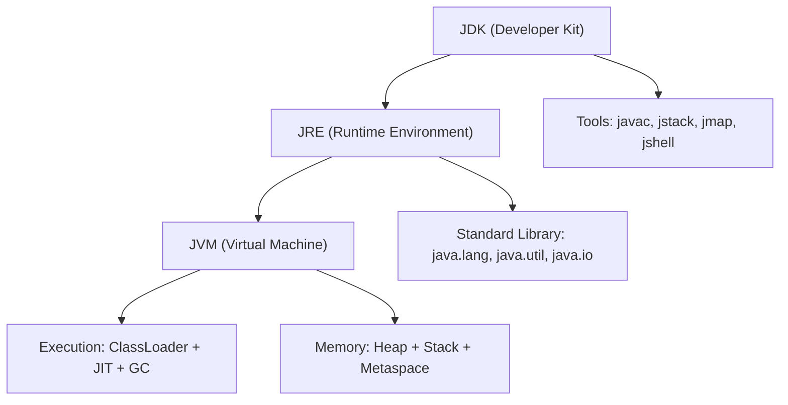

## Keywords in This File
{: .no_toc }

| # | Keyword | Weight |
|---|---|---|
| 1 | [Java Ecosystem Overview](#java-ecosystem-overview) | medium |
| 2 | [Java Platform Architecture](#java-platform-architecture) | high |
| 3 | [Java Compilation and Bytecode](#java-compilation-and-bytecode) | medium |
| 4 | [Java Version History and LTS](#java-version-history-and-lts) | medium |

---

# Java Ecosystem Overview

**Interview Weight:** medium - Asked as a warm-up to gauge whether
you understand the Java landscape before discussing any specific
feature. Signals engineering breadth.

---

### 🎯 Model Answer

**30 seconds:**

> Java is a general-purpose, object-oriented, platform-independent
> language. The ecosystem spans three concerns: the language itself
> (syntax and type system), the JVM (runtime executing bytecode on
> any OS), and the standard library plus tooling (Maven/Gradle,
> Spring, testing frameworks). Java's core value proposition is
> "write once, run anywhere" combined with a decades-deep library
> ecosystem and strong backward compatibility guarantees.

**3 minutes (Senior):**

> The Java ecosystem has three distinct layers. First, the language:
> statically typed, object-oriented with growing functional support
> (lambdas since Java 8, records and sealed classes since Java 14-17).
> Second, the JVM: a managed runtime that provides garbage collection,
> JIT compilation, and a portable execution model. You can run other
> languages on the JVM - Kotlin, Scala, Groovy - because bytecode
> is the common currency, not Java source.
>
> Third, the ecosystem: Maven Central hosts over half a million
> libraries. Spring dominates enterprise development. Build tools
> (Maven, Gradle) and CI pipelines (Jenkins, GitHub Actions) are
> standardized. Observability tools (JFR, Micrometer, OpenTelemetry)
> integrate at the JVM level.
>
> The non-obvious insight: Java's ecosystem is its moat. You are not
> choosing a language - you are choosing access to 30 years of
> battle-tested libraries, enterprise patterns, and operational
> tooling. This is why Java remains dominant in enterprise backends
> despite younger competitors.

**Framework:** WHAT (language) → WHY (write-once + ecosystem) →
HOW (JVM as intermediary) → TRADE-OFF (verbosity vs. stability)
→ EXAMPLE (Spring Boot in minutes from empty project)

*Adapting up:* Discuss ecosystem fragmentation risks, GraalVM
native image challenges, and Loom virtual threads changing the
async programming model.

*Adapting down:* Focus on "Java is compiled to bytecode, runs on
JVM, has a huge library ecosystem" - three sentences, three ideas.

**Blank Mind Recovery:**

**(1) Restate:** "You are asking about the Java ecosystem - let me
map out its major components."

**(2) First principles:** "Any programming ecosystem needs a runtime,
a language spec, libraries, and tooling. For Java these are..."

**(3) Bridge:** "This is similar to how the Python ecosystem works
- language plus runtime plus pip packages - except Java's JVM is
more central because bytecode portability was a design goal."

---

### 📘 Concept Explanation

**What it is:**

The Java ecosystem is the combination of the Java programming
language, the Java Virtual Machine (JVM), the Java standard
library (JDK), and the broader third-party tool and library
ecosystem built around them.

**The problem it solves:**

Before managed runtimes like Java, distributing software meant
compiling for each target OS and architecture separately. Memory
management was manual (C, C++), leading to buffer overflows and
memory leaks. The Java ecosystem solved platform portability
(compile once, run everywhere), memory safety (GC), and developer
productivity (rich standard library).

**How it works:**

```
  Java Source (.java)
         |
    javac compiler
         |
    Bytecode (.class)
         |
  JVM (per-platform)
    |           |
  JIT     Interpreter
         |
  Native Machine Code
```

The developer writes `.java` files. `javac` compiles them to
platform-neutral `.class` bytecode. Any JVM - on Windows, Linux,
macOS, cloud VMs - can execute this bytecode. The JVM JIT-compiles
hot paths to native code at runtime for performance.

**The key insight:**

The JVM is the abstraction boundary. Java (the language) and the
JVM are separate. You can write Kotlin, Scala, or Groovy and still
benefit from the JVM's GC, JIT, and tooling. The library ecosystem
(Maven, Gradle) works identically for all JVM languages. Choosing
"Java" often means choosing the JVM ecosystem, not just the language.

**When to use it:**

- Enterprise backend services requiring long-term maintainability
- Systems needing rich library ecosystem (Spring, Hibernate, Kafka clients)
- Teams valuing static typing and refactoring tooling
- Any greenfield Java-adjacent microservice in an existing Java shop

**When NOT to use it:**

- Startup time is critical (GraalVM native helps, but JVM warm-up is real)
- Memory footprint must be minimal (JVM overhead vs. Go/Rust)
- Scripting and automation (Python wins on brevity)
- Systems programming requiring manual memory control (C/Rust)

**Alternatives:**

- Kotlin - JVM language, more concise, full Java interop
- Go - simpler runtime, faster startup, no JVM overhead
- Python - faster prototyping, weaker type safety

**First-principles derivation:**

Given the constraint "software should run on any OS without
recompilation," you need either: a universal binary format (fat
binary) or an interpreted intermediate format. Fat binaries are
huge. An intermediate format needs a runtime to execute it. That
runtime needs memory management, thread scheduling, and JIT
compilation to be practical. Java's JVM is the necessary solution
to these constraints.

---

### 💻 Code Example

**Example 1: Ecosystem entry point - Hello World to production**

```java
// Minimal production-ready Spring Boot application
// Shows the ecosystem at work: build tool + framework + JVM

// pom.xml dependency (Maven ecosystem)
// <dependency>
//   <groupId>org.springframework.boot</groupId>
//   <artifactId>spring-boot-starter-web</artifactId>
// </dependency>

@SpringBootApplication
public class DemoApp {
    public static void main(String[] args) {
        SpringApplication.run(DemoApp.class, args);
    }
}

@RestController
class HelloController {
    @GetMapping("/hello")
    String hello() {
        return "Hello from the Java ecosystem";
    }
}
```

> **Code walkthrough:** This shows the Java ecosystem in three layers:
> Maven handles the dependency (Spring Boot starter) from Maven
> Central. Spring Boot's `@SpringBootApplication` wires the embedded
> Tomcat server, classpath scanning, and auto-configuration. The JVM
> runs the bytecode. In under 20 lines and one Maven dependency, you
> have a production-deployable HTTP service - this is the ecosystem
> value proposition.

**Example 2: JVM language interop (Kotlin on JVM)**

```kotlin
// Kotlin compiles to JVM bytecode - can call Java libraries
// directly. The ecosystem (Spring, Hibernate) works identically.
fun main() {
    val list = listOf("Java", "Kotlin", "Scala")  // java.util.List
    list.forEach { println(it) }  // java.util.Iterator under the hood
}
```

> **Code walkthrough:** Kotlin source compiles to `.class` bytecode.
> `listOf()` returns a `java.util.List`. `forEach` uses the Java
> Iterator contract. The JVM sees no difference between Kotlin and
> Java bytecode - this is why the JVM ecosystem is language-neutral.

---

### 🎓 Answers by Seniority

**Junior / Mid (0-5 years):**

> Java is a statically typed, OOP language that runs on the JVM.
> The JVM handles memory management and lets Java code run on any
> OS. The ecosystem includes the standard library, frameworks like
> Spring, and build tools like Maven and Gradle.

*Push deeper:* Explain the JVM bytecode model and why it enables
"write once, run anywhere."

---

**Senior / Staff (5+ years):**

> The Java ecosystem is three things: the language, the JVM runtime,
> and 30 years of library investment. The JVM is the key abstraction
> - it enables Kotlin, Scala, and Groovy to share the same tooling
> and libraries. At scale, you care about JVM startup time (Loom
> and GraalVM address this), GC tuning for low-latency services,
> and the module system for large codebases.

*Push deeper:* Discuss GraalVM native image trade-offs, AOT vs.
JIT compilation, and how Project Loom changes the concurrency model.

---

### ❓ Questions You Will Be Asked

#### Definition

- "What is Java?"
- "What makes Java different from C++ or Python?"

🗣️ "Java is a statically typed, object-oriented language that
compiles to bytecode and runs on the JVM. Unlike C++, memory is
managed by the GC. Unlike Python, it is compiled and statically
typed. Its key differentiator is the JVM ecosystem - 30 years
of battle-tested libraries and tooling that run on any platform."

#### Mechanism

- "How does Java achieve platform independence?"
- "What is the role of the JVM?"

🗣️ "Java achieves platform independence through the JVM abstraction
layer. The compiler produces bytecode - a platform-neutral
instruction set. Each OS has its own JVM implementation that
translates bytecode to native instructions at runtime. The JVM
also handles GC, thread scheduling, and JIT compilation of hot
paths to native code."

#### Comparison

- "Java vs Kotlin - when would you choose one over the other?"
- "Java vs Go for microservices?"

🗣️ "I would choose Kotlin over Java for new JVM services today -
it is more expressive, has null safety built in, and coroutines
simplify async code. I keep Java for teams already fluent in it
or when tooling maturity matters. Go wins over Java when startup
time and memory footprint matter - serverless functions, CLI tools.
Java wins when you need the library ecosystem depth."

| Interviewer Type | Emphasis |
|---|---|
| Technical Panel  | Lead with JVM bytecode model. Use precise terminology. |
| Hiring Manager   | Lead with ecosystem value - time to production, library depth. |
| Bar Raiser       | Lead with trade-offs - startup time, GC overhead, verbosity. |
| Peer Engineer    | "The thing I keep returning to is the JVM as neutral substrate..." |

---

---

# Java Platform Architecture

**Interview Weight:** high - Asked at every level. Interviewers
use this to gate more detailed questions about GC, class loading,
and performance. A wrong answer here signals foundational gaps.

---

### 🎯 Model Answer

**30 seconds:**

> The Java platform has three main components. JDK (Java Development
> Kit) = compiler + JRE + tools for developers. JRE (Java Runtime
> Environment) = JVM + standard library for running Java programs.
> JVM (Java Virtual Machine) = the engine that loads bytecode,
> manages memory (heap, stack, metaspace), runs the GC, and JIT-
> compiles hot code to native instructions.

**3 minutes (Senior):**

> The platform layers from bottom to top: the JVM is the execution
> engine - it manages memory areas (heap for objects, stack per
> thread for frames, metaspace for class metadata), runs the garbage
> collector, and has a JIT compiler that progressively optimizes
> hot code (C1 for quick compilation, C2 for deep optimization).
>
> Above the JVM is the JRE - the JVM plus the standard library
> (java.lang, java.util, java.io, java.nio, java.util.concurrent).
> The JDK adds developer tooling: javac (compiler), javap
> (bytecode disassembler), jstack (thread dumps), jmap (heap dumps),
> jcmd (unified diagnostic commands), and jshell (REPL since Java 9).
>
> Since Java 9, the module system (JPMS) layers above the JDK. The
> standard library is split into named modules (java.base,
> java.sql, java.desktop). Applications can create custom runtime
> images using jlink, including only the modules they need - enabling
> smaller container images.

**Framework:** JVM (engine) → JRE (JVM + stdlib) →
JDK (JRE + tools) → JPMS (modules on top)

*Adapting up:* Discuss JVM ergonomics (heap sizing heuristics),
class data sharing, container awareness (JVM in Docker), and
GraalVM as an alternative JVM with AOT compilation.

*Adapting down:* JVM runs Java, JDK is the developer kit, JRE is
the runtime. Three-word answer: compiler, runtime, libraries.

**Blank Mind Recovery:**

**(1) Restate:** "You are asking about JDK vs JRE vs JVM - let me
map the hierarchy."

**(2) First principles:** "Any platform needs: a compiler to
translate source to machine instructions, a runtime to execute
them, and a library to avoid reinventing common operations."

**(3) Bridge:** "This is like asking about Python: CPython is the
interpreter (JVM), the Python stdlib is the standard library (JRE
minus the JVM), and PyPI tooling is the developer toolchain (JDK)."

---

### 📘 Concept Explanation

**What it is:**

The Java platform is a layered software stack: JDK contains JRE
contains JVM. The JVM is the core execution engine; the JRE adds
the standard library; the JDK adds developer tools.

**The problem it solves:**

Separating concerns: execution (JVM), runtime API (JRE), and
development tools (JDK). Deployment servers only need the JRE
(smaller footprint). Developers need the JDK. Since Java 11, the
JDK bundles the JRE - the separation is now logical rather than
as two separate install packages.

**How it works:**

```
  ┌─────────────────────────────────────┐
  │  JDK                                │
  │  javac  javap  jstack  jmap  jshell │
  │  ┌───────────────────────────────┐  │
  │  │  JRE                          │  │
  │  │  java.lang  java.util  java.io│  │
  │  │  ┌─────────────────────────┐  │  │
  │  │  │  JVM                    │  │  │
  │  │  │  Class Loader           │  │  │
  │  │  │  Execution Engine (JIT) │  │  │
  │  │  │  GC  Heap  Stack  Meta  │  │  │
  │  │  └─────────────────────────┘  │  │
  │  └───────────────────────────────┘  │
  └─────────────────────────────────────┘
```



> **Diagram walkthrough:** The JDK wraps the JRE and adds developer
> tooling. The JRE wraps the JVM and adds the standard library.
> The JVM provides the actual execution engine: class loading, JIT
> compilation, GC, and memory management. This layering means a
> production server only needs JRE (or modern JDK with JRE bundled),
> not the full developer toolchain.

**The key insight:**

The JVM is the contract. The JDK (OpenJDK, Temurin, Corretto,
Zulu) can be swapped without changing application behavior.
Organizations run Amazon Corretto in production and Eclipse Temurin
in development - both are JVM implementations conforming to the
same spec. The portability is at the JVM spec level, not the
vendor level.

**When to use it:**

This is not a "choose" scenario - it is a "know" requirement.
For deployment: use a JRE-equivalent or JDK (since Java 11 the
distinction is minimal). For custom lightweight containers: use
`jlink` to create a minimal JRE with only the modules you need.

**When NOT to use it:**

Native image (GraalVM AOT) produces a binary without a running
JVM - faster startup, lower memory, but loses JIT optimization
and reflection flexibility. Choose when startup time and
container density matter more than peak throughput.

**Alternatives:**

- GraalVM - polyglot JVM with AOT native image capability
- OpenJ9 - IBM JVM, better memory footprint in cloud
- Standard OpenJDK (Temurin/Corretto) - production default

**First-principles derivation:**

A compiled language needs: (1) a compiler to translate source to
executable form, (2) a runtime to support GC and thread management,
(3) a standard library for I/O, collections, and networking. The
JDK/JRE/JVM split is the natural decomposition of these three
concerns - each layer adds exactly what its users need.

---

### 💻 Code Example

**Example 1: JVM memory areas in practice (BAD vs GOOD)**

```java
// BAD: Not understanding stack vs heap causes confusion
// This code "leaks" in the sense that the developer thinks
// the object is gone after the method returns

void badPattern() {
    // Developer thinks: "local variable, goes away after method"
    // Reality: the String object is on the HEAP; only the
    // REFERENCE is on the stack frame. String lives until GC.
    String heavy = buildLargeString();
    process(heavy);
    // heavy reference is gone (stack frame popped)
    // But the String object stays on heap until GC collects it
    // If buildLargeString() is called in a tight loop, you
    // generate GC pressure even though "the variable is gone"
}

// GOOD: Understanding the model to reason about GC pressure
void goodPattern() {
    // If you need the reference to be eligible for GC sooner:
    String heavy = buildLargeString();
    process(heavy);
    heavy = null;  // Makes object unreachable sooner
    // However: modern GC and JIT are smart enough that this
    // explicit null is usually unnecessary. The key insight is
    // understanding WHY it could matter in tight loops.
}
```

> **Code walkthrough:** Stack frames hold local variable references;
> heap holds objects. Setting `heavy = null` makes the object
> unreachable sooner, allowing the GC to collect it before the
> method returns - relevant in tight loops generating GC pressure.
> Modern JVMs often optimize this automatically, but knowing the
> model matters when debugging GC pauses.

**Example 2: Using JDK diagnostic tools**

```bash
# Production JVM diagnostic workflow
# These are JDK tools - not available in JRE-only installs

# Check JVM flags active in a running process
jcmd <pid> VM.flags

# Get thread dump (diagnose deadlocks, high CPU)
jstack <pid>

# Generate heap dump (diagnose OOM, memory leaks)
jmap -dump:format=b,file=heap.hprof <pid>

# Start Flight Recorder (low-overhead production profiling)
jcmd <pid> JFR.start duration=60s filename=recording.jfr

# Print all loaded classes (diagnose classloader issues)
jcmd <pid> VM.class_hierarchy | grep MyClass
```

> **Code walkthrough:** These `jcmd` and `jstack` commands are part
> of the JDK (not JRE) and represent the operational layer of the
> platform. In production, a senior engineer's first response to a
> CPU spike is `jstack`; to a memory leak is `jmap`. Knowing these
> tools signals you have operated Java in production, not just
> written Java code.

---

### 🎓 Answers by Seniority

**Junior / Mid (0-5 years):**

> JDK is the developer kit - it includes the compiler and tools.
> JRE is the runtime - what you need to run Java programs. JVM is
> the virtual machine inside the JRE that actually executes the
> bytecode. Since Java 11, the JDK bundles the JRE, so you just
> install the JDK.

*Push deeper:* The JVM manages memory in areas: heap for objects,
stack per thread for method frames, metaspace for class metadata.

---

**Senior / Staff (5+ years):**

> The JVM provides four things: class loading (bootstrap, platform,
> app classloaders), execution (JIT with C1/C2 tiers), memory
> management (GC: G1 default since Java 9, ZGC/Shenandoah for
> low-latency), and monitoring (JFR built-in since Java 11). In
> containers, JVM ergonomics (heap sizing, GC thread count) became
> container-aware in Java 10+ - before that, JVM would see host
> machine RAM, not container limits.

*Push deeper:* Class data sharing (CDS) reduces startup time by
pre-loading class metadata. GraalVM AOT eliminates the JVM entirely
for use cases where startup time and memory are critical.

---

### ❓ Questions You Will Be Asked

#### Definition

- "What is the JVM?"
- "What is the difference between JDK, JRE, and JVM?"

🗣️ "JDK is the developer kit: compiler plus tools plus JRE. JRE
is the runtime: JVM plus standard library. JVM is the execution
engine: loads bytecode, manages heap and stack memory, runs the
GC, and JIT-compiles hot code to native instructions. In practice
since Java 11, you just install the JDK - the separation between
JDK and JRE is now mostly historical."

#### Mechanism

- "What happens when you run `java MyApp`?"
- "How does the JVM start up?"

🗣️ "Running `java MyApp` triggers: (1) JVM initialization - memory
areas allocated (heap sized by ergonomics or -Xmx), GC initialized,
JIT compiler threads started. (2) Class loading - bootstrap
classloader loads java.lang, then platform classloader loads
java.se modules, then app classloader loads your classpath. (3)
Main method invoked in a new thread. (4) Execution proceeds with
the interpreter for cold code; JIT monitors call counts and
compiles hot methods to native - C1 at tier 3, C2 at tier 4."

#### Comparison

- "JVM vs native (GraalVM native image) - when to choose each?"

🗣️ "JVM wins on throughput for long-running services - the JIT
has time to deeply optimize hot paths, reaching near-native speed.
GraalVM native image wins on startup time (sub-millisecond vs
JVM's 100ms-2s) and memory footprint (3-10x lower). I choose JVM
for stateful services running 24/7 where peak throughput matters.
I choose native image for functions-as-a-service, CLIs, or
containers where startup and density matter more."

| Interviewer Type | Emphasis |
|---|---|
| Technical Panel  | JVM memory areas, GC, classloader hierarchy. |
| Hiring Manager   | Deployment implications, container sizing. |
| Bar Raiser       | JIT tiers, GraalVM trade-offs, module system. |
| Peer Engineer    | "The part that surprises most people is container heap sizing..." |

---

---

# Java Compilation and Bytecode

**Interview Weight:** medium - Appears when interviewers want to
confirm you understand what actually runs vs. what you write.
Prerequisite for questions about JIT, reflection, and serialization.

---

### 🎯 Model Answer

**30 seconds:**

> Java source files are compiled by `javac` into bytecode - a
> platform-neutral instruction set stored in `.class` files. Bytecode
> is not native machine code; it is an intermediate format for the
> JVM. The JVM interprets bytecode and JIT-compiles hot methods to
> native code at runtime. This is why Java is "compiled" (unlike
> Python) but also portable (unlike C).

**3 minutes (Senior):**

> The compilation pipeline has two stages. First, `javac` compiles
> `.java` source to `.class` bytecode. Bytecode uses a stack-based
> instruction set (not register-based like x86). Key bytecode
> instructions include `invokevirtual`, `invokestatic`,
> `invokedynamic` (used by lambdas), `checkcast`, and
> `getfield`/`putfield`.
>
> At runtime, the JVM's execution engine interprets bytecode
> initially. The JIT compiler monitors method invocation counts.
> After a threshold (C1 at ~2,000 invocations, C2 at ~10,000),
> the method is compiled to native code - with profile-guided
> optimization using the interpreted execution data. This is why
> JVM services need a warm-up period before reaching peak
> throughput.
>
> Bytecode can also be inspected with `javap -c ClassName`. This
> is useful for debugging unexpected behavior (verifying that a
> lambda is compiled to invokedynamic), understanding reflection
> costs, and diagnosing serialization compatibility issues.

**Framework:** SOURCE (.java) → BYTECODE (.class, javac) →
JIT NATIVE (at runtime, JVM) → PERFORMANCE (after warm-up)

**Blank Mind Recovery:**

**(1) Restate:** "You are asking about what happens between writing
Java and running it - the compilation pipeline."

**(2) First principles:** "Any compiled language needs a compilation
step that converts human-readable source to something the machine
can execute. Java adds an intermediate step - bytecode - to achieve
portability."

**(3) Bridge:** "This is similar to Python bytecode (.pyc files)
except Java's bytecode is more explicit and strictly typed, and the
JVM JIT-compiles it to native code for performance."

---

### 📘 Concept Explanation

**What it is:**

Java bytecode is a compact, stack-based instruction set that is
the output of `javac` and the input to the JVM. It is platform-
neutral - the same `.class` file runs on any JVM implementation.

**The problem it solves:**

Before bytecode, portable code meant interpreted code (slow) or
native code (not portable). Bytecode is a middle ground: it can
be shipped and deployed without recompilation, then JIT-compiled
to native code on the target platform for near-native performance.

**How it works:**

```
  Java Source        Bytecode         Native Code
  ----------         --------         -----------
  int x = 5;  javac  iconst_5   JIT   mov eax, 5
  int y = x+3  -->   istore_1   -->   add eax, 3
  return y           iload_1          ret
                     iconst_3
                     iadd
                     ireturn
```

The bytecode is a virtual stack machine. The JVM maintains an
operand stack and local variable array per frame. Instructions
push/pop values on the operand stack or load/store from local
variable slots. The JIT compiler translates this to register-based
native instructions, applying optimizations like inlining, loop
unrolling, and escape analysis.

**The key insight:**

`invokedynamic` (Java 7, heavily used since Java 8 for lambdas)
allows the JVM to defer method dispatch decisions to runtime -
enabling lambda expressions, method references, and string
concatenation to be compiled to efficient native patterns without
encoding the implementation strategy in the bytecode.

**When to use it:**

You never "use" bytecode directly - `javac` generates it. You
inspect bytecode (with `javap`) when debugging:
- Verifying that a lambda compiled to the expected invokedynamic
- Checking if a method is inlined by the JIT
- Diagnosing serialization compatibility (serialVersionUID)
- Understanding why a `ClassCastException` occurs at runtime

**When NOT to use it:**

Bytecode manipulation (ASM, CGLIB, Byte Buddy) is powerful but
complex. Use it in framework development (Spring proxies, JPA),
never in application code. Prefer standard language features.

**Alternatives:**

- AOT compilation (GraalVM native-image) - skips JIT, produces
  native binary directly
- Kotlin/Scala - compile to the same bytecode; compatible with
  same JVM and tooling

**First-principles derivation:**

Given the goal "run on any OS without recompilation," you need
an intermediate representation that is (a) richer than assembly
(portable), (b) faster to execute than source text (compiled), and
(c) optimizable at runtime (JIT). Bytecode satisfies all three.
The stack-based design minimizes the instruction set size - each
JVM instruction is 1 byte (hence "byte"-code), enabling compact
`.class` files.

---

### 💻 Code Example

**Example 1: Inspecting bytecode with javap**

```bash
# Compile a simple class
javac Hello.java

# Disassemble bytecode (show instructions)
javap -c Hello

# Sample javap output for:
#   public int add(int a, int b) { return a + b; }
#
# public int add(int, int);
#   Code:
#      0: iload_1       // push local var 1 (param a) onto stack
#      1: iload_2       // push local var 2 (param b) onto stack
#      2: iadd          // pop two ints, push their sum
#      3: ireturn       // return top of stack as int

# Show full constant pool and signatures
javap -verbose Hello
```

> **Code walkthrough:** `javap -c` reveals the bytecode instructions
> for each method. The operand stack model is visible: each `iload`
> pushes an integer from a local slot, `iadd` pops two and pushes
> the sum. This knowledge helps when debugging JIT behavior,
> understanding decompiler output, or diagnosing why reflection
> sees different method signatures than source code suggests.

**Example 2: Lambda bytecode - invokedynamic**

```java
// BAD understanding: thinking lambda creates an anonymous class
// at compile time
Runnable r = () -> System.out.println("hello");

// What actually happens: javac emits invokedynamic instruction
// The JVM resolves this at runtime to a generated implementation
// javap -verbose shows:
//   invokedynamic #0, 0  // InvokeDynamic #0:run:(...)Ljava/lang/Runnable;
// 
// GOOD understanding: lambda is an invokedynamic call site
// The JVM creates a Runnable implementation lazily at runtime
// This allows the JVM to optimize (often just a function pointer,
// not a full object allocation - depends on capture)

// Lambdas that don't capture anything are allocated ONCE (singleton)
Runnable stateless = () -> System.out.println("no capture");

// Lambdas that capture variables allocate a new instance per call
int x = 42;
Runnable capturing = () -> System.out.println(x);
// Each call to this code creates a new Runnable instance
```

> **Code walkthrough:** The BAD pattern assumes lambdas are
> syntactic sugar for anonymous classes. The GOOD understanding:
> `javac` emits `invokedynamic` which the JVM resolves at runtime.
> Non-capturing lambdas become singleton instances (no allocation);
> capturing lambdas allocate per-call. This distinction matters
> in hot loops where captured lambdas in a stream pipeline can
> generate significant GC pressure.

---

### 🎓 Answers by Seniority

**Junior / Mid (0-5 years):**

> `javac` compiles Java source into bytecode stored in `.class`
> files. Bytecode is not native machine code - it is a portable
> intermediate format. The JVM executes bytecode, and the JIT
> compiler converts hot methods to native code for performance.

*Push deeper:* Bytecode can be inspected with `javap -c` to see
the actual stack-machine instructions for any method.

---

**Senior / Staff (5+ years):**

> The bytecode model has practical implications I care about in
> production. JIT warm-up means new JVM instances have reduced
> throughput for the first few minutes - relevant for canary
> deployments and rolling restarts. `invokedynamic` for lambdas
> means lambda allocation behavior is JVM-version-dependent.
> `javap -c` is my first tool when a decompiled class behaves
> unexpectedly. And bytecode manipulation (Byte Buddy, ASM) is how
> Spring generates proxies - understanding this helps when
> debugging `@Transactional` method call issues.

*Push deeper:* JIT compilation tiers (C1/C2), profile-guided
optimization, OSR (on-stack replacement), and how GraalVM's Graal
compiler replaces C2.

---

### ❓ Questions You Will Be Asked

#### Definition

- "What is Java bytecode?"
- "What does `javac` produce?"

🗣️ "Java bytecode is the intermediate representation produced by
`javac`. It is stored in `.class` files and is a stack-based
instruction set understood by any JVM. It is not native machine
code - the JVM interprets or JIT-compiles it to native instructions
at runtime. The bytecode format is platform-neutral: the same
`.class` file runs on Linux, Windows, and macOS without changes."

#### Mechanism

- "How does JIT compilation work?"
- "Why does a Java service need warm-up time?"

🗣️ "JIT compilation is tiered. When a method is first called, the
JVM interprets it. After about 2,000 calls, the C1 JIT compiles
it to native code with basic optimizations. After about 10,000
calls, the C2 JIT recompiles with aggressive optimizations using
profile data collected during interpretation. The C2 compilation
can inline hot callees, eliminate dead branches, and apply loop
optimizations. This is why JVM services need warm-up - the first
few thousand calls per hot path are slower than steady-state."

#### Comparison

- "AOT vs JIT - trade-offs?"

🗣️ "JIT wins on peak throughput for long-running services: it
profiles execution, inlines hot callees, and specializes code for
the actual data being processed. AOT (GraalVM native image) wins
on startup time (milliseconds vs JVM's 100ms-2s) and memory (often
3-10x less). JIT also handles reflection and dynamic class loading
naturally; AOT requires upfront configuration to support these.
I choose JIT for services running 24/7. I choose AOT for CLIs,
serverless functions, and container-dense deployments."

| Interviewer Type | Emphasis |
|---|---|
| Technical Panel  | Bytecode instructions, invokedynamic, JIT tiers. |
| Hiring Manager   | Startup time implications, container sizing. |
| Bar Raiser       | JIT tiering, AOT trade-offs, GraalVM constraints. |
| Peer Engineer    | "The part that surprises people is how lambdas behave in hot loops..." |

---

---

# Java Version History and LTS

**Interview Weight:** medium - Tests whether you track the Java
evolution and understand which versions matter in production.
Signals awareness of language direction and LTS support planning.

---

### 🎯 Model Answer

**30 seconds:**

> Java releases every 6 months (since Java 9). Long-Term Support
> releases get 8+ years of updates: Java 8 (2014), Java 11 (2018),
> Java 17 (2021), Java 21 (2023) are the key LTS versions. Most
> production systems run on an LTS release. Java 8 introduced
> lambdas and streams. Java 11 added HTTP client and TLS 1.3.
> Java 17 added sealed classes and pattern matching preview.
> Java 21 made virtual threads (Project Loom) production-ready.

**3 minutes (Senior):**

> Before Java 9, Java had long, irregular release cycles (Java 6
> in 2006, Java 7 in 2011, Java 8 in 2014). Since Java 9 (2017),
> Oracle adopted a strict 6-month cadence. Every 3 years, one
> release is designated LTS. LTS versions get extended updates -
> Java 8 was supported until 2030 by Oracle; Java 11, 17, and 21
> have similar trajectories.
>
> Key language changes by version:
> - Java 8 (2014, LTS): Lambdas, streams, Optional, default methods,
>   new Date/Time API (java.time), method references
> - Java 9 (2017): Module system (JPMS), jshell REPL, jlink
> - Java 10 (2018): `var` local variable type inference
> - Java 11 (2018, LTS): HTTP Client (standard), local var in lambdas
> - Java 14 (2020): Switch expressions (standard), helpful NPE messages
> - Java 15 (2020): Text blocks (standard)
> - Java 16 (2021): Records (standard), pattern matching instanceof
> - Java 17 (2021, LTS): Sealed classes, strong encapsulation of JDK internals
> - Java 21 (2023, LTS): Virtual threads (Loom), sequenced collections,
>   record patterns, pattern matching for switch
>
> The migration from Java 8 to Java 11+ is the most significant
> pain point teams encounter: the module system's strong
> encapsulation breaks frameworks that used internal JDK APIs
> (sun.misc.Unsafe, etc.), and the removal of the JRE as a separate
> download changed deployment packaging.

**Framework:** CADENCE (6-month) → LTS (every 3 years) →
KEY VERSIONS (8, 11, 17, 21) → MIGRATION RISKS (8→11+)

**Blank Mind Recovery:**

**(1) Restate:** "You are asking about the Java release cadence
and which versions matter for production."

**(2) First principles:** "Any language needs a versioning strategy
that balances new features against stability. Java chose LTS as
the stability anchor with fast releases for early adopters."

**(3) Bridge:** "This is similar to Ubuntu LTS - frequent releases
for experimentation, LTS for production. Java 8 is like Ubuntu
16.04 - very widely deployed, long past theoretical EOL, but
still alive in many enterprises."

---

### 📘 Concept Explanation

**What it is:**

Java's versioning scheme since Java 9: a new release every 6
months (March, September), with LTS designations every 3 years.
LTS versions receive security and bug fixes for 8+ years; non-LTS
versions only for 6 months.

**The problem it solves:**

The old model (long release cycles) caused feature accumulation
debt - Java 7 to Java 8 took 3 years. The 6-month cadence allows
features to ship in preview (available but not final), gather
feedback, and graduate to standard across multiple releases.
This reduces the risk of language design mistakes.

**How it works:**

```
  2014    2017  2018  2021    2023
    |       |     |     |       |
  Java 8  Java 9 Java 11 Java 17 Java 21
  (LTS)  (JPMS)  (LTS) (LTS)   (LTS)
    |           |           |
  Lambdas  HTTP Client  Virtual Threads
  Streams  TLS 1.3      Loom GA
  java.time var          Seq. Collections
```

LTS releases get Oracle Premier support for 5 years and Extended
support for 3 more. OpenJDK providers (Adoptium/Temurin,
Amazon Corretto, Azul Zulu) often provide free LTS support for
longer periods.

**The key insight:**

The LTS concept is the actual production decision driver. Most
enterprise Java shops standardize on an LTS version and upgrade
to the next LTS on a 2-3 year cycle. The 6-month releases are
valuable for testing upcoming features in non-production. The
preview mechanism (--enable-preview) lets teams experiment with
features before they finalize their design.

**When to use it:**

- New projects: target the latest LTS (Java 21 as of 2024)
- Existing projects on Java 8: migrate to Java 17 or 21 (8 to
  11 migration solves JPMS compatibility; 17+ adds modern features)
- Non-LTS: only for teams that actively test each release

**When NOT to use it:**

Non-LTS releases in production unless your team commits to
upgrading every 6 months. Java 8 in new projects - the API
improvements in Java 11+ (HTTP client, improved streams, records)
and performance improvements in newer GC algorithms are worth
the migration effort.

**First-principles derivation:**

Fast release cycles reduce release risk per version. LTS provides
the stability enterprise teams need without forcing everyone to
upgrade every 6 months. The preview mechanism decouples language
design (iterative) from production stability (conservative). This
is the optimal strategy for a language serving both innovation-
focused and stability-focused users simultaneously.

---

### 💻 Code Example

**Example 1: Using modern Java features across versions**

```java
// Java 8 → Java 21: progressive feature adoption

// Java 8: Lambda + Stream (BASELINE - most teams are here or above)
List<String> names = List.of("Alice", "Bob", "Charlie");
names.stream()
     .filter(n -> n.startsWith("A"))
     .forEach(System.out::println);

// Java 10: var reduces boilerplate (local inference only)
var filtered = names.stream()
                    .filter(n -> n.length() > 3)
                    .toList();  // Java 16: toList() vs collect()

// Java 16: Records - immutable data carriers
record Point(int x, int y) {}  // No boilerplate equals/hashCode/toString

// Java 17: Sealed classes - exhaustive type hierarchies
sealed interface Shape permits Circle, Rectangle, Triangle {}
record Circle(double radius) implements Shape {}
record Rectangle(double w, double h) implements Shape {}

// Java 21: Pattern matching for switch (final standard)
double area(Shape s) {
    return switch (s) {
        case Circle c    -> Math.PI * c.radius() * c.radius();
        case Rectangle r -> r.w() * r.h();
        case Triangle t  -> 0.5 * t.base() * t.height();
    };
}

// Java 21: Virtual threads - change the concurrency model
try (var executor = Executors.newVirtualThreadPerTaskExecutor()) {
    for (int i = 0; i < 100_000; i++) {
        executor.submit(() -> {
            Thread.sleep(Duration.ofMillis(100));
            return "done";
        });
    }
}
// 100,000 concurrent virtual threads without OOM
```

> **Code walkthrough:** Each version adds a focused language feature.
> Java 8 lambdas and streams remain the most impactful - they
> fundamentally changed idiomatic Java. Java 16 records eliminate
> the DTO boilerplate that made Java feel verbose. Java 17 sealed
> classes enable safe algebraic data types. Java 21 virtual threads
> remove the thread-per-request bottleneck without requiring async
> programming. Knowing which feature came in which version shows
> deliberate versioning awareness.

**Example 2: Checking current Java version in code and build**

```java
// Programmatically check version at runtime
int major = Runtime.version().feature();
// Java 21 → 21, Java 17 → 17, Java 11 → 11

if (major < 17) {
    logger.warn("Running on Java {} - upgrade to 17+ recommended",
                major);
}

// In Maven pom.xml: enforce Java 17+
// <properties>
//   <maven.compiler.source>17</maven.compiler.source>
//   <maven.compiler.target>17</maven.compiler.target>
//   <maven.compiler.release>17</maven.compiler.release>
// </properties>

// In Gradle build.gradle:
// java {
//   sourceCompatibility = JavaVersion.VERSION_17
//   targetCompatibility = JavaVersion.VERSION_17
// }
```

> **Code walkthrough:** `Runtime.version().feature()` is the modern
> API (Java 9+) for programmatic version detection. In build files,
> `--release 17` (via `maven.compiler.release`) is stricter than
> `source`/`target` because it enforces the API surface of the
> target version - preventing accidental use of APIs added after
> Java 17 while targeting Java 17.

---

### 🎓 Answers by Seniority

**Junior / Mid (0-5 years):**

> Java releases every 6 months. LTS releases (Java 8, 11, 17, 21)
> are the stable versions for production - they get years of
> security fixes. Java 8 added lambdas and streams. Java 17 added
> records and sealed classes. Java 21 made virtual threads standard.
> New projects should target Java 21.

*Push deeper:* Explain the difference between preview features
and standard features, and why LTS matters for enterprise support.

---

**Senior / Staff (5+ years):**

> I track Java versions primarily by their production impact. Java 8
> lambda/streams adoption is still ongoing in some enterprises. The
> Java 8 → 11 migration is the hardest because of JPMS encapsulation
> breaking reflective access (frameworks using sun.misc.Unsafe,
> illegal module access). Java 17 → 21 is cleaner. For new projects
> I target Java 21 because virtual threads change the threading
> model fundamentally - blocking I/O no longer requires large thread
> pools, which simplifies concurrency design for typical CRUD services.

*Push deeper:* Discuss Java's deprecation and removal policy
(not everything deprecated gets removed), the --add-opens
workaround for module access, and the GraalVM Native Image
compatibility matrix for Java features.

---

### ❓ Questions You Will Be Asked

#### Definition

- "What are the LTS versions of Java?"
- "What was introduced in Java 8?"

🗣️ "LTS versions are Java 8 (2014), Java 11 (2018), Java 17
(2021), and Java 21 (2023). Java 8 was the most transformative -
it introduced lambdas, streams, Optional, default interface
methods, and the new java.time API. These features fundamentally
changed idiomatic Java from verbose anonymous classes to concise
functional pipelines."

#### Mechanism

- "Why is upgrading from Java 8 to Java 11 hard?"

🗣️ "The primary pain is the Java Platform Module System (JPMS)
introduced in Java 9. Java 11 removed the ability to use internal
JDK APIs (in packages starting with sun. or com.sun.) without
explicit flags. Many frameworks (older versions of Spring, Hibernate,
CGLIB) used sun.misc.Unsafe and other internal APIs for reflection.
The migration requires either updating dependencies to module-aware
versions or adding --add-opens flags to expose internal packages
to the framework classpath. It is manageable but requires careful
dependency auditing."

#### Comparison

- "Java 8 vs Java 17 - should we migrate?"

🗣️ "Yes, and here is how I would justify it. Performance: G1GC
is the default since Java 9 and has significantly improved;
Java 17's ZGC offers sub-millisecond pauses for low-latency
services. Language: records replace 50-line DTOs with 1-line
declarations; sealed classes make domain modeling safer; text
blocks remove string escaping. Security: Java 8 reached Oracle
Premier support end-of-life in 2019; continuing on Java 8 means
paying for extended support or accepting security risk. I would
target Java 17 as a pragmatic step from Java 8 - it is the latest
LTS with wide framework support."

| Interviewer Type | Emphasis |
|---|---|
| Technical Panel  | LTS cadence, breaking changes, module system. |
| Hiring Manager   | Support lifecycle, migration risk, team readiness. |
| Bar Raiser       | Migration cost vs benefit, virtual thread implications. |
| Peer Engineer    | "The Java 8 to 11 migration took us three sprints because of..." |
