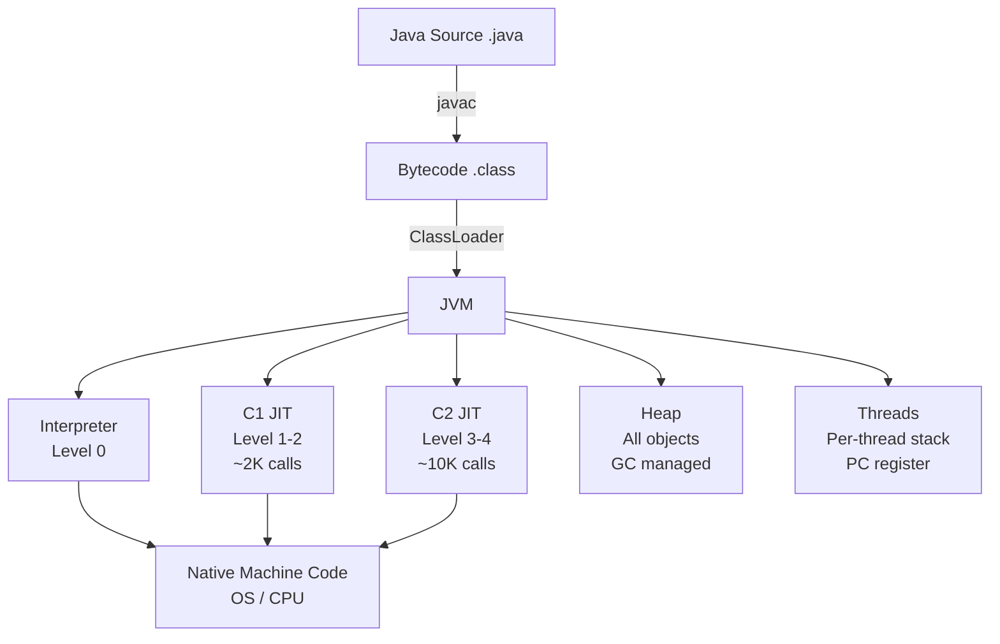
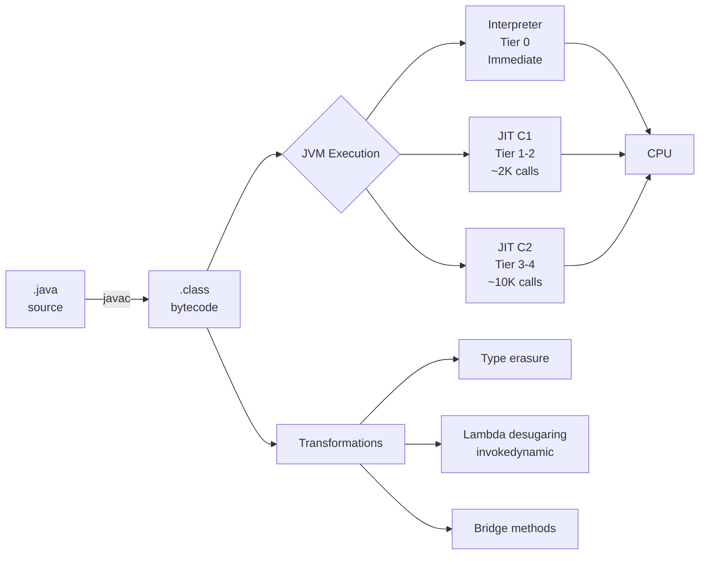

# Java Language - L0 Orientation

| # | Keyword | Difficulty |
| --- | --- | --- |
| 1 | [Java Ecosystem Overview](#java-ecosystem-overview) | ★☆☆ |
| 2 | [Java Platform Architecture](#java-platform-architecture) | ★☆☆ |
| 3 | [Java Compilation and Bytecode](#java-compilation-and-bytecode) | ★☆☆ |
| 4 | [Java Version History and LTS](#java-version-history-and-lts) | ★☆☆ |

---

# Java Ecosystem Overview

**Interview Weight:** medium - Common opening question for all Java roles.
Signals whether the candidate understands the full landscape or just
one framework.

---

### 🎯 Model Answer

**30 seconds:**

> Java is both a programming language and a platform. The language
> compiles to bytecode that runs on the Java Virtual Machine (JVM),
> which makes it platform-independent. The ecosystem includes the
> standard library (JDK), build tools (Maven, Gradle), a rich set of
> frameworks (Spring, Quarkus, Micronaut), and a large community of
> libraries. This write-once-run-anywhere model, combined with the
> mature ecosystem, is why Java dominates enterprise and backend
> development.

**3 minutes (Senior):**

> I think of Java as three concentric circles. The innermost is
> the language itself: a statically typed, object-oriented language
> with strong generics, lambdas, and modern features added since
> Java 8. The middle circle is the JVM platform: the engine that
> runs the bytecode, provides garbage collection, JIT compilation,
> and thread management. The outer circle is the ecosystem: Maven
> and Gradle for builds, JUnit and Mockito for testing, Spring
> and Quarkus for application frameworks, Hibernate and JPA for
> persistence, and thousands of libraries on Maven Central.
>
> The key ecosystem insight is that Java's longevity - over 30 years -
> means there is almost always a production-hardened library for any
> problem. The cost is ecosystem fragmentation: multiple competing
> frameworks with different trade-offs. A Java developer needs to
> understand not just the language but which framework combination
> is appropriate for the problem. Spring Boot is the default for
> enterprise services; Quarkus and Micronaut are better for
> cloud-native and container-based deployments where startup
> time and memory footprint matter.

**Blank Mind Recovery:**

**(1) Restate:** "You are asking about the Java ecosystem - let me
walk through the language, the platform, and the main tooling."

**(2) First principles:** "Java was designed to solve the
platform portability problem - write once, run anywhere.
That requires a common runtime (JVM) and a standard library
(JDK). Everything else builds on top of those."

**(3) Bridge:** "Think of it like a city: the JVM is the
infrastructure (roads, electricity), the JDK is the standard
buildings (post office, police station), and the frameworks
are the businesses that make the city useful."

---

### 📘 Concept Explanation

**What it is:**

The Java ecosystem is the collection of tools, libraries,
frameworks, and runtimes built around the Java programming
language and JVM. It spans from the core language through
application frameworks to deployment tooling.

**The problem it solves:**

Before Java (early 1990s), application developers wrote for
one OS. A C++ Windows application did not run on Unix. Java
solved this with the JVM: compile once to bytecode, run on
any JVM. The ecosystem built on top solves the common problems
every enterprise application faces: persistence, HTTP handling,
security, testing, and observability.

**How it works:**

```
JAVA ECOSYSTEM LAYERS:

Language (Java source .java)
  |
JDK (javac, javap, jshell, tools)
  |
Bytecode (.class files)
  |
JVM (interprets + JIT compiles bytecode)
  |
OS / Hardware

TOOLING LAYER:
  Build:  Maven / Gradle (dependency + build)
  Test:   JUnit 5 / Mockito / TestContainers
  Web:    Spring Boot / Quarkus / Micronaut
  Data:   Hibernate / JPA / JOOQ / Flyway
  Infra:  Docker / Kubernetes / Prometheus
```

**The key insight:**

The JVM is the foundation. Every Java framework, library, and
tool ultimately compiles to bytecode and runs on the JVM.
This means JVM-level concerns (GC, JIT, heap tuning) affect
all Java applications regardless of framework. A developer
who does not understand the JVM is debugging framework magic
without understanding the engine underneath.

**When to use it:**

- Enterprise backend services: Spring Boot is the industry
  default; large ecosystem, production-proven
- Cloud-native microservices: Quarkus or Micronaut for fast
  startup and low memory (better in containers)
- Data engineering: Spark (JVM), Kafka (JVM) - Java or Scala
- Android: Java/Kotlin for native apps

**When NOT to use it:**

- CLI utilities where startup latency is unacceptable:
  use Go or native executables (GraalVM native-image)
- Scripts and glue code: Python or Bash is simpler
- Frontend: JavaScript/TypeScript; Java does not run in browsers
  (GWT is long dead)

**Alternatives:**

- Kotlin: JVM language, 100% Java interop, modern syntax,
  preferred for Android
- Scala: JVM language, functional + OOP, dominates data
  engineering (Spark)
- Groovy: JVM scripting language, used in Gradle build scripts

**First-principles derivation:**

Enterprise software has these requirements: reliability, long
maintenance, talent availability, library ecosystem, OS independence.
No language satisfies all five better than Java at scale.
This explains why Java has dominated enterprise for 25+ years
despite newer languages. The ecosystem depth (libraries, tools,
documentation) creates a switching cost that only superior
productivity justifies overcoming.

---

### 💻 Code Example

**Example 1: Using core JDK tools**

```java
// Compile:
// javac HelloWorld.java -> produces HelloWorld.class

// Run:
// java HelloWorld -> JVM loads and runs bytecode

// Inspect bytecode:
// javap -c HelloWorld.class -> shows bytecode instructions

// Interactive shell (Java 9+):
// jshell
// jshell> System.out.println("Hello")
// Hello

// Check Java version:
// java -version
// openjdk version "21.0.1" 2023-10-17 LTS
```

> **Code walkthrough:** The JDK ships with the compiler (javac),
> the runtime (java), a bytecode inspector (javap), and jshell for
> interactive evaluation. javap -c shows the actual bytecode
> instructions that the JVM executes - useful for understanding
> what the compiler does with your source code. Every Java
> installation has these tools; knowing them signals production
> familiarity.

**Example 2: Maven dependency (ecosystem in practice)**

```java
// pom.xml: declare dependency on Spring Boot
// <dependency>
//   <groupId>org.springframework.boot</groupId>
//   <artifactId>spring-boot-starter-web</artifactId>
//   <version>3.2.0</version>
// </dependency>

// Maven downloads from Maven Central, manages the classpath
// This is how the ecosystem enables code reuse:
// one line adds HTTP server, DI container, autoconfiguration

@SpringBootApplication
public class Application {
    public static void main(String[] args) {
        SpringApplication.run(Application.class, args);
    }
}
// One annotation + one method = production HTTP server
// All powered by JVM underneath
```

> **Code walkthrough:** Maven Central hosts 500K+ libraries.
> A single pom.xml dependency declaration downloads the library,
> its transitive dependencies, and makes everything available
> on the classpath. Spring Boot's @SpringBootApplication is
> a composite annotation that enables component scanning,
> autoconfiguration, and application bootstrapping. The
> ecosystem hides boilerplate; knowing what's underneath
> (JVM, classpath, annotation processing) makes debugging
> possible when the magic breaks.

---

### 🎓 Answers by Seniority

**Junior / Mid (0-5 years):**

> Java is a statically typed OOP language that runs on the JVM.
> The JVM makes it platform-independent - compile once, run
> anywhere. The main tools are Maven or Gradle for builds,
> Spring Boot for web applications, and JUnit for testing.
> The ecosystem has mature libraries for almost every problem.

*Push deeper:* Mention the distinction between JDK (development
kit: compiler + tools + JRE) and JRE (runtime: JVM + standard
library only).

---

**Senior / Staff (5+ years):**

> I describe the ecosystem in layers: language features (now
> through Java 21+: records, sealed classes, pattern matching,
> virtual threads), JVM internals (GC algorithms, JIT, memory
> model), framework landscape (Spring Boot for enterprise,
> Quarkus/Micronaut for cloud-native), and tooling (Maven/Gradle,
> JFR for profiling, async-profiler for CPU). The choice of
> framework is driven by constraints: startup time, memory,
> deployment model (fat jar vs native image), and team familiarity.

*Push deeper:* The JVM ecosystem also includes non-Java
languages (Kotlin, Scala, Groovy, Clojure) that all compile
to JVM bytecode and can interoperate with Java libraries.
GraalVM extends this to polyglot (Python, R, JS on the JVM).

---

### ⚠️ Common Misconceptions

| Misconception | Reality | Risk |
| --- | --- | --- |
| "Java = Spring" | Spring is one framework; Java has many (Quarkus, Micronaut, Jakarta EE, plain Java). Spring dominates but is not the language | Assuming Spring knowledge = Java knowledge |
| "JDK = JRE = JVM" | JDK > JRE > JVM. JDK includes compiler + JRE. JRE includes JVM + standard library. JVM is the runtime engine only | Confused when asked to "install Java" for different contexts |
| "Java is slow" | Modern JVM with JIT is within 1.5x of C++ for throughput. Cold start and memory are the real costs, not steady-state throughput | Premature rejection of Java for performance-critical systems |

---

### 🚨 Failure Modes and Diagnosis

| Failure | Symptom | Root Cause | Diagnostic | Fix |
| --- | --- | --- | --- | --- |
| ClassNotFoundException at runtime | Application starts but crashes loading a class | Dependency not on classpath (Maven scope issue, fat-jar assembly error) | `java -verbose:class` shows loaded classes; check classpath | Verify pom.xml scope; check jar assembly plugin config |
| Wrong Java version | Compilation errors: "class file has wrong version" | Running with older JVM than compiled with | `java -version` vs `javac -version` | Set JAVA_HOME to correct JDK; use .tool-versions or jenv |
| Dependency conflict | NoSuchMethodError or incompatible class errors | Two versions of same library on classpath | `mvn dependency:tree` to find conflict | Use dependency exclusions; BOM (Bill of Materials) to enforce versions |

---

### 🎯 Interview Deep-Dive

| Level | Time | Expected Depth |
| --- | --- | --- |
| Junior | 2 min | Name JVM, JDK, JRE; name 2-3 frameworks |
| Mid | 4 min | Describe ecosystem layers; framework selection criteria |
| Senior | 6 min | Trade-offs between frameworks; JVM tuning implications |
| Staff | 10 min | Ecosystem evolution; migration decisions; org-wide tooling choices |

---

**Q1** [CONCEPTUAL] [JUNIOR]

"What is the difference between the JDK, JRE, and JVM?"

**Answer:**

JVM is the runtime engine: it reads bytecode and executes it.
JRE is the Java Runtime Environment: JVM + the standard library
(java.util, java.io, java.net, etc.). JRE is what end users
install to run Java applications.

JDK is the Java Development Kit: JRE + compiler (javac) +
development tools (javap, jshell, jconsole, jstack, etc.).
JDK is what developers install to write and compile Java.

```
JDK
 └── JRE
      └── JVM
          (execution engine: interpreter + JIT)
      └── Standard Library (java.*)
 └── javac (compiler)
 └── javap, jshell, jconsole, jstack, jmap...
```

Practical implication: Docker production images use JRE-only
(smaller), not JDK. If a Dockerfile only needs to RUN an
application (not compile it), use eclipse-temurin:21-jre.
If you need to compile inside the container, use :21-jdk.

*What separates good from great:* Knowing that modern JDKs
(Java 9+) ship as modules; there is no separate JRE download
from Oracle. Use `jlink` to create a minimal custom runtime
containing only the modules your application needs.

---

**Q2** [CONCEPTUAL] [MID]

"What is Maven Central and why does it matter for the Java
ecosystem?"

**Answer:**

Maven Central is the default public repository for Java libraries.
When you declare a dependency in pom.xml or build.gradle, Maven
or Gradle downloads the JAR and its transitive dependencies from
Maven Central (or your corporate proxy of it, like Nexus or
Artifactory).

Why it matters: Maven Central has 500,000+ libraries. This is the
depth of the Java ecosystem. A single `<dependency>` line in pom.xml
can add a complete HTTP client, JSON parser, database driver, or
monitoring library.

```xml
<!-- This one declaration downloads 50+ transitive JARs -->
<dependency>
    <groupId>org.springframework.boot</groupId>
    <artifactId>spring-boot-starter-data-jpa</artifactId>
</dependency>
```

Production concern: Maven Central is a public registry - anyone
can publish. Coordinate with your security team: use a corporate
proxy (Nexus/Artifactory) that scans for vulnerabilities (CVEs)
before allowing artifacts into your build. Dependency confusion
attacks (uploading malicious packages with the same name as
internal packages) are a real supply chain threat.

*What separates good from great:* Mentioning dependency
confusion attacks and the corporate proxy pattern - shows
supply-chain security awareness beyond basic usage.

---

**Q3** [COMPARISON] [MID]

"When would you choose Spring Boot over Quarkus for a new project?"

**Answer:**

The key deciding factor: team familiarity and startup time requirements.

Spring Boot: choose when (a) the team knows Spring, (b) startup
time is not a constraint (traditional deployment, not Lambda),
(c) rich ecosystem integration matters (Spring Data, Spring Security,
Spring Cloud are deeply integrated).

Quarkus: choose when (a) container startup time matters (Kubernetes,
serverless, Lambda cold starts), (b) memory footprint is constrained
(Quarkus typically uses 30-50% less heap than Spring), (c) you want
to build a native executable via GraalVM (sub-100ms startup).

```
Spring Boot: ~2-5s startup | ~256MB heap | massive ecosystem
Quarkus:     ~0.5-2s startup | ~128MB heap | growing ecosystem
Micronaut:   ~0.5-1s startup | ~128MB heap | compile-time DI
```

I choose Spring Boot for most enterprise services where the team
knows it well and startup time does not matter. I choose Quarkus
for Lambda functions, CLI tools that need fast startup, and
new cloud-native projects where we want native compilation.

*What separates good from great:* Noting that the real startup
time difference matters primarily for autoscaling Kubernetes
deployments (pods spin up under load) and serverless functions -
not for traditional always-on services.

---

**Q4** [TRADE-OFF] [SENIOR]

"What are the trade-offs of Java's 'write once, run anywhere' promise?"

**Answer:**

WORA was a genuine breakthrough in 1995 but comes with real costs:

Gain: One binary (JAR) runs on Linux, macOS, Windows, any CPU
architecture with a JVM. No recompilation per OS. This enables
consistent CI/CD: build once, deploy everywhere.

Cost 1: JVM startup overhead. Every Java process pays a startup
tax: JVM initialization, class loading, JIT warmup. For
long-running services this amortizes to zero. For Lambda functions,
CLI tools, or scripts: 200ms-2s cold start is painful.

Cost 2: Memory overhead. The JVM baseline is ~50-100MB before
any application code. For microservices with strict memory limits,
this matters.

Cost 3: Platform abstraction leaks. WORA works for pure Java.
Native libraries (JNI), file system paths, process management,
and OS-specific behavior all break WORA. "Write once, test
everywhere" is more honest.

Cost 4: JVM version mismatch. Class files have a version number
(Java 21 = version 65). A class compiled for Java 21 will NOT
run on Java 11 JVM. WORA requires matching JVM versions, not
any JVM.

*What separates good from great:* Mentioning GraalVM native-image
as the modern answer to the startup cost: compile to a native
executable that starts in milliseconds with no JVM overhead,
at the cost of losing JVM runtime optimizations (JIT, dynamic
class loading).

---

**Q5** [DEBUGGING] [MID]

"A Java application throws ClassNotFoundException at startup.
How do you diagnose it?"

**Answer:**

ClassNotFoundException means the JVM tried to load a class
that is not on the classpath. Systematic diagnosis:

Step 1: Read the full stack trace. The exception includes the
fully qualified class name that failed to load.
```
java.lang.ClassNotFoundException: com.example.MyService
    at java.net.URLClassLoader.findClass(...)
```

Step 2: Check if the dependency is in pom.xml or build.gradle.
Search for the library containing that class name.

Step 3: Check Maven scope:
```bash
mvn dependency:tree | grep "my-library"
```
If the dependency has `scope=provided` or `scope=test`, it's
excluded from the production classpath.

Step 4: Check the fat-jar or classpath configuration:
```bash
jar tf myapp.jar | grep "MyService.class"
```
If the class is not in the jar, the assembly is broken.

Step 5: Runtime classpath at startup:
```bash
java -verbose:class -cp ... | grep "MyService"
```
This shows exactly when and from where classes are loaded.

Common causes: test-scope dependency accidentally needed at
runtime, missing shade/shadow plugin configuration, version
conflict where a newer version removed a class.

*What separates good from great:* Distinguishing
ClassNotFoundException (class not on classpath) from
NoClassDefFoundError (class was present at compile time but
missing at runtime - often a JVM initialization failure).

---

**Q6** [PRODUCTION] [SENIOR]

"How do you manage Java dependency security in a large team?"

**Answer:**

Supply chain security for Java dependencies has three layers:

Layer 1: Dependency vulnerability scanning.
Use OWASP Dependency-Check or Snyk in the CI pipeline:
```xml
<!-- Maven plugin: blocks build on critical CVEs -->
<plugin>
    <groupId>org.owasp</groupId>
    <artifactId>dependency-check-maven</artifactId>
    <configuration>
        <failBuildOnCVSS>7</failBuildOnCVSS>
    </configuration>
</plugin>
```

Layer 2: Corporate artifact proxy (Nexus/Artifactory).
All dependencies go through the proxy. The proxy scans
before caching. Engineers cannot pull from Maven Central
directly - only from the proxy. This prevents unapproved
or vulnerable artifacts entering the build.

Layer 3: Dependency management enforcement.
Use a BOM (Bill of Materials) or Spring Boot's dependency
management plugin to enforce consistent library versions
across services. Prevents version drift where service A
uses jackson 2.12 and service B uses 2.15.

Incident response: when a critical CVE (e.g., Log4Shell) is
announced, run `mvn dependency:tree -Dincludes=log4j:log4j`
across all repositories to find affected services within
minutes.

*What separates good from great:* Knowing that OWASP
Dependency-Check false-positive rate is high and teams often
suppress findings. A suppression file in the repo documents
what was reviewed and consciously accepted vs accidentally
suppressed.

---

**Q7** [CONCEPTUAL] [JUNIOR]

"What is the Java classpath?"

**Answer:**

The classpath is the list of locations the JVM searches for
class files and JARs at runtime. It's the answer to "where do
I find the compiled code?"

```bash
# Run with explicit classpath:
java -cp ./lib/app.jar:./lib/spring-core.jar Main

# Fat JAR (most common): classpath embedded
java -jar myapp.jar

# Show effective classpath (Spring Boot Actuator):
GET /actuator/env | grep classpath
```

The JVM class loader searches locations in classpath order.
Two classes with the same fully qualified name: the first one
found wins. This is the root cause of many "wrong method" or
"wrong implementation" runtime bugs in complex applications
with conflicting library versions.

Modern Spring Boot and Maven build tools handle classpath
management automatically. Understanding the classpath becomes
essential when debugging ClassNotFoundException, dependency
conflicts, or multi-classloader environments (OSGi, application
servers with isolated classloaders).

*What separates good from great:* Mentioning the parent-first
classloader delegation model: child classloaders ask the
parent first before searching their own paths. Application
servers use this to isolate deployments; misunderstanding it
causes "class cast exception between the same class" bugs.

---

### ⚖️ Comparison Table

*(Omit: ★☆☆ keyword. Comparison table is required for ★★☆ and above.)*

---

### 🏛️ System Design

*(Omit: ★☆☆ keyword. System Design is required for ★★★ and above.)*

---

### 📊 Diagram

*(Omit: Ecosystem overview is conceptual, not a visual mechanism.)*

---

---

# Java Platform Architecture

**Interview Weight:** high - Asked in most Java interviews to
establish baseline platform understanding. Prerequisite for all
JVM-related questions.

---

### 🎯 Model Answer

**30 seconds:**

> The Java platform has three layers: the JDK (compiler and tools),
> the JVM (runtime engine), and the JDK class library (standard API).
> The JVM has its own architecture: a class loader subsystem, runtime
> data areas (heap, stack, method area, PC register), and an execution
> engine that interprets bytecode and applies JIT compilation to hot
> methods. Understanding the JVM architecture is the foundation for
> all Java performance and debugging work.

**3 minutes (Senior):**

> I think of the JVM in three subsystems. The class loader loads
> .class files from the classpath using a delegation model: bootstrap
> loader (core JDK classes) delegates to extension loader, which
> delegates to the application loader. Each class is loaded once
> per classloader; different classloaders can load the same class
> independently - this is how application servers isolate deployments.
>
> The runtime data areas: the heap (all objects, shared between threads),
> each thread's stack (method frames, local variables, not shared),
> method area / metaspace (class metadata, static variables), and
> the PC register (current instruction per thread). Heap OOM is a
> common production issue; stack overflow is caused by deep recursion.
>
> The execution engine: the interpreter runs bytecode directly (slow
> but immediate). After a method has been called ~10,000 times, the
> JIT compiler compiles it to native machine code (fast). This is
> why Java has a warm-up period: JIT-compiled code is as fast as C++,
> but the first N invocations are slower. Virtual threads (Java 21)
> do not change this model - they still use JVM threads/stacks but
> are multiplexed onto carrier (OS) threads.

**Blank Mind Recovery:**

**(1) Restate:** "You are asking about JVM internal architecture -
let me cover the main subsystems."

**(2) First principles:** "A JVM must do three things: load code,
store program state (heap, stack), and execute code. Those three
requirements map exactly to its three subsystems."

**(3) Bridge:** "Think of the JVM as a virtual computer. It has
memory (heap + stack), a program counter (PC register), and a CPU
(execution engine). It just executes a virtual instruction set
(bytecode) instead of x86."

---

### 📘 Concept Explanation

**What it is:**

The Java Virtual Machine (JVM) is a process virtual machine that
executes Java bytecode. It provides memory management (GC),
thread management, and a platform-independent execution environment.

**The problem it solves:**

Native executables are OS and CPU-specific. A Windows x64
executable does not run on Linux ARM. The JVM provides a
uniform virtual machine specification: any JVM-compliant
implementation (HotSpot, OpenJ9, GraalVM) can run the same
.class files.

**How it works:**

```
JVM ARCHITECTURE:

CLASS LOADER SUBSYSTEM
  Bootstrap CL (jdk/lib/rt.jar - core Java)
    |
  Extension CL (lib/ext/)
    |
  Application CL (user classpath)

RUNTIME DATA AREAS:
  Heap (shared):       All objects, GC managed
  Method Area:         Class metadata, static vars
  (= Metaspace, Java 8+; was PermGen before)
  
  Per-thread:
  JVM Stack:           Method frames + local vars
  Native Stack:        JNI calls
  PC Register:         Current bytecode pointer

EXECUTION ENGINE:
  Interpreter:         Direct bytecode execution
  JIT Compiler:        C1 (client) + C2 (server)
  Tiered Compilation:  Interpreted -> C1 -> C2
  GC:                  Mark-Sweep, G1, ZGC, Shenandoah
```

**The key insight:**

The JVM stack is per-thread and contains only primitive values
and object references. Objects themselves always live on the
heap. This distinction is why "Java is pass-by-value" is
technically correct: method parameters are copies of the
reference (not the object). Modifying the reference does
not affect the caller; modifying the referenced object does.

**When to use it:**

The JVM platform is the choice when: (a) the ecosystem depth
matters, (b) long-running services benefit from JIT warmup,
(c) garbage collection is preferable to manual memory
management, (d) operational tools (JMX, JFR, jstack) are
needed for production monitoring.

**When NOT to use it:**

- Very short-lived processes (cold start matters more than
  steady-state): use GraalVM native-image or Go
- Bare metal performance with manual memory control:
  use C/C++ or Rust
- Browser execution: WebAssembly (TeaVM compiles Java to WASM)

**Alternatives:**

- GraalVM Native Image: ahead-of-time compilation to native
  executable; no JVM at runtime; sub-100ms startup
- OpenJ9: alternative JVM (IBM), lower footprint, different
  GC tuning characteristics
- Android Runtime (ART): bytecode is DEX, not class files;
  ahead-of-time compilation by default

**First-principles derivation:**

A managed runtime must: (1) load code (class loader),
(2) allocate memory for objects (heap) and execution frames
(stack), (3) execute instructions (engine), (4) reclaim
unused memory (GC). Every JVM subsystem maps to one of
these four fundamental requirements. There are no extra
components.

---

### 💻 Code Example

**Example 1: Observing JVM behavior with diagnostic tools**

```java
// Inspect what the class loader loaded:
// java -verbose:class MyApp 2>&1 | head -20
// [Opened .../rt.jar]
// [Loaded java.lang.Object from .../rt.jar]
// [Loaded com.example.MyApp from file:/app.jar]

// Check heap usage at runtime:
Runtime rt = Runtime.getRuntime();
long heapUsed = rt.totalMemory() - rt.freeMemory();
long heapMax  = rt.maxMemory();
System.out.printf("Heap: %dMB used / %dMB max%n",
    heapUsed / 1_048_576,
    heapMax  / 1_048_576);

// Thread stack - each frame is a method invocation:
// StackOverflowError from this:
int recursiveDepth(int n) {
    return recursiveDepth(n + 1); // no base case
}
// The JVM stack has a fixed size per thread (default ~512KB-1MB)
// -Xss2m increases stack size per thread
```

> **Code walkthrough:** The JVM command flags reveal its internal
> behavior: -verbose:class shows the class loader in action, loading
> every class from its source. Runtime.getRuntime() exposes the
> heap model at API level. StackOverflowError is the visible
> symptom of the per-thread stack being exhausted - deep recursion
> without a base case. -Xss controls per-thread stack size;
> increasing it helps deep recursion but increases memory per
> thread.

**Example 2: JVM startup flags (production reference)**

```bash
# Common production JVM flags:

# Heap: min and max (set equal for predictable GC)
java -Xms512m -Xmx512m

# GC selection:
java -XX:+UseG1GC          # G1 (default Java 9+)
java -XX:+UseZGC           # ZGC (low-latency, Java 21 stable)
java -XX:+UseShenandoahGC  # Shenandoah (RedHat)

# OOM diagnosis: dump heap on OutOfMemoryError
java -XX:+HeapDumpOnOutOfMemoryError \
     -XX:HeapDumpPath=/tmp/heap.hprof

# Thread dump analysis:
# jstack <pid> > threads.txt
# OR: kill -3 <pid> (Linux, dumps to stdout)
```

> **Code walkthrough:** These JVM flags are the practitioner's
> vocabulary. -Xms/-Xmx equal prevents GC overhead from heap
> resizing. -XX:+HeapDumpOnOutOfMemoryError is mandatory in
> production: without it, OOM errors are impossible to diagnose
> after the fact. jstack captures the state of all threads at
> a moment in time - essential for diagnosing deadlocks and hangs.
> Knowing these flags separates engineers who operate Java in
> production from those who only write Java code.

---

### 🎓 Answers by Seniority

**Junior / Mid (0-5 years):**

> The JVM has a heap (all objects, shared by all threads), a
> per-thread stack (local variables and method frames), and an
> execution engine. The class loader finds and loads .class files.
> The garbage collector automatically reclaims heap memory.
> StackOverflowError means the stack is full (infinite recursion).
> OutOfMemoryError means the heap is full.

*Push deeper:* Mention that the stack stores references to objects
on the heap, not the objects themselves. All objects live on the heap.

---

**Senior / Staff (5+ years):**

> I know the JVM internals well enough to tune and diagnose in
> production. Key areas: (1) GC selection and tuning for the
> latency/throughput trade-off; (2) metaspace sizing for
> applications with heavy reflection or code generation;
> (3) thread stack sizing for deep call stacks or large
> thread pools; (4) JIT warmup implications for load testing
> (test after warmup, not during). I use JFR (Java Flight
> Recorder) for profiling in production - 2% overhead, captures
> GC, lock contention, CPU hotspots.

*Push deeper:* The tiered compilation model: level 0
(interpreter), level 1-2 (C1 profiled), level 3-4 (C2 full
optimization). C2 applies speculative optimizations (devirtualization,
inlining) that are deoptimized if assumptions are violated.
This is why JVM can be faster than C for some workloads.

---

### ⚠️ Common Misconceptions

| Misconception | Reality | Risk |
| --- | --- | --- |
| "Objects can be on the stack" | In Java, all objects are on the heap. The stack contains only primitives and object references. JIT may escape-analyze small objects to the stack but this is transparent to the programmer | Confusion about pass-by-value vs pass-by-reference |
| "PermGen and Metaspace are the same" | PermGen (before Java 8) was a fixed-size portion of the heap for class metadata. Metaspace (Java 8+) uses native memory (off-heap) and grows dynamically. PermGen OOM is gone; Metaspace can still exhaust native memory | Old JVM tuning advice for -XX:MaxPermSize no longer applies |
| "More heap = better performance" | GC pause time scales with heap size. A 32GB heap with G1 can have 2-5 second GC pauses. ZGC/Shenandoah mitigate this but still have cost. Oversized heap can worsen latency | Blindly setting -Xmx to available memory |

---

### 🚨 Failure Modes and Diagnosis

| Failure | Symptom | Root Cause | Diagnostic | Fix |
| --- | --- | --- | --- | --- |
| OutOfMemoryError: Java heap space | Process crash or OOM exception | Heap full: object creation rate exceeds GC collection rate | -XX:+HeapDumpOnOutOfMemoryError; analyze with Eclipse MAT or VisualVM | Fix memory leak; increase -Xmx; add object pooling |
| OutOfMemoryError: Metaspace | OOM at metaspace | Class metadata filling metaspace: classloader leak (common in hot-reload, OSGI) | jcmd <pid> VM.native_memory; check Metaspace used | Set -XX:MaxMetaspaceSize; fix classloader leak |
| StackOverflowError | Application crash on deep call | Unbounded recursion or very deep call chain | Thread dump: look for repeated frames | Add base case; increase -Xss; convert to iteration |

---

### 🎯 Interview Deep-Dive

| Level | Time | Expected Depth |
| --- | --- | --- |
| Junior | 2 min | Name heap, stack, class loader; when OOM/SOF occurs |
| Mid | 4 min | JVM flags; GC basics; Metaspace vs PermGen |
| Senior | 7 min | GC selection; JIT warmup; production JVM tuning |
| Staff | 12 min | JVM architecture trade-offs; GraalVM native-image trade-offs |

---

**Q1** [CONCEPTUAL] [JUNIOR]

"What is the difference between the heap and the stack in the JVM?"

**Answer:**

The heap and the stack serve different purposes and have different
lifetimes:

Heap: shared between all threads in the JVM process. All objects
(every `new Foo()`) are allocated here. The garbage collector
manages heap memory - it reclaims objects with no live references.
Heap size is controlled by -Xms (initial) and -Xmx (maximum).

Stack: one per thread. Each method call creates a stack frame
containing the method's local variables (primitives and references)
and the return address. When the method returns, the frame is popped.
Stack is not garbage-collected - frames are added and removed
automatically as methods are called/returned.

```
Thread 1 Stack:          Thread 2 Stack:
  frame: processOrder()    frame: handleRequest()
  frame: validateOrder()   frame: parseJson()
  frame: checkInventory()
         ^-- pops when returns

Heap (shared by all threads):
  Order object @ 0x1234
  Customer object @ 0x5678
  Inventory object @ 0x9abc
```

Key implication: local variables that are primitives (int, boolean)
live only on the stack and are never garbage-collected. Object
references on the stack point to objects on the heap. When all
references to a heap object are gone, the GC can reclaim it.

*What separates good from great:* Knowing that the stack is
thread-local (no thread safety needed for local variables)
while the heap is shared (thread safety required for object
field access). This is why local variables are always safe
and instance fields may need synchronization.

---

**Q2** [DEBUGGING] [MID]

"How do you diagnose an OutOfMemoryError in production?"

**Answer:**

OOM is one of the most common production Java failures. The
diagnosis protocol:

Step 1: Enable heap dump on OOM (should already be enabled):
```bash
java -XX:+HeapDumpOnOutOfMemoryError \
     -XX:HeapDumpPath=/var/dumps/heap.hprof
```
Without this flag, the OOM crash leaves no evidence.

Step 2: Check which OOM type:
- "Java heap space": heap full (most common)
- "GC overhead limit exceeded": GC spending >98% of time
- "Metaspace": class metadata full (classloader leak)
- "Direct buffer memory": off-heap ByteBuffer exhausted

Step 3: Analyze heap dump with Eclipse MAT:
- "Leak Suspects" report: identifies the object type consuming
  the most memory
- "Dominator Tree": shows which objects retain the most heap

Step 4: Find the retention path:
MAT shows why the large objects are not GC-collected.
A common finding: a static Map holding references to objects
that should have been short-lived.

Step 5: Fix the leak:
Common causes: unbounded caches without eviction, event
listeners not deregistered, static collections, classloader
leaks in hot-reload environments.

*What separates good from great:* Knowing to look at GC logs
BEFORE the OOM to see if the GC was increasingly struggling
(collection frequency increasing, recovery amount decreasing).
This provides a timeline and allows prediction of when OOM will
occur before it happens.

---

**Q3** [TRADE-OFF] [SENIOR]

"GraalVM native-image vs traditional JVM - when do you choose each?"

**Answer:**

This is a genuine trade-off with no universal winner:

GraalVM native-image advantages:
- Sub-100ms startup (no JVM init, no JIT warmup)
- ~30-50% lower memory footprint (no JIT metadata, smaller heap)
- Single binary (no JVM installation needed)

GraalVM native-image costs:
- Peak throughput is typically 20-40% lower than JIT-compiled JVM
  (JIT profiles actual usage and makes speculative optimizations;
  AOT cannot)
- Build time is 5-10x longer (complex applications: 5-30 minutes)
- Reflection, dynamic proxies, and runtime class loading require
  configuration hints (GraalVM reachability metadata)
- Debugging is harder (different tooling from JVM profilers)

I choose native-image for: serverless functions (Lambda cold
start matters), CLI tools, initialization-heavy microservices
in Kubernetes with aggressive autoscaling.

I choose traditional JVM for: long-running services where peak
throughput matters, applications with heavy dynamic features
(reflection-heavy frameworks), teams not yet familiar with
native-image constraints.

*What separates good from great:* Native-image closed-world
assumption: it performs static analysis at build time to
determine which classes are reachable. Code that uses reflection
without hints is simply not included - causing runtime
ClassNotFoundExceptions that were not present with JVM.
Testing thoroughly on native is mandatory.

---

**Q4** [CONCEPTUAL] [MID]

"What is JIT compilation and why does it matter for Java performance?"

**Answer:**

JIT (Just-In-Time) compilation converts bytecode to native
machine code at runtime. The JVM uses a tiered approach:

Tier 0: Interpreted. Bytecode is directly executed by the
interpreter. Slow (~10-100x native) but starts immediately.

Tier 1-2 (C1 compiler): After ~2,000 invocations, lightly
optimized native code. Faster than interpreter.

Tier 3-4 (C2 compiler): After ~10,000 invocations, fully
optimized native code with speculative optimizations:
inlining, devirtualization, escape analysis, loop unrolling.
This is where Java approaches C++ performance.

Why it matters:
1. Warmup period: load testing before JIT warmup gives
   misleadingly low numbers. Test after 30+ seconds.
2. JIT deoptimization: if speculative assumptions are violated
   (e.g., a virtual method that was always A suddenly becomes B),
   the JIT deoptimizes back to interpreter. Causes latency spikes.
3. Container deployment: in a container restarted frequently,
   JIT warmup time affects availability. This is why cloud-native
   prefers native-image or JIT-prewarmed deployments.

Diagnostic: JVM prints JIT compilation events with
`-XX:+PrintCompilation`. Flag format: `compile_id flags size
method time`. Method with `!` = deoptimized.

*What separates good from great:* JIT can make Java FASTER than
equivalent C++ in some workloads because JIT has runtime
profile information that static compilation lacks. JIT can
inline a virtual method call if profiling shows it's always
dispatched to one implementation (monomorphic call site).

---

**Q5** [DEBUGGING] [SENIOR]

"A Java service has good average latency but terrible P99.
What JVM causes would you investigate?"

**Answer:**

P50 normal + P99 bad = periodic blocking events. JVM-specific
candidates:

Candidate 1: GC pauses.
Even G1 and ZGC have stop-the-world events (though ZGC's are
< 1ms). Check GC log:
```bash
java -Xlog:gc*:file=gc.log:time,uptime
grep "Pause" gc.log | awk '{print $NF}' | sort -n | tail -5
```
If P99 GC pause > P99 latency threshold: tune GC or switch to ZGC.

Candidate 2: JIT deoptimization.
```bash
java -XX:+PrintCompilation 2>&1 | grep "made not entrant"
```
Deoptimization events cause latency spikes as code falls back
to interpreter. Usually triggered by late-loading classes or
polymorphic dispatch changing.

Candidate 3: Thread contention.
jstack during a high-latency window:
```bash
jstack <pid> | grep "BLOCKED"
```
BLOCKED threads are waiting for a monitor; this shows up as
P99 spikes, not P50 degradation.

Candidate 4: Safepoint bias.
JVM operations that require safepoints (GC, deoptimization,
thread dumps) force all threads to reach a safe point.
Threads in long JNI calls or loops without safepoint checks
delay the safepoint, causing latency for ALL other threads.
Diagnosed with: `-XX:+PrintSafepointStatistics -XX:PrintSafepointStatisticsCount=1`

*What separates good from great:* Knowing about safepoint
bias - a latency source that affects P99 without showing
in P50 and is invisible to most monitoring. Loops with
CountedLoopBound are often the culprit; the fix is
`-XX:+UseCountedLoopSafepoints` (Java 17+).

---

**Q6** [CONCEPTUAL] [JUNIOR]

"What is garbage collection and why does Java have it?"

**Answer:**

Garbage collection is automatic memory management: the JVM
periodically finds objects that are no longer reachable from
any live thread and reclaims their heap memory.

Why Java has it:
Manual memory management (C/C++: malloc/free, Rust: ownership)
requires the programmer to explicitly free every allocation.
This is error-prone: use-after-free (security vulnerability),
double-free (crash), memory leak (unbounded growth). Java
trades these bugs for GC overhead: occasional GC pauses and
CPU time spent in the collector.

How GC determines what to collect:
Root set: stack frames, static fields, JNI globals - these
are always live. GC traces all object references reachable
from the root set. Objects NOT reachable = garbage.

```
Roots -> A -> B -> C  (B and C reachable: NOT collected)
Roots -> A -> D       (D reachable: NOT collected)
                E     (E unreachable: COLLECTED)
                F     (F unreachable: COLLECTED)
```

GC overhead: typically 2-5% CPU for well-configured applications.
Misconfigured (too small heap, wrong algorithm): GC can consume
50%+ of CPU ("GC thrashing"). Monitored via GC logs and JFR.

*What separates good from great:* GC does not prevent memory
leaks in Java. If a live reference to an object exists (e.g.,
in a static Map that is never cleared), the object is
reachable and cannot be collected, even if it is logically
"unused". Java memory leaks are reachability leaks, not
allocation leaks.

---

**Q7** [PRODUCTION] [SENIOR]

"How would you investigate a Java service that is consuming
more CPU than expected?"

**Answer:**

Unexpectedly high CPU can have several JVM-specific causes.
Systematic approach:

Step 1: async-profiler (CPU mode) - most accurate:
```bash
./profiler.sh -e cpu -d 30 -f cpu.html <pid>
```
Open cpu.html in browser: flame graph shows where CPU time
is spent. If GC frames dominate: GC tuning needed.

Step 2: Check GC overhead:
```bash
jcmd <pid> GC.heap_info
# OR check GC log for collection frequency
```
If GC runs more often than expected: heap is too small
or there is an allocation hotspot.

Step 3: Thread analysis with jstack:
```bash
# Multiple snapshots to find stuck RUNNABLE threads:
for i in 1 2 3; do
    jstack <pid> >> stacks.txt; sleep 5; done
grep -A 2 "RUNNABLE" stacks.txt | grep -v "RUNNABLE"
```
CPU-heavy threads will appear RUNNABLE in all 3 snapshots.

Step 4: JFR for detailed profiling:
```bash
jcmd <pid> JFR.start settings=profile duration=60s
jcmd <pid> JFR.dump filename=app.jfr
```
JMC (JDK Mission Control) opens .jfr: shows CPU, GC,
lock contention, allocation hotspots in one view.

Common findings: serialization/deserialization hotspot
(Jackson parsing under load), regex engine CPU (complex
patterns on every request), GC thrashing from unbounded
object allocation, spin-wait loops.

*What separates good from great:* async-profiler wall-clock
mode (`-e wall`) shows where threads WAIT (I/O, locks,
sleep) vs where they WORK. High CPU + wall-clock shows
actual computation. High wall-clock only + low CPU shows
blocking. The combination distinguishes CPU-bound from
I/O-bound.

---

### ⚖️ Comparison Table

*(Omit: ★☆☆ keyword. Comparison table is required for ★★☆ and above.)*

---

### 🏛️ System Design

*(Omit: ★☆☆ keyword. System Design is required for ★★★ and above.)*

---

### 📊 Diagram

```
JVM ARCHITECTURE:

+----------------------------------+
|           JDK                    |
|  javac  javap  jshell  jfr ...   |
+----------------------------------+
|           JVM                    |
| +----------+  +-----------+      |
| |ClassLoader|  |Exec Engine|     |
| | Bootstrap |  |Interpreter|     |
| | Extension |  |JIT C1/C2  |     |
| | AppLoader |  |GC         |     |
| +----------+  +-----------+      |
|                                  |
| Runtime Data Areas:              |
|  Heap (shared, GC managed)       |
|  Metaspace (class metadata)      |
|  Per-thread: Stack, PC register  |
+----------------------------------+
|        OS + Hardware              |
+----------------------------------+
```



> **Diagram walkthrough:** The JVM sits between bytecode and the OS,
> providing platform independence. The class loader finds and loads
> .class files into the JVM. The execution engine starts with the
> interpreter (immediate, slow) and progressively JIT-compiles hot
> methods to native code (C1 at ~2K calls, C2 at ~10K calls). The
> heap stores all objects and is managed by the GC. Per-thread stacks
> store method frames; they are not GC-managed. This two-level memory
> model (heap vs stack) is the foundation for all Java memory and
> threading behavior.

---

---

# Java Compilation and Bytecode

**Interview Weight:** medium - Foundation for understanding Java
performance, cross-platform compatibility, and JVM tooling.

---

### 🎯 Model Answer

**30 seconds:**

> Java source code (.java) is compiled by javac into platform-independent
> bytecode (.class files). Bytecode is a set of instructions for the JVM's
> virtual stack machine - not native CPU instructions. The JVM then
> interprets this bytecode or JIT-compiles it to native code at runtime.
> You can inspect bytecode with javap -c. Understanding bytecode helps
> explain Java performance, method inlining, and why certain
> language features work the way they do.

**3 minutes (Senior):**

> The compilation pipeline has two steps. Step 1: javac compiles
> .java to .class. This is a straightforward source-to-bytecode
> transformation. Generics are erased (type erasure), lambdas
> are desugared to invokedynamic calls, and record accessor
> methods are generated. The .class file contains bytecode
> instructions, the constant pool (string and class literals),
> and method metadata.
>
> Step 2: the JVM runs the .class files. The execution starts with
> interpretation (slow but immediate), and the JIT compiler
> progressively compiles hot methods to native code. javap -c
> lets you inspect the bytecode - useful for understanding what
> the compiler does with switch statements, try-with-resources,
> or string concatenation.
>
> Practical application: bytecode inspection explains surprising
> Java behaviors. String + in a loop generates a StringBuilder
> (since Java 9, using invokedynamic/StringConcatFactory - actually
> more efficient). try-with-resources desugars to a specific
> try/catch/finally pattern. Understanding this prevents
> performance misconceptions.

**Blank Mind Recovery:**

**(1) Restate:** "Java compilation and bytecode - let me cover the
compile step, what bytecode is, and how the JVM runs it."

**(2) First principles:** "Any language targeting a virtual machine
needs an intermediate representation. For JVM languages, that
is bytecode - a compact, stack-based instruction set that any
JVM implementation can execute."

**(3) Bridge:** "Think of bytecode like sheet music. The composer
(javac) writes it once. Any musician (JVM on Windows, Linux,
macOS) reads and plays it. The musicians may play it differently
(interpreted vs JIT) but the sheet music is the same."

---

### 📘 Concept Explanation

**What it is:**

Java bytecode is the instruction set for the Java Virtual Machine.
It is a stack-based instruction set: most operations push and pop
values on an operand stack. javac compiles .java to .class files
containing bytecode; the JVM executes or JIT-compiles this bytecode.

**The problem it solves:**

Native code is CPU and OS specific. A program compiled for x86
Linux does not run on ARM macOS. Bytecode is platform-neutral:
the JVM handles the translation to native instructions. This is
the mechanism behind Java's "write once, run anywhere" promise.

**How it works:**

```
SOURCE -> BYTECODE -> NATIVE:

HelloWorld.java:
  System.out.println("Hello");

javac -> HelloWorld.class bytecode:
  getstatic #7    // System.out (PrintStream)
  ldc #13         // "Hello" (constant pool)
  invokevirtual #15 // PrintStream.println(String)

JVM interprets or JIT compiles -> machine code:
  MOV rdi, [System.out]
  MOV rsi, "Hello"
  CALL println

CONSTANT POOL (in .class):
  #7  = Fieldref System.out
  #13 = String "Hello"
  #15 = Methodref PrintStream.println:(String)V
```

**The key insight:**

Bytecode is NOT a low-level instruction set. It contains symbolic
references (method names, class names), not addresses. The JVM
resolves these symbolic references at runtime (linking phase).
This is why you can replace one JAR with another compatible JAR:
the bytecode refers to methods by name, not by address.

**When to use it:**

Understanding bytecode is essential when:
- Debugging performance issues (what code does the compiler
  generate for a pattern?)
- Understanding type erasure (generics disappear in bytecode)
- Writing bytecode manipulation libraries (ASM, Javassist,
  ByteBuddy) for instrumentation, proxies, or code generation
- Understanding lambda desugaring and invokedynamic

**When NOT to use it:**

Direct bytecode manipulation is rarely needed in application
code. Use AspectJ, ByteBuddy, or Mockito (which use bytecode
generation internally) rather than writing raw bytecode.

**Alternatives:**

- GraalVM: compiles Java to native instead of bytecode
- Kotlin: also compiles to JVM bytecode; identical execution
- Scala: compiles to JVM bytecode; can call Java libraries

**First-principles derivation:**

A portable language needs a portable binary format. Options:
(1) Source distribution - recompile everywhere: fragile, slow.
(2) All native targets - combinatorial explosion.
(3) Virtual machine bytecode - compile once to intermediate,
execute everywhere with a thin runtime adapter. Java chose (3).
The JVM specification defines the bytecode format; any
conforming JVM implementation can run it.

---

### 💻 Code Example

**Example 1: Inspecting bytecode with javap**

```java
// Source:
class Example {
    int add(int a, int b) {
        return a + b;
    }
}

// Compile: javac Example.java
// Inspect: javap -c Example.class
// Output:
// int add(int, int);
//   Code:
//    0: iload_1    // push a (int local slot 1)
//    1: iload_2    // push b (int local slot 2)
//    2: iadd       // pop a,b; push a+b
//    3: ireturn    // return top of stack
//
// Prefix: i=int, l=long, d=double, a=reference
// The operand stack is explicit in bytecode
```

> **Code walkthrough:** javap -c shows the bytecode instructions
> for each method. The iload instructions push local variables
> onto the operand stack. iadd pops two ints, pushes their sum.
> ireturn returns the top of stack. This stack-based model is why
> bytecode is compact and portable: no register allocation needed
> (registers are CPU-specific). The JIT compiler maps these stack
> operations to actual CPU registers during compilation.

**Example 2: Type erasure visible in bytecode**

```java
// BAD assumption: generics exist at runtime
List<String> strings = new ArrayList<>();
strings.add("hello");
// strings.getClass() == ArrayList.class (not ArrayList<String>!)
// The <String> type parameter is ERASED by javac

// This fails at runtime:
// Type type = ((ParameterizedType)
//   strings.getClass().getGenericSuperclass())
//   .getActualTypeArguments()[0];
// ^ Will NOT give String; it gives the raw type

// GOOD: type token pattern to preserve generics
class TypeRef<T> {
    final ParameterizedType type;
    TypeRef() {
        this.type = (ParameterizedType)
            getClass().getGenericSuperclass();
    }
}
TypeRef<List<String>> ref = new TypeRef<List<String>>(){};
// The anonymous class captures the type parameter
// Used by Jackson, Gson, Spring for generic deserialization

// javap -verbose on a generic class shows erasure:
// Signature: Ljava/util/List; (not List<String>)
// Only the raw type exists in bytecode
```

> **Code walkthrough:** Type erasure is visible in bytecode: the
> compiler removes all generic type parameters and inserts casts
> where needed. At runtime, ArrayList<String> and ArrayList<Integer>
> are the same bytecode class. The TypeRef pattern (used by Jackson's
> TypeReference) works because anonymous class definitions preserve
> their generic supertype in the class metadata, allowing Jackson to
> reconstruct the full generic type for deserialization.

---

### 🎓 Answers by Seniority

**Junior / Mid (0-5 years):**

> javac compiles .java to .class files containing bytecode.
> Bytecode is a set of instructions for the JVM. The JVM
> executes bytecode - either interpreting it or JIT-compiling
> it to native code. javap -c lets you inspect what the
> compiler generated. Type erasure means generics are removed
> from bytecode at compile time.

*Push deeper:* The .class file format includes the constant pool
(all literals and symbolic references), method bytecode, and
class metadata. The constant pool is resolved by the JVM at
class loading time.

---

**Senior / Staff (5+ years):**

> I use bytecode knowledge operationally. When debugging
> performance: javap shows whether string concatenation is
> using the efficient invokedynamic/StringConcatFactory or
> the old StringBuilder pattern. When understanding type erasure:
> bytecode shows exactly what the compiler inserted (casts,
> bridge methods for covariant returns). For bytecode
> manipulation: ByteBuddy is the safe abstraction; ASM for
> when you need full control. In frameworks: Spring AOP,
> Mockito, and Hibernate all manipulate bytecode at runtime
> to generate proxies and subclasses.

*Push deeper:* invokedynamic (Java 7+) deferred linkage:
the bytecode specifies a bootstrap method that is called once
to produce a CallSite. Lambda desugaring uses invokedynamic;
the lambda body is compiled to a synthetic method, and
invokedynamic is used at the call site. This is more efficient
than generating an anonymous inner class per lambda.

---

### ⚠️ Common Misconceptions

| Misconception | Reality | Risk |
| --- | --- | --- |
| "Bytecode is slow" | Bytecode execution after JIT warmup is within 1.5x of native C++ for many workloads. The JIT has more optimization information than AOT compilers | Premature native compilation when JVM performance is sufficient |
| "Generics are checked at runtime" | Generics are erased by javac. At runtime, there are no type parameters. ClassCastException from generics is from the compiler-inserted cast, not a generics check | Writing code that assumes runtime generic type checking (instanceOf List<String>) |
| "javac -O optimizes heavily" | javac performs minimal optimization. The real optimization is the JIT at runtime. javac's job is correct translation; optimization is the JVM's job | Expecting compile-time optimization flags to matter the way they do in C++ |

---

### 🚨 Failure Modes and Diagnosis

| Failure | Symptom | Root Cause | Diagnostic | Fix |
| --- | --- | --- | --- | --- |
| UnsupportedClassVersionError | Application crash on startup | .class compiled for newer JVM than the runtime | error message includes "major version N" - check Java version table | Compile for the target JVM version: javac --release 11 |
| ClassCastException with generics | CCE at runtime on a cast the programmer did not write | Type erasure: compiler inserted cast to satisfy generics but the actual object is the wrong type | Stack trace shows the synthetic cast location | Find where the wrong type was inserted into the generic collection; fix type safety |
| Bytecode manipulation VerifyError | Application crashes with VerifyError on startup | Generated or manipulated bytecode violates JVM verifier rules | Full stack trace + check bytecode with javap | Fix the bytecode generation code; check stack frame maps |

---

### 🎯 Interview Deep-Dive

| Level | Time | Expected Depth |
| --- | --- | --- |
| Junior | 2 min | javac, javap, .class format, JVM runs bytecode |
| Mid | 4 min | Type erasure, bridge methods, invokedynamic |
| Senior | 7 min | Bytecode manipulation, lambda desugaring, JIT interaction |
| Staff | 12 min | JVM verifier, escape analysis, class data sharing |

---

**Q1** [CONCEPTUAL] [JUNIOR]

"What does javap -c show you?"

**Answer:**

javap is the bytecode disassembler included in the JDK.
`javap -c ClassName` shows the bytecode instructions for each
method in the class.

```
// Run: javap -c Example.class
class Example {
  void greet(java.lang.String);
    Code:
       0: getstatic #7   // Field System.out
       3: aload_1        // push param (String)
       4: invokevirtual #13 // println(String)
       7: return
}
```

What each flag adds:
- `javap ClassName`: just method signatures
- `javap -c ClassName`: bytecode for each method
- `javap -verbose ClassName`: constant pool + max stack/locals
- `javap -p ClassName`: include private members

Practical uses:
- Check what string concatenation compiles to (pre- vs
  post-Java 9 invokedynamic change)
- Verify try-with-resources desugaring
- Understand bridge method generation for covariant returns
- Confirm type erasure in generic methods

*What separates good from great:* `javap -verbose` shows the
constant pool - the table of all string literals, class names,
and method references used in the class. Every `ldc` bytecode
instruction references a constant pool entry. This is why two
string literals with the same content share one pool entry.

---

**Q2** [DEBUGGING] [MID]

"You see UnsupportedClassVersionError on startup. How do
you diagnose and fix it?"

**Answer:**

UnsupportedClassVersionError means the .class file was compiled
for a newer JVM than the one running it.

Step 1: Read the error message:
```
UnsupportedClassVersionError: com/example/Main
  has been compiled by a more recent version
  of the Java Runtime (class file version 65.0),
  this version of the Java Runtime only recognizes
  class file versions up to 61.0
```
Version 65 = Java 21. Version 61 = Java 17.
The class was compiled for Java 21 but running on Java 17.

Step 2: Check actual JVM version:
```bash
java -version
# openjdk version "17.0.8" -> class file version 61
```

Step 3: Options:
Option A: Upgrade the runtime JVM to Java 21.
Option B: Recompile for the lower version:
```bash
javac --release 17 Main.java
# --release 17 ensures class file version 61.0
# AND prevents use of Java 21+ APIs
```

Maven/Gradle: set the release flag in the compiler plugin:
```xml
<plugin>
  <artifactId>maven-compiler-plugin</artifactId>
  <configuration>
    <release>17</release>
  </configuration>
</plugin>
```

Prevention: CI pipeline should explicitly set `--release`
and verify the target JVM version matches.

*What separates good from great:* The `--release` flag (Java 9+)
is stricter than `-source`/`-target`: it also restricts the API
to that version's standard library, preventing accidental use of
newer APIs that would cause NoSuchMethodError at runtime.

---

**Q3** [TRADE-OFF] [MID]

"Why does Java use bytecode instead of compiling to native
machine code directly like C++?"

**Answer:**

This is a design trade-off with genuine costs on both sides:

Bytecode + JVM benefits:
1. Platform independence: one bytecode runs on Windows, Linux,
   macOS, ARM, x86. C++ requires separate compilation per target.
2. Runtime adaptation: JIT can optimize based on actual runtime
   profile - which methods are called, which branches are taken,
   which interfaces are monomorphic. AOT cannot know this.
3. Security: the JVM verifier checks bytecode before execution,
   preventing many memory safety violations. Native code has no
   such layer.
4. Toolability: JFR, jstack, jconsole, jcmd work because the JVM
   has metadata about the running program. Native executables lack
   this.

Bytecode + JVM costs:
1. Startup overhead: JVM initialization + class loading + JIT
   warmup = 200ms to 2s cold start. Native C++ starts in < 10ms.
2. Memory overhead: JVM baseline is 50-100MB. Native is ~2-5MB.
3. Maximum throughput: JIT can approach C++ but rarely exceeds it.

The design choice: Java was designed for enterprise servers with
long uptimes where startup cost amortizes to zero. For the
target use case, bytecode is the right trade-off.

*What separates good from great:* GraalVM native-image is the
modern answer: compile Java to native (AOT), losing the JIT
advantage but gaining startup speed. The field has converged:
JVM for long-running, native-image for startup-sensitive.

---

**Q4** [CONCEPTUAL] [MID]

"What is type erasure and why does Java have it?"

**Answer:**

Type erasure is the process by which javac removes generic type
parameters from bytecode. After compilation, `List<String>` and
`List<Integer>` are both just `List` in the .class file.

Why Java has it:
Generics were introduced in Java 5 (2004). The JVM from Java 1
did not know about generics. To maintain backward compatibility
(a core Java value), generics had to be implemented without
changing the JVM bytecode format. Type erasure was the solution:
the compiler enforces type safety at compile time, then removes
the type parameters, producing bytecode that the Java 1 JVM
can run unchanged.

Cost: cannot do instanceof List<String> (always List at runtime),
cannot create generic arrays, cannot use generic type in
catch clauses, cannot create T instances with `new T()`.

```java
// BAD: this does not work as expected
if (list instanceof List<String>) { ... }
// Compile error: illegal generic type for instanceof
// At runtime: List<String> and List<Integer> are both List

// GOOD: check the raw type, then cast safely
if (list instanceof List<?> l) {
    // use the elements with appropriate casts
}
```

*What separates good from great:* "Reifiable types" in Java:
types fully available at runtime. Primitives, raw types, and
non-generic types are reifiable. Generic types are not.
Arrays of reifiable types are reifiable (String[] is reifiable;
List<String>[] is not - this is why generic array creation
produces an unchecked warning).

---

**Q5** [CONCEPTUAL] [MID]

"What is invokedynamic and how do lambdas use it?"

**Answer:**

invokedynamic (Java 7) is a bytecode instruction for dynamic
method dispatch: the actual target method is determined at
the first invocation, not at compile time.

Before Java 8: lambdas were implemented as anonymous inner
classes (each lambda = new .class file = class loading overhead).

Java 8+: lambdas use invokedynamic. The bytecode says:
"invoke this bootstrap method first, which returns a CallSite,
then call through the CallSite from now on."

```
// Lambda: x -> x * 2
// Bytecode:
  invokedynamic #5:apply()
  // Bootstrap: LambdaMetafactory.metafactory(...)
  //   -> creates a CallSite pointing to a method handle
  //   -> future calls go directly to the method handle

// The lambda body is compiled to a SYNTHETIC method:
  private static int lambda$0(int x) {
      return x * 2;
  }
// invokedynamic wires this synthetic method to the
// functional interface's apply() without creating
// an anonymous class object
```

Benefits over anonymous inner class approach:
- No extra .class file per lambda (reduces classloader pressure)
- JVM can optimize the dispatch (CallSite can be relinked)
- More efficient when the lambda does not capture variables
  (stateless lambdas are shared, not new instances per call)

*What separates good from great:* Knowing that captured-variable
lambdas create a new instance per invocation (allocates), while
non-capturing (stateless) lambdas reuse a singleton instance
from the first invocation. This matters in hot paths.

---

**Q6** [DEBUGGING] [SENIOR]

"How would you use bytecode inspection to diagnose why string
concatenation is slow in a hot method?"

**Answer:**

String concatenation in Java hot paths is a common performance
issue. Diagnosis with bytecode:

Step 1: Compile and inspect the hot method:
```bash
javap -c -verbose SlowMethod.class
```

Step 2: Look for StringBuilder patterns (pre-Java 9 or with
  certain compiler configurations):
```
// BAD: this source
String result = "";
for (String s : list) {
    result = result + s + ",";  // creates new String each iteration
}

// BAD bytecode shows new StringBuilder per iteration:
//   new StringBuilder
//   append(result) append(s) append(",")
//   toString()
// O(n^2) memory allocation
```

Step 3: Check if invokedynamic is used (Java 9+):
```
// GOOD: single invokeddynamic per concatenation
//   invokedynamic #17:makeConcatWithConstants
// StringConcatFactory reuses a buffer (no per-iteration new)
```

Step 4: If StringBuilder is appearing in a loop:
```java
// GOOD: explicit StringBuilder for loop concatenation
StringBuilder sb = new StringBuilder();
for (String s : list) {
    sb.append(s).append(',');  // reuses same buffer
}
String result = sb.toString(); // one final allocation
```

Async-profiler will show StringBuilder.append or char array copy
in the allocation profile if concatenation is the hotspot.

*What separates good from great:* Java 9+ String concatenation
via StringConcatFactory is more efficient than the old
StringBuilder pattern for simple cases. But in tight loops,
explicit StringBuilder is still faster because you control
buffer sizing. Pre-size with `new StringBuilder(estimatedLength)`.

---

**Q7** [CONCEPTUAL] [MID]

"What are bridge methods and when does javac generate them?"

**Answer:**

Bridge methods are synthetic methods generated by javac to
handle two cases where the JVM needs method signatures to match
exactly at the bytecode level.

Case 1: Covariant return types.
```java
class Animal {
    Animal create() { return new Animal(); }
}
class Dog extends Animal {
    @Override
    Dog create() { return new Dog(); }  // covariant return
}

// javac generates in Dog:
//   Dog create()       <- actual implementation
//   Animal create()    <- BRIDGE: calls Dog.create(), casts result
// Without the bridge, callers using Animal reference
// would call the wrong method (incompatible signature)
```

Case 2: Generics with erasure.
```java
class Box<T> {
    void set(T value) { ... }
}
class StringBox extends Box<String> {
    @Override
    void set(String value) { ... }  // specific type
}
// After erasure, Box.set takes Object.
// javac generates in StringBox:
//   void set(String value)  <- actual implementation
//   void set(Object value)  <- BRIDGE: casts to String, calls above
// This is why incorrect generic usage throws CCE
// from a line you did not write
```

Bridge methods are visible in javap -p output (ACC_BRIDGE flag).
They matter for: reflection (you may see unexpected methods),
method handles (resolving the right target), and debugging
(surprise stack traces from bridge methods).

*What separates good from great:* Bridge methods cause confusing
stack traces where the wrong method name appears. If you see a
method you did not write in a stack trace, check if it is a
bridge method: `javap -verbose -p MyClass | grep -A 5 bridge`.

---

### ⚖️ Comparison Table

*(Omit: ★☆☆ keyword. Comparison table is required for ★★☆ and above.)*

---

### 🏛️ System Design

*(Omit: ★☆☆ keyword. System Design is required for ★★★ and above.)*

---

### 📊 Diagram

```
JAVA COMPILATION PIPELINE:

.java source
    |
  javac (compile-time):
    - Type checking
    - Generic erasure (List<String> -> List)
    - Lambda -> invokedynamic + synthetic method
    - try-with-resources desugaring
    - Bridge method generation
    |
  .class (bytecode):
    - Constant pool
    - Method bytecode (stack machine instructions)
    - Class metadata
    |
  JVM (runtime):
    - Class loading + verification
    - Interpretation (Tier 0)
    - JIT C1 compilation (Tier 1-2, ~2K calls)
    - JIT C2 compilation (Tier 3-4, ~10K calls)
    |
  Native machine code
```



> **Diagram walkthrough:** The pipeline has two distinct phases.
> javac performs source-to-bytecode transformation with several
> language-level transformations: erasing generics (type erasure),
> desugaring lambdas to invokedynamic, and generating bridge methods
> for covariant returns and erasure. The .class file is the stable
> artifact. The JVM then executes bytecode through three tiers:
> interpreter (instant but slow), C1 JIT (fast but conservative),
> C2 JIT (optimized with speculative assumptions). Understanding
> both phases explains Java's startup behavior and runtime performance.

---

---

# Java Version History and LTS

**Interview Weight:** medium - Interviewers probe whether candidates
keep up with the Java release cadence and know what each major version
adds.

---

### 🎯 Model Answer

**30 seconds:**

> Java moved from irregular major releases to a 6-month release
> cadence starting with Java 9 (2017). Long-term support (LTS)
> versions receive 8+ years of updates: Java 8, 11, 17, and 21
> are the current LTS releases. Java 8 introduced lambdas and
> streams. Java 11 dropped the JRE. Java 17 added sealed classes
> and pattern matching. Java 21 (September 2023) is the latest LTS
> with virtual threads, structured concurrency, and sequenced
> collections.

**3 minutes (Senior):**

> The Java release cadence changed fundamentally in 2017. Before
> Java 9, major releases were every 2-5 years, often delayed by
> large features. Java 9 adopted a 6-month cadence: every March
> and September, one release. This separates feature development
> (faster) from production adoption (LTS versions only).
>
> For production: I target LTS versions. Java 11 was the first
> LTS in the new cadence. Java 17 (2021) brought records, sealed
> classes, and pattern matching - genuine language improvements.
> Java 21 (2023) is the current LTS; its biggest addition is
> virtual threads (Project Loom): lightweight threads that do
> not map 1:1 to OS threads, enabling millions of concurrent
> threads for I/O-heavy workloads.
>
> Practical advice for teams: upgrade to Java 21 LTS. Migration
> from Java 11 to 17 to 21 is straightforward for most codebases.
> The breaking changes are in removed APIs (internal sun.misc.*
> APIs, deprecated security algorithms) not core language features.
> Spring Boot 3.x requires Java 17+ which is a good forcing function.

**Blank Mind Recovery:**

**(1) Restate:** "Java version history - let me cover the LTS
cadence, the key releases, and what each brought."

**(2) First principles:** "A language platform needs LTS releases
for production stability and rapid releases for innovation.
Java's 6-month cadence delivers both."

**(3) Bridge:** "Think of LTS like Ubuntu LTS releases: the stable,
long-supported version enterprises deploy. Non-LTS versions
are like development channels: current but not production targets."

---

### 📘 Concept Explanation

**What it is:**

Java's release history encompasses four eras: Java 1.0-7 (1996-2011,
irregular releases), Java 8 (2014, game-changer with lambdas),
Java 9-10 (2017-2018, new cadence start), and Java 11-21+
(2018-present, 6-month cadence with LTS every 3 years).

**The problem it solves:**

Before the 6-month cadence, Java had multi-year release delays
(Java 7 was 5 years after Java 6; Java 9 was delayed by modules).
The new cadence ships features as they're ready; enterprises
choose LTS versions for stability without waiting years for
language improvements.

**How it works:**

```
JAVA RELEASE TIMELINE (LTS marked *):

1996: Java 1.0 (language foundation)
2004: Java 5   (generics, annotations, autoboxing)
2011: Java 7   (try-with-resources, diamond operator)
2014: Java 8*  (lambdas, streams, Optional, Date/Time API)
2017: Java 9   (modules JPMS, jshell, Flow API)
2018: Java 10  (var local type inference)
2018: Java 11* (String methods, HttpClient, no separate JRE)
2019: Java 12-16 (records preview, pattern matching preview)
2021: Java 17* (sealed classes, records, pattern matching final)
2023: Java 21* (virtual threads, structured concurrency,
                sequenced collections, pattern in switch)

EVERY 3 YEARS: new LTS
EVERY 6 MONTHS: new feature release (non-LTS)
```

**The key insight:**

The enterprise Java upgrade cycle typically lags the LTS
schedule by 1-2 years. Many enterprise codebases are still
on Java 11 (2018) or even Java 8 (2014). When interviewing,
knowing what version the company uses and what the upgrade
path looks like demonstrates production awareness.

**When to use it:**

Always target the latest LTS for new projects. For existing
projects, plan upgrades when Spring Boot or major frameworks
force the issue (Spring Boot 3 requires Java 17+) or when
a needed feature (virtual threads) requires a newer version.

**When NOT to use it:**

Do not upgrade to non-LTS releases in production (Java 22,
23, etc.). These receive 6 months of support only. Exceptions:
early adopters evaluating preview features, library authors
testing compatibility.

**Alternatives:**

- OpenJDK distributions: Eclipse Temurin (Adoptium), Amazon
  Corretto, Azul Zulu, Microsoft Build of OpenJDK - all
  build from the same OpenJDK source with different support SLAs
- Kotlin: JVM language, targets same JVM, different release cycle

**First-principles derivation:**

Software platforms need two conflicting properties: stability
(enterprises can't upgrade every 6 months) and innovation
(developers need new features). LTS + rapid release decouples
them: rapid releases ship features; LTS provides the stable
target. This is the same model Linux distributions use
(Ubuntu LTS vs rolling releases), git's tagged releases vs main,
and most mature software platforms.

---

### 💻 Code Example

**Example 1: Key features by version (concise reference)**

```java
// Java 8 (2014): Lambdas, Streams, Optional, Date/Time
List<String> names = List.of("Alice", "Bob", "Charlie");
names.stream()
     .filter(n -> n.startsWith("A"))
     .map(String::toUpperCase)
     .forEach(System.out::println);

// Java 11 (2018): new String methods, HttpClient
String text = "  hello  ";
text.strip();        // like trim() but Unicode-aware
text.isBlank();      // true if empty or whitespace only
text.lines();        // Stream<String> of lines

// Java 14/16: Records (final in 16)
record Point(double x, double y) {
    // immutable value class: constructor, accessors,
    // equals, hashCode, toString generated automatically
}
Point p = new Point(1.0, 2.0);
System.out.println(p.x()); // 1.0

// Java 17: Sealed classes + pattern matching instanceof
sealed interface Shape permits Circle, Rectangle, Triangle {}
record Circle(double radius) implements Shape {}
record Rectangle(double width, double height) implements Shape {}

// Pattern matching (Java 16+):
if (shape instanceof Circle c) {
    System.out.println("radius: " + c.radius());
}

// Java 21: Virtual threads
Thread.ofVirtual().start(() -> {
    // This is a virtual thread: lightweight, many per OS thread
    // Ideal for I/O-bound work: each blocking call parks the
    // virtual thread, freeing the carrier thread
    System.out.println("Virtual thread running");
});
```

> **Code walkthrough:** Each version introduced a language-level
> abstraction that reduced boilerplate. Java 8 lambdas eliminated
> anonymous inner classes for functional code. Records (Java 16)
> eliminate the Java DTO ceremony (constructor, getters, equals,
> hashCode, toString). Sealed classes (Java 17) enable algebraic
> data types with compile-time exhaustiveness. Virtual threads
> (Java 21) enable the thread-per-request model to scale to
> millions of concurrent requests without the OS thread limitation.

**Example 2: Migration concern - removed APIs**

```java
// BAD: code using sun.misc.Unsafe directly (internal API)
// Worked in Java 8, breaks in Java 17+ with --illegal-access=deny
sun.misc.Unsafe unsafe = ...;  // IllegalAccessError in Java 17

// GOOD: use the standard replacement
// VarHandle (Java 9+) replaces most Unsafe use cases:
VarHandle vh = MethodHandles.lookup()
    .in(MyClass.class)
    .findVarHandle(MyClass.class, "field", int.class);
vh.compareAndSet(obj, 0, 1);  // atomic CAS without Unsafe

// BAD: SecurityManager (removed in Java 17)
System.setSecurityManager(new SecurityManager());
// UnsupportedOperationException in Java 17

// Migration check:
// jdeprscan --release 17 myapp.jar
// Lists all deprecated APIs your code uses
// Run BEFORE migrating to Java 17
```

> **Code walkthrough:** Migrations between LTS versions have
> two main breaking change categories: removed internal APIs
> (sun.misc.*, com.sun.*, javax.* deprecated APIs) and new
> module system access restrictions. jdeprscan identifies
> deprecated API usage before migration; `--add-opens` flags
> are the migration workaround for module access until the
> library updates. The goal: zero --add-opens flags, using only
> public APIs.

---

### 🎓 Answers by Seniority

**Junior / Mid (0-5 years):**

> Java releases every 6 months. LTS versions (8, 11, 17, 21)
> are used in production. Java 8 added lambdas and streams.
> Java 11 is widely deployed. Java 17 added records, sealed
> classes, and pattern matching. Java 21 added virtual threads.
> For new projects, use Java 21 LTS. Spring Boot 3 requires
> Java 17 minimum.

*Push deeper:* The class file version number: Java 21 produces
version 65 class files. A Java 17 JVM (max version 61) cannot
run them. This is why explicit `--release` flags in build
tools matter.

---

**Senior / Staff (5+ years):**

> I track LTS versions as the production target and preview
> features as the roadmap signal. Java 21 is my current
> recommendation for new projects: virtual threads change
> the concurrency model for I/O-heavy services (Thread-per-
> Request with VT instead of reactive programming). For
> existing services: upgrade to Java 17+ to access records
> and sealed classes which improve domain modeling. The
> migration blocker is usually Spring Boot version (3.x
> requires 17) and Lombok compatibility (annotation processor
> changes). I run jdeprscan before each LTS upgrade to
> identify removed APIs.

*Push deeper:* JEP (JDK Enhancement Proposals) are the
preview-to-final pipeline. A feature typically takes 2-3
releases to graduate from preview to final. Knowing current
JEPs signals forward-looking platform awareness.

---

### ⚠️ Common Misconceptions

| Misconception | Reality | Risk |
| --- | --- | --- |
| "Java 8 is still fine" | Java 8 is in extended support (Oracle charges) or community support (OpenJDK). It lacks 7 years of language improvements and security fixes. Virtual threads (Java 21) require migration | Missing modern language features; potential security exposure |
| "LTS means no breaking changes" | LTS means extended support, not zero breaking changes. Each LTS removes deprecated APIs, changes default settings, and tightens module access | Assuming Java 11 -> Java 17 migration is trivial; it often requires --add-opens or API replacements |
| "Non-LTS versions are unstable" | Non-LTS versions (Java 22, 23) are production-quality releases. "Non-LTS" means 6 months of security updates, not "beta." For teams that upgrade quickly, non-LTS is fine | Dismissing current non-LTS versions that have production-ready features |

---

### 🚨 Failure Modes and Diagnosis

| Failure | Symptom | Root Cause | Diagnostic | Fix |
| --- | --- | --- | --- | --- |
| InaccessibleObjectException | Reflection-based code fails after Java 17 migration | Modules block reflective access to JDK internals | Stack trace: "module java.base does not open java.lang" | Add --add-opens or update library that used deep reflection |
| Spring Boot 2 + Java 17 | Startup warnings or errors | Spring Boot 2.x uses APIs deprecated/removed in Java 17 | Check Spring Boot version; look for "Illegal reflective access" | Upgrade to Spring Boot 3.x (requires Java 17+ by design) |
| Build fails on Java 21 with Maven 3.6 | Build plugin incompatibility | Old Maven versions do not know Java 21 | mvn --version; check build plugin versions | Upgrade Maven to 3.9+ and compiler plugin to 3.11+ |

---

### 🎯 Interview Deep-Dive

| Level | Time | Expected Depth |
| --- | --- | --- |
| Junior | 2 min | LTS versions and main features per version |
| Mid | 4 min | Migration considerations; feature adoption decisions |
| Senior | 7 min | Virtual threads; migration from Java 8/11; jdeprscan |
| Staff | 10 min | Platform strategy; LTS adoption decisions; forward roadmap |

---

**Q1** [CONCEPTUAL] [JUNIOR]

"What are the main features introduced in Java 8?"

**Answer:**

Java 8 (2014) was the most impactful release in Java's history.
Four features changed how Java is written:

1. **Lambda expressions:** anonymous functions
```java
// Before Java 8:
Runnable r = new Runnable() {
    @Override public void run() { System.out.println("Hello"); }
};
// Java 8:
Runnable r = () -> System.out.println("Hello");
```

2. **Streams API:** functional-style sequence processing
```java
List<Integer> evens = numbers.stream()
    .filter(n -> n % 2 == 0)
    .collect(Collectors.toList());
```

3. **Optional:** explicit null safety
```java
Optional<String> name = findName(); // may be absent
name.ifPresent(System.out::println);
String value = name.orElse("default");
```

4. **java.time API (JSR-310):** replaced broken java.util.Date
```java
LocalDate today = LocalDate.now();
LocalDate birthday = LocalDate.of(1990, 5, 15);
Period age = Period.between(birthday, today);
```

These four features make Java 8 the minimum acceptable version.
Every team still on Java 7 or earlier is working with significantly
more boilerplate and less expressive code.

*What separates good from great:* Java 8 also added default and
static interface methods, method references (:: operator), and
CompletableFuture. The combination of lambdas + default methods
enabled the Streams API to be added to Collection without
breaking all existing Collection implementations.

---

**Q2** [COMPARISON] [MID]

"What major features does Java 21 add over Java 17?"

**Answer:**

Java 21 (September 2023, LTS) adds several final features:

1. **Virtual threads (Project Loom) - JEP 444:**
The biggest change. Virtual threads are JVM-managed lightweight
threads. They do not map 1:1 to OS threads.
```java
// Java 21: create 100,000 virtual threads
try (var executor = Executors.newVirtualThreadPerTaskExecutor()) {
    IntStream.range(0, 100_000).forEach(i ->
        executor.submit(() -> {
            Thread.sleep(Duration.ofSeconds(1)); // parks VT, not OS thread
            return i;
        }));
}
// On 4 CPU cores: 100K virtual threads use ~4 OS threads
```
Impact: Thread-per-Request model scales to millions of concurrent
I/O-bound tasks without reactive programming.

2. **Sequenced Collections - JEP 431:**
New interfaces: SequencedCollection, SequencedSet, SequencedMap.
```java
List<String> list = new ArrayList<>(List.of("a","b","c"));
list.getFirst(); // "a" - new JDK 21 method
list.getLast();  // "c"
list.reversed(); // reversed view
```

3. **Pattern Matching for Switch - JEP 441 (final):**
```java
String formatted = switch (obj) {
    case Integer i -> "int: " + i;
    case String s  -> "str: " + s;
    case null      -> "null";
    default        -> "other: " + obj;
};
```

4. **Record Patterns - JEP 440 (final):**
```java
if (obj instanceof Point(double x, double y)) {
    System.out.println("x=" + x + " y=" + y);
    // x and y are in scope directly
}
```

*What separates good from great:* Virtual threads are the most
consequential Java feature since Java 8 lambdas. They fundamentally
change the scalability model for I/O-bound services. Any service
with significant I/O (database, HTTP calls) should evaluate
migrating from reactive (WebFlux) to virtual threads with
traditional blocking code.

---

**Q3** [TRADE-OFF] [SENIOR]

"Should a new microservice start on Java 17 or Java 21?"

**Answer:**

Recommendation: Java 21.

Reasons to choose Java 21:
1. Virtual threads: immediately useful for I/O-bound services.
   Thread.ofVirtual() enables high concurrency without reactive.
2. Latest LTS: 8+ years of support.
3. Better language features: record patterns, pattern matching
   in switch are final in Java 21.
4. Spring Boot 3.2+ requires Java 17 minimum; to use Spring
   Boot 3.2 features (virtual thread executor), Java 21 needed.

Reasons someone might choose Java 17:
1. Team is not ready for Java 21 runtime quirks.
2. Build tooling (old Maven/Gradle versions) not yet certified.
3. Container base image for Java 21 not yet vetted by ops team.

Counter-argument: these are operational friction, not technical
objections. They are solved once (update tooling), not ongoing.

What I would NOT do: start on Java 11 in 2024. The gap to Java 21
is too large (records, sealed classes, pattern matching, virtual
threads all missing). Every month on Java 11 accumulates technical
debt.

*What separates good from great:* Virtual threads change the
server performance model. A blocking IO call on a virtual thread
unmounts the VT from the carrier thread, freeing it for other
work. This means 100K concurrent database calls on 4 CPU cores
is practical. For database-heavy services, this eliminates the
main argument for reactive.

---

**Q4** [DEBUGGING] [MID]

"How do you diagnose compatibility issues when migrating
from Java 11 to Java 17?"

**Answer:**

Java 17 tightened module system enforcement. Step-by-step migration:

Step 1: Run jdeprscan to find removed/deprecated APIs:
```bash
jdeprscan --release 17 myapp.jar
# Output: [WARNING] class uses deprecated method...
# Or: [ERROR] class uses removed method...
```

Step 2: Run on Java 17 with relaxed access first:
```bash
java --add-opens java.base/java.lang=ALL-UNNAMED \
     --add-opens java.base/java.util=ALL-UNNAMED \
     -jar myapp.jar
```
If it works with --add-opens: you have a module access issue.
Find which library uses reflection on JDK internals.

Step 3: Add JVM args to the build output and document what
each add-opens is for. Plan to remove them (update libraries).

Step 4: Run tests on Java 17. The compiler warning
"Illegal reflective access" from Java 11 becomes an
InaccessibleObjectException error in Java 17.

Step 5: Check libraries:
- Spring Boot 2.x: some components use internal APIs; upgrade to 3.x
- Lombok: versions < 1.18.20 have issues on Java 17
- Mockito: version 4+ required for Java 17

*What separates good from great:* Using `--add-opens` is a
workaround, not a fix. Document each one as a tech debt item
with the library update that will remove it. A migration is
done when --add-opens count is zero.

---

**Q5** [CONCEPTUAL] [MID]

"What is Project Loom and why is it significant?"

**Answer:**

Project Loom is the OpenJDK initiative that delivered virtual
threads in Java 21 (JEP 444).

The problem virtual threads solve:
Traditional Java threads map 1:1 to OS threads. OS threads are
expensive: ~1MB stack, OS scheduling, context switch overhead.
A typical server can support ~1,000-10,000 OS threads before
performance degrades. For I/O-bound services (blocking on DB
or HTTP), these threads spend most time waiting - wasting OS
thread resources.

Reactive programming (WebFlux, RxJava) was the workaround:
non-blocking I/O, callback chains, no thread blocking. But
reactive code is harder to write, debug, and profile.

Virtual threads:
```java
// Virtual thread: lightweight, JVM-managed
// When this thread blocks on I/O, the carrier OS thread
// is unmounted and used for other virtual threads
Thread vt = Thread.ofVirtual().start(() -> {
    // This blocking call parks the VT, not the OS thread:
    String result = database.query("SELECT ...");
    process(result);
});
// 100K virtual threads on 4 OS threads: practical
```

The key: blocking a virtual thread does not block an OS thread.
The JVM automatically parks the virtual thread and schedules
another one on the same carrier thread. This allows
Thread-per-Request with high concurrency.

Significance: Virtual threads make reactive programming
unnecessary for most I/O-bound workloads. Write simple
blocking code; get reactive-level scalability.

*What separates good from great:* Virtual threads are NOT
beneficial for CPU-bound work. If a task is CPU-bound (no
blocking), virtual threads on M carrier threads still only
run M tasks concurrently. Virtual threads help I/O-bound
workloads only.

---

**Q6** [PRODUCTION] [SENIOR]

"Your company is on Java 8. How do you plan the migration
to Java 21?"

**Answer:**

A Java 8 to 21 migration is significant but manageable.
Three-phase approach:

Phase 1: Java 8 -> Java 11 (lowest risk)
- Java 11 is the first LTS in the new cadence
- Breaking changes from 8->11: removed JavaEE/CORBA APIs
  (javax.xml.bind = JAXB, javax.annotation, etc.)
- Add dependencies to replace removed APIs:
  ```xml
  <dependency>
    <groupId>jakarta.xml.bind</groupId>
    <artifactId>jakarta.xml.bind-api</artifactId>
  </dependency>
  ```
- Run jdeprscan --release 11
- Typical timeline: 1-4 weeks for a well-tested codebase

Phase 2: Java 11 -> Java 17
- tightened module system: add --add-opens as needed
- Update Spring Boot 2.x -> 3.x (requires Java 17)
- Lombok, Mockito, other processors: update to latest
- Run tests with `--enable-preview` for new language features
- Typical timeline: 2-8 weeks

Phase 3: Java 17 -> Java 21
- Virtual threads: opt in gradually (replace thread pools
  with Executors.newVirtualThreadPerTaskExecutor())
- Pattern matching in switch: refactor where beneficial
- Update to Spring Boot 3.2+ to use VT support
- Typical timeline: 1-2 weeks (smallest gap)

Success metric: CI runs on Java 21 with zero --add-opens flags.

*What separates good from great:* The biggest migration risk
is not the language changes but the library versions. Create
a compatibility matrix (library name, current version, Java 21
minimum version) before starting. Libraries with no Java 21
release are the actual blockers.

---

**Q7** [CONCEPTUAL] [JUNIOR]

"What is the difference between Oracle JDK and OpenJDK?"

**Answer:**

OpenJDK is the open-source reference implementation of Java,
developed at openjdk.java.net. Oracle JDK is Oracle's
commercial distribution built from OpenJDK.

Since Java 11 (2018), Oracle JDK and OpenJDK are functionally
identical for the GA feature set. The main difference is
license and support:

Oracle JDK: commercial license (pay for production use after
initial free period). Oracle provides commercial long-term support.
Includes Flight Recorder (previously commercial, now open in OpenJDK 11+).

OpenJDK: GPLv2 with Classpath Exception (free for commercial use).
Community-supported builds from various vendors:

```
OPENJDK DISTRIBUTIONS (free for production):
  Eclipse Temurin (Adoptium)  - most popular free LTS builds
  Amazon Corretto             - Amazon's distribution, AWS optimized
  Azul Zulu                   - commercial support available
  Microsoft Build of OpenJDK  - Azure optimized
  GraalVM Community           - polyglot + native-image
```

Recommendation: Use Eclipse Temurin or Amazon Corretto for
most teams. They are identical to Oracle JDK in behavior,
free, and receive timely security updates.

*What separates good from great:* The JVM specification is
controlled by Oracle through the Java Community Process (JCP).
While OpenJDK is open source, Oracle controls what goes into
the spec. Alternative JVMs (OpenJ9, GraalVM) implement the
spec but can differ in performance characteristics.

---

### ⚖️ Comparison Table

*(Omit: ★☆☆ keyword. Comparison table is required for ★★☆ and above.)*

---

### 🏛️ System Design

*(Omit: ★☆☆ keyword. System Design is required for ★★★ and above.)*

---

### 📊 Diagram

*(Omit: version history is a timeline, not a visual mechanism.)*

---

---