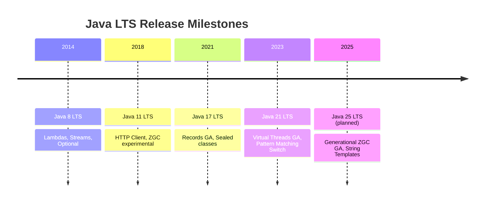

# Java Language - L0 Orientation

## Java Language History and Platform Evolution

### 🎯 Model Answer

**30 seconds:**
> Java was created at Sun Microsystems in 1995. Core promise: "Write Once, Run Anywhere"
> (WORA) via the JVM. Since then, Java has evolved from an applet language to an
> enterprise platform. LTS releases (8, 11, 17, 21) are the stable milestones.
> Modern Java (17-21) adds records, sealed classes, pattern matching, text blocks, and
> virtual threads - significant language improvements without breaking backward compatibility.

**3 minutes (Senior):**
> Java's evolution: four distinct eras:
>
> 1. **Java 1-4 (1995-2002):** Applets, Swing, basic OOP. Java became the dominant
>    enterprise language. Verbosity was a major complaint.
> 2. **Java 5-8 (2004-2014):** Generics, annotations, enums (Java 5). Lambdas,
>    Streams, Optional, new Date/Time API (Java 8). Java 8 changed how Java
>    developers think about code - functional style arrived.
> 3. **Java 9-16 (2017-2021):** Module system (JPMS), text blocks, records,
>    sealed classes, pattern matching for instanceof, new HTTP client. Faster release
>    cadence (6-month releases). Two LTS: 11 (2018), 17 (2021).
> 4. **Java 17-21 (2021-2023):** Sealed classes GA, pattern matching switch,
>    virtual threads (Project Loom), structured concurrency, scoped values,
>    string templates (preview). Java 21 LTS (2023): major modernization milestone.
>
> Key insight: Java 21 LTS has strong language ergonomics (records, switch patterns,
> virtual threads) that removed many reasons to choose Kotlin or Scala. Most
> organizations target Java 17 or 21 for new projects.

**Framework:** WHAT -> WHY -> HOW -> TRADE-OFF -> EXAMPLE

**Blank Mind Recovery:**

**(1) Restate:** "Java: created 1995, Sun/Oracle. WORA = compile once, JVM everywhere.
Four eras: 1-4 (applets), 5-8 (generics, lambdas), 9-16 (modules, records preview),
17-21 (modern Java: records GA, sealed classes, virtual threads). LTS releases: 8,
11, 17, 21."

**(2) First principles:** "Before Java: C++ was dominant but required platform-specific
compilation. Java solved portability by adding a runtime layer (JVM). The JVM compiles
bytecode on the target platform (JIT). This made Java slower than C++ but much more
portable and safer (no manual memory management)."

**(3) Bridge:** "Java is like a car platform. Java 1-4: the original model. Java 8:
automatic transmission added (lambdas). Java 9-16: safety features (modules). Java 21:
electric/hybrid (virtual threads, pattern matching). Core chassis (backward compatibility)
never changed - 25-year-old code still runs on Java 21 JVM."

---

### 📘 Concept Explanation

**Java release timeline and major features:**
```
JAVA RELEASE TIMELINE:

1995 - Java 1.0: OOP, JVM, applets, garbage collection
1997 - Java 1.1: inner classes, JavaBeans, JDBC, RMI
1998 - Java 2 (1.2): Swing, Collections framework
2002 - Java 1.4: assert, regex, XML, logging API
2004 - Java 5: generics, autoboxing, enums, varargs,
               enhanced for-loop, annotations, static import
2006 - Java 6: scripting API, JAX-WS, JDBC 4
2011 - Java 7: try-with-resources, diamond operator,
               binary literals, String in switch
2014 - Java 8 (LTS): lambdas, streams, Optional,
               default methods, new Date/Time API (JSR-310),
               method references, functional interfaces
2017 - Java 9: JPMS (module system), JShell REPL,
               HTTP/2 client (incubating), reactive streams
2018 - Java 10: local variable type inference (var)
2018 - Java 11 (LTS): HTTP client GA, String methods,
                       no-compile java program execution,
                       ZGC (experimental), Epsilon GC
2019 - Java 12: switch expressions (preview)
2020 - Java 14: records (preview), helpful NPE messages,
                pattern matching instanceof (preview)
2020 - Java 15: text blocks GA, sealed classes (preview)
2021 - Java 16: records GA, pattern matching instanceof GA
2021 - Java 17 (LTS): sealed classes GA, enhanced switch,
                       strong encapsulation for JDK internals,
                       deprecate Security Manager, Applet API
2022 - Java 18: UTF-8 default charset, code snippets in Javadoc
2023 - Java 19: virtual threads (preview), structured concurrency
2023 - Java 21 (LTS): virtual threads GA, sequenced collections,
                       record patterns, pattern matching switch GA,
                       string templates (preview)

LTS CADENCE: Java 8 (2014), 11 (2018), 17 (2021), 21 (2023)
             Next LTS: Java 25 (2025)
RELEASE CADENCE: 6-month releases since Java 9 (2017)
```

---

### 💻 Code Example

> **Code walkthrough:** This example shows how the same logic evolved across Java
> versions - demonstrating the language's progression toward conciseness and safety
> without breaking the underlying semantics.

```java
// HOW JAVA EVOLVED: same logic across versions

// JAVA 1.4 style (verbose, pre-generics, pre-lambda):
List names = new ArrayList();     // raw type - no generics
names.add("Alice");
names.add("Bob");
for (int i = 0; i < names.size(); i++) {
    String name = (String) names.get(i);  // manual cast
    if (name.startsWith("A")) {
        System.out.println(name);
    }
}

// JAVA 5-7 style (generics, enhanced for):
List<String> names = new ArrayList<String>();  // generics
names.add("Alice");
names.add("Bob");
for (String name : names) {           // enhanced for-loop
    if (name.startsWith("A")) {
        System.out.println(name);
    }
}

// JAVA 8 style (lambda, stream, method reference):
List<String> names = new ArrayList<>(List.of("Alice", "Bob"));
names.stream()
    .filter(name -> name.startsWith("A"))
    .forEach(System.out::println);    // method reference

// JAVA 16+ style (var, record, pattern matching):
var names = new ArrayList<>(List.of("Alice", "Bob"));
names.stream()
    .filter(n -> n.startsWith("A"))
    .forEach(System.out::println);

// Records (Java 16): replace boilerplate POJOs
// BAD (Java 8 style - 50 lines for a simple data holder):
public class Person {
    private final String name;
    private final int age;
    public Person(String name, int age) {
        this.name = name; this.age = age;
    }
    public String getName() { return name; }
    public int getAge() { return age; }
    @Override public boolean equals(Object o) { ... }
    @Override public int hashCode() { ... }
    @Override public String toString() { ... }
}

// GOOD (Java 16+ record - 1 line, same semantics):
public record Person(String name, int age) {}
// Automatically generates: constructor, getters, equals, hashCode, toString
```

> **Code walkthrough:** The evolution from Java 1.4 to Java 21 shows a clear trend:
> less boilerplate, more type safety, more expressive APIs. The raw type list with
> manual cast (Java 1.4) is error-prone. Generics (Java 5) add compile-time safety.
> Lambdas and streams (Java 8) enable functional-style processing. Records (Java 16)
> eliminate 50 lines of boilerplate for data holders. Each evolution adds expressiveness
> while maintaining full backward compatibility - Java 1.4 code still compiles on
> Java 21 JVM.

---

### 🎓 Answers by Seniority

**Junior / Mid (0-5 years):**
> Java started in 1995 as a WORA (Write Once, Run Anywhere) language. Major milestones:
> Java 5 (generics), Java 8 (lambdas and streams), Java 17 LTS (sealed classes), Java
> 21 LTS (virtual threads). LTS releases are 3 years apart and are stable for production.
> Most companies target Java 17 or 21 for new projects.

---

**Senior / Staff (5+ years):**
> Java's evolution strategy: backward compatibility as a non-negotiable constraint.
> Every feature added without breaking existing code. This is why Java took 20 years to
> get proper data classes (records). The trade-off: Java evolves slowly but enterprises
> trust it for 10-20 year production systems. For a new service in 2024: target Java 21
> LTS for maximum language features + LTS support lifecycle (at least 8 years from GA).
> Java 8: EOL for commercial support. Java 11: extended support available. Java 17/21:
> preferred.

---

### ⚠️ Common Misconceptions

**Misconception 1: "Java is slow because it's interpreted."**
Java compiles to bytecode (not interpreted). The JVM JIT compiler compiles hot code
paths to native machine code at runtime. Modern JVMs (HotSpot, GraalVM): Java's
throughput performance is within 10-20% of equivalent C++ code for long-running
server workloads. The "slow" reputation: (1) JVM startup time (10-500ms) vs C++ native
binary (< 1ms), (2) memory overhead (JVM base footprint 50-200MB vs native binary
10-50MB). For startup latency: GraalVM native image compiles to native binary
(eliminates JVM startup). For steady-state throughput: Java is competitive.

**Misconception 2: "Java 8 is still fine; modern Java doesn't add much."**
Java 8 reached commercial EOL in 2019 (Oracle). Java 21 vs Java 8 differences are
substantial: records (eliminates 50+ lines of boilerplate per data class), sealed
classes (exhaustive type hierarchies), pattern matching switch (replaces instanceof
chains), virtual threads (millions of concurrent threads without thread pool sizing),
text blocks (multi-line strings without escaping), var (local type inference),
String/Collection enhancements. A codebase using Java 8 features only: needs 2-3x
more code for the same semantics. Java 8: treat as legacy.

---

### 🚨 Failure Modes and Diagnosis

**Failure: Java version mismatch in CI/CD pipeline.**
```
Symptom: "UnsupportedClassVersionError: class file version 65.0"
  Production JVM: Java 11 (class version 55)
  Code compiled with: Java 21 (class version 65)

  error: UnsupportedClassVersionError:
    com/example/Service has been compiled by a more recent
    version of the Java Runtime (class file version 65.0),
    this version of the Java Runtime only recognizes
    class file versions up to 55.0

Diagnosis:
  Class file version mapping:
    Java 8  = version 52
    Java 11 = version 55
    Java 17 = version 61
    Java 21 = version 65

  Check: javap -verbose Service.class | grep "major version"
    major version: 65  <- compiled with Java 21

  Production JVM: java -version
    openjdk version "11.0.20" <- Java 11

Fix:
  Option 1: Set compiler target version to match production:
    pom.xml:
      <maven.compiler.source>11</maven.compiler.source>
      <maven.compiler.target>11</maven.compiler.target>
    But: you lose Java 21 language features

  Option 2 (preferred): Upgrade production JVM to Java 21
    - Update Docker base image:
      FROM eclipse-temurin:21-jre-alpine
    - Test: integration tests on Java 21
    - Deploy: rolling update to Java 21 pods
    Benefit: access to Java 21 features + performance improvements

  Prevention: CI/CD should fail fast on version mismatch
    In Dockerfile or CI:
      FROM eclipse-temurin:21-jdk-alpine AS builder
      FROM eclipse-temurin:21-jre-alpine
    (use same major version in both stages)
```

---

### 🎯 Interview Deep-Dive

| Question Category | Time to Answer |
|---|---|
| Java history | 1 minute |
| Java 8 vs Java 21 | 2 minutes |
| LTS releases | 1 minute |
| Java performance myths | 2 minutes |
| Version upgrade strategy | 2 minutes |
| Modern Java features overview | 2 minutes |
| Java vs alternatives | 2 minutes |

---

**Q1 (history): What are the most important milestones in Java's evolution?**

A: Java 5 (2004): generics and annotations - type safety and metaprogramming foundation.
Java 8 (2014): lambdas, streams, Optional - functional programming paradigm. Java 9 (2017):
module system - encapsulation at the package level, start of 6-month release cadence.
Java 16-17: records (data classes), sealed classes GA - modern OOP. Java 21: virtual
threads (Project Loom) - revolutionizes concurrency model. LTS milestones: 8, 11, 17,
21 are the stable enterprise targets.

*What separates good from great:* The Java 8 -> Java 21 gap matters. Many enterprises
are still running Java 8 (EOL 2019) or Java 11. The upgrade path: Java 8 -> Java 17
requires: (1) remove internal API usages (`sun.misc.Unsafe`, internal classes now hidden
by JPMS in strong encapsulation mode), (2) migrate from deprecated APIs (Security Manager,
Applet, `Date` -> `java.time`), (3) test libraries that use reflection (Spring 5+, Hibernate
5+ support Java 17). The payoff: better GC (G1 default since Java 9), improved JIT,
smaller Docker images (jlink custom runtimes), modern language features.

---

**Q2 (java8 vs 21): What are the most impactful changes from Java 8 to Java 21?**

A: Records (16+): eliminate boilerplate data classes. Sealed classes (17+): exhaustive
type hierarchies with compiler enforcement. Pattern matching: `instanceof` check + cast
in one expression; switch expressions over types. Text blocks: multi-line strings without
manual escaping. var: local type inference (write `var map = new HashMap<>()` instead of
the full type). Virtual threads: `Thread.ofVirtual()` creates JVM-managed threads that
can block without consuming an OS thread. Sequenced collections (21): `getFirst()`,
`getLast()` on List.

*What separates good from great:* Virtual threads are the most impactful change.
Pre-virtual-threads: blocking I/O = blocked OS thread = thread pool size = max concurrent
requests. A service with 200 thread pool threads: max 200 concurrent in-flight requests
(blocking on DB calls). With virtual threads: the same service can handle millions of
concurrent requests - each virtual thread blocks, JVM schedules it off the carrier thread,
carrier thread picks up the next runnable virtual thread. The programming model is
unchanged (blocking code), but the scalability is 1000x better. This removes the motivation
for reactive programming (WebFlux) for most web services.

---

**Q3 (lts): Why do LTS releases matter and which should you target?**

A: LTS = Long-Term Support. Oracle and OpenJDK community provide security patches and
bug fixes for LTS releases for 8+ years (commercial support). Non-LTS releases: 6-month
support window. Production systems: always LTS. For 2024: Java 21 is the latest LTS
(released September 2023). Java 17 LTS (September 2021): still supported, widely deployed.
Java 11 LTS: approaching end of vendor support windows. Java 8: commercial EOL, still
used widely (legacy), security patches require paid Oracle support or use Azul/Amazon
Corretto for free extended support.

*What separates good from great:* LTS selection is a business decision, not a technical
one. Factors: (1) library ecosystem support (Spring 6 requires Java 17+, Spring Boot 3
requires Java 17+), (2) JVM vendor support timeline (Amazon Corretto 21: free patches
until 2031), (3) feature requirements (virtual threads require Java 21, records require
Java 16+). Recommendation for NEW projects in 2024: Java 21 (latest LTS, all modern
features, 8+ years of support). For EXISTING projects: evaluate Spring/Hibernate
compatibility and plan migration to Java 17 or 21 within 2-3 years.

---

**Q4 (backward compat): Why is backward compatibility so important in Java's design?**

A: Java backward compatibility: code written in 2000 still compiles and runs on Java 21 JVM.
No other major language maintains this level of compatibility. Reason: enterprises run
Java in production for 10-20 years. If a new Java version broke existing code: enterprises
would not upgrade, and the platform would fragment. The cost: Java accumulates legacy APIs
(Hashtable, Vector, Date) that can't be removed. New, better alternatives are added (HashMap,
ArrayList, java.time), but old APIs remain. Java can never do Python 2 -> Python 3 style
breaking changes.

*What separates good from great:* JPMS (Java 9 module system) is the one place where
Java did introduce breaking changes (strong encapsulation hides internal APIs). This
broke many libraries that used `sun.misc.Unsafe` or internal reflection. The migration
path: `--add-opens` command-line flags temporarily open encapsulated packages.
The lesson: even when Java needs to break compatibility (to improve security and
modularity), it provides migration tools and multi-version support windows. The Spring
team spent 2 years updating Spring 6 to work within JPMS constraints. This is the
real cost of "backward compatibility as a core value" - it's expensive to change anything.

---

**Q5 (release cadence): What changed about Java releases after Java 9?**

A: Pre-Java 9: feature-driven releases (released when features were ready, often delayed).
Java 9 was delayed 3+ years. Post-Java 9: time-driven releases (every 6 months, March
and September). If a feature isn't ready: it ships as a preview (Preview API) or doesn't
ship. This means: more predictable upgrades, but many features arrive as "preview"
requiring `--enable-preview` flag. Preview features: NOT stable, can change between
versions. GA (Generally Available): stable, no flag needed.

*What separates good from great:* The preview mechanism allows features to mature over
multiple releases. Virtual threads: preview in Java 19 (2022), preview in Java 20 (2023),
GA in Java 21 (2023). Two preview cycles gave the community time to test and provide
feedback. The rule: don't use preview features in production. Use them in experiments
and staging to learn the API before it's GA. For libraries: never expose preview APIs
in public interfaces (your callers don't use `--enable-preview`). The practical
impact: Java 21 LTS is the right target for virtual threads and pattern matching switch
(both GA). Java 23 has string templates (still preview in Java 21) - wait for Java 25 LTS.

---

**Q6 (ecosystem): What does the Java ecosystem look like in 2024?**

A: JVM distributions: Eclipse Temurin (OpenJDK), Amazon Corretto, Azul Zulu, Oracle JDK,
GraalVM (polyglot + native image). Build tools: Maven (most common), Gradle. Frameworks:
Spring Boot (dominant for enterprise), Quarkus (cloud-native, GraalVM native), Micronaut
(low memory, GraalVM), Jakarta EE (enterprise standard). ORMs: Hibernate/JPA, jOOQ (SQL),
Spring Data. Testing: JUnit 5, Mockito, TestContainers. Observability: Micrometer,
OpenTelemetry Java agent.

*What separates good from great:* The GraalVM native image option changes the Java
landscape for cloud-native workloads. Standard JVM: 200ms-500ms startup, 256MB+ RSS.
GraalVM native: 10-50ms startup, 50-100MB RSS. This makes Java competitive with Go and
Rust for serverless functions and startup-time-sensitive applications. The cost: native
image compilation is slow (5-10 minutes for large applications), reflection requires
upfront configuration, and dynamic class loading is limited. Quarkus and Micronaut
are designed to work well with GraalVM native; Spring Native (since Spring Boot 3) adds
native image support to Spring applications. The ecosystem trend: Java is no longer
"too slow for serverless" - it's a legitimate option for cloud-native.

---

**Q7 (choosing java): When should you choose Java over alternatives like Go, Kotlin, or Python?**

A: Java strengths: (1) ecosystem depth (libraries for everything), (2) long-term support
(21 LTS until 2031+), (3) gradual modernization without rewrite, (4) JVM performance for
sustained throughput workloads, (5) team knowledge in most enterprise organizations.
Java weaknesses: (1) startup time for serverless/Lambda (mitigated by GraalVM), (2)
verbose boilerplate (mitigated by records, var, sealed classes), (3) memory footprint
for microservices (mitigated by GraalVM native), (4) no scripting/quick iteration.

*What separates good from great:* "Choose Java when the organization already has Java
expertise and the application needs long-term maintenance." The real decision is not
Java vs Kotlin (Kotlin is just better Java syntax, same JVM, same libraries, interoperable).
The real decision is JVM vs non-JVM (Go for simple, high-performance services with low
memory; Python for data/ML pipelines; Java for complex enterprise applications with
rich library requirements). Java 21 with virtual threads and records is close to Kotlin
ergonomically on the JVM. If your team knows Java well: upgrading to Java 21 gives most
of Kotlin's ergonomic benefits without a rewrite.

---

### ⚖️ Comparison Table

*(Omit: L0 Orientation file (★☆☆) - orientation content does not require a structured
comparison table. Feature comparisons are covered within the Q&A responses.)*

---

### 🏛️ System Design

*(Omit: L0 Orientation file - platform evolution is conceptual context, not a system
design exercise.)*

---

### 📊 Diagram

```
JAVA VERSION SELECTION DECISION TREE:

  New project in 2024?
  +-------YES-------+
  |                 |
  Need native       Need max
  image/serverless? language features?
  |                 |
  YES: GraalVM      YES: Java 21 LTS
  + Quarkus/        (records, sealed,
    Micronaut        virtual threads)
  |                 |
  NO: Java 21 LTS   Either works,
      with standard  prefer 21 for
      JVM runtime    LTS longevity
  
  Migrating existing Java 8 project?
  -> Target Java 17 or 21 LTS
  -> Check: Spring version (requires 17+ for Spring 6)
  -> Check: library dependencies (remove sun.misc.*  usage)
  -> Test: JPMS strong encapsulation (add --add-opens if needed)
  -> Plan: 6-12 month migration timeline for large codebases

JAVA LTS SUPPORT LIFECYCLE:
  Java 8  (2014) ----------[EOL commercial]-------> 2019
  Java 11 (2018) ---------------------------> 2026 (Corretto)
  Java 17 (2021) ------------------------------------> 2029
  Java 21 (2023) ----------------------------------------> 2031
```



> **Diagram walkthrough:** The decision tree shows that Java 21 LTS is the target
> for all new projects. The migration path from Java 8 follows a specific checklist
> (Spring version, JPMS, library deps). The LTS timeline shows that Java 8 commercial
> support has ended and Java 21 has support until 2031+. Engineers who remember Java 8
> as the "current" version need to understand that two full LTS cycles (11, 17) and one
> more (21) have passed.

---

---

# Java Design Goals: WORA Safety and OOP

### 🎯 Model Answer

**30 seconds:**
> Java was designed with five goals: Write Once Run Anywhere (WORA via JVM), security
> (no manual memory management, bytecode verifier, sandbox model), OOP first (everything
> is an object except primitives), simplicity (simpler than C++, no pointers), and
> robustness (compile-time type checking, garbage collection, no undefined behavior from
> memory errors). These goals shaped every Java language feature.

**3 minutes (Senior):**
> Java's design goals translated to specific language decisions:
>
> 1. **WORA -> Bytecode + JVM**: Java doesn't compile to native code; it compiles to
>    platform-independent bytecode. The JVM is the portability layer. Every platform
>    needs a JVM, but the compiled .class file is the same everywhere.
>
> 2. **Security -> No raw pointers, garbage collection, bytecode verifier**: You can't
>    forge memory addresses. The JVM verifies bytecode integrity before execution.
>    Originally designed for browser applets (untrusted code in a sandbox). Most of the
>    security model survives in enterprise use (ClassLoader isolation, SecurityManager
>    was deprecated in Java 17 - a 26-year security model finally retired).
>
> 3. **OOP first -> Classes, interfaces, single inheritance, multiple interface inheritance**:
>    Everything (except primitives) is an object with methods. The class hierarchy is
>    the primary abstraction mechanism. This was the dominant programming paradigm in
>    1995 (C++ OOP); Java simplified it (no multiple inheritance, no operator overloading).
>
> 4. **Simplicity over C++ -> Garbage collection, no preprocessor, no multiple inheritance**:
>    Java deliberately removed C++ features that caused bugs: manual malloc/free (->
>    garbage collection), multiple inheritance of classes (-> single inheritance + interfaces),
>    preprocessor macros (-> annotations in Java 5), operator overloading (-> never added).
>
> 5. **Robustness -> Checked exceptions, type safety, array bounds checking**: The compiler
>    catches many errors. The JVM catches the rest (ArrayIndexOutOfBoundsException,
>    NullPointerException). The trade-off: verbosity and slower iteration than Python/Ruby.

**Blank Mind Recovery:**

**(1) Restate:** "Java design goals: WORA (bytecode + JVM), security (no raw pointers,
GC, verifier), OOP (classes, interfaces), simplicity vs C++ (no multiple class inheritance,
no operator overload, no pointers), robustness (checked exceptions, type safety)."

**(2) First principles:** "Every language is a set of trade-offs. Java traded: raw
performance for portability (JVM overhead), conciseness for verbosity (explicit types,
more syntax), developer freedom for safety (no manual memory, no undefined behavior).
These trade-offs made Java dominant for enterprise development."

**(3) Bridge:** "WORA is like an international electrical adapter. The bytecode is the
device (same everywhere). The JVM is the adapter (platform-specific, lets the device
work anywhere). The security model is like GFCI outlets - prevents dangerous conditions
(memory corruption = electrical shock) at the infrastructure level."

---

### 📘 Concept Explanation

**Java's 5 design goals and how they manifest in the language:**
```
JAVA DESIGN GOALS -> LANGUAGE FEATURES MAP:

1. WORA (Write Once, Run Anywhere):
   .java -> [javac compiler] -> .class (bytecode) -> [JVM] -> native execution
   
   Bytecode: stack-based virtual machine instructions
   JVM: platform-specific interpreter + JIT compiler
   Result: one .class file runs on Windows JVM, Linux JVM, macOS JVM
   
   Trade-off:
     + Portability (deploy one artifact everywhere)
     - Startup time (JVM must load and JIT-compile before peak performance)
     - Memory (JVM overhead 50-200MB vs native binary 10-50MB)

2. Security:
   Language level:
     - No raw pointer arithmetic (cannot access arbitrary memory)
     - No manual memory management (GC manages heap)
     - Array bounds checking at runtime (ArrayIndexOutOfBoundsException)
     - Type casting checked at runtime (ClassCastException)
   
   JVM level:
     - Bytecode verifier: confirms bytecode is valid before execution
     - ClassLoader hierarchy: isolates different code sources
     - SecurityManager (deprecated Java 17): sandbox for untrusted code
   
   Result: no buffer overflows, no use-after-free, no arbitrary memory read

3. OOP First:
   - Every type is a class or interface (extends Object)
   - Primitives (int, long, double) are the ONE exception (performance)
   - Autoboxing (Java 5): automatically wraps int to Integer for APIs
   - Single class inheritance + multiple interface inheritance
     (avoids the C++ diamond problem)

4. Simplicity (vs C++):
   REMOVED from C++:
     - Manual memory management -> GC
     - Multiple class inheritance -> single + interfaces
     - Operator overloading -> not available
     - Preprocessor/macros -> annotations
     - Templates (C++) -> generics (Java 5, type-erased)
   
   Added:
     - Simple syntax: public class Hello { public static void main... }
     - Standard library covers most needs
     - Automatic memory management

5. Robustness:
   - Checked exceptions: compiler forces you to handle or declare
   - Static typing: type errors caught at compile time
   - Final keyword: prevents unwanted mutation
   - Immutable strings: no buffer corruption from shared string mutation
   - Integer overflow: deterministic (not undefined behavior as in C++)
```

---

### 💻 Code Example

> **Code walkthrough:** This example demonstrates Java's safety guarantees compared
> to C/C++ by showing what simply cannot happen in Java, and then showing the
> one remaining vulnerability (NullPointerException) and modern Java's mitigation.

```java
// JAVA SAFETY DEMONSTRATION

// BAD (C++ style, impossible in Java):
// int* ptr = (int*)0xDEADBEEF;  // arbitrary memory access
// *ptr = 42;                    // writes to arbitrary memory
// free(ptr); *ptr = 1;          // use-after-free (undefined behavior)
// Java: none of these compile - no pointer arithmetic

// GOOD: Java's safety guarantees
int[] array = {1, 2, 3};
// array[5] = 99;  // Throws ArrayIndexOutOfBoundsException at runtime
                  // NOT undefined behavior - predictable exception

// GOOD: Type safety
Object obj = "Hello";
// Integer num = (Integer) obj;  // ClassCastException at runtime
                                 // NOT undefined behavior

// NullPointerException: the main remaining source of runtime errors
// BAD: no null check
String name = getUserName();  // may return null
System.out.println(name.length());  // NPE if name is null

// GOOD: Optional for null safety (Java 8+)
Optional<String> maybeName = Optional.ofNullable(getUserName());
int length = maybeName.map(String::length).orElse(0);

// GOOD: Helpful NPE messages (Java 14+)
// JVM: "NullPointerException: Cannot invoke "String.length()"
//       because "name" is null"
// (Identifies which variable is null - not just a stack trace)

// GOOD: Pattern matching null check (Java 21+)
Object value = getValue();
if (value instanceof String s) {
    // 's' is non-null String here - pattern matching
    System.out.println(s.toUpperCase());
}

// GOOD: switch with exhaustiveness (Java 17+)
sealed interface Shape permits Circle, Rectangle {}
record Circle(double radius) implements Shape {}
record Rectangle(double width, double height) implements Shape {}

double area = switch (shape) {
    case Circle c -> Math.PI * c.radius() * c.radius();
    case Rectangle r -> r.width() * r.height();
    // Compiler error if any case is missing - exhaustive switch
};
```

> **Code walkthrough:** Java's safety model prevents the most dangerous C/C++ vulnerabilities
> at the language level. Arbitrary memory access (buffer overflow, use-after-free) is
> structurally impossible because there are no raw pointers. Array bounds and type cast
> errors throw predictable exceptions rather than undefined behavior. The one remaining
> hazard (NPE) is being progressively addressed by Optional, pattern matching, and Java 14
> helpful NPE messages. The sealed classes + exhaustive switch combination is the most
> recent addition to Java's type safety story.

---

### 🎓 Answers by Seniority

**Junior / Mid (0-5 years):**
> Java design goals: WORA (same bytecode on every JVM), safety (no manual memory, GC,
> no buffer overflows), OOP (classes and interfaces). These goals explain why Java is
> verbose - explicit types and checked exceptions enforce safety. Modern Java (records,
> Optional, sealed classes) reduces verbosity while keeping safety.

---

**Senior / Staff (5+ years):**
> Java's design goals created specific trade-offs that still define the language today.
> WORA required a JVM, which introduced startup latency (mitigated by GraalVM native).
> Safety required a GC, which introduced GC pauses (mitigated by ZGC). OOP-first required
> everything to be an object, which required autoboxing for collections (performance
> overhead: int vs Integer in collections). Security model (ClassLoader hierarchy) enables
> features that other runtimes lack (OSGi, Java EE classloading, hot reloading). Each
> "feature" of the design creates both a benefit and a limitation that experienced engineers
> must understand.

---

### ⚠️ Common Misconceptions

**Misconception 1: "Java's garbage collector solves all memory issues."**
GC handles: heap allocation lifecycle (prevents use-after-free, double-free). GC does NOT
handle: (1) memory leaks (if objects are reachable but no longer needed - still alive for
GC), (2) off-heap memory (ByteBuffer.allocateDirect(), native libraries via JNI/FFI),
(3) resource leaks (connections, file handles - use try-with-resources). Common Java memory
leak patterns: static collections holding references, ThreadLocal not cleaned up, ClassLoader
leaks in web apps (every redeployment creates a new ClassLoader that isn't released).

**Misconception 2: "WORA means Java runs identically on every platform."**
WORA applies to: bytecode execution, core library behavior. WORA does NOT guarantee:
(1) file system behavior (path separators `/` vs `\`, case sensitivity on Linux vs macOS),
(2) platform-specific default charset (fixed in Java 18: UTF-8 default, but legacy code
may behave differently), (3) native code via JNI/JNA (inherently platform-specific),
(4) GUI appearance (Swing/AWT looks different on each OS), (5) date/timezone handling
(depends on OS timezone database). The practical rule: test your application on the target
OS even if it's Java.

---

### 🚨 Failure Modes and Diagnosis

**Failure: Memory leak due to static collection holding strong references.**
```
Symptom: Heap usage grows steadily over days
  After restarting: starts low, grows to OOM in 3 days

Diagnosis:
  1. Enable GC logging and check live data growth:
     jcmd <pid> GC.run
     jcmd <pid> GC.heap_info
     -> heap still 3.8GB after forced full GC
     -> live data = 3.8GB (cannot be collected)

  2. Take heap dump:
     jcmd <pid> GC.heap_dump /tmp/heap.hprof

  3. Analyze with MAT (Leak Suspects):
     Largest retained object:
       java.util.HashMap @ 3.2GB retained
       -> referenced from:
          com.example.CacheService.INSTANCE_CACHE (static field)
          
  4. Inspect code:
     public class CacheService {
       // BAD: unbounded static cache - NEVER GC'd
       private static final Map<String, SomeObject> INSTANCE_CACHE
           = new HashMap<>();
       
       public void cache(String key, SomeObject obj) {
           INSTANCE_CACHE.put(key, obj);
           // No eviction - grows forever
       }
     }

Fix:
  Option A: Use bounded cache (Caffeine, Guava Cache):
    private static final Cache<String, SomeObject> INSTANCE_CACHE =
        Caffeine.newBuilder()
            .maximumSize(10_000)
            .expireAfterWrite(Duration.ofMinutes(30))
            .build();
    // Automatically evicts when full or expired

  Option B: Use WeakHashMap (keys GC'd when not referenced elsewhere):
    private static final Map<String, SomeObject> INSTANCE_CACHE
        = new WeakHashMap<>();
    // Only use if keys should be GC'd when no other ref exists

Rule: NEVER use an unbounded static Map for caching.
      Always: bounded, with eviction policy.
```

---

### 🎯 Interview Deep-Dive

| Question Category | Time to Answer |
|---|---|
| WORA explanation | 1 minute |
| Java vs C++ safety | 2 minutes |
| GC and memory safety | 2 minutes |
| OOP design choices | 1 minute |
| Checked exceptions rationale | 2 minutes |
| Java security model | 1 minute |
| Design goal trade-offs | 2 minutes |

---

**Q1 (wora): Explain "Write Once, Run Anywhere" and its limitations.**

A: WORA: Java source -> compiler -> .class (bytecode) -> JVM executes bytecode on any
supported platform. The JVM is platform-specific; the .class file is not. Limitations:
(1) "any platform" requires a JVM (not available on all embedded systems), (2) file
system operations differ by OS (path separators, case sensitivity), (3) native code
via JNI is platform-specific, (4) GUI rendering differs by platform (Swing), (5) JVM
startup overhead (not "run anywhere instantly" - startup is 100-500ms for standard JVM).

*What separates good from great:* The "same behavior everywhere" assumption is often
wrong in practice. Java's charset default was `platform-default` until Java 18 fixed
it to UTF-8. Code that reads/writes text files with `FileReader` (uses platform default
charset) would produce different results on Windows (CP1252) vs Linux (UTF-8). The
entire team ran on macOS (UTF-8) and never saw the issue; production ran on Windows
Server (CP1252) and silently corrupted non-ASCII characters. Lesson: always specify
charset explicitly: `new FileReader(file, StandardCharsets.UTF_8)`. Java 18's UTF-8
default fixes new code but old code using platform-default charset is still a risk.

---

**Q2 (gc rationale): Why did Java's designers choose garbage collection over manual memory management?**

A: Eliminating manual memory management was a deliberate design choice: prevents the
most common C/C++ bugs (buffer overflow, use-after-free, double-free, dangling pointer).
Sun Microsystems estimated that 40-70% of C/C++ bugs were memory management related.
By removing the problem domain, Java eliminated an entire class of vulnerabilities.
The cost: GC pauses (managed by modern GC algorithms like ZGC to < 1ms). The benefit:
no security vulnerabilities from memory corruption (CVE-2021-44228 Log4Shell was a
Java deserialization vulnerability, NOT a memory corruption - Java's memory model
prevented the worst potential damage).

*What separates good from great:* Java GC design parallels the observation that humans
are bad at managing shared mutable state. Manual memory management: developer must track
exactly when to free each object. GC: runtime tracks reachability automatically. The
GC doesn't eliminate the conceptual problem (knowing when you're "done" with an object);
it just automates the mechanics. This is why Java can still have memory leaks: if you
keep a reference to an object unnecessarily, the GC can't collect it. The insight:
"GC makes memory deallocation automatic, not memory lifecycle management automatic."
That's the developer's responsibility: remove references when done.

---

**Q3 (checked exceptions): Why did Java add checked exceptions, and are they a good design?**

A: Checked exceptions: compiler forces callers to either catch or declare exceptions from
`throws` clauses. Rationale (1995): encourage developers to handle error conditions;
make error paths visible in APIs. In practice: many developers use `try { } catch (Exception e) { }` (swallows exceptions), leading to silent failures. The debate: Spring, Kotlin,
and most modern Java frameworks use unchecked exceptions exclusively. Java's own new APIs
(CompletableFuture, Stream) use unchecked exceptions. Checked exceptions are not "wrong"
but are frequently misused. Best practice: use checked for truly recoverable errors, unchecked
for programming errors.

*What separates good from great:* The "checked exception swallowing" anti-pattern is one
of the most common bugs in Java codebases: `catch (SQLException e) { }` or `catch (IOException e) { e.printStackTrace(); }`. Both cases hide the error and continue with an
invalid state. The correct response to an unrecoverable exception: let it propagate up
(either throw it, or wrap in a RuntimeException). For caught and handled exceptions:
log + take a recovery action (retry, return a default value, cancel the operation).
The discipline: never silently swallow an exception. Every catch block should have a
clear reason for catching at that level.

---

**Q4 (oop choices): Why does Java use single class inheritance instead of multiple inheritance?**

A: Multiple class inheritance (C++) creates the "diamond problem": if classes B and C
both inherit from A, and D inherits from both B and C, which version of A's method does
D inherit? C++ resolves this with virtual inheritance (complex, error-prone). Java's
solution: no multiple class inheritance. Instead: multiple interface inheritance. Interfaces
define contracts (what to do) without implementation (how to do it). Default methods
(Java 8) added implementation to interfaces with a strict rule: interfaces cannot have
state (no instance fields), so the diamond problem doesn't arise for state.

*What separates good from great:* Java 8 default methods came close to re-introducing
the diamond problem for behavior. The rule: if two interfaces define the same default
method, the implementing class MUST override it explicitly. The compiler enforces this.
The limitation: mixin-style composition (adding behavior from multiple sources) is common
in other languages but clunky in Java. The clean pattern: composition over inheritance
(Strategy, Decorator design patterns) solves the same problem without inheritance complexities.
A class that "has a" payment processor and "has a" notification service is cleaner than
inheriting from both. The Effective Java principle: "favor composition over inheritance"
applies whenever you want to combine behaviors from multiple sources.

---

**Q5 (primitives): Why does Java have primitives (int, long) when everything else is an object?**

A: Performance: operating on `int` is a direct register operation (1-2 CPU cycles).
Operating on `Integer` (object): requires heap allocation, pointer indirection, GC pressure.
For tight loops processing millions of integers: the difference is 10-100x. Primitives
are the pragmatic exception to "everything is an object." Autoboxing (Java 5): automatic
conversion between `int` and `Integer`. The hidden cost: `Integer.valueOf(n)` in a loop
allocates objects. Large `List<Integer>`: each element is a separate heap object with
8-byte header + 4-byte value = 12 bytes per element (vs 4 bytes for `int[]`).

*What separates good from great:* Project Valhalla (the most long-running JDK project):
aims to bring value types to Java. A value type is an object without identity (no pointer,
no header, inline storage in arrays). `List<int>` would store raw integers without boxing.
Currently in preview (Java 23 as "primitive classes"). When GA: `ArrayList<int>` would
work without boxing. This would eliminate the last performance argument for `int[]` over
`List<Integer>`. The practical implication for 2024: use `int[]` for performance-critical
number crunching, `List<Integer>` for general collections. When Valhalla ships: `List<int>`
will be the better option for both.

---

**Q6 (null in java): How does Java handle null and what is the roadmap to eliminate it?**

A: Java null: every reference type can be null. NPE (NullPointerException) is the most
common Java runtime error ("the billion-dollar mistake" - Tony Hoare who invented null
in ALGOL). Mitigation: Optional (Java 8) - explicit nullable type. Helpful NPE messages
(Java 14) - tells you which variable was null. Pattern matching instanceof (Java 16) -
automatically casts after null-safe type check. Future: nullable/non-nullable type
annotations (`@Nullable`, `@NonNull` from JetBrains, Checker Framework) with IDE and
static analysis warnings. Java 21 does not have a language-level null-safe type system
(unlike Kotlin's `String?` vs `String`). That's a known gap.

*What separates good from great:* The practical mitigation strategy: (1) `@NonNull` /
`@Nullable` annotations at all API boundaries (method parameters and return values) +
IntelliJ/NullAway static analysis to catch NPEs at compile time, (2) use Optional for
method return values that may have no value (never for parameters or fields), (3) use
Objects.requireNonNull(param, "message") at the top of public methods for fail-fast
validation, (4) pattern matching for null-safe type checks in branches. Kotlin's solution
(null-safe types in the type system) is cleaner. Java teams adopting Kotlin often cite
null safety as a major driver. Pure Java teams: use NullAway (static analysis tool from
Uber) for near-Kotlin-level null safety without changing language.

---

**Q7 (security model): How does Java's security model work and why was SecurityManager deprecated?**

A: Java security model: ClassLoader hierarchy (each code source in a separate ClassLoader,
limits what classes can be loaded by each source), bytecode verifier (checks that bytecode
is structurally valid before execution), SecurityManager (runtime policy that controlled
which operations were allowed: file access, network access, etc.). SecurityManager use
case: browser applets (untrusted Java code in a sandbox). In enterprise Java: never used
in practice for 20 years (applications needed all permissions anyway). Deprecated Java 17,
for removal. Modern alternative: OS-level isolation (containers, seccomp, Kubernetes
PodSecurityPolicy).

*What separates good from great:* The ClassLoader hierarchy still matters in enterprise Java.
Each module in an OSGi container or each web application in a servlet container has its
own ClassLoader. ClassLoader isolation prevents: one application's Guava version conflicting
with another application's Guava version in the same JVM. ClassLoader leaks (deploying
a new version of a web app without closing the old ClassLoader): retains all classes
from the previous version in Metaspace. The symptom: Metaspace grows on redeployment,
eventually OutOfMemoryError: Metaspace. The diagnosis: heap dump + MAT ClassLoader explorer.
The fix: ensure all threads and non-GC references from the old ClassLoader are released
before deploying the new version.

---

### ⚖️ Comparison Table

*(Omit: L0 Orientation file (★☆☆) - omit comparison table per spec rules for ★☆☆ level.)*

---

### 🏛️ System Design

*(Omit: L0 Orientation - design goals are conceptual context, not a system design exercise.)*

---

### 📊 Diagram

*(Omit: The design goals are adequately explained in the structured text, code examples,
and Q&A. A visual diagram would not add meaningful clarity over the table format used
in the concept explanation section.)*

---

---

# JDK vs JRE vs Language Specification

### 🎯 Model Answer

**30 seconds:**
> JDK (Java Development Kit): everything you need to compile and run Java. Includes: JRE +
> javac compiler + debugging tools (jcmd, jstack, JFR) + javadoc + jar. JRE (Java Runtime
> Environment): everything you need to RUN Java. Includes: JVM + standard library (rt.jar
> / lib/). Note: JDK 11+ dropped the standalone JRE distribution - just use the JDK in all
> environments (containers, production). JLS (Java Language Specification): the official
> document defining exactly what Java programs mean. Implemented by javac and the JVM.

**3 minutes (Senior):**
> JDK in 2024 context:
>
> 1. **JDK = compiler + tools + JRE**: `javac` (compiler), `java` (launcher), `jar`
>    (archive tool), `jcmd` (JVM diagnostics), `jshell` (REPL), `jlink` (custom runtime),
>    `jpackage` (native package), JFR (Java Flight Recorder), `javap` (bytecode disassembler).
>
> 2. **JRE is obsolete as a standalone distribution**: Since JDK 11, Oracle and all major
>    vendors stopped distributing a separate JRE. Production containers: use the full JDK
>    image OR a custom runtime created with `jlink`. `jlink`: creates a minimal JRE
>    containing only the JDK modules your application uses. Result: 50-150MB custom
>    runtime vs 300MB+ full JDK.
>
> 3. **JLS (Java Language Specification)**: written by Oracle, specifies: syntax (what is
>    valid Java source), semantics (what valid Java programs mean), execution model
>    (threads, memory model). javac and the JVM are implementations of the JLS.
>    JVM specification (JVMS): separately specifies the bytecode format and JVM behavior.
>
> 4. **Multiple JDK distributions**: Oracle JDK (commercial license), Eclipse Temurin
>    (OpenJDK, free, recommended), Amazon Corretto (OpenJDK, AWS optimizations + free
>    LTS patches), Azul Zulu (OpenJDK, commercial support available), GraalVM (OpenJDK
>    + polyglot + native image). For production: any OpenJDK distribution. For native
>    image: GraalVM.

**Blank Mind Recovery:**

**(1) Restate:** "JDK = JRE + compiler + tools. JRE = JVM + standard library. JDK 11+:
JRE not separately distributed. Use JDK everywhere OR use jlink to create a minimal
JRE. JLS = the official language spec (what the language means). Multiple JDK vendors:
Temurin, Corretto, Azul, GraalVM."

**(2) First principles:** "To run Java: need a JVM (execute bytecode) + standard library
(java.lang, java.util, etc.). That's the JRE. To develop Java: need those + a compiler
(javac) + debugging tools. That's the JDK."

**(3) Bridge:** "JDK is a kitchen: stove (JVM to run), oven (JRE for baking), knives and
utensils (compiler, jcmd, JFR for development). A restaurant (production): needs stove
and oven (JRE), but not all the specialized prep tools. Pre-2019: you could ship just the
stove+oven (JRE). Post-2019: the vendor ships the whole kitchen (JDK), and jlink lets
you build a custom compact kitchen (minimal JRE)."

---

### 📘 Concept Explanation

**JDK structure and tool inventory:**
```
JDK STRUCTURE (JDK 21):

  JDK 21/
    bin/
      java        <- JVM launcher (runs .class / .jar)
      javac       <- Compiler (.java -> .class)
      jar         <- Archive tool (.class -> .jar)
      jlink       <- Custom runtime image creator
      jpackage    <- Native package (Windows .msi, macOS .dmg, Linux .deb)
      jshell      <- REPL (interactive Java console)
      jcmd        <- JVM diagnostic tool (GC, heap, threads, JFR)
      jfr         <- JFR recording analysis
      javap       <- Bytecode disassembler
      jdeps       <- Module dependency analyzer
      jmod        <- JPMS module creation/inspection
      keytool     <- Key/certificate tool
      javadoc     <- Documentation generator
    lib/
      modules     <- All JDK modules (combined jimage format)
      security/   <- Security providers, TLS config
    conf/
      security/   <- java.security, java.policy
    include/      <- JNI header files
    
JDK DISTRIBUTIONS (all are OpenJDK implementations):
  
  Eclipse Temurin (Adoptium):
    Free, open source, TCK-certified
    Best for: general use, Docker
    Download: adoptium.net
    
  Amazon Corretto:
    Free, AWS-optimized, long-term patches
    Best for: AWS deployments
    Download: aws.amazon.com/corretto
    
  Azul Zulu:
    Free community edition, commercial support available
    Best for: orgs needing paid support
    Azul Zing: commercial JVM with C4 GC (no stop-the-world ever)
    
  GraalVM Community (Oracle):
    Free, adds polyglot + native image
    Best for: native image compilation, polyglot (JS, Python, Ruby in JVM)
    
  Oracle JDK:
    Free for development/testing
    Requires license for production since Java 17 (NFTC license)
    Best for: Oracle Cloud, Oracle-supported environments

JLINK (Custom Runtime):
  # Create minimal runtime for a Spring Boot app:
  jlink \
    --module-path $JAVA_HOME/jmods \
    --add-modules java.base,java.logging,java.sql,java.xml,\
                  java.naming,java.security.jgss \
    --output /opt/my-runtime \
    --strip-debug \
    --no-header-files \
    --no-man-pages \
    --compress=2
  # Result: 45MB custom JRE vs 300MB full JDK
  # Use in Dockerfile: FROM scratch; COPY --from=builder /opt/my-runtime /opt/runtime
```

---

### 💻 Code Example

> **Code walkthrough:** The Dockerfile shows the modern container image pattern using
> multi-stage builds. The builder stage uses the full JDK; the runtime stage uses a
> minimal jlink-created JRE, producing smaller and more secure images.

```dockerfile
# DOCKERFILE: Multi-stage build with jlink minimal JRE
# Reduces image size from 400MB (full JDK) to ~100MB (jlink + app)

# Stage 1: Build with full JDK
FROM eclipse-temurin:21-jdk-alpine AS builder

WORKDIR /build
COPY . .
RUN ./mvnw package -DskipTests

# Create minimal JRE using jlink:
# jdeps analyzes which JDK modules the app actually uses
# jlink builds a custom JRE with only those modules
RUN $JAVA_HOME/bin/jdeps \
      --ignore-missing-deps \
      --print-module-deps \
      --multi-release 21 \
      --recursive \
      --class-path="$(find target -name '*.jar' | tr '\n' ':')" \
      target/*.jar > /tmp/java_deps.info

RUN $JAVA_HOME/bin/jlink \
      --add-modules $(cat /tmp/java_deps.info) \
      --strip-debug \
      --no-header-files \
      --no-man-pages \
      --output /opt/custom-jre

# Stage 2: Minimal runtime image
FROM alpine:3.19

ENV JAVA_HOME=/opt/java/jre
ENV PATH="${JAVA_HOME}/bin:${PATH}"

# Copy the custom JRE (not the full JDK):
COPY --from=builder /opt/custom-jre $JAVA_HOME
COPY --from=builder /build/target/app.jar /app/app.jar

# Note: production uses the JDK tools too (jcmd, JFR):
# Production pattern: include jcmd, jfr binaries in the image
# OR: use a JDK-based runtime image and accept larger size for debuggability
COPY --from=builder /opt/jdk/bin/jcmd $JAVA_HOME/bin/jcmd
COPY --from=builder /opt/jdk/bin/jfr $JAVA_HOME/bin/jfr

ENTRYPOINT ["java", \
  "-XX:StartFlightRecording=name=cont,settings=default,maxage=2h,disk=true",\
  "-jar", "/app/app.jar"]
```

> **Code walkthrough:** The multi-stage build separates compilation (needs JDK) from
> runtime (needs only JRE). `jdeps` automates module dependency discovery. `jlink`
> creates a custom JRE with only the required modules - typically 40-80MB for Spring
> Boot apps. Adding `jcmd` and `jfr` back preserves production debuggability. The
> trade-off: if you use reflection or dynamic class loading, `jdeps` may miss modules.
> Test the runtime image thoroughly.

---

### 🎓 Answers by Seniority

**Junior / Mid (0-5 years):**
> JDK = everything for Java development (compiler + JVM + tools). JRE = just the runtime
> (JVM + standard library). JDK 11+: use the JDK everywhere, no separate JRE available
> from Oracle/Temurin. Multiple distributions: Temurin (free, general use), Corretto
> (free, AWS), GraalVM (native image). For Docker: use `eclipse-temurin:21-jdk-alpine`.

---

**Senior / Staff (5+ years):**
> JDK selection and JRE strategy affect security posture and image size. Full JDK in
> production containers: includes javac (not needed), exposes compiler tools. Minimal
> jlink runtime: smaller attack surface, smaller image size. Trade-off: jlink complexity
> and missing modules at runtime. For production: jlink custom runtime in containers,
> include jcmd and jfr for diagnostics. JDK vendor selection: Temurin for standard use,
> Corretto for AWS (AWS handles patches), GraalVM for native image workloads.

---

### ⚠️ Common Misconceptions

**Misconception 1: "You need JRE in production; JDK is for development only."**
This was true before JDK 11 (2018). Since JDK 11: Oracle stopped separate JRE
distributions. All major vendors (Temurin, Corretto) distribute only JDK. In production
containers: use the JDK image (includes all tools for diagnostics) OR use `jlink` to
create a minimal custom JRE. Never go back to a "JRE-only" model - you lose access to
`jcmd`, JFR, and other critical production diagnostic tools.

**Misconception 2: "All JDK distributions are identical."**
All OpenJDK distributions are built from the same source (OpenJDK). But: build configurations
differ, optional features differ, GC defaults may differ, LTS patch timelines differ.
Oracle JDK: commercial license for production since Java 17. Eclipse Temurin: TCK-certified
(passes Java compatibility tests), free for production. Amazon Corretto: AWS-specific
optimizations, free, long-term patches (Corretto 21 supported until 2031). Azul Zing:
commercial, proprietary C4 GC (true pause-free GC). GraalVM: native image compilation,
polyglot. For most teams: Temurin or Corretto based on deployment environment.

---

### 🚨 Failure Modes and Diagnosis

**Failure: Runtime module not found after jlink optimization.**
```
Symptom: Application works with full JDK image, fails with jlink runtime:
  Exception in thread "main" java.lang.module.FindException:
    Module java.xml.bind not found
  
  OR:
  java.lang.ClassNotFoundException:
    javax.xml.bind.JAXBContext

Diagnosis:
  jdeps missed the java.xml.bind module because:
    1. The dependency is loaded via reflection (Class.forName())
    2. The dependency comes from a library JAR that jdeps didn't analyze
    3. Optional dependency: not in the classpath during jdeps analysis

Fix:
  Option A: Add the missing module explicitly to jlink:
    jlink --add-modules $(cat deps.info),java.xml.bind \
      --output /opt/custom-jre

  Option B: Use JVM's module listing to discover runtime deps:
    java --list-modules -jar app.jar 2>&1 | grep "requires"
    # Shows all modules the running JVM loaded - more accurate than jdeps

  Option C: Use jdeps with all libraries in classpath:
    CLASSPATH=$(find ~/.m2 -name "*.jar" | tr '\n' ':')
    jdeps --module-path $CLASSPATH --print-module-deps app.jar

  Prevention: Always test the jlink image in the same environment 
    as production BEFORE deploying:
    docker build -t myapp:jlink .
    docker run --rm myapp:jlink java -jar /app/app.jar &
    sleep 30
    curl localhost:8080/actuator/health || (echo "FAILED"; docker stop ...)
    
    Include in CI: build + smoke test the jlink image on every PR.
    Failure in CI is much cheaper than failure in production.
```

---

### 🎯 Interview Deep-Dive

| Question Category | Time to Answer |
|---|---|
| JDK vs JRE in 2024 | 1 minute |
| JDK distribution choice | 2 minutes |
| jlink use cases | 2 minutes |
| JLS purpose | 1 minute |
| Production JDK setup | 2 minutes |
| Module system and JRE | 2 minutes |
| JDK tools for production | 2 minutes |

---

**Q1 (jdk in docker): What JDK setup do you use for production Docker containers?**

A: For most Spring Boot services: `eclipse-temurin:21-jdk-alpine` base image. Full JDK
in production (not a minimal JRE): preserves access to `jcmd`, `jfr`, `jstack` for
on-demand diagnostics. Trade-off: ~100MB larger than a jlink minimal runtime. For
size-sensitive or security-critical environments: jlink custom runtime + production
diagnostic tools (copy `jcmd`, `jfr` into the runtime image). JVM flags in Dockerfile
ENTRYPOINT: `--XX:StartFlightRecording=...` (continuous JFR), `-Xlog:gc*:file=/var/log/gc.log`.

*What separates good from great:* The "minimal image for security" vs "full JDK for
debuggability" trade-off should be a documented team decision, not an individual choice.
Security teams often push for minimal images (smaller attack surface). Operations teams
push for full JDK (easier incident diagnosis). Resolution: use multi-stage build with
jlink minimal runtime, but explicitly copy back `jcmd` and `jfr` binaries (no javac,
no jshell). The resulting image: 80-120MB, has diagnostic tools, but no compilation
capability. Document the decision in your Dockerfile with a comment.

---

**Q2 (jls): What is the Java Language Specification and when do you need to read it?**

A: JLS: the official document defining Java language syntax and semantics. Published by
Oracle, open online. Specifies: which programs are valid Java, what they mean (semantics),
order of evaluation, numeric overflow behavior, exception semantics. javac (compiler)
and the JVM are implementations of the JLS. Developers read JLS: when encountering
subtle behavior that seems wrong (operator precedence, string interning, integer overflow,
finally block execution), when writing a compiler or bytecode tool, or when debugging
differences between JVM implementations.

*What separates good from great:* One JLS subtlety that trips up even experienced developers:
integer overflow in Java is defined (not undefined behavior as in C). `Integer.MAX_VALUE + 1`
= `Integer.MIN_VALUE` (wraps around, two's complement). This is deterministic and specified
by the JLS. In C/C++: signed integer overflow = undefined behavior (compiler may optimize
it out, causing subtle bugs). Java's deterministic overflow is part of the "no undefined
behavior" design goal. The practical implication: never assume arithmetic overflow in Java
is UB. It's defined. But it's still wrong: check for overflow before it happens.
`Math.addExact(a, b)` throws ArithmeticException on overflow (useful for financial calculations
where overflow would be a serious bug).

---

**Q3 (distribution): How do you choose between Eclipse Temurin, Amazon Corretto, and GraalVM?**

A: Eclipse Temurin (Adoptium): TCK-certified, free, general-purpose. Use for: most
services, non-AWS environments, when vendor-neutral is preferred. Amazon Corretto:
OpenJDK with Amazon's patches applied, free, long-term support until 2031 (Corretto 21).
Use for: services running on AWS (Amazon's patches target AWS infrastructure), when you
want Amazon's long-term patch commitment. GraalVM Community: OpenJDK + native image
compiler + polyglot. Use for: services requiring sub-50ms startup (serverless, CLI tools),
polyglot (running JS/Python in the JVM), performance-critical code with GraalVM advanced
JIT. All three: acceptable for production. Choice: environment and requirements-driven.

*What separates good from great:* GraalVM native image trade-offs often surprise teams.
Native image: fast startup, low memory. Costs: (1) reflection requires upfront configuration
(`reflect-config.json`), (2) dynamic class loading is limited (must be registered at
compile time), (3) Spring Native / Quarkus / Micronaut: required for most frameworks with
native image support (Spring Boot 3 + `spring-boot-buildpacks` handles configuration
generation via tracing), (4) native image compilation takes 5-10 minutes (vs 30 seconds
for JAR build) - slower CI. For a team moving from standard JAR to native image: expect
2-4 weeks of integration work for a complex Spring Boot application.

---

**Q4 (jlink deeper): How does jlink help with security and what are the risks?**

A: jlink creates a minimal JRE containing only the JDK modules your application uses.
Security benefit: fewer modules = smaller attack surface (a vulnerability in `java.xml`
only affects images that include that module). Operational benefit: smaller image (40-100MB
vs 300MB) = faster Docker pull, less registry storage. Risk: (1) missing modules at runtime
(fix: test the jlink image in CI), (2) reflection-loaded classes not discovered by jdeps
(fix: add modules manually or use runtime module discovery), (3) transitive dependencies
of libraries may require additional modules. Mitigation: always test the jlink image in
a full integration test environment before promotion.

*What separates good from great:* The JPMS module system and jlink work together.
A JPMS-modularized application (`module-info.java`) declares its dependencies explicitly
- jlink can verify them at image creation time. A non-modular application (classpath-mode):
jdeps must analyze all JARs to infer dependencies - less reliable. The long-term direction:
all production Java services should be JPMS-modularized. In 2024: most Spring Boot 3
applications can be modularized with effort. The reward: smaller images, faster startup
(fewer modules to load), better encapsulation (internal APIs are module-private). The
cost: refactoring `module-info.java` for all packages, resolving split packages across
JARs, and dealing with libraries that haven't adopted JPMS yet.

---

**Q5 (jdk tools): What JDK tools are essential for production JVM debugging?**

A: `jcmd <pid> VM.info` - JVM version, flags, system properties. `jcmd <pid> GC.heap_info` -
current heap usage and GC overhead. `jcmd <pid> Thread.print` - thread dump (all threads
with state and stack trace). `jcmd <pid> JFR.start/dump/stop` - start/dump/stop JFR
recording. `jfr print --events <type> recording.jfr` - analyze JFR data. `jcmd <pid>
GC.heap_dump /tmp/heap.hprof` - heap dump (staging only - full GC pause).
`javap -verbose -c MyClass.class` - disassemble bytecode. `jdeps --print-module-deps app.jar` -
module dependencies.

*What separates good from great:* The `jcmd` command is the entry point for ALL JVM
diagnostics - it replaces the legacy `jmap`, `jstack`, `jinfo` commands (all deprecated
or slated for removal). In a Kubernetes environment: `kubectl exec -it <pod> -- jcmd <pid>
Thread.print` works if the pod has `jcmd` (it does if you use a JDK image). For pods
where the JVM PID is always 1 (single-process containers): `jcmd 1 GC.heap_info`. The
standard operational runbook should include: (1) how to identify the JVM PID in the
container, (2) how to run jcmd, (3) how to retrieve JFR dumps from the container to the
local machine for analysis (`kubectl cp <pod>:/var/jfr/file.jfr ./local.jfr`).

---

**Q6 (jvm spec): What is the relationship between the JLS and the JVM Specification?**

A: JLS (Java Language Specification): defines the source language - what valid Java source
code means. Implemented by: javac (the compiler). JVMS (Java Virtual Machine Specification):
defines the bytecode format and JVM execution semantics. Implemented by: JVM (HotSpot,
OpenJ9, GraalVM). The two are independent: javac compiles Java -> bytecode (per JLS +
JVMS). The JVM executes bytecode (per JVMS only). Scala, Kotlin, Groovy: compile to JVM
bytecode (follow JVMS) but their source languages have their own specifications (not JLS).
JRuby: runs Ruby code on JVM by compiling to bytecode.

*What separates good from great:* The JLS/JVMS separation enables the JVM ecosystem.
Any language that compiles to valid JVM bytecode runs on the JVM. This gives those
languages access to all Java libraries (call any Java class from Kotlin, Scala, Groovy).
The JVM bytecode is the "universal interface." JVMS specifies: verification (bytecode
is valid before execution), class file format (exact byte layout of .class files),
memory model (how threads see shared memory - the Java Memory Model). The Java Memory
Model (JMM), defined in JLS Chapter 17 and JVMS Chapter 2: specifies when writes by one
thread are visible to other threads. Understanding the JMM is required to write correct
concurrent Java code without synchronization bugs.

---

**Q7 (distribution in practice): How do you manage multiple JDK versions in a development environment?**

A: SDKMAN (macOS/Linux): `sdk install java 21.0.2-tem`, `sdk use java 17.0.9-tem`.
Manages multiple JDK versions side by side. `.sdkmanrc` file: pins JDK version per project
(similar to `.nvmrc` for Node). Jabba: alternative, supports more distributions including
GraalVM. Docker: each container uses its own JDK (defined in FROM). IntelliJ IDEA: per-project
JDK configuration (File -> Project Structure -> SDKs). Maven toolchains: `toolchains.xml`
specifies which JDK version to use per Maven project, independent of JAVA_HOME.

*What separates good from great:* `.sdkmanrc` in the project root: `.sdkmanrc` specifies
`java=21.0.2-tem`. Developers with SDKMAN: `sdk env install` reads the file and installs
the correct version. `sdk env` (in shell profile): automatically activates the project's
JDK when entering the directory. This ensures the entire team uses the same JDK version
and distribution, preventing "works on my machine" issues from JDK version drift. For
CI: Docker base image pins the exact JDK version. Combined: local development + CI both
use the same JDK version. The `pom.xml` `<java.version>21</java.version>` property
and compiler plugin `<release>21</release>` enforce: code that uses Java 22+ APIs won't
compile, preventing accidental Java 22 API usage in a Java 21 project.

---

### ⚖️ Comparison Table

*(Omit: L0 Orientation file (★☆☆) - omit per spec rules.)*

---

### 🏛️ System Design

*(Omit: L0 Orientation - JDK/JRE/JLS relationships are foundational context, not a
system design exercise.)*

---

### 📊 Diagram

*(Omit: The JDK structure and relationships are adequately explained in the text table
format in the Concept Explanation section. A visual diagram would not add clarity over
the structured text already present.)*
