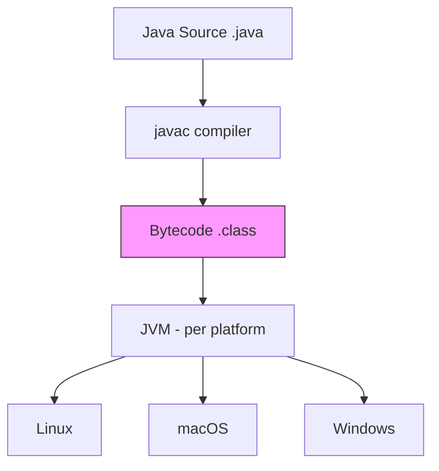
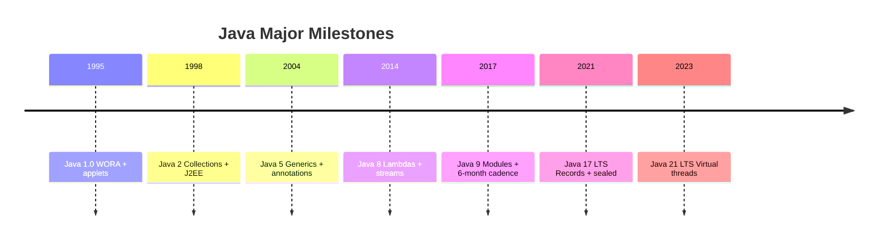
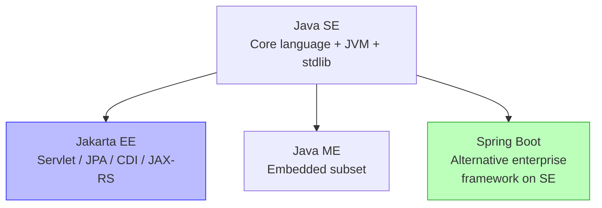
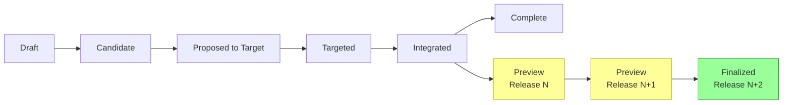
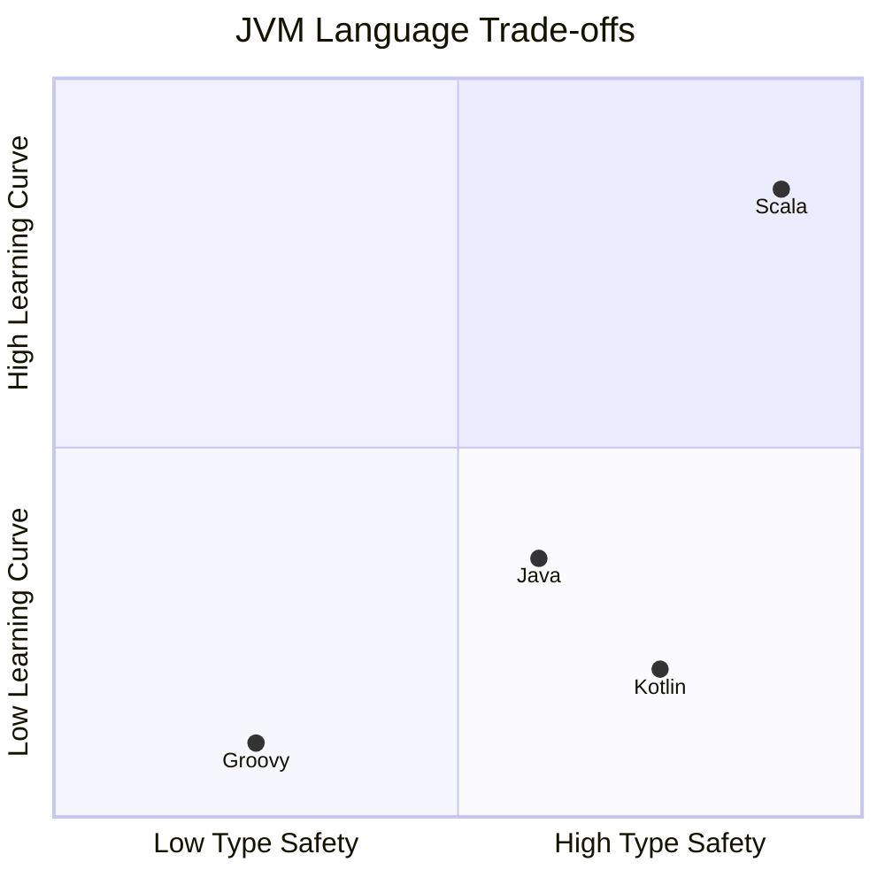

# Why Java? Design Philosophy and Guiding Principles

**TL;DR** - Java was built for safety, portability, and large-team
readability - deliberately trading raw power for predictability
across heterogeneous platforms.

**Interview Weight:** low-medium - Appears in culture-fit and
engineering philosophy rounds; signals whether you understand WHY
the language makes its choices, not just what they are.

---

### 🎯 Model Answer

**30 seconds:**

> Java was designed in the early 1990s to solve three simultaneous
> constraints: software had to run on many different hardware
> platforms without rewriting, embedded devices could not tolerate
> memory corruption crashes, and large teams needed code they could
> read and trust five years after it was written. Every Java design
> decision - the JVM, garbage collection, static typing, deliberate
> omissions - follows directly from those three original constraints.

**3 minutes (Senior):**

> When James Gosling's team at Sun was building software for cable
> set-top boxes in 1991, they kept hitting the same wall: C++ was
> powerful but platform-specific, and memory bugs caused hardware
> failures that looked like software failures. The solution was a
> two-layer architecture - compile to a portable intermediate
> bytecode, then execute that bytecode on a thin virtual machine
> per platform. That virtual machine became the JVM.
>
> This single decision cascaded into everything else. If the VM
> owns execution, it can also own memory - enabling garbage
> collection and eliminating use-after-free bugs at the cost of
> GC pauses. If the language targets teams of developers, static
> typing catches errors at compile time rather than at 3am in
> production. No pointer arithmetic meant fewer security flaws.
>
> The decision I find most revealing is what Java left OUT:
> no operator overloading, no multiple implementation inheritance,
> no global functions. Every omission was a readability bet - that
> a team maintaining a million-line codebase benefits more from
> predictability than from expressiveness.
>
> The non-obvious insight: Java's backward compatibility is not a
> technical constraint - it is a philosophical promise. Sun and
> Oracle committed that Java 1.0 code runs on Java 21. That promise
> explains every awkward corner of modern Java - generics with type
> erasure, the JPMS migration pain, the inability to remove
> java.util.Date. Backward compatibility IS the product.

**Framework:** WHAT (JVM bytecode) -> WHY (heterogeneous hardware,
embedded reliability, team readability) -> HOW (GC, static typing,
deliberate omissions) -> TRADE-OFF (safety over performance,
readability over expressiveness) -> EXAMPLE (checked exceptions as
an explicit failure contract)

_Adapting up:_ Connect backward compatibility to Project Valhalla -
value types have taken over a decade partly because retrofitting
them without breaking reflection-based frameworks is extraordinarily
hard. That IS the long-term cost of the compatibility promise.

_Adapting down:_ "Java was designed so you compile once and run
anywhere. The JVM is the portability layer; GC is the safety layer."

**Blank Mind Recovery:**

**(1) Restate:** "You are asking why Java was designed the way it was -
let me think through what problem it was solving."

**(2) First principles:** "In 1991 you had C++ - fast but
platform-specific and memory-unsafe. What constraints force
a new language design?"

**(3) Bridge:** "This is the same as why Docker was invented - 'Write
Once, Run Anywhere' but for containers instead of code."

---

### 📘 Concept Explanation

**What it is:**
Java is a compiled-then-interpreted, statically typed,
object-oriented language where source compiles to JVM bytecode -
a platform-neutral intermediate representation executed by a
per-platform virtual machine.

**The problem it solves:**
Writing software for heterogeneous hardware in 1991 meant
maintaining parallel C++ codebases per platform. Memory bugs in
C++ caused crashes on embedded devices where reliability was
non-negotiable. Large teams building shared codebases needed
code that was readable and safe by default, not by discipline.

**How it works:**

```
Java Source (.java)
       |
  javac compiler
       |
  Bytecode (.class)     <- platform-neutral
       |
  JVM (per platform)
   /    |    \
Linux  Mac  Windows
```



> **Diagram walkthrough:** Java source compiles once to bytecode
> (the pink node - platform-neutral). Each target platform runs its
> own JVM that reads identical bytecode. The JVM JIT-compiles hot
> paths to native machine code at runtime, recovering most of the
> performance cost of the abstraction layer.

**The key insight:**
Java is a series of deliberate omissions. The language is weaker
than C++ on purpose. Every left-out feature - operator overloading,
pointer arithmetic, multiple implementation inheritance - was
removed to reduce cognitive load on teams reading each other's
code. Java optimizes for code comprehension over code writing.

**When to use it:**
Large teams (10+ engineers) on long-lived (5+ year) codebases;
distributed systems where JVM tooling maturity (JFR, profilers)
has real operational value; applications where ecosystem breadth
outweighs startup-time constraints.

**When NOT to use it:**
Systems programming requiring memory layout control (use Rust or
C); scripts or data pipelines where cold startup cost matters
(JVM cold start is 0.5-2s for trivial apps); teams optimizing for
conciseness over explicit verbosity.

**Alternatives:**

- C# - Similar philosophy, Windows-first, Microsoft ecosystem
- Kotlin - JVM-based, same portability, more concise syntax
- Go - Simpler, faster startup, no JVM dependency

**First-principles derivation:**
Given: (1) heterogeneous hardware in 1991, (2) teams of many
developers, (3) embedded devices that cannot tolerate crashes.
Option A: C++ compiled per-platform - fails constraint 1.
Option B: pure interpreter - fails performance constraint.
The only solution satisfying all three: compile once to a portable
intermediate format, execute behind a safe virtual machine layer.
This IS Java's architecture. Every subsequent decision follows.

---

### 🎓 Answers by Seniority

**Junior / Mid (0-5 years):**

> Java was designed in the early 1990s for portable, safe software.
> The JVM lets you compile once and run on any platform. Design
> choices like garbage collection and static typing reduce bugs and
> keep large codebases maintainable. The conscious omissions - no
> pointer arithmetic, no operator overloading - make team-written
> code easier to read.

_Push deeper:_ Explain that the JVM does not just interpret - it
JIT-compiles hot paths to native code. Peak throughput is not
limited by interpretation overhead.

---

**Senior / Staff (5+ years):**

> Java's design philosophy is about making large-team software safe
> by DEFAULT rather than by discipline. The bytecode/JVM split
> solved the 1991 multi-platform problem; GC and static typing
> solved reliability; deliberate omissions solved readability. The
> non-obvious consequence: backward compatibility became a core
> invariant. Sun and Oracle promised Java 1.0 code runs on Java 21.
> That promise explains every awkward corner - type erasure in
> generics, JPMS migration pain, the persistence of java.util.Date.
> When you see a Java feature that looks strange, you are seeing the
> backward-compatibility tax.

_Push deeper:_ Project Valhalla (value types, primitive generics)
has taken over a decade partly because retrofitting them without
breaking reflection-heavy frameworks is extraordinarily hard. This
is the compounding cost of the "never break backward compatibility"
design goal. Kotlin avoids this by breaking APIs between major
versions - a different trade-off with real costs to library authors.

---

### ⚠️ Common Misconceptions

| #   | Misconception                                                  | Reality                                                                                                                                                                                    | Why It Matters                                                                                               |
| --- | -------------------------------------------------------------- | ------------------------------------------------------------------------------------------------------------------------------------------------------------------------------------------ | ------------------------------------------------------------------------------------------------------------ |
| 1   | "Java is slow because it is interpreted"                       | Modern JVMs JIT-compile hot paths to native code. Cold startup is slow (0.5-2s); sustained throughput competes with C++.                                                                   | Leads to wrong choices - avoiding Java for long-running services where it excels                             |
| 2   | "Write Once, Run Anywhere means identical behavior everywhere" | The JVM abstracts the OS but differences remain: file separators, default charsets, timezone handling, floating-point precision on some architectures                                      | Silent cross-platform bugs in production                                                                     |
| 3   | "Java's design goals never changed"                            | Modern Java (14+) explicitly revisits early decisions: records replace verbose POJOs, sealed classes add algebraic types, virtual threads reinvent concurrency. The philosophy evolved.    | Candidates dismissing "modern Java" miss half the language                                                   |
| 4   | "Checked exceptions are universally considered a mistake"      | Checked exceptions encode failure contracts in the type system. The problem is OVERUSE for I/O boilerplate, not the mechanism. Kotlin and Scala removed them; Java kept them deliberately. | Missing the lesson: use checked exceptions for recoverable APPLICATION failures, not infrastructure plumbing |
| 5   | "Java is an enterprise dinosaur not suitable for modern cloud" | Java has the best JVM tooling for observability (JFR, async-profiler, OpenTelemetry). GraalVM native image addresses startup time. Virtual threads address thread-per-request cost.        | Writing off Java based on 2005 reputation leads to missing the most mature distributed-systems toolchain     |

---

### 🚨 Failure Modes and Diagnosis

**Mode 1: Philosophy Misalignment in Design Reviews**

- **Symptom:** Team debates importing Scala-style combinators via
  Vavr or applying Lombok transformations that obscure the object
  model, causing confusion in code review
- **Root Cause:** Misunderstanding Java's core value - readability
  and predictability for large teams, not maximum expressiveness
- **Diagnostic:** Code review reveals patterns that fight Java's
  model: heavy use of reflection, magic bytecode manipulation, or
  DSLs that hide what the code actually does
- **Fix:** Establish team-level agreement on Java's design contract
  before adopting abstraction-heavy libraries
- **Prevention:** Include language philosophy in engineering
  onboarding; prefer idiomatic Java over imported idioms from other
  JVM languages unless the team fully understands the trade-off

**Mode 2: Ignoring the Backward Compatibility Tax**

- **Symptom:** Upgrading from Java 8 to Java 11+ breaks
  reflection-heavy frameworks (ORMs, DI containers, serialization
  libraries) with `InaccessibleObjectException`
- **Root Cause:** Third-party libraries used `sun.*` or internal
  JVM APIs that Java 9 JPMS restricts by default
- **Diagnostic command:** `java --illegal-access=warn -jar app.jar`
  (Java 11-16); look for `InaccessibleObjectException` in logs
- **Fix:** Update dependencies to JPMS-aware versions; add
  `--add-opens` flags as a short-term bridge only
- **Prevention:** Never use `sun.*` or `com.sun.*` APIs; run
  `jdeprscan` and module-graph analysis before major JVM upgrades

**Mode 3: Misapplying Java Safety Guarantees**

- **Symptom:** "Java is memory-safe so memory does not matter" leads
  to unchecked collection growth, retained references, and
  `OutOfMemoryError` in production under load
- **Root Cause:** GC prevents memory CORRUPTION (dangling pointers)
  but not memory LEAKS (live references that should not be live)
- **Diagnostic command:**
  `jcmd <pid> VM.native_memory` or
  `jmap -dump:format=b,file=heap.hprof <pid>`
  then analyze with Eclipse MAT or VisualVM
- **Fix:** Audit reference retention; use `WeakReference` or
  `SoftReference` for caches; set explicit collection size bounds
- **Prevention:** Distinguish memory safety (GC handles) from
  memory management (you still own logical object lifetime)

---

### 🎯 Interview Deep-Dive

| Signal                        | Time Guidance                             |
| ----------------------------- | ----------------------------------------- |
| Junior: define + example      | 30-60 seconds                             |
| Mid: mechanism + trade-off    | 2-3 minutes                               |
| Senior: production + decision | 3-5 minutes                               |
| Staff: system + philosophy    | 5-8 minutes                               |
| Blank mind recovery           | 30 seconds via restate + first principles |

---

**Q1 [JUNIOR] - CONCEPTUAL**
_"Why was Java created? What problem does it solve?"_

_Why they ask:_ Baseline signal - do you understand the language
you use, or only its syntax?

_Likely follow-up:_ "Why was a virtual machine necessary instead of
just compiling to native code?"

**Answer:**
Java was created in the early 1990s by James Gosling and his team
at Sun Microsystems to solve a specific problem: writing software
for embedded devices - specifically cable television set-top boxes -
that had to run on heterogeneous hardware without being rewritten
for each platform.

The core insight was separating compilation from execution. Instead
of compiling directly to platform-specific machine code (as C and
C++ did), Java compiles to an intermediate bytecode format. A
virtual machine on each target platform interprets or JIT-compiles
that bytecode. This is the "Write Once, Run Anywhere" promise.

Two additional constraints shaped the design. First, embedded
devices cannot tolerate memory corruption crashes - so automatic
garbage collection was added, eliminating use-after-free and
double-free bugs. Second, teams maintaining shared codebases needed
predictable, readable code - so features that made code harder to
reason about were deliberately omitted.

The combination - platform portability + memory safety + enforced
simplicity - made Java the dominant enterprise language for two
decades.

_What separates good from great:_ A great answer names the
CONSTRAINTS (heterogeneous hardware, embedded reliability, team
readability) rather than listing Java features. Engineers who
understand constraints can derive the features from first
principles - that is the signal interviewers look for.

---

**Q2 [JUNIOR] - CONCEPTUAL**
_"What does 'Write Once, Run Anywhere' mean in practice?"_

_Why they ask:_ Tests whether the candidate understands the JVM
model or just the marketing slogan.

_Likely follow-up:_ "Is WORA actually true? Where does it break?"

**Answer:**
Write Once, Run Anywhere means that Java bytecode, once compiled,
executes on any platform with a compatible JVM - Linux, Windows,
macOS, embedded systems - without recompilation. The JVM is the
portability layer.

In practice, WORA holds for core semantics: arithmetic, object
creation, method dispatch, and GC behavior are guaranteed identical
across platforms by the JVM specification.

However, WORA has real limits. File path handling differs between
Windows (backslash) and Unix (forward slash). Default charset
encoding can differ by JVM configuration. Timezone handling
requires explicit configuration. GUI code (AWT/Swing) has always
had platform-specific rendering quirks. Floating-point behavior
can diverge on exotic architectures.

The production lesson: test on the target platform even with Java.
WORA means no recompilation, not guaranteed identical behavior
in all edge cases. Cross-platform integration tests in CI/CD catch
the 5% of cases where WORA breaks down.

_What separates good from great:_ Acknowledging the real limits of
WORA signals production maturity. The best candidates identify
specific categories (filesystem, encoding, networking) where
cross-platform testing is non-negotiable.

---

**Q3 [MID] - MECHANISM**
_"What design trade-offs does Java make and why?"_

_Why they ask:_ Tests engineering philosophy - can you explain
decisions, not just features?

_Likely follow-up:_ "Which of those trade-offs do you think was
wrong in retrospect?"

**Answer:**
Java makes five major design trade-offs, each with a clear
rationale.

First: static over dynamic typing. All types resolved at compile
time. Gain: IDE tooling, early error detection, refactoring safety.
Cost: verbosity and inflexibility. Favors large-team codebases
where tooling productivity compounds over years.

Second: garbage collection over manual memory. Gain: memory safety,
no use-after-free bugs. Cost: GC pauses and unpredictable latency
under heap pressure. Correct for most applications; problematic for
latency-sensitive systems that needed workarounds (off-heap, the
Disruptor pattern).

Third: simplicity over expressiveness. No operator overloading,
no multiple implementation inheritance, no pointer arithmetic.
Gain: readable code in large teams. Cost: verbosity where Python
needs one line and Java needs five.

Fourth: platform portability over peak native performance. The JVM
abstraction layer has a cost. Modern JIT narrows the gap for typical
workloads but does not close it for SIMD-heavy numerical code.

Fifth: explicit failure contracts via checked exceptions. Gain:
callers must acknowledge failure modes. Cost: API verbosity;
every I/O operation throws checked exceptions. This is the most
debated - Kotlin, Scala, and C# removed checked exceptions; Java
kept them deliberately.

_What separates good from great:_ Naming a specific trade-off you
personally think was wrong and why. "Checked exceptions for I/O
boilerplate are overused - the result is catch blocks that swallow
errors. The right use is checked exceptions for recoverable
APPLICATION failures." That level of nuance is staff-level thinking.

---

**Q4 [MID] - COMPARISON**
_"How does Java's design philosophy differ from Python's or Go's?"_

_Why they ask:_ Tests ability to compare languages by first
principles, not syntax preference.

_Likely follow-up:_ "When would you choose Java over Go for a new
microservice?"

**Answer:**
Each language optimizes for different constraints.

Java optimizes for large-team safety and JVM ecosystem maturity.
Static typing, verbosity, and the module system reduce the risk of
mistakes in code maintained by teams of 20+ over 10+ years. Java
is the language for "code that must still run correctly in 2035."

Python optimizes for developer velocity and ecosystem breadth.
Dynamic typing, REPL-first development, and concise syntax make
Python the fastest path from problem to working code. The cost:
runtime errors that static analysis cannot catch, and performance
limits requiring C extensions for numerical work.

Go optimizes for operational simplicity and fast build and startup
times. Go's radical simplicity produces services that are easy to
maintain operationally. Goroutines give CSP-style concurrency. The
cost: limited abstraction power compared to Java's richer type
system.

Decision framework:

- Choose Java: mature JVM tooling matters, team is Java-fluent,
  service is long-lived with high domain complexity
- Choose Go: startup time is critical (Lambda cold starts, CLI),
  service is operationally simple, team values radical simplicity
- Choose Python: data processing, ML pipelines, rapid prototyping

_What separates good from great:_ Framing as "which constraints
does each language optimize for" rather than "which is better."
A great answer names the deciding factor for a specific scenario.

---

**Q5 [SENIOR] - TRADE-OFF**
_"What are the real costs of Java's backward compatibility promise?"_

_Why they ask:_ Tests depth - candidates who have not thought about
language evolution miss this entirely.

_Likely follow-up:_ "How has backward compatibility constrained
Java's evolution? Give a specific example."\*

**Answer:**
Java's backward compatibility promise - Java 1.0 code runs on
Java 21 - has shaped every language design decision for 30 years.
The costs are concrete.

First: generics were implemented with type erasure in Java 5 instead
of reified generics, because reified generics would have broken
binary compatibility with pre-generics bytecode. The result:
`List<String>` and `List<Integer>` are the same type at runtime.
Project Valhalla is trying to add primitive-specialized generics in
2024 - and it is extraordinarily complex precisely because type
erasure baked incompatibility into the binary format.

Second: the module system (JPMS, Java 9) took over a decade to
design and still breaks frameworks that relied on reflective access
to internal JVM packages. Every enterprise Spring application that
upgraded from Java 8 to Java 11 hit `InaccessibleObjectException`.

Third: the API surface area locks in mistakes. `java.util.Date`,
`java.util.Calendar`, and `java.io.Serializable` are well-known
design failures. They cannot be removed - only deprecated. Every
Java developer still encounters them in legacy codebases.

The cost-benefit: backward compatibility enabled a 30-year
ecosystem. The Java ecosystem EXISTS because enterprises can upgrade
JVM versions without rewriting applications. The opportunity cost
is slow evolution and decade-long feature backfill efforts.

_What separates good from great:_ A specific example with a
causal chain. "Type erasure in generics was the backward
compatibility tax paid in 2004, and Project Valhalla is still
paying it in 2024" is staff-level thinking.

---

**Q6 [SENIOR] - PRODUCTION**
_"How does Java's design philosophy affect how you build and
operate Java services?"_

_Why they ask:_ Tests whether you connect language philosophy to
production decisions.

_Likely follow-up:_ "What Java-specific tooling makes production
operations easier?"

**Answer:**
Java's design philosophy has three concrete production effects.

First: static typing and explicit structure make Java services
excellent profiling targets. JFR (Java Flight Recorder) can record
every GC event, JIT compilation decision, and thread state change
with near-zero overhead. When diagnosing a production latency
spike, a JFR recording gives a deterministic timeline that simply
is not available from Python or Node.js services. The explicitness
of Java's model is the reason this tooling is possible.

Second: the JVM's explicit memory model forces explicit thinking.
In production this means setting heap bounds (`-Xmx`, `-Xms`),
understanding GC pause budgets, and designing data structures with
object overhead in mind (a Java `Integer` object is 16 bytes; a C
int is 4 bytes). Services that ignore this hit GC pressure under
load. The discipline is higher than in languages that hide the
memory model.

Third: backward compatibility means dependencies age gracefully.
A Java service from 2015 runs on modern JVMs with minor flag
adjustments. Security patches apply at the JVM layer without
rewriting the application. This is operationally valuable for
services that must run for years.

The architectural implication: Java services are designed to live
for years, not months. This changes the cost-benefit of type-safe
APIs, extensive logging, and explicit configuration - investments
that pay back over multi-year lifespans.

_What separates good from great:_ Connecting JFR to Java's design
philosophy, not just listing "Java is good for enterprise." The
best answer shows the candidate has used JFR or async-profiler
and understands WHY Java services are better instrumented than
dynamic-language equivalents.

---

**Q7 [STAFF] - ARCHITECTURE**
_"If you were designing a new enterprise language to replace Java
today, what would you keep and what would you change?"_

_Why they ask:_ Pure staff-level question - tests ability to reason
about language design from accumulated production experience.

_Likely follow-up:_ "How does Kotlin address Java's weaknesses?
Does it go far enough?"

**Answer:**
I would keep four things and change four things.

Keep: the JVM as the execution target. Thirty years of GC
algorithms, JIT maturity, and tooling (JFR, async-profiler,
OpenTelemetry) is genuinely irreplaceable. Keep: the static type
system with local type inference - `var` in modern Java is better
calibrated than Java 1.0 verbosity. Keep: backward compatibility
as a first-class value for enterprise software. Keep: the
concurrency memory model - Java's happens-before guarantees
underpin every concurrent data structure in the ecosystem.

Change: remove checked exceptions or make them opt-in via
annotation. The friction-to-benefit ratio is negative for
infrastructure I/O; reserve them for domain-specific recoverable
failures. Change: design value types from day one rather than
retrofitting (Project Valhalla is trying to do this; it would
be simpler on a clean sheet). Change: make null non-default -
`String?` versus `String` at the type level eliminates a class
of NullPointerExceptions that no amount of annotation tooling
fully prevents. Change: reduce runtime startup cost - the JVM
starts in 0.5-2 seconds, acceptable in 2000, unacceptable for
cloud functions in 2025.

Kotlin addresses null safety and verbosity well. It does not
address startup time, module system complexity, or backward
compatibility - Kotlin breaks APIs between major versions more
freely than Java ever would.

_What separates good from great:_ Specific, reasoned positions
with causal chains, not vague "make it simpler." Naming null-safe
types by default, value types from day one, and optional checked
exceptions - with rationale - is staff-level thinking.

---

| Interviewer Type | Emphasis                                                                                                       |
| ---------------- | -------------------------------------------------------------------------------------------------------------- |
| Technical Panel  | Lead with JVM architecture, specific trade-offs. Use precise terminology: type erasure, JPMS, JIT.             |
| Hiring Manager   | Lead with business impact: backward compatibility, team productivity, ecosystem maturity.                      |
| Bar Raiser       | Lead with what Java got wrong: type erasure, checked exception overuse, JPMS migration. What you would change. |
| Peer Engineer    | Collaborative: "The thing I keep finding is Java's verbosity pays back when the codebase is 5 years old."      |

---

---

# Java Timeline: From Oak to Java 21

**TL;DR** - Java evolved from a failed embedded-device project into
the world's most deployed enterprise runtime through six landmark
releases, each fixing a foundational gap or responding to an
industry shift.

**Interview Weight:** low - Asked in senior rounds to establish
context; the key is knowing the six landmark releases and WHY each
mattered, not memorizing every minor version number.

---

### 🎯 Model Answer

**30 seconds:**

> Java started as an internal Sun project in 1991 targeting embedded
> devices, went public in 1995 as a web applet platform, and grew
> into enterprise infrastructure through six landmark releases:
> Java 2 added Collections, Java 5 added generics and annotations,
> Java 8 added lambdas and streams, Java 9 changed the release
> cadence, Java 17 delivered modern types, and Java 21 delivered
> virtual threads. Each release either fixed a foundational design
> gap or responded to an industry shift.

**3 minutes (Senior):**

> Java 5 (2004) was the first foundational redesign: generics,
> enums, annotations, autoboxing, and the enhanced for-loop all
> arrived at once. Before Java 5, collections were raw and type
> errors were runtime ClassCastExceptions. After Java 5, the
> compiler enforced type safety. Java 8 (2014) was the functional
> revolution - lambdas, streams, Optional, and the new date-time
> API together changed how Java expresses data processing.
>
> Java 9 (2017) changed not just the language but the DELIVERY
> MODEL. The module system was the structural change; the six-month
> release cadence was the process change. This means Java now
> delivers features continuously, with LTS releases (11, 17, 21)
> designated for enterprises that need multi-year support.
>
> Java 21 (2023) completed Project Loom: virtual threads that let
> millions of lightweight concurrent threads replace the reactive
> programming model. This removes the primary architecture driver
> behind reactive frameworks like WebFlux - you can write blocking
> sequential code again and get reactive-level concurrency.
>
> For production decisions: check which LTS version the system runs
> on before recommending language features. Recommending records to
> a team on Java 8 or virtual threads to a team on Java 11 signals
> poor production awareness.

**Framework:** ORIGIN (1991-1995, embedded to web) -> ENTERPRISE
(1998-2004, Collections, J2EE, generics) -> FUNCTIONAL (2014,
lambdas + streams) -> MODERN (2017+, modules, 6-month cadence,
records, virtual threads)

_Adapting up:_ The LTS timeline IS the enterprise adoption timeline.
Spring Boot 3 requires Java 17. Quarkus targets Java 21 for virtual
thread support. Framework requirements, not Java releases, drive
actual enterprise migration timelines.

_Adapting down:_ "Java 8 added lambdas, Java 17 added records and
sealed classes, Java 21 added virtual threads. Know which LTS your
team runs on - that determines which features are available."

---

### 📘 Concept Explanation

**What it is:**
Java's timeline is a 30-year evolution across six architectural
generations, each responding to a constraint the previous version
could not handle well.

**The six landmark releases:**

```
1995  Java 1.0  - WORA, applets, first public release
1998  Java 2    - Collections framework, Swing, J2EE
2004  Java 5    - Generics, enums, annotations, autoboxing
2014  Java 8    - Lambdas, streams, Optional, java.time
2017  Java 9    - JPMS modules, 6-month release cadence
2021  Java 17   - Records, sealed classes, pattern matching (LTS)
2023  Java 21   - Virtual threads, sequenced collections (LTS)
```



> **Diagram walkthrough:** Each milestone fixed a foundational gap
> or responded to an industry shift. Java 5 fixed type-unsafe
> collections. Java 8 fixed anonymous-class verbosity for
> functional patterns. Java 9 fixed the monolithic classpath and
> slow release process. Java 17 fixed boilerplate-heavy data
> modeling. Java 21 fixed the thread-per-request concurrency
> ceiling. Non-LTS releases between milestones are feature previews
> on the path to the next stable baseline.

**Release model post-Java 9:**

```
Feature releases:  every 6 months (September / March)
LTS releases:      every 2 years (Java 11, 17, 21, 25...)
LTS support:       8+ years (Oracle), 8 years (Adoptium)
Preview features:  1-2 releases before finalization
                   enabled via --enable-preview
```

**What each landmark changed:**

Java 5 (2004): Before - raw collections, int enums, no type safety.
After - generic types, real enums, annotation processing, for-each.

Java 8 (2014): Before - anonymous inner classes for every callback,
no standard functional interfaces, Joda-Time required.
After - lambda expressions, Stream API, `java.time`, Optional.

Java 9 (2017): Before - monolithic classpath, everything visible
to everything, single annual release cadence.
After - explicit module boundaries via JPMS, six-month cadence,
preview feature pipeline.

Java 17 (2021 LTS): Before - data classes required 50+ lines of
boilerplate, type hierarchies had no exhaustiveness guarantee.
After - `record` in one line, `sealed` classes with exhaustive
pattern matching.

Java 21 (2023 LTS): Before - thread-per-request required reactive
frameworks for high-concurrency. After - virtual threads let you
write blocking code with millions of concurrent fibers.

---

### 🎓 Answers by Seniority

**Junior / Mid (0-5 years):**

> Java started in 1995, but the versions that matter most for
> modern development are Java 8 (lambdas and streams), Java 17
> (records and sealed classes - current LTS baseline for most
> teams), and Java 21 (virtual threads, current LTS). Since Java 9,
> releases happen every six months. LTS versions every two years
> get multi-year support and are what enterprises target.

_Push deeper:_ Explain the preview feature mechanism - features
enter with `--enable-preview` and finalize over 1-2 releases.
Records were preview in Java 14-15, final in Java 16. Knowing this
shows awareness of how to evaluate upcoming features.

---

**Senior / Staff (5+ years):**

> The two strategic inflection points are Java 8 (2014) and Java 9
> (2017). Java 8 was the functional revolution. Java 9 changed the
> DELIVERY MODEL - six-month cadence with LTS designations. Since
> then, everything is continuous delivery of Project Amber (type
> system), Loom (concurrency), and Panama (native interop) features.
>
> For production: the LTS timeline drives framework requirements.
> Spring Boot 3 requires Java 17. Quarkus targets Java 21 for
> virtual threads. Recommending language features without knowing
> the team's LTS version is a red flag. Java 17 is the modern
> minimum; Java 21 is the target for new services.

_Push deeper:_ The Java 8 to 11 migration was the hardest in
Java's history because JPMS restricted reflective access that
Spring, Hibernate, and ByteBuddy relied on. Every team that
delayed this migration until Java 17 or 21 paid a larger tax as
frameworks raised their minimum Java version requirements.

---

### ⚠️ Common Misconceptions

| #   | Misconception                                                | Reality                                                                                                                                                                                                                                    | Why It Matters                                                                      |
| --- | ------------------------------------------------------------ | ------------------------------------------------------------------------------------------------------------------------------------------------------------------------------------------------------------------------------------------ | ----------------------------------------------------------------------------------- |
| 1   | "Most teams still run Java 8"                                | Java 8 free Oracle support ended in 2022. Active enterprise development is on Java 11, 17, or 21. Java 8 = 8-year-old feature set.                                                                                                         | Recommending Java 8 idioms for new projects signals outdated awareness              |
| 2   | "Every Java release is a separate language version to learn" | 6-month releases are incremental. LTS versions (11, 17, 21) are stable baselines. Learning Java 17 prepares you for 95% of Java 21.                                                                                                        | Unnecessary resistance to upgrading creates stagnant codebases                      |
| 3   | "Java 9 modules are mandatory for all Java code"             | JPMS is available but not required. Most applications run on the unnamed module (classpath mode). JPMS is most valuable for framework authors and multi-module libraries.                                                                  | Unnecessary complexity when teams force JPMS on monolithic apps                     |
| 4   | "Virtual threads replace reactive frameworks entirely"       | Virtual threads remove the PERFORMANCE reason for reactive. Libraries with reactive APIs still exist and may be preferred for explicit backpressure control. Structured concurrency (preview in 21) is the idiomatic virtual-thread model. | Premature rewriting of working reactive codebases before the ecosystem fully adapts |

---

### 🚨 Failure Modes and Diagnosis

**Mode 1: Version Mismatch - UnsupportedClassVersionError**

- **Symptom:** Runtime error: "class file has wrong version 65.0,
  should be 61.0"
- **Root Cause:** A dependency was compiled for a newer JVM than
  the one running it (version 65 = Java 21, 61 = Java 17,
  55 = Java 11, 52 = Java 8)
- **Diagnostic command:**
  `javap -verbose SomeClass.class | grep "major version"`
- **Fix:** Upgrade the runtime JVM or find a dependency version
  compiled for the target Java version
- **Prevention:** Set `--release 11` (not `-source`/`-target`) in
  your build. The `--release` flag restricts available standard
  library APIs to the target version - `-source`/`-target` does not.

**Mode 2: Preview Features Leak into Production**

- **Symptom:** Class compiled with `--enable-preview` fails to run
  on a JVM without that flag; or preview API changes between minor
  releases cause compile errors on next Java update
- **Root Cause:** Preview features are explicitly unstable by
  design - they can change before finalization
- **Diagnostic:** Compiler warning "note: SomeFile.java uses
  preview features of Java N"
- **Fix:** Never use `--enable-preview` in production release
  build profiles; wait for finalization in an LTS release
- **Prevention:** CI/CD gate that blocks `--enable-preview` in
  release Maven/Gradle profiles

**Mode 3: LTS Version Divergence Across Teams**

- **Symptom:** Shared library compiled on Java 21 used by a service
  running Java 11; runtime failures on APIs not present in Java 11
- **Root Cause:** No enforced minimum JVM version contract on
  shared libraries
- **Diagnostic:** `java -version` (runtime) vs
  `javac -version` (compile); check bytecode major version via
  `javap -verbose`
- **Fix:** Add `<release>11</release>` in Maven Compiler Plugin
  for the shared library; document the minimum JVM version in
  the library README
- **Prevention:** Org-wide LTS version policy; enforce with
  Maven Toolchains or Gradle java.toolchain configuration

---

### 🎯 Interview Deep-Dive

| Signal                                            | Time Guidance                                  |
| ------------------------------------------------- | ---------------------------------------------- |
| Junior: name 3 landmark releases                  | 30-45 seconds                                  |
| Mid: explain what each landmark changed           | 2 minutes                                      |
| Senior: explain why each landmark was needed      | 3-4 minutes                                    |
| Staff: connect landmark to architecture decisions | 5 minutes                                      |
| Blank mind recovery                               | "The three I always remember: 5, 8, and 21..." |

---

**Q1 [JUNIOR] - CONCEPTUAL**
_"What are the most important Java versions to know and why?"_

_Why they ask:_ Calibrates whether the candidate works with modern
Java or is stuck on Java 8 patterns.

_Likely follow-up:_ "What did Java 8 add that changed how Java is
written day-to-day?"

**Answer:**
The versions that fundamentally changed Java are Java 2/1.2 (1998,
Collections framework and J2EE), Java 5 (2004, generics and
annotations - the type safety revolution), Java 8 (2014, lambdas
and streams - the functional revolution), Java 17 (2021 LTS,
records and sealed classes - the modern type system baseline),
and Java 21 (2023 LTS, virtual threads - the concurrency revolution).

For practical purposes, Java 8 and Java 17 are the two baselines
that define what "modern Java" means. A codebase on Java 8
predates records, text blocks, pattern matching, and modern
functional idioms. Java 17 is where the majority of active
enterprise development sits in 2025.

Since Java 9 (2017), releases happen every six months with LTS
versions every two years. "We are on Java 11" means specific
features are available (var, HTTP client, text blocks in Java 13)
and specific features are unavailable (records, sealed classes,
virtual threads).

_What separates good from great:_ Knowing which Java version the
interviewing team actually runs and what that means for available
features. Naming Java 17 as the practical modern baseline shows
current industry awareness.

---

**Q2 [MID] - MECHANISM**
_"What did Java 5 generics change, and why was type erasure
the implementation approach chosen?"_

_Why they ask:_ Tests understanding of Java's backward compatibility
constraints and their concrete consequences.

_Likely follow-up:_ "What is the downside of type erasure compared
to reified generics?"

**Answer:**
Before Java 5, Java collections were raw: `List list = new
ArrayList()`. Every element retrieval required a cast. Type errors
were runtime `ClassCastException`s, not compile-time errors.

Java 5 parameterized types: `List<String>` communicates intent and
lets the compiler enforce type safety. The compiler inserts correct
casts automatically and rejects type mismatches at compile time.

Type erasure was chosen over reified generics specifically for
backward compatibility. A `List<String>` compiled to the same
bytecode as the pre-generics `List`. Libraries compiled against
Java 1.4 still worked with Java 5 without recompilation. Zero
binary incompatibility - essential given Java's install base.

The downside: at runtime, `List<String>` and `List<Integer>` are
the same type. `instanceof List<String>` does not compile. Reflection
cannot distinguish parameterized types. Frameworks that need runtime
type information (Jackson, Gson) require workarounds like
`TypeToken` (Guava).

Project Valhalla (2024+) is attempting to add primitive-specialized
generics (`List<int>`) which requires carrying type info at runtime

- the exact problem type erasure was designed to avoid in 2004. This
  is the long-tail cost of the backward-compatibility choice.

_What separates good from great:_ Explaining WHY type erasure was
chosen (backward compatibility with pre-generics bytecode) and
connecting it to the current Project Valhalla challenge. That causal
chain spanning 20 years is staff-level thinking.

---

**Q3 [MID] - TRADE-OFF**
_"Why did the switch to a 6-month release cadence (Java 9+) matter
architecturally?"_

_Why they ask:_ Tests awareness of how Java's delivery model affects
production planning and framework adoption.

_Likely follow-up:_ "What is an LTS release and why does it matter
for enterprise Java?"\*

**Answer:**
Before Java 9, Java had multi-year release cycles. Java 8 (2014),
Java 7 (2011), Java 6 (2006). Long cycles meant features were
batched into massive releases with large migration risks. Java 8
delivered lambdas, streams, Optional, a new date-time API, and
default interface methods simultaneously.

The 6-month cadence changed this to continuous feature delivery.
New features enter as previews, stabilize over 1-2 releases, then
finalize. Records previewed in Java 14, finalized in Java 16.
Virtual threads previewed in Java 19-20, finalized in Java 21.

The critical structure is the LTS designation. LTS releases (11,
17, 21) receive 8+ years of support from Adoptium and commercial
vendors. Non-LTS releases receive 6 months of support. For
enterprise applications, the question is: which LTS do you target?

The architectural consequence: framework authors target LTS
releases. Spring Boot 3 requires Java 17. Quarkus targets Java 21
for virtual thread support. The LTS timeline IS the enterprise
Java adoption timeline.

_What separates good from great:_ Connecting the LTS timeline to
concrete framework requirements. "Spring Boot 3 requires Java 17"
is the kind of production-grounded detail that signals someone
who has actually migrated a system.

---

**Q4 [SENIOR] - PRODUCTION**
_"What was the hardest Java version migration in practice and why?"_

_Why they ask:_ Tests production migration experience and
understanding of Java's architectural transitions.

_Likely follow-up:_ "How would you plan a Java 8 to 17 migration
for a large enterprise codebase?"\*

**Answer:**
The Java 8 to Java 11 migration was the hardest in Java's history,
primarily because JPMS (Java 9 module system) restricted reflective
access that many frameworks depended on.

Frameworks like Spring, Hibernate, Jackson, and ByteBuddy used
reflective access to JDK internals - `sun.reflect`,
`com.sun.misc.Unsafe`, internal XML parsers. In Java 9+, these are
behind module boundaries that default to closed. The result:
`InaccessibleObjectException` at runtime.

For a Java 8 to 17 migration on a large codebase:

1. Run `jdeprscan --release 11` and
   `jdeps --jdk-internals app.jar` to identify internal API usage
2. Update framework dependencies to JPMS-compatible versions
   (Spring 5.3+ for Java 11, Spring 6 for Java 17)
3. Add `--add-opens` JVM flags as a TEMPORARY bridge for remaining
   internal API access - treat as migration debt, not permanent fix
4. Run the full test suite on the target JVM before changing any
   source code
5. Only after step 4: upgrade source language level and adopt new
   features (records, text blocks, pattern matching)

The most common mistake: adopting new language features
simultaneously with the JVM upgrade. These are two separate
migrations. JVM upgrade first, source level second, new features
third.

_What separates good from great:_ The step-by-step migration order
and the specific diagnostic tools signal someone who has actually
done this migration. "JVM upgrade first, new features second" is
the key discipline that most teams get wrong.

---

**Q5 [SENIOR] - DEBUGGING**
_"How do you diagnose UnsupportedClassVersionError in production
and prevent it in CI/CD?"_

_Why they ask:_ Tests operational awareness of Java version
compatibility in build pipelines.

_Likely follow-up:_ "How does --release differ from -source and
-target in javac?"\*

**Answer:**
`UnsupportedClassVersionError` means a class was compiled for a
newer JVM than the one running it.

Diagnosis steps:

1. Read the error: "class file has wrong version 65.0, should be
   61.0" - version 65 = Java 21, 61 = Java 17, 55 = Java 11,
   52 = Java 8
2. `javap -verbose ClassName.class | grep "major version"` - verify
   which specific class triggered the error
3. `java -version` on the runtime host - maximum supported class
   file version
4. Identify which dependency upgrade brought in the newer-compiled
   class (often a transitive dependency)

Prevention - `--release` vs `-source`/`-target`:
The old approach (`-source 11 -target 11`) only sets the language
syntax level and bytecode version. It does NOT prevent using APIs
introduced after Java 11. You can compile "Java 11 bytecode" that
calls a Java 17 API and get `NoSuchMethodError` at runtime.

The correct approach: `--release 11` (or `<release>11</release>`
in Maven Compiler Plugin). The `--release` flag sets the language
level, bytecode version, AND restricts available standard library
APIs to those present in Java 11. This is the only reliable way to
prevent accidental use of newer APIs when targeting older JVMs.

_What separates good from great:_ Knowing the `--release` vs
`-source`/`-target` distinction. Most developers know the symptom;
explaining WHY `--release` is necessary signals genuine build
toolchain awareness.

---

**Q6 [STAFF] - ARCHITECTURE**
_"How does the Java release timeline inform how you plan long-lived
service architecture?"_

_Why they ask:_ Tests strategic thinking about platform lifecycle
management for services expected to run 5-10 years.

_Likely follow-up:_ "How do you decide when to migrate a Java 11
service to Java 21?"\*

**Answer:**
The 6-month cadence with LTS anchors changes planning for long-lived
services in two ways.

First: LTS versions define the upgrade planning horizon. Java 21
LTS (September 2023) receives security patches until at least 2031.
The practical rule: build new services on the current LTS; plan
migrations of existing services to the next LTS 12-18 months before
the current LTS reaches end-of-vendor-support.

Second: the preview feature pipeline lets you evaluate upcoming
features before LTS commitment. Virtual threads were preview in Java
19-20 (2022). Teams could evaluate performance characteristics and
API stability on non-LTS before migrating production workloads when
Java 21 finalized them. This is the ideal adoption pattern for
major features - evaluate on non-LTS, commit in LTS.

For a Java 11 to Java 21 migration decision:

- Technical driver: virtual threads eliminate the primary reason
  for reactive frameworks in most I/O-heavy services
- Cost: test on Java 21 in staging with JFR recording; compare GC
  behavior and throughput before production cutover
- Risk: `--add-opens` flags that worked in Java 11 may warn in
  Java 17 and face removal - dependency updates required

The architecture principle: treat the JVM version as a managed
dependency with a lifecycle, not as infrastructure. Assign
ownership, plan upgrades, budget migration work in roadmaps
the same way you would plan a database version upgrade.

_What separates good from great:_ The "evaluate on non-LTS, commit
in LTS" pattern and connecting virtual threads as the specific
migration driver for Java 11 to 21. Generic "stay current" is
junior thinking; naming the specific ROI calculation is staff level.

---

**Q7 [STAFF] - TRADE-OFF**
_"Which features in Java 17-21 represent the largest improvement
and why?"_

_Why they ask:_ Tests breadth of modern Java knowledge and whether
you have real opinions based on production use.

_Likely follow-up:_ "How do records and sealed classes together
change how you model domain objects?"\*

**Answer:**
Three features from Java 14-21 together represent the most
significant improvement to Java's expressive power since Java 8.

Records (final Java 16): a transparent, immutable data carrier with
auto-generated equals, hashCode, toString, and accessors. Before
records, a domain value object required 30-50 lines of boilerplate.
After: one line: `record Point(int x, int y) {}`. The deeper
benefit: records signal INTENT in code review - this is data,
not logic.

Sealed classes (final Java 17): declares the complete set of
permitted subclasses. Combined with switch expressions and pattern
matching, the compiler verifies exhaustiveness - switching over a
sealed hierarchy without covering all cases is a compile error,
not a runtime surprise. This brings algebraic data types
(familiar from Kotlin, Scala) to idiomatic Java.

Virtual threads (final Java 21): kilobytes of stack versus megabytes
for platform threads. Millions of concurrent virtual threads per
JVM. This removes the performance argument for reactive programming
in most use cases - write blocking sequential code and get
reactive-level concurrency without the Reactor mental model.

Together: records + sealed classes + pattern matching + virtual
threads define "Java 21 idiomatic." A codebase using all four is
dramatically more readable and scalable than equivalent Java 11.

_What separates good from great:_ Connecting the three features
into a coherent picture. The insight that "virtual threads remove
the primary motivation for reactive frameworks in most codebases"
is what separates staff thinking from mid-level feature awareness.

---

| Interviewer Type | Emphasis                                                                                      |
| ---------------- | --------------------------------------------------------------------------------------------- |
| Technical Panel  | Specific version numbers, feature mechanics, migration tooling (jdeps, jdeprscan, --release). |
| Hiring Manager   | LTS strategy, migration risk, team productivity from modern Java features.                    |
| Bar Raiser       | Costs of each transition - type erasure, JPMS migration pain. What the Java team got wrong.   |
| Peer Engineer    | "The 8 to 17 migration was painful because of JPMS. Virtual threads made it worth doing."     |

---

---

# Java Editions: SE, EE, ME, and Jakarta EE

**TL;DR** - Java SE is the core language and JVM; Jakarta EE is
the enterprise server-side API layer built on top; Java ME is the
embedded subset; most modern teams use SE plus Spring Boot or a
Jakarta EE server, and the operationally critical detail is the
breaking `javax.*` to `jakarta.*` namespace change in 2020.

**Interview Weight:** low - Asked to establish baseline vocabulary;
resolve the Jakarta EE namespace migration confusion and where
Spring Boot fits relative to Jakarta EE.

---

### 🎯 Model Answer

**30 seconds:**

> Java SE is the core language, JVM, and standard library. Jakarta
> EE (formerly Java EE) is the enterprise API layer on top for
> server-side work - Servlets, JPA, CDI, JAX-RS. Java ME is the
> constrained embedded subset. Most modern teams use SE plus Spring
> Boot, which is NOT Jakarta EE but overlaps it. The critical
> history: Jakarta EE 9 (2020) changed packages from `javax.*` to
> `jakarta.*` - a binary-incompatible migration that broke every
> enterprise framework simultaneously.

**3 minutes (Senior):**

> The editions exist because different deployment contexts have
> radically different needs. A server application needs transaction
> management, connection pooling, and dependency injection. An
> embedded sensor has 256KB of RAM. Java SE is the portable core
> that all editions share; the other editions add API surface areas
> for specific deployment contexts.
>
> The critical history: Java EE was developed by Sun and Oracle
> under the JCP. In 2017, Oracle transferred Java EE governance to
> the Eclipse Foundation, which renamed it Jakarta EE. In Jakarta
> EE 9 (2020), the namespace changed from `javax.*` to `jakarta.*`.
> This was not cosmetic - it was binary-incompatible. Any class file
> importing `javax.servlet.http.HttpServlet` must change to
> `jakarta.servlet.http.HttpServlet` for EE 9+ containers. Every
> framework in the ecosystem had to release a new major version.
> Spring Boot 2 used `javax.*`; Spring Boot 3 (2022) migrated to
> `jakarta.*` and requires Java 17. This coordinated migration is
> the most operationally significant event in Java enterprise
> history since EJB 3.0.
>
> Spring Boot is NOT Jakarta EE. It is an alternative enterprise
> framework that overlaps in use cases but provides its own API
> layer - Spring Data, Spring MVC, Spring Security. Most modern
> microservices use Spring Boot on Java SE; legacy enterprise
> monoliths run Jakarta EE on application servers like WildFly
> or Payara.

**Framework:** EDITIONS (SE/EE/ME) -> HISTORY (Sun -> Oracle ->
Eclipse Foundation) -> NAMESPACE MIGRATION (javax._ -> jakarta._)
-> WHERE SPRING FITS (alternative on SE, not EE, but SB 3 depends
on Jakarta EE 10 implementations)

_Adapting up:_ MicroProfile bridges Jakarta EE and cloud-native:
it adds Health, Metrics, OpenAPI, and JWT to Jakarta EE without
a heavyweight server. Quarkus and Helidon implement MicroProfile
and are the cloud-native Jakarta EE story.

_Adapting down:_ "SE is the language core. Jakarta EE adds
server-side APIs. Spring Boot is an alternative that gives similar
capabilities without requiring an application server."

---

### 📘 Concept Explanation

**What it is:**
Java editions define which API surface area is available in a
deployment context. SE is the language and JVM baseline. Jakarta
EE adds enterprise server-side APIs on top. ME is a constrained
subset for embedded hardware.

**The editions:**

```
Java SE (Standard Edition)
  Core: java.lang, java.util, java.io, java.net
  JVM + language specification
  Runs everywhere: servers, desktops, containers

Jakarta EE (formerly Java EE, Enterprise Edition)
  Built on Java SE
  Server APIs: Servlet, JPA, CDI, JAX-RS, JMS, EJB
  Requires: compatible application server
  Governance: Eclipse Foundation (since 2017)
  Namespace: javax.* (EE 8) -> jakarta.* (EE 9+)

Java ME (Micro Edition)
  Constrained subset of Java SE
  Target: 256KB-8MB RAM embedded devices
  Replaced by Android for phones; used in smart cards
```



> **Diagram walkthrough:** Java SE is the universal foundation.
> Jakarta EE (blue) is a formal API specification layer on top of
> SE, requiring a compliant application server. Java ME is a
> constrained subset of SE for embedded devices. Spring Boot
> (green) is NOT Jakarta EE - it runs directly on SE with its own
> API layer, overlapping EE use cases. Spring Boot 3 uses Jakarta
> EE 10 implementations (Tomcat 10, Hibernate 6) but its
> programming model is Spring's own.

**The Jakarta EE namespace migration:**

```
Jakarta EE 8  (2019)  Rebranded from Java EE 8
                       namespace: javax.*
Jakarta EE 9  (2020)  Namespace ONLY change
                       javax.* -> jakarta.*
                       (no new features)
Jakarta EE 9.1(2021)  Java 11 baseline
Jakarta EE 10 (2022)  Java 11 required
                       CDI Lite, Core Profile
```

The `jakarta.*` change in EE 9 was binary-incompatible.
`javax.servlet.http.HttpServlet` and
`jakarta.servlet.http.HttpServlet` are different classes at the
bytecode level. Mixing Jakarta EE 8 and EE 9+ artifacts in the
same classpath produces `ClassNotFoundException` at startup or
silent `ClassCastException` when the container casts servlet types
from different namespaces.

**Spring Boot vs Jakarta EE:**

```
Feature         Spring Boot       Jakarta EE
DI              Spring @Autowired CDI @Inject
Persistence     Spring Data       JPA / Jakarta Persistence
REST            Spring MVC        JAX-RS (Jersey / RESTEasy)
Transactions    Spring @Transact  Jakarta Transactions
Deployment      Embedded Tomcat   Application server
Namespace       jakarta.* (SB 3)  jakarta.* (EE 9+)
```

Spring Boot 2.x used `javax.*`. Spring Boot 3.x (2022) migrated
to `jakarta.*` and requires Java 17. This migration was the reason
many Spring Boot teams finally upgraded Java versions.

---

### 🎓 Answers by Seniority

**Junior / Mid (0-5 years):**

> Java SE is the core language and standard library. Jakarta EE
> adds enterprise server-side APIs - Servlet, JPA, CDI, JAX-RS -
> on top of SE for application server deployments. Java ME is the
> embedded subset. Most developers work with SE plus Spring Boot.
> Spring Boot is NOT Jakarta EE - it is an alternative framework.
> Since Spring Boot 3 (2022), Spring Boot uses the `jakarta.*`
> package namespace rather than the old `javax.*`, which is why
> migrating from Spring Boot 2 to 3 required updating all
> related dependencies.

_Push deeper:_ The `javax.*` to `jakarta.*` change was
binary-incompatible. Mixing old `javax.servlet-api` and new
`jakarta.servlet-api` in the same project causes
`ClassNotFoundException` at startup. This explains every strange
error during Spring Boot 3 migrations.

---

**Senior / Staff (5+ years):**

> The editions matter most operationally because of the Jakarta EE 9
> namespace migration (2020). Any team upgrading to Spring Boot 3 or
> a Jakarta EE 9+ application server had to audit every dependency
> for namespace compatibility - `javax.*` artifacts cannot run in
> EE 9+ containers. This coordinated migration hit the entire
> enterprise Java ecosystem simultaneously and is the most disruptive
> single change in Java enterprise history since EJB 3.0.
>
> The Spring vs Jakarta EE choice is architectural: Jakarta EE
> application servers provide full EE compliance, clustering, and
> transaction management; Spring Boot provides embedded Tomcat,
> faster local development, and more flexible configuration.
> MicroProfile fills the gap: Quarkus and Helidon implement both
> Jakarta EE and MicroProfile, offering EE API compatibility with
> cloud-native startup times. For microservices, Spring Boot or
> Quarkus dominate; for enterprise monoliths with full EE feature
> usage, Jakarta EE application servers remain common.

_Push deeper:_ Spring Boot 2 reached end-of-life in November 2023
with no further security patches from Pivotal. For internet-facing
services still on SB 2, this is the non-negotiable migration
trigger - not features. Leading with security lifecycle is the
argument that moves organizations.

---

### ⚠️ Common Misconceptions

| #   | Misconception                              | Reality                                                                                                                                                                                                              | Why It Matters                                                               |
| --- | ------------------------------------------ | -------------------------------------------------------------------------------------------------------------------------------------------------------------------------------------------------------------------- | ---------------------------------------------------------------------------- |
| 1   | "Spring Boot IS Jakarta EE"                | Spring Boot is an alternative framework. It uses Jakarta EE implementations (Tomcat, Hibernate) internally but provides its own programming model. It is NOT a Jakarta EE certified implementation.                  | Wrong expectations about API compatibility and application server deployment |
| 2   | "The javax to jakarta rename was cosmetic" | It was binary-incompatible. An EE 8 JAR (javax._) cannot be mixed with EE 9+ APIs (jakarta._). Every framework had to release new major versions simultaneously.                                                     | ClassNotFoundException when mixing EE 8 and EE 9+ artifacts                  |
| 3   | "Java ME is Android"                       | Android uses a separate runtime (ART) and class library (android.\*). It is NOT Java ME and is not portable to Java ME devices.                                                                                      | Incorrect architectural assumptions when discussing mobile Java              |
| 4   | "Jakarta EE application servers are dead"  | WildFly, Payara, TomEE, and IBM Liberty are actively maintained. Jakarta EE 10 (2022) added a Cloud Native Core Profile. For enterprise monoliths requiring full EE compliance, application servers remain relevant. | Inappropriate recommendations for contractually regulated environments       |

---

### 🚨 Failure Modes and Diagnosis

**Mode 1: javax vs jakarta Classpath Conflict**

- **Symptom:** `ClassNotFoundException: javax.servlet.Servlet`
  at startup; or `ClassCastException` when casting servlet types;
  or CDI injection silently fails
- **Root Cause:** Jakarta EE 8 and EE 9+ artifacts mixed in the
  same classpath - one provides `javax.*`, another `jakarta.*`
- **Diagnostic command:**
  `mvn dependency:tree | grep -E "servlet|persistence"`
  Both `javax.servlet-api` and `jakarta.servlet-api` in the
  same tree is the definitive red flag
- **Fix:** Align all dependencies to one namespace generation.
  For Spring Boot 3: exclude or replace `javax.servlet-api`.
- **Prevention:** Maven Enforcer banned dependency rule blocking
  `javax.servlet:javax.servlet-api` in Spring Boot 3 projects;
  run `mvn dependency:analyze` in CI/CD

**Mode 2: Staging Deployment Fails After Spring Boot 3 Migration**

- **Symptom:** App works locally (embedded Tomcat) but fails when
  deployed to staging Jakarta EE 9+ container; class loading
  errors for `javax.persistence.*` classes
- **Root Cause:** A bundled library still uses old `javax.*`
  namespace that the EE 9+ container does not provide
- **Diagnostic:**
  Scan WAR for javax._ imports:
  `unzip -p app.war WEB-INF/lib/_.jar |
  grep -l "javax\.persistence"`Or:`jdeps --jdk-internals lib.jar`
- **Fix:** Find the `jakarta.*` compatible version of the
  offending library; update `pom.xml`; verify with dependency:tree
- **Prevention:** ArchUnit or Checkstyle rule rejecting
  `import javax.` in new source; enforce in CI/CD

**Mode 3: Hibernate 6 ORM Behavior Change After Migration**

- **Symptom:** Queries that worked in Spring Boot 2 (Hibernate 5)
  produce different results or fail in Spring Boot 3 (Hibernate 6);
  column names unexpectedly changed in generated SQL
- **Root Cause:** Hibernate 6 changed default naming strategies,
  implicit join semantics, and removed deprecated Criteria API
- **Diagnostic:**
  `spring.jpa.show-sql=true` and
  `logging.level.org.hibernate.SQL=DEBUG`
  Compare generated SQL between Hibernate 5 baseline and
  Hibernate 6 for the same JPQL
- **Fix:** Add explicit `@Column(name="...")` where Hibernate 6
  naming strategy differs; rewrite deprecated Criteria API calls
- **Prevention:** Run full ORM integration test suite against
  Hibernate 6 BEFORE starting the Spring Boot 3 migration;
  treat ORM behavior as a separate migration phase from the
  namespace migration

---

### 🎯 Interview Deep-Dive

| Signal                                         | Time Guidance                                                                             |
| ---------------------------------------------- | ----------------------------------------------------------------------------------------- |
| Junior: name editions + differences            | 30-45 seconds                                                                             |
| Mid: explain javax to jakarta migration        | 2 minutes                                                                                 |
| Senior: Spring Boot vs Jakarta EE decision     | 3-4 minutes                                                                               |
| Staff: MicroProfile + cloud-native EE strategy | 5 minutes                                                                                 |
| Blank mind recovery                            | "SE = core; EE = server APIs; renamed to Jakarta EE; javax._ became jakarta._ in 2020..." |

---

**Q1 [JUNIOR] - CONCEPTUAL**
_"What is the difference between Java SE and Java EE?"_

_Why they ask:_ Baseline vocabulary - can the candidate distinguish
the language from the enterprise platform?

_Likely follow-up:_ "What is Jakarta EE and how does it relate to
Java EE?"

**Answer:**
Java SE (Standard Edition) is the core: the language specification,
JVM, and standard library - java.lang, java.util, java.io,
java.util.concurrent. It runs everywhere. When people say "I know
Java," they mean Java SE.

Java EE (Enterprise Edition) is a set of server-side API
specifications built ON TOP of Java SE - Servlets for HTTP,
JPA for database persistence, CDI for dependency injection,
JAX-RS for REST APIs, JMS for messaging. Java EE requires a
compatible application server (WildFly, Payara, IBM Liberty)
that implements these specifications.

Jakarta EE is the new name for Java EE. Oracle transferred Java EE
governance to the Eclipse Foundation in 2017. The Eclipse Foundation
renamed it Jakarta EE. In Jakarta EE 9 (2020), the package
namespace changed from `javax.*` to `jakarta.*`. So
`javax.persistence.EntityManager` is now
`jakarta.persistence.EntityManager`. This was binary-incompatible

- not cosmetic.

For practical purposes: Spring Boot microservices use Java SE.
Application server deployments use Jakarta EE.

_What separates good from great:_ Knowing that the `javax.*` to
`jakarta.*` change was binary-incompatible and required every
enterprise framework to release coordinated new major versions.
Not just "it was renamed."

---

**Q2 [JUNIOR] - CONCEPTUAL**
_"Where does Spring Boot fit relative to Jakarta EE?"_

_Why they ask:_ Tests whether the candidate understands the Java
enterprise landscape or conflates Spring with EE.

_Likely follow-up:_ "What changed when Spring Boot 3 was released?"

**Answer:**
Spring Boot is NOT Jakarta EE. They are alternatives for building
enterprise Java applications.

Jakarta EE is a set of specifications with multiple vendor
implementations (WildFly, Payara, Liberty). You write to Jakarta EE
APIs and deploy to any compliant server. Spring Boot is a single
opinionated framework by Pivotal/VMware with its own dependency
injection (Spring @Autowired), web layer (Spring MVC), and
persistence integration (Spring Data).

The key difference: Jakarta EE deploys to external application
servers; Spring Boot packages an embedded Tomcat and produces a
self-contained JAR.

Spring Boot 3 (2022) migrated from the old `javax.*` namespace to
`jakarta.*`. This means Spring Boot 3 requires Jakarta EE 10
compatible libraries. Migrating from Spring Boot 2 to 3 required
auditing every dependency - any library still using
`javax.servlet.*` causes a `ClassNotFoundException` on the new
Tomcat 10.

_What separates good from great:_ Explaining Spring Boot 3 as a
namespace compatibility migration requiring ecosystem-wide
dependency updates, not just a version bump.

---

**Q3 [MID] - MECHANISM**
_"What was the impact of the javax._ to jakarta._ namespace change
and how do you diagnose conflicts?"_

_Why they ask:_ Tests awareness of the most significant
ecosystem-wide breaking change in Java enterprise history.

_Likely follow-up:_ "How would you prevent namespace conflicts in
a new project?"\*

**Answer:**
The `javax.*` to `jakarta.*` change in Jakarta EE 9 (2020) was
binary-incompatible. Every package that was `javax.servlet`,
`javax.persistence`, `javax.inject` became `jakarta.servlet`,
`jakarta.persistence`, `jakarta.inject`.

Any class file compiled against `javax.*` APIs cannot run in a
Jakarta EE 9+ container providing only `jakarta.*`. Every major
framework had to release new versions:

- Spring Boot 3 (jakarta._) vs Spring Boot 2 (javax._)
- Hibernate 6 (jakarta._) vs Hibernate 5 (javax._)
- Jersey 3 (jakarta._) vs Jersey 2 (javax._)

Diagnosing a namespace conflict:

1. `mvn dependency:tree | grep servlet` - seeing both
   `javax.servlet-api` AND `jakarta.servlet-api` is the red flag
2. `ClassNotFoundException: javax.servlet.Servlet` on a Jakarta
   EE 9+ container = old artifact in classpath
3. The `jakarta.migration` tool scans JARs for `javax.*` import
   usage for batch migration planning
4. Prevention: Maven Enforcer banned dependency rule for
   `javax.servlet:javax.servlet-api` in Spring Boot 3 projects

_What separates good from great:_ The specific Maven dependency
tree diagnostic. "Both `javax.servlet-api` and `jakarta.servlet-api`
in the dependency tree" is the smell that reveals someone who has
actually debugged this in production.

---

**Q4 [MID] - COMPARISON**
_"When would you choose a Jakarta EE application server over
Spring Boot?"_

_Why they ask:_ Tests architectural judgment - both are valid for
different contexts.

_Likely follow-up:_ "What is MicroProfile?"

**Answer:**
Choose Jakarta EE application server when: deploying to enterprise
environments where the server is managed infrastructure (IBM Liberty
in banking, WildFly in telco); when full EE compliance is
contractually required (government procurement, vendor certifications);
when using heavyweight EE features like JCA, managed thread pools,
or cluster-aware stateful EJBs that application servers provide
out-of-the-box.

Choose Spring Boot when: building microservices with embedded
containers for independent deployment; when team velocity matters
(Spring Boot DevTools, Spring Initializr); when you need Spring-
specific features (Spring Security, Spring Batch, Spring Cloud);
when deploying to cloud platforms that favor self-contained JARs.

MicroProfile fills the gap: it adds cloud-native APIs (Health,
Metrics, OpenAPI, JWT propagation, Fault Tolerance) to Jakarta EE
without requiring a full heavyweight server. Quarkus and Helidon
implement both Jakarta EE and MicroProfile, offering EE API
compatibility with cloud-native startup times.

The 2025 reality: new microservices overwhelmingly use Spring Boot
or Quarkus. Legacy monoliths on WildFly and Liberty are maintained
but rarely created new. The line is blurring as Spring Boot 3
adopted the `jakarta.*` namespace.

_What separates good from great:_ Naming MicroProfile and Quarkus
as the cloud-native EE story. Knowing Quarkus is a credible
alternative to Spring Boot for teams that want EE API compatibility.

---

**Q5 [SENIOR] - PRODUCTION**
_"How do you manage Jakarta EE version alignment across a multi-
module Maven project to prevent namespace conflicts?"_

_Why they ask:_ Tests operational discipline around Java enterprise
dependency management.

_Likely follow-up:_ "How do you enforce this in CI/CD?"\*

**Answer:**
The core practice: use the Jakarta EE BOM to pin all EE dependencies
to one consistent version.

```xml
<dependencyManagement>
  <dependencies>
    <dependency>
      <groupId>jakarta.platform</groupId>
      <artifactId>jakarta.jakartaee-bom</artifactId>
      <version>10.0.0</version>
      <type>pom</type>
      <scope>import</scope>
    </dependency>
  </dependencies>
</dependencyManagement>
```

> **Code walkthrough:** The BOM import pins versions of all Jakarta
> EE 10 artifacts - servlet, persistence, CDI, JAX-RS. Any module
> adding `jakarta.servlet:jakarta.servlet-api` without a version
> tag inherits the BOM-managed version, preventing version drift
> across modules. This is the single most effective dependency
> management practice for Jakarta EE projects.

For Spring Boot 3, the Spring Boot BOM manages Jakarta EE versions
transitively - `spring-boot-starter-web` pulls in Tomcat 10
(Jakarta Servlet 6) automatically.

CI/CD enforcement:

1. Maven Enforcer banned dependency: block `javax.servlet-api`
   in Spring Boot 3 projects
2. `mvn dependency:analyze` to detect undeclared transitive deps
3. ArchUnit or Checkstyle rule rejecting `import javax.` in
   new source code; fail the build on violation

_What separates good from great:_ The specific
`jakarta.platform:jakarta.jakartaee-bom` artifact coordinates and
the CI/CD enforcement pattern. Generic "use the BOM" is obvious;
the specific artifact and enforcement mechanism signals operational
maturity.

---

**Q6 [SENIOR] - DEBUGGING**
_"A Spring Boot 3 migration works locally but fails in staging.
How do you diagnose it?"_

_Why they ask:_ Tests systematic debugging of classpath issues
common in EE migration scenarios.

_Likely follow-up:_ "What is the most common source of Hibernate 6
breakage after Spring Boot 3 migration?"

**Answer:**
Spring Boot 3 migration failures in staging but not local have
three primary root causes: classpath namespace conflicts, Hibernate
6 ORM behavior changes, or Spring Security 6 configuration changes.

Step 1: Read the FIRST exception in the startup log before anything
else. Do not guess.

Classpath conflict: `ClassNotFoundException` or
`ClassCastException` with `javax.*` in the stack trace.
Diagnostic: `mvn dependency:tree | grep -E "javax\.servlet"`.
Both `javax.*` and `jakarta.*` = namespace conflict.

Hibernate 6 ORM behavior: `HibernateException`,
`PropertyAccessException`, or query results that differ from
expected. Diagnostic: enable SQL logging:
`spring.jpa.show-sql=true` + `logging.level.org.hibernate.SQL=DEBUG`.
Compare generated SQL between Hibernate 5 (baseline) and 6.
Column naming differences or missing joins indicate ORM config
mismatch - Hibernate 6 changed default naming strategies.

Spring Security 6: `AccessDeniedException` for all endpoints,
or `FilterChainProxy` errors. Root cause: `WebSecurityConfigurerAdapter`
was removed in Spring 6. Security config must be rewritten using
`SecurityFilterChain` beans.

_What separates good from great:_ Starting with the first exception
rather than guessing. The three-root-cause framework and specific
diagnostic commands show systematic production debugging experience.

---

**Q7 [STAFF] - ARCHITECTURE**
_"How would you advise migrating from Spring Boot 2 + Java 11 to
Spring Boot 3 + Java 21?"_

_Why they ask:_ Tests strategic advisory ability - migration is a
cost-benefit decision, not just a technical task.

_Likely follow-up:_ "What is the risk of staying on Spring Boot 2
long-term?"\*

**Answer:**
I frame this migration across three concerns: security lifecycle,
feature ROI, and migration cost.

Security lifecycle is the primary driver. Spring Boot 2 reached
end-of-life in November 2023 - no security patches from Pivotal.
For internet-facing services, this is a non-negotiable migration
trigger. Java 11 has extended vendor support through 2026+, so
the Java upgrade is slightly less urgent - but combining both
migrations into one window is more efficient.

Feature ROI: Java 21 virtual threads are the compelling feature
argument for I/O-heavy services. If the service runs reactive code
(WebFlux) for concurrency, virtual threads may allow simplification
back to blocking sequential code with equal or better throughput.
Worth measuring in staging before committing.

Migration cost estimation:

- Simple CRUD service: 2-4 weeks (dependency updates, testing)
- Complex Hibernate mappings: 4-8 weeks (ORM behavior validation)
- Custom Spring Security configuration: 2-4 additional weeks
  (SecurityFilterChain rewrite)
- Multiple third-party integrations: do dependency audit first -
  if 3+ major libraries have not released `jakarta.*` versions,
  wait 3-6 months for the ecosystem to catch up

Migration order (non-negotiable):

1. Dependency audit - identify all `javax.*` users
2. Update framework dependencies to `jakarta.*` versions
3. Upgrade JVM version (11 to 17 or 21)
4. Update source language level
5. Adopt new features (virtual threads, records) separately

Doing steps 4 and 5 simultaneously with the namespace migration
is the most common source of extended migration timelines and
hard-to-diagnose failures.

_What separates good from great:_ Leading with security lifecycle
(Spring Boot 2 end-of-life) rather than features. "SB 2 has no
security patches" is the argument that moves organizations. The
migration order that separates namespace migration from feature
adoption is the discipline that keeps migrations predictable.

---

| Interviewer Type | Emphasis                                                                                                                           |
| ---------------- | ---------------------------------------------------------------------------------------------------------------------------------- |
| Technical Panel  | Namespace mechanics, classpath conflict diagnosis, BOM management, Hibernate 6 behavior.                                           |
| Hiring Manager   | Migration risk, cost estimation, Spring Boot 2 security EOL as migration driver.                                                   |
| Bar Raiser       | Spring vs Jakarta EE tradeoffs, MicroProfile and Quarkus as the cloud-native EE story.                                             |
| Peer Engineer    | "The javax to jakarta change cost us two weeks of dependency auditing. Hibernate 6 naming strategy hit us harder than the rename." |

---

---

# Java Community Process and JEPs: How Java Evolves

**TL;DR** - Java evolves through a formal specification process
(JCP) and an open-source JDK Enhancement Proposal (JEP) pipeline;
understanding this process explains why Java features take years
to finalize and why preview features exist.

**Interview Weight:** low - Asked in staff-level rounds to assess
whether the candidate understands Java as a living standard, not
a static language; signals awareness of language governance.

---

### 🎯 Model Answer

**30 seconds:**

> Java evolves through two overlapping processes. The JCP (Java
> Community Process) produces formal specifications (JSRs) that
> define API standards - things like JPA, Servlet, CDI. The JDK
> Enhancement Proposal (JEP) process drives actual language and
> JVM changes: a JEP is a design document for a feature that moves
> through Candidate, Proposed to Target, Targeted, Integrated, and
> Complete states before appearing in a release. Preview features
> stabilize over 1-2 releases before finalization, giving the
> community time to provide feedback before the feature is locked
> into the language forever.

**3 minutes (Senior):**

> The evolution process matters operationally because it explains
> WHY Java features take the time they do. Project Loom (virtual
> threads) started as a research project in 2017, entered preview
> in Java 19 (2022), and finalized in Java 21 (2023). Project
> Valhalla (value types) has been active since 2014 and is not
> yet finalized. The timeline is not bureaucratic delay - it is
> deliberate. Java's backward compatibility promise means a finalized
> feature cannot be removed or changed significantly. The JEP
> preview mechanism exists precisely to collect production usage
> feedback before that permanent commitment is made.
>
> For practical interview purposes: knowing which Project a feature
> belongs to (Amber, Loom, Valhalla, Panama) tells you the
> feature's intent. Project Amber adds expressive language features
> (records, sealed classes, pattern matching). Project Loom adds
> concurrency primitives (virtual threads, structured concurrency).
> Project Valhalla adds value types and primitive generics.
> Project Panama improves foreign memory and native interop.
>
> The governance also explains why changes to Jakarta EE APIs are
> separate from JDK changes - the JCP governs Enterprise Edition
> specifications; the OpenJDK community governs JDK implementation.
> Since 2017, Jakarta EE governance moved to Eclipse Foundation,
> creating a separate but parallel specification process.

**Framework:** JCP (formal specifications, JSRs) -> JEP pipeline
(design -> preview -> final) -> OpenJDK Projects (Amber, Loom,
Valhalla, Panama) -> WHAT THIS MEANS FOR PRODUCTION (preview
features, LTS timing, dependency on ecosystem catching up)

_Adapting up:_ The JEP process gives developers early access to
evaluate features via `--enable-preview`. A staff engineer tracks
the JEP pipeline to anticipate what will finalize in the next LTS
(Java 25) and plan migrations. Current watched JEPs: Valhalla
value types (JEP 401), structured concurrency (JEP 462), string
templates finalization.

_Adapting down:_ "New Java features go through a proposal and
preview phase before becoming permanent. That is why virtual
threads were available to try in Java 19 but only 'final' in
Java 21."

---

### 📘 Concept Explanation

**What it is:**
Java's evolution is governed by two complementary processes: the
Java Community Process (JCP) for API specifications, and JDK
Enhancement Proposals (JEPs) for language and JVM changes.

**The JCP (Java Community Process):**

```
JCP governs: Java SE, Jakarta EE API specifications
Process: JSR (Java Specification Request)
  -> Expert Group forms
  -> Public Review
  -> Final Approval Ballot
  -> Maintenance releases
Examples: JSR-310 (java.time), JSR-299 (CDI),
          JSR-338 (JPA 2.1)
```

The JCP is the formal standards body. When the Servlet API, JPA,
or CDI specification is updated, it goes through a JSR process
with an expert group including Oracle, Red Hat, IBM, and community
members.

**The JEP Pipeline (OpenJDK):**

```
JEP States:
  Draft        -> Author writes proposal
  Candidate    -> Submitted for JDK review
  Proposed to  -> Scheduled for a JDK release
   Target
  Targeted     -> Assigned to a specific release
  Integrated   -> Code merged into JDK repo
  Complete     -> Delivered in a release
  Withdrawn    -> Abandoned

Preview:
  Experimental features in a specific release
  Enabled via: javac --enable-preview
               java --enable-preview
  Status: may change in next release
  Goal:   collect real-world feedback before
          permanent language commitment
```



> **Diagram walkthrough:** A JEP moves from draft through candidate
> and targeting states before integration. Features that need
> community feedback enter a preview cycle (yellow) spanning 1-2
> releases before finalization (green). The preview cycle is the
> mechanism that prevents premature permanent commitment - once
> a feature finalizes, Java's backward compatibility guarantee
> means it cannot be removed or changed significantly.

**The OpenJDK Projects:**

```
Project Amber  - Language expressiveness
  Records, sealed classes, pattern matching,
  string templates, unnamed classes

Project Loom   - Concurrency
  Virtual threads, structured concurrency,
  scoped values

Project Valhalla - Type system + value types
  Primitive generics, value objects,
  inline types (in progress)

Project Panama - Native interop
  Foreign Function & Memory API,
  Vector API (SIMD)
```

**The practical timeline:**

Project Loom started 2017 -> virtual threads preview Java 19-20
(2022) -> finalized Java 21 (2023). 6-year gestation.

Project Valhalla started 2014 -> value types still in preview
as of Java 23 (2024). 10+ year gestation due to backward
compatibility constraints with generics type erasure.

---

### 🎓 Answers by Seniority

**Junior / Mid (0-5 years):**

> Java features go through a formal proposal process (JEPs). New
> features often enter as "preview" first - enabled with
> `--enable-preview` - to collect feedback before being permanently
> added to the language. Once finalized, a feature cannot be
> significantly changed due to backward compatibility. This is why
> records were in preview in Java 14-15 before finalizing in
> Java 16. The four main development projects are Amber (language
> expressiveness), Loom (concurrency), Valhalla (value types), and
> Panama (native interop).

_Push deeper:_ Explain why Valhalla is taking so long - value types
require changes to how generics work, and generics use type erasure
for backward compatibility. Retrofitting value types without
breaking existing code is extraordinarily complex.

---

**Senior / Staff (5+ years):**

> The JEP process matters for production planning: tracking which
> JEPs are targeted for the next LTS tells you what features to
> evaluate now (on non-LTS releases) and plan to adopt when the
> LTS lands. For Java 25 (2025 LTS target), I watch structured
> concurrency finalization (builds on virtual threads), string
> templates (Project Amber), and Valhalla value type previews.
>
> The JCP/JEP split also explains the Jakarta EE governance story:
> JEPs govern the JDK; the Eclipse Foundation JCP process governs
> Jakarta EE API specifications. These are separate tracks that
> must be coordinated. Spring Boot 3 targeting Jakarta EE 10 and
> Java 17 was a deliberate alignment of both tracks.
>
> The preview feature mechanism is the governance innovation that
> changed Java's evolution model. Before preview features (Java 9
> era), large features landed complete and permanent. Preview
> features let the community give real-world feedback on API design
> before permanent commitment - sealed classes went through two
> preview rounds before finalization, with minor API adjustments
> based on feedback.

_Push deeper:_ The Project Valhalla delay illustrates the
governance tension: value types need to interact with generics,
but generics use type erasure for backward compatibility. The JEP
process requires that the solution be backward-compatible with all
existing Java code. A clean-sheet language (Kotlin) can make this
change in one release; Java cannot.

---

### ⚠️ Common Misconceptions

| #   | Misconception                                    | Reality                                                                                                                                                                                                        | Why It Matters                                                                              |
| --- | ------------------------------------------------ | -------------------------------------------------------------------------------------------------------------------------------------------------------------------------------------------------------------- | ------------------------------------------------------------------------------------------- |
| 1   | "Preview features are safe to use in production" | Preview features can change API before finalization. Code compiled with --enable-preview may not compile on the next Java release if the API changed. Never use --enable-preview in production release builds. | Production breakage on minor Java version update                                            |
| 2   | "JEPs and JSRs are the same thing"               | JEPs govern JDK language/VM changes (OpenJDK project). JSRs govern Java API specifications (JCP formal process). Jakarta EE uses JSRs; JDK language features use JEPs.                                         | Confusion about where to track Java language changes vs. enterprise API changes             |
| 3   | "If a JEP is 'Integrated' it is finalized"       | Integrated means the code is merged into the JDK repository. It can still enter the release as a preview (not finalized) or be shipped as an incubator module. Check the JEP status page, not just the repo.   | Using incubator APIs that change between releases                                           |
| 4   | "Valhalla is almost done"                        | Project Valhalla has been active since 2014. Value types are complex because they must be backward-compatible with type erasure in generics. "Almost done" has been said since 2018.                           | Setting wrong expectations for when primitive generics will be available for production use |

---

### 🚨 Failure Modes and Diagnosis

**Mode 1: Preview Feature Compilation Fails on Java Upgrade**

- **Symptom:** Code that compiled on Java 21 with `--enable-preview`
  fails to compile on Java 22 with `--enable-preview`; API name
  or signature changed between preview cycles
- **Root Cause:** Preview features are explicitly allowed to change
  before finalization; this is the design intent of the preview
  mechanism
- **Diagnostic:** Check the JEP change log between Java 21 and 22
  for the specific feature; read the JDK release notes
- **Fix:** Update to the new API surface introduced in the next
  preview round
- **Prevention:** Never use `--enable-preview` in production
  release build profiles; add a Maven Enforcer check that blocks
  `--enable-preview` in release profile

**Mode 2: Incubator Module API Removed**

- **Symptom:** Code using `jdk.incubator.concurrent` (structured
  concurrency in Java 19-20) fails to compile on Java 21 because
  the package moved to `java.util.concurrent`
- **Root Cause:** Incubator modules can change package names and
  APIs when they graduate from incubator to final
- **Diagnostic:** Check JEP finalization notes for the feature;
  the package migration is documented in the JDK release notes
- **Fix:** Update import statements to the final non-incubator
  package; `java.util.concurrent.StructuredTaskScope` (Java 21+)
- **Prevention:** Treat incubator modules the same as preview
  features - evaluation only, not production

**Mode 3: JCP Specification Version Mismatch**

- **Symptom:** Framework targets a newer JPA or CDI specification
  version than the application server implements; injection or
  persistence behavior differs between local (newer server) and
  production (older server)
- **Root Cause:** JCP specification updates (JPA 3.1, CDI 4.0)
  are versioned separately from JDK and Jakarta EE versions
- **Diagnostic:** Check server admin console for implemented
  specification versions; compare to the `jakarta.persistence:
jakarta.persistence-api` version in pom.xml
- **Fix:** Align the persistence or CDI API version in pom.xml
  with the specification version the production server implements
- **Prevention:** Run integration tests against the actual target
  application server version in CI/CD, not just local embedded

---

### 🎯 Interview Deep-Dive

| Signal                                               | Time Guidance                                                                                                                 |
| ---------------------------------------------------- | ----------------------------------------------------------------------------------------------------------------------------- |
| Junior: describe JEP and preview feature             | 30-45 seconds                                                                                                                 |
| Mid: explain the four OpenJDK projects               | 2 minutes                                                                                                                     |
| Senior: preview feature lifecycle and Valhalla delay | 3-4 minutes                                                                                                                   |
| Staff: JEP tracking for LTS planning                 | 5 minutes                                                                                                                     |
| Blank mind recovery                                  | "Java features go through JEPs, often with a preview phase first. The four big projects are Amber, Loom, Valhalla, Panama..." |

---

**Q1 [JUNIOR] - CONCEPTUAL**
_"What is a preview feature in Java and should you use them in
production?"_

_Why they ask:_ Tests awareness of the language development model
and production discipline.

_Likely follow-up:_ "How do you enable preview features and what
happens if you deploy preview code to a JVM without that flag?"

**Answer:**
A preview feature is a complete but non-final language or JVM
feature that is available in a specific Java release but can still
change before it becomes permanent. It is enabled with the
`--enable-preview` flag for both the compiler and the runtime.

Preview features exist because Java has a backward compatibility
guarantee: once a feature is final, it cannot be removed or changed
significantly. The preview mechanism lets the community use the
feature in real projects and provide feedback before the API is
permanently locked. Records went through preview in Java 14 and 15
before finalizing in Java 16 with minor adjustments based on
community feedback.

In production: never use preview features. Code compiled with
`--enable-preview` requires the same flag at runtime. If you deploy
a JAR compiled with `--enable-preview` to a standard JVM, it will
fail to load at startup. Additionally, if the preview API changes
in the next Java release, your code may not compile without
modifications. Use preview features for evaluation on non-LTS
releases; wait for finalization in an LTS before adopting in
production services.

_What separates good from great:_ Knowing that both compilation
AND runtime require `--enable-preview` - not just compilation.
And knowing WHY preview features exist (to collect feedback before
permanent commitment) rather than treating them as "beta features."

---

**Q2 [MID] - CONCEPTUAL**
_"What are the OpenJDK Projects and what does each one aim to
deliver?"_

_Why they ask:_ Tests whether the candidate tracks Java's roadmap
or just consumes finalized features.

_Likely follow-up:_ "Why has Project Valhalla taken over 10 years?"

**Answer:**
The four active OpenJDK projects define Java's evolution roadmap.

Project Amber focuses on language expressiveness and productivity.
It delivered records (Java 16), sealed classes (Java 17), pattern
matching for instanceof (Java 16), switch expressions (Java 14),
text blocks (Java 15), and unnamed patterns (Java 21). The theme
is reducing boilerplate and making the language more expressive
without changing the execution model.

Project Loom focuses on concurrency. It delivered virtual threads
(final in Java 21) and is working toward finalizing structured
concurrency and scoped values. The goal is to make thread-per-task
programming scale to millions of concurrent tasks without reactive
programming complexity.

Project Valhalla focuses on the type system: value types (objects
without identity, like primitives), primitive generics (`List<int>`
instead of `List<Integer>`), and nullable value types. This is the
most complex project because value types must compose with a type
system built on type erasure - a fundamental tension that makes
the design extraordinarily difficult. Active since 2014 with no
finalization date yet.

Project Panama focuses on native interop: the Foreign Function and
Memory API (final in Java 22) replaces JNI for calling native code,
and the Vector API (incubator, multiple releases) exposes CPU SIMD
instructions for data-parallel workloads.

_What separates good from great:_ Explaining WHY Valhalla is hard
(type erasure in generics prevents straightforward value type
introduction) rather than just saying "it takes a long time."
Understanding the constraint is the staff-level signal.

---

**Q3 [MID] - TRADE-OFF**
_"Why do some Java features take years to finalize while others
land quickly?"_

_Why they ask:_ Tests understanding of the constraints that govern
Java evolution speed.

_Likely follow-up:_ "What would make Java evolution faster? What
is the cost of that speed?"\*

**Answer:**
Java feature velocity is governed by three constraints: backward
compatibility scope, ecosystem coordination, and design complexity.

Backward compatibility scope is the primary constraint. Java's
promise that Java 1.0 code runs on Java 21 means every new feature
must compose correctly with 30 years of prior language decisions.
Records were relatively fast (2 years from first JEP to final)
because they are purely additive - no existing code is affected.
Value types (Project Valhalla) are slow because they require
changing how generics work at the bytecode level, which affects
every Java library ever compiled.

Ecosystem coordination adds lead time. A new language feature
lands in the JDK first, but the ecosystem must follow:

- IDE support (IntelliJ, Eclipse)
- Build tool support (Maven, Gradle)
- Framework support (Spring, Hibernate)
- Static analysis tool support (SpotBugs, Checkstyle)

A feature may finalize in Java 17 but not be fully usable in
production until frameworks catch up - often 6-12 months later.
Records finalized in Java 16; Spring Boot fully embraced them
in Spring 6 (2022, Java 17 baseline).

Making Java evolution faster is possible (Kotlin breaks APIs freely
between major versions) but at the cost of ecosystem fragmentation
and migration burden. Java optimizes for stability over velocity.

_What separates good from great:_ Naming the SPECIFIC interaction
between value types and type erasure as the Valhalla bottleneck.
"Backward compatibility makes it hard" is obvious; "value types
need to specialize generics, but generics use type erasure for
backward compatibility, and these two constraints are in direct
conflict" is staff-level analysis.

---

**Q4 [SENIOR] - PRODUCTION**
_"How do you track the Java roadmap to make architecture decisions
ahead of LTS releases?"_

_Why they ask:_ Tests whether the candidate plans proactively or
reacts to completed releases.

_Likely follow-up:_ "What features are you watching for Java 25?"

**Answer:**
I track the Java roadmap through three sources: the JEP index
(openjdk.org/jeps/), the OpenJDK mailing lists (amber-dev,
loom-dev, valhalla-dev), and Inside Java (inside.java) which
aggregates news from the Java team.

For LTS planning: identify JEPs in "Targeted" or "Integrated"
state for releases 3-4 before the next LTS. For Java 25 (2025
LTS target), the features to evaluate now:

- Structured concurrency (JEP 462): complement to virtual threads;
  evaluate whether it simplifies existing concurrent code
- String templates finalization (currently preview): evaluate for
  template-heavy code (SQL builders, message formatting)
- Valhalla value type previews: evaluate the API design but do
  not adopt until final LTS

The evaluation process for each preview feature:

1. Enable on a non-production environment with non-LTS Java
2. Rewrite one representative service component using the feature
3. Measure: code clarity, performance impact, test coverage change
4. Document findings; share with team
5. Plan production adoption for the LTS release that finalizes

The architectural implication: virtual threads (finalized Java 21)
change the threading model for web services. Teams on Java 21 LTS
should be evaluating now whether reactive frameworks are still
justified for their workloads.

_What separates good from great:_ Having a specific evaluation
process and naming the features targeted for the next LTS with
rationale. "I watch the JEP index" is too vague; "structured
concurrency builds on virtual threads and I am evaluating whether
it simplifies our async error handling" is staff-level engagement.

---

**Q5 [SENIOR] - DEBUGGING**
_"A build that used --enable-preview on Java 21 fails on Java 22.
How do you diagnose and fix it?"_

_Why they ask:_ Tests practical awareness of preview feature risks.

_Likely follow-up:_ "How do you prevent this in the future?"

**Answer:**
Preview feature compilation failures between Java releases happen
when the feature API changed during the additional preview cycle.
This is expected and documented behavior - preview features CAN
change.

Diagnosis:

1. Check the exact compilation error. "Cannot find symbol" or
   "method not found" errors point to specific API changes.
2. Read the JEP change log between Java 21 and Java 22 for the
   affected feature. The JEP change log documents every API
   modification between preview rounds.
3. For structured concurrency: the `StructuredTaskScope` API
   changed scope patterns between Java 21 and 22 previews.
   Verify which scope factory methods were renamed or removed.
4. Check the JDK 22 release notes specifically - they list
   "Preview API changes" as a separate section.

Fix: update the code to the new API as described in the release
notes. This is usually minor (method rename or parameter reorder)
but sometimes requires architectural adjustment if the design
fundamentally changed.

Prevention:

1. Never use `--enable-preview` in production release build
   profiles - this should have been blocked at the CI/CD level
2. Add Maven Enforcer: fail the build if `--enable-preview` is
   detected in the release Maven profile
3. Treat preview features as a separate experimental branch;
   merge to main only when finalized

_What separates good from great:_ Knowing WHERE to find the
API change log (the JEP change log and JDK release notes) rather
than guessing at the cause. The Prevention section that includes
the CI/CD enforcement mechanism shows operational maturity.

---

**Q6 [STAFF] - ARCHITECTURE**
_"How does understanding the JEP process change how you plan
long-term technical architecture?"_

_Why they ask:_ Pure staff-level question - using language roadmap
as an architecture input.

_Likely follow-up:_ "How do you balance adopting new Java features
early vs. waiting for stability?"\*

**Answer:**
The JEP process changes architecture planning in three ways.

First: it creates a reliable signal for WHEN to invest in
evaluation. When a JEP moves to "Integrated" in a non-LTS
release with preview status, that is the signal to start
evaluation. When it finalizes in an LTS, that is the signal to
plan production adoption. This two-phase signal prevents both
early adoption (unstable preview) and late adoption (missed LTS
cycle).

Second: the project themes (Amber, Loom, Valhalla, Panama) let
you reason about WHICH parts of your architecture will be most
impacted. Loom (virtual threads) directly impacts services using
thread-per-request or reactive frameworks. Valhalla (value types)
will impact performance-sensitive code with many small objects
(domain value objects, financial calculations). Panama impacts
native code interop. Reading the project goals tells you where
to invest evaluation effort.

Third: the backward compatibility constraint tells you when to
NOT wait. If a feature addresses a known architectural weakness
(virtual threads addressing reactive complexity), the feature will
finalize and will be backward-compatible. The risk of adopting
on LTS is low. The risk of NOT adopting is continuing to maintain
complex reactive code that exists only for performance reasons
virtual threads eliminate.

Concrete example: I tracked Project Loom from 2020, evaluated
virtual threads on Java 19 preview in a non-production service,
documented the thread utilization improvement (from 500 platform
threads to 50,000 virtual threads at the same memory footprint),
and had a migration plan ready when Java 21 LTS landed. The team
migrated two reactive WebFlux services to virtual threads within
3 months of Java 21 release.

_What separates good from great:_ A concrete example of using the
JEP process as a planning input, not just knowing the process
abstractly. The virtual threads evaluation story with specific
numbers shows the candidate has actually done this, not just read
about it.

---

**Q7 [STAFF] - TRADE-OFF**
_"What features in the current JEP pipeline represent the highest
architectural impact and why?"_

_Why they ask:_ Tests current awareness of Java evolution with
genuine opinions.

_Likely follow-up:_ "When would you recommend adopting structured
concurrency over raw virtual threads?"\*

**Answer:**
Three JEPs in the current pipeline represent the highest
architectural impact.

Structured concurrency (JEP 462, preview in Java 21): builds on
virtual threads to add lifecycle management for concurrent subtasks.
A `StructuredTaskScope` ensures that if one subtask fails, all
sibling subtasks are cancelled, and the parent task observes the
failure. This eliminates the most common error pattern in
concurrent code: fire-and-forget tasks that fail silently. The
architectural impact: structured concurrency makes it practical
to decompose request handling into parallel subtasks without
complex error handling boilerplate.

String templates finalization (Project Amber): safe, interpolated
strings that prevent injection vulnerabilities. Unlike
`String.format()`, template processors can enforce escaping rules.
A SQL template processor can reject SQL injection attempts at
compile time. The architectural impact: secure string composition
built into the language rather than enforced by convention.

Project Valhalla value types: objects without identity semantics
that the JVM can lay out flat in memory (no pointer indirection).
The impact: domain value objects (Money, Percentage, Temperature)
that currently cost heap allocation and GC pressure could become
stack-allocated primitives. This changes the cost-benefit of
fine-grained domain modeling - currently, creating many small
objects has GC cost; with value types, it does not.

When to adopt structured concurrency over raw virtual threads:
use raw virtual threads when task lifecycle is simple (one task,
one result). Use structured concurrency when a request decomposes
into multiple concurrent subtasks where partial failure semantics
matter. The structured scope makes failure handling explicit and
correct by construction.

_What separates good from great:_ Having a specific, reasoned
opinion on each feature's architectural impact with a concrete
use case. Generic "these are interesting features" is junior
thinking. "String templates enable compile-time SQL injection
prevention" and "Valhalla changes the cost-benefit of fine-grained
domain modeling" are the insights that signal staff-level
language awareness.

---

| Interviewer Type | Emphasis                                                                                                        |
| ---------------- | --------------------------------------------------------------------------------------------------------------- |
| Technical Panel  | JEP states, preview feature mechanics, specific project features (Amber/Loom/Valhalla).                         |
| Hiring Manager   | Roadmap planning, when to adopt features, risk of staying on old Java versions.                                 |
| Bar Raiser       | Valhalla constraints (type erasure vs. value types), backward compatibility cost to evolution speed.            |
| Peer Engineer    | "I tracked Loom for 2 years before adopting. Structured concurrency makes virtual threads actually composable." |

---

---

# JVM Languages Ecosystem: Kotlin, Scala, Groovy

**TL;DR** - Kotlin, Scala, and Groovy compile to JVM bytecode and
run on the JVM alongside Java; each makes different trade-offs
between type safety, expressiveness, and pragmatism; Kotlin is the
dominant modern alternative for Android and server-side JVM work.

**Interview Weight:** low-medium - Asked in architecture and
senior rounds to test whether the candidate can reason about
language selection for JVM-based teams; the answer reveals
engineering judgment, not just language syntax knowledge.

---

### 🎯 Model Answer

**30 seconds:**

> Kotlin, Scala, and Groovy all compile to JVM bytecode and
> interoperate with Java libraries. Kotlin is pragmatic and null-
> safe with excellent Java interop - now the preferred language for
> Android and increasingly for server-side JVM work. Scala is a
> powerful hybrid functional-OOP language with a steep learning
> curve - dominant in big data (Spark) and financial systems.
> Groovy is a dynamic scripting language for the JVM - used for
> build scripts (Gradle) and testing (Spock). The decision between
> them depends on team expertise, ecosystem fit, and whether the
> type safety trade-off is worth the migration cost.

**3 minutes (Senior):**

> All three languages exist to address Java's limitations: Kotlin
> targets null safety and conciseness without sacrificing Java
> interop; Scala targets functional programming expressiveness
> and advanced type theory; Groovy targets scripting simplicity and
> dynamic dispatch.
>
> Kotlin's most important property is its Java interoperability.
> Calling Java from Kotlin and Kotlin from Java is seamless because
> Kotlin compiles to identical JVM bytecode. A Java team can
> introduce Kotlin in a single file and expand gradually. This
> made Kotlin the practical choice when Google announced it as the
> preferred Android language in 2017 and JetBrains built IntelliJ
> IDEA around it.
>
> Scala's most important property is its type system. Scala has
> higher-kinded types, type classes, and a powerful pattern matching
> system that enables libraries like Cats, ZIO, and Akka. The cost
> is a significant learning curve - idiomatic Scala requires
> understanding monadic composition and implicit resolution, which
> are advanced type theory concepts not needed in Java or Kotlin.
>
> The non-obvious insight: all three languages can hit the same
> performance ceiling - JVM performance. If you choose Scala for
> type safety and expressiveness, you get those benefits, but the
> throughput and GC behavior of the final running service is
> governed by the same JVM internals as the equivalent Java code.
> Language choice does not change the JVM performance model.

**Framework:** WHAT (all compile to JVM bytecode) -> WHY (different
Java gaps each addresses) -> HOW (Kotlin: pragmatic + null-safe;
Scala: functional + powerful type system; Groovy: dynamic + scripting)
-> DECISION FRAMEWORK (team expertise, ecosystem fit, type safety
requirements, Java interop needs)

_Adapting up:_ The language ecosystem decision affects hiring and
maintenance for 5-10 years. Kotlin engineers are widely available.
Scala engineers with idiomatic Scala expertise (not "Java written
in Scala") are significantly scarcer and more expensive. A team
that adopts Scala and loses its Scala expert has a serious
maintenance problem.

_Adapting down:_ "Kotlin, Scala, and Groovy all run on the JVM.
Kotlin is the most practical Java alternative. Scala is more
powerful but harder to learn. Groovy is for scripting."

---

### 📘 Concept Explanation

**What it is:**
JVM languages are programming languages that compile to JVM
bytecode and can interoperate with Java libraries. They share the
JVM's GC, JIT, and runtime semantics while providing different
programming models.

**How JVM language interop works:**

```
Source code (.kt / .scala / .groovy)
         |
    Language compiler
         |
  JVM Bytecode (.class)    <- same format as Java
         |
       JVM
  (identical runtime)
```

Since all JVM languages produce the same bytecode format, Java
classes can call Kotlin classes and vice versa. The interop is
genuine - not a bridge or wrapper layer.

**The three languages compared:**

```
Language  Type System    Primary Use Case    Learning Curve
Kotlin    Static, safe   Android, server JVM Low
Scala     Static, rich   Big data, FP, fin.  High
Groovy    Dynamic        Build scripts, test  Low
```



> **Diagram walkthrough:** The quadrant maps type safety against
> learning curve. Kotlin occupies the ideal quadrant for most
> teams: high type safety, low learning curve. Scala is the most
> type-safe but has the steepest learning curve. Groovy is easy
> to learn but dynamically typed. Java is the baseline - static
> typing with a low-to-medium learning curve. Language selection
> should match team expertise and project risk tolerance.

**Kotlin key properties:**

```
Null safety:    String? vs String at the type level
                Eliminates most NullPointerExceptions
Conciseness:    data class, extension functions,
                lambda syntax cleaner than Java
Coroutines:     Kotlin's async model (separate from
                Java virtual threads)
Java interop:   Bidirectional; gradual adoption possible
Null handling:  ?: (Elvis), !! (non-null assert), ?. (safe call)
```

**Scala key properties:**

```
Type system:    Higher-kinded types, type classes,
                path-dependent types
Pattern match:  Exhaustive, deconstructive, type-safe
Implicit:       (Scala 2) / Given / Using (Scala 3)
                Enables type class derivation
Ecosystem:      Spark, Akka, Play, Cats, ZIO, Slick
Editions:       Scala 2 vs Scala 3 (breaking change in 2021)
```

**Groovy key properties:**

```
Dynamic typing: Optional static typing (@CompileStatic)
Scripting:      No main() required; reduced ceremony
DSLs:           Closures and MOP enable clean DSLs
Build scripts:  Gradle build.gradle (Groovy DSL)
Testing:        Spock Framework (BDD testing DSL)
```

**Language selection decision framework:**

```
Choose Kotlin when:
  - Java team wants null safety without rewriting everything
  - Android development
  - Gradual migration path (file by file)
  - Kotlin Multiplatform for shared JVM + JS + native code

Choose Scala when:
  - Apache Spark data pipelines (Scala is first-class in Spark)
  - Team has functional programming expertise
  - Advanced type-level guarantees required (ZIO, Cats effect)
  - Financial systems with complex domain modeling

Choose Groovy when:
  - Gradle build scripts
  - Spock testing framework
  - Simple scripting or automation
  - Legacy Grails web application

Choose Java when:
  - Maximum ecosystem compatibility required
  - Team is Java-fluent, migration cost is not justified
  - Performance-critical code where JIT behavior is well-understood
  - Library or framework that must be consumable from all JVM langs
```

---

### 🎓 Answers by Seniority

**Junior / Mid (0-5 years):**

> Kotlin, Scala, and Groovy all run on the JVM and can use Java
> libraries. Kotlin is the most practical: it is null-safe,
> concise, and has excellent Java interoperability. Google made it
> the preferred Android language in 2017. Scala is more powerful
> but has a steep learning curve - it is dominant in big data with
> Apache Spark. Groovy is used for Gradle build scripts and the
> Spock testing framework. For a new JVM service, Kotlin is the
> most commonly chosen Java alternative today.

_Push deeper:_ Explain Kotlin's null safety model: `String?` vs
`String` at the type level. An `NPE` from Kotlin code (as opposed
to calling Java from Kotlin) requires the explicit `!!` operator,
which is a deliberate developer choice. This makes NPEs auditable
rather than accidental.

---

**Senior / Staff (5+ years):**

> The JVM language choice is an architecture decision with 5-10
> year implications. Kotlin is the pragmatic choice: low adoption
> risk (Java interop is seamless, gradual migration is possible),
> eliminates null safety issues, and Kotlin engineers are widely
> available. Scala is the power tool: when the team is functional
> programming fluent and the use case fits (Spark data pipelines,
> Cats/ZIO effect systems, complex domain modeling), Scala's type
> system enables correctness guarantees that Java and Kotlin cannot.
> The risk: Scala expertise is scarce and expensive; a team that
> loses its Scala expert faces a maintenance crisis.
>
> The non-obvious insight: language choice does not change JVM
> performance. Kotlin and Scala services profile and tune the same
> way as Java services - same JFR, same GC algorithms, same JIT
> behavior. Language choice is about developer productivity and
> correctness guarantees, not runtime performance.

_Push deeper:_ Kotlin Multiplatform (KMP) adds a dimension to the
language choice that pure JVM languages lack: KMP allows shared
business logic between JVM, iOS, Android, and JavaScript targets.
For organizations building mobile and backend together, KMP
changes the economic calculus significantly.

---

### ⚠️ Common Misconceptions

| #   | Misconception                                              | Reality                                                                                                                                                                                                                                        | Why It Matters                                                                                          |
| --- | ---------------------------------------------------------- | ---------------------------------------------------------------------------------------------------------------------------------------------------------------------------------------------------------------------------------------------- | ------------------------------------------------------------------------------------------------------- |
| 1   | "Kotlin is just Java with Scala features"                  | Kotlin is a distinct language designed for pragmatic Java interop and null safety first. It does not have Scala's type system depth (no higher-kinded types, no type classes natively). Kotlin Coroutines are different from Scala Future/ZIO. | Conflating the two leads to wrong expectations about what each can express                              |
| 2   | "Scala is slower than Java"                                | Idiomatic Scala compiles to identical JVM bytecode. The JIT compiler treats them equally. Poorly written Scala (excessive boxing, unnecessary allocations) can be slow - but so can poorly written Java.                                       | Rejecting Scala for performance reasons without benchmarking the actual compiled code                   |
| 3   | "Groovy is just Python for Java"                           | Groovy is a JVM language with optional static typing. Unlike Python, it can compile to static JVM bytecode with @CompileStatic. Groovy closures are first-class JVM objects, not Python's lambdas.                                             | Treating Groovy as unsuitable for non-scripting use cases (Spock testing framework is production-grade) |
| 4   | "Adding Kotlin to a Java codebase requires rewriting Java" | Kotlin has genuine bidirectional Java interop. You can start with a single Kotlin file calling existing Java classes. Gradual adoption file by file is the most common migration pattern.                                                      | Unnecessary resistance to adopting Kotlin due to perceived rewrite cost                                 |

---

### 🚨 Failure Modes and Diagnosis

**Mode 1: Kotlin-Java Interop Null Annotation Mismatch**

- **Symptom:** NullPointerException in Kotlin code calling Java
  library methods; Kotlin compiler did not warn because the Java
  parameter was not annotated with `@NotNull` or `@Nullable`
- **Root Cause:** Java APIs without null annotations are seen by
  Kotlin as "platform types" (String! notation). Kotlin cannot
  verify nullability contracts on platform types.
- **Diagnostic:** Enable `-Xjsr305=strict` in Kotlin compiler
  options to treat `@javax.annotation.Nullable` as `String?`
  and `@NotNull` as `String`. Look for `!!` operators in Kotlin
  code that should be safe calls `?.`
- **Fix:** Add `@NotNull`/`@Nullable` annotations to Java APIs
  called from Kotlin; enable `-Xjsr305=strict`; replace `!!` with
  `?: throw IllegalStateException("expected non-null")` where
  the contract is unclear
- **Prevention:** Never use `!!` (non-null assertion) on platform
  type values without verifying the Java API contract

**Mode 2: Scala 2 to Scala 3 Binary Incompatibility**

- **Symptom:** Scala 3 project fails to compile when including a
  Scala 2 library; or Scala 2 macro fails in Scala 3 because the
  macro system changed completely
- **Root Cause:** Scala 3 is binary-incompatible with Scala 2
  for libraries that use macros. The macro API changed entirely
  (Scala 2 macros vs Scala 3 macros). Most type class derivation
  libraries (Circe, Magnolia) required full rewrites for Scala 3.
- **Diagnostic:** Check library pom.xml artifact name:
  `circe-core_2.13` = Scala 2; `circe-core_3` = Scala 3
  Mixing `_2.13` and `_3` artifacts for the same library causes
  compile errors
- **Fix:** Use the `_3` artifact version for all Scala libraries;
  upgrade libraries to their Scala 3 compatible releases
- **Prevention:** In new projects, target Scala 3 from the start;
  avoid Scala 2 macro dependencies that have no Scala 3 equivalent

**Mode 3: Groovy Dynamic Dispatch MisrRoute in Production**

- **Symptom:** Groovy service works in tests but fails in
  production with `MissingMethodException` or
  `ClassCastException`; or behavior differs between environments
- **Root Cause:** Groovy without `@CompileStatic` resolves method
  calls dynamically at runtime. Type errors that a static compiler
  would catch only appear at runtime when the specific code path
  is exercised.
- **Diagnostic:** Add `@CompileStatic` annotation to the Groovy
  class and run compilation - this exposes static type errors that
  would otherwise be runtime failures
- **Fix:** Add `@CompileStatic` or `@TypeChecked` to all
  production Groovy code; use dynamic dispatch only for tested
  DSL paths (Spock specifications, Gradle scripts)
- **Prevention:** Apply `@CompileStatic` as the default for all
  non-DSL Groovy production code; enable Groovy static compilation
  in the Gradle compiler configuration

---

### 🎯 Interview Deep-Dive

| Signal                                           | Time Guidance                                                                                                                                |
| ------------------------------------------------ | -------------------------------------------------------------------------------------------------------------------------------------------- |
| Junior: describe Kotlin vs Java differences      | 30-45 seconds                                                                                                                                |
| Mid: language selection decision framework       | 2-3 minutes                                                                                                                                  |
| Senior: Kotlin-Java interop failure modes        | 3-4 minutes                                                                                                                                  |
| Staff: organizational cost of language diversity | 5 minutes                                                                                                                                    |
| Blank mind recovery                              | "All compile to JVM bytecode. Kotlin is the pragmatic Java alternative. Scala is the powerful functional option. Groovy is for scripting..." |

---

**Q1 [JUNIOR] - CONCEPTUAL**
_"What is the difference between Kotlin and Java?"_

_Why they ask:_ Baseline - tests whether the candidate has worked
with or studied modern JVM alternatives.

_Likely follow-up:_ "Can Kotlin call Java libraries?"

**Answer:**
Kotlin is a statically typed JVM language developed by JetBrains.
It compiles to the same JVM bytecode as Java and can call any Java
library directly - no bridge layer, no wrappers. A Kotlin class and
a Java class in the same Maven project can call each other as if
they were the same language.

The primary differences from Java:
Null safety at the type level: `String?` is nullable,
`String` is non-null. The compiler prevents most
`NullPointerException`s that are common in Java.
Concise syntax: `data class User(val name: String, val age: Int)`
generates equals, hashCode, toString, and copy automatically.
Extension functions: you can add methods to existing classes without
inheritance or wrappers.
Coroutines: Kotlin's async model uses cooperative multitasking
structured differently from Java's virtual threads.

Google announced Kotlin as the preferred Android language in 2017.
Since then, it has grown significantly for server-side JVM work
with frameworks like Ktor and Spring with Kotlin support.

_What separates good from great:_ Mentioning the bidirectional
Java interop - "you can adopt Kotlin in one file without rewriting
the rest of the project." This shows understanding of practical
adoption, not just language syntax.

---

**Q2 [MID] - COMPARISON**
_"When would you choose Scala over Kotlin for a new JVM service?"_

_Why they ask:_ Tests architectural judgment about language
selection with awareness of trade-offs.

_Likely follow-up:_ "What is the organizational risk of choosing
Scala?"\*

**Answer:**
Scala over Kotlin is the right choice in three scenarios.

First: Apache Spark data pipelines. Spark is written in Scala and
its Scala API is idiomatic and complete. The Python and Java Spark
APIs are wrappers that expose a subset of functionality and lag
behind the Scala API. For a data engineering team building Spark
jobs, Scala is the natural choice.

Second: functional effect systems. Cats Effect, ZIO, and FS2 are
Scala libraries that enable highly concurrent, purely functional
programs with explicit side effect management. These libraries
require Scala's type system (higher-kinded types, type classes)
and have no equivalent in Kotlin or Java. For systems where
functional correctness guarantees matter (financial calculations,
event-sourced systems), these libraries justify Scala.

Third: advanced type-level programming. When domain correctness
requires type-level guarantees (phantom types, type-safe DSLs,
compiletime-enforced state machines), Scala's type system enables
patterns that Kotlin cannot express.

The organizational risk: Scala engineers with idiomatic Scala
expertise (not Java-in-Scala) are significantly scarcer than
Kotlin engineers. Senior Scala engineers command premium salaries.
A team that builds critical infrastructure in Scala and loses its
Scala expert faces a maintenance and hiring crisis.

My framework: default to Kotlin unless there is a specific Scala
ecosystem dependency (Spark) or a type-level correctness requirement
that Kotlin cannot address.

_What separates good from great:_ Naming the hiring/maintenance
risk explicitly. Many candidates describe what Scala can do;
staff-level thinking includes what happens when the Scala expert
leaves.

---

**Q3 [MID] - MECHANISM**
_"How does Kotlin's null safety work at the JVM level?"_

_Why they ask:_ Tests understanding of Kotlin's null safety
mechanism and its limits.

_Likely follow-up:_ "What is a platform type in Kotlin and why
does it exist?"\*

**Answer:**
Kotlin's null safety is a compile-time guarantee enforced by the
Kotlin compiler. At the JVM bytecode level, a Kotlin `String`
and `String?` are both compiled to `java.lang.String` - nullable
and non-null references are the same type in JVM bytecode. Kotlin
inserts null checks at the call site and uses `@Nullable`/`@NotNull`
annotations in the generated bytecode to communicate contracts to
other tools.

The Kotlin type system distinguishes `String` (non-null) from
`String?` (nullable) at the source level. The compiler rejects
code that could cause NPE if you treat a `String?` as `String`
without a null check. Safe call (`?.`) and Elvis operator (`?:`)
are compile-time constructs that generate null checks in bytecode.

Platform types arise when calling Java code. Java APIs without
null annotations are typed as `String!` (platform type) in Kotlin

- the `!` means "unknown nullability, no guarantee." The compiler
  cannot enforce null contracts for platform types. If you call
  `list.get(0)` and the Java list returns `null`, Kotlin cannot warn
  you unless the Java API declares `@Nullable`.

The practical consequence: `!!` (non-null assertion) is safe only
when you have verified the Java API contract. Using `!!` on a
platform type without verification is reintroducing the Java-level
NPE risk into Kotlin code.

_What separates good from great:_ Explaining platform types and
the `!` notation - not just "Kotlin prevents NPE." Understanding
where the null safety guarantee ends (at Java interop boundaries)
shows production Kotlin experience.

---

**Q4 [SENIOR] - TRADE-OFF**
_"What are the organizational costs of introducing a non-Java JVM
language into a Java-fluent team?"_

_Why they ask:_ Tests thinking about organizational impact, not
just technical merit.

_Likely follow-up:_ "How would you manage the transition if the
team decided to adopt Kotlin?"\*

**Answer:**
Introducing a non-Java JVM language has five organizational costs
that are often underestimated.

Knowledge barrier: not all Java engineers will immediately be
productive in Kotlin or Scala. The time to productivity depends
on the language: Kotlin is typically 2-4 weeks for a Java engineer
to become productive. Scala can take 6-12 months to write
idiomatic code (not just Java-in-Scala).

Hiring premium: once you have Kotlin or Scala in production, you
need engineers who can maintain it. Kotlin engineers are widely
available. Idiomatic Scala engineers are scarce and expensive.

Codebase fragmentation: a codebase with mixed Java and Kotlin
files has higher cognitive load during review - reviewers must
understand both languages. Build tooling must support both.

Build complexity: Maven or Gradle must be configured to compile
both languages in the correct order (Kotlin must compile before
Java that depends on Kotlin). This is supported but adds build
configuration complexity.

Tooling coverage: static analysis tools, code coverage tools, and
security scanners often have better Java support than Kotlin or
Scala support. Some tools generate false positives or miss
Kotlin-specific patterns.

Management approach for Kotlin adoption:

1. Start with test code (lowest risk, immediate safety benefits)
2. Expand to new utility classes (not core business logic)
3. Set a style guide for Kotlin usage (use data classes, extension
   functions; avoid coroutines until the team is ready)
4. Establish a champion per team who is the Kotlin expertise node
5. Do NOT convert existing working Java classes to Kotlin for
   "modernization" - only convert when there is a clear benefit

_What separates good from great:_ The structured adoption plan,
especially "start with test code" and "do NOT convert working Java
for modernization." These are the lessons from teams that have done
the adoption. Jumping straight to converting production code is
the most common mistake.

---

**Q5 [SENIOR] - PRODUCTION**
_"How do you profile and debug a Kotlin or Scala service in
production? What changes from Java?"_

_Why they ask:_ Tests whether the candidate understands that JVM
performance tooling applies equally to all JVM languages.

_Likely follow-up:_ "Are there Kotlin or Scala-specific profiling
concerns?"\*

**Answer:**
Profiling and debugging a Kotlin or Scala service in production
uses the same JVM tooling as Java because they run on the same JVM:
JFR, async-profiler, heap dumps, jstack, jcmd. The JVM does not
know which JVM language produced the bytecode.

The standard JVM diagnostics apply:

- `jcmd <pid> JFR.start` for flight recording
- `async-profiler -d 30 -f profile.html <pid>` for CPU profiling
- `jmap -dump:format=b,file=heap.hprof <pid>` for heap analysis
- `jstack <pid>` for thread dump

Kotlin-specific considerations:

1. Stack traces include Kotlin internal frames (coroutine frames,
   lambda wrappers). These are verbose but accurate. The Kotlin
   compiler inserts `$lambda` frames for lambda expressions.
2. Coroutine stack traces: `kotlinx.coroutines.debug` agent adds
   coroutine context to stack traces, making async code much
   easier to debug. Without it, coroutine failures show a
   confusing internal coroutine machinery stack.
3. Data class `copy()` generates allocation: frequent `copy()` on
   large data classes appears in heap profiling as many short-lived
   objects. This is expected but worth confirming with profiling.

Scala-specific considerations:

1. Implicit resolution can produce unexpected method dispatch;
   compiler flag `-Xlog-implicits` (Scala 2) shows implicit
   lookups during compilation to identify unexpected behavior.
2. Futures in `scala.concurrent` use an execution context - profiling
   thread pool saturation requires checking the specific
   ExecutionContext configuration.

_What separates good from great:_ Knowing that JFR and async-
profiler apply directly to Kotlin/Scala, then naming the language-
specific nuance (Kotlin coroutine debug agent). Most candidates
know general JVM profiling; the coroutine debug agent detail shows
real Kotlin production experience.

---

**Q6 [STAFF] - ARCHITECTURE**
_"A team wants to migrate a large Java microservice to Kotlin.
How would you plan and execute this migration?"_

_Why they ask:_ Tests structured thinking about a real migration
that many teams attempt and many do badly.

_Likely follow-up:_ "What are the highest-risk parts of the
migration?"\*

**Answer:**
A Java-to-Kotlin migration should be incremental and strategic,
not a rewrite.

Phase 1 - Tooling setup (1 week):
Configure Kotlin in the build system alongside Java. Maven:
`kotlin-maven-plugin` with mixed compilation. Gradle:
`kotlin("jvm")` plugin. Verify that Java and Kotlin files compile
together and call each other correctly. Configure IDE Kotlin plugin.
Add `kotlinx.coroutines` and `kotlin.stdlib` to dependencies.

Phase 2 - Test layer first (2-4 weeks):
Convert test files to Kotlin. Tests are the lowest-risk entry
point: they are not production code, failures are caught
immediately, and Kotlin's conciseness shows immediate benefit in
test code. Data classes eliminate test fixture boilerplate.

Phase 3 - New code in Kotlin (ongoing):
All NEW classes are written in Kotlin. Existing Java classes are
not converted unless there is a specific reason (null safety issue
in a critical class, or class is being significantly refactored).

Phase 4 - Selective conversion (as needed):
Convert Java classes to Kotlin only when: (a) the class has known
null safety issues causing production bugs, (b) the class is being
significantly rewritten for a new feature, (c) the class benefits
specifically from Kotlin features (data classes, extension
functions on sealed hierarchies).

Highest-risk conversion areas:

1. Classes with complex Java generics: Kotlin's generics have use-
   site variance (`out`/`in`) vs Java's wildcards. The mapping is
   non-trivial for complex generic hierarchies.
2. Classes using Java reflection: Kotlin adds its own reflection
   layer (`KClass` vs `Class`). Frameworks that use Java reflection
   need verification that Kotlin-compiled classes are visible.
3. Singleton patterns: Java singletons use `static` fields; Kotlin
   uses `object`. The semantics differ in ways that affect
   Spring singleton bean behavior if the class is a Spring component.

_What separates good from great:_ The "test layer first" sequencing
and the specific high-risk areas (generics, reflection, singletons).
The insight that you should NOT convert working Java for
modernization - only convert when there is a specific reason - is
the discipline that separates controlled migrations from rewrites
that never finish.

---

**Q7 [STAFF] - TRADE-OFF**
_"How do you evaluate whether Kotlin Multiplatform is worth
adopting for a team building mobile and backend?"_

_Why they ask:_ Tests awareness of Kotlin's evolving role beyond
server-side JVM.

_Likely follow-up:_ "What are the current limitations of KMP that
would affect your decision?"\*

**Answer:**
Kotlin Multiplatform (KMP) allows sharing Kotlin code between JVM,
Android, iOS (via Kotlin/Native), and JavaScript targets. The
promise: write business logic once in a `commonMain` Kotlin module
and use it from Android, iOS, and backend without duplication.

Evaluation framework: the ROI of KMP depends on the amount of
genuinely shareable logic.

High ROI scenarios:

- Domain models (entities, value objects, validation logic) that
  must behave identically on mobile and backend
- Data transformation and business rule logic (discount calculations,
  eligibility checks) duplicated in iOS, Android, and server
- Protocol buffer / JSON serialization schemas used across targets

Low ROI scenarios:

- UI code (never shared in KMP - each platform uses native UI)
- Platform-specific networking (KMP provides Ktor as a common
  client, but platform networking behavior differs)
- Teams with no iOS Swift expertise - KMP generates Objective-C
  headers, not Swift modules natively (Kotlin/Swift interop is
  improving but not complete in 2025)

Current limitations (2025):

1. Kotlin/Native compilation is significantly slower than JVM
   compilation; affects build times in CI/CD
2. Kotlin/Native memory model changed in Kotlin 1.7; some
   legacy KMP libraries have not been updated
3. Compose Multiplatform (UI framework) is relatively mature
   for Android and desktop, less mature for iOS
4. Swift interop is a top KMP priority but not yet as seamless
   as Java-Kotlin interop

Recommendation framework:

- If 30%+ of the codebase is genuinely shareable domain logic:
  KMP ROI is positive. Start with a proof-of-concept shared module.
- If the team lacks iOS native expertise: defer KMP until the iOS
  team is trained on consuming Kotlin/Native frameworks.
- If the team already uses Kotlin on Android and backend: KMP
  adds incremental complexity, not a language learning curve.

_What separates good from great:_ Having specific percentages and
concrete examples of what IS and IS NOT shareable. Generic "KMP
reduces code duplication" is obvious. "30%+ shareable domain logic"
and naming the specific limitations (Swift interop, Kotlin/Native
build speed) shows someone who has evaluated KMP seriously.

---

| Interviewer Type | Emphasis                                                                                                   |
| ---------------- | ---------------------------------------------------------------------------------------------------------- |
| Technical Panel  | JVM bytecode interop, null safety mechanism, platform types, Scala type system depth.                      |
| Hiring Manager   | Organizational cost of language diversity, hiring risk for Scala, Kotlin adoption ROI.                     |
| Bar Raiser       | Language selection decision framework, Kotlin Multiplatform evaluation, why you default to Java.           |
| Peer Engineer    | "We adopted Kotlin in tests first. Six months later, all new code is Kotlin. We never converted old Java." |
