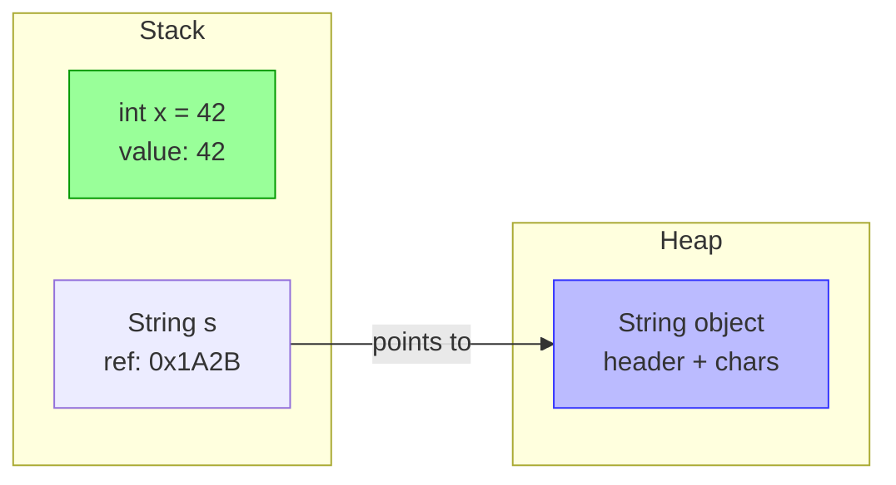

# Primitives vs References: The Two Type Universes

**TL;DR** - Java has two completely separate type universes: 8
primitive types stored by value and everything else stored as
heap references; confusing them causes autoboxing overhead,
`==` bugs, and `NullPointerException`s.

**Interview Weight:** medium - Asked at every level; the `==` vs
`equals` trap and autoboxing cost appear in debugging and
design questions from junior to staff.

---

### 🎯 Model Answer

**30 seconds:**

> Java has exactly two type universes. Primitives - byte, short,
> int, long, float, double, char, boolean - are raw values stored
> directly in memory with no overhead. Reference types are objects
> on the heap; a variable holds a pointer to the object, not the
> object itself. The practical consequences: primitives use `==`
> for value comparison; references use `==` for identity and
> `equals()` for value comparison. Primitives cannot be null;
> references can. Generics only accept reference types - that is
> why `List<int>` is illegal and `List<Integer>` is required.

**3 minutes (Senior):**

> The two type universes exist because of a performance tradeoff
> made in Java's original design. Objects carry a header (typically
> 12-16 bytes on a 64-bit JVM) plus field data, plus alignment
> padding. An `int` is always 4 bytes - no header, no pointer
> indirection. For code that processes millions of numbers, the
> difference between `int[]` and `Integer[]` is the difference
> between 4 MB and 80+ MB of heap, plus the GC pressure difference.
>
> The tradeoff cost shows up in three production situations.
> First: autoboxing - Java silently wraps primitives in Objects
> when a reference type is required. `list.add(42)` boxes 42 into
> a new `Integer(42)`. In a tight loop adding thousands of values
> to a list, this generates thousands of short-lived objects and
> triggers GC. Second: the `==` trap. `Integer a = 127;
Integer b = 127; a == b` is `true` because the Integer cache
> covers -128 to 127. `Integer a = 128; Integer b = 128; a == b`
> is `false` because cache is exhausted and two separate objects
> are allocated. This is a production bug that only manifests
> outside the cache range. Third: null safety. You can never get
> a `NullPointerException` from a primitive. The NullPointerException
> is exclusively a reference type failure. Any code that receives
> an `Integer` instead of `int` must handle the null case or it
> is incorrect.
>
> Project Valhalla (Java roadmap) will eventually add value types -
> objects that behave like primitives (no identity, flat in memory).
> This is the 10-year effort to close the gap between the two type
> universes without breaking backward compatibility.

**Framework:** WHAT (8 primitives vs reference types) -> WHY
(performance: no header, no pointer, no GC) -> HOW THEY DIFFER
(==, null, autoboxing, generics) -> PRODUCTION COST (autoboxing,
Integer cache trap) -> FUTURE (Project Valhalla)

_Adapting up:_ Discuss the memory layout difference: an `int[]`
of 1000 elements is one contiguous 4KB block; `Integer[]` of 1000
elements is 1000 heap objects plus a 8KB array of pointers. CPU
cache efficiency is completely different. This matters at scale.

_Adapting down:_ "Primitives are raw values - `int x = 5`. Reference
types are objects - `String s = "hello"`. With primitives, `==`
compares values. With objects, `==` compares whether they are the
same object in memory."

---

### 📘 Concept Explanation

**What it is:**
Java has 8 primitive types (boolean, byte, char, short, int, long,
float, double) that are raw values stored directly, and reference
types (classes, interfaces, arrays, enums) where variables store
a pointer to a heap object.

**The problem it solves:**
Object headers and pointer indirection are expensive. A language
that makes everything an object (like early Python) pays a constant
per-value overhead: header bytes, pointer chasing, GC tracking.
Java primitives exist to make numeric and boolean computation as
efficient as C while still being an object-oriented language.

**How it works:**

```
PRIMITIVES               REFERENCES
---------                ----------
int x = 42;              String s = "hello";
                         Integer n = 42;

Stack:                   Stack:
 x: [42]                  s: [ref -> heap]
                          n: [ref -> heap]

Heap: (nothing)          Heap:
                          "hello" [header|chars]
                          Integer [header|42  ]
```



> **Diagram walkthrough:** The primitive `int` lives entirely on
> the stack as a raw 4-byte value - no heap involvement. The
> `String` reference lives on the stack as a pointer; the actual
> `String` object (header + character data) lives on the heap.
> Accessing a primitive is a direct read; accessing an object
> requires following the pointer from stack to heap.

**The 8 primitive types:**

```
Type     Size   Default  Range
boolean  1 bit  false    true / false
byte     8 bit  0        -128 to 127
char     16 bit '\u0000' 0 to 65535 (Unicode)
short    16 bit 0        -32768 to 32767
int      32 bit 0        -2^31 to 2^31-1
long     64 bit 0L       -2^63 to 2^63-1
float    32 bit 0.0f     IEEE 754 single
double   64 bit 0.0d     IEEE 754 double
```

**Key behavioral differences:**

```
               Primitive      Reference
Default value  0/false/'\0'   null
Can be null    No             Yes
== semantics   Value equal    Identity equal
In generics    Illegal        Legal
Autoboxed to   Wrapper class  N/A
Memory         Inline         Heap + pointer
```

**The Integer cache trap:**

```java
// BAD - falls into Integer cache trap
Integer a = 127;
Integer b = 127;
System.out.println(a == b);   // true  (cached)

Integer c = 128;
Integer d = 128;
System.out.println(c == d);   // false (not cached!)
System.out.println(c.equals(d)); // true (always correct)
```

> **Code walkthrough:** Java caches `Integer` objects for values
> -128 to 127. Within this range `==` accidentally works because
> the same object is reused. Outside this range, two separate
> `Integer` objects are allocated and `==` compares pointers - not
> values. Always use `.equals()` for Integer comparison. This bug
> only manifests in production with values outside the cache range.

**The key insight:**
The two type universes are a deliberate performance decision with
an ergonomic cost. Java chose to make numeric primitives fast
by default and let the programmer pay an explicit tax (autoboxing,
wrapper classes) when they need object semantics (null, generics,
collections). The tax is invisible in source code but visible in
heap profiles.

---

### 💻 Code Example

**BAD - Common autoboxing traps:**

```java
// BAD: unintentional autoboxing in a loop
List<Integer> numbers = new ArrayList<>();
for (int i = 0; i < 100_000; i++) {
    numbers.add(i);  // boxes each int -> Integer
    // 100,000 Integer objects created on heap
}

// BAD: NullPointerException from unboxing null
Integer nullableCount = getCount(); // may return null
int count = nullableCount; // NPE if nullableCount is null

// BAD: == on Integer outside cache range
Integer x = 1000;
Integer y = 1000;
if (x == y) {  // false! different objects
    process(x);
}
```

> **Code walkthrough:** Three distinct failure modes. The loop
> creates 100,000 short-lived `Integer` objects - a GC pressure
> source visible in async-profiler as allocation hotspot. The null
> unboxing causes NPE at the `=` assignment, not at `getCount()`.
> The `==` comparison silently compares object identity, not value.

**GOOD - Correct usage patterns:**

```java
// GOOD: use primitive arrays for numeric data
int[] numbers = new int[100_000];
for (int i = 0; i < numbers.length; i++) {
    numbers[i] = i;  // no boxing, contiguous memory
}

// GOOD: null-safe unboxing
Integer nullableCount = getCount();
int count = (nullableCount != null) ? nullableCount : 0;
// or: int count = Objects.requireNonNullElse(nullableCount, 0);

// GOOD: always use equals() for Integer comparison
Integer x = 1000;
Integer y = 1000;
if (x.equals(y)) {  // true, compares values
    process(x);
}
// BEST: use primitives when object semantics not needed
int a = 1000;
int b = 1000;
if (a == b) { process(a); }  // correct, == for primitives
```

> **Code walkthrough:** Primitive arrays avoid per-element boxing.
> Null-safe unboxing prevents NPE. `equals()` always compares value
> correctly for all integers - not just the cached range. The final
> pattern shows the root fix: use `int` instead of `Integer` when
> null and collection semantics are not required.

**How to verify correctness:**
Run with `-XX:+PrintGCDetails` to detect unexpected GC pressure
from autoboxing. Use async-profiler allocation profiling to find
boxing hotspots: `async-profiler -e alloc -d 30 -f alloc.html <pid>`.

---

### 🎓 Answers by Seniority

**Junior / Mid (0-5 years):**

> Java has 8 primitive types - int, long, double, boolean, etc. -
> that store raw values directly. Everything else is a reference
> type where the variable holds a pointer to a heap object. The
> key differences: primitives cannot be null (no NPE), use `==`
> for value comparison, and cannot be used in generics directly
> (use Integer instead of int in List). Autoboxing converts
> automatically between them but has a performance cost.

_Push deeper:_ Explain the Integer cache: values -128 to 127 are
cached, so `==` accidentally works for small integers. Outside
that range, `==` compares object identity. Always use `.equals()`
for Integer comparisons.

---

**Senior / Staff (5+ years):**

> The two type universes are a performance trade-off with real
> production implications. An `int[]` of 1M elements is a single
> 4MB heap block. An `Integer[]` of 1M elements is 1M objects plus
> an 8MB pointer array - roughly 20x more memory and far worse CPU
> cache behavior. In tight loops, autoboxing shows up as allocation
> hotspots in async-profiler. The Integer cache trap is a common
> production bug: `==` on Integer accidentally works for -128 to 127
> and silently fails outside that range. Project Valhalla (value
> types) is the decade-long effort to close this gap by making
> Objects that behave like primitives - no header, flat in memory.

_Push deeper:_ Escape analysis by the JIT can eliminate heap
allocation for short-lived objects (scalar replacement). In some
cases, a `new Integer(42)` in a method never actually hits the
heap. But this is JIT-dependent and unreliable as a performance
strategy. Measuring with JFR or async-profiler is the only way to
know for a specific workload.

---

### ⚠️ Common Misconceptions

| #   | Misconception                            | Reality                                                                                                                                                                                                                   | Why It Matters                                                                                      |
| --- | ---------------------------------------- | ------------------------------------------------------------------------------------------------------------------------------------------------------------------------------------------------------------------------- | --------------------------------------------------------------------------------------------------- |
| 1   | "`==` works fine for comparing integers" | `==` compares value for primitives but identity for references. For `Integer` objects, `==` gives wrong results for values outside -128 to 127 (the JVM cache range).                                                     | Silent bug that only manifests with larger numbers in production                                    |
| 2   | "Java is pass-by-reference for objects"  | Java is always pass-by-value. For objects, the VALUE passed is the reference (pointer). You can mutate the object through the pointer, but you cannot change what the caller's variable points to.                        | Fundamental misunderstanding of Java's memory model; causes wrong predictions about method behavior |
| 3   | "Autoboxing is free"                     | Each autoboxing operation allocates a new object (outside the cache range) and puts GC pressure on the heap. In tight numeric loops, this is measurable.                                                                  | Performance surprises in numeric-heavy code using collections                                       |
| 4   | "Primitives are always stack-allocated"  | Primitive fields of objects are stored inline in the object on the heap, not on the stack. Only local primitive variables in methods may be stack-allocated (and JIT escape analysis can even move objects to the stack). | Oversimplified mental model leads to wrong heap vs. stack reasoning                                 |
| 5   | "null is a primitive value"              | null is only valid for reference types. A primitive variable can never be null. Receiving null when a primitive is expected causes NPE on the unboxing operation.                                                         | Null-unboxing NPE appears at assignment, not at the source of null, making it confusing to debug    |

---

### 🚨 Failure Modes and Diagnosis

**Mode 1: NullPointerException from Unboxing**

- **Symptom:** NPE at a seemingly simple assignment like
  `int count = getCount()` where `getCount()` returns `Integer`
- **Root Cause:** `getCount()` returned null; Java tries to
  unbox null to int, which throws NPE
- **Diagnostic:** Enable enhanced NPE messages in Java 14+:
  `-XX:+ShowCodeDetailsInExceptionMessages` shows exactly which
  variable was null. Look for the specific unboxing site.
- **Fix (BAD -> GOOD):**

```java
// BAD: unguarded unboxing
int count = repository.getCount(); // NPE if null

// GOOD: explicit null guard
Integer rawCount = repository.getCount();
int count = rawCount != null ? rawCount : 0;
```

> **Code walkthrough:** The BAD pattern fails silently when the
> repository returns null for "no data found." The GOOD pattern
> provides an explicit default. The enhanced NPE message in Java 14+
> will say "Cannot invoke `Integer.intValue()` because the return
> value of `Repository.getCount()` is null" - pointing exactly to
> the unboxing site.

- **Prevention:** Return `OptionalInt` from APIs that may have
  no value; use primitives in signatures where null is not a
  valid state

**Mode 2: Integer Cache Equality Trap**

- **Symptom:** Unit tests pass (using small integers) but
  production code has wrong conditional logic; or
  `assertEquals` passes but `assertTrue(a == b)` fails
- **Root Cause:** Using `==` to compare Integer objects; works
  for -128 to 127 (cached), silently fails outside
- **Diagnostic:** Add logging: `System.out.println(
  a + " == " + b + " -> " + (a == b)
  - " | equals: " + a.equals(b))` - the divergence appears
    at value 128+
- **Fix:** Always use `.equals()` for Integer comparison; use
  `int` primitives when null is not a valid state
- **Prevention:** Static analysis rule: flag `==` usage on boxed
  types (`Integer`, `Long`, `Double`) in code review or via
  SpotBugs rule `BX_UNBOXING_IMMEDIATELY_REBOXED`

**Mode 3: Autoboxing Allocation Hotspot**

- **Symptom:** Unexpectedly high GC rate in numeric processing
  loop; heap allocation profiling shows `Integer` as top
  allocation site
- **Root Cause:** Adding `int` values to `List<Integer>` or
  passing primitives to methods accepting boxed types inside
  tight loops
- **Diagnostic command:**
  `async-profiler -e alloc -d 30 -f alloc.html <pid>`
  Look for `java.lang.Integer` or `java.lang.Long` in the
  top allocation sites
- **Fix:** Use primitive arrays or specialized collections:
  Eclipse Collections `IntList`, `LongArrayList`, or
  `java.util.stream.IntStream` instead of `Stream<Integer>`
- **Prevention:** Prefer `int[]` over `List<Integer>` for
  large numeric data; use `IntStream` for numeric pipelines

---

### 🎯 Interview Deep-Dive

| Signal                                           | Time Guidance                                                                                           |
| ------------------------------------------------ | ------------------------------------------------------------------------------------------------------- |
| Junior: define primitives and references         | 30-45 seconds                                                                                           |
| Mid: autoboxing cost and == trap                 | 2 minutes                                                                                               |
| Senior: memory layout, GC impact                 | 3-4 minutes                                                                                             |
| Staff: Valhalla design intent, production impact | 5 minutes                                                                                               |
| Blank mind recovery                              | "8 primitive types, everything else is a reference. Key differences: null, ==, autoboxing, generics..." |

---

**Q1 [JUNIOR] - CONCEPTUAL**
_"What is the difference between a primitive and a reference type
in Java?"_

_Why they ask:_ Foundational - tests baseline Java type model
understanding.

_Likely follow-up:_ "Can you give an example of each and how they
behave differently?"

**Answer:**
Java has two type universes. Primitives are the eight basic types:
boolean, byte, char, short, int, long, float, and double. A
primitive variable stores the raw value directly - `int x = 42`
stores the number 42 itself in the variable.

Reference types are everything else: classes, interfaces, arrays,
enums. A reference variable stores a pointer to an object on the
heap, not the object itself. `String s = "hello"` stores a memory
address pointing to the String object, not the characters.

Three key behavioral differences: First, primitives cannot be null

- assigning null to an int is a compile error. References can be
  null - that is the source of NullPointerException. Second, `==`
  on primitives compares the value; `==` on references compares
  whether they point to the same object. To compare reference values,
  use `.equals()`. Third, generics only accept reference types -
  you cannot write `List<int>`, you must write `List<Integer>`.

_What separates good from great:_ Giving the Integer cache example
without being asked: "This matters in practice because `Integer a
= 127; Integer b = 127; a == b` is true due to caching, but
`Integer a = 128; Integer b = 128; a == b` is false - a silent bug."

---

**Q2 [JUNIOR] - CONCEPTUAL**
_"What is autoboxing and when can it cause problems?"_

_Why they ask:_ Tests understanding of the automatic primitive-to-
wrapper conversion and its costs.

_Likely follow-up:_ "Can autoboxing throw an exception?"

**Answer:**
Autoboxing is Java's automatic conversion between primitive types
and their wrapper classes. When code requires an `Integer` but
you provide an `int`, the compiler inserts `Integer.valueOf(int)`
automatically. The reverse (unboxing) inserts `intValue()` when
an `int` is needed from an `Integer`.

Autoboxing can cause problems in two ways. First, performance: each
boxing operation may allocate a new object on the heap. Inside a
tight loop adding thousands of integers to a `List<Integer>`,
thousands of `Integer` objects are created and garbage collected.
This shows up as unexpected GC pressure in production.

Second, unboxing can throw NullPointerException. If an `Integer`
variable holds null and code tries to unbox it to `int`, a NPE
is thrown at the unboxing site. This is a common source of
confusing NPEs: the exception appears at the assignment, not where
the null was introduced.

Yes, autoboxing itself (boxing, not unboxing) never throws. Only
unboxing null throws NPE.

_What separates good from great:_ Distinguishing boxing (int ->
Integer, never throws) from unboxing (Integer -> int, throws NPE
on null). Many candidates know autoboxing is bad for performance
but cannot explain the null-unboxing NPE. The distinction shows
genuine understanding.

---

**Q3 [MID] - MECHANISM**
_"Explain the Integer cache and why `Integer a = 127; Integer b =
127; a == b` is true but the same with 128 is false."_

_Why they ask:_ Tests understanding of JVM-level implementation
details that cause production bugs.

_Likely follow-up:_ "How would you prevent this bug in production
code?"

**Answer:**
The JVM maintains a cache of `Integer` objects for values -128
to 127. When you write `Integer a = 127`, Java calls
`Integer.valueOf(127)`, which returns the cached object. When
you write `Integer b = 127`, it returns the SAME cached object.
Since both variables point to the same object, `==` (which
compares object identity) returns true.

When you write `Integer c = 128`, `Integer.valueOf(128)` is
outside the cache range, so it allocates a new `Integer` object.
`Integer d = 128` allocates another new `Integer` object.
Two different objects have two different memory addresses, so
`c == d` is false - even though both hold the value 128.

The cache range is defined in the JVM specification as at least
-128 to 127, and the upper bound is configurable via the JVM flag
`-XX:AutoBoxCacheMax`. This means the exact boundary can differ
between JVM configurations, making `==` semantics for Integer
non-deterministic across environments.

Prevention: always use `.equals()` for Integer comparison. Better:
use `int` primitives whenever null is not a valid state, eliminating
boxing entirely. Static analysis tools (SpotBugs, IntelliJ IDEA)
can flag `==` usage on boxed numeric types.

_What separates good from great:_ Knowing the cache is configurable
via `-XX:AutoBoxCacheMax` and therefore the behavior can differ
between environments. This is a production subtlety that separates
genuine JVM knowledge from textbook knowledge.

---

**Q4 [MID] - MECHANISM**
_"Is Java pass-by-value or pass-by-reference? Explain precisely."_

_Why they ask:_ Classic confusion point; tests conceptual
precision about Java's memory model.

_Likely follow-up:_ "Then why can a method modify an object passed
to it?"

**Answer:**
Java is strictly pass-by-value. Always. The confusion arises
because for reference types, the value being passed is the
reference (memory address), not the object itself.

For primitives: the value is copied. `void add(int x) { x += 1; }`
does not affect the caller's variable because a copy of the integer
was passed.

For references: the reference value (memory address) is copied.
The method receives a copy of the pointer. This means the method
can use the pointer to modify the object it points to - which
is why the caller sees the mutation. But the method cannot change
what the caller's variable points to.

```java
void mutate(List<String> list) {
    list.add("added");  // modifies the object - caller sees this
    list = new ArrayList<>();  // changes local copy of ref only
}                              // caller's variable unchanged
```

If Java were pass-by-reference, the last line would change the
caller's variable to point to the new list. It does not.

_What separates good from great:_ The code example showing that
reassigning the parameter inside the method does not affect the
caller. Many candidates explain that objects are "sort of
pass-by-reference" - the correct answer is "always pass-by-value,
but the value is the reference."

---

**Q5 [SENIOR] - TRADE-OFF**
_"When would you choose int[] over List<Integer> and what are the
trade-offs?"_

_Why they ask:_ Tests understanding of primitive vs reference type
performance implications in realistic design decisions.

_Likely follow-up:_ "At what scale does this difference become
significant?"

**Answer:**
`int[]` and `List<Integer>` represent the primitive vs reference
type trade-off at the collection level.

Choose `int[]` when: the size is known and fixed; performance and
memory efficiency are important; the collection is used in tight
numeric loops. An `int[N]` is a single contiguous block of `4N`
bytes. CPU cache lines cover contiguous memory efficiently.
Sequential iteration is fast.

Choose `List<Integer>` when: the collection needs to grow
dynamically; you need collection API methods (sort, stream, etc.);
the code is passing collections through APIs that require `List`
interfaces; null elements are needed.

Memory comparison for 1 million elements:

- `int[]`: 4MB (4 bytes × 1M)
- `ArrayList<Integer>`: ~20-24 MB (16 bytes/Integer object × 1M
  - 8 bytes/pointer × 1M + array overhead)

This is a 5-6x memory difference that cascades into GC pressure.
At 100K elements, the difference is measurable but often not
significant. At 10M elements in a service that processes large
datasets, it becomes a memory and throughput concern.

For intermediate cases: `java.util.stream.IntStream` (primitive
stream, no boxing), Eclipse Collections `IntArrayList`, or
`io.netty.util.collection.IntObjectHashMap` for mixed needs.

_What separates good from great:_ Providing the memory math
(4MB vs 20MB for 1M elements) rather than just saying "primitives
use less memory." Concrete numbers signal production-level thinking.

---

**Q6 [SENIOR] - DEBUGGING**
_"You see a NullPointerException on this line: `int count =
service.getCount();` where `getCount()` returns Integer.
What happened and how do you find the root cause?"_

_Why they ask:_ Tests understanding of null-unboxing NPE and
diagnostic approach.

_Likely follow-up:_ "How does Java 14+ help diagnose this?"

**Answer:**
The NPE is caused by null-unboxing: `service.getCount()` returned
null, and Java is trying to unbox null to int by calling
`null.intValue()`, which throws NPE.

The source of the null is wherever `getCount()` returns null.
This could be: a database query returning no results and the
repository returning null instead of 0 or Optional; a null-default
initialization pattern in the service class; or a nullable cache
value that was not handled.

Diagnosis steps:

1. Check the NPE message. Java 14+ enhanced NPE messages say:
   "Cannot invoke `Integer.intValue()` because the return value of
   `Service.getCount()` is null" - pointing exactly to the
   unboxing site.
2. Add logging or breakpoint in `getCount()` to find when it
   returns null.
3. Trace the code path that leads to a null return.

Fix:

```java
// BAD: unguarded unboxing
int count = service.getCount();

// GOOD: null-safe unboxing
Integer raw = service.getCount();
int count = (raw != null) ? raw : 0;

// BEST: change the API to not return null
// service.getCount() returns OptionalInt or defaults to 0
```

Enable Java 14+ enhanced NPE: `-XX:+ShowCodeDetailsInExceptionMessages`
(default enabled in Java 17+).

_What separates good from great:_ Knowing that the NPE is on the
unboxing operation, not on calling `getCount()`, AND knowing the
Java 14+ enhanced NPE message feature and the JVM flag to enable it.

---

**Q7 [STAFF] - ARCHITECTURE**
_"How does Project Valhalla's value types relate to the primitive
vs reference type divide, and what would it mean for Java code?"_

_Why they ask:_ Staff-level question testing awareness of Java's
long-term type system evolution.

_Likely follow-up:_ "Why has Valhalla taken so long?"

**Answer:**
Project Valhalla aims to add value types (also called "value
objects" or "primitive objects") to Java - objects that have no
identity, behave like primitives, and can be laid out flat in
memory without pointer indirection.

Today's `int` is 4 bytes, laid out directly. Today's `Integer` is
a heap object with 12-16 bytes of header plus 4 bytes of data,
accessed via a pointer. Valhalla's value types would allow a user-
defined type like `record Point(int x, int y)` to be declared as
a value type - stored as 8 bytes directly, no header, no pointer,
no GC tracking. The same JVM optimizations that make `int[]` fast
would apply to `Point[]`.

What this means for code:

- `List<Point>` could be as memory-efficient as `int[]` if Point
  is a value type (no boxing overhead)
- Immutable domain value objects (Money, Temperature, Percentage)
  could be defined without GC pressure
- Generic code could specialize for value types, eliminating boxing
  (`List<int>` would finally be legal with value type semantics)

Why Valhalla has taken 10+ years: value types must compose
correctly with the existing type system. Java's generics use type
erasure - `List<Integer>` and `List<Double>` are the same type at
runtime. Making `List<int>` efficient requires type specialization
(different bytecode for each primitive type), which conflicts with
erasure. Valhalla must solve this without breaking the billions of
lines of Java code that depend on type erasure semantics.

_What separates good from great:_ Connecting Valhalla to the
specific tension between type erasure (backward compatibility) and
primitive specialization (performance). "Valhalla is hard because
of generics" is obvious. "Value type specialization conflicts with
type erasure, and fixing type erasure breaks binary compatibility
with 30 years of Java code" is the specific constraint that shows
deep understanding.

---

| Interviewer Type | Emphasis                                                                                                             |
| ---------------- | -------------------------------------------------------------------------------------------------------------------- |
| Technical Panel  | Integer cache internals, memory layout, autoboxing allocation cost in profiling.                                     |
| Hiring Manager   | Production bugs (Integer cache, null unboxing), not esoteric JVM details.                                            |
| Bar Raiser       | Valhalla value types, type erasure tension, memory layout at scale.                                                  |
| Peer Engineer    | "The Integer cache == trap has bit every Java team at some point. Enhanced NPE messages in Java 17 are a lifesaver." |

---

---

# Variables, Scope, and Definite Assignment

**TL;DR** - Java's definite assignment rule ensures local variables
are always initialized before use; understanding scope lifetime
prevents memory leaks, and `final` + `var` are the modern tools
for controlling mutability and verbosity.

**Interview Weight:** low-medium - Scope and final appear in
code review and refactoring discussions; definite assignment and
`var` limits come up in correctness and readability questions.

---

### 🎯 Model Answer

**30 seconds:**

> Java enforces definite assignment at compile time: every local
> variable must be assigned on every possible code path before it
> is read. Fields get default values (0, false, null); local
> variables do not - using an uninitialized local is a compile
> error, not a runtime surprise. `final` means a variable can be
> assigned exactly once. `var` (Java 10+) infers the type from
> the initializer but still creates a statically typed, final-
> or non-final variable - it is not dynamic typing.

**3 minutes (Senior):**

> Definite assignment is one of Java's correctness guarantees that
> prevents a class of bugs that C programmers know well: reading
> uninitialized memory. In Java, if you write `int x; if (cond) {
x = 1; } return x;`, the compiler rejects this because on the
> false branch of `cond`, x is uninitialized. You must either
> initialize x before the conditional or provide the else branch.
>
> The practical design consequence: in good Java code, most local
> variables should be declared as `final`. A variable that is
> assigned once and never changed is easier to reason about,
> refactor, and is safe to share across lambda captures.
> Lambdas capture variables by value but can only capture
> `final` or EFFECTIVELY final variables (assigned once and
> never reassigned) - this rule is enforced by the compiler.
>
> `var` (Java 10) reduces verbosity for local variable
> declarations with obvious types: `var users = new ArrayList<User>()`
> is cleaner than `ArrayList<User> users = new ArrayList<User>()`.
> The limits of `var`: it requires an initializer (cannot write
> `var x;`), does not work for fields, parameters, or return
> types, and the inferred type is the static type of the
> initializer - not a dynamic type. Overusing `var` where the
> type is not obvious from context reduces readability.

**Framework:** WHAT (definite assignment, scope, final, var) ->
WHY (compile-time correctness, lambda capture, readability) ->
HOW (definite assignment check, var inference, effectively final)
-> TRADE-OFF (var readability gain vs. type visibility loss)

_Adapting up:_ The effectively-final constraint on lambda capture
is directly related to the Java Memory Model. Captured variables
in lambdas are read in the closure at the time of capture. If the
variable were mutable, sharing it across threads (e.g., a lambda
passed to an executor) would require synchronization. The
effectively-final rule forces this synchronization to be explicit
rather than hidden.

_Adapting down:_ "Every local variable in Java must be given a
value before you use it - the compiler enforces this. `final`
means you can only set it once. `var` lets the compiler figure out
the type from what you put on the right side."

---

### 📘 Concept Explanation

**What it is:**
Java enforces definite assignment: every local variable must be
initialized on all code paths before it can be read. Fields
receive default values; local variables do not. `final` creates
a single-assignment variable. `var` infers the type at compile time.

**The problem it solves:**
C and C++ allow reading uninitialized variables, producing
undefined behavior that causes security vulnerabilities and
difficult-to-reproduce bugs. Java's definite assignment rule
catches these at compile time.

**How definite assignment works:**

```java
// COMPILE ERROR - definite assignment violation
int x;
if (condition) {
    x = 1;
}
// x may not be initialized on the false branch
return x; // ERROR: variable x might not have been initialized

// FIXED
int x = 0;  // or: int x = condition ? 1 : 0;
if (condition) {
    x = 1;
}
return x;  // OK
```

**Scope types and lifetimes:**

```
Scope Type        Declared Where        Lifetime
-----------       --------------        --------
Local variable    In method/block       Until block exits
Method parameter  In method signature   Duration of method call
Instance field    In class (no static)  While object is live
Static field      In class (static)     Entire JVM lifetime
for-loop var      In for() header       Loop iteration
catch parameter   In catch (Exc e)      catch block only
```

**final keyword behavior:**

```java
// final local - assigned once, never reassigned
final int x = 42;
x = 43; // COMPILE ERROR

// effectively final - not declared final but never reassigned
int y = 42;
// y = 43; // if this line existed, y would NOT be eff. final
Runnable r = () -> System.out.println(y); // OK: eff. final

// final field - must be assigned in constructor
class Point {
    final int x; // must assign in every constructor
    Point(int x) { this.x = x; }
}

// blank final - declared but not initialized at declaration
final int z;  // blank final
z = compute(); // must assign before constructor exits
```

**var type inference:**

```java
// GOOD var usage - type obvious from right side
var list = new ArrayList<String>();  // List<String>
var map  = new HashMap<String, Integer>(); // obvious
var path = Paths.get("/tmp/data.txt");

// BAD var usage - type not obvious from right side
var result = process(); // what type is result?
var x = 42;             // int? Integer? ambiguous in review

// var requires an initializer
var y;        // COMPILE ERROR - cannot infer type without init
var z = null; // COMPILE ERROR - cannot infer type from null

// var does not work for fields, params, or return types
class Foo {
    var field = 0; // COMPILE ERROR - var not allowed for fields
    var method(var param) { // COMPILE ERROR - not for params
        return param;
    }
}
```

> **Code walkthrough:** `var` is purely a compile-time mechanism.
> The bytecode produced with `var` is identical to bytecode with
> the explicit type. The type is fixed at compile time - `var list`
> inferred as `ArrayList<String>` is no less type-safe than
> `ArrayList<String> list`. The BAD examples show where `var`
> harms readability: when the type is not obvious from the
> initializer expression.

**The key insight:**
Definite assignment is a COMPILE-TIME flow analysis, not a runtime
check. The Java compiler performs conservative analysis of all
possible control paths. If any path leads to a read of an
uninitialized variable, it is a compile error - even if that path
is logically unreachable at runtime. This is why some provably-
correct code (with complex boolean logic) still requires explicit
initialization.

---

### 💻 Code Example

**BAD - Lambda capture of mutable variable:**

```java
// BAD: attempting to use mutable variable in lambda
int count = 0;
list.forEach(item -> {
    count++; // COMPILE ERROR: variable used in lambda must
             // be effectively final
    process(item);
});
System.out.println("Processed: " + count); // count still 0

// ALSO BAD: workaround with array (anti-pattern)
int[] count = {0};  // hack to get mutability in lambda
list.forEach(item -> {
    count[0]++;      // compiles but is thread-unsafe
    process(item);
});
```

> **Code walkthrough:** The first example fails at compile time -
> the lambda capture rule prevents mutating a captured variable.
> The int-array hack compiles but is a code smell: it is not thread-
> safe and violates the intent of the effectively-final rule.

**GOOD - Functional approach for counted operations:**

```java
// GOOD: use stream reduction for counting/accumulating
long count = list.stream()
    .filter(item -> process(item))
    .count();

// GOOD: use AtomicInteger for concurrent mutation (explicit)
AtomicInteger counter = new AtomicInteger(0);
list.parallelStream().forEach(item -> {
    process(item);
    counter.incrementAndGet(); // explicit atomic update
});
System.out.println("Processed: " + counter.get());

// GOOD: declare final where possible
final String prefix = computePrefix();
list.forEach(item ->
    System.out.println(prefix + item) // safe: final, immutable
);
```

> **Code walkthrough:** The stream `count()` approach is pure
> functional - no mutation needed. The `AtomicInteger` approach is
> explicit about thread safety when parallel processing needs
> mutation. The `final prefix` pattern shows the normal case: a
> variable computed once and used in closures should be final,
> communicating immutability intent to readers.

**How to verify:**
Any attempt to mutate a captured variable will produce a compile
error "local variables referenced from a lambda expression must be
final or effectively final." This is a compile-time check, not
a runtime check.

---

### 🎓 Answers by Seniority

**Junior / Mid (0-5 years):**

> Java's definite assignment rule means local variables must be
> initialized before use - the compiler enforces this by checking
> all code paths. Unlike fields (which default to 0/null/false),
> local variables have no default. `final` makes a variable
> single-assignment. `var` (Java 10+) lets the compiler infer
> the type from the initializer, which reduces verbosity but only
> works for local variables, not fields or parameters.

_Push deeper:_ Lambda capture requires variables to be final or
effectively final - not reassigned after the capture point. This
prevents shared mutable state in closures.

---

**Senior / Staff (5+ years):**

> Definite assignment is a compile-time correctness guarantee that
> prevents uninitialized-read bugs. In practice, the design rule
> it implies is: declare variables as final by default, make
> them non-final only when mutation is necessary. This is good code
> hygiene because: final variables are safe for lambda capture,
> communicate immutability intent, and can be inlined by the JIT.
>
> The effectively-final constraint on lambda capture exists because
> of the Java Memory Model: sharing a mutable variable between the
> enclosing scope and a lambda (potentially running on another
> thread) requires explicit synchronization. The effectively-final
> rule forces that synchronization to be explicit (AtomicInteger,
> synchronized block) rather than hidden in an implicitly-captured
> variable.

_Push deeper:_ `var` is syntactic sugar - identical bytecode is
produced. The concern with `var` is readability: a `var result =
process()` in code review requires navigating to the method
signature to understand the type. Reserve `var` for cases where
the type is obvious from the right side of the declaration.

---

### ⚠️ Common Misconceptions

| #   | Misconception                                            | Reality                                                                                                                                                                                                            | Why It Matters                                                                            |
| --- | -------------------------------------------------------- | ------------------------------------------------------------------------------------------------------------------------------------------------------------------------------------------------------------------ | ----------------------------------------------------------------------------------------- |
| 1   | "var is dynamic typing like Python"                      | `var` infers a STATIC type at compile time. The type is fixed - `var x = "hello"` makes x a `String`. You cannot assign an `int` to it later.                                                                      | Misunderstanding leads to expecting Python-style duck typing from Java `var`              |
| 2   | "Uninitialized local variables default to 0 like fields" | Only FIELDS have defaults (0, false, null). Local variables have no default - reading an uninitialized local is a compile error.                                                                                   | Expecting default values for locals leads to subtle bugs when coming from other languages |
| 3   | "final means the object is immutable"                    | `final` on a reference variable means the variable cannot be reassigned. The OBJECT it points to may still be mutable. `final List<String> list` prevents reassignment of `list`, not adding elements to the list. | Thinking final provides deep immutability when it only provides reference immutability    |
| 4   | "Effectively final requires the final keyword"           | Effectively final means the variable is assigned exactly once and never reassigned - regardless of the `final` keyword. The compiler detects this automatically for lambda capture.                                | Confusion about why some lambda captures work without `final`                             |

---

### 🚨 Failure Modes and Diagnosis

**Mode 1: Definite Assignment Compile Error With Complex Conditionals**

- **Symptom:** Compile error "variable X might not have been
  initialized" on code that is logically always initialized
- **Root Cause:** Java's definite assignment analysis is
  conservative. It cannot prove that complex boolean expressions
  always set the variable, so it requires explicit initialization.
- **Diagnostic:** Read the compile error path; the compiler will
  indicate which branch leaves the variable uninitialized from
  its analysis perspective
- **Fix (BAD -> GOOD):**

```java
// BAD: compiler cannot prove this is always initialized
int result;
boolean found = false;
for (Item item : list) {
    if (item.matches()) {
        result = item.getValue(); // compiler: might not execute
        found = true;
        break;
    }
}
return result; // ERROR: result might not be initialized

// GOOD: initialize with a default
int result = -1; // or throw if "not found" is an error case
for (Item item : list) {
    if (item.matches()) {
        result = item.getValue();
        break;
    }
}
return result;
```

> **Code walkthrough:** The compiler cannot prove the loop will
> execute or that `item.matches()` will be true for any element.
> Initializing `result = -1` as a sentinel or using
> `Optional<Integer>` as the return type removes the ambiguity.

**Mode 2: Lambda Capture Mutation Anti-Pattern**

- **Symptom:** Using int array `{0}` or mutable container as a
  workaround for lambda capture restriction; code works but is
  thread-unsafe and unclear
- **Root Cause:** Trying to accumulate state across lambda
  invocations by mutating a captured variable
- **Fix:** Use stream reductions, `AtomicInteger` for concurrent
  cases, or restructure to avoid mutation in lambdas entirely
- **Prevention:** Code review flag for `int[] count = {0}`
  pattern inside lambda-producing code

**Mode 3: var Hiding Important Type Information**

- **Symptom:** `var result = dao.find(id)` in code review requires
  navigating to the DAO class to understand what `result` is;
  later code fails because result was assumed to be `List<User>`
  but was actually `Optional<User>`
- **Root Cause:** `var` used where the initializer expression does
  not communicate the type clearly
- **Fix:** Use explicit type when the initializer type is not
  obvious: `Optional<User> result = dao.find(id)`
- **Prevention:** Team style guide: use `var` only when the type
  is visible on the same line (constructor calls, casts, literals)

---

### 🎯 Interview Deep-Dive

| Signal                                            | Time Guidance                                                                                                  |
| ------------------------------------------------- | -------------------------------------------------------------------------------------------------------------- |
| Junior: define scope and final                    | 30-45 seconds                                                                                                  |
| Mid: effectively final and lambda capture         | 2 minutes                                                                                                      |
| Senior: JMM reason for effectively-final rule     | 3 minutes                                                                                                      |
| Staff: var design tradeoffs, readability at scale | 4 minutes                                                                                                      |
| Blank mind recovery                               | "Definite assignment = compiler ensures local vars initialized. final = once-assigned. var = type inferred..." |

---

**Q1 [JUNIOR] - CONCEPTUAL**
_"What is definite assignment in Java?"_

_Why they ask:_ Tests baseline understanding of Java's compile-time
safety guarantees.

_Likely follow-up:_ "Why don't local variables have default values
like fields?"

**Answer:**
Definite assignment is Java's compile-time rule that every local
variable must be assigned on every possible code path before it
is read. The compiler performs a flow analysis of all branches;
if any path reaches a read of a variable before it is assigned,
the code does not compile.

Fields - instance and static variables - have default values:
numbers default to 0, booleans to false, references to null.
Local variables do not. Reading an uninitialized local variable
is a compile error, not a runtime error.

The reason fields have defaults and locals do not: fields exist
for the lifetime of an object, and the language specification
mandates a defined initial state for objects. Local variables
are stack-based and temporary - requiring explicit initialization
ensures the programmer is intentional about the initial value.

In practice: initialize all local variables at the point of
declaration, or provide clear paths that always assign before
read. This makes code easier to reason about and avoids surprises.

_What separates good from great:_ The JLS reason why fields have
defaults and locals do not, plus the observation that "local
variables should be declared close to their first use with an
initial value" as the idiomatic Java style.

---

**Q2 [MID] - MECHANISM**
_"What is 'effectively final' and why do lambdas require it?"_

_Why they ask:_ Tests understanding of lambda capture rules and
their connection to thread safety.

_Likely follow-up:_ "How do you accumulate a count across lambda
invocations if the variable must be effectively final?"\*

**Answer:**
A variable is effectively final if it is assigned exactly once
and never reassigned - even without the `final` keyword. The
Java compiler detects this automatically.

Lambdas (and anonymous classes) can only capture local variables
that are final or effectively final. The rule is enforced at
compile time.

The reason is the Java Memory Model. A lambda may be executed on
a different thread from the one that created it - for example, if
passed to an ExecutorService. If the captured variable were mutable,
reading it from a different thread without synchronization would
be a data race - undefined behavior. The effectively-final rule
prevents this by ensuring the captured value never changes.

For accumulating across lambda invocations, the idiomatic options:

1. Stream reduction: `long count = stream.filter(pred).count()`
   - no mutation needed
2. `AtomicInteger` for concurrent mutation - explicitly thread-safe
3. `int[]` workaround compiles but is a code smell (not thread-safe)

_What separates good from great:_ Naming the Java Memory Model
as the reason for the rule, not just "lambdas capture by value."
The JMM connection shows the candidate understands the rule's
purpose, not just its surface behavior.

---

**Q3 [MID] - TRADE-OFF**
_"When should you use `var` and when should you avoid it?"_

_Why they ask:_ Tests judgment about a modern Java feature that
has clear benefits and clear costs.

_Likely follow-up:_ "How does var affect code readability in code
review?"\*

**Answer:**
`var` is a compile-time type inference feature - the static type
is inferred from the initializer, producing identical bytecode.
It is not dynamic typing.

Use `var` when: the type is obvious from the right side of the
declaration. Constructor calls are the clearest case:
`var list = new ArrayList<String>()` - the type is right there.
Lengthy generic types also benefit: `var entries = map.entrySet()`
is cleaner than `Set<Map.Entry<String, Integer>> entries =
map.entrySet()`.

Avoid `var` when: the type is not apparent from the initializer.
`var result = service.process(id)` requires navigating to the
`process` method to understand what `result` is. During code
review, the reviewer sees only this line. `var` should not
increase the cognitive load of understanding a line of code.

Additional limits: `var` only works for local variable declarations.
Not for fields, parameters, or return types. Requires an initializer

- `var x;` is a compile error. Cannot initialize with null -
  `var x = null` is a compile error (no type to infer from).

Rule of thumb: if reading the `var` line requires hovering in an
IDE or navigating to another method to understand the type, use
the explicit type.

_What separates good from great:_ The "code review" perspective:
in a PR diff, there is no IDE hover. `var result = process(id)` in
a diff is genuinely less readable than `Optional<User> result =
process(id)`. Knowing this distinction is senior engineer thinking.

---

**Q4 [SENIOR] - TRADE-OFF**
_"What are the implications of final vs mutable variables for
concurrent code?"_

_Why they ask:_ Tests connection between variable mutability and
thread safety.

_Likely follow-up:_ "Is a final reference to a mutable object
thread-safe?"\*

**Answer:**
The connection between `final` and concurrency runs through the
Java Memory Model. The JMM provides a specific guarantee for final
fields: all writes to final fields in a constructor are visible to
all threads that obtain a reference to the object after the
constructor completes - WITHOUT requiring explicit synchronization.

This is why immutable objects (all fields final) are inherently
thread-safe: there is no state that can change, and the JMM
guarantees the initial state is visible. This is the reason
`String` is a canonical example of thread safety - all its state
is final.

A `final` REFERENCE to a mutable OBJECT is NOT thread-safe.
`final List<String> list = new ArrayList<>()` - the reference
cannot be reassigned, but `list.add("x")` is still a mutation.
Concurrent adds to the same ArrayList without synchronization
are a data race.

For local variables: `final` on a local has no JMM implications
(locals are thread-local by definition). Its value is readability
and lambda-capture compatibility.

_What separates good from great:_ The JMM final field guarantee
(constructor visibility) and the distinction between "final
reference" vs "immutable object." Many candidates say final = thread
safe, which is only true for IMMUTABLE objects with ALL final fields.

---

**Q5 [SENIOR] - PRODUCTION**
_"How do you handle the definite assignment compile error when
a variable is initialized inside a complex conditional or
try-catch block?"_

_Why they ask:_ Tests practical handling of Java's sometimes-
conservative definite assignment analysis.

_Likely follow-up:_ "Is it ever correct to use a sentinel value
like -1 or null as the initial value?"\*

**Answer:**
When Java's definite assignment analysis is too conservative for
complex logic, there are three idiomatic solutions.

First: initialize with a meaningful default. If -1 or null
represents "not found" semantically, initialize to it:
`int result = -1;`. This is correct when there is a natural
default. Avoid using -1 as a sentinel where 0 or a valid value
could also be -1 in the domain.

Second: use Optional or a specific result type. Instead of
`int result; boolean found = false;`, return `Optional<Integer>`
from the method. Optional forces callers to handle the absence case.

Third: refactor to eliminate the conditional. Often the complex
conditional that prevents definite assignment can be expressed
as a stream filter, Optional chain, or guard clause that avoids
the pattern entirely:

```java
// BAD: definite assignment issue
int result;
for (Item item : items) {
    if (item.isValid()) {
        result = item.score();
        break;
    }
}
return result; // ERROR

// GOOD: stream approach - no variable needed
return items.stream()
    .filter(Item::isValid)
    .mapToInt(Item::score)
    .findFirst()
    .orElseThrow(NoSuchElementException::new);
```

Sentinel values are acceptable when: -1 truly means "absent"
in the domain (array indexOf returns -1 by convention), or when
performance requires avoiding Optional allocation. In modern Java,
prefer Optional or result types for clarity.

_What separates good from great:_ The refactoring approach showing
that the definite assignment issue is often a signal to rethink the
code structure, not just to add a sentinel. Using streams and
Optional to eliminate the variable entirely is idiomatic modern Java.

---

**Q6 [STAFF] - ARCHITECTURE**
_"How does 'effectively final' relate to functional programming
patterns in Java?"_

_Why they ask:_ Tests connection between language features and
programming paradigm design.

_Likely follow-up:_ "How do records and sealed classes interact
with immutability principles?"\*

**Answer:**
Effectively final is Java's bridge between the OOP world and
functional programming patterns. The rule enforces a subset of
immutability for local scope: variables captured in lambdas cannot
change after capture. This constraint is what makes pure functional
pipelines safe in Java.

In purely functional code, all operations are expressions returning
new values, with no mutation. `stream.filter(x -> x > threshold)`
where `threshold` is effectively final is a pure function - it
always produces the same output for the same input, with no side
effects on captured state. This enables safe parallelization:
`parallelStream()` works because lambdas capturing only immutable
state have no shared mutable state to race on.

The architectural implication: design for immutability first.
Records (Java 16) enforce immutability for data classes - all
record components are effectively final by definition. A method
that operates on records with effectively-final local variables
and functional pipelines is inherently thread-safe and easier to
test (no state to set up, no side effects to verify).

The deeper principle: the effectively-final constraint is a local
version of the "avoid shared mutable state" architectural rule.
If you find yourself fighting the effectively-final rule with
workarounds (int arrays, AtomicInteger in sequential code), that
is a signal the code should be restructured as a reduction or
immutable transformation rather than a mutation loop.

_What separates good from great:_ Connecting effectively-final
to the `parallelStream()` safety guarantee and to records as the
data class embodiment of this principle. The "fighting the rule
= wrong structure" insight is the senior engineering judgment.

---

**Q7 [STAFF] - TRADE-OFF**
_"At scale (50+ engineers, 1M+ lines of code), what variable
declaration conventions produce the most maintainable Java code?"_

_Why they ask:_ Tests experience with large codebase maintainability
principles.

_Likely follow-up:_ "How do you enforce these conventions across a
large team?"\*

**Answer:**
At scale, four variable declaration conventions have the highest
maintainability impact.

First: default to `final` for local variables. A final variable
communicates "this value does not change after initialization" -
critical signal in code review. Research and practice in large
codebases show that most local variables SHOULD be final; making
final the default reduces the cognitive load of tracking mutations.
Some teams use SpotBugs or PMD rules to enforce final locals.

Second: declare variables at the narrowest scope possible and
immediately before first use. A variable declared at the top of
a 50-line method is hard to track. A variable declared 2 lines
before its first use in a block is easy to reason about.

Third: use `var` only at declaration sites where the type is
visible on the same line. In a large codebase with code review
in pull requests (no IDE hover), `var result = complexProcess(id)`
is an obstacle. `var list = new ArrayList<String>()` is not.
Set this as a style guide rule, not a "use your judgment" guide.

Fourth: avoid reassigning the same variable to different logical
values in sequence. `User user = loadUser(id); user = validate(user);
user = enrich(user);` is harder to follow than three final variables
or a pipeline. Each reassignment adds a tracking burden.

Enforcement: Checkstyle or PMD rules in CI/CD for final locals,
narrow scope patterns, and var usage. Architecture Decision Records
(ADRs) to document the conventions with rationale, so new engineers
understand WHY, not just WHAT.

_What separates good from great:_ Connecting "final by default"
to code review readability and the ADR enforcement mechanism.
Convention without enforcement drifts; enforcement without
rationale creates resentment. Both pieces together are
organizational maturity.

---

| Interviewer Type | Emphasis                                                                                           |
| ---------------- | -------------------------------------------------------------------------------------------------- |
| Technical Panel  | Definite assignment analysis, lambda capture JMM reason, var type inference limits.                |
| Hiring Manager   | Clean code conventions, final for readability, var tradeoffs in code review.                       |
| Bar Raiser       | JMM final field guarantee, effectively-final and parallelStream safety, large-team conventions.    |
| Peer Engineer    | "We made final the default in our checkstyle config. Caught several mutation bugs in code review." |

---

---

# Operators, Precedence, and Implicit Widening

**TL;DR** - Java silently widens numeric types in expressions
(byte + byte = int), wraps on integer overflow without warning,
and promotes operands to at least int - these invisible conversions
are the source of surprising results that experienced engineers
know to check.

**Interview Weight:** low-medium - Operator traps appear in
debugging questions and code review at mid and senior levels;
shift operators and bitwise operations come up in systems and
performance interviews.

---

### 🎯 Model Answer

**30 seconds:**

> Java's operator system has three invisible behaviors that cause
> production surprises: numeric promotion (byte and short operands
> are widened to int before arithmetic), implicit widening
> (int widens to long widens to double in mixed expressions),
> and silent integer overflow (int addition wraps at 2^31 without
> throwing). The `==` operator on objects compares identity, not
> value - the most common operator misuse. Short-circuit evaluation
> of `&&` and `||` means the right operand may never be evaluated.

**3 minutes (Senior):**

> The invisible promotion rule catches every Java programmer once:
> `byte a = 10; byte b = 20; byte c = a + b;` is a compile error.
> `a + b` is computed as int (bytes are promoted to int for
> arithmetic), so assigning back to byte requires an explicit cast.
> This matters in performance-sensitive byte manipulation code
> (network protocol parsing, image processing) where you want to
> avoid widening and must cast back explicitly.
>
> Integer overflow is silent in Java. `int max = Integer.MAX_VALUE;
max + 1` produces -2147483648, not an exception. This is a
> well-known source of calendar bugs, index calculation bugs, and
> financial calculation bugs. Java 8 added `Math.addExact()`,
> `Math.multiplyExact()` etc. which throw ArithmeticException on
> overflow. For financial calculations, BigDecimal must be used
> for exact decimal arithmetic; floating-point is binary and
> cannot represent 0.1 exactly.
>
> The shift operators are commonly misused: `>>` is signed right
> shift (preserves sign bit), `>>>` is unsigned right shift (fills
> with 0). For bit manipulation, `>>>` is almost always correct.
> For dividing by power of 2, both work for positive numbers but
> differ for negative numbers.

**Framework:** NUMERIC PROMOTION (byte/short -> int) -> WIDENING
(int -> long -> float -> double) -> OVERFLOW (silent, addExact)
-> SHORT-CIRCUIT (&& vs &, || vs |) -> SHIFT (>>, >>>, <<)

_Adapting up:_ The `float` vs `double` precision difference matters
in accumulation: summing 1,000,000 floats gives a different result
than summing as doubles because float has 7 significant digits of
precision vs 15 for double. In financial code, neither is correct -
use BigDecimal with explicit scale and rounding mode.

_Adapting down:_ "When you add two bytes, Java converts them to
int first. When you mix int and long in an expression, the int
becomes a long. Integer overflow wraps silently - no exception."

---

### 📘 Concept Explanation

**What it is:**
Java's arithmetic operators perform implicit type promotions and
widening conversions silently. Understanding these conversions
prevents subtle correctness bugs and unexpected compile errors.

**Numeric promotion rules:**

```
Rule 1: If either operand is double, other widens to double
Rule 2: Else if either is float, other widens to float
Rule 3: Else if either is long, other widens to long
Rule 4: Else BOTH operands widen to int
        (applies to byte, short, char, and int)
```

```java
byte a = 10, b = 20;
byte c = a + b;    // COMPILE ERROR: a+b is int
byte c = (byte)(a + b); // OK: explicit narrowing cast

int i = 1_000_000;
long l = i * i;    // WRONG: overflow! i*i computed as int
long l = (long)i * i; // OK: first cast, then multiply as long

float f = 1.1f;
double d = f + 1.0; // 1.0 is double -> f widens to double
```

**Integer overflow behavior:**

```java
int max = Integer.MAX_VALUE; // 2147483647
System.out.println(max + 1);  // -2147483648 (wraps!)

// Safe arithmetic with overflow detection
try {
    int result = Math.addExact(max, 1); // throws ArithmeticException
} catch (ArithmeticException e) {
    // integer overflow detected
}

// Long can overflow too
long lmax = Long.MAX_VALUE;
System.out.println(lmax + 1); // wraps to Long.MIN_VALUE
```

**Short-circuit vs bitwise:**

```
&&    - short-circuit AND: right not evaluated if left is false
||    - short-circuit OR:  right not evaluated if left is true
&     - bitwise AND (for integers) OR non-short-circuit (booleans)
|     - bitwise OR  (for integers) OR non-short-circuit (booleans)

// Side effects can differ:
boolean result = checkA() && checkB(); // checkB skipped if checkA false
boolean result = checkA() & checkB();  // both always called
```

**Shift operators:**

```
<<    - left shift (multiply by 2^n)
>>    - signed right shift (preserve sign bit, divide by 2^n for +ve)
>>>   - unsigned right shift (fill with 0, logical shift)

int neg = -8;
neg >> 1  = -4  (sign bit preserved, fills with 1)
neg >>> 1 = 2147483644 (fills with 0, always positive result)
```

**The key insight:**
Implicit widening is a convenience feature that becomes dangerous
when combined with overflow: `int a = 100000; int b = 100000;
long c = a * b;` silently computes `a * b` as int (overflow), then
widens the wrong result to long. The cast must happen BEFORE the
multiplication, not after.

---

### 💻 Code Example

**BAD - Overflow and promotion traps:**

```java
// BAD: overflow before widening
int items = 1_000_000;
int price = 5_000;
long total = items * price; // OVERFLOW! items*price = int overflow
// total = some negative number or wrong value

// BAD: silent byte arithmetic
byte b1 = 100, b2 = 100;
byte sum = b1 + b2;  // COMPILE ERROR or (byte)200 = -56 if cast

// BAD: using float for currency
float price2 = 0.1f;
float tax = 0.07f;
float result = price2 * tax;
// result = 0.007000000... with floating-point error
System.out.printf("%.10f%n", result); // 0.0069999999 not 0.0070
```

> **Code walkthrough:** The long overflow is the most dangerous -
> it compiles and runs, producing a plausible-looking but incorrect
> value. The byte arithmetic issue manifests as a compile error with
> direct assignment but silent data corruption with an explicit cast.
> Float currency arithmetic accumulates rounding errors - use
> BigDecimal for money.

**GOOD - Correct widening and overflow-safe arithmetic:**

```java
// GOOD: cast before arithmetic to prevent overflow
int items = 1_000_000;
int price = 5_000;
long total = (long) items * price; // widen first, then multiply

// GOOD: use Math.*Exact for overflow detection
try {
    int safeSum = Math.addExact(Integer.MAX_VALUE, 1);
} catch (ArithmeticException e) {
    // handle overflow explicitly
}

// GOOD: BigDecimal for financial calculations
BigDecimal price3 = new BigDecimal("0.10"); // string ctor
BigDecimal tax = new BigDecimal("0.07");
BigDecimal result2 = price3.multiply(tax);
// result2 = 0.0070 exactly
```

> **Code walkthrough:** The `(long) items` cast before the `*`
> forces the multiplication to happen in long arithmetic. The
> `Math.addExact` converts a silent wrong answer into an explicit
> exception. BigDecimal with a String constructor (never a double
> constructor) is the correct tool for financial math.

**How to verify:**
Use `Math.addExact`, `Math.multiplyExact`, etc. for critical
calculations. For financial code, write property-based tests that
verify decimal precision. For bit manipulation, write tests with
boundary values (-1, MIN_VALUE, MAX_VALUE).

---

### 🎓 Answers by Seniority

**Junior / Mid (0-5 years):**

> Java promotes byte and short to int before arithmetic - so you
> cannot assign the result of byte + byte back to a byte without a
> cast. When you mix int and long, the int widens to long. Integer
> overflow is silent - `Integer.MAX_VALUE + 1` wraps to a negative
> number without any exception. For overflow-safe math use
> `Math.addExact()`, and for exact decimal calculations use
> BigDecimal, not float or double.

_Push deeper:_ The short-circuit behavior of `&&` and `||` means
code like `if (list != null && list.size() > 0)` is safe: if
`list` is null, the second condition is never evaluated.

---

**Senior / Staff (5+ years):**

> The operator trap I see most in production code is the "multiply
> ints then assign to long" overflow: `long total = count * price`
> where both are int. The multiplication overflows before widening.
> The fix is `(long) count * price`. This appears in financial
> calculations, date arithmetic, and index calculations. `Math.
multiplyExact` is the defensive choice when the domain requires
> detecting overflow rather than silently wrapping.
>
> For high-performance code doing bit manipulation (hash functions,
> bloom filters, protocol encoding): always use `>>>` for unsigned
> right shift unless sign preservation is explicitly required.
> Using `>>` on negative values fills with 1 bits, which is correct
> for arithmetic right shift but wrong for logical operations.

_Push deeper:_ Java 9+ added `Math.floorDiv` and `Math.floorMod`
for correct modulo with negative numbers. Java's `%` operator
gives the remainder (can be negative), not true mathematical
modulo. `(-7) % 3 = -1` in Java; mathematically it should be 2.
For hash distribution or circular buffer indexing, use
`Math.floorMod` or the equivalent pattern `((n % m) + m) % m`.

---

### ⚠️ Common Misconceptions

| #   | Misconception                          | Reality                                                                                                                                                                                | Why It Matters                                                                                                  |
| --- | -------------------------------------- | -------------------------------------------------------------------------------------------------------------------------------------------------------------------------------------- | --------------------------------------------------------------------------------------------------------------- |
| 1   | "Integer overflow throws an exception" | Java integer overflow silently wraps (two's complement). Only `Math.addExact()` and friends throw ArithmeticException.                                                                 | Silent overflow produces plausible-looking wrong values in financial or index calculations                      |
| 2   | "float is precise enough for currency" | Float has ~7 significant decimal digits; double has ~15. Neither can represent 0.1 exactly in binary. Financial calculations require BigDecimal with explicit scale and rounding mode. | Floating-point rounding errors accumulate in financial calculations                                             |
| 3   | "byte + byte = byte"                   | byte + byte = int due to numeric promotion. Assigning back to byte requires an explicit cast.                                                                                          | Compile errors in byte manipulation code; or silent data corruption with explicit cast that truncates           |
| 4   | "&& and & are equivalent for booleans" | `&&` short-circuits (right side not evaluated if left is false); `&` evaluates both sides. The choice matters when the right side has side effects (method call, null check).          | Using `&` where `&&` is needed causes NPE when the right side is `null.something` that should have been skipped |

---

### 🚨 Failure Modes and Diagnosis

**Mode 1: Multiply-Then-Widen Overflow**

- **Symptom:** Large multiplication result assigned to long has
  a wrong (often negative) value despite being within long range
- **Root Cause:** Multiplication performed in int arithmetic
  (overflow), then widened to long after the damage
- **Diagnostic:** Log the intermediate int result:
  `System.out.println((int)(count * price))` - if it wraps, the
  diagnostic shows the overflow
- **Fix (BAD -> GOOD):**

```java
// BAD: overflow before widening
int count = 50_000;
int unitPrice = 100_000;
long total = count * unitPrice; // int overflow! total = wrong

// GOOD: cast first operand to long before multiply
long total = (long) count * unitPrice; // long multiply
```

> **Code walkthrough:** The cast `(long) count` forces the
> multiplication to operate in long arithmetic throughout. Without
> it, `count * unitPrice` computes in int space (overflows at 2^31),
> then widens the already-wrong int to long.

- **Prevention:** For any multiplication where the product might
  exceed Integer.MAX_VALUE, always cast the first operand to long
  before multiplication, or use `Math.multiplyExact()`

**Mode 2: Float/Double in Financial Calculations**

- **Symptom:** Financial totals are off by fractional cents;
  assertions like `assertEquals(0.3, 0.1 + 0.2)` fail
- **Root Cause:** Binary floating-point cannot represent 0.1
  or 0.2 exactly; accumulated rounding error
- **Diagnostic:**
  `System.out.printf("%.20f%n", 0.1 + 0.2)` - shows the actual
  value: 0.30000000000000004
- **Fix:** Use BigDecimal with String constructor and explicit
  rounding mode for all financial calculations
- **Prevention:** Code review rule: reject double/float for
  monetary values; SpotBugs rule `FE_FLOATING_POINT_EQUALITY`
  flags floating-point equality comparisons

**Mode 3: Wrong Modulo with Negative Numbers**

- **Symptom:** Hash table distribution or circular buffer
  index produces negative values for negative inputs, causing
  ArrayIndexOutOfBoundsException
- **Root Cause:** Java `%` returns the remainder (sign follows
  dividend), not mathematical modulo
- **Diagnostic:** `(-7) % 3` = -1 in Java; expected index would
  be 2. Negative index into array throws AIOOB.
- **Fix:**
  ```java
  // BAD: Java remainder can be negative
  int bucket = hash % buckets; // negative if hash < 0
  // GOOD: mathematical modulo is always non-negative
  int bucket = Math.floorMod(hash, buckets);
  // or: ((hash % buckets) + buckets) % buckets
  ```
- **Prevention:** Use `Math.floorMod` for all circular/modular
  arithmetic where negative inputs are possible

---

### 🎯 Interview Deep-Dive

| Signal                                           | Time Guidance                                                                                               |
| ------------------------------------------------ | ----------------------------------------------------------------------------------------------------------- |
| Junior: explain numeric promotion                | 30-45 seconds                                                                                               |
| Mid: overflow traps and BigDecimal               | 2 minutes                                                                                                   |
| Senior: shift operators, Math.floorMod           | 3-4 minutes                                                                                                 |
| Staff: performance code, exact arithmetic design | 4-5 minutes                                                                                                 |
| Blank mind recovery                              | "Bytes promote to int. Integer overflow wraps silently. float is imprecise for money. && short-circuits..." |

---

**Q1 [JUNIOR] - CONCEPTUAL**
_"Why can't you assign byte + byte back to a byte without a cast?"_

_Why they ask:_ Tests understanding of numeric promotion, a common
compile-error surprise.

_Likely follow-up:_ "What value would `(byte)(100 + 100)` produce?"

**Answer:**
Java's numeric promotion rule states that byte and short operands
are widened to int before any arithmetic operation. So `byte a +
byte b` is computed as `int a_widened + int b_widened`, producing
an int result. An int cannot be assigned to a byte without an
explicit narrowing cast - the compiler rejects it to prevent
accidental data loss.

`(byte)(100 + 100)` = `(byte) 200`. But a byte only holds -128
to 127. 200 in binary is `11001000`. As a signed byte, the high
bit is 1 (negative), so it reads as -56. The cast silently
truncates the result to 8 bits. This is data loss without any
warning.

In practice: working directly with bytes is rare in application
code but common in network protocol parsing, image processing, and
binary file reading. When manipulating byte arrays, the pattern is:
compute as int, then cast back to byte at the assignment site,
with explicit knowledge of the truncation behavior.

_What separates good from great:_ Computing the actual -56 result
and explaining the two's complement binary representation. This
shows understanding of the actual data, not just the rule name.

---

**Q2 [MID] - MECHANISM**
_"How does integer overflow work in Java and how do you detect it?"_

_Why they ask:_ Production bug detection - overflow causes incorrect
calculations in production without any exception.

_Likely follow-up:_ "What is Math.addExact and when would you use it?"

**Answer:**
Java integer arithmetic operates in two's complement arithmetic,
which means overflow wraps around: `Integer.MAX_VALUE + 1` =
`Integer.MIN_VALUE` = -2147483648. No exception, no warning, no
signal. The result is a plausible-looking number.

The same applies to long: `Long.MAX_VALUE + 1` = `Long.MIN_VALUE`.

Detection methods:

`Math.addExact(int, int)` (Java 8+) throws `ArithmeticException`
if the result overflows int. Equivalents exist for subtract, multiply,
and negation: `Math.subtractExact`, `Math.multiplyExact`,
`Math.negateExact`.

For large integer arithmetic where overflow is a correctness concern:
`BigInteger` provides arbitrary precision arithmetic that never
overflows - at the cost of heap allocation per operation.

When to use each:

- `Math.addExact` / `multiplyExact`: financial counters, index
  calculations, any domain where overflow = data corruption
- `BigInteger`: cryptography, arbitrary-precision numeric domains
- Silent overflow (no check): performance-critical counters where
  wrap-around is acceptable (hash functions, CRC calculations)

_What separates good from great:_ Naming the three use-case buckets
(exact, BigInteger, intentional) rather than "always use BigInteger."
Production engineers choose the tool appropriate to the overflow
consequence.

---

**Q3 [MID] - DEBUGGING**
_"You have `long total = count _ price` where both are int.
Total is coming out negative. What happened and how do you fix it?"\*

_Why they ask:_ Classic multiply-before-widen overflow trap; common
in financial code.

_Likely follow-up:_ "How do you prevent this at code review?"\*

**Answer:**
The multiplication `count * price` is performed in int arithmetic

- both operands are int, so the result is int. If the product
  exceeds Integer.MAX_VALUE (~2.1 billion), it overflows and wraps
  to a negative value. The widening to long happens AFTER the
  overflow, so `total` gets the wrong (negative) long value.

Fix:

```java
// BAD
long total = count * price;  // int overflow, then widen

// GOOD: cast first operand to long before multiply
long total = (long) count * price;

// ALTERNATIVE: Math.multiplyExact then assign to long
long total = Math.multiplyExact((long) count, price);
```

The cast `(long) count` forces Java to promote the operand to
long, making the entire multiplication happen in long arithmetic.
Only the first operand needs to be cast - the second is widened
automatically per the numeric promotion rules.

At code review: any expression `int * int` assigned to long should
trigger a comment. The fix is mechanical but easy to miss. A
SpotBugs custom rule or a checkstyle rule can flag this pattern.

_What separates good from great:_ Explaining WHY only the first
operand needs the cast (the promotion rules widen the second
automatically) and suggesting the code review pattern to prevent
recurrence.

---

**Q4 [SENIOR] - PRODUCTION**
_"Why is `0.1 + 0.2 != 0.3` in Java, and how do you handle
decimal arithmetic correctly?"_

_Why they ask:_ Financial calculation correctness - a fundamental
production concern.

_Likely follow-up:_ "When is it acceptable to use double for
numeric calculation?"\*

**Answer:**
Computers store floating-point numbers in binary. The number 0.1
(decimal) cannot be represented exactly in binary floating-point

- it is an infinite repeating fraction in binary, truncated to
  the available precision (23 bits for float, 52 bits for double).

`0.1 + 0.2` in double precision: both are approximations, and
their sum is 0.30000000000000004 - not exactly 0.3.

For financial calculations, use BigDecimal:

```java
// BAD: floating-point arithmetic for money
double price = 0.1;
double tax = 0.07;
double total = price + tax;
// total = 0.17000000000000001

// BAD: BigDecimal from double (inherits double's imprecision)
BigDecimal bd = new BigDecimal(0.1); // still wrong!

// GOOD: BigDecimal from String
BigDecimal price2 = new BigDecimal("0.10");
BigDecimal tax2 = new BigDecimal("0.07");
BigDecimal total2 = price2.add(tax2); // 0.17 exactly
// Specify scale and rounding for division:
BigDecimal result = price2.divide(tax2,
    10, RoundingMode.HALF_UP);
```

When double is acceptable: physics simulations, statistics,
graphics where precision to 15 significant digits is sufficient
and accumulated error is acceptable. Never for monetary values.

_What separates good from great:_ Knowing that `new BigDecimal(0.1)`
is ALSO wrong (it inherits the double's imprecision). The String
constructor is the correct initialization. This is the specific
gotcha that separates engineers who have used BigDecimal in
production from those who read about it.

---

**Q5 [SENIOR] - TRADE-OFF**
_"When would you use `>>>` versus `>>` for right shift?"_

_Why they ask:_ Tests bit manipulation knowledge for systems,
networking, or performance code.

_Likely follow-up:_ "How does Java handle unsigned arithmetic
for byte values?"\*

**Answer:**
`>>` is the signed right shift: it preserves the sign bit (fills
with the original MSB). For positive numbers, `n >> 1` = n/2.
For negative numbers, `n >> 1` also halves the magnitude but keeps
the sign - it fills with 1 bits from the left.

`>>>` is the unsigned right shift: it always fills with 0 bits
from the left, regardless of the sign bit. For positive numbers,
identical to `>>`. For negative numbers, it produces a large
positive result (the sign bit is shifted out).

Use `>>>` when:

- Manipulating bit patterns (hash functions, CRC, UUID generation)
- Reading binary protocol data where a field spans a sign boundary
- Implementing unsigned arithmetic (Java has no native unsigned
  integer type; `>>>` is how you implement unsigned right shift)

Use `>>` when:

- Implementing arithmetic right shift (divide by 2^n)
- Extending sign for two's complement manipulations

Java has no unsigned int type. For truly unsigned byte/short/int
values read from binary data, the common pattern is widening with
masking:

```java
int unsignedByte = byteValue & 0xFF;  // 0-255
int unsignedShort = shortValue & 0xFFFF; // 0-65535
long unsignedInt = intValue & 0xFFFFFFFFL; // 0-4294967295
```

_What separates good from great:_ Knowing the unsigned masking
pattern (`& 0xFF`) for working with unsigned bytes from binary
protocols. Anyone doing networking or binary file parsing uses
this constantly.

---

**Q6 [STAFF] - ARCHITECTURE**
_"When designing a financial calculation library, what numeric
type strategy would you choose and why?"_

_Why they ask:_ Tests architectural judgment about numeric type
selection for a domain with strict correctness requirements.

_Likely follow-up:_ "What is the performance cost of BigDecimal
vs double at scale?"\*

**Answer:**
For a financial calculation library, the strategy depends on the
calculation domain and scale requirements.

Core principle: represent money as integer cents (or the smallest
currency unit) in a long, not as decimal in BigDecimal or double.
`long cents = 1099; // $10.99` is exact, fast, and overflow-safe
for any practical monetary value (long handles ~9.2 quadrillion
cents = $92 trillion). All arithmetic is integer arithmetic. Display
formatting divides by 100 only for output.

When integer-cents is not sufficient: complex calculations
involving rates, percentages, tax apportionment, or currency
conversion with specific rounding rules require BigDecimal with
explicit `RoundingMode` and `scale`. The JSR-354 Money and Currency
API (`javax.money`) provides a type-safe abstraction, but the
underlying representation can still be integer or BigDecimal.

Never use double for financial calculations. The rounding errors
are invisible in individual operations but accumulate across
millions of transactions.

Performance: BigDecimal is 10-100x slower than long arithmetic
and allocates objects per operation. For high-throughput financial
systems (trading, billing at millions per second), integer cents
is the performance-correct choice.

Design rule: declare currency type explicitly in the type system.
`long cents` is better than `long amount` (units unclear). A
`Money(long cents, Currency currency)` record makes the unit
explicit and prevents mixing currencies accidentally.

_What separates good from great:_ The "represent as integer cents"
insight as the primary recommendation, with BigDecimal reserved
for rate/percentage calculations. Most engineers say "use BigDecimal"
and stop there; the integer cents approach is what production
financial systems actually use for throughput reasons.

---

**Q7 [STAFF] - TRADE-OFF**
_"Explain the trade-offs between `&&` with a null check guard
versus a try-catch approach for null safety."_

_Why they ask:_ Tests understanding of short-circuit evaluation
and defensive programming patterns.

_Likely follow-up:_ "How does Optional change this trade-off in
modern Java?"\*

**Answer:**
The `&&` null guard pattern:

```java
if (user != null && user.getAddress() != null
    && user.getAddress().getCity() != null) {
    String city = user.getAddress().getCity();
    // use city
}
```

Short-circuit evaluation makes this safe: if `user` is null, the
right operands are never evaluated. This is the traditional Java
null-safety pattern.

Trade-offs: it is verbose, requires repeating the null check at
every level of nesting, and nesting depth grows with object chain
length. The null is silently ignored - callers may not know what
happened when the condition was false.

The try-catch approach (anti-pattern for null):

```java
try {
    String city = user.getAddress().getCity();
} catch (NullPointerException e) {
    // handle null
}
```

Never use exceptions for control flow. Exceptions are for
exceptional conditions; null is an expected state. Try-catch for
null also silently catches unrelated NPEs in the block.

The Optional approach (modern Java):

```java
Optional<String> city = Optional.ofNullable(user)
    .map(User::getAddress)
    .map(Address::getCity);
city.ifPresent(this::useCity);
```

Optional makes the null-safety contract explicit in the type system
and allows functional chaining. The trade-off: Optional allocates
a wrapper object per call and is more verbose for simple null
checks. For method return types where absence is a valid state,
Optional is idiomatic modern Java. For internal null guarding of
parameters, null checks or Objects.requireNonNull are appropriate.

_What separates good from great:_ The clear "exceptions are not
for control flow" position on the try-catch approach, and the
nuanced Optional trade-off (wrapper allocation cost vs. type
system expressiveness). Senior engineers use Optional for return
types; they do not use it for every intermediate null check.

---

| Interviewer Type | Emphasis                                                                                                                  |
| ---------------- | ------------------------------------------------------------------------------------------------------------------------- |
| Technical Panel  | Numeric promotion rules, shift operators, overflow detection mechanisms.                                                  |
| Hiring Manager   | Financial calculation correctness (BigDecimal), silent overflow in production.                                            |
| Bar Raiser       | Integer-cents for financial performance, unsigned masking pattern, Math.floorMod.                                         |
| Peer Engineer    | "The multiply-before-widen overflow bug hit us in a billing calculation. (long) cast before multiply is now a team rule." |

---

---

# Packages, Imports, and Classpath Resolution

**TL;DR** - Packages organize Java classes into namespaces that
map to directory structures; the classpath tells the JVM where to
find class files at runtime; understanding classpath resolution
is essential for diagnosing ClassNotFoundException and
NoClassDefFoundError.

**Interview Weight:** low-medium - Classpath errors appear in
every Java project; understanding the difference between
ClassNotFoundException and NoClassDefFoundError, and how the
class loader hierarchy works, is tested at mid and senior levels.

---

### 🎯 Model Answer

**30 seconds:**

> Packages are Java's namespace mechanism: `com.example.service`
> maps to a directory `com/example/service/`. Imports are compile-
> time syntactic sugar that let you use the short class name
> instead of the fully qualified name - they are completely absent
> from the JVM bytecode. The classpath is the list of directories
> and JARs the JVM searches for class files at runtime. The two
> class-loading errors to know: `ClassNotFoundException` (class
> was not found at all on the classpath) vs `NoClassDefFoundError`
> (class was found at compile time but missing at runtime).

**3 minutes (Senior):**

> The class loader hierarchy is a three-level delegation model:
> Bootstrap ClassLoader (loads JDK core classes), Platform/Extension
> ClassLoader (loads JDK extension modules), Application ClassLoader
> (loads your application and classpath JARs). When a class is
> requested, the delegation goes UP first: the application loader
> asks the platform loader, which asks the bootstrap loader. Only
> if the parent cannot find the class does the child loader search.
> This prevents user code from shadowing JDK classes.
>
> `ClassNotFoundException` is a checked exception thrown when code
> calls `Class.forName("com.example.Foo")` and Foo is not on the
> classpath. This happens at runtime. `NoClassDefFoundError` is an
> Error (not Exception) thrown when the JVM tries to load a class
> that was available at compile time but is missing at runtime -
> typically a dependency that was present during build but not
> included in the deployment artifact.
>
> JAR hell is the classic classpath problem: two JARs contain
> different versions of the same class. The JVM loads whichever
> class it finds FIRST on the classpath. This produces
> `NoSuchMethodError` or `ClassCastException` when the loaded class
> version has a different API than expected. JPMS (Java 9 modules)
> was designed specifically to solve JAR hell by enforcing explicit
> module boundaries.

**Framework:** PACKAGES (namespace + directory mapping) ->
IMPORTS (compile-time only) -> CLASSPATH (runtime search path) ->
CLASS LOADER HIERARCHY (bootstrap/platform/app) -> EXCEPTIONS
(ClassNotFoundException vs NoClassDefFoundError)

_Adapting up:_ JPMS module-info.java makes the requires/exports
graph explicit. A module can only access public classes in packages
that the owning module explicitly exports. This is the structural
solution to JAR hell - not just first-on-classpath wins. Spring
Boot's fat JAR changes the class loading model: a nested-JAR
classloader loads classes from JARs within the fat JAR.

_Adapting down:_ "Packages are like folders. Imports are shortcuts
so you don't have to type the full package name every time.
ClassNotFoundException means Java can't find the class file at all."

---

### 📘 Concept Explanation

**What it is:**
Packages provide namespace isolation, map to directory structures,
and control default (package-private) access. The classpath is
the JVM search path for class files and JARs. Class loaders
implement the three-level hierarchy that resolves classes at
runtime.

**Package structure:**

```
Package name:   com.example.service
Directory path: com/example/service/
File:           UserService.java -> UserService.class

Source root:    src/main/java/
                  com/example/service/UserService.java
Compiled to:    target/classes/
                  com/example/service/UserService.class
```

**Import mechanics:**

```java
// Import is compile-time only - erased from bytecode
import java.util.ArrayList;
// After compilation, the bytecode uses full name: java/util/ArrayList

// Static import
import static java.lang.Math.PI;
import static java.util.Collections.sort;

// Wildcard import (avoid in production - hides what is used)
import java.util.*;

// No import needed for:
//   - java.lang.*  (auto-imported)
//   - Classes in the same package
```

**Class loader hierarchy:**

```
Bootstrap ClassLoader
  |  loads: rt.jar / java.base module (java.lang, java.util...)
  |  source: JDK installation
  v
Platform ClassLoader (Extension ClassLoader in Java 8-)
  |  loads: Java SE / JDK modules (java.sql, java.xml...)
  v
Application ClassLoader (System ClassLoader)
     loads: -classpath, -cp, CLASSPATH env
            your JARs, classes directory
     + any custom ClassLoaders below this

Delegation model: child asks parent FIRST
  If parent can find it -> return parent's class
  If parent cannot     -> child searches its own path
```

**ClassNotFoundException vs NoClassDefFoundError:**

```
ClassNotFoundException
  Type:   Checked Exception (extends ReflectiveOperationException)
  When:   Class.forName("Foo"), ClassLoader.loadClass("Foo")
          called explicitly - class not found on classpath
  Cause:  Class was never on the classpath
  Timing: Runtime, when the explicit load is attempted

NoClassDefFoundError
  Type:   Error (extends LinkageError)
  When:   JVM tries to load a class that was referenced at
          compile time but is missing at runtime
  Cause:  Dependency present at compile but missing at deploy
          JAR not included in deployment, version mismatch
  Timing: Runtime, when the missing class is first referenced
```

**The key insight:**
The classpath is searched in order, and the first matching class
wins. In a fat JAR or on a server classpath, the same class can
appear in multiple JARs. The JVM loads whichever it finds first -
which produces subtle version-mismatch bugs that produce
`NoSuchMethodError` (calling a method that exists in a different
version) or `ClassCastException` (two class files with the same
name treated as different types).

---

### 💻 Code Example

**BAD - Classpath and import traps:**

```java
// BAD: wildcard import hides which Date is being used
import java.util.*;
import java.sql.*;
// Now Date is ambiguous: java.util.Date or java.sql.Date?
// Compiler: "reference to Date is ambiguous"

// BAD: Class.forName without ClassNotFoundException handling
Class<?> clazz = Class.forName("com.example.Plugin");
// Throws ClassNotFoundException if not on classpath
// Hard to diagnose in production without proper logging

// BAD: loading class from wrong ClassLoader in app server
ClassLoader wrong = Thread.currentThread()
    .getContextClassLoader();
// In an EE app server, the context classloader may not have
// access to classes in isolated deployment modules
```

> **Code walkthrough:** Wildcard imports create compile ambiguity
> when two packages export the same class name. The Class.forName
> pattern fails silently if the exception is not logged. App server
> classloader isolation (EE modules, OSGI) requires explicit
> context classloader management.

**GOOD - Correct import and classloading patterns:**

```java
// GOOD: explicit imports prevent ambiguity
import java.util.Date;     // explicit - no ambiguity

// GOOD: Class.forName with proper error handling
try {
    Class<?> clazz = Class.forName("com.example.Plugin",
        true,
        Thread.currentThread().getContextClassLoader());
    // use clazz
} catch (ClassNotFoundException e) {
    log.warn("Plugin not available: {}", e.getMessage());
    // use default implementation
}

// GOOD: diagnosing NoClassDefFoundError
// Add these JVM flags to get class loading details:
// -verbose:class -XX:+TraceClassLoading
// Look for "Loaded com.example.MissingClass" in output
```

> **Code walkthrough:** Explicit imports prevent ambiguity and make
> dependencies visible in code review. The three-argument
> `Class.forName` explicitly specifies the classloader, which is
> correct in application server deployments. The JVM flags for
> class loading tracing are the first diagnostic step for
> NoClassDefFoundError.

**How to verify:**
Run with `-verbose:class` to see class loading order and source JAR.
Use `mvn dependency:tree` to check for conflicting versions.
Use `jdeps` to analyze class dependencies: `jdeps --list-deps app.jar`.

---

### 🎓 Answers by Seniority

**Junior / Mid (0-5 years):**

> Packages are namespaces that map to directory structures. Imports
> are compile-time shortcuts - they do not affect the bytecode.
> The classpath tells the JVM where to find class files at runtime.
> ClassNotFoundException is thrown when you explicitly try to load
> a class that is not on the classpath. NoClassDefFoundError is
> thrown when a class was available at compile time but is missing
> at runtime - typically a dependency that was not included in
> deployment.

_Push deeper:_ The class loader delegation model: when a class is
requested, the JVM delegates UP to the parent class loader first.
This prevents application code from accidentally overriding JDK
classes.

---

**Senior / Staff (5+ years):**

> The class loader hierarchy and its failure modes are important in
> every non-trivial Java deployment. NoClassDefFoundError is the
> most common cause: a transitive dependency was present at build
> time (in pom.xml scope=compile) but missing from the deployment
> artifact. The fix is always to make the dependency explicit and
> correctly scoped. In fat JAR deployments (Spring Boot), nested
> JARs require Spring Boot's custom classloader, which is why
> deploying a Spring Boot fat JAR to a traditional app server can
> fail - the app server's classloader cannot read the nested JARs.
>
> JAR hell is the classpath version conflict problem: two JARs
> contain different versions of the same class. The JVM loads
> whichever appears first on the classpath, producing
> NoSuchMethodError when the wrong version is loaded. JPMS (Java 9)
> solves this at the module level, but most applications still
> run on the unnamed module (classpath mode) where JAR hell is
> still possible.

_Push deeper:_ Maven dependency mediation: Maven resolves version
conflicts by nearest-wins (the version declared closest to the
root in the dependency tree wins). This is often NOT what you want.
`mvn dependency:tree` shows the selected version; `mvn
enforcer:enforce` with `requireUpperBoundDeps` rule catches cases
where a selected version is lower than what a dependency requires.

---

### ⚠️ Common Misconceptions

| #   | Misconception                                                  | Reality                                                                                                                                                                                                                                           | Why It Matters                                                                 |
| --- | -------------------------------------------------------------- | ------------------------------------------------------------------------------------------------------------------------------------------------------------------------------------------------------------------------------------------------- | ------------------------------------------------------------------------------ |
| 1   | "Import statements affect the bytecode"                        | Imports are erased at compile time. The bytecode uses fully qualified class names. Imports are purely a source-level convenience for the programmer.                                                                                              | Thinking imports add overhead or change behavior at runtime                    |
| 2   | "ClassNotFoundException and NoClassDefFoundError are the same" | CNFE is a checked Exception thrown on explicit Class.forName calls. NCDFE is an Error thrown when the JVM encounters a class reference that was present at compile time but missing at runtime. Different causes, different fixes.                | Misdiagnosing the root cause and fixing the wrong problem                      |
| 3   | "Adding \* to classpath loads all JARs in a directory"         | `-classpath "lib/*"` DOES load all JARs in `lib/`. But the order of JAR loading within that wildcard is implementation-defined - which version wins in a conflict is not predictable.                                                             | Assuming a specific version is loaded when the classpath has version conflicts |
| 4   | "Package-private is the weakest access"                        | Package-private (no modifier) is STRONGER than private within a class hierarchy that spans packages. Private members are inaccessible to subclasses in other packages; package-private members are accessible to all classes in the SAME package. | Misunderstanding access control leads to unintended API exposure               |

---

### 🚨 Failure Modes and Diagnosis

**Mode 1: NoClassDefFoundError in Production**

- **Symptom:** Application starts successfully but throws
  `NoClassDefFoundError: com/example/Dep` when a specific
  feature is triggered at runtime
- **Root Cause:** `com.example.Dep` was in a compile-scoped
  dependency (or test scope) that was not included in the
  deployment artifact, OR was present in a JAR that was excluded
  from the fat JAR
- **Diagnostic command:**
  ```
  java -verbose:class -jar app.jar 2>&1 | grep "example.Dep"
  ```
  Look for whether the class is ever loaded, and from which JAR
- **Fix:** Add the missing dependency with `scope=runtime` in
  pom.xml; check the Spring Boot fat JAR manifest for excluded
  JARs
- **Prevention:** Run the integration test suite against the
  exact deployment artifact (fat JAR or WAR), not just against
  the classpath with all compile-time dependencies present

**Mode 2: JAR Hell - NoSuchMethodError**

- **Symptom:** `NoSuchMethodError: com.fasterxml.jackson.core
.ObjectMapper.readValue(...)` despite Jackson being in
  dependencies
- **Root Cause:** Two Jackson JARs of different versions on the
  classpath; the JVM loaded the older one (which lacks the method)
  first
- **Diagnostic command:**
  ```
  mvn dependency:tree | grep jackson
  ```
  Look for multiple versions. Then:
  ```
  jar tf app.jar | grep "ObjectMapper.class"
  ```
  Find which JAR contains it.
- **Fix:** Force a single version via `<dependencyManagement>`
  or exclude the conflicting transitive dependency
- **Prevention:** Maven Enforcer `requireUpperBoundDeps` rule
  flags when the selected version is lower than required;
  add to CI/CD pipeline

**Mode 3: ClassLoader Isolation in Application Servers**

- **Symptom:** Class cast fails: `ClassCastException:
com.example.User cannot be cast to com.example.User`
  (same class name in the error!)
- **Root Cause:** The same class was loaded by two different
  classloaders. The JVM treats them as different types. Common
  in app servers with per-deployment classloaders or OSGi.
- **Diagnostic:** Add classloader info to the error:
  ```java
  System.out.println(obj.getClass().getClassLoader());
  System.out.println(User.class.getClassLoader());
  ```
  Different classloaders = the cause
- **Fix:** Ensure both sides use the same classloader; use
  the context classloader consistently; use interfaces across
  classloader boundaries instead of concrete types
- **Prevention:** In EE app server deployments, put shared
  classes in shared libraries visible to all classloaders,
  not in individual WAR/EAR files

---

### 🎯 Interview Deep-Dive

| Signal                                       | Time Guidance                                                                                                                              |
| -------------------------------------------- | ------------------------------------------------------------------------------------------------------------------------------------------ |
| Junior: define package, import, classpath    | 30-45 seconds                                                                                                                              |
| Mid: CNFE vs NCDFE difference                | 2 minutes                                                                                                                                  |
| Senior: class loader hierarchy, JAR hell     | 3-4 minutes                                                                                                                                |
| Staff: JPMS as solution, Spring Boot fat JAR | 5 minutes                                                                                                                                  |
| Blank mind recovery                          | "Packages = namespaces. Imports = compile-time only. Classpath = runtime search path. CNFE = missing class. NCDFE = missing at runtime..." |

---

**Q1 [JUNIOR] - CONCEPTUAL**
_"What is the classpath and why does it matter?"_

_Why they ask:_ Baseline operational knowledge for every Java
developer.

_Likely follow-up:_ "What is the difference between ClassNotFoundException
and NoClassDefFoundError?"

**Answer:**
The classpath is the list of locations - directories and JAR files

- that the JVM searches when it needs to find a class at runtime.
  When your code calls a method on a class, the JVM must load the
  corresponding `.class` file. It looks through each classpath entry
  in order until it finds the class, or throws an error if not found.

Without a correct classpath, the JVM cannot find your application's
classes or its dependencies. This is why Maven and Gradle exist:
they manage the classpath by downloading dependencies and making
them available to the compiler and JVM.

ClassNotFoundException vs NoClassDefFoundError: ClassNotFoundException
is a checked exception thrown when you explicitly ask to load a
class by name (with `Class.forName("com.example.Foo")`) and it is
not on the classpath. NoClassDefFoundError is an Error thrown when
the JVM encounters a reference to a class that existed at compile
time but is missing at runtime - typically a deployment packaging
error where a dependency JAR was not included.

_What separates good from great:_ The deployment-packaging cause
of NoClassDefFoundError: "the class was there when Maven compiled
the code, but when we deployed the fat JAR, that dependency was
not included." This is the production root cause, not just a
textbook definition.

---

**Q2 [MID] - MECHANISM**
_"Explain the class loader hierarchy and why it matters."_

_Why they ask:_ Tests depth - the delegation model explains why
you cannot override JDK classes and why app server classloader
isolation works.

_Likely follow-up:_ "What is classloader isolation and when does
it cause ClassCastException?"\*

**Answer:**
Java's class loader hierarchy has three levels: Bootstrap
(loads `java.base` - java.lang, java.util, etc.), Platform/Extension
(loads additional JDK modules - java.sql, java.xml), and Application
(loads your application classes and classpath JARs).

The delegation model: when a class is requested, the current class
loader first delegates to its PARENT. The parent delegates to its
parent. The class is loaded by the highest-level loader that can
find it. This is called parent-first delegation.

Why it matters:

1. Security: you cannot replace `java.lang.String` by putting your
   own String.class on the classpath. Bootstrap always wins.
2. Shared JDK classes: all application code shares the same JDK
   classes loaded by Bootstrap - no duplication.
3. Isolation: application servers use hierarchical class loaders
   per deployment to isolate web applications from each other.
   Each deployment has its own Application ClassLoader, so
   `UserService` in app A is a different class from `UserService`
   in app B.

ClassCastException with the same class name happens when two
class loaders each load the same class independently. The JVM
treats them as different types because they came from different
loaders. This is the "same class name, different type" scenario.

_What separates good from great:_ The "same class name in the
error" ClassCastException scenario is the specific symptom that
signals classloader isolation issues. Every Java enterprise
developer should recognize it.

---

**Q3 [MID] - DEBUGGING**
_"How do you diagnose a NoClassDefFoundError in a production JAR?"_

_Why they ask:_ Tests production debugging skills for a common
deployment failure.

_Likely follow-up:_ "How does Maven dependency scope affect what
is included in the runtime classpath?"\*

**Answer:**
NoClassDefFoundError means a class was present at compile time
but missing at runtime. Diagnosis is a three-step process.

Step 1: Identify the missing class from the error message.
`NoClassDefFoundError: com/example/MessageConverter` - the class
is `com.example.MessageConverter`.

Step 2: Find which JAR provides that class at compile time.
`mvn dependency:tree` shows all dependencies. Use `mvn
dependency:build-classpath -Dmdep.outputFile=cp.txt` to see the
full classpath, then `grep MessageConverter` across the JARs.

Step 3: Check Maven dependency scope.
If the dependency is in scope `provided`, it was expected to be
provided by the server/container, not bundled in your JAR. For
Spring Boot fat JARs, all runtime dependencies must be in
`compile` scope. For WAR deployments to app servers, `provided`
scope means "the server provides it."

Fix for fat JAR: change `provided` to `compile` (or remove the
`provided` scope override). Fix for WAR deployment: ensure the
application server has the dependency in its shared library.

`java -verbose:class -jar app.jar 2>&1 | grep "MessageConverter"`
shows whether the class is ever loaded and from which JAR.

_What separates good from great:_ Knowing the Maven `provided`
scope as the most common cause of NoClassDefFoundError in Spring
Boot fat JARs vs WAR deployments. This is the root cause that
appears in every Java team's history at least once.

---

**Q4 [SENIOR] - TRADE-OFF**
_"What is JAR hell and how does JPMS (Java 9 modules) address it?"_

_Why they ask:_ Tests understanding of the classpath problem and
its structural solution.

_Likely follow-up:_ "Why does most application code still run on
the unnamed module (classpath mode) rather than using JPMS?"\*

**Answer:**
JAR hell is the classpath version conflict problem: two JARs on
the classpath contain different versions of the same class. The
JVM loads whichever appears first - and that version may not be
what other JARs expect. This produces `NoSuchMethodError` (calling
a method that exists in version 2 but the classpath loaded
version 1) or `ClassCastException` (different versions of the
same class treated as different types).

The classpath has no version semantics: it is just a list of JARs,
and the first one wins.

JPMS (Java Platform Module System, Java 9) addresses this through
two mechanisms:

1. Module identity: a module has a name (`com.example.service`)
   and can only appear once on the module path. Duplicate module
   names are rejected at startup.
2. Explicit exports: a module only exposes packages it explicitly
   `exports`. Classes in unexported packages are inaccessible to
   other modules even if they are public.

Why most code still uses the unnamed module: JPMS requires all
libraries to have a `module-info.java` and explicitly declare
their module name and exports. As of 2025, many older libraries
and frameworks have not fully adopted JPMS. Running without
`module-info.java` in application code means running as the
"unnamed module," which can read all other modules on the
classpath - backward compatible but without JPMS isolation benefits.

_What separates good from great:_ Knowing that JPMS requires
ALL dependencies to adopt it for the full benefit, and that the
unnamed module is the pragmatic backward-compatible mode most
applications use. JPMS is most valuable for library authors and
platform teams, not for typical application code.

---

**Q5 [SENIOR] - PRODUCTION**
_"How does Spring Boot's fat JAR change the class loading model?"_

_Why they ask:_ Tests practical knowledge of the most common
Java deployment format.

_Likely follow-up:_ "Why can't you deploy a Spring Boot fat JAR
to a traditional application server without modification?"\*

**Answer:**
A Spring Boot fat JAR (or "executable JAR") embeds all dependency
JARs as nested JARs inside the main JAR. The structure:
`BOOT-INF/lib/*.jar` contains all dependency JARs; `BOOT-INF/
classes/` contains your compiled classes.

Standard Java class loaders cannot read nested JARs - the classpath
mechanism supports JARs and directories, not JARs within JARs.
Spring Boot includes a custom class loader (`LaunchedURLClassLoader`)
that knows how to read nested JARs. This loader is invoked by the
`JarLauncher` main class embedded in the fat JAR.

When you run `java -jar app.jar`, the `JarLauncher` starts first,
instantiates the `LaunchedURLClassLoader` with the nested JARs,
then hands off to your actual main class. From your code's
perspective, the classpath looks normal - all your dependencies
are accessible.

Why fat JAR does not deploy to traditional app servers:
Application servers (WildFly, Tomcat, JBoss) have their own class
loading model. They expect WARs or EARs, not fat JARs. When you
deploy a Spring Boot fat JAR to Tomcat, Tomcat's class loader
cannot read the `BOOT-INF/lib` structure - dependencies are not
found. To deploy to Tomcat, package as a WAR with an appropriate
`SpringBootServletInitializer` and set dependency scope correctly.

_What separates good from great:_ Knowing the `LaunchedURLClassLoader`
/ `JarLauncher` mechanism and why fat JAR deployment to app servers
fails at the classloader level. This is the root explanation for
a common deployment confusion.

---

**Q6 [STAFF] - ARCHITECTURE**
_"How would you design a plugin architecture in Java that loads
classes dynamically without JAR hell?"_

_Why they ask:_ Tests architectural application of class loading
knowledge for extensible systems.

_Likely follow-up:_ "How does this relate to how application
servers isolate web applications?"\*

**Answer:**
A plugin architecture requires: (1) discovering plugins at runtime,
(2) loading each plugin in isolation, (3) providing a stable API
contract between the host and plugins.

Design:

```
Host application:
  PluginInterface (in a shared API module)
  PluginLoader (creates isolated ClassLoaders)

Each plugin:
  Implements PluginInterface
  Packaged as a JAR with its own dependencies
  Dependencies do NOT overlap with host (or use shading)

Class loading:
  PluginClassLoader (extends URLClassLoader)
    - Child-first delegation for plugin classes
    - Parent delegation for shared API classes only
    - Isolated from other plugin class loaders
```

Each plugin gets its own `URLClassLoader` pointing to the plugin
JAR and its private dependency JARs. Plugin class loaders use
child-first delegation (opposite of the default): they look in
their own JAR before delegating to the parent. This allows
plugins to use different versions of a library without conflicting.

The shared API (PluginInterface) must be loaded by the parent
(host) classloader and used via that type identity. The plugin
implements the interface, and the host uses the interface type -
avoiding the "same class, different classloaders" ClassCastException.

This is exactly how Eclipse and IntelliJ IDEA implement their
plugin systems, and how Java EE application servers isolate web
applications.

_What separates good from great:_ The child-first delegation
inversion for plugin isolation and the critical rule about using
INTERFACE types across classloader boundaries. The structural
parallel to IDE plugin systems shows this is a well-established
architectural pattern.

---

**Q7 [STAFF] - ARCHITECTURE**
_"How do you prevent and diagnose dependency version conflicts
in a large Maven project?"_

_Why they ask:_ Tests practical dependency management discipline
for large Java projects.

_Likely follow-up:_ "What is the Bill of Materials (BOM) pattern
and how does it help?"\*

**Answer:**
Dependency version conflicts in Maven are solved at three levels:
visibility, enforcement, and alignment.

Visibility: `mvn dependency:tree` shows the full dependency graph
with selected versions. `mvn dependency:tree -Dincludes=
com.fasterxml.jackson.core` filters to a specific library. Look
for `(version omitted)` annotations that indicate Maven's nearest-
wins mediation chose a different version.

Enforcement: Maven Enforcer Plugin with `requireUpperBoundDeps`
ensures no dependency is resolved to a lower version than what
its dependents require. Add to CI/CD:

```xml
<plugin>
  <groupId>org.apache.maven.plugins</groupId>
  <artifactId>maven-enforcer-plugin</artifactId>
  <configuration>
    <rules><requireUpperBoundDeps/></rules>
  </configuration>
</plugin>
```

Alignment: Bill of Materials (BOM) imports align all versions of a
library family in one declaration. Spring Boot BOM, Jakarta EE BOM,
AWS SDK BOM. A BOM `<import>` in `<dependencyManagement>` pins all
versions in that family:

```xml
<dependencyManagement>
  <dependencies>
    <dependency>
      <groupId>org.springframework.boot</groupId>
      <artifactId>spring-boot-dependencies</artifactId>
      <version>3.3.0</version>
      <type>pom</type>
      <scope>import</scope>
    </dependency>
  </dependencies>
</dependencyManagement>
```

With the Spring Boot BOM imported, any Spring dependency added
without a version uses the BOM-managed version - consistent,
tested combination.

_What separates good from great:_ The three-level approach
(visibility, enforcement, alignment) and knowing that the Enforcer
`requireUpperBoundDeps` rule is the CI/CD gate that prevents
version regression. Most engineers know `dependency:tree`; the
enforcement rule and BOM pattern together are the production
dependency management system.

---

| Interviewer Type | Emphasis                                                                                                         |
| ---------------- | ---------------------------------------------------------------------------------------------------------------- |
| Technical Panel  | Class loader hierarchy, CNFE vs NCDFE, JAR hell diagnosis.                                                       |
| Hiring Manager   | Production deployment packaging failures, dependency management with Maven BOM.                                  |
| Bar Raiser       | Plugin architecture with isolated class loaders, JPMS vs unnamed module trade-offs.                              |
| Peer Engineer    | "NoClassDefFoundError in production at 2am taught me the difference between compile and runtime scope in Maven." |

---

---

# Control Flow: Loops, Conditionals, Jump Statements

**TL;DR** - Java control flow has well-known constructs plus three
important subtleties: switch fall-through behavior, labeled break
for nested loop escape, and the difference between switch statement
and switch expression (Java 14+) which enforces exhaustiveness.

**Interview Weight:** low - Mostly tested at junior level; switch
expression exhaustiveness and labeled break appear in mid-level
code review discussions.

---

### 🎯 Model Answer

**30 seconds:**

> Java has the standard if/else, for, while, do-while, and switch
> constructs. The key subtlety in the switch STATEMENT is fall-through:
> without a break, execution continues into the next case. The switch
> EXPRESSION (Java 14+) uses arrow syntax that prevents fall-through
> and is exhaustive - the compiler requires all cases to be covered.
> Labeled break lets you exit a specific outer loop in nested loops.
> Exceptions should never be used as control flow.

**3 minutes (Senior):**

> The switch expression (arrow syntax) was introduced in Java 14
> as a safer alternative to the switch statement. Three improvements:
> no fall-through (each arm is independent), exhaustiveness (the
> compiler rejects incomplete switches over sealed types and enums
> without a default), and it is an expression (can be used on the
> right side of an assignment). The `yield` keyword returns a value
> from a block arm in switch expressions.
>
> Labeled break is a mechanism most developers do not know Java has:
> `outer: for (...) { for (...) { if (cond) break outer; } }` exits
> the outer loop, not just the inner. This is cleaner than a boolean
> flag but used rarely.
>
> The two performance considerations: enhanced for-each with an
> `Iterator` creates an iterator object per call. For ArrayList,
> indexed access `for (int i = 0; i < list.size(); i++)` avoids the
> iterator allocation. For LinkedList, indexed access is O(n) per
> index - enhanced for-each is O(n) total. Choose iteration style
> based on the data structure.

**Framework:** IF/ELSE (guard clauses over nesting) -> FOR LOOPS
(indexed vs for-each vs while) -> SWITCH (statement fall-through
vs expression exhaustiveness) -> LABELED BREAK (nested loop escape)
-> ANTI-PATTERNS (exceptions as flow, deeply nested conditionals)

_Adapting up:_ Switch expression exhaustiveness over sealed classes
is the type-system enforcement of completeness: if you add a new
subtype to a sealed hierarchy and forget to handle it in a switch
expression, the code does not compile. This is a compile-time
safety net replacing runtime `IllegalArgumentException` or silent
default handling.

_Adapting down:_ "Switch fall-through is when execution continues
from one case to the next if you forget `break`. Switch expressions
with `->` prevent this and also require you to handle all cases."

---

### 📘 Concept Explanation

**What it is:**
Java provides if/else, switch, for, while, do-while for conditional
and iterative control flow, plus break, continue, and return for
jumping. The switch expression (Java 14) adds exhaustive,
no-fall-through pattern matching.

**Switch statement vs switch expression:**

```java
// Switch STATEMENT - fall-through, no exhaustiveness
switch (day) {
    case MONDAY:
    case TUESDAY:
        result = "weekday";  // fall-through from MONDAY
        break;               // break required to stop
    case SATURDAY:
    case SUNDAY:
        result = "weekend";
        break;
    // if we forget a day: no compile error
}

// Switch EXPRESSION (Java 14+) - no fall-through, exhaustive
String result = switch (day) {
    case MONDAY, TUESDAY, WEDNESDAY,
         THURSDAY, FRIDAY -> "weekday";    // comma separated
    case SATURDAY, SUNDAY -> "weekend";
    // missing a day -> COMPILE ERROR if day is an enum
};
```

**yield in switch expressions:**

```java
// Block arms use yield to return a value
String description = switch (status) {
    case ACTIVE -> "Active";
    case PENDING -> {
        log.info("Pending status seen");  // multi-line block
        yield "Pending";  // yield returns from block arm
    }
    case INACTIVE -> "Inactive";
};
```

**Labeled break and continue:**

```java
// Labeled break - exit specific outer loop
outer:
for (int i = 0; i < rows; i++) {
    for (int j = 0; j < cols; j++) {
        if (matrix[i][j] == target) {
            foundRow = i;
            foundCol = j;
            break outer;  // exits the outer for loop
        }
    }
}
// continue outer: in inner loop would skip to next outer iteration

// Without labeled break: requires a boolean flag
boolean found = false;
for (int i = 0; i < rows && !found; i++) {
    for (int j = 0; j < cols; j++) {
        if (matrix[i][j] == target) {
            foundRow = i;
            foundCol = j;
            found = true;
            break;  // exits only inner loop
        }
    }
}
```

**Loop iteration performance:**

```java
// ArrayList: indexed access avoids iterator allocation
for (int i = 0; i < list.size(); i++) {
    // O(1) access, no iterator object
}

// Enhanced for-each: clean, creates Iterator internally
for (String s : list) {
    // Iterator is garbage after the loop
}

// LinkedList: NEVER use indexed access in a loop
// list.get(i) is O(i) for LinkedList -> O(n^2) total
for (String s : linkedList) {  // O(n) via iterator
    // correct for LinkedList
}
```

**The key insight:**
Switch EXPRESSION is not just syntax sugar - it changes the type
system contract. A switch expression over an enum or sealed type
that is missing a case is a COMPILE ERROR. A switch statement
missing a case silently does nothing (falls to after the switch).
Exhaustiveness checking at compile time is a correctness guarantee.

---

### 💻 Code Example

**BAD - Switch fall-through and missing cases:**

```java
// BAD: switch statement with silent fall-through
switch (shape.type()) {
    case CIRCLE:
        area = Math.PI * r * r;
        // MISSING BREAK: falls into SQUARE arm!
    case SQUARE:
        area = side * side;
        break;
    // MISSING Rectangle: no error, area is unset
}
// area may be wrong or uninitialized

// BAD: exceptions as control flow
try {
    int index = list.indexOf(target);
    return list.get(index); // throws AIOOB if -1
} catch (ArrayIndexOutOfBoundsException e) {
    return null; // using exception as "not found" signal
}
```

> **Code walkthrough:** The missing break causes CIRCLE area
> calculation to be overwritten by the SQUARE calculation. The
> missing RECTANGLE case silently leaves area unset. The
> exception-as-control-flow antipattern uses AIOOB as a "not found"
> signal - this is extremely slow (exception creation captures
> the stack trace) and hides bugs.

**GOOD - Switch expression and proper iteration:**

```java
// GOOD: switch expression prevents fall-through and missing cases
double area = switch (shape.type()) {
    case CIRCLE   -> Math.PI * r * r;
    case SQUARE   -> side * side;
    case RECTANGLE -> width * height;
    // Missing case for a sealed ShapeType = COMPILE ERROR
};

// GOOD: correct loop for the data structure
// Use for-each for all List types (safe and idiomatic)
for (Item item : items) {
    process(item);
}

// GOOD: use streams for transformations
double totalArea = shapes.stream()
    .mapToDouble(s -> switch (s.type()) {
        case CIRCLE    -> Math.PI * s.radius() * s.radius();
        case SQUARE    -> s.side() * s.side();
        case RECTANGLE -> s.width() * s.height();
    })
    .sum();
```

> **Code walkthrough:** The switch expression enforces exhaustiveness
> at compile time - adding a new ShapeType to the sealed hierarchy
> causes a compile error at every switch expression that does not
> handle it. This is the correctness guarantee that switch statements
> cannot provide. The stream + switch expression combination is
> idiomatic modern Java for type-dispatched transformations.

**How to verify:**
Switch expression exhaustiveness: add a new enum/sealed case and
verify the compiler rejects affected switch expressions. Labeled
break: write a test that verifies the outer loop terminates on
a specific condition, not just the inner loop.

---

### 🎓 Answers by Seniority

**Junior / Mid (0-5 years):**

> Java has if/else, for, while, do-while, and switch. Switch
> statements fall through by default - each case needs a `break`
> to stop. Switch expressions (Java 14+, using `->`) do NOT fall
> through and require all cases to be handled. `break` and
> `continue` in loops exit or skip the current iteration.
> Labeled break lets you exit a specific outer loop: `break
outerLoopLabel`.

_Push deeper:_ The yield keyword returns a value from a block arm
in a switch expression - needed when you have multiple statements
in one case.

---

**Senior / Staff (5+ years):**

> Switch expression exhaustiveness is the most important control
> flow improvement in modern Java. Combined with sealed classes,
> it provides compile-time completeness checking: if you have a
> sealed interface with 5 implementations and write a switch
> expression handling 4, the compiler rejects the code. This is
> the ADT (algebraic data type) pattern that Kotlin and Scala
> have always had, now available in idiomatic Java. The practical
> impact: any time you add a new domain variant (new payment type,
> new order status), every switch expression that handles variants
> must be updated - the compiler enforces this, not the team
> remembering to update all the places.

_Push deeper:_ Guard patterns in switch expressions (Java 21+)
add conditional refinement: `case String s when s.length() > 5 ->`.
Combined with record deconstruction patterns, this enables
type-safe structural matching that was previously only possible
with instanceof chains and explicit casts.

---

### ⚠️ Common Misconceptions

| #   | Misconception                                              | Reality                                                                                                                                                                                                | Why It Matters                                                                                    |
| --- | ---------------------------------------------------------- | ------------------------------------------------------------------------------------------------------------------------------------------------------------------------------------------------------ | ------------------------------------------------------------------------------------------------- |
| 1   | "Switch fall-through is a bug, not a feature"              | Fall-through is intentional for grouping cases (MONDAY and TUESDAY both -> "weekday") but is dangerous when unintentional (missing break). Switch expression arrow syntax eliminates this ambiguity.   | Misunderstanding leads to either avoiding switch entirely or introducing bugs with missing breaks |
| 2   | "break exits the whole method"                             | `break` exits only the innermost loop or switch. To exit a method, use `return`. To exit a specific outer loop, use a labeled break.                                                                   | Confusion about break scope; attempting to exit a method with break when return is needed         |
| 3   | "do-while is equivalent to while with the condition moved" | do-while always executes the body AT LEAST ONCE regardless of the condition; while may execute 0 times. They are not interchangeable when the first iteration may need to be skipped.                  | Using while when do-while is semantically correct (reading user input loop, retry logic)          |
| 4   | "Switch expression requires a default for enums"           | A switch expression over a complete enum (all cases covered) or over a sealed type does NOT need a default - the compiler verifies exhaustiveness. Adding default suppresses the exhaustiveness check. | Adding unnecessary default defeats the exhaustiveness guarantee                                   |

---

### 🚨 Failure Modes and Diagnosis

**Mode 1: Switch Fall-Through Silent Bug**

- **Symptom:** A switch statement produces wrong results for
  some inputs; execution seems to skip or combine behavior
  from multiple cases
- **Root Cause:** Missing `break` statement in a switch case
  causes execution to fall through to the next case
- **Diagnostic:** Add logging at the start of each case arm;
  if two consecutive cases both log for one input, fall-through
  is confirmed. Or use IntelliJ IDEA's "Fallthroughs in switch
  statement" inspection.
- **Fix (BAD -> GOOD):**

```java
// BAD: missing break causes fall-through
switch (status) {
    case ACTIVE:
        activate(entity);
        // MISSING BREAK - falls into PENDING!
    case PENDING:
        queue(entity);
        break;
}

// GOOD: use switch expression to prevent this entirely
switch (status) {
    case ACTIVE  -> activate(entity);
    case PENDING -> queue(entity);
    // No fall-through possible with arrow syntax
}
```

> **Code walkthrough:** The missing break in the statement causes
> both `activate()` and `queue()` to be called for ACTIVE status.
> The switch expression with arrow syntax makes each arm independent
> by definition - fall-through is syntactically impossible.

- **Prevention:** Migrate switch statements to switch expressions
  for new code; enable IntelliJ "Fallthroughs" inspection in
  code review

**Mode 2: Missing Case in Switch After Domain Extension**

- **Symptom:** New OrderStatus.CANCELLED was added to an enum;
  code that processes order status silently does nothing for
  cancelled orders; no exception, no log, orders stuck
- **Root Cause:** A switch STATEMENT without a default does
  nothing for unhandled cases; a new enum value was added
  without updating the switch
- **Diagnostic:** Search for all switch statements over the
  enum type - difficult manually, easier with IDE or ArchUnit
- **Fix:** Convert to switch EXPRESSION - adding a new enum
  value without handling it becomes a compile error
- **Prevention:** Use switch expressions for all type-dispatched
  logic; add ArchUnit rule asserting no switch statements over
  domain enums or sealed types

**Mode 3: Infinite Loop Without Clear Termination Condition**

- **Symptom:** Service thread consumes 100% CPU; thread dump shows
  same thread repeatedly executing a loop
- **Root Cause:** Loop condition never becomes false; break
  condition is unreachable; continue skips the mutation that
  would terminate the loop
- **Diagnostic command:**
  `jstack <pid>` to get thread dump; look for threads stuck
  in a loop in your code. If the loop body has a `continue`,
  verify the continue path also mutates loop state.
- **Fix:** Add a maximum iteration count as a safety guard:
  `for (int attempt = 0; attempt < MAX_RETRIES; attempt++)`.
  Never use `while (true)` without a proven termination guarantee.
- **Prevention:** All loops with external termination conditions
  (polling, retry) must have a maximum iteration count; add
  loop-count monitoring in long-running processes

---

### 🎯 Interview Deep-Dive

| Signal                                     | Time Guidance                                                                                                        |
| ------------------------------------------ | -------------------------------------------------------------------------------------------------------------------- |
| Junior: explain switch fall-through        | 30-45 seconds                                                                                                        |
| Mid: switch expression vs statement        | 2 minutes                                                                                                            |
| Senior: exhaustiveness with sealed classes | 3-4 minutes                                                                                                          |
| Staff: guard patterns, ADT design          | 5 minutes                                                                                                            |
| Blank mind recovery                        | "Switch statements fall through without break. Switch expressions with -> do not fall through and are exhaustive..." |

---

**Q1 [JUNIOR] - CONCEPTUAL**
_"What is switch fall-through and why is it dangerous?"_

_Why they ask:_ Tests understanding of the switch statement's
default behavior and a common source of bugs.

_Likely follow-up:_ "How do you prevent fall-through in modern Java?"

**Answer:**
Switch fall-through is when execution continues from one case label
into the next without stopping, because there is no `break`
statement. In a switch statement, after executing a case's code,
Java continues to the NEXT case unless it encounters `break`,
`return`, or `throw`.

```java
switch (day) {
    case MONDAY:
        System.out.println("Start of week");
        // Missing break: FALLS THROUGH to TUESDAY!
    case TUESDAY:
        System.out.println("Tuesday");
        break;
}
// For MONDAY: prints BOTH "Start of week" AND "Tuesday"
```

Fall-through is dangerous because it silently executes unintended
code. The symptom is wrong behavior that only appears for specific
inputs, often hard to trace because the code "looks correct."

Prevention in modern Java: use switch expressions with arrow
syntax (`->`). Each arrow case is independent - execution never
falls through to the next:

```java
switch (day) {
    case MONDAY  -> System.out.println("Start of week");
    case TUESDAY -> System.out.println("Tuesday");
    // No break needed, no fall-through possible
}
```

_What separates good from great:_ Mentioning intentional fall-through
(grouping cases with the same behavior) as the legitimate use case,
and noting that switch expressions eliminate the ambiguity by making
all cases independent by syntax.

---

**Q2 [MID] - COMPARISON**
_"What is the difference between a switch statement and a switch
expression? When should you use each?"_

_Why they ask:_ Tests awareness of modern Java control flow
and when to apply it.

_Likely follow-up:_ "What is `yield` in a switch expression?"

**Answer:**
Switch statements (the traditional form) execute code for a
matching case and fall through to subsequent cases until break.
They are statements - they perform actions but do not return a
value. They do not enforce exhaustiveness - missing cases are
silently ignored.

Switch expressions (Java 14+) with arrow syntax: each case arm
is independent (no fall-through), they are EXPRESSIONS (can be
used on the right side of assignment), and they enforce
exhaustiveness for enums and sealed types. The compiler rejects
a switch expression over an enum if any enum constant is missing.

`yield` is used in block arms of switch expressions to return
a value when you need multiple statements in a case:

```java
String msg = switch (code) {
    case 200 -> "OK";
    case 404 -> {
        log.warn("Not found");
        yield "Not Found";  // yield returns from block arm
    }
    default -> "Unknown";
};
```

When to use each: switch expressions are preferred for any switch
that produces a value or where exhaustiveness checking matters.
Switch statements are still appropriate for purely imperative
multi-case dispatch (multiple statements, no return value, and
intentional fall-through grouping).

_What separates good from great:_ Knowing that adding an
unnecessary `default` to a switch expression over an enum
SUPPRESSES the exhaustiveness check - the compiler stops
verifying that all cases are covered. Omit `default` when
exhaustiveness is the goal.

---

**Q3 [MID] - MECHANISM**
_"How does exhaustiveness checking in switch expressions work
with sealed classes?"_

_Why they ask:_ Tests knowledge of how switch expressions interact
with the modern Java type system.

_Likely follow-up:_ "What happens when you add a new implementation
to a sealed interface?"\*

**Answer:**
A sealed interface declares the complete set of permitted
implementations. Combined with switch expressions, the compiler
knows the CLOSED set of types and requires all of them to be
handled.

```java
sealed interface Shape permits Circle, Rectangle, Triangle {}
record Circle(double radius) implements Shape {}
record Rectangle(double w, double h) implements Shape {}
record Triangle(double base, double height) implements Shape {}

double area = switch (shape) {
    case Circle c    -> Math.PI * c.radius() * c.radius();
    case Rectangle r -> r.w() * r.h();
    // MISSING Triangle -> COMPILE ERROR!
    // "switch expression does not cover all possible input values"
};
```

When you add a new implementation to the sealed interface - say
`Pentagon` - every switch expression that uses type patterns over
this sealed type FAILS TO COMPILE until you add the `Pentagon`
case. The compiler enforces completeness.

This is the "extend and compile" safety net: adding a domain
variant forces you to handle it everywhere it matters. Compare
to the switch STATEMENT behavior: missing `Pentagon` in a switch
statement silently does nothing for Pentagon shapes.

_What separates good from great:_ Showing the specific compiler
error message ("switch expression does not cover all possible
input values") and explaining that this is the key advantage
of sealed classes + switch expressions over traditional
polymorphism via inheritance or instanceof chains.

---

**Q4 [SENIOR] - TRADE-OFF**
_"When would you prefer a switch expression with pattern matching
over traditional polymorphism (virtual dispatch)?"_

_Why they ask:_ Tests understanding of when the expression
problem favors type-based dispatch vs polymorphism.

_Likely follow-up:_ "What are the cases where traditional
polymorphism is still superior?"\*

**Answer:**
Switch expressions with pattern matching and virtual dispatch
represent two solutions to the same problem: performing different
behavior based on type. They have different extensibility trade-offs.

Virtual dispatch (traditional OOP) is best when: you add NEW types
frequently and handling logic is stable. Adding a new `Shape`
implementation means adding a class - the existing dispatch code
does not change. "Open for extension."

Switch expressions over sealed types are best when: you add NEW
operations frequently and the type set is closed. Adding a new
operation (perimeter, serialize, render) means adding a switch
expression - the sealed type hierarchy does not change. "Open for
operations."

This is the expression problem: you cannot be simultaneously open
for both new types AND new operations without one of them requiring
changes across the codebase.

Choose switch expressions when:

- The set of types is closed (all domain variants known)
- New operations are added frequently (analytics, serialization,
  transformation pipelines)
- You want compile-time completeness checking

Choose virtual dispatch when:

- New subtypes are added frequently (plugin architectures, open APIs)
- Core operations (toString, equals) are few and stable
- Callers should not need to know the concrete type

_What separates good from great:_ Naming the expression problem
explicitly and explaining the two extensibility dimensions. This
is the framework that turns "switch vs polymorphism" from an
opinion into an engineering decision with a clear rationale.

---

**Q5 [SENIOR] - PRODUCTION**
_"Describe a production bug caused by switch fall-through or a
missing case, and how you would prevent it."_

_Why they ask:_ Tests whether the candidate has production
experience with switch bugs.

_Likely follow-up:_ "How would you find all switch statements over
a specific enum in a large codebase?"\*

**Answer:**
Switch fall-through and missing cases produce bugs that are
dangerous because they are silent: no exception, no error log,
just wrong behavior.

A typical scenario: an OrderStatus enum has PENDING, ACTIVE,
COMPLETED. A switch statement handles all three. A new CANCELLED
status is added to the enum. The switch statement does not have
a CANCELLED case and has no default. Cancelled orders are silently
ignored - not processed, not logged, not rejected. The bug only
surfaces when users report that their cancellation requests
disappear.

Prevention strategy:

1. Convert all switch STATEMENTS over domain enums to switch
   EXPRESSIONS. A missing case becomes a compile error.

2. For switch statements that cannot be converted (legacy code),
   add a default that throws:

   ```java
   default -> throw new IllegalStateException(
       "Unhandled status: " + status);
   ```

   This converts a silent failure to a loud runtime failure.

3. Find all switch statements over a specific enum:
   ArchUnit assertion:

   ```java
   // Test that all switch statements over OrderStatus
   // either use switch expression or have a throwing default
   ```

   Or use IntelliJ IDEA's "Switch statement with missing case"
   structural search.

4. Add a test that verifies every enum value is handled in all
   processing methods: iterate `OrderStatus.values()` and call
   the processing method with each - fail if any throws
   IllegalStateException.

_What separates good from great:_ The "default throw" pattern
as the MINIMUM for switch statements that cannot be converted to
expressions. This converts a silent bug into a loud one - much
easier to catch and fix.

---

**Q6 [STAFF] - ARCHITECTURE**
_"How do switch expressions with sealed types and records change
how you model domain logic in Java 21?"_

_Why they ask:_ Staff-level pattern design - ADT-style modeling
in Java.

_Likely follow-up:_ "How does this compare to the Visitor pattern
from traditional OOP?"\*

**Answer:**
Records + sealed classes + switch expressions bring algebraic data
type (ADT) modeling to Java. This changes domain modeling from
a class hierarchy with polymorphism to a closed data type with
type-dispatched operations.

Traditional OOP model (Visitor pattern):

```java
interface Shape { double area(); double perimeter(); }
class Circle implements Shape { ... }    // all ops in class
class Rectangle implements Shape { ... } // all ops in class
// Adding a new operation requires modifying EVERY class
```

ADT model (Java 21):

```java
sealed interface Shape permits Circle, Rectangle {}
record Circle(double radius) implements Shape {}
record Rectangle(double w, double h) implements Shape {}

// Operations are switch expressions - separate from data
double area(Shape s) {
    return switch (s) {
        case Circle c    -> Math.PI * c.radius() * c.radius();
        case Rectangle r -> r.w() * r.h();
    };
}
double perimeter(Shape s) { ... } // another switch expression
// Adding a new operation: just write a new switch expression
// Adding a new type: update EVERY switch expression -> compile error
```

The Visitor pattern in Java was the OOP workaround for adding
operations without modifying classes - it required a `visit`
method on every class and an `accept` method, producing 2x the
code for the same result. Switch expressions over sealed types
replace the Visitor pattern with idiomatic Java for closed type
sets.

When to use ADT modeling: payment processing (FixedPayment,
PercentagePayment, TieredPayment), event handling (all events
known at compile time), ASTs (compiler/interpreter domains),
and anywhere the type set is closed and operations are open.

_What separates good from great:_ Naming the Visitor pattern
explicitly as what this replaces and explaining WHY the Visitor
pattern existed (adding operations without touching classes).
The ADT model is the cleaner solution to the same problem when
the type set is closed.

---

**Q7 [STAFF] - TRADE-OFF**
_"When is it appropriate to use exceptions for flow control
versus returning an error value?"_

_Why they ask:_ Tests judgment on the exception-as-flow-control
anti-pattern and its legitimate exceptions.

_Likely follow-up:_ "How does Optional fit into this decision?"\*

**Answer:**
Exceptions should represent exceptional, unexpected conditions -
not normal control flow. The cost of exception creation is
significant: capturing the stack trace is an expensive operation
(dozens to hundreds of microseconds).

Never use exceptions for control flow when:

- "Not found" is a normal outcome (use Optional, null, or
  a special-value pattern)
- Validation failure is expected input (return a validation
  result type, not throw)
- The "exceptional" path happens frequently (performance)
- The exception would be caught a few lines below where it
  was thrown (use if/else instead)

Use exceptions when:

- The condition is truly unexpected and indicates a programming
  error (NullPointerException, IndexOutOfBoundsException)
- Recovery requires unwinding multiple stack frames (deep library
  code signaling an infrastructure failure to the caller's caller)
- The failure is non-local by nature (checked exceptions for
  recoverable infrastructure failures: IOException, SQLException)

The Optional design: `Optional.empty()` represents "no value"
without an exception. This is the idiomatic modern Java answer
to "find that might not find." `findFirst()` on a stream returns
`Optional<T>` - the caller handles absence with `orElse`,
`orElseThrow`, or `ifPresent`. The type system makes absence
explicit without exceptions.

The key performance data: throwing an exception that is immediately
caught takes ~50-100x longer than an if/else check. In a system
processing thousands of requests per second, exception-as-flow-
control is a measurable throughput bottleneck.

_What separates good from great:_ The performance numbers and the
"deep unwinding" legitimate use case. Many candidates say "never
use exceptions for flow control" absolutely; the nuanced answer
acknowledges that deep non-local failure signaling is a legitimate
use (checked exceptions for I/O), while tight-loop exception
control is a performance anti-pattern.

---

| Interviewer Type | Emphasis                                                                                                                    |
| ---------------- | --------------------------------------------------------------------------------------------------------------------------- |
| Technical Panel  | Switch expression exhaustiveness, sealed class integration, yield keyword.                                                  |
| Hiring Manager   | Switch fall-through bugs in production, prevention via switch expressions.                                                  |
| Bar Raiser       | ADT modeling with sealed + records + switch, Visitor pattern replacement, expression problem.                               |
| Peer Engineer    | "We converted all switch statements over domain enums to switch expressions after a silent missing-case bug cost us a day." |
