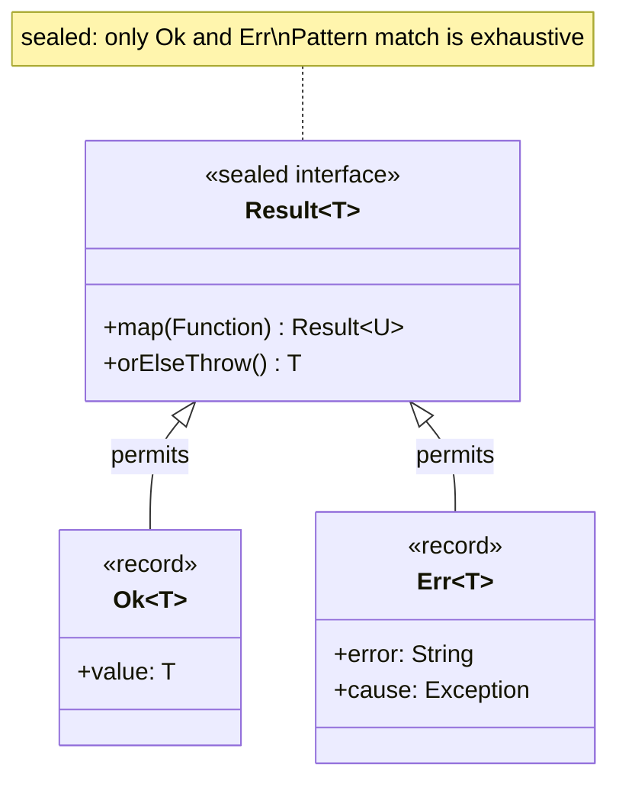
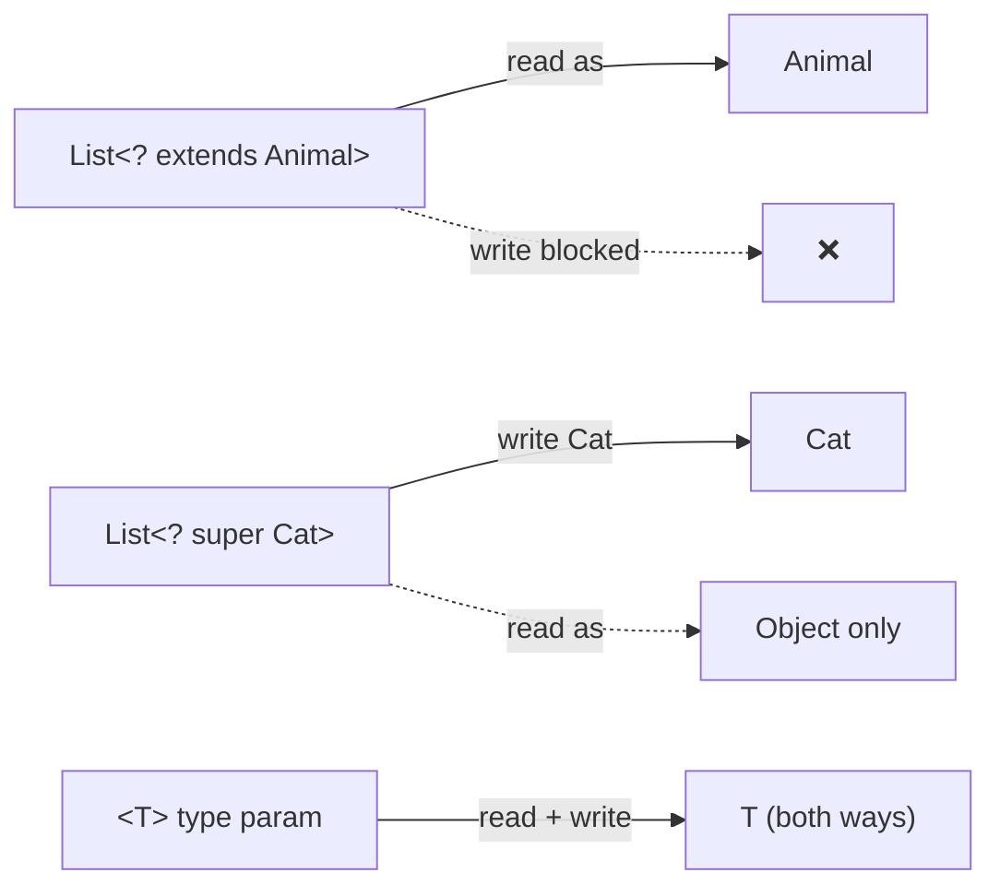

# Java Language - L3 Type System

## Sealed Classes and Pattern Matching

### 🎯 Model Answer

**30 seconds:**
> Sealed classes/interfaces (Java 17): restrict which classes can extend or implement them.
> `sealed interface Shape permits Circle, Rectangle, Triangle`. Each permitted subtype must be
> `final`, `sealed`, or `non-sealed`. Combined with pattern matching in `switch` (Java 21):
> the compiler can verify exhaustiveness - no `default` needed. Enables algebraic data types
> (ADTs) in Java.

**3 minutes (Senior):**
> Sealed + Pattern Matching trinity:
>
> 1. **Sealed declaration**: `sealed interface Result<T> permits Success<T>, Failure`.
>    Permitted subtypes must be in the same module (or package if unnamed module).
>    Permitted subtypes: `final` (no further extension), `sealed` (extends the hierarchy),
>    or `non-sealed` (reopens the hierarchy for uncontrolled extension).
>
> 2. **Pattern matching switch** (Java 21): `switch (shape) { case Circle c -> ...; case Rectangle r when r.width() > 100 -> ...; }`. Guarded patterns: `case Circle c when c.radius() > 0`.
>    Exhaustiveness: for sealed types, the compiler checks all cases are covered.
>
> 3. **Switch expression vs statement**: switch expression returns a value (`String s = switch(x) { case A -> "a"; }`). Switch statement: traditional side-effect-based.
>
> 4. **Deconstruction patterns** (Java 21): `case Circle(double r)` for records - binds
>    components directly. Can nest: `case Box(Circle(double r))`.
>
> 5. **Use cases**: `Result<T>` (Success/Failure), `Event` hierarchy (domain events in DDD),
>    AST nodes for interpreters/compilers, JSON/YAML representation.

**Blank Mind Recovery:**

**(1) Restate:** "Sealed: restricts who can extend. `permits Circle, Rectangle, Triangle`.
Subtypes: final, sealed, or non-sealed. Switch + sealed: exhaustive (no default needed).
Pattern matching: `case Circle c -> c.radius()`. Guarded: `case Circle c when c.radius() > 0`."

**(2) First principles:** "Sealed solves the open world problem. A `Shape` without sealed: anyone
can add `Shape` subclasses. The switch on Shape needs `default`. With sealed: the set of subtypes
is fixed. The compiler knows all possibilities. Switch can verify all cases. This is the difference
between an open and a closed type system."

**(3) Bridge:** "Sealed types are like a known-enum for class hierarchies. An enum has a fixed set
of constants - exhaustive switch is possible. Sealed: a fixed set of subtypes - exhaustive switch
is possible. The difference: each subtype can have its own data (record components), unlike enum
which is unit-typed."

---

### 📘 Concept Explanation

**Sealed types and pattern matching mechanics:**
```
SEALED TYPE HIERARCHY:

  sealed interface Shape permits Circle, Rectangle, Triangle {}
  
  // Permitted subtypes must choose one:
  record Circle(double radius) implements Shape {}          // final (implicit for records)
  record Rectangle(double width, double height) implements Shape {}
  non-sealed class Triangle implements Shape {              // reopens hierarchy
      double base, height;
  }
  
  // Subclasses of Triangle are NOT sealed:
  class RightTriangle extends Triangle { ... }  // OK (Triangle is non-sealed)
  // Cannot subclass Circle (final)
  // Cannot subclass Shape without being in permits list

RULES FOR SEALED TYPES:
  1. Permitted subtypes must be in same compilation unit, package,
     or module as the sealed type
  2. Every permitted subtype must directly extend/implement the sealed type
  3. Every permitted subtype must be: final, sealed, or non-sealed
  4. A class can only seal an interface or class that it directly extends/implements

PATTERN MATCHING IN SWITCH (Java 21):
  
  String describe(Shape s) {
      return switch (s) {
          case Circle c -> "circle r=" + c.radius();
          case Rectangle r when r.width() == r.height()
                             -> "square " + r.width();   // guarded pattern
          case Rectangle r   -> r.width() + "x" + r.height();
          case Triangle t    -> "triangle";
          // No default needed: sealed, all cases covered
      };
  }
  
  // ORDER MATTERS for guarded patterns:
  // More specific guarded patterns must come BEFORE the unguarded case
  // For the same type: guarded first, unguarded last

DECONSTRUCTION PATTERNS (records only, Java 21):
  sealed interface Expr permits Num, Add, Mul {}
  record Num(int value) implements Expr {}
  record Add(Expr left, Expr right) implements Expr {}
  record Mul(Expr left, Expr right) implements Expr {}
  
  int eval(Expr expr) {
      return switch (expr) {
          case Num(int v)             -> v;
          case Add(Expr l, Expr r)   -> eval(l) + eval(r);   // recursive!
          case Mul(Expr l, Expr r)   -> eval(l) * eval(r);
          // No default: sealed, exhaustive
      };
  }
  // Replaces the Visitor pattern entirely for expression evaluation

INSTANCEOF PATTERN MATCHING (Java 16):
  Object obj = ...;
  
  // Old: instanceof + cast
  if (obj instanceof String) {
      String s = (String) obj;
      System.out.println(s.length());
  }
  
  // New: pattern variable binding
  if (obj instanceof String s) {
      System.out.println(s.length());  // s is in scope here
  }
  
  // In conditions (scope rules):
  if (obj instanceof String s && s.length() > 5) { ... }  // s in scope
  if (!(obj instanceof String s) || s.length() > 5) { ... } // compile error: s not in scope after !
```

---

### 💻 Code Example

> **Code walkthrough:** The `Result<T>` type demonstrates the sealed + record combination as
> a typed error handling mechanism. The switch on Result is exhaustive - adding a new subtype
> to the sealed interface immediately causes compile errors at all unhandled switches, which
> is the key safety property.

```java
// ALGEBRAIC DATA TYPE: Result<T> (typed error handling)
sealed interface Result<T> permits Result.Ok, Result.Err {
    record Ok<T>(T value) implements Result<T> {}
    record Err<T>(String error, Exception cause) implements Result<T> {
        Err(String error) { this(error, null); }
    }
    
    // Factory methods (ergonomic API):
    static <T> Result<T> ok(T value) { return new Ok<>(value); }
    static <T> Result<T> err(String error) { return new Err<>(error); }
    static <T> Result<T> err(String error, Exception cause) {
        return new Err<>(error, cause);
    }
    
    // Default method: transform if ok
    default <U> Result<U> map(java.util.function.Function<T, U> f) {
        return switch (this) {
            case Ok<T> ok -> Result.ok(f.apply(ok.value()));
            case Err<T> err -> Result.err(err.error(), err.cause());
        };
    }
    
    default T orElseThrow() {
        return switch (this) {
            case Ok<T> ok -> ok.value();
            case Err<T> err -> throw new RuntimeException(err.error(), err.cause());
        };
    }
}

// USAGE:
Result<User> result = userService.findUser(id);

// Exhaustive switch - compile error if a case is missed:
String message = switch (result) {
    case Result.Ok(User u)  -> "Found: " + u.getName();
    case Result.Err(String e, Exception c) -> "Error: " + e;
};

// DOMAIN EVENT HIERARCHY:
sealed interface OrderEvent permits
    OrderEvent.Created, OrderEvent.Shipped, OrderEvent.Cancelled {}

record OrderEvent.Created(Order order, Instant at) implements OrderEvent {}
record OrderEvent.Shipped(Order order, String trackingId) implements OrderEvent {}
record OrderEvent.Cancelled(Order order, String reason) implements OrderEvent {}

// Event handler: exhaustive, compiler-verified:
void handle(OrderEvent event) {
    switch (event) {
        case OrderEvent.Created(Order o, Instant at) ->
            log.info("Order {} created at {}", o.id(), at);
        case OrderEvent.Shipped(Order o, String trackingId) ->
            notificationService.sendShippedEmail(o, trackingId);
        case OrderEvent.Cancelled(Order o, String reason) ->
            inventoryService.restockOrder(o);
    }
    // Adding a new event type to the sealed hierarchy:
    // -> compile error here (unhandled case) -> forced to update handler
}
```

> **Code walkthrough:** The `Result<T>` type with `sealed interface` and `record` subtypes is
> the Java equivalent of Rust's `Result<T, E>`. The nested `switch (this)` inside the default
> method is the key pattern: exhaustive dispatch over the sealed type. Adding a new `Result`
> subtype to the `permits` list would immediately cause compile errors in the `map()` and
> `orElseThrow()` methods - the compiler forces you to handle it. The domain event hierarchy
> shows the production use case: DDD events as sealed types ensure all event types are handled
> in every event dispatcher.

---

### 🎓 Answers by Seniority

**Junior / Mid (0-5 years):**
> Sealed: restricts who can extend a class/interface. All subtypes must be in the `permits` list.
> Combined with `switch`: the compiler verifies all cases are handled. Pattern matching: binds
> type variables in switch/instanceof. Sealed + records: algebraic data types in Java.

---

**Senior / Staff (5+ years):**
> Sealed types replace the Visitor pattern for type-based dispatch. They're the correct tool for
> domain modeling when you have a finite set of variants (event types, request states, result types).
> The `non-sealed` keyword: intentional escape hatch for extension points (framework extension points
> that users can add to). The `permits` clause: the API contract for what types exist. Sealing with
> records: immutable algebraic data types - the most expressive modeling tool Java now has.

---

### ⚠️ Common Misconceptions

**Misconception 1: "Sealed classes prevent all subclassing."**
No. Sealed restricts who CAN subclass, not that subclassing is impossible. Permitted types that
are `non-sealed` can be extended freely. Permitted types that are `sealed` form a further sealed
hierarchy. Only `final` types (or `record` types, which are implicitly final) truly prevent further
subclassing. The goal of sealed is "define a closed set of known types" not "prevent extension."

**Misconception 2: "Pattern matching in switch replaces all uses of if-instanceof chains."**
Pattern matching switch is best for type-based dispatch over a sealed hierarchy. For a single
`instanceof` check: `if (obj instanceof String s)` is still appropriate. For `instanceof`-checking
objects from an unsealable type (e.g., `Object` from a framework): `switch` with `default` is needed.
Pattern matching doesn't eliminate `instanceof` chains; it makes exhaustive type dispatch cleaner.

---

### 🚨 Failure Modes and Diagnosis

**Failure: Adding a new sealed subtype breaks production unexpectedly.**
```
Symptom: After adding a new OrderEvent type, some handlers return wrong results.
  No compile error was raised. The new event type falls through to an unexpected case.

Root cause:
  // BAD: using a switch STATEMENT with default (doesn't benefit from exhaustiveness)
  void handle(OrderEvent event) {
      switch (event) {
          case OrderEvent.Created e -> handleCreated(e);
          case OrderEvent.Shipped e -> handleShipped(e);
          // Forgot to add case for new OrderEvent.Returned
          default -> log.warn("Unknown event: {}", event);  // silently ignored!
      }
  }
  
  // The 'default' case: the compiler CANNOT warn about missing cases
  // when a default is present, even for sealed types.
  // New OrderEvent.Returned: hits 'default', logs a warning, returns null.

Fix:
  // GOOD: switch expression without default (compiler enforces exhaustiveness)
  String describe(OrderEvent event) {
      return switch (event) {
          case OrderEvent.Created e  -> handleCreated(e);
          case OrderEvent.Shipped e  -> handleShipped(e);
          case OrderEvent.Returned e -> handleReturned(e);  // new case
          // No default: if OrderEvent.Returned is added and not listed here,
          // compile error immediately
      };
  }
  
  // For switch statements (void return): throw for unhandled
  void handle(OrderEvent event) {
      switch (event) {
          case OrderEvent.Created e  -> handleCreated(e);
          case OrderEvent.Shipped e  -> handleShipped(e);
          // Default ONLY for defensive programming (not to suppress warnings):
          default -> throw new IllegalStateException("Unhandled event: " + event);
      }
      // Better: use switch expression to get compile-time exhaustiveness
  }

Prevention:
  Use switch EXPRESSION (not statement) for sealed types when return value
  is needed: exhaustiveness is compile-time guaranteed.
  Never use 'default' with sealed type switches (defeats the purpose).
  If void return is needed: throw IllegalStateException in default.
```

---

### 🎯 Interview Deep-Dive

| Question Category | Time to Answer |
|---|---|
| Sealed class purpose | 2 minutes |
| permits clause rules | 1 minute |
| Exhaustive switch | 2 minutes |
| Guarded patterns | 2 minutes |
| Deconstruction patterns | 2 minutes |
| non-sealed use case | 1 minute |
| vs Visitor pattern | 2 minutes |
| Domain modeling use case | 2 minutes |
| Pattern matching scope | 1 minute |

---

**Q1 (exhaustiveness): How does the compiler check exhaustiveness for sealed types in a switch?**

A: For a switch on a sealed type (or enum): the compiler collects all `permits` clauses (recursively).
A switch without `default` must cover all permitted subtypes. If a case is missing: compile error.
With a `default`: exhaustiveness check is disabled (the default handles all unhandled cases).
For enums: same - switch without `default` must list all enum constants. The guarded pattern
(`case Circle c when c.radius() > 0`): does NOT count as covering all Circles (the unguarded
case must also be present or a default added).

*What separates good from great:* The exhaustiveness check is a compile-time guarantee. It means:
when you add a new type to the sealed hierarchy, ALL switch expressions (without `default`) that
match on the sealed type immediately give a compile error. This is the "change amplification"
property: one change in the type hierarchy propagates to all switch sites that need updating.
This is the sealed type's core value: it makes adding new variants safe (you can't accidentally
forget to handle the new case). Compare to an open hierarchy: adding a new subtype silently falls
through to `default` (or causes NPE if no default and no match).

---

**Q2 (visitor vs sealed): How do sealed classes replace the Visitor pattern?**

A: Visitor pattern: add new operations without modifying the type hierarchy (add a new Visitor).
Trade-off: adding new types requires modifying ALL visitors. Sealed classes + pattern matching:
add new operations as new switch expressions (no modification to types). Adding new types: ALL
switches need updating (compile error enforces this). The choice: if operations change more than
types (add operations rarely, add types often): Visitor. If types change more than operations (add
types rarely, add operations often): sealed + switch.

*What separates good from great:* The Expression Problem: a fundamental problem in programming
language design. Can you add new types AND new operations to a system without modifying existing
code? In OOP: new types are easy (polymorphism), new operations are hard (must add method to all
classes). In FP (pattern match on ADTs): new operations are easy (new function), new types are
hard (must update all pattern matches). Java sealed: aligns with the FP side (new operations easy,
new types require updating all switches). The Visitor pattern is an OOP workaround to simulate
the FP approach. Sealed + switch: the language-native solution. Choose based on which changes more:
types or operations.

---

**Q3 (scope rules): What are the scoping rules for pattern variables?**

A: Pattern variable `String s` in `if (obj instanceof String s)`: scoped to the `if` block (and
the condition of `&&` after the instanceof check). In `switch`: `case X x -> ...`, `x` is scoped
to the right-hand side of the arrow (single expression or block). `case X x: { ... }` (traditional
colon syntax): `x` is scoped to all cases after the matching case until a `break` (fall-through
applies). Guarded pattern: `case Circle c when c.radius() > 0 -> ...`, `c` is in scope for the
`when` guard and the right-hand side.

*What separates good from great:* The "definite assignment" rules: `if (obj instanceof String s && s.length() > 0)` - `s` is definitely assigned after the `instanceof` check, so it's in scope for
the `&&` right side. `if (!(obj instanceof String s) || s.length() > 0)` - after `!()`, `s` is
NOT definitely assigned (the `!` negates the assignment). Compiler error. The rule: pattern
variables are in scope only where the match is guaranteed to have succeeded. This mirrors the
rules for definite assignment of regular variables (`int x; if (...) x = 5; System.out.println(x);` - compile error: `x` might not be assigned).

---

**Q4 (non-sealed): When do you use non-sealed and what are the implications?**

A: `non-sealed`: intentionally reopens the hierarchy. Use when: you control the sealed parent
but want to allow extension of a specific subtype. Example: a framework provides `sealed interface Plugin permits CorePlugin, ExtensionPlugin`. `CorePlugin` is `final` (no extension). `ExtensionPlugin` is `non-sealed` (user-provided extensions extend it). The switch on `Plugin`: must have a `default` (because `ExtensionPlugin` subtypes are unknown).

*What separates good from great:* The `non-sealed` keyword prevents the "I forgot to add the
subtype to permits" mistake. Without it: trying to extend a sealed type you don't own = compile
error. With `non-sealed` as the intended extension point: clean, explicit design. The implicit
contract: `non-sealed` subtypes in a switch should always have a `default` case (or be caught
via the `non-sealed` parent type). Framework design pattern: use `sealed` for the core set of
types, `non-sealed` for the extension point (the "escape hatch" that library users extend).

---

**Q5 (guarded patterns): How do guarded patterns work and what pitfalls do they have?**

A: `case Circle c when c.radius() > 0 -> "positive radius"`. The `when` clause: a boolean
expression evaluated after the type check succeeds. If the type matches but the guard fails: falls
through to the next case. Order matters: more specific (guarded) patterns must precede less specific
(unguarded) patterns for the same type. `case Circle c when c.radius() > 0 -> ...; case Circle c -> "other circles"` - correct order. Reversed: compile error (unreachable guarded case).

*What separates good from great:* Guarded patterns are evaluated in order, but the compiler
detects dominance: if a case can never be reached (because a previous case is always true for the
same type), it's a compile error ("this case is dominated by a preceding case"). This prevents
dead code in switch expressions. The `when` guard can reference the bound variable AND other
variables in scope. Example: `case Order o when o.status() == expectedStatus -> handle(o)` -
`expectedStatus` is from the outer scope. Guards can call methods, perform arithmetic, anything
that returns a boolean.

---

**Q6 (switch expression): What is the difference between switch expression and switch statement?**

A: Switch statement: traditional, void. Each case ends with `break` (or falls through). Side-effect
based. Switch expression (Java 14+): returns a value. Each case uses `->` (no fall-through) or
`yield` keyword (for multi-statement cases). `yield value;` = return value from the switch expression
block. Switch expression cannot fall through. Switch statement: can fall through (multiple labels
for the same case: `case 1: case 2: sameAction(); break;`).

*What separates good from great:* The `->` syntax in switch: both statement (void) and expression (value). The `->` prevents fall-through (each case is independent). The `:` syntax: traditional,
fall-through by default. `yield`: used in a `:` case body to return a value from a switch expression.
Example: `String s = switch(x) { case 1: { int calc = ...; yield calc + " items"; } default: yield "none"; }`.
The mix of `->` and `:` syntax in the same switch: NOT allowed. Either all `->` or all `:`.

---

**Q7 (modeling): How do sealed types improve domain modeling?**

A: Domain events, states, and result types: finite sets of variants with type-specific data.
Sealed: models this exactly. Example: `PaymentStatus`: Pending (no data), Completed (transactionId),
Failed (reason, timestamp). Each status is a record with its specific data. Switch on status:
exhaustive. Adding a new status: compile-time failure at all unhandled switches. This makes the
domain model resilient to change: the type system enforces completeness everywhere the status is used.

*What separates good from great:* The alternative (enum with a data map): `PaymentStatus enum { PENDING, COMPLETED, FAILED }` with a separate `Map<PaymentStatus, Object>` for status-specific data. Problems: type-unsafe (you need to cast `(String) dataMap.get(COMPLETED)` for the transaction ID), not exhaustive (the map might not have data for a status), and harder to document (which statuses have which data). Sealed + records: type-safe, exhaustive, self-documenting. `case Completed(String txId)` is unambiguous about what data is available. This is the production reason to use sealed types over enums for domain states.

---

**Q8 (when to use): When should you choose sealed over a regular open hierarchy?**

A: Use sealed when: (1) the set of subtypes is fixed and known at design time, (2) you want
compile-time exhaustiveness checking in switches, (3) you want to prevent unauthorized subclassing
from external code, (4) you're modeling ADTs (sum types) like Result<T>, Option<T>, AST nodes.
Don't use sealed when: (1) the hierarchy is intended to be open for extension by library users
(use interfaces + documentation), (2) the set of subtypes will grow frequently (sealed adds friction
to adding types), (3) you need deep inheritance hierarchies (sealed is best for shallow, wide hierarchies).

*What separates good from great:* The maintenance cost trade-off: sealed is easier to maintain when
OPERATIONS change (new switch on the type), but harder when TYPES change (must update all switches).
For a library that ships an event type hierarchy to users: sealed means users can't add event types
(too restrictive). For an internal domain model where the events are domain-owned: sealed is perfect.
The rule: if external users need to extend it, use an open interface. If you own all the variants:
sealed. This is the open/closed principle applied to type hierarchies.

---

**Q9 (sealed + generics): How do sealed types work with generics?**

A: Sealed interfaces can be generic. Permits clause lists types (possibly generic):
`sealed interface Result<T> permits Result.Ok<T>, Result.Err`. Permitted subtypes must be subtypes
of the sealed type for ALL type parameters. `record Ok<T>(T value) implements Result<T> {}` -
`Ok<T>` is a permitted subtype of `Result<T>`. Pattern matching with generic sealed types:
`case Result.Ok<String> ok -> ok.value()` (Java may require explicit type or infer from context).

*What separates good from great:* The type inference in pattern matching for generic sealed types:
the compiler infers the type from the switch target. If `result` is `Result<User>`, then `case Ok<User> ok -> ok.value()` is inferred. The explicit type annotation in the case is sometimes needed
for clarity. Nested generic deconstruction: `case Ok<List<String>>(List<String> items)` - possible
but the type annotation becomes verbose. In practice: use `var` or rely on inference when the type
is obvious from context. The sealed generic pattern is the foundation of monadic composition in
Java (Optional, Stream, and custom Result types are all effectively sealed generic types).

---

### ⚖️ Comparison Table

| Feature | Sealed + Switch | Visitor Pattern | Enum | Open Hierarchy |
|---------|----------------|-----------------|------|----------------|
| Add new type | Compile errors at switches | Compile errors in visitors | Compile errors in switches | No error |
| Add new operation | New switch expression | New visitor class | New switch | Need polymorphism |
| Type-specific data | Yes (records) | Separate classes | No (unit-typed) | Yes (subtype fields) |
| Exhaustiveness | Compile-time | Compile-time | Compile-time | Runtime only |
| External extension | Blocked | Can extend node + visitor | Blocked | Allowed |
| Boilerplate | Low | High | Low | Low |
| Pattern matching | Yes | Indirect | Yes | No |
| Best for | Domain ADTs | Complex OOP hierarchies | State/constants | Framework extension |

---

### 🏛️ System Design

*(Omit: L3 file - System Design reserved for ★★★ level files.)*

---

### 📊 Diagram

```
SEALED TYPE HIERARCHY - RESULT<T>:

  sealed interface Result<T>
         |
   +-----+------+
   |            |
Ok<T>         Err<T>
(value: T)   (error: String)

Pattern match dispatch:
  switch(result) {
    Ok(T v)  -> use v
    Err(e)   -> handle e
  }   ^
      |
  Exhaustive: compiler verifies
  both cases are handled
```



> **Diagram walkthrough:** The sealed `Result<T>` hierarchy has exactly two permitted subtypes:
> `Ok<T>` (value present) and `Err<T>` (error present). The `sealed` keyword on the interface
> and `permits Ok, Err` together tell the compiler: "the only subtypes that can ever exist are
> `Ok` and `Err`." This enables exhaustive pattern matching: `switch(result) { case Ok... case Err... }`
> without a `default` branch. Adding a third subtype to `permits` immediately causes compile errors
> at all switch sites, making the hierarchy safe to evolve.

---

---

## Generics Wildcards and Bounded Types

### 🎯 Model Answer

**30 seconds:**
> Java generics: invariant by default. `List<String>` is NOT a `List<Object>`. Wildcards
> enable flexibility: `List<? extends Number>` (upper-bounded, read-only producer), `List<? super Integer>` (lower-bounded, write-only consumer). PECS mnemonic: Producer Extends, Consumer
> Super. Unbounded `<?>`: read-only, any type. Bounded type parameter `<T extends Comparable<T>>`:
> constrains T at the class/method level.

**3 minutes (Senior):**
> Advanced wildcard mechanics:
>
> 1. **Wildcard capture**: the compiler infers the wildcard type when passing a `?` to a generic
>    method. `swap(list, i, j)` can be implemented via a private helper that captures `<T>`.
>
> 2. **Recursive bounds**: `<T extends Comparable<? super T>>` - T can be compared to itself or
>    its supertypes. Used in `Collections.sort()` for maximum flexibility.
>
> 3. **Multiple bounds**: `<T extends Comparable<T> & Serializable>` - T must implement both.
>    Class bound first, interface bounds after: `<T extends MyClass & InterfaceA & InterfaceB>`.
>
> 4. **Wildcard vs type parameter design**: use `?` when the type appears only once in the
>    signature. Use `<T>` when the type appears multiple times (input and output linked).
>
> 5. **Intersection types in casts**: `(Comparable<T> & Serializable) object` - cast to the
>    intersection of two types. Useful for generic utilities that require multiple capabilities.

**Blank Mind Recovery:**

**(1) Restate:** "? extends T: upper-bounded (read/producer). ? super T: lower-bounded (write/consumer).
PECS: Producer Extends, Consumer Super. Bounded type param: `<T extends X>`. Multiple bounds:
`<T extends A & B>`. Recursive: `<T extends Comparable<? super T>>`."

**(2) First principles:** "Generics are invariant: `List<String>` is NOT a `List<Object>`.
Wildcards add variance: `? extends`: covariant (read). `? super`: contravariant (write).
Invariance by default prevents type pollution. Wildcards: opt-in variance where needed."

**(3) Bridge:** "Upper-bounded wildcard `? extends Animal`: 'a container of some specific
Animal-or-subtype'. You can read Animals from it (it's at least Animal), but you can't add
(you don't know if it's List<Cat> or List<Dog>). Lower-bounded `? super Cat`: 'a container of
some Cat-or-supertype'. You can add Cats (it accepts at least Cats), but reading is just Object
(too many supertypes to commit to one)."

---

### 📘 Concept Explanation

**Wildcard rules with type variance:**
```
INVARIANCE - THE PROBLEM:

  List<String> strings = new ArrayList<>();
  List<Object> objects = strings;  // COMPILE ERROR: List<String> is not List<Object>
  // If allowed: objects.add(42);  // would corrupt strings (Integer in String list)
  
  // Arrays ARE covariant (historical mistake):
  String[] strArray = new String[]{"a"};
  Object[] objArray = strArray;       // compiles (array covariance)
  objArray[0] = 42;                   // ArrayStoreException at RUNTIME (not compile time)
  // Java generics were designed to avoid this mistake

UPPER-BOUNDED WILDCARD (? extends T): PRODUCER / READ-ONLY

  void printAll(List<? extends Number> list) {
      for (Number n : list) System.out.println(n);  // READ: OK
      // list.add(1.0);  // COMPILE ERROR: cannot add to ? extends
      // Cannot write because: list might be List<Integer>
      // and adding a Double to List<Integer> would break type safety
  }
  
  printAll(new ArrayList<Integer>());   // OK
  printAll(new ArrayList<Double>());    // OK
  printAll(new ArrayList<Number>());    // OK

LOWER-BOUNDED WILDCARD (? super T): CONSUMER / WRITE-ONLY

  void fillWithZero(List<? super Integer> list) {
      list.add(0);         // WRITE: OK (list accepts at least Integer)
      list.add(1);
      // Integer i = list.get(0); // COMPILE ERROR: might be List<Number>
      //                          // get() returns Object (upper bound)
      Object o = list.get(0);     // READ: OK (everything is Object)
  }
  
  fillWithZero(new ArrayList<Integer>());  // OK (Integer super Integer)
  fillWithZero(new ArrayList<Number>());   // OK (Number super Integer)
  fillWithZero(new ArrayList<Object>());   // OK (Object super Integer)

PECS IN ACTION: Collections.copy

  static <T> void copy(
      List<? super T> dest,     // CONSUMER (we write T into dest)
      List<? extends T> src) {  // PRODUCER (we read T from src)
    for (int i = 0; i < src.size(); i++)
      dest.set(i, src.get(i));
  }
  // T=Number: copy(List<Object>, List<Integer>) works!
  // dest accepts Number or supertypes (Object works)
  // src provides Number or subtypes (Integer works)

BOUNDED TYPE PARAMETERS vs WILDCARDS:

  // Use <T> when the type appears in multiple places:
  <T extends Comparable<T>> T max(List<T> list) { ... }
  // T used as: list element type AND return type
  // Must be consistent -> type parameter
  
  // Use ? when the type appears in only one place:
  void printAll(List<?> list)  // just reads, type doesn't matter elsewhere
  // Or: ? extends for covariant, ? super for contravariant

MULTIPLE BOUNDS:
  <T extends Comparable<T> & Cloneable> T cloneMax(List<T> list) {
      T max = Collections.max(list);  // requires Comparable<T>
      return (T) max.clone();          // requires Cloneable
  }
  // T must be both Comparable<T> AND Cloneable
  // Class bounds must come first: <T extends MyClass & InterfaceA>
```

---

### 💻 Code Example

> **Code walkthrough:** The `copyAndTransform` method shows PECS in a real utility: reading from a
> covariant source, transforming, and writing to a contravariant destination. The intersection
> type cast is an advanced pattern for generic utilities that require multiple capabilities without
> the caller needing to declare them.

```java
// PECS APPLIED: transform and copy
static <T, R> void copyAndTransform(
    List<? extends T> src,       // Producer: read T
    List<? super R> dst,         // Consumer: write R
    Function<? super T, ? extends R> f) {  // Function: T -> R
    for (T elem : src) {
        dst.add(f.apply(elem));
    }
}

// Usage: transform List<Integer> to List<Number>
List<Integer> ints = List.of(1, 2, 3);
List<Number> nums = new ArrayList<>();
copyAndTransform(ints, nums, n -> n.doubleValue());

// WILDCARD CAPTURE: swap elements safely
public static void swap(List<?> list, int i, int j) {
    swapHelper(list, i, j);  // delegates to capture helper
}
private static <T> void swapHelper(List<T> list, int i, int j) {
    T tmp = list.get(i);
    list.set(i, list.get(j));
    list.set(j, tmp);
}
// swapHelper "captures" the ? from swap, giving it a name T
// Now we can get/set with type safety

// BAD: trying to swap without wildcard capture
public static void badSwap(List<?> list, int i, int j) {
    Object tmp = list.get(i);
    list.set(i, list.get(j));
    list.set(j, tmp);  // COMPILE ERROR: set expects ?, Object doesn't satisfy ?
}

// RECURSIVE BOUND: most flexible sort
static <T extends Comparable<? super T>> void sort(List<T> list) {
    Collections.sort(list);  // T.compareTo accepts T or supertypes
}
// <T extends Comparable<T>>: T must compare to T exactly
// <T extends Comparable<? super T>>: T must compare to T or its supertypes
// More flexible: if T extends Comparable<Parent> (compares by parent fields),
// sort(List<T>) still works

// INTERSECTION TYPE CAST:
static <T extends Comparable<T> & Serializable>
    void storeMax(List<T> items, Storage storage) {
    T max = Collections.max(items);  // Comparable<T>
    storage.store(max);               // Serializable
}
// Caller must provide a T that is both Comparable and Serializable
// Strings, Integers, etc. work. Custom classes: must implement both.

// PRACTICAL: sort and deduplicate any comparable collection
static <T extends Comparable<? super T>>
    List<T> sortedUnique(Collection<? extends T> input) {
    return input.stream()
        .distinct()
        .sorted()   // uses T's natural order (Comparable)
        .collect(Collectors.toList());
}
// Works with: sortedUnique(List<Integer>), sortedUnique(List<String>),
// sortedUnique(Set<Long>) etc.
```

> **Code walkthrough:** The `copyAndTransform` signature applies PECS to both the source and
> destination. The `Function<? super T, ? extends R>` bound is also a PECS application: the function
> consumes T (so `? super T`) and produces R (so `? extends R`). This maximum generality allows the
> function to be a `Function<Number, Integer>` even when T is `Integer` and R is `Number`.
> The wildcard capture pattern (`swapHelper`) is the solution to "I need to read and write through
> the same wildcard type" - give the wildcard a name by delegating to a generic method.

---

### 🎓 Answers by Seniority

**Junior / Mid (0-5 years):**
> PECS: `? extends T` for reading (producer), `? super T` for writing (consumer). Multiple bounds:
> `<T extends A & B>`. Recursive bound: `<T extends Comparable<T>>` for sorting. Use wildcards to
> make APIs more flexible (accept `List<Integer>` where `List<Number>` is expected).

---

**Senior / Staff (5+ years):**
> API design with wildcards: use `? extends` for input parameters that you read from (maximum
> flexibility for callers). Use `? super` for output parameters or accumulators. Use `<T>` for
> return types (callers get the specific type). Wildcard capture: the clean solution for needing
> to work with a `?` internally. Recursive bounds with `? super`: the JDK standard for sort/compare
> utilities. `<T extends Comparable<? super T>>` vs `<T extends Comparable<T>>`: the former is
> more general and should be preferred in utility APIs.

---

### ⚠️ Common Misconceptions

**Misconception 1: "`<?>` and `<? extends Object>` are the same."**
They are functionally equivalent (both allow any type, both prevent writes). The subtle
difference: `<?>` is shorthand for `<? extends Object>` and they behave identically. The distinction matters in some reflection scenarios (`getGenericType()` returns different representations). For API design: prefer `<?>` for "I don't care about the type" and `<? extends T>` when T provides a useful
upper bound.

**Misconception 2: "You can always use ? instead of <T> for flexibility."**
No. `?` is a wildcard (unknown type) and cannot be referred to consistently. If you need to use the
type in multiple places (parameter + return type, two parameters that must be the same type): you MUST use a named type parameter `<T>`. `<T> T copy(T source)` vs `? copy(? source)` - the second doesn't
compile. The rule: `?` for one occurrence (read-only parameter), `<T>` for two or more occurrences.

---

### 🚨 Failure Modes and Diagnosis

**Failure: API using ? extends T rejects callers that should work.**
```
Symptom: compile error "required List<? extends Animal> but got List<Cat>"
  when calling: processAnimals(new ArrayList<Cat>())
  and processAnimals takes List<? extends Animal>

Root cause:
  // This SHOULD work: Cat extends Animal, so ArrayList<Cat> IS a List<? extends Animal>
  // But the issue might be in how the variable is declared:

  List<Cat> cats = new ArrayList<>();
  List<? extends Animal> animals = cats;  // compiles: OK
  processAnimals(cats);                   // compiles: OK

  // The actual failure: incorrect method signature
  void processAnimals(List<Animal> animals) {  // NOT using wildcard!
      // BAD: this rejects List<Cat> because List<Cat> is NOT List<Animal>
  }
  // Fix:
  void processAnimals(List<? extends Animal> animals) { ... }
  // OR: use a bounded type parameter
  <T extends Animal> void processAnimals(List<T> animals) { ... }

Diagnosis:
  "incompatible types: List<Cat> cannot be converted to List<Animal>"
  -> The method parameter is not using ? extends
  
  "capture#1 of ? cannot be converted to String"
  -> Trying to call a method that returns ? (unknown type), assigning to String
  -> Fix: use a type parameter, or call the method via a typed reference

Prevention:
  API review: any method accepting a collection that it only READS FROM
  should use ? extends T (or <T extends X> for consistency with return type).
  Methods that write to the collection: ? super T.
  Static analysis: PMD rule "MethodParameterCouldBeWildcard" catches this.
```

---

### 🎯 Interview Deep-Dive

| Question Category | Time to Answer |
|---|---|
| PECS explained | 2 minutes |
| Wildcard vs type parameter | 2 minutes |
| Recursive bounds | 2 minutes |
| Wildcard capture | 2 minutes |
| Multiple bounds | 1 minute |
| Array covariance vs generic invariance | 2 minutes |
| ? extends vs ? super in practice | 2 minutes |
| Intersection type | 1 minute |
| Wildcard in return type | 1 minute |

---

**Q1 (covariance): Why are Java generics invariant while arrays are covariant?**

A: Arrays were covariant before generics (Java 1.0). `String[]` is a subtype of `Object[]`.
The problem: `Object[] objs = new String[]{}; objs[0] = 42;` - compiles but throws `ArrayStoreException` at runtime (the JVM checks array element type at every store). Runtime check = overhead.
Generics (Java 5): learned from this mistake. `List<String>` is NOT a subtype of `List<Object>`.
Any type mismatch: caught at compile time (type erasure means no runtime check possible anyway).

*What separates good from great:* The reason array covariance can't be fixed (backward compatibility)
explains why Java has this inconsistency. If you have code that takes `Object[]` to process anything:
you can't pass `String[]` without the covariance. Arrays: used as polymorphic containers in old Java
(before generics). Generics: the proper solution. New code should use generic collections, not arrays,
for polymorphic container handling. The `T[] array` in generic code: always requires `@SuppressWarnings("unchecked")` because of the array/generic impedance mismatch.

---

**Q2 (pecs deep): Why does ? extends prevent writes and ? super prevent typed reads?**

A: `? extends Animal`: the list holds objects of some SPECIFIC unknown Animal subtype. It might
be `List<Cat>` or `List<Dog>`. If you add a Cat to it: it might be `List<Dog>` -> type violation.
If you add a Dog: it might be `List<Cat>`. The compiler can't know -> no writes allowed.
You CAN read: whatever specific type it is, it IS at least an Animal. Read as Animal: safe.
`? super Cat`: the list accepts at least Cat objects. It might be `List<Animal>` or `List<Object>`.
You CAN add a Cat: it works for all supertypes (Animal accepts Cat, Object accepts Cat). You
CAN'T read as Cat: might be `List<Object>` where other non-Cat objects were added. Read as Object: safe.

*What separates good from great:* The fundamental insight: the "write" direction and "read" direction
have opposite variance requirements. Writing is contravariant (a consumer of `Cat` can be anything
that accepts `Cat` or its supertypes). Reading is covariant (a producer of `Cat` can be anything
that holds `Cat` or its subtypes). PECS captures exactly this: the type you're putting in
(`super`) and the type you're taking out (`extends`) have opposite requirements. The formal term:
`? extends T` = covariant, `? super T` = contravariant. Java generics are invariant by default,
and wildcards add opt-in variance.

---

**Q3 (recursive bounds): Why use `<T extends Comparable<? super T>>` instead of `<T extends Comparable<T>>`?**

A: `<T extends Comparable<T>>`: T must implement `Comparable<T>` (compare itself to itself).
`<T extends Comparable<? super T>>`: T must implement `Comparable<something that T IS>`. If `class Foo extends Bar implements Comparable<Bar>`: `Foo` compares to `Bar` (its supertype). `Comparable<T>` would reject Foo (Foo doesn't implement `Comparable<Foo>`). `Comparable<? super T>` accepts Foo (Foo implements `Comparable<Bar>` and Bar super Foo). JDK uses `<T extends Comparable<? super T>>` in `Collections.sort()`, `Collections.min()`, `TreeSet`, `TreeMap`.

*What separates good from great:* In practice, most classes implement `Comparable<T>` for themselves
directly (e.g., `String implements Comparable<String>`). The `? super T` is rarely triggered in
user-defined code. BUT: framework classes that use `Comparable` for ordering should always use
`Comparable<? super T>` to be maximally correct. If a library uses `Comparable<T>` and a user has
a class that implements `Comparable<Parent>`: their class won't work with the library. This is a
real user-facing restriction that the `? super T` form prevents. Always use the more general form
in library APIs.

---

**Q4 (type token): What is the type token pattern and when is it used?**

A: Type token: passing `Class<T>` as a parameter to preserve generic type information at runtime.
`<T> T getBean(Class<T> type)` - Spring's `getBean`. `type.cast(object)` - safe cast using the
token. Used when: methods need to create or convert to a specific type that would otherwise be erased.
`TypeReference<T>` pattern: anonymous subclass captures the generic type via `getGenericSuperclass()`.

*What separates good from great:* The super type token: `new TypeReference<List<String>>() {}`.
The anonymous class's supertype is `TypeReference<List<String>>`. The generic type IS available at
runtime via `((ParameterizedType) getClass().getGenericSuperclass()).getActualTypeArguments()[0]`.
This returns `ParameterizedType{rawType=List, actualTypeArguments=[String]}`. Jackson uses this
for `objectMapper.readValue(json, new TypeReference<List<User>>() {})`. Without the super type token:
Jackson would see `List` (erased) and produce `List<Object>` instead of `List<User>`. This is
the most common workaround for type erasure in production code.

---

**Q5 (design): How do you design a generic utility that works with both reading and writing?**

A: If the utility both reads and writes to the same container: use a named type parameter `<T>`,
not a wildcard. `<T> void sort(List<T> list)` - reads elements (Comparator compares T), writes
sorted elements back. `<T> T findAndUpdate(List<T> list, Predicate<T> pred, UnaryOperator<T> f)` -
reads T, writes modified T back. Wildcards: for one-directional operations (read-only source or
write-only destination).

*What separates good from great:* The mixed producer/consumer case: `<T> void move(List<? super T> dst, List<? extends T> src)` - src is a producer (? extends), dst is a consumer (? super), but T appears in both. The named type parameter `<T>` connects them: whatever type comes from src, it must be acceptable to dst. If src and dst were both `<?>`: the types would be independent (could move Dog to List<Cat>). The named `<T>` creates the constraint: "whatever comes out of src, it fits into dst." This is the most important use of named type parameters over wildcards.

---

**Q6 (inference): How does Java infer type parameters for generic methods?**

A: Type inference: the compiler infers `<T>` from the argument types. `max(List<String> list)`:
T = String (inferred from list element type). `max(stringList)` vs `max(integerList)`: T inferred
differently. When inference fails: provide explicit type argument: `Collections.<String>emptyList()`.
Inference flow: (1) from actual argument types, (2) from target type (if result is assigned to a typed variable), (3) from bounds. If multiple inferences conflict: the most specific common supertype.

*What separates good from great:* The diamond operator `<>` uses the same inference: `new ArrayList<>()` infers the type from the variable declaration on the left. `List<String> list = new ArrayList<>()` - `ArrayList<String>` inferred. `var list = new ArrayList<>()` - cannot infer (no target type), compile error. The explicit type argument in diamond: not possible (`new ArrayList<String>()` is the fully explicit form). The common failure mode: using `var` with diamond operators creates unintended `ArrayList<Object>`. Always use an explicit target type when using `var` with generic constructors.

---

**Q7 (intersection): What are intersection types and how are they used in generics?**

A: Intersection type in bounds: `<T extends A & B>` - T must be both A and B. Cast to intersection:
`(Runnable & Serializable) lambda` - the lambda can be used as both Runnable and Serializable.
Use case: a generic method that needs both capabilities: `<T extends Runnable & Serializable>`.
Intersection type in lambda: `(Runnable & Serializable) () -> {...}` - creates a lambda that
implements both interfaces.

*What separates good from great:* The `(Runnable & Serializable)` lambda cast: the resulting
lambda object IS a Serializable. This is one of the few ways to get a serializable lambda in Java.
Use case: task submission to a distributed system that requires Serializable tasks. `(Runnable & Serializable) () -> processItem(id)` - this lambda can be serialized and sent to a remote node. The intersection
type cast on lambdas: the only way to assign a lambda to a variable of intersection type. The declared
variable type must be `Runnable` or `Serializable` (not the intersection itself as a variable type,
since Java variable types can't be intersection types directly - only in casts and bounds).

---

**Q8 (wildcards in collections): What is the wildcard capture problem in collections APIs?**

A: Using `?` in collections means you can't add to them: `List<?> list = ...; list.add("x")` - compile error. Real problem: you might have a method that reads a `List<?>` and wants to rearrange its elements. Without knowing the element type, you can't get and set safely. Solution: wildcard capture via a private generic helper method (as in the `swap` example).

*What separates good from great:* The reverse wildcard: `List<? extends T>` prevents adding,
but `Collections.unmodifiableList()` also prevents adding (at runtime). The difference: `? extends`
prevents adding AT COMPILE TIME (type safety). `unmodifiableList()` throws at RUNTIME. The right
defensive copy: `List.copyOf(source)` - immutable copy (UnsupportedOperationException on any modification). For API design: accept `Collection<? extends T>` for parameters you only read from (maximum flexibility), return `List<T>` or `List<? extends T>` from methods (or return `List.copyOf()` for immutability guarantee).

---

**Q9 (bounds in practice): What bounded type parameters appear most frequently in production code?**

A: (1) `<T extends Comparable<? super T>>` - for sort/min/max utilities. (2) `<T extends Enum<T>>` - for enum-related utilities (the Enum class itself is generic: `class Enum<E extends Enum<E>>`). (3) `<T extends Throwable>` - for methods that throw or handle specific exceptions. (4) `<K, V>` - map utilities. (5) `<T extends Number>` - numeric utilities. (6) `<T>` with `Class<T>` type token - factory and DI methods.

*What separates good from great:* The `Enum<E extends Enum<E>>` recursive bound is the most
confusing: every enum implicitly extends `Enum<Itself>`. `enum Color implements Enum<Color>`. The
bound `E extends Enum<E>` means: E is an enum type. This restricts the parameter to only enum types.
`<E extends Enum<E>> EnumSet<E> setOf(Class<E> enumType)` - creates an EnumSet of the given enum type,
and the compiler knows E is an enum. The recursive self-referential bound is the Java idiom for
"this type parameter must be an enum." Not just for `Enum`: it's the pattern for any type that
references itself (self-typed/F-bounded polymorphism in functional programming terminology).

---

### ⚖️ Comparison Table

| Construct | Syntax | Can Read | Can Write | Use Case |
|-----------|--------|----------|-----------|----------|
| Type parameter | `<T>` | As T | As T | Consistent type across signature |
| Upper bounded | `? extends T` | As T | No | Read-only/producer input |
| Lower bounded | `? super T` | As Object | As T | Write-only/consumer input |
| Unbounded | `<?>` | As Object | No | Type-agnostic read-only |
| Multiple bounds | `<T extends A & B>` | As A and B | As T | Needs multiple capabilities |
| Recursive bound | `<T extends Comparable<T>>` | As Comparable | As T | Self-comparable types |

---

### 🏛️ System Design

*(Omit: L3 file - System Design reserved for ★★★ level files.)*

---

### 📊 Diagram

```
VARIANCE RULES:

  INVARIANT (default):
    List<String> is NOT List<Object>
    No add, no cast between parameterized types

  COVARIANT (? extends T):
    List<? extends Animal>
    <- List<Cat> OK, List<Dog> OK
    Read: Animal (safe)
    Write: blocked

  CONTRAVARIANT (? super T):
    List<? super Cat>
    -> List<Animal> OK, List<Object> OK
    Read: Object only
    Write: Cat (safe)

  PECS:
    src: List<? extends T>  [Producer Extends]
    dst: List<? super T>    [Consumer Super]
```



> **Diagram walkthrough:** Upper-bounded wildcard (`? extends Animal`) is read-only with Animal
> as the upper bound - you can read Animals out of it, but can never write (the compiler doesn't
> know if it's `List<Cat>` or `List<Dog>`). Lower-bounded wildcard (`? super Cat`) is write-only
> with Cat as the lower bound - you can write Cats in, but reads return only Object (the compiler
> doesn't know the exact supertype). Type parameters (`<T>`) allow both, but restrict callers to
> a consistent type throughout the method signature. PECS summarizes which to choose based on
> direction of data flow.
