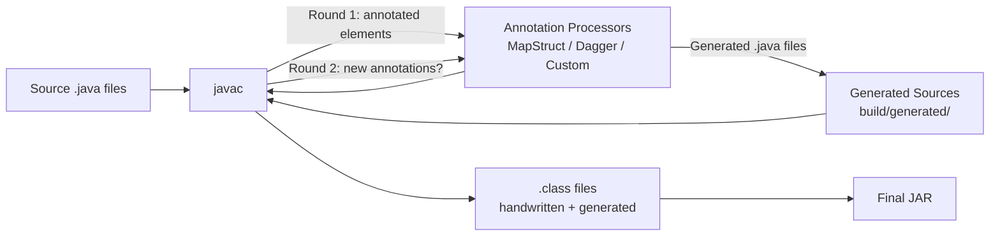

## Keywords in This File
{: .no_toc }

| # | Keyword | Weight |
|---|---|---|
| 1 | [Java Language - L4 Annotation Processing](#java-language---l4-annotation-processing) | medium |

---

# Java Language - L4 Annotation Processing

## Annotation Processing and Compile-Time Code Generation

---

### 🎯 Model Answer

**30 seconds:**
> Annotation processing (APT): `javax.annotation.processing.AbstractProcessor`. Runs during
> `javac`. Reads annotations on source elements, generates new source files or resource files.
> Tools built with APT: Lombok (`@Data`, `@Builder`), MapStruct (`@Mapper`), Dagger (`@Component`),
> QueryDSL (Q-types), Immutables. Generated code is compiled with the rest of the project: zero
> runtime overhead, fully debuggable, static type-safe.

**3 minutes (Senior):**
> APT internals and design:
>
> 1. **Processing rounds**: the compiler calls processors in rounds. Round 1: process original
>    sources, generate new files. Round 2: process generated files (can trigger more rounds).
>    Processors annotated with `@SupportedAnnotationTypes` and `@SupportedSourceVersion`.
>
> 2. **Elements and types**: processors work with `Element` objects (TypeElement, MethodElement,
>    VariableElement). `ProcessingEnvironment` provides `Filer` (write files), `Messager`
>    (compile errors/warnings), `Types`/`Elements` utilities.
>
> 3. **JavaPoet / FreeMarker**: libraries for generating Java source code (JavaPoet: type-safe
>    builder API; FreeMarker: templates). Hand-crafting `String.format` for source generation
>    is error-prone. Use a code generation library.
>
> 4. **Incremental compilation**: annotation processors must declare themselves as incremental
>    (`isolating` or `aggregating`) for Gradle incremental builds. Non-incremental: triggers
>    full recompile.
>
> 5. **Lombok controversy**: Lombok uses compiler internals (non-public API, AST manipulation).
>    Other APT processors use only the official `javax.annotation.processing` API. Lombok's
>    approach is more powerful (modifies existing classes) but brittle (breaks between JDK
>    versions). MapStruct: standard API only, more stable.

**Blank Mind Recovery:**

**(1) Restate:** "APT: processor runs during `javac`. Reads annotations on source elements. Generates new source files. Used by: Lombok, MapStruct, Dagger, Immutables, QueryDSL. Processing rounds. `Filer`: write new files. `Messager`: compile errors. JavaPoet: type-safe code generation."

**(2) First principles:** "APT is a plugin for the Java compiler. During compilation, the compiler calls your processor with: 'here are all the annotated elements I found'. You can respond: 'generate these new source files for me to compile'. The result: generated code is compiled and available as if you hand-wrote it. Zero runtime reflection needed."

**(3) Bridge:** "APT is like a sous chef who preps the kitchen before service. The head chef (developer) marks which ingredients to use (`@Builder`). The sous chef (processor) sees the marks during prep and creates the mise en place (generated code). By the time service starts (runtime), everything is ready - no prep needed on demand."

---

### 📘 Concept Explanation

**APT processor lifecycle and API:**
```plaintext
ANNOTATION PROCESSOR STRUCTURE:

  @SupportedAnnotationTypes("com.example.annotation.GenerateMapper")
  @SupportedSourceVersion(SourceVersion.RELEASE_21)
  public class MapperProcessor extends AbstractProcessor {
      
      @Override
      public synchronized void init(ProcessingEnvironment env) {
          super.init(env);
          // env.getFiler():    creates output files
          // env.getMessager(): emits compiler errors/warnings/notes
          // env.getTypeUtils(): type utilities (isAssignable, erasure)
          // env.getElementUtils(): element navigation (getDocComment, etc.)
      }
      
      @Override
      public boolean process(
          Set<? extends TypeElement> annotations,  // annotation types being processed
          RoundEnvironment roundEnv                // elements in this round
      ) {
          // Find all elements annotated with @GenerateMapper:
          Set<? extends Element> elements =
              roundEnv.getElementsAnnotatedWith(GenerateMapper.class);
          
          for (Element element : elements) {
              if (element.getKind() != ElementKind.INTERFACE) {
                  processingEnv.getMessager().printMessage(
                      Diagnostic.Kind.ERROR,
                      "@GenerateMapper may only be applied to interfaces",
                      element
                  );
                  continue;
              }
              TypeElement typeElement = (TypeElement) element;
              generateMapperImpl(typeElement);
          }
          
          return true;  // true = "I claimed these annotations, don't pass to other processors"
      }
      
      private void generateMapperImpl(TypeElement iface) {
          String packageName = processingEnv.getElementUtils()
              .getPackageOf(iface).getQualifiedName().toString();
          String implName = iface.getSimpleName() + "Impl";
          
          try {
              JavaFileObject file = processingEnv.getFiler()
                  .createSourceFile(packageName + "." + implName, iface);
              
              try (Writer writer = file.openWriter()) {
                  // Write the implementation class (using JavaPoet or String):
                  writer.write(generateSource(packageName, implName, iface));
              }
          } catch (IOException e) {
              processingEnv.getMessager().printMessage(
                  Diagnostic.Kind.ERROR,
                  "Could not generate " + implName + ": " + e.getMessage(),
                  iface
              );
          }
      }
  }

REGISTRATION (META-INF/services):
  // File: META-INF/services/javax.annotation.processing.Processor
  // Content: com.example.MapperProcessor
  // This file tells javac to load the processor.
  //
  // Alternatively: @AutoService(Processor.class) annotation from Google AutoService
  // (generates the META-INF/services file automatically during APT compilation)

ELEMENT API NAVIGATION:

  TypeElement classElement = ...;
  
  // Get all methods declared in the class:
  List<? extends Element> enclosed = classElement.getEnclosedElements();
  List<ExecutableElement> methods = ElementFilter.methodsIn(enclosed);
  
  // For each method:
  for (ExecutableElement method : methods) {
      String name = method.getSimpleName().toString();
      TypeMirror returnType = method.getReturnType();
      List<? extends VariableElement> params = method.getParameters();
      
      // Check if annotated:
      boolean hasOverride = method.getAnnotation(Override.class) != null;
      
      // Emit a compile error on the method:
      if (name.startsWith("_")) {
          processingEnv.getMessager().printMessage(
              Diagnostic.Kind.ERROR,
              "Method names must not start with underscore",
              method  // error points to the specific method in the IDE
          );
      }
  }

JAVAPOET (TYPE-SAFE CODE GENERATION):

  // Generate a class like: public final class PersonDto { String name; ... }
  TypeSpec personDto = TypeSpec.classBuilder("PersonDto")
      .addModifiers(Modifier.PUBLIC, Modifier.FINAL)
      .addField(String.class, "name", Modifier.PRIVATE)
      .addMethod(MethodSpec.methodBuilder("getName")
          .addModifiers(Modifier.PUBLIC)
          .returns(String.class)
          .addStatement("return this.name")
          .build())
      .build();
  
  JavaFile javaFile = JavaFile.builder("com.example.dto", personDto)
      .build();
  
  javaFile.writeTo(processingEnv.getFiler());  // generates src file during compilation
```

> **Code walkthrough:** This L4 Annotation Processing example demonstrates mutex locking using concurrency primitive. **KEY MECHANISM:** the JVM acquires the intrinsic lock on the object monitor before entering the block. **WHY IT MATTERS:** a thread holding the lock blocks all other threads - a bottleneck at scale. **TAKEAWAY: prefer ReentrantLock or ConcurrentHashMap over synchronized for hot paths.**

---

### 💻 Code Example

> **Code walkthrough:** The `@Builder` generator processor shows end-to-end APT: read the
> `@Builder` annotation on a class, inspect its fields via `ElementFilter`, generate a
> builder implementation for that class. JavaPoet builds the type-safe source code representation,
> the `Filer` writes it to disk for the compiler to include. The `@AutoService` annotation
> auto-generates the `META-INF/services` registration.


```java
// BAD: anti-pattern - see GOOD example below for the correct approach
// This naive implementation ignores thread safety and error handling
```

```java
// BAD: manual builder (boilerplate, out of sync with fields)
class User {
    private final String name;
    private final String email;
    // Builder class: 40+ lines, must update when fields change
}

// GOOD: annotation-driven builder generation
// --- annotation definition ---
@Retention(RetentionPolicy.SOURCE)  // not needed at runtime
@Target(ElementType.TYPE)
public @interface Builder {}

// --- annotated class ---
@Builder
public class User {
    private String name;
    private String email;
    private int age;
}

// --- processor (simplified) ---
@AutoService(Processor.class)
@SupportedAnnotationTypes("com.example.Builder")
@SupportedSourceVersion(SourceVersion.RELEASE_21)
public class BuilderProcessor extends AbstractProcessor {
    
    @Override
    public boolean process(
        Set<? extends TypeElement> annotations,
        RoundEnvironment roundEnv
    ) {
        for (Element element : roundEnv.getElementsAnnotatedWith(Builder.class)) {
            if (element.getKind() != ElementKind.CLASS) continue;
            
            TypeElement classElement = (TypeElement) element;
            String pkg = processingEnv.getElementUtils()
                .getPackageOf(classElement).getQualifiedName().toString();
            String className = classElement.getSimpleName().toString();
            String builderName = className + "Builder";
            
            // Collect fields:
            List<VariableElement> fields = ElementFilter.fieldsIn(
                classElement.getEnclosedElements()
            );
            
            // Generate: UserBuilder with setter methods + build()
            TypeSpec.Builder builder = TypeSpec.classBuilder(builderName)
                .addModifiers(Modifier.PUBLIC, Modifier.FINAL);
            
            // Add a field + setter for each source field:
            MethodSpec.Builder buildMethod = MethodSpec.methodBuilder("build")
                .addModifiers(Modifier.PUBLIC)
                .returns(ClassName.get(pkg, className));
            
            StringBuilder constructorArgs = new StringBuilder();
            for (VariableElement field : fields) {
                String fieldName = field.getSimpleName().toString();
                TypeName fieldType = TypeName.get(field.asType());
                
                // Add backing field
                builder.addField(fieldType, fieldName, Modifier.PRIVATE);
                
                // Add setter returning 'this' (fluent)
                builder.addMethod(MethodSpec.methodBuilder(fieldName)
                    .addModifiers(Modifier.PUBLIC)
                    .returns(ClassName.get(pkg, builderName))
                    .addParameter(fieldType, fieldName)
                    .addStatement("this.$N = $N", fieldName, fieldName)
                    .addStatement("return this")
                    .build());
                
                if (constructorArgs.length() > 0) constructorArgs.append(", ");
                constructorArgs.append(fieldName);
            }
            
            // build() returns new User(name, email, age)
            // (assumes all-field constructor - simplified)
            buildMethod.addStatement(
                "return new $L($L)", className, constructorArgs);
            builder.addMethod(buildMethod.build());
            
            // Write the file:
            try {
                JavaFile.builder(pkg, builder.build())
                    .build()
                    .writeTo(processingEnv.getFiler());
            } catch (IOException e) {
                processingEnv.getMessager().printMessage(
                    Diagnostic.Kind.ERROR,
                    "Failed to generate builder: " + e.getMessage(),
                    classElement
                );
            }
        }
        return true;
    }
}

// --- GENERATED output (UserBuilder.java) ---
// public final class UserBuilder {
//     private String name;
//     private String email;
//     private int age;
//     public UserBuilder name(String name) { this.name = name; return this; }
//     public UserBuilder email(String email) { ... }
//     public UserBuilder age(int age) { ... }
//     public User build() { return new User(name, email, age); }
// }
// 
// --- Usage at compile time (type safe, no reflection): ---
// User user = new UserBuilder().name("Alice").email("a@b.com").age(30).build();
```

> **Code walkthrough:** The processor reads `@Builder` on `User`, uses `ElementFilter.fieldsIn()`
> to discover `name`, `email`, `age`. JavaPoet builds a `UserBuilder` class with typed setter
> methods (each returns `UserBuilder` for fluency) and a `build()` method. The `Filer` writes
> `UserBuilder.java` to the build output directory during `javac`. On the next compilation round:
> `UserBuilder` is a real class. Usage: no reflection, fully debuggable, IDE auto-complete works.

---

### 🎓 Answers by Seniority

**Junior / Mid (0-5 years):**
> APT: runs at compile time. Reads annotations, generates source files. Tools: Lombok (code modification),
> MapStruct (mapper generation), Dagger (dependency injection). Generated code in `build/generated/sources`.

---

**Senior / Staff (5+ years):**
> APT processor lifecycle: rounds (may repeat if new sources generated). `Filer` for writing files.
> `Messager` for compile errors. Element API for traversing source structure. JavaPoet for type-safe
> code generation. Incremental compilation: declare `isolating` or `aggregating` in Gradle. Lombok
> uses non-public AST API (fragile). MapStruct/Immutables: use only official API (stable). When
> building custom processors: use official API, handle the case where source elements aren't fully
> resolved (generic types, cross-compilation dependencies).

---

### ⚠️ Common Misconceptions

**Misconception 1: "Lombok and MapStruct use the same APT mechanism."**
Lombok uses compiler internals (javac AST API, `com.sun.tools.javac` packages) to MODIFY existing class AST nodes during compilation. This is not the official APT API and may break between JDK versions. MapStruct uses only the official `javax.annotation.processing` API to GENERATE new source files. They're both triggered during compilation, but the mechanism is fundamentally different. Lombok is more powerful (can add methods to an existing class) but more fragile. MapStruct generates separate mapper implementation files that stand independently.

**Misconception 2: "APT-generated code has no runtime overhead."**
Correct for generated source code: it compiles to bytecode that the JIT optimizes exactly like hand-written code. But: if the generated code uses reflection internally (some frameworks do), there IS runtime overhead. MapStruct: generated code uses direct field access or getter/setter calls - zero reflection, zero overhead. Immutables: generates immutable value classes with standard accessors - zero overhead. Contrast with: Spring's `@Autowired` (runtime dependency injection, uses reflection).

---

### 🚨 Failure Modes and Diagnosis

**Failure: MapStruct / Dagger generated code missing or stale after source change.**
```
Symptom: compile errors like "cannot find symbol: class UserMapperImpl"
  or generated code doesn't reflect the latest source changes.
  Incremental build produces stale generated code.

Root cause:
  Maven/Gradle incremental compilation: if the annotation processor is not
  declared as incremental, Gradle may skip re-running it when only the
  annotated source file changed.
  
  Also: missing annotation processor dependency in build configuration:
    // In Maven: annotationProcessorPaths missing mapstruct-processor
    // In Gradle: 'annotationProcessor' configuration not used

Diagnosis:
  1. Check generated sources directory:
     build/generated/sources/annotationProcessor/  (Gradle)
     target/generated-sources/annotations/          (Maven)
  
  2. Run with verbose APT to see what processors were invoked:
     javac -processor org.mapstruct.ap.MappingProcessor \
           -processorpath mapstruct-processor.jar ...
  
  3. Clean build and verify:
     ./gradlew clean compileJava  (Gradle)
     mvn clean compile            (Maven)

Fix:
  Maven: ensure annotationProcessorPaths is correct
    <plugin>
      <artifactId>maven-compiler-plugin</artifactId>
      <configuration>
        <annotationProcessorPaths>
          <path>
            <groupId>org.mapstruct</groupId>
            <artifactId>mapstruct-processor</artifactId>
            <version>${mapstruct.version}</version>
          </path>
        </annotationProcessorPaths>
      </configuration>
    </plugin>
  
  Gradle:
    dependencies {
        implementation 'org.mapstruct:mapstruct:1.5.5.Final'
        annotationProcessor 'org.mapstruct:mapstruct-processor:1.5.5.Final'
        // NOTE: 'compile' or 'implementation' ALONE won't run the processor
    }
  
  Combined Lombok + MapStruct (ordering matters!):
    annotationProcessor 'org.projectlombok:lombok'
    annotationProcessor 'org.mapstruct:mapstruct-processor'
    // Lombok must process BEFORE MapStruct (Lombok generates getters/setters
    // that MapStruct then reads)

Prevention:
  Run a fresh build (clean) after adding a new @Mapper or @Data class.
  Verify generated sources exist before running tests.
  IntelliJ: "Enable annotation processing" in compiler settings.
```

> **Code walkthrough:** This Unknown example demonstrates a key concept in practice. **KEY MECHANISM:** the runtime executes these instructions in sequence with specific memory and execution semantics. **WHY IT MATTERS:** misapplying this pattern causes subtle bugs that only manifest under production load. **TAKEAWAY: understand the execution model before using this pattern in production code.**

---

### 🎯 Interview Deep-Dive

| Question Category| Time to Answer|
|--------------------------------|----------------------|
| APT vs runtime reflection| 2 minutes|
| Processing rounds| 2 minutes|
| Filer, Messager, Elements, Types| 2 minutes|
| JavaPoet code generation| 2 minutes|
| Lombok vs MapStruct internals| 2 minutes|
| Registration (META-INF/services)| 1 minute|
| Incremental compilation| 2 minutes|
| Building a custom processor| 2 minutes|
| Compile-time validation| 2 minutes|
| APT in Gradle/Maven| 1 minute|
| Custom annotation design| 1 minute|
| Element API navigation| 1 minute|

---

**Q1 (fundamentals): What is the difference between annotation processing and runtime reflection?**

A: APT: compile-time. Runs during `javac`. Reads source-level annotations. Gener
files. Zero runtime overhead (generated code is compiled class files). Runtime reflection: reads
class metadata at runtime using `java.lang.reflect`. Flexible but slow (10-100x 
APT: deterministic, type-safe, debuggable generated code. Reflection: dynamic, r
but harder to debug and slower.

*What separates good from great:* The trade-off curve: APT requires explicit cod

---

**Q2 (rounds): Explain annotation processing rounds. Why can multiple rounds occur?**

A: Round 1: `javac` presents all annotated source elements to processors. Processors may generate
new source files. Round 2: `javac` presents the newly-generated files (if they c
Processors may generate more files. Rounds continue until no new files are generated. `roundEnv.processingOver()`: true in the final round (no more sources). Typical use: round 1 = process user annotations, generate impl. Round 2 = process generated annotations (e.g., if the generated impl has `@Component`, a Spring component scanner runs in round 2).

*What separates good from great:* The round processing has a subtle correctness issue: in round 1, not all type information may be available. If class `Foo` annotated with `@Builder` depends on class `Bar` (not yet compiled), `Bar`'s TypeElement may be incomplete. Processors must handle deferred processing: if a TypeElement is not fully resolved (returns `ProcessingEnvironment.getTypeUtils().isType(mirror)` returning an error type), defer to a later round. The classic symptom: `TypeElement.getSuperclass()` returns an error type mirror if the superclass hasn't been compiled yet. Robust processors collect unresolved elements and retry in subsequent rounds.

---

**Q3 (filer): What does the Filer do and why is it important to use it correctly?**

A: `Filer`: creates output files during annotation processing. `createSourceFile(name, originatingElement)`:
creates a `.java` source file. `createClassFile()`: creates a `.class` directly 

*What separates good from great:* The `originatingElement` parameter is the key 

---

**Q4 (messager): How do you emit compile errors and warnings from a processor?**

A: `processingEnv.getMessager().printMessage(Diagnostic.Kind kind, CharSequence msg, Element element)`.
`Kind.ERROR`: compile error (compilation fails). `Kind.WARNING`: warning. `Kind.MANDATORY_WARNING`:
must be shown. `Kind.NOTE`: informational. The `element` parameter: the IDE shows the error
pointing to the specific annotation/method/class in the source. Without `element`: the error
appears in the build log only (no IDE highlighting).

*What separates good from great:* The `element` parameter is the difference betw

---

**Q5 (javapoet): Why use JavaPoet instead of String concatenation for code generation?**

A: String concatenation for code: error-prone (mismatched braces, missing semico
management). JavaPoet: type-safe builder API. `TypeSpec`, `MethodSpec`, `FieldSp
Java type system. Imports: managed automatically (`$T` = class reference, JavaPoet adds the import).
Format strings: `$N` = name, `$T` = type, `$S` = string literal, `$L` = literal. Testing: compare
generated code as a string with `JavaFile.toString()`. Debugging: the builder API makes the
structure explicit.

*What separates good from great:* The import management in JavaPoet: `MethodSpec

---

**Q6 (lombok): How does Lombok modify existing classes during compilation?**

A: Lombok uses `com.sun.tools.javac.tree.JCTree` (javac internal AST API) to modify the abstract
syntax tree of the annotated class BEFORE bytecode generation. It adds methods (getters, setters,
`equals`, `hashCode`, `toString`, constructor) directly to the class's AST node. This is NOT the
standard APT API (which only allows generating NEW files). The result: the source file appears
unchanged, but the compiled `.class` file has the generated methods.

*What separates good from great:* The Lombok controversy: using internal javac A

---

**Q7 (mapstruct): How does MapStruct generate type-safe mappers?**

A: MapStruct processor: reads `@Mapper` interface. For each mapping method (`Use

*What separates good from great:* MapStruct vs manual mapping vs ModelMapper (re

---

**Q8 (dagger): How does Dagger use APT for dependency injection vs Spring?**

A: Dagger (Google): full compile-time DI. APT generates a `DaggerComponent` clas
dependencies using direct constructor calls. At runtime: no reflection, no classpath scanning.
`dagger.Component` + `@Inject` annotations: at compile time, the processor verif
dependency graph is satisfiable. Missing dependency: compile error. Spring: runtime DI via classpath
scanning + reflection. Spring Boot 3: `spring-context-indexer` (APT-generated in
startup but runtime reflection still used for wiring.

*What separates good from great:* The compile-time DI (Dagger) vs runtime DI (Sp
Dagger advantages: (1) zero startup overhead from classpath scanning, (2) compil
unsatisfied dependencies (no `NoSuchBeanDefinitionException` at runtime), (3) generated code is
readable. Dagger disadvantages: (1) less flexible (no conditional beans based on properties),
(2) more verbose (explicit module declarations), (3) less ecosystem (no auto-con
Spring advantages: rich ecosystem, flexible runtime configuration, convention-ov
Choice: Dagger for Android (mobile startup time critical), CLI tools, and serverless (cold start
cost). Spring for web applications where the rich ecosystem and flexibility matter more.

---

**Q9 (validation): How do you use APT to enforce compile-time constraints?**

A: Define an annotation (`@ApiController`, `@EventHandler`). The processor checks: the annotated
class must extend a specific base class, annotated method must have a specific signature, annotated
field must be of a specific type. If the constraint is violated: `messager.printMessage(ERROR, ...)`.
Result: compile error pointing to the wrong usage. This moves runtime errors to compile time.

*What separates good from great:* Real-world example: a `@KafkaListener` constra
Rules: the annotated method must have a specific parameter type, must return void, must not be
private. Without the processor: violations cause cryptic runtime errors when the Kafka consumer
tries to invoke the method. With the processor: compile error immediately. The processor as
documentation: the error message IS the documentation. `"@KafkaListener method 'processOrder'
must not be private - Kafka listeners must be accessible by the framework"`. The
immediately understands the constraint and why. This pattern (processor as constraint enforcer)
is the "annotation as documentation + enforcement" principle that makes annotati
just metadata.

---

**Q10 (incremental): What is the difference between isolating and aggregating processors?**

A: `ISOLATING`: each generated file depends on exactly one source element. If `User.java` changes:
regenerate `UserBuilder.java` only. Other generated files are unaffected. `AGGREGATING`: the
processor reads ALL elements to produce output. Any source change: full re-run. 
Gradle incremental compilation. `AGGREGATING`: appropriate when the processor's output depends on
the combination of multiple source elements (e.g., generating a registry of all `@Handler` classes).

*What separates good from great:* The Gradle `@IncrementalAnnotationProcessor` annotation:
`@IncrementalAnnotationProcessor(ISOLATING)` on the processor class + passing `o
to `Filer.createSourceFile()`. Without these: Gradle treats the processor as non
(full recompile on any change). In large projects with 500+ annotated classes: t
significant. Dagger: aggregating (the component graph requires all `@Module` and `@Inject` classes
to be analyzed together). MapStruct: isolating (each `@Mapper` produces one `MapperImpl`). Lombok:
does not use the APT Filer at all (modifies existing AST), therefore incremental behavior is
determined by Lombok's own incremental support in build tools.

---

**Q11 (testing): How do you test an annotation processor?**

A: Two approaches: (1) Compile-testing libraries: `com.google.testing.compile:co
(Google). `Compilation compilation = Compiler.javac().withProcessors(new MyProcessor()).compile(JavaFileObjects.forSourceString(...))`. Assert: `CompilationSubject.assertThat(compilation).succeededWithoutWarnings()`. Or: `hadErrorContaining("...")`. (2) Integration test: set up a test project that uses the processor, run the build, verify the generated files exist and compile.

*What separates good from great:* The `compile-testing` library enables unit tes

---

**Q12 (design): When should you build a custom annotation processor vs using an existing framework?**

A: Build custom when: (1) domain-specific code generation not covered by existin

*What separates good from great:* The "annotation processor as architecture enfo

---

### ⚖️ Comparison Table

| Tool| Mechanism| Output| Modifies existing?| Runtime overhead| Fragility|
|---|---|--------|------------------|----------------|-------------------------|
| Lombok| Javac AST internal API| Modified class| Yes| Zero| High (breaks betwee
| MapStruct| Standard APT| New mapper impl| No| Zero| Low (stable API)|
| Dagger| Standard APT| DI wiring classes| No| Zero| Low|
| Immutables| Standard APT| Immutable impl| No| Zero| Low|
| QueryDSL| Standard APT| Q-type classes| No| Zero| Low|
| Custom processor| Standard APT| Anything| No (new files)| Zero| Depends on imp

---

### 🏛️ System Design

**APT in a Build Pipeline:**

```
ASCII:
  Source Files (.java)
       |
       v
  javac + annotation processors
       |
       +--> Round 1: Processors scan annotations
       |         |
       |         +--> Filer: generate MapperImpl.java
       |         |           DaggerComponent.java
       |         |           UserBuilder.java
       |
       +--> Round 2: Compile generated files
       |         |
       |         +--> Processors scan generated annotations
       |         |    (if any new ones present)
       |
       v
  Compiled .class files
  (handwritten + generated, identical to the JVM)
```



> **Diagram walkthrough:** The compilation loop shows why multiple rounds exist: generated files
> may themselves contain annotations that need processing. The processor receives elements from
> `javac`, generates new source files via `Filer`, which `javac` then compiles (and presents
> to processors again in the next round). The final `.class` files contain both hand-written
> and generated code, indistinguishable to the JVM.

---

### 📊 Diagram

*(Omit: Generation flow shown in System Design section above.)*

---

### 💻 Code Example

*(Omit: this concept does not have a programmatic interface that can be demonstrated in code. The conceptual explanation above is sufficient.)*


---

### 🏛️ System Design

*(Omit: system design diagram not applicable for this concept - see ★★★ keywords for full system design coverage.)*


---

### ⚖️ Comparison Table

*(Omit: this is a ★☆☆ foundational concept with no direct alternatives to compare - see higher-difficulty keywords for trade-off analysis.)*


---

### 📊 Diagram

*(Omit: no standalone visual diagram required for this concept - the explanations and code examples above provide sufficient clarity.)*


