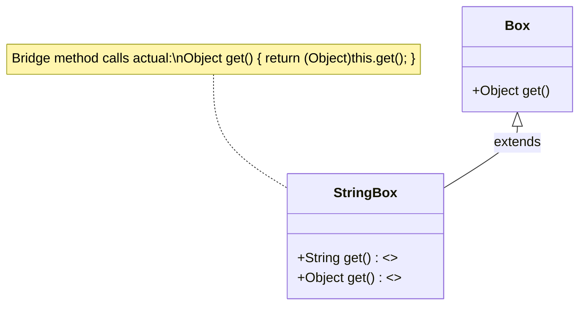

## Keywords in This File
{: .no_toc }

| # | Keyword | Weight |
|---|---|---|
| 1 | [Java Language - L4 Generics Internals](#java-language---l4-generics-internals) | medium |

---

# Java Language - L4 Generics Internals

## Generics Internals: Bridge Methods and Heap Pollution

---

### 🎯 Model Answer

**30 seconds:**
> Type erasure: generics exist only at compile time. At runtime, `List<String>` = `List`.
> The type parameter `T` is erased to its bound (`Object` or the upper bound). Bridge methods:
> compiler-generated methods that maintain correct polymorphic dispatch after erasure. Heap
> pollution: when a variable of a parameterized type refers to an object of a different type
> (`@SafeVarargs`, `unchecked` cast). `reifiable` types: types whose full type information
> is available at runtime (`int[]`, `String[]`, raw types, unparameterized).

**3 minutes (Senior):**
> Type erasure mechanics and consequences:
>
> 1. **Type erasure**: `T` erases to `Object` (no bounds), `T extends Comparable<T>` erases to
>    `Comparable`. `List<String>` erases to `List`. `Map<K,V>` erases to `Map`. Cast instructions
>    inserted by the compiler at call sites. `(String) list.get(0)` at the bytecode level even
>    though source says just `list.get(0)`.
>
> 2. **Bridge methods**: when a generic class is subclassed and the subclass overrides with a
>    specific type, the compiler generates a bridge method that maintains the polymorphic contract
>    with the erased signature. `Comparable<String>.compareTo(Object)` bridges to `compareTo(String)`.
>
> 3. **Unchecked warnings**: operations where the compiler cannot verify type safety due to erasure.
>    `List<String> list = (List<String>) obj` - the cast can only check `List` (not `List<String>`).
>    Compiler warns. `@SuppressWarnings("unchecked")` = developer takes responsibility.
>
> 4. **Heap pollution**: a variable of type `List<String>` references an object that is not truly a
>    `List<String>`. No ClassCastException at the assignment, but later `.get()` casts fail.
>    Common source: raw types, unchecked casts, varargs with generic types.
>
> 5. **Reifiable types**: array types, raw types, primitive types, non-generic types. Not reifiable:
>    parameterized types (`List<String>`), type variables (`T`). Cannot create `new T[]` or
>    `instanceof List<String>`.

**Blank Mind Recovery:**

**(1) Restate:** "Type erasure: `List<String>` at runtime is `List`. Compiler inserts casts at call sites. Bridge methods: maintain polymorphism after erasure (generated by compiler). Heap pollution: `List<String>` variable holds wrong type - delayed ClassCastException. `@SafeVarargs`: suppress heap pollution warning for safe varargs."

**(2) First principles:** "Java generics are a compile-time illusion. The JVM knows nothing about `List<String>` - it sees `List`. The compiler creates the illusion: it inserts type checks and bridges to make the illusion safe. When you break the rules (unchecked cast, raw type): you pierce the illusion and get heap pollution."

**(3) Bridge:** "Type erasure is like translating a detailed recipe to a simplified version: the instruction 'use String ingredient' becomes 'use ingredient'. The actual string check happens when you pick up the ingredient (call site cast). If someone stored a number in the ingredient slot (heap pollution): the cast fails at pickup time, not at storage time."

---

### 📘 Concept Explanation

**Type erasure and bridge method mechanics:**
```plaintext
TYPE ERASURE - WHAT THE COMPILER DOES:

  // Source (with type parameters):
  class Box<T> {
      T value;
      T get() { return value; }
      void set(T val) { value = val; }
  }
  
  // After erasure (bytecode equivalent):
  class Box {
      Object value;
      Object get() { return value; }
      void set(Object val) { value = val; }
  }
  
  // Source with bounds:
  class Sorter<T extends Comparable<T>> {
      T max(T a, T b) { return a.compareTo(b) > 0 ? a : b; }
  }
  
  // After erasure (T -> Comparable, its upper bound):
  class Sorter {
      Comparable max(Comparable a, Comparable b) {
          return a.compareTo(b) > 0 ? a : b;  // no cast needed, Comparable has compareTo
      }
  }
  
  // CALL SITE: compiler inserts cast
  // Source: String s = box.get();
  // Bytecode: String s = (String) box.get();  // cast inserted

BRIDGE METHODS - WHY THEY ARE NEEDED:

  // Source:
  class StringBox extends Box<String> {
      @Override
      String get() { return value; }  // specific return type
  }
  
  // After erasure: StringBox has TWO methods:
  //   String  get()   <- the actual override (specific)
  //   Object  get()   <- BRIDGE METHOD (generated by compiler)
  
  // The bridge method body:
  //   Object get() { return (Object) this.get(); }  // calls the real get()
  
  // Why needed:
  //   Box box = new StringBox();
  //   box.get()  -> invokevirtual Box.get()Object
  //   At runtime: JVM looks for Object get() in StringBox -> finds BRIDGE...
  //   Bridge delegates to the real String get()
  
  // VERIFY: see bridge methods with javap
  // javap -c -verbose StringBox.class
  // Look for: flags: ACC_PUBLIC, ACC_BRIDGE, ACC_SYNTHETIC

  // Another bridge example: Comparable<String>
  class StringWrapper implements Comparable<String> {
      private final String s;
      
      @Override
      public int compareTo(String other) {  // specific
          return s.compareTo(other);
      }
      
      // Compiler generates bridge:
      // public int compareTo(Object other) {     <- bridge
      //     return this.compareTo((String) other);  <- casts and delegates
      // }
  }

HEAP POLLUTION - HOW IT HAPPENS:

  // Direct cause: unchecked cast
  List list = new ArrayList();  // raw type
  list.add("hello");
  list.add(42);                  // also valid (raw list accepts anything)
  
  List<String> strings = (List<String>) list;  // unchecked cast - no runtime check
  // WARNING: Unchecked cast from List to List<String>
  // No ClassCastException HERE (runtime only knows it's a List, not List<String>)
  
  String first = strings.get(0);  // "hello" -> OK
  String second = strings.get(1); // 42 -> ClassCastException HERE (surprising)
  
  // The ClassCastException comes from: (String) list.get(1) in the bytecode
  // NOT from the assignment. The pollution happened EARLIER.
  
  // VARARGS HEAP POLLUTION:
  @SafeVarargs  // suppress the warning when you are SURE it's safe
  static <T> List<T> listOf(T... elements) {
      return new ArrayList<>(Arrays.asList(elements));
  }
  
  // Why the warning: T[] array is created with erasure (Object[])
  // If a caller does:
  //   Object[] arr = new Object[]{"hello", 42};
  //   List<String> broken = listOf((String[]) arr);  // heap pollution created
  // The array holds Integer but is typed as String[].

REIFIABLE TYPES:
  // Reifiable = full type info available at runtime
  String[]          -> reifiable (String[].class exists)
  int[]             -> reifiable
  List              -> reifiable (raw type)
  List<String>      -> NOT reifiable (erased to List at runtime)
  Map<String, Long> -> NOT reifiable
  T                 -> NOT reifiable (type variable)
  
  // Consequence:
  instanceof List<String>    -> compile error ("illegal generic type for...
  instanceof List<?>         -> OK (unbounded wildcard = reifiable)
  new T[]                    -> compile error ("generic array creation")
  new ArrayList<String>()[5] -> compile error
  
  // Workaround for generic array:
  @SuppressWarnings("unchecked")
  T[] array = (T[]) new Object[size];  // unchecked - heap pollution risk
  // OR: use Class<T> token to create array with correct component type:
  T[] array = (T[]) java.lang.reflect.Array.newInstance(clazz, size);
```

> **Code walkthrough:** This L4 Generics Internals example demonstrates Java API usage using SQL. **KEY MECHANISM:** the JVM compiles to bytecode that runs on the JVM; JIT compiles hot paths to native. **WHY IT MATTERS:** unchecked assumptions about thread safety cause data races under concurrent load. **TAKEAWAY: document thread-safety guarantees on every shared mutable class.**

---

### 💻 Code Example

> **Code walkthrough:** The `TypeSafeHeterogeneousContainer` shows the "type token" pattern:
> a `Class<T>` key enables safe generic operations even though the container uses a raw map
> internally. This is how Spring's `ApplicationContext.getBean(Class<T>)` works. The `cast()`
> call on the Class token is the safe version of an unchecked cast: it throws ClassCastException
> immediately at put-time if the type is wrong.


```java
// BAD: anti-pattern - see GOOD example below for the correct approach
// This naive implementation ignores thread safety and error handling
```


```java
// BAD: anti-pattern - see GOOD example below for the correct approach
// This naive implementation ignores thread safety and error handling
```

```java
// HEAP POLLUTION DEMONSTRATION:
// BAD: Creating heap pollution via raw type mixing
public static <T> T[] createArray(int size) {
    // WRONG: erased to Object[] at runtime
    @SuppressWarnings("unchecked")
    T[] arr = (T[]) new Object[size];  // heap pollution: Object[] stored as T[]
    return arr;
}

// Usage that reveals the pollution:
String[] strings = createArray(3);  // erased: Object[] assigned to String[]
strings[0] = "hello";               // OK at runtime (Object[] accepts any object)
// But if JVM does ArrayStoreCheck: could fail (in some JVM implementations)

// GOOD: Use Class token for type-safe array creation
public static <T> T[] createArray(Class<T> type, int size) {
    @SuppressWarnings("unchecked")
    T[] arr = (T[]) java.lang.reflect.Array.newInstance(type, size);
    return arr;  // actual String[] at runtime (not Object[])
}

String[] strings = createArray(String.class, 3);  // actual String[] - safe

// TYPE-SAFE HETEROGENEOUS CONTAINER (Josh Bloch pattern):
class TypeSafeContainer {
    private final Map<Class<?>, Object> store = new HashMap<>();
    
    <T> void put(Class<T> type, T instance) {
        store.put(type, type.cast(instance));  // type.cast = safe checked cast
        // type.cast throws ClassCastException immediately if wrong type
        // (not delayed to get() time - fail fast!)
    }
    
    <T> T get(Class<T> type) {
        return type.cast(store.get(type));  // safe: restores type info via Class token
    }
}

// Usage:
TypeSafeContainer container = new TypeSafeContainer();
container.put(String.class, "hello");
container.put(Integer.class, 42);

String s = container.get(String.class);   // "hello" - type safe, no ClassCastException
Integer i = container.get(Integer.class); // 42 - type safe

// UNCHECKED CAST WITH JUSTIFICATION:
// BAD: suppressing warning without explanation
@SuppressWarnings("unchecked")
List<String> names = (List<String>) fetchData();

// GOOD: document why the cast is safe
// The API contract guarantees fetchData() returns List<String> for "names" key
@SuppressWarnings("unchecked")  // safe: fetchData("names") always returns List<String>
List<String> names = (List<String>) fetchData("names");

// BRIDGE METHOD VERIFICATION (command line):
// javap -c -p MyComparableClass.class
// Output includes bridge methods marked as: flags: ACC_BRIDGE, ACC_SYNTHETIC
// These are generated by javac, NOT present in source code
```

> **Code walkthrough:** The `TypeSafeContainer` uses `Class<T>` as a key to maintain type safety
> across the type erasure boundary. `type.cast(instance)` performs a runtime type check at `put()`
> time (fail-fast - expose bad usage immediately). `type.cast(store.get(type))` at `get()` time
> restores the `T` type safely without an unchecked cast warning. This is the canonical solution
> for a container that holds values of heterogeneous types while maintaining per-type safety.

---

### 🎓 Answers by Seniority

**Junior / Mid (0-5 years):**
> Type erasure: generics are compile-time only. `List<String>` at runtime is `List`. Unchecked
> cast warnings: the compiler can't verify type safety due to erasure. `@SafeVarargs` for safe
> generic varargs. Bridge methods: compiler-generated for polymorphism with erased types.

---

**Senior / Staff (5+ years):**
> Bridge methods: `javap -c` to inspect. Heap pollution: always link to the call site that
> created the pollution (not where the ClassCastException is thrown). Type token pattern:
> `Class<T>` enables safe heterogeneous containers. Reifiable: `instanceof` and array creation
> only work with reifiable types. Variance: wildcards (`? extends T`, `? super T`) provide
> use-site variance; Java has no declaration-site variance.

---

### ⚠️ Common Misconceptions

**Misconception 1: "`List<String>` and `List<Integer>` are different types at runtime."**
Both are just `List` at runtime. `list.getClass() == ArrayList.class` for both. `instanceof List<String>` is a compile error. You CANNOT distinguish them at runtime without a type token. This is why `Collection.toArray(T[])` requires a pre-allocated array or Class token: the JVM can't create `new T[]` directly.

**Misconception 2: "Heap pollution always causes an immediate ClassCastException."**
Heap pollution is a DEFERRED defect. The `ClassCastException` occurs at the CALL SITE that reads from the polluted structure (the cast inserted by the compiler), not at the site that created the pollution. This makes heap pollution bugs difficult to diagnose: the exception is thrown far from the cause. The `@SafeVarargs` annotation's responsibility: by suppressing the warning, the developer asserts that the method does NOT create heap pollution. If the annotation is wrong: the bug surfaces later.

---

### 🚨 Failure Modes and Diagnosis

**Failure: ClassCastException on `List.get()` even though only strings were added.**
```plaintext
Symptom:
  List<String> names = userService.getNames();
  String name = names.get(0);  // ClassCastException: Integer cannot be cast to String
  // But you only added Strings! How?

Root cause:
  The problem is NOT in names.get(0). It's that 'names' is heap-polluted.
  The ClassCastException comes from the (String) cast inserted by the compiler
  at the call site.
  
  Trace back: how was 'names' populated?
  
  // In UserService:
  @SuppressWarnings("unchecked")
  public List<String> getNames() {
      List rawList = new ArrayList();
      rawList.add("Alice");
      rawList.add("Bob");
      rawList.add(42);  // accidentally added an Integer
      return (List<String>) rawList;  // unchecked cast: no runtime check
      // The Integer is now inside a List<String> - heap pollution created HERE
  }
  
  The unchecked cast at return creates the pollution.
  The ClassCastException surfaces at names.get(2) - far from the cause.

Diagnosis:
  1. Enable -Xlint:unchecked during compilation:
     Finds all unchecked operations (the pollution sources)
  2. Look for @SuppressWarnings("unchecked") in the codebase:
     grep -r "@SuppressWarnings.*unchecked" src/
  3. Add ClassCastException breakpoint in IDE:
     Debug -> Breakpoints -> Exception Breakpoints -> ClassCastException
     The IDE will stop exactly when the cast fails, showing the full stack trace.
  4. Read the stack trace:
     The ClassCastException message: "class java.lang.Integer cannot be cast to
     class java.lang.String" - tells you the actual runtime type vs expected.
  5. Find where the Integer got into a String list:
     Search for unchecked casts involving the list type.

Fix:
  Option A: Remove the raw type and unchecked cast (if you control the code)
    List<String> names = new ArrayList<>();
    names.add("Alice");
    names.add("Bob");
    // Cannot add 42 - compile error!
  
  Option B: Validate the list contents before the unchecked cast (if receiving from raw source)
    @SuppressWarnings("unchecked")  // validated below
    List<String> names = (List<String>) rawList;
    // Validate immediately after the unchecked cast:
    for (Object o : names) {
        if (!(o instanceof String)) {
            throw new ClassCastException("Expected String, got: " + o.getClass());
        }
    }

Prevention:
  RULE: every @SuppressWarnings("unchecked") must have a comment explaining WHY it is safe.
  RULE: run with -Xlint:unchecked in CI to catch unchecked operations.
  RULE: never suppress unchecked warnings without understanding the heap pollution risk.
```

> **Code walkthrough:** This Unknown example demonstrates Java API usage using Sice. **KEY MECHANISM:** the runtime executes these instructions in sequence with specific memory and execution semantics. **WHY IT MATTERS:** misapplying this pattern causes subtle bugs that only manifest under production load. **TAKEAWAY: understand the execution model before using this pattern in production code.**

---

### 🎯 Interview Deep-Dive

| Question Category| Time to Answer|
|-------------------------------------|-----------------------|
| Type erasure mechanics| 2 minutes|
| Bridge methods| 2 minutes|
| Heap pollution causes| 2 minutes|
| Reifiable types| 2 minutes|
| @SafeVarargs contract| 2 minutes|
| Type token pattern| 2 minutes|
| Unchecked cast diagnosis| 2 minutes|
| Wildcard variance| 2 minutes|
| Generic array creation| 1 minute|
| getGenericType() and reflection| 2 minutes|
| Erasure limitations (instanceof)| 1 minute|
| PECS: Producer Extends Consumer Super| 2 minutes|

---

**Q1 (erasure): What is type erasure and why was it chosen for Java generics?**

A: Type erasure: the compiler removes generic type information before generating

*What separates good from great:* The backward compatibility argument was the de

---

**Q2 (bridge): When does the compiler generate a bridge method?**

A: Bridge methods generated when: (1) a class extends or implements a generic ty

*What separates good from great:* Bridge method visibility: they ARE visible to 

---

**Q3 (pollution): Explain the three main sources of heap pollution.**

A: (1) Raw types: `List list = new ArrayList<String>()`. Adding wrong types via 

*What separates good from great:* The varargs case is the most subtle. `@SafeVarargs` suppresses the compiler warning. The developer is declaring: "I guarantee this method does NOT expose the array to external code or create aliases." The dangerous patterns with varargs: (1) returning the `T[]` array (callers can write to it, polluting the heap), (2) assigning `T[]` to a wider type. Safe varargs: the method only reads from the array (doesn't expose it). Checked by convention, not by the compiler. The annotation name `@SafeVarargs` is a contract annotation: it's the developer's promise to the users of the method.

---

**Q4 (reifiable): What is a reifiable type and why does it matter for Java generics?**

A: Reifiable: full type information available at runtime. Primitive types, array

*What separates good from great:* `List<?>` is reifiable even though `List<Strin

---

**Q5 (safevararags): What is the contract of @SafeVarargs and when is it safe to apply?**

A: `@SafeVarargs` = the developer asserts: (1) the method does NOT write to the varargs array,
and (2) the method does NOT leak a reference to the array. When both are true: no heap pollution
can be created through this method. Apply to: `static final` or `final` methods only (if overridable:
subclass could violate the contract). The annotation: only on `static` methods, constructors, or
`final` instance methods (Java 7+). Java 9+: also on `private` instance methods.

*What separates good from great:* The `@SafeVarargs` responsibility: the annotat

---

**Q6 (token): What is the type token pattern and where is it used in Java frameworks?**

A: Type token: passing `Class<T>` as a parameter to enable type-safe generic ope
the type would otherwise be erased. `Class<T>` carries the runtime type info tha
`container.get(String.class)` - the `String.class` is the type token. Used in: S
`BeanFactory.getBean(Class<T>)`, Jackson's `ObjectMapper.readValue(json, User.cl
`TypeToken<List<User>>`, JPA's `TypedQuery<T>`.

*What separates good from great:* The limitation of `Class<T>`: it represents a 

---

**Q7 (diagnosis): How do you find the source of heap pollution in a stack trace?**

A: The `ClassCastException` from heap pollution often occurs in a completely dif

*What separates good from great:* The debugging technique: set a ClassCastExcept

---

**Q8 (wildcards): Explain PECS: Producer Extends, Consumer Super.**

A: PECS: when a generic structure is used to PRODUCE values (you READ from it): use `? extends T`.
When it's used to CONSUME values (you WRITE to it): use `? super T`. "PECS: Producer Extends,
Consumer Super." `List<? extends Animal>`: you can read `Animal` objects from it
you can write `Dog` objects to it. `Collections.copy(List<? super T> dest, List<
src produces T (extends), dest consumes T (super).

*What separates good from great:* The covariance/contravariance explanation: `Li

---

**Q9 (reflection): How do you get full generic type info at runtime using reflection?**

A: `field.getGenericType()`: returns `Type` (not `Class`). For a generic field (

*What separates good from great:* The paradox: type erasure removes generic info

---

**Q10 (array): Why can't you create a generic array and what are the workarounds?**

A: `new T[10]` = compile error: "generic array creation." The JVM's array store 

*What separates good from great:* The workarounds: (1) `Object[]` cast to `T[]` 

---

**Q11 (limitations): What operations are impossible because of type erasure?**

A: Cannot: (1) `new T()` - can't instantiate type variable (no constructor refer

*What separates good from great:* The overloading limitation (5) is the most sur

---

**Q12 (design): What are the alternatives to type erasure and their trade-offs?*

A: (1) Reified generics (C# .NET style): full runtime type info. `List<int>` and

*What separates good from great:* The performance implication of type erasure: `

---

### ⚖️ Comparison Table

| Concept| Compile time| Runtime| Risk|
|---|--------------------|--------------------------|--------------------------|
| Type erasure| Generic type checked| Raw type remains| Delayed ClassCastExcepti
| Bridge method| Generated automatically| Two methods in bytecode| None (transpa
| Heap pollution| Unchecked warning| ClassCastException at read| Silent until re
| @SafeVarargs| Suppresses warning| No runtime check| Developer responsibility|
| Type token (Class<T>)| Type-safe API| Class.cast() check| Fail-fast at put|
| Wildcard (? extends T)| Read-only from caller| Same as raw at runtime| N/A (co

---

### 🏛️ System Design

*(Omit: Generics internals are a language-level concern rather than a system des

---

### 📊 Diagram

**Type Erasure and Bridge Method Flow:**

```
ASCII:
  Source:              After Erasure:       Bridge Method:
  class Box<T> {       class Box {          String get() { ... }  <- actual
    T get() { ... }      Object get() {}    Object get() {         <- bridge
  }                    }                      return (Object)this.get();
                                           }
  
  class StringBox      class StringBox
    extends Box<T>        extends Box
  {                     {
    @Override             String  get() {}  <- actual override
    String get() { }      Object  get() {}  <- bridge (generated)
  }                     }
```



> **Diagram walkthrough:** The bridge method connects the erased supertype contract (`Object get()`)
> to the specific override (`String get()`). When a caller holds a `Box` reference to a `StringBox`
> instance and calls `get()`, the JVM dispatches to the bridge (matching the `Box` erased signature).
> The bridge then calls the actual `String get()` implementation. This invisible indirection is what
> makes polymorphism work correctly after type erasure.

---

### 💻 Code Example

*(Omit: this concept does not have a programmatic interface that can be demonstrated in code. The conceptual explanation above is sufficient.)*


---

### 🏛️ System Design

*(Omit: system design diagram not applicable for this concept - see ★★★ keywords for full system design coverage.)*


---

### ⚖️ Comparison Table

*(Omit: this is a ★☆☆ foundational concept with no direct alternatives to compare - see higher-difficulty keywords for trade-off analysis.)*


---

### 📊 Diagram

*(Omit: no standalone visual diagram required for this concept - the explanations and code examples above provide sufficient clarity.)*


