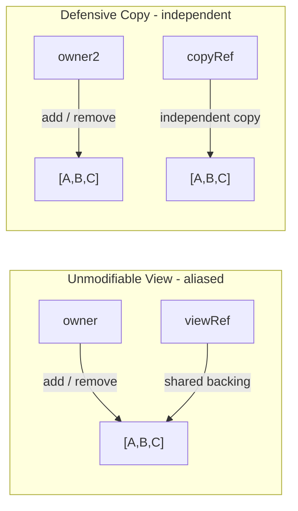
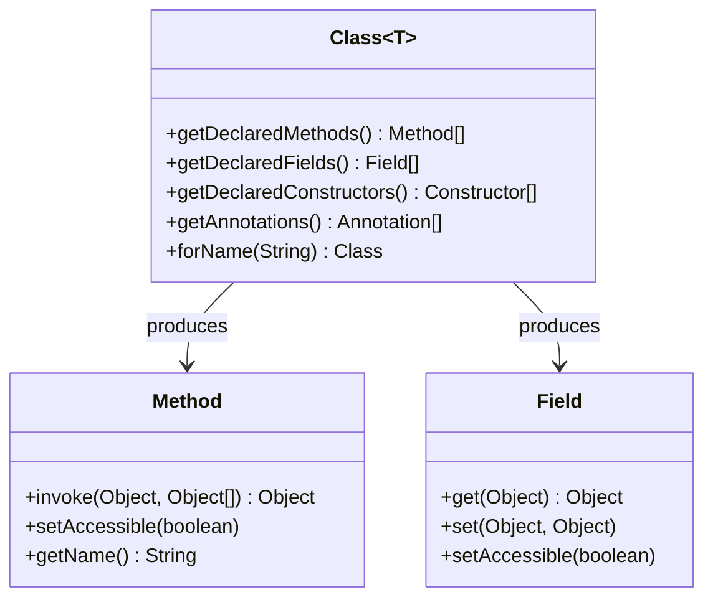
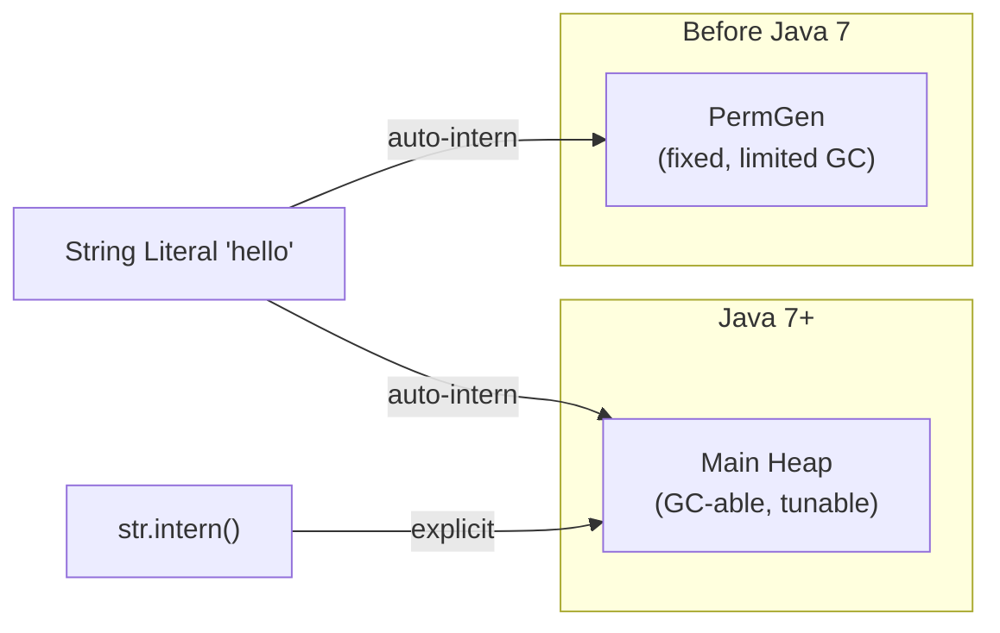

## Keywords in This File

{: .no_toc }

| #   | Keyword                                                                                                                            | Weight |
| --- | ---------------------------------------------------------------------------------------------------------------------------------- | ------ |
| 1   | [Type Erasure: Heap Pollution, Bridge Methods, Unchecked Warnings](#type-erasure-heap-pollution-bridge-methods-unchecked-warnings) | hard   |
| 2   | [Immutability: Defensive Copies, Unmodifiable Views,](#immutability-defensive-copies-unmodifiable-views)                           | hard   |
| 3   | [Reflection: Class, Method, Field - Power, Cost, Security](#reflection-class-method-field---power-cost-security)                   | hard   |
| 4   | [String Pool and Interning: Memory Footprint at Scale](#string-pool-and-interning-memory-footprint-at-scale)                       | hard   |

---

# Type Erasure: Heap Pollution, Bridge Methods, Unchecked Warnings

**TL;DR** - Java generics exist only at compile time. At runtime, all
generic types are erased to their bounds (or `Object`). This enables
backward compatibility but causes heap pollution, bridge methods, and
the impossibility of `new T[]`. Understanding erasure explains every
`@SuppressWarnings("unchecked")` you have ever written.

**Interview Weight:** hard - tested in senior/staff interviews on
generics internals, API design, and runtime type safety.

---

### 🎯 Model Answer

**30 seconds:**

> Java generics are a compile-time feature. At runtime, `List<String>`
> and `List<Integer>` are both just `List`. This is type erasure.
> It enables backward compatibility with pre-Java 5 bytecode but means
> you cannot use type parameters at runtime, create generic arrays,
> or catch generic exceptions. Heap pollution is what happens when
> the erased type contract is violated at runtime.

**3 minutes (Senior):**

> Erasure works by replacing type parameters with their bounds. `T`
> becomes `Object`, `T extends Comparable<T>` becomes `Comparable`.
> The compiler inserts casts where needed. The JVM sees no generics.
>
> Bridge methods are synthetic methods the compiler generates to
> maintain polymorphism after erasure. When you override a generic
> method from a supertype with a more specific type, the compiler
> generates a bridge method with the erased signature that delegates
> to your specific implementation.
>
> Heap pollution occurs when a variable of a parameterized type refers
> to an object of a different parameterized type. Varargs with generics
> is the most common source - `@SafeVarargs` suppresses the warning
> when you can prove the method does not pollute the heap.
>
> The unchecked warning is the compiler saying: "I am inserting a cast
> here that I cannot verify at compile time. If the heap is polluted,
> this will throw `ClassCastException` at a distance."

---

### 📘 Concept Explanation

**What Erasure Does**

```java
// Source code (generic)
public <T> T identity(T value) {
    return value;
}

public List<String> filter(List<String> list) {
    return list.stream()
               .filter(s -> s.length() > 3)
               .collect(Collectors.toList());
}
```

> **Code walkthrough:** This is what you write. The compiler sees
> full generic types. Type checking happens here - at compile time.

```java
// Bytecode equivalent after erasure
public Object identity(Object value) {
    return value;
}

public List filter(List list) {  // raw List
    return (List) list.stream()
               .filter(s -> ((String) s).length() > 3)
               .collect(Collectors.toList());
}
```

> **Code walkthrough:** After erasure, `T` becomes `Object`. `List<String>`
> becomes raw `List`. The compiler inserted a cast `(String) s` before
> calling `.length()`. These inserted casts are what fail with
> `ClassCastException` when heap is polluted. The JVM bytecode is
> exactly as if you had written raw types and manual casts.

**Bridge Methods**

```java
// Supertype with generic method
interface Comparable<T> {
    int compareTo(T other);
}

// After erasure:
interface Comparable {
    int compareTo(Object other);  // erased
}

// Implementation
class Integer implements Comparable<Integer> {
    public int compareTo(Integer other) { ... }
}
```

> **Code walkthrough:** After erasure, `Comparable` has `compareTo(Object)`.
> But `Integer.compareTo(Integer)` has a different signature. The
> JVM requires the erased signature to exist for polymorphism.

```java
// Compiler generates a synthetic bridge method in Integer:
// Bridge (synthetic, generated by compiler):
public int compareTo(Object other) {
    return compareTo((Integer) other);  // delegates + cast
}
// Your actual implementation:
public int compareTo(Integer other) { ... }
```

> **Code walkthrough:** The compiler generates a synthetic bridge
> method with the erased signature `compareTo(Object)` that casts
> and delegates to your implementation. You never write this. You
> can see it with `javap -verbose Integer.class` - it shows as
> `ACC_BRIDGE ACC_SYNTHETIC` in the method flags. Bridge methods
> are why `ClassCastException` from comparisons has a bridge in
> the stack trace.

**Heap Pollution**

```java
// Classic heap pollution pattern
List<String> strings = new ArrayList<>();
List rawList = strings;  // unchecked assignment: raw type
rawList.add(42);         // heap is now polluted: int in List<String>

// Pollution discovered here - NOT where it was caused
String s = strings.get(0);  // ClassCastException: Integer to String
```

> **Code walkthrough:** The `ClassCastException` happens at `get(0)`,
> not where the bad `add(42)` occurred. This is the insidious nature
> of heap pollution - the violation point and the discovery point are
> separated in code and in time. In production, the stack trace points
> to `get(0)` but the root cause is the raw type assignment, possibly
> in a completely different class.

**Varargs and Heap Pollution**

```java
// Dangerous: varargs + generics = heap pollution risk
@SafeVarargs  // suppress if you can prove no pollution
public static <T> List<T> asList(T... elements) {
    // elements is actually Object[] at runtime
    // If caller passes List<String>... the array holds Lists
    // Storing anything in that array = pollution
    return new ArrayList<>(Arrays.asList(elements));
}

// DANGEROUS pattern (DO NOT USE):
static <T> void addToAll(T element, List<T>... lists) {
    Object[] objArray = lists;  // array covariance
    objArray[0] = List.of("string");  // pollutes lists[0]
    // lists[0] is now List<String> but T could be Integer
}
```

> **Code walkthrough:** When you create a varargs parameter of a
> generic type, Java creates an array. Arrays are covariant
> (`Object[] = String[]`). Assigning a different parameterized list
> into that array via the `Object[]` reference is heap pollution.
> `@SafeVarargs` is your promise to the compiler that your method
> does not do this. If you break that promise, `ClassCastException`
> at a distance.

**What You Cannot Do Because of Erasure**

```java
// Cannot create instances of type parameters
public <T> T createNew() {
    return new T();   // compile error: cannot instantiate T
}
// Fix: pass Class<T> or Supplier<T>
public <T> T createNew(Supplier<T> factory) {
    return factory.get();
}

// Cannot create generic arrays
T[] arr = new T[10];   // compile error
// Fix: cast from Object[]
@SuppressWarnings("unchecked")
T[] arr = (T[]) new Object[10];  // unsafe but common

// Cannot use instanceof with parameterized types
if (obj instanceof List<String>) { }  // compile error
// Fix: erase the type
if (obj instanceof List<?>) { }       // OK
if (obj instanceof List<?> list) { }  // pattern match OK

// Cannot catch generic exceptions
try { }
catch (SomeException<T> e) { }  // compile error
```

> **Code walkthrough:** Every limitation has the same root cause:
> `T` does not exist at runtime. `new T()` is impossible because
> the JVM does not know what type to construct. `T[]` is impossible
> because array creation needs the actual component type at runtime.
> `instanceof List<String>` is impossible because `List<String>` and
> `List<Integer>` are the same type at runtime. The pattern: when
> you hit an erasure limitation, pass the class token or use
> bounded wildcards.

---

### 💻 Code Example

```java
// BAD: raw type causes heap pollution at distance
public class TypeErasureBug {
    @SuppressWarnings("unchecked")
    public static void main(String[] args) {
        List<Integer> ints = new ArrayList<>();
        ints.add(1);
        ints.add(2);

        // Incorrect cast to raw type - no error yet
        List raw = ints;
        raw.add("not an integer");  // compiles! runtime pollution

        // ClassCastException here - not where bug was introduced
        for (Integer i : ints) {  // CCE on "not an integer"
            System.out.println(i * 2);
        }
    }
}
```

> **Code walkthrough:** `raw.add("not an integer")` compiles because
> raw `List` has `add(Object)`. No runtime exception yet. The
> `List<Integer>` reference `ints` now holds a String. The
> `ClassCastException` fires in the for-each loop when the compiler's
> inserted cast `(Integer) raw.get(0)` hits the String. The bug is
> on line `raw.add(...)`, the crash is in the loop - potentially
> thousands of lines apart in a large codebase.

```java
// GOOD: use generic types consistently, pass Class<T> for reflection
public class SafeGenericContainer<T> {
    private final Class<T> type;
    private final List<T> items = new ArrayList<>();

    public SafeGenericContainer(Class<T> type) {
        this.type = type;
    }

    public void add(T item) {
        items.add(Objects.requireNonNull(item));
    }

    // Safe cast using the class token
    public T castFrom(Object obj) {
        return type.cast(obj);  // throws CCE if wrong type
    }

    // Safe array creation - acknowledged unsafe, isolated
    @SuppressWarnings("unchecked")
    public T[] toArray() {
        return (T[]) items.toArray(
            (T[]) java.lang.reflect.Array.newInstance(type, 0)
        );
    }
}
```

> **Code walkthrough:** Passing `Class<T>` retains the type token at
> runtime despite erasure. `type.cast(obj)` uses the class token to
> perform a checked cast that throws immediately on wrong type (no
> delayed ClassCastException). `Array.newInstance(type, 0)` creates
> a correctly typed array at runtime using the class token. The
> `@SuppressWarnings("unchecked")` is isolated to the one method that
> requires it, not sprayed across the class.

**Diagnosing erasure-related ClassCastException**

```java
// Diagnostic: look for bridge in stack trace
// Exception in thread "main" ClassCastException:
//   class String cannot be cast to class Integer
//   at Foo$$Lambda.accept(Unknown Source)
//   at java.lang.Iterable.forEach(Iterable.java:75)
//   at ...
// "Foo$$Lambda" or synthetic bridge in trace = erasure victim
// Check: what raw type was assigned upstream?

// Diagnostic command: view bridge methods
// javap -verbose -classpath . com.example.MyClass
// Look for: flags: (0x1040) ACC_BRIDGE, ACC_SYNTHETIC
```

> **Code walkthrough:** A `ClassCastException` from a synthetic bridge
> method points to an erasure-related heap pollution bug. The actual
> problem is upstream where a raw type was used or a varargs generic
> was improperly populated. `javap -verbose` lists all bridge methods
> with `ACC_BRIDGE` and `ACC_SYNTHETIC` flags. Finding them confirms
> the method is compiler-generated. The actual fix is finding where
> the raw type assignment happened.

**How to test:** Test heap pollution by deliberately polluting via
raw types and verify the exception fires at the right point. Test
`@SafeVarargs` by verifying no warning and no runtime issue. Test
the class-token pattern by verifying `cast()` throws immediately.

---

### 🎓 Answers by Seniority

**Junior / Mid:**
"Type erasure means Java generics only exist at compile time. At
runtime, `List<String>` is just `List`. The compiler adds casts
where needed. This is why you cannot use `instanceof` with generic
types, create generic arrays, or instantiate type parameters directly."

**Senior / Staff:**
"Erasure was a deliberate backward-compatibility choice in Java 5.
Reifiable generics (like C# .NET generics) were not chosen because
they would have been incompatible with existing bytecode.

The practical implications I watch for:

1. `@SuppressWarnings("unchecked")` is a promise - document WHY
   the cast is safe or fix the root cause
2. Heap pollution from varargs generics is the most insidious source
   of delayed ClassCastException
3. Bridge methods explain mysterious CCE in stack traces pointing to
   synthetic methods
4. Passing `Class<T>` as a 'type token' is the canonical pattern for
   preserving type information through erasure (Jackson, Guava, Spring
   all do this with `TypeReference<T>`)

The limitation I hit most in API design: `new T()` and `T[]` are
impossible. Jackson solves `new T()` with `TypeReference<T>`.
Spring solves it with `ParameterizedTypeReference<T>`. Both retain
the type through a class literal trick that survives erasure."

---

### ⚠️ Common Misconceptions

| #   | Misconception                                             | Reality                                                                                                                                                                   | Danger                                    |
| --- | --------------------------------------------------------- | ------------------------------------------------------------------------------------------------------------------------------------------------------------------------- | ----------------------------------------- |
| 1   | "Generics are just syntax sugar with no runtime impact"   | True that generics erase, but false that there is no impact: bridge methods are generated, casts are inserted, heap pollution is a real runtime risk.                     | Dismissing unchecked warnings             |
| 2   | "`@SuppressWarnings("unchecked")` makes it safe"          | It suppresses the warning only. The cast is still unsafe if the heap is polluted.                                                                                         | Assuming suppression = verification       |
| 3   | "List<String> and List<Integer> are different at runtime" | They are both raw `List` at runtime. `list instanceof List<String>` is a compile error for this reason.                                                                   | Wrong mental model of runtime type system |
| 4   | "`@SafeVarargs` prevents heap pollution"                  | It suppresses the warning only. The programmer must prove the method does not pollute. `@SafeVarargs` on a method that actually pollutes still causes ClassCastException. | False safety from annotation              |
| 5   | "Bridge methods are a defect in Java's generics design"   | Bridge methods are the correct, intentional solution to maintaining polymorphism after erasure. They are not a defect; they are a compatibility mechanism.                | Misdiagnosing stack traces                |

---

### 🚨 Failure Modes and Diagnosis

**FM1 - ClassCastException at a distance**

_Symptom:_ `ClassCastException` thrown in code that appears correct
at the point of failure. Stack trace points to an auto-generated
cast or bridge method.

_Root Cause:_ Heap pollution introduced upstream via raw type
assignment or unsafe cast.

_Diagnostic:_

```java
// 1. Enable unchecked warnings (do not suppress globally):
// javac -Xlint:unchecked MyCode.java

// 2. Find the raw type assignment:
// Search for: (List), (Map), (Set), (Iterator) casts
// Search for raw type usage: List list = ..., Map map = ...

// 3. Check @SuppressWarnings sites:
// Each one is a potential pollution source
// Verify the comment explaining why the cast is safe
```

> **Code walkthrough:** The `-Xlint:unchecked` flag makes the compiler
> report every unchecked cast and raw type usage. Running this on a
> codebase often reveals dozens of sites that were suppressed without
> verification. Each unchecked site is a candidate for the heap
> pollution source. Start from the ClassCastException stack trace,
> find the raw type that was assigned upstream of that point.

_Fix:_ Propagate generic types consistently. Replace raw types with
wildcards or bounded type parameters. When passing collections across
API boundaries, use the most specific type parameter possible.

**FM2 - Generic type not available at runtime**

_Symptom:_ Attempting to use reflection to get the generic type of
a field or return type fails or returns erased type.

_Root Cause:_ Erasure removes runtime type information from method
signatures and local variables. Fields and method signatures retain
generic type information in the class file metadata (as strings)
but not as live type objects.

_Diagnostic and Fix:_

```java
// Get generic type from field metadata (survives erasure)
Field field = MyClass.class.getDeclaredField("items");
ParameterizedType pt =
    (ParameterizedType) field.getGenericType();
Type typeArg = pt.getActualTypeArguments()[0];
// typeArg is the Type for the parameterized field

// Jackson TypeReference pattern: class body captures type
// in superclass generic type (not erased for class metadata)
TypeReference<List<String>> ref = new TypeReference<>(){};
// ref.getType() returns List<String> as a ParameterizedType
```

> **Code walkthrough:** Class file metadata retains generic type
> information for fields and method signatures as descriptor strings,
> even after erasure of the executable bytecode. `getGenericType()`
> and `getGenericReturnType()` parse these metadata strings. The
> `TypeReference<T>{}` pattern (used by Jackson, Guava, Spring)
> creates an anonymous subclass whose supertype is `TypeReference<T>`
>
> - the concrete type `T` is stored in the class metadata and
>   recovered via `getGenericSuperclass()`.

---

### 🎯 Interview Deep-Dive

| Preparation time | Recommended approach                                                                                                             |
| ---------------- | -------------------------------------------------------------------------------------------------------------------------------- |
| 5 minutes        | What erases + cannot do at runtime (new T, T[], instanceof)                                                                      |
| 15 minutes       | Add heap pollution + bridge methods explanation                                                                                  |
| 30 minutes       | Add @SafeVarargs + TypeReference pattern + diagnostic                                                                            |
| Under pressure   | "Generics compile-time only; T becomes Object; bridge methods for polymorphism; ClassCastException at distance = heap pollution" |

**[JUNIOR] Q1 - Conceptual**
_What does type erasure mean and why does Java use it?_

Type erasure means Java generics are removed at compile time. At
runtime, `List<String>` and `List<Integer>` are both just `List`.
The type parameters `<String>`, `<Integer>` do not exist in bytecode.

Why: backward compatibility. Java 5 introduced generics in 2004.
If generics were reified (kept at runtime), bytecode generated by
Java 5 would be incompatible with Java 1.4. All existing libraries
(Collections, IO, etc.) would need recompilation. The Java team chose
erasure to allow a gradual migration where old code could use new
generic code without changes.

_Why they ask:_ Foundation question that gates all deeper generics
discussion.

_Likely follow-up:_ "What are the limitations imposed by erasure?"

_What separates good from great:_ Knowing the backward compatibility
motivation - not just "what" but "why Java made this choice."

---

**[JUNIOR] Q2 - Conceptual**
_What is a bridge method and why does the compiler generate one?_

A bridge method is a synthetic method generated by the compiler to
maintain polymorphism after type erasure.

When you override a generic method from a supertype with a more
specific type, erasure creates a signature mismatch:

- Erased supertype signature: `compareTo(Object)`
- Your override signature: `compareTo(Integer)`

The JVM requires both signatures to exist for polymorphic dispatch.
The compiler generates a bridge with the erased signature that casts
and delegates to your implementation.

You can see bridge methods with `javap -verbose`:
`flags: (0x1040) ACC_BRIDGE, ACC_SYNTHETIC`

_Why they ask:_ Tests depth of generics knowledge beyond surface level.

_Likely follow-up:_ "Have you ever seen a bridge method in a stack
trace?"

_What separates good from great:_ Knowing you can see bridge methods
with `javap -verbose` and understanding their role in ClassCastException
stack traces.

---

**[MID] Q3 - Hands-On**
_Explain why this code compiles but throws a ClassCastException at
runtime:_

```java
List<Integer> ints = new ArrayList<>();
List raw = ints;
raw.add("hello");
Integer i = ints.get(0);  // throws here
```

Step by step:

1. `List raw = ints` - raw type assignment. Compiler warns about
   unchecked assignment but allows it (backward compatibility).

2. `raw.add("hello")` - raw `List` has `add(Object)`. Compiles.
   No runtime check. String is inserted into the underlying
   `ArrayList` that was typed as `List<Integer>`.

3. `ints.get(0)` - the compiler inserted a cast: `(Integer) ints.get(0)`.
   This is the erased type contract. At runtime it finds a String.
   `ClassCastException: class String cannot be cast to Integer`.

The cast is inserted by the compiler where the generic type is used.
The heap pollution is introduced where the raw type is used.
These are different places - potentially in different classes.

_Why they ask:_ Tests ability to trace type erasure through a concrete
example.

_Likely follow-up:_ "How would you find the source of this kind of
bug in a large codebase?"

_What separates good from great:_ Explaining the inserted cast on
step 3 - this is the mechanism the compiler uses and why the exception
points to the wrong place.

---

**[MID] Q4 - Trade-off**
_When is it safe to suppress unchecked cast warnings?_

It is safe when you can PROVE:

1. The source of the object is known and controlled
2. The object is genuinely of the cast type
3. No raw type was used between creation and cast

Common safe patterns:

```java
// 1. Class token cast - always safe
T value = type.cast(rawObject);  // no suppress needed

// 2. Internal collection cast after external validation
@SuppressWarnings("unchecked")
List<String> validated = (List<String>) validateAll(raw);
// Safe IF validateAll() checks all elements

// 3. Singleton pattern with type token
@SuppressWarnings("unchecked")
static <T> Collection<T> emptyCollection() {
    return (Collection<T>) EMPTY;  // EMPTY has no elements
    // Safe: no elements = no wrong-type elements
}
```

> **Code walkthrough:** Pattern 3 is the `Collections.emptyList()`
> approach: an empty collection contains no elements, so the cast
> can never fail at point of use. `EMPTY` is a `Collection<Object>`;
> casting to `Collection<T>` is safe precisely because nothing will
> ever be retrieved with a wrong-type cast. This is why
> `Collections.emptyList()` suppresses the warning.

ALWAYS document WHY with the suppress annotation.

_Why they ask:_ Practical experience with safe use of unchecked
operations is a hallmark of senior Java engineers.

_Likely follow-up:_ "What is @SafeVarargs?"

_What separates good from great:_ The empty collection example -
this is the real production pattern behind `Collections.emptyList()`.

---

**[SENIOR] Q5 - Architecture**
_How does Jackson's TypeReference solve the type erasure problem for
deserialization?_

Problem: `objectMapper.readValue(json, List<User>.class)` is a
compile error - `List<User>.class` does not exist due to erasure.

Solution: Jackson's `TypeReference<T>` uses the class file metadata
loophole:

```java
// Jackson TypeReference: anonymous subclass captures type
// in superclass generic type - stored in class metadata
JavaType type = mapper.getTypeFactory()
    .constructCollectionType(List.class, User.class);
List<User> users = mapper.readValue(json, type);

// Or using TypeReference (anonymous class captures T):
List<User> users = mapper.readValue(
    json,
    new TypeReference<List<User>>(){}
);
```

> **Code walkthrough:** `new TypeReference<List<User>>(){}` creates
> an anonymous class whose direct supertype is `TypeReference<List<User>>`.
> The concrete type `List<User>` is stored in the class file metadata
> for the anonymous class. Jackson calls
> `getClass().getGenericSuperclass()` on the anonymous class to
> recover `List<User>` as a `ParameterizedType` object. This is the
> "type token via anonymous subclass" pattern. It is the standard
> workaround for erasure in deserialization and is also used by
> Guava's `TypeToken<T>` and Spring's `ParameterizedTypeReference<T>`.

_Why they ask:_ Tests advanced generics knowledge and how real
libraries work around erasure.

_Likely follow-up:_ "What does Spring's ParameterizedTypeReference do?"

_What separates good from great:_ Knowing the anonymous class trick
and that Jackson, Guava, and Spring all use the same fundamental
pattern.

---

**[SENIOR] Q6 - Trade-off**
_Compare Java's type erasure to C#/.NET reified generics. What are
the trade-offs?_

**Java (erasure):**

- Backward compatible: pre-Java 5 bytecode interoperates
- Generics exist only at compile time
- Cannot use type parameter at runtime
- Cannot create generic arrays natively
- One copy of bytecode per generic class (smaller binary)
- Heap pollution risk from raw types

**C#/.NET (reified generics):**

- Type parameters exist at runtime
- `typeof(T)` works, `new T()` works with constraint
- Can create `T[]` directly
- No heap pollution from raw types
- Type information available in reflection without metadata tricks
- Breaking change from pre-generic code (cannot mix seamlessly)

In practice: Java's erasure is a legacy burden for framework authors
(Jackson TypeReference, Spring ParameterizedTypeReference) but
invisible to most application code. C#'s approach enables cleaner
APIs but required a clean break from pre-generic code.

_Why they ask:_ Tests breadth of language design knowledge.

_Likely follow-up:_ "Would you change Java generics if you could?"

_What separates good from great:_ The "one copy of bytecode" point

- erasure means `List<String>` and `List<Integer>` share the same
  class file. C# generates separate JIT compilations. Different memory
  and startup trade-offs.

---

**[STAFF] Q7 - System Design**
_Design a type-safe heterogeneous container (Bloch's Effective Java
Item 33) that avoids unchecked warnings._

A heterogeneous container maps `Class<T>` to `T` values, providing
a type-safe alternative to `Map<String, Object>`:

```java
public class TypedMap {
    private final Map<Class<?>, Object> map = new HashMap<>();

    public <T> void put(Class<T> type, T value) {
        Objects.requireNonNull(type);
        map.put(type, type.cast(value));  // defensive cast
    }

    public <T> T get(Class<T> type) {
        return type.cast(map.get(type));
    }

    public <T> Optional<T> getOpt(Class<T> type) {
        Object val = map.get(type);
        return Optional.ofNullable(type.cast(val));
    }
}

// Usage
TypedMap ctx = new TypedMap();
ctx.put(String.class, "hello");
ctx.put(Integer.class, 42);
String s = ctx.get(String.class);  // type-safe, no cast
```

> **Code walkthrough:** The `Class<T>` is the key AND the type token.
> `type.cast(value)` on `put` verifies the value matches the key type
> at insertion time, not at retrieval - fail-fast. `type.cast(map.get(type))`
> on `get` is a checked cast using the class token. No
> `@SuppressWarnings("unchecked")` needed. The container is type-safe
> by construction. Limitation: cannot store `List<String>` vs
> `List<Integer>` separately (same key `List.class`). For parameterized
> types, use Guava `TypeToken` as the key.

_Why they ask:_ Classic Effective Java design question testing
generics mastery.

_Likely follow-up:_ "How would you extend this to support parameterized
types like List<String>?"

_What separates good from great:_ The `type.cast()` on insert (not
just retrieve) for fail-fast behavior, and the Guava TypeToken
extension for parameterized types.

---

**[STAFF] Q8 - Production Reality**
_Describe a real production incident caused by type erasure._

Common incident: third-party deserializer returning wrong type.

A team had:

```java
// Caching layer returns Object
Object cached = cache.get(key);
List<User> users = (List<User>) cached;  // unchecked warning suppressed
```

After a dependency upgrade, the cache serialization changed. The
object stored for that key was actually `List<Map<String, Object>>`
(JSON deserialized to maps, not User objects) instead of `List<User>`.

The `(List<User>) cached` cast succeeds at runtime (erasure! both
are `List` at runtime). The `ClassCastException` fires later, in
unrelated business logic when `User.getName()` is called on a
`Map<String, Object>`.

Root cause: suppressed unchecked warning + type erasure = heap
pollution that was invisible until user data was processed.

Fix: use `type.cast()` for element-level verification:

```java
List<?> raw = (List<?>) cached;
List<User> users = raw.stream()
    .map(o -> User.class.cast(o))  // throws immediately if wrong
    .collect(Collectors.toList());
```

> **Code walkthrough:** Casting each element with `User.class.cast(o)`
> fails immediately on the first wrong-type element, at the point of
> retrieval. The ClassCastException stack trace now points to the
> deserialization/caching boundary, not to unrelated business logic.
> This transforms "ClassCastException at a distance" into
> "ClassCastException at the source."

_Why they ask:_ Tests ability to connect theory to production debugging.

_Likely follow-up:_ "How do you prevent this class of bug systematically?"

_What separates good from great:_ The element-level cast pattern as
the fix - this is the difference between fixing the symptom and
fixing the root cause.

---

**[MID] Q9 - Conceptual**
_Why can you not create a generic array (new T[10]) and what are
the workarounds?_

Arrays are covariant: `String[] s = new Object[1]` does not compile,
but `Object[] o = new String[1]` does (covariant). Arrays carry
their component type at runtime for `ArrayStoreException` checking.

`new T[]` is illegal because `T` is erased to `Object` at runtime.
The JVM would create `new Object[10]` - but then the array would
store any Object, defeating the type safety of the generic context.

Workarounds:

1. `Object[]` with cast (unsafe but common):

```java
@SuppressWarnings("unchecked")
T[] arr = (T[]) new Object[size];
// Unsafe: arr is actually Object[], not T[]
// Works when used internally; dangerous if leaked to caller
```

> **Code walkthrough:** `new Object[10]` creates an Object array.
> Casting to `T[]` is unchecked - it only removes the compile error.
> At runtime, the variable `arr` holds an `Object[]`. If you return
> this `T[]` to a caller who assigns it to `String[]`, they get an
> `ArrayStoreException` or ClassCastException. Safe when the array
> is only used internally within the generic class.

2. `Class<T>` token (safe):

```java
T[] arr = (T[]) Array.newInstance(type, size);
// type is Class<T> passed as constructor parameter
// Creates a correctly typed array at runtime
```

> **Code walkthrough:** `Array.newInstance(String.class, 10)` creates
> a `String[]` at runtime. This is safe because the component type
> is known. The cast to `T[]` is still unchecked at compile time
> but is guaranteed correct at runtime. This is the pattern used by
> collections that need array support (like `ArrayList.toArray(T[])` with
> a typed array argument).

_Why they ask:_ Tests deep understanding of arrays + generics interaction.

_Likely follow-up:_ "Why are arrays covariant in Java?"

_What separates good from great:_ Knowing both workarounds and their
safety trade-offs, not just "you can't do it."

---

**[JUNIOR] Q10 - Conceptual**
_What is an unchecked warning and when should you suppress it?_

An unchecked warning means: "I am inserting a cast here that cannot
be verified at compile time. If the object is of the wrong type at
runtime, you will get a ClassCastException."

It fires when:

- Casting from raw type to parameterized type
- Using raw type operations (add, get on raw collection)
- Creating generic arrays with Object[] trick

When to suppress `@SuppressWarnings("unchecked")`:

- When you can PROVE the cast is safe through your own invariants
- When the empty collection pattern guarantees no elements
- When the class token pattern is used correctly

When NOT to suppress:

- "The code works in tests" (insufficient proof)
- "I will fix it later" (technical debt with runtime risk)
- "The IDE suggested it" (IDE suggests suppress, not verifies safety)

Always add a comment explaining WHY the cast is safe:

```java
// Safe: EMPTY contains no elements, so no wrong-type cast possible
@SuppressWarnings("unchecked")
static final <T> List<T> emptyList() {
    return (List<T>) EMPTY_LIST;
}
```

> **Code walkthrough:** The comment is mandatory. Future readers
> cannot determine if the suppress was intentional and safe or lazy.
> The comment "Safe: EMPTY contains no elements" is the invariant
> that makes the cast provably correct. Without the comment, the
> next engineer might remove the suppress thinking it is unnecessary,
> or worse, keep it thinking it was verified.

_Why they ask:_ Practical understanding of when unchecked operations
are genuinely safe.

_Likely follow-up:_ "What is the difference between @SuppressWarnings
and @SafeVarargs?"

_What separates good from great:_ The emphasis on documentation -
@SuppressWarnings without a comment is a code smell.

---

**[SENIOR] Q11 - Trade-off**
_How does type erasure affect generic method specialization and
performance?_

Erasure means there is ONE compiled version of a generic method
for all type arguments. `<T> T identity(T t)` becomes
`Object identity(Object t)` in bytecode.

**Performance implications:**

- Autoboxing: `identity(42)` boxes `int` to `Integer`, passes as
  `Object`, returns as `Object`, is unboxed back to `int`. Three
  operations instead of zero for a truly generic integer identity.

- No JIT specialization per type: `List<String>` and `List<Integer>`
  use the same bytecode. The JIT cannot optimize the String path
  differently from the Integer path.

- Virtual dispatch overhead: generic methods use `Object` parameters
  and inserted casts. Casts require `instanceof` checks at runtime.

**Contrast with Valhalla (Java future):**

Project Valhalla (under development) aims to add value types and
primitive generics (`List<int>` without boxing). This would allow
JIT specialization per primitive type, eliminating the autoboxing
overhead that erasure currently forces.

_Why they ask:_ Advanced performance question testing knowledge of
generics internals and JVM optimization.

_Likely follow-up:_ "What is Project Valhalla trying to fix?"

_What separates good from great:_ Mentioning Project Valhalla as
the long-term solution to erasure's performance limitations.

---

**[SENIOR] Q12 - Architecture**
_What is the difference between reifiable and non-reifiable types,
and why does it matter for generics?_

A **reifiable type** has its full type information available at
runtime. A **non-reifiable type** has had type information erased.

Reifiable types:

- Primitive types: `int`, `long`, `double`
- Non-generic types: `String`, `Object`
- Raw types: `List`, `Map`
- Unbounded wildcard types: `List<?>`, `Map<?,?>`
- Arrays of reifiable types: `String[]`, `int[]`

Non-reifiable types (erased):

- Parameterized types: `List<String>`, `Map<String, Integer>`
- Type parameters: `T`, `E`, `K`, `V`
- Bounded wildcards: `List<? extends Number>`

Why it matters:

1. Only reifiable types can be used with `instanceof`:
   `obj instanceof List<?>` works; `obj instanceof List<String>` does not.

2. Only reifiable types can be created as arrays:
   `String[] s = new String[10]` works; `List<String>[] = new ...` does not.

3. Only reifiable types are checked by the JVM at runtime:
   casts to non-reifiable types are unchecked.

The `List<?>` wildcard is reifiable because all `List` objects
(regardless of element type) satisfy it - erasure does not remove
information needed for the check.

_Why they ask:_ Tests the formal vocabulary and understanding of
the reifiability rules.

_Likely follow-up:_ "What is a wildcard capture?"

_What separates good from great:_ Knowing that `List<?>` is reifiable
but `List<? extends Number>` is not - the unbounded wildcard is the
dividing line.

---

### ⚖️ Comparison Table

| Generic feature           | Compile-time        | Runtime                   | Notes                                  |
| ------------------------- | ------------------- | ------------------------- | -------------------------------------- |
| Type checking             | Yes                 | No                        | Erasure removes runtime types          |
| ClassCastException        | No (from generics)  | Yes (from inserted casts) | Cast is delayed to use site            |
| instanceof on param. type | Yes (compile error) | N/A                       | Cannot do at all                       |
| new T()                   | No (compile error)  | N/A                       | Use Class<T> token                     |
| T[] creation              | No (compile error)  | N/A                       | Use Object[] cast or Array.newInstance |
| Bridge method             | No (generated)      | Yes (exists in bytecode)  | Compiler-synthesized                   |

**Deciding factor:** When you need type information at runtime,
pass `Class<T>` or use the `TypeReference` pattern. When you see
`ClassCastException` at an unexpected location, search upstream for
raw type assignments or suppressed unchecked warnings.

---

---

# Immutability: Defensive Copies, Unmodifiable Views,

and Deep Immutability

**Interview Weight:** hard

---

### 🎯 Model Answer

**TL;DR:** Java immutability has three levels: unmodifiable
views (read-only interface, shared backing), defensive copies
(new instance at each trust boundary), and deep immutability
(all reachable state is also immutable). None are automatic -
the developer must consciously choose the guarantee needed at
each boundary.

**The insight interviewers test:** Most candidates know
`Collections.unmodifiableList()`. Strong candidates know it
is a view - the backing list can still change through the
original reference. Senior candidates apply copy-on-intake
AND copy-on-return consistently and can explain why records
are only shallowly immutable by default.

> **30 seconds (Intern/Junior):** "An immutable object cannot
> change after construction. `Collections.unmodifiableList()`
> prevents callers from modifying a list."
>
> **1 minute (Mid-level):** "Two main approaches exist.
> `Collections.unmodifiableList()` wraps a list in a read-only
> view but does not copy it - the backing list can still change
> through the original reference. A defensive copy creates a
> new independent list, severing the aliasing between caller
> and owner."
>
> **3 minutes (Senior):** "Three levels matter in production.
> Unmodifiable views expose a read-only interface but share
> the backing store - mutation via the original reference is
> visible through the view. Defensive copies sever aliasing:
> copy on intake in constructors, copy on return in getters,
> both directions required for full isolation. Deep immutability
> requires all reachable objects to also be immutable - a record
> containing a mutable List is only shallowly immutable. The
> compact constructor enforces deep immutability with
> `List.copyOf()`. `List.of()` and `Map.of()` (Java 9+) are
> truly immutable - they throw `UnsupportedOperationException`
> on any write and hold an independent copy of the inputs."

**Blank Mind Recovery:**

**(1) Restate:** "You are asking about Java immutability - let
me walk through views, defensive copies, and deep immutability."

**(2) First principles:** "Immutability means no observer can
see different state after construction. A view cannot guarantee
this because the owner still holds the mutable backing reference.
Only a physical copy severs that link permanently."

**(3) Bridge:** "A view is a read-only window into a room -
someone inside can still rearrange the furniture and you will
see it change. A defensive copy is a photograph of the room -
the photo never changes even if the room is completely
redecorated."

---

### 📘 Concept Explanation

#### The Three Levels of Immutability

Java offers three distinct guarantees, ordered by strength:

**Level 1 - Unmodifiable view:** Blocks writes through the view
reference. The backing object is unchanged and still mutable
via any other reference that holds it.

**Level 2 - Defensive copy:** A new independent object is created
at the trust boundary. Owner and caller now hold separate objects.
A change to one is invisible to the other.

**Level 3 - Deep immutability:** The object AND all objects it
references are immutable. No reachable state can change after
construction through any reference path.

---

#### The Aliasing Problem

Immutability fails when two references point to the same mutable
object. `Collections.unmodifiableList(list)` creates a wrapper
that blocks writes through the wrapper reference, but the owner
still holds the original mutable reference. Any mutation via
the owner is immediately visible through the view.

```
Unmodifiable view (aliased backing):

  owner ----write----> [A, B, C]
                           ^
                           |-- same object
  viewRef ---read----> [A, B, C]  (sees every mutation!)

Defensive copy (independent):

  owner ----write----> [A, B, C]  (original)
  copyRef --read----> [A, B, C]   (new, independent)
```



> **Diagram walkthrough:** In the view case, both `owner` and
> `viewRef` point to the same list object. A write through `owner`
> is visible through `viewRef` with no synchronization. In the
> copy case, `copyRef` holds a fully independent list - mutations
> to the original never propagate. The copy costs O(n) but buys
> complete isolation.

---

#### Defensive Copy Pattern

The pattern applies in two symmetric directions:

**Copy on intake (constructor):** When accepting a mutable
parameter that will be stored, copy it immediately. Do not store
the caller's reference.

**Copy on return (getter):** When returning a reference to an
internal mutable object, return a copy. Do not expose the
internal reference directly.

Missing either direction leaves a window open. Copying on intake
but not on return lets callers mutate internal state via the
returned reference. Copying on return but not on intake lets the
caller mutate the stored state after construction.

---

#### Deep vs Shallow Immutability

Shallow immutability: the object's own fields cannot be changed
after construction (`final` fields, no setters). Deep immutability:
every object reachable through those fields is also immutable.

`final` prevents field reassignment. A `final List<String>` means
the field always points to the same List instance - but the
contents of that List can still be changed via `add()`, `remove()`,
or `clear()`.

Java records are shallowly immutable by default. All fields are
`final` and private, accessible only via auto-generated accessors.
But the accessor returns the raw field value - a mutable List
field is returned directly, fully modifiable by any caller.

Use the compact constructor to enforce deep immutability:

```java
// BAD: record stores caller's mutable list reference
record Route(List<String> waypoints) {}

var wps = new ArrayList<>(List.of("A", "B", "C"));
var route = new Route(wps);
wps.add("INJECTED");              // mutates through aliasing
route.waypoints().add("HACK");    // mutates internal list!
System.out.println(route.waypoints());  // [A, B, C, INJECTED, HACK]
```

> **Code walkthrough:** The record stores the exact list
> reference passed by the caller. Two aliasing windows exist:
> the caller's `wps` variable still points to the same list,
> and the accessor exposes the internal list directly. This
> violates the immutability contract silently - no exception,
> no warning.

```java
// GOOD: compact constructor enforces deep immutability
record Route(List<String> waypoints) {
    Route {
        // List.copyOf: creates new immutable list, rejects nulls
        waypoints = List.copyOf(waypoints);
    }
}

var wps = new ArrayList<>(List.of("A", "B", "C"));
var route = new Route(wps);
wps.add("INJECTED");           // does NOT affect route
route.waypoints().add("HACK"); // UnsupportedOperationException
System.out.println(route.waypoints());  // [A, B, C]
```

> **Code walkthrough:** The compact constructor reassigns
> the `waypoints` parameter to `List.copyOf(waypoints)` before
> the record stores it. Two guarantees follow: the caller's
> list and the internal list are independent (copy semantics),
> and the internal list is unmodifiable (writes throw
> `UnsupportedOperationException`). `List.copyOf()` also rejects
> null elements, which is appropriate for a domain value object.
> This is the canonical deep-immutability pattern for records.

---

#### Immutability and Thread Safety

A deeply immutable object is inherently thread-safe. No
synchronization is needed because there is no shared mutable
state to contend over. This is why immutable value objects are
preferred in high-concurrency code.

`String` is the canonical JDK example. Its internal char array
is private, final, and never exposed. The String pool exploits
immutability - pooled strings are freely shared across threads
with no synchronization overhead.

Shallow immutability provides no thread-safety guarantee.
A record with a `final` mutable-List field is not thread-safe
by construction - it relies on programmer discipline, which
fails under maintenance.

---

### 💻 Code Example

#### Example 1 - Aliasing Trap and Fix (Recognition + Wrong/Right)

```java
// BAD: unmodifiable view leaks mutation via owner reference
import java.util.*;

class SessionManager {
    private final List<String> users = new ArrayList<>();

    public List<String> getUsers() {
        // Returns view - caller can't write, but owner can
        return Collections.unmodifiableList(users);
    }

    public void addUser(String u) {
        users.add(u);  // backing list mutated; all views see it
    }
}

var mgr = new SessionManager();
mgr.addUser("alice");
var snapshot = mgr.getUsers();   // view, not a copy
System.out.println(snapshot);    // [alice]
mgr.addUser("bob");
System.out.println(snapshot);    // [alice, bob] -- surprise!
```

> **Code walkthrough:** `getUsers()` returns an unmodifiable
> view. The view blocks writes via `snapshot`, but it does not
> block writes via the internal `users` field. `addUser()` calls
> `users.add()` which mutates the backing list. All holders of
> the view immediately see `"bob"` appear. In a concurrent context
> this is a data race - a reader can observe the list in a
> partially-written inconsistent state.

```java
// GOOD: defensive copy on return breaks aliasing
class SessionManager {
    private final List<String> users = new ArrayList<>();

    public List<String> getUsers() {
        return List.copyOf(users);   // O(n) independent snapshot
    }

    public void addUser(String u) {
        users.add(u);
    }
}

var mgr = new SessionManager();
mgr.addUser("alice");
var snapshot = mgr.getUsers();   // independent copy
mgr.addUser("bob");
System.out.println(snapshot);    // [alice] -- unaffected
```

> **Code walkthrough:** `List.copyOf()` creates a new unmodifiable
> list containing the current elements. The returned list is fully
> independent of the internal `users` list. Subsequent mutations
> to `users` are invisible to any previously returned snapshot.
> The O(n) cost is the explicit trade-off for the isolation
> guarantee. `List.copyOf()` also rejects null elements, which
> enforces a useful domain constraint.

---

#### Example 2 - Defensive Copy on Intake (Security)

```java
// BAD: stores caller reference; caller controls object state
public final class IpAllowList {
    private final List<String> allowed;

    public IpAllowList(List<String> allowed) {
        this.allowed = allowed;  // DANGER: caller owns this
    }

    public boolean isAllowed(String ip) {
        return allowed.contains(ip);
    }
}

var ips = new ArrayList<>(List.of("192.168.1.1"));
var wl  = new IpAllowList(ips);
ips.clear();
ips.add("10.0.0.0/0");               // attacker adds any IP
System.out.println(wl.isAllowed("10.0.0.0/0"));   // true!
```

> **Code walkthrough:** After the constructor stores the reference,
> the caller still holds `ips` and can mutate the allow-list at
> any time. This is a trust-boundary violation. In security-sensitive
> code it is CWE-374 (Passing Mutable Objects to an Untrusted
> Method). The object cannot maintain any invariant once the caller
> retains control of the backing collection.

```java
// GOOD: copy on intake severs caller's control
public final class IpAllowList {
    private final List<String> allowed;

    public IpAllowList(List<String> allowed) {
        Objects.requireNonNull(allowed, "allowed is null");
        this.allowed = List.copyOf(allowed);  // caller loses control
    }

    public boolean isAllowed(String ip) {
        return allowed.contains(ip);
    }

    // Safe: stored field is already unmodifiable (List.copyOf result)
    public List<String> getAllowed() {
        return allowed;
    }
}
```

> **Code walkthrough:** `List.copyOf()` in the constructor creates
> an independent immutable list. The caller's `ips` list can be
> mutated or cleared after this call with no effect on `allowed`.
> Because the stored field is already an unmodifiable list
> (List.copyOf returns an unmodifiable type), the getter can return
> it directly without an additional copy. The null check before
> the copy produces a clear NPE at construction time rather than
> a cryptic failure later.

---

#### Example 3 - Failure Diagnosis: CME From Read-Only Code

```java
// SYMPTOM: ConcurrentModificationException in read-only code
// Root cause: thread iterating a view while another thread
//             mutates the backing collection.

class ConfigService {
    private final Map<String, String> config = new HashMap<>();

    public Map<String, String> getConfig() {
        return Collections.unmodifiableMap(config);  // view!
    }

    public void reload(Map<String, String> updates) {
        config.putAll(updates);  // increments modCount on backing map
    }
}

// Thread 1: iterates getConfig().entrySet()
// Thread 2: calls reload()
// Result: CME in Thread 1 even though it only reads through view!
```

> **Code walkthrough:** The unmodifiable map wrapper does not add
> synchronization. The view's iterator reads the backing HashMap's
> `modCount` field on every step. When Thread 2 calls `putAll()`,
> `modCount` increments. Thread 1's iterator detects the mismatch
> and throws `ConcurrentModificationException` - even though Thread 1
> has no write path. Fix: return `Map.copyOf(config)` for a
> consistent snapshot, or use `ConcurrentHashMap` as the backing
> store for live-view semantics.

```java
// DIAGNOSTIC CHECKLIST for CME from apparently read-only code:

// 1. Confirm aliasing:
//    - Is the view backed by a mutable field?
//    - Who holds the mutable backing reference?

// 2. Check concurrency:
//    - Is the backing field written on any other thread?

// 3. Fix options (choose based on need):
//    return Map.copyOf(config);     // snapshot - O(n)
//    return new HashMap<>(config);  // mutable copy if needed

// 4. If live view is required:
//    use ConcurrentHashMap as backing store
//    (its iterators are weakly-consistent, no CME)
```

> **Code walkthrough:** The checklist moves from aliasing
> confirmation to concurrency analysis to the correct fix. The
> choice between snapshot (Map.copyOf) and live view
> (ConcurrentHashMap) depends on whether the caller needs a
> point-in-time view or up-to-the-moment state.

---

### 🎓 Answers by Seniority

**Junior:** Knows `Collections.unmodifiableList()`. May not
distinguish it from a copy. Can use it but cannot explain the
aliasing risk or when it causes bugs.

**Mid-level:** Understands view vs copy distinction. Can write
defensive copy constructors and getters correctly. May not apply
both directions (intake and return) consistently. Knows
`List.copyOf()` from Java 10.

**Senior:** Designs immutability as a boundary property. Applies
copy-on-intake AND copy-on-return consistently. Knows when NOT to
copy (performance-sensitive hot paths, already-immutable types).
Uses records with compact constructors for deep immutability. Can
explain thread-safety benefits from first principles.

**Staff:** Defines immutability guarantees in API contracts. Reviews
PRs for aliasing leaks. Decides which layers own mutable state and
where copy boundaries live. Quantifies performance cost of defensive
copies under load and knows when to use alternative patterns
(CopyOnWriteArrayList, volatile snapshot reference, streaming).

---

### ⚠️ Common Misconceptions

| #   | Misconception                                    | Reality                                                                  | Danger                                   |
| --- | ------------------------------------------------ | ------------------------------------------------------------------------ | ---------------------------------------- |
| 1   | `final List<X>` is immutable                     | `final` prevents reassignment, not element mutation                      | `add()` / `remove()` still work          |
| 2   | `Collections.unmodifiableList()` copies the list | It wraps; the backing list still mutates                                 | Aliasing bugs, CME under concurrency     |
| 3   | Records are immutable                            | Records are shallowly immutable; mutable fields inside are not protected | Mutation through accessor reference      |
| 4   | Returning an immutable list is always safe       | Mutable elements inside can still be mutated                             | Deep mutation bypasses the list wrapper  |
| 5   | Defensive copy only needed for collections       | Dates, arrays, and any mutable type need it                              | `new Date(date.getTime())` vs raw `date` |

---

### 🚨 Failure Modes and Diagnosis

**Failure 1 - View mutation via original reference**

Symptom: Callers see unexpected state changes in a "read-only"
object returned from a getter.

Root cause: `Collections.unmodifiableList()` returned while the
backing field is mutated elsewhere.

Fix: Return `List.copyOf()` at all trust boundaries.

Diagnostic: Search for `Collections.unmodifiable*` in getters.
Verify the backing field is also mutated somewhere in the same class.

---

**Failure 2 - Constructor aliasing (intake leak)**

Symptom: Object state changes after construction without calling
any setter. Security or correctness invariant violated.

Root cause: Constructor stored the caller's mutable reference
rather than copying.

Fix: `this.field = List.copyOf(input)` in all constructors
that accept mutable collection parameters.

Diagnostic: Search for constructor assignments where the source
is a parameter of a mutable type (List, Map, Set, Date, arrays).

---

**Failure 3 - Record deep mutation**

Symptom: Record's accessor returns a list that callers can mutate.
Tests pass (using `.equals()`), integration tests fail.

Root cause: Record stored the reference without a compact
constructor copy.

Fix: Compact constructor with `List.copyOf()`.

Diagnostic: `record Foo(List<X> items)` without a compact
constructor is always vulnerable. Grep for this pattern.

---

**Failure 4 - ConcurrentModificationException from view**

Symptom: CME in code that only reads through an unmodifiable view.

Root cause: Backing collection mutated on another thread while
caller iterates the view.

Fix: Return `Map.copyOf()` / `List.copyOf()` for cross-thread use.
For live-view semantics, use `ConcurrentHashMap` as backing store.

Diagnostic: CME stack trace points to the view's iterator. Check
whether the backing field is written by any concurrent code path.

---

### 🎯 Interview Deep-Dive

| Preparation time | Recommended approach                                |
| ---------------- | --------------------------------------------------- |
| 30 min           | Review view vs copy; practice IpAllowList example   |
| 1 hour           | Add deep immutability + records + thread safety     |
| 2 hours          | Add performance analysis and architectural patterns |
| 3 hours          | JDK source study: ImmutableCollections, String      |
| 5 hours          | Full system design: immutable domain model review   |

---

**[JUNIOR] Q1: What is the difference between
`Collections.unmodifiableList(list)` and `List.copyOf(list)`?**
[CONCEPTUAL]

_Why they ask:_ Tests whether the candidate understands aliasing
or just knows the API name.

_Likely follow-up:_ "Show me a case where unmodifiableList causes
a bug."

`Collections.unmodifiableList(list)` creates a wrapper that
delegates all read operations to the original list and throws
`UnsupportedOperationException` on write operations. Critical
point: it is a view, not a copy. The original `list` reference
remains mutable. Any code holding that reference can still call
`list.add()`, `list.remove()`, or `list.clear()`, and those
changes are immediately visible through the unmodifiable wrapper.

`List.copyOf(list)` creates a new, independent, unmodifiable
list containing the same elements at the moment of the call.
It is both a copy (breaking aliasing) and unmodifiable (blocking
writes). After `List.copyOf()`, mutations to the original list
are invisible to holders of the copy.

Concrete test: call `Collections.unmodifiableList()` and then
clear the original. All holders of the view see an empty list.
Call `List.copyOf()` and then clear the original. Holders of the
copy still see the original elements.

Performance: `Collections.unmodifiableList()` is O(1).
`List.copyOf()` is O(n). For large collections on hot read paths,
the O(1) view may be acceptable when aliasing is not a risk.

_What separates good from great:_ Immediately naming the aliasing
consequence - not just "one copies and one doesn't" - and knowing
when the O(1) view is a valid trade-off.

---

**[MID] Q2: What does "defensive copy" mean, and where should
it be applied?** [CONCEPTUAL]

_Why they ask:_ Fundamental immutability discipline; commonly
misapplied in only one direction.

_Likely follow-up:_ "Is copying on return sufficient if you
don't copy on intake?"

A defensive copy is a new instance of a mutable object created
at a trust boundary to sever sharing between two parties. Neither
party can observe or affect the other's copy.

Two symmetric application points are both required:

**Copy on intake** (constructor): When accepting a mutable
parameter that will be stored, copy it immediately rather than
storing the caller's reference. This prevents the caller from
mutating stored state after the call.

**Copy on return** (getter): When returning a reference to an
internal mutable object, return a copy rather than the internal
reference. This prevents the caller from mutating internal state
through the returned object.

Missing either direction leaves a window. Copying only on intake
but not on return: the constructor creates an independent internal
copy, but the getter exposes the internal list directly. A caller
who calls the getter holds the internal list and can mutate it.

Copying only on return but not on intake: the original caller can
mutate the stored state after construction, before any getter is
called. The stored state is compromised at construction time.

_What separates good from great:_ Noting that if the internal
field is already stored as an immutable type (`List.copyOf()` on
intake), the getter can return it directly - no additional copy
needed, since the field cannot be mutated through any reference.

---

**[MID] Q3: Are Java records immutable?** [CONCEPTUAL]

_Why they ask:_ Tests understanding of shallow vs deep immutability.

_Likely follow-up:_ "How would you make a record deeply immutable?"

Records are shallowly immutable by default. All fields are `final`
and cannot be reassigned. Records have no setter methods. This
gives the appearance of full immutability.

The shallow limitation: `final` prevents field reassignment,
not mutation of the object the field points to. A `final
List<String>` component means the field always points to the
same List instance, but `list.add("x")` is still legal.

The record's auto-generated accessor returns the raw field value.
For a `List<String>` component, `route.waypoints()` returns the
internal list reference. Any caller can call `.add()` on the
returned list and mutate the record's state.

To achieve deep immutability, use a compact constructor:

```java
record Route(List<String> waypoints) {
    Route {
        waypoints = List.copyOf(waypoints);
    }
}
```

After this, the field holds an unmodifiable copy. The accessor
returns the field, which is now unmodifiable - writes throw
`UnsupportedOperationException`. The original caller's list and
the record's internal list are also fully independent.

_What separates good from great:_ Knowing that `List.copyOf()`
rejects null elements (appropriate for value objects), and
recognizing that elements inside the list may still be mutable
objects - a deeper level of deep immutability if needed.

---

**[MID] Q4: What is the difference between `final` and
immutable?** [CONCEPTUAL]

_Why they ask:_ Tests precision of vocabulary; widely confused.

_Likely follow-up:_ "Can a `final List<String>` be modified?"

`final` on a field means the field variable cannot be reassigned
after the constructor completes. The field always holds the same
reference. It imposes no constraints on the object at the end of
that reference.

An immutable field holds a reference to an object that is itself
immutable - its state cannot change through any operation. A
`final String name` is immutable because `String` is immutable.
A `final List<String> items` is `final` but NOT immutable -
`items.add("x")` compiles and runs successfully.

The Java Memory Model gives `final` fields a visibility guarantee:
after the constructor completes, all threads can safely read the
field without synchronization. This guarantee covers the
reference itself, not the state of the object behind it. A
`final List` field's thread-safe publication applies to the
List reference - subsequent mutations to the List contents
are not protected.

_What separates good from great:_ Connecting the JMM `final`
publication guarantee to its scope limitation - the reference
is published safely, the referenced object's state is not.

---

**[SENIOR] Q5: How does immutability relate to thread safety?**
[ARCHITECTURE]

_Why they ask:_ Tests ability to reason about concurrency
properties from first principles.

_Likely follow-up:_ "What if only some fields are immutable?"

Immutability eliminates the possibility of a data race. A data
race requires at least two concurrent accesses to the same memory
location where at least one is a write. If no writes occur after
publication, no data race can occur.

Deeply immutable objects can be shared across threads without any
synchronization. This is why immutable value objects produce highly
concurrent code - the runtime needs no lock management overhead.

`String` is the JDK canonical example. Because its internal char
array is never modified after construction, `String` references
can be freely published, cached, pooled, and shared with no
synchronization. The String pool exploits this: multiple threads
share the same interned `String` instance with no race possible.

For objects with a mix of immutable and mutable fields, immutability
provides no blanket thread-safety guarantee. The mutable portions
still require synchronization. `final` fields alone do not make
an object thread-safe - only the reference is published safely,
not the state of the referenced object.

_What separates good from great:_ Explaining WHY deep immutability
eliminates data races (no write phase after publication) rather
than just stating it makes objects thread-safe.

---

**[SENIOR] Q6: When is defensive copy a bad idea?**
[TRADE-OFF]

_Why they ask:_ Checks whether the candidate treats defensive
copy as a silver bullet or understands the real cost.

_Likely follow-up:_ "How do you handle large collections that
need immutability guarantees at high frequency?"

Defensive copies are O(n) operations. For large collections on
hot paths, copying on every call creates heavy GC pressure and
measurable latency increase.

Three scenarios where alternatives are better:

**Within a single-owner trust boundary:** If the mutable object
never crosses a boundary between independently developed parties,
the copy is unnecessary overhead. The aliasing danger only exists
when the reference is shared between parties.

**Already-immutable field:** If the internal field was stored via
`List.copyOf()` at intake, the getter can return it directly.
Copying an already-immutable object is redundant.

**High-frequency hot paths:** In a method called millions of times
per second, even O(n) with small n compounds. Alternatives:
return an O(1) unmodifiable view if the backing store's lifecycle
is fully controlled; use `CopyOnWriteArrayList` (copies on write
only, lock-free reads); redesign the API to stream rather than
return a full collection.

**Element mutability:** Copying the collection container does not
protect against mutation of mutable elements inside it. If true
deep immutability is needed, copy at every level of the object
graph.

_What separates good from great:_ Naming specific performance
characteristics (O(n) allocation, GC pressure) and at least one
concrete alternative with its trade-off.

---

**[SENIOR] Q7: A colleague returns `Collections.unmodifiableList()`
from a DAO method. What concerns would you raise in code review?**
[DEBUGGING + ARCHITECTURE]

_Why they ask:_ Tests ability to identify subtle bugs in real
code and communicate them during review.

_Likely follow-up:_ "How would you fix it?"

Three specific concerns:

**Aliasing exposure:** Any code holding the original mutable list
(the DAO's internal cache or repository reference) can mutate it.
The caller observes the change through the view. In concurrent
contexts, callers may read an inconsistent state mid-mutation.

**Lifetime coupling:** The caller's list is now lifetime-coupled
to the DAO's internal state. If the DAO replaces the backing list
during a cache eviction, the caller's view becomes stale or may
point to a partially-constructed replacement.

**ConcurrentModificationException:** If the DAO modifies the
backing list while a caller iterates the view, CME occurs in
caller code. This is difficult to debug because the caller's
code appears read-only.

Recommended fix: return `List.copyOf(result)` at the DAO
boundary. The O(n) copy cost is typically negligible compared
to the database query. If the DAO caches large lists, consider
pagination or streaming rather than returning the full collection.

_What separates good from great:_ Connecting aliasing to a
specific concurrent scenario, not just abstract risk, and knowing
the O(n) cost is acceptable at a DAO boundary.

---

**[SENIOR] Q8: Diagnose this bug: a service returns configuration
values that should be stable, but values change under load.**
[DEBUGGING]

_Why they ask:_ Tests systematic debugging of immutability
failures in a production scenario.

_Likely follow-up:_ "What tools would you use?"

Systematic diagnostic:

Step 1 - Find all code paths that return the configuration object
or its fields. Check whether any return an unmodifiable view vs
an independent copy.

Step 2 - Find all code paths that write to the backing store.
Under load, multiple threads may concurrently call a reload method
while readers access the "stable" view.

Step 3 - Confirm aliasing: log `System.identityHashCode()` of the
object returned to callers and the internal field. If they match,
aliasing is confirmed.

Step 4 - Check for `Collections.unmodifiable*` wrapping a mutable
`HashMap` or `ArrayList`. These are not thread-safe. Concurrent
writes corrupt the internal structure, producing wrong values or
CME during reads.

Fix options: Return `Map.copyOf(config)` at the service boundary.
For high-frequency reads, use a `volatile` reference to an
immutable snapshot and swap it atomically on reload:

```java
private volatile Map<String, String> current;

public Map<String, String> getConfig() {
    return current;  // O(1) - reads a volatile reference
}

public void reload(Map<String, String> src) {
    current = Map.copyOf(src);  // atomic reference swap
}
```

> **Code walkthrough:** `volatile` guarantees that the new
> `Map.copyOf()` reference is visible to all threads immediately
> after the assignment. Readers calling `getConfig()` never
> block - they read the volatile reference in O(1). `Map.copyOf()`
> ensures the snapshot is deeply immutable. This pattern delivers
> lock-free reads with full consistency.

Tooling: Java Flight Recorder for allocation hot spots, async-
profiler for contention, heap dump to confirm shared references.

_What separates good from great:_ Working through aliasing
confirmation before jumping to concurrent fixes, and showing
the volatile-snapshot pattern with explanation.

---

**[STAFF] Q9: Design a thread-safe, reload-capable configuration
service for a service handling 50,000 requests per second.**
[ARCHITECTURE + PRODUCTION]

_Why they ask:_ Tests system design for immutability under load.

_Likely follow-up:_ "How does your design handle in-flight reads
during a reload?"

Constraint: reads happen at high frequency (50,000/s), writes
happen every 60 seconds. Synchronized reads are too expensive.

**Design: immutable snapshot + volatile reference**

```java
// Immutable config snapshot - deeply immutable
public final class ConfigSnapshot {
    private final Map<String, String> values;

    public ConfigSnapshot(Map<String, String> src) {
        this.values = Map.copyOf(src);
    }

    public String get(String key) {
        return values.get(key);
    }
}

public class ConfigService {
    // volatile: new reference visible to all threads instantly
    private volatile ConfigSnapshot current;

    public ConfigSnapshot getConfig() {
        return current;  // O(1) - no lock needed
    }

    // Called by background thread every 60 seconds
    public void reload(Map<String, String> src) {
        current = new ConfigSnapshot(src);
        // Atomic swap: old snapshot stays valid for in-flight reads
    }
}
```

> **Code walkthrough:** `volatile` on `current` ensures that
> when the background thread writes a new `ConfigSnapshot`
> reference, all reader threads see it immediately. Readers
> call `getConfig()` in O(1) - no lock, no CAS, no contention.
> The snapshot's `Map.copyOf()` makes the map deeply immutable.
> In-flight readers that grabbed the previous snapshot continue
> using it consistently to completion - the old snapshot is
> not invalidated, just no longer referenced by `current`.

Trade-offs acknowledged: a reader that gets a snapshot just
before a reload operates on slightly stale config for the
duration of its request. This is acceptable for configuration
(eventual consistency). For hard-real-time updates,
`AtomicReference.compareAndSet()` provides finer control.

_What separates good from great:_ Knowing that `volatile`
covers reference publication and the immutable snapshot covers
state consistency, eliminating the need for any read-path lock.

---

**[STAFF] Q10: How does the cost of defensive copies manifest
at 50,000 req/s? What do you measure and how do you fix it?**
[TRADE-OFF + SCALE]

_Why they ask:_ Tests system-level reasoning about immutability
cost under load.

_Likely follow-up:_ "How would you measure this?"

Scenario: an endpoint returns a user's permission list (100
entries per user). Defensive copy on every return call.
50,000 req/s, 100 elements per copy.

At that rate: 50,000 new `ArrayList` instances per second plus
5,000,000 reference-slot allocations per second. Under G1GC,
this creates heavy Young Gen pressure. JFR analysis shows
`List.copyOf` in the top 3 allocation sites. Minor GC pauses
increase from under 5ms to 20-50ms.

Measurement tools: Java Flight Recorder (`jcmd <pid>
JFR.start`) for allocation profiling; async-profiler with
`--alloc` mode for allocation stack traces; GC log analysis
(`-Xlog:gc*`) for minor GC frequency and pause time increase.

Mitigation options:

1. **Cache the copy at source:** If permissions rarely change,
   cache the `List.copyOf()` result per user and invalidate on
   change. Copy rate drops from 50,000/s to near zero.

2. **Return an already-immutable field:** Store `List.copyOf()`
   on intake in the permission object. The getter returns the
   stored immutable list directly - O(1), no allocation.

3. **Stream instead of returning collection:** `stream()` is
   lazy and allocates no container. Callers process elements
   without holding a list reference.

_What separates good from great:_ Providing estimates tied to
specific metrics (GC pauses, allocation sites) and naming the
actual measurement tools.

---

**[STAFF] Q11: What is the difference between Guava's
`ImmutableList` and JDK `List.of()` / `List.copyOf()`?**
[COMPARISON]

_Why they ask:_ Tests depth of JDK knowledge and library
awareness.

_Likely follow-up:_ "Which would you prefer and when?"

Both create unmodifiable lists that throw
`UnsupportedOperationException` on write. Differences:

**Null handling:** Both Guava's `ImmutableList` and JDK's
`List.of()` / `List.copyOf()` reject null elements (throw NPE).
`Collections.unmodifiableList()` tolerates nulls if the backing
list contains them. The null-rejecting behavior of JDK and Guava
is safer for domain objects.

**API surface:** Guava offers a `Builder` API and sorting/copying
factory methods. JDK's `List.of()` has size-specialized
overloads (0-10 elements use dedicated classes for performance);
`List.copyOf()` handles copy-from-any-collection.

**Performance:** JDK's `List.of()` uses compact value-optimized
implementations for small sizes (e.g., `List12` for two elements
uses two direct fields, no array). Guava uses a general
array-backed implementation.

**Dependency:** JDK needs no third-party library. Guava adds a
dependency.

**Choice:** Prefer JDK (`List.of`, `List.copyOf`) for new code
unless Guava's builder API provides significant value. Avoid
mixing both in the same codebase.

_What separates good from great:_ Knowing the JDK size-specialized
small-list implementations and connecting null-rejection to domain
safety rather than just listing API differences.

---

**[STAFF] Q12: Describe a situation where adding immutability
to a shared object caused a regression, and how you resolved it.**
[BEHAVIORAL - STAR]

_Why they ask:_ Tests real-world judgment and communication of
technical trade-off decisions.

_Likely follow-up:_ "What would you do differently now?"

**Situation:** A caching layer returned query results as mutable
`ArrayList` objects. The service was correct because callers
treated results as read-only by convention.

**Task:** Add defensive copies to prevent the class of bugs where
callers accidentally mutated cached results.

**Action:** Changed `return cachedResult` to
`return List.copyOf(cachedResult)` in the cache's `get()` method.
Deployed to staging.

**Result (regression):** P99 latency on a high-traffic endpoint
increased from 2ms to 14ms. Profiling showed `List.copyOf`
allocating 200MB/s, overwhelming Young Gen GC. The endpoint
called the cache 400 times per request, cached lists had 500
entries, load was 1,000 req/s.

**Resolution:** Changed strategy. The cache now stores
`List.copyOf()` internally on write (copy-on-update). The `get()`
method returns the stored unmodifiable list directly - already
immutable, no additional copy needed. Read latency returned to
2ms. Write latency increased by ~5ms due to the copy on update,
which was acceptable (writes are rare).

**Learning:** Immutability enforcement belongs at the point of
mutation risk (write time), not at every read. Copy-once at write
time is better than copy-on-every-read when reads vastly outnumber
writes.

_What separates good from great:_ Quantifying the regression
and the fix, and articulating the design insight - copy at the
right boundary, not every boundary.

---

| Interviewer type    | Adaptation                                                         |
| ------------------- | ------------------------------------------------------------------ |
| Systems-focused     | Lead with volatile snapshot design for thread safety               |
| Security-focused    | Lead with intake aliasing vulnerability (IpAllowList)              |
| Performance-focused | Lead with O(n) cost analysis and JFR measurement                   |
| API design-focused  | Lead with contract definition: what guarantee does the caller get? |
| Junior hiring panel | Focus on view vs copy with a concrete mutation demo                |

---

### ⚖️ Comparison Table

|                          | `Collections.unmodifiableList()`     | `List.copyOf()`     | `List.of()`       |
| ------------------------ | ------------------------------------ | ------------------- | ----------------- |
| **Copies data**          | No (view)                            | Yes                 | Yes (from args)   |
| **Allows null elements** | Yes (inherits from backing)          | No (NPE)            | No (NPE)          |
| **Blocks writes**        | Yes (UnsupportedOperationException)  | Yes                 | Yes               |
| **Aliasing risk**        | Yes - owner mutates backing          | None                | None              |
| **Time complexity**      | O(1)                                 | O(n)                | O(n)              |
| **Primary use case**     | Internal read-only exposure          | Trust-boundary copy | Immutable literal |
| **Thread-safe reads**    | Only if backing store is thread-safe | Yes                 | Yes               |

---

---

# Reflection: Class, Method, Field - Power, Cost, Security

**Interview Weight:** hard

---

### 🎯 Model Answer

**TL;DR:** Reflection lets code inspect and manipulate classes,
methods, and fields at runtime rather than compile time. The power
is real: frameworks like Spring, Hibernate, and JUnit are built
on it. The cost is also real: reflection calls are 2-10x slower
than direct calls, bypass the type system, and `setAccessible(true)`
breaks encapsulation. Java 9's module system adds a third dimension -
strong encapsulation restricts reflective access across module
boundaries without explicit `opens` declarations.

**The insight interviewers test:** Many candidates know reflection
exists and can call `Class.forName()`. Strong candidates understand
the performance profile and the `InvocationTargetException` wrapping
trap. Senior candidates know the module-system restrictions and can
design APIs that avoid reflection on hot paths while using it
appropriately for framework-level code.

> **30 seconds (Intern/Junior):** "Reflection lets you inspect and
> call methods or read fields by name at runtime, even if you
> don't know the type at compile time. Frameworks use it for
> dependency injection and ORM mapping."
>
> **1 minute (Mid-level):** "Reflection provides three main entry
> points: `Class`, `Method`, and `Field` objects. You get a `Class`
> via `.class`, `getClass()`, or `Class.forName()`. From `Class`
> you get methods and fields, including private ones via
> `getDeclared*()`. You call `setAccessible(true)` to bypass
> visibility. The cost is higher than direct calls: each invocation
> goes through the reflection machinery and boxes primitives."
>
> **3 minutes (Senior):** "Reflection operates in layers. The
> `Class` object is the metadata anchor - it holds method
> descriptors, field descriptors, and annotation data. `Method.invoke()`
> boxes primitive arguments, wraps caller exceptions in
> `InvocationTargetException`, and in early JVM versions required
> JNI calls. Modern HotSpot JITs can inflate frequently-used
> reflective calls to native accessors, reducing overhead
> significantly after warmup. Java 9+ module strong encapsulation
> blocks `setAccessible(true)` across module boundaries even for
> public types in unexported packages - you need `--add-opens` or
> an `opens` declaration in `module-info.java`. Security-sensitive
> code should avoid `setAccessible(true)` entirely and use
> public API or interfaces instead."

**Blank Mind Recovery:**

**(1) Restate:** "You are asking about Java reflection - let me
walk through the Class/Method/Field model, performance cost, and
security implications."

**(2) First principles:** "Reflection is the runtime representation
of compile-time metadata. Every loaded class has one `Class`
object that describes its structure. `Method.invoke()` goes through
an indirection layer that the compiler cannot optimize away at
the call site."

**(3) Bridge:** "Reflection is like reading a blueprint of a
building at runtime instead of using the building's front door.
You can discover every room and force open locked doors with
`setAccessible(true)` - but that takes time, bypasses the
architect's intent, and is blocked in module-secure buildings."

---

### 📘 Concept Explanation

#### The Reflection Object Model

Three core types provide the reflection surface:

**`Class<T>`** - The runtime descriptor for a type. One instance
per loaded class per ClassLoader. Holds references to constructors,
methods, fields, annotations, and supertype/interface chains.

**`Method`** - Represents a method declaration. Includes parameter
types, return type, checked exception list, and annotations.
`invoke(Object target, Object... args)` calls the method.

**`Field`** - Represents a field declaration. `get(Object target)`
and `set(Object target, value)` read and write the field value.

```
Class<?>                        Method[]
  getDeclaredMethods() ──────>  getName(), invoke(), setAccessible()
  getDeclaredFields()  ──────>  Field[]
  getDeclaredConstructors()      getName(), get(), set(), setAccessible()
  getAnnotations()      ──────>  Annotation[]
```



> **Diagram walkthrough:** `Class` is the root metadata object.
> `getDeclaredMethods()` returns the methods declared in that
> class only (not inherited), including private and package-private.
> `getMethods()` (without "Declared") returns all public methods
> including inherited ones from superclasses and interfaces. The
> distinction matters: most framework code uses `getDeclared*`
> to process annotations on specific methods regardless of
> visibility.

---

#### Three Ways to Get a Class Object

```java
// 1. .class literal - compile-time, no exception, preferred
Class<String> c1 = String.class;

// 2. getClass() - runtime type of an instance
Object obj = "hello";
Class<?> c2 = obj.getClass();  // returns String.class

// 3. Class.forName() - runtime lookup by name, throws
//    ClassNotFoundException if not on classpath
Class<?> c3 = Class.forName("java.lang.String");
```

> **Code walkthrough:** The `.class` literal is evaluated at
> compile time and is the safest and fastest path. `getClass()`
> returns the runtime type of the instance, which may be a
> subclass of the declared type. `Class.forName()` loads the
> class by name - useful when the class name comes from external
> config, but it throws a checked exception and performs a
> classloader lookup, making it the most expensive of the three.

---

#### Accessing Private Members

`getDeclaredMethods()` and `getDeclaredFields()` return members
regardless of visibility. Calling `invoke()` or `get()` on a
non-public member without `setAccessible(true)` throws
`IllegalAccessException`.

```java
// BAD: calling invoke() on a private method without setAccessible
class BankAccount {
    private double balance = 1000.0;

    private double applyInterest(double rate) {
        return balance * rate;
    }
}

Class<?> c = BankAccount.class;
Method m = c.getDeclaredMethod("applyInterest", double.class);
// m.invoke(new BankAccount(), 0.05);  // IllegalAccessException!
```

> **Code walkthrough:** `getDeclaredMethod("applyInterest",
double.class)` finds the private method - reflection can
> discover private members. But calling `invoke()` without
> `setAccessible(true)` throws `IllegalAccessException` because
> the JVM still enforces visibility at the invocation point.

```java
// GOOD: setAccessible(true) bypasses visibility check
Method m = c.getDeclaredMethod("applyInterest", double.class);
m.setAccessible(true);  // breaks encapsulation - use carefully
Object result = m.invoke(new BankAccount(), 0.05);
System.out.println(result);  // 50.0 (returned as Double)
```

> **Code walkthrough:** `setAccessible(true)` tells the JVM to
> bypass the normal visibility check for this `Method` object.
> The result is boxed to `Double` even though the method returns
> primitive `double`. This is a key performance cost: every
> primitive argument and return value is autoboxed. In Java 9+,
> `setAccessible(true)` throws `InaccessibleObjectException` if
> the class is in a module that does not `opens` its package.

---

#### InvocationTargetException

When a reflectively-invoked method throws any exception, the
reflection layer wraps it in `InvocationTargetException`.
The actual cause is `e.getCause()`.

```java
// BAD: catching InvocationTargetException without unwrapping
try {
    method.invoke(target, args);
} catch (InvocationTargetException e) {
    log.error("Reflection failed: " + e.getMessage());
    // WRONG: e.getMessage() is null! The real cause is getCause()
}
```

> **Code walkthrough:** `InvocationTargetException.getMessage()`
> returns null because the message is not on the wrapper - it
> is on the wrapped cause. Logging `e.getMessage()` produces a
> null/empty log entry, making diagnosis impossible.

```java
// GOOD: always unwrap InvocationTargetException
try {
    method.invoke(target, args);
} catch (InvocationTargetException e) {
    Throwable cause = e.getCause();
    if (cause instanceof RuntimeException re) {
        throw re;           // re-throw unchecked
    }
    if (cause instanceof Error err) {
        throw err;          // re-throw errors
    }
    throw new RuntimeException("Invocation failed", cause);
} catch (IllegalAccessException e) {
    throw new RuntimeException("Access denied", e);
}
```

> **Code walkthrough:** Unwrapping via `getCause()` recovers the
> original exception. Re-throwing `RuntimeException` and `Error`
> directly maintains the original type and stack trace for callers.
> For checked exceptions from the target method, wrap them in a
> `RuntimeException` with the cause attached. `IllegalAccessException`
> is a separate catch - it means the field or method is not
> accessible (setAccessible was not called, or module denied access).

---

#### Module System Restrictions (Java 9+)

Strong module encapsulation blocks reflective access to packages
that are not explicitly `opens`. Even public types in unexported
packages are inaccessible via reflection in unnamed modules.

```java
// Module A: module-info.java
module com.example.service {
    exports com.example.service.api;       // public API accessible
    // com.example.service.internal NOT opened - reflection blocked
}

// Module B or unnamed module trying to reflect into internal:
Class<?> c = Class.forName(
    "com.example.service.internal.Config");
Field f = c.getDeclaredField("secret");
f.setAccessible(true);
// Throws InaccessibleObjectException in Java 9+:
// "Unable to make field accessible: module X does not open
//  com.example.service.internal to unnamed module"
```

> **Code walkthrough:** The module system enforces encapsulation
> at the JVM level, not just via `SecurityManager`. `setAccessible(true)`
> now checks whether the module `opens` the package. If not, it
> throws `InaccessibleObjectException` regardless of the security
> policy. The workaround is `--add-opens com.example.service/
com.example.service.internal=ALL-UNNAMED` on the JVM command
> line - this is a deployment decision, not a code change, and
> it disables the encapsulation for that package.

---

### 💻 Code Example

#### Example 1 - Annotation-Based Field Processing (Production)

A lightweight serializer that uses reflection to map object
fields to a Map - the core pattern behind Jackson, Gson, and
Spring's BeanWrapper.

```java
import java.lang.annotation.*;
import java.lang.reflect.*;
import java.util.*;

@Retention(RetentionPolicy.RUNTIME)
@Target(ElementType.FIELD)
public @interface Serialize {}

public class SimpleSerializer {

    public Map<String, Object> serialize(Object obj)
            throws IllegalAccessException {
        Map<String, Object> result = new LinkedHashMap<>();
        Class<?> c = obj.getClass();

        // Walk up the class hierarchy
        while (c != null && c != Object.class) {
            for (Field f : c.getDeclaredFields()) {
                if (!f.isAnnotationPresent(Serialize.class)) {
                    continue;
                }
                f.setAccessible(true);
                result.put(f.getName(), f.get(obj));
            }
            c = c.getSuperclass();
        }
        return result;
    }
}

// Usage:
class User {
    @Serialize private String name = "alice";
    @Serialize private int age  = 30;
    private String password     = "secret";  // not annotated
}

var out = new SimpleSerializer().serialize(new User());
// {name=alice, age=30}  -- password excluded
```

> **Code walkthrough:** `getDeclaredFields()` returns only fields
> declared on the current class, not inherited ones. Walking up
> `getSuperclass()` handles inheritance. `isAnnotationPresent()`
> checks for the `@Serialize` marker annotation at runtime -
> this only works for annotations with `RUNTIME` retention policy.
> `setAccessible(true)` bypasses `private` visibility. `f.get(obj)`
> returns `Object` - primitives are autoboxed. The critical
> production concern: this code does NOT cache the `Field` objects.
> In a hot path, cache `Field[]` per class to avoid repeated
> `getDeclaredFields()` calls which re-allocate arrays on every
> invocation.

---

#### Example 2 - Performance Overhead and Caching (Scale)

```java
// BAD: getDeclaredMethods() called every invocation - O(n) per call
public class SlowEventDispatcher {
    public void dispatch(Object listener, String eventName,
                         Object event) throws Exception {
        for (Method m : listener.getClass().getDeclaredMethods()) {
            if (m.getName().equals(eventName)) {
                m.setAccessible(true);
                m.invoke(listener, event);
                return;
            }
        }
    }
}
// At 100,000 events/s: getDeclaredMethods() allocates a new
// Method[] array on every call. 100,000 allocations/second.
```

> **Code walkthrough:** `getDeclaredMethods()` is not free. It
> returns a new defensive copy of the method array on each call.
> Searching by name is O(n) in the number of methods. The Method
> objects returned are new wrapper objects each time. At 100,000
> events/s, this creates measurable GC pressure. The fix is to
> cache the resolved `Method` by event name.

```java
// GOOD: cache resolved Methods per (Class, eventName)
import java.util.concurrent.*;

public class CachedEventDispatcher {
    private final ConcurrentHashMap<String, Method> cache =
            new ConcurrentHashMap<>();

    public void dispatch(Object listener, String eventName,
                         Object event) throws Exception {
        String key = listener.getClass().getName() + "#" + eventName;
        Method m = cache.computeIfAbsent(key, k -> {
            try {
                Method found = listener.getClass()
                        .getDeclaredMethod(eventName,
                                          event.getClass());
                found.setAccessible(true);
                return found;
            } catch (NoSuchMethodException e) {
                throw new RuntimeException(e);
            }
        });
        m.invoke(listener, event);
    }
}
```

> **Code walkthrough:** `ConcurrentHashMap.computeIfAbsent()` is
> called once per unique (class, method) combination. After the
> first call, subsequent dispatches hit the cache map lookup
> (O(1)) rather than re-scanning the class descriptor. The key
> includes the class name to handle multiple listener types.
> `getDeclaredMethod()` (singular) is used instead of scanning
> all methods - it does a direct descriptor lookup and throws
> `NoSuchMethodException` cleanly. Reflection warmup in HotSpot:
> after the JIT detects that the same `Method` object is invoked
> frequently, it inflates to a native accessor, reducing per-call
> cost significantly.

---

#### Example 3 - Module System Failure and Fix

```java
// SYMPTOM at startup (Spring/Hibernate on Java 17+):
// InaccessibleObjectException:
// "Unable to make field private final java.lang.String
//  sun.misc.FormattedFloatingDecimal$Form.format accessible:
//  module java.base does not open java.lang.reflect to unnamed module"

// DIAGNOSIS CHECKLIST:
// 1. Read the InaccessibleObjectException message:
//    "module X does not open Y.package to Z"
//    X = module containing the inaccessible type
//    Y.package = the package that is not opened
//    Z = module attempting access (often "unnamed module")

// 2. Determine if you control module X:
//    Yes: add "opens Y.package;" in module-info.java
//    No: add JVM flag (build tool / startup script)

// 3. JVM workaround (add to JVM arguments):
//    --add-opens java.base/java.lang=ALL-UNNAMED
//    --add-opens java.base/java.util=ALL-UNNAMED

// 4. Maven surefire plugin (for test execution):
// <configuration>
//   <argLine>
//     --add-opens java.base/java.lang=ALL-UNNAMED
//   </argLine>
// </configuration>
```

> **Code walkthrough:** The error message is self-documenting -
> it names exactly which module and package needs to be opened.
> Controlling the source module is the clean fix: explicit `opens`
> declarations in `module-info.java` allow reflective access to
> specific packages from specific modules. The `--add-opens` flag
> is an override that relaxes module encapsulation at deploy time
>
> - useful for legacy frameworks until they migrate to proper APIs
>   but should be treated as technical debt.

---

### 🎓 Answers by Seniority

**Junior:** Knows `Class.forName()` and `Method.invoke()`. Can
write basic reflective code. May not know about `getDeclared*`
vs `get*` distinction, or the `InvocationTargetException` wrap.

**Mid-level:** Understands the `getDeclared*` vs `get*` difference.
Handles `InvocationTargetException` correctly. Knows that
reflection is slower than direct calls. Familiar with `setAccessible`
and its security implications.

**Senior:** Caches `Method` and `Field` objects for performance.
Knows the module system restrictions and `--add-opens` workaround.
Can diagnose `InaccessibleObjectException` from the message alone.
Understands JVM warm-up and reflective call inflation.

**Staff:** Designs framework-level reflection APIs that limit
`setAccessible` exposure. Evaluates whether reflection is the
right tool vs alternatives (interfaces, lambdas, code generation
via `javax.annotation.processing`). Quantifies reflection overhead
via JFR and decides caching strategy.

---

### ⚠️ Common Misconceptions

| #   | Misconception                                                  | Reality                                                                                    | Danger                                                            |
| --- | -------------------------------------------------------------- | ------------------------------------------------------------------------------------------ | ----------------------------------------------------------------- |
| 1   | `getDeclaredMethods()` returns all methods including inherited | Returns only methods declared in that class; use `getMethods()` for all public             | Misses inherited methods when scanning superclass annotations     |
| 2   | `setAccessible(true)` is always allowed                        | Java 9+ modules block it without explicit `opens`; throws `InaccessibleObjectException`    | Startup crash on Java 17+ when `--add-opens` is missing           |
| 3   | `Method.invoke()` returns the same type as the method          | Returns `Object`; primitives are autoboxed; void methods return `null`                     | NPE when casting result without null-check for void methods       |
| 4   | InvocationTargetException has the error message                | The message is null; the real cause is in `getCause()`                                     | Silent log entries, impossible to diagnose failures               |
| 5   | Reflection is always slow - avoid it entirely                  | Modern JIT inflates frequently-used reflective calls; caching eliminates per-call overhead | Over-engineering solutions that avoid a useful tool unnecessarily |

---

### 🚨 Failure Modes and Diagnosis

**Failure 1 - InvocationTargetException swallows root cause**

Symptom: Reflection-based code fails silently or logs null messages.

Root cause: Catching `InvocationTargetException` without calling
`getCause()` loses the original exception.

Fix: Always call `e.getCause()`. Re-throw the unwrapped cause.

Diagnostic: Set a breakpoint on `InvocationTargetException`
construction and inspect `cause` field.

---

**Failure 2 - InaccessibleObjectException on Java 17+**

Symptom: Framework fails at startup with
`InaccessibleObjectException: Unable to make field accessible`.

Root cause: Module strong encapsulation blocks `setAccessible()`.

Fix: Add `--add-opens module/package=ALL-UNNAMED` to JVM args,
or add `opens package;` to the module's `module-info.java`.

Diagnostic: The exception message names the exact module and
package. Check if the package was opened in module-info or via
`--add-opens`.

---

**Failure 3 - Performance regression from uncached reflection**

Symptom: High allocation rate and GC pauses in code that uses
reflection; `getDeclaredMethods` appears in JFR allocation
hot-spots.

Root cause: `getDeclaredMethods()` / `getDeclaredFields()` called
on every invocation instead of once and cached.

Fix: Cache `Method` or `Field` objects in a `ConcurrentHashMap`
keyed by class and name. Use `getDeclaredMethod(name, paramTypes)`
(direct lookup) rather than scanning with `getDeclaredMethods()`.

Diagnostic: JFR allocation profile, async-profiler `--alloc`.

---

**Failure 4 - Wrong method found by name scan**

Symptom: Reflective code invokes the wrong method, or a method
with an unexpected signature.

Root cause: `getDeclaredMethods()` scanned by name without checking
parameter types; overloaded methods match the wrong one.

Fix: Use `getDeclaredMethod(name, Class<?>... parameterTypes)` for
exact resolution. Always specify parameter types explicitly.

Diagnostic: Log `method.toString()` to print the full signature
including parameter types.

---

### 🎯 Interview Deep-Dive

| Preparation time | Recommended approach                                   |
| ---------------- | ------------------------------------------------------ |
| 30 min           | Review three ways to get Class; getDeclared vs get     |
| 1 hour           | Add InvocationTargetException handling + setAccessible |
| 2 hours          | Add module system + performance caching patterns       |
| 3 hours          | Add code generation comparison + framework deep dive   |
| 5 hours          | Full framework source review: Spring DI, JUnit engine  |

---

**[JUNIOR] Q1: What is the difference between `getMethods()`
and `getDeclaredMethods()`?** [CONCEPTUAL]

_Why they ask:_ Tests basic reflection API precision.

_Likely follow-up:_ "Which would you use to find annotations on
a specific class's methods?"

`getMethods()` returns all public methods accessible on the class,
including all public methods inherited from superclasses and
implemented interfaces. It only returns public methods. It does
not return private or package-private methods even if they are
declared in the class itself.

`getDeclaredMethods()` returns all methods declared directly in
that class - public, protected, package-private, and private. It
does not return inherited methods from superclasses or interfaces.

The distinction matters for two common use cases. For annotation
scanning: `getDeclaredMethods()` is correct if you want to find
annotations placed directly on a class's own methods, regardless
of visibility. For invoking all public behavior: `getMethods()` is
correct because it includes inherited public API.

Walking the class hierarchy manually with `getDeclaredMethods()`
and `getSuperclass()` gives the most complete and flexible
approach when annotation processing needs to handle inheritance.

_What separates good from great:_ Knowing that `getMethods()`
can return methods from interfaces (not just superclasses) and
that `getDeclaredMethods()` may miss bridge methods generated by
the compiler for covariant return types or generics.

---

**[MID] Q2: What is `InvocationTargetException` and how should
it be handled?** [CONCEPTUAL]

_Why they ask:_ Very common reflection mistake; tests whether the
candidate writes correct reflection-based error handling.

_Likely follow-up:_ "Write the correct catch block."

`InvocationTargetException` is a wrapper exception thrown by
`Method.invoke()` when the invoked method itself throws an
exception. The reflection layer cannot let the original exception
propagate directly because the `invoke()` method signature declares
`throws InvocationTargetException, IllegalAccessException` - it
cannot declare the target method's checked exceptions since those
are not known at compile time for generic reflection code.

The critical detail: `InvocationTargetException.getMessage()`
returns null. The message, stack trace, and type of the real
failure are on `getCause()`. Logging `e.getMessage()` without
unwrapping produces empty log entries.

Correct handling:

```java
try {
    method.invoke(target, args);
} catch (InvocationTargetException e) {
    Throwable real = e.getCause();
    if (real instanceof RuntimeException re) throw re;
    if (real instanceof Error err) throw err;
    throw new RuntimeException(real);
}
```

This pattern re-throws unchecked exceptions and errors with their
original types and stack traces. Checked exceptions from the
target are wrapped in `RuntimeException` since the reflection
call site cannot know which checked exceptions to declare.

_What separates good from great:_ Knowing that `InvocationTargetException`
can also wrap `Error` (like `OutOfMemoryError`) and that re-throwing
it without the `Error` check can cause a very confusing stack trace.

---

**[MID] Q3: What does `setAccessible(true)` do, and what are
the security and module-system implications?** [CONCEPTUAL]

_Why they ask:_ Tests depth of reflection knowledge and awareness
of Java 9+ changes.

_Likely follow-up:_ "What happens in Java 17 without --add-opens?"

`setAccessible(true)` tells the JVM to bypass the normal access
control checks for a specific `Method`, `Field`, or `Constructor`
object. After this call, invoking a private method or reading a
private field does not throw `IllegalAccessException` even if
the caller is in a different class.

Before Java 9, the only restriction was a `SecurityManager` check.
Most production code ran without a security manager, making
`setAccessible(true)` essentially unrestricted.

Java 9 introduced strong module encapsulation. `setAccessible(true)`
now checks whether the declaring module `opens` the containing
package to the calling module. If not, it throws
`InaccessibleObjectException`. This is a JVM-level enforcement,
not a policy check - it cannot be overridden programmatically
without module configuration.

The security implication of `setAccessible(true)` is significant:
any final field, any private singleton, any internal invariant
can be violated. Code that calls `setAccessible(true)` on
arbitrary classes should be treated with the same scrutiny as
native code. Framework code should limit its use to
well-understood types and cache the results.

_What separates good from great:_ Explaining that the module
system enforcement is intentional - it prevents libraries from
relying on internal JDK implementation details, motivating the
move to public APIs and proper encapsulation.

---

**[MID] Q4: How do you invoke a private method reflectively?
Write the code and handle errors correctly.** [HANDS-ON]

_Why they ask:_ Tests whether the candidate can write working
reflection code, not just describe it.

_Likely follow-up:_ "How would you handle the case where the
method throws a checked exception?"

```java
// Target class with private method
class Config {
    private String decrypt(String ciphertext) {
        return "decrypted:" + ciphertext;
    }
}

// Reflective invocation
Config config = new Config();
try {
    Method m = Config.class.getDeclaredMethod(
            "decrypt", String.class);   // exact signature
    m.setAccessible(true);              // bypass private
    Object result = m.invoke(config, "abc123");
    String decrypted = (String) result;
    System.out.println(decrypted);      // decrypted:abc123
} catch (NoSuchMethodException e) {
    // Method name or parameter types are wrong
    throw new RuntimeException("Method not found", e);
} catch (InaccessibleObjectException e) {
    // Java 9+: module did not open package
    throw new RuntimeException("Module denied access", e);
} catch (InvocationTargetException e) {
    // decrypt() threw an exception
    throw new RuntimeException("Method failed", e.getCause());
} catch (IllegalAccessException e) {
    // setAccessible was not called or was denied
    throw new RuntimeException("Access denied", e);
}
```

Key points: `getDeclaredMethod()` requires exact parameter types
as `Class` arguments. `setAccessible(true)` before `invoke()`.
Four distinct exception types, each with a different root cause.
The cast `(String) result` is safe because we know the method's
return type - but reflection provides no compile-time type
checking.

_What separates good from great:_ Writing all four catch blocks
correctly and explaining why each one represents a different
failure mode, not just wrapping everything in `Exception`.

---

**[SENIOR] Q5: What is the performance cost of reflection, and
how do you mitigate it?** [TRADE-OFF]

_Why they ask:_ Tests whether the candidate can quantify reflection
costs and knows the standard mitigation.

_Likely follow-up:_ "When would you use code generation instead?"

Reflection has several cost layers:

**`getDeclaredMethods()`:** Returns a new defensive copy of the
method array on every call. Allocates wrapper `Method` objects.
At thousands of calls per second, this is measurable allocation.

**`Method.invoke()`:** Before JVM inflation (typically after 15
invocations of the same Method in HotSpot), calls go through a
JNI path. After inflation, the JVM generates a native accessor
that is much faster. Even after inflation, primitive arguments
and return values are boxed/unboxed.

**Method lookup:** `Class.forName()` performs a classloader
lookup. `getDeclaredMethod()` does a descriptor comparison scan.
Both are slower than a direct method call.

Measured overhead (approximate, JVM and version dependent): a
reflective `invoke()` is 2-10x slower than a direct call before
inflation. After JIT inflation and with cached `Method` objects,
it approaches 1.5-2x overhead. For hot paths, even 2x matters.

Mitigation:

1. Cache `Method`/`Field` objects per type in a static or
   `ConcurrentHashMap` cache.
2. Use `getDeclaredMethod(name, paramTypes)` rather than scanning
   `getDeclaredMethods()`.
3. For extreme performance, generate code via `MethodHandles.lookup()`
   (`java.lang.invoke`) - method handles can be optimized by the
   JIT to direct calls.
4. For framework-level code at startup (not hot paths), reflection
   cost is acceptable.

_What separates good from great:_ Knowing about JVM inflation
and `MethodHandles` as the high-performance alternative, not just
saying "use a cache."

---

**[SENIOR] Q6: What are method handles (`MethodHandles.lookup()`)
and how do they differ from reflection?** [COMPARISON]

_Why they ask:_ Tests knowledge of the modern reflection API
introduced in Java 7 as part of `java.lang.invoke`.

_Likely follow-up:_ "When would you use one vs the other?"

`MethodHandle` (in `java.lang.invoke`) is a typed, directly
invocable reference to a method, constructor, or field accessor.
Unlike `Method.invoke()`, method handles are JIT-optimizable -
the JIT can inline a `MethodHandle.invokeExact()` call to the
same native code as a direct call after warmup.

Key differences:

**Type safety:** `MethodHandle.invokeExact()` requires exact type
matching at the call site. `Method.invoke()` accepts `Object...`
and boxes everything. Type errors at `invokeExact()` are
`WrongMethodTypeException` at runtime, but the call site
enforces types more precisely.

**Performance:** Method handles can be optimized by the JIT to
direct calls. `Method.invoke()` has persistent boxing overhead
even after inflation.

**Access:** Both require the caller to have access at lookup
time. A `MethodHandles.privateLookupIn()` (Java 9+) can access
private members similarly to `setAccessible`.

**API ergonomics:** Method handles are harder to use correctly
(exact type matching required). Reflection is more flexible for
"unknown types at compile time" scenarios.

**Use case:** Prefer `MethodHandle` when building a hot-path
dispatcher that must be JIT-friendly. Prefer reflection when
writing general-purpose tools that discover and invoke unknown
methods at runtime (annotation processors, test frameworks).

_What separates good from great:_ Knowing that `invokedynamic`
(used by lambdas, string concatenation) is built on
`MethodHandle` and that Groovy/Kotlin dynamic dispatch uses it
for their dynamic method dispatch mechanisms.

---

**[SENIOR] Q7: Describe how Spring's dependency injection uses
reflection, and what it does to mitigate the cost.** [PRODUCTION]

_Why they ask:_ Tests ability to connect reflection mechanics to
a real framework used daily.

_Likely follow-up:_ "What changed in Spring 6 / Spring Boot 3
regarding reflection?"

Spring's dependency injection uses reflection in two phases:

**Startup (class scanning):** Spring scans `@Component`,
`@Service`, `@Autowired`, and `@Bean` annotations by reading
`Class.getDeclaredFields()`, `getDeclaredConstructors()`, and
`getDeclaredMethods()`. This reflection is expensive but happens
once at startup. The results are cached in
`BeanDefinition` objects for the lifetime of the `ApplicationContext`.

**Injection (field/constructor injection):** Spring injects
dependencies by calling `Field.set(target, dependency)` or
`Constructor.newInstance(args)`. It calls `setAccessible(true)`
for `@Autowired` field injection into private fields.

Spring's mitigation:

1. **Cache everything at startup:** `Method`, `Field`, and
   `Constructor` objects are resolved once and stored per
   `BeanDefinition`. No per-request reflection.
2. **Prefer constructor injection:** `Constructor.newInstance()`
   is faster than field injection and does not require
   `setAccessible(true)` for public constructors.
3. **Spring 6+ / AOT (Ahead of Time compilation):** GraalVM
   Native Image and Spring's AOT processor generate code at
   build time, replacing runtime reflection with direct calls.
   This eliminates reflection cost entirely on the hot path
   and avoids module-system `setAccessible` issues.

_What separates good from great:_ Knowing about Spring AOT and
why it was introduced - module system restrictions on `setAccessible`
in Java 17+ made reflection-heavy frameworks fragile, pushing
the industry toward build-time code generation.

---

**[SENIOR] Q8: How would you diagnose a performance regression
caused by reflection in a high-throughput service?** [DEBUGGING]

_Why they ask:_ Tests production debugging skills specific to
reflection overhead.

_Likely follow-up:_ "What would you see in the JFR recording?"

Step 1 - Identify that reflection is involved: check JFR
allocation profile for `java.lang.reflect.Method`,
`java.lang.reflect.Field`, and `Method[]` allocations. These
appear as top allocation sites when `getDeclaredMethods()` is
called repeatedly.

Step 2 - Find the call site: async-profiler with `--alloc` mode
produces an allocation flame graph. The call stack under
`Method[]` allocations points to the uncached reflection code.

Step 3 - Confirm it is hot: check call count in JFR method
profiling. If `getDeclaredMethods()` appears millions of times,
it is on a hot path.

Step 4 - Measure before and after fix: add a `@Benchmark`
(JMH) to the hot reflective call. Compare reflection-per-call
vs cached `Method` lookup. Typical improvement: 10-100x
reduction in allocation, 2-5x reduction in latency.

Step 5 - Consider MethodHandle: if the Method is invoked in a
tight loop, replace `Method.invoke()` with `MethodHandle.invokeExact()`
and let the JIT optimize it.

_What separates good from great:_ Naming specific tools (JFR,
async-profiler, JMH) and describing what the output looks like,
not just saying "profile it."

---

**[STAFF] Q9: When would you recommend code generation over
runtime reflection?** [ARCHITECTURE + TRADE-OFF]

_Why they ask:_ Tests architectural judgment for framework-level
design decisions.

_Likely follow-up:_ "How does Jackson use both?"

Runtime reflection should give way to code generation when:

**Performance is critical on the hot path:** Code generation (via
`javax.annotation.processing` or Byte Buddy / ASM at runtime)
produces direct method calls instead of reflective dispatch.
Jackson's `ObjectMapper` generates bytecode for specific types
after the first serialization, replacing reflection with a
generated reader/writer class.

**Module encapsulation must be preserved:** Code generation at
compile time (annotation processors generating source) and at
link time (GraalVM AOT) avoids `setAccessible(true)` entirely.
This is why Micronaut and Quarkus generate DI code at build time
rather than using reflection at runtime like Spring.

**Type safety at generation time:** An annotation processor can
validate that required methods exist and fail the build if they
don't. Runtime reflection fails with `NoSuchMethodException` at
deploy time.

**Startup time matters:** Native image and cloud functions need
sub-100ms startup. Reflection-based class scanning adds 500ms-2s.
Build-time code generation eliminates the scan.

When reflection is the right choice: general-purpose tools
(test frameworks, debuggers, serialization libraries for unknown
types, dynamic proxies), because the types are genuinely unknown
at compile time.

_What separates good from great:_ Connecting the trade-off to
specific frameworks (Micronaut/Quarkus for build-time vs Spring
for runtime) and explaining why GraalVM native image forced
the industry toward compile-time approaches.

---

**[STAFF] Q10: Describe the security risk of unrestricted
`setAccessible(true)` and how Java 9 addressed it.**
[ARCHITECTURE + SECURITY]

_Why they ask:_ Tests understanding of the module system's
security motivation.

_Likely follow-up:_ "How does this affect library developers?"

Before Java 9, `setAccessible(true)` was restricted only by a
`SecurityManager`, which most applications ran without. The
practical result: any code could read or write any field of any
class, break singleton patterns, modify `final` fields, read
private keys from cryptographic objects, and bypass all
encapsulation invariants.

This was exploited in deserialization attacks: a malicious
serialized payload could trigger `setAccessible(true)` to write
to private fields during deserialization, bypassing validation
and injecting malicious objects.

Java 9's module system addressed this by making `setAccessible`
check the module's `opens` declaration at the JVM level, without
relying on `SecurityManager`. The enforcement is in the JVM
itself:

- A module can `opens package to module-name` (targeted opens)
- A module can `opens package` (opens to all unnamed modules)
- Without `opens`, `setAccessible` throws unconditionally

Library implications: libraries that used `setAccessible(true)`
on JDK internals (sun.misc.Unsafe, internal collection
implementations) had to either request `--add-opens` from users
or migrate to public APIs. The `--add-opens` requirement became
a migration friction driver, pushing libraries toward explicit
public APIs.

_What separates good from great:_ Connecting `setAccessible`
exploitation to real attack vectors (Java deserialization CVEs
like CVE-2015-4852) and explaining why the module system was
the architectural fix, not a stronger `SecurityManager`.

---

**[STAFF] Q11: How would you design a reflection-based plugin
system that is both performant and module-safe?**
[ARCHITECTURE + PRODUCTION]

_Why they ask:_ Tests ability to build a complete framework-level
feature using reflection responsibly.

_Likely follow-up:_ "How would you handle plugin isolation?"

Key design decisions:

**Define a public contract interface:** Plugins implement a
known interface. The host invokes via the interface, not via
reflection at call time. Reflection is only used at plugin
load time to find the implementing class and instantiate it.

```java
// Public contract - no reflection needed at call time
public interface Plugin {
    String name();
    void execute(Map<String, Object> context);
}

// Host loads plugin by class name from config
class PluginLoader {
    Map<String, Plugin> loaded = new ConcurrentHashMap<>();

    public Plugin load(String className) {
        return loaded.computeIfAbsent(className, cn -> {
            try {
                Class<?> cls = Class.forName(cn);
                // Check contract is satisfied
                if (!Plugin.class.isAssignableFrom(cls)) {
                    throw new IllegalArgumentException(
                        cn + " does not implement Plugin");
                }
                return (Plugin) cls
                    .getDeclaredConstructor()
                    .newInstance();
            } catch (ReflectiveOperationException e) {
                throw new RuntimeException("Load failed", e);
            }
        });
    }
}
```

> **Code walkthrough:** Reflection is used once per plugin class
> to instantiate it. After that, all calls go through the `Plugin`
> interface - zero reflection on the hot path. `computeIfAbsent`
> handles concurrent load requests safely. `isAssignableFrom`
> validates the contract before instantiation.

**Module safety:** The plugin JAR's `module-info.java` should
`provides Plugin with com.example.PluginImpl` using the service
loader API. The host uses `ServiceLoader.load(Plugin.class)`
instead of `Class.forName()` - this is module-safe, no
`setAccessible` needed, and works with GraalVM native image.

_What separates good from great:_ Designing toward the `ServiceLoader`
pattern rather than raw reflection, explaining why it is the
module-correct approach for extensible systems.

---

**[STAFF] Q12: Describe a production situation where reflection
caused an incident, how you diagnosed it, and what you changed.**
[BEHAVIORAL - STAR]

_Why they ask:_ Tests real experience with reflection failures
in production systems.

_Likely follow-up:_ "What monitoring would you add to prevent it?"

**Situation:** A microservice used a lightweight internal event
bus. The bus dispatched events by scanning listener classes
with `getDeclaredMethods()` on every event publication.

**Task:** After a traffic increase to 80,000 events/second,
P99 latency jumped from 3ms to 45ms. GC pause logs showed minor
GC running at 200ms intervals instead of the usual 800ms.

**Action:** JFR recording revealed `Method[]` allocations as the
top allocator (40% of total allocation rate). Stack trace: the
event bus's `dispatch()` method called `getDeclaredMethods()` on
every dispatch. At 80,000 events/s this was 80,000 array
allocations per second plus reflection wrapper allocations.

**Resolution:** Added a `ConcurrentHashMap<Class<?>, List<Method>>`
cache in the event bus. Methods were resolved once on first
dispatch per listener class and stored. The dispatch hot path
became a map lookup plus `Method.invoke()` on cached objects.
After JVM inflation of frequently-called `Method` objects,
per-dispatch overhead dropped from ~4 microseconds to ~0.3
microseconds. GC pauses returned to 800ms intervals. P99
latency returned to 3ms.

**Learning:** Any reflection code on an event-driven or
request-driven hot path MUST cache the resolved `Method` and
`Field` objects. Uncached reflection does not scale. Added a
startup check that pre-warms the cache for all registered
listener classes during application initialization.

_What separates good from great:_ Quantifying both the problem
(40% allocation rate, 200ms GC) and the fix (0.3 us per dispatch),
and adding the pre-warm step to eliminate first-request latency.

---

| Interviewer type    | Adaptation                                                        |
| ------------------- | ----------------------------------------------------------------- |
| Systems-focused     | Lead with inflation mechanics and MethodHandle JIT optimization   |
| Security-focused    | Lead with setAccessible risks and module system encapsulation     |
| Performance-focused | Lead with getDeclaredMethods allocation cost and caching strategy |
| Framework-author    | Lead with build-time generation vs runtime reflection trade-off   |
| Java-version-aware  | Lead with Java 9 module changes and their practical impact        |

---

### ⚖️ Comparison Table

|                              | `Method.invoke()`                     | `MethodHandle.invokeExact()`    | Direct call           |
| ---------------------------- | ------------------------------------- | ------------------------------- | --------------------- |
| **JIT-optimizable**          | Partially (after inflation)           | Yes (full inline)               | Yes                   |
| **Primitive boxing**         | Always (Object[])                     | No (exact types)                | No                    |
| **Access check**             | At setAccessible time                 | At lookup time                  | At compile time       |
| **Module-safe**              | Requires opens                        | Requires privateLookupIn        | Always                |
| **Compile-time type safety** | None (Object...)                      | Partial (MethodType)            | Full                  |
| **Best for**                 | General-purpose unknown-type dispatch | High-performance typed dispatch | All direct call sites |

---

---

# String Pool and Interning: Memory Footprint at Scale

**Interview Weight:** hard

---

### 🎯 Model Answer

**TL;DR:** The String pool is a JVM-managed table that stores one
canonical instance per unique string value. Literals are interned
automatically. `String.intern()` explicitly adds runtime strings.
The pool lives in the heap (since Java 7) and is subject to GC.
At scale, interning is a powerful tool against duplicate-string
memory waste - but it has a per-call native cost and a table
size that must be tuned. Java 9+ compact strings and G1GC
string deduplication are complementary mechanisms that reduce
memory without requiring application code changes.

**The insight interviewers test:** Junior candidates know that
string literals are shared. Mid candidates know `intern()` and
`== vs equals`. Senior candidates know the heap migration in
Java 7, `-XX:StringTableSize` tuning, compact strings, and
when interning creates a performance problem rather than solving
one.

> **30 seconds (Intern/Junior):** "String literals in Java are
> pooled - two uses of the same literal share one instance.
> `==` on literals works; `==` on runtime strings does not.
> Always use `.equals()` to compare strings."
>
> **1 minute (Mid-level):** "`String.intern()` adds a string to
> the pool and returns the canonical instance. If you have many
> runtime strings with the same value, interning means only one
> object is in memory. `new String(\"hello\")` explicitly bypasses
> the pool. The pool was in PermGen before Java 7; it moved to
> the heap in Java 7, where it can be GC'd."
>
> **3 minutes (Senior):** "The String pool is a hash table in the
> JVM (StringTable in HotSpot). Its size is controlled by
> `-XX:StringTableSize` (default ~65536 buckets). When the table
> is overloaded, lookup becomes O(n/buckets) instead of O(1),
> making `intern()` expensive. For large datasets, increase
> StringTableSize to a prime number. Java 9+ compact strings
> reduce per-object memory by up to 50% for Latin-1 content by
> using byte[] instead of char[]. G1GC's string deduplication
> (`-XX:+UseStringDeduplication`) runs during GC and deduplicates
> backing char arrays of equal non-interned strings - different
> from interning because String objects are not merged, only their
> backing arrays are. For 500M-row CSV parsing with repeated column
> headers, intern column names at parse time to save hundreds of
> MB. Benchmark first: `intern()` is a native call and may be
> slower than allocation at low duplication rates."

**Blank Mind Recovery:**

**(1) Restate:** "You are asking about the Java String pool and
interning - let me walk through how the pool works, where it
lives, and how to use it at scale."

**(2) First principles:** "The pool works because strings are
immutable. If a string can never change, multiple references to
the same canonical instance are safe. The JVM maintains a hash
table mapping string values to their single pooled instance.
Interning is the act of looking up or inserting into that table."

**(3) Bridge:** "The String pool is like a word registry at a
library. The first time a word is encountered, it gets one
permanent card in the registry. Every subsequent reference to
that word points to the same card. Without the registry, every
occurrence of 'the' would be a separate physical card - wasteful
when a book uses it ten thousand times."

---

### 📘 Concept Explanation

#### The String Pool Mechanism

Java's `String` pool (also called the intern pool or string
constant pool) is a hash table maintained by the JVM. It maps
string content to a single canonical `String` instance. Two
goals: save memory by sharing equal strings, and enable fast
identity comparison (`==`) for string literals.

**Automatic interning:** String literals in source code are
compiled to constants in the class file's constant pool. When
the class is loaded, literals are automatically added to the
String pool. All occurrences of `"hello"` in any class share
one heap instance.

**Explicit interning:** `str.intern()` is a native method that
looks up `str`'s value in the pool. If found, it returns the
existing canonical instance. If not found, it adds the string
to the pool and returns `str` (or a copy of it). After
`intern()`, the returned reference can be compared with `==`
for identity checks.

---

#### Pool Location: PermGen vs Heap

```
Before Java 7:
  PermGen (Permanent Generation)
  ├─ Fixed size (-XX:MaxPermSize)
  ├─ Not GC'd by the main GC cycles
  ├─ Interning too many strings fills PermGen -> OutOfMemoryError
  └─ Only string literals freed when class is unloaded

Java 7+:
  Main Heap (tenured generation)
  ├─ Subject to normal GC: unreferenced interned strings collected
  ├─ StringTable size: -XX:StringTableSize (default ~65536 buckets)
  ├─ Can be resized without PermGen constraints
  └─ -XX:+PrintStringTableStatistics reports utilization
```



> **Diagram walkthrough:** The key migration in Java 7 was moving
> the String pool from PermGen (a fixed region not subject to
> normal GC) to the main heap. This resolved the
> `OutOfMemoryError: PermGen space` that occurred when applications
> interned too many strings. Post-Java 7, interned strings that
> lose all strong references can be collected by the GC, preventing
> unbounded pool growth.

---

#### `==` vs `.equals()` with String Interning

```java
String a = "hello";               // from pool
String b = "hello";               // same pool instance
String c = new String("hello");   // explicit heap allocation
String d = c.intern();            // lookup in pool

System.out.println(a == b);       // true  - same pool instance
System.out.println(a == c);       // false - c is off-pool
System.out.println(a == d);       // true  - d is the pool instance
System.out.println(c == d);       // false - c stayed off-pool

System.out.println(a.equals(c));  // true  - value comparison
```

> **Code walkthrough:** `a` and `b` both reference the same
> pooled `"hello"` instance. `new String("hello")` creates a new
> heap object with the same content but a different identity.
> `c.intern()` finds the existing `"hello"` in the pool and
> returns it - `d` now points to the pool instance, so `a == d`
> is true. The rule: never use `==` for String content comparison
> in production code. Use `.equals()` for content, `==` only when
> you explicitly know both references are interned.

---

#### Compact Strings (Java 9+)

Java 9 changed `String`'s internal representation from `char[]`
(2 bytes per char) to `byte[]` with an encoding flag. Strings
whose content fits in ISO-8859-1 (Latin-1) use 1 byte per char.

Impact: Latin-1 strings use half the memory of their pre-Java 9
equivalents. For applications with mostly ASCII/Latin-1 data
(English text, IDs, HTTP headers), heap memory for string data
drops 40-50%. Zero code changes required.

The encoding flag determines which representation is active.
Operations on strings transparently use the appropriate encoding.
Only strings with non-Latin-1 characters (CJK, emoji, etc.) use
the full 2-byte representation.

---

#### G1GC String Deduplication vs Interning

`-XX:+UseStringDeduplication` is a G1GC feature (Java 8u20+)
that runs during GC and identifies `String` objects with equal
content that are NOT in the pool. It replaces their backing
`byte[]`/`char[]` arrays with a single shared array.

Key difference from interning:

```
Interning:
  Multiple String OBJECTS merged -> ONE String object in pool
  Result: fewer String objects, fewer backing arrays

G1GC String Deduplication:
  Multiple String OBJECTS kept, but backing ARRAYS deduplicated
  Result: same number of String objects, fewer backing arrays
  No identity change: str1 == str2 is still false after dedup
```

Use `UseStringDeduplication` when:

- You cannot change the application code to intern strings
- Strings are off-pool (e.g., deserialized JSON field values)
- You want automatic memory optimization with no code changes

Use `intern()` when:

- You need identity comparison (`==`) as well as deduplication
- You can identify the high-duplication strings at the code level
- You need guaranteed deduplication at the time of creation

---

### 💻 Code Example

#### Example 1 - The == Trap (Wrong vs Right)

```java
// BAD: comparing String values with == after runtime construction
public boolean isAdmin(String role) {
    String adminRole = "ADMIN";  // pool instance
    // role came from database read: NOT the pool instance
    return role == adminRole;     // ALWAYS false for DB strings!
}

// In production: user has "ADMIN" role but isAdmin() returns false.
// Bug is invisible until role comparison fails silently.
```

> **Code walkthrough:** `"ADMIN"` literal is a pool instance.
> A string read from a database or network is a new `String`
> object, not the pool instance - even if its content is `"ADMIN"`.
> `==` compares object identity, not content. The comparison is
> always `false` for runtime-constructed strings even when the
> value is identical. This is the most common string bug in Java.

```java
// GOOD: always use .equals() for content comparison
public boolean isAdmin(String role) {
    return "ADMIN".equals(role);  // null-safe, value comparison
}

// BETTER: use an enum for role identity (eliminates string comparison)
enum Role { ADMIN, USER, GUEST }
public boolean isAdmin(Role role) {
    return role == Role.ADMIN;  // enum == is always correct
}
```

> **Code walkthrough:** `.equals()` compares string content
> regardless of pooling. `"ADMIN".equals(role)` is also null-safe
>
> - if `role` is null, `equals` returns false rather than throwing
>   NPE. The ideal fix for repeated role comparisons is to use an
>   enum, which uses identity comparison (`==`) correctly because
>   enum constants are guaranteed singletons.

---

#### Example 2 - intern() for Large Dataset Memory Reduction

```java
// Scenario: parsing a 500M-row CSV. Column names repeat 500M times.
// Without interning: 500M "userId" String objects in heap.
// With interning: 1 "userId" String object in pool.

// BAD: every row creates new column name String objects
public List<Map<String, String>> parseCsv(InputStream in)
        throws IOException {
    var result = new ArrayList<Map<String, String>>();
    try (var reader = new BufferedReader(
                new InputStreamReader(in))) {
        String[] headers = reader.readLine().split(",");
        // headers: new String objects per parse, not interned
        String line;
        while ((line = reader.readLine()) != null) {
            String[] values = line.split(",");
            var row = new HashMap<String, String>();
            for (int i = 0; i < headers.length; i++) {
                row.put(headers[i], values[i]);  // header duplicate!
            }
            result.add(row);
        }
    }
    return result;
}
// At 500M rows with 10 columns: 5B Map key String objects.
// Memory: ~5B * 48 bytes (String object overhead) = ~240 GB
```

> **Code walkthrough:** Each row puts 10 column names into the
> row map as keys. These are new `String` objects created by
> `split()`. At 500M rows, 10 column names are duplicated 500M
> times. Each `String` object costs approximately 48 bytes of
> overhead on a 64-bit JVM (object header + fields + backing
> array reference). The redundant column name objects alone
> consume hundreds of GB - even if the actual data is small.

```java
// GOOD: intern column names once - all rows share pool instances
public List<Map<String, String>> parseCsv(InputStream in)
        throws IOException {
    var result = new ArrayList<Map<String, String>>();
    try (var reader = new BufferedReader(
                new InputStreamReader(in))) {
        // Intern headers ONCE at parse start
        String[] raw = reader.readLine().split(",");
        String[] headers = new String[raw.length];
        for (int i = 0; i < raw.length; i++) {
            headers[i] = raw[i].intern();  // pool instance
        }
        String line;
        while ((line = reader.readLine()) != null) {
            String[] values = line.split(",");
            var row = new HashMap<String, String>();
            for (int i = 0; i < headers.length; i++) {
                row.put(headers[i], values[i]);  // shared pool key
            }
            result.add(row);
        }
    }
    return result;
}
// Column names: 10 String objects total (one per unique name).
// Memory for column keys: 10 * 48 bytes = 480 bytes.
// Saving: ~240 GB -> ~480 bytes for column name objects.
```

> **Code walkthrough:** `raw[i].intern()` is called 10 times
> total - once per column name during header parsing. All
> subsequent row maps use the same 10 pooled String instances
> as keys. The `intern()` cost is 10 native calls at startup,
> negligible vs the processing time of 500M rows. The memory
> saving is dramatic because `HashMap` keys are held as strong
> references in every row map. This pattern is standard practice
> in high-volume ETL, database drivers, and JSON parsers.

---

#### Example 3 - StringTable Size Tuning (Production)

```java
// SYMPTOM: intern() calls slow down under high load
// DIAGNOSIS: StringTable is overloaded
//
// Check StringTable statistics at JVM shutdown:
// Add: -XX:+PrintStringTableStatistics
//
// Sample output (overloaded table):
// StringTable statistics:
//   Number of buckets       :     65536 =    524288 bytes
//   Average bucket size     :      8.12   <-- should be < 2
//   Maximum bucket size     :        42
//   Add count               :    531282
//   Remove count            :         0
//   Number of entries       :    531282
//
// Average bucket size > 2 means O(n) lookup per bucket.
// intern() is O(average_bucket_size) per call.
//
// FIX: increase StringTableSize to reduce average bucket size
//   -XX:StringTableSize=2000003   (prime number, ~2M buckets)
//   (prime reduces hash clustering)
//
// After tuning:
//   Average bucket size     :      0.27   <-- good
//   intern() cost reduced from ~microseconds to ~nanoseconds

// Also useful for heap dump analysis:
// jmap -histo:live <pid> | grep String
// Shows count and total bytes for String objects.
// If String dominates: intern() or UseStringDeduplication.
```

> **Code walkthrough:** `-XX:+PrintStringTableStatistics` is the
> diagnostic tool for String pool performance. An average bucket
> size above 2 indicates a loaded table where `intern()` degrades
> to a linear scan within each bucket. The fix is a larger prime
> StringTableSize. Using a prime reduces hash clustering from
> the String hash function. The heap dump analysis with `jmap`
> quickly confirms whether String objects dominate memory, guiding
> the decision between interning, deduplication, or compact strings.

---

### 🎓 Answers by Seniority

**Junior:** Knows that string literals are pooled. Knows to use
`.equals()` not `==`. May not know `intern()` exists or what it
does.

**Mid-level:** Knows `intern()` and can use it. Understands the
`==` behavior correctly. Knows the PermGen-to-heap migration in
Java 7. May not know about compact strings or StringTableSize.

**Senior:** Knows when to use `intern()` (high-duplication
datasets), the StringTable hash mechanics, `-XX:StringTableSize`
tuning, compact strings (Java 9+), and G1GC deduplication.
Can quantify memory savings vs `intern()` call cost trade-off.

**Staff:** Designs data pipeline memory budgets accounting for
string duplication. Chooses between interning, deduplication,
and compact strings based on workload profile. Uses JFR and
heap dump analysis to measure string memory in production.
Knows `intern()` interaction with GC and when deduplication
is safer than explicit interning.

---

### ⚠️ Common Misconceptions

| #   | Misconception                                         | Reality                                                                          | Danger                                                                   |
| --- | ----------------------------------------------------- | -------------------------------------------------------------------------------- | ------------------------------------------------------------------------ |
| 1   | `==` works for string comparison if both are literals | Only works for literals; runtime strings are off-pool unless explicitly interned | Security bypass on role/permission comparisons                           |
| 2   | String pool is in PermGen                             | Moved to main heap in Java 7; GC-able and not PermGen-size limited               | Pre-Java 7 assumptions cause PermGen tuning for modern JVMs              |
| 3   | `intern()` is free - just a pool lookup               | It is a native call; expensive if pool is overloaded (O(bucket size))            | intern() on 100M strings with default StringTableSize becomes bottleneck |
| 4   | G1GC deduplication is the same as interning           | Dedup merges backing arrays, not String objects; `==` is still false after dedup | Cannot rely on `==` after deduplication                                  |
| 5   | Compact strings (Java 9) require code changes         | Automatic: JVM selects byte[] or char[] per string based on content              | No action needed; verify with `-XX:-CompactStrings` to measure impact    |

---

### 🚨 Failure Modes and Diagnosis

**Failure 1 - String `==` comparison bug (silent auth failure)**

Symptom: Permission checks or equality checks return `false` for
equal strings from external sources.

Root cause: Using `==` instead of `.equals()` on runtime-
constructed strings.

Fix: Replace all `==` on `String` with `.equals()`. Use enums
or constants where identity comparison is needed.

Diagnostic: Code review for `== ` followed by a `String` type.
Static analysis tools (SpotBugs ES_COMPARING_STRINGS_WITH_EQ)
detect this automatically.

---

**Failure 2 - OutOfMemoryError: PermGen space from excessive intern()**

Symptom: Application fails with PermGen OOM when interning large
numbers of dynamic strings (pre-Java 7).

Root cause: String pool filled PermGen, which was not GC'd.

Fix: Upgrade to Java 7+ (pool in heap, GC-able). Or limit
interning to a bounded set of high-duplication strings.

Diagnostic: `-XX:+PrintGCDetails` showing PermGen approaching
`-XX:MaxPermSize`. `jstat -gcpermcapacity` reporting high usage.

---

**Failure 3 - intern() becomes a bottleneck under load**

Symptom: `intern()` calls consume significant CPU. JFR shows
`StringTable::intern` in top methods.

Root cause: StringTable bucket count too small for the number
of interned strings (average bucket size > 2).

Fix: Increase `-XX:StringTableSize` to a large prime (e.g.,
`2000003` for ~2M buckets).

Diagnostic: Add `-XX:+PrintStringTableStatistics` at JVM exit.
Average bucket size > 2 confirms overloaded table.

---

**Failure 4 - Memory dominated by duplicate String objects**

Symptom: Heap dump shows String objects consuming 30-50% of
heap. Many with equal content.

Root cause: High-duplication strings (field names, enum-like
values, repeated tokens) not interned.

Fix: Intern identified high-duplication strings at parse time.
Or enable `-XX:+UseStringDeduplication` (G1GC) for automatic
backing-array deduplication without code changes.

Diagnostic: `jmap -histo:live <pid>` or Eclipse MAT "Group by
Value" on String objects to find the top-duplicated values.

---

### 🎯 Interview Deep-Dive

| Preparation time | Recommended approach                                  |
| ---------------- | ----------------------------------------------------- |
| 30 min           | Review == vs equals; literal vs runtime strings       |
| 1 hour           | Add intern() mechanics + PermGen vs heap migration    |
| 2 hours          | Add compact strings + G1GC dedup + StringTableSize    |
| 3 hours          | Add heap dump analysis + JFR string profiling         |
| 5 hours          | Full memory tuning exercise on large-dataset workload |

---

**[JUNIOR] Q1: Why does `==` sometimes return `true` for equal
strings and sometimes `false`?** [CONCEPTUAL]

_Why they ask:_ Tests understanding of identity vs equality and
the pool effect.

_Likely follow-up:_ "How do you reliably compare strings?"

`==` in Java compares object identity - whether two references
point to the same object in memory. For strings, the behavior
depends on how the string was created.

String literals (`"hello"`) are automatically added to the
String pool. Every class that uses `"hello"` shares the same
pooled instance. Two references to `"hello"` literals point to
the same object, so `==` returns `true`.

Strings created at runtime - via `new String()`, string
concatenation with variables, `substring()`, `split()`, reading
from a file or database - are new heap objects. Even if their
content is identical, they are different objects, so `==` returns
`false`.

The rule: always use `.equals()` to compare string content.
`.equals()` compares character sequences regardless of whether
the strings are pooled. Use `==` only in specific cases where
you explicitly know both references are interned (like comparing
string constants that you have verified are from the pool).

`"ADMIN".equals(role)` is also null-safe: if `role` is null,
it returns `false` rather than throwing NPE. `role.equals("ADMIN")`
throws NPE if `role` is null.

_What separates good from great:_ Explaining WHY literals share
the same object (compile-time constant pool, class loading) and
giving the null-safety argument for the `"constant".equals(var)`
idiom.

---

**[MID] Q2: What does `String.intern()` do, and when would
you use it?** [CONCEPTUAL]

_Why they ask:_ Tests knowledge of the explicit interning API
and its appropriate use case.

_Likely follow-up:_ "What is the downside of using intern()?"

`String.intern()` is a native method that performs a lookup in
the JVM's String pool. If the pool already contains a string
equal to `str` (by `.equals()`), `intern()` returns the existing
pooled instance. If not, it adds `str` to the pool and returns
it (or a copy of it in older implementations).

The result: after `intern()`, all strings with the same content
share one canonical instance. `str1.intern() == str2.intern()`
is `true` if `str1.equals(str2)`.

When to use `intern()`: when you are processing large datasets
with high string duplication and memory is the bottleneck.
Classic case: a CSV parser where column names appear on every
row. With 10 million rows and 20 columns, that is 200 million
column-name string references. Interning the 20 column names
once at parse startup reduces those to 20 pool instances total.

When NOT to use `intern()`: for strings that are unique (no
duplication benefit), for short-lived strings (GC would handle
them cheaply), or when `intern()` becomes a bottleneck due to
an undersized StringTable.

_What separates good from great:_ Quantifying the benefit
(duplication ratio drives the win) and knowing that `intern()`
on unique strings is strictly harmful - it adds pool pollution
and native call overhead with no memory benefit.

---

**[MID] Q3: Where does the String pool live, and how has that
changed across JVM versions?** [CONCEPTUAL]

_Why they ask:_ Tests JVM internals knowledge and historical
awareness.

_Likely follow-up:_ "What problem did moving the pool to the
heap solve?"

Before Java 7: the String pool lived in PermGen (Permanent
Generation). PermGen was a fixed-size memory region outside
the normal heap. It was not subject to the same GC pressure as
the main heap, and it had a configurable maximum (`-XX:MaxPermSize`,
default 64MB-256MB depending on JVM version).

The problem: interning too many strings filled PermGen and caused
`OutOfMemoryError: PermGen space`. The pool could not shrink
because PermGen GC was limited to class unloading events.
Applications that parsed large amounts of dynamic string data
and used `intern()` frequently were particularly vulnerable.

Java 7 moved the String pool to the main heap. The pool is now
a hash table in the JVM's internal C++ memory (not the Java
heap directly), but interned strings are `String` objects on
the Java heap with the pool holding references to them.
Unreferenced interned strings can now be garbage collected,
preventing unbounded pool growth.

Java 8 removed PermGen entirely, replacing it with Metaspace
(native memory). The String pool had already moved to the heap
in Java 7. Metaspace holds class metadata, not String instances.

_What separates good from great:_ Knowing the exact Java 7
change and the motivation (PermGen OOM), and being able to
explain what Metaspace is and that it is not the String pool.

---

**[MID] Q4: What is `new String("hello")` and when does it
matter?** [CONCEPTUAL]

_Why they ask:_ Tests understanding of explicit heap allocation
vs pool.

_Likely follow-up:_ "Is there any reason to use new String()?"

`new String("hello")` explicitly constructs a new `String`
object on the heap, bypassing the pool. The content is identical
to `"hello"` but the identity is different. `new String("hello")
== "hello"` is `false`.

In practice, `new String("hello")` is almost never the right
choice. It creates an unnecessary extra object when the literal
or an existing string reference would serve the same purpose.
Most static analysis tools flag it as a code smell.

One historical use case: constructing a small string from a
large character array to allow GC of the large array. Before
Java 7u6, `String.substring()` shared the backing char array
with the original string. `new String(original.substring(start,
end))` forced a copy and allowed the large original to be
collected. Java 7u6 changed `substring()` to copy, eliminating
this use case.

Another rare use case: when you specifically want a non-interned
string for use as a distinct key (e.g., a `WeakReference`-based
cache key where you want object identity to drive eviction). This
is highly specialized.

_What separates good from great:_ Knowing the historical
substring sharing bug and the Java 7u6 fix - it shows JDK
evolution awareness.

---

**[SENIOR] Q5: What is Java 9 compact strings, and what impact
does it have on memory?** [CONCEPTUAL]

_Why they ask:_ Tests awareness of Java 9+ String improvements.

_Likely follow-up:_ "Can you disable compact strings? Why would
you?"

Java 9 changed `String`'s internal representation from `char[]`
(fixed 2 bytes per character) to `byte[]` with a `coder` flag.
The `coder` value is either `LATIN1` (0) or `UTF16` (1).

For strings whose characters all fall within ISO-8859-1 (Latin-1)

- which covers all of ASCII and common Western European characters -
  the JVM uses 1 byte per character instead of 2. This halves the
  memory footprint of the backing array for those strings.

Impact: for applications handling mostly ASCII data (English text,
JSON keys, HTTP headers, URL paths, database column names), heap
memory for `String` data drops by approximately 40-50%. No code
changes are required. The JVM automatically chooses the encoding
when constructing each string.

For strings with CJK characters, emoji, or other non-Latin-1
content, the full 2-byte UTF-16 representation is used. There
is a small CPU cost for the encoding check on operations like
`charAt()`, but the JIT optimizes it away in most cases.

Compact strings are enabled by default. `-XX:-CompactStrings`
disables them. Disabling is useful only for benchmarking the
impact or debugging unexpected behavior in compact-string-aware
code.

_What separates good from great:_ Knowing that the `coder` flag
is per-string (not a global setting), and that `StringBuilder`
also uses compact representation in Java 9+, making string
construction more memory-efficient as well.

---

**[SENIOR] Q6: How does G1GC string deduplication work, and how
is it different from interning?** [COMPARISON]

_Why they ask:_ Tests knowledge of GC-assisted memory optimization.

_Likely follow-up:_ "Which would you choose for a deserialization-
heavy service?"

G1GC string deduplication (`-XX:+UseStringDeduplication`) runs
as part of GC processing. During a minor GC, G1 inspects
string objects in the young generation. If two `String` objects
have equal content but different backing arrays, G1 replaces
one of the arrays with a reference to the other. After
deduplication, both `String` objects exist on the heap but
share one `byte[]` backing array.

Key distinction from interning:

```
Interning:        str1.intern() == str2.intern()  -> true
                  ONE String object in pool

Deduplication:    str1 == str2  -> still false
                  TWO String objects, ONE shared byte[]
```

Deduplication reduces memory for the backing arrays but does not
reduce the count of `String` wrapper objects. It does not change
object identity. Interning reduces both wrapper objects and arrays
but requires application code to call `intern()`.

For deserialization-heavy services: `UseStringDeduplication` is
the better choice. JSON or binary deserialization produces many
String objects for field names and repeated values. You cannot
easily intern all of them at deserialization time. G1GC
deduplication handles this automatically without code changes
and without the risk of StringTable overloading.

_What separates good from great:_ Being precise about what is
and is not merged (arrays vs objects), and knowing that
deduplication only works with G1GC (not ZGC or Shenandoah).

---

**[SENIOR] Q7: How would you tune the String pool for a service
that interns millions of strings?** [PRODUCTION]

_Why they ask:_ Tests knowledge of JVM tuning flags.

_Likely follow-up:_ "How do you measure whether the tuning helped?"

The String pool (StringTable) is a fixed-size hash table. Its
default size is 65536 buckets in recent HotSpot versions.
When the number of interned strings exceeds the bucket count,
multiple strings hash into the same bucket. Lookup within a
bucket is O(n), making `intern()` O(number_of_strings / buckets).

Tuning steps:

1. Enable statistics: `-XX:+PrintStringTableStatistics`. At JVM
   exit, prints bucket count, average bucket size, and entry count.
   Target average bucket size < 1. Above 2 indicates a performance
   problem.

2. Calculate needed buckets: target buckets ≈ 2× expected unique
   string count.

3. Set a prime number: `-XX:StringTableSize=2000003` for ~2M
   unique strings. Using a prime reduces hash clustering.

4. Verify: re-run with statistics. Average bucket size should
   drop below 1.

Measurement before and after:

```
Before: Average bucket size: 8.12, intern() ~4 microseconds
After:  Average bucket size: 0.27, intern() ~50 nanoseconds
```

JFR measurement: add a `StringTable::intern` event to JFR and
measure call count and duration. Compare before and after tuning.

_What separates good from great:_ Knowing to use a prime number
for StringTableSize (reduces clustering from the hashCode
distribution) and having specific numbers for before/after
performance.

---

**[SENIOR] Q8: Diagnose a heap dump where String objects consume
60% of heap.** [DEBUGGING]

_Why they ask:_ Tests heap analysis skills for the most common
memory issue in Java applications.

_Likely follow-up:_ "What would you do in a live production
JVM without taking a heap dump?"

Step 1 - Get the heap dump: `jmap -dump:live,format=b,file=heap.hprof
<pid>` or trigger via `-XX:+HeapDumpOnOutOfMemoryError`.

Step 2 - Open in Eclipse MAT or VisualVM. Select "Group by
Value" on `java.lang.String` objects. This clusters strings by
content and shows the top duplicated values with their count
and total retained bytes.

Step 3 - Identify the duplication pattern. Common findings:

- Column names / field names repeated millions of times (parsing)
- Enum-like strings (status codes, types) repeated per object
- Log message templates (same format string object per call)

Step 4 - Apply the appropriate fix based on duplication source:

- Parsing: intern at parse time (column names, field names)
- Repeated status strings: replace with enum constants
- JVM-managed: enable `-XX:+UseStringDeduplication` for G1GC

Step 5 - For live production analysis without a heap dump:
`jmap -histo:live <pid>` prints a histogram of live objects
by class. If `String` is at the top with high count, deduplication
or interning fix is confirmed.

_What separates good from great:_ Knowing both the post-mortem
tool (heap dump + MAT) and the live-JVM diagnostic (jmap histo)
and connecting the finding to a specific fix.

---

**[STAFF] Q9: Design a memory-efficient system to process 500
million CSV rows where 20 column names repeat on every row.**
[ARCHITECTURE + PRODUCTION]

_Why they ask:_ Tests end-to-end design for string memory at scale.

_Likely follow-up:_ "How would you handle a schema that changes
columns mid-stream?"

Design requirements: memory-efficient key storage, fast per-row
processing, correct column-to-value mapping.

**Approach 1 - Intern column names at schema parse time:**

```java
class CsvProcessor {
    private final String[] headers;

    CsvProcessor(String headerLine) {
        String[] raw = headerLine.split(",");
        this.headers = new String[raw.length];
        for (int i = 0; i < raw.length; i++) {
            headers[i] = raw[i].intern();
        }
    }

    public void processRow(String dataLine,
                           RowHandler handler) {
        String[] vals = dataLine.split(",");
        for (int i = 0; i < headers.length; i++) {
            handler.handle(headers[i], vals[i]);
        }
    }
}
```

> **Code walkthrough:** Column names are interned exactly once
> during schema initialization. All 500M subsequent rows reuse
> the 20 pooled String instances as keys. Memory for column names:
> 20 objects total instead of 10 billion. The `RowHandler` callback
> avoids materializing a full `Map<String, String>` per row,
> further reducing allocation.

**Approach 2 - Positional column indexing (avoid String keys):**

Replace Map lookups with positional array access. Store data as
`String[]` indexed by column position. Schema is defined by
a `Schema` object mapping position to column name.

```java
class Schema {
    private final String[] columns;  // 20 interned names
    Schema(String[] headers) {
        columns = new String[headers.length];
        for (int i = 0; i < headers.length; i++) {
            columns[i] = headers[i].intern();
        }
    }
    public int indexOf(String col) {
        for (int i = 0; i < columns.length; i++) {
            if (columns[i] == col) return i;  // == safe: interned!
        }
        return -1;
    }
}
```

> **Code walkthrough:** With interned column names in both the
> schema and the lookup argument, `==` identity comparison is safe
> and faster than `.equals()`. This collapses the schema lookup
> to an identity scan over 20 elements - faster than a HashMap
> for 20 entries. Positional arrays for row data eliminate Map
> objects entirely.

_What separates good from great:_ Combining interning with
positional indexing and noting that `==` identity comparison
is safe (and faster) once both sides are guaranteed interned.

---

**[STAFF] Q10: What is the interaction between String interning
and garbage collection?** [ARCHITECTURE]

_Why they ask:_ Tests understanding of pool lifetime and GC
behavior.

_Likely follow-up:_ "Can interned strings be garbage collected?"

In Java 7+, the String pool stores references to `String` objects
on the main heap. The JVM's StringTable holds weak references to
the pooled strings. When no strong reference exists to an
interned string (not the literal-anchored ones, not any
application code), the GC can collect the `String` object and
the StringTable entry is removed.

String literals are strongly referenced via the class's constant
pool. As long as the class is loaded, its literals remain in
the pool and are not collected.

Runtime-interned strings (from `str.intern()`) are collectible
if all strong references to the resulting pooled string are
released. This means the StringTable entry goes away too - the
next `intern()` call for the same content would add it back.

Practical implication: `intern()` is not a permanent leak risk
in Java 7+. A pattern of interning many short-lived dynamic
strings is still safe, because unreferenced entries are cleaned
up by GC. The old PermGen concern (pre-Java 7) no longer applies.

However: if your application holds strong references to all
interned strings (e.g., in a long-lived cache), GC cannot
collect them. In this case, the pool grows without bound,
which is the intended behavior (the strings are in use).

_What separates good from great:_ Knowing that StringTable uses
weak references and distinguishing between literal strings
(class-anchored, permanent) and runtime-interned strings
(GC-collectible when not strongly referenced).

---

**[STAFF] Q11: Compare compact strings, interning, and G1GC
deduplication as tools for reducing string memory. When would
you use each?** [COMPARISON + TRADE-OFF]

_Why they ask:_ Tests ability to choose between complementary
memory optimization tools.

_Likely follow-up:_ "Can you use all three simultaneously?"

Three tools, three mechanisms, different use cases:

**Compact strings (Java 9+):** Automatic, no code change. Halves
the backing array for Latin-1 strings. Works for all strings
in the JVM. Best first step: upgrade to Java 9+ and measure
baseline improvement. No tuning needed.

**`String.intern()`:** Explicit, application-controlled. Merges
String objects with equal content to a single pool instance.
Best for: high-duplication strings you can identify at the code
level (column names, field names, enum-like strings). Requires
StringTableSize tuning at scale. Risk: pool pollution and
`intern()` cost if applied to non-duplicate strings.

**G1GC `UseStringDeduplication`:** Automatic at GC time, no code
change. Deduplicates backing arrays. Best for: strings produced
by deserialization (JSON, XML) where you cannot easily intern
at the source. No StringTableSize concern. Works only with G1GC.

Combined usage: all three can be used simultaneously. Compact
strings reduce per-character cost. Interning reduces wrapper
object count. Deduplication reduces duplicate backing arrays.
In a typical JSON-heavy microservice on Java 17+:

- Compact strings: enabled by default, ~40% array memory reduction
- G1GC deduplication: reduces duplicate field names in deserialized
  objects
- Interning: for identified hot-path keys (routing keys, tenant IDs)

_What separates good from great:_ Articulating that these are
not competing tools but complementary, and giving a concrete
workload where all three are applicable.

---

**[STAFF] Q12: Describe a production incident involving String
memory and how you diagnosed and resolved it.** [BEHAVIORAL - STAR]

_Why they ask:_ Tests real-world string memory analysis experience.

_Likely follow-up:_ "What monitoring do you now have in place?"

**Situation:** A data processing service that imported CSV files
into a database began failing with `OutOfMemoryError` when file
sizes grew from 10M rows to 100M rows.

**Task:** Diagnose and fix the memory failure without increasing
the heap ceiling (hardware cost constraint).

**Action:** Triggered a heap dump during a large import run
before OOM. Opened in Eclipse MAT. "Group by Value" on String
objects revealed that the top-20 entries were column names
(e.g., "user_id", "timestamp", "region_code") each with 90M+
instances. Total: 1.8 billion String objects for column names
alone, consuming ~86 GB.

**Resolution:** Added `intern()` calls for all column names at
the header parse stage. Column names were 22 unique values
across all file formats. After interning: 22 String objects
in the pool, shared across all row maps. Memory for column
names dropped from ~86 GB to under 2 KB. Import run completed
in the same heap.

Additionally added `-XX:+UseStringDeduplication` for the cell
value strings (email addresses, status codes) that also showed
high duplication. Combined memory reduction: ~70% for string
data.

**Learning:** Added MAT analysis to the performance test suite
for all ETL jobs. Added a startup check: if any column name is
not interned, the import fails fast with a clear message.

_What separates good from great:_ Quantifying both the problem
(1.8B objects, ~86 GB) and the fix (22 objects, < 2 KB), and
adding the preventive measure to catch regression.

---

| Interviewer type    | Adaptation                                                  |
| ------------------- | ----------------------------------------------------------- |
| Systems-focused     | Lead with StringTable mechanics and GC interaction          |
| Performance-focused | Lead with intern() cost vs dedup, JFR measurement           |
| Memory-focused      | Lead with compact strings + dedup + intern() comparison     |
| JVM-internals       | Lead with PermGen migration and StringTable weak references |
| Data-pipeline       | Lead with CSV column name interning case study              |

---

### ⚖️ Comparison Table

|                               | String Pool Literal    | `String.intern()`              | G1GC Deduplication              |
| ----------------------------- | ---------------------- | ------------------------------ | ------------------------------- |
| **Trigger**                   | Automatic (class load) | Explicit code call             | Automatic (GC)                  |
| **Merges String objects**     | Yes (shared instance)  | Yes                            | No (arrays only)                |
| **Identity comparison `==`**  | Yes (for same literal) | Yes (post-intern)              | No (still different objects)    |
| **Code change required**      | No                     | Yes                            | No                              |
| **GC overhead**               | None                   | None (native call)             | Minor (GC-phase work)           |
| **Works with ZGC/Shenandoah** | Yes                    | Yes                            | No (G1 only)                    |
| **StringTableSize tuning**    | Not needed             | May be needed at scale         | Not applicable                  |
| **Best for**                  | Constants in source    | Identified hot-path duplicates | Deserialization-heavy workloads |
