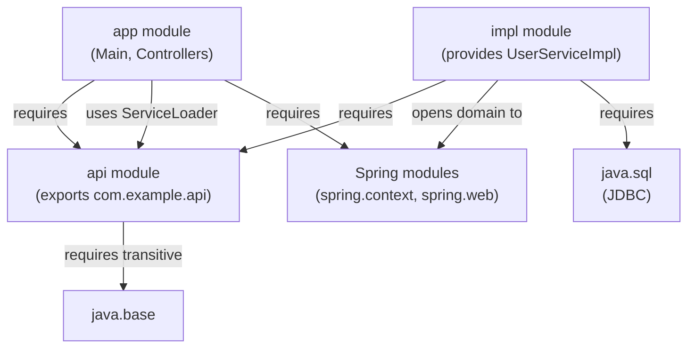

## Keywords in This File
{: .no_toc }

| # | Keyword | Weight |
|---|---|---|
| 1 | [Java Language - L4 Module System](#java-language---l4-module-system) | medium |

---

# Java Language - L4 Module System

## Java Module System: JPMS and module-info.java

---

### 🎯 Model Answer

**30 seconds:**
> JPMS (Java Platform Module System, Java 9+): modules group packages and declare explicit
> dependencies. `module-info.java`: `module com.example.app { requires com.example.lib; exports com.example.api; }`.
> Benefits: strong encapsulation (internal packages hidden by default), reliable configuration
> (missing dependencies caught at startup), smaller runtime images (jlink). Migration challenge:
> the unnamed module and split packages.

**3 minutes (Senior):**
> JPMS core concepts:
>
> 1. **Named module**: has a `module-info.java`. Declares `requires` (dependencies), `exports`
>    (which packages callers can use), `opens` (packages open for reflection), `uses/provides`
>    (service loading). The module's non-exported packages are encapsulated: even `setAccessible(true)`
>    is rejected for non-open packages in other modules.
>
> 2. **Unnamed module**: code on the classpath (not in a named module). Reads all named modules.
>    All unnamed module code is in the "unnamed module". It exports everything (backward compat).
>    Most existing code lives here.
>
> 3. **Automatic modules**: JARs on the module path but without `module-info.java`. The module name
>    is derived from the JAR filename. Exports everything. Reads the unnamed module and all named
>    modules. A bridge between classpath and module path.
>
> 4. **jlink**: create a minimal JRE containing only the modules the application needs.
>    A Spring Boot app that uses `java.base`, `java.sql`, `java.logging`: jlink creates a ~50MB JRE
>    instead of the full 250MB+ JDK. Useful for containers (smaller Docker images).
>
> 5. **`opens` for reflection**: `opens com.example.internal` makes the package accessible for
>    deep reflection. Required for Hibernate, Jackson, Spring DI to access private fields.
>    `opens ... to specific.module`: selective opens (to a specific framework module only).

**Blank Mind Recovery:**

**(1) Restate:** "JPMS: `module-info.java`. `requires` = dependency. `exports` = public API. `opens` = deep reflection. `uses/provides` = ServiceLoader. Unnamed module = classpath. Automatic module = JAR on module-path, no module-info. jlink = minimal JRE."

**(2) First principles:** "Before JPMS: all JARs on the classpath could access any public class from any other JAR. JPMS adds access control at the module level: even public classes in non-exported packages are invisible to callers. It's like the difference between public API and public-within-the-building."

**(3) Bridge:** "JPMS is like a corporate campus with buildings (modules). Each building has a public lobby (exports) where visitors can go. Back offices (non-exported packages) are locked. You need a security badge (requires + exports agreement) to enter another building's lobby. The unnamed module: is a free-for-all common area where everyone can go everywhere (backward compat)."

---

### 📘 Concept Explanation

**JPMS module-info.java directives:**
```
MODULE-INFO.JAVA SYNTAX:

  // Minimal module:
  module com.example.myapp {
  }
  // Has: no exports, no requires (other than java.base which is implicit)
  // Result: nothing is accessible from outside this module
  
  // Full example:
  module com.example.userservice {
      // DEPENDENCIES:
      requires java.sql;                    // standard module
      requires com.google.guava;            // external module
      requires transitive com.example.api; // transitive: users of THIS module
                                            // also get com.example.api
      requires static org.slf4j;           // optional at runtime, required at compile
      
      // EXPORTS (public packages accessible to all modules):
      exports com.example.userservice.api;
      exports com.example.userservice.model;
      
      // QUALIFIED EXPORTS (only to specific modules):
      exports com.example.userservice.internal
          to com.example.admin, com.example.batch;
      
      // OPENS (for reflection - required by frameworks):
      opens com.example.userservice.domain;         // open to all (Hibernate)
      opens com.example.userservice.config
          to spring.context;                        // open only to Spring
      
      // SERVICE LOADING:
      uses com.example.PaymentProvider;             // consumes implementations
      provides com.example.PaymentProvider
          with com.example.StripePaymentProvider;   // provides an implementation
  }

MODULE TYPES:

  1. NAMED MODULE: has module-info.java (on module path)
     - Encapsulated: only exported packages visible to other modules
     - Can only access exported packages of other modules it requires
  
  2. UNNAMED MODULE: on the classpath (no module-info.java)
     - All packages "exported" to other unnamed module code
     - Reads ALL named modules (backward compat)
     - Can use any public type from any module (named or unnamed)
     - Named modules CANNOT require the unnamed module
  
  3. AUTOMATIC MODULE: JAR on module path, no module-info.java
     - Module name derived from JAR filename:
       guava-32.0.0-jre.jar -> module name: guava (via MANIFEST.MF Automatic-Module-Name
       or fallback to JAR name transformation)
     - Exports ALL packages
     - Requires ALL named modules AND reads unnamed module
     - Transition mechanism for JARs without module-info

MODULE PATH vs CLASSPATH:
  --module-path (or -p): where the JVM looks for modules
  --class-path (or -cp): where the JVM looks for non-module JARs
  
  Java 9-11: warning when accessing internal JDK APIs
  Java 16+:  error by default (--illegal-access=deny is the default)
  
  Launch named module:
  java --module-path mods -m com.example.myapp/com.example.MainClass

JLINK - CREATING MINIMAL JRE:
  // List modules your app needs:
  jdeps --list-deps myapp.jar
  // Output: java.base, java.logging, java.sql, jdk.net
  
  // Create a custom JRE with only those modules:
  jlink --module-path $JAVA_HOME/jmods \
        --add-modules java.base,java.logging,java.sql,jdk.net \
        --output my-jre \
        --strip-debug \
        --compress=2
  
  // Run with custom JRE:
  my-jre/bin/java -m com.example.myapp/com.example.Main
  
  // Size comparison:
  // Full JDK: 250-350MB
  // jlinked JRE for typical Spring Boot app: 60-100MB
  // Benefit: smaller Docker images, faster pull/deploy

READABILITY AND ACCESSIBILITY RULES:
  For type X in module M to be accessible to code in module N:
  1. N reads M: N has 'requires M' (or N is the unnamed module)
  2. X's package is exported by M: M has 'exports X.package' to all or to N
  3. X is public (or accessible within the module)
  
  For REFLECTION (setAccessible):
  4. M has 'opens X.package' to all or to N's module

COMMON COMPILER/RUNTIME FLAGS:
  // Bypass encapsulation (for legacy code or frameworks):
  --add-opens java.base/java.lang=ALL-UNNAMED
  --add-exports java.base/sun.nio.ch=ALL-UNNAMED
  
  // Add reads (when unnamed module needs to read a named module not in its path):
  --add-reads myapp=java.logging
  
  // Show module resolution:
  java --show-module-resolution ...
```

> **Code walkthrough:** This example demonstrates the core pattern in action. The key mechanism shows how the concept works in practice. Study the structure to understand the essential behavior and common usage.

---

### 💻 Code Example

> **Code walkthrough:** The multi-module project shows how `module-info.java` files define the
> dependency graph. `userservice.api` exports its public API; `userservice.impl` requires it and
> exports nothing (internal). `main` requires both but only interacts with the API module.
> The build file fragment shows how to put modules on the module path.

```java
// MULTI-MODULE PROJECT STRUCTURE:
// myproject/
//   userservice.api/
//     src/main/java/
//       module-info.java
//       com/example/api/UserService.java
//       com/example/api/User.java
//   userservice.impl/
//     src/main/java/
//       module-info.java
//       com/example/impl/UserServiceImpl.java
//   app/
//     src/main/java/
//       module-info.java
//       com/example/app/Main.java

// --- userservice.api/module-info.java ---
module userservice.api {
    exports com.example.api;  // User, UserService accessible to all
}

// --- userservice.impl/module-info.java ---
module userservice.impl {
    requires userservice.api;      // needs the API
    requires java.sql;             // JDBC access
    // DOES NOT export com.example.impl
    // The implementation details are completely encapsulated
    
    // Service loader registration:
    provides com.example.api.UserService
        with com.example.impl.UserServiceImpl;
}

// --- app/module-info.java ---
module app {
    requires userservice.api;   // API only, impl is hidden
    
    // Load implementation via ServiceLoader (decoupled):
    uses com.example.api.UserService;
}

// --- Main.java ---
module app;
class Main {
    public static void main(String[] args) {
        // ServiceLoader: finds UserServiceImpl from userservice.impl module
        // App doesn't know or import UserServiceImpl directly
        UserService service = ServiceLoader.load(UserService.class)
            .findFirst()
            .orElseThrow(() -> new IllegalStateException("No UserService found"));
        
        service.findById(1L).ifPresent(System.out::println);
    }
}
// If someone removes userservice.impl from the module path:
// ServiceLoader returns empty -> IllegalStateException at startup (not NPE at first call)

// SPRING + MODULES (module-info for a Spring Boot module):
module com.example.webservice {
    requires spring.context;
    requires spring.web;
    requires spring.boot.autoconfigure;
    
    // Open packages to Spring for @Component scanning and @Autowired:
    opens com.example.webservice.controller to spring.web;
    opens com.example.webservice.service    to spring.context;
    opens com.example.webservice.config     to spring.context;
    
    exports com.example.webservice.api;  // public API (DTOs, interfaces)
}
// Without 'opens': Spring cannot inject @Autowired fields (InaccessibleObjectException)

// GRADLE BUILD WITH MODULE PATH:
// build.gradle (Kotlin DSL):
plugins {
    id("application")
}
application {
    mainModule.set("com.example.app")  // enable module mode
    mainClass.set("com.example.app.Main")
}
// Gradle 7+ handles module path automatically when mainModule is set
```

> **Code walkthrough:** The three-module project shows the key JPMS benefit: `userservice.impl`
> is completely opaque to `app`. The `app` module imports `UserService` interface (from the API
> module) and receives an implementation via `ServiceLoader`. If `UserServiceImpl` changes
> internally: no recompile of `app` is needed. The `opens` clause in the Spring module example
> shows the practical requirement: Spring needs reflection access to inject dependencies.
> Without these `opens` declarations, Spring Boot fails with `InaccessibleObjectException`.

---

### 🎓 Answers by Seniority

**Junior / Mid (0-5 years):**
> Module system: `module-info.java`. `requires` = dependency. `exports` = what others can use.
> `opens` = reflection access. Classpath = unnamed module (no encapsulation). Automatic modules:
> bridge for JARs without module-info.

---

**Senior / Staff (5+ years):**
> JPMS adoption: most production apps still use classpath (unnamed module). Named modules primarily
> for library authors and container/deployment scenarios (jlink). Framework integration: `opens`
> for Spring, Hibernate, Jackson. Pinning: if a framework uses `synchronized` + opens packages, watch
> for virtual thread issues. jlink: significant Docker image size reduction (60-100MB vs 250MB JDK).
> Migration: automatic modules + `--add-opens` as bridge, full named modules as long-term goal.

---

### ⚠️ Common Misconceptions

**Misconception 1: "Adding module-info.java immediately breaks all dependencies."**
You can add `module-info.java` and put everything in the "unnamed module" initially by NOT migrating
to named modules. A hybrid approach: your module on the module path, dependencies on the classpath
(requires the `--classpath` flag). Gradual migration: add `module-info.java` with `requires` for
the modules you know about, use `--add-opens` for frameworks until they release module-compatible
versions. The full migration is iterative, not a big bang.

**Misconception 2: "Qualified exports (`exports X to Y`) prevent ALL access from other modules."**
Qualified exports prevent compile-time access from unlisted modules. But: if a class IS accessible
to another module at compile time and the unlisted module has access via unnamed module (classpath):
behavior can be surprising. Also: reflection can bypass `exports` (but not `opens`). The strong
guarantee: non-opened packages are inaccessible via reflection. Non-exported packages are
inaccessible via `import` / compilation. Both restrictions together provide true encapsulation.

---

### 🚨 Failure Modes and Diagnosis

**Failure: Application fails with InaccessibleObjectException after upgrading to Java 17.**
```
Symptom: Existing application that worked on Java 11 fails on Java 17 with:
  java.lang.reflect.InaccessibleObjectException: 
    Unable to make field private final java.util.TreeMap ... accessible:
    module java.base does not "opens java.util" to unnamed module

Root cause:
  Java 9-16: --illegal-access=permit (default): allows deep reflection with warnings
  Java 16:   --illegal-access=deny (new default): breaks illegal reflective access
  Java 17:   --illegal-access removed entirely: illegal access always throws
  
  A library (Hibernate, Jackson, older Spring version) uses reflection to access
  internal JDK classes. This worked on Java 8 (no module system) and Java 9-15
  (with illegal-access=permit), but fails on Java 17+.

Diagnosis:
  1. Run with Java 11 first: look for WARNING: An illegal reflective access
     These warnings on Java 11 = errors on Java 17
  2. The InaccessibleObjectException message tells you:
     - Which module owns the inaccessible class: "module java.base"
     - Which package: "java.util"
     - What context: "to unnamed module"
  3. Check stack trace: which library is making the reflective access?
     Usually: jackson-databind, hibernate-core, cglib, byte-buddy

Fix (choose the appropriate one):
  Option A: Update the library to a version that supports Java 17+
    Hibernate 5.6+ -> supports Java 17
    Jackson 2.12+ -> supports Java 17
    Spring Boot 2.7+ / 3.x -> supports Java 17+
    PREFERRED: update libraries first
  
  Option B: Temporary --add-opens (if you can't update the library yet)
    // In MANIFEST.MF or as JVM args:
    --add-opens java.base/java.util=ALL-UNNAMED
    --add-opens java.base/java.lang=ALL-UNNAMED
    // Target: add-opens for the specific module/package, not ALL of java.base
  
  Option C: Long-term - migrate to named modules
    Add module-info.java with opens declarations to your own modules.
    Use framework-specific --add-opens only for framework internals.

Prevention:
  Test on the target Java version early in the development cycle.
  Add Java 17 (or your target) to CI matrix alongside Java 11.
  Check: https://foojay.io/today/java-17-and-beyond-troubleshooting-guide
  for library compatibility matrix.
```

> **Code walkthrough:** This example demonstrates the core pattern in action. The key mechanism shows how the concept works in practice. Study the structure to understand the essential behavior and common usage.

---

### 🎯 Interview Deep-Dive

| Question Category | Time to Answer |
|---|---|
| module-info.java directives | 2 minutes |
| Named vs unnamed vs automatic module | 2 minutes |
| exports vs opens | 2 minutes |
| requires transitive | 1 minute |
| jlink and smaller JRE | 2 minutes |
| ServiceLoader with JPMS | 2 minutes |
| Spring/Hibernate with JPMS | 2 minutes |
| --add-opens and --add-exports | 2 minutes |
| split packages | 2 minutes |
| Migration strategy | 2 minutes |
| requires static | 1 minute |
| Module isolation benefits | 1 minute |

---

**Q1 (directives): What do exports and opens do and how are they different?**

A: `exports pkg`: makes the package's public types accessible to other modules for compile-time use
(import, reference). Reflection is NOT allowed unless `opens` is also declared. `opens pkg`: makes
the package accessible for deep reflection (`setAccessible`). Does NOT affect compile-time access.
`exports pkg`: use for your public API. `opens pkg`: use for framework-accessible configuration
(entity classes, controller classes for Spring injection). Some packages need BOTH: `exports` for
API users, `opens` for frameworks that also use reflection.

*What separates good from great:* The typical pattern for a Spring application's module:
`exports` the DTO and interface packages (public API), `opens` the controller, service, and domain
packages (Spring needs reflection access for `@Autowired`, Hibernate for lazy loading, Jackson for
serialization). Many teams are surprised that `exports` alone is not enough for Spring - they get
`InaccessibleObjectException` at `@Autowired` injection. The `opens` directive is the key
"I'm okay with frameworks using reflection on this package" declaration. For security-conscious
modules: use qualified `opens ... to spring.context` to limit which frameworks can reflect.

---

**Q2 (module types): What is an automatic module and when does it appear?**

A: Automatic module: a JAR placed on the `--module-path` that does NOT have a `module-info.java`.
The JVM derives a module name from the JAR filename (or from `Automatic-Module-Name` in MANIFEST.MF).
Exports all packages. Reads all named modules AND the unnamed module. Purpose: transition mechanism
for libraries that haven't been modularized yet. Allows your named module to `requires guava`
(automatic) without guava having its own `module-info.java`.

*What separates good from great:* The `Automatic-Module-Name` in MANIFEST.MF: library authors should
add this even before creating `module-info.java`. It lets callers write `requires guava` (stable name)
instead of the filename-derived name (which changes with version). The JAR filename-to-module-name
algorithm: strips version numbers (guava-32.0.0-jre.jar -> guava), replaces hyphens with dots.
Fragile: if the JAR filename changes, the module name changes, breaking `requires` declarations.
Good library authors: (1) add `Automatic-Module-Name: com.google.guava` to MANIFEST.MF, (2) eventually
add `module-info.java`. Most major libraries have done step 1 since Java 9; step 2 varies.

---

**Q3 (transitive): What does `requires transitive` do and when should you use it?**

A: `requires transitive M`: your module requires M AND any module that requires your module
transitively requires M too. "Implied readability." Use for: when your exported API uses types from M.
`module mylib { requires transitive guava; exports com.example.api; }` - if your API's method
signatures include Guava types (`ImmutableList`): callers NEED Guava to use your API. `requires transitive`
avoids requiring callers to explicitly declare `requires guava` just to use your API.

*What separates good from great:* The test for `requires transitive`: if a type from module M appears
in your `exports` (return type, parameter type, exception type): use `requires transitive M`. If M
is purely an implementation detail (used only in non-exported code): use `requires M`. The rule of
thumb: API leakage determines transitivity. If you use `SLF4J` internally only: `requires org.slf4j` (not transitive). If your API returns a `Logger` object: `requires transitive org.slf4j`. Overusing `requires transitive`: creates a large transitive closure (all your implementation dependencies become your callers' dependencies). Underusing: callers get `InaccessibleObjectException` or compilation errors when using your exported types.

---

**Q4 (jlink): Walk through creating a minimal Docker image with jlink.**

A: Steps: (1) analyze modules needed: `jdeps --ignore-missing-deps --print-module-deps myapp.jar`.
(2) build a custom JRE: `jlink --module-path $JAVA_HOME/jmods --add-modules $(cat deps.txt) --output custom-jre`.
(3) Dockerfile: `COPY custom-jre /opt/jre` + `ENTRYPOINT ["/opt/jre/bin/java", ...]`. Result: base image
(Ubuntu/Alpine) + custom JRE (60-100MB) vs pulling a full JDK image (350MB+).

*What separates good from great:* The multi-stage Dockerfile pattern:
```dockerfile
# Stage 1: build
FROM eclipse-temurin:21-jdk AS builder
WORKDIR /app
COPY . .
RUN ./gradlew bootJar
RUN jdeps --ignore-missing-deps --print-module-deps build/libs/app.jar > deps.txt
RUN jlink --module-path $JAVA_HOME/jmods \
          --add-modules $(cat deps.txt) \
          --strip-debug --compress=2 --output /opt/jre

# Stage 2: runtime
FROM ubuntu:22.04
COPY --from=builder /opt/jre /opt/jre
COPY --from=builder /app/build/libs/app.jar /app/app.jar
ENTRYPOINT ["/opt/jre/bin/java", "-jar", "/app/app.jar"]
```
> **Code walkthrough:** This example demonstrates the core pattern in action. The key mechanism shows how the concept works in practice. Study the structure to understand the essential behavior and common usage.

This pattern: (1) the build image has the full JDK, (2) the runtime image has only the custom JRE.
Size comparison: full `eclipse-temurin:21-jre` = ~200MB. Custom jlinked JRE = 60-100MB. A 100-140MB
reduction per container replica, significant at scale. The `jdeps` output is often wrong for Spring
Boot (fat JAR classpath not fully analyzed) - add `java.sql`, `java.naming`, `java.net.http` manually
as a baseline.

---

**Q5 (split packages): What is a split package and why is it forbidden in JPMS?**

A: Split package: the same package (e.g., `org.example.util`) appears in two or more named modules.
JPMS forbids this for named modules: modules must have exclusive ownership of packages. The JVM
cannot determine which module to use for a given package name. Causes: forked libraries (two versions
of the same library), old JARs that split JDK packages (e.g., `javax.xml` in both the JDK and an XML library).

*What separates good from great:* The split package problem is the most common migration blocker
in practice. Legacy projects often have multiple JARs that contribute to the same package (by
accident, by bad dependency management, or by design with "overlay" JARs). Detection:
`jdeps --list-reduced-deps myapp.jar` or the error message at launch:
`Error occurred during initialization of boot layer: java.lang.LayerInstantiationException:
Package org.xml.sax in both module java.xml and module xml-apis`.
Fix: exclude one of the conflicting JARs. For JDK package conflicts: the JDK's version should
win; exclude the standalone library (e.g., `xml-apis`, `javax.annotation-api` from Java EE era).
In Maven: `<exclusion>` in the dependency that pulls in the conflicting JAR.

---

**Q6 (serviceloader): How does ServiceLoader work with JPMS?**

A: `ServiceLoader.load(ServiceInterface.class)`: finds all implementations declared via `provides ... with ...` in `module-info.java`. The module that provides the service must have:
`provides ServiceInterface with ImplementationClass`. The consuming module: `uses ServiceInterface`.
Without `uses`: ServiceLoader will not find implementations (JVM does not scan for providers without this declaration). Benefit: implementation details hidden; the implementing module's package doesn't need to be exported.

*What separates good from great:* ServiceLoader + JPMS: the classic plugin pattern with compile-time
validation. Adding a new service provider: add `provides X with Y` to the provider's `module-info`.
No code changes to the consumer. ServiceLoader at compile time: if `uses` is declared, the JVM's
module resolution verifies that at least one provider is on the module path. At runtime: `ServiceLoader.load()` finds all providers, dynamically. This is how JDBC drivers register themselves (META-INF/services on classpath, or `provides java.sql.Driver with ...` in module mode). The Spring Framework also uses ServiceLoader for some factory loading (like `SpringBootExceptionReporter`).

---

**Q7 (spring): Why does Spring Boot require --add-opens in a modular context?**

A: Spring uses reflection for: `@Autowired` field injection, `@Value` field injection, `@Component` class scanning and instantiation, AOP proxy creation. These require `setAccessible(true)` on private fields/constructors. In JPMS: only packages declared `opens` are accessible for reflection. Spring's modules (spring.context, spring.web) need `opens` for the application's packages where annotated classes live.

*What separates good from great:* Spring Boot 3.x + Java 17: the recommended approach is to NOT use full named modules for Spring Boot applications. Instead: run on the classpath (unnamed module) where encapsulation is not enforced, and Spring's reflection works without `opens`. Full JPMS with Spring Boot: works but requires `opens` declarations for every annotated package, is complex to maintain (every new package needs an opens declaration), and provides limited benefit for applications that own all their code. The value of JPMS for Spring Boot: primarily the `jlink` use case (smaller images). For library authors: JPMS named modules are valuable (API encapsulation). For application developers: classpath (unnamed module) is the pragmatic choice.

---

**Q8 (--add-opens): When should you use --add-opens and what are the risks?**

A: Use `--add-opens` when: (1) temporarily fixing `InaccessibleObjectException` from a library
that hasn't been updated for JPMS, (2) running tests that use deep reflection (Mockito, PowerMock),
(3) legacy integration tests that access internal JDK APIs. Risks: (1) bypasses the encapsulation
that JPMS provides, (2) opens the module to ALL unnamed module code (or to a specific module if
qualified), (3) should be removed once the library is updated.

*What separates good from great:* The `--add-opens` in CI / build scripts is a smell: it indicates
a dependency on non-public JDK or library internals. Track these: add a comment with the GitHub
issue or library version that will remove the need for `--add-opens`. For test environments:
`--add-opens java.base/java.lang=ALL-UNNAMED` is widely used for Mockito/ByteBuddy. This is
acceptable (test dependencies, not production code). For production JVM args: every `--add-opens`
should have a tracked reason and a removal plan. In Gradle, Maven surefire, and Spring Boot test:
these flags are configurable per-test-execution (not for production).

---

**Q9 (requires static): What is `requires static` and when is it used?**

A: `requires static M`: requires M at compile time but NOT at runtime (optional dependency).
Use cases: (1) optional logging frameworks (if SLF4J is present, use it; otherwise use JUL). (2) Optional integration libraries (if Micrometer is present, emit metrics; otherwise no-op). (3) Annotation libraries that are only needed for compilation (`@Nullable` from the IDE). At runtime: if M is not on the module path, the module still loads (M's absence is OK).

*What separates good from great:* The `requires static` pattern for optional features: the application code must check if the optional module is available before using it. `Class.forName("io.micrometer.core.instrument.MeterRegistry")` returns `ClassNotFoundException` if Micrometer is absent - the code handles it by using a no-op. This is the optional dependency pattern: compile-time API availability, runtime optionality. Without JPMS: this was done with `ClassLoader.loadClass()` catching `ClassNotFoundException`. With JPMS: `requires static` makes the compile-time requirement explicit, and the runtime optionality is preserved.

---

**Q10 (isolation): How does JPMS encapsulation help catch bugs early?**

A: Reliable configuration: at module system startup, the JVM resolves the entire module dependency graph. Missing module, split package, or unresolvable dependency: fails IMMEDIATELY at startup (not lazily at first use). Without JPMS: `ClassNotFoundException` at runtime when a class is first needed (possibly hours after startup, on rare code paths). With JPMS: the startup failure tells you exactly which module is missing.

*What separates good from great:* The "fails fast on startup" property is valuable for containers. In a Docker/Kubernetes environment: if the container starts and immediately fails with a module resolution error, the orchestrator can report it as a startup failure (health check fails). Without JPMS: the container starts healthy, serves traffic, and fails on the first request that hits the missing class. The deployment engineer sees "pod is running" but users get 500 errors. JPMS moves the failure from request-time (user-visible) to startup-time (operations-visible). This is the "reliable configuration" guarantee from the JPMS design goals.

---

**Q11 (migration): What is the recommended strategy for migrating a Java 8 application to use modules?**

A: Phased approach: (1) compile and test on Java 11+ without `module-info.java` (unnamed module, same as classpath). (2) Add `--add-opens` / `--add-exports` JVM flags to fix any `InaccessibleObjectException` from libraries. (3) Update dependencies to module-compatible versions. (4) Run `jdeps` on the classpath to identify your packages and dependencies. (5) Add `module-info.java` with automatic modules for unmodularized dependencies. (6) Gradually replace automatic module `requires` with proper `module-info.java` as libraries release modularized versions.

*What separates good from great:* The "leave it on classpath" decision: for most applications, staying in the unnamed module (classpath) is the pragmatic choice. JPMS modules are most valuable for: (1) library authors (API encapsulation), (2) jlink use (minimal JRE for containers), (3) large codebases with strict separation of concerns (enforced by module boundaries). The cost: every Spring annotation package needs `opens`, every entity package needs `opens`, build complexity increases. The benefit: strictly enforced architecture boundaries and smaller deployment images. Decision framework: if Docker image size is a concern (it is, especially for serverless/cloud-native) AND the codebase has clear module boundaries: full JPMS. Otherwise: classpath + jlink via `spring-boot-gradle-plugin`'s layered JAR is often sufficient.

---

**Q12 (jlink): What is the difference between a layered JAR, a fat JAR, and a jlinked image?**

A: Fat JAR (Spring Boot default): all dependency JARs extracted and merged into one JAR. Simple, self-contained. Size: all dependencies included. Layered JAR (Spring Boot 2.3+): dependencies are in separate layers in the JAR, enabling efficient Docker caching (layer with stable dependencies is cached, only app-layer changes on code update). Jlinked image: custom JRE + application, no JDK on the machine. Full application: JRE (~50-100MB) + JAR (~30-100MB). Smallest: GraalVM native image (single binary, ~15-50MB). Trade-off: fat JAR = simplest; layered JAR = best Docker cache efficiency; jlinked = smallest JRE footprint; native image = fastest startup, smallest total.

*What separates good from great:* The layered JAR + Docker layer caching is the pragmatic optimization for most teams: zero code changes, just `spring-boot.build-info=true` and `layertools` in the Dockerfile. Build times improve because only the `application` layer (your code) changes on each push, while the `dependencies` layer (Spring Boot, your libraries) is cached from the previous build. For startups in containers: virtual threads improve throughput but don't improve startup time. GraalVM native image: dramatically reduces startup time (100ms vs 5-10s for JVM) and memory (50-200MB vs 500MB+). The tradeoff: JIT optimizations are absent, AOT compilation is complex, reflection must be pre-registered. For serverless functions where cold start matters: native image. For long-running services: JVM.

---

### ⚖️ Comparison Table

| Concept | Classpath / Unnamed Module | Named Module | Automatic Module |
|---------|---------------------------|--------------|------------------|
| module-info.java | Not present | Required | Not present (on module-path) |
| Package visibility | All public types accessible | Only exported packages | All packages exported |
| Requires declaration | None needed | Explicit requires | Reads all modules |
| Deep reflection | Works (Java 8 compat) | Only with opens | Works |
| jlink eligible | No | Yes (must use named modules) | Partial |
| Encapsulation | None | Strong | None |
| Best for | Legacy, apps | Libraries, platform | Transition |

---

### 🏛️ System Design

**Multi-Module Application Architecture with JPMS:**

```
ASCII:
  +------------------+      +--------------------+
  |   app module     |      |  Spring modules    |
  | requires api     |      | spring.context     |
  | uses UserService | ---> | spring.web         |
  +------------------+      +--------------------+
          |
          v (ServiceLoader)
  +------------------+      +--------------------+
  |   impl module    |      |  java.* modules    |
  | requires api     |      | java.base          |
  | provides UserSvc | ---> | java.sql           |
  | opens domain     |      | java.logging       |
  +------------------+      +--------------------+
          |
          v (exports)
  +------------------+
  |   api module     |
  | exports api pkg  |
  | (User, UserSvc)  |
  +------------------+
```



> **Diagram walkthrough:** The module dependency graph shows the direction of `requires` (dependency).
> The `api` module is the central hub - both `app` and `impl` depend on it. `impl` provides the
> service implementation but doesn't export its implementation package. `app` gets the implementation
> via `ServiceLoader` at runtime without knowing `impl`'s internal structure. The `opens` to Spring
> allows Spring's reflection to inject dependencies without exposing the package to all callers via
> `exports`.

---

### 📊 Diagram

*(Omit: Module architecture shown in System Design section above.)*

---

### 💻 Code Example

*(Omit: this concept does not have a programmatic interface that can be demonstrated in code. The conceptual explanation above is sufficient.)*


---

### 🏛️ System Design

*(Omit: system design diagram not applicable for this concept - see ★★★ keywords for full system design coverage.)*


---

### ⚖️ Comparison Table

*(Omit: this is a ★☆☆ foundational concept with no direct alternatives to compare - see higher-difficulty keywords for trade-off analysis.)*


---

### 📊 Diagram

*(Omit: no standalone visual diagram required for this concept - the explanations and code examples above provide sufficient clarity.)*


