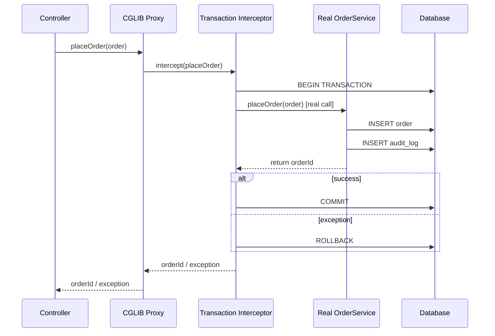

## Keywords in This File
{: .no_toc }

| # | Keyword | Weight |
|---|---|---|
| 1 | [Java Language - L4 Reflection and Proxies](#java-language---l4-reflection-and-proxies) | medium |

---

# Java Language - L4 Reflection and Proxies

## Reflection API and Dynamic Proxies

---

### 🎯 Model Answer

**30 seconds:**
> Reflection: `java.lang.reflect` - inspect and invoke class structure at runtime.
> `Class.forName()`, `getDeclaredFields()`, `getDeclaredMethods()`, `invoke()`, `setAccessible(true)`.
> Dynamic proxies: `java.lang.reflect.Proxy.newProxyInstance(classLoader, interfaces, handler)` -
> create an object implementing given interfaces at runtime. Every method call dispatched to
> `InvocationHandler.invoke(proxy, method, args)`. Used by Spring AOP, JPA lazy loading,
> Mockito, transaction proxies.

**3 minutes (Senior):**
> Reflection and proxy internals:
>
> 1. **`Class<T>` object**: every loaded class has one. `String.class`, `obj.getClass()`,
>    `Class.forName("java.lang.String")`. Operations: `getDeclaredFields()` (own fields),
>    `getFields()` (public, including inherited), `getDeclaredMethods()`, `getMethods()`.
>    `setAccessible(true)`: bypasses access checks (use with module access in Java 9+).
>
> 2. **`invoke()` performance**: reflective method invocation is ~10-100x slower than direct
>    calls. JVM JIT cannot inline reflective calls. For hot paths: use `MethodHandle`
>    (optimizable, close to direct call performance) or code generation (ByteBuddy, cglib).
>
> 3. **Dynamic proxy mechanics**: only interface-based (not class-based). Each method call
>    goes through `InvocationHandler.invoke(proxy, method, args)`. The handler can:
>    add pre/post behavior (AOP), delegate to an underlying object (decorator), return
>    cached values, check permissions.
>
> 4. **CGLIB proxies**: class-based proxy (not interface required). Creates a subclass
>    at runtime. Used by Spring for `@Configuration` classes and `@Transactional` on
>    concrete classes without interfaces. The subclass overrides methods, adding behavior.
>
> 5. **Module system impact**: Java 9+ modules restrict `setAccessible()`. Open packages
>    (`opens` in `module-info.java`) or `--add-opens` JVM flag required for reflective
>    access to non-exported modules. Framework workarounds: `MethodHandles.privateLookupIn()`.

**Blank Mind Recovery:**

**(1) Restate:** "Reflection: `Class<T>` - inspect/invoke at runtime. `getDeclaredMethods/Fields()`, `setAccessible(true)`, `invoke()`. Dynamic proxy: `Proxy.newProxyInstance(loader, interfaces, handler)`. Handler: `invoke(proxy, method, args)`. Spring AOP, JPA lazy load, Mockito all use proxies. CGLIB: class-based proxy (subclass). Module system: `opens` or `--add-opens` for deep reflection."

**(2) First principles:** "Reflection: the JVM's internal class model (fields, methods, constructors) exposed as API objects. The class description that the JVM uses to load and run code is readable at runtime. Dynamic proxy: the JVM can fabricate a class at runtime that delegates all method calls to a handler. This is the foundation of most framework magic."

**(3) Bridge:** "Reflection is like reading the blueprint of a building while living in it. Dynamic proxy is like hiring a secretary who handles all your calls, adds reminders, logs them, and then routes to you. The caller thinks they're calling you directly. The secretary (InvocationHandler) intercepts every call."

---

### 📘 Concept Explanation

**Reflection API core mechanics:**
```
CORE REFLECTION OPERATIONS:

  // 1. Obtaining a Class object:
  Class<String> c1 = String.class;                   // literal
  Class<?> c2 = obj.getClass();                      // at runtime
  Class<?> c3 = Class.forName("java.lang.String");   // by name (throws ClassNotFoundException)
  
  // 2. Reading class structure:
  Field[]    fields      = c1.getDeclaredFields();   // own fields (all access levels)
  Method[]   methods     = c1.getDeclaredMethods();  // own methods
  Constructor<?>[] ctors = c1.getDeclaredConstructors();
  
  // getFields()/getMethods() = public only, including INHERITED
  // getDeclared*() = own only, ALL access levels
  
  // 3. Accessing and modifying a field:
  class Person { private String name; }
  Person p = new Person();
  Field nameField = Person.class.getDeclaredField("name");
  nameField.setAccessible(true);         // bypass private access check
  nameField.set(p, "Alice");             // set value
  String name = (String) nameField.get(p); // get value
  
  // 4. Invoking a method:
  Method length = String.class.getDeclaredMethod("length");
  int len = (int) length.invoke("hello");  // = 5
  
  // With arguments:
  Method concat = String.class.getDeclaredMethod("concat", String.class);
  String result = (String) concat.invoke("hello", " world");  // = "hello world"
  
  // 5. Creating an instance:
  Constructor<StringBuilder> ctor =
      StringBuilder.class.getDeclaredConstructor(int.class);
  StringBuilder sb = ctor.newInstance(64);  // new StringBuilder(64) via reflection

METHODHANDLE (FASTER ALTERNATIVE):

  // MethodHandle: more type-safe, JIT can optimize (unlike plain reflection invoke())
  MethodHandles.Lookup lookup = MethodHandles.lookup();
  MethodType mt = MethodType.methodType(int.class);  // return type, then arg types
  MethodHandle lengthMH = lookup.findVirtual(String.class, "length", mt);
  
  // Invoke (throws Throwable, not Exception)
  int len = (int) lengthMH.invoke("hello");  // optimizable by JIT
  
  // VarHandle: field access (Java 9+)
  // Comparable to FieldHandle but also supports atomic operations

DYNAMIC PROXY:

  interface Service {
      String process(String input);
      void notify(String event);
  }
  
  // INVOCATION HANDLER:
  class LoggingHandler implements InvocationHandler {
      private final Object delegate;
      
      LoggingHandler(Object delegate) { this.delegate = delegate; }
      
      @Override
      public Object invoke(Object proxy, Method method, Object[] args)
          throws Throwable {
          System.out.println("ENTER: " + method.getName());
          long start = System.nanoTime();
          try {
              Object result = method.invoke(delegate, args);  // forward to real impl
              long elapsed = System.nanoTime() - start;
              System.out.printf("EXIT:  %s (%.2fms)%n",
                  method.getName(), elapsed / 1_000_000.0);
              return result;
          } catch (InvocationTargetException e) {
              System.out.println("THROW: " + method.getName() + " -> " + e.getCause());
              throw e.getCause();  // unwrap to original exception
          }
      }
  }
  
  // CREATE PROXY:
  Service realService = new RealServiceImpl();
  Service proxy = (Service) Proxy.newProxyInstance(
      Service.class.getClassLoader(),          // class loader
      new Class<?>[] { Service.class },        // interfaces to implement
      new LoggingHandler(realService)          // the handler
  );
  
  proxy.process("data");  // -> LoggingHandler.invoke() -> realService.process()
  
  // IMPORTANT: proxy implements ALL listed interfaces
  // Proxy class name: "com.sun.proxy.$Proxy0" (runtime-generated)
  // proxy instanceof Service: true
  // proxy instanceof RealServiceImpl: FALSE (it's a proxy, not a subclass)

CGLIB CLASS PROXY (Spring's mechanism for non-interface classes):
  
  // Spring @Service without interface:
  @Service
  class OrderService {
      @Transactional  // Spring can't use JDK proxy (no interface)
      void placeOrder(Order order) { ... }
  }
  
  // Spring uses CGLIB: generates a SUBCLASS at runtime:
  // class OrderService$$SpringCGLIB$$0 extends OrderService {
  //     @Override
  //     void placeOrder(Order order) {
  //         transactionInterceptor.invoke(this, "placeOrder", order, ...);
  //     }
  // }
  
  // Requirement: class must NOT be final (cglib subclasses it)
  // Requirement: method must NOT be final (cglib overrides it)
  // CGLIB limitation: cannot proxy final classes or methods -> AOP simply skips them
```

> **Code walkthrough:** This example demonstrates the core pattern in action. The key mechanism shows how the concept works in practice. Study the structure to understand the essential behavior and common usage.

---

### 💻 Code Example

> **Code walkthrough:** The `@Cached` annotation with a dynamic proxy shows how framework
> magic is built. The proxy intercepts every method call, checks the cache by method name
> + arguments, and only calls the real implementation on a cache miss. The `InvocationTargetException`
> unwrapping is critical: without it, callers would see `InvocationTargetException` instead of
> the real exception.

```java
// BAD: manual caching in every method
class UserService {
    private final Map<Long, User> cache = new HashMap<>();
    
    User getUser(Long id) {
        return cache.computeIfAbsent(id, this::loadFromDb);  // coupled to every method
    }
    // Every method needs its own caching code
}

// GOOD: caching via dynamic proxy (separation of concerns)
@Retention(RetentionPolicy.RUNTIME)
@Target(ElementType.METHOD)
@interface Cached { String key() default ""; }

class CachingProxy<T> implements InvocationHandler {
    private final T delegate;
    private final Map<String, Object> cache = new ConcurrentHashMap<>();
    
    CachingProxy(T delegate) { this.delegate = delegate; }
    
    @Override
    public Object invoke(Object proxy, Method method, Object[] args)
        throws Throwable {
        Cached annotation = method.getAnnotation(Cached.class);
        if (annotation == null) {
            // Non-@Cached method: pass through directly
            return method.invoke(delegate, args);
        }
        // Build cache key from method name + args
        String cacheKey = method.getName() + ":" + Arrays.toString(args);
        
        return cache.computeIfAbsent(cacheKey, k -> {
            try {
                return method.invoke(delegate, args);
            } catch (InvocationTargetException e) {
                throw new RuntimeException(e.getCause());  // unwrap
            } catch (IllegalAccessException e) {
                throw new RuntimeException(e);
            }
        });
    }
    
    @SuppressWarnings("unchecked")
    static <T> T wrap(T delegate, Class<T> iface) {
        return (T) Proxy.newProxyInstance(
            iface.getClassLoader(),
            new Class<?>[] { iface },
            new CachingProxy<>(delegate)
        );
    }
}

// Usage:
interface UserService {
    @Cached
    User findById(Long id);          // will be cached
    
    void updateUser(User user);       // NOT cached (no annotation)
}

UserService service = CachingProxy.wrap(new UserServiceImpl(), UserService.class);
service.findById(42L);   // calls real impl, caches result
service.findById(42L);   // returns from cache
service.updateUser(u);   // passes through to real impl

// REFLECTION FOR FRAMEWORK: find all @Column annotated fields
record ColumnInfo(String name, Field field) {}

List<ColumnInfo> extractColumns(Class<?> entityClass) {
    return Arrays.stream(entityClass.getDeclaredFields())
        .filter(f -> f.isAnnotationPresent(Column.class))
        .map(f -> {
            Column col = f.getAnnotation(Column.class);
            String colName = col.name().isEmpty() ? f.getName() : col.name();
            return new ColumnInfo(colName, f);
        })
        .collect(Collectors.toList());
}
```

> **Code walkthrough:** `CachingProxy` demonstrates the dynamic proxy pattern: the handler
> checks for `@Cached`, builds a cache key from method + args, and uses `computeIfAbsent`
> for atomic cache population. The `InvocationTargetException` unwrapping is the critical detail:
> when `method.invoke()` throws, the real exception is wrapped in `InvocationTargetException`.
> Re-throwing the cause (not the wrapper) ensures callers see the original exception type.
> The `extractColumns` method shows annotation-driven reflection used in ORM-style frameworks:
> scanning fields for database mapping metadata.

---

### 🎓 Answers by Seniority

**Junior / Mid (0-5 years):**
> Reflection: `Class.forName`, `getDeclaredMethods`, `setAccessible`. Dynamic proxy: `Proxy.newProxyInstance` with an `InvocationHandler`. Used by Spring, Mockito. CGLIB: class-based proxy for concrete classes.

---

**Senior / Staff (5+ years):**
> `MethodHandle` for performance-sensitive reflection. Module system: `opens` clause or `--add-opens` for cross-module reflective access. Proxy limitations: JDK proxy = interface only, CGLIB = non-final class, ByteBuddy = arbitrary class with code generation. `InvocationTargetException` unwrapping: always unwrap the cause. Reflection overhead: 10-100x slower; for hot paths use code generation (ByteBuddy, cglib, APT). Spring AOP proxy creation: `ProxyFactory`, `ProxyFactoryBean`.

---

### ⚠️ Common Misconceptions

**Misconception 1: "Dynamic proxies can proxy any class."**
JDK dynamic proxies (`Proxy.newProxyInstance`) can only proxy INTERFACES. The target object must implement the interface; the proxy also implements it. To proxy a class without an interface: use CGLIB (generates a subclass) or ByteBuddy (generates arbitrary bytecode). The class being proxied by CGLIB must not be final; the methods being intercepted must not be final. Spring uses JDK proxy when the bean implements interfaces, CGLIB when it doesn't (since Spring Boot 2.0, the default is CGLIB for all beans).

**Misconception 2: "`setAccessible(true)` always works."**
Java 9+: `setAccessible(true)` works only if the module of the class being accessed has `opens` the package to the calling module (or the calling module is the unnamed module). If not: `InaccessibleObjectException`. The fix: add `--add-opens java.base/java.lang.reflect=ALL-UNNAMED` (or the specific module) as a JVM flag. Spring, Hibernate, and other frameworks often need this for older code. In Java 17+ (with strong encapsulation): this is enforced more strictly.

---

### 🚨 Failure Modes and Diagnosis

**Failure: Dynamic proxy causes NullPointerException inside Spring's @Transactional.**
```
Symptom: @Transactional method called from within the same class does NOT start
  a transaction. Database changes not rolled back on exception.
  No NPE actually in the transaction code - the transaction simply isn't active.

Root cause:
  @Service
  class OrderService {
      @Transactional
      void placeOrder(Order order) {
          validateOrder(order);
          saveOrder(order);
          notifyUser(order);  // calls an internal method
      }
      
      @Transactional  // This @Transactional has NO effect
      void saveOrder(Order order) {
          orderRepository.save(order);
      }
  }
  
  How Spring @Transactional works:
  - Spring creates a PROXY for OrderService
  - External callers call the PROXY (which starts a transaction)
  - placeOrder() -> proxy intercepts -> starts transaction -> calls real OrderService.placeOrder()
  - Inside OrderService.placeOrder(): 'this' refers to the REAL OrderService, NOT the proxy
  - this.saveOrder(): bypasses the proxy -> NO transaction started for saveOrder()
  
  This is the "proxy self-invocation" problem.

Diagnosis:
  Add logging to the transaction interceptor:
    logging.level.org.springframework.transaction.interceptor=TRACE
  Look for "Getting transaction for [OrderService.saveOrder]" - if absent: transaction not started
  
  Verify by checking: TransactionSynchronizationManager.isActualTransactionActive()
    inside saveOrder() -> returns false when called via this

Fix:
  Option A: Merge methods (saveOrder logic inline in placeOrder)
  
  Option B: Inject self via Spring context (anti-pattern, use carefully)
    @Autowired @Lazy OrderService self;
    self.saveOrder(order);  // goes through proxy
  
  Option C: Restructure to avoid self-invocation
    Move saveOrder to a separate @Service
    @Autowired OrderPersistenceService persistenceService;
    persistenceService.saveOrder(order);  // through proxy
  
  Option D (AspectJ): compile-time or load-time weaving (no proxy involved)
    @EnableAspectJAutoProxy(exposeProxy = true)
    // Not recommended: complex setup, performance concerns

Prevention:
  RULE: @Transactional methods that call other @Transactional methods
  in the SAME class do NOT compose transactions via proxy.
  Design services so @Transactional boundaries are at the method entry
  from OUTSIDE the class (controller, scheduler, event handler).
  Test: ensure integration tests verify transaction rollback for @Transactional methods.
```

> **Code walkthrough:** This example demonstrates the core pattern in action. The key mechanism shows how the concept works in practice. Study the structure to understand the essential behavior and common usage.

---

### 🎯 Interview Deep-Dive

| Question Category | Time to Answer |
|---|---|
| Reflection Class object | 1 minute |
| getDeclared* vs get* | 1 minute |
| setAccessible and module system | 2 minutes |
| Dynamic proxy mechanics | 2 minutes |
| InvocationHandler implementation | 2 minutes |
| InvocationTargetException | 2 minutes |
| CGLIB vs JDK proxy | 2 minutes |
| MethodHandle vs reflection | 2 minutes |
| Spring @Transactional self-invocation | 2 minutes |
| ByteBuddy and code generation | 1 minute |
| Proxy performance | 1 minute |
| Security implications of reflection | 2 minutes |

---

**Q1 (basics): What is the difference between `getDeclaredMethods()` and `getMethods()`?**

A: `getDeclaredMethods()`: all methods declared directly in THIS class (own methods), ALL access levels (private, package, protected, public). Does NOT include inherited methods. `getMethods()`: public methods only, including INHERITED public methods. Does not include private/protected/package methods. Parallel: `getDeclaredFields()` vs `getFields()`, `getDeclaredConstructors()` vs `getConstructors()`. Rule: to access a private member: use `getDeclared*()` + `setAccessible(true)`. To enumerate the public API: use `get*()`.

*What separates good from great:* The `getDeclared*` vs `get*` distinction maps to Java's access control model. `getMethods()` includes all public methods from parent classes and interfaces (the public API visible to callers). `getDeclaredMethods()` includes only what THIS class defines (the implementation). For framework code that processes annotations: use `getDeclaredMethods()` to find annotations on a specific class (not inherited ones, unless you also want to process the hierarchy). For generating documentation or introspection: use `getMethods()` to show the complete public API. Spring's `AnnotationUtils.findAnnotation()` handles the hierarchy traversal correctly.

---

**Q2 (invoke): What is InvocationTargetException and why must you unwrap it?**

A: `InvocationTargetException`: wraps any exception thrown by the reflectively-invoked method.
`method.invoke(obj, args)` never directly throws what the method threw - it wraps it.
`e.getCause()` = the original exception. If you DON'T unwrap: `catch (UserNotFoundException e)`
in the caller's code won't match (they're catching `InvocationTargetException` or `RuntimeException`,
not the original). The proxy/handler MUST re-throw `e.getCause()` (or call `sneakyThrow`
for checked exceptions that aren't part of the proxy interface).

*What separates good from great:* The complete unwrap logic in an `InvocationHandler`:
```java
try {
    return method.invoke(delegate, args);
} catch (InvocationTargetException e) {
    Throwable cause = e.getCause();
    // Re-throw as-is if it's a RuntimeException or Error
    if (cause instanceof RuntimeException re) throw re;
    if (cause instanceof Error er)           throw er;
    // Checked exception: check if it's declared by the method
    for (Class<?> declared : method.getExceptionTypes()) {
        if (declared.isInstance(cause)) {
            throw (Exception) cause;   // safe: declared in throws clause
        }
    }
    // Checked exception NOT declared by the proxy interface: wrap
    throw new RuntimeException("Undeclared checked exception", cause);
}
```
> **Code walkthrough:** This example demonstrates the core pattern in action. The key mechanism shows how the concept works in practice. Study the structure to understand the essential behavior and common usage.

This is what Spring's `AopUtils` and Mockito do. The naive `throw e.getCause()` doesn't compile (Throwable is checked). The complete logic handles RuntimeExceptions, Errors, and declared checked exceptions correctly.

---

**Q3 (proxy vs cglib): When does Spring use JDK proxy vs CGLIB?**

A: Spring Boot 2.0+ default: CGLIB for all beans (even those implementing interfaces). Pre-2.0: JDK proxy if the bean implements at least one interface. To force JDK proxy: `@EnableAspectJAutoProxy(proxyTargetClass = false)`. CGLIB requirement: class must not be final, proxied methods must not be final. JDK proxy requirement: target must implement an interface; the injection point must be typed to the interface. If you inject by concrete class type with JDK proxy: `BeanNotOfRequiredTypeException`.

*What separates good from great:* The `proxyTargetClass = true` (CGLIB) default in Spring Boot: chosen because it avoids the "inject by concrete type" issue. With JDK proxy: `@Autowired UserServiceImpl userService` fails (the proxy is not a `UserServiceImpl`). With CGLIB: the proxy is a subclass of `UserServiceImpl`, so `@Autowired UserServiceImpl` works. The tradeoff: CGLIB requires a no-arg constructor (Spring uses objenesis to bypass this, but it's still a consideration). Final classes: CGLIB can't proxy them. `@Configuration` classes must be CGLIB-proxied (Spring modifies `@Bean` methods to return singletons). This is why `@Configuration` classes must not be final.

---

**Q4 (methodhandle): Why is MethodHandle more performant than reflection invoke()?**

A: `Method.invoke()`: uses JVM reflection machinery, type checks at each call, no JIT inlining.
`MethodHandle`: carries type information at creation time (not at each invocation). The JIT can
inline and optimize `MethodHandle.invoke()` calls just like direct method calls. After JIT
warmup: `MethodHandle` performance approaches direct call performance. `Method.invoke()`:
never optimized to direct call speed (blocked by the dynamic dispatch and type checking per call).
`invokedynamic` uses `MethodHandle` internally: lambdas and string concatenation use it.

*What separates good from great:* The JMH benchmark (Java Microbenchmark Harness) numbers:
direct call = 1x, `MethodHandle.invoke()` = 1.1-1.5x, `Method.invoke()` = 10-100x. The numbers
depend on whether the `MethodHandle` is stored in a constant (`static final MethodHandle`), whether
it's used repeatedly (JIT warmup), and whether it's called via `invokeExact` (exact types, no boxing)
vs `invoke` (type coercion). Production use: frameworks that need reflection at runtime but in hot
paths (e.g., serialization, ORM field access) use `MethodHandle` instead of `Method.invoke()`.
The VarHandle API (Java 9+): similar optimization for field access, also supporting atomic
compare-and-set and fence operations.

---

**Q5 (module system): How does the Java module system restrict reflection?**

A: Java 9+: packages are encapsulated by modules. `setAccessible(true)` for a class in an
encapsulated package: `InaccessibleObjectException`. To allow reflective access: the module must
declare `opens com.example.internal` (open to all) or `opens com.example.internal to other.module`
(open to specific module). JVM flag workaround: `--add-opens java.base/java.lang=ALL-UNNAMED`.
Many frameworks need this for their own class loading.

*What separates good from great:* The migration pain in Java 9-16: many libraries (Hibernate,
Spring, Jackson) used deep reflection (`setAccessible(true)` on private fields). Java 9's strong
encapsulation broke them. Solutions: (1) libraries updated to use `MethodHandles.privateLookupIn()` (requires `opens` but no `setAccessible`), (2) JVM flags added to build scripts, (3) `--illegal-access=deny` (default in Java 17, made it a hard error). In production: if you see `WARNING: An illegal reflective access operation has occurred` in Java 9-15 or `InaccessibleObjectException` in Java 17+: a library is using deep reflection on a non-opened module. Fix: update the library version (most have been updated) or add `--add-opens` for the specific module/package.

---

**Q6 (proxy creation): Walk through creating a tracing proxy from scratch.**

A: Steps: (1) Define the interface to proxy. (2) Implement `InvocationHandler`. (3) `handler.invoke`: call `method.invoke(delegate, args)` wrapped in timing/logging, unwrap `InvocationTargetException`. (4) `Proxy.newProxyInstance(interface.classLoader, new Class[]{interface}, handler)`. (5) Cast to interface and use. Key: the `delegate` is the real implementation, passed to the handler and forwarded in invoke.

*What separates good from great:* The tracing proxy is the pedagogical proxy, but production proxies need more: (1) handling of `toString()`, `equals()`, `hashCode()` - by default these go through `invoke()` too. If the delegate's `toString` is correct: forward `toString`. If you're implementing a mock: return fixed values. (2) Handling of methods that return `void`: `method.invoke()` returns null for void methods; the handler must return null (not forward the null to Object methods that don't expect it). (3) Thread safety: if the handler has state (cache, counter): use concurrent collections or synchronize. The production-quality proxy handler handles all edge cases that a naive implementation misses.

---

**Q7 (performance): When should you avoid using reflection in production code?**

A: Avoid in: (1) hot code paths (inner loops, per-request processing in high-throughput services),
(2) security-sensitive code (reflection bypasses access control), (3) when bytecode generation
alternatives exist (ByteBuddy, cglib, annotation processing). Use in: (1) framework initialization
code (runs once at startup), (2) test code (Mockito, test utilities), (3) serialization/deserialization
libraries (once per class type, cached).

*What separates good from great:* The cache reflection metadata: `Method`, `Field`, `Constructor`
objects are expensive to look up but cheap to invoke (compared to the lookup). Production pattern:
at startup (or first access), find the relevant `Method`/`Field` and store in a static or instance cache. Per-request: use the cached `Method` object directly. This amortizes the lookup cost. Jackson's `ObjectMapper`: caches field/method introspection per class. Spring's `BeanWrapper`: caches property descriptors. The reflective invocation itself (10-100x slower than direct call) is usually acceptable for framework initialization but not for per-request hot paths. The tipping point: if a reflective call happens more than ~1,000 times per second in a hot path, measure its contribution to latency.

---

**Q8 (annotations): How do you scan for annotations using reflection and what are the pitfalls?**

A: `method.isAnnotationPresent(MyAnnotation.class)`: checks for annotation directly on the method.
`method.getAnnotation(MyAnnotation.class)`: get the annotation instance (or null). `class.getDeclaredMethods()` + filter on annotation: standard pattern. Pitfall 1: annotations on overridden methods are NOT inherited in Java unless `@Inherited` meta-annotation is on the annotation TYPE. Pitfall 2: interface method annotations: not visible on the implementing class's method via `getDeclaredMethod().getAnnotation()` (must check the interface method). Spring's `AnnotationUtils.findAnnotation()` handles the full hierarchy.

*What separates good from great:* The `@Inherited` pitfall: `@Target(ElementType.TYPE) @Inherited @interface Auditable {}` - if a superclass is `@Auditable`, the subclass IS also `@Auditable` (inherited). But method annotations are NEVER inherited (even with `@Inherited` on the annotation type). `@Transactional` is not `@Inherited`. If you put `@Transactional` on an interface method: Spring's `AnnotationUtils.findAnnotation()` finds it (it explicitly checks the interface hierarchy). `method.getAnnotation(Transactional.class)` on the implementation class's method: returns null. This is why Spring uses `AnnotationUtils` not direct reflection for all annotation lookups.

---

**Q9 (bytebuddy): What is ByteBuddy and when would you use it over dynamic proxies?**

A: ByteBuddy: a library for runtime code generation (creating new classes, modifying existing ones at the bytecode level). Generates subclasses or arbitrary new classes. Use over dynamic proxy: (1) need to proxy a concrete class (not interface-based), (2) need generated code that's as fast as hand-written code (JIT-optimizable), (3) need to add fields or change class structure (proxy can't do this), (4) need to generate code for non-Java JVM languages. Used by: Mockito (since version 2), Spring (optional, for code generation in some scenarios), Hibernate (proxy generation).

*What separates good from great:* The three levels of Java metaprogramming: (1) Reflection: inspect and invoke existing code at runtime (10-100x slower than direct). (2) Dynamic proxy: fabricate new classes at runtime that delegate to handlers (fast for interface-based proxying, CGLIB for class-based). (3) ByteBuddy / annotation processing: generate source or bytecode (compiles to direct-call performance). The choice: reflection for flexibility without performance requirements, dynamic proxy for AOP/decoration at framework/test time, ByteBuddy/APT for production-performance code generation. Lombok uses APT (annotation processing at compile time) - zero runtime overhead. Mapstruct: same. Both generate code that is as fast as hand-written code.

---

**Q10 (security): What are the security implications of reflection?**

A: (1) Access control bypass: `setAccessible(true)` can expose private fields/methods. An attacker with code execution can read private keys, credentials stored in final fields. (2) Deserialization attacks: reflection used by Java serialization to call `readObject()` even on classes without public constructors. Many CVEs (gadget chains) exploit this. (3) Dynamic class loading: `Class.forName()` with untrusted input = arbitrary class instantiation. (4) Information disclosure: `getDeclaredFields()` reveals internal structure.

*What separates good from great:* The deserialization vulnerability: Java's native serialization uses reflection to reconstruct objects, bypassing constructors. "Gadget chains" (like in Apache Commons Collections) exploit this: a serialized payload triggers a chain of reflective calls that eventually executes arbitrary code. Mitigation: (1) never deserialize untrusted data with Java native serialization, (2) use `ObjectInputFilter` (Java 9+) to whitelist deserializable classes, (3) prefer JSON/protobuf for cross-service communication. `Class.forName()` with user input: a common vulnerability. In frameworks: if a class name comes from user input (even indirectly through configuration or headers), it must be validated against a whitelist before reflective instantiation.

---

**Q11 (modules): How do you write reflection code that works in both pre-Java 9 and Java 9+?**

A: Strategy: (1) try `setAccessible(true)`, catch `InaccessibleObjectException` (Java 9 only),
fall back to `MethodHandles.privateLookupIn()`. (2) Use `MethodHandles.lookup()` which respects
module boundaries. (3) Use `@SuppressWarnings("all")` for legacy code that uses `setAccessible`
with documented JVM args. Multi-release jars (MRJAR): provide different implementations for
Java 8 and Java 9+.

*What separates good from great:* The `MethodHandles.privateLookupIn(targetClass, lookup)` approach: more compatible with the module system than `setAccessible`. The caller must have `MODULE` and `PRIVATE_LOOKUP` access to the target class's module (requires `opens` in the module declaration). The advantage over `setAccessible`: it's the officially-supported deep reflection API. Libraries migrated to `privateLookupIn` (Hibernate, Jackson after certain versions) use this instead of `setAccessible`. For production framework code: write to `privateLookupIn` + module `opens`, not `setAccessible`. For tests: `--add-opens` in `surefire` or `gradle test` configuration is acceptable.

---

**Q12 (design): When would you design a library feature using dynamic proxies vs annotation processing?**

A: Dynamic proxy: for runtime behavior modification (AOP, lazy loading, caching, transaction management). The target class doesn't change; behavior is added at runtime. The tradeoff: proxy overhead per call, cannot proxy final classes, method references bypass the proxy. Annotation processing (APT): for compile-time code generation (Lombok, Mapstruct, QueryDSL). Generates source code from annotations. The tradeoff: requires a compile step, generated code is visible (debuggable), zero runtime overhead.

*What separates good from great:* The architectural choice: if behavior depends on runtime state (the user's transaction context, security context, cache state) - use proxy (you can't know these at compile time). If behavior is purely structural (map one object to another, generate builder methods) - use APT (no runtime state needed, compile-time generation is safer). The hybrid: Lombok uses APT for `@Data`, `@Builder`. Spring uses proxy for `@Transactional`, `@Cacheable`. MapStruct uses APT for `@Mapper`. The performance-critical case: if the proxy's added behavior (e.g., caching) is on a path called millions of times per second, the proxy overhead (10-30 ns per call) adds up. Benchmark with `jmh` to decide if APT (code generation) is needed.

---

### ⚖️ Comparison Table

| Mechanism | Creates | Requires | Performance | Use Case |
|-----------|---------|----------|-------------|----------|
| Reflection invoke | N/A | Access | 10-100x slower | Framework init, serialization |
| MethodHandle | N/A | Access | ~1x (JIT) | Hot-path reflection |
| JDK Dynamic Proxy | Interface impl | Interface | 1.5-3x | AOP, decoration (interface) |
| CGLIB Proxy | Subclass | Non-final class | 1.5-3x | Spring beans, AOP (class) |
| ByteBuddy | Arbitrary class | None | ~1x | Code generation, Mockito |
| APT (compile time) | Source code | Annotation | 0x (compile only) | Lombok, Mapstruct, QueryDSL |

---

### 🏛️ System Design

**Dynamic Proxy in AOP / Transaction Management:**

```
ASCII:
  Controller
      |
      v
  Proxy (CGLIB subclass of OrderService)
      |
      +--> Transaction Interceptor: BEGIN TRANSACTION
      |         |
      |         v
      |    Real OrderService.placeOrder()
      |         |
      |         +--> orderRepository.save()  (in transaction)
      |         +--> auditService.log()       (in transaction)
      |         |
      |         v
      |    Returns result
      |
      +--> Transaction Interceptor: COMMIT (or ROLLBACK on exception)
      |
      v
  Returns result to Controller
```



> **Diagram walkthrough:** The sequence shows Spring's CGLIB proxy acting as a transparent
> wrapper around the real service. The controller calls the proxy (believing it's the real
> service - same type). The CGLIB proxy delegates to the Transaction Interceptor, which manages
> the transaction lifecycle. The real service runs inside the transaction context. This layering
> enables cross-cutting concerns (transactions, security, caching) to be separated from business
> logic without modifying the service class.

---

### 📊 Diagram

*(Omit: Proxy mechanism shown in System Design section above.)*

---

### 💻 Code Example

*(Omit: this concept does not have a programmatic interface that can be demonstrated in code. The conceptual explanation above is sufficient.)*


---

### 🏛️ System Design

*(Omit: system design diagram not applicable for this concept - see ★★★ keywords for full system design coverage.)*


---

### ⚖️ Comparison Table

*(Omit: this is a ★☆☆ foundational concept with no direct alternatives to compare - see higher-difficulty keywords for trade-off analysis.)*


---

### 📊 Diagram

*(Omit: no standalone visual diagram required for this concept - the explanations and code examples above provide sufficient clarity.)*


