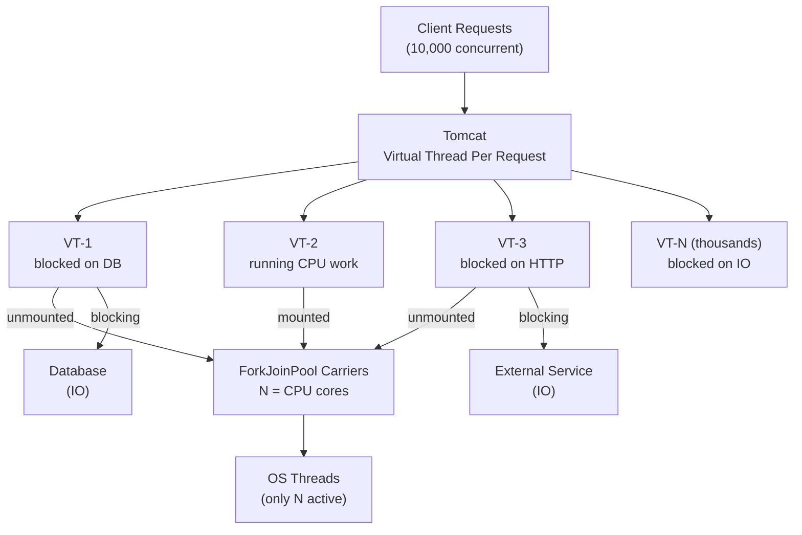

## Keywords in This File
{: .no_toc }

| # | Keyword | Weight |
|---|---|---|
| 1 | [Java Language - L4 Virtual Threads API](#java-language---l4-virtual-threads-api) | medium |

---

# Java Language - L4 Virtual Threads API

## Virtual Threads and Structured Concurrency API

---

### 🎯 Model Answer

**30 seconds:**
> Virtual threads (Java 21, JEP 444): lightweight JVM-managed threads. `Thread.ofVirtual().start(runnable)`.
> Can have millions active simultaneously. When a virtual thread blocks (IO, sleep, lock): the
> carrier thread is unmounted and reused. Structured concurrency (Java 21 preview, JEP 453):
> `StructuredTaskScope` - child tasks live within a parent scope, automatic cancellation on
> failure, guaranteed cleanup.

**3 minutes (Senior):**
> Virtual thread mechanics and structured concurrency:
>
> 1. **Carrier thread model**: virtual threads run ON carrier threads (platform threads from
>    `ForkJoinPool`). When a virtual thread blocks: JVM saves its stack to heap, unmounts it
>    from the carrier, mounts the next runnable virtual thread. The carrier thread is never
>    blocked. Many-to-many: N virtual threads on M carrier threads (M = CPU cores typically).
>
> 2. **Mounting/unmounting**: transparent to application code. The virtual thread's stack
>    snapshot (continuation) is stored on the heap. Blocking in a virtual thread: unmount
>    (cheap), park, remount on a carrier when ready. No OS thread context switch.
>
> 3. **Pinning**: a virtual thread is PINNED to its carrier and CANNOT be unmounted when:
>    (1) inside a `synchronized` block or method, (2) inside a native method or foreign function
>    call. Pinning blocks the carrier thread, reducing concurrency. Fix: replace `synchronized`
>    with `ReentrantLock` (supports unmounting).
>
> 4. **Structured concurrency**: `StructuredTaskScope.ShutdownOnFailure` - if ANY subtask fails,
>    all others are cancelled. `ShutdownOnSuccess` - if ANY succeeds, cancel the rest. Guarantees:
>    all subtasks finish (or are cancelled) before the scope exits.
>
> 5. **Throughput vs latency**: virtual threads improve THROUGHPUT for blocking-IO workloads
>    (more concurrent requests with fewer OS threads). They do NOT reduce latency per request.
>    CPU-bound work: virtual threads don't help (CPU, not threads, is the bottleneck).

**Blank Mind Recovery:**

**(1) Restate:** "Virtual thread: `Thread.ofVirtual().start(r)`. Unmounts on blocking IO. Carrier thread from ForkJoinPool. Pinning = bad (synchronized blocks carrier). StructuredTaskScope: parent scope owns child tasks, auto-cancel on failure. Throughput benefit: IO-bound workloads."

**(2) First principles:** "OS threads are expensive (1-2MB stack, context switch overhead). Virtual threads: JVM-managed, heap-stored stacks, cooperative scheduling (unmount on block). The JVM plays the role the OS plays for threads. Result: millions of concurrent virtual threads, each 'blocked' but not consuming an OS thread."

**(3) Bridge:** "Virtual threads are like a hotel with 1000 rooms but only 10 housekeepers. Each housekeeper is a carrier thread (real OS thread). Each room is a virtual thread. Normally, a housekeeper assigned to a room stays until done. With virtual threads: when a room 'blocks' (waiting for a guest to leave), the housekeeper moves to the next room. 10 housekeepers serve 1000 rooms by not waiting."

---

### 📘 Concept Explanation

**Virtual thread mechanics:**
```
CREATION AND MANAGEMENT:

  // Create and start a virtual thread:
  Thread vt = Thread.ofVirtual().start(() -> {
      System.out.println("Hello from virtual thread");
  });
  vt.join();  // wait for completion
  
  // Named virtual thread (for debugging):
  Thread vt = Thread.ofVirtual()
      .name("worker-", 1)  // name prefix + counter
      .start(runnable);
  
  // Thread factory (for use with ExecutorService):
  ThreadFactory factory = Thread.ofVirtual().factory();
  ExecutorService executor = Executors.newThreadPerTaskExecutor(factory);
  // one virtual thread per task (submit = new virtual thread)
  
  // Best practice: use executor, not raw thread creation:
  try (ExecutorService executor = Executors.newVirtualThreadPerTaskExecutor()) {
      List<Future<Result>> futures = IntStream.range(0, 10_000)
          .mapToObj(i -> executor.submit(() -> processRequest(i)))
          .collect(Collectors.toList());
      // All 10,000 requests run as virtual threads
      // Platform thread count: ~CPU cores (ForkJoinPool carriers)
  }
  // executor.close() waits for all tasks to finish
  
  // COMPARISON WITH PLATFORM THREADS:
  // Platform thread: 1 OS thread (1-2MB stack, expensive)
  // Virtual thread: JVM-managed, heap stack (~1KB initially, grows as needed)
  //
  // OS thread limit (Linux): typically 32K-500K per process
  // Virtual thread limit: limited only by heap memory

BLOCKING AND UNMOUNTING:

  // When a virtual thread calls any blocking operation:
  //   Thread.sleep(), Object.wait(), LockSupport.park()
  //   Socket I/O, File I/O (via new NIO paths)
  //   JDBC (if driver supports virtual thread-friendly blocking)
  //   BlockingQueue.take(), CountDownLatch.await()
  //   ReentrantLock.lock()
  // -> JVM unmounts the virtual thread from its carrier (saves stack to heap)
  // -> Carrier thread continues with other virtual threads
  // -> When blocking ends (data ready, lock acquired): virtual thread is rescheduled
  
  // KEY POINT: the application code is IDENTICAL for virtual and platform threads
  // No async/await, no callback, no CompletableFuture
  // Just write blocking code - the JVM makes it efficient

PINNING (MUST AVOID):

  // Virtual threads CANNOT unmount when:
  
  // 1. Inside synchronized block:
  synchronized (lock) {
      connection.read();  // PINNED: carrier blocked during this read
  }
  // FIX: use ReentrantLock instead:
  lock.lock();
  try {
      connection.read();  // NOT pinned: carrier can unmount during read
  } finally {
      lock.unlock();
  }
  
  // 2. Inside native methods:
  nativeMethod();  // pinned during execution
  
  // DETECT PINNING:
  // JVM flag: -Djdk.tracePinnedThreads=full (logs pinning events to stdout)
  // Output: Thread[ForkJoinPool-1-worker-1,...] pinned count=1
  //   com.example.Service.processData(Service.java:42)  <- the synchronized block

STRUCTURED CONCURRENCY (JAVA 21 PREVIEW):

  // StructuredTaskScope: all subtasks scoped to a block
  // Guarantees: subtasks end before the scope ends (join/cancel)
  
  // Pattern 1: ShutdownOnFailure (fail fast)
  try (var scope = new StructuredTaskScope.ShutdownOnFailure()) {
      Subtask<User>    user    = scope.fork(() -> fetchUser(userId));
      Subtask<Account> account = scope.fork(() -> fetchAccount(userId));
      
      scope.join();            // wait for both (or fail)
      scope.throwIfFailed();   // re-throw first failure as CompletionException
      
      return new Dashboard(user.get(), account.get());
  }
  // If fetchUser fails: fetchAccount is cancelled automatically
  // If both succeed: Dashboard is returned
  
  // Pattern 2: ShutdownOnSuccess (use first result)
  try (var scope = new StructuredTaskScope.ShutdownOnSuccess<String>()) {
      scope.fork(() -> callServiceA());
      scope.fork(() -> callServiceB());
      
      scope.join();
      return scope.result();  // returns whichever succeeded first
  }
  // Once one succeeds, the other is cancelled
  
  // The scope TREE: parent scope sees child task failures
  // Thread.currentThread().getThreadGroup() is NOT the scope hierarchy
  // The scope IS the structured concurrency construct
```

> **Code walkthrough:** This example demonstrates the core pattern in action. The key mechanism shows how the concept works in practice. Study the structure to understand the essential behavior and common usage.

---

### 💻 Code Example

> **Code walkthrough:** The HTTP request handler shows the primary use case: a REST endpoint
> that makes multiple blocking I/O calls (database, external API). With a thread pool, this
> requires reactive programming or careful thread pool sizing. With virtual threads:
> write blocking code naturally; the JVM handles the scheduling.

```java
// BAD: thread pool + async (complex, harder to read and debug)
@GetMapping("/dashboard/{userId}")
CompletableFuture<Dashboard> getDashboard(@PathVariable Long userId) {
    return CompletableFuture
        .supplyAsync(() -> userRepo.findById(userId), ioExecutor)
        .thenCombine(
            CompletableFuture.supplyAsync(
                () -> orderRepo.findByUserId(userId), ioExecutor),
            (user, orders) -> new Dashboard(user, orders)
        );
    // Complex: error handling, cancellation, timeout all need explicit handling
}

// GOOD: virtual thread (Java 21) - blocking code, high throughput
// With Tomcat/Jetty virtual thread support or:
// spring.threads.virtual.enabled=true (Spring Boot 3.2+)
@GetMapping("/dashboard/{userId}")
Dashboard getDashboard(@PathVariable Long userId) {
    // Runs in a virtual thread: blocking calls don't waste OS threads
    User user     = userRepo.findById(userId).orElseThrow();
    List<Order> orders = orderRepo.findByUserId(userId);
    return new Dashboard(user, orders);
    // Simple: error handling = standard try-catch, debuggable, readable
}

// STRUCTURED CONCURRENCY: fetch user + account in parallel, fail fast
Dashboard getDashboardParallel(Long userId) throws InterruptedException {
    try (var scope = new StructuredTaskScope.ShutdownOnFailure()) {
        Subtask<User>    user    = scope.fork(() -> fetchUser(userId));
        Subtask<Account> account = scope.fork(() -> fetchAccount(userId));
        Subtask<List<Order>> orders = scope.fork(() -> fetchOrders(userId));
        
        scope.join()           // wait for all three (or cancel on first failure)
             .throwIfFailed(); // throw if any failed
        
        return new Dashboard(user.get(), account.get(), orders.get());
    }
    // All three run concurrently in virtual threads
    // If any one fails: the other two are cancelled
    // Scope exit: guaranteed all subtasks are done or cancelled
}

// PINNING CHECK AND FIX:
// BAD: synchronized pinning
class DataProcessor {
    private final Object lock = new Object();
    
    void process(Data data) {
        synchronized (lock) {
            // Any blocking I/O here PINS the carrier thread
            externalService.send(data);  // network call: pins carrier
        }
    }
}

// GOOD: ReentrantLock (no pinning)
class DataProcessor {
    private final ReentrantLock lock = new ReentrantLock();
    
    void process(Data data) {
        lock.lock();
        try {
            externalService.send(data);  // virtual thread can unmount here
        } finally {
            lock.unlock();
        }
    }
}

// EXECUTOR USAGE PATTERN (Spring Boot):
// application.properties:
//   spring.threads.virtual.enabled=true
// This configures Tomcat to use one virtual thread per request.
// No other changes needed - existing blocking code benefits automatically.
```

> **Code walkthrough:** The `getDashboard` before/after shows the primary benefit of virtual
> threads: the blocking code (repository calls) is simple and readable, but with virtual threads
> the server handles thousands of concurrent requests without needing reactive programming.
> The `getDashboardParallel` shows `StructuredTaskScope`: three parallel calls with automatic
> cancellation on failure. No `CompletableFuture.allOf()`, no manual cancellation - the scope
> manages it. The lock migration from `synchronized` to `ReentrantLock` eliminates pinning.

---

### 🎓 Answers by Seniority

**Junior / Mid (0-5 years):**
> Virtual threads: `Thread.ofVirtual().start(r)`. Lightweight. Don't block OS threads on IO.
> Use `Executors.newVirtualThreadPerTaskExecutor()`. Pinning problem: avoid `synchronized` in
> virtual thread hot paths. Spring Boot 3.2+: `spring.threads.virtual.enabled=true`.

---

**Senior / Staff (5+ years):**
> Virtual thread carrier model: ForkJoinPool (default = # CPU cores). Pinning: detected with
> `-Djdk.tracePinnedThreads=full`. Fix: replace `synchronized` with `ReentrantLock`. ThreadLocal:
> works but memory concerns with millions of virtual threads (prefer `ScopedValue` for request context).
> Structured concurrency: `StructuredTaskScope` for parallel subtask composition with fail-fast
> or first-success semantics. Database pools (HikariCP): virtual threads don't magically increase
> DB connections; pool size remains the bottleneck.

---

### ⚠️ Common Misconceptions

**Misconception 1: "Virtual threads make CPU-bound code faster."**
Virtual threads improve THROUGHPUT for IO-bound code (HTTP calls, DB queries, file I/O). For
CPU-bound code (cryptography, image processing, data transformation): virtual threads offer no
benefit. If 16 carrier threads are CPU-busy, 16 million virtual threads still can't use more
than 16 CPUs simultaneously. Virtual threads solve the "thread is blocked waiting" problem, not
the "CPU is working" problem.

**Misconception 2: "You can use millions of virtual threads without any concern."**
Memory concern: each virtual thread has a stack (grows on the heap). With 1 million virtual threads
with 100 frames each: significant heap pressure. `ThreadLocal` with large objects: one copy per
virtual thread. With 1 million virtual threads: 1 million copies. Use `ScopedValue` (Java 21 preview)
instead of `ThreadLocal` for request context in virtual thread-heavy applications.

---

### 🚨 Failure Modes and Diagnosis

**Failure: Virtual thread application has low throughput. Expected improvement not seen.**
```
Symptom: Switching to virtual threads with Spring Boot 3.2+ showed no throughput improvement.
  CPU usage is low, request latency is unchanged.

Root cause (one of several):

  CASE A: SYNCHRONIZED PINNING
  Many synchronized blocks in the code path (database driver, legacy libraries).
  Diagnosis:
    -Djdk.tracePinnedThreads=full
    Output: Thread[ForkJoinPool-1-worker-1,...] pinned count=N
      at com.mysql.jdbc.ConnectionImpl.ping(ConnectionImpl.java:442)
    The MySQL 5.x JDBC driver uses synchronized internally -> pins carrier threads.
    Fix: upgrade to MySQL 8.x connector (uses ReentrantLock).
  
  CASE B: CONNECTION POOL BOTTLENECK
  Virtual threads can make more concurrent requests, but the DB connection pool
  only has 10 connections (HikariCP default). Every extra virtual thread blocks
  waiting for a connection.
  Diagnosis:
    HikariCP metrics: pool.pending-threads climbing
    DB connections: consistently at max (10 connections)
    Fix: increase HikariCP pool size CAUTIOUSLY:
      hikari.maximum-pool-size=50  (more connections for more virtual threads)
      But: database has its own connection limit; don't exceed it.
  
  CASE C: CPU-BOUND WORKLOAD
  The bottleneck is CPU, not IO threads. Switching to virtual threads doesn't help
  because the carrier threads (= CPU cores) are already fully utilized.
  Diagnosis:
    CPU utilization consistently near 100% during load
    IO wait consistently near 0%
    Fix: optimize the CPU-bound logic, add more CPU cores, use caching to
    avoid recomputation.
  
  CASE D: THREAD-LOCAL MEMORY PRESSURE
  ThreadLocal<LargeObject> in the code path.
  With virtual threads: one ThreadLocal per virtual thread = OOM or GC pressure.
  Diagnosis:
    Heap dump: large number of LargeObject instances
    VisualVM / jmap -histo: many ThreadLocalMap entries
    Fix: replace ThreadLocal<LargeObject> with ScopedValue (Java 21 preview)
    or pass the value explicitly through the call chain.

Diagnosis Command Summary:
  -Djdk.tracePinnedThreads=full              # detect pinning
  jstack <pid>                               # see virtual thread states
  HikariCP metrics via /actuator/metrics     # pool contention
  VisualVM + heap dump                       # ThreadLocal memory
  async-profiler + virtual thread support    # CPU vs IO profiling
```

> **Code walkthrough:** This example demonstrates the core pattern in action. The key mechanism shows how the concept works in practice. Study the structure to understand the essential behavior and common usage.

---

### 🎯 Interview Deep-Dive

| Question Category | Time to Answer |
|---|---|
| Virtual thread vs platform thread | 2 minutes |
| Carrier thread model | 2 minutes |
| Mounting / unmounting | 2 minutes |
| Pinning causes and fixes | 2 minutes |
| StructuredTaskScope | 2 minutes |
| ShutdownOnFailure vs ShutdownOnSuccess | 2 minutes |
| Virtual threads vs reactive (WebFlux) | 2 minutes |
| ThreadLocal concern | 2 minutes |
| Connection pool interaction | 1 minute |
| CPU vs IO bound | 1 minute |
| ScopedValue | 1 minute |
| Virtual threads in Spring Boot | 1 minute |

---

**Q1 (fundamentals): How do virtual threads differ from platform threads internally?**

A: Platform thread: 1-to-1 mapping with OS thread. Stack: 1-2MB reserved per thread by OS. OS manages scheduling. Context switch: expensive (kernel mode, register save). Virtual thread: M-to-N mapping (many virtual, few carrier). Stack: heap-allocated, starts ~1KB, grows as needed. JVM schedules virtual threads on carrier threads (ForkJoinPool, typically #CPU cores). When virtual thread blocks: JVM unmounts it, saves stack as continuation on heap, mounts next runnable virtual thread. No OS context switch.

*What separates good from great:* The continuation model: Java uses "continuations" (also called fibers or coroutines in other languages) for virtual thread stacks. When a virtual thread unmounts: its stack frames are serialized to the heap as a `Continuation` object. When remounted: the stack is restored. This is what makes millions of virtual threads possible: each continuation is a few KB on the heap, not a 2MB reservation on the OS thread stack. The JVM implemented this using Loom's continuation support in the JVM itself (not a library trick). Kotlin coroutines: similar concept, but implemented differently (state machine transformation by the compiler). Virtual threads: no source code change needed, just use blocking APIs.

---

**Q2 (carrier): What is the ForkJoinPool and why is it the carrier for virtual threads?**

A: `ForkJoinPool.commonPool()` (or a dedicated VT scheduler): the platform thread pool that hosts virtual threads. Default size: `Runtime.getRuntime().availableProcessors()`. Virtual threads are scheduled as tasks by the ForkJoinPool: when a virtual thread is ready to run, it's submitted as a task to the pool. The ForkJoinPool's work-stealing: if one carrier thread's queue is empty and another has tasks, it steals (efficient load balancing).

*What separates good from great:* The ForkJoinPool was chosen because of work-stealing: virtual threads may become runnable at any time (when their IO completes). Work-stealing distributes newly-ready virtual threads to available carriers efficiently. The pool size = CPU cores: because carrier threads are non-blocking (virtual threads yield on blocking), having more carriers than CPUs would cause real CPU context switches (unnecessary). If a carrier thread ever blocks (pinned): it's a special case that temporarily grows the pool (compensating worker threads) to avoid deadlock. This is the JVM's internal mechanism for keeping progress even when pinning occurs.

---

**Q3 (pinning): Describe all the scenarios that cause virtual thread pinning.**

A: Pinning scenarios: (1) `synchronized` block or method: the monitor is associated with the OS thread (platform thread). Virtual thread inside `synchronized` cannot unmount. (2) Native method frame in the call stack: the native method uses C calling conventions which assume a specific OS thread stack. The JVM cannot rematerialize the stack mid-native-call. (3) Foreign Function (FFI) calls: same as native. These are the only pinning causes in standard Java code.

*What separates good from great:* The `synchronized` limitation will eventually be resolved: Project Loom team has ongoing work to make virtual threads unpinnable from synchronized blocks (by associating monitors with virtual threads rather than OS threads). This is in progress but not standard in Java 21. The mitigation for now: replace `synchronized` with `ReentrantLock` (which uses `LockSupport.park()` internally - park causes an unmount, not a pin). The library pinning problem: many third-party libraries use `synchronized` internally (JDBC drivers, legacy frameworks). The `-Djdk.tracePinnedThreads=full` flag helps identify these. Hibernate 6.x: migrated from synchronized to ReentrantLock. MySQL Connector/J 8.x: also migrated. Jackson: uses synchronized internally in some paths.

---

**Q4 (structured): Explain StructuredTaskScope and why it matters.**

A: `StructuredTaskScope`: a scope that owns a set of concurrent subtasks. The key invariant: the scope's `join()` waits for ALL forked tasks to complete or be cancelled before the scope exits. This is "structured concurrency": the lifetime of concurrent tasks is nested within the block structure of the code. Benefits: (1) no orphaned tasks (every forked task is tracked), (2) automatic cancellation on failure (`ShutdownOnFailure`), (3) readable: the scope block clearly shows which work is concurrent, (4) the JVM can visualize the task tree in debugging tools.

*What separates good from great:* Unstructured concurrency (CompletableFuture): tasks can escape their creating scope. `executor.submit(() -> work())` - the future can be leaked, the task continues running even if the calling code exits, errors may be silently swallowed. This makes reasoning about application lifecycle difficult. Structured concurrency is analogous to structured programming vs goto: goto (=unstructured flow) made programs hard to reason about; structured if/while/for made them tractable. `StructuredTaskScope` does the same for concurrency. In practice: if `fetchUser()` and `fetchAccount()` are in a scope, you KNOW both are done when the scope block exits. No question about "is there still a background task running?"

---

**Q5 (shutdown): What is the difference between ShutdownOnFailure and ShutdownOnSuccess?**

A: `ShutdownOnFailure`: if any subtask fails (throws), the scope shuts down (signals all other subtasks to cancel via interrupt). `scope.join().throwIfFailed()` re-throws as `CompletionException`. Use for: parallel fetches where ALL results are needed. `ShutdownOnSuccess<T>`: if any subtask succeeds (completes normally), the scope shuts down. `scope.result()` returns the first result. Use for: race pattern where you want the fastest response (e.g., try two services, use whichever responds first).

*What separates good from great:* The `ShutdownOnSuccess` pattern is the "hedging" pattern from distributed systems: send the same request to multiple services simultaneously, use the first response, cancel the rest. This is used in microservices to reduce tail latency (the p99 of two concurrent requests is significantly lower than the p99 of a sequential retry). With `CompletableFuture.anyOf()`: the cancellation of the losing futures must be done manually. With `ShutdownOnSuccess`: automatic. The scope-structured cancellation guarantees no resource leaks from the cancelled tasks.

---

**Q6 (vs reactive): When would you choose virtual threads over reactive programming (Project Reactor/WebFlux)?**

A: Choose virtual threads when: (1) existing blocking code (JDBC, blocking HTTP client, legacy APIs),
(2) team familiarity with blocking code is high, (3) debugging/observability is a priority (stack traces, debugger steps work normally), (4) latency is not ultra-critical (reactive has lower overhead per operation). Choose reactive when: (1) maximum throughput on CPU-efficient operations, (2) backpressure needed (Reactor's backpressure model), (3) composing many async operations with Mono/Flux operators, (4) existing reactive codebase.

*What separates good from great:* The debugging advantage of virtual threads is real and significant. Reactive stack traces: `at reactor.core.publisher.FluxFlatMap$FlatMapMain.onNext(FluxFlatMap.java:421)` - not meaningful for business logic debugging. Virtual thread stack traces: `at com.example.UserService.fetchUser(UserService.java:42)` - meaningful, just like single-threaded code. This reduces debugging time substantially. The Spring team's position: virtual threads (Loom) + blocking code is the primary recommendation for NEW Spring Boot 3.x applications. Reactive (WebFlux): for teams already invested in reactive or with extreme throughput requirements. The performance gap: for IO-bound workloads with Loom, virtual threads match reactive throughput while preserving readability.

---

**Q7 (threadlocal): What is the ThreadLocal concern with virtual threads?**

A: `ThreadLocal<T>` with virtual threads: one value per virtual thread. With millions of virtual threads: potentially millions of `ThreadLocal` values. If the value is small (a UUID, a simple context): fine. If large (a database connection, a large cache): memory pressure. The actual concern: existing code that uses `ThreadLocal` for request context (user ID, trace ID) works correctly but allocates one entry per virtual thread.

*What separates good from great:* `ScopedValue` (Java 21 preview, JEP 446): the virtual-thread-friendly alternative to `ThreadLocal`. `ScopedValue`: immutable, bound to a dynamic scope (a block), available to all code within that scope (including called methods). Reading: very fast (no thread-local storage lookup). Lifecycle: cleared when the scope exits (no leak). Use pattern: `ScopedValue.where(USER_ID, userId).run(() -> { ... code that can read USER_ID ... })`. Spring's `RequestContextHolder`, MDC (Mapped Diagnostic Context), and SecurityContextHolder all use `ThreadLocal`. With virtual threads: they work correctly but should be monitored for memory. The Spring team plans to migrate internals to `ScopedValue` in future versions.

---

**Q8 (thread count): What is the effective limit on virtual threads?**

A: Practical limit: heap memory. Each virtual thread's continuation stack: ~10KB for a simple task,
grows with call depth (potentially 1-5MB for deep call stacks). 1 million virtual threads at 10KB average:
~10GB heap. Realistic limit: depends on heap size and stack depth of the workloads. For simple IO
tasks with shallow stacks: 1-5 million per GB is achievable. For deep recursion or complex processing:
much fewer. OS thread limit: not a factor (virtual threads don't use OS threads while blocked).

*What separates good from great:* The practical constraint in production: it's not "how many virtual threads" but "how many active (running/runnable) virtual threads." Blocked virtual threads use heap for their continuation, but only ~CPU_CORES threads are CPU-active at any time. The real tuning parameter: how many virtual threads are created per unit time, and how long they stay alive. For a web server: one virtual thread per request. With 10,000 concurrent requests (common for high-traffic services): 10,000 virtual threads, each with a shallow stack. This is entirely manageable. The concern is if each request spawns sub-tasks that spawn sub-tasks (task explosion). With `StructuredTaskScope`: the tree is bounded and visible.

---

**Q9 (interop): How do virtual threads interact with existing Java thread APIs?**

A: Virtual threads ARE `Thread` instances. `Thread.currentThread()` returns the virtual thread.
`Thread.sleep()`: unmounts (doesn't pin). `synchronized`: pins (known issue). `ReentrantLock.lock()`:
unmounts. `ThreadLocal`: works (one per virtual thread). `Thread.interrupt()`: works. `Thread.join()`:
works. `ThreadGroup`: virtual threads have a special `VirtualThreadGroup` (not user-configurable).
`ExecutorService`: `Executors.newVirtualThreadPerTaskExecutor()` wraps virtual thread creation.

*What separates good from great:* The "drop-in replacement" characteristic: existing blocking code (JDBC, `RestTemplate`, `Thread.sleep()`) works correctly with virtual threads without any changes. The only code that needs attention: code with `synchronized` blocks in hot IO paths (pinning). This is what makes the virtual thread migration so compelling: for Spring Boot applications, `spring.threads.virtual.enabled=true` in a property file switches Tomcat/Jetty to virtual threads. Existing controller, service, and repository code benefits immediately. The only migration work: identify and fix pinning (run with `-Djdk.tracePinnedThreads` in a test environment, update to newer library versions that use `ReentrantLock`).

---

**Q10 (db pool): How does a connection pool behave under high virtual thread concurrency?**

A: HikariCP (JDBC connection pool): limits concurrent DB connections. With 10 connections and 10,000 concurrent virtual threads: 9,990 virtual threads block waiting for a connection. The virtual threads unmount while waiting (carrier thread freed). Eventually: all connections in use, new requests wait in HikariCP's queue. Timeout: `connectionTimeout=30000ms`. With virtual threads: the queue depth can be much larger without OS thread exhaustion. But the DB itself has a connection limit. The pool size is still the constraint.

*What separates good from great:* The nuance: virtual threads don't remove the need for connection pooling. They remove the THREAD limit as a constraint. The new constraint: database connection count. The tuning: with virtual threads, you may want to increase the HikariCP pool size to match your concurrency needs (more concurrent DB operations). But the DB has a max connection limit. PostgreSQL default: 100 connections. With 1000 virtual threads hitting the DB: 900 must wait. With 100 connections (matching PostgreSQL default): 100 virtual threads use connections, 900 wait (unmounted). The wait is free (no OS thread used) but still introduces latency. The `maximumPoolSize` in HikariCP should be set based on your DB server's connection limit and the expected concurrent query load, not based on thread count.

---

**Q11 (debug): How do you diagnose virtual thread issues in production?**

A: Tools: (1) `jstack <pid>`: shows virtual thread stacks (Java 21, shows all threads including virtual). (2) JFR (Java Flight Recorder): records virtual thread scheduling events, parking, unmounting. (3) `-Djdk.tracePinnedThreads=full`: logs pinning. (4) `jcmd <pid> Thread.print`: all threads including virtual. (5) async-profiler (version 2.9+): CPU and wall-clock profiling for virtual threads. (6) Micrometer metrics: virtual thread count, blocked thread count.

*What separates good from great:* JFR virtual thread events: `jdk.VirtualThreadPinned` - fires when a virtual thread is pinned. `jdk.VirtualThreadSubmitFailed` - fires when a virtual thread can't be submitted (queue full, unlikely). `jdk.VirtualThreadStart` / `jdk.VirtualThreadEnd`: lifecycle events. JFR configuration: `jcmd <pid> JFR.start settings=profile`. These events: help diagnose pinning in production without enabling the verbose `-Djdk.tracePinnedThreads` flag (which has overhead). The observable metrics for capacity planning: carrier thread count, virtual thread count, virtual thread wait time. With Micrometer + Prometheus + Grafana: set up dashboards that show these in production.

---

**Q12 (adoption): What is the recommended migration strategy from thread pools to virtual threads?**

A: Step 1: Spring Boot 3.2+ with `spring.threads.virtual.enabled=true` - one property enables
virtual threads for Tomcat/Jetty. Step 2: run load tests and check for pinning (`-Djdk.tracePinnedThreads`). Step 3: fix synchronized blocks in your code (replace with `ReentrantLock`). Step 4: update third-party dependencies (JDBC drivers, HTTP clients) to versions that support virtual threads. Step 5: tune HikariCP pool size if DB throughput is the new bottleneck. Step 6: monitor `ThreadLocal` memory usage.

*What separates good from great:* The "do nothing" victory: for many Spring Boot apps, setting `spring.threads.virtual.enabled=true` and running load tests is sufficient. If pinning is minimal (modern library versions), the throughput improvement for IO-bound workloads is immediate. The "effort vs gain" analysis: virtual threads primarily benefit high-concurrency IO-bound services (REST APIs, service aggregators). For batch processing (one thread processing a file): no benefit. For low-concurrency services (< 10 concurrent requests): no visible benefit. The target: services that currently need large thread pools (100-500 threads) to handle concurrent IO. With virtual threads: those services can use far fewer OS threads while handling the same concurrency, reducing memory and context-switch overhead.

---

### ⚖️ Comparison Table

| Feature | Platform Thread | Virtual Thread |
|---------|----------------|----------------|
| OS thread | 1:1 | M:N (many virtual, few carrier) |
| Stack memory | 1-2MB (OS reservation) | ~1KB initial (heap, grows) |
| Practical limit | ~32K-500K (OS limit) | Millions (heap memory) |
| Blocking IO | Wastes OS thread | Unmounts, carrier free |
| synchronized | OK | PINS carrier (fix: ReentrantLock) |
| ThreadLocal | One per thread | One per virtual thread (memory risk) |
| Debugging | Standard stack trace | Same (virtual thread is a Thread) |
| CPU-bound benefit | N/A | None (same CPU usage) |
| IO-bound benefit | N/A | Significant throughput increase |
| JDK version | All | Java 21+ |

---

### 🏛️ System Design

**Virtual Thread Architecture in a Web Server:**

```
ASCII:
  Client Requests (10,000 concurrent)
        |
        v
  Tomcat (virtual thread per request)
  [VT-1]  [VT-2]  [VT-3]  ...  [VT-10000]
  blocked  running  blocked      blocked
  (DB IO)  (CPU)    (HTTP IO)    (DB IO)
        |
        v
  ForkJoinPool Carriers: [Thread-1] [Thread-2] [Thread-3] ... [Thread-N]
  (N = CPU cores, typically 8-32)
  
  Carrier threads ONLY run when a VT has CPU work to do.
  Blocked VTs (IO waiting) are unmounted (freed from carrier).
  Thousands of blocked VTs with only N active carrier threads.
```



> **Diagram walkthrough:** The key insight: thousands of virtual threads are "alive" but only
> the CPU-active ones are mounted to carrier threads. IO-blocked virtual threads are unmounted
> (their continuation stored on the heap), freeing their carrier for other work. With N CPU cores:
> only N carrier threads exist, but they serve thousands of virtual threads by switching between
> them whenever blocking occurs. This is why a 16-core server can handle tens of thousands of
> concurrent connections without OS thread exhaustion.

---

### 📊 Diagram

*(Omit: Architecture shown in System Design section above.)*

---

### 💻 Code Example

*(Omit: this concept does not have a programmatic interface that can be demonstrated in code. The conceptual explanation above is sufficient.)*


---

### 🏛️ System Design

*(Omit: system design diagram not applicable for this concept - see ★★★ keywords for full system design coverage.)*


---

### ⚖️ Comparison Table

*(Omit: this is a ★☆☆ foundational concept with no direct alternatives to compare - see higher-difficulty keywords for trade-off analysis.)*


---

### 📊 Diagram

*(Omit: no standalone visual diagram required for this concept - the explanations and code examples above provide sufficient clarity.)*


