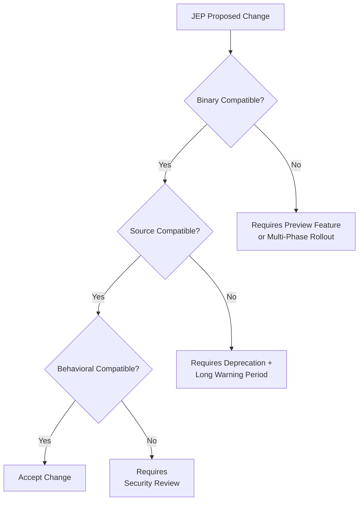
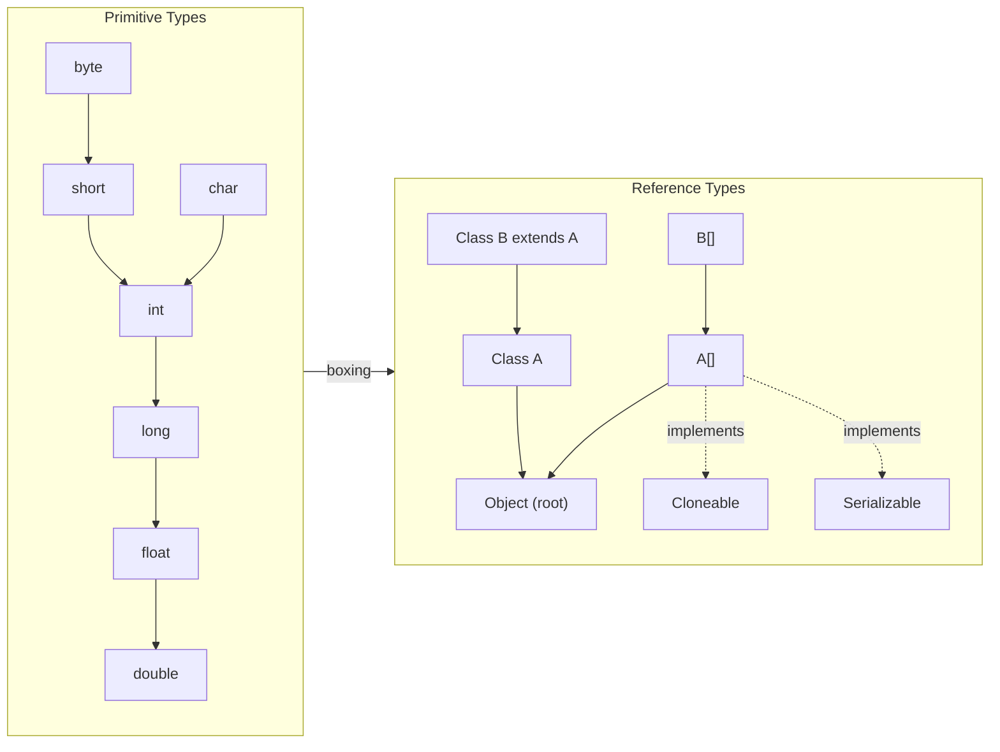
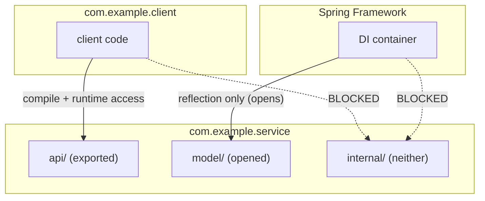

## Keywords in This File
{: .no_toc }

| # | Keyword | Weight |
|---|---|---|
| 1 | [Backward Compatibility: The Java Social Contract and Its Costs](#backward-compatibility-the-java-social-contract-and-its-costs) | critical |
| 2 | [Java Language Specification: Type System Formal Rules](#java-language-specification-type-system-formal-rules) | high |
| 3 | [Java Platform Module System: Encapsulation at Module Level](#java-platform-module-system-encapsulation-at-module-level) | high |

---

# Backward Compatibility: The Java Social Contract and Its Costs

**Interview Weight:** critical - Asked at senior/staff levels when
discussing language evolution, migration decisions, and "why can't
Java just fix X."

---

### 🎯 Model Answer

**30 seconds:**

> Java guarantees binary compatibility: bytecode compiled on Java 1.0
> still runs on Java 21. This promise lets enterprises upgrade JVMs
> without recompiling their code - a massive operational advantage.
> The cost is permanent technical debt: design mistakes from 1996 like
> null, type erasure, and java.util.Date cannot be fixed without
> breaking the contract.

**3 minutes (Senior):**

> The Java social contract has three layers. Binary compatibility means
> a `.class` file compiled against an older Java version runs correctly
> on a newer JVM without recompilation. Source compatibility means
> source code that compiled before still compiles after an upgrade -
> though this is weaker; Java sometimes breaks source compatibility
> while preserving binary compatibility. Behavioral compatibility means
> existing behavior does not change, which is the hardest to maintain
> and the one Java occasionally breaks (usually for security or
> correctness reasons).
>
> The contract has concrete costs. Type erasure exists because generics
> were retrofitted into the 1.5 JVM format that predated them - making
> generics reified would have broken every existing `.class` file.
> `null` cannot be removed because every reference type in the JVM
> is nullable by design, and removing it would break binary
> compatibility at the bytecode level. `java.util.Date` was deprecated
> in 1997 but still ships in every JDK because removing it would
> break hundreds of thousands of deployed applications. Even integer
> autoboxing's identity behavior (-128 to 127 cache guarantee) is now
> a specification requirement because code was written to depend on it.
>
> The mechanism is the JLS (Java Language Specification) and JVMS (JVM
> Specification), which define precisely what constitutes a compatible
> change. Each JEP that modifies the language must assess all three
> compatibility dimensions. Project Valhalla (value types) and Project
> Amber (pattern matching) are designed in phases specifically because
> each phase must maintain compatibility with the previous one. The
> non-obvious insight: backward compatibility is not just about runtime
> behavior - it is also about the entire ecosystem of tools, bytecode
> instrumentation frameworks, and debuggers that depend on the
> stability of the `.class` file format.

**Framework:** WHAT -> WHY -> HOW -> TRADE-OFF -> EXAMPLE

_Adapting up:_ Add the distinction between binary/source/behavioral
compatibility and connect to specific JEPs that had to navigate the
constraints (Project Valhalla, Loom). Discuss how the module system
attempted to create an evolution path by encapsulating JDK internals.

_Adapting down:_ WHAT (code from 1996 still runs) + WHY (enterprises
cannot recompile everything) + EXAMPLE (type erasure was the price
for generic collections).

**Blank Mind Recovery:**

**(1) Restate:** "You are asking about Java backward compatibility -
let me walk through the binary/source/behavioral compatibility
layers and what each costs the language."

**(2) First principles:** "If you ship a language runtime used by
billions of JARs in production, you cannot break those JARs on
upgrade. The only way to guarantee that is to freeze the binary
contract. Freezing that contract means every design mistake from day
one is permanent."

**(3) Bridge:** "Java backward compatibility is like a city that
promised never to renumber its streets. Newcomers are confused by
the illogical numbering, but every business card ever printed still
works. The cost of consistency is that you can never fix the original
bad plan."

---

### 📘 Concept Explanation

**What it is:**

Java's backward compatibility guarantee ensures that `.class` files
compiled with an older Java compiler will run correctly on a newer
JVM, and (with weaker guarantees) that source code will continue to
compile after a language upgrade.

**The problem it solves:**

In an ecosystem with thousands of libraries and enterprise deployments
that cannot coordinate upgrades, breaking changes are catastrophic.
If Java 17 could not run Java 8 bytecode, every organization would
need to recompile, retest, and redeploy their entire dependency tree
with each JVM upgrade - a months-long process for large enterprises.
The compatibility guarantee is what makes JVM upgrades operationally
safe.

**How it works:**

Three distinct compatibility layers:

```
BINARY COMPATIBILITY (strongest guarantee)
  Old .class files run on new JVM without recompilation
  Governed by: JVMS constant pool + class file format versioning
  Breaks when: JVM removes a method/field the old bytecode calls
  Java's record: very strong since 1.0

SOURCE COMPATIBILITY (weaker - sometimes deliberately broken)
  Old .java source compiles with new javac
  Governed by: JLS semantics + keyword reservation
  Breaks when: new keyword added that was a valid identifier before
  Example: "var" as a type name broke in Java 10

BEHAVIORAL COMPATIBILITY (strongest to maintain, hardest)
  Same inputs produce same outputs on new JVM
  Breaks when: bug fixes change observable behavior
  Java's stance: break it only for correctness/security
```



> **Diagram walkthrough:** Each proposed language change passes
> through three compatibility gates. Binary compatibility is the
> hardest constraint - a change that breaks it requires years of
> preview feature stages (as with records and sealed classes).
> Source compatibility breaks like adding `var` as a keyword are
> permitted if migration is practical and the change is high value.
> Behavioral breaks are rare and require explicit sign-off because
> they break existing tests even when no code changes.

**The key insight:**

The compatibility guarantee is asymmetric: the JDK cannot remove
or change things callers depend on, but callers CAN depend on
things the JDK never intended to be stable (like `sun.misc.Unsafe`,
internal APIs). This asymmetry is why Java 9's module system was
necessary - it finally created an enforcement mechanism that
prevented code from taking undeclared dependencies on JDK
internals, creating an evolution path out of the previous
all-or-nothing compatibility constraint.

**When to use it (designing APIs):**

Design for binary compatibility when you ship a library used by
code you do not control. Rules: never remove a public method, never
change a public method signature, never widen or narrow
visibility (narrowing breaks binary compatibility, widening is safe),
never change a constant's type. Use `@Deprecated` before removal
with at least one major version warning period.

**When NOT to fight it:**

Do not add a field to an interface expecting binary compatibility -
before Java 8, adding any interface method broke all implementations.
Do not change a class from `interface` to `abstract class` - even if
the source contract looks the same, the bytecode is different.
Do not assume `enum` ordinals are stable across versions - they are
not part of the binary contract.

**Alternatives:**

Semantic versioning + explicit breaking changes (semver) - used
by the JavaScript/npm ecosystem; breaks freely at major version
but provides no runtime guarantee. Versus Java's approach which
trades evolution agility for deployment safety.

**First-principles derivation:**

Given: a language used by millions of programs in production across
organizations that cannot coordinate. The only options are: (A)
break compatibility and require recompilation (Python 2 to 3 took
a decade and fragmented the ecosystem), (B) maintain multiple
incompatible runtimes forever (Node.js's CJS/ESM split), or (C)
freeze the binary contract and absorb design debt. Java chose C.
Every limitation - type erasure, null, persistent bad APIs - is the
direct consequence of choosing C.

---

### 💻 Code Example

#### Example 1 - Binary vs Source Compatibility Break (Recognition)

```java
// Library v1 - shipped to customers
public class PaymentProcessor {
    public void process(String orderId) {
        // implementation
    }
}

// Library v2 - BINARY COMPATIBLE change (new overload added)
public class PaymentProcessor {
    public void process(String orderId) { }          // kept
    public void process(String orderId, int retry) { } // added
}

// Library v3 - BINARY INCOMPATIBLE change (method removed)
public class PaymentProcessor {
    // process(String) removed - any .class that calls it gets
    // NoSuchMethodError at runtime even though source compiled
}
```

> **Code walkthrough:** Adding a method is binary compatible because
> existing bytecode that calls `process(String)` still finds it.
> Removing a method is the classic binary incompatibility - the old
> `.class` file has a `CONSTANT_Methodref` in its constant pool that
> the JVM can no longer resolve, producing `NoSuchMethodError` at the
> first invocation. The key insight: binary compatibility is checked
> at call resolution time (runtime), not compile time, so a library
> can be upgraded silently and break only when the removed method is
> actually called.

---

#### Example 2 - Type Erasure as the Compatibility Tax (Internal Mechanism)

```java
// BAD mental model: "Generics are a runtime feature"
List<String> strings = new ArrayList<>();
List<Integer> ints = new ArrayList<>();

// These are the SAME type at runtime:
System.out.println(strings.getClass() == ints.getClass()); // true

// This fails at compile time (correct) but for the wrong reason:
// The JVM cannot distinguish List<String> from List<Integer>
// instanceof List<String>  // compile error - cannot use generic
                            // type in instanceof
```

> **Code walkthrough:** Type erasure means `List<String>` and
> `List<Integer>` are both `ArrayList` at runtime - the type
> parameter is erased to `Object`. This is the direct compatibility
> cost: generics were added in Java 5, but the JVM byte code format
> from 1.0 had no concept of generic types. Making generics reified
> (keeping the type parameter at runtime) would have changed the
> `.class` file format and broken every class file ever compiled.
> The compatibility contract forced the erasure design.

```java
// GOOD: understanding what IS preserved (type tokens and bridges)
public class TypeSafeRegistry<T> {
    private final Class<T> type;
    private final List<T> items = new ArrayList<>();

    public TypeSafeRegistry(Class<T> type) {
        this.type = type;  // type token: preserve type info explicitly
    }

    public void add(Object item) {
        if (!type.isInstance(item)) {
            throw new ClassCastException(
                "Expected " + type.getName());
        }
        items.add(type.cast(item));
    }
}
```

> **Code walkthrough:** The "type token" pattern (passing `Class<T>`
> explicitly) is the standard workaround for type erasure when
> runtime type checking is needed. Frameworks like Gson and Jackson
> use this pattern extensively. `TypeReference<T>` (Jackson) captures
> generic type information using anonymous subclassing, which
> preserves the supertype's generic parameters in class metadata
> (accessible via `getGenericSuperclass()`). This is the
> compatibility-driven workaround for what would be a single
> reified type parameter in a language without the erasure constraint.

---

#### Example 3 - API Evolution with Binary Compatibility (Production)

```java
// Extending an API safely: adding default methods (Java 8+)
// BEFORE Java 8: adding any method to an interface broke all
// existing implementations

// SAFE (Java 8+): default method added without breaking implementations
public interface UserRepository {
    User findById(long id);

    // Safe to add: default implementation means existing
    // implementations do not break
    default Optional<User> findOptional(long id) {
        User u = findById(id);
        return Optional.ofNullable(u);
    }
}

// Pre-Java-8 workaround: abstract base class as compatibility shim
// (still used in many frameworks today for this reason)
public abstract class AbstractUserRepository
        implements UserRepository {
    // Subclasses override only what they need;
    // new methods added here don't break subclasses
}
```

> **Code walkthrough:** Default methods in interfaces (Java 8) were
> designed specifically to solve the backward compatibility problem
> of evolving the Java Collections API. Before Java 8, adding
> `stream()` or `forEach()` to `Iterable` would have broken every
> class that implemented those interfaces. The `default` keyword is
> a compatibility mechanism: new behavior can be added to an
> interface without requiring every implementation to change. The
> abstract base class pattern served the same purpose before Java 8
> and is still widely used in framework APIs (Spring's
> `WebMvcConfigurer`, for example).

---

#### Example 4 - Compatibility Break in Practice (Failure + Diagnosis)

```java
// SYMPTOM: Application crashes on JDK 17 upgrade with:
// java.lang.reflect.InaccessibleObjectException:
//   Unable to make field accessible: module java.base does not
//   open java.lang to unnamed module

// ROOT CAUSE: Code was using sun.misc.Unsafe or internal JDK APIs
// that the module system now blocks.

// DIAGNOSIS CHECKLIST:
// 1. Run with --illegal-access=warn (JDK 11-15) to enumerate all
//    illegal accesses before the upgrade:
//    java --illegal-access=warn -jar myapp.jar

// 2. After upgrade, check the error message:
//    "module X does not open Y to unnamed module"
//    X = JDK module being accessed
//    Y = package being accessed
//    "unnamed module" = caller is on the classpath, not in a named module

// 3. Short-term fix (treat as tech debt):
//    Add JVM args:
//    --add-opens java.base/java.lang=ALL-UNNAMED
//    --add-opens java.base/java.util=ALL-UNNAMED

// 4. Long-term fix: replace with supported public API
//    Unsafe.allocateMemory -> VarHandles (java.lang.invoke.VarHandle)
//    Internal reflection -> MethodHandles API
```

> **Code walkthrough:** The Java 9 module system was the first
> mechanism to actively enforce backward compatibility constraints
> rather than just preserve them. Code that depended on JDK internal
> APIs (which Java had always discouraged but never blocked) now
> encounters hard failures. The `--illegal-access=warn` flag (removed
> in JDK 17) was a transition tool - the JDK team monitored which
> internal APIs were most widely used and built public alternatives
> before enforcement. This is the backward compatibility process at
> work: deprecate, warn, provide alternatives, then enforce.

---

### 🎓 Answers by Seniority

**Junior:** Java guarantees that old bytecode still runs on new JVMs.
This is why you can use a Java 8 JAR in a Java 21 application without
recompiling. Type erasure is related - generics are compiled away to
keep bytecode format compatible.

**Mid-level:** Three compatibility layers: binary (hardest guarantee),
source (sometimes deliberately broken), and behavioral (changed only
for correctness). The costs are real: type erasure, null, `Date` API.
Each JEP assesses these dimensions. Default methods were added to Java
8 specifically to evolve Collection interfaces without breaking
implementations.

**Senior:** The module system (Java 9) created an evolution path by
blocking access to JDK internals - the first time Java actively
restricted what callers could depend on. The `--add-opens` transition
period is an example of the compatibility process: deprecate, warn,
provide alternatives, enforce. At-scale implication: library authors
shipping public APIs must treat compatibility as a first-class
constraint - accidental binary breaks cause NoSuchMethodError in
production at call resolution time, not at startup.

**Staff:** Backward compatibility is a governance decision, not a
technical one. Java's choice shapes every language design decision:
Valhalla's value types required years of design because making
primitives first-class (fixing the int/Integer split) must not break
any existing bytecode. The module system represents a strategic shift
in the social contract - acknowledging that unlimited backward
compatibility prevented evolution and creating a path to break it
safely. Staff engineers reason about compatibility when designing
library APIs and setting deprecation timelines, not just when
upgrading JDKs.

---

### ⚠️ Common Misconceptions

| #   | Misconception                                         | Reality                                                                                                                                                                                   | Danger                                                                     |
| --- | ----------------------------------------------------- | ----------------------------------------------------------------------------------------------------------------------------------------------------------------------------------------- | -------------------------------------------------------------------------- |
| 1   | Binary and source compatibility are the same          | Binary = .class runs; source = .java compiles. A change can break source but preserve binary (adding a keyword) or preserve source but break binary (changing method signature invisibly) | Upgrading a library breaks at runtime after successful recompilation       |
| 2   | @Deprecated means removed soon                        | Java deprecated `Date` in 1997; it still ships in Java 21. Deprecation is a signal, not a promise of removal                                                                              | Ignoring deprecations; being surprised when they ARE eventually removed    |
| 3   | Type erasure is a bug or oversight                    | It was the deliberate compatibility cost of adding generics to a running ecosystem with billions of compiled class files                                                                  | Designing APIs that try to work around erasure in ways that cannot succeed |
| 4   | The module system breaks backward compatibility       | Module strong encapsulation is enforcement of what was always policy (don't use internal APIs). Code using public APIs is unaffected                                                      | Fear of module system; avoiding it unnecessarily                           |
| 5   | Adding a field to an interface is backward compatible | Before Java 8 adding any member to an interface broke all implementations. Even now, adding a field to an interface is not supported (interfaces have no instance fields)                 | Breaking every downstream implementation                                   |

---

### 🚨 Failure Modes and Diagnosis

**Failure 1 - NoSuchMethodError on library upgrade**

Symptom: Application runs fine until a specific method is called,
then throws `NoSuchMethodError`. The method exists in the new
source code but was removed or renamed.

Root cause: Binary incompatible library upgrade. Old `.class` file
has `CONSTANT_Methodref` for a method that no longer exists.

Diagnostic: `javap -c MyClass.class | grep "Method "` - shows which
method references the old bytecode contains. Cross-reference with
the library changelog.

Fix: Recompile against the new library version. If you cannot
recompile (shipped binary), pin to the compatible library version.

---

**Failure 2 - InaccessibleObjectException on JDK upgrade**

Symptom: Framework or library throws
`InaccessibleObjectException` at startup after upgrading to Java 17.

Root cause: Code was using JDK internal APIs via reflection. Java
9 module system blocks this by default; enforcement became complete
in Java 17.

Diagnostic: The exception message names the exact module and package.
Run with `--illegal-access=warn` (JDK 11-15) first to enumerate
all violations before upgrading.

Fix: Add `--add-opens` JVM flags as a short-term fix. Long-term:
replace JDK internal API usage with supported public alternatives.
Check library version for a module-system-aware release.

---

**Failure 3 - ClassCastException from type erasure at heap pollution**

Symptom: `ClassCastException` thrown at a line that does not
contain a cast in source code.

Root cause: Heap pollution - a `List<Integer>` was stored in a
`List<String>` reference via an unchecked cast or a raw type.
The generated cast at the `get()` call site fails.

Diagnostic: Enable `-Xlint:unchecked` to find all unchecked cast
warnings at compile time. Treat every unchecked warning as a
potential heap pollution source. Stack trace will point to the
actual cast insertion by the compiler, not the source of
the type confusion.

Fix: Eliminate all raw type usage. Do not suppress unchecked
warnings without understanding the reason. Use `@SuppressWarnings`
only with an explanatory comment.

---

### 🎯 Interview Deep-Dive

| Preparation time | Recommended approach                                                                |
| ---------------- | ----------------------------------------------------------------------------------- |
| 30 min           | Binary vs source compatibility distinction; type erasure cause                      |
| 1 hour           | Add behavioral compatibility; module system connection; NoSuchMethodError diagnosis |
| 2 hours          | Add API design rules for backward compatibility; Valhalla context                   |
| 3 hours          | Add full migration analysis; `@Deprecated` timeline discussion                      |
| 5 hours          | Deep dive on JLS evolution; read JEPs for Valhalla and Amber                        |

---

**[MID] Q1: What is the difference between binary compatibility
and source compatibility in Java?** [CONCEPTUAL]

_Why they ask:_ Tests whether the candidate has operational depth
beyond just "old code still works."

_Likely follow-up:_ "Can you give an example of a change that
breaks one but not the other?"

Binary compatibility means an existing `.class` file compiled
against an older version of an API runs correctly against a newer
version without recompilation. The JVM resolves method and field
references at class loading or first invocation time - if the
referenced member still exists with the same signature, it works.

Source compatibility means existing `.java` source code compiles
against a newer version of an API or language without changes.
This is a weaker guarantee. Java 10 broke source compatibility
for programs that used `var` as a variable or type name - they
had to be renamed. Java 8 adding `stream()` to `Collection` as
a default method maintained binary compatibility (existing `.class`
files still ran) and source compatibility (existing source still
compiled), but an implementing class that had its own `stream()`
method with a different signature needed attention.

A change that breaks binary but not source: removing a method.
The source code can be recompiled against the new API and the
call site removed or rewritten - but the old `.class` file will
fail at runtime with `NoSuchMethodError`.

A change that breaks source but not binary: adding a new reserved
keyword. Programs using the new keyword as an identifier fail to
compile but existing `.class` files (with it as an identifier
name in the constant pool) continue to run.

_What separates good from great:_ Knowing that behavioral
compatibility is a third, separate dimension - and that Java
sometimes breaks it deliberately (security fixes, correctness
fixes) with explicit changelog documentation.

---

**[MID] Q2: Why does Java use type erasure for generics instead
of reifying type parameters at runtime?** [CONCEPTUAL]

_Why they ask:_ Very common question; tests understanding of the
backward compatibility constraint that drove a major design
decision.

_Likely follow-up:_ "What are the practical limitations of erasure?"

Type erasure was the only option that maintained binary
compatibility when generics were added in Java 5. The JVM class
file format in use since Java 1.0 had no concept of generic type
parameters. Changing the format to include them would have broken
every `.class` file ever compiled.

The alternative, reification (keeping the type parameter at
runtime as C# does), would have required a new JVM that existing
class files could not run on. The Java team chose erasure: the
compiler uses generics for type checking but erases type parameters
before generating bytecode, replacing them with their bounds
(or `Object` for unbounded parameters).

The practical limitations of erasure: you cannot use a type
parameter in an `instanceof` check, you cannot create an array of
a generic type (`new T[]` is illegal), you cannot create a new
instance of a type parameter (`new T()` is illegal), and you
cannot distinguish `List<String>` from `List<Integer>` at runtime.
Each limitation is a direct consequence of the compatibility choice.

C# made the opposite choice: it introduced generics with a new
runtime (CLR 2.0) and explicitly broke compatibility with CLR 1.0
code. The Java team prioritized the existing ecosystem over a
cleaner implementation.

_What separates good from great:_ Noting that the Java community
has revisited this with Project Valhalla, which aims to add
"generic specialization" - value types that can be used as type
parameters without boxing, which requires new class file format
versions while maintaining backward compatibility for existing code.

---

**[SENIOR] Q3: How does the Java Platform Module System (JPMS)
relate to backward compatibility?** [CONCEPTUAL + ARCHITECTURE]

_Why they ask:_ Tests depth on the module system and its dual
role as both a modularity tool and a compatibility enforcement
mechanism.

_Likely follow-up:_ "Why was --illegal-access=warn provided before
enforcement?"

JPMS serves two purposes simultaneously. The modularity purpose
is packaging code into modules with explicit dependencies and
exported APIs. The backward compatibility purpose - which gets
less attention - is creating an enforcement mechanism to prevent
code from depending on JDK internals.

Before JPMS, code could use `sun.misc.Unsafe`, internal JDK
collections implementations, and private JDK fields via reflection.
These uses were always unsupported and unofficial, but they became
deeply embedded in popular frameworks (Spring, Hibernate, Mockito).
Java had no way to evolve these internals without breaking the
ecosystem.

JPMS's `exports` and `opens` declarations define what IS accessible.
Anything not exported is encapsulated. `setAccessible(true)` on a
non-opened package throws `InaccessibleObjectException`. This is
the first time Java actively constrained what downstream code could
depend on.

The `--illegal-access=warn` option (Java 9-15) was the transition
mechanism: it enumerated all illegal accesses so library authors
could identify and fix them before enforcement arrived in Java 17.
This is the backward compatibility process applied to the meta-level:
Java did not break the ecosystem overnight - it warned for four
versions, provided `--add-opens` as a migration escape hatch, and
gave the ecosystem time to adapt.

_What separates good from great:_ Explaining that JPMS creates a
sustainable forward compatibility path: once code only depends on
exported, stable APIs, JDK internals can evolve without breaking
the ecosystem. This was impossible before JPMS because any internal
could become an undeclared dependency.

---

**[SENIOR] Q4: How would you diagnose a production NoSuchMethodError
after a library upgrade?** [DEBUGGING]

_Why they ask:_ Tests whether the candidate can methodically
diagnose the most common binary compatibility failure mode.

_Likely follow-up:_ "How would you prevent this in your CI pipeline?"

`NoSuchMethodError` on a library upgrade always means binary
incompatibility - the calling code was compiled against a version
of the library that contained a method that no longer exists (or
has a different signature) in the upgraded version.

Step 1 - Read the error message completely:
`NoSuchMethodError: com.example.Foo.bar(Ljava/lang/String;)V`
The method descriptor `(Ljava/lang/String;)V` gives the full
signature including parameter and return types. This tells you
exactly what the calling bytecode expected.

Step 2 - Identify the caller:
The stack trace shows which class is calling the missing method.
Run `javap -verbose CallerClass.class | grep bar` to confirm the
exact descriptor in the bytecode.

Step 3 - Check the library changelog:
Look for the version where `bar(String)` was removed or renamed.
Determine if the library provides an alternative.

Step 4 - Determine the fix:
If you own the caller: recompile against the new library and
update the call site.
If you do not own the caller (dependency of a dependency): pin
the library version until an updated version is available. Use
`mvn dependency:tree` or `gradle dependencies` to identify which
transitive dependency is pulling in the incompatible version.

Prevention: Use `animal-sniffer-maven-plugin` or `revapi` in CI
to detect binary incompatibilities before release. These tools
compare API surfaces between versions and fail the build on
breaking changes.

_What separates good from great:_ Knowing `javap -verbose` and
being able to read the binary descriptor format, not just "check
the changelog."

---

**[SENIOR] Q5: What API design rules ensure backward binary
compatibility for a library you ship to external consumers?**
[ARCHITECTURE + TRADE-OFF]

_Why they ask:_ Tests practical API design discipline at the level
expected of senior engineers who ship shared libraries.

_Likely follow-up:_ "What about adding a new method to an interface?"

The rules for maintaining binary compatibility:

**Safe operations (binary compatible):**
Adding a new public class, method, or field. Adding a new
constructor overload. Adding a default method to an interface
(Java 8+). Adding a new checked or unchecked exception to a
throws clause. Widening access (private -> protected -> public).

**Breaking operations (binary incompatible):**
Removing a public method or field. Changing a method signature
(parameter types or return type). Changing from interface to
abstract class or vice versa. Narrowing access (public ->
protected). Changing a constant's value that callers may have
inlined. Converting a non-abstract class to abstract. Changing a
non-final class to final.

**The interface method trap:**
Adding any non-default method to an interface is a binary break
for all existing implementing classes - they will fail to load
with `AbstractMethodError`. Always use `default` for new interface
methods in shipped APIs. If a default implementation is not
sensible, the design needs reconsideration.

The deprecation timeline: mark `@Deprecated`, add `@since` version,
document the replacement. Maintain for at least one major version
before removal. For high-impact APIs (used by thousands of
consumers), the Java team maintains for decades.

_What separates good from great:_ Knowing that `@Deprecated(forRemoval=true)` (added in Java 9) is the explicit signal for
planned removal, distinct from informational deprecation. Tools
like `revapi` automate compatibility checking in CI.

---

**[SENIOR] Q6: What production trade-offs would you consider when
deciding whether to upgrade from Java 11 to Java 21?** [TRADE-OFF]

_Why they ask:_ Tests whether the candidate can reason about
compatibility risk as an operational decision, not just a technical
one.

_Likely follow-up:_ "How would you structure the migration plan?"

Java 11 to Java 21 upgrade trade-offs:

**Gains:**
Virtual threads (Loom, Java 21) - massive concurrency improvement
for I/O-bound services. Pattern matching, records, sealed classes -
language productivity. ZGC and Generational ZGC improvements -
lower GC pauses. Security improvements and TLS 1.3 by default.
Long-term support (LTS) for both 11 and 21.

**Compatibility risks:**
Module system enforcement: any `--illegal-access=permit` workaround
from the Java 11 era stops working. Some internal API accesses
that were warned in Java 11 become hard errors. Libraries using
`sun.misc.Unsafe` or internal reflection need version upgrades.

**Process:**

1. Run `java --version` and test suite on Java 21 first with
   `--add-opens` flags to identify what breaks.
2. Upgrade all direct dependencies to Java 21-compatible versions
   (check release notes for each).
3. Remove `--add-opens` one by one, fixing the underlying issue
   each time.
4. Enable virtual threads for servlet/executor workloads and
   benchmark - this is the primary performance gain.
5. Gradual rollout: canary deploy, monitor GC pauses, thread
   pool behavior, and latency percentiles.

The deciding factor: virtual threads alone justify the upgrade for
I/O-bound services. The risk is manageable if the library upgrade
is done first and the `--add-opens` audit is systematic.

_What separates good from great:_ Treating the upgrade as an
operational risk exercise rather than just a technical checklist -
understanding that NoSuchMethodError in production happens at call
resolution time, not at startup, so coverage testing is essential.

---

**[STAFF] Q7: How does Project Valhalla navigate the backward
compatibility constraint?** [ARCHITECTURE]

_Why they ask:_ Tests staff-level understanding of Java's
evolution challenges and how major features are designed under
compatibility constraints.

_Likely follow-up:_ "What would value types break without careful
design?"

Project Valhalla aims to add "value types" - classes that behave
like primitives: no identity, no `null`, stack-allocatable,
inlineable in arrays. The benefit is eliminating the
int/Integer boxing penalty that has been a Java performance
limitation since 1.0.

The backward compatibility challenges are substantial. Every
reference type in Java is nullable and has identity (can be used
with `==` and `synchronized`). Value types have neither. Making
existing types into value types would break code that synchronizes
on them, stores them in `WeakReference`, or passes them to
identity-sensitive APIs.

Valhalla's approach: new value types are opt-in via a `value`
modifier. Existing types are unchanged. The JVM gets new bytecode
operations for value type handling. The class file format is
versioned, so new `.class` files can use value semantics while
old `.class` files continue to work with the existing reference
semantics.

The "primitive classes" design in Valhalla Preview (JDK 21+
previews) shows how far the design must go: even the generics
system must be extended (primitive type parameters) to make value
types usable where `int` is today. Each extension must be
backward compatible with the existing generic system.

_What separates good from great:_ Understanding that Valhalla is
not just adding a feature - it is the first time Java can partially
repair the int/Integer split that erasure created, and doing so
requires changes to the JVM, the class file format, the generics
system, and the standard library, all while maintaining binary
compatibility for every existing `.class` file.

---

**[STAFF] Q8: Describe a time when you had to make or advise
a binary compatibility decision for a shared library or API.**
[BEHAVIORAL - STAR]

_Why they ask:_ Tests real experience with API evolution under
backward compatibility constraints.

_Likely follow-up:_ "What monitoring did you put in place?"

**Situation:** A shared authentication library (used by 40+
microservices) needed a method signature change: `authenticate(String token)` returned `boolean`, but teams needed the failure reason. The proposal was to change it to return an `AuthResult` enum.

**Task:** Changing the signature would break binary compatibility
for all 40 services, requiring coordinated recompilation and
redeployment across all teams - a multi-week coordination effort.

**Action:** Instead of changing the signature, added an overloaded
method `authenticate(String token, AuthContext context)` where
`AuthContext` is populated with failure detail after the call.
The original `authenticate(String)` was marked `@Deprecated(forRemoval=true)` with a migration note. Teams migrated
on their own timeline - within one quarter all had adopted the
new signature. The old method was removed two major versions later.

Set up `revapi` in the library's CI pipeline to fail the build
on any unintended binary compatibility break. Published a
compatibility matrix in the library README showing which library
version is compatible with which JVM and which consumer version.

**Result:** Zero production incidents from the API change. The
gradual migration approach also caught two consumer teams that
had forked the old method's behavior - they were found during
the migration review and their forks were properly resolved.

_What separates good from great:_ Quantifying the scope (40
services), explaining the specific mechanism used (overload + deprecation), and adding the systematic CI tool to prevent future accidental breaks.

---

**[STAFF] Q9: How do you reason about the long-term costs when
adding a public API method that will need to be maintained
forever?** [ARCHITECTURE + TRADE-OFF]

_Why they ask:_ Tests whether the candidate applies backward
compatibility thinking proactively at design time, not just
reactively after breaking something.

_Likely follow-up:_ "How does this apply when designing REST APIs
vs Java APIs?"

Adding a public API method is a one-way door. Once released, it
cannot be removed without breaking binary compatibility - in
practice, without coordinating upgrades across every consumer.
For a widely-used library, "cannot be removed" is literal.

The design questions before adding any public method:

**Necessity:** Does this need to be in the public API? Could it
be protected, package-private, or in a separate utilities class
that is not part of the core contract?

**Generality:** Is the method general enough that it will still
make sense in five years? Or is it solving a specific problem
for a specific consumer?

**Naming stability:** Is the name clear and unambiguous? Names
cannot be changed after release (only deprecated). `java.util.Date.getYear()` returns the year minus 1900 - the name is wrong,
the behavior is wrong, but it cannot be changed.

**Overloading risk:** Does this method overload an existing one
in a way that might cause ambiguity when implicit widening or
autoboxing is involved?

**Interface evolution cost:** If this is an interface method, can
a sensible `default` implementation be provided? If not, adding
it is a breaking change for every existing implementation.

For REST APIs the same principle applies but the enforcement
mechanism is different: semantic versioning lets you deprecate
V1 endpoints in V2. The discipline is the same - once a public
contract is established, every consumer depends on it.

_What separates good from great:_ Connecting the backward
compatibility constraint to the "public API is a one-way door"
principle and applying it proactively at design review time, not
just when planning removals.

---

**[STAFF] Q10: What does Java's compatibility story look like
at 10x organizational scale (thousands of services)?**
[ARCHITECTURE + SCALE]

_Why they ask:_ Tests whether the candidate can reason about
compatibility as an organizational constraint, not just a
technical one.

_Likely follow-up:_ "How would you implement a JDK upgrade
program at scale?"

At 10x scale, binary compatibility moves from a technical property
to an organizational governance concern. At thousands of services:

**The coordination problem:** A single library's breaking change
cascades to hundreds of consumers who may be on different upgrade
cycles. Without governance, services end up pinned to old library
versions indefinitely.

**The JDK upgrade problem:** If 500 services all need to upgrade
from Java 11 to Java 21, the compatibility risks multiply. Some
services use libraries that are not yet Java 21 compatible. The
order of operations matters: library upgrades must precede JDK
upgrades.

**Governance mechanisms used at scale:**

_Dependency management service:_ A central Bill of Materials (BOM)
managed by a platform team defines the approved versions of shared
libraries. Services use the BOM and do not manage individual
library versions. Breaking upgrades are coordinated through the BOM
process with migration windows.

_Binary compatibility CI:_ Every shared library runs `revapi` or
`animal-sniffer` in CI. Any binary incompatibility fails the
build and requires an explicit `@CompatibilityBreak` annotation
with a migration guide.

_Upgrade waves:_ JDK upgrades proceed in waves by service tier
(non-critical first, then critical). Canary rollout with automatic
rollback on error rate changes.

_Internal compatibility API:_ APIs intended for internal use only
are annotated `@Internal` or placed in packages named `.internal.`.
While this does not enforce encapsulation (without JPMS), it
signals to consumers not to take binary dependencies.

_What separates good from great:_ Describing the governance
mechanisms (BOM, compatibility CI, upgrade waves) not just the
technical tools - demonstrating that at scale, backward
compatibility is an organizational discipline, not just a
programming practice.

---

**[STAFF] Q11: What would a Java without the backward
compatibility constraint look like, and what would be the
engineering trade-offs?** [DEEP DIVE]

_Why they ask:_ Tests whether the candidate can reason critically
about the fundamental design choices in Java's history.

_Likely follow-up:_ "Was the Java team right to prioritize compatibility?"

A Java without the backward compatibility constraint - call it
"Java 2.0" - could fix the accumulated technical debt:

**What could be fixed:**
Null safety: reference types could be non-nullable by default
with `?` for explicit null (`String?` nullable, `String` not).
Type erasure: generics could be reified, making `instanceof List<String>` valid. The int/Integer split could be eliminated
with value types from the start. Checked exceptions could be made
optional or removed. `java.util.Date` and other broken APIs could
be removed. Access modifiers could use a cleaner model.

**The engineering trade-offs:**
The Python 2-to-3 migration took 12+ years and fragmented the
ecosystem. Python 3 was released in 2008; Python 2 reached end
of life in 2020. During that period, many libraries maintained
dual compatibility, slowing development of both versions.

Kotlin shows the alternative: a JVM language designed from scratch
without backward compatibility to Java (it interoperates, but has
its own nullability, generics, and type system). Kotlin achieved
significant adoption without breaking the Java ecosystem - it runs
on the same JVM, interoperates with Java libraries, and adds the
features Java cannot without breaking compatibility.

The judgment call: Java's backward compatibility is why it remains
dominant in enterprise despite being decades old. A clean-break
Java 2.0 would be technically superior but would repeat the
Python 2/3 fragmentation with vastly more at stake. The Java
platform's value is the ecosystem, not just the language.

_What separates good from great:_ Using Kotlin as the existence
proof that innovation is still possible within the JVM ecosystem
even without a backward-compatible path in the core language, and
framing the backward compatibility decision as a product/ecosystem
choice, not a technical limitation.

---

**[STAFF] Q12: How do you evaluate whether a proposed language
feature is "worth" its backward compatibility cost?**
[ARCHITECTURE + BEHAVIORAL]

_Why they ask:_ Tests whether the candidate can apply the
backward compatibility framework as a principled decision criterion
rather than a fear of change.

_Likely follow-up:_ "Apply this to a recent Java feature."

The evaluation framework has four dimensions:

**Benefit magnitude:** How many developers benefit, and by how
much? Records (Java 14) eliminated hundreds of lines of boilerplate
per class for a common pattern. Virtual threads (Java 21) unlock
10x concurrency improvements for I/O-bound services. Both pass
this threshold.

**Compatibility cost:** Is it binary compatible? Source compatible?
Behavioral compatible? Pattern matching `instanceof` was added with
zero backward compatibility cost - it introduced new syntax that
was previously a compile error. Records were added in preview
across two versions to gather feedback before finalizing the
binary contract.

**Migration path:** Can existing code migrate incrementally? Or
does it require a flag day? Value types in Valhalla require the
preview feature process precisely because the migration path for
existing code is complex.

**Ecosystem readiness:** Are the major frameworks and tools ready?
Java 21 virtual threads required `synchronized` blocks to not pin
carrier threads - this required JDK changes and library audits
(Spring, JDBC drivers, etc.) before virtual threads were usable
without caveats.

Applied to records: high benefit (common pattern), zero binary
compatibility cost (new syntax), incremental migration (existing
code unchanged, new classes can be records), good ecosystem
readiness (Lombok, Jackson, and Spring all added record support
before GA release). Strong pass on all dimensions - correct call
to ship.

_What separates good from great:_ Applying the framework to a
specific example with concrete evidence for each dimension, rather
than abstract principles.

---

| Interviewer type      | Adaptation                                                                  |
| --------------------- | --------------------------------------------------------------------------- |
| Language lawyer       | Lead with JLS binary/source/behavioral compatibility definitions            |
| Operations-focused    | Lead with NoSuchMethodError diagnosis and library upgrade process           |
| Architecture-focused  | Lead with JPMS as evolution path and API design rules                       |
| Staff/Principal panel | Lead with Valhalla design constraints and organizational governance         |
| Framework author      | Lead with interface evolution (default methods) and @Deprecated(forRemoval) |

---

### ⚖️ Comparison Table

|                        | Java Backward Compat     | C# Versioning                          | Python 2-to-3           | Kotlin/JVM                               |
| ---------------------- | ------------------------ | -------------------------------------- | ----------------------- | ---------------------------------------- |
| **Binary promise**     | Strong (since Java 1.0)  | Strong (CLR versioning)                | Broken at 3.0           | Interoperates with Java                  |
| **Source promise**     | Weak (keywords reserved) | Moderate                               | Broken at 3.0           | Own language, no Java source compat      |
| **Design mistake fix** | Very difficult           | Possible (new CLR)                     | Done once, painfully    | Designed correctly from start            |
| **Ecosystem impact**   | Enterprise stability     | .NET ecosystem stability               | 12-year fragmentation   | Growth alongside Java                    |
| **Type erasure**       | Yes (compatibility cost) | No (reified generics, CLR 2.0)         | N/A                     | No (reified generics via inline classes) |
| **Null safety**        | Cannot add (compat)      | Nullable reference types (8.0, opt-in) | Optional via type hints | Built-in (non-nullable by default)       |

---

---

# Java Language Specification: Type System Formal Rules

**Interview Weight:** high - Asked at staff level when discussing
"why does this compile?" questions, generic type inference failures,
overload resolution surprises, and language design trade-offs.

---

### 🎯 Model Answer

**30 seconds:**

> The JLS defines Java's type system through formal subtype and
> conversion rules. Every "why does this compile?" question has an
> answer in the spec: subtyping (§4.10), widening conversions (§5.1),
> method invocation context (§15.12), and type inference (§18). The
> non-obvious parts are array covariance (arrays are covariant, unlike
> generics), intersection types in bounds, and the five distinct
> conversion contexts that control which implicit conversions are legal
> where.

**3 minutes (Senior):**

> The JLS type system operates through three distinct mechanisms.
> First, the subtype hierarchy: every reference type has Object as an
> ancestor, every array type is a subtype of Object and Cloneable and
> Serializable, and parameterized types are invariant (List<String>
> is NOT a subtype of List<Object>). Arrays are covariant, which is
> the historical mistake - String[] IS a subtype of Object[], which
> allows ArrayStoreException at runtime.
>
> Second, conversion contexts: the JLS defines five contexts in which
> implicit conversions are permitted - assignment context, invocation
> context, string concatenation context, casting context, and numeric
> promotion context. Each permits different conversion sets. Assignment
> context allows widening primitives and reference widening. Casting
> context allows narrowing. Invocation context is similar to assignment
> but governs method call argument conversions. Understanding which
> context you are in explains why some implicit conversions work and
> others require an explicit cast.
>
> Third, type inference: method type arguments are inferred from call
> site arguments using the poly expression model. Lambda expressions
> and method references are "poly" - their type is inferred from the
> target type (the interface they are being assigned to). This is why
> the same lambda can satisfy different functional interfaces depending
> on context, and why the compiler's "no unique maximal instance"
> errors occur when inference is ambiguous. The formal rules for this
> are in JLS §18, and understanding them separates engineers who debug
> generic type errors from engineers who are confused by them.

**Framework:** WHAT -> WHY -> HOW -> TRADE-OFF -> EXAMPLE

_Adapting up:_ Discuss overload resolution order (exact match >
widening > boxing > varargs), intersection types in bounds
(`<T extends Comparable<T> & Serializable>`), and union types in
multi-catch. Show how this affects API design decisions.

_Adapting down:_ WHAT (every type has formal rules about what's
compatible) + WHY (compiler uses these to enforce safety) + EXAMPLE
(why you need a cast for narrowing).

**Blank Mind Recovery:**

**(1) Restate:** "You are asking about the JLS type system - let me
walk through subtyping rules, conversion contexts, and how the
compiler infers types."

**(2) First principles:** "For a type system to be sound, it needs
to define: what is a subtype of what (so assignment safety holds),
what conversions are implicit vs explicit (to balance convenience
vs safety), and how to infer types when not specified (for generics
and lambdas)."

**(3) Bridge:** "The type system is like a highway system's rules
about which vehicles can use which lanes. Reference widening (driving
a smaller vehicle in a larger lane) is always safe. Narrowing
(fitting a larger vehicle into a smaller lane) requires an explicit
check - the cast is the permission slip."

---

### 📘 Concept Explanation

**What it is:**

The Java Language Specification's type chapter (JLS §4) and the
conversion/context chapter (JLS §5) define the formal rules that the
compiler uses to determine whether a type can be used in place of
another, what implicit conversions are allowed, and how generic type
arguments are inferred. These rules explain every compiler type error.

**The problem it solves:**

Without formal type rules, the compiler cannot systematically
determine what is safe. Ad-hoc rules lead to inconsistencies and
security holes. The JLS type system provides a formal foundation
that makes Java's compile-time safety predictable and auditable.

**How it works:**

The type system has four major components:

```
JAVA TYPE SYSTEM - KEY RULES

Primitive Types (not in reference hierarchy):
  byte < short < int < long < float < double (widening chain)
  char -> int -> long -> float -> double

Reference Type Subtype Hierarchy:
  Object
  |- All class types (C extends D -> C <: D)
  |- All interface types
  |- All array types (T[] <: Object, T[] <: Cloneable, T[] <: Serializable)
  |- Array covariance: if S <: T then S[] <: T[]  [HISTORICAL MISTAKE]

Parameterized Type Rules (INVARIANT, not covariant!):
  List<String> is NOT a subtype of List<Object>
  List<? extends String> IS a subtype of List<? extends Object>
  Wildcard captures: List<?> accepts any List<X>

Five Conversion Contexts:
  Assignment:  widening ref + widening prim + boxing + unboxing
  Invocation:  same as assignment (method args)
  Casting:     widening + narrowing (explicit permission)
  String concat: any type -> String (toString())
  Numeric promo: smaller int types promoted to int in expressions
```



> **Diagram walkthrough:** Primitive widening follows the chain from
> byte to double. `char` inserts at `int` because `char` is an
> unsigned 16-bit type. Boxing (`int` to `Integer`) connects primitive
> and reference hierarchies - boxing is allowed in assignment and
> invocation contexts but NOT in arithmetic numeric promotion context.
> Array covariance (`B[] <: A[]`) is the unsafe part: the JVM checks
> each store with `aastore` bytecode and throws `ArrayStoreException`
> if the actual stored type is not compatible. Generic invariance
> (`List<B>` is NOT a subtype of `List<A>`) avoids this runtime check
> by enforcing at compile time.

**The key insight:**

Array covariance is the JLS's admitted historical mistake. It allowed
code like `Object[] arr = new String[5]; arr[0] = new Integer(1);`
to compile, with an `ArrayStoreException` at runtime. Generics were
made invariant precisely to avoid repeating this mistake - but to
maintain backward compatibility, arrays could not be changed. This
is why mixing arrays and generics (generic arrays) is dangerous and
why the compiler warns with "unchecked" for `new List<String>[10]`.

**When to use it:**

Understanding these rules is essential when: debugging "incompatible
types" compile errors, designing generic API signatures with correct
bounds, writing overloaded methods that should resolve unambiguously,
and diagnosing why a lambda or method reference does not fit a
functional interface.

**When NOT to use it:**

Do not use array covariance intentionally to pass typed arrays
through `Object[]` parameters - it is a type system weakness, not
a feature. Prefer generics with wildcards instead.

**Alternatives:**

Type inference via `var` (JLS §14.4) reduces the need to write
explicit type declarations in most cases, but understanding the
formal rules remains necessary when inference fails or produces
unexpected results.

**First-principles derivation:**

A type system must decide: (1) which assignments are safe without
runtime checks, (2) which require runtime checks (casts), and (3)
which are always unsafe and should be rejected. Java's answer: widening
is always safe (smaller fits in larger), narrowing requires an
explicit cast and runtime check, covariant arrays were a concession
to convenience that introduced a safety hole, and generic invariance
was the correction. The formal rules in the JLS are the precise
encoding of these decisions.

---

### 💻 Code Example

#### Example 1 - Array Covariance Trap (Failure)

```java
// BAD: array covariance allows this to compile - but breaks at runtime
String[] strings = new String[3];
Object[] objects = strings;     // legal: String[] <: Object[]
objects[0] = "hello";           // ok - String goes into String[]
objects[1] = Integer.valueOf(1); // ArrayStoreException at runtime!
// The JVM checks every array store with 'aastore' instruction
// and throws ArrayStoreException if the stored type is wrong
```

> **Code walkthrough:** `String[]` is a subtype of `Object[]` due
> to array covariance. Assigning it to `Object[]` is permitted at
> compile time and runtime. But the array is still a `String[]` at
> runtime - the JVM records the component type in the array header.
> The `aastore` instruction checks the stored value's type against
> the array's component type on every store. Storing an `Integer`
> into what is actually a `String[]` triggers `ArrayStoreException`.
> This is the runtime cost of compile-time covariance.

```java
// GOOD: generics are invariant - caught at compile time
List<String> stringList = new ArrayList<>();
List<Object> objectList = stringList;  // compile error!
// "incompatible types: List<String> cannot be converted to List<Object>"

// GOOD when you need read-only polymorphism: use wildcards
List<? extends Object> readable = stringList;   // ok - read-only
// readable.add("x");  // compile error - cannot add to ? extends
```

> **Code walkthrough:** Generic invariance catches the type mismatch
> at compile time, not runtime. `List<? extends Object>` (upper-bounded
> wildcard) allows reading from the list safely but prevents writes
> (because the actual type parameter might be more specific than
> `Object`). This is the PECS principle in action: if you only need to
> read from a collection, use `? extends T`; if you only need to write,
> use `? super T`.

---

#### Example 2 - Conversion Context Rules (Recognition)

```java
// Assignment context: widening primitive + boxing + widening ref
int i = 'A';        // char widens to int - ok
long l = 42;        // int widens to long - ok
Integer boxed = 42; // int boxes to Integer - ok (autoboxing)
Number n = Integer.valueOf(5); // Integer widens to Number - ok

// BAD: narrowing requires explicit cast in assignment context
int x = 3.14;       // compile error: double cannot narrow to int
Integer y = 3.14;   // compile error: no implicit boxing + narrowing

// GOOD: explicit cast for narrowing
int x = (int) 3.14;    // explicit narrowing cast - x = 3
byte b = (byte) 300;   // narrowing: 300 % 256 = 44 (wraps)
```

> **Code walkthrough:** Widening conversions (smaller to larger type)
> are implicit in assignment context because they are always safe - no
> information is lost (ignoring `int` to `float` precision loss for
> large integers). Narrowing conversions require an explicit cast
> because they can lose information: `(int) 3.14` silently discards
> the fractional part, and `(byte) 300` wraps due to truncation.
> The cast is a programmer's explicit assertion "I know this might
> lose precision and I accept the responsibility."

---

#### Example 3 - Overload Resolution Order (Production + Failure)

```java
// BAD: relying on overload resolution without understanding the order
public class Logger {
    public static void log(Object o) {
        System.out.println("Object: " + o);
    }
    public static void log(String s) {
        System.out.println("String: " + s);
    }
    public static void log(CharSequence cs) {
        System.out.println("CharSequence: " + cs);
    }
}

// What prints?
Logger.log("hello");            // String (exact match wins)
Logger.log(new StringBuilder()); // CharSequence (more specific)
Logger.log((Object)"hello");    // Object (cast forces this)
```

> **Code walkthrough:** JLS §15.12 overload resolution proceeds in
> three phases: Phase 1 finds applicable methods without boxing or
> varargs; Phase 2 allows boxing; Phase 3 allows varargs. Within a
> phase, the most specific applicable method wins. `String` is more
> specific than `CharSequence` (String implements CharSequence) and
> more specific than `Object`. The explicit `(Object)` cast in the
> third call makes only the `log(Object)` overload applicable, so
> it wins regardless of the actual type.

```java
// FAILURE: overload resolution with autoboxing ambiguity
public static void process(int i) { System.out.println("int"); }
public static void process(Integer i) { System.out.println("Integer"); }
public static void process(long l) { System.out.println("long"); }

process(42);    // "int" - exact match in Phase 1 (no boxing)
Integer x = 42;
process(x);     // "Integer" - exact match, no unboxing needed
process((int)x); // "int" - explicit unbox via cast
// process(42L) would call process(long) - exact long match
```

> **Code walkthrough:** Phase 1 overload resolution (no boxing/unboxing)
> finds the `int` overload as the most specific applicable method for
> the literal `42`. If only `Integer` and `long` existed, Phase 2
> (with boxing) would produce an ambiguity because `42` could box to
> `Integer` or widen to `long`. This is a real API design trap: adding
> a `long` overload alongside an `int` overload without also having an
> `Integer` overload creates a scenario where passing a boxed
> `Integer` variable calls the `long` overload (via unboxing then
> widening), which is surprising.

---

#### Example 4 - Type Inference and Poly Expressions (Internal Mechanism)

```java
// Lambda target typing: the lambda's type is inferred from context
Runnable r = () -> System.out.println("run");
// Same lambda code, different target type:
Callable<Void> c = () -> { System.out.println("run"); return null; };

// Type inference with generic methods:
// FAILS: insufficient type information
List<String> list = Collections.emptyList(); // ok - target types
// Collections.emptyList() returns List<T> - T inferred as String

// BAD: passing inferred generic return directly without context
someMethod(Collections.emptyList()); // T inferred as Object - may fail
// Fix: explicitly parameterize or use target type
someMethod(Collections.<String>emptyList()); // explicit type witness
```

> **Code walkthrough:** Lambda expressions are "poly expressions" in
> JLS §15 - their type depends on the target type context. The same
> lambda `() -> ...` is a `Runnable` or a `Callable<Void>` depending
> on the assignment target. Type inference for generic methods uses the
> actual arguments and the target type (if present) to infer type
> variables. When passing a generic method result as an argument,
> the target type is the method parameter type - but if the parameter
> type is also a type variable, inference may produce `Object` instead
> of the expected specific type. The explicit type witness
> `Collections.<String>emptyList()` bypasses inference and specifies
> the type argument directly.

---

### 🎓 Answers by Seniority

**Junior:** Every type has formal rules about what is compatible with
what. Widening (int to long, subclass to superclass) is automatic.
Narrowing (double to int, superclass to subclass) requires an explicit
cast. Array covariance means `String[]` can be assigned to `Object[]`,
but this can cause `ArrayStoreException` at runtime.

**Mid-level:** The JLS defines five conversion contexts that govern
where implicit conversions are allowed. Method overloading resolution
has a three-phase algorithm: exact match, then widening, then boxing.
Generic types are invariant (unlike arrays), which is why you need
wildcards for generic polymorphism. Lambda target typing means the
same lambda has different types in different contexts.

**Senior:** Array covariance is the admitted mistake in the type
system - it provides a compile-time escape hatch that the JVM must
check at runtime via `ArrayStoreException`. Generics fixed this
with invariance and compile-time checking. Understanding overload
resolution order (Phase 1: no boxing, Phase 2: boxing, Phase 3:
varargs) is critical for API design. Type inference failures happen
when the target type context is absent or ambiguous - explicit type
witnesses fix this.

**Staff:** The JLS type system is the formal contract that all Java
compilers must implement identically. Intersection types in bounds
(`<T extends Comparable<T> & Serializable>`) encode multiple
constraints. Union types in catch (`catch (IOException | SQLException e)`)
introduce a new kind of type that cannot be named. The poly
expression model for lambdas and method references means contextual
typing is pervasive in modern Java and must be considered in API
design - a method parameter of type `Object` loses lambda target
typing completely.

---

### ⚠️ Common Misconceptions

| #   | Misconception                                    | Reality                                                                                                                                 | Danger                                                                                               |
| --- | ------------------------------------------------ | --------------------------------------------------------------------------------------------------------------------------------------- | ---------------------------------------------------------------------------------------------------- |
| 1   | Arrays and generics have the same variance       | Arrays are covariant (String[] <: Object[]); generics are invariant (List<String> is NOT <: List<Object>)                               | Designing APIs that mix arrays and generics, causing heap pollution                                  |
| 2   | Widening is always lossless                      | int-to-float widening loses precision for large integers (int values > 2^24 cannot be represented exactly as float)                     | Silent precision loss in calculations using mixed types                                              |
| 3   | Autoboxing happens in all contexts               | Boxing is NOT allowed in numeric promotion context - `int + Integer` unboxes the Integer, not boxes the int                             | NullPointerException when adding null Integer to an int expression                                   |
| 4   | The most specific method always wins overloading | "Most specific" applies only within a phase. Phase 1 (no boxing) wins over Phase 2 (with boxing) even if Phase 2 would be more specific | Adding a new overload silently changes which overload is called for existing code                    |
| 5   | var infers the widest compatible type            | var infers the precise declared type of the initializer, not the widest compatible type                                                 | var x = new ArrayList<>(); infers ArrayList<Object> not List<String> if no element type info present |

---

### 🚨 Failure Modes and Diagnosis

**Failure 1 - ArrayStoreException from covariant array write**

Symptom: `ArrayStoreException` thrown at an array assignment that
looks type-correct in source code.

Root cause: An array was widened to a supertype via covariance and
then a value of the supertype (not the original component type) was
stored.

Diagnostic: The exception message names the stored value's type
and the array's component type. Search backwards from the assignment
for where the array was widened to a less specific reference type.

Fix: Use generics with wildcards instead of array covariance for
polymorphic array handling. If arrays must be used, validate the
component type before assignment: `array.getClass().getComponentType().isAssignableFrom(value.getClass())`.

---

**Failure 2 - NullPointerException from autoboxing/unboxing**

Symptom: NPE thrown at an arithmetic expression involving a boxed
type, with no explicit dereference visible.

Root cause: An `Integer`, `Long`, or other boxed type was null and
was implicitly unboxed in a numeric promotion context (arithmetic
operator, comparison, or array index).

Diagnostic: Stack trace points to the line. Check which boxed
variable participates in the expression. Enable null analysis with
`-Xlint` or a static analysis tool (NullAway, SpotBugs).

Fix: Check for null before the unboxing context. Or redesign to
avoid null boxed types - use `OptionalInt` / `OptionalLong` instead
of nullable `Integer`/`Long` in APIs.

---

**Failure 3 - Wrong overload called silently**

Symptom: Code produces unexpected behavior because a different
method overload than expected is being called.

Root cause: A new overload was added or an implicit conversion
(boxing, widening) caused the resolution algorithm to select a
different overload than the caller expected.

Diagnostic: Add logging or a debugger breakpoint to each overload.
Run `javap -verbose CallerClass.class` to see the exact method
descriptor in the bytecode - this shows which overload was selected
at compile time.

Fix: Make the call unambiguous by casting the argument to the
exact type of the intended overload. Review API design - overloads
that differ only in boxed vs unboxed parameter types (int vs
Integer) are a common source of this confusion.

---

### 🎯 Interview Deep-Dive

| Preparation time | Recommended approach                                                  |
| ---------------- | --------------------------------------------------------------------- |
| 30 min           | Subtype hierarchy; widening vs narrowing; array covariance            |
| 1 hour           | Add conversion contexts; overload resolution phases                   |
| 2 hours          | Add generic invariance vs array covariance comparison; type inference |
| 3 hours          | Add intersection types; poly expressions; lambda target typing        |
| 5 hours          | Read JLS §4, §5, §15.12, §18 - formal rules with examples             |

---

**[MID] Q1: Why can you assign a String[] to an Object[] variable,
but not a List<String> to a List<Object>?** [CONCEPTUAL]

_Why they ask:_ This is the single most common question about Java
generics and type safety. Tests understanding of the fundamental
design difference.

_Likely follow-up:_ "What goes wrong at runtime with the array case?"

The short answer: arrays are covariant (a design decision from Java
1.0), but generic types are invariant (by design from Java 5 to
ensure type safety).

Array covariance means if `String` is a subtype of `Object`, then
`String[]` is a subtype of `Object[]`. This seems intuitive but is
actually unsafe. The JVM allows it but must check every array store
at runtime with the `aastore` instruction. If you try to store an
`Integer` into what is actually a `String[]` (accessed as `Object[]`),
you get `ArrayStoreException` at runtime.

Generic type invariance means `List<String>` is NOT a subtype of
`List<Object>`, even though `String` is a subtype of `Object`. This
prevents the analogous problem: if `List<String>` were assignable
to `List<Object>`, you could call `list.add(new Integer(1))` on what
is actually a `List<String>`, producing a `ClassCastException` later.
The compiler catches this at the assignment point instead of at
runtime.

The Java 5 generics team explicitly designed invariance to avoid
repeating the array covariance mistake. To achieve generic
polymorphism safely, you use wildcards: `List<? extends Object>`
allows reading from any list, and `List<? super String>` allows
writing Strings to a list of a supertype.

_What separates good from great:_ Explaining that array covariance
was a backward-compatibility constraint (changing it would break
`Object[]` APIs in the standard library) and that the runtime cost
is the `aastore` check on every array write.

---

**[MID] Q2: In what order does Java resolve method overloads?**
[CONCEPTUAL]

_Why they ask:_ Tests whether the candidate understands the three-phase
algorithm that explains many surprising overload resolution results.

_Likely follow-up:_ "What happens when adding an overload changes
which existing method is called?"

JLS §15.12.2 defines a three-phase algorithm:

Phase 1: Find all applicable methods WITHOUT boxing/unboxing or
varargs. In this phase, only widening primitive and widening
reference conversions are considered. Among applicable methods,
select the most specific one (the one whose parameter types are
subtypes of the other applicable methods' parameter types).

Phase 2: If no applicable method was found in Phase 1, find
applicable methods WITH boxing and unboxing, but still WITHOUT
varargs. Same most-specific selection.

Phase 3: If still no applicable method, find applicable methods
WITH varargs (and with boxing/unboxing). Most specific again.

The practical implication: if a Phase 1 method exists, it wins
over a more "intuitive" Phase 2 match. Given `foo(long)` and
`foo(Integer)`, calling `foo(42)` selects `foo(long)` in Phase 1
(widening int to long, no boxing needed) - NOT `foo(Integer)` even
though `42` is an `int` literal that matches `Integer` "better"
in human intuition.

The API design danger: adding a `foo(long)` overload to an API that
already has `foo(Integer)` silently changes how existing calls
`foo(someInt)` resolve, from Phase 2 (Integer via boxing) to Phase 1
(long via widening). This is a source-compatible change that changes
behavior.

_What separates good from great:_ Knowing that the three phases
prevent backward-compatible API extensions from breaking overload
resolution, and that explicit casts (`(long)42` or `(Integer)42`)
are the only way to force a specific overload when Phase 1 behavior
is not what you want.

---

**[SENIOR] Q3: What is type inference in Java and how does it
work for generic methods?** [CONCEPTUAL]

_Why they ask:_ Tests whether the candidate understands how the
compiler resolves type variables, which explains many "incompatible
types" compiler errors.

_Likely follow-up:_ "When does type inference fail and how do
you fix it?"

Type inference (JLS §18) is the process by which the compiler
determines the type arguments of a generic method call without
the programmer writing them explicitly.

For a generic method `<T> T pick(T a, T b)`, called as `pick("hello", 42)`,
the compiler must infer `T`. It collects "type constraints" from
the actual arguments: `T` must be a supertype of `String` (from
the first argument) and `T` must be a supertype of `Integer` (from
the second). The least upper bound of `String` and `Integer` is
`Serializable & Comparable<?>` (their common supertypes). The
result type of the call is inferred as `Serializable & Comparable<?>` - an intersection type.

For lambda expressions, inference goes in the opposite direction:
the target type is known (e.g., `Predicate<String>`) and the lambda
parameter types are inferred FROM the target. This is why the same
lambda expression `s -> s.length() > 0` has type `Predicate<String>`
when assigned to a `Predicate<String>` and type `Function<String, Boolean>` when assigned to a `Function<String, Boolean>`.

Inference fails when: the target type is missing (passing a generic
method result directly to an overloaded method with ambiguous
parameters), the constraints are contradictory (type inference would
require a type to be both String and Integer), or the poly expression
nesting is too deep for the inference algorithm.

Fix: explicit type witness `method.<String>genericMethod(args)`,
or intermediate assignment to a typed variable to provide a target
type.

_What separates good from great:_ Understanding that lambda
expressions and method references are "poly expressions" - they
have no type until placed in a context that provides a target type.
A lambda passed to a method expecting `Object` loses its target
type and becomes a compile error.

---

**[SENIOR] Q4: What are intersection types in Java and where
do they appear?** [CONCEPTUAL + COMPARISON]

_Why they ask:_ Tests depth of type system knowledge beyond everyday
usage.

_Likely follow-up:_ "Can you write code that produces an
intersection type?"

An intersection type is a type that is a subtype of all types
in the intersection. In Java they appear in two places:

**Type variable bounds:** `<T extends Comparable<T> & Serializable>` means T
must be both Comparable and Serializable. This is an upper-bounded
intersection. The compiler enforces that any concrete type argument
must implement both interfaces.

**Cast expressions:** `(Comparable & Serializable) someObject` casts
to an intersection type. This is the only place you can write an
intersection type directly in an expression. The JVM does not have
a concept of intersection types - the cast compiles to two separate
`checkcast` instructions.

**Inferred intersection types:** When the compiler infers a type
from multiple bounds (e.g., the `pick` example above), the inferred
type may be an intersection type that cannot be named directly in
source code. If you need to use such a type, you must either use a
variable of a specific interface type or use `var` (which can hold
an intersection type in recent Java versions).

```java
// Type variable bound with intersection
public <T extends Cloneable & Comparable<T>> T max(T a, T b) {
    return a.compareTo(b) >= 0 ? a : b;
}
// T must implement both Cloneable and Comparable

// Cast to intersection type
Object o = "hello";
Comparable<?> comp = (Comparable<?> & Serializable) o;
// Verifies at runtime that o is both Comparable and Serializable
```

_What separates good from great:_ Knowing that union types (`catch (IOException | SQLException e)`) are the multi-catch union - `e` has the type that is the union of the exception types, which is their least upper bound. This is also a type that cannot be named directly and is handled specially by the compiler.

---

**[SENIOR] Q5: How does the JVM enforce array type safety at
runtime, and what is the cost?** [DEBUGGING + PRODUCTION]

_Why they ask:_ Tests production understanding of the runtime cost
of a type system decision.

_Likely follow-up:_ "How can you avoid ArrayStoreException?"

Every array write in Java (except writes to arrays of primitives,
which have no covariance) is checked by the `aastore` JVM
instruction. When an object is stored into a reference type array,
the JVM verifies at runtime that the stored object's type is
compatible with the array's component type (which is recorded in
the array's metadata at allocation time).

The check is O(1) and typically fast (a type check against the
component type recorded in the array header), but it is non-zero
overhead. In tight loops that write to `Object[]` arrays with
varied types, this check contributes measurable cost. Benchmarks
using JMH show that writing to a `String[]` (where the JIT can
prove no covariance is possible) is faster than writing to an
`Object[]` that happens to hold strings.

Avoiding `ArrayStoreException`:

1. Never widen an array type at the point of creation - create
   `String[]`, not `Object[]`, when you know the element type.
2. Use generics instead of `Object[]` for polymorphic containers.
3. If you must use `Object[]`, validate before store:
   `array.getClass().getComponentType().isInstance(value)`.

Modern JITs can eliminate the `aastore` check when the compiler
can prove the store is safe (e.g., you are writing a `String` into
a `String[]` with no aliasing), so the overhead is primarily
relevant in code that mixes covariant arrays.

_What separates good from great:_ Knowing that the JIT can
eliminate the check under static analysis and that generic collections
avoid it entirely at the bytecode level (the compiler generates
casts at read sites instead).

---

**[STAFF] Q6: How does the formal type system affect API design
decisions, particularly for generic APIs?** [ARCHITECTURE]

_Why they ask:_ Tests whether the candidate applies type system
understanding at the API design level.

_Likely follow-up:_ "Design a generic method signature that works
for both reading and writing."

The key API design implications of the formal type system:

**Return type covariance is safe; parameter type contravariance is
safe.** This is the formal basis for PECS. A method that returns
results should use `? extends T` on collection parameters (reading
from the collection). A method that accepts values should use
`? super T` (writing to the collection). A method that does both
should use the exact type `T`.

**Object parameters lose lambda target typing.** If an API method
accepts `Object` where it expects a functional interface, callers
cannot use lambda syntax - they must use an explicit cast:
`apiMethod((Predicate<String>) s -> s.startsWith("x"))`. Prefer
typed functional interface parameters over `Object`.

**Varargs + generics produce unchecked warnings.** `void method(T... items)` generates a "possible heap pollution" warning because
a `T[]` could be a covariant array. Use `@SafeVarargs` only when
you can prove the method does not store into the array.

**Wildcard capture complicates implementation.** An API accepting
`List<?>` cannot add elements (only null) because the wildcard's
actual type is unknown. If the implementation needs to add, use
a helper method with a named type parameter to "capture" the
wildcard.

_What separates good from great:_ Designing a read-only view
API with `Collection<? extends T>` and explaining that `?` in
the return position leaks into caller code (making the return
value harder to use), so return `List<T>` not `List<? extends T>`.

---

**[STAFF] Q7: What would you change about Java's type system
if you were on the language design team?** [DEEP DIVE + BEHAVIORAL]

_Why they ask:_ Tests critical thinking about type system trade-offs
and whether the candidate has genuine opinions backed by reasoning.

_Likely follow-up:_ "How would that interact with the backward
compatibility constraint?"

Three high-value changes with their trade-offs:

**1. Non-nullable references by default.**
The most impactful change. Make `String` non-nullable and `String?`
nullable, as Kotlin does. This would eliminate the majority of NPEs
in Java programs at compile time. The backward compatibility cost
is enormous - every existing API would need null annotation audits,
and the migration would resemble Python 2/3. Project Valhalla's
"primitive classes" partially address this for value types, but
not for general reference types.

**2. Reified generics.**
Eliminate type erasure. Allow `instanceof List<String>` and
`new T[10]`. The cost: requires a new class file format version,
new JVM instructions, and migration of all generic code. C# did
this at the cost of a hard break between CLR 1.0 and CLR 2.0.
Java could not do it without the same ecosystem disruption.
Project Valhalla's "generic specialization" is a limited form of
this for primitive types.

**3. Fix array covariance.**
Make arrays invariant like generics. Every `Object[] arr = new String[5]` becomes a compile error. The backward compatibility
cost: every API using `Object[]` for polymorphism (including
`Object.clone()` and `Arrays.copyOf()`) would need variants.
Manageable but requires a multi-version migration.

All three are backward-compatible to impossible degrees. Kotlin
shows that the correct answer may be "build a new language on the
JVM" rather than fixing the old one - providing the improvements
for new code while Java carries the compatibility burden for legacy.

_What separates good from great:_ Having concrete opinions with
clear backward-compatibility cost analysis, not just vague "I would
fix nulls" - demonstrating understanding of why these problems
persist despite being well-known.

---

| Interviewer type      | Adaptation                                                                |
| --------------------- | ------------------------------------------------------------------------- |
| Compiler/tools author | Lead with formal JLS section references (§4.10, §5.1, §15.12)             |
| Framework designer    | Lead with array covariance trap and generic invariance + PECS             |
| Production engineer   | Lead with ArrayStoreException diagnosis and overload resolution surprises |
| Language researcher   | Lead with intersection/union types and poly expression model              |
| Staff interviewer     | Lead with backward compatibility constraints on type system evolution     |

---

### ⚖️ Comparison Table

|                        | Java Type System                | C# Type System                          | Kotlin Type System                 | Scala Type System                    |
| ---------------------- | ------------------------------- | --------------------------------------- | ---------------------------------- | ------------------------------------ |
| **Null safety**        | No (null is valid for all refs) | Nullable reference types (opt-in, C# 8) | Built-in (non-null default)        | Option type (not null-safety per se) |
| **Generic variance**   | Invariant + use-site wildcards  | Invariant + use-site (out/in)           | Invariant + use-site (out/in)      | Declaration-site + use-site          |
| **Array variance**     | Covariant (historical mistake)  | Covariant (same)                        | Invariant (fixed)                  | Invariant                            |
| **Type erasure**       | Yes (compatibility cost)        | No (reified generics)                   | Partial (reified inline functions) | Partial                              |
| **Intersection types** | In bounds + casts only          | Via interfaces                          | Via type aliases (limited)         | Full first-class                     |
| **Type inference**     | Method + lambda target typing   | Full (var + inference)                  | Full local inference               | Full Hindley-Milner                  |

---

---

# Java Platform Module System: Encapsulation at Module Level

**Interview Weight:** high - Asked at senior/staff levels when
discussing Java 9+ migration, strong encapsulation, service
loader patterns, and library/framework architecture decisions.

---

### 🎯 Model Answer

**30 seconds:**

> JPMS (Java Platform Module System, Java 9) adds a new deployment
> unit above the package: the module. A module declares what it
> exports, what it requires, and what it opens for reflection. Strong
> encapsulation means non-exported packages are inaccessible from
> outside the module even via reflection, which was impossible before
> Java 9. The primary benefit is that the JDK itself is now modular,
> enabling minimal runtime images, and library APIs can enforce
> encapsulation at a stronger level than packages alone provide.

**3 minutes (Senior):**

> Before JPMS, Java's only encapsulation boundary was the package
> with public/protected/private access modifiers. But a public class
> in any package was accessible to any code on the classpath - there
> was no way to say "this class is public to my module's consumers
> but not to all of the classpath." The module system adds this
> capability through `exports` declarations.
>
> A `module-info.java` file at the root of a module's source tree
> declares the module name, its required dependencies (`requires`),
> which packages it makes available to other modules (`exports`),
> and which packages it opens for reflective access (`opens`). The
> distinction between `exports` and `opens` is critical: `exports`
> makes the package accessible for compile-time use and normal API
> calls, while `opens` makes it accessible for reflection including
> private members via `setAccessible(true)`. A package can be both
> exported and opened, or exported only (reflection blocked), or
> opened only (not part of the public API but accessible to
> frameworks for DI injection).
>
> The migration story is nuanced. Three module types exist:
> named modules (have module-info.java), automatic modules (JARs
> on the module path without module-info.java - they export all
> packages and require all other modules), and the unnamed module
> (all JARs on the classpath, one collective unnamed module that
> requires all named modules). This means you can put your
> application on the classpath and still run with a modular JDK -
> backward compatibility is maintained through the unnamed module
> concept. The encapsulation benefits require your own code to be
> in named modules.

**Framework:** WHAT -> WHY -> HOW -> TRADE-OFF -> EXAMPLE

_Adapting up:_ Discuss module layers, custom runtime images
with `jlink`, and service loader (`uses`/`provides`) for plugin
systems. Explain how Spring 6 / Quarkus use AOT to generate
module-info files for GraalVM native image compatibility.

_Adapting down:_ WHAT (modules declare what they expose) + WHY
(prevents depending on JDK internal APIs) + EXAMPLE (Spring
required --add-opens flags before Spring 6 adopted JPMS).

**Blank Mind Recovery:**

**(1) Restate:** "You are asking about JPMS - let me walk through
the module descriptor, exports vs opens, and the migration path
from classpath to module path."

**(2) First principles:** "If packages are not enough to enforce
API boundaries in large systems, you need a higher-level unit that
can declare dependencies and hide internals. JPMS is that unit -
a module is a named, versioned grouping of packages with explicit
dependency declarations."

**(3) Bridge:** "A Java module is like an apartment building's
security system. The exported packages are the public lobby
(everyone can visit). The opened packages are the mailroom
(only authorized visitors - reflection - can access). Non-exported
packages are private apartments (locked to everyone outside the
building). Before JPMS, every room was always accessible if you
knew the room number - the classpath had no locks."

---

### 📘 Concept Explanation

**What it is:**

JPMS (introduced in Java 9) defines a new layer of code
organization above packages. A module is a named set of packages
with a `module-info.java` descriptor that explicitly declares
its dependencies and which of its packages are accessible to other
modules.

**The problem it solves:**

Three problems. First: the JDK itself had no modularity - every
class in the JDK was accessible to any application, preventing
the Java team from evolving internal implementations. Second:
applications shipped entire JDKs when they only needed a fraction
of it (no minimal runtime images). Third: there was no enforced
boundary between a library's public API and its implementation
details - "internal" packages were a convention, not a constraint.

**How it works:**

```
MODULE SYSTEM COMPONENTS

module-info.java (at src root):
  module com.example.service {
    requires java.logging;           // hard dependency
    requires transitive java.sql;    // re-exported dependency
    exports com.example.service.api; // public API packages
    exports com.example.internal     // targeted export
      to com.example.admin;
    opens com.example.service.model; // reflection access
    uses com.example.Plugin;         // service consumer
    provides com.example.Plugin      // service provider
      with com.example.impl.PluginImpl;
  }

FOUR MODULE TYPES:
  Named module     = has module-info.java, on module path
  Unnamed module   = all JARs on classpath (backward compat)
  Automatic module = JAR on module path without module-info
                     (exports all, requires all - transition)
  Open module      = "open module X { }" opens all packages
                     for reflection (framework migration aid)

ACCESS RULES:
  Compile-time: package accessible only if exported to caller
  Runtime:      same as compile-time for API access
  Reflection:   package accessible only if opened to caller
```



> **Diagram walkthrough:** The `api` package is exported - any
> module that `requires` this module can use it at compile time
> and runtime. The `model` package is opened - Spring's reflection-
> based DI can inject into private fields. The `internal` package
> is neither exported nor opened - it is inaccessible from outside
> the module even via `setAccessible(true)`. This is the new
> enforcement mechanism that JDK internal APIs like `sun.misc.Unsafe`
> use to prevent external access in Java 17+.

**The key insight:**

The `exports` vs `opens` distinction directly maps to two kinds of
access: compile-time type safety (exports) and runtime flexibility
(opens). Frameworks like Spring and Hibernate need to inject into
private fields - they need `opens`, not `exports`. A class in an
`opens` package that is not `exports`-ed is accessible for
reflection but not for normal API calls. This allows a framework
to inject into your domain model without exposing that model as a
public API to all callers.

**When to use it:**

Use named modules when: building a library or framework that will
be used by external consumers and you want to enforce API
boundaries. Building large modular applications where you want to
prevent unintended dependencies between layers. Creating minimal
runtime images with `jlink` for deployment. Using the service
loader pattern for plugin systems.

**When NOT to use it:**

Do not force module-info.java on an application that does not
benefit from it. If all code is in one module and there are no
external consumers, the overhead of module declarations without
the enforcement benefit is mostly noise. The unnamed module
(classpath) remains the correct choice for most application code
that uses modular JDK without needing to enforce module boundaries
within its own codebase.

**Alternatives:**

OSGi provides similar module encapsulation but predates JPMS and
operates at the framework level rather than the JVM level. OSGi
remains valid for plugin architectures requiring dynamic loading.
Maven/Gradle multi-module projects provide build-level separation
without JVM-level enforcement.

**First-principles derivation:**

Given: a language runtime where any class can access any other
class with the right package name. The only options to enforce
boundaries are: (A) naming conventions (only works if everyone
follows them), (B) separate classloaders (OSGi's approach, complex),
(C) JVM-level declarations. Java 9 chose C, implementing it in a
way that maintained backward compatibility through the unnamed
module concept.

---

### 💻 Code Example

#### Example 1 - module-info.java Anatomy (Recognition)

```java
// src/main/java/module-info.java
module com.example.payments {

    // Hard dependency: payments module cannot start without it
    requires java.net.http;

    // Transitive: callers of payments also get sql in scope
    requires transitive java.sql;

    // Optional: only required if present (for testing/plugins)
    requires static com.example.testing.support;

    // Public API: accessible to all modules that require us
    exports com.example.payments.api;

    // Targeted export: only the admin module can see internals
    exports com.example.payments.internal
        to com.example.admin;

    // Reflection access for Spring DI / JPA / Hibernate
    opens com.example.payments.domain;

    // Service consumer: we call Plugin implementations
    uses com.example.payments.api.PaymentPlugin;

    // Service provider: we provide AuditLogger service
    provides com.example.auditing.AuditLogger
        with com.example.payments.impl.PaymentAuditLogger;
}
```

> **Code walkthrough:** Each declaration serves a distinct purpose.
> `requires transitive` makes a dependency re-exported - callers
> of this module can use `java.sql` types without adding `requires
java.sql` themselves. `requires static` is compile-time only -
> the dependency is optional at runtime (useful for test-only
> utilities). Targeted exports (`exports X to Y`) allow an internal
> contract between specific trusted modules without exposing the
> package to all consumers. `uses` and `provides` are the service
> loader declarations - they enable the `ServiceLoader` API to
> find implementations without direct dependencies between
> provider and consumer.

---

#### Example 2 - Service Loader Pattern (Production)

```java
// Plugin contract (in the api module):
package com.example.payments.api;

public interface PaymentPlugin {
    String name();
    boolean supports(String currency);
    void process(Payment payment);
}

// Provider module's module-info.java:
module com.example.payments.stripe {
    requires com.example.payments;
    provides com.example.payments.api.PaymentPlugin
        with com.example.payments.stripe.StripePlugin;
}

// Consumer code: no direct dependency on stripe module
// BAD: using Class.forName() - breaks with module encapsulation
Class<?> cls = Class.forName(
    "com.example.payments.stripe.StripePlugin");
// Requires --add-opens or exports - couples to internal type
```

> **Code walkthrough:** The consumer has a `uses` declaration but
> no `requires com.example.payments.stripe`. The `provides` in
> the stripe module registers `StripePlugin` as a service provider.
> `ServiceLoader` discovers it at runtime through the module
> system's service binding. This is the module-safe plugin pattern:
> the consumer does not know about the provider module at compile
> time, and no reflection or `--add-opens` is needed.

```java
// GOOD: ServiceLoader - module-safe, no reflection
ServiceLoader<PaymentPlugin> loader =
    ServiceLoader.load(PaymentPlugin.class);

for (PaymentPlugin plugin : loader) {
    if (plugin.supports("USD")) {
        plugin.process(payment);
        break;
    }
}
```

> **Code walkthrough:** `ServiceLoader.load()` discovers all
> registered implementations of `PaymentPlugin` through the module
> system's service declarations. No class names are hardcoded, no
> reflection bypass is needed, and the module system enforces that
> only modules with explicit `provides` declarations are discovered.
> This is the recommended plugin pattern for modular Java, and it
> works with GraalVM native image without additional configuration.

---

#### Example 3 - Migration to Named Modules (Failure + Diagnosis)

```java
// SYMPTOM: Application fails to start after adding module-info.java
// java.lang.reflect.InaccessibleObjectException:
//   Unable to make field accessible: module com.example.payments
//   does not open com.example.payments.domain to module spring.core

// ROOT CAUSE: Spring's DI attempts to inject into private fields
// of the domain classes, but the domain package is not opened
// to Spring.

// DIAGNOSIS:
// 1. The error message names:
//    - "module com.example.payments" - YOUR module, not exported
//    - "does not open com.example.payments.domain" - MISSING opens
//    - "to module spring.core" - SPRING needs opens

// FIX 1: Add opens declaration (most specific, preferred):
//   opens com.example.payments.domain to spring.core;

// FIX 2: Open module (migration aid - less secure):
//   open module com.example.payments { ... }

// FIX 3: JVM flag (tech debt, should be temporary):
//   --add-opens com.example.payments/com.example.payments.domain=spring.core
```

> **Code walkthrough:** The error message is self-documenting when
> you know the JPMS model. "Does not open X to Y" means the module
> descriptor needs `opens X to Y`. Targeted `opens` (naming the
> framework module) is most secure - it grants reflection access
> only to the specific framework module that needs it. The `open
module` declaration opens ALL packages for reflection to ALL
> modules - it is a migration shortcut that avoids enumerating
> individual packages, appropriate during an incremental migration
> but not as a final state.

---

#### Example 4 - Automatic Modules and the Migration Path (Trade-off)

```java
// SCENARIO: Migrating a multi-JAR application to modules
// where some dependencies don't have module-info.java yet

// Step 1: Put your code on the module path; put unmigrated deps
// on the module path too (they become automatic modules)
// jar --describe-module --file=guava-32.0-jre.jar
// guava@32.0-jre (automatic)
// requires java.base mandated
// contains com.google.common.collect (among others)
// Automatic module name: guava (derived from JAR filename)

// module-info.java for your code:
module com.example.app {
    requires guava;           // automatic module - all packages
    requires java.net.http;   // named JDK module - specific exports
    exports com.example.app.api;
}

// RISK: Automatic modules export everything and require everything
// They are a migration tool, not a final state
// If Guava is published with a module-info.java, its module name
// may differ from the automatic name (filename-derived)
// This would break your requires declaration
```

> **Code walkthrough:** Automatic modules bridge the gap between
> the classpath ecosystem and the module path. A JAR placed on the
> module path without `module-info.java` becomes an automatic module
> named from its filename. It exports all packages and reads all
> other modules - essentially "no encapsulation," but in the module
> system. The risk: if the library later ships with a proper
> `module-info.java` using a different module name than the
> filename-derived automatic name, your `requires` declaration breaks.
> Always check the library's official module name before using it in
> production module descriptors.

---

### 🎓 Answers by Seniority

**Junior:** JPMS (Java 9) adds modules to Java. A module has a
`module-info.java` that lists what it depends on (`requires`) and
what it exposes (`exports`). The main benefit is that code in
non-exported packages cannot be accessed from outside the module -
this is "strong encapsulation."

**Mid-level:** The `exports` vs `opens` distinction: `exports`
controls compile-time + runtime API access, `opens` controls
reflection access. Frameworks like Spring need `opens` to inject
into private fields. Three module types: named (has module-info),
automatic (JAR on module path, no module-info), unnamed (classpath).
Backward compatibility is maintained through the unnamed module.

**Senior:** The service loader pattern (`uses`/`provides`) is the
module-safe plugin mechanism - no `Class.forName()`, no reflection,
no `--add-opens`. `InaccessibleObjectException` at startup means
a package needs `opens` in the module descriptor. The migration
path: start with unnamed module (classpath), migrate to automatic
modules (JAR on module path), then named modules. `--add-opens`
flags are technical debt indicating incomplete migration.

**Staff:** JPMS enables two architectural capabilities: custom
runtime images with `jlink` (reducing JDK footprint for containers)
and enforced API boundaries in large modular systems. Spring 6's
AOT processor generates module-system-compatible metadata for
GraalVM native image, eliminating the runtime reflection that
previously required `opens` declarations. At the org level, JPMS
module declarations become a governance artifact that documents
which packages are stable public API vs implementation detail.

---

### ⚠️ Common Misconceptions

| #   | Misconception                                | Reality                                                                                                                                                                               | Danger                                                                                           |
| --- | -------------------------------------------- | ------------------------------------------------------------------------------------------------------------------------------------------------------------------------------------- | ------------------------------------------------------------------------------------------------ |
| 1   | Adding module-info.java is always beneficial | Named modules add declaration overhead with little benefit for single-module applications with no external consumers                                                                  | Unnecessary complexity; wasted time on requires declarations                                     |
| 2   | exports and opens are the same               | exports = API access (compile + runtime); opens = reflection access. A package can be exported (not reflectively accessible) or opened (reflectively accessible but not a public API) | Missing opens declaration; Spring/Hibernate fails with InaccessibleObjectException               |
| 3   | Automatic module names are stable            | The automatic module name is derived from the JAR filename; if the library publishes module-info.java with a different name, requires declarations break                              | Dependency on automatic module name that changes on library release                              |
| 4   | The classpath is incompatible with modules   | The unnamed module (classpath) coexists with the module path; application JARs on the classpath work fine with a modular JDK                                                          | Unnecessary migrations; failing to understand that most applications don't need module-info.java |
| 5   | --add-opens is a permanent solution          | It is a migration workaround; it re-enables reflection access that JPMS is designed to restrict. Library and framework upgrades should eliminate the need for it                      | Permanent --add-opens flags in production; security concern for sensitive packages               |

---

### 🚨 Failure Modes and Diagnosis

**Failure 1 - InaccessibleObjectException at framework startup**

Symptom: Application fails at startup with
`InaccessibleObjectException: Unable to make field X accessible:
module Y does not open Z to module W`.

Root cause: Framework (Spring, Hibernate, Mockito) attempts to
reflect into a package not opened to it in module-info.java.

Diagnostic: The error message names exactly: your module (Y),
the missing package (Z), and the framework module requesting access (W).

Fix: Add `opens Z to W;` to your module-info.java. Or use the JVM
flag `--add-opens Y/Z=W` as a short-term workaround (mark as tech
debt).

---

**Failure 2 - NoClassDefFoundError for a transitively required class**

Symptom: `NoClassDefFoundError` for a class from a module your
module does not directly depend on.

Root cause: You are using a type from a transitively required module
without declaring your own `requires`. Transitive requirements
are re-exported for compile-time use but not automatically readable
at runtime for all callers.

Diagnostic: Check which module provides the missing class using
`java --list-modules`. Add `requires <module>` to your
module-info.java.

Fix: Add the missing `requires` declaration explicitly. Relying
on transitive requirements without understanding them is fragile.

---

**Failure 3 - Split package across modules**

Symptom: Build fails with "split package" error: two modules
contribute classes in the same package.

Root cause: A package appears in more than one module on the
module path. JPMS forbids split packages.

Diagnostic: `jar --describe-module` on both JARs to identify
which packages overlap. Common causes: old JAR + new JAR for
the same library both on the module path; a library split across
multiple JARs that share a package.

Fix: Remove the duplicate JAR. If both are needed, put the
conflicting JAR on the classpath (unnamed module). Long-term:
libraries should not split packages across JARs.

---

### 🎯 Interview Deep-Dive

| Preparation time | Recommended approach                                          |
| ---------------- | ------------------------------------------------------------- |
| 30 min           | exports vs opens distinction; module-info.java anatomy        |
| 1 hour           | Add three module types; InaccessibleObjectException diagnosis |
| 2 hours          | Add service loader pattern; jlink minimal images              |
| 3 hours          | Add migration strategy; automatic module name risks           |
| 5 hours          | Read JEP 261; try jlink on a real project                     |

---

**[MID] Q1: What is the difference between `exports` and `opens`
in a module descriptor?** [CONCEPTUAL]

_Why they ask:_ This is the most common JPMS question and tests
whether the candidate understands the two kinds of access JPMS
controls.

_Likely follow-up:_ "Why do frameworks like Spring need `opens`?"

`exports` makes a package's public types available to other
modules at both compile time and runtime. Code in another module
can import from and use types in the exported package normally.
Without `exports`, the package's types are invisible to other
modules - even public types cannot be accessed.

`opens` makes a package available for deep reflection - this
includes accessing private fields, private methods, and calling
`setAccessible(true)` on non-public members. An opened package
does not expose its types for normal API use unless also exported.

The practical distinction: `exports` controls the public API;
`opens` controls framework access for injection, ORM mapping,
and testing.

Why frameworks need `opens`: Spring's dependency injection injects
into `@Autowired` fields, including private ones. Hibernate maps
entity fields to database columns via reflection. JUnit creates
test instances via `getDeclaredConstructor().newInstance()`.
All of these use `setAccessible(true)`, which requires the containing
package to be opened to the framework's module.

A package can be both exported and opened (public API + framework
access), exported only (public API, no framework reflection),
opened only (framework reflection, not a public API), or neither
(fully internal, inaccessible to other modules).

_What separates good from great:_ Knowing that `opens` can be
targeted: `opens com.example.model to spring.core, jakarta.persistence`
grants reflection access only to specific trusted modules, preventing
arbitrary external code from using reflection to access private state.

---

**[MID] Q2: What is the unnamed module and why does it exist?**
[CONCEPTUAL]

_Why they ask:_ Tests understanding of the backward compatibility
mechanism that allows non-modular code to work with a modular JDK.

_Likely follow-up:_ "Can code in the unnamed module access
named modules?"

The unnamed module is the collective "module" for all JARs placed
on the classpath. It is called "unnamed" because it has no module
name declared in a `module-info.java`. All classpath JARs are merged
into a single unnamed module.

The unnamed module can read all named modules (it has an implicit
`requires` for all named and automatic modules). This is why
classpath applications can use all JDK APIs even after Java 9
modularized the JDK.

However, named modules cannot declare `requires` on the unnamed
module (it has no name to requires). Named modules are also not
required to export packages to the unnamed module unless they
use `opens ... to ALL-UNNAMED` or the module is opened via
`--add-opens`.

This asymmetry is the backward compatibility mechanism: classpath
code (unnamed module) can use any named module, but named modules
have full encapsulation control over what classpath code can access.

_What separates good from great:_ Understanding that the split
between classpath (unnamed) and module path (named) is deliberate
for migration. A team can move to a modular JDK without rewriting
any code - just keep everything on the classpath. The encapsulation
benefits require moving code to named modules, which is the
migration journey.

---

**[SENIOR] Q3: How does the service loader pattern work in JPMS
and what problem does it solve?** [CONCEPTUAL + ARCHITECTURE]

_Why they ask:_ Tests knowledge of the preferred JPMS extension
mechanism, which avoids reflection and `Class.forName()`.

_Likely follow-up:_ "How is this used in the JDK itself?"

The service loader pattern (`java.util.ServiceLoader`) lets a
consumer module use implementations of an interface without
depending on the specific implementation module. The consumer
declares `uses com.example.api.Service` in its module descriptor
and calls `ServiceLoader.load(Service.class)`. Each provider
module declares `provides com.example.api.Service with com.example.impl.ServiceImpl`.

The module system wires them at startup. No reflection, no
`Class.forName()`, no `--add-opens`. The consumer does not need
to know the provider's module name. Multiple providers can be
discovered and used together.

The JDK uses this pattern extensively: JDBC drivers register as
`java.sql.Driver` providers, cryptography providers register as
`java.security.Provider` implementations, XML parsers register
as `javax.xml.parsers.SAXParserFactory` implementations.

For plugin architectures, service loader is the recommended
replacement for `Class.forName()` because it:

1. Works with GraalVM native image (service providers are known
   at build time)
2. Requires no reflection or opened packages
3. Is explicit (providers must declare themselves)
4. Supports multiple providers cleanly

_What separates good from great:_ Knowing that `ServiceLoader`
supports lazy loading (`stream()` method returning `Provider<S>`
objects) so provider JARs are not loaded until needed, and that
the ordering of providers is not guaranteed across `ServiceLoader`
invocations.

---

**[SENIOR] Q4: How would you migrate a large multi-module Maven
project to named Java modules?** [ARCHITECTURE + PRODUCTION]

_Why they ask:_ Tests practical migration knowledge for the most
common enterprise scenario.

_Likely follow-up:_ "What do you do when a dependency does not
have module-info.java?"

The migration strategy has four phases:

**Phase 1: Run on the module path without module-info.java.**
Put all JARs on the module path. They become automatic modules.
Application still works. Use `java --list-modules` and `java
--describe-module` to understand the current dependency graph.

**Phase 2: Identify and fix issues.**
Run `jdeps --check` to identify:

- Split packages (must be resolved before named modules work)
- Missing `requires` declarations
- Use of JDK internal APIs (`--jdk-internals` flag)
  Fix split packages by consolidating JARs. Replace JDK internal
  API usage with public alternatives.

**Phase 3: Add module-info.java bottom-up.**
Start with modules that have no internal dependencies (leaf
modules). Add `module-info.java` with `requires` for each direct
dependency and `exports` for each public API package. Work up the
dependency tree.

**Phase 4: Handle un-modularized dependencies.**
For dependencies without module-info.java, keep them as automatic
modules (module path) and use their filename-derived module name
in `requires` declarations - while noting the risk that the name
may change when the library adds a real module-info.

_What separates good from great:_ Mentioning `jdeps` as the
tool for module dependency analysis, the split package problem as
the most common blocker, and the phased approach (unnamed ->
automatic -> named) rather than attempting a big-bang migration.

---

**[SENIOR] Q5: How does jlink work and what are the trade-offs
of minimal runtime images?** [TRADE-OFF]

_Why they ask:_ Tests knowledge of one of JPMS's most practical
operational benefits.

_Likely follow-up:_ "What is the footprint reduction you would
expect?"

`jlink` is the Java linker tool that creates a custom runtime image
containing only the JDK modules your application actually uses.
It requires all modules (including application modules) to be named
modules with explicit `requires` declarations.

```bash
# Create a minimal runtime for a console application
jlink --module-path $JAVA_HOME/jmods:target/mods \
      --add-modules com.example.app \
      --output dist/jre \
      --compress=zip-6 \
      --no-header-files \
      --no-man-pages
```

Typical footprint: a full JDK 21 is ~300MB. A `jlink` image for
a simple service using `java.base`, `java.net.http`, and `java.logging`
can be 30-50MB. With compression and stripping (no headers, no man
pages), this can reach 20-25MB. Combined with a Docker base image,
the total container image is significantly smaller than JDK+app.

Trade-offs:
Gain: smaller containers (faster pull, less storage), fewer JDK
modules mean smaller attack surface.
Cost: requires modular application code, cannot add modules at
runtime if they were not included in the image, harder to debug
(stripped files).

The main limitation: any dependency using automatic modules or
the classpath path cannot benefit from `jlink`. This is the primary
driver for library authors to add proper `module-info.java`.

_What separates good from great:_ Connecting `jlink` to container
optimization and the GraalVM native image alternative - native
image compiles to a native binary (even smaller, faster startup)
but requires strict build-time analysis (no dynamic class loading).

---

**[STAFF] Q6: How does JPMS interact with Spring Framework's
dependency injection?** [PRODUCTION + ARCHITECTURE]

_Why they ask:_ Tests whether the candidate understands the real
production interaction between the module system and the most
widely-used Java framework.

_Likely follow-up:_ "What changed in Spring 6 to address JPMS?"

Spring's DI has three reflection-based requirements that interact
with JPMS:

**Field injection** (`@Autowired` on private fields): requires the
field's containing package to be opened to `spring.core`. `setAccessible(true)` on private fields throws `InaccessibleObjectException`
without `opens`.

**Constructor injection** (preferred in Spring 6+): calls
`getDeclaredConstructor().newInstance()`. The constructor must
be accessible - for public constructors this works without `opens`.
This is why Spring 6 recommends constructor injection over field
injection: it is module-compatible.

**Proxy generation** (CGLIB for non-interface-based proxies):
CGLIB generates bytecode subclasses, which requires opening the
package to the CGLIB module or using interface proxies. Spring's
recommendation since Java 9 is to use interface-based proxies or
to use Spring's AOT (Ahead-of-Time) compilation.

**Spring 6 AOT:** Spring 6 introduced a build-time AOT processor
that analyzes the application context at compile time and generates
direct instantiation and injection code, replacing reflection with
direct method calls. The generated code does not require `opens`
declarations for injected classes. This is the long-term solution
to the JPMS/reflection friction.

_What separates good from great:_ Knowing that constructor injection
is not just a style preference but a technical necessity for
module-safe Spring applications, and that Spring 6's AOT processor
is the architectural response to the JPMS enforcement timeline.

---

**[STAFF] Q7: Design a modular plugin system using JPMS for
a Java application.** [ARCHITECTURE]

_Why they ask:_ Tests ability to apply JPMS concepts to a complete
architecture design.

_Likely follow-up:_ "How would you handle plugin isolation?"

The architecture has three layers:

**Layer 1 - Plugin API module** (`com.example.plugin.api`):
Defines the `Plugin` interface and any shared data model. Has no
`requires` on plugin implementations. Exports the API package.
Declares `uses Plugin` for service loader.

**Layer 2 - Plugin implementation modules** (`com.example.plugin.csv`,
`com.example.plugin.json`, etc.): Each implements `Plugin`.
Declares `requires com.example.plugin.api`. Declares
`provides Plugin with its.impl.class`. Has NO `exports` of
implementation packages - they are private to the plugin.

**Layer 3 - Host application** (`com.example.app`): Declares
`requires com.example.plugin.api`. Declares `uses Plugin`. Uses
`ServiceLoader.load(Plugin.class)` to discover implementations
at runtime. Never has `requires` on specific plugin modules.

This architecture provides: compile-time isolation (app does not
know plugin implementations), encapsulation (plugin internals
not exposed), runtime discovery (new plugins added by placing JARs
on the module path), and module-system safety (no reflection, no
`Class.forName()`).

For plugin isolation (different class loaders): use `ModuleLayer`
to load plugin modules in separate layers with controlled
dependencies. Each `ModuleLayer` can have its own `ClassLoader`,
providing classloading isolation similar to OSGi.

_What separates good from great:_ Knowing about `ModuleLayer` for
dynamic module loading and plugin isolation - this is the module
system's dynamic extension point that replaces OSGi's dynamic
bundle model for most use cases.

---

**[STAFF] Q8: What organizational benefits does JPMS provide
beyond technical encapsulation?** [ARCHITECTURE + BEHAVIORAL]

_Why they ask:_ Tests whether the candidate can connect technical
mechanisms to organizational and governance outcomes.

_Likely follow-up:_ "How would you use this in a large-scale system?"

Three organizational benefits:

**Explicit dependency documentation:** `module-info.java` is
machine-readable documentation of what each module depends on
and what it exposes. Unlike Maven's `pom.xml` (which declares
transitive closure dependencies but not package-level exposure),
module-info documents the actual contract. This becomes governance
artifact: new public package additions must be deliberate.

**Enforced API contracts:** A package that is not `exports`-ed
cannot be accessed from outside the module. This prevents the
common pattern where teams take internal-package dependencies
"just to get things done" and create tight coupling. The compiler
and JVM enforce the contract, not just code review.

**Architectural layering verification:** In large systems with
clear layering (domain, application, infrastructure), JPMS module
dependencies can enforce layer rules: infrastructure modules can
`requires` domain modules, but domain modules cannot `requires`
infrastructure. If an architect adds this rule to module-info
files, it is enforced at compile time rather than just documented
in an architecture decision record.

The organizational cost: module-info maintenance adds overhead when
splitting modules, refactoring package structures, or onboarding
new dependencies. Teams must be disciplined about updating `opens`
declarations when adding new framework annotations to domain
classes.

_What separates good from great:_ Framing JPMS as an architectural
governance tool that encodes dependency rules in a form the
compiler enforces, and connecting it to Conway's Law (module
boundaries tend to align with team boundaries when JPMS is used).

---

| Interviewer type   | Adaptation                                                           |
| ------------------ | -------------------------------------------------------------------- |
| Framework author   | Lead with exports vs opens distinction and service loader            |
| Operations/DevOps  | Lead with jlink for container optimization                           |
| Architect          | Lead with module-info as governance artifact + service loader design |
| Security-focused   | Lead with strong encapsulation and --add-opens as security debt      |
| Migration engineer | Lead with automatic modules and migration phasing strategy           |

---

### ⚖️ Comparison Table

|                           | JPMS Named Modules                 | OSGi Bundles                  | Unnamed Module (Classpath) | Automatic Modules         |
| ------------------------- | ---------------------------------- | ----------------------------- | -------------------------- | ------------------------- |
| **Declaration**           | module-info.java (JVM-level)       | MANIFEST.MF (framework-level) | None                       | Derived from JAR filename |
| **Encapsulation**         | JVM enforced (compile + runtime)   | Framework enforced            | None                       | None (exports all)        |
| **Dependency resolution** | JVM/build time                     | Runtime (OSGi container)      | Classpath (flat)           | Module path               |
| **Reflection control**    | exports vs opens                   | Fine-grained per-package      | None                       | All packages accessible   |
| **Dynamic loading**       | ModuleLayer API                    | Bundle lifecycle              | No                         | No                        |
| **Migration effort**      | Moderate (one module-info per JAR) | High (OSGi container setup)   | None                       | Low (just change path)    |
| **Service discovery**     | ServiceLoader (built-in)           | BundleContext                 | ServiceLoader (META-INF)   | ServiceLoader (META-INF)  |
