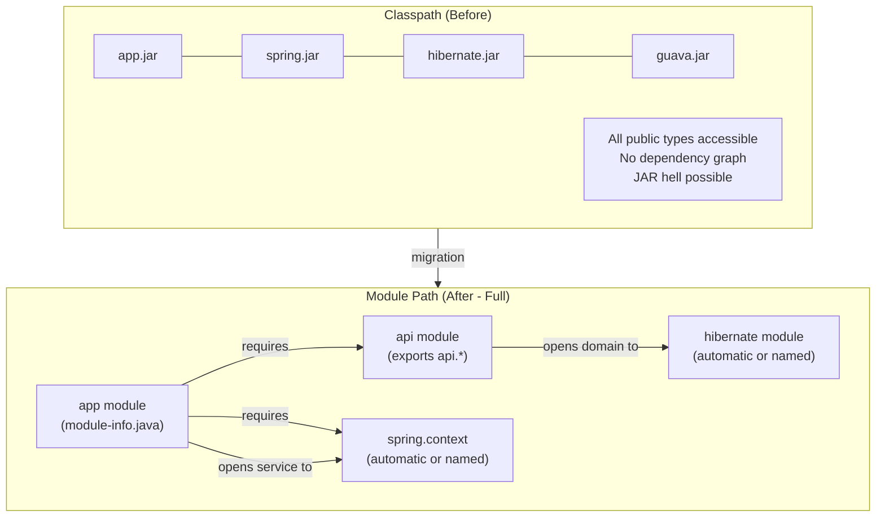

# Java Language - L5 JPMS Architecture

## JPMS Migration: Classpath to Module Path Architecture

### 🎯 Model Answer

**30 seconds:**
> JPMS migration: move JARs from `--class-path` to `--module-path` and add `module-info.java`.
> Key challenge: split packages (same package in multiple JARs), automatic modules (JAR on
> module-path without `module-info.java`), and framework reflection (Spring, Hibernate need `opens`).
> Most applications stay on classpath; only library authors and jlink users need full migration.

**3 minutes (Senior):**
> Classpath vs module-path architecture:
>
> 1. **Classpath model**: flat class lookup. All JARs on classpath: every public class is accessible.
>    No explicit dependency graph at the JVM level. Missing JAR: `ClassNotFoundException` at
>    first use (runtime, potentially late). Duplicate class: first-on-classpath wins (silent).
>
> 2. **Module path model**: named modules form a directed acyclic graph. The JVM resolves
>    the graph at startup: missing module = `LayerInstantiationException` at startup. Duplicate
>    package in two modules: fails at startup. Unreachable package: `InaccessibleObjectException`
>    at the first reflective access.
>
> 3. **Migration strategies**: (a) keep everything on classpath, update JVM args (`--add-opens`
>    for frameworks). (b) Move only your code to named modules; leave dependencies as automatic
>    modules on the module path. (c) Full migration: all modules named, all dependencies have
>    `module-info.java`.
>
> 4. **Split package resolution**: same package in two JARs = blocked in module system.
>    Detection: `jdeps` or `java` startup error. Fix: exclude one JAR, use shading (rename
>    packages), or find the merged version.
>
> 5. **jlink architecture**: the end goal of full migration. Only named modules qualify for
>    jlink. Custom JRE: `$JAVA_HOME/jmods` + your application modules = minimal deployable JRE.
>    Docker images: 60-100MB instead of 250-350MB JDK base image.

**Blank Mind Recovery:**

**(1) Restate:** "Classpath = flat, all accessible. Module path = explicit graph, resolved at startup.
Split package = blocker, must deduplicate. Automatic modules = bridge for JARs without module-info.
Full migration = all named modules + jlink. Most apps: stay on classpath + --add-opens."

**(2) First principles:** "The classpath model was designed for single-developer projects in 1996.
JPMS was designed for the JDK platform to decompose 4,000+ packages into manageable, encapsulated
modules. For applications: the module system is a governance tool, not a runtime requirement."

**(3) Bridge:** "Classpath is a single unorganized bookshelf: all books visible, duplicates coexist
confusingly. Module path is a library with card catalog: each section is maintained by a specific
curator, visitors must sign in at the reference desk (requires), and the restricted stacks
(non-exported packages) require librarian access (opens)."

---

### 📘 Concept Explanation

**Module resolution at startup:**
```
MODULE SYSTEM RESOLUTION ALGORITHM:

  1. Start with the root module (your application's module).
  2. Traverse 'requires' graph transitively:
     app -> requires spring.context -> requires spring.core -> ...
  3. Verify: all required modules are resolvable (on module path).
     Fail: LayerInstantiationException if any module is missing.
  4. Verify: no two modules contain the same package.
     Fail: Error: Package X in both module A and module B.
  5. Verify: access requests (exports/opens) are consistent.
  
  STARTUP FAILURE (FAST FAIL - BENEFIT):
  java.lang.module.FindException: Module com.example.lib not found
  -> at startup, not at first use. Immediate fail vs silent ClassNotFoundException.
  
  CLASSPATH FAILURE (SLOW FAIL - RISK):
  java.lang.ClassNotFoundException: com.example.lib.SomeClass
  -> at the moment the class is first loaded (could be minutes/hours into runtime)

LAYER ARCHITECTURE:

  Boot Layer: JDK modules (java.base, java.sql, etc.) - resolved first
  Platform Layer: JDK extension modules (jdk.net, jdk.management, etc.)
  App Layer: your application modules + named third-party modules
  
  Code in a higher layer can access modules in lower layers (if exported).
  Custom layers possible: OSGi-like hot-swap, test isolation.
  Most applications: single app layer + boot layer.

MIGRATION STRATEGIES IN DETAIL:

  STRATEGY A: CLASSPATH ONLY (NO MIGRATION)
  - All JARs on --class-path
  - No module-info.java in application code
  - JVM runs in "unnamed module" mode
  - All public types accessible (no encapsulation)
  - Frameworks (Spring, Hibernate) work unchanged
  - No jlink possible
  - WHEN TO USE: all cases where jlink is not needed

  STRATEGY B: AUTOMATIC MODULES (PARTIAL MIGRATION)
  - Your JARs: on --module-path, with module-info.java
  - Dependencies: on --module-path, without module-info.java (automatic)
  - module-info.java uses automatic module names:
    requires guava; // guava-32.0.0-jre.jar on module path
  - Unstable: if guava JAR filename changes, module name changes
  - Better: wait for dependencies to add Automatic-Module-Name to MANIFEST.MF
  - WHEN TO USE: when enforcing boundaries within YOUR code only

  STRATEGY C: FULL NAMED MODULES
  - ALL JARs on module-path, ALL have module-info.java
  - Maximum encapsulation
  - jlink eligible
  - Requires: all dependencies modularized (or automatic modules)
  - opens declarations for every framework-accessed package
  - WHEN TO USE: library authors, jlink containers, platform components

CLASSPATH + MODULE-PATH MIXED:
  java \
    --module-path mods/mylib.jar \
    --class-path libs/guava.jar:libs/jackson.jar \
    -m com.example.app/com.example.Main
  
  -- The named module (mylib.jar) reads all classpath code via unnamed module.
  -- Classpath code can access exports of mylib.jar.
  -- Not recommended for production: complexity without full encapsulation benefit.
```

---

### 💻 Code Example

> **Code walkthrough:** The multi-module build shows how a real project migrates: the `api` module
> is fully named (has `module-info.java` with `exports`). The `impl` module is named with
> `opens` declarations for Spring. The `app` module uses `ServiceLoader` to decouple from impl.
> The build.gradle shows how Gradle handles the module path automatically.

```java
// SPLIT PACKAGE DETECTION AND RESOLUTION:

// BAD: split package error at startup:
// javax.annotation is in BOTH:
//   jsr305-3.0.2.jar (com.google.code.findbugs)
//   javax.annotation-api-1.3.2.jar (javax.annotation)
// Both contain package: javax.annotation
//
// Result: Error occurred during initialization of boot layer
//   java.lang.LayerInstantiationException: Package javax.annotation
//   in both module findbugs and module javax.annotation.api

// GOOD: exclude one:
// pom.xml (Maven):
<dependency>
    <groupId>com.google.guava</groupId>
    <artifactId>guava</artifactId>
    <version>32.0.0-jre</version>
    <exclusions>
        <exclusion>
            <groupId>com.google.code.findbugs</groupId>
            <artifactId>jsr305</artifactId>
        </exclusion>
    </exclusions>
</dependency>
// Use only javax.annotation-api (or Jakarta Annotation API for Java 17+)

// ---

// MULTI-MODULE GRADLE PROJECT:
// settings.gradle:
rootProject.name = "myapp"
include "api", "impl", "app"

// api/build.gradle:
plugins { id("java-library") }
// (no extra config needed for a simple library module)

// impl/build.gradle:
plugins { id("java-library") }
dependencies {
    implementation(project(":api"))
    implementation("org.springframework.boot:spring-boot-starter:3.2.0")
    // Spring Boot: automatically uses virtual threads if Java 21 detected
}

// app/build.gradle:
plugins {
    id("java")
    id("application")
}
application {
    mainModule.set("com.example.app")  // Gradle enables module mode
    mainClass.set("com.example.app.Main")
}
dependencies {
    runtimeOnly(project(":impl")) // available at runtime for ServiceLoader
    implementation(project(":api"))
}

// ---

// OPENS DECLARATION FOR SPRING:
// impl/src/main/java/module-info.java:
module com.example.impl {
    requires com.example.api;
    requires spring.context;
    requires spring.boot;
    requires spring.boot.autoconfigure;
    
    // Spring's component scanning NEEDS access to annotations:
    opens com.example.impl.service to spring.context;
    opens com.example.impl.controller to spring.web;
    opens com.example.impl.domain to
        org.hibernate.orm.core,  // Hibernate entity access
        com.fasterxml.jackson.databind;  // JSON serialization
    
    // ServiceLoader registration:
    provides com.example.api.UserService
        with com.example.impl.service.UserServiceImpl;
}

// ---

// JLINK BUILD SCRIPT:
// build.gradle fragment:
task jlinkImage(type: Exec) {
    dependsOn(jar)
    def modules = [
        "java.base",
        "java.sql",
        "java.logging",
        "java.naming",
        "jdk.unsupported"  // required by some frameworks (Netty, etc.)
    ].join(",")
    commandLine(
        "$System.env.JAVA_HOME/bin/jlink",
        "--module-path", "$System.env.JAVA_HOME/jmods",
        "--add-modules", modules,
        "--strip-debug",
        "--compress", "2",
        "--output", "$buildDir/custom-jre"
    )
}

// Dockerfile using the custom JRE:
// FROM ubuntu:22.04
// COPY build/custom-jre /opt/jre
// COPY build/libs/app.jar /app/app.jar
// ENTRYPOINT ["/opt/jre/bin/java", "-jar", "/app/app.jar"]
```

> **Code walkthrough:** The split package solution (exclude conflicting JARs) is the first
> unblocking step for any JPMS migration. The `opens` declarations in `module-info.java` are
> required for every package where Spring, Hibernate, or Jackson needs to reflect (entity classes,
> controllers, services). The jlink Gradle task shows how to automate the custom JRE creation
> as a build artifact. The multi-module Gradle setup with `mainModule.set()` enables Gradle's
> module path mode, where modules are automatically placed on `--module-path` instead of `--classpath`.

---

### 🎓 Answers by Seniority

**Junior / Mid (0-5 years):**
> Module path: JARs with `module-info.java`. Classpath: JARs without. Most apps: classpath only
> (no migration needed). Split package: same package in two JARs = startup error, fix with
> Maven exclusion. `opens` = required for Spring/Hibernate reflection. Automatic modules: JARs on
> module path without `module-info.java`.

---

**Senior / Staff (5+ years):**
> Migration decision framework: (1) Do you need jlink? -> full module migration needed.
> (2) Do you need architectural enforcement (forbidden dependency checks)?
> -> named modules OR ArchUnit/jdepend analysis (less invasive). (3) Just Java 17+ compatibility?
> -> stay on classpath + update --add-opens. The module system as a governance tool: use
> `requires` to enforce which modules can depend on which. ArchUnit (`@AnalyzeClasses(packages = ...)`)
> achieves similar goals without module-info.java complexity.

---

### ⚠️ Common Misconceptions

**Misconception 1: "You must migrate to modules when upgrading to Java 17+."**
Java 17+ runs classpath code perfectly. JPMS is opt-in. Every application from Java 8 that runs
on the unnamed module (classpath) continues to work on Java 17+ with `--add-opens` flags for
frameworks. The ONLY reason to migrate to named modules: (1) jlink for minimal JRE, (2) explicit
dependency governance, (3) library authorship. Applications that want just the JVM improvements
(GC, performance, virtual threads): no module migration needed.

**Misconception 2: "Once you're on named modules, all your framework dependencies must also be named modules."**
Automatic modules bridge the gap: a JAR on the module path without `module-info.java` becomes
an automatic module (named after its JAR filename). Your named module can `requires guava` even
if Guava has no `module-info.java`. Automatic modules export all packages and read all other modules,
so framework JARs (Spring, Hibernate) can be on the module path as automatic modules and still
work. The limitation: automatic module names are JAR-filename-derived (fragile on version upgrade)
until the library adds `Automatic-Module-Name` to MANIFEST.MF.

---

### 🚨 Failure Modes and Diagnosis

**Failure: Module migration fails at startup with Layer initialization error.**
```
Symptom: Moving application JARs to --module-path causes:
  Error occurred during initialization of boot layer
  java.lang.module.FindException: Module some.module not found,
    required by com.example.app

Root cause:
  A 'requires some.module' in module-info.java refers to a module not
  on the module path. Either:
  1. The JAR for that module was left on --class-path instead of --module-path
  2. The module name in 'requires' doesn't match the actual module name
     (e.g., 'requires guava' but guava JAR doesn't have Automatic-Module-Name: guava)
  3. The JAR is not in the module path at all (missing dependency)

Diagnosis:
  java --show-module-resolution -m com.example.app/com.example.Main 2>&1
  Output: reads    com.example.app            ...
          reads    java.base                  ...
          Error: Module guava.32.0.0.jre not found   <- wrong auto name
  
  Fix A: check the actual automatic module name for the JAR:
    jar --describe-module --file guava-32.0.0-jre.jar
    Output:
      No module descriptor found. Derived automatic module.
      guava.32.0.0.jre@32.0.0 automatic   <- THIS is the auto module name
      requires java.base
    
    In module-info.java, use the EXACT derived name:
      requires guava.32.0.0.jre;  // BAD: changes every version
    Better: request Guava to add Automatic-Module-Name=com.google.common to MANIFEST.MF
    Or: wait for Guava's module-info.java (planned)
    Or: keep Guava on --class-path (automatic module only if on --module-path)
  
  Fix B: ensure the JAR is on --module-path:
    java --module-path mods:libs \
         --class-path other-classpath-jars \
         -m com.example.app/...
  
  Fix C: use requires static for optional dependencies:
    requires static optional.library;
    // If not on module path at runtime: OK (optional)

Split package failure:
  Error: Package javax.annotation in both module java.annotation and module jsr305
  
  Diagnosis: find which JARs contain the same package:
    for jar in *.jar; do
      jar tf $jar | grep "javax/annotation" && echo "  ^ in $jar"
    done
  
  Fix: Maven exclusion to keep only one:
    <exclusion><groupId>com.google.code.findbugs</groupId><artifactId>jsr305</artifactId></exclusion>
```

---

### 🎯 Interview Deep-Dive

| Question Category | Time to Answer |
|---|---|
| Module resolution algorithm | 2 minutes |
| Classpath vs module path trade-offs | 2 minutes |
| Split package detection and fix | 2 minutes |
| Automatic module naming pitfalls | 2 minutes |
| Opens declaration strategy | 2 minutes |
| jlink prerequisites and workflow | 2 minutes |
| ArchUnit vs module system | 2 minutes |
| Layer architecture | 2 minutes |
| Multi-module Gradle/Maven configuration | 2 minutes |
| Decision: when to migrate | 2 minutes |
| Module layer for test isolation | 1 minute |
| Security implications of JPMS | 1 minute |

---

**Q1 (resolution): Walk through the JPMS module resolution algorithm.**

A: Resolution starts with the root module (your application's module). The JVM reads its `requires`
declarations and finds those modules on the module path. For each found module: reads its `requires`
and recurses. This builds the "module graph." Verification: (1) every required module exists.
(2) no two modules in the graph export the same package ("split package" check). (3) for every access
in the graph (X accesses Y.Z): Y exports Z and X requires Y. All verifications happen at startup.
Any failure: `Error occurred during initialization of boot layer`.

*What separates good from great:* The "resolution at startup" guarantee is a significant reliability
improvement over the classpath. In a complex classpath application: a missing JAR is discovered only
when the code path that needs it executes (potentially hours into operation). With JPMS: missing
modules are detected immediately (the JVM fails to start). This moves the failure from "production
runtime error" to "pre-traffic startup failure" which is caught by health checks in Kubernetes.
For microservices with `readinessProbe`: a module resolution failure shows as "pod never becomes
ready" (visible to ops) rather than "pod serving errors" (visible to users).

---

**Q2 (tradeoffs): When does the classpath model fail and when does the module model fail?**

A: Classpath failures: (1) missing JAR: `ClassNotFoundException` at first use (runtime, not startup).
(2) conflicting class versions: "JAR hell" - the wrong version is loaded, behavior is incorrect, often
no exception just wrong results. (3) no encapsulation: any code can access any public class, architectural
boundaries are advisory (enforced only by code review). Module path failures: (1) any setup error
(split package, missing module): startup fails (not runtime). (2) accessing a non-exported package:
`InaccessibleObjectException` (immediate, not silent). (3) higher upfront configuration complexity
(every `requires`, every `exports` must be explicit).

*What separates good from great:* The "JAR hell" problem: classpath applications with many
dependencies often have conflicting transitive versions. Maven/Gradle resolve to a single version,
but the "winning" version may be incompatible with some caller. This is a classpath problem that
JPMS does NOT solve (the module system doesn't allow multiple versions of the same module in the
same layer). The REAL solution to JAR hell: OSGi (allows multiple versions of the same module in
different bundles) or native image (the build-time linking selects one version definitively). JPMS
improves the detection of access violations but doesn't resolve the version conflict problem.

---

**Q3 (split): How do you systematically detect and fix all split packages in a large dependency tree?**

A: Detection tool 1: `jdeps --check <module_name>` on all module path JARs. Detection tool 2:
`mvn dependency:tree` + grep for duplicate GroupId/ArtifactId patterns. Detection tool 3: run the
application with `--module-path` and observe `LayerInstantiationException` messages. Fix strategy:
(1) for `javax.*` packages: the JDK 9+ removed JavaEE modules. Add `jakarta.xml.bind-api` instead
of `jaxb-api`. Exclude conflicting standalone JARs. (2) For `org.jboss.logging` appearing in both
Hibernate and a separate JAR: exclude the standalone, let Hibernate own it. (3) For `javax.annotation`
split: choose ONE provider (jakarta.annotation-api or javax.annotation-api), exclude the other.

*What separates good from great:* The `javax.` -> `jakarta.` split (Spring Boot 3.x era):
Java EE packages (`javax.servlet`, `javax.persistence`, `javax.annotation`) were renamed to
`jakarta.*` in Jakarta EE 9+. Spring Boot 3.x requires Jakarta versions. In a JPMS context:
`javax.servlet` might be in both `java.servlet` (old JEE) and `jakarta.servlet` (new). These
are DIFFERENT packages (different namespace), so no split package error, but the code using
`javax.servlet` won't compile against Jakarta APIs. The migration: find-and-replace all
`javax.servlet` -> `jakarta.servlet`, `javax.persistence` -> `jakarta.persistence`, etc.
OpenRewrite recipes automate this.

---

**Q4 (automatic naming): What are the risks of relying on automatic module names?**

A: Automatic module name is derived from JAR filename by: removing the `.jar` suffix, converting
groups of non-alphanumeric chars to dots, removing leading/trailing dots. `guava-32.0.0-jre.jar` ->
`guava.32.0.0.jre`. If the JAR version changes to 33.0.0: module name changes to `guava.33.0.0.jre`.
Your `module-info.java` says `requires guava.32.0.0.jre` -> COMPILE ERROR after version bump.
Fix: the library should add `Automatic-Module-Name: com.google.guava` to MANIFEST.MF. Then the
name is stable regardless of filename.

*What separates good from great:* Checking the Automatic-Module-Name: `jar --describe-module --file guava-32.jar`.
If the output says `com.google.guava automatic` (not derived from filename): it's stable. If it says
`guava.32.0.0.jre automatic`: it's fragile. In practice: most major libraries added `Automatic-Module-Name`
after Java 9's release. Check the JAR's MANIFEST.MF: `unzip -p guava.jar META-INF/MANIFEST.MF | grep Automatic-Module-Name`.
For internal company JARs: add `Automatic-Module-Name: com.company.libraryname` to your build's MANIFEST.MF
configuration before anyone writes a `requires` for your JAR.

---

**Q5 (opens strategy): How do you determine which packages need `opens` for a Spring Boot application?**

A: Systematic approach: (1) Add `module-info.java` with only `requires` (no `opens`). Run the application.
(2) Collect all `InaccessibleObjectException` and `ExceptionInInitializerError` messages - each identifies
a package that needs `opens`. (3) Add `opens com.example.affected.package` and retry. Repeat until clean.
More efficient: know the standard set - `opens` is needed for every package containing:
`@Component`, `@Service`, `@Repository`, `@Controller`: Spring needs reflection for injection.
`@Entity`, `@MappedSuperclass`: Hibernate needs field-level reflection.
`@JsonProperty` fields or POJO fields for Jackson serialization.

*What separates good from great:* Qualified vs unqualified opens: `opens com.example.domain` (to all)
vs `opens com.example.domain to org.hibernate.orm.core` (to Hibernate only). The qualified form is
more secure but more fragile (if you add Spring Data or another framework that also needs access,
you must update the `opens` declaration). For most applications: unqualified `opens` for application
packages is acceptable (these are YOUR packages, not JDK internals). Qualified `opens`: more valuable
when you want strict control over which frameworks can access which packages (e.g., preventing an
added test library from reflecting on production entity classes).

---

**Q6 (jlink prerequisites): What are the full prerequisites for using jlink to create a custom JRE?**

A: Prerequisites: (1) ALL application JARs must be named modules (on module path, with `module-info.java`).
jlink cannot include automatic modules or unnamed module code. (2) The `$JAVA_HOME/jmods` directory
must be present (JDK, not JRE). (3) The module graph must be fully resolvable (no split packages,
no missing modules). (4) `jdeps --list-deps` accurately identifies all required JDK modules.
Steps: `jdeps` -> get module list -> `jlink --add-modules <list> --output /custom-jre`.

*What separates good from great:* The jlink limitation with Spring Boot fat JARs: jlink requires
named modules, but Spring Boot's fat JAR packages everything into the unnamed module context.
Solution: use the Spring Boot "thin launcher" or Gradle/Maven's layered JARs + jlink. Alternatively:
use GraalVM native image (which achieves even smaller sizes without requiring full JPMS migration,
but with different trade-offs: AOT compilation, reflection configuration, slower build). The
pragmatic choice in 2024: GraalVM native image for serverless/functions (startup matters), layered
JAR + JRE base image for long-running services (complexity vs size trade-off). Full jlink: ideal
for embedded/edge deployments where image size is critical and full AOT is not desired.

---

**Q7 (archunit): How does ArchUnit compare to JPMS for enforcing architectural boundaries?**

A: ArchUnit: a library for unit-testing architecture rules (`classes that reside in "..service.." should only be accessed by "..controller.." or "..service.."`). Runs as part of the test suite. No module-info.java needed. Catches violations at test time (CI). JPMS: enforces at compile time and runtime. Hard boundaries (non-exported package: actual compiler error). ArchUnit: advisory (violations = test failures, not compilation errors). ArchUnit advantage: works on the classpath, no migration required. JPMS advantage: compiler-enforced (can't be accidentally bypassed by a developer).

*What separates good from great:* The typical team decision: ArchUnit for large teams where layer
separation (hexagonal architecture, ports-and-adapters) must be enforced. Zero migration overhead.
Violations visible in PR pipeline. JPMS for teams that own JARs used by other teams (library
authors): hard encapsulation prevents others from depending on implementation details. For a
monolith: ArchUnit is typically better (easy to add, no migration pain). For a published library
or platform component: JPMS is better (strong guarantee, not test-dependent). The two can be
combined: JPMS for between-module boundaries, ArchUnit for within-module layer rules.

---

**Q8 (layer): What is a module layer and how can you use multiple layers?**

A: `ModuleLayer`: a container for a set of modules resolved from a module path. The boot layer
(created at JVM startup) contains: `java.base` and all modules specified via `--module-path`. Custom
layers: created programmatically via `ModuleLayer.defineModulesWithOneLoader(configuration, ...)`.
Use cases: (1) plugin systems: load plugin JARs in isolated layers (plugins can't access each other's
internals). (2) Test isolation: test modules loaded in a separate layer from production modules.
(3) Application server: each deployment (WAR) in its own layer (like OSGi bundles).

*What separates good from great:* The plugin architecture use case: `ModuleLayer` is the formal
Java replacement for the old URLClassLoader-based plugin system. Each plugin is a module in its
own layer. The plugin's `requires` can only access the host's exported API (defined in a
"plugin API" module at the bottom of the layer stack). Plugins cannot access each other. The host
application can unload a layer (and its plugins) by discarding the layer reference (GC-able).
This is more structured than the old ClassLoader plugin pattern and avoids the "ClassLoader leak"
issues that plague long-running servers with hot-deployed plugins.

---

**Q9 (build): How do Maven and Gradle handle the module path for a named module project?**

A: Maven: `maven-compiler-plugin` with `release=17` compiles named modules on the module path.
The `moditect-maven-plugin` helps with JPMS-related operations (adding module-info.java to JARs).
Gradle: `application` plugin with `mainModule.set("com.example.app")` enables module mode.
In module mode: dependencies with `module-info.java` go to `--module-path`; others go to
`--class-path`. Both tools: automatically handle the `--module-path` vs `--class-path` placement
based on whether the JAR has a `module-info.java`.

*What separates good from great:* The `--patch-module` option for testing: unit tests often
can't be in a separate named module (they test package-private internals). The solution: patch
the module with test classes using `--patch-module com.example.module=src/test/java`.
Maven Surefire 2.22.2+: adds `--patch-module` automatically for tests. Gradle: requires explicit
`jvmArgs` configuration. An alternative: keep tests in the unnamed module (classpath) and use
`--add-reads mymodule=ALL-UNNAMED` to allow the test runner to access the module's types.
This is the pragmatic approach for teams that don't want to deal with test module configuration.

---

**Q10 (decision): Walk through the decision framework for whether to migrate an application to JPMS.**

A: Decision tree: (1) Is the application a LIBRARY used by other teams? If yes: add `module-info.java`
(encapsulation benefit for callers). (2) Is Docker image size critical? If yes: consider jlink
(requires full migration). (3) Is startup time critical? If yes: consider GraalVM native image
instead (better than jlink). (4) Does the team have architectural boundary enforcement needs?
If yes: ArchUnit first (easier), JPMS later if hard enforcement is needed. (5) Is the only
goal Java 17+ compatibility? If yes: stay on classpath, no migration needed.

*What separates good from great:* The cost-benefit reality in 2024: most production Spring Boot
applications are NOT using JPMS named modules and are NOT planning to. The reasons: (1) framework
complexity - every annotated class package needs `opens`, (2) transitive dependency management
(split packages, automatic module name fragility), (3) no significant runtime performance benefit
from JPMS (the benefit is structural/organizational, not performance). The teams that DO benefit:
(a) library/SDK authors (encapsulation is their product), (b) teams building embedded/edge devices
(jlink for minimal JRE), (c) teams with strict inter-team API contracts (module boundaries as
formal contract). For the 95% of application developers: Java 21 + classpath + layered JARs + virtual
threads is the right architecture.

---

**Q11 (test isolation): How do you test a named module application without the module system blocking test access?**

A: Three options: (1) `--add-opens mymodule/com.example.pkg=ALL-UNNAMED` in test JVM args (allows
test framework reflection). (2) `--patch-module com.example.mymodule=src/test/java` (patch the module
with test classes, which then have module-internal access). (3) Keep tests in the unnamed module
(classpath) and use `--add-reads mymodule=ALL-UNNAMED`. Option 3 is simplest: most test frameworks
(JUnit 5, Mockito) work on the classpath, tests can call module-exported methods directly.

*What separates good from great:* The `--patch-module` approach has a secondary benefit: test classes
in the same module have access to package-private classes (which `--add-opens` doesn't provide for
package-private access, only for reflective access). True "white box" testing (accessing internals):
requires `--patch-module` or placing tests in the same module. Mockito 5.x with ByteBuddy: uses
the module's `--add-opens` or the `jdk.proxy` module to create proxies for classes in named modules.
The `mockito-module-opener` artifact automates this for common cases.

---

**Q12 (security): How does JPMS improve the security posture of an application?**

A: JPMS encapsulation prevents: (1) accidental use of internal APIs (prevent dependency on
implementation details that may change), (2) malicious code in one module accessing another module's
private data (if properly open/exports configured). Specific benefit: `opens` for reflection is
explicit and auditable. An audit can grep for `opens` declarations to find all packages accessible
via reflection (previously: ANY class was accessible via `setAccessible` with no audit trail).

*What separates good from great:* The `opens` audit value: in a security-reviewed codebase, `opens`
declarations are a security artifact. If an entity class has `opens com.example.domain to org.hibernate.orm.core`:
only Hibernate can reflect on it. An attacker who gains code execution in the unnamed module context
CANNOT reflect on `com.example.domain` classes (if the module is not opened to them). This is a
meaningful improvement over the classpath world where any code can reflect on any class. The
caveat: this protection only applies when the malicious code is in a DIFFERENT named module. If
the malicious code runs in the unnamed module (which reads all modules): `--add-opens` flags in
startup may have already opened everything. The security benefit is maximized when ALL code is
in named modules with minimal, audited `opens` declarations.

---

### ⚖️ Comparison Table

| Approach | Encapsulation | jlink | Framework Compat | Migration Effort | Recommended For |
|---|---|---|---|---|---|
| Classpath only | None | No | Full (no changes) | Zero | All apps (default) |
| Automatic modules | None (auto exports all) | No | Full (if MANIFEST.MF names are stable) | Low | Gradual migration |
| Named modules (partial) | Medium | No | Needs opens | High | Libraries |
| Named modules (full) | Strong | Yes | Needs opens | Very High | Platform/SDK |
| GraalVM native | Strong (AOT linked) | N/A | Needs reflection config | Medium-High | Serverless, containers |

---

### 🏛️ System Design

**Classpath to Module Path Migration Architecture:**

```
ASCII:
  BEFORE (Classpath):
  [app.jar] [spring.jar] [hibernate.jar] [guava.jar]
      All on --class-path
      All public types accessible
      No explicit dependency graph
      JAR hell: version conflicts silent
  
  AFTER (Module Path - Hybrid):
  Module Path:         Classpath:
  [app.jar]           [spring.jar (auto)]
  [api.jar]           [hibernate.jar (auto)]
  module-info.java    [guava.jar]
  requires api;       All still accessible via
  opens *.domain;     unnamed module
  
  FULL MODULE PATH:
  [app mod] -> requires -> [api mod] -> requires -> [spring.context mod]
      |                                                  |
      +---> opens *.domain -------> [hibernate mod]   <-+
  
  All: named modules, module-info.java, jlink-eligible
```



> **Diagram walkthrough:** The before/after shows the fundamental structural change: from a flat
> unordered collection (classpath) to a directed acyclic graph (module path). The `requires`
> arrows make the dependency graph explicit and checked at startup. The `opens` annotations
> are the permission grants for reflection. The hybrid approach (right column "after") shows
> the realistic intermediate state: your named modules on the module path, third-party
> dependencies still on the classpath as automatic modules.

---

### 📊 Diagram

*(Omit: Module architecture shown in System Design section above.)*
