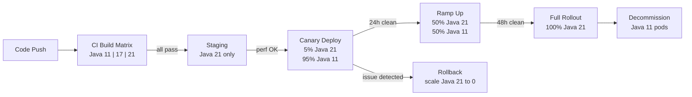

# Java Language - L5 Language Version Strategy

## Java Version Upgrade Strategy: 8 to 21 LTS Migration

### 🎯 Model Answer

**30 seconds:**
> Java LTS release cycle: Java 8 (2014), 11 (2018), 17 (2021), 21 (2023). Each 3 years.
> Migration strategy: compile on target JDK + fix deprecations, then tackle JPMS and illegal access,
> then adopt new language features incrementally. Critical gotchas: `--illegal-access` removed in 17,
> GC changes (G1 default since 9), split packages block JPMS. Spring Boot 3.x requires Java 17+.

**3 minutes (Senior):**
> Multi-phase migration from Java 8 to 21:
>
> **Phase 1 (Assess):** compile codebase with JDK 11/17/21 without code changes, run tests.
> Find all compilation errors (removed APIs, deprecated usages). Use `jdeps --jdk-internals` to
> find usage of internal JDK APIs (sun.misc.*, com.sun.*).
>
> **Phase 2 (Runtime compat):** run on new JVM with `--illegal-access=warn` (Java 11). The warnings
> tell you which libraries use internal APIs. Update those libraries. Key: Hibernate, Spring, Lombok,
> Jackson must all be version-updated together (they have Java 17-specific releases).
>
> **Phase 3 (Language features):** after the JVM runs correctly, adopt new language features
> incrementally. Records for DTOs, sealed classes for type-safe APIs, pattern matching to remove casts,
> text blocks for SQL/JSON. Don't big-bang adopt all features at once.
>
> **Phase 4 (JVM optimization):** G1 GC (default since 9) - review GC flags (`-XX:+UseG1GC` now
> redundant). ZGC/Shenandoah for latency-sensitive apps. Newer JVM defaults (e.g., `-server` is
> always on, many GC flags removed). Virtual threads: final step (Java 21 feature).
>
> **Gotchas:** split packages block migration; multiple JARs contributing to same package must be
> deduplicated. `sun.reflect.*` removed in 17. `java.security.*` API changes. String concatenation
> improvement (invokedynamic). Many reflection-heavy frameworks (Lombok, AspectJ, ByteBuddy) need
> specific version upgrades.

**Blank Mind Recovery:**

**(1) Restate:** "Java 8 -> 11 -> 17 -> 21 LTS path. jdeps for internal API usage. --illegal-access=warn to find library issues. Update Hibernate, Spring, Lombok, Jackson together. Phase: compile, runtime, features, JVM tuning. Big risk: removed APIs, --illegal-access gone in 17."

**(2) First principles:** "Java maintains backward source and binary compatibility within major versions. But the module system (Java 9+) enforces access restrictions that BREAK code using internal APIs. The migration challenge: years of code that depended on informal access to JDK internals now needs formal alternatives."

**(3) Bridge:** "Migrating Java versions is like renovating a building while people live in it. You can upgrade the wiring (JVM improvements) without touching the walls (application code). But if the old wiring runs through walls that are now structural (JPMS module boundaries), you need a plan to reroute."

---

### 📘 Concept Explanation

**Java LTS release timeline and key changes per version:**
```
LTS VERSIONS AND CRITICAL CHANGES:

  Java 8 (2014, LTS, EOL community 2030):
    - Lambda, Streams, Optional
    - Default methods in interfaces
    - java.time (JSR-310)
    - Nashorn JS engine (removed in 15)
    - PermGen removed (Metaspace in 7/8)
    - No module system (flat classpath)

  Java 11 (2018, LTS):
    - Local-variable type inference: var (Java 10)
    - HTTP Client API (java.net.http)
    - String methods: strip(), isBlank(), lines()
    - Files.readString(), Files.writeString()
    - Applet API removed (Java 11)
    - JavaEE and CORBA modules removed (javax.xml.bind, etc.)
    - JEP 320: Remove the Java EE and CORBA Modules
    - --illegal-access=permit (warnings default)
    - G1 GC: default (was Parallel GC on Java 8)
    - ZGC: experimental

  Java 17 (2021, LTS):
    - Sealed classes (final)
    - Pattern matching instanceof (final)
    - Records (final - preview in 14-15, standard in 16)
    - Text blocks (final - preview in 13-14, standard in 15)
    - Switch expressions (final - preview in 12-13, standard in 14)
    - --illegal-access option REMOVED (was deprecated in 16)
    - JDK internals strongly encapsulated (breaks more reflection)
    - Strong random seeding (SecureRandom improvements)
    - Removal of experimental AOT/JIT compiler (Graal still via GraalVM)
    - Spring Boot 3.x requires Java 17+

  Java 21 (2023, LTS):
    - Virtual threads (final - JEP 444)
    - Sequenced collections (List/Set/Map ordering)
    - Record patterns (final)
    - Pattern matching in switch (final)
    - Structured concurrency (preview)
    - ScopedValue (preview)
    - String Templates (preview - standardized later)
    - Generational ZGC (default)

KEY REMOVALS BY VERSION:
  Java 9-11: JavaEE modules (javax.xml.bind, javax.annotation, etc.)
             RMI activation, CORBA
             java.awt.peer internals
  Java 11:   Applets, Browser plugin
  Java 14:   Nashorn JavaScript engine (deprecated 11, removed 15)
  Java 16:   --illegal-access=permit deprecated
  Java 17:   --illegal-access option removed entirely
             sun.misc.Unsafe.invokeCleaner -> use Cleaner API
  Java 21:   No major removals
```

---

### 💻 Code Example

> **Code walkthrough:** The migration script shows the real workflow: use jdeps to find internal
> API usage, then systematically address each finding. The "before and after" code examples show
> common migration patterns: javax.xml.bind (removed in 9), ThreadLocal removal, and the new
> switch expressions replacing if-else chains.

```java
// JAVA 8 CODE THAT BREAKS ON JAVA 17:

// BAD: javax.xml.bind (removed in Java 11 by JEP 320):
import javax.xml.bind.DatatypeConverter;

String base64 = DatatypeConverter.printBase64Binary(bytes);  // Java 11: NoClassDefFoundError

// GOOD: replacement (Java 8+ standard library):
import java.util.Base64;
String base64 = Base64.getEncoder().encodeToString(bytes);

// ---

// BAD: sun.misc.BASE64Encoder (internal API):
sun.misc.BASE64Encoder encoder = new sun.misc.BASE64Encoder();
String b64 = encoder.encode(bytes);  // Java 9+: compilation warning/error

// GOOD: Java 8+ standard library:
String b64 = Base64.getEncoder().encodeToString(bytes);

// ---

// BAD: Java 8 date/calendar (no direct removal, but outdated):
Date now = new Date();
Calendar cal = Calendar.getInstance();

// GOOD: java.time (Java 8+):
LocalDateTime now = LocalDateTime.now();
ZonedDateTime zdt = ZonedDateTime.now(ZoneId.of("America/New_York"));

// ---

// JAVA 9 - 17 LANGUAGE UPGRADES (adopt incrementally):

// OLD (Java 8 DTO):
public class UserDTO {
    private final Long id;
    private final String name;
    
    public UserDTO(Long id, String name) {
        this.id = id;
        this.name = name;
    }
    public Long getId() { return id; }
    public String getName() { return name; }
    @Override public boolean equals(Object o) { /* boilerplate */ }
    @Override public int hashCode() { /* boilerplate */ }
    @Override public String toString() { /* boilerplate */ }
}

// NEW (Java 16 Record):
public record UserDTO(Long id, String name) {}
// Compiler generates: constructor, getters (id(), name()), equals, hashCode, toString

// ---

// OLD (Java 8 type check + cast):
Object obj = getShape();
if (obj instanceof Circle) {
    Circle c = (Circle) obj;
    area = Math.PI * c.getRadius() * c.getRadius();
} else if (obj instanceof Rectangle) {
    Rectangle r = (Rectangle) obj;
    area = r.getWidth() * r.getHeight();
}

// NEW (Java 21 pattern matching in switch):
double area = switch (getShape()) {
    case Circle c    -> Math.PI * c.radius() * c.radius();
    case Rectangle r -> r.width() * r.height();
    default          -> throw new IllegalArgumentException("Unknown shape");
};

// ---

// OLD (Java 8 string formatting for SQL/JSON):
String sql = "SELECT u.id, u.name\n" +
             "FROM users u\n" +
             "WHERE u.active = true\n" +
             "  AND u.created_at > '" + date + "'";

// NEW (Java 15 Text Block):
String sql = """
        SELECT u.id, u.name
        FROM users u
        WHERE u.active = true
          AND u.created_at > ?
        """;
// Note: use ? parameters, never string concatenation for user input in SQL!

// ---

// JDEPS COMMAND (assess before migrating):
// jdeps --jdk-internals --multi-release 9 app.jar
// Output:
// app.jar -> JDK removed internal API:
//   com.example.service (app.jar) -> com.sun.xml.bind.api.Bridge (JDK removed)
//   com.example.util (app.jar)    -> sun.misc.BASE64Encoder (JDK internal)
```

> **Code walkthrough:** The `javax.xml.bind` removal is the most common migration issue for Java
> 8 to Java 11 migrations - every app that uses JAXB for XML binding is affected. The fix:
> add the standalone `jakarta.xml.bind-api` and `jaxb-impl` Maven dependencies. The Record
> pattern shows the dramatic reduction in boilerplate: 20 lines -> 1 line, with stronger
> immutability guarantees. The text block SQL example also shows the security pattern: use `?`
> placeholders, never string concatenation (SQL injection risk).

---

### 🎓 Answers by Seniority

**Junior / Mid (0-5 years):**
> Java LTS versions: 8, 11, 17, 21. Migration: update JDK version in `pom.xml` / `build.gradle`,
> run tests, fix compilation errors. Key libraries to update: Spring Boot (3.x = Java 17+),
> Hibernate, Lombok, Jackson. Run `jdeps --jdk-internals` to find internal API usage.

---

**Senior / Staff (5+ years):**
> Migration risk ranking: (1) internal API usage (`sun.*`, `com.sun.*`) - hardest, fix with jdeps
> output + library updates, (2) split packages - remove or replace duplicate JARs, (3) reflection
> via framework versions (Hibernate 6.x, Spring 6.x, ByteBuddy 1.14+ for Java 17), (4) GC flag
> cleanup (remove G1 flags redundant after Java 9, review heap sizing for new GC defaults). Rollout:
> upgrade test environments first, use `-XX:+ShowHiddenFrames` for debugging frame-related issues,
> canary deploy to 1% traffic, compare GC pauses and memory metrics before/after.

---

### ⚠️ Common Misconceptions

**Misconception 1: "Java is always backward-compatible; migration is just bumping the version."**
Binary compatibility (compiled code runs on newer JVM): mostly true for the language subset used
by most applications. NOT true for: internal JDK API usage (`sun.*`, `com.sun.*`), removed APIs
(JavaEE modules in 11, Nashorn in 15), stricter access control (JPMS + --illegal-access). A Java 8
application compiled to bytecode: RUNS on Java 21 JVM IF it doesn't use removed/internal APIs.
Most applications: have at least one library with internal API usage. The migration work is
primarily updating those libraries.

**Misconception 2: "Adopt all new Java features immediately after upgrading."**
Feature adoption should be gradual and team-driven. Upgrading to Java 17 does NOT require using
records, sealed classes, or text blocks immediately. The JVM upgrade (runtime benefits: GC improvements,
performance) is independent from language feature adoption (code changes). Strategy: JVM upgrade
first (fast, low risk), language features over subsequent sprints (team training, refactoring).
Trying to upgrade AND refactor to records AND use pattern matching in a single sprint: high
cognitive overhead, high PR review cost, high regression risk.

---

### 🚨 Failure Modes and Diagnosis

**Failure: Java 17 upgrade breaks production with reflection errors.**
```
Symptom: Application runs fine on Java 11, fails on Java 17 with:
  java.lang.reflect.InaccessibleObjectException:
    Unable to make private ... accessible: module java.base does not 'opens java.lang'

Root cause:
  Java 11: --illegal-access=permit (reflective access allowed with WARNING)
  Java 16: --illegal-access=permit deprecated (WARN), --illegal-access=deny available
  Java 17: --illegal-access removed: ALL reflective access to unexported JDK packages BLOCKED
  
  Affected libraries (commonly): Hibernate (field injection on private fields), 
  Jackson (private field serialization), Lombok (annotation processing reflection),
  ByteBuddy/cglib (AOP proxying).

Diagnosis steps:
  Step 1: run on Java 11 with --illegal-access=warn and capture ALL warnings:
    java --illegal-access=warn -jar myapp.jar 2>&1 | grep "WARNING"
    Each warning = a potential Java 17 failure
  
  Step 2: for each warning, identify the library causing it:
    WARNING: Illegal reflective access by com.google.inject.internal.cglib... 
    -> need to upgrade Guice / cglib
    WARNING: Illegal reflective access by net.sf.cglib.proxy.Enhancer...
    -> application using old cglib directly; replace with ByteBuddy
  
  Step 3: upgrade ALL affected libraries to Java 17-compatible versions:
    - Spring Boot: 2.7+ (Java 17 support), 3.x+ (Java 17 baseline)
    - Hibernate: 5.6+ (Java 17), 6.x (canonical Java 17+ version)
    - Jackson: 2.12+ (Java 17 compatible)
    - Lombok: 1.18.20+ (Java 17 support)
    - ByteBuddy: 1.11+ (Java 17)
    - cglib: REPLACE with ByteBuddy (cglib is unmaintained, incompatible with Java 17+)
    - Mockito: 4.x+ (Java 17)
  
  Step 4: add --add-opens for any remaining issues (temporary workaround):
    --add-opens java.base/java.lang=ALL-UNNAMED
    --add-opens java.base/java.util=ALL-UNNAMED
    Track these with comments: "Remove when {library} v{version} is released"
  
  Step 5: test on Java 17 in CI BEFORE upgrading production:
    pom.xml:
      <java.version>17</java.version>
      <maven.compiler.source>17</maven.compiler.source>
      <maven.compiler.target>17</maven.compiler.target>
    CI matrix: run test suite on both Java 11 and Java 17 simultaneously

Timeline approach:
  Month 1: Java 11 in CI, identify all warnings, create dependency upgrade plan
  Month 2: Update libraries, fix warnings, verify all tests pass on Java 17
  Month 3: Deploy to staging on Java 17, canary to 5% production
  Month 4: Full production on Java 17
```

---

### 🎯 Interview Deep-Dive

| Question Category | Time to Answer |
|---|---|
| LTS release strategy | 1 minute |
| Migration phases | 2 minutes |
| jdeps and internal API detection | 2 minutes |
| --illegal-access removal impact | 2 minutes |
| Library compatibility matrix | 2 minutes |
| Language feature adoption strategy | 2 minutes |
| GC changes and flag cleanup | 2 minutes |
| JPMS in migration context | 2 minutes |
| Risk assessment framework | 2 minutes |
| Spring Boot 3 upgrade considerations | 2 minutes |
| Rollback plan | 1 minute |
| Testing strategy for Java version upgrade | 1 minute |

---

**Q1 (lts): What is the Java LTS release strategy and how should teams decide when to upgrade?**

A: Java releases a new version every 6 months (since Java 9). LTS versions (Long Term Support): receive
security and bug fixes for 3+ years (Oracle) or longer (vendor-specific: Red Hat, Azul, Amazon Corretto).
LTS versions: 8 (extended to 2030 for community), 11, 17, 21. Non-LTS: 9, 10, 12-16, 18-20, 22-...
Team strategy: stay on LTS versions, upgrade within 12-18 months of the NEXT LTS release (to let the
ecosystem (libraries, frameworks) stabilize). Currently: Java 21 is current LTS; most production
systems should be on Java 17 or 21.

*What separates good from great:* The "ecosystem lag" reality: when Java 17 released (Sep 2021),
Spring Boot 3.x didn't arrive until November 2022. Hibernate 6.x (Java 17 native): early 2023.
A team upgrading to Java 17 in early 2022 would have needed Spring Boot 2.7 (with --add-opens workarounds) for many months. The practical strategy: upgrade to a new LTS version 6-12 months AFTER the major frameworks (Spring, Hibernate, Quarkus) release their LTS-targeting versions. This reduces the number of workarounds needed. For Java 21: Spring Boot 3.2+ (released Nov 2023) is the correct companion version; virtual threads are properly supported.

---

**Q2 (phases): Walk through a production migration from Java 8 to Java 21.**

A: Phase 1 (Assessment, 1-2 weeks): run `jdeps --jdk-internals` on all JARs. Catalog all internal API usage. Update build config to compile with JDK 21 (`--release 21`). Fix compilation errors. Phase 2 (Runtime compat, 2-4 weeks): run test suite on Java 21 JVM. Find `InaccessibleObjectException` and `ClassNotFoundException`. Update libraries (Spring Boot 3.x, Hibernate 6.x, etc.). Phase 3 (Testing and CI, 1 week): CI matrix tests on Java 21 alongside Java 8/11. Fix remaining test failures. Phase 4 (Deploy, 2-4 weeks): staging on Java 21 first. Canary (5% traffic) on Java 21. Monitor GC metrics, latency, error rates. Full rollout. Phase 5 (Language features, ongoing): records, pattern matching, text blocks as new code is written. No forced refactoring.

*What separates good from great:* The phased deployment using a "shadow" approach: run both Java 8 and Java 21 instances simultaneously during migration. Send the same traffic to both, compare responses. This is expensive but validates behavior equivalence before committing to Java 21. For critical financial or healthcare systems: this shadow testing for 1-2 weeks before full cutover is standard. The GC comparison: Java 8 uses Parallel GC by default; Java 21 uses G1 GC by default. GC behavior changes can affect latency profiles significantly. Run JFR profiles on both versions under the same load to compare GC pause distributions before committing.

---

**Q3 (jdeps): How do you use jdeps to assess migration risk?**

A: `jdeps --jdk-internals --multi-release 9 myapp.jar`: shows which JDK internal classes your code (and your dependencies) use. `jdeps --ignore-missing-deps --print-module-deps myapp.jar`: shows which JDK modules your application uses (useful for jlink). `jdeps -recursive --multi-release 9 myapp.jar`: checks all transitive dependencies. Key output to watch for: `sun.misc.*`, `com.sun.*`, `sun.reflect.*`, `sun.security.*`. Each of these = a library that needs updating before Java 17.

*What separates good from great:* `jdeps` on a fat JAR: analyses all transitive dependencies in one command. But results can be noisy (many libraries show warnings for code paths never executed). Prioritization: focus on libraries whose internal-API-using code is in the hot path (annotated with frameworks that use reflection). Libraries that use internal APIs only in niche configurations (e.g., `X509Certificate` introspection in a TLS library) may be acceptable risks if that code path is not exercised. The `maven-dependency-plugin:analyze-duplicate` combined with `jdeps`: find duplicate classes (split packages) that will block JPMS use.

---

**Q4 (illegal-access): Explain the evolution of --illegal-access from Java 9 to Java 17.**

A: Java 9: `--illegal-access=permit` (default). Reflective access to non-exported JDK packages allowed, one warning per module. Java 10: same. Java 11-15: `--illegal-access=permit` default, `--illegal-access=warn/debug/deny` available. Java 16: `--illegal-access=permit` deprecated (loud warning). `--illegal-access=deny` is now what teams should test against. Java 17: `--illegal-access` option REMOVED. All illegal reflective access throws `InaccessibleObjectException`. No flag can re-enable it. This is the breaking change for most Java 8 -> 17 migrations.

*What separates good from great:* The Java 16 step was a crucial warning sign that many teams missed: the `--illegal-access=permit` deprecation warning in Java 16 was the "you have one release cycle" notification. Teams that caught this and updated their libraries in the Java 11/16 window had smooth Java 17 migrations. Teams that skipped Java 16 (went 11 -> 17 directly) were sometimes surprised. The lesson: even non-LTS releases provide valuable signals about upcoming breaking changes. Monitoring Java release notes and migration guides for each 6-month release (even without upgrading) is worth 1-2 hours per release.

---

**Q5 (libraries): Which libraries are most problematic in Java 8 to 17+ migrations?**

A: The "high risk" list: (1) cglib (used by Spring AOP, Hibernate, Mockito): unmaintained, incompatible with Java 17+ proxying limitations. Replacement: ByteBuddy (used by Spring Boot 3.x, Mockito 4.x, Hibernate 6.x). (2) Javassist (used by Hibernate 5.x, WildFly): needs version update. (3) Sun.misc.Unsafe: many low-level libraries (Kryo, Protobuf, Disruptor) use `Unsafe.allocateInstance()` or `Unsafe.objectFieldOffset()`. Most updated their usage to Unsafe methods still available in 17 or to VarHandles. (4) JAXB implementation: removed from JDK 9+ (was `javax.xml.bind`), must add as Maven dependency.

*What separates good from great:* The dependency graph visibility is the key skill: running `mvn dependency:tree | grep cglib` tells you which of YOUR dependencies transitively bring in cglib. If Spring 5.x brings cglib 3.3.x: upgrading Spring to 6.x (which uses ByteBuddy) eliminates cglib. If cglib is in your own code (unlikely but possible): replace with ByteBuddy or Javassist explicitly. The cglib -> ByteBuddy migration: ByteBuddy has a cglib-compatible API in `net.bytebuddy.ByteBuddy` but it's NOT a drop-in replacement for cglib's class names. Proxy generation code needs rewriting. In practice: this is handled by upgrading Spring Boot, not by manual ByteBuddy code.

---

**Q6 (gc): What GC changes should you be aware of when migrating from Java 8 to 17+?**

A: Java 8 default GC: Parallel GC (`-XX:+UseParallelGC`). Java 9+ default GC: G1 GC. G1 is generally better for most workloads (shorter max pause, adaptive heap), but the GC behavior difference can affect applications tuned for Parallel GC's throughput-first approach. Flags to clean up: `-XX:+UseG1GC` (now redundant on Java 9+, but harmless), `-XX:+CMSClassUnloadingEnabled`, `-XX:+UseCMSInitiatingOccupancyOnly` (CMS removed in Java 14), all CMS-related flags. ZGC (Java 21 default: Generational ZGC): ultra-low pause GC, but different throughput profile than G1.

*What separates good from great:* The GC performance comparison BEFORE migration: run both Java 8 (Parallel GC) and Java 17 (G1 GC) with the same workload and compare: average GC pause, p99 GC pause, total GC overhead (% of CPU), heap usage pattern. For throughput-sensitive batch jobs: Parallel GC on Java 8 may outperform G1 GC on Java 17 for the same workload. Fix: run Java 17 but explicitly configure Parallel GC with `-XX:+UseParallelGC` (still available). For latency-sensitive APIs: G1 or ZGC on Java 17/21 with appropriate `MaxGCPauseMillis` settings typically improves p99 latency. The recommendation: don't assume GC improvements; measure.

---

**Q7 (spring): What specifically needs to change when migrating from Spring Boot 2.x to 3.x on Java 17?**

A: Spring Boot 3.x requires Java 17 minimum. Key changes: (1) javax.* -> jakarta.* namespace migration (JEE 8 to Jakarta EE 10). Every `import javax.servlet.*` -> `import jakarta.servlet.*`. Every `javax.persistence.*` -> `jakarta.persistence.*`. This is a significant search-and-replace across the codebase. (2) Hibernate 6.x (HQL changes, type mapping). (3) Removed APIs: WebMVC's `HandlerInterceptorAdapter` -> implement `HandlerInterceptor` directly. (4) Spring Security 6.x: security config DSL changes. (5) Spring Data 3.x: some pagination changes.

*What separates good from great:* The `javax` -> `jakarta` renaming is the largest rework in Spring Boot 3.x migration. Tools: `spring-boot-migrator` (open-source tool from Spring team) automates most of the renaming via OpenRewrite recipes. `./gradlew rewrite --activeRecipe=org.openrewrite.java.spring.boot3.UpgradeSpringBoot_3_0` rewrites the import statements automatically. Remaining manual work: (1) configuration DSLs (SecurityFilterChain, WebMvcConfigurer) changed method signatures, (2) deprecated API usages that have no automatic replacement, (3) custom serializers/deserializers using Jackson 2 APIs that changed in Jackson 2.14+. The OpenRewrite-based migration is not 100% but reduces the manual effort by 80+%.

---

**Q8 (jpms migration): When does JPMS migration become necessary during a Java version upgrade?**

A: JPMS migration is NOT required for Java version upgrades. Applications running on the classpath (unnamed module) work on all Java versions including Java 21. JPMS migration becomes relevant for: (1) reducing Docker image size with jlink (requires named modules), (2) enforcing architectural boundaries in large codebases, (3) creating custom JRE distributions. Most production applications: upgrade to Java 17/21 on the classpath, gain JVM improvements (GC, performance), and never touch `module-info.java`.

*What separates good from great:* The JPMS adoption reality in the ecosystem: only a small fraction of Java applications use named modules. Most library authors have added `module-info.java` (for their users' benefit), but most APPLICATION developers still use the classpath. The `--add-opens` workarounds (required for frameworks like Spring in a named module context) are one reason. Another: the complexity of ensuring all transitive dependencies are either named modules or automatic modules. The pragmatic guidance: for containers, use layered JARs (Spring Boot's layered tools) to reduce image size without full JPMS. For applications where startup size matters: GraalVM native image (much smaller than jlink) is the modern alternative.

---

**Q9 (testing): How do you build a testing strategy for a Java version upgrade?**

A: Testing matrix: (1) unit tests on new JDK (compile + run). (2) Integration tests on new JVM. (3) Performance benchmarks (JMH) comparing old vs new JVM for critical paths. (4) Canary deployment: route 5% of traffic to new-JVM pods, compare error rate + latency. (5) Chaos: specifically test the code paths identified as risky (reflection-heavy code, XML processing, crypto). CI matrix: `java-version: [11, 17, 21]` in GitHub Actions - tests must pass on all three during migration period.

*What separates good from great:* The performance benchmark necessity: Java version upgrades can change performance in unexpected ways. String concatenation: Java 9+ uses `invokedynamic` for string concat (faster for complex cases, potentially different for simple cases). BigDecimal: implementation changed. HashMap: internal structure improved in Java 8 (tree buckets) but further optimizations in 11+. For financial applications: run `JMH` benchmarks on payment processing, order matching, or any compute-intensive path before committing. The comparison: if Java 21 is 10% slower on a critical hot loop: investigate and fix before deploying (might be a GC configuration issue or a hash collision change).

---

**Q10 (risk): How do you assess the risk of a Java version upgrade for a large legacy codebase?**

A: Risk assessment framework: (1) `jdeps --jdk-internals` score: how many unique internal API usages? Zero = low risk. 1-5 = manageable. 10+ = significant work. (2) Dependency age: run `mvn versions:display-dependency-updates`. Many outdated dependencies = higher risk (each needs a compatibility check). (3) Reflection density: grep for `.setAccessible(true)` and `getDeclaredFields()` in your own code. (4) Framework versions: Spring Boot version, Hibernate version, Lombok version - all must support the target Java version. (5) Test coverage: low test coverage = higher migration risk (can't verify behavior equivalence).

*What separates good from great:* The "dependency resolution" approach: start from the framework (Spring Boot, Quarkus) and find its minimum Java version support. Spring Boot 3.x = Java 17 baseline. For Java 17: upgrade Spring Boot to 3.x first (all its transitive dependencies are already Java-17 compatible). This eliminates 90% of the `--illegal-access` and `cglib` problems in one step. The remaining 10%: your own code's direct use of internal APIs (fix with jdeps results) and any non-Spring third-party libraries. This top-down approach is significantly less work than bottom-up (fixing each library individually).

---

**Q11 (rollback): What is your rollback plan if a Java version upgrade causes production issues?**

A: Container rollback: if using Docker/Kubernetes, rollback = redeploy the previous image (Java 11 image). Blue-green deployment: keep the Java 11 deployment running until Java 21 is fully validated (then decommission). Runtime flags rollback: if the issue is a specific JVM flag (e.g., new GC behavior): redeploy with explicit flag override (`-XX:+UseParallelGC`). The non-rollback: binary incompatibility if the NEW application generates data formats (serialized objects, database schemas) incompatible with the OLD version. This is rare for pure Java version upgrades (no API changes). Mitigation: ensure the application is behaviorally identical on both versions before switching all traffic.

*What separates good from great:* The Kubernetes canary + feature flag approach: deploy Java 21 pods alongside Java 11 pods. Route 5% -> 21, 95% -> 11. Monitor for 24 hours. If metrics are clean: 20% -> 21. If issues appear: scale Java 21 to 0 pods (instant rollback). No manual intervention, no build/redeploy needed. This is the gold standard for JVM upgrades. The cost: running two JVM versions simultaneously (extra infrastructure cost) for 2-4 weeks. Worth it for services with high traffic or strict SLA requirements.

---

**Q12 (virtual threads): When and how do you add virtual thread support after upgrading to Java 21?**

A: After upgrading to Java 21: (1) Set `spring.threads.virtual.enabled=true` (Spring Boot 3.2+). (2) Tomcat/Jetty automatically uses virtual threads per request. (3) Run `-Djdk.tracePinnedThreads=full` in load tests to detect pinning. (4) Replace `synchronized` blocks with `ReentrantLock` in hot IO paths. (5) Update JDBC drivers to versions that support virtual threads (MySQL 8.x connector, PostgreSQL 42.3+). This is the final step after the Java 21 migration is stable.

*What separates good from great:* The "when to enable" decision: virtual threads are beneficial ONLY for IO-bound services with high concurrency. Metrics to check before enabling: CPU utilization during peak load (if consistently > 80%: virtual threads won't help, CPU is the bottleneck), average concurrent requests (if < 10: no benefit), thread pool saturation (if thread pool queue is empty: no benefit). Enable virtual threads after the Java 21 migration is stable, not simultaneously. Separate the JVM upgrade (risk: breaking changes) from the virtual thread enablement (risk: pinning, ThreadLocal memory). Doing them together makes it harder to attribute any performance regressions.

---

### ⚖️ Comparison Table

| Java Version | LTS | Key Language Features | Key JVM Changes | Migration Risk |
|---|---|---|---|---|
| 8 | Yes (2014) | Lambda, Streams, Optional, java.time | - | Baseline |
| 11 | Yes (2018) | var, HTTP Client, String methods | G1 GC default, JavaEE removed | Low (well-tested path) |
| 17 | Yes (2021) | Records, Sealed, Pattern matching, Text blocks | --illegal-access REMOVED | Medium (library updates) |
| 21 | Yes (2023) | Virtual threads, Sequenced collections, Record patterns | Generational ZGC default | Low (17 is the hard step) |

---

### 🏛️ System Design

**CI/CD Pipeline for Java Version Migration:**

```
ASCII:
  main branch
      |
      +-> Build matrix: Java 11 | Java 17 | Java 21
      |    (all tests must pass on all three)
      |
      +-> Staging deploy: Java 21 only
      |    (integration tests, performance benchmarks)
      |
      +-> Canary: 5% -> Java 21 pods | 95% -> Java 11 pods
      |    (monitor: error rate, latency, GC metrics)
      |
      +-> Full rollout: 100% -> Java 21 (decommission Java 11)
      |
  Monitoring:
  - JFR recordings on Java 21 (first week)
  - GC pause comparison dashboard
  - Error rate comparison
```



> **Diagram walkthrough:** The phased deployment pipeline treats the Java version upgrade like
> a feature flag rollout. The CI matrix catches compilation and test failures early. Staging
> confirms behavioral correctness. Canary limits blast radius to 5% of traffic while collecting
> performance data. The rollback path (scale Java 21 to 0 pods) is instant. This pipeline
> strategy is applicable to any disruptive infrastructure change, not just Java version upgrades.

---

### 📊 Diagram

*(Omit: Migration pipeline shown in System Design section above.)*
