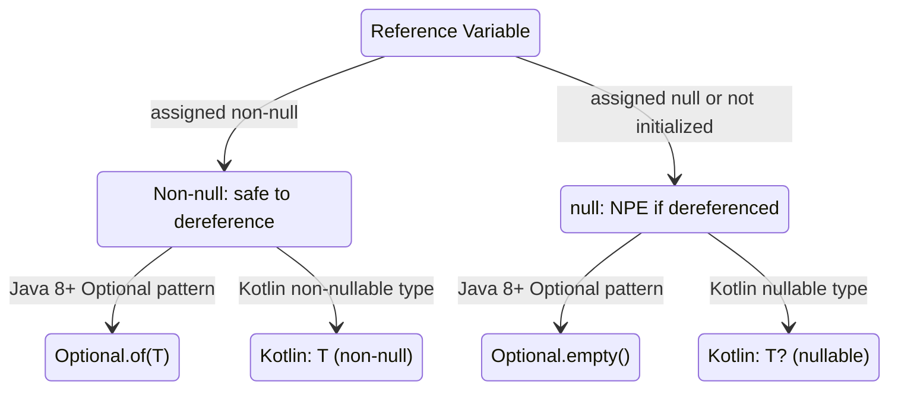

## Keywords in This File
{: .no_toc }

| # | Keyword | Weight |
|---|---|---|
| 1 | [The Billion-Dollar Mistake: Java Null Safety History and Lessons](#the-billion-dollar-mistake-java-null-safety-history-and-lessons) | high |
| 2 | [API Design Principles: Effective Java Distilled](#api-design-principles-effective-java-distilled) | high |
| 3 | [The Expression Problem: Extensibility Trade-offs in OOP vs FP](#the-expression-problem-extensibility-trade-offs-in-oop-vs-fp) | high |

---

# The Billion-Dollar Mistake: Java Null Safety History and Lessons

**Interview Weight:** high - Asked at senior/staff levels when
discussing defensive programming, API design, Optional, and "why
is Java's null handling different from Kotlin/Swift?"

---

### 🎯 Model Answer

**30 seconds:**

> Tony Hoare called null "my billion-dollar mistake" - he invented
> the null reference in 1965 for ALGOL W because it was easy to
> implement. Java inherited null as a valid value for every reference
> type, making NullPointerException the most common runtime error in
> Java. The meta-lesson is that convenience at the language level
> (null as a universal "nothing" signal) creates systematic production
> failures because every reference is now uncertain and every caller
> must defensively check. Kotlin, Swift, and Rust fixed this by making
> nullability explicit in the type system.

**3 minutes (Senior):**

> Java's null problem is architectural, not just a coding discipline
> issue. Every reference type in Java - String, List, your own domain
> objects - is inherently nullable. There is no way to declare "this
> parameter can never be null" at the type system level in standard
> Java. Annotations like `@NonNull` and `@Nullable` (from JetBrains,
> Checker Framework, or Jakarta) help, but they are convention, not
> enforcement - the compiler does not reject assignments of null to
> `@NonNull` parameters unless you add a null checker plugin.
>
> The practical cost is twofold. First, every public method that takes
> a reference parameter must document and decide: what do I do with
> null? The choice - throw NullPointerException, return a default,
> or propagate null - is an API contract that is invisible in the
> type signature and therefore frequently violated or left unspecified.
> Second, every method that returns a reference creates uncertainty
> in the caller: do I need to check this? This uncertainty causes
> both over-checking (defensive null checks everywhere) and
> under-checking (NullPointerException in production).
>
> Java 8's Optional<T> addressed the return type problem: a method
> returning Optional<T> signals explicitly that the result may be
> absent. But Optional was not designed for field types, method
> parameters, or collections (Optional in a List is an anti-pattern).
> Java 21's NullPointerException improvements (verbose NPE messages
> that name the null variable) help diagnosis but not prevention.
> The lesson for API design: return Optional for nullable results,
> document null parameter contracts with `@NonNull`/`@Nullable`
> annotations, use Preconditions or Objects.requireNonNull at
> trust boundaries, and treat null-returning APIs as legacy that
> should be wrapped.

**Framework:** WHAT -> WHY -> HOW -> TRADE-OFF -> EXAMPLE

_Adapting up:_ Compare Java null to Kotlin's nullable type system.
Discuss how static analysis tools (NullAway, Checker Framework)
approximate type system enforcement. Connect to domain model design:
when is "absence" a meaningful value and when should you use the
Null Object pattern instead.

_Adapting down:_ WHAT (every Java reference can be null) + WHY
(it was easy to implement in 1965) + EXAMPLE (return Optional
instead of nullable).

**Blank Mind Recovery:**

**(1) Restate:** "You are asking about Java null safety - let me
walk through why null exists, what it costs in production, and
the patterns Java and Kotlin use to address it."

**(2) First principles:** "A type system that allows any value to
be absent cannot enforce preconditions at compile time. Every
reference in Java is Schrodinger's value - you do not know if it
is present until you observe it at runtime."

**(3) Bridge:** "Null in Java is like a vending machine that might
give you the product or might give you nothing, with no visible
label on which slots might be empty. Kotlin's nullable types put
a warning sticker on the uncertain slots and make you explicitly
handle the empty case before reaching in."

---

### 📘 Concept Explanation

**What it is:**

Java null is the universal "absence" value that can be assigned to
any reference type variable. Unlike primitives (int, boolean, etc.),
which always have a value, every reference variable can be null.
Dereferencing a null reference produces NullPointerException.

**The problem it solves:**

Null solves a real problem: representing "not present" or "not
initialized" without a second-class sentinel value (like -1 for
missing integers or "" for missing strings). The alternative
before null-safe type systems was sentinel values that were easy
to confuse with valid values, or verbose "boxed with a boolean"
patterns.

**How it works:**

```
JAVA NULL - WHAT IT IS

At the JVM level:
  All reference variables hold either:
    - A reference to an object on the heap, or
    - null (the null reference, value 0x00000000)

  The null check is implicit in every dereference:
    obj.method()  -->  if obj == null: throw NPE

NullPointerException triggers:
  - Dereferencing a null reference (obj.field, obj.method())
  - Throwing null (throw null)
  - Synchronizing on null (synchronized(null))
  - Unboxing null (int i = (Integer)null)

Java 14+ verbose NPE (JEP 358):
  "Cannot invoke String.length() because 'user.name' is null"
  Names the null variable in the chain
```



> **Diagram walkthrough:** In Java, a reference variable is either
> null or non-null at runtime, but the type system treats both as
> the same type (`String` can be null or non-null - no distinction).
> Optional wraps this uncertainty in the return type, making absence
> visible. Kotlin splits the type system: `String` is guaranteed
> non-null, `String?` is explicitly nullable. The key difference:
> Java's Optional is advisory (you can ignore it), while Kotlin's
> `?` operator is mandatory (you must handle the null case to compile).

**The key insight:**

The "billion-dollar mistake" is not that null exists - every
system needs to represent absence. The mistake is that null is
implicit: any reference can be null without the type saying so.
The cost is that every reference type becomes a two-valued type
(non-null OR null) but the type system represents it as one type,
hiding the distinction from callers and the compiler.

**When to use null:**

In Java, null is unavoidable. Use it as a return value only when
null is a meaningful sentinel for "not found" or "not applicable"
AND you document the contract clearly. Prefer returning Optional
or throwing an exception for absent required values.

**When NOT to use null:**

Never pass null as a method argument unless the method explicitly
documents null-acceptance. Never return null from a method that
returns a collection (return empty collection instead). Never store
null in a collection (use Optional or redesign). Never use null
as a signal for "error" - use exceptions.

**Alternatives:**

Optional<T> (Java 8+) for nullable return values. Null Object
pattern for polymorphic default behavior. `@NonNull`/`@Nullable`
annotations for parameter contracts. Kotlin for a language-level
solution.

**First-principles derivation:**

Given: a type system where references point to objects. Absence
can be represented as: (A) a special sentinel value (error-prone,
type-specific), (B) a wrapper type (Optional, Maybe, Option -
verbose but safe), (C) a built-in null (universal, convenient,
unsafe). Java chose C; Kotlin chose B+C (both available, nullable
types make C explicit).

---

### 💻 Code Example

#### Example 1 - The Null Contract Problem (Wrong vs Right)

```java
// BAD: null contract invisible in API signature
public class UserService {
    // Can return null? Throws if userId invalid?
    // Caller has NO idea from the signature alone
    public User findUser(long userId) {
        return userRepository.findById(userId);
        // returns null if not found
    }
}

// Caller code must guess:
User user = userService.findUser(42L);
user.getName(); // NullPointerException if not found!
```

> **Code walkthrough:** The method signature `User findUser(long)`
> provides no information about whether null is a valid return.
> Callers are forced to either check defensively (adding noise) or
> skip the check and risk NPE. The contract is in the documentation,
> not the type - and documentation gets out of date.

```java
// GOOD: null contract visible in return type
public Optional<User> findUser(long userId) {
    return Optional.ofNullable(
        userRepository.findById(userId));
}

// Caller is forced to handle absence:
Optional<User> user = userService.findUser(42L);
// Option 1: explicit handling
user.ifPresent(u -> process(u));

// Option 2: provide default
String name = user.map(User::getName).orElse("anonymous");

// Option 3: throw if required
User u = user.orElseThrow(
    () -> new UserNotFoundException(42L));
```

> **Code walkthrough:** `Optional<User>` signals in the type that
> the result may be absent. The caller must explicitly handle the
> absent case to use the value - there is no path to NPE that does
> not pass through an explicit `orElse`, `ifPresent`, or `orElseThrow`.
> The three patterns cover the common cases: side-effect on presence,
> value with default, and required value with exception.

---

#### Example 2 - Null Object Pattern (Production Alternative)

```java
// BAD: null check cascade through layered calls
public class OrderProcessor {
    public void process(Order order) {
        if (order == null) return;
        if (order.getCustomer() == null) return;
        if (order.getCustomer().getAddress() == null) return;
        String city = order.getCustomer().getAddress().getCity();
        // ... real logic
    }
}
```

> **Code walkthrough:** The null check cascade is the classic
> symptom of null propagation through a domain model. Each layer
> may or may not return null, and callers must check at every
> level. This is the "pyramid of doom" version of null handling
> and it obscures the actual business logic.

```java
// GOOD: Null Object pattern - polymorphic default behavior
public interface Address {
    String getCity();
    boolean isReal();  // distinguishes null object from real
}

public class NullAddress implements Address {
    public static final NullAddress INSTANCE = new NullAddress();
    @Override public String getCity() { return ""; }
    @Override public boolean isReal() { return false; }
}

public class Customer {
    private Address address = NullAddress.INSTANCE; // never null

    public Address getAddress() { return address; }
}

// Now: no null checks needed
String city = order.getCustomer().getAddress().getCity();
// Returns "" if no address, not NPE
```

> **Code walkthrough:** The Null Object pattern replaces null with
> a default-behavior implementation. `NullAddress` returns empty
> strings for all fields and `false` for `isReal()`. The domain
> model initializes address to `NullAddress.INSTANCE` instead of
> null. Callers navigate the chain without null checks - the Null
> Object absorbs the calls safely. This pattern trades explicit
> absence signaling (Optional) for transparent default behavior,
> appropriate when "not present" and "empty default" are equivalent
> for callers.

---

#### Example 3 - NullPointerException Diagnosis (Java 14+)

```java
// SYMPTOM in logs (Java 13 and earlier):
// java.lang.NullPointerException
//   at com.example.OrderService.processOrder(OrderService.java:42)
// No information about WHICH reference was null!

// DIAGNOSIS with Java 14+ JEP 358 verbose NPEs:
// java.lang.NullPointerException: Cannot invoke
//   "com.example.Address.getCity()" because the return value of
//   "com.example.Customer.getAddress()" is null
//   at OrderService.processOrder(OrderService.java:42)
// Now you know: getAddress() returned null, not getCity() itself

// ENABLE explicitly (on by default in Java 14+, off in some JVMs):
// java -XX:+ShowCodeDetailsInExceptionMessages -jar app.jar

// PROACTIVE: Objects.requireNonNull at trust boundaries
public void processOrder(Order order) {
    Objects.requireNonNull(order, "order must not be null");
    Objects.requireNonNull(
        order.getCustomer(), "order.customer must not be null");
    // rest of method: null contract is now documented + enforced
}
```

> **Code walkthrough:** Java 14's JEP 358 added detailed NPE
> messages that name the exact null variable in the call chain.
> This dramatically reduces diagnosis time - previously you had
> to add logging or a debugger to find which variable was null.
> `Objects.requireNonNull` at trust boundaries (public API entry
> points, constructor parameters) makes the null contract explicit
> and throws immediately at the source of the problem rather than
> at a downstream dereference. The message argument documents the
> contract for future engineers.

---

### 🎓 Answers by Seniority

**Junior:** In Java, every reference can be null, and dereferencing
null causes NullPointerException. Use null checks or Optional to
handle absence. Java 14+ NPE messages name the null variable.
Avoid returning null from methods - return Optional or empty
collections instead.

**Mid-level:** The null problem is an API contract problem: the
type `String` says nothing about whether null is a valid value.
Use Optional for nullable return values, `@NonNull`/`@Nullable`
annotations for parameters, and `Objects.requireNonNull` at trust
boundaries. Null Object pattern for domain model traversal.
Never store null in collections.

**Senior:** Null is a type system design flaw: any reference is
secretly a two-valued type (present or absent) but declared as one.
At-scale implications: every public API must document its null
contract; null leaking from one layer to another creates cascading
NPEs far from the source. Use static analysis tools (NullAway,
Checker Framework) to enforce `@NonNull` annotations at build time.
Optional is for return values only; using it for parameters or
fields is an anti-pattern.

**Staff:** The meta-lesson from the billion-dollar mistake is about
implicit contracts in type systems: any type that secretly has
multiple cases creates systematic failures because the type system
cannot help callers handle those cases. This pattern recurs: unchecked
exceptions (method throws but signature does not say so), raw types
(type parameter erased), and covariant arrays (array store may
fail). Each is a case where the type signature hides a runtime case
that callers must handle without compiler assistance. Design APIs
that surface contracts in types, not just documentation.

---

### ⚠️ Common Misconceptions

| #   | Misconception                                               | Reality                                                                                                                                                                                           | Danger                                                                 |
| --- | ----------------------------------------------------------- | ------------------------------------------------------------------------------------------------------------------------------------------------------------------------------------------------- | ---------------------------------------------------------------------- |
| 1   | Optional should be used for method parameters               | Optional is for return values. Using Optional as a parameter type forces callers to wrap values in Optional, adding verbosity without safety. Use @NonNull/@Nullable annotations for parameters   | Verbose APIs with no safety benefit; Optional.get() still throws NPE   |
| 2   | Optional.get() is safe if you checked isPresent()           | True but fragile - the check and get can be separated by refactoring. Use orElse(), orElseGet(), orElseThrow(), or ifPresent() instead                                                            | NPE if isPresent() check is removed or bypassed                        |
| 3   | @NonNull prevents null at runtime                           | @NonNull annotations are advisory without a checker. The compiler does not enforce them unless you add NullAway, Checker Framework, or IDE null-safety analysis                                   | False security; NPE still possible at runtime without enforcement tool |
| 4   | Kotlin null safety eliminates NPEs completely               | Kotlin can still throw NPE from Java interop (Java methods returning null), !! operator (explicit null assertion), uninitialized lateinit, and platform types                                     | Surprise NPEs in Kotlin code that calls Java APIs                      |
| 5   | Returning empty Optional.empty() is always better than null | For internal/private methods, null is often cleaner. Optional adds allocation overhead and verbosity. Reserve Optional for public API return values where the absence is meaningful to the caller | Overusing Optional in internal code; performance overhead in hot paths |

---

### 🚨 Failure Modes and Diagnosis

**Failure 1 - NPE from null propagation through layers**

Symptom: NPE thrown deep in the call stack, far from where null
was introduced. Java 14+ message names the null variable; earlier
versions give only the line number.

Root cause: Null returned from one layer was not checked before
being used in a downstream call.

Diagnostic: Read the Java 14+ NPE message for the null variable
name. If on older Java, add null checks at boundaries and use
logging, or enable `-XX:+ShowCodeDetailsInExceptionMessages`.
Search the call chain for the method that returns null.

Fix: Add `Objects.requireNonNull` at trust boundaries. Return
Optional for nullable values. Add `@NonNull` annotations and
enable static analysis.

---

**Failure 2 - NullPointerException from Optional.get() without isPresent()**

Symptom: NPE from `Optional.get()` in production. The stack
trace is confusing because Optional should prevent this.

Root cause: `optional.get()` without a preceding `isPresent()`
check. The NPE message is `NoSuchElementException` from
Optional, which is a different exception than standard NPE.

Fix: Replace `optional.get()` with `optional.orElseThrow()`
(declares the intent clearly), `optional.orElse(default)`, or
`optional.ifPresent(consumer)`. Never call `optional.get()`
without an explicit `isPresent()` guard.

---

**Failure 3 - Null in a collection causing downstream NPE**

Symptom: NPE thrown during stream processing or iteration of
a collection, at a map/filter lambda rather than the collection
itself.

Root cause: Null stored in a `List`, `Map`, or `Set`. Collections
permit null elements (except some `Map.of()` and `List.of()`
variants which throw NPE on null). The NPE surfaces when the
null element is used.

Fix: Validate elements before insertion. Use `List.of()` or
`Map.of()` (Java 9+) which reject null on construction.
Add a null-exclusion step in stream processing:
`.filter(Objects::nonNull)` before the problematic operation.

---

### 🎯 Interview Deep-Dive

| Preparation time | Recommended approach                                                      |
| ---------------- | ------------------------------------------------------------------------- |
| 30 min           | Why null exists; Optional return value pattern; Objects.requireNonNull    |
| 1 hour           | Add Null Object pattern; anti-patterns (Optional params, Optional fields) |
| 2 hours          | Add static analysis tools; Kotlin comparison; Java 14 NPE messages        |
| 3 hours          | Add Checker Framework; at-scale null management strategies                |
| 5 hours          | Read Effective Java Chapter 8 (null handling); NullAway documentation     |

---

**[MID] Q1: What problem does Optional solve, and what are its
limitations?** [CONCEPTUAL]

_Why they ask:_ Tests whether the candidate understands Optional's
design intent and avoids the common misuses.

_Likely follow-up:_ "When would you NOT use Optional?"

Optional<T> was introduced in Java 8 to address one specific problem:
method return types that could be absent. Before Optional, a method
returning `User findUser(long id)` had no way to signal in the type
signature that null could be returned. Callers either checked
defensively or forgot to check. Optional makes the possibility of
absence explicit in the type, forcing callers to handle it.

Optional solves: explicit return type signaling of absence, fluent
chaining of absent-safe operations (`map`, `flatMap`, `filter`),
and clean expression of "use this or that default."

Limitations and misuses:

Optional as a parameter: forces callers to wrap values with
`Optional.of()` before calling, adding verbosity with no safety
benefit. Use `@NonNull`/`@Nullable` annotations for parameters
instead.

Optional as a field: serialization frameworks may not handle
Optional fields correctly (Jackson has special support, but many
frameworks do not). Optional adds allocation overhead for every
instance. Use a nullable field with a getter that returns Optional
if the absence needs to be signaled.

Optional in collections: `List<Optional<String>>` is almost always
a design mistake. Use the null-filtered collection or a specialized
data structure.

`Optional.get()` without `isPresent()`: throws `NoSuchElementException`.
This is a code smell - Optional was supposed to make the absence
handling visible but the `get()` method allows it to be hidden again.

_What separates good from great:_ Knowing that Optional's primary
use case is return types for "find by" repository methods and
configuration lookups - not as a general null-replacement mechanism.

---

**[MID] Q2: How do `@NonNull` and `@Nullable` annotations improve
null safety in Java?** [CONCEPTUAL]

_Why they ask:_ Tests awareness of the tooling ecosystem for
null safety beyond Optional.

_Likely follow-up:_ "Which annotation package would you use?"

`@NonNull` and `@Nullable` annotations document the null contract
in method signatures and field declarations. Multiple annotation
packages exist: JetBrains (`org.jetbrains.annotations`), Jakarta
(`jakarta.annotation`), Checker Framework (`org.checkerframework`),
and FindBugs/SpotBugs (`edu.umd.cs.findbugs`).

Annotations alone are informational. IDEs (IntelliJ, Eclipse) use
them for warning highlighting. Some build tools enforce them. Static
analysis tools (SpotBugs, NullAway, Checker Framework) can fail
the build on null contract violations.

NullAway (Uber, open source) integrates with Error Prone to perform
compile-time null checking at Google-scale performance. It requires
annotation of all public APIs and reports violations as compilation
errors. This approximates Kotlin's null safety in Java.

Checker Framework's Nullness Checker is the most rigorous option:
it performs whole-program data flow analysis for null safety and
can verify complex contracts. It is more thorough but heavier weight.

The practical recommendation: use JetBrains annotations for
IDE support in standard projects. Add NullAway for compile-time
enforcement in new code. Retrofit annotations to existing APIs
as part of technical debt reduction.

_What separates good from great:_ Knowing that annotation package
choice matters for tooling compatibility and that NullAway is the
practical choice for "Java with Kotlin-like null safety" without
changing the language.

---

**[SENIOR] Q3: How does Kotlin solve the null safety problem
that Java could not?** [COMPARISON]

_Why they ask:_ Tests cross-language knowledge of type system
design and the practical difference between Java and Kotlin null
handling.

_Likely follow-up:_ "What happens when Kotlin calls Java code?"

Kotlin solves null safety at the type system level: `String` is
guaranteed non-null (the compiler rejects assignments of null),
while `String?` is explicitly nullable (the compiler requires null
handling before use). This is a binary distinction enforced at
compile time, not at runtime.

In Kotlin, `user.name.length` is safe if `name` is declared as
`String`. If `name` is `String?`, the compiler rejects `.length`
without a null-safe operator: `user.name?.length` (returns null if
name is null) or `user.name!!.length` (throws NPE if name is null -
explicit assertion).

Java could not add this without breaking binary compatibility: every
existing reference type is nullable in the JVM bytecode model, and
adding nullability to the type system would change the semantics of
all existing code.

The Java-Kotlin interop caveat: Kotlin calls to Java methods receive
"platform types" (neither definitely null nor definitely non-null).
The Kotlin compiler trusts `@NonNull`/`@Nullable` annotations on
Java APIs. Without those annotations, Kotlin allows null returns
from Java without checking - meaning NPEs are still possible at
Java-Kotlin boundaries. Adding nullability annotations to Java APIs
is necessary for safe Kotlin interop.

_What separates good from great:_ Explaining platform types and
the implication that switching to Kotlin does not eliminate NPEs
in mixed codebases - annotation of Java APIs is still required.

---

**[SENIOR] Q4: Describe a production NPE you diagnosed and fixed.**
[DEBUGGING + BEHAVIORAL - STAR]

_Why they ask:_ Tests real production experience with null handling
and systematic diagnosis skills.

_Likely follow-up:_ "What monitoring would you add to prevent
recurrence?"

**Situation:** A payment service reported intermittent
NullPointerExceptions in production approximately 0.1% of payment
requests. The stack trace pointed to `order.getCustomer().getEmail()`

- the NPE was at line 87, `getEmail()` appeared to be the null.

**Task:** The existing Java 11 NPE message gave only the line number.
I needed to identify which object in the chain was null across
different request types.

**Action:** First, added temporary logging before line 87:
`log.debug("customer={}, email={}", order.getCustomer(), order.getCustomer()?.getEmail())`.
Deployed to one production pod. Within an hour, captured the case:
`customer` was non-null but `email` was null for guest checkout
orders - the guest checkout flow never set email on the Customer
object, but the payment notification code always called `getEmail()`.

**Resolution:** Root fix: made `email` on Customer return
`Optional<String>` instead of `String`. Callers now must handle
absence. Short-term fix: `Objects.requireNonNullElse(customer.getEmail(), "")` to use empty string for guests. Added a
compile-time annotation `@Nullable` on the `getEmail()` return.
Enabled NullAway in the codebase's CI to find all similar unchecked
null returns. Upgraded to Java 14 on that service for detailed NPE
messages.

**Result:** Zero recurrence over 6 months. NullAway found 12 other
similar potential null dereferences in the same service which were
fixed preemptively.

_What separates good from great:_ Showing the systematic
investigation (added logging, identified the specific null path),
the root fix (type change to Optional) vs the short-term fix, and
the prevention step (NullAway in CI).

---

**[SENIOR] Q5: What is the performance cost of Optional and when
should you avoid it?** [TRADE-OFF + PERFORMANCE]

_Why they ask:_ Tests whether the candidate uses Optional judiciously
or applies it everywhere regardless of cost.

_Likely follow-up:_ "Where in your codebase would you never use Optional?"

Optional is an object wrapper: every `Optional.of(value)` or
`Optional.ofNullable(value)` allocates a new `Optional` instance
on the heap. For infrequently called methods (repository lookups,
configuration reads), this cost is negligible.

For hot paths - methods called millions of times per second (stream
processing, inner loops, game loops, high-frequency financial
calculations) - Optional allocation adds GC pressure. A `Stream<Optional<T>>` in a tight loop allocates an Optional per element, then allocates again for the mapped result.

Performance-sensitive alternatives:

- Return null and document the contract (with `@Nullable`)
- Use `OptionalInt`, `OptionalLong`, `OptionalDouble` for primitive
  types (these avoid boxing)
- For streams: filter out nulls with `.filter(Objects::nonNull)`
  rather than `.map(Optional::ofNullable).filter(Optional::isPresent).map(Optional::get)`

The decision rule: use Optional for public API return types where
clarity of the null contract matters to the caller. Avoid Optional
in performance-sensitive internal code, as method parameters, as
collection elements, and as class fields (unless serialization is
not a concern).

_What separates good from great:_ Knowing `OptionalInt`/`OptionalLong` avoids boxing and being precise about "negligible in
most contexts" vs "measurable in hot paths" rather than a blanket
policy for or against Optional.

---

**[STAFF] Q6: What is the meta-lesson from null for API design
across all languages and domains?** [ARCHITECTURE]

_Why they ask:_ Tests whether the candidate can extract a
generalizable principle from the null design mistake.

_Likely follow-up:_ "Where does this pattern appear in Java beyond null?"

The meta-lesson: when a type has multiple runtime cases (present
or absent, success or failure, valid or invalid), the type system
should surface those cases explicitly. When it does not, every
caller must guess and handle them independently, creating systematic
failures.

This pattern appears throughout Java:

**Null** (reference type): has two cases (present/absent) but one
type (`String`). Fix: Optional, @NonNull/@Nullable.

**Unchecked exceptions**: method may throw but signature does not
say so. Callers cannot know without reading documentation. Fix:
checked exceptions (Java's approach - controversial), explicit
Result types (Rust's `Result<T, E>`, Kotlin's `Result<T>`).

**Raw types**: `List` can hold any type at runtime but the API
does not say so. Fix: generics with explicit type parameters.

**Array covariance**: `String[]` stored as `Object[]` may throw
`ArrayStoreException` on write. Fix: generic invariance (as with
`List<T>`).

**The design principle**: make hidden cases explicit in the type
signature. Each time you have a type that secretly has multiple
cases, callers will fail to handle some of them, and the compiler
cannot help. The cost of explicit types (verbosity) is always less
than the cost of systematic runtime failures (production incidents).

_What separates good from great:_ Connecting null to the broader
pattern of "implicit contracts" and naming specific non-null
examples (unchecked exceptions, raw types) with the same root
cause.

---

**[STAFF] Q7: How would you reduce null-related production
incidents at organizational scale?** [ARCHITECTURE + BEHAVIORAL]

_Why they ask:_ Tests whether the candidate can translate null
safety principles into a team-level process.

_Likely follow-up:_ "What is the priority ordering of these changes?"

A systematic approach in priority order:

**Priority 1 - Static analysis at CI:** Add NullAway or SpotBugs
null checks to the CI pipeline. This catches new null violations
at commit time. Low effort, high ROI. Configure as a blocking
check (must fix before merge).

**Priority 2 - Annotate public APIs:** Retrofit `@NonNull`/`@Nullable`
to public method signatures and fields. Start with the most-called
APIs and work outward. This gives both static analysis and IDE
warning support to callers.

**Priority 3 - Upgrade to Java 14+ for verbose NPEs:** Detailed
NPE messages cut MTTR (mean time to resolution) for production
incidents significantly. This is a JVM upgrade, not a code change,
with zero compatibility risk.

**Priority 4 - Optional for repository return types:** The most
common source of service-layer NPEs is a repository returning null
for "not found." Change all `findById`, `findByEmail`, and similar
methods to return `Optional<T>`. This forces callers to handle
absence.

**Priority 5 - Objects.requireNonNull at API boundaries:** Add
parameter validation at all public API entry points. Throws early
at the source of the contract violation, not deep in the call chain.

**Priority 6 - Long-term - Kotlin migration or type system enforcement:**
For new modules, consider Kotlin which enforces null safety at the
language level. For existing Java, Checker Framework provides the
most rigorous enforcement.

_What separates good from great:_ Treating null safety as an
organizational reliability metric rather than a coding style
preference, and prioritizing by ROI (CI enforcement > annotation

> Optional) rather than pure technical correctness.

---

| Interviewer type    | Adaptation                                                              |
| ------------------- | ----------------------------------------------------------------------- |
| API designer        | Lead with Optional pattern and @NonNull/@Nullable annotation strategy   |
| Production engineer | Lead with Java 14 NPE messages and Objects.requireNonNull at boundaries |
| Kotlin-experienced  | Lead with platform types and Java-Kotlin interop null safety            |
| Security-focused    | Lead with null injection risks and validation at trust boundaries       |
| Staff interviewer   | Lead with meta-lesson and organizational null safety strategy           |

---

### ⚖️ Comparison Table

|                              | Java (null)                   | Java (Optional)                | Kotlin (nullable types)        | Rust (Option<T>)           |
| ---------------------------- | ----------------------------- | ------------------------------ | ------------------------------ | -------------------------- |
| **Absence representation**   | null (any reference)          | Optional.empty()               | T? (explicit nullable)         | None variant               |
| **Compile-time enforcement** | None (no type distinction)    | None (Optional can be ignored) | Yes (must handle T?)           | Yes (must handle None)     |
| **Runtime cost**             | Zero (null is the reference)  | Object allocation per Optional | Zero (inline null check)       | Zero (enum variant)        |
| **API clarity**              | None (callers must read docs) | High (Optional in return type) | Complete (T vs T?)             | Complete (T vs Option<T>)  |
| **NPE equivalent**           | NullPointerException          | NoSuchElementException (get()) | NullPointerException (!! only) | None (panics are explicit) |
| **Interop**                  | Universal Java null           | Works with null (ofNullable)   | Platform types for Java        | No null (Rust-only)        |

---

---

# API Design Principles: Effective Java Distilled

**Interview Weight:** high - Asked at senior/staff levels during
library design discussions, code reviews, and "how would you
improve this API?" questions.

---

### 🎯 Model Answer

**30 seconds:**

> Effective Java (Bloch) distills Java API design to a few principles:
> minimize mutability and coupling, use static factories over constructors,
> prefer composition over inheritance, design for extension or prohibit
> it, never return null from a collection method, and favor interfaces
> over abstract classes for type definitions. These are not style
> preferences - each addresses a specific failure mode that appears
> repeatedly in production Java systems.

**3 minutes (Senior):**

> The most impactful API design principles from a production perspective:
>
> First, static factory methods over constructors. Static factories
> have names (conveying intent), can return subtypes (polymorphism
> without exposing the type), can return cached instances (Integer.valueOf
> caches -128 to 127), and allow lazy initialization. The cost is
> that they are less discoverable than constructors for users of the API.
>
> Second, minimize mutability. An immutable class is inherently
> thread-safe, can be freely shared without defensive copies, and cannot
> be put in an inconsistent state. The Java Collections.unmodifiableList
> trap: it returns an unmodifiable VIEW, not an immutable copy - the
> underlying list can still change through the original reference.
> True immutability requires defensive copying at construction.
>
> Third, favor composition over inheritance for extending behavior.
> Inheritance violates encapsulation: a subclass depends on the
> implementation details of its superclass. If the superclass changes
> an internal method call in a new version, the subclass may break
> without any changes to itself. The HashSet-counting bug in Effective
> Java shows this: overriding `add()` and `addAll()` in a subclass
> breaks when `addAll()` calls `add()` internally, causing double-counting.
>
> Fourth, design for extension or prohibit it. A class designed for
> inheritance must document exactly which methods can be overridden
> and what each method calls, because any method call to an overrideable
> method is a hook into subclass behavior. Classes not designed for
> inheritance should be final. This is not about restricting users -
> it is about maintaining the ability to change the implementation
> without breaking subclasses.

**Framework:** WHAT -> WHY -> HOW -> TRADE-OFF -> EXAMPLE

_Adapting up:_ Discuss API versioning (backward compatibility with
static factories), the law of Demeter and coupling reduction,
exception design (checked vs unchecked), and how these principles
apply to REST API design (not just Java APIs).

_Adapting down:_ WHAT (rules for designing methods and classes) +
WHY (each prevents a specific class of bug) + EXAMPLE (static
factory vs constructor).

**Blank Mind Recovery:**

**(1) Restate:** "You are asking about Java API design principles -
let me walk through the key rules from Effective Java: static
factories, immutability, composition over inheritance, and fail-fast
validation."

**(2) First principles:** "A good API makes correct use easy and
incorrect use impossible. Every principle in Effective Java serves
this goal: minimize the ways to use an API incorrectly and make
the consequences of misuse visible at compile time, not runtime."

**(3) Bridge:** "API design principles are like traffic laws: most
drivers follow them instinctively after experience, but the laws
exist because the violations cause accidents. Returning null from
a collection method is running a red light - most of the time
nothing happens, but eventually it causes a crash."

---

### 📘 Concept Explanation

**What it is:**

A set of language-specific best practices for designing Java APIs
that are easy to use correctly, hard to misuse, consistent with
the platform, and maintainable as requirements evolve. Codified in
Joshua Bloch's Effective Java (1st ed. 2001, 3rd ed. 2018).

**The problem it solves:**

Without principled API design, Java APIs accumulate misuse patterns:
constructors that silently accept invalid arguments, mutable objects
shared across thread boundaries, inheritance hierarchies where
subclasses depend on superclass implementation details, and null
returns that propagate NPEs across layers.

**How it works:**

The ten most impactful principles:

```
EFFECTIVE JAVA - CORE API DESIGN PRINCIPLES

1. STATIC FACTORIES > CONSTRUCTORS
   Benefits: names, caching, subtypes, lazy init
   Pattern: of(), from(), getInstance(), valueOf()

2. BUILDER PATTERN for 4+ parameters
   Problem: telescoping constructors; optional params
   Solution: Builder validates at build(); immutable result

3. ENFORCE INVARIANTS AT CONSTRUCTION
   Use: Objects.requireNonNull, validate ranges
   Rule: fail fast - never construct invalid objects

4. MINIMIZE MUTABILITY
   Rule: all fields final unless mutation is necessary
   Benefit: thread-safe, shareable, cannot be inconsistent
   Trap: unmodifiableList is a view, not immutable

5. COMPOSITION > INHERITANCE for reuse
   Inheritance breaks encapsulation (superclass changes break)
   Composition: wrap and delegate, no internal dependency

6. DESIGN FOR EXTENSION OR PROHIBIT IT
   Document overrideable methods (Javadoc @implSpec)
   Undocumented: make class final or methods final

7. INTERFACES > ABSTRACT CLASSES for type definitions
   Interfaces: multiple inheritance, existing classes can adopt
   Abstract: only for single implementation hierarchy

8. RETURN EMPTY COLLECTIONS, NOT NULL
   Rule: never return null for collection-type return values
   Return: Collections.emptyList(), Optional.empty()

9. USE CHECKED EXCEPTIONS SPARINGLY
   Checked: only when caller CAN reasonably recover
   Unchecked: programming errors (null, out of bounds)
   Rule: if callers always wrap in try/catch and rethrow,
         the exception should be unchecked

10. MINIMIZE ACCESS (ENCAPSULATION)
    Rule: make every class/member as private as possible
    Public API is a commitment you cannot break
```

**The key insight:**

"Make correct use easy and incorrect use impossible" is the single
design criterion that unifies all principles. Static factories make
intent clear. Immutability removes a category of bugs. Checked
exceptions force caller awareness for recoverable errors. Each
principle is a specific mechanism to move failures from runtime
to compile time or from "silently wrong" to "clearly wrong."

**When to use these principles:**

When designing any shared library, any public API, or any class
that will be used by more than one team. These are not needed for
private internal classes used only in one context - apply
proportionally to the scope of reuse.

**When to use pragmatic exceptions:**

Builder pattern overhead is not worth it for simple 2-parameter
objects. Static factories add discoverability overhead in APIs
where the caller expects `new`. Immutability is not appropriate
for inherently stateful objects (a connection pool, a job queue).

**First-principles derivation:**

APIs have two costs: implementation cost (borne once, by the
author) and usage cost (borne repeatedly, by every caller forever).
Every principle in Effective Java trades a small increase in
implementation complexity for a large decrease in total usage
cost across the lifetime of the API.

---

### 💻 Code Example

#### Example 1 - Static Factory vs Constructor (Wrong vs Right)

```java
// BAD: telescoping constructors with boolean params
// (3 booleans: what does Order(true, false, true) mean?)
public class Order {
    public Order(String id, boolean priority,
                 boolean gift, boolean taxExempt) { ... }
}

// Caller: no idea what booleans mean
Order order = new Order("123", true, false, true);
```

> **Code walkthrough:** Three boolean parameters create eight
> constructor combinations with no self-documenting intent. Swapping
> argument order is a bug the compiler cannot catch. Adding a fourth
> boolean requires changing all call sites.

```java
// GOOD: Builder pattern - readable, extensible, validated
public final class Order {
    private final String id;
    private final boolean priority;
    private final boolean gift;
    private final boolean taxExempt;

    private Order(Builder b) {
        this.id = Objects.requireNonNull(b.id, "id");
        this.priority = b.priority;
        this.gift = b.gift;
        this.taxExempt = b.taxExempt;
    }

    public static Builder builder(String id) {
        return new Builder(id);
    }

    public static final class Builder {
        private final String id;
        private boolean priority, gift, taxExempt;

        private Builder(String id) { this.id = id; }

        public Builder priority(boolean v) {
            priority = v; return this;
        }
        public Builder gift(boolean v) {
            gift = v; return this;
        }
        public Builder taxExempt(boolean v) {
            taxExempt = v; return this;
        }
        public Order build() { return new Order(this); }
    }
}

// Caller: self-documenting
Order order = Order.builder("123")
    .priority(true)
    .taxExempt(true)
    .build();
```

> **Code walkthrough:** The Builder makes each parameter named
> and optional. Adding a new parameter is backward compatible:
> existing callers do not need to change. Validation happens in
> the `Order` constructor where `Objects.requireNonNull` fails
> fast for missing required fields. The `Order` class is immutable
> (all fields final, no setters) so it can be safely shared
> across threads without synchronization.

---

#### Example 2 - Composition Over Inheritance (Failure)

```java
// BAD: extends HashSet to count add operations
// (Bloch's canonical example, Effective Java Item 18)
public class InstrumentedHashSet<E> extends HashSet<E> {
    private int addCount = 0;

    @Override
    public boolean add(E e) {
        addCount++;
        return super.add(e);
    }

    @Override
    public boolean addAll(Collection<? extends E> c) {
        addCount += c.size(); // count upfront
        return super.addAll(c);
    }
}

InstrumentedHashSet<String> set = new InstrumentedHashSet<>();
set.addAll(List.of("a", "b", "c"));
System.out.println(set.addCount); // Expected: 3, Actual: 6!
```

> **Code walkthrough:** `HashSet.addAll()` is implemented by calling
> `this.add()` for each element (an internal implementation detail).
> Our override of `addAll()` increments count by 3, then
> `super.addAll()` calls our overridden `add()` three more times,
> incrementing by 3 again. Total: 6. This is the inheritance
> encapsulation violation: our subclass depended on the superclass
> NOT calling `add()` internally in `addAll()`, but that internal
> behavior is undocumented and can change in any JDK version.

```java
// GOOD: composition with forwarding wrapper
public class InstrumentedSet<E> implements Set<E> {
    private final Set<E> delegate;  // composition
    private int addCount = 0;

    public InstrumentedSet(Set<E> set) {
        this.delegate = Objects.requireNonNull(set);
    }

    @Override
    public boolean add(E e) {
        addCount++;
        return delegate.add(e);
    }

    @Override
    public boolean addAll(Collection<? extends E> c) {
        addCount += c.size();
        return delegate.addAll(c);
    }

    // All other Set methods forward to delegate
    @Override public int size() { return delegate.size(); }
    @Override public boolean isEmpty() { return delegate.isEmpty(); }
    // ... remaining methods

    public int getAddCount() { return addCount; }
}
```

> **Code walkthrough:** The forwarding wrapper delegates to the
> wrapped Set without extending it. Our `addAll` implementation
> calls `delegate.addAll()` (not `this.addAll()`), so there is no
> dependency on whether the delegate's `addAll` calls `add` internally.
> Adding a new method to `Set` in a future Java version adds it to
> the interface - we must implement it, but as a forwarding method.
> Inheritance would have silently inherited the new method with
> the superclass's behavior, potentially breaking our instrumentation.

---

#### Example 3 - Fail-Fast Validation (Production)

```java
// BAD: validation deferred to use site
public class DateRange {
    private final LocalDate start;
    private final LocalDate end;

    public DateRange(LocalDate start, LocalDate end) {
        this.start = start; // no validation
        this.end = end;
    }

    public long days() {
        // NPE or wrong calculation here if end < start
        return ChronoUnit.DAYS.between(start, end);
    }
}

// Usage: invalid range, wrong result surfaced far from cause
DateRange range = new DateRange(
    LocalDate.of(2024, 6, 1),
    LocalDate.of(2024, 5, 1)); // end before start - not caught
range.days(); // returns -31 (negative days, not thrown)
```

> **Code walkthrough:** The invalid date range is accepted at
> construction time and only produces a wrong result (negative days)
> when `days()` is called - potentially much later, after the
> `DateRange` has been stored, serialized, or passed to other
> systems. The root cause (construction of invalid range) is far
> removed from the symptom (wrong days count).

```java
// GOOD: validate invariants at construction
public final class DateRange {
    private final LocalDate start;
    private final LocalDate end;

    public DateRange(LocalDate start, LocalDate end) {
        this.start = Objects.requireNonNull(start, "start");
        this.end   = Objects.requireNonNull(end,   "end");
        if (end.isBefore(start)) {
            throw new IllegalArgumentException(
                "end must not be before start: "
                + start + " > " + end);
        }
    }

    // All uses of this object are guaranteed valid state
    public long days() {
        return ChronoUnit.DAYS.between(start, end); // always >= 0
    }
}
```

> **Code walkthrough:** The invariant (end >= start) is checked at
> construction. Any attempt to create an invalid DateRange throws
> immediately at the source of the error. The stack trace points
> directly to the call site passing invalid dates. After construction,
> the object is guaranteed to be in valid state for all time - no
> defensive checks needed in `days()` or any other method.

---

### 🎓 Answers by Seniority

**Junior:** Effective Java is a set of Java API design best practices.
Key ones: use Builder for many-parameter constructors, return empty
collections not null, validate parameters at construction (fail fast),
and prefer interfaces over abstract classes for type definitions.

**Mid-level:** The most important principle is "make correct use
easy and incorrect use impossible." Static factories over constructors
(named, can return subtypes). Minimize mutability (final fields,
no setters). Fail fast at construction. Return empty collections,
not null. Check exceptions vs unchecked: checked when callers can
recover, unchecked for programming errors.

**Senior:** Composition over inheritance is the key advanced
principle. Inheritance violates encapsulation - the `InstrumentedHashSet` example from Effective Java demonstrates this. The solution
is the forwarding wrapper (decorator pattern). At-scale: every
public method you add to a shared library is a forever commitment.
Static factories allow you to change return types, add caching,
and maintain backward compatibility as the API evolves.

**Staff:** API design is a product decision, not just an engineering
one. A good API has low coupling (clients do not depend on
implementation), high cohesion (each unit does one thing), and
low cognitive load (small learning curve). The Effective Java
principles are the Java-specific encoding of these general API
design goals. At organizational scale: shared library API design
decisions should go through a review process analogous to a
product spec review - backward compatibility is a permanent
commitment and misdesigned APIs live forever.

---

### ⚠️ Common Misconceptions

| #   | Misconception                                              | Reality                                                                                                                                                                      | Danger                                                                         |
| --- | ---------------------------------------------------------- | ---------------------------------------------------------------------------------------------------------------------------------------------------------------------------- | ------------------------------------------------------------------------------ |
| 1   | Collections.unmodifiableList() creates an immutable copy   | It creates an unmodifiable VIEW of the original list. The original list can still be modified through other references                                                       | Defensive copy that doesn't defend; list changes under the caller              |
| 2   | Static factory methods are always better than constructors | Static factories are less discoverable (not "new") and require a naming convention that users must learn. Use when there is a clear benefit (naming, caching, subtypes)      | Over-engineering simple value objects                                          |
| 3   | Abstract classes are more powerful than interfaces         | Interfaces can have default methods (Java 8+) and static methods (Java 9+). Abstract classes add implementation inheritance which couples subclasses to superclass internals | Choosing abstract classes when interfaces suffice, limiting future flexibility |
| 4   | Final classes break extensibility                          | Final classes prevent inheritance-based misuse. They can still be extended via composition. The public API is fully extensible; only the inheritance path is closed          | Unnecessarily avoiding final in library code                                   |
| 5   | Checked exceptions force better error handling             | Checked exceptions that callers always wrap in RuntimeException add verbosity with no benefit. They also complicate lambda usage (must handle or wrap). Use sparingly        | Checked exception fatigue; lazy try-catch wrapping everywhere                  |

---

### 🚨 Failure Modes and Diagnosis

**Failure 1 - Inheritance encapsulation break on JDK upgrade**

Symptom: Existing code breaks after JDK or library upgrade with
incorrect counts, duplicate operations, or wrong behavior.
Specifically, overridden methods are being called more times
than expected.

Root cause: Subclass overrode a method that the superclass calls
internally. The superclass changed which internal methods it calls.

Diagnostic: Check if the bug involves overridden methods counting
or transforming data. Run `javap -verbose SuperClass.class` to
see if the overridden method is called from other methods in the
superclass.

Fix: Replace inheritance with composition. Use a forwarding wrapper
that delegates to the original implementation without exposing
internal call dependencies.

---

**Failure 2 - Invalid object state from missing constructor validation**

Symptom: Exception thrown in business logic with confusing context,
or silent wrong results. Stack trace points to a use site far
from the construction.

Root cause: Invalid arguments were accepted at construction without
validation and propagated as invalid state.

Diagnostic: Search for the class construction call. Check if
invariants (non-null, range, order) are validated at construction.
The `IllegalArgumentException` or NPE in business logic often has
a root cause in an earlier, un-validated construction.

Fix: Add validation in the constructor: `Objects.requireNonNull`,
range checks, and ordering checks. Throw `IllegalArgumentException`
with a message describing the violated invariant.

---

**Failure 3 - Unmodifiable view mutated through original reference**

Symptom: A "defensive copy" turns out not to be defensive - the
returned list changes over time.

Root cause: `Collections.unmodifiableList(list)` was returned but
the original `list` is still mutable and accessible.

Diagnostic: Check if the returned collection is created with
`unmodifiableList(originalMutable)` vs `List.copyOf(original)`
or `new ArrayList<>(original)`.

Fix: Use `List.copyOf(list)` (Java 10+) or `new ArrayList<>(list)`
to create a true copy. For custom classes, apply defensive copying
at construction: `this.items = List.copyOf(items)` in the constructor.

---

### 🎯 Interview Deep-Dive

| Preparation time | Recommended approach                                                   |
| ---------------- | ---------------------------------------------------------------------- |
| 30 min           | Builder pattern; fail-fast validation; null contract principles        |
| 1 hour           | Add composition vs inheritance (InstrumentedHashSet example)           |
| 2 hours          | Add static factory benefits; checked vs unchecked exception guidelines |
| 3 hours          | Add API versioning and backward compatibility connection               |
| 5 hours          | Read Effective Java 3rd edition chapters 2-4 and 10                    |

---

**[MID] Q1: What are the advantages of static factory methods
over constructors?** [CONCEPTUAL]

_Why they ask:_ Tests awareness of one of the most widely-used
Effective Java principles and whether the candidate can articulate
the concrete benefits.

_Likely follow-up:_ "Give an example of each benefit from the JDK."

Four advantages:

**1. Names convey intent.** `BigDecimal.valueOf(double)` is more
descriptive than `new BigDecimal(double)`. `Optional.empty()` vs
`new Optional<>()`. `Boolean.TRUE` vs constructing a new Boolean.
Names document the specific meaning of the factory (e.g.,
`InetAddress.getLoopbackAddress()` vs `InetAddress.getByName(null)`).

**2. Can return cached instances.** `Integer.valueOf(42)` returns
a cached instance for values -128 to 127. `Boolean.valueOf(true)`
always returns the same `Boolean.TRUE` singleton. Constructors
always create new objects.

**3. Can return any subtype.** `Collections.emptyList()` returns
a private implementation class `Collections$EmptyList` that is
not accessible to callers but implements `List`. The API type is
`List<T>` but the implementation can change between Java versions
without breaking callers.

**4. Can omit creating an object.** For heavyweight objects
(connections, buffers), a factory can check if an equivalent
object already exists and return it. Constructors cannot do this.

Disadvantage: less discoverable. IDEs and javadoc do not highlight
static factories the same way as constructors. Naming convention
(`of`, `from`, `create`, `getInstance`, `valueOf`) must be consistent
and documented.

_What separates good from great:_ Giving specific JDK examples
for each advantage and knowing the naming conventions
(of/from/valueOf/create/getInstance/newInstance).

---

**[MID] Q2: What is the inheritance encapsulation problem and
how does composition solve it?** [CONCEPTUAL]

_Why they ask:_ Tests understanding of the most important Effective
Java structural principle with a concrete example.

_Likely follow-up:_ "Write the composition-based version."

The inheritance encapsulation problem (Effective Java Item 18):
a subclass depends not only on the public API of its superclass
but on its implementation details - specifically, which public
methods call which other public methods internally.

The canonical example: overriding `add()` and `addAll()` in a
`HashSet` subclass to count elements added. Since `HashSet.addAll()`
is implemented by calling `this.add()` for each element, the
subclass's `addAll()` override that pre-counts, combined with
the `add()` override that increments per call, results in double
counting. If the JDK team changes `addAll()` to not call `add()`
internally (a valid implementation change), the counting behavior
changes silently.

Composition solves this by: the wrapper class holds an instance
of the original class as a field. All methods delegate to the
field. The wrapper has no dependency on the internal call structure
of the delegate - it only depends on the public API contract.

If the delegate changes `addAll()` implementation internally, the
wrapper is unaffected because the wrapper's `addAll()` calls
`delegate.addAll()` and does not depend on whether that calls
`delegate.add()` or not.

_What separates good from great:_ Writing the forwarding wrapper
version and explaining that it also works with any Set implementation
(not just HashSet), because the wrapper takes a `Set` interface
parameter, not a concrete `HashSet`.

---

**[SENIOR] Q3: When should you use checked versus unchecked
exceptions in a Java API?** [TRADE-OFF]

_Why they ask:_ Checked vs unchecked is a contentious design
question; tests whether the candidate has a principled position.

_Likely follow-up:_ "Do you think the Java standard library's
use of checked exceptions was correct?"

The guiding principle (Effective Java Item 71): use checked
exceptions only when the caller CAN reasonably be expected to
recover from the failure.

Checked exceptions: `IOException` (the caller can retry, log and
continue, ask user to provide a different file), `ParseException`
(the caller can ask for corrected input), `InterruptedException`
(the caller must handle thread interruption).

Unchecked exceptions: `NullPointerException` (programming error -
passing null where non-null required), `IllegalArgumentException`
(caller passed invalid argument - no recovery, fix the code),
`IndexOutOfBoundsException` (programming error).

The practical problem with checked exceptions: if the caller
cannot actually recover, they are forced to catch and rethrow as
a RuntimeException, adding boilerplate with no benefit. Lambdas
cannot throw checked exceptions without wrapping, making checked
exceptions incompatible with functional-style code (`Stream.map()`
cannot call a method that throws `IOException` without a wrapper).

Modern Java trend: unchecked exceptions are more widely used
even for I/O. Spring's `DataAccessException` wraps checked
`SQLException` in a hierarchy of unchecked exceptions, making
DAO code usable in lambdas and reducing boilerplate.

The test: will every caller of this method handle the exception
differently? If yes - checked. If all callers will rethrow or
wrap - unchecked.

_What separates good from great:_ Connecting checked exceptions
to Java's functional programming difficulties (Stream lambdas
cannot throw checked exceptions without wrapping) and explaining
why the trend is toward unchecked.

---

**[SENIOR] Q4: How do you design a class hierarchy that can be
safely extended?** [ARCHITECTURE]

_Why they ask:_ Tests practical understanding of class design for
inheritance when inheritance IS appropriate.

_Likely follow-up:_ "What Javadoc conventions document overrideable behavior?"

If a class is designed to be extended (not final), the designer
has three obligations:

**1. Document what each overrideable method does in terms of
itself.** Use `@implSpec` Javadoc tag (Java 8+) to describe the
default implementation and which internal methods are called.
This makes the call graph explicit and tells subclasses what they
are hooking into.

**2. Provide hooks for overriding.** If a complex operation needs
to be customizable, extract the customizable part into a protected
`hook` method that the template method calls. This is the Template
Method pattern. Subclasses override the hook, not the template.

**3. Prohibit overriding of methods not designed for it.** Make
methods `final` if they should not be overridden. This includes
methods that call other overrideable methods - to prevent the
double-invocation inheritance trap.

**4. Test extensibility before release.** Write subclasses of your
own class (without access to internals) before releasing. Any
difficulty extending cleanly indicates a design problem.

The Javadoc convention: `@implSpec` or the phrase
"This implementation does X" describes internal behavior that
subclasses rely on. Without this documentation, any refactoring
of internal behavior breaks subclasses silently.

_What separates good from great:_ Explaining `@implSpec` and the
Template Method pattern as the two main tools for controlled
extensibility, and connecting to the principle "design for extension
or prohibit it" as a binary choice, not a spectrum.

---

**[STAFF] Q5: How do Effective Java principles translate to
REST API design?** [ARCHITECTURE]

_Why they ask:_ Tests whether the candidate can abstract Java-specific
principles to broader API design.

_Likely follow-up:_ "Design a REST API following these principles."

The principles translate with specific mappings:

**Static factories -> Named endpoints with clear intent.**
`POST /payments` (create) vs `GET /payments/{id}` (get). The HTTP
method is the "factory name" that conveys intent. Avoid ambiguous
endpoints like `GET /process-payment`.

**Minimize coupling -> Stable API contract, evolving implementation.**
Return types should be stable interfaces (DTOs), not internal
domain objects. Adding a field to a response is backward compatible
(JSON consumers ignore unknown fields). Removing a field is a
breaking change - Effective Java's "API is a commitment" applies.

**Fail fast -> Validate at the API boundary.**
Return `400 Bad Request` with a descriptive error body for invalid
input at the API boundary. Do not allow invalid requests to
propagate to the service layer where errors are harder to diagnose.

**Return empty, not null -> Return empty JSON structures.**
`[]` instead of `null` for empty list responses. `{}` instead of
null for missing objects where appropriate. Use `404 Not Found`
for missing required resources.

**Checked vs unchecked -> 4xx vs 5xx.**
4xx (client errors) = the client should correct its request.
5xx (server errors) = the client cannot recover; the server must fix.
This maps precisely to checked (recoverable by caller) vs unchecked
(server-side programming error).

_What separates good from great:_ Connecting API versioning (`/v1/`
prefix, deprecation periods) to Effective Java's backward
compatibility principle and noting that both are "API as a contract
you cannot break."

---

**[STAFF] Q6: Describe a time you redesigned an API based on
Effective Java principles, and what the outcome was.**
[BEHAVIORAL - STAR]

_Why they ask:_ Tests real application of design principles with
measurable outcomes.

_Likely follow-up:_ "What resistance did you face?"

**Situation:** A notification service library used by 20 teams
had a 12-parameter constructor for `NotificationRequest`. Some
parameters were mutually exclusive (email-only params, SMS-only
params), null handling was inconsistent (some params nullable,
others not), and changes required all 20 teams to update their
call sites.

**Task:** Redesign the API to reduce misuse, improve clarity, and
allow evolution without breaking all 20 callers.

**Action:** Applied three Effective Java principles:

1. Builder pattern with nested builders per notification type:
   `NotificationRequest.email().to(address).subject(s).body(b).build()` vs `NotificationRequest.sms().to(number).message(m).build()`. Mutually exclusive parameters are now in separate builder hierarchies.
2. Validated at construction (`build()` method). Invalid combinations
   throw `IllegalArgumentException` with descriptive messages.
3. Static factory method `NotificationRequest.forType(type)` to
   allow new notification types without adding constructor overloads.

**Result:** Callers reduced their code by 40% on average. Invalid
notification construction moved from production NPEs to build-time
`IllegalArgumentException` with clear messages. Adding a new
notification type (push notification) required changes only to
the library, with no call site changes for SMS and email callers.
Code review for notification code dropped from "flag every null
param" to "does the builder chain make sense?"

_What separates good from great:_ Quantifying the outcome (40%
code reduction, production NPE elimination) and explaining the
specific principle applied for each design choice.

---

| Interviewer type           | Adaptation                                                        |
| -------------------------- | ----------------------------------------------------------------- |
| Library/framework author   | Lead with static factory benefits and backward compatibility      |
| Code reviewer              | Lead with composition over inheritance (InstrumentedHashSet)      |
| Production engineer        | Lead with fail-fast validation and unmodifiable vs immutable trap |
| Architect                  | Lead with API as commitment and organizational API review process |
| Interviewee reviewing code | Lead with Builder pattern and constructor anti-patterns           |

---

### ⚖️ Comparison Table

| Principle              | Java (Effective Java)                              | Kotlin                            | Go                            |
| ---------------------- | -------------------------------------------------- | --------------------------------- | ----------------------------- |
| **Construction**       | Builder (verbose but explicit)                     | Named params + default values     | Struct literals               |
| **Immutability**       | final fields + defensive copy + unmodifiable views | data class (copy() method)        | Struct by value               |
| **Composition**        | Forwarding wrapper (manual)                        | Delegation via `by` keyword       | Struct embedding              |
| **Null safety**        | Optional + @NonNull + Preconditions                | Built-in nullable types           | Multiple return (T, error)    |
| **Exception model**    | Checked + unchecked hierarchy                      | Unchecked only (no checked)       | Error values (not exceptions) |
| **API access control** | public/protected/private/package                   | public/internal/protected/private | Exported (cap) vs unexported  |

---

---

# The Expression Problem: Extensibility Trade-offs in OOP vs FP

**Interview Weight:** high - Asked at staff/principal level in
system design discussions, language comparison questions, and
"how would you model this extensible hierarchy?" scenarios.

---

### 🎯 Model Answer

**30 seconds:**

> The Expression Problem (Philip Wadler, 1998) states that in a
> type-safe language, it is hard to simultaneously support adding
> new data types AND new operations to an existing system without
> recompiling or modifying existing code. OOP makes adding new
> types easy (new subclass) but adding new operations hard
> (must change every existing type). FP/ADTs make adding new
> operations easy (new function pattern match) but adding new
> types hard (must change every match expression). Java resolves
> this tension with sealed classes + pattern matching (Java 17-21).

**3 minutes (Senior):**

> The Expression Problem is the fundamental extensibility tension
> in type-safe programming. There are two extension directions:
>
> **Extension 1: New types.** I have a `Shape` interface with
> `Circle` and `Rectangle`. Adding a `Triangle` is easy in OOP:
> create a new class `Triangle implements Shape`. All existing
> operations (area(), perimeter()) work because they dispatch
> through the interface. In FP with a discriminated union type,
> adding `Triangle` requires updating every function that matches
> on shapes.
>
> **Extension 2: New operations.** Adding `render()` to all shapes.
> In OOP: must add `render()` to the `Shape` interface and implement
> it in every existing class (Circle, Rectangle, every existing
> type). In FP: write one new function `render(shape: Shape)` that
> pattern-matches on all variants - no modification to existing
> types.
>
> The Visitor pattern is Java's classic OOP solution: it externalizes
> operations from the class hierarchy, making operation extension
> easy while accepting that type extension requires changing the
> Visitor interface. Sealed classes + pattern matching (Java 17-21)
> give the compiler visibility into all possible subtypes, making
> exhaustive match feasible and recovering FP-style operation
> extension in OOP code.
>
> At the staff level: this problem surfaces in real code whenever
> a team argues about "should this logic be in the class or in a
> separate service?". When you expect to add more operations than
> types - externalize the logic (visitor/functions). When you
> expect to add more types than operations - keep logic in the
> class (OOP dispatch).

**Framework:** PROBLEM -> OOP-SIDE -> FP-SIDE -> JAVA-SOLUTION ->
WHEN-TO-USE

_Adapting up:_ Discuss multimethods, Haskell type classes, and
Clojure protocols as full solutions to the expression problem.
Note that Rust traits and Go interfaces approach it differently.

_Adapting down:_ PROBLEM (two directions to extend a type system)

- WHY-HARD (each direction is easy in one paradigm and hard in the
  other) + JAVA-EXAMPLE (Visitor pattern + sealed classes).

**Blank Mind Recovery:**

**(1) Restate:** "You are asking about the trade-off between OOP
and FP for extensibility. OOP makes adding new types easy but
adding new operations hard. FP makes adding new operations easy
but adding new types hard. Java sealed classes try to give you
both."

**(2) First principles:** "If you have a set of types and a set
of operations, you can organize your code as types-own-operations
(OOP) or operations-own-type-handling (FP). Each organization
makes one dimension of extension easy and the other hard."

**(3) Bridge:** "The Expression Problem is like building a
multiplication table: OOP fills it row by row (one class = one
row, columns = operations). FP fills it column by column (one
function = one column, rows = types). In OOP, adding a new row
(type) is easy but adding a new column (operation) requires
touching every row. In FP, adding a new column is easy but adding
a new row requires touching every column."

---

### 📘 Concept Explanation

**What it is:**

The Expression Problem is the challenge of making a type-safe
language allow: (1) adding new data types to an existing hierarchy
without modifying existing code, AND (2) adding new operations
over that hierarchy without modifying existing code - at the same
time, with no recompilation of unrelated modules.

**The problem it solves:**

Large systems grow in both directions: new types are added (new
payment methods, new document formats, new event types) AND new
operations are added (new rendering paths, new serialization
formats, new validation rules). The Expression Problem reveals
that OOP and FP each solve one direction and struggle with the
other.

**Formal statement:**

```
OOP SIDE (easy types, hard operations):
  Adding Triangle (new type) = 1 new class
  Adding render() (new op)   = modify N existing classes

FP/ADT SIDE (easy operations, hard types):
  Adding render() (new op)   = 1 new function
  Adding Triangle (new type) = modify N existing functions

IDEAL: add types AND operations independently
  = The Expression Problem - no classical paradigm solves it
    perfectly in a typed language
```

**How OOP handles it:**

```
           Circle  Rectangle  Triangle
area()       X        X          X    <- in each class
perimeter()  X        X          X    <- in each class
render()     ?        ?          ?    <- add to all = modify 3

ADD Triangle (new type):
  + new class (no changes to Circle/Rectangle) -> easy
ADD render() (new operation):
  + modify Circle + Rectangle + Triangle -> hard
```

**How FP/ADTs handle it:**

```
           Circle  Rectangle  Triangle
area()       X        X          X    <- in area() function
perimeter()  X        X          X    <- in perimeter() function
render()     X        X          X    <- in render() function

ADD render() (new operation):
  + new render() function (no changes to Circle/Rectangle) -> easy
ADD Triangle (new type):
  + add to ALL functions (area, perimeter, render) -> hard
```

**Java solutions:**

```
SOLUTION 1: VISITOR PATTERN (OOP solution for op extension)
  - New operation = new Visitor implementation
  - New type = modify Visitor interface (hard)
  - Best when: type set is closed, operations vary

SOLUTION 2: SEALED CLASSES + PATTERN MATCHING (Java 17-21)
  - Compiler knows all subtypes = exhaustive match
  - New operation = new method with switch expression
  - New type = compiler flags all switch expressions
  - Best when: domain types are fixed, operations vary
  - Note: still does not solve OOP direction (new types
    remain hard because you must update all switch blocks)

SOLUTION 3: INTERFACE SEGREGATION (for limited cases)
  - Separate interfaces per operation: Renderable, Serializable
  - New operation = new interface, types opt in
  - New type = implement all desired interfaces
  - Limitation: coarse-grained; does not scale to many operations
```

**When to use each:**

OOP dispatch (interface methods): when types and operations are
both likely to grow - the interface approach requires changes on
both dimensions but keeps each change local to one class.

Visitor / sealed + switch: when types are CLOSED (you control all
subtypes) but operations are OPEN (new rendering, serialization,
validation paths added frequently). Sealed + pattern matching is
the modern Java approach.

ADT/FP-style (static methods with instanceof checks or switch):
when operations are the primary extension point and you want to
keep type definitions simple (records or sealed types).

---

### 💻 Code Example

#### Example 1 - OOP vs Visitor Contrast (Wrong vs Right)

```java
// OOP APPROACH: operation in each class
// Easy to add new types, hard to add new operations

interface Shape {
    double area();
    double perimeter();
    // Adding render() here means modifying Circle + Rectangle
}

class Circle implements Shape {
    double radius;
    public double area() { return Math.PI * radius * radius; }
    public double perimeter() { return 2 * Math.PI * radius; }
    // If we add render() to Shape, we must add it here too
}

class Rectangle implements Shape {
    double w, h;
    public double area() { return w * h; }
    public double perimeter() { return 2 * (w + h); }
}
```

> **Code walkthrough:** Adding `Triangle implements Shape` is one
> new class with no modifications to Circle or Rectangle. But
> adding `render()` to the `Shape` interface requires modifying
> both Circle and Rectangle (and every other Shape). If shapes
> are in a library you do not own, you cannot add the operation
> at all.

```java
// VISITOR PATTERN: externalizes operations
// Easy to add new operations, hard to add new types

interface ShapeVisitor {
    void visitCircle(Circle c);
    void visitRectangle(Rectangle r);
}

interface Shape {
    void accept(ShapeVisitor v);
}

class Circle implements Shape {
    public double radius;
    @Override
    public void accept(ShapeVisitor v) { v.visitCircle(this); }
}

class Rectangle implements Shape {
    public double w, h;
    @Override
    public void accept(ShapeVisitor v) { v.visitRectangle(this); }
}

// New operation = new class, no change to shapes
class RenderVisitor implements ShapeVisitor {
    @Override
    public void visitCircle(Circle c) {
        System.out.println("Render circle r=" + c.radius);
    }
    @Override
    public void visitRectangle(Rectangle r) {
        System.out.println("Render rect " + r.w + "x" + r.h);
    }
}

// New operation = new class, no change to shapes
class SerializeVisitor implements ShapeVisitor {
    @Override
    public void visitCircle(Circle c) {
        System.out.println("{\"type\":\"circle\",\"r\":"
            + c.radius + "}");
    }
    @Override
    public void visitRectangle(Rectangle r) {
        System.out.println("{\"type\":\"rect\","
            + "\"w\":" + r.w + ",\"h\":" + r.h + "}");
    }
}
```

> **Code walkthrough:** Adding a new operation (`SerializeVisitor`)
> is one new class with no changes to `Circle` or `Rectangle`.
> But adding `Triangle` requires modifying `ShapeVisitor` interface
> AND implementing `visitTriangle` in every existing Visitor
> (`RenderVisitor`, `SerializeVisitor`). The Visitor pattern inverts
> the OOP trade-off: easy operations, hard types. This is why
> it is the right choice only when the type set is closed (sealed).

---

#### Example 2 - Sealed Classes + Pattern Matching (Java 17-21)

```java
// SEALED CLASSES: compiler-enforced closed type set
// Enables exhaustive switch = FP-style operation addition

sealed interface Shape
    permits Circle, Rectangle, Triangle {}

record Circle(double radius) implements Shape {}
record Rectangle(double w, double h) implements Shape {}
record Triangle(double a, double b, double c) implements Shape {}

// NEW OPERATION: add without modifying any existing type
static double area(Shape s) {
    return switch (s) {
        case Circle c      -> Math.PI * c.radius() * c.radius();
        case Rectangle r   -> r.w() * r.h();
        case Triangle t    -> {
            // Heron's formula
            double sp = (t.a() + t.b() + t.c()) / 2;
            yield Math.sqrt(sp * (sp-t.a()) *
                           (sp-t.b()) * (sp-t.c()));
        }
    };
}

// ANOTHER NEW OPERATION: same pattern
static String describe(Shape s) {
    return switch (s) {
        case Circle c    -> "Circle with radius " + c.radius();
        case Rectangle r -> "Rectangle " + r.w() + "x" + r.h();
        case Triangle t  ->
            "Triangle sides " + t.a() + "," + t.b() + "," + t.c();
    };
}
```

> **Code walkthrough:** Adding a new operation (`describe`) is
> one new static method - no changes to `Circle`, `Rectangle`, or
> `Triangle`. The sealed keyword tells the compiler all permitted
> subtypes. The switch is exhaustive (compiler error if a case is
> missing), giving the same compile-time safety as FP discriminated
> unions. Adding a new type (`Ellipse`) is still hard: must update
> every switch expression (compiler will flag them), same as the
> FP trade-off. Sealed classes do not solve the Expression Problem -
> they bring FP operation-extension ease into Java's type system,
> at the cost of closing the type set.

---

#### Example 3 - Real Production Usage (Spring MVC event handling)

```java
// PRODUCTION: domain event hierarchy - closed types, open operations
// Sealed + pattern matching is the right choice

sealed interface PaymentEvent permits
    PaymentInitiated, PaymentAuthorized,
    PaymentCaptured, PaymentFailed, PaymentRefunded {}

record PaymentInitiated(String id, Money amount) implements PaymentEvent {}
record PaymentAuthorized(String id, String authCode) implements PaymentEvent {}
record PaymentCaptured(String id, Instant capturedAt) implements PaymentEvent {}
record PaymentFailed(String id, String reason) implements PaymentEvent {}
record PaymentRefunded(String id, Money refundAmount) implements PaymentEvent {}

// Operations added independently as services grow
class AuditService {
    String toAuditLog(PaymentEvent e) {
        return switch (e) {
            case PaymentInitiated  p -> "INIT " + p.id();
            case PaymentAuthorized p -> "AUTH " + p.id();
            case PaymentCaptured   p -> "CAPT " + p.id();
            case PaymentFailed     p -> "FAIL " + p.id();
            case PaymentRefunded   p -> "RFND " + p.id();
        };
    }
}

class MetricsService {
    void record(PaymentEvent e) {
        String metric = switch (e) {
            case PaymentInitiated  p -> "payment.initiated";
            case PaymentAuthorized p -> "payment.authorized";
            case PaymentCaptured   p -> "payment.captured";
            case PaymentFailed     p -> "payment.failed";
            case PaymentRefunded   p -> "payment.refunded";
        };
        meterRegistry.counter(metric).increment();
    }
}
```

> **Code walkthrough:** Payment event types are domain-fixed (a
> payment can only be in states the domain defines). Operations
> over payment events are open: audit logging, metrics, email
> notifications, and webhook delivery are all separate services
> that must handle all event types. Sealed interface + records
> models this correctly: each service adds one function (or one
> service class method), and the compiler enforces that all event
> types are handled. Adding a new operation (a new service) is
> one file - no changes to the event records.

---

### 🎓 Answers by Seniority

**Junior:** The Expression Problem is about whether it is easier
to add new types (shapes) or new operations (area, render). OOP
makes new types easy (new class). FP makes new operations easy
(new function). Java sealed classes help with operation extension
by allowing exhaustive switch statements.

**Mid-level:** The Visitor pattern is OOP's solution to operation
extension: a new Visitor class is a new operation without changing
the class hierarchy. Sealed classes (Java 17) are the modern
alternative. The trade-off is always the same: type-open vs
operation-open. Before choosing a design, ask: will this hierarchy
grow in types or operations?

**Senior:** In production, the expression problem manifests in
event-driven and command systems. Domain events are type-closed
(payment, order, shipment states are defined) but operation-open
(audit, metrics, email, webhook are added independently). Sealed
interfaces + pattern matching are the right model. The Visitor
pattern is the pre-sealed alternative, still useful when you need
to support different implementations (e.g., a rendering tree
with multiple backends).

**Staff:** The Expression Problem is a design axis, not a bug to
fix. It surfaces in module boundary design: services that own a
type also own the operations on it (OOP); services that own an
operation accept many types (FP/visitor). At organizational scale,
this maps to Conway's Law: teams organized around types (OOP),
teams organized around operations (FP/pipeline). The right answer
is: define clearly whether the type set or the operation set is
more likely to grow, and choose the architecture accordingly. For
most enterprise systems with stable domains and evolving business
operations, sealed types + externalized operations scale better.

---

### ⚠️ Common Misconceptions

| #   | Misconception                                             | Reality                                                                                                                                                                                                     | Danger                                                                               |
| --- | --------------------------------------------------------- | ----------------------------------------------------------------------------------------------------------------------------------------------------------------------------------------------------------- | ------------------------------------------------------------------------------------ |
| 1   | Sealed classes solve the Expression Problem               | Sealed classes make operation-extension easy in Java but they close the type set. If you need new types, sealed classes still require updating all switch expressions                                       | Choosing sealed when new types are expected                                          |
| 2   | Visitor pattern is outdated in Java 21                    | Visitor is still useful when the same object must be processed by multiple interchangeable implementations (not just different operations). Double-dispatch in Visitor is not replicated by sealed + switch | Removing well-applied Visitors from code that needs double dispatch                  |
| 3   | OOP is always preferable to FP for Java code              | OOP (method dispatch) and FP-style (external functions / pattern match) are tools for different extensibility dimensions. Modern Java uses both                                                             | Forcing all logic into class methods when external function decomposition is cleaner |
| 4   | The Expression Problem only applies to academic languages | It appears in every production system: command handlers, event processors, serialization pipelines. It is the theoretical foundation behind "should this logic be in the model or in a service?"            | Missing the pattern in real design discussions                                       |
| 5   | Pattern matching + sealed replaces polymorphism           | Polymorphism (virtual dispatch) is still better when each type fully owns its operation implementation. Sealed + switch is better when the operation logic spans all types as a single concern              | Replacing all polymorphism with switch statements                                    |

---

### 🚨 Failure Modes and Diagnosis

**Failure 1 - Non-exhaustive pattern match on sealed type**

Symptom: `MatchException` at runtime, or IDE warning about
non-exhaustive switch.

Root cause: A sealed interface was extended with a new permitted
type but not all switch expressions handling that interface were
updated.

Diagnostic: Compile with Java 17+. The compiler will report
switch expressions that are not exhaustive for sealed interfaces.
Search for all `switch (x)` or `switch (x) { case ...` where `x`
is the sealed interface type.

Fix: Add the missing case to all switch expressions. Use the
compiler error as a checklist - every flagged switch must be
updated.

---

**Failure 2 - Visitor interface bloat from type explosion**

Symptom: Adding a new type to a hierarchy requires modifying
30+ Visitor implementations scattered across services.

Root cause: The type set was treated as closed (Visitor used)
but the domain actually has a growing type set.

Diagnostic: Count how many Visitor classes exist vs how many
times new types have been added in the past year. If types were
added frequently, the Visitor pattern is wrong for this hierarchy.

Fix: Migrate to OOP dispatch (interface methods) where each type
owns its operations, or use a registration-based dispatcher
that allows new types to register handlers without modifying the
dispatcher interface.

---

**Failure 3 - Instanceof chain instead of sealed dispatch**

Symptom: Code has `if (x instanceof CircleImpl) ... else if
(x instanceof RectangleImpl) ...` chains that are not exhaustive
and not checked by the compiler.

Root cause: Team unaware of sealed classes + pattern matching, or
using Java <17.

Diagnostic: Search for `instanceof` followed by a cast within
if-else chains. These are manual pattern matches without compiler
safety.

Fix: Model the type hierarchy as `sealed interface` + `record`
implementations. Replace instanceof chains with `switch (x) {
case Circle c -> ...; case Rectangle r -> ...; }`. The compiler
then enforces exhaustiveness.

---

### 🎯 Interview Deep-Dive

| Preparation time | Recommended approach                                               |
| ---------------- | ------------------------------------------------------------------ |
| 30 min           | OOP vs FP extensibility directions; sealed classes syntax          |
| 1 hour           | Add Visitor pattern; when each applies                             |
| 2 hours          | Add production examples (event systems, command handlers)          |
| 3 hours          | Read Philip Wadler's original 1998 Expression Problem note         |
| 5 hours          | Implement both Visitor and sealed-class versions of a real problem |

---

**[MID] Q1: What is the Expression Problem?**
[CONCEPTUAL]

_Why they ask:_ Gauges theoretical depth and whether the candidate
can reason about design trade-offs abstractly.

_Likely follow-up:_ "Give a concrete example."

The Expression Problem (Philip Wadler, 1998): In a statically-typed
language, it is hard to add both new data types (cases) and new
operations to a system simultaneously without modifying or
recompiling existing code.

OOP solves type extension: adding a new type is adding a new class.
All existing methods work via polymorphic dispatch. No existing
code changes.

OOP struggles with operation extension: adding a new operation
requires adding a method to every existing type in the hierarchy.
If the types are in a library, this may not be possible.

FP/ADTs solve operation extension: adding a new function that
pattern-matches all existing types is one function. No existing
types change.

FP/ADTs struggle with type extension: adding a new type requires
updating every existing function that pattern-matches the type.
The compiler flags missing cases (if using exhaustive match), but
the changes are spread across many functions.

Java partially solves this with sealed interfaces + switch
expressions: sealed gives the compiler knowledge of all permitted
types (enabling exhaustive match), making operation extension
easy. But type extension remains hard (all switch blocks must
be updated).

_What separates good from great:_ Stating that neither OOP nor
FP fully solves the problem (this is why it is called a "problem"),
and knowing the Wadler origin and that Haskell type classes are
a theoretical solution that Java approximates with interfaces.

---

**[MID] Q2: What is the Visitor pattern and what Expression
Problem dimension does it address?** [CONCEPTUAL]

_Why they ask:_ Tests practical OOP pattern knowledge in the
context of extensibility.

_Likely follow-up:_ "When is Visitor NOT appropriate?"

The Visitor pattern externalizes operations from a class hierarchy
by separating the data structure (types) from the algorithms
(operations). Each type implements `accept(Visitor v)`, which
calls the appropriate `visitX(X this)` method on the visitor.
Adding a new operation = implementing a new Visitor. No changes
to the type classes.

This addresses the OOP-hard direction: operation extension.

Mechanics of double dispatch: when `shape.accept(visitor)` is
called, Java dispatches to `circle.accept(visitor)` (dynamic
dispatch #1), which then calls `visitor.visitCircle(this)`
(dynamic dispatch #2). This is what "double dispatch" means -
two virtual method dispatches to select the right method for the
combination of both the type and the operation.

When Visitor is NOT appropriate:

1. When the type set is open (new types added frequently). Adding
   a new type requires modifying the Visitor interface and every
   existing Visitor implementation.

2. When operations are simple one-liners. Visitor adds two layers
   of indirection (accept + visit) for a pattern-match that could
   be clearer as a switch expression.

3. Modern Java alternative: sealed interface + switch expression
   is less verbose and compiler-checked. Visitor is still needed
   for double dispatch (where the operation depends on two types,
   not one).

_What separates good from great:_ Explaining double dispatch
(two dynamic dispatches) as the mechanism Visitor uses, and why
that is not replicated by sealed + switch (which is single dispatch).

---

**[SENIOR] Q3: How do Java sealed classes improve on the
Visitor pattern?** [TRADE-OFF]

_Why they ask:_ Tests awareness of modern Java features and ability
to compare two solutions to the same problem.

_Likely follow-up:_ "What does Visitor do that sealed classes cannot?"

Sealed classes (Java 17) + pattern matching (Java 21) improvements:

**1. Less boilerplate.** Visitor requires `accept(Visitor v)` in
every type and `visitX(X x)` in every Visitor interface. Sealed
switch requires nothing in the type classes.

**2. Compiler-enforced exhaustiveness.** The compiler verifies
that all permitted subtypes are handled in a switch expression
over a sealed interface. Visitor does not have this - adding a
new type compiles fine; only adding a new Visitor method catches
missing cases via the interface.

**3. Destructuring.** `case Circle(double r)` (Java 21) directly
extracts fields. Visitor must access fields through the visited
object's accessors.

**4. Composable.** Pattern matching works with guards:
`case Circle c when c.radius() > 100 -> "large circle"`.
Visitor cannot express this without added state.

What Visitor still does better:

**Double dispatch.** Visitor selects behavior based on TWO runtime
types (the visitor type AND the visited type). Sealed + switch
selects based on ONE runtime type. If an operation depends on
the combination of two hierarchies (e.g., rendering a shape WITH
a specific renderer type), Visitor is the natural model.

**Stateful visitors.** A Visitor instance can accumulate state
across all visited nodes (a tree traversal collecting all leaf
values). This is awkward with switch but natural with a Visitor
that has instance fields.

_What separates good from great:_ Knowing that double dispatch
is the specific capability Visitor has that pattern matching does
not replicate, and giving a concrete example (two-hierarchy
dispatch).

---

**[SENIOR] Q4: Design an event processing system that handles
adding new event types and new processors independently.**
[ARCHITECTURE]

_Why they ask:_ Tests practical application of the Expression
Problem insight to real system design.

_Likely follow-up:_ "How would you handle versioning if both
new event types AND new processors are added simultaneously?"

If event types are closed (domain-stable):

Use sealed interface + records for the event hierarchy. Use
independent handler classes for each processing concern. The
compiler enforces exhaustiveness: if a new event type is added
to the sealed interface, all switch expressions fail to compile.
This is the right model for domain events (payment, order).

If event types are open (third-party, extensible):

Use interface + polymorphism. Each event implements a handler
dispatch method. Each processor uses the event's interface API
without switching on type. Add a registration mechanism for
new event types: `EventRegistry.register(EventType, Handler)`.

If both must be independently extensible (true expression problem):

Java does not have a pure solution. Common production approach:
use a registry-based double dispatch. The registry maps
`(eventClass, processorClass)` to a `BiFunction<E, P, Void>`.
New types and new processors both register handlers. Missing
combinations are caught at registration time or at dispatch time
with a fallback.

This is a deliberate design decision with explicit cost: runtime
registration vs compile-time exhaustiveness. For a system with
truly open types and operations, runtime checks are the price
of flexibility.

_What separates good from great:_ Articulating the three cases
(closed types, open types, both) and connecting the design to
the Expression Problem's fundamental insight - not pretending
that one solution fits all three.

---

**[STAFF] Q5: How does the Expression Problem manifest in
microservice architecture?** [ARCHITECTURE]

_Why they ask:_ Tests ability to apply theoretical patterns to
architectural concerns.

_Likely follow-up:_ "How would you use events to decouple this?"

In microservices, the expression problem appears as:

**Type extension = new domain events.** A payment service adds
`PaymentDisputed` to its event contract. All consumers of the
payment event stream (audit, analytics, notifications, risk)
must handle the new event type.

**Operation extension = new event consumers.** A new fraud
detection service wants to consume all payment events. The existing
event types do not change, but the new consumer must handle all
of them.

OOP-style (type = class, operation = method): tightly couples
consumers to the event producer. The producer's event class
defines what consumers can do. Adding a new operation requires
the event class author to expose the new hook.

FP-style (event = data, processor = function): consumers are
independent. Each consumer reads the event data and processes it
with no change to the event schema. Adding a new consumer is one
new service.

The production answer for microservices: treat events as data
(FP side). Use schema registries (Avro + Confluent Schema
Registry) to version the event type schema independently of
consumers. New event fields are backward compatible (optional).
New event types are added to the schema registry and consumers
subscribe to the types they handle, ignoring others.

Consumer-side sealed types: within a consumer service, use sealed
interfaces to model the event types that service handles. This
gives compile-time exhaustiveness within the service while keeping
the cross-service boundary loose.

_What separates good from great:_ Connecting schema evolution
(backward compatible schema changes) to the type extension side
of the Expression Problem and explaining why schema registries
are the organizational solution to type-open event streams.

---

**[STAFF] Q6: Describe a design decision where you applied
understanding of OOP vs FP extensibility to choose an architecture.**
[BEHAVIORAL - STAR]

_Why they ask:_ Tests real application of theoretical concepts
with measurable outcomes.

_Likely follow-up:_ "What would you do differently now?"

**Situation:** An order fulfillment system had a `FulfillmentEvent`
class hierarchy (OrderPlaced, WarehousePicked, Shipped, Delivered,
Returned). Three initial processors: audit log, customer email,
and analytics. The team was debating: should each event class
implement `process(Processor p)` (OOP) or should processors
use instanceof chains (FP-style)?

**Task:** Determine the right extensibility model before the
architecture solidified.

**Action:** Asked two questions:

1. "How often will we add new event types?" - Answer: "occasionally,
   when the domain grows."
2. "How often will we add new processors?" - Answer: "frequently,
   as new business requirements come in."

Decision: type-closed, operation-open. Recommended sealed
interface for events + separate processor classes. Each processor
handles all event types with a switch expression. Compiler enforces
that every processor covers all event types.

Additionally: sealed the event hierarchy to prevent accidental
extension by other teams without coordinator approval - type
additions were domain decisions requiring product sign-off,
and the compiler warning (all processors must update) was a
desired friction to prevent silent breaks.

**Result:** Added four processors over 18 months (shipping partner
webhook, real-time dashboard, return initiation, fraud check)
each as a new class with no changes to the event types. Added
one new event type (OrderHeld for fraud review) and the compiler
flagged exactly the 4 processor switch expressions that needed
updating. Zero runtime failures from unhandled event types.

_What separates good from great:_ Showing that the decision
was based on a concrete question ("types or operations more
likely to grow?") with a measurable outcome, and that the sealed
hierarchy was a deliberate team governance decision, not just a
technical choice.

---

**[HARD] Q7: What is the relationship between the Expression
Problem and type classes (Haskell), traits (Rust), and protocols
(Clojure)?** [ADVANCED]

_Why they ask:_ Tests theoretical depth at the principal/researcher level.

_Likely follow-up:_ "Is there any solution to the Expression Problem in Java?"

The Expression Problem is fully solved by type classes (Haskell),
traits (Rust), and protocols (Clojure). The mechanism is the same:
define an operation (type class/trait) separately from both the
type and its implementations, with coherence rules that prevent
conflicts.

Haskell: `instance Show Triangle where show t = ...`. Adding a
new type = add a new instance. Adding a new type class = add a
new instance for each type. No modification of existing code.
Coherence rules: only one instance per type per type class per
module (prevents conflicting implementations).

Rust traits: same mechanism. `impl Render for Triangle { ... }`.
New type = new impl blocks. New trait = new impl blocks per type.
Orphan rule prevents defining instances for types/traits you
do not own (prevents coherence violations).

Java approximation: interfaces simulate type classes for types
you own. For types you do not own (third-party types), there is
no solution: you cannot add an interface to `String` without
wrapping. Extension methods (C#, Kotlin) are a partial answer
but do not have Haskell's coherence guarantees.

The practical Java answer: for types you own, sealed + default
methods on interfaces closely approximates type classes. For
types you do not own, the Adapter pattern is the workaround -
an explicit price for Java's nominal typing system.

_What separates good from great:_ Knowing the coherence/orphan
rule as the critical property that makes type classes a SOLUTION
(vs just a workaround) and being able to state why Java's nominal
typing prevents a direct equivalent.

---

**[HARD] Q8: Walk through the design of a rules engine using
both OOP and FP-style approaches, and justify when each wins.**
[ARCHITECTURE]

_Why they ask:_ Tests synthesis of Expression Problem theory with
practical system design.

_Likely follow-up:_ "How would you handle 500 rules?"

A rules engine has two extension dimensions:

- New rules (operations on data)
- New data types (facts to match against)

**OOP approach - Rule as an object:**

```
interface Rule {
    boolean matches(Fact f);
    Action execute(Fact f);
}
class AgeRule implements Rule { ... }
class RegionRule implements Rule { ... }
```

Adding new rules = one new class (easy).
Adding new fact types = may need to change Rule interface if facts
have type-specific fields (hard).

Best when: rule set is the primary growth dimension. Plugin
architecture: new rule = drop in a class.

**FP approach - Predicate + action:**

```
record Rule(Predicate<Fact> condition, Consumer<Fact> action) {}
List<Rule> rules = List.of(
    new Rule(f -> f.age() > 18, f -> allow(f)),
    new Rule(f -> f.region().equals("EU"), f -> applyGDPR(f))
);
```

Adding new rules = add to list (easy).
Adding new fact types = add new lambda conditions (easy, if Fact
is a simple data record).

Best when: rules are data-driven (configurable, database-loaded),
or when rules change at runtime.

**Expression Problem in rules:**

For a sophisticated rules engine where rules are composed
(AND, OR, NOT), OOP wins: `CompositeRule`, `NotRule`,
`AndRule` implement `Rule`. Adding a new composition type
(XOR) is one class.

For a rules engine where the evaluation strategy changes
(short-circuit, parallel, priority-ordered), FP wins: the
evaluation function is external and can be swapped.

Production answer: use a hybrid. Rules are objects (OOP - easy
to add rules). The evaluation strategy is a function (FP - easy
to add strategies). This is exactly the Strategy pattern: the
rules are the OOP dimension, the evaluation algorithm is the FP
dimension.

_What separates good from great:_ Identifying that the hybrid
(Strategy pattern) assigns each dimension to its natural paradigm
and is what production rules engines (Drools, Easy Rules) actually do.

---

**[HARD] Q9: How does Java's module system interact with the
Expression Problem?** [ADVANCED]

_Why they ask:_ Tests deep understanding of Java Platform Module
System (JPMS) and its extensibility implications.

_Likely follow-up:_ "What is the sealed interface module interaction?"

JPMS affects both dimensions of the Expression Problem:

**Type extension across modules:**
A sealed interface in module A specifies `permits B, C` in
module B. Before Java 21, all permitted subtypes had to be in
the same compilation unit or the same package. Java 21 allows
sealed types with permitted subtypes in different modules
(within the same package). This enables type extension within
a package across modules but still not across packages.

The implication: if you want a sealed type hierarchy that third
parties can extend, you cannot use sealed. Use interfaces with
the factory-based extension point pattern (Service Provider
Interface + ServiceLoader).

**Operation extension across modules:**
A processor in module C wants to process types from module A.
JPMS requires module C to declare `requires module.A` and
module A to `exports` the relevant types. This enforces
explicit dependency declarations.

**Practical consequence:**
For a plugin architecture (extensible type AND operation), JPMS
favors the SPI pattern: module A exports an interface; plugin
modules implement it and register via `ServiceLoader`. This is
the Java 9+ solution to the "open types" direction of the
Expression Problem - it trades compile-time safety for runtime
extensibility through explicit service declaration.

_What separates good from great:_ Knowing the `ServiceLoader`
pattern as the JPMS-aligned solution to the open-types direction,
and understanding that sealed types + JPMS do not conflict but
address different scenarios (closed-domain vs open-plugin).

---

| Interviewer type                  | Adaptation                                                                                         |
| --------------------------------- | -------------------------------------------------------------------------------------------------- |
| Architect                         | Lead with the three scenarios (closed types, open types, both) and production event system example |
| Java language enthusiast          | Lead with sealed classes + pattern matching vs Visitor comparison                                  |
| Functional programming background | Lead with ADT connection and type class discussion                                                 |
| System design round               | Lead with microservices event stream application                                                   |
| Theory-focused                    | Lead with Wadler's original problem statement and Haskell type classes                             |

---

### ⚖️ Comparison Table

| Approach                    | Type Extension                  | Operation Extension        | Type Safety              | Java Support             |
| --------------------------- | ------------------------------- | -------------------------- | ------------------------ | ------------------------ |
| **OOP (interface methods)** | Easy (new class)                | Hard (modify all types)    | Compile-time             | Java 1.0+                |
| **Visitor Pattern**         | Hard (modify Visitor interface) | Easy (new Visitor class)   | Compile-time             | Java 1.0+                |
| **Sealed + switch**         | Hard (update all switches)      | Easy (new method/function) | Compile-time exhaustive  | Java 17/21               |
| **instanceof chains**       | Easy                            | Easy (unsafe)              | Runtime only             | Java 1.0+ (anti-pattern) |
| **ServiceLoader / SPI**     | Easy (register new type)        | Hard (must use interface)  | Runtime registration     | Java 6+                  |
| **Haskell type classes**    | Easy (new instance)             | Easy (new type class)      | Compile-time + coherence | N/A (Haskell)            |
