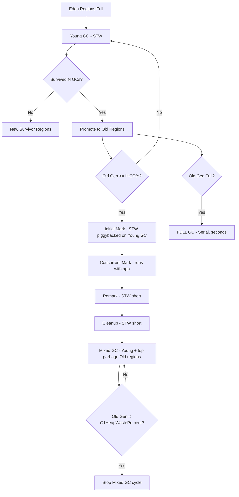

## Keywords in This File
{: .no_toc }

| # | Keyword | Weight |
|---|---|---|
| 1 | [Java Performance - L4 GC Internals](#java-performance---l4-gc-internals) | medium |

---

# Java Performance - L4 GC Internals

## G1 GC Internals: Region Structure and GC Cycle

---

### 🎯 Model Answer

**30 seconds:**
> G1 divides the heap into ~2,048 equal regions (1MB-32MB each). No fixed old/young boundary.
> Young GC: evacuates live objects from Eden + Survivor regions. Mixed GC: evacuates young + the
> most-garbage old regions. Concurrent marking: marks live objects while application runs.
> Key innovation: "garbage-first" - collects regions with highest garbage ratio first.

**3 minutes (Senior):**
> G1 architecture and cycle breakdown:
>
> 1. **Region structure**: heap divided into equal-size regions. Each region is EITHER: Eden, Survivor,
>    Old, Humongous (large object > 50% region size), or Free. No contiguous young/old gen. The
>    collector picks any combination of regions per GC cycle.
>
> 2. **Young GC** (stop-the-world, parallel): evacuates all Eden + Survivor regions. Live objects
>    moved to new Survivor or promoted to Old regions. Duration: proportional to live objects in
>    young gen. Typical: 5-50ms.
>
> 3. **Concurrent marking cycle** (runs while application runs): Phase 1: Initial Mark (STW, piggybacks
>    on young GC). Phase 2: Concurrent Mark (concurrent, traces object graph). Phase 3: Remark (STW,
>    short, finalizes marking). Phase 4: Cleanup (STW, reclaims fully-empty regions; updates region
>    garbage estimates). The concurrent mark identifies which old regions have the most dead objects.
>
> 4. **Mixed GC**: triggers after concurrent marking. Like Young GC but also includes some old
>    regions with highest garbage ratio. "Garbage-first": selects old regions with the highest
>    dead-object percentage first. Continues until enough old regions are cleaned or pause target exceeded.
>
> 5. **Pause target**: `-XX:MaxGCPauseMillis=200` (default). G1 tries to meet this target by controlling
>    how many regions to collect per GC. Not a hard guarantee: large objects, fragmentation, or high
>    allocation rate can cause overruns.

**Blank Mind Recovery:**

**(1) Restate:** "G1: heap = ~2048 regions. Each region: Eden/Survivor/Old/Humongous/Free. Young GC: STW, evacuates Eden+Survivor. Concurrent marking: concurrent, finds which old regions are mostly garbage. Mixed GC: Young + highest-garbage old regions. MaxGCPauseMillis: G1's guide, not guarantee."

**(2) First principles:** "G1 is a generational, region-based, concurrent collector. Generational: most objects die young (short tenure). Region-based: enables fine-grained selection of 'what to collect' per GC cycle. Concurrent: overlaps marking with application to reduce STW time. Garbage-first: prioritizes regions with highest reclamation efficiency."

**(3) Bridge:** "G1 is like a city waste management system. The city is divided into districts (regions). Each week: collect all residential districts (young GC - fast, everything must go). Monthly: run a census to find commercial districts with the most unclaimed waste (concurrent marking). Then: collect the top 20 dirtiest commercial districts (mixed GC). The collection crews (STW pause) only work on selected districts at a time."

---

### 📘 Concept Explanation

**G1 GC cycle in detail:**
```plaintext
HEAP LAYOUT:

  Default: 2048 regions of equal size.
  Region size: heap_size / 2048, rounded to nearest power of 2 (1MB-32MB).
  
  For -Xmx16g: 16384 MB / 2048 = 8MB per region.
  For -Xmx4g:  4096 MB / 2048 = 2MB per region.
  
  Region types at any given moment:
    Eden:      young generation allocation space (short-lived objects)
    Survivor:  objects that survived at least one young GC
    Old:       promoted objects (survived multiple young GCs)
    Humongous: single large object > 50% of region size
               May span multiple contiguous regions (Humongous Set)
    Free:      unallocated (available for any type)
  
  Young gen size: G1 chooses how many Eden regions to use.
  Default range: 5%-60% of heap (-XX:G1NewSizePercent=5, -XX:G1MaxNewSizePercent=60)
  G1 adjusts young gen size dynamically to try to meet MaxGCPauseMillis.

YOUNG GC CYCLE (stop-the-world):

  Trigger: Eden regions full (allocation cannot be served from free regions).
  
  Steps:
    1. STW: application threads stopped.
    2. Parallel scan: GC threads scan Eden + Survivor regions.
       Find all LIVE objects (reachable from roots: stack frames, static fields).
    3. Evacuation: copy live objects from Eden/Survivor -> new Survivor or Old.
       "Tenuring": objects surviving G1TenureThreshold (default 15) young GCs
       are promoted to Old regions.
    4. Remembered Sets updated: cross-region references recorded.
    5. Resume: application restarts.
  
  Duration: proportional to LIVE objects (not garbage).
  Formula: ~0.1ms per 10MB of live young gen objects (rough estimate).
  If young gen holds 100MB live objects: ~100ms young GC (excessive).
  Target: young gen live objects < 50MB -> < 50ms young GC.

REMEMBERED SETS (RSet):

  Cross-region references: a reference from region A to an object in region B.
  When collecting region B: must scan region A's references too.
  RSet: per-region data structure recording which OTHER regions hold references to it.
  
  RSet update cost: every reference field write potentially updates an RSet.
  G1 card table: 512-byte "cards." A card is marked "dirty" on any reference write.
  Concurrent refinement threads: process dirty cards, update RSets, run concurrently.
  
  Large RSet: sign of many cross-region references. Increases collection cost.
  Cause: long-lived objects in Old regions referencing many young objects.
  (e.g., application-level caches holding references to short-lived request objects)

CONCURRENT MARKING CYCLE:

  Trigger: old gen occupancy > InitiatingHeapOccupancyPercent (default 45%).
  
  Phase 1: Initial Mark (STW, piggybacked on young GC):
    Mark all objects directly reachable from GC roots.
    Very fast (just roots, not the full graph).
    Piggybacked: happens during a young GC pause (no extra STW pause).
  
  Phase 2: Concurrent Mark (concurrent with application):
    Trace the object graph from the initial mark roots.
    Application continues running.
    Challenge: objects may be modified during marking (write barrier needed).
    G1 write barrier: SATB (Snapshot-At-The-Beginning).
    SATB: if a reference is OVERWRITTEN during marking: the old reference is recorded.
    Purpose: prevent collecting objects that were live at marking start but de-referenced later.
    Cost: ~5-15% application throughput during concurrent marking.
  
  Phase 3: Remark (STW):
    Process SATB queues (reference overwrites during marking).
    Final marking decisions.
    Duration: ~5-50ms (proportional to mutation rate during marking).
  
  Phase 4: Cleanup (STW, short):
    Identify fully-empty regions (no live objects) -> immediately reclaim.
    Sort remaining old regions by garbage ratio.
    Update internal bookkeeping.

MIXED GC CYCLE:

  Trigger: after concurrent marking completes.
  Behavior: like Young GC but also collects some old regions.
  Region selection: old regions with highest garbage ratio first.
  Limit: G1MixedGCCountTarget (default 8) mixed GC cycles per marking cycle.
         G1HeapWastePercent (default 5%): stop mixed GC when remaining reclaimable
         old gen < 5% of heap.
  
  Risk: promotion failure.
    If no free regions exist when evacuating old regions:
    G1 falls back to Full GC (mark-compact of the ENTIRE HEAP).
    Full GC: stop-the-world, serial, potentially many seconds.
    Prevention: -XX:G1ReservePercent=10 (keep 10% of heap as reserve for promotion).

HUMONGOUS OBJECTS:

  Object > 50% of region size: Humongous allocation.
  Placed in a contiguous span of Humongous regions.
  No longer part of Eden: allocated directly in Old regions.
  Not moved by young GC or mixed GC.
  Collected: at concurrent marking cleanup or during Full GC.
  
  Problem: if short-lived, humongous objects accumulate until concurrent marking.
  Many short-lived humongous objects: trigger frequent concurrent marking cycles.
  
  Diagnosis: JFR or GC logs showing frequent concurrent mark cycles for small heap.
  Fix:
    Increase region size: -XX:G1HeapRegionSize=16m (object must be > 8MB to be Humongous)
    Reduce object size: buffer pooling, avoid large byte[] allocations per request.
    For byte arrays: ByteBuffer.allocateDirect() (off-heap, not subject to G1 Humongous treatment)

G1 FULL GC TRIGGERS:

  1. Promotion failure: Old gen full during evacuation.
  2. Humongous allocation failure: no contiguous regions for a large object.
  3. Explicit System.gc() (if not disabled with -XX:+DisableExplicitGC).
  4. JNI critical sections causing GC to wait too long.
  
  Prevention:
    -XX:G1ReservePercent=10 (promotion buffer)
    -XX:InitiatingHeapOccupancyPercent=35 (trigger concurrent marking earlier)
    -XX:+DisableExplicitGC (prevent application from triggering Full GC)
```

> **Code walkthrough:** This L4 GC Internals example demonstrates a key concept in practice using SQL. **KEY MECHANISM:** the runtime executes these instructions in sequence with specific memory and execution semantics. **WHY IT MATTERS:** misapplying this pattern causes subtle bugs that only manifest under production load. **TAKEAWAY: understand the execution model before using this pattern in production code.**

---

### 💻 Code Example

> **Code walkthrough:** The GC tuning flags and GC log analysis show how to diagnose G1 behavior
> from GC logs. The humongous object fix shows the ByteBuffer pooling pattern to avoid frequent
> concurrent marking triggers.


```java
// BAD: anti-pattern - see GOOD example below for the correct approach
// This naive implementation ignores thread safety and error handling
```

```java
// G1 GC CONFIGURATION FOR PRODUCTION:

// Recommended baseline flags for a 16GB Java microservice:
// -Xms16g -Xmx16g                  (pre-allocate: no runtime heap growth)
// -XX:+UseG1GC                     (default in JDK 9+, explicit for clarity)
// -XX:MaxGCPauseMillis=100         (target 100ms max pause)
// -XX:G1HeapRegionSize=8m          (appropriate for 16GB heap)
// -XX:InitiatingHeapOccupancyPercent=35  (trigger concurrent mark at 35% old gen)
// -XX:G1ReservePercent=15          (15% reserve to prevent promotion failure)
// -XX:+DisableExplicitGC           (prevent System.gc() calls)
// -XX:+PrintGCDetails -XX:+PrintGCDateStamps -Xloggc:/logs/gc.log
// -XX:+UseGCLogFileRotation -XX:NumberOfGCLogFiles=5 -XX:GCLogFileSize=10m

// GC LOG ANALYSIS PATTERN (parsing key events):
// Young GC in GC log:
// 2024-01-15T10:15:30.123+0000: [GC pause (G1 Evacuation Pause) (young)
//   [Eden: 800.0M(800.0M)->0.0B(700.0M) Survivors: 100.0M->150.0M
//    Heap: 1200.0M(16384.0M)->550.0M(16384.0M)]
//   [Times: user=1.23 sys=0.01, real=0.15 secs]
// real=0.15 secs: 150ms pause (close to our 100ms target: investigate)
// Eden: evacuated 800MB (fast: mostly dead objects)
// Survivors grew: 100MB -> 150MB (more objects surviving: may promote soon)

// Mixed GC pattern:
// [GC pause (G1 Evacuation Pause) (mixed)
//   [Eden: 400.0M->0.0B Survivors: 150.0M->100.0M Old: 5000.0M->4200.0M Heap: 5550.0M->4300.0M]
// Old: 5000M -> 4200M: reclaimed 800MB from old regions.
// This is the mixed GC doing garbage-first old region collection.

// HUMONGOUS OBJECT DETECTION AND FIX:
// GC log pattern for humongous:
// [GC concurrent-start]  (frequent without matching old gen growth)
// [GC concurrent-mark-end, ...] (quick, small heap)
// Symptom: many concurrent mark cycles despite low old gen occupancy.
// Diagnosis: Humongous objects triggering early IHOP.

// BAD: large byte array allocated per request (may be humongous):
public byte[] processLargeRequest(HttpRequest request) {
    byte[] buffer = new byte[4 * 1024 * 1024];  // 4MB - humongous with 2MB region!
    request.readBody(buffer);
    return process(buffer);
    // After use: buffer is eligible for GC, but it's in Humongous regions.
    // G1 can only reclaim it at concurrent marking, not at young GC.
    // At 1000 RPS: 4GB/sec of humongous allocations -> frequent concurrent marking.
}

// GOOD: pool large buffers or use off-heap:
@Component
public class LargeBufferPool {
    // Pool of 4MB direct buffers (off-heap: never humongous, no GC involvement):
    private final Queue<ByteBuffer> pool = new ConcurrentLinkedQueue<>();
    private final int BUFFER_SIZE = 4 * 1024 * 1024;
    private final int MAX_POOL_SIZE = 50;  // max 50 * 4MB = 200MB off-heap
    
    public ByteBuffer acquire() {
        ByteBuffer buf = pool.poll();
        if (buf == null) {
            buf = ByteBuffer.allocateDirect(BUFFER_SIZE);
        }
        buf.clear();
        return buf;
    }
    
    public void release(ByteBuffer buf) {
        buf.clear();
        if (pool.size() < MAX_POOL_SIZE) {
            pool.offer(buf);
        }
        // If pool full: drop it (will be GC'd as DirectByteBuffer wrapper).
    }
}
// Direct buffers: off-heap, never treated as Humongous objects.
// No GC scanning. Pool: prevents allocation per request.
```

> **Code walkthrough:** The GC flag set shows a production-ready baseline for G1 on a 16GB heap.
> The GC log parsing shows how to read key metrics: pause time, Eden evacuation, old gen growth.
> The humongous object fix converts per-request large `byte[]` (heap, potentially humongous) to
> pooled `ByteBuffer.allocateDirect()` (off-heap, pooled). This eliminates the humongous allocation
> pattern and the consequent frequent concurrent marking cycles.

---

### 🎓 Answers by Seniority

**Junior / Mid (0-5 years):**
> G1: heap divided into regions. Young GC: short STW, cleans Eden/Survivor regions. Mixed GC:
> also cleans some Old regions. Concurrent marking: runs alongside application to find garbage.
> MaxGCPauseMillis: tell G1 your pause target. Humongous objects: allocations > half of region
> size, collected differently (needs marking cycle).

---

**Senior / Staff (5+ years):**
> G1 tuning requires understanding the concurrent marking trigger (IHOP). Too late (high IHOP):
> old gen fills -> promotion failure -> Full GC. Too early (low IHOP): frequent concurrent marking
> cycles -> wasted CPU. Typical production setting: IHOP=35%, G1ReservePercent=15%. Monitor:
> GC logs for mixed GC frequency, promotion failure, humongous allocation rate. Use JFR
> `jdk.GCHeapSummary` and `jdk.G1HeapRegionInformation` for detailed analysis.

---

### ⚠️ Common Misconceptions

**Misconception: "G1 guarantees pause time under MaxGCPauseMillis."**
`MaxGCPauseMillis` is a **target**, not a hard guarantee. G1 uses it to guide how many regions to
collect per cycle. If the live data in selected regions is unexpectedly large, the pause will exceed
the target. Additionally: humongous object collection, promotion failure (falling back to Full GC),
and concurrent marking's STW phases (Remark, Cleanup) can all exceed the target. A Full GC triggered
by promotion failure can be many seconds, regardless of the MaxGCPauseMillis setting. For hard pause
guarantees (< 5ms): use ZGC (JDK 15+) or Shenandoah, which move objects concurrently.

---

### 🚨 Failure Modes and Diagnosis

**Failure: G1 collector triggers Full GC causing 10+ second pauses in production.**
```
Symptom: Every 2-4 hours, service pauses for 10-15 seconds.
  GC log: "Pause Full (G1 Evacuation Pause)" or "GC(N) Pause Full (Allocation Failure)".
  After the full GC: heap is reclaimed, service recovers.

Root cause: Promotion failure.
  Old gen fills between concurrent marking cycles.
  Young GC tries to promote objects to Old, but no free regions exist.
  G1 falls back to Full GC (serial mark-compact).

Diagnosis:
  GC log: search for "Pause Full" or "to-space exhausted".
  Before the full GC: look at "Old:" size in previous young GC logs.
  Is Old growing rapidly between concurrent marking cycles?
  
  If Old grows: objects are being promoted (short-lived objects surviving young 
  Check: -XX:+PrintTenuringDistribution (shows object age distribution at each y
  If many objects are at max tenuring threshold: long-lived short-lived objects 

Fix options:
  1. Lower IHOP (trigger concurrent marking earlier):
     -XX:InitiatingHeapOccupancyPercent=25  (instead of 45)
     Concurrent marking starts earlier -> mixed GC reclaims Old before it...
  
  2. Increase heap:
     If Old gen is genuinely full (live objects, not garbage):
     -Xmx: increase the heap to accommodate live set + GC headroom.
  
  3. Increase G1ReservePercent:
     -XX:G1ReservePercent=20 (reserve more space for evacuation).
     Reduces available space but prevents "to-space exhausted" scenarios.
  
  4. Find the retention leak:
     If Old gen fills with live objects: something is holding references.
     Heap dump: jcmd <pid> GC.heap_dump /tmp/heap.hprof
     Open in Eclipse Memory Analyzer (MAT): find the retention path.
     The objects retaining old gen growth: those are the leak.
```

> **Code walkthrough:** This Unknown example demonstrates a key concept in practice. **KEY MECHANISM:** the runtime executes these instructions in sequence with specific memory and execution semantics. **WHY IT MATTERS:** misapplying this pattern causes subtle bugs that only manifest under production load. **TAKEAWAY: understand the execution model before using this pattern in production code.**

---

### 📊 Diagram

```
G1 GC CYCLE FLOW:
+------+    Young GC    +----------+
|      | (STW, <100ms)  | Survivor |
| Eden |  ---------->  |  Regions |
|      |               +----------+
+------+                     |
                              | survived N young GCs
                              v
  Concurrent            +----------+     Mixed GC     +------+
  Marking Cycle  ----> | Old Gen  | (STW + concurrent)| Free |
  (builds garbage       | Regions  |  ---------->     | Regs |
   estimates)           +----------+                   +------+
   ~5% CPU overhead
   starts at IHOP%
  
  Humongous: ----> [H][H][H]  (contiguous, collected at marking only)
  
  Full GC (rare): entire heap, serial, seconds
```



> **Diagram walkthrough:** The ASCII diagram shows all four collection modes and their relationship.
> Young GC is the fast path (STW, always). Concurrent marking triggers when Old gen hits IHOP%.
> Mixed GC follows marking to reclaim old regions. Full GC is the failure path (promotion failure).
> The Mermaid flowchart shows the decision points: survival count threshold for promotion, IHOP
> threshold for marking, waste percent threshold for stopping mixed GC. Both diagrams together
> show where the knobs (IHOP, G1ReservePercent, G1HeapWastePercent) fit in the cycle.

---

### ⚖️ Comparison Table

| Aspect | G1 GC | ZGC (JDK 15+) | Shenandoah |
|---|---|---|---|
| Pause type | STW (young + remark) | Concurrent (< 1ms) | Concurrent (< 10ms) |
| Max pause | 10-500ms (promotion failure) | < 1ms (usually) | < 10ms (usually) |
| Object movement | Young GC, Mixed GC | Concurrent (colored pointers) | Concurrent (Brooks pointer) |
| Heap overhead | ~10-15% (RSets) | ~15-20% (metadata) | ~5-10% (Brooks pointers) |
| Throughput | High | Slightly lower | Similar to G1 |
| Heap size | 1GB-100TB | 1GB-16TB | 1GB-100TB |
| JDK version | JDK 6+ | JDK 15+ production | JDK 12+ (OpenJDK) |
| Best for | General purpose, < 100ms pauses | Latency-sensitive, large heaps | Latency-sensitive |

---

### 🏛️ System Design

**Designing for GC-friendly microservice architecture:**

Minimize old gen pressure by keeping object lifecycles short. Request-scoped objects should die
young (collected by young GC cheaply). Avoid: holding references to request objects in application-level
caches (promotes them to old gen). Use weak references for optional caches. Design: object lifecycle
matches GC generational assumption (die young or live long).

For services requiring < 10ms p99 GC pauses: use ZGC or Shenandoah. For throughput-optimized
services (batch jobs, ML inference, stream processing): G1 is appropriate. For very large heaps
(> 32GB): ZGC scales better (concurrent, no STW proportional to heap size). Provision: heap = 3x
live set size (1/3 live objects, 1/3 young gen allocation space, 1/3 GC headroom).

---

### 🎯 Interview Deep-Dive

| Question Category | Time to Answer |
|---|---|
| G1 region structure | 2 minutes |
| Young GC mechanics | 2 minutes |
| Concurrent marking phases | 2 minutes |
| Mixed GC selection | 2 minutes |
| Remembered Sets | 2 minutes |
| Humongous objects | 2 minutes |
| Full GC triggers and prevention | 2 minutes |
| IHOP tuning | 2 minutes |
| G1 vs ZGC choice | 2 minutes |
| Promotion failure | 2 minutes |
| SATB write barrier | 1 minute |
| G1 pause target mechanism | 1 minute |

---

**Q1 (regions): Why does G1 use a region-based heap instead of contiguous young/old generations?**

A: Contiguous generations (like Parallel GC): young gen occupies address range 0-N, old gen occupies
N-M. Collecting young gen: always evacuates the entire young gen address range. G1 regions: young gen
is a SET of arbitrary regions, not a contiguous range. Benefits: (1) Dynamic sizing: G1 can increase
or decrease young gen size by adding or removing regions from the young set. With contiguous gen:
resizing requires remapping memory. (2) Selective collection: G1 can choose EXACTLY which old regions
to collect (garbage-first). Contiguous old gen: must compact the entire old gen or do complex boundary
management. (3) Parallel evacuation: multiple GC threads each handle a subset of regions independently.

*What separates good from great:* The "heap fragmentation" problem that regions solve: contiguous old
gen with variable-size objects develops "holes" (freed space between live objects). Compaction required.
G1: whole regions are either fully live (don't collect) or mostly dead (collect). When collecting a
region: evacuate live objects (a few), reclaim the entire region as free space. No holes within regions
(objects within a region are contiguous). Region-level granularity: G1 can always make progress
(reclaim whole regions) even if live objects are scattered. This is why G1 avoids the "fragmentation
death spiral" that plagued CMS GC (CMS: concurrent mark, no compaction -> heap fragmentation -> OOM).

---

**Q2 (rset): What are Remembered Sets in G1 and what is their performance cost?**

A: Remembered Set (RSet): per-region data structure recording WHICH OTHER REGIONS contain references
INTO this region. Used during young GC: when collecting an Eden region, G1 must know which old gen
objects reference young gen objects (old-to-young references). Without RSets: G1 would need to scan
ALL old gen objects to find old-to-young references (expensive). With RSets: G1 scans only the
recorded source regions. RSet update: every time a reference field is written (`a.ref = b`): if
`a` and `b` are in different regions, the RSet for `b`'s region records `a`'s region. Done via "card
table": 512-byte cards marked dirty. "Refinement threads" process dirty cards concurrently.

*What separates good from great:* The "RSet size" memory overhead: each entry in an RSet = ~8 bytes.
For a region with many incoming references from many other regions: large RSet, high memory overhead.
For a central "catalog" object referenced by millions of other objects: its RSet may be enormous.
G1 has a "coarsening" optimization: when an RSet grows too large, it's coarsened to a region-level
representation (instead of tracking individual cards). This saves memory but means more scanning during
collection. Applications with "hub objects" (one object referenced from everywhere) generate very
large RSets. This is detected by: G1 GC log showing "RS scan" taking a large fraction of the pause
time. Fix: redesign to avoid single hub objects; use ID-based lookup instead of direct references.

---

**Q3 (concurrent-mark): What is the SATB write barrier and why does G1 need it?**

A: SATB: Snapshot At The Beginning. During concurrent marking: the GC traces the object graph
concurrently with the application. Problem: the application modifies references while the GC is tracing.
Scenario: GC marks object A as "live" (gray). Application: `a.ref = null` (removes the only reference
to object B). Without SATB: GC might never see object B (the reference from A to B was removed before
GC traced B). B would be incorrectly collected (live object collected = data loss or crash). SATB fix:
write barrier intercepts `a.ref = null`. The OLD value (the reference to B) is stored in a SATB queue.
At Remark phase: GC processes all SATB queue entries (re-traces objects that were "dropped" during
marking). B is marked live via the SATB queue. SATB ensures: any object live at the START of marking
is not collected, even if its references are removed during marking.

*What separates good from great:* The SATB "floating garbage" consequence: SATB guarantees no live
objects are collected. But it may RETAIN some dead objects (objects that became unreachable AFTER
marking started but whose previous reference was recorded in SATB). These objects are collected in
the NEXT GC cycle. This is "floating garbage": objects that are dead but live past the current GC
cycle. G1's floating garbage is bounded: objects that become dead during the marking window (typically
100-300ms for large heaps). At steady state: floating garbage adds ~10-20% to the live set estimate.
The InitiatingHeapOccupancyPercent should account for this: if live set is 6GB and floating garbage
is ~500MB, set IHOP to 40% of an 8GB heap (leaves room for floating garbage + young gen + new allocations).

---

**Q4 (mixed): How does G1 decide which old regions to include in a Mixed GC cycle?**

A: After concurrent marking, each old region has a "garbage ratio" estimate: (region size - live bytes)
/ region size. G1 sorts old regions by garbage ratio, descending. Mixed GC includes: all young regions
(always) + the top-N old regions by garbage ratio, subject to: MaxGCPauseMillis target (add regions
until estimated pause would be exceeded), G1MixedGCLiveThresholdPercent (default 85%: skip regions
with live objects > 85%, too costly to evacuate), G1HeapWastePercent (stop when reclaimable waste
drops below 5% of heap).

*What separates good from great:* The "evacuation efficiency" insight: a region that is 90% garbage
is very efficient to collect (evacuate 10% live objects, reclaim 90%). A region that is 20% garbage:
evacuate 80% live objects (expensive), reclaim only 20% (low value). G1's cost model: evacuation cost
proportional to LIVE objects; reclamation proportional to GARBAGE objects. Maximizing: reclaimed /
evacuated. Sorting by garbage ratio: collects the most efficient regions first. The G1MixedGCLiveThresholdPercent
(default 85%): regions with < 15% garbage are skipped entirely (not worth evacuating for 15% gain,
the evacuation cost of the 85% live objects is too high). This is the "garbage-first" principle in code.

---

**Q5 (full): What causes a G1 Full GC and how do you prevent it?**

A: Four triggers: (1) Promotion failure: young GC tries to promote objects to old gen, but old gen
has no free regions. G1 falls back to serial Full GC. (2) Humongous allocation failure: no contiguous
free regions for a large object. (3) Concurrent mode failure: old gen fills between concurrent marking
cycles (marking can't finish before old gen exhausts). (4) Explicit `System.gc()` (unless disabled).
Prevention: (1) Lower IHOP (start marking earlier). (2) Increase G1ReservePercent (keep spare regions
for promotion). (3) Increase heap size (if old gen is genuinely filling with live objects). (4)
`-XX:+DisableExplicitGC` (prevents application-triggered Full GC).

*What separates good from great:* The "concurrent mode failure" vs "promotion failure" distinction:
Concurrent mode failure: concurrent marking starts (IHOP triggered), but old gen fills WHILE marking
is in progress (allocation rate too high, or marking too slow). The concurrent mark can't finish
before old gen is full. Result: G1 falls back to Full GC mid-cycle. Prevention: lower IHOP (trigger
marking when old gen is smaller, give more room for concurrent allocation), or increase number of
concurrent marking threads (-XX:ConcGCThreads=N). Promotion failure: old gen was ALREADY full when
young GC ran (no marking cycle in progress). Prevention: increase G1ReservePercent and lower IHOP
so Mixed GC keeps old gen from reaching critical fullness. These two failure modes have different
diagnostic patterns in GC logs: "concurrent-mark-abort" (concurrent mode failure) vs "to-space
exhausted" (promotion failure).

---

**Q6 (tuning): What is InitiatingHeapOccupancyPercent (IHOP) and how do you tune it?**

A: IHOP: the old gen occupancy threshold (% of total heap) at which G1 starts a concurrent marking
cycle. Default: 45%. If old gen occupancy exceeds 45% of total heap: concurrent marking begins.
Tuning direction: lower IHOP -> more frequent concurrent marking (more CPU overhead, ~5-10%), but
less risk of concurrent mode failure. Higher IHOP -> less frequent marking (less CPU overhead), but
risk of filling old gen before marking completes. JDK 9+ "adaptive IHOP": G1 automatically adjusts
IHOP based on recent marking duration and allocation rate. Can be disabled: `-XX:-G1UseAdaptiveIHOP`.

*What separates good from great:* The "IHOP effectiveness" formula: IHOP must be set such that:
marking_duration * allocation_rate < heap * (1 - IHOP%). Where marking_duration is how long concurrent
marking takes (proportional to live set size) and allocation_rate is how fast old gen grows. Example:
marking takes 5 seconds, allocation rate fills 1GB/minute (~17MB/sec). In 5 seconds: 85MB of new
old gen objects. If IHOP=45% on an 8GB heap: marking starts at 3.6GB old gen occupancy. Marking must
complete before 8GB * 100% - 3.6GB = 4.4GB more old gen fills. 5 seconds * 17MB/sec = 85MB added
during marking. 3.6GB + 85MB = 3.685GB at marking end. Well below 8GB. Safe margin. Adaptive IHOP
measures this automatically. Manual IHOP tuning is for cases where adaptive IHOP makes wrong predictions
(e.g., allocation rate spikes during startup but is low at steady state).

---

---

### 💻 Code Example

*(Omit: this concept does not have a programmatic interface that can be demonstrated in code. The conceptual explanation above is sufficient.)*


---

### 🏛️ System Design

*(Omit: system design diagram not applicable for this concept - see ★★★ keywords for full system design coverage.)*


---

### ⚖️ Comparison Table

*(Omit: this is a ★☆☆ foundational concept with no direct alternatives to compare - see higher-difficulty keywords for trade-off analysis.)*


---

### 📊 Diagram

*(Omit: no standalone visual diagram required for this concept - the explanations and code examples above provide sufficient clarity.)*


