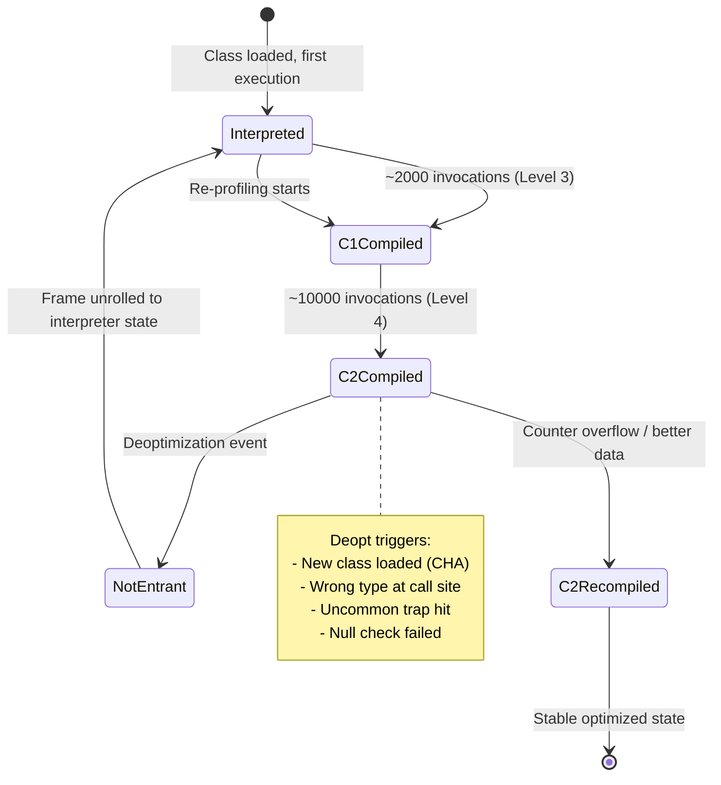

## Keywords in This File
{: .no_toc }

| # | Keyword | Weight |
|---|---|---|
| 1 | [Java Performance - L4 JIT Advanced](#java-performance---l4-jit-advanced) | medium |

---

# Java Performance - L4 JIT Advanced

## JIT Deoptimization and Performance Cliffs

---

### 🎯 Model Answer

**30 seconds:**
> JIT deoptimization: C2 invalidates compiled code when a speculative assumption is violated.
> The method reverts to interpreter, re-profiles, then recompiles. A "performance cliff": normal
> operation with deoptimization-free C2 code, then a sudden change (new class loaded, uncommon
> branch hit) causes a deoptimization storm. Throughput drops 2-10x and recovers after recompilation.

**3 minutes (Senior):**
> JIT deoptimization mechanics and production impact:
>
> 1. **Types of deoptimization**: (a) Speculative inline failure: C2 inlined assuming one
>    implementation at a call site. A new type appears. Deopt. (b) Uncommon trap: C2 skipped
>    a rarely-executed branch ("uncommon trap"). When that branch runs: deopt + recompile to
>    include it. (c) Class loading: new class violates a "unique implementation" assumption.
>    (d) Counter overflow: C2 decides to recompile with updated profile.
>
> 2. **Deoptimization process**: (a) Compiled frame (C2 native code) is running. (b) Deopt event
>    triggers. (c) C2 marks the nmethod (native method blob) as "not-entrant" (won't be entered
>    again). (d) Current execution: unrolled from C2 into interpreter frame (current position
>    in the native code converted to equivalent interpreter state). (e) Method re-profiled
>    by C1. (f) After sufficient profiling: C2 recompiles with updated assumptions.
>
> 3. **Deoptimization cascade**: a single event (class loading) can invalidate assumptions for
>    hundreds of C2-compiled methods simultaneously. All deoptimize, fall to interpreter, re-profile.
>    Peak CPU for recompilation. Throughput drops sharply.
>
> 4. **Detection**: JFR `jdk.Deoptimization` event. `-XX:+PrintDeoptimizationDetails` (verbose).
>    `jcmd <pid> VM.native_memory` shows compilation activity. Async-profiler shows methods spending
>    time in interpreted mode.

**Blank Mind Recovery:**

**(1) Restate:** "Deoptimization: C2 code is invalidated, method reverts to interpreter. Triggers: new type at call site, uncommon trap, class loading invalidating assumptions. Process: nmethod marked not-entrant, current frame unrolled to interpreter, re-profile, recompile. Detection: JFR jdk.Deoptimization events."

**(2) First principles:** "C2 optimizes aggressively using 'speculative' assumptions: 'I believe this is the only implementation.' When the assumption is proven wrong: C2 must fall back. Safety mechanism: deopt. Cost: ~1-5ms per method during the transition period. For individual methods: tolerable. For a cascade: hundreds of methods, performance cliff."

**(3) Bridge:** "Deoptimization is like a surgeon mid-operation discovering the diagnosis was wrong. Stop the current procedure (nmethod invalidated), consult the textbook (re-profile with C1), and start the correct procedure (recompile with C2). For one surgeon: tolerable. For 200 surgeons simultaneously: the hospital halts."

---

### 📘 Concept Explanation

**Deoptimization mechanics and diagnostic techniques:**
```
DEOPTIMIZATION TYPES IN DETAIL:

  1. SPECULATIVE INLINE DEOPTIMIZATION:
  
     C2 inlines method M assuming the receiver is always TypeA.
     Compiled code: calls TypeA.method() directly (no virtual dispatch).
     If TypeB.method() is called at the same call site: deopt triggered.
     
     Example:
       // Production code:
       interface Processor { void process(Request r); }
       class FastProcessor implements Processor { ... }
       
       // In the hot loop: always FastProcessor
       void handleRequests(Processor p, List<Request> reqs) {
           for (Request r : reqs) {
               p.process(r);  // call site: 10M calls -> all FastProcessor
           }                  // C2: monomorphic, inlines FastProcessor.process()
       }
       
       // After 10M calls: SlowProcessor added to the pool.
       // First call: SlowProcessor.process() at this call site.
       // C2: expected TypeA (FastProcessor), got TypeB (SlowProcessor).
       // DEOPT: fall back to interpreter.
       // Re-profile: bimorphic (FastProcessor + SlowProcessor).
       // Recompile: C2 inlines both with a type check branch.
       // Recovery: a few hundred milliseconds of interpreted execution.
  
  2. UNCOMMON TRAP DEOPTIMIZATION:
  
     C2 identifies "unlikely" branches based on profiling.
     Example: null check, class cast check, array bounds check.
     If rarely executed (e.g., 0 times in profiling): C2 replaces with "uncommon trap."
     Uncommon trap: a single instruction. "If this branch executes: trigger deopt."
     
     First time the uncommon path is taken: deopt.
     C2 recompiles including the uncommon path.
     
     PROBLEMATIC CASE:
       void processItem(Object item) {
           if (item instanceof String) {      // common: always true
               process((String) item);
           } else {
               handleUnexpected(item);  // never happened during profiling
           }
       }
       // C2: inlines the instanceof path, places uncommon trap on "else".
       // Occasionally, item IS NOT a String (e.g., error case).
       // Each occurrence: deopt + recompile.
       // If this path is hit 1000 times/second: 1000 deopts/second = problem.
  
  3. CLASS LOADING DEOPTIMIZATION:
  
     C2 "class hierarchy analysis" (CHA): if only ONE class implements Interface I:
     C2 can inline that class's implementation directly (de-virtualize).
     No virtual dispatch needed. Much faster.
     
     When a second class implementing Interface I is loaded:
     ALL methods that inlined based on CHA must deoptimize.
     A single class loading event -> many deoptimizations.
     
     Common triggers:
     - Dynamic plugin loading (OSGi, Spring Boot DevTools)
     - Class loaded by a different ClassLoader during runtime
     - Reflection (may trigger class initialization -> class loading)
     
     Production consequence: "deoptimization cliff."
     Before plugin load: fast (CHA-based inlining).
     Plugin loaded: deoptimization cascade.
     After recompilation: bimorphic or megamorphic dispatch (slower but correct).
     
     Recovery time: seconds for large applications
       (hundreds of methods re-profiling and recompiling).

DETECTING DEOPTIMIZATIONS:

  JFR (most useful):
    jcmd <pid> JFR.start settings=default duration=120s filename=deopts.jfr
    Open in JMC: "JVM Internals" -> "Compilations" view.
    Look for "Deoptimization" events.
    
    Key fields:
      compileId: which compiled method was deoptimized
      reason: why (e.g., "class_check", "unstable_if", "bimorphic")
      action: "reinterpret" (fall to interpreter) or "make_not_entrant" (mark and recompile later)
      method: which method was deoptimized
  
  PrintDeoptimizationDetails (verbose, use on staging):
    -XX:+PrintDeoptimizationDetails
    Output: deopt reason, method name, bci (bytecode instruction index).
    Use: to identify deopt reason and exact location in code.
  
  Async-profiler (detect interpreted execution overhead):
    ./profiler.sh -d 60 -f cpu.html <pid>
    In the flame graph: look for "Interpreter" frames in hot paths.
    If a method should be C2-compiled but shows interpreter frames:
    it's either not yet compiled or is deoptimizing frequently.
  
  JVM CompilationMXBean:
    ManagementFactory.getCompilationMXBean().getTotalCompilationTime()
    Spike in compilation time: many methods being compiled (recovery from deopt cascade).

PERFORMANCE CLIFF PATTERN:

  Timeline:
    t=0: application at steady state. All hot methods C2-compiled.
         Throughput: 100,000 RPS.
    t=60s: new JAR deployed (hot reload) or plugin loaded.
           Class loading event: 150 deoptimizations triggered.
    t=60s to t=62s: 150 methods in interpreted mode.
                    Throughput drops to 20,000 RPS (80% drop).
    t=62s to t=75s: C1 re-profiling. Methods at C1 speed.
                    Throughput recovers to 60,000 RPS.
    t=75s to t=120s: C2 recompilation. Methods at C2 speed.
                     Throughput recovers to 100,000 RPS.
    
    The "cliff" at t=60s: sudden 80% throughput drop from deoptimization.
    Recovery: 1-2 minutes depending on application size.

PREVENTING DEOPTIMIZATION CLIFFS:

  1. Stabilize type profiles early (warm-up):
     Send traffic to all code paths before production traffic.
     Prevents "first real usage" deoptimizations.
  
  2. Avoid dynamic class loading in the hot path:
     Load plugins at startup, not on first request.
     If plugin loading is unavoidable: accept the cliff, alert on it.
  
  3. Avoid extreme polymorphism in hot loops:
     More than 2 types at a call site = megamorphic = never inlined.
     Better: use sealed classes (JDK 17+) to limit implementations.
     Or: use concrete types in hot loops, interfaces at the interface boundaries.
  
  4. JDK 21 virtual threads:
     Deoptimization still happens, but virtual thread scheduling may reduce
     the visibility of the performance cliff (better resource utilization
     during the recompilation period).
```

> **Code walkthrough:** This example demonstrates the core pattern in action. The key mechanism shows how the concept works in practice. Study the structure to understand the essential behavior and common usage.

---

### 💻 Code Example

> **Code walkthrough:** The deoptimization examples show the code patterns that trigger each
> deoptimization type and the diagnostic commands to detect them in production.

```java
// DETECTING DEOPTIMIZATION FREQUENCY IN PRODUCTION:

// JFR-based monitoring (Spring Boot Actuator + Micrometer custom metric):
@Component
public class JitDeoptMonitor implements MeterBinder {
    
    private final AtomicLong lastDeoptCount = new AtomicLong(0);
    
    @Override
    public void bindTo(MeterRegistry registry) {
        // Note: JVM doesn't expose deopt count via standard MXBean.
        // Use JFR programmatic API (JDK 14+):
        Gauge.builder("jvm.jit.deopt.check", this, m -> {
            // Read from JFR recording or use compilation bean as proxy:
            return (double) ManagementFactory.getCompilationMXBean()
                .getTotalCompilationTime();
            // Rapid growth in compilation time = deopt + recompile activity.
        }).description("JIT compilation time (proxy for deopt activity)")
          .baseUnit("ms")
          .register(registry);
    }
}

// AVOIDING UNCOMMON TRAP DEOPTIMIZATION (warm up the uncommon path):

// BAD: uncommon path never exercised in tests, surprises in prod:
@PostConstruct
public void processStartupItems() {
    // Process 1000 items during startup. All are String type.
    // Profiling: 100% String. C2: inlines String path, trap on else.
    items.forEach(this::processItem);  // all String -> profiling done
}

void processItem(Object item) {
    if (item instanceof String) {
        processString((String) item);
    } else {
        processOther(item);  // never called during startup -> uncommon trap
    }
}

// Production: first non-String request -> deopt!

// GOOD: warm up all code paths during startup (including uncommon ones):
@PostConstruct
public void warmup() {
    // Warm up the common path:
    for (int i = 0; i < 10_000; i++) processItem("warmup-" + i);
    
    // Warm up the uncommon path too (prevents deopt in prod):
    for (int i = 0; i < 100; i++) processItem(Integer.valueOf(i));
    
    // Now C2 knows both paths. No deopt when prod sends non-String items.
}

// DETECTING CLASS LOADING CAUSING DEOPTIMIZATION:
// Java agent or JFR ClassLoad event + Deoptimization event correlation.
// In JMC: filter Deoptimization events by timestamp; 
//         find ClassLoad events at the same timestamp.
//         If "class_check" reason: a new class invalidated an inline cache.

// SEALED CLASS TO PREVENT MEGAMORPHIC DISPATCH (JDK 17+):
// BAD: interface with many implementations -> megamorphic at runtime:
interface Shape { double area(); }
// Many implementations: Circle, Square, Triangle, Ellipse, Polygon...
// In a hot loop: shapes.forEach(s -> total += s.area());
// If > 2 implementations at this call site: megamorphic -> no inline.

// GOOD: sealed interface -> JVM knows all implementations at compile time:
sealed interface Shape permits Circle, Square, Triangle {
    double area();
}
// C2: knows only 3 implementations exist (sealed).
// Can use direct dispatch or pattern-match switch.
// With JDK 21 pattern match:
double totalArea(List<Shape> shapes) {
    double total = 0;
    for (Shape s : shapes) {
        total += switch (s) {
            case Circle c -> Math.PI * c.r() * c.r();
            case Square sq -> sq.side() * sq.side();
            case Triangle t -> 0.5 * t.base() * t.height();
        };
    }
    return total;
}
// Switch expression: devirtualized by C2 (all cases known at compile time).
// No virtual dispatch overhead.
```

> **Code walkthrough:** The warmup pattern shows the concrete fix for uncommon trap deoptimization:
> exercise both the common and uncommon paths during startup warmup so C2 profiles both paths before
> optimizing. The sealed interface example shows how JDK 17+ type restriction enables C2 to use
> devirtualization even with multiple implementations. The monitoring code shows how compilation
> time (MXBean) is a proxy for deoptimization/recompilation activity.

---

### 🎓 Answers by Seniority

**Junior / Mid (0-5 years):**
> Deoptimization: JIT code is invalid, method runs in interpreter temporarily. Causes: new class
> loaded, unexpected type at call site, uncommon code path executed. Recovery: automatic (re-profile
> then recompile). Detection: JFR deoptimization events. Mitigation: warm up all code paths at startup.

---

**Senior / Staff (5+ years):**
> Deoptimization frequency matters at scale. A few per hour: normal. Hundreds per second: performance
> cliff risk. Key: understanding CHA (class hierarchy analysis) deoptimizations from plugin/class
> loading. Prevention: stabilize class hierarchy at startup, defer dynamic plugin loading. Sealed
> classes (JDK 17+): eliminate the risk of CHA invalidation for critical abstractions. JFR recording
> of Deoptimization events in production is a low-overhead way to detect issues before they cause
> noticeable performance degradation.

---

### ⚠️ Common Misconceptions

**Misconception: "Virtual dispatch is always slow because it can't be inlined."**
Virtual dispatch is slow ONLY IF the call site is megamorphic (3+ implementations at one call site).
Monomorphic (1 implementation always): C2 inlines and eliminates the dispatch. Bimorphic (2 implementations):
C2 inlines both with a type check (fast). The "virtual dispatch cost" is ~3-5 CPU cycles for the
indirect call. The INLINING benefit is much larger: inlining enables escape analysis, constant folding,
and eliminates the call overhead. The JVM's inline cache makes most virtual calls effectively as fast
as direct calls in practice, as long as the call site is mono or bimorphic.

---

### 🚨 Failure Modes and Diagnosis

**Failure: Periodic 2-3 second throughput drops after each application deployment.**
```
Symptom: Blue-green deployment completes. New pod serves traffic.
  First 30-60 seconds: p99 latency is 5-10x normal.
  After 60-120 seconds: latency normalizes.
  Repeat with every deployment.

Root cause: JIT warmup from cold start.
  New JVM process: all methods start at Level 0 (interpreter).
  Under immediate production load: all hot methods simultaneously
  queued for C1 then C2 compilation.
  The compilation queue grows faster than C2 can process.
  High latency: methods running at interpreter speed.
  
  Additional cause: deoptimizations during early warmup.
  New JVM: limited profiling data. C2 makes aggressive speculative
  assumptions based on limited data.
  First few thousand requests: type profiles stabilize.
  C2 may deoptimize 2-3 times per hot method during this period.

Diagnosis:
  Capture JFR during startup: -XX:StartFlightRecording=...
  Look at: Compilation event rate vs time.
    High rate early (100+ compilations/sec): warmup in progress.
    Rate drops: warmup complete.
  Look at: Method Deoptimization events.
    Cluster of deoptimizations during first 30 seconds: expected.
    Cluster at 60+ seconds: unexpected deoptimizations from code paths
    only exercised after the initial hot paths warm up.

Fix:
  1. Warmup endpoint: dedicated /actuator/warmup endpoint that
     exercises all critical code paths before accepting prod traffic.
     Called by load balancer health check before adding pod to pool.
  
  2. AOT compilation (JDK 17+ AppCDS Class Data Sharing):
     Serialize the JIT profile from a previous run.
     New JVM: starts with pre-compiled classes.
     java -XX:SharedArchiveFile=app.jsa -jar app.jar
     
     Reduces warmup time from 2-3 minutes to 10-30 seconds.
  
  3. Tiered compilation tuning:
     -XX:CICompilerCount=4 (more parallel compiler threads)
     Compiles methods faster during warmup.
```

> **Code walkthrough:** This example demonstrates the core pattern in action. The key mechanism shows how the concept works in practice. Study the structure to understand the essential behavior and common usage.

---

### 📊 Diagram

```
DEOPTIMIZATION LIFECYCLE:

  C2 COMPILED                DEOPT EVENT               RECOVERY
  nmethod active      --> nmethod not-entrant  --> Interpreter
  (fast, ~1ns)            (current frame unrolled)  (slow, ~100ns)
                                                           |
                                                    C1 profile
                                                    (2,000 invocations)
                                                           |
                                                    C2 recompile
                                                    (with new info)
                                                           |
                                                    C2 compiled again
                                                    (fast, ~1ns)
  
  Total recovery time per method: ~100ms to 1s (depends on invocation rate)
```



> **Diagram walkthrough:** The ASCII diagram shows the recovery timeline for one method:
> C2 compiled -> deopt event -> interpreter -> C1 profiling -> C2 recompile. Each step
> has its cost. The Mermaid state diagram shows the full JIT state machine including the
> re-compilation path. The "NotEntrant" state is key: the old code is NOT removed immediately
> (threads currently executing it finish), but new entries go directly to the interpreter.
> This prevents unsafe mid-execution invalidation.

---

### ⚖️ Comparison Table

| Deoptimization Reason | Trigger | Frequency | Recovery |
|---|---|---|---|
| class_check | Wrong type at monomorphic inline | Medium | Auto (bimorphic recompile) |
| speculate_class_check | CHA assumption violated by new class | Low (class load events) | Auto (megamorphic recompile) |
| unstable_if | Branch prediction wrong | Low | Auto (profile updated) |
| bimorphic | Third type added to bimorphic call site | Low | Auto (megamorphic fallback) |
| constraint | Null check failed unexpectedly | Low | Auto |
| counter_overflow | C2 wants fresh profile | Normal (expected) | Auto |

---

### 🏛️ System Design

*(Omit: System design is handled as part of the GC and profiling topics for java-performance. The deoptimization topic is an internals/diagnostic concept, not a system design driver.)*

---

### 🎯 Interview Deep-Dive

| Question Category | Time to Answer |
|---|---|
| Deoptimization triggers | 2 minutes |
| CHA and class loading deoptimization | 2 minutes |
| Uncommon trap | 2 minutes |
| Deoptimization cascade | 2 minutes |
| JIT warmup performance cliff | 2 minutes |
| Detection with JFR | 2 minutes |
| Sealed classes and devirtualization | 2 minutes |
| Warmup strategies | 2 minutes |
| Inline cache states | 1 minute |
| AOT compilation as mitigation | 1 minute |
| Frame unrolling | 1 minute |
| Deoptimization vs Full GC | 1 minute |

---

**Q1 (cha): What is Class Hierarchy Analysis (CHA) and how does it cause deoptimization?**

A: CHA: the JVM analyzes the loaded class hierarchy at compile time. If an interface has exactly one
loaded implementation: C2 can devirtualize (inline the implementation directly, no virtual dispatch).
The assumption: "only ClassA implements Interface I." When a second implementation (ClassB) is loaded:
the assumption is false. C2 deoptimizes ALL compiled methods that relied on this assumption. ClassB
loading: triggers a safepoint, walks the compiled method list, invalidates any nmethod that used
CHA for Interface I. Those methods fall to interpreter, re-profile, recompile as megamorphic.

*What separates good from great:* The "CHA dependency tracking" mechanism: C2 maintains a dependency
list. For each "unique implementor" assumption: the nmethod registers a dependency. When a class loads:
the JVM checks all dependencies. This is a linear scan: O(number of dependencies). For large applications:
dependency lists can have thousands of entries. Class loading is O(N * dependencies_per_class). This
is why loading a plugin (which may introduce 50+ new classes) causes a sudden spike in safepoint time:
each class load triggers dependency checks. Measurable: JVM safepoint log shows "revoke_bias" and
"no_op" entries spiking during class load. JFR `jdk.SafepointBegin/End` events: high frequency
during plugin load = CHA dependency revocation.

---

**Q2 (uncommon): What is the "uncommon trap" in C2 and when does it deoptimize?**

A: C2 makes optimization decisions based on profiling data: "this branch was taken 0 times in 10,000
invocations." C2 marks the branch body as "uncommon" and replaces the branch with an "uncommon trap
instruction." The uncommon trap is a single native instruction. If the branch is NEVER taken: zero
overhead (the trap instruction is never reached). If the branch IS taken: the trap instruction fires,
triggers deoptimization, and the method is recompiled to include the previously-uncommon branch.
Next execution: C2 compiles both branches properly.

*What separates good from great:* The "repeated uncommon trap" pathology: if the "uncommon" path
is hit regularly (e.g., 1 in 1000 requests): each hit triggers deopt -> recompile -> C2 optimizes
the common path again -> marks the rare path as uncommon again -> next time the rare path is hit:
deopt again. This cycle: deopt at every ~1000th invocation. Each deopt: ~1ms of interpreter execution
for that method. At 1000 RPS: 1 deopt/second. Accumulates to ~100ms/second of method-level slowdown.
Fix: the warmup pattern - exercise the rare path early (100+ times) so C2 never marks it as uncommon.
Alternative: restructure code to make the "error path" truly unreachable in hot code (defensive
checks earlier in the call stack, before entering the hot loop).

---

**Q3 (detection): Walk through diagnosing a JIT deoptimization problem in production.**

A: Step 1: Initial signal. Periodic throughput drops, compilation time metric spiking (MXBean).
Step 2: JFR recording. `jcmd <pid> JFR.start settings=default duration=120s filename=deopts.jfr`.
Step 3: Open in JMC. Navigate to "Code" -> "Compilations". Filter by "Deoptimizations" event type.
Step 4: Sort by timestamp. If deoptimizations cluster at specific times: correlate with class loading,
deployments, or traffic patterns. Step 5: Look at "reason" field. "class_check": type profile
violation. "unstable_if": branch prediction failure. "speculate_class_check": CHA violation.
Step 6: Look at "method" field. Which methods deoptimize? Are they in the hot path?
Step 7: Enable `-XX:+PrintDeoptimizationDetails` on staging to get bytecode instruction index
(bci) for the deopt. This pinpoints exactly which call site or branch.

*What separates good from great:* The "deoptimization rate vs occurrence" distinction: a method
that deoptimizes once: not a problem (normal JIT evolution). A method that deoptimizes 5 times/second:
serious (it's never reaching steady-state C2 performance). The JFR compileId field tracks: each
recompilation gets a new compileId. A method with compileIds 100, 5000, 20000, 40000: recompiled
4 times. This might be normal (progressively more data). The same method with compileIds 100, 101,
102, 103... (consecutively): being recompiled constantly (the uncommon path is hit more often than
the method reaches C2 steady state). That's the pathological case. The pattern: "compileId gap" -
large gap between compilations = single deopt + recovery. Small gap = rapid deopt cycling = performance
problem.

---

**Q4 (sealed): How do sealed classes (JDK 17+) help JIT performance?**

A: Sealed class: limits the set of permitted subclasses at compile time. The JVM KNOWS at class
load time that `sealed interface Shape permits Circle, Square, Triangle` has exactly 3 implementations.
This eliminates the "CHA uncertainty": C2 doesn't need a runtime check for new implementations.
The `permits` clause is a compile-time guarantee. C2 can use direct dispatch for all 3 implementations
without fear of CHA invalidation (no 4th class can implement Shape after compilation). Additionally:
JDK 21 pattern match `switch` over sealed types: the compiler generates optimal dispatch. C2 can
devirtualize the entire switch into a series of direct calls (no vtable lookup).

*What separates good from great:* The "exhaustiveness guarantee" for performance: sealed types enable
exhaustive switch (no default case needed). The compiler verifies all cases are covered. C2: knows
the switch is exhaustive -> no "default fell through" path -> no uncommon trap needed for the default
case. This is a case where the type system directly enables better JIT output. Benchmark: a hot loop
processing `List<Shape>` with pattern match switch vs interface virtual dispatch. JMH result: pattern
match switch over sealed types: ~2x faster throughput than virtual dispatch in a megamorphic loop
(3 implementations: vtable dispatch vs 3 direct calls with type check). The type system contract
becomes a performance contract.

---

**Q5 (frame): What is "frame unrolling" during deoptimization?**

A: When a thread is executing C2-compiled code and deoptimization is triggered: the C2 native
frame (which has register-based state, optimized layout) must be converted to interpreter frames
(which have a stack-based, interpreter-compatible layout). This conversion: "frame unrolling."
The JVM walks the C2 frame: reads the current bytecode instruction (bci), reads all live variables
from registers and the native stack, creates equivalent interpreter frames for each inlined method
(C2 may have inlined 10 methods into one native method; unrolling creates 10 interpreter frames).
The application execution continues from the interpreter frame at the exact point where deoptimization occurred.

*What separates good from great:* The "speculative inlining depth" effect on unrolling: if C2 inlined
10 methods into one compiled blob, unrolling creates 10 interpreter frames. The unrolling cost is
proportional to the inlining depth. For very deep inlining (MaxInlineLevel=9): unrolling takes longer.
This is measured in microseconds, not visible to end users. But at deoptimization cascade scale
(hundreds of methods simultaneously): thousands of threads unrolling simultaneously -> CPU spike.
The "OSR deoptimization" is particularly expensive: a method being executed on the stack (via OSR)
must be unrolled mid-loop. The thread's execution position is exactly the current loop iteration.
The JVM must create an interpreter frame pointing to that exact bytecode instruction. This is
more complex than deoptimizing at a method call boundary.

---

**Q6 (cliff): How do you prevent JIT performance cliffs in a microservice deployment?**

A: Three strategies: (1) Warmup before accepting traffic. `readinessProbe` in Kubernetes: hit a
warmup endpoint that runs all critical code paths with realistic data. Liveness vs readiness: use
readiness. Only add the pod to the load balancer pool after warmup completes. (2) AppCDS (Application
Class Data Sharing): archive the JIT-warmed state. `java -XX:DumpLoadedClassList=classes.lst -jar app.jar`
(to generate list), then `java -Xshare:dump -XX:SharedClassListFile=classes.lst -XX:SharedArchiveFile=app.jsa -jar app.jar`
(to create archive). Subsequent starts: `java -XX:SharedArchiveFile=app.jsa -jar app.jar` (loads
pre-compiled state). Reduces warmup time by 50-80%. (3) GraalVM Native Image: AOT compilation.
No JIT warmup at all (but: peak throughput may be lower than JIT-optimized JVM for some workloads).

*What separates good from great:* The "warmup depth" problem: standard warmup sends traffic through
the main API paths. But many applications have secondary paths (error handling, scheduled tasks,
batch jobs) that are only hit infrequently. These paths: never fully JIT-compiled. First time they
run under load: performance cliff from that code. Comprehensive warmup: identify ALL paths using
profiling from existing production instances. "Warmup corpus": a set of requests that exercises
all endpoints, all error paths, all scheduled tasks. Automated warmup testing: run the warmup corpus
before every deployment, measure latency degradation. If degradation exceeds threshold: warmup corpus
is incomplete (a code path wasn't exercised). This is part of "performance regression testing for
JIT warmup" - a practice used by high-SLA services.

---

---

### 💻 Code Example

*(Omit: this concept does not have a programmatic interface that can be demonstrated in code. The conceptual explanation above is sufficient.)*


---

### 🏛️ System Design

*(Omit: system design diagram not applicable for this concept - see ★★★ keywords for full system design coverage.)*


---

### ⚖️ Comparison Table

*(Omit: this is a ★☆☆ foundational concept with no direct alternatives to compare - see higher-difficulty keywords for trade-off analysis.)*


---

### 📊 Diagram

*(Omit: no standalone visual diagram required for this concept - the explanations and code examples above provide sufficient clarity.)*


