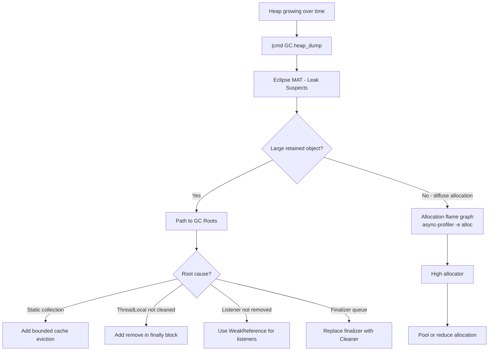

## Keywords in This File
{: .no_toc }

| # | Keyword | Weight |
|---|---|---|
| 1 | [Java Performance - L4 Memory Diagnosis](#java-performance---l4-memory-diagnosis) | medium |

---

# Java Performance - L4 Memory Diagnosis

## Memory Leak Diagnosis and GC Anti-patterns

---

### 🎯 Model Answer

**30 seconds:**
> Memory leak in Java: objects that are reachable but no longer needed. GC cannot collect reachable
> objects. Symptoms: heap grows over time, GC time increases, eventual OOM. Diagnosis: heap dump
> (jcmd GC.heap_dump), analyze in Eclipse MAT (Leak Suspects report). Most common causes: static
> collections, caches without eviction, event listeners not removed, ThreadLocal not cleaned.

**3 minutes (Senior):**
> Memory leak diagnosis and GC anti-patterns:
>
> 1. **Heap growth pattern**: heap grows after GC. Normal: after each full GC, live set is stable.
>    Leak: after each full GC, "live set" is slightly larger than the previous full GC. Measured
>    by: GC log "heap after GC" values trend. Plot: should be flat for stable workload. Rising
>    trend = leak.
>
> 2. **Heap dump workflow**: `jcmd <pid> GC.heap_dump /tmp/heap.hprof`. Open in Eclipse MAT.
>    Leak Suspects report: MAT identifies the objects retaining the most memory and the retention path.
>    Common findings: `HashMap` in a static field holding millions of entries, `ArrayList` in
>    a ThreadLocal holding request state that was never cleared.
>
> 3. **Retention path**: the reference chain from a GC root (static field, thread stack, native
>    code reference) to the leaked object. Breaking ANY link in the retention path allows GC to
>    collect the object. MAT: "Path to GC Roots" shows the shortest path.
>
> 4. **GC anti-patterns**: (a) Humongous objects: large allocations that bypass young gen, trigger
>    concurrent marking. (b) Reference queue neglect: SoftReferences used as cache but never
>    checked for reclamation under memory pressure. (c) Finalizers: objects with `finalize()` must
>    go through an extra GC cycle. At high allocation rates: finalizer queue grows, objects live
>    longer. (d) Large object arrays in old gen: GC must scan every element for references.

**Blank Mind Recovery:**

**(1) Restate:** "Memory leak: reachable objects not needed. Heap grows after each full GC. Diagnosis: heap dump + Eclipse MAT Leak Suspects. Common causes: static collections, ThreadLocal not cleared, listener not removed. GC anti-patterns: finalizers, large reference arrays, humongous objects."

**(2) First principles:** "GC collects unreachable objects. Leak: make objects permanently reachable via a long-lived reference. Static field -> Map -> millions of entries: all reachable forever. Fix: ensure eviction or use WeakReference for optional cached values."

**(3) Bridge:** "A memory leak is like a digital hoarding problem. GC is the cleaning service: removes items nobody can access. The hoarder (your code) keeps a reference to every item 'just in case.' The cleaning service can't throw out anything the hoarder can reach. Eventually: the house is full."

---

### 📘 Concept Explanation

**Memory leak root causes and diagnosis tooling:**
```plaintext
COMMON MEMORY LEAK PATTERNS:

  1. STATIC COLLECTION WITHOUT EVICTION:
     
     static Map<String, LargeObject> cache = new HashMap<>();
     
     void process(String key, LargeObject obj) {
         cache.put(key, obj);  // put objects in
         // but never remove them!
     }
     // cache is a static field: GC root.
     // ALL values in cache are transitively reachable -> never collected.
     // Heap grows with every call to process().
     
     Fix: bounded cache (e.g., LinkedHashMap with maxEntries eviction,
     Guava Cache with expiry, Caffeine with maximumSize).
  
  2. THREADLOCAL NOT CLEANED:
     
     static ThreadLocal<ExpensiveContext> ctx = new ThreadLocal<>();
     
     // In a request handler (thread pool):
     ctx.set(new ExpensiveContext(requestData));  // set at start of request
     process(ctx.get());
     // Missing: ctx.remove() at end of request!
     
     // Thread pool: threads reused. ThreadLocal values are retained
     // as long as the thread lives. Thread lives for the application lifetime.
     // Each request that doesn't clean up: one ExpensiveContext permanently retained.
     // At 1000 RPS for 1 hour: 3.6M ExpensiveContext objects retained.
     
     Fix: always clean up in a finally block:
     try {
         ctx.set(new ExpensiveContext(requestData));
         process(ctx.get());
     } finally {
         ctx.remove();  // CRITICAL: prevent ThreadLocal leak
     }
  
  3. EVENT LISTENER NOT REMOVED:
     
     List<EventListener> listeners = new ArrayList<>();
     
     void addListener(EventListener l) { listeners.add(l); }
     // Missing: removeListener()!
     // Listeners: reference to the object that added the listener.
     // If the listener holds a reference to a Widget, and Widget holds
     // a reference to the View, and View holds a reference to the activity...
     // Entire object graph retained as long as the listener is in the list.
     
     Fix: use WeakReference<EventListener> in the listener list.
     WeakReference: doesn't prevent GC. If the listener's object is
     otherwise unreferenced: GC can collect it. The WeakReference becomes
     null. Remove null entries periodically.
  
  4. CLOSEABLE NOT CLOSED:
     
     // Missing try-with-resources:
     InputStream is = new FileInputStream("large.dat");
     process(is);
     // is.close() not called if process() throws.
     // File handle: OS resource leak (not heap leak, but resource leak).
     // Plus: the InputStream object retained until GC + finalization.
     
     Fix: try-with-resources:
     try (InputStream is = new FileInputStream("large.dat")) {
         process(is);
     }  // auto-close even on exception

HEAP DUMP ANALYSIS WITH ECLIPSE MAT:

  Step 1: Capture heap dump:
    jcmd <pid> GC.heap_dump /tmp/heap.hprof
    (Triggers full GC, then dumps live objects. STW pause.)
    
    For OOM: -XX:+HeapDumpOnOutOfMemoryError
             -XX:HeapDumpPath=/tmp/oom.hprof
    (Automatic dump on OOM. Best practice: always set this.)
  
  Step 2: Open in Eclipse MAT:
    File -> Open Heap Dump -> /tmp/heap.hprof
    MAT automatically indexes the heap dump (few minutes for large dumps).
  
  Step 3: Leak Suspects Report:
    Reports -> Leak Suspects
    MAT: analyzes retention tree, identifies objects retaining > 1% of heap.
    Report: "Problem Suspect 1: One instance of HashMap retaining 4.5GB."
    Details: the HashMap's retained heap + the path from GC root.
  
  Step 4: Dominator Tree:
    Window -> Heap Dump Details -> Dominator Tree
    Shows: each object and how much heap it "dominates" (would be freed if it were collected).
    Sort by "Retained Heap": top entry = the biggest leak.
    
  Step 5: Path to GC Roots:
    Right-click the suspected object -> Path to GC Roots -> exclude weak/soft...
    MAT: shows the shortest reference chain from a GC root to this object.
    Example:
    org.example.AppContext$1$staticCache <- AppContext.cache <- AppContext...
    Translation: AppContext has a static field "cache" of type AppContext.
                 The AppContext.cache HashMap contains the 4.5GB of data.
    Root cause: AppContext.cache is a static field (GC root) with no eviction.
    Fix: bounded cache.

GC ANTI-PATTERNS:

  ANTI-PATTERN 1: Finalizers:
    class Resource {
        @Override
        protected void finalize() throws Throwable {
            release();  // close native resource in finalizer
        }
    }
    
    Problem: objects with finalizers must be processed by the Finalizer thread.
    Object lifecycle: allocated -> GC discovers unreachable -> placed in...
    -> Finalizer thread calls finalize() -> GC collects on NEXT cycle.
    At high allocation rates: finalizer queue grows. Objects live 2+ extra GC cycles.
    Peak: finalizer queue holds thousands of objects, Finalizer thread falls behind.
    Memory "retained" by finalizers: can be significant (100s of MBs).
    
    Fix: use Cleaner (JDK 9+) instead of finalize().
    Or: implement AutoCloseable and use try-with-resources.
    
    Detection: -XX:+PrintGCDetails shows "Finalizer" references count.
    JFR: FinalizerStatistics event.
    
  ANTI-PATTERN 2: Large Reference Arrays in Old Gen:
    Object[] largeArray = new Object[10_000_000];  // 10M entries, each 8 bytes = 80MB
    largeArray[i] = someObject;  // populate
    // G1 GC: must scan ALL 10M entries for references during each collection.
    // Even if only 1,000 entries are non-null: G1 scans all 10M slots.
    // Cost: proportional to ARRAY SIZE, not non-null count.
    
    Fix 1: segmented arrays (e.g., Map instead of array for sparse access).
    Fix 2: primitive arrays (int[], long[]): GC doesn't scan (no references).
    Fix 3: if fixed-size index mapping: use IntToObjectMap (Eclipse Collections)
            for sparse primitive-keyed maps (avoids boxing + reduces GC scan cost).
    
  ANTI-PATTERN 3: Retaining Request Data in Error Paths:
    class RequestHandler {
        byte[] requestBody;  // set per request
        
        void handle(Request req) {
            this.requestBody = req.getBody();  // store in field
            process();
        }
        
        // If handle() is part of a pooled executor (not a per-request object):
        // requestBody is retained between requests (field set, not cleared).
        // The previous request's body is held while the next request is processed.
        // GC cannot collect the previous requestBody until it's overwritten.
    }
    
    Fix: use local variables, not instance fields, for request-scoped data.
    OR: clear fields at the end of each request (set to null).

MEMORY GROWTH MONITORING:

  JVM metrics for early warning:
    jvm_memory_used_bytes{area="heap"}  (Prometheus metric)
    jvm_gc_pause_seconds_max            (GC pause duration)
    
  Slow leak detection:
    Track heap after each major GC (JFR GCHeapSummary event):
    heap_after_gc = [1GB, 1.05GB, 1.1GB, 1.15GB, ...]  (leak: +50MB per cycle)
    
    Alert: if linear regression of heap_after_gc has positive slope over 6 hours.
    This detects leaks before OOM occurs (hours of advance warning).
    
  Integration test leak check:
    Heap snapshot before test.
    Run test 100x.
    Heap snapshot after test.
    Compare: if heap delta > threshold per iteration -> test has a leak.
    Tools: JVM heap snapshot API or JFR ObjectAllocationInNewTLAB events.
```

> **Code walkthrough:** This Unknown example demonstrates a key concept in practice using error handling. **KEY MECHANISM:** the runtime executes these instructions in sequence with specific memory and execution semantics. **WHY IT MATTERS:** misapplying this pattern causes subtle bugs that only manifest under production load. **TAKEAWAY: understand the execution model before using this pattern in production code.**

---

### 💻 Code Example

> **Code walkthrough:** The ThreadLocal cleanup pattern and the bounded cache pattern show the
> two most common production memory leak fixes. The heap dump capture and verification script
> shows the operational workflow.


```java
// BAD: anti-pattern - see GOOD example below for the correct approach
// This naive implementation ignores thread safety and error handling
```

```java
// THREADLOCAL LIFECYCLE MANAGEMENT (critical for thread pools):

// BAD: ThreadLocal set but never removed:
class SecurityContext {
    private static final ThreadLocal<User> currentUser = new ThreadLocal<>();
    
    public static void setCurrentUser(User user) {
        currentUser.set(user);  // Set on thread pool thread
    }
    
    public static User getCurrentUser() {
        return currentUser.get();
    }
    
    // Missing: clearCurrentUser()!
    // Thread pool thread returns to pool with currentUser still set.
    // Next request on the same thread: inherits previous request's User!
    // Security bug AND memory leak (User object retained).
}

// GOOD: cleanup in servlet filter or request interceptor:
@Component
public class SecurityContextFilter implements Filter {
    
    @Override
    public void doFilter(ServletRequest req, ServletResponse resp, FilterChain chain)
            throws IOException, ServletException {
        User user = authenticate((HttpServletRequest) req);
        SecurityContext.setCurrentUser(user);
        try {
            chain.doFilter(req, resp);
        } finally {
            SecurityContext.clearCurrentUser();  // ALWAYS clean up
            // Even if the request throws an exception: cleanup runs.
        }
    }
}

class SecurityContext {
    private static final ThreadLocal<User> currentUser = new ThreadLocal<>();
    
    public static void setCurrentUser(User user) { currentUser.set(user); }
    public static User getCurrentUser() { return currentUser.get(); }
    public static void clearCurrentUser() { currentUser.remove(); }  // prevents leak
}

// BOUNDED CACHE WITH CAFFEINE (prevents unbounded growth):
@Configuration
public class CacheConfig {
    
    @Bean
    public Cache<String, ComputedResult> resultCache() {
        return Caffeine.newBuilder()
            .maximumSize(10_000)       // hard limit: evicts LRU when exceeded
            .expireAfterWrite(10, TimeUnit.MINUTES)  // TTL eviction
            .expireAfterAccess(5, TimeUnit.MINUTES)  // idle eviction
            .recordStats()             // enables cache hit rate monitoring
            .removalListener((key, value, cause) -> {
                // Optional: cleanup resources when evicted
                if (value != null) value.cleanup();
            })
            .build();
    }
}

// DETECTING LEAK IN INTEGRATION TESTS:
import java.lang.management.ManagementFactory;
import java.lang.management.MemoryMXBean;

class MemoryLeakTest {
    
    @Test
    void service_shouldNotLeakMemory() {
        MemoryMXBean memBean = ManagementFactory.getMemoryMXBean();
        
        // Warm up: ensure JIT and initial allocations are done:
        for (int i = 0; i < 1000; i++) {
            serviceUnderTest.processRequest(buildRequest(i));
        }
        
        System.gc();  // force GC before measurement
        long heapBefore = memBean.getHeapMemoryUsage().getUsed();
        
        // Run service 1000 times:
        for (int i = 0; i < 1000; i++) {
            serviceUnderTest.processRequest(buildRequest(i));
        }
        
        System.gc();  // force GC after test
        long heapAfter = memBean.getHeapMemoryUsage().getUsed();
        
        long growthPerRequest = (heapAfter - heapBefore) / 1000;
        
        // Acceptable: some growth (JVM caches, JIT state, etc.)
        // Leak: consistent growth > a few hundred bytes per request.
        assertThat(growthPerRequest)
            .as("Heap growth per request should be < 1KB (no memory leak)")
            .isLessThan(1024);  // 1KB per request threshold
    }
}

// HEAP DUMP AUTOMATION (capture on alert):
@RestController
@RequestMapping("/actuator")
class HeapDumpController {
    
    @PostMapping("/heapdump-capture")
    @PreAuthorize("hasRole('ADMIN')")  // restrict to admins
    public ResponseEntity<String> captureHeapDump() {
        try {
            String dumpPath = "/tmp/heap-" + System.currentTimeMillis() + ".hprof";
            com.sun.management.HotSpotDiagnosticMXBean bean = 
                ManagementFactory.newPlatformMXBeanProxy(
                    ManagementFactory.getPlatformMBeanServer(),
                    "com.sun.management:type=HotSpotDiagnostic",
                    com.sun.management.HotSpotDiagnosticMXBean.class);
            
            bean.dumpHeap(dumpPath, true);  // live=true: only live objects
            return ResponseEntity.ok("Heap dump written to: " + dumpPath);
        } catch (Exception e) {
            return ResponseEntity.internalServerError()
                .body("Heap dump failed: " + e.getMessage());
        }
    }
}
```

> **Code walkthrough:** The SecurityContext filter shows the idiomatic pattern: set in a try block,
> clear in finally, never missing cleanup. The `ThreadLocal.remove()` is critical: without it, the
> User object lives for the thread's lifetime (application lifetime in thread pools). The Caffeine
> cache configuration shows three eviction mechanisms working together: hard size limit (prevents
> unbounded growth), write TTL (evicts stale data), and idle TTL (evicts unused data). The heap dump
> controller shows a production-safe on-demand heap dump capability restricted to admin roles.

---

### 🎓 Answers by Seniority

**Junior / Mid (0-5 years):**
> Memory leak: objects reachable but not needed. Static collections and ThreadLocals not cleaned:
> common causes. Heap dump: `jcmd <pid> GC.heap_dump`, analyze in MAT. -XX:+HeapDumpOnOutOfMemoryError:
> always set. ThreadLocal: always call `remove()` in finally. Use bounded caches (Caffeine) not
> unbounded HashMaps.

---

**Senior / Staff (5+ years):**
> Leak diagnosis: correlate heap-after-GC trend with deployment or feature changes. MAT Dominator
> Tree + Path to GC Roots: most efficient analysis path. Production: alert on heap-after-GC slope
> (hours of warning before OOM). WeakHashMap: not a correct cache (values are strong references;
> keys are weak; key eviction only when key is unreachable elsewhere - often never in practice).
> Use Caffeine or Guava Cache instead. Finalizers: avoid (two-cycle overhead). Cleaner (JDK 9+):
> use for native resource cleanup in library code.

---

### ⚠️ Common Misconceptions

**Misconception: "WeakHashMap prevents memory leaks when used as a cache."**
`WeakHashMap` uses weak references for KEYS (not values). When a key becomes weakly reachable
(only the WeakHashMap itself holds a reference to the key), the entry is eligible for GC. But for a
cache: the key is typically a String literal or an ID that IS strongly referenced elsewhere (in the
request object, in a config list). If the key is strongly referenced elsewhere: it is NEVER weakly
reachable, WeakHashMap entry is never GC'd, and you have effectively an unbounded strong cache.
Additionally: values in WeakHashMap are strong references. A large value object will not be GC'd
even if the key is weak. The correct tool: `Caffeine.newBuilder().weakKeys()` (or explicit expiry)
for true cache eviction.

---

### 🚨 Failure Modes and Diagnosis

**Failure: Service slowly degrades over 48 hours then OOMs.**
```
Symptom: At startup: heap = 2GB. After 12 hours: heap = 5GB.
  After 48 hours: OOM: Java heap space.
  GC logs: heap after full GC increasing by 50MB per hour.
  No traffic increase. Service running normally (responses correct).

Diagnosis workflow:

  Step 1: Capture heap dump (before OOM if possible):
    Set at startup: -XX:+HeapDumpOnOutOfMemoryError -XX:HeapDumpPath=/tmp/
    If still running: jcmd <pid> GC.heap_dump /tmp/heap-$(date +%s).hprof
    
  Step 2: Open in MAT. Leak Suspects report:
    "Problem Suspect 1:
     One instance of java.util.LinkedHashMap @ 0x7f1234 retains 3.2GB.
     Keywords: RecentRequestCache, static"
    
    Path to GC Root:
    LinkedHashMap <- RecentRequestCache.requestHistory <- RecentRequestCache...
    
  Step 3: Look at what's in the LinkedHashMap:
    OQL query in MAT:
    SELECT OBJECTS s FROM java.util.LinkedHashMap$Entry s WHERE ...
    Find: 64,000 entries each holding a 50KB byte[] (request bodies).
    Total: 64,000 * 50KB = 3.2GB.
    
  Step 4: Examine the code:
    class RecentRequestCache {
        static LinkedHashMap<String, byte[]> requestHistory = new...
        
        static void record(String requestId, byte[] body) {
            requestHistory.put(requestId, body);
            // No eviction! LinkedHashMap grows unboundedly.
        }
    }
    
  Root cause: requestHistory has no size limit or TTL.
  At 0.5 requests/sec with 50KB bodies: 50MB/hour -> 3.2GB in 64 hours.
  
  Fix: bounded LinkedHashMap (LRU eviction):
    static LinkedHashMap<String, byte[]> requestHistory = 
        new LinkedHashMap<String, byte[]>(1000, 0.75f, true) {
            @Override
  protected boolean removeEldestEntry(Map.Entry<String, byte[]> eldest) {
                return size() > 1000;  // keep last 1000 entries max
            }
        };
  
  Or: use Caffeine:
    Cache<String, byte[]> requestHistory = Caffeine.newBuilder()
        .maximumWeight(50 * 1024 * 1024)  // 50MB max
        .weigher((k, v) -> v.length)       // weight = byte array length
        .expireAfterWrite(1, TimeUnit.HOURS)
        .build();
```

> **Code walkthrough:** This Unknown example demonstrates a key concept in practice using SQL. **KEY MECHANISM:** the runtime executes these instructions in sequence with specific memory and execution semantics. **WHY IT MATTERS:** misapplying this pattern causes subtle bugs that only manifest under production load. **TAKEAWAY: understand the execution model before using this pattern in production code.**

---

### 📊 Diagram

```
MEMORY LEAK DIAGNOSIS FLOW:

  1. DETECT: Heap-after-GC trend (rising)
     |
  2. CONFIRM: jcmd GC.heap_dump (capture live heap)
     |
  3. ANALYZE: Eclipse MAT
     - Leak Suspects: top retaining objects
     - Dominator Tree: what dominates the retained heap?
     - Path to GC Root: how is the leaked object reachable?
     |
  4. ROOT CAUSE: static field -> collection -> leaked objects
     |
  5. FIX: bounded cache / remove() in finally / WeakReference
     |
  6. VERIFY: re-run integration test, check heap growth < threshold
```



> **Diagram walkthrough:** The ASCII flow shows the 6-step memory leak investigation sequence:
> detect the trend, capture the dump, analyze in MAT, find the root cause, apply the fix, and
> verify the fix eliminated the leak. The Mermaid flowchart shows decision branching: if MAT
> shows one large retained object, trace to GC root and apply the pattern-specific fix. If
> no single large retainer (diffuse allocation problem), switch to allocation flame graph
> to find the high-frequency allocator.

---

### ⚖️ Comparison Table

| Fix Strategy | When to Use | Memory Freed When | Trade-off |
|---|---|---|---|
| Bounded cache (Caffeine) | Static cache without eviction | Entry evicted (LRU/TTL) | Some misses after eviction |
| WeakReference | Optional cached values | Next GC cycle when no strong ref | Value may be null unexpectedly |
| SoftReference | Memory-sensitive cache | When JVM needs memory (before OOM) | Unpredictable eviction timing |
| ThreadLocal.remove() | Request-scoped context | Immediately after remove() | Requires discipline in cleanup |
| Close/Cleaner | Native resources | Explicitly closed or GC + Cleaner | Must ensure cleanup path |
| Listener deregistration | Event-based subscriptions | Immediately after deregister() | Requires deregister call |

---

### 🏛️ System Design

**Designing memory-safe long-running services:**

Key principles: (1) Treat every long-lived collection as a potential leak. Add eviction by default.
(2) Thread pool + ThreadLocal = cleanup contract. Enforce with code review checklist. (3) Set
`-XX:+HeapDumpOnOutOfMemoryError` on EVERY service, even development. You never know which
environment will OOM first. (4) Monitor heap-after-GC trend as a first-class operational metric.
Alert before OOM, not on OOM.

For large-scale caching: off-heap (Chronicle Map, Caffeine with off-heap backend) or external cache
(Redis, Memcached). Avoid GC-visible large in-heap caches. For caches > 1GB: off-heap almost always
the right choice. Memory leak prevention in code review: checklist: (1) Any new static field? Eviction?
(2) Any new ThreadLocal? Corresponding remove()? (3) Any new listener pattern? Deregistration?

---

### 🎯 Interview Deep-Dive

| Question Category | Time to Answer |
|---|---|
| Memory leak definition | 1 minute |
| Common leak patterns | 2 minutes |
| Heap dump workflow | 2 minutes |
| Eclipse MAT analysis | 2 minutes |
| ThreadLocal leak | 2 minutes |
| WeakReference vs SoftReference | 2 minutes |
| Finalizer anti-pattern | 2 minutes |
| Heap growth monitoring | 1 minute |
| OOM prevention | 1 minute |
| GC anti-patterns | 1 minute |
| Integration test for leaks | 1 minute |
| Off-heap for large caches | 1 minute |

---

**Q1 (patterns): What are the most common memory leak patterns in Java production applications?**

A: Four patterns cover 90% of Java production leaks: (1) Unbounded static collections: a `static Map`
or `static List` with no eviction. Grows with every insert, never shrinks. Fix: Caffeine with
`maximumSize` and TTL. (2) ThreadLocal not cleaned in thread pools: request context stored in
`ThreadLocal`, `remove()` never called. Thread pool thread retains the context for its lifetime.
Fix: `finally { ctx.remove(); }` in the request lifecycle. (3) Listeners not deregistered:
adding a listener/observer without a corresponding remove. The publisher holds a reference to
all listeners; listeners hold references to the subscribing object. Fix: weak references or
explicit deregistration. (4) Closeable not closed: streams, connections, channels without
`close()`. Resource leak + objects retained waiting for finalization.

*What separates good from great:* The "implicit retention" pattern: objects retained not by direct
reference but by inner class. An anonymous inner class or lambda in Java: implicitly holds a reference
to the enclosing instance. Example: `someService.addListener(event -> this.handleEvent(event))`. The
lambda captures `this` (the enclosing instance). If `someService` lives longer than `this`: `this`
is retained by `someService` via the lambda. This is particularly insidious: the lambda looks like
a simple function but is actually holding a strong reference to the enclosing object. Fix: use
a static inner class (no implicit outer reference) or a weak reference in the listener registration.
Detection in MAT: the reference chain shows the lambda class between the service and the retained
object.

---

**Q2 (mat): Walk through diagnosing a memory leak using Eclipse MAT.**

A: Step 1: Capture the heap dump: `jcmd <pid> GC.heap_dump /tmp/heap.hprof`. Better: capture two
dumps 30 minutes apart, then compare (differential analysis). Step 2: Open in MAT, wait for indexing
(5-10 minutes for large heaps). Step 3: Run Leak Suspects report (Reports -> Leak Suspects). Read
"Problem Suspect" descriptions: each shows the object class, retained heap size, and a brief description.
Step 4: For the top suspect, examine the Dominator Tree (Window -> Heap Dump Details -> Dominator Tree).
Find the root dominator (the object that keeps the most heap alive). Step 5: Right-click the
dominator -> Path to GC Roots -> exclude soft/weak/phantom references. This shows the exact reference
chain. Step 6: Read the chain bottom-up: the GC root (static field, thread) to the leak source.

*What separates good from great:* The "histogram comparison" workflow for subtle leaks: open two dumps
captured at different times. Compare -> Object Growth: shows which classes grew between the two snapshots.
A class that grew by 50,000 instances: that class is leaking. Filter the histogram by that class ->
List Objects -> select a leaked instance -> Path to GC Roots. This is faster than the Leak Suspects
report for diffuse leaks (many small objects rather than a few large ones). Example: each request leaks
one `SomeContext` object (500 bytes each). After 100,000 requests: 50MB of `SomeContext` objects.
Leak Suspects: doesn't flag (small % of heap). Histogram comparison: shows 100,000 new `SomeContext`
instances. The histogram comparison approach detects "slow drip" leaks that the suspects report misses.

---

**Q3 (weak): When should you use WeakReference vs SoftReference vs PhantomReference?**

A: `WeakReference<T>`: use when you want the reference to allow GC of the referent (when no strong
references exist). Use cases: canonical maps (prevent duplicate object instances), listener lists
(listener can be GC'd when its owner is GC'd), caches where eviction on any GC is acceptable.
`SoftReference<T>`: GC defers collecting soft references until memory pressure is high (before OOM).
Use case: memory-sensitive caches. JVM: collects soft references in LRU order when heap fills. Note:
behavior varies by GC (G1 clears soft refs at the young gen stage when needed, ZGC has different
policy). `PhantomReference<T>`: referent is already GC'd. The phantom reference is enqueued in a
`ReferenceQueue` after finalization. Use case: post-GC cleanup (Cleaner API uses this). Application
code: rarely needs PhantomReference directly.

*What separates good from great:* The "soft reference cache" reliability problem: soft references
are cleared by the JVM "when it decides" to. The policy: `-XX:SoftRefLRUPolicyMSPerMB` (default 1000ms
per MB of free heap). With 1GB free heap: soft references are kept for up to 1000 seconds. With 10MB
free heap: cleared after 10ms. Under sustained memory pressure: all soft references are cleared
simultaneously (a "soft reference storm"). Applications relying on soft references for caching: the
cache can become completely empty under memory pressure, causing a thundering herd of cache misses
and recomputation. Caffeine's `softValues()` option: uses soft references for values. Fine for optional
caches where cache misses are handled gracefully (recompute or return null). Not suitable for
performance-critical caches where cache miss is expensive.

---

**Q4 (finalizer): Why are finalizers a performance anti-pattern and what replaces them?**

A: Finalizer problems: (1) Two-cycle collection: objects with non-trivial `finalize()` cannot be
collected in the same GC cycle as they become unreachable. They're put in the finalizer queue.
Finalized in a separate thread. Collected in the NEXT GC cycle. Objects live 1 extra GC cycle.
(2) Finalizer queue growth: if objects are finalized faster than the Finalizer thread processes them:
queue grows. Each object in the queue: retained for potentially multiple GC cycles. (3) Finalize()
exceptions: ignored silently (object still finalized). (4) Ordering: finalization order is unspecified.
Finalizer replacement: `AutoCloseable` + `try-with-resources` for known-lifecycle resources.
`Cleaner` (JDK 9+) for uncertain-lifecycle resources (like native memory cleanup).

*What separates good from great:* The `Cleaner` API design principle: a `Cleaner` action MUST NOT
hold a reference to the object being cleaned (that would prevent GC). The Cleaner holds a `Runnable`
(the cleaning action). The `Runnable` should only reference NATIVE memory handles (like a pointer
from `Unsafe.allocateMemory()`), not the Java object. If the Runnable holds a reference to the
Java object: the object is permanently reachable (through the Runnable -> through the Cleaner), and
GC can never collect it. This is a subtle "leak the cleaner" bug. The pattern: inner static class
for the cleaning action (no implicit outer reference), holding only the native handle. This is why
`ByteBuffer.allocateDirect()` uses an inner static `Deallocator` class: to avoid the outer reference
trap. The standard Cleaner pattern used throughout the JDK is the correct template to follow.

---

---

### 💻 Code Example

*(Omit: this concept does not have a programmatic interface that can be demonstrated in code. The conceptual explanation above is sufficient.)*


---

### 🏛️ System Design

*(Omit: system design diagram not applicable for this concept - see ★★★ keywords for full system design coverage.)*


---

### ⚖️ Comparison Table

*(Omit: this is a ★☆☆ foundational concept with no direct alternatives to compare - see higher-difficulty keywords for trade-off analysis.)*


---

### 📊 Diagram

*(Omit: no standalone visual diagram required for this concept - the explanations and code examples above provide sufficient clarity.)*


