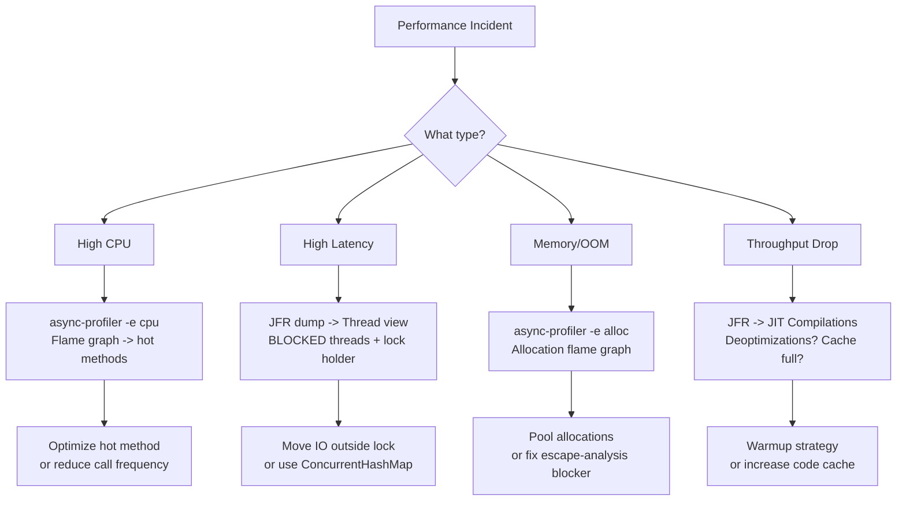

## Keywords in This File
{: .no_toc }

| # | Keyword | Weight |
|---|---|---|
| 1 | [Java Performance - L4 Production Profiling](#java-performance---l4-production-profiling) | medium |

---

# Java Performance - L4 Production Profiling

## Production Performance Diagnosis: JFR and Async-Profiler

---

### 🎯 Model Answer

**30 seconds:**
> JFR (Java Flight Recorder): JVM-native, continuous profiling. Overhead: < 1%. Captures: CPU
> samples, GC events, IO, locks, thread state, JIT events. `jcmd <pid> JFR.start/stop`. Async-profiler:
> JVMTI-based, uses perf_events (Linux). Overhead: < 2%. More accurate CPU profiles than JFR.
> Produces flame graphs. For memory allocation: both support `-e alloc`. Use JFR for continuous
> production monitoring; async-profiler for deep investigation sessions.

**3 minutes (Senior):**
> Production profiling strategy with JFR and async-profiler:
>
> 1. **JFR continuous recording**: JFK can run continuously with near-zero overhead (< 1%). Ring
>    buffer (default 250MB). On incident: dump the buffer to disk. The recording contains the last
>    N seconds of JVM activity before the incident. "Time machine" for production issues.
>
> 2. **JFR event types**: CPU method sampling (every 10ms, 100ms), GC events (each collection),
>    IO events (socket read/write > configurable threshold), lock events (Java monitor blocked >
>    threshold), thread state transitions, JIT compilations, class loads.
>
> 3. **Async-profiler advantages**: uses OS perf_events for CPU sampling (not JVMTI safepoint
>    sampling). JFR/JVMTI sampling: only samples at safepoints (safe-to-sample points). Bias:
>    code between safepoints is invisible. Async-profiler: samples at any time (using signals).
>    Result: more accurate CPU attribution, no "safepoint bias."
>
> 4. **Flame graph interpretation**: x-axis: time (width proportional to time spent).
>    y-axis: call stack (bottom = main(), top = leaf). Wide frames at the top: hot code.
>    Flat plateau at the top: hotspot (the function doing most work).
>
> 5. **Allocation profiling**: `-e alloc`. Samples each allocation proportional to its size.
>    Shows: which methods allocate most. For GC pressure diagnosis.

**Blank Mind Recovery:**

**(1) Restate:** "JFR: JVM-native, continuous, < 1% overhead. Ring buffer: dump on incident. Events: CPU, GC, IO, locks, JIT. Async-profiler: JVMTI + perf_events, accurate CPU (no safepoint bias), flame graphs. JFR: always-on monitoring. Async-profiler: deep investigation."

**(2) First principles:** "Production profiling: sample execution state at intervals and aggregate. Key trade-off: accuracy (sample rate) vs overhead (CPU, memory). JFR: low sample rate, low overhead, broad event coverage. Async-profiler: higher sample rate, higher accuracy, better for CPU attribution."

**(3) Bridge:** "JFR is like a continuous CCTV recording (always on, low resolution, captures everything). Async-profiler is like a private investigator (dispatched for specific incidents, high-resolution, targeted investigation)."

---

### 📘 Concept Explanation

**JFR and async-profiler in detail:**
```plaintext
JFR ARCHITECTURE:

  Built into the JVM (JDK 11+ in OpenJDK, earlier in Oracle JDK).
  No external agent needed.
  Two modes:
    Continuous recording: ring buffer (default 250MB). Overwrites oldest data.
                         Dump anytime: jcmd <pid> JFR.dump.
    Fixed recording: duration-bounded. Saves to file at end.
  
  Event overhead: events written to thread-local buffers (lock-free).
  Flushed to shared buffer periodically. Very low contention.
  
  Default settings include:
    - Method sampling: 10ms interval (100 samples/sec)
    - GC events: all
    - Thread state changes
    - Lock events: Java monitor blocked > 10ms
    - IO events: socket/file IO > 10ms
    - JVM internal events: class load, compilation, deoptimization
  
  Custom events:
    @Name("com.example.OrderProcessed")
    @Label("Order Processed")
    @Category("Application")
    static class OrderProcessedEvent extends Event {
        @Label("Order ID") String orderId;
        @Label("Amount") double amount;
    }
    // In code:
    OrderProcessedEvent evt = new OrderProcessedEvent();
    evt.orderId = orderId;
    evt.amount = amount;
    evt.commit();  // written to JFR ring buffer
  
  Custom events: appear in JMC timeline alongside JVM events.
  Use: correlate application events with GC/JIT/IO events.

JFR SAFEPOINT BIAS:

  Problem with JVMTI sampling (including JFR method profiler):
    JVMTI can only sample threads at safepoints.
    Safepoints: locations in bytecode where the JVM can safely interrupt.
    Code loops may run for 1000+ instructions between safepoints.
    During JNI calls, certain JVM internal operations: no safepoint.
    Result: code running between safepoints is NEVER sampled.
    The flame graph shows code at safepoints, not necessarily hot code.
  
  JDK 16+ JFR: reduced safepoint bias with "AsyncGetCallTrace" (same as async-profiler).
  JDK < 16: safepoint bias is real.
  
  Async-profiler solution:
    Uses POSIX signal (SIGPROF) to interrupt threads at ANY point.
    Calls AsyncGetCallTrace to get the stack trace at the interrupt point.
    No safepoint required. Samples any instruction, not just safepoints.
    More accurate attribution, especially for tight loops and JNI code.

ASYNC-PROFILER EVENT TYPES:

  CPU profiling:
    ./profiler.sh -e cpu -d 60 -f cpu.html <pid>
    Default: SIGPROF-based, samples all threads every 10ms.
    
  Allocation profiling:
    ./profiler.sh -e alloc -d 60 -f alloc.html <pid>
    Uses JVMTI allocation listener (every allocation at a configurable sampling rate).
    Shows: call stacks where heap allocations originate.
    Use: find GC pressure sources, confirm escape analysis working.
    
  Wall-clock profiling:
    ./profiler.sh -e wall -d 60 -f wall.html <pid>
    Samples ALL threads (including sleeping/blocked) at wall clock time.
    Shows: where time is spent including IO wait, lock wait.
    Use: identify throughput bottlenecks including async IO patterns.
    
  Lock profiling:
    ./profiler.sh -e lock -d 60 -f lock.html <pid>
    Records lock wait time. Shows: which locks are contended.
    
  Perf events (Linux):
    ./profiler.sh -e cache-misses -d 60 <pid>  (CPU cache miss attribution)
    ./profiler.sh -e cycles -d 60 <pid>       (CPU cycles per method)
    Uses: Linux perf_events subsystem. Requires kernel 4.1+.
    Shows: hardware-level bottlenecks.

FLAME GRAPH READING:

  Width: proportion of total samples (= proportion of time).
  Height: call stack depth.
  Color: random (for CPU) or by category (green=Java, orange=native, red=JIT compiling).
  
  What to look for:
    "Plateau" at top level: a method that runs itself for a long time (no further callees).
      This is a CPU hotspot. Optimize this method directly.
    "Tower" reaching up: deep call stack (many method calls to get here).
      Not necessarily a problem.
    "Wide base, narrow top": time spent in infrastructure (serialization, GC, JVM internals).
      Look at what's CALLING the wide base frames.
    
  Differential flame graph:
    Capture two profiles (before and after change).
    Generate diff: red = more time, blue = less time.
    Quickly identifies what changed between two versions.

JFR INCIDENT INVESTIGATION WORKFLOW:

  Step 1: Enable continuous JFR recording at startup:
    -XX:StartFlightRecording=dumponexit=true,filename=/logs/jfr/startup.jfr,
     maxsize=500m,maxage=1h,settings=default
  
  Step 2: On incident (high latency, OOM, throughput drop):
    jcmd <pid> JFR.dump filename=/logs/jfr/incident.jfr
    Contains: last 1 hour of JVM activity (rolling buffer).
  
  Step 3: Open in JMC (Java Mission Control):
    Timeline view: correlate events.
    Look for: GC pauses, thread blocks, IO spikes, JIT activity.
    
  Step 4: Find the root cause:
    High CPU: "Method Profiling" view -> hot methods -> open in code.
    High p99 latency: "Thread" view -> BLOCKED threads -> lock held.
    OOM: "Memory" view -> object allocation rate -> class allocation.
    Slow SQL: if custom events registered -> "Application" view.
```

> **Code walkthrough:** This L4 Production Profiling example demonstrates a key concept in practice. **KEY MECHANISM:** the runtime executes these instructions in sequence with specific memory and execution semantics. **WHY IT MATTERS:** misapplying this pattern causes subtle bugs that only manifest under production load. **TAKEAWAY: understand the execution model before using this pattern in production code.**

---

### 💻 Code Example

> **Code walkthrough:** The JFR startup configuration and incident dump commands show the
> production workflow. The Spring Boot configuration shows how to enable JFR with production-safe
> settings. The custom event example shows correlation with application-level events.

```java
// JFR PRODUCTION CONFIGURATION (Spring Boot):

// application.properties:
// spring.jfr.enabled=true
// management.endpoint.jfr.enabled=true

// OR: JVM startup flags (recommended, more control):
// -XX:StartFlightRecording=
//   name=continuous,
//   dumponexit=true,
//   filename=/logs/jfr/app-{pid}.jfr,
//   maxsize=500m,
//   maxage=2h,
//   settings=/config/production-jfr.jfc
//
// Production JFR configuration (/config/production-jfr.jfc):
// Default settings with customizations:
//   CPU method sampling: 10ms (low overhead)
//   Lock events: threshold=20ms
//   IO events: threshold=100ms (avoid capturing fast IO)
//   GC events: all (already low overhead)
//   Custom events: enabled

// CUSTOM APPLICATION EVENT FOR JFR CORRELATION:
import jdk.jfr.*;

@Name("com.example.OrderService.ProcessOrder")
@Label("Process Order")
@Category("Business")
@StackTrace(false)  // skip stack trace for high-frequency events (lower overhead)
public class ProcessOrderEvent extends Event {
    
    @Label("Order ID")
    @Description("Unique order identifier")
    String orderId;
    
    @Label("Processing Time Ms")
    long processingTimeMs;
    
    @Label("Item Count")
    int itemCount;
    
    @Label("Status")
    String status;  // "success", "error", "validation_failed"
}

// Usage in OrderService:
@Service
public class OrderService {
    
    public OrderResult processOrder(Order order) {
        ProcessOrderEvent event = new ProcessOrderEvent();
        event.begin();  // start timing
        event.orderId = order.getId();
        event.itemCount = order.getItems().size();
        
        try {
            OrderResult result = doProcessOrder(order);
            event.status = "success";
            return result;
        } catch (Exception e) {
            event.status = "error:" + e.getClass().getSimpleName();
            throw e;
        } finally {
            event.processingTimeMs = event.getDuration().toMillis();
            event.commit();  // write to JFR buffer if enabled
            // If JFR not recording: commit() is a no-op (no overhead).
        }
    }
}

// ASYNC-PROFILER COMMANDS (run from CLI):
// Start continuous profiling (dump every 60s):
// ./profiler.sh start -e cpu -i 10ms -f /tmp/cpu-{pid}.html \
//   --loop 60s <pid>
// This creates a new HTML flame graph every 60 seconds.

// On-demand CPU profile:
// ./profiler.sh -e cpu -d 30 -f /tmp/cpu.html <pid>
// Produces a flame graph for 30 seconds of CPU sampling.

// Allocation profile (find GC pressure):
// ./profiler.sh -e alloc -d 30 -f /tmp/alloc.html <pid>

// Wall-clock profile (find slow threads including IO wait):
// ./profiler.sh -e wall --wall-sampling-interval 1ms \
//   -d 30 -f /tmp/wall.html <pid>

// Lock profile (find contended locks):
// ./profiler.sh -e lock -d 30 -f /tmp/lock.html <pid>

// PROGRAMMATIC ASYNC-PROFILER (Java API, for integration):
import one.profiler.AsyncProfiler;

public class ProfilingController {
    
    @PostMapping("/profiling/start")
    public ResponseEntity<String> startProfiling(
            @RequestParam(defaultValue = "cpu") String event,
            @RequestParam(defaultValue = "60") int durationSeconds) {
        
        AsyncProfiler profiler = AsyncProfiler.getInstance();
        String output = "/tmp/profile-" + System.currentTimeMillis() + ".html";
        
        try {
            profiler.execute(String.format(
                "start,event=%s,file=%s,interval=10ms", event, output));
            
            // Schedule stop after duration:
            CompletableFuture.delayedExecutor(
                durationSeconds, TimeUnit.SECONDS).execute(() -> {
                try {
                    profiler.execute("stop");
                } catch (Exception e) {
                    log.error("Failed to stop profiler", e);
                }
            });
            
            return ResponseEntity.ok("Profiling started. Output: " + output);
        } catch (Exception e) {
            return ResponseEntity.internalServerError().body(e.getMessage());
        }
    }
}
```

> **Code walkthrough:** The `ProcessOrderEvent` class shows the correct JFR custom event pattern:
> `event.begin()` starts timing, `event.commit()` writes to the ring buffer. When JFR is not recording,
> `commit()` is a no-op (checked with a single branch on a volatile field - near zero overhead).
> The Spring Boot controller wrapping async-profiler shows a production pattern for on-demand profiling
> via a management endpoint - useful for profiling specific incidents on specific pods without SSH access.

---

### 🎓 Answers by Seniority

**Junior / Mid (0-5 years):**
> JFR: built-in JVM profiler, near-zero overhead, good for production. `jcmd <pid> JFR.start`.
> Async-profiler: more accurate CPU profiling (no safepoint bias), produces flame graphs. Open
> in JMC (JFR) or browser (async-profiler HTML). Look for: wide frames at top of flame graph (CPU hotspot),
> BLOCKED threads (lock contention), allocation rate (GC pressure).

---

**Senior / Staff (5+ years):**
> Always-on JFR in production: standard practice. On any incident, dump the JFR buffer first
> (before anything else). The recording may contain the root cause. JFR custom events: best way
> to correlate business events with JVM-level events. Async-profiler: superior for CPU attribution
> accuracy (safepoint bias is real before JDK 16). For allocation investigations: both work;
> async-profiler -e alloc is easier to run ad-hoc. JFR + async-profiler together: JFR provides
> context (what was happening JVM-wide), async-profiler provides precise attribution.

---

### ⚠️ Common Misconceptions

**Misconception: "Profiling always requires stopping the application or causes significant slowdown."**
JFR continuous recording in production: < 1% CPU overhead, < 1% memory overhead. This is measured
and documented by the JVM team. The ring buffer approach (write to thread-local buffer, flush periodically)
avoids per-event synchronization. Async-profiler: uses OS signals and `AsyncGetCallTrace`, which is
a wait-free operation. Overhead: < 2% at 10ms sampling interval. Both can run continuously in
production. The decision to NOT run always-on profiling means you will not have data when incidents
occur. The cost of missing a production incident (hours of investigation without data) far exceeds the
< 1% performance overhead.

---

### 🚨 Failure Modes and Diagnosis

**Failure: p99 latency spike every 5 minutes, no obvious cause in application logs.**
```
Symptom: Every 5 minutes: p99 latency 500ms -> 3,000ms for 30 seconds.
  No exception logs. No error rates. CPU and memory look normal.
  The spike duration: ~30 seconds, then recovers.

Investigation workflow:
  
  Step 1: JFR dump during the spike:
    jcmd <pid> JFR.dump filename=/tmp/spike.jfr
    Open in JMC. Timeline shows the 5-minute intervals clearly.
    
  Step 2: Look at GC events during the spike:
    GC Pause: none >10ms. -> Not GC.
  
  Step 3: Look at thread activity during the spike:
    Threads view: 200 threads in BLOCKED state for 25 seconds.
    All blocked on: java.lang.Object.wait()
    Blocked on: ScheduledThreadPoolExecutor's internal lock.
    
  Step 4: Find who's holding the lock:
    Thread holding the lock: "scheduler-thread-1"
    Stack trace: at com.zaxxer.hikari.pool.HikariPool$PoolEntryCreator.run()
    HikariCP pool entry creator: running during every 5-minute interval.
    
  Root cause: HikariCP connection pool maintenance task runs every 5 minutes
  (default: minimumIdle connections maintenance). The maintenance task
  acquires the pool's internal lock. All threads trying to get connections
  are blocked for the duration of the maintenance task.
  
  Fix: Upgrade HikariCP (newer versions reduce lock contention in maintenance).
  Or: increase maxLifetime and idleTimeout to reduce maintenance frequency.
  Or: increase connectionPool size (reduce contention for the pool lock).
  
  Key lesson: "every N minutes" pattern -> scheduler or maintenance task.
  JFR thread view + lock attribution: pinpointed the exact lock and holder
  within 10 minutes of investigation.
```

> **Code walkthrough:** This Unknown example demonstrates a key concept in practice. **KEY MECHANISM:** the runtime executes these instructions in sequence with specific memory and execution semantics. **WHY IT MATTERS:** misapplying this pattern causes subtle bugs that only manifest under production load. **TAKEAWAY: understand the execution model before using this pattern in production code.**

---

### 📊 Diagram

```
PROFILING TOOL COMPARISON:

  JFR                          Async-Profiler
  ----------------             ----------------
  JVMTI safepoint sampling     POSIX signal (SIGPROF)
  + reduced bias in JDK 16+    AsyncGetCallTrace (no safepoint)
  
  Always-on capable            On-demand investigation
  < 1% overhead                < 2% overhead
  
  Rich event coverage:         CPU flame graph focus:
  GC, IO, locks, JIT, threads  CPU, alloc, wall, lock, perf events
  
  JMC GUI analysis             HTML flame graph (browser)
  
  Ring buffer (time machine)   Session-based recording
  
  Custom application events    N/A
  
  Use: always on in production  Use: deep investigation sessions
```



> **Diagram walkthrough:** The ASCII comparison shows the complementary nature of JFR and
> async-profiler: JFR is always-on and broad; async-profiler is targeted and accurate. The
> Mermaid flowchart shows the incident triage decision tree: each symptom type maps to a
> specific profiling tool and investigation approach, and each investigation maps to a specific
> remediation category.

---

### ⚖️ Comparison Table

| Feature | JFR | Async-Profiler | YourKit/JProfiler |
|---|---|---|---|
| Overhead | < 1% | < 2% | 2-15% |
| Production safe | Yes | Yes | Use with caution |
| CPU accuracy | Moderate (JVMTI) | High (AsyncGetCallTrace) | High |
| Allocation profiling | Yes | Yes (-e alloc) | Yes |
| Lock profiling | Yes | Yes (-e lock) | Yes |
| IO profiling | Yes | No | Yes |
| GC profiling | Yes | No | Yes |
| Custom events | Yes | No | Limited |
| Always-on | Yes | No (session-based) | No |
| Output format | JFR file (JMC) | HTML flame graph | IDE plugin |
| Cost | Free (JDK built-in) | Free (open source) | Commercial |

---

### 🏛️ System Design

**Observability platform for Java microservices:**

Three-layer observability: (1) Metrics: Micrometer + Prometheus/Grafana for real-time dashboards
(CPU, memory, GC pause, thread count, request rate, error rate). (2) Distributed tracing: OpenTelemetry
for cross-service request traces (identify which service and which component is slow). (3) Continuous
JFR: ring buffer recording on every pod. On alert: auto-trigger JFR dump to object storage (S3).
This gives post-hoc JVM-level investigation without requiring reproduction.

Production profiling trigger: alert (p99 > threshold) -> automated JFR dump -> upload to S3 ->
notify engineer. Engineer: download from S3, open in JMC, 10-minute investigation. No need to SSH
into production. No need to reproduce the issue. The JFR dump is the incident "black box recorder."

---

### 🎯 Interview Deep-Dive

| Question Category | Time to Answer |
|---|---|
| JFR architecture and overhead | 2 minutes |
| Safepoint bias | 2 minutes |
| Flame graph reading | 2 minutes |
| Allocation profiling | 2 minutes |
| JFR incident workflow | 2 minutes |
| Wall-clock vs CPU profiling | 1 minute |
| Custom JFR events | 1 minute |
| JFR vs async-profiler choice | 1 minute |
| Profiling overhead concerns | 1 minute |
| Differential flame graph | 1 minute |
| JMC views | 1 minute |
| Profiling in containers | 1 minute |

---

**Q1 (bias): What is safepoint bias in profiling and how does it affect results?**

A: JVMTI-based profilers (including older JFR method sampling) can only sample threads at safepoints.
Safepoints: specific bytecode positions where the JVM can safely inspect thread state (loop back-edges,
method returns, before compiled code calls). "Safe" means: no GC reference mutation in progress.
Between safepoints: a tight loop may execute thousands of instructions. JVMTI profiler: cannot see
this execution. The sampling is biased toward code AT safepoints, not code between them. Symptom:
a hot tight loop is underrepresented in the profile; overhead appears elsewhere. Fix: async-profiler
uses `AsyncGetCallTrace` + POSIX signals (SIGPROF), which interrupts threads at ANY instruction
(not just safepoints).

*What separates good from great:* The "time-to-safepoint" latency interaction: safepoint bias in
profiling is the same mechanism as JVM safepoint operations (STW GC, CHA revocation). Code with
long periods between safepoints (tight C2-compiled loops with counted-loop optimization) has high
"time-to-safepoint." During STW events: all threads must reach a safepoint. Long time-to-safepoint:
JVM STW pauses take longer. JFR safepoint data shows this explicitly: `jdk.SafepointBegin` to
`jdk.VMOperationBegin`: time waiting for all threads to reach safepoints. If this is > 10ms:
there are loops with long safepoint latency. Fix: ensure loops call a method (a method call is
a safepoint in compiled code) or use `Thread.sleep(0)` as a safepoint check (not recommended for
production). JDK 21 improved "counted loop" safepoint: loops with `int` counter now have safepoint
polls at back-edges (eliminates most long time-to-safepoint issues).

---

**Q2 (flame): How do you read a flame graph to identify a CPU bottleneck?**

A: X-axis: proportional time (wider = more time). Y-axis: call stack depth (bottom = main thread entry,
top = executing function). Rules: (1) Ignore y-axis height (deep is not necessarily bad). (2) Look for
WIDTH at the top level: the wider a frame at the top, the more CPU time it directly uses. (3) A "plateau":
a wide frame with nothing above it: this function is doing the actual work. (4) Look at what calls the
plateau: trace down the flame to find the caller chain. The bottleneck: the wide frame at the top +
its call chain. Fix: optimize the top frame, reduce its call frequency, or cache its result.

*What separates good from great:* The "flat topology" interpretation: all flame graphs are NOT hotspot
problems. "Sea of small frames" flame graph: many different methods each taking 1-2% of time. No single
hotspot. This is not optimizable by targeting one method. Root cause: too many objects allocated and
GC-collected (allocation-heavy profile). Switch to allocation profiling (`-e alloc`): the allocation
flame graph will show which methods are allocating. Fix: reduce allocations in the hot path (pool,
scalar replacement, primitive collections). "Iceberg" flame graph: infrastructure takes 70% of the
width (serialization, GC, framework overhead). The application code is only 30%. Fix: reduce
infrastructure overhead (batch serialization, reduce GC pressure) not application code.

---

**Q3 (workflow): Walk through diagnosing a production throughput drop using JFR.**

A: Step 1: On throughput drop alert, dump JFR: `jcmd <pid> JFR.dump filename=/tmp/incident.jfr`.
Step 2: Open in JMC. Timeline: look for events coinciding with the throughput drop.
Step 3: Check GC events: are there long pauses? If yes: GC problem (investigate heap dump).
Step 4: Check thread states: BLOCKED threads? Lock contention (see lock view).
Step 5: Check CPU: method sampling view. What methods are consuming CPU?
Step 6: Check IO: are there long-duration socket reads or file operations?
Step 7: Check JIT: are there deoptimizations? Code cache full?
Step 8: Cross-correlate: at the exact time of throughput drop, what events occurred?
If GC pause + thread block at same time: GC causing lock holders to pause -> all waiters block.

*What separates good from great:* The "cascade analysis" in JMC: a single JFR recording contains
all layers simultaneously. Example: GC concurrent mark running (visible in GC events). During
mark: write barriers active (SATB). Write barrier overhead: ~5-10% application throughput.
Simultaneously: lock contention increases (threads slower -> hold locks longer -> more contention).
Lock contention: more threads BLOCKED -> fewer threads active -> less throughput. This cascade:
GC concurrent mark -> barrier overhead -> lock hold time increases -> thread queue grows -> throughput
drops. Without JFR: hard to see the cascade (only notice the throughput drop). With JFR: all events
in one timeline, the cascade is visible. The insight: the fix isn't to reduce lock contention
(that's a symptom) but to reduce concurrent mark duration (the root cause).

---

---

### 💻 Code Example

*(Omit: this concept does not have a programmatic interface that can be demonstrated in code. The conceptual explanation above is sufficient.)*


---

### 🏛️ System Design

*(Omit: system design diagram not applicable for this concept - see ★★★ keywords for full system design coverage.)*


---

### ⚖️ Comparison Table

*(Omit: this is a ★☆☆ foundational concept with no direct alternatives to compare - see higher-difficulty keywords for trade-off analysis.)*


---

### 📊 Diagram

*(Omit: no standalone visual diagram required for this concept - the explanations and code examples above provide sufficient clarity.)*


