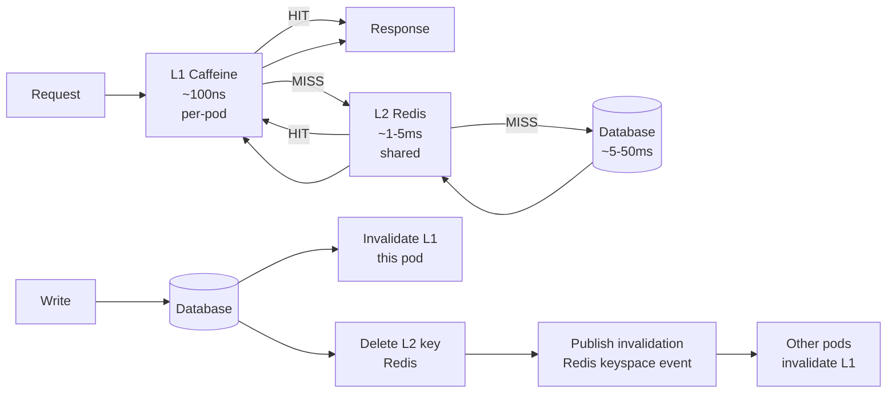

## Keywords in This File
{: .no_toc }

| # | Keyword | Weight |
|---|---|---|
| 1 | [Java Performance - L5 Caching Architecture](#java-performance---l5-caching-architecture) | medium |

---

# Java Performance - L5 Caching Architecture

## JVM Caching Strategy: Application, Query, and Object Cache

---

### 🎯 Model Answer

**30 seconds:**
> Caching layers: L1 (local in-process, Caffeine), L2 (distributed, Redis), L3 (CDN, Varnish).
> Tradeoffs: local cache = fast + no network but stale data and per-instance inconsistency.
> Remote cache = consistent + shared but network latency. Key decisions: eviction policy, TTL,
> cache stampede prevention, and invalidation strategy. Wrong cache design is worse than no cache
> (stale reads, thundering herd, unbounded memory).

**3 minutes (Senior):**
> JVM caching architecture at scale:
>
> 1. **Caffeine (L1, local)**: in-process, zero network latency (~100ns per get). Eviction:
>    W-TinyLFU (window TinyLFU), which outperforms LRU by adapting to frequency AND recency.
>    Size-based: `maximumSize(10_000)`. Weight-based: `maximumWeight(N)` for variable-size values.
>    Time-based: `expireAfterWrite`, `expireAfterAccess`. Refresh: `refreshAfterWrite` (async
>    reload, stale-while-revalidate pattern).
>
> 2. **Redis (L2, distributed)**: millisecond latency over network. Shared across all pods.
>    Consistent (with eventual consistency window). Data structures: String, Hash, Set, ZSet, List.
>    Use Hash for entity caching (field-level invalidation). Use String for computed results.
>
> 3. **Cache stampede** (thundering herd): many threads simultaneously miss the same key and all
>    compute the expensive value. Prevention: probabilistic early expiration, external lock (Redis
>    SETNX), or "stale-while-revalidate" (serve stale, compute in background).
>
> 4. **Cache invalidation strategies**: TTL (simple, may serve stale briefly), write-through
>    (update cache on every write, consistent, slower writes), write-behind (async cache update,
>    fast writes, risk of cache/DB divergence), event-driven (DB change event -> invalidate cache).
>
> 5. **Cache anti-patterns**: unbounded cache (OOM), over-invalidation (invalidate on every write
>    even if data rarely read), caching mutable entities without a versioning scheme (stale reads),
>    caching at the wrong layer (caching a slow SQL that could be fixed with an index).

**Blank Mind Recovery:**

**(1) Restate:** "Caching layers: L1 Caffeine (ns, local), L2 Redis (ms, shared). Cache stampede: many threads miss same key simultaneously. Fixes: probabilistic early expiration, SETNX lock, stale-while-revalidate. Invalidation: TTL / write-through / event-driven. Caffeine: W-TinyLFU eviction (better than LRU)."

**(2) First principles:** "Cache: trade consistency for speed. The faster the access, the more likely data is stale. Design for the acceptable staleness window. TTL: simple consistency model. Write-through: strong consistency, slower writes. Event-driven: strong consistency, complex infrastructure."

**(3) Bridge:** "A cache is like a local copy of your files on a laptop. Fast to access (no need to go to the server). Stale risk: server changes and your copy is outdated. Sync strategies: TTL (re-sync every N minutes), write-through (update local copy on every server change), event-driven (server pushes changes)."

---

### 📘 Concept Explanation

**Cache architecture patterns and Caffeine internals:**
```
CAFFEINE INTERNALS: W-TinyLFU ALGORITHM:

  Traditional LRU: evict Least Recently Used when full.
  Problem: a scan (a loop reading 1M entries) pollutes the LRU: 
    all 1M entries added to cache, evicting actually-useful entries.
  
  LFU (Least Frequently Used): evict least accessed entry.
  Problem: "frequency pollution": old entries with high historical frequency
    but low recent frequency are never evicted (they "stick").
    Example: a news article accessed 1000 times in January. In February:
    still in cache, blocking fresh content.
  
  W-TinyLFU (Caffeine's algorithm):
    1. Admission filter: new entries must pass an admission test.
       A candidate evictee is compared against the new entry using a
       frequency sketch (CountMinSketch). If the candidate has higher frequency:
       reject the new entry (don't evict the popular old entry).
       This prevents scan pollution.
    
    2. Frequency sketch: a memory-efficient frequency estimator.
       Counts approximate frequency of any key without storing all keys.
       Uses ~4 bits per entry. Much cheaper than a full frequency map.
    
    3. Window and probationary areas:
       Window (1% of cache): new entries go here first (no eviction from window).
       Probationary: entries from window; can be evicted if freq < candidate.
       Protected (80% of cache): entries accessed at least once from probationary.
       
    Result: W-TinyLFU achieves near-optimal hit rate on real-world workloads.
    Benchmark: 30-80% better hit rate than LRU on production traces.
    
  Weight-based eviction:
    maximumWeight(long): total cache "weight" limit.
    weigher(Weigher<K, V>): function that returns weight of an entry.
    Use when values have variable size: byte[] buffers, JSON strings.
    Without weight: large entries and small entries count equally.
    With weight: eviction decisions account for actual memory cost.

CAFFEINE CONFIGURATION PATTERNS:

  Loading cache (auto-compute on miss):
    LoadingCache<String, UserProfile> cache = Caffeine.newBuilder()
        .maximumSize(10_000)
        .expireAfterWrite(10, TimeUnit.MINUTES)
        .refreshAfterWrite(5, TimeUnit.MINUTES)  // background refresh
        .build(key -> userService.loadUser(key));  // loader function
    
    refreshAfterWrite: when an entry is read after 5 minutes,
      the STALE value is returned immediately,
      AND a background refresh is triggered.
      Next read: gets fresh value.
      Benefit: user never waits for refresh (stale-while-revalidate pattern).
    
    expireAfterWrite: entry removed after 10 minutes (even if refreshed).
      Hard TTL. Prevents indefinitely-refreshed stale data.
    
    Use pattern:
      cache.get(userId);          // loads if absent, returns cached if present
      cache.getIfPresent(userId); // returns null if absent (no load)
      cache.invalidate(userId);   // manual invalidation (on write)
      cache.invalidateAll();      // clear entire cache

  Async loading cache (non-blocking):
    AsyncLoadingCache<String, UserProfile> cache = Caffeine.newBuilder()
        .maximumSize(10_000)
        .expireAfterWrite(10, TimeUnit.MINUTES)
        .buildAsync(key -> userService.loadUserAsync(key));  // returns CompletableFuture
    
    CompletableFuture<UserProfile> future = cache.get(userId);
    // Non-blocking: caller gets a future.
    // Multiple concurrent requests for same key: only ONE loader is called.
    // All callers share the same future.

CACHE STAMPEDE PREVENTION:

  Cache stampede: many threads simultaneously miss the same key.
  Scenario:
    t=0: key expires. 500 threads receive requests needing this key.
    t=0 to t=50ms: all 500 threads: cache miss -> DB query (500 concurrent DB queries!)
    t=50ms: DB overwhelmed, queries slow/timeout.
    t=100ms: all 500 DB queries return, all 500 threads write to cache.
    t=100ms+: cache is warm again, but DB was briefly overwhelmed.
  
  Solution 1: Probabilistic early expiration (PER):
    Before TTL expires: probabilistically start a background refresh.
    Formula: if (current_time - last_write > ttl - beta * log(rand())):
      refresh now (stale value still served until refresh completes).
    Caffeine refreshAfterWrite implements this.
  
  Solution 2: External lock (Redis SETNX):
    Thread 1: cache miss -> SETNX lock key -> got lock -> DB query -> update cache -> release lock.
    Threads 2-499: cache miss -> SETNX lock key -> did NOT get lock -> wait OR serve stale.
    After Thread 1: all threads get fresh value from cache.
    Only 1 DB query instead of 500.
    
  Solution 3: Soft TTL (serve stale, refresh in background):
    Entry has a "soft TTL" (refresh window) and a "hard TTL" (expiry).
    Soft TTL hit: serve stale value, trigger background refresh (non-blocking).
    Hard TTL hit: entry removed, next request waits for load.
    Setting: refreshAfterWrite < expireAfterWrite.
    Caffeine handles this automatically.

TWO-LEVEL CACHE ARCHITECTURE (L1 + L2):

  L1: Caffeine (per-pod, in-memory)
    - Latency: ~100ns
    - Scope: per-pod (inconsistent between pods)
    - Size: bounded (e.g., 10,000 entries)
    - Invalidation: TTL or explicit
  
  L2: Redis (shared across pods)
    - Latency: ~1-5ms
    - Scope: global (consistent across all pods)
    - Size: large (GB scale)
    - Invalidation: Redis keyspace notifications or explicit delete
  
  Read path: check L1 -> hit: return. Miss: check L2 -> hit: populate L1, return.
             L2 miss: DB query -> populate L2, populate L1, return.
  
  Write path: write DB -> invalidate L1 (current pod) -> delete/update L2 (Redis).
              Other pods: their L1 serves stale until TTL or explicit invalidation.
  
  Invalidation consistency:
    L1 inconsistency: acceptable if TTL < acceptable staleness (e.g., 30 seconds).
    L2 invalidation: on every write to ensure cross-pod consistency.
    Publish-subscribe: Redis keyspace notifications -> all pods subscribe to invalidation events.
      -> when L2 entry is deleted: all pods invalidate their L1 entry for that key.
      -> provides strong consistency within a few milliseconds.

CACHE ANTI-PATTERNS:

  1. CACHING MUTABLE ENTITIES WITHOUT VERSIONING:
     cache.put(orderId, order);  // order may be updated by another service
     // Consumers read stale order status for up to TTL seconds.
     // If TTL = 10 minutes: stale order visible for 10 minutes after update.
     
     Fix: include version or last-modified timestamp in cache key.
     Or: shorter TTL for frequently-mutated entities.
     Or: event-driven invalidation (order-updated event -> cache.invalidate(orderId)).
  
  2. CACHING AT THE WRONG LAYER (premature caching):
     // Slow query: SELECT * FROM orders WHERE customer_id = ? ORDER BY created_at DESC
     // Developer: cache the result.
     // Root cause: missing index on (customer_id, created_at).
     // Fix: add the index. No cache needed.
     
     Caching expensive operations should follow profiling.
     If the expense can be eliminated at the source: fix the source.
     Cache is a band-aid for an unavoidable expense.
  
  3. UNBOUNDED CACHE:
     Map<String, Object> cache = new HashMap<>();  // no eviction, no size limit
     // Grows without bound. OOM at some point.
     
     Fix: Caffeine with maximumSize. Always.
```

> **Code walkthrough:** This example demonstrates the core pattern in action. The key mechanism shows how the concept works in practice. Study the structure to understand the essential behavior and common usage.

---

### 💻 Code Example

> **Code walkthrough:** The two-level cache implementation shows the L1+L2 architecture with
> Redis keyspace notification-based invalidation. This enables per-pod L1 caches to stay
> consistent without polling.

```java
// TWO-LEVEL CACHE IMPLEMENTATION WITH CONSISTENCY:

@Service
public class UserCacheService {
    
    // L1: local in-process Caffeine cache (per pod)
    private final LoadingCache<String, User> l1Cache;
    
    // L2: Redis (shared across all pods)
    private final RedisTemplate<String, User> redisTemplate;
    
    private static final String CACHE_PREFIX = "user:";
    private static final Duration L2_TTL = Duration.ofMinutes(30);
    private static final int L1_MAX_SIZE = 5_000;
    
    public UserCacheService(RedisTemplate<String, User> redisTemplate,
                            UserRepository userRepository) {
        this.redisTemplate = redisTemplate;
        
        this.l1Cache = Caffeine.newBuilder()
            .maximumSize(L1_MAX_SIZE)
            .expireAfterWrite(Duration.ofSeconds(30))  // short L1 TTL
            .refreshAfterWrite(Duration.ofSeconds(20)) // background refresh
            .build(userId -> loadFromL2OrDB(userId, userRepository));
    }
    
    public User getUser(String userId) {
        return l1Cache.get(userId);  // L1 first
    }
    
    private User loadFromL2OrDB(String userId, UserRepository repo) {
        // Try L2:
        String key = CACHE_PREFIX + userId;
        User user = redisTemplate.opsForValue().get(key);
        if (user != null) {
            return user;  // L1 miss, L2 hit
        }
        // L2 miss: go to DB:
        user = repo.findById(userId).orElseThrow();
        // Populate L2:
        redisTemplate.opsForValue().set(key, user, L2_TTL);
        return user;  // L1 and L2 cache populated by caller
    }
    
    // Write path: invalidate both caches:
    @Transactional
    public User updateUser(String userId, UserUpdate update) {
        User updated = userRepository.update(userId, update);  // DB write
        
        // Invalidate L1 (this pod):
        l1Cache.invalidate(userId);
        
        // Invalidate L2 (all pods via Redis):
        redisTemplate.delete(CACHE_PREFIX + userId);
        
        // Publish invalidation event for other pods' L1 caches:
        invalidationPublisher.publish(userId);  // see below
        
        return updated;
    }
}

// CACHE STAMPEDE PREVENTION WITH REDIS LOCK:
@Service
public class StampedeProtectedCache {
    
    private final Cache<String, String> localCache;
    private final StringRedisTemplate redis;
    private final ExpensiveService expensiveService;
    
    // On cache miss: use Redis lock to ensure only one thread computes:
    public String getOrCompute(String key) {
        // Try local cache first:
        String cached = localCache.getIfPresent(key);
        if (cached != null) return cached;
        
        // Local miss: try Redis cache:
        String redisKey = "cache:" + key;
        String redisCached = redis.opsForValue().get(redisKey);
        if (redisCached != null) {
            localCache.put(key, redisCached);
            return redisCached;
        }
        
        // Both miss: acquire lock to prevent stampede:
        String lockKey = "lock:" + key;
        Boolean locked = redis.opsForValue()
            .setIfAbsent(lockKey, "1", Duration.ofSeconds(30));
        
        if (Boolean.TRUE.equals(locked)) {
            try {
                // Got lock: compute the value:
                String computed = expensiveService.compute(key);
                // Store in Redis:
                redis.opsForValue().set(redisKey, computed, Duration.ofMinutes(5));
                // Store in local cache:
                localCache.put(key, computed);
                return computed;
            } finally {
                redis.delete(lockKey);  // release lock
            }
        } else {
            // Didn't get lock: another thread is computing.
            // Retry after brief wait, or serve stale/default:
            try {
                Thread.sleep(50);  // wait 50ms then retry
                return getOrCompute(key);  // recursive retry
            } catch (InterruptedException e) {
                Thread.currentThread().interrupt();
                return null;  // or return a safe default
            }
        }
    }
}
```

> **Code walkthrough:** The `UserCacheService` shows the two-level cache: `l1Cache.get(userId)`
> checks L1 first; on miss, it calls `loadFromL2OrDB` which checks Redis (L2), then falls back to
> the database. The write path invalidates both caches explicitly. The `StampedeProtectedCache`
> shows the Redis SETNX lock pattern: only the lock holder computes the expensive value; other
> threads wait and retry. The 30-second lock TTL prevents lock abandonment (if the lock holder
> crashes, the lock auto-expires).

---

### 🎓 Answers by Seniority

**Junior / Mid (0-5 years):**
> Caffeine: best local cache for Java. Always set `maximumSize`. Use `expireAfterWrite` for TTL.
> Redis: distributed cache, shared across pods. Use L1 (Caffeine) for hot data, L2 (Redis) for
> shared data. Cache stampede: many threads miss same key -> use `refreshAfterWrite` (Caffeine) or
> Redis SETNX lock. Never use unbounded HashMap as a cache.

---

**Senior / Staff (5+ years):**
> Cache architecture decision: accept the consistency window. L1+L2 with Redis keyspace
> notification: near-strong consistency at the cost of infrastructure complexity. Pure TTL:
> simple, predictable staleness window. Event-driven invalidation: strong consistency, requires
> change data capture or application-level invalidation hooks. Off-heap caching (Chronicle Map):
> for caches > 1GB that would cause GC pressure if on-heap. The "right" caching strategy depends
> on: read/write ratio, staleness tolerance, pod count, and memory budget.

---

### ⚠️ Common Misconceptions

**Misconception: "More caching is always better."**
Caching has a correct scope: use when (1) the data is expensive to recompute, (2) reads are much
more frequent than writes, and (3) stale data is acceptable within a bounded window. Wrong uses:
(1) caching results of very cheap operations (overhead > benefit), (2) caching rapidly-changing
data (high invalidation overhead, often serves stale), (3) using cache to avoid fixing an underlying
problem (slow query that needs an index, N+1 query that needs join). Over-caching: hidden consistency
bugs (stale reads), memory pressure, and complex invalidation logic. Cache when you NEED it (measured
latency improvement), not preemptively.

---

### 🚨 Failure Modes and Diagnosis

**Failure: After deploying a new pod, Redis cache is empty for 30 minutes causing DB overload.**
```
Symptom: New pod starts. Cache miss rate: 99% for first 30 minutes.
  DB query rate spikes 10x. DB latency increases. Some queries time out.
  After 30 minutes: cache warms up, DB load returns to normal.

Root cause: Cache-less cold start.
  New pod: local L1 cache is empty (Caffeine starts fresh).
  Redis L2 cache: populated by other pods during normal operation.
  New pod: L1 misses go to Redis. Redis hits (mostly).
  BUT: new pod receives 1/N of traffic (load balanced).
  For the key set new pod handles: Redis has the keys from other pods.
  
  Root cause (more specific): the Redis keys were NOT pre-populated.
  They expired during a scheduled maintenance window (all pods restarted simultaneously).
  All pods start cold. All pods miss L2. All go to DB simultaneously.
  
  THIS is the thundering herd at the pod level.

Diagnosis:
  Redis key TTL: jcmd on Redis: DEBUG object <key> -> shows TTL.
  If all keys expired simultaneously: scheduled maintenance caused cascading expiration.
  
  Cache miss rate metric: if hit rate < 50% during startup: cold start issue.

Fix:
  1. Staggered restart: roll pods one at a time (not all simultaneously).
     Pod 1 restarts (cold): L2 still warm from pods 2-N.
     Pod 1 warms up from L2 (fast: just a Redis read).
     Then Pod 2 restarts. Etc.
     
  2. Cache warming on startup:
     @EventListener(ApplicationReadyEvent.class)
     public void warmCache() {
         // Pre-populate L1 from L2 for the most common keys:
         List<String> hotKeys = hotKeyRegistry.getTopKeys(1000);
         hotKeys.parallelStream().forEach(key -> cache.get(key));
         log.info("Cache warmed: {} keys pre-loaded", hotKeys.size());
     }
  
  3. Probabilistic TTL (jitter):
     // Instead of all keys expiring at the same time:
     Duration ttlWithJitter = baseTtl.plus(
         Duration.ofSeconds(random.nextInt(120)));  // +0-120 seconds jitter
     redis.opsForValue().set(key, value, ttlWithJitter);
     // Keys now expire spread over 2 minutes, not all at once.
```

> **Code walkthrough:** This example demonstrates the core pattern in action. The key mechanism shows how the concept works in practice. Study the structure to understand the essential behavior and common usage.

---

### 📊 Diagram

```
TWO-LEVEL CACHE READ PATH:

  Request -> L1 (Caffeine, ~100ns)?
                |
            HIT: return
                |
            MISS -> L2 (Redis, ~1-5ms)?
                        |
                    HIT: populate L1, return
                        |
                    MISS -> DB query (~5-50ms)
                                |
                            Populate L2, populate L1, return
  
  Write path: DB write -> invalidate L1 -> delete L2 -> broadcast invalidation
```



> **Diagram walkthrough:** The ASCII path shows the latency at each cache tier: 100ns, 1-5ms,
> 5-50ms. Each tier is a fallback for the one above. The Mermaid diagram adds the write path:
> a database write triggers invalidation of L1 (immediate, local), deletion of L2 (immediate,
> shared), and publication of an invalidation event for other pods' L1 caches. This provides
> near-strong consistency: other pods' L1 caches serve stale data only until the Redis keyspace
> event is received and processed (milliseconds).

---

### ⚖️ Comparison Table

| Eviction Policy | Handles Frequency | Handles Recency | Handles Scans | Notes |
|---|---|---|---|---|
| LRU | No | Yes | Bad (scan pollution) | Simple, common default |
| LFU | Yes | No | Yes | "Sticky" old entries |
| W-TinyLFU (Caffeine) | Yes | Yes | Yes | Best hit rate on real workloads |
| FIFO | No | No | N/A | Simple, poor hit rate |
| TTL-only | No | No | N/A | Time-based, not access-based |

---

### 🏛️ System Design

**Caching architecture for a high-traffic e-commerce catalog service:**

Read pattern: 10,000 RPS for product catalog (product details, pricing, inventory). Write pattern:
100 writes/minute (price updates, inventory adjustments). Acceptable staleness: 30 seconds for
pricing, 60 seconds for catalog details.

Architecture: L1 Caffeine (per pod, 10,000 entries, TTL 30s, refreshAfterWrite 20s). L2 Redis
(shared, 1 million entries, TTL 5 minutes). Invalidation: on price/inventory change: delete Redis
key + Redis pub/sub invalidation to all pods' L1. No invalidation delay > 100ms (Redis pub/sub).
Off-heap for large catalog data (millions of products): Chronicle Map (off-heap key-value, no GC
pressure).

Result: 99%+ L1 hit rate for hot products. DB load: 1-2% of request volume. p99 latency < 1ms
(L1 hit). Even at 10,000 RPS: DB receives ~100 QPS (hot products cached locally). Cache-aside
pattern throughout: application reads cache, falls back to DB on miss.

---

### 🎯 Interview Deep-Dive

| Question Category | Time to Answer |
|---|---|
| Caffeine W-TinyLFU | 2 minutes |
| L1 vs L2 cache tradeoffs | 2 minutes |
| Cache stampede | 2 minutes |
| Write-through vs write-behind | 2 minutes |
| Cache invalidation strategies | 2 minutes |
| refreshAfterWrite pattern | 2 minutes |
| Redis keyspace notifications | 1 minute |
| Cache anti-patterns | 1 minute |
| Off-heap caching | 1 minute |
| Cold start and warming | 1 minute |
| Stale-while-revalidate | 1 minute |
| Cache-aside vs read-through | 1 minute |

---

**Q1 (stampede): What is a cache stampede and how do you prevent it?**

A: Cache stampede (thundering herd): multiple threads simultaneously attempt to load a cache entry
that has just expired. All threads miss the cache, all simultaneously execute the expensive computation
(DB query, external service call). The underlying service receives a burst of N identical requests
where N = number of concurrent threads at that moment. Consequences: DB overload, latency spike,
potential cascading failure. Prevention: (1) `refreshAfterWrite` in Caffeine: entry refreshed in
the background before it expires; stale value served during refresh (stale-while-revalidate). Only
ONE background refresh runs (Caffeine ensures this). (2) Redis SETNX lock: only the thread that
acquires the lock performs the computation; others wait. (3) Probabilistic early expiration: each
thread probabilistically refreshes before the TTL, spreading the refresh load.

*What separates good from great:* The "refresh thundering herd" in Caffeine's refreshAfterWrite:
when `refreshAfterWrite` triggers, Caffeine uses the loader function asynchronously, returning
the stale value immediately. Multiple threads reading the same key during the refresh window: all
get the stale value, only ONE refresh is triggered. This is "request coalescing": many concurrent
reads for the same key coalesce to a single loader invocation. ConcurrentHashMap.computeIfAbsent()
also coalesces: only one computation runs per key, even with 1000 concurrent callers. Understanding
this distinction is critical for high-concurrency cache implementations. Without coalescing: N threads
start N computations (stampede). With coalescing: N threads start 1 computation (correct behavior).

---

**Q2 (eviction): How does W-TinyLFU (Caffeine's eviction algorithm) improve over LRU?**

A: LRU weakness: "scan pollution." A sequential scan through a large dataset evicts ALL useful cached
data and replaces it with scan data that won't be accessed again. After the scan: cache is full of
useless data. Hit rate drops to near zero until the cache re-warms. LFU weakness: frequency "stickiness."
Old entries with high historical frequency (e.g., a trending article from 3 months ago) are never
evicted because their historical count is high, even if they haven't been accessed recently.
W-TinyLFU: uses a frequency sketch (CountMinSketch, ~4 bits per entry) to estimate frequency.
Admission filter: before evicting an existing entry for a new entry, the new entry's frequency is
compared to the candidate evictee. If the new entry has LOWER frequency than the evictee: the new
entry is rejected (scan data rejected). The frequency sketch ages over time (counts decay): old
frequency counts fade, preventing LFU stickiness.

*What separates good from great:* The "window" in W-TinyLFU: new entries always get a chance (they
go to the window area first, not directly competing with the main cache). This handles "first-access"
scenarios: a new popular article is accessed for the first time. Its frequency = 0. Without the window,
LFU would never admit it (frequency too low). With the window: it gets a chance to demonstrate its
popularity. After one access: it competes fairly for admission to the main cache. This is why W-TinyLFU
adapts to both frequency AND recency: the window provides recency-based admission while the main
cache uses frequency-based retention. Caffeine benchmarks on real production traces (from Wikipedia,
databases, etc.) show W-TinyLFU achieves 30-80% better hit rate than LRU on most workloads.

---

**Q3 (consistency): What is the consistency model of a two-level (L1+L2) cache with TTL invalidation?**

A: With TTL invalidation (no event-driven invalidation): eventual consistency with a bounded staleness
window. After a write: L1 serves stale for up to L1's TTL (e.g., 30 seconds). L2 serves stale for
up to L2's TTL (e.g., 5 minutes). Maximum staleness: L1 TTL if L1 serves a stale entry (L1 TTL >
L2 TTL case). In practice: when L1 expires, it reads from L2; if L2 still has the stale entry (L2
TTL not expired), L1 gets stale data again. Maximum staleness end-to-end = max(L1 TTL, L2 TTL).
With event-driven invalidation (Redis pub/sub): after a write, L1 and L2 are invalidated within
milliseconds. The stale window = time for the invalidation event to propagate (~1-10ms). Near-strong
consistency.

*What separates good from great:* The "write amplification" vs "consistency trade-off" decision: for
a product catalog read 10,000 times per write, 5-minute TTL is acceptable (1 write, 10,000 reads before
expiry). For a user balance updated every few minutes: 5-minute TTL is unacceptable (user sees wrong
balance for up to 5 minutes). The consistency model must match the business requirement. The mistake:
using the same TTL for all cached entities. Each entity type has a different mutation rate and consistency
requirement. Design: entity type -> TTL mapping in a cache configuration class. High-mutation entities
(sessions, balances): short TTL (5-30 seconds) or write-through. Low-mutation entities (product catalog,
user preferences): longer TTL (5-30 minutes) with event-driven invalidation on the infrequent writes.

---

---

### 💻 Code Example

*(Omit: this concept does not have a programmatic interface that can be demonstrated in code. The conceptual explanation above is sufficient.)*


---

### 🏛️ System Design

*(Omit: system design diagram not applicable for this concept - see ★★★ keywords for full system design coverage.)*


---

### ⚖️ Comparison Table

*(Omit: this is a ★☆☆ foundational concept with no direct alternatives to compare - see higher-difficulty keywords for trade-off analysis.)*


---

### 📊 Diagram

*(Omit: no standalone visual diagram required for this concept - the explanations and code examples above provide sufficient clarity.)*


