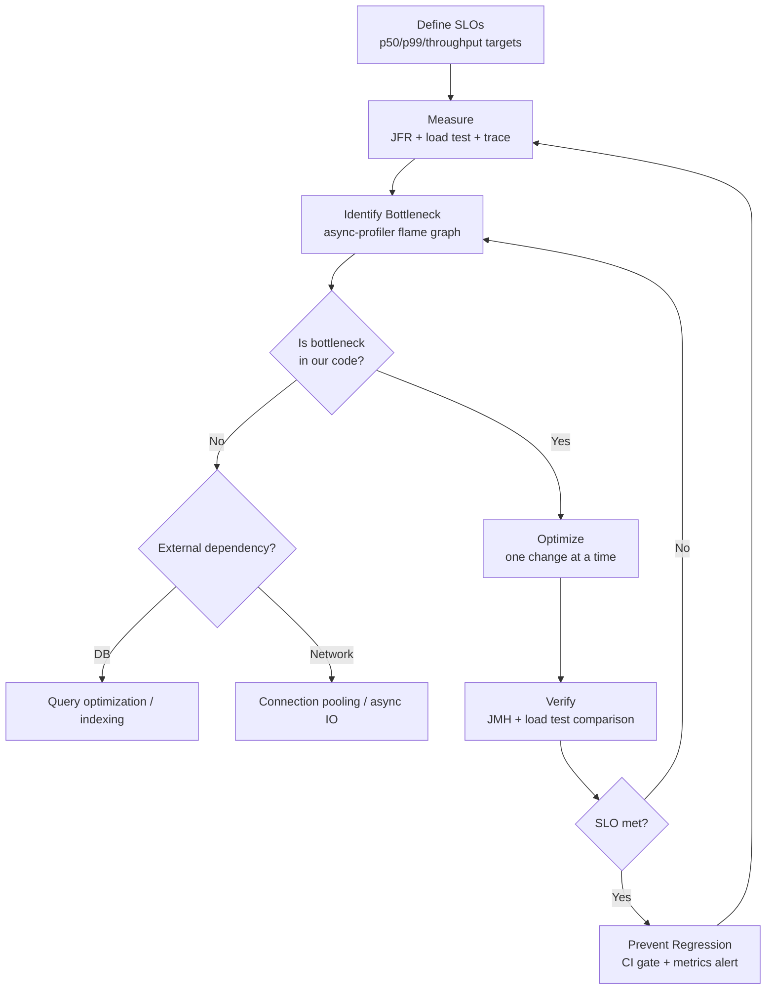

## Keywords in This File
{: .no_toc }

| # | Keyword | Weight |
|---|---|---|
| 1 | [Java Performance - L5 Performance Strategy](#java-performance---l5-performance-strategy) | medium |

---

# Java Performance - L5 Performance Strategy

## Application Performance Engineering: Strategy and Process

---

### 🎯 Model Answer

**30 seconds:**
> Performance engineering: not a one-time optimization but a continuous process. Pillars:
> (1) define SLOs (latency, throughput, resource targets), (2) measure first (profile before
> optimizing), (3) optimize the bottleneck (Amdahl: serial fraction limits gains), (4) verify with
> benchmarks (JMH for micro, load test for system), (5) prevent regression (performance CI/CD gates).

**3 minutes (Senior):**
> Application performance engineering as an organizational discipline:
>
> 1. **SLO definition**: latency (p50, p95, p99, p999), throughput (RPS), resource efficiency
>    (CPU%, memory, GC overhead). SLOs must be measurable, version-tracked, and monitored.
>    Violations: trigger alerts, not post-hoc discovery.
>
> 2. **Performance budget**: each feature or change has a "budget" - it can cost at most X ms
>    of latency or Y% CPU. If over budget: either optimize or explicitly accept the regression.
>    "Perf budget" prevents gradual degradation (death by a thousand cuts).
>
> 3. **Measure-first discipline**: always profile before optimizing. The bottleneck is rarely
>    where you think it is (premature optimization = optimizing the wrong thing). Profiling first:
>    guarantees effort goes to actual bottlenecks. Amdahl's Law: even perfect optimization of
>    non-bottleneck code = negligible overall improvement.
>
> 4. **Load testing in CI/CD**: synthetic load test on every PR. Compare: before/after latency
>    distribution, CPU, GC overhead. Automated gate: "if p99 regresses > 5%, block merge."
>    Without automated gates: performance regressions are discovered after deployment (expensive).
>
> 5. **Production observability**: continuous profiling (JFR), distributed tracing (OpenTelemetry),
>    metrics (Prometheus + Grafana). Performance issues discovered via production signals, not just
>    load tests.

**Blank Mind Recovery:**

**(1) Restate:** "Performance engineering: define SLOs, measure first (profile), optimize bottleneck, verify (JMH + load test), prevent regression (CI/CD gate). Performance budget: each change has a cost limit. Without measurement: optimize the wrong thing."

**(2) First principles:** "Amdahl's Law: if X% of execution is serial (un-parallelizable), maximum speedup = 1 / X regardless of how fast the parallel part is. If 10% is serial: max speedup = 10x, even with infinite parallel threads. Always optimize the serial bottleneck first."

**(3) Bridge:** "Performance engineering is like a restaurant kitchen. SLO: tables served in < 20 minutes. Measure first: a timer on each dish (profiling). Optimize the bottleneck: not the fastest station (prep) but the slowest (the grill). Performance budget: each new menu item can add at most 2 minutes to total cook time. Regression gate: if a new dish makes the previous menu take 25 minutes: reject it."

---

### 📘 Concept Explanation

**Performance engineering process and org-level practices:**
```
PERFORMANCE ENGINEERING FRAMEWORK:

  Phase 1: Define (what does "good" look like?)
    
    SLO (Service Level Objective):
      P50 latency: < 10ms    (median user experience)
      P99 latency: < 100ms   (tail latency: most users never see worse)
      P999 latency: < 500ms  (worst 0.1%: rare, but bounded)
      Throughput: > 5,000 RPS on 4-core pod
      CPU: < 60% at 5,000 RPS (headroom for bursts)
      Heap GC overhead: < 5% of CPU (GC should not dominate)
    
    Performance budget per component:
      Auth middleware: budget = 5ms
      DB query (cached): budget = 2ms
      Business logic: budget = 3ms
      Total: 10ms p50 SLO
    
    If a PR changes Auth middleware and adds 8ms: over budget.
    Choices: (a) optimize the change, (b) take budget from elsewhere, (c) raise SLO.
    NOT an option: silently regress.
  
  Phase 2: Measure (what is actually happening?)
    
    Tooling hierarchy:
      Production: JFR continuous, Prometheus metrics, OpenTelemetry traces.
      Load test: k6/Gatling synthetic traffic, measure at P99/P999.
      Micro-benchmark: JMH for specific method comparison.
    
    Measurement anti-patterns:
      "I just ran it in my IDE and it seemed fast." -> Not a measurement.
      "The average response time is 50ms." -> Need percentiles, not averages.
      "I added 100ms of sleep and it didn't matter." -> Not a real measurement.
    
    Correct measurement: run under REAL or REALISTIC load (JMH warmup, JIT-compiled,
    same hardware as production). Measure percentiles. Track over time.
  
  Phase 3: Identify Bottleneck (where is the real limit?)
    
    Profiling-first rule: never guess the bottleneck.
    
    Tools by layer:
      CPU bottleneck: async-profiler -e cpu (flame graph)
      Memory/GC: async-profiler -e alloc + GC logs
      IO bottleneck: JFR IO events or async-profiler -e wall
      Lock contention: async-profiler -e lock or JFR MonitorEnter
      External service: distributed trace (OpenTelemetry)
    
    Bottleneck definition: the resource or code section that, if optimized,
    produces the most improvement in the target SLO.
    
    Common mistake: optimizing a section that takes 5% of CPU.
    Even perfect 0% CPU for that section: 5% improvement maximum.
    Find the section taking 40-60% of CPU (or wait time): optimize THAT.
  
  Phase 4: Optimize (change with a hypothesis)
    
    Scientific method for performance optimization:
      Hypothesis: "Replacing HashMap with ConcurrentHashMap reduces lock contention
                  and will reduce p99 latency by 20ms."
      Experiment: implement the change on a branch.
      Measurement: run load test. Compare p99 before vs after.
      Result: "p99 changed from 105ms to 85ms: hypothesis confirmed, 19% improvement."
      OR: "p99 unchanged: hypothesis rejected. Different bottleneck."
    
    Without this discipline: "I made 5 changes and it feels faster" is not engineering.
    Make ONE change at a time. Measure each change independently.
  
  Phase 5: Prevent Regression (don't lose what you gained)
    
    Performance CI/CD gate:
      Load test as part of PR merge check.
      Compare current branch vs main branch SLOs.
      If regression > threshold: block merge. Require explicit override.
    
    JMH as regression test:
      Checked-in benchmarks for critical paths.
      CI: run benchmarks, alert if > 10% regression.
    
    "Performance charter": a document (or wiki page) tracking:
      Current SLOs, current actual metrics, history of major changes.
      Used in planning: "feature X would require relaxing our p99 SLO from 100ms to 150ms.
      Is this acceptable? Decision needed before implementing."

CAPACITY PLANNING AND SCALING:

  Little's Law (queuing theory):
    L = lambda * W
    L: average number of requests in the system
    lambda: arrival rate (requests/second)
    W: average time in system (seconds/request)
    
    Example: service with p50 latency = 100ms, receiving 1,000 RPS.
    L = 1,000 * 0.1 = 100 concurrent requests in flight.
    If thread pool = 100 threads: utilization = 100%. Any increase -> queue builds.
    
    Headroom rule: provision for 50% headroom. 100 max concurrent -> set pool to 50, reject at 100.
    This ensures: at 100 concurrent, the service still responds (pool not exhausted).
  
  Amdahl's Law:
    Speedup(N) = 1 / (S + (1-S)/N)
    S: fraction of work that is serial (cannot be parallelized)
    N: number of processors/threads
    
    At S=0.1 (10% serial): max speedup = 10x (with infinite threads).
    At S=0.5 (50% serial): max speedup = 2x (with infinite threads).
    
    Implication: before adding more threads/servers: reduce the serial fraction.
    Serial fractions: DB bottleneck (single-writer), global lock, single-threaded queue processor.
    
    At scale: Gunther's Universal Scalability Law (extends Amdahl with coherence penalty).
    USL: throughput degrades above N* cores due to coherence overhead.
    Models actual measured throughput curves in distributed systems.

PERFORMANCE TESTING HIERARCHY:

  Unit Benchmark (JMH):
    Scope: single method or component.
    Measures: method throughput, latency at JIT steady state.
    When: comparing two implementations of the same interface.
    Output: ns/op, ops/s, allocation rate.
    
  Integration Benchmark (JMH or custom):
    Scope: service layer with real dependencies (DB, cache).
    Measures: end-to-end method time including IO.
    When: optimizing a specific use case with real data.
    
  Load Test (k6, Gatling, Locust):
    Scope: full service via HTTP.
    Measures: throughput, latency percentiles, error rate.
    When: validating SLOs, capacity planning, regression testing.
    
  Chaos/Soak Test:
    Scope: full service over extended duration (24-72 hours).
    Measures: memory growth, GC stability, thread pool exhaustion.
    When: before major releases, after major architectural changes.
    Key metrics: memory-after-gc trend (leak detection), GC overhead trend.
```

> **Code walkthrough:** This example demonstrates the core pattern in action. The key mechanism shows how the concept works in practice. Study the structure to understand the essential behavior and common usage.

---

### 💻 Code Example

> **Code walkthrough:** The JMH regression test pattern shows how to integrate performance
> benchmarks into CI. The SLO tracking setup shows a Micrometer-based implementation.

```java
// PERFORMANCE REGRESSION TEST (JMH integrated in CI):

// In src/test/java/perf/ (or a separate perf module):
@BenchmarkMode(Mode.AverageTime)
@OutputTimeUnit(TimeUnit.MICROSECONDS)
@Warmup(iterations = 5, time = 1)
@Measurement(iterations = 10, time = 2)
@Fork(value = 1, jvmArgsAppend = {"-Xms512m", "-Xmx512m"})
@State(Scope.Benchmark)
public class OrderProcessorBenchmark {
    
    private OrderProcessor processor;
    private Order testOrder;
    
    @Setup
    public void setUp() {
        processor = new OrderProcessor();
        testOrder = Order.builder()
            .id("test-order")
            .items(List.of(new OrderItem("SKU-1", 10, BigDecimal.valueOf(9.99))))
            .build();
    }
    
    @Benchmark
    public OrderResult processOrder() {
        return processor.process(testOrder);
    }
    
    // CI: run this benchmark, compare to baseline.
    // If result > baseline + 10%: fail the CI job.
    // Baseline: stored in a reference file (updated manually after intentional changes).
}

// BENCHMARK COMPARISON SCRIPT (CI integration):
// Using JMH JSON output + comparison:
// mvn test -Pbenchmark -Djmh.result.format=json -Djmh.result.filePrefix=results
// python3 compare_benchmarks.py results-baseline.json results-current.json --threshold 0.10
// Exit code 1 if regression > 10%

// SLO TRACKING WITH MICROMETER:
@Component
public class SloTracker {
    private final DistributionSummary orderProcessingLatency;
    private final Counter sloViolations;
    
    // SLOs:
    private static final double P99_SLO_MS = 100.0;
    private static final double P999_SLO_MS = 500.0;
    
    public SloTracker(MeterRegistry registry) {
        this.orderProcessingLatency = DistributionSummary.builder("order.processing.latency")
            .baseUnit("milliseconds")
            .publishPercentiles(0.50, 0.95, 0.99, 0.999)  // track these percentiles
            .publishPercentileHistogram(true)   // enable Prometheus histogram
            .serviceLevelObjectives(10, 50, 100, 500)  // SLO buckets in ms
            .register(registry);
        
        this.sloViolations = Counter.builder("order.processing.slo.violations")
            .description("Requests violating SLO")
            .register(registry);
    }
    
    public void recordLatency(long latencyMs) {
        orderProcessingLatency.record(latencyMs);
        
        if (latencyMs > P99_SLO_MS) {
            sloViolations.increment();
            // Alert if slo_violations / total_requests > 0.01 (1%):
            // That means p99 SLO is being violated.
        }
    }
}
// Prometheus alert:
// ALERT OrderProcessingP99SloViolation
//   IF rate(order_processing_latency_bucket{le="100"}[5m]) 
//      / rate(order_processing_latency_count[5m]) < 0.99
//   FOR 2m
//   ANNOTATIONS { summary = "p99 latency SLO violated" }
```

> **Code walkthrough:** The JMH regression test is structured as a standard Maven test that can run
> in CI. The `@Fork` annotation creates a fresh JVM for the benchmark (no interference from test
> framework state). The SLO tracker uses Micrometer's `DistributionSummary` with explicit percentile
> and histogram publication, enabling Prometheus to compute SLO compliance ratios without client-side
> aggregation. The alert rule uses a ratio: requests within SLO / total requests < 99% means p99
> SLO is being violated.

---

### 🎓 Answers by Seniority

**Junior / Mid (0-5 years):**
> Performance engineering: measure first (profile), then optimize the real bottleneck. Never
> guess. Define SLOs (p50, p99, throughput targets). Use JMH for micro-benchmarks. Load test
> to validate end-to-end. Track percentiles (not just averages). Prevent regression with CI gates.

---

**Senior / Staff (5+ years):**
> Performance engineering is org-level discipline: SLO budget per PR, automated CI regression
> gates, continuous production profiling. Amdahl's Law: focus on the serial bottleneck first
> (adding threads helps only if the bottleneck is parallelizable). Little's Law: capacity planning
> from latency + throughput. Soak testing: 48-72 hours under load, monitoring memory-after-GC
> trend. At the architecture level: the most impactful performance decision is usually the data
> access pattern (DB query design), not JVM tuning.

---

### ⚠️ Common Misconceptions

**Misconception: "Premature optimization is always wrong."**
The full Knuth quote: "We should forget about small efficiencies, say about 97% of the time: premature
optimization is the root of all evil. Yet we should not pass up our opportunities in that critical 3%."
The CRITICAL 3%: hotspots identified by profiling in the actual production bottleneck. Optimizing
the critical 3%: correct, necessary, and valuable. Premature optimization: optimizing BEFORE profiling
(guessing what's slow). The rule: profile first, then optimize only the measured bottleneck. Performance
engineering is NOT anti-optimization; it is pro-measurement.

---

### 🚨 Failure Modes and Diagnosis

**Failure: Service degraded gradually over 6 months. No single regression identifiable.**
```
Symptom: p99 latency was 80ms 6 months ago. Now: 180ms.
  No single deployment caused the regression.
  Code review shows no obvious changes.
  Traffic is the same.

Root cause: "Death by a thousand cuts" - no performance regression gate.
  Feature A: +5ms (regression not caught, too small to notice manually).
  Feature B: +8ms. Feature C: +12ms. Dependency upgrade: +15ms.
  Etc. After 20 features: +100ms cumulative.
  Each individual change: below the "worth reporting" threshold.
  Cumulative: 2.25x latency regression.

Diagnosis:
  Git bisect + load test on historical commits:
    git log --oneline -20  (list last 20 commits)
    For each commit: checkout, run load test, record p99.
    Plot: p99 vs commit date. Find the "step function" commits.
    Each step function: a regression that was too small to catch manually.
  
  Or: review profiling flame graphs from 6 months ago (JFR archive if available).
  Compare: what's thick in current profile that wasn't thick historically?

Fix:
  1. Implement a performance regression gate in CI:
     Load test on EVERY PR. Compare to main branch SLO.
     Gate: if p99 regresses > 5%: require explicit "perf accepted" label to merge.
  
  2. Establish a performance charter:
     Document current SLOs. Review quarterly.
     Any approved regression: update the charter.
     Unapproved regression: requires investigation and fix.
  
  3. Weekly performance dashboard review:
     Team habit: review performance dashboard every Monday.
     Catches regressions within 1-2 weeks instead of 6 months.
```

> **Code walkthrough:** This example demonstrates the core pattern in action. The key mechanism shows how the concept works in practice. Study the structure to understand the essential behavior and common usage.

---

### 📊 Diagram

```
PERFORMANCE ENGINEERING CYCLE:

  DEFINE SLOs
       |
       v
  MEASURE (Profile, Load Test, Trace)
       |
       v
  IDENTIFY BOTTLENECK (Profiling flame graph)
       |
       v
  OPTIMIZE (one change, one measurement)
       |
       v
  VERIFY (JMH + Load Test + Production metrics)
       |
       v
  PREVENT REGRESSION (CI gate + SLO monitoring)
       |
       +----> loop back to MEASURE periodically
```



> **Diagram walkthrough:** The ASCII cycle shows the 6 phases and the continuous loop (measure
> periodically even after optimization). The Mermaid flowchart adds decision branching: when the
> bottleneck is in an external dependency (DB, network), the optimization path is different (query
> tuning, connection pooling) rather than JVM-level optimization. The "No" branch from SLO met
> loops back to identify the next bottleneck - performance improvement is iterative.

---

### ⚖️ Comparison Table

| Testing Approach | Scope | Measures | When to Use |
|---|---|---|---|
| JMH micro-benchmark | Single method | ns/op, throughput, allocation | Comparing two implementations |
| Integration benchmark | Service layer + DB | Real-world latency | Validating specific use cases |
| Load test (k6/Gatling) | Full service HTTP | p50/p99, RPS, error rate | SLO validation, regression check |
| Soak test | Full service, 48-72h | Memory growth, GC stability | Pre-release, post-architecture change |
| Production profiling | Live service | Real user impact | Diagnosing production incidents |

---

### 🏛️ System Design

**Performance-aware development organization:**

Platform: CI with automated performance gate (JMH benchmarks + load test on merge). Developer workflow:
performance budget assigned at feature design time. Ops: continuous JFR in all production pods,
Grafana dashboards for SLO compliance, alert on p99 SLO violation. On-call runbook: JFR dump ->
async-profiler investigation -> 30-minute triage. A new feature that violates the budget: goes through
a "performance review" (like a security review) before approval.

Toolchain: JFR for always-on production data, async-profiler for investigation, JMH for regression
prevention, k6 for load testing, Prometheus + Grafana for visibility. This four-tool stack covers:
production monitoring, deep investigation, regression prevention, and capacity planning.

---

### 🎯 Interview Deep-Dive

| Question Category | Time to Answer |
|---|---|
| Performance engineering definition | 2 minutes |
| SLO vs SLA vs SLI | 2 minutes |
| Measure first principle | 2 minutes |
| Amdahl's Law | 2 minutes |
| Little's Law | 2 minutes |
| Performance regression prevention | 2 minutes |
| Load testing setup | 2 minutes |
| Death by a thousand cuts | 1 minute |
| Performance budget concept | 1 minute |
| Soak testing | 1 minute |
| JMH in CI | 1 minute |
| USL (Universal Scalability Law) | 1 minute |

---

**Q1 (slo): What is the difference between SLA, SLO, and SLI?**

A: SLI (Service Level Indicator): the actual measurement. "What are we measuring?" Examples:
request latency (p99), error rate, throughput. SLO (Service Level Objective): the internal target.
"What level of the SLI must we maintain?" Examples: p99 latency < 100ms, error rate < 0.1%.
SLA (Service Level Agreement): a business contract with customers. "What do we promise?" Examples:
"99.9% uptime, p99 < 200ms, or we provide credits." SLA is typically looser than SLO (buffer between
internal target and customer commitment). Relationship: SLI is measured. SLO is the internal goal.
SLA is the external commitment. SLO violation: internal alert, investigation. SLA violation: customer
impact, potential credits/penalties.

*What separates good from great:* The "error budget" concept (Site Reliability Engineering): the
SLO defines an allowable error rate. If SLO is 99.9% success rate: the error budget is 0.1%. The
error budget is the "license to move fast." As long as error budget is unexhausted: deploy new
features aggressively. When error budget is nearly exhausted: slow down deployments, prioritize
reliability work. This makes reliability a shared responsibility between SRE and product: burning
the error budget with risky deployments has a direct cost (less budget for future deployments).
Quantifies the trade-off between feature velocity and reliability in business terms.

---

**Q2 (amdahl): Explain Amdahl's Law and give a concrete production example.**

A: Amdahl's Law: `Speedup = 1 / (S + (1-S)/N)`. Where S = serial fraction, N = parallelism.
If a service's request handling is 20% serial (DB write, single-threaded step) and 80% parallel:
maximum speedup with infinite threads = 1 / 0.2 = 5x. Going from 4 to 8 CPU cores: serial fraction
becomes the ceiling. Concrete example: batch job processes 10 million records. Each record: 90%
of work is parallelizable (map/transform). 10% is sequential (accumulate results, final reduce).
Using 32 cores instead of 4: the 90% parallel part is 8x faster. But the 10% serial part is
unchanged. Total speedup: ~5.2x (not 8x). To get more than 5x: must reduce the serial fraction.
Fix: pipeline the reduce step, use parallel reduce.

*What separates good from great:* Amdahl's practical implication for microservices: a database
is often the serial bottleneck. Even if the application is horizontally scalable to 100 pods:
if the DB can only handle 10,000 QPS, throughput cannot exceed 10,000 QPS. Adding more pods:
queuing at the DB. The serial fraction is the DB's single-writer bottleneck. Fix: read replicas
(parallelize reads), sharding (parallelize writes), caching (reduce DB calls). The insight:
"scale the bottleneck, not the already-fast parts." This is why capacity planning always starts
with the bottleneck resource, not the easiest-to-scale resource.

---

**Q3 (little): How does Little's Law inform thread pool sizing?**

A: Little's Law: L = lambda * W. L: concurrent requests in flight. Lambda: arrival rate (RPS).
W: average request processing time. For a thread pool: L = number of threads. If a service handles
1,000 RPS and each request takes 100ms: L = 1,000 * 0.1 = 100 concurrent requests. Thread pool
must have at least 100 threads to handle this load. If thread pool = 50: at 1,000 RPS, 50 requests
are being processed and 50 are queued. Queue grows. Latency increases. Thread pool = 100: no queue,
all requests processed immediately (100% utilization - dangerous). Correct sizing: thread pool =
100 with queue limit = 50, rejecting above 150 concurrent.

*What separates good from great:* The Little's Law "inflection point" for latency: when lambda
approaches L/W (the service's capacity), latency increases non-linearly. This is the "knee of the
curve" in queuing theory. Before the knee: latency is roughly constant (equal to W, the processing
time). After the knee: latency increases rapidly (queuing time dominates). The knee occurs at
roughly 70-80% utilization. Running a service at > 80% utilization: latency spikes significantly
under any variation (traffic burst, slow request). This is why "target 60-70% utilization at P99
load" is the standard capacity guideline. The 30-40% headroom is not waste: it is the buffer that
keeps latency stable during traffic variation. Little's Law makes this concrete: to maintain W =
100ms processing time at 80% utilization with 100 threads: lambda max = 100 / (0.1 * 1.25) = 800 RPS.
Target 80% of that: 640 RPS before adding capacity.

---

---

### 💻 Code Example

*(Omit: this concept does not have a programmatic interface that can be demonstrated in code. The conceptual explanation above is sufficient.)*


---

### 🏛️ System Design

*(Omit: system design diagram not applicable for this concept - see ★★★ keywords for full system design coverage.)*


---

### ⚖️ Comparison Table

*(Omit: this is a ★☆☆ foundational concept with no direct alternatives to compare - see higher-difficulty keywords for trade-off analysis.)*


---

### 📊 Diagram

*(Omit: no standalone visual diagram required for this concept - the explanations and code examples above provide sufficient clarity.)*


