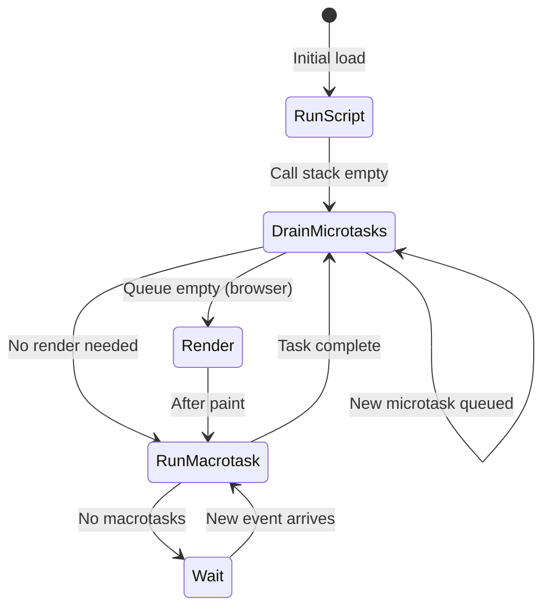

# JavaScript Event Loop and Microtask Queue

🎯 **Interview Weight:** expert (★★★) - the event loop is the most
important JavaScript runtime concept; required to explain concurrency,
async execution order, and performance bottlenecks

---

### 🎯 Model Answer

**30 seconds:**

> The JavaScript event loop is the mechanism that enables non-blocking
> async execution in a single-threaded environment. Call stack runs
> synchronous code. When the stack is empty, the event loop checks:
> microtask queue first (Promises, queueMicrotask), then macrotask
> queue (setTimeout, setInterval, I/O). Microtasks drain COMPLETELY
> before each macrotask. This ordering determines Promise vs setTimeout
> execution sequence.

**3 minutes:**

> Architecture:
> - **Call Stack**: executes synchronous code one frame at a time
> - **Web APIs** (browser) / **libuv** (Node.js): handle I/O, timers
>   off-thread
> - **Microtask Queue**: Promise callbacks (`.then`, `.catch`, `.finally`),
>   `queueMicrotask()`, MutationObserver callbacks
> - **Macrotask Queue** (Task Queue): `setTimeout`, `setInterval`,
>   I/O events, `MessageChannel`
>
> Event loop algorithm per turn:
> 1. Run one macrotask from the macrotask queue (or run global code if first)
> 2. Drain ALL microtasks (run until the microtask queue is empty)
> 3. Optionally render (browser: if a render deadline is approaching)
> 4. Back to step 1
>
> Key insight: all microtasks run after a macrotask but BEFORE the next
> macrotask. This means a long microtask chain can starve I/O callbacks
> and UI rendering.

**Blank Mind Recovery:**

**(1) Restate:** "Event loop: run one macrotask, drain all microtasks,
render (if browser), repeat. Promise callbacks are microtasks (faster).
setTimeout is macrotask (slower)."

---

### 📘 Concept Explanation

**What it is:**

The event loop is the concurrency mechanism that lets JavaScript handle
async operations despite being single-threaded. It coordinates the call
stack, asynchronous APIs, and two callback queues (microtask and macrotask)
to execute code in a well-defined order.

**The problem it solves:**

A single-threaded language cannot block waiting for I/O (network, disk,
timers). The event loop enables initiating async operations (which run
in the browser/Node.js runtime, not on the JS thread), providing callbacks,
and executing those callbacks when the JS thread is free.

**How it works:**

```
EVENT LOOP ARCHITECTURE:

  JS Thread:
  Call Stack           Microtask Queue       Macrotask Queue
  ┌──────────┐         ┌───────────────┐     ┌───────────────┐
  │ main()   │         │ Promise.then  │     │ setTimeout cb │
  │ fn2()    │         │ queueMicrotsk │     │ setInterval   │
  │ fn1()    │         │ MutationObs.  │     │ I/O callbacks │
  └──────────┘         └───────────────┘     └───────────────┘
       ▲                      ▲                      ▲
       └──────────────────────┴──────────────────────┘
                        Event Loop:
              1. Run ONE macrotask (or init script)
              2. Drain ALL microtasks
              3. Render if needed (browser)
              4. Go to 1

  KEY: ALL microtasks run before the NEXT macrotask

EXECUTION ORDER EXAMPLE:
  console.log('1');           // SYNC
  setTimeout(() => {
    console.log('2');         // MACROTASK
  }, 0);
  Promise.resolve().then(() => {
    console.log('3');         // MICROTASK
  });
  queueMicrotask(() => {
    console.log('4');         // MICROTASK
  });
  console.log('5');           // SYNC
  // Output: 1, 5, 3, 4, 2

NODE.JS EVENT LOOP PHASES:
  1. Timers       (setTimeout, setInterval callbacks)
  2. Pending I/O  (deferred I/O callbacks)
  3. Idle/Prepare (internal)
  4. Poll         (new I/O events; blocks if no timers)
  5. Check        (setImmediate callbacks)
  6. Close        (socket.on('close',...) callbacks)

  After each phase: drain microtasks
    process.nextTick queue FIRST
    then Promise callbacks
```

**Why it matters:**

Understanding the event loop is required to:
- Predict execution order of async code in interviews
- Diagnose performance issues (event loop blocking)
- Understand why Promise callbacks are "faster" than setTimeout
- Design non-blocking Node.js servers

**Common pitfalls:**

- Assuming `setTimeout(0)` runs "immediately" - it runs after all microtasks
- Infinite Promise recursion starving the macrotask queue
- CPU-intensive synchronous code blocking the entire server (Node.js)

**Mental model:**

> Think of the event loop as a restaurant. The call stack is one chef
> (single-threaded). Microtasks are "orders from the same table" -
> finish those before moving to the next table. Macrotasks are "new
> table requests". One chef processes all orders for one table (microtasks)
> before taking the next table (macrotask). Orders to the kitchen
> (Web APIs/libuv) happen in parallel, but the chef processes results
> one at a time.

**Scale behavior:**

At high concurrency, event loop lag becomes the key metric. A single
blocking synchronous operation (e.g., 100ms of CPU work) blocks ALL
concurrent requests for that duration. With 1,000 concurrent requests,
event loop lag translates directly to tail latency (p99, p999).

---

### 💻 Code Example

**Execution order and starvation patterns**

```javascript
// EXECUTION ORDER PUZZLE (common interview question):
console.log('START');

setTimeout(() => console.log('setTimeout 1'), 0);
setTimeout(() => console.log('setTimeout 2'), 0);

Promise.resolve()
  .then(() => {
    console.log('promise 1');
    setTimeout(() => console.log('setTimeout 3'), 0);
  })
  .then(() => console.log('promise 2'));

console.log('END');

// OUTPUT:
// SYNC: 'START', 'END'
// MICROTASK 1: 'promise 1' (queues setTimeout 3, queues promise 2)
// MICROTASK 2: 'promise 2'
// MACROTASK: 'setTimeout 1'
// MACROTASK: 'setTimeout 2'
// MACROTASK: 'setTimeout 3'
// Final: START, END, promise 1, promise 2,
//        setTimeout 1, setTimeout 2, setTimeout 3

// BAD: blocking the event loop with sync CPU work
app.get('/users', (req, res) => {
  // 500ms of CPU work - ALL requests blocked for this duration
  const result = computeHeavyHash(data);
  res.json(result);
});

// GOOD: offload to worker thread
const { Worker } = require('worker_threads');
app.get('/users', async (req, res) => {
  const result = await runInWorker('./hash-worker.js', data);
  res.json(result);
});
function runInWorker(script, data) {
  return new Promise((resolve, reject) => {
    const worker = new Worker(script, { workerData: data });
    worker.on('message', resolve);
    worker.on('error', reject);
  });
}

// CHUNKED PROCESSING: yield to event loop between chunks
function processInChunks(items, chunkSize = 100) {
  let index = 0;
  function processChunk() {
    const end = Math.min(index + chunkSize, items.length);
    for (let i = index; i < end; i++) {
      processItem(items[i]);
    }
    index = end;
    if (index < items.length) {
      setTimeout(processChunk, 0);  // yield to event loop
    }
  }
  processChunk();
}
```

> **Code walkthrough:** The execution order puzzle demonstrates the
> core event loop algorithm. After `END`, the stack is empty. Microtask
> queue has: 'promise 1'. It runs, prints 'promise 1', schedules
> 'setTimeout 3' (macrotask), and queues 'promise 2' (microtask).
> Then 'promise 2' runs (still in the same microtask drain). Now
> microtask queue is empty - only then do macrotasks run in order.
> The blocking example shows why synchronous CPU work is catastrophic
> in Node.js: one request's computation halts all others. Worker threads
> run CPU work in a separate V8 isolate, freeing the event loop.

---

### 🎓 Answers by Seniority

**Junior / Mid:**

> JavaScript is single-threaded. The event loop processes async callbacks.
> Promise callbacks (microtasks) run before `setTimeout` callbacks
> (macrotasks). Execution order: sync code -> microtasks -> macrotasks.
> Long synchronous code blocks everything.

**Senior / Staff:**

> The event loop is a concurrency primitive, not a parallelism mechanism.
> Microtask draining after each macrotask creates predictable ordering
> for Promise chains. The key production concern is event loop lag:
> any synchronous work > 10-50ms creates latency spikes across all
> concurrent operations. In Node.js, CPU-bound work must be offloaded
> to worker threads (separate V8 isolates with their own event loops).
> The Node.js libuv phases (Timers -> Poll -> Check) determine whether
> `setImmediate` or `setTimeout(0)` runs first in I/O callbacks (always
> setImmediate). Monitoring event loop p99 delay is a first-class
> production SRE concern.

---

### ⚖️ Comparison Table

| Queue | Contains | Priority | Drains |
|---|---|---|---|
| Microtask | Promise.then, queueMicrotask, MutationObserver | High (before macrotasks) | Completely before next macrotask |
| Macrotask | setTimeout, setInterval, I/O, MessageChannel | Normal | One per event loop turn |
| process.nextTick (Node.js) | nextTick callbacks | Highest (before Promises) | Before microtasks |
| setImmediate (Node.js) | setImmediate callbacks | After I/O phase | Check phase |
| requestAnimationFrame (browser) | RAF callbacks | Render phase | Before paint |

---

### 🏛️ System Design

**Designing a Node.js HTTP server aware of event loop constraints:**

```
NODE.JS SINGLE-THREADED SERVER ARCHITECTURE:

  ┌──────────────────────────────────────────────┐
  │  Node.js Process                             │
  │                                              │
  │  Event Loop (single JS Thread)               │
  │  - Handle HTTP req/res                       │
  │  - Execute business logic                    │
  │  - Await async I/O (non-blocking)            │
  │  - Target: 0 CPU work > 10ms per turn        │
  │                                              │
  │  libuv Thread Pool (4 threads default)       │
  │  - fs operations (read/write)                │
  │  - DNS lookups (some)                        │
  │  - Crypto ops (sync pbkdf2, etc.)            │
  │  UV_THREADPOOL_SIZE=8 (for more I/O)         │
  │                                              │
  │  Worker Threads (N separate V8 isolates)     │
  │  - CPU-intensive computation                 │
  │  - Image processing, ML inference, hashing  │
  └──────────────────────────────────────────────┘

RULES FOR EVENT LOOP HEALTH:
  1. Never sync-block the event loop (no readFileSync in handlers)
  2. Batch DB queries to avoid N+1 problem
  3. Stream large payloads (don't buffer in memory)
  4. Use worker threads for CPU > 10ms
  5. Monitor event loop p99 lag

EVENT LOOP LAG MONITORING:
  const { monitorEventLoopDelay } = require('perf_hooks');
  const histogram = monitorEventLoopDelay({ resolution: 10 });
  histogram.enable();
  setInterval(() => {
    const p99 = histogram.percentile(99) / 1e6;  // ns -> ms
    metrics.gauge('node.eventloop.p99_ms', p99);
    histogram.reset();
  }, 5000).unref();
```

---

### 📊 Diagram

```
EVENT LOOP EXECUTION MODEL:

  ┌──────────────────────────────────────────────┐
  │  1. Run initial script (first macrotask)     │
  │  2. Drain ALL microtasks                     │
  │     (loop: if new microtasks added, run too) │
  │  3. Browser: render if frame deadline near   │
  │  4. Run ONE macrotask                        │
  │  5. Go to 2                                  │
  └──────────────────────────────────────────────┘

  Microtask Queue drains completely between
  any two macrotasks. New microtasks added
  during drain also run (recursive draining).
```



> **Diagram walkthrough:** The state machine shows the event loop's
> complete cycle. After any macrotask (including the initial script),
> the loop always enters the microtask drain phase. Crucially, new
> microtasks added during draining continue the loop (the self-arrow
> on DrainMicrotasks). Only when the microtask queue is truly empty
> does the browser consider rendering and then pick the next macrotask.
> The Wait state is where Node.js sleeps in the Poll phase via
> epoll/kqueue, using zero CPU until an OS event arrives.

---

### ⚠️ Common Misconceptions

**"setTimeout(fn, 0) runs immediately after current code"**

`setTimeout(fn, 0)` runs after ALL microtasks AND after all other
macrotasks already in the queue. Browsers enforce a minimum delay of
4ms (even for 0). It will ALWAYS run after `Promise.resolve().then(fn)`.
Use `queueMicrotask(fn)` when you need "run after current code but
before any macrotasks."

**"Async/await is parallel execution"**

`async/await` is syntactic sugar over Promises. Awaiting a Promise
suspends the current function but does not create a new thread.
JavaScript remains single-threaded. `await Promise.all([...])` does
run multiple Promises "concurrently" in the sense that all are
initiated before any awaited, but they all run on the same thread
and only one JS callback executes at a time.

---

### 🚨 Failure Modes and Diagnosis

**Event loop blocking causing server timeouts:**

```javascript
// SYMPTOM: Node.js server stops responding for seconds
// All requests time out simultaneously
// Event loop lag metric spikes to hundreds of ms

// COMMON CULPRITS:
// 1. JSON.parse of large payload (sync)
const huge = JSON.parse(req.body);  // BAD for large payloads
// FIX: stream the JSON parsing
// 2. bcrypt.hashSync (use async bcrypt.hash)
// 3. Catastrophic regex backtracking
// 4. fs.readFileSync in request handlers

// DETECTION:
setInterval(() => {
  const start = Date.now();
  setImmediate(() => {
    const lag = Date.now() - start;
    if (lag > 50) logger.warn(`EL lag: ${lag}ms`);
  });
}, 100).unref();

// DIAGNOSIS:
// node --prof app.js
// node --prof-process isolate-*.log | head -50
// clinic flame -- node app.js
```

---

### 🎯 Interview Deep-Dive

| Scenario | Recommended Time | Key Signal |
|---|---|---|
| Explain microtask vs macrotask | 3-4 min | Queue priority |
| Trace execution order of mixed async code | 5-7 min | Ordering accuracy |
| Why blocking the event loop is catastrophic | 3-4 min | Single thread |
| Microtask starvation scenario | 3-4 min | Infinite microtasks |
| Node.js event loop phases | 4-5 min | libuv phases |
| process.nextTick vs setImmediate | 3-4 min | Ordering |
| Worker threads use case | 3-4 min | CPU offloading |
| Event loop lag monitoring | 3-4 min | Production ops |
| queueMicrotask use case | 2-3 min | Explicit scheduling |
| Browser rendering and event loop | 3-4 min | Frame budget |
| Chunking long synchronous tasks | 3-4 min | Yielding to loop |
| setTimeout 0 minimum delay | 2-3 min | Browser spec |

---

**Q1: What is the difference between microtasks and macrotasks in the
JavaScript event loop?** `[SENIOR]` MECHANISM

> **Answer:**
>
> Both are queues of callbacks to execute, but they differ in when
> they're drained:
>
> **Macrotasks** (Task Queue):
> - One macrotask runs per event loop turn
> - Source: `setTimeout`, `setInterval`, I/O callbacks, `MessageChannel`
> - After a macrotask completes: drain ALL microtasks before next macrotask
>
> **Microtasks** (Microtask Queue):
> - ALL microtasks drain after each macrotask
> - New microtasks added during draining also run
> - Source: `Promise.then/catch/finally`, `queueMicrotask`, `MutationObserver`
>
> ```javascript
> console.log('script start');        // 1 - sync
>
> setTimeout(() => {
>   console.log('setTimeout');        // 5 - macrotask
> }, 0);
>
> Promise.resolve()
>   .then(() => {
>     console.log('promise 1');       // 3 - microtask
>   })
>   .then(() => {
>     console.log('promise 2');       // 4 - microtask
>   });
>
> console.log('script end');          // 2 - sync
>
> // Order: script start, script end,
> //        promise 1, promise 2, setTimeout
> ```
>
> *What separates good from great:* Microtask starvation. If your code
> creates an infinite chain of microtasks (each `.then` schedules
> another), the macrotask queue never drains:
> ```javascript
> function starve() {
>   Promise.resolve().then(starve);
> }
> starve();
> // setTimeout callbacks NEVER fire
> // HTTP responses NEVER sent in Node.js
> // Browser UI completely frozen
> ```
> This can occur in retry logic with recursive Promises. Fix: use
> `setTimeout` for periodic operations, not recursive Promises.

**Q2: Why does blocking the JavaScript event loop affect ALL users
of a Node.js server?** `[STAFF]` SYSTEM-DESIGN

> **Answer:**
>
> Node.js runs on a single JavaScript thread. Every HTTP request
> handler executes on the SAME event loop:
>
> ```
>      Request A  Request B  Request C
>          │         │         │
>          ▼         ▼         ▼
>    ┌─────────────────────────────┐
>    │   Single JavaScript Thread  │
>    │   Event Loop                │
>    │                             │
>    │  [Handler A - 500ms CPU] -> │
>    │  -> Handler B queued        │
>    │  -> Handler C queued        │
>    └─────────────────────────────┘
>
> While Handler A does CPU work for 500ms:
>   - Handlers B and C are queued
>   - No DB response callbacks can run
>   - No HTTP responses can be sent
>   - Timer callbacks are delayed
>   - New connections may time out
> ```
>
> Solutions for CPU-bound work in Node.js:
> 1. **Worker threads**: separate V8 isolates with own event loops
> 2. **Child processes**: spawn separate Node.js processes
> 3. **Cluster mode**: multiple processes on multiple CPU cores
> 4. **Offload to service**: dedicated computation microservice
>
> *What separates good from great:* The event loop lag metric is the
> key SRE concern. Target: p99 event loop lag < 10ms for interactive
> servers. Libraries: `@pm2/io`, `clinic.js`, Datadog APM all measure
> event loop delay. When lag spikes, ask: "what synchronous code ran
> for that duration?" Typical answer: `JSON.parse` of large payload,
> sync crypto, or catastrophic regex.

**Q3: Trace the execution order:**
```javascript
async function main() {
  console.log('A');
  await Promise.resolve();
  console.log('B');
  await new Promise(resolve => setTimeout(resolve, 0));
  console.log('C');
}
main();
console.log('D');
```
`[SENIOR]` DEBUGGING

> **Answer:** Output: **A, D, B, C**
>
> 1. `main()` starts (async runs sync until first await)
> 2. `console.log('A')` - prints **A**
> 3. `await Promise.resolve()` - immediately resolved, continuation
>    queued as microtask; `main()` suspends
> 4. `console.log('D')` - prints **D** (back at call site)
> 5. Stack empty - drain microtasks
> 6. `main()` resumes at `console.log('B')` - prints **B**
> 7. `await new Promise(resolve => setTimeout(resolve, 0))` -
>    setTimeout queued as macrotask; `main()` suspends
> 8. Microtask queue empty; run macrotask: setTimeout fires, calls
>    `resolve()`, queuing `main()` continuation as microtask
> 9. Drain microtasks: `main()` resumes at `console.log('C')` -
>    prints **C**
>
> *What separates good from great:* Step 7 creates a MACROTASK barrier.
> `await new Promise(resolve => setTimeout(resolve, 0))` is the
> idiomatic way to deliberately yield to the event loop - "let any
> pending macrotask work run before I continue." This is used in
> chunked processing to prevent blocking. Similarly,
> `await requestAnimationFrame()` synchronizes with the browser
> render cycle.

**Q4: What is queueMicrotask and when would you use it instead of
Promise.resolve().then()?** `[MID]` MECHANISM

> **Answer:**
>
> `queueMicrotask(fn)` schedules `fn` as a microtask without creating
> a Promise object. Functionally, it's equivalent to
> `Promise.resolve().then(fn)` for scheduling, but with differences:
>
> - **No Promise overhead**: no allocation, no `.then`, no error handling
>   wrapper
> - **No error swallowing**: unhandled errors from `queueMicrotask` throw
>   synchronously on the next turn (not silently swallowed)
> - **Explicit intent**: signals "I want to yield to pending microtasks
>   then continue" without the async semantics of Promises
>
> ```javascript
> // USE CASE: library author wants to batch DOM mutations
> class BatchedDOMUpdater {
>   constructor() {
>     this.pending = [];
>     this.scheduled = false;
>   }
>
>   update(mutation) {
>     this.pending.push(mutation);
>     if (!this.scheduled) {
>       this.scheduled = true;
>       // Batch all updates registered in this task
>       // into a single microtask flush
>       queueMicrotask(() => {
>         const updates = this.pending.splice(0);
>         this.scheduled = false;
>         applyBatchedUpdates(updates);
>       });
>     }
>   }
> }
>
> // Multiple synchronous calls -> single batched microtask:
> updater.update({ type: 'setText', id: 'el1', value: 'A' });
> updater.update({ type: 'setText', id: 'el2', value: 'B' });
> // Both updates processed in ONE microtask -> one reflow
> ```
>
> When to use `queueMicrotask`:
> - Batching state updates in frameworks (React's batching uses this pattern)
> - Deferring callback execution until after current synchronous code
>   without async/await overhead
> - When you want microtask scheduling semantics without Promise allocation
>
> *What separates good from great:* `queueMicrotask` was standardized
> specifically because the `Promise.resolve().then()` pattern was being
> used as a workaround for microtask scheduling in browser APIs and
> library code. The explicit API makes intent clear and avoids the
> promise allocation overhead in hot paths. In React, a similar internal
> batch scheduler uses this pattern to batch multiple `setState` calls
> into a single re-render.

**Q5: How does the Node.js event loop differ from the browser event
loop?** `[SENIOR]` MECHANISM

> **Answer:**
>
> The browser event loop and Node.js event loop both follow the same
> microtask/macrotask priority model, but Node.js (via libuv) has
> additional structure:
>
> **Node.js Event Loop Phases (per turn):**
>
> ```
> Timers      -> Pending I/O -> Idle/Prepare ->
> Poll        -> Check       -> Close
>              ↑                         │
>              └─────────────────────────┘
>
> After EACH phase: drain microtasks
>   process.nextTick queue first
>   then Promise microtask queue
> ```
>
> 1. **Timers**: execute `setTimeout` and `setInterval` callbacks whose
>    threshold has elapsed
> 2. **Pending I/O**: I/O callbacks deferred from previous iteration
> 3. **Idle/Prepare**: internal Node.js use
> 4. **Poll**: retrieve new I/O events; if no timers pending, block here
>    waiting for I/O (prevents busy-waiting)
> 5. **Check**: `setImmediate` callbacks - unique to Node.js
> 6. **Close**: close event callbacks (e.g., `socket.on('close', ...)`)
>
> **Key Node.js-specific behaviors:**
>
> ```javascript
> // process.nextTick is NOT a timer - it's a special microtask
> // that runs BEFORE Promise callbacks:
> process.nextTick(() => console.log('nextTick'));
> Promise.resolve().then(() => console.log('promise'));
> // Output: nextTick, promise
>
> // setImmediate vs setTimeout(0) ordering:
> // In I/O callback context: setImmediate ALWAYS runs before setTimeout
> fs.readFile('file', () => {
>   setImmediate(() => console.log('setImmediate'));
>   setTimeout(() => console.log('setTimeout'), 0);
>   // Output: setImmediate (we're in Poll phase -> next is Check)
> });
>
> // Outside I/O context: order is non-deterministic (depends on
> // process startup timing)
> setImmediate(() => console.log('setImmediate'));
> setTimeout(() => console.log('setTimeout'), 0);
> // Either order is possible
> ```
>
> *What separates good from great:* The Poll phase is where Node.js
> efficiency comes from. When no timers are pending and no I/O has
> arrived, Node.js BLOCKS in the Poll phase using epoll/kqueue/IOCP
> (OS-level event notification). This is zero CPU usage while waiting
> for I/O - the OS interrupts Node.js only when an event arrives. This
> is why Node.js serves thousands of concurrent connections with almost
> zero idle CPU: it's sleeping at the OS level between events.

**Q6: What is process.nextTick and when should you use or avoid it?**
`[SENIOR]` TRADE-OFF

> **Answer:**
>
> `process.nextTick(fn)` queues `fn` in a special queue that runs after
> the current operation completes but BEFORE any I/O events, timers, or
> Promise callbacks. It runs before the regular microtask queue
> (`Promise.then`).
>
> ```javascript
> // USE CASE: ensure callback runs asynchronously even when
> // the result is synchronous (important for EventEmitter consistency):
> class AsyncEmitter extends EventEmitter {
>   doThing() {
>     // BAD: if result is sync, event fires before listener attached:
>     // this.emit('done', result);  <- might fire before callers
>     //                                can add event listeners
>
>     // GOOD: defer to next tick so callers can attach listeners:
>     const result = computeResult();
>     process.nextTick(() => this.emit('done', result));
>   }
> }
>
> const emitter = new AsyncEmitter();
> emitter.doThing();  // starts the operation
> emitter.on('done', result => console.log(result));  // attach listener
> // Works because 'done' fires on next tick, after this line runs
>
> // AVOID: recursive nextTick (starvation - worse than Promise recursion)
> function badRecursion() {
>   process.nextTick(badRecursion);
>   // process.nextTick runs before I/O AND before Promises
>   // Starves EVERYTHING: I/O, Promises, timers
> }
>
> // nextTick starvation is more severe than Promise starvation:
> // Promise.then is in the microtask queue (same as nextTick priority
> // in browsers), but in Node.js, process.nextTick runs BEFORE Promises
> // So recursive nextTick blocks even Promise callbacks
> ```
>
> When to use:
> - Ensuring events fire after the current call stack completes
> - Making synchronous APIs behave consistently with async ones
> - Error-first callback APIs where you want to delay callback to
>   ensure error propagation works correctly
>
> When to avoid:
> - Recursive patterns (use setImmediate or setTimeout for polling)
> - As a performance optimization (it adds to the microtask overhead)
>
> *What separates good from great:* The Node.js documentation explicitly
> warns about `process.nextTick` starvation and recommends using
> `setImmediate` when you want to schedule something that allows I/O
> to run in between. The Node.js core team has discussed deprecating
> `process.nextTick` multiple times because of these footguns.

**Q7: How do Web Workers and Worker Threads differ from the event loop?**
`[STAFF]` SYSTEM-DESIGN

> **Answer:**
>
> Web Workers (browser) and Worker Threads (Node.js) both provide
> true parallelism by running JavaScript in separate threads, each
> with their own event loop. They do NOT share the main thread's
> event loop.
>
> ```
> MAIN THREAD                     WORKER THREAD
> ┌─────────────────────┐         ┌─────────────────────┐
> │  Event Loop         │         │  Separate Event Loop │
> │  Call Stack         │         │  Call Stack           │
> │  Microtask Queue    │         │  Microtask Queue      │
> │  Macrotask Queue    │         │  Macrotask Queue      │
> │                     │         │                       │
> │  No access to       │         │  No access to         │
> │  worker's memory    │         │  main thread's memory │
> └──────────┬──────────┘         └──────────┬────────────┘
>            │                               │
>            └─── postMessage / onmessage ───┘
>                 (structured clone or
>                  SharedArrayBuffer transfer)
> ```
>
> Communication via message passing (not shared memory by default).
> `SharedArrayBuffer` + `Atomics` for shared memory (requires explicit
> header configuration in browsers for security reasons).
>
> Use cases for Worker Threads vs event loop:
> - **Event loop**: I/O-bound work (DB queries, HTTP calls, file reads)
> - **Worker threads**: CPU-bound work (image processing, crypto, ML
>   inference, compression)
>
> ```javascript
> // Node.js worker_threads:
> const { Worker } = require('worker_threads');
>
> // Offload image processing (would block event loop for ~200ms):
> async function processImage(buffer) {
>   return new Promise((resolve, reject) => {
>     const worker = new Worker('./image-processor.js', {
>       workerData: buffer,
>       transferList: [buffer.buffer]  // transfer ownership, no copy
>     });
>     worker.once('message', resolve);
>     worker.once('error', reject);
>   });
> }
>
> // Main event loop is free while worker runs
> // Parallel processing of multiple images:
> const results = await Promise.all([
>   processImage(image1),  // Worker 1
>   processImage(image2),  // Worker 2 (parallel)
> ]);
> ```
>
> *What separates good from great:* Worker thread pools are the
> production pattern. Creating/destroying workers per request is
> expensive (~50ms startup). Use libraries like `workerpool` or
> Node.js's built-in `--worker-threads` pool patterns. Worker threads
> also have their own memory - data transfer via `transferList` uses
> zero-copy transfer (transfers ownership of ArrayBuffer) vs structured
> clone (copies data). For high-throughput scenarios: use transfer
> to avoid doubling memory usage.

**Q8: What happens when you have a Promise rejection with no handler?**
`[MID]` FAILURE-MODE

> **Answer:**
>
> In Node.js and modern browsers, an unhandled Promise rejection fires
> an `unhandledRejection` event / `unhandledrejection` event. Behavior
> changed significantly across versions:
>
> - **Node.js < 15**: logs a warning, process continues
> - **Node.js >= 15**: unhandled rejections EXIT the process (exit code 1)
> - **Browsers**: logs to console, may trigger DevTools warnings
>
> ```javascript
> // This rejection has no handler:
> async function badOperation() {
>   throw new Error('something failed');
> }
>
> badOperation();  // Promise rejected, no await, no .catch
>
> // Node.js 15+: process exits with exit code 1
> // Logs: UnhandledPromiseRejection: Error: something failed
>
> // FIX: always handle rejections
> badOperation().catch(err => logger.error(err));
> // or:
> try {
>   await badOperation();
> } catch (err) {
>   logger.error(err);
> }
>
> // GLOBAL HANDLER (last resort - don't silence errors):
> process.on('unhandledRejection', (reason, promise) => {
>   logger.error('Unhandled rejection:', reason);
>   // In production: alert, then exit gracefully
>   process.exit(1);  // Let process manager restart
> });
>
> // TIMING: rejection becomes "unhandled" after current event loop turn
> const p = Promise.reject(new Error('oops'));
> // Error not unhandled yet - we're in the same turn
> setTimeout(() => {
>   p.catch(err => console.log('caught:', err.message));
>   // Now caught - before unhandledRejection fires
> }, 100);
> ```
>
> *What separates good from great:* The `rejectionHandled` event fires
> when a previously-unhandled rejection gets a handler attached later
> (like the `setTimeout` example above). This allows monitoring tools
> to "close" the alert when a rejection is retroactively handled.
> However, the best practice is never to have unhandled rejections -
> ESLint rule `no-floating-promises` (from `eslint-plugin-promise`)
> catches these statically.

**Q9: How does requestAnimationFrame fit into the browser event loop?**
`[SENIOR]` SYSTEM-DESIGN

> **Answer:**
>
> `requestAnimationFrame(fn)` is not a standard macrotask or microtask.
> It's a special rendering callback that runs as part of the browser's
> rendering pipeline:
>
> ```
> Browser Event Loop (with rendering):
>
> 1. Run macrotask
> 2. Drain microtasks
> 3. RENDER STEP (if needed, ~16ms budget for 60fps):
>    a. requestAnimationFrame callbacks
>    b. Style recalculation
>    c. Layout (reflow)
>    d. Paint
>    e. Composite (GPU layer upload)
> 4. Back to step 1
> ```
>
> Key behavior:
> - `requestAnimationFrame` runs BEFORE painting, AFTER microtasks
> - It's tied to the display refresh rate (60Hz = 16ms, 120Hz = 8ms)
> - Batches with other rAF callbacks within the same frame
> - Automatically skipped when tab is hidden (saves CPU/battery)
>
> ```javascript
> // BAD: setTimeout for animations
> function animateBad() {
>   element.style.left = (x++) + 'px';
>   setTimeout(animateBad, 16);  // Not synchronized with repaint
>   // Issues: misaligned with refresh, jank, double-paints
>   // Also runs when tab is hidden (wastes CPU)
> }
>
> // GOOD: requestAnimationFrame
> function animateGood(timestamp) {
>   element.style.left = (x++) + 'px';
>   requestAnimationFrame(animateGood);
>   // Runs before repaint, synced with display
>   // Paused when tab hidden
>   // timestamp is DOMHighResTimeStamp for smooth interpolation
> }
> requestAnimationFrame(animateGood);
>
> // PATTERN: smooth animation with delta time
> let lastTime = null;
> function animate(timestamp) {
>   const delta = lastTime ? timestamp - lastTime : 0;
>   lastTime = timestamp;
>   // Move at 100px/second regardless of frame rate:
>   x += 100 * (delta / 1000);
>   element.style.transform = `translateX(${x}px)`;
>   requestAnimationFrame(animate);
> }
> ```
>
> *What separates good from great:* Understanding that reading layout
> properties (offsetWidth, clientHeight) forces synchronous layout
> (reflow) before rAF is critical. The "read-write-read-write" DOM
> anti-pattern creates layout thrashing. FastDOM and React's virtual DOM
> batch reads before writes to avoid forced reflows. `requestAnimationFrame`
> with layout batching is the foundation of performant browser animation
> and the virtual DOM diffing pattern.

**Q10: What is the difference between a long task and event loop
blocking from a performance perspective?** `[STAFF]` PERFORMANCE

> **Answer:**
>
> Both block the event loop, but "long tasks" is a formal browser
> concept with tooling support:
>
> **Long Task** (browser performance model):
> - A task that takes > 50ms on the main thread
> - Defined by the W3C Long Tasks API
> - Flagged in Chrome DevTools Performance panel as red blocks
> - Measured by Lighthouse as "Total Blocking Time" (TBT)
> - TBT is a Core Web Vitals input to Google search ranking
>
> **Why 50ms?**
> - 100ms is the human perception threshold for "instant"
> - 50ms leaves 50ms budget for browser overhead
> - Tasks > 50ms: user perceives lag (click unresponsive, scroll jank)
>
> ```javascript
> // Measuring long tasks in production:
> const observer = new PerformanceObserver((list) => {
>   for (const entry of list.getEntries()) {
>     console.log('Long task:', entry.duration, 'ms');
>     // Report to analytics
>     analytics.trackLongTask({
>       duration: entry.duration,
>       startTime: entry.startTime,
>       attribution: entry.attribution  // which script caused it?
>     });
>   }
> });
> observer.observe({ entryTypes: ['longtask'] });
>
> // BREAKING LONG TASKS (scheduler.yield() - Chrome 115+):
> async function processLargeList(items) {
>   for (let i = 0; i < items.length; i++) {
>     processItem(items[i]);
>     // Yield every 50 items to stay under 50ms budget:
>     if (i % 50 === 0 && 'scheduler' in window) {
>       await scheduler.yield();  // Chrome 115+, handles priority
>       // OR: await new Promise(resolve => setTimeout(resolve, 0));
>     }
>   }
> }
>
> // Node.js equivalent: event loop utilization (ELU)
> const { performance } = require('perf_hooks');
> const obs = new PerformanceObserver(items => {
>   items.getEntries().forEach(entry => {
>     if (entry.entryType === 'gc') {
>       console.log('GC ran for:', entry.duration, 'ms');
>     }
>   });
> });
> obs.observe({ entryTypes: ['gc'] });
> ```
>
> *What separates good from great:* The Scheduler API (`scheduler.postTask`,
> `scheduler.yield`) is the modern solution for breaking long tasks
> with priority. Unlike `setTimeout`, `scheduler.postTask` supports
> priority levels (user-blocking, user-visible, background) and
> cancellation. This maps directly to the browser's priority queue for
> task scheduling - the same mechanism React's concurrent mode uses
> internally to interrupt long renders for user input.

**Q11: How would you debug a Node.js server with high event loop lag?**
`[STAFF]` DEBUGGING

> **Answer:**
>
> Event loop lag is the delta between when a callback is SCHEDULED
> and when it ACTUALLY runs. High lag = event loop is blocked.
>
> **Measurement:**
> ```javascript
> // Method 1: setTimeout-based lag meter
> const LAG_INTERVAL_MS = 100;
> let lastCheck = Date.now();
> setInterval(() => {
>   const now = Date.now();
>   const lag = now - lastCheck - LAG_INTERVAL_MS;
>   if (lag > 10) {
>     metrics.gauge('eventloop.lag_ms', lag);
>     if (lag > 100) {
>       logger.warn('High event loop lag', { lag });
>     }
>   }
>   lastCheck = now;
>   }, LAG_INTERVAL_MS).unref();  // .unref() prevents keeping process alive
>
> // Method 2: perf_hooks (more accurate)
> const { monitorEventLoopDelay } = require('perf_hooks');
> const histogram = monitorEventLoopDelay({ resolution: 10 });
> histogram.enable();
> setInterval(() => {
>   console.log({
>     min: histogram.min / 1e6,     // ns to ms
>     max: histogram.max / 1e6,
>     mean: histogram.mean / 1e6,
>     p99: histogram.percentile(99) / 1e6,
>   });
>   histogram.reset();
> }, 5000).unref();
> ```
>
> **Diagnosis workflow:**
> 1. **Confirm lag is real**: check p99 lag > 50ms
> 2. **CPU profiling**: `node --prof app.js` (generates isolate-*.log)
>    `node --prof-process isolate-*.log | head -100`
>    Look for hot synchronous functions
> 3. **Flame chart**: `clinic flame -- node app.js` (clinic.js tooling)
>    Wide synchronous blocks = culprits
> 4. **Common culprits**:
>    - `JSON.parse` of large payloads (switch to streaming JSON)
>    - `bcrypt.hashSync` (use async `bcrypt.hash`)
>    - Synchronous file reads `fs.readFileSync` in request handlers
>    - Regex catastrophic backtracking
>    - `vm.runInNewContext` (creates new V8 context, slow)
>    - GC pressure (too many allocations -> GC pauses -> lag spikes)
>
> ```javascript
> // Detecting the CULPRIT with async hooks:
> const async_hooks = require('async_hooks');
> let activeId;
> const hook = async_hooks.createHook({
>   init(asyncId, type, triggerAsyncId) {
>     // Track which async resource is active
>   },
>   before(asyncId) { activeId = asyncId; },
>   after(asyncId) { activeId = null; },
> });
> hook.enable();
> ```
>
> *What separates good from great:* GC-induced event loop lag is subtle.
> When V8 garbage collects, it can pause the JS thread (minor GC: ~1ms,
> major GC: potentially 50-100ms). High allocation rates -> frequent GC
> -> lag spikes that look like "unknown" blocks in profiles. Solution:
> object pooling, reducing allocations in hot paths, and monitoring GC
> metrics with `--trace-gc` or perf_hooks GC entries.

**Q12: What is the Scheduling API (scheduler.postTask) and how does
it improve on setTimeout for task management?** `[STAFF]` ADVANCED

> **Answer:**
>
> The Prioritized Task Scheduling API (`scheduler.postTask`) is a browser
> API that enables fine-grained task prioritization, replacing the
> common `setTimeout(fn, 0)` workaround:
>
> ```javascript
> // OLD WAY: setTimeout(0) for yielding - no priority control
> setTimeout(() => analyzeData(), 0);
> setTimeout(() => updateUI(), 0);
> // Both tasks have same priority; UI update can't be prioritized
>
> // NEW WAY: scheduler.postTask with priorities
> // Priorities: 'user-blocking', 'user-visible', 'background'
>
> // High priority: user interaction response
> scheduler.postTask(() => handleKeyPress(), {
>   priority: 'user-blocking'
>   // Runs as soon as possible; blocks user if delayed
> });
>
> // Normal priority: visible content update
> scheduler.postTask(() => updateContent(), {
>   priority: 'user-visible'
> });
>
> // Low priority: analytics, prefetch, non-critical
> scheduler.postTask(() => sendAnalytics(), {
>   priority: 'background'
> });
>
> // CANCELLABLE TASKS:
> const controller = new TaskController({
>   priority: 'background'
> });
> scheduler.postTask(() => prefetchData(), {
>   signal: controller.signal
> });
>
> // Cancel if user navigates away:
> window.addEventListener('beforeunload', () => {
>   controller.abort();
> });
>
> // YIELDING WITHIN A TASK:
> async function processItems(items) {
>   for (const item of items) {
>     processItem(item);
>     // Yield to allow higher-priority tasks to run:
>     await scheduler.yield();
>     // scheduler.yield() inherits current task's priority
>     // Higher-priority tasks can preempt this loop
>   }
> }
> ```
>
> This API is the foundation React's concurrent mode uses internally:
> - React breaks rendering into small units of work
> - Yields between units to check for higher-priority updates
> - User input (key presses, clicks) can interrupt a long render
>
> *What separates good from great:* The `scheduler.yield()` function
> introduced in Chrome 115+ is more sophisticated than `setTimeout(0)`.
> It inherits the current task's priority and signal, so yielded work
> is rescheduled at the same priority level. It also avoids the 1ms
> minimum delay setTimeout imposes. This is the mechanistic basis of
> "concurrent rendering" - not true multi-threading, but cooperative
> multitasking with priority preemption within a single thread.
