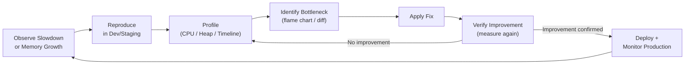

# JavaScript Performance Profiling and Debugging

🎯 **Interview Weight:** expert (★★★) - performance profiling is a
senior engineering skill; required to diagnose production slowdowns,
memory leaks, and rendering issues in JavaScript applications

---

### 🎯 Model Answer

**30 seconds:**

> JavaScript performance profiling uses three primary tools: CPU
> profiler (identifies hot functions, deoptimizations), heap profiler
> (memory leaks, object retention), and performance timeline
> (rendering, layout reflows). In Node.js: `node --prof` for V8 CPU
> profile, `node --heap-prof` for heap. In browser: Chrome DevTools
> Performance and Memory tabs. The key metrics are: Time to Interactive,
> Largest Contentful Paint, event loop lag, and heap growth rate.

**3 minutes:**

> Performance problem types require different tools:
>
> 1. **Slow CPU / high computation**: CPU profile -> flame chart
>    identifies hot functions. Look for wide synchronous blocks.
> 2. **Memory leak**: heap snapshot comparison -> find objects growing
>    over time. Allocation timeline -> find functions allocating heavily.
> 3. **Event loop blocking**: event loop lag monitor -> measure delay
>    between scheduled and actual callback execution.
> 4. **Rendering performance**: Timeline/Performance panel -> identify
>    long tasks, layout thrashing (interleaved reads/writes), expensive
>    paint operations.
> 5. **Network waterfall**: network panel -> identify blocking resources,
>    unnecessary sequential requests.

**Blank Mind Recovery:**

**(1) Restate:** "Profile first, optimize second. CPU: flame chart
(wide blocks = slow). Memory: heap snapshot (growing objects = leak).
Event loop: lag meter (high lag = blocking code). Never optimize without
data - measure, find bottleneck, fix, measure again."

---

### 📘 Concept Explanation

**What it is:**

Performance profiling is the systematic process of measuring where
time and memory are spent in a running application. Profiling collects
data about function call frequencies, execution times, memory allocations,
and GC behavior without (significantly) altering program semantics.

**The problem it solves:**

Performance optimization without profiling is guesswork. The 80/20
rule applies: 80% of time is spent in 20% of code. Profiling identifies
which 20% to optimize. Optimizing the wrong code wastes time and may
introduce bugs without measurable improvement.

**How it works:**

```
PROFILING APPROACHES:

  Sampling profiler:
  - Interrupts JS execution every N microseconds
  - Records current call stack
  - Low overhead (~1-3%)
  - Statistical: misses very fast functions
  - Used by: node --prof, Chrome DevTools CPU profiler

  Instrumentation profiler:
  - Wraps every function call/return with timing code
  - Precise but HIGH overhead (10-100x slower)
  - Used for targeted profiling of specific code paths

  Heap profiler:
  - Records every object allocation with call stack
  - Very high overhead: only for debugging, not production

BROWSER PERFORMANCE METRICS (Core Web Vitals):

  Metric             Target       What it measures
  ───────────────────────────────────────────────
  LCP (Largest       < 2.5s       Largest above-fold element loads
      Contentful Paint)
  FID (First Input   < 100ms      Time to first interaction response
      Delay)          (now INP)
  CLS (Cumulative    < 0.1        Layout stability (no jumping content)
      Layout Shift)
  INP (Interaction   < 200ms      Responsiveness to all interactions
      to Next Paint)

NODE.JS PERFORMANCE METRICS:
  Event Loop Lag     < 10ms p99   Health of async I/O
  Heap Used          < 80%        Memory pressure
  GC pause time      < 50ms p99   GC overhead
  Requests/sec       Baseline     Throughput
  p99 response time  < 500ms      Tail latency

PERFORMANCE TIMELINE:
  ┌─────────────────────────────────────────────────┐
  │  frame 1 (16ms)                                 │
  │  [JS task][rAF][Style][Layout][Paint][Composite] │
  │                                                 │
  │  frame 2 (16ms)                                 │
  │  [JS task][rAF][Style][Layout][Paint][Composite] │
  └─────────────────────────────────────────────────┘

  LONG TASK (> 50ms blocks entire frame budget):
  ┌──────────────────────────────────────────────┐
  │  [   JS task - 200ms   ]                     │
  │    ^--- user input blocked for 200ms         │
  └──────────────────────────────────────────────┘
```

**Why it matters:**

Performance directly impacts user experience and business metrics.
Google research: a 1-second slowdown in mobile load time = 8% lower
conversions. React Server Components, streaming SSR, and Core Web
Vitals all emerged from the need to optimize JavaScript performance.

**Mental model:**

> Profiling is like a doctor's diagnosis before treatment. You wouldn't
> prescribe medication before knowing what's wrong. Flame charts are
> X-rays: tall stacks show deep call chains, wide blocks show slow
> operations. Heap snapshots are blood tests: comparing two snapshots
> shows what "accumulated" (leaked) between them.

**Scale behavior:**

Performance issues that are invisible at low scale become critical at
high scale. A 5ms synchronous operation per request causes 5000ms of
event loop blockage at 1000 req/s. Memory leaks that grow 1KB per
request cause heap exhaustion in hours at production traffic.

---

### 💻 Code Example

**Profiling workflow and common fixes**

```javascript
// =========== BROWSER: PERFORMANCE API ===========

// Measure specific operations:
performance.mark('start-render');
renderComplexComponent();
performance.mark('end-render');
performance.measure('render-time', 'start-render', 'end-render');

const measure = performance.getEntriesByName('render-time')[0];
console.log(`Render took: ${measure.duration.toFixed(2)}ms`);

// LONG TASK detection in production:
const observer = new PerformanceObserver((list) => {
  for (const entry of list.getEntries()) {
    analytics.track('long-task', {
      duration: entry.duration,
      startTime: entry.startTime,
    });
    if (entry.duration > 100) {
      logger.warn('Long task > 100ms:', entry.duration);
    }
  }
});
observer.observe({ entryTypes: ['longtask'] });

// LAYOUT THRASHING (read-write interleaving):
// BAD: forces multiple reflows
function badResize(elements) {
  elements.forEach(el => {
    const height = el.offsetHeight;  // READ (forces reflow)
    el.style.height = (height * 2) + 'px';  // WRITE
    // Next el.offsetHeight forces another reflow!
  });
}

// GOOD: batch reads then writes
function goodResize(elements) {
  // All reads first:
  const heights = elements.map(el => el.offsetHeight);
  // All writes after:
  elements.forEach((el, i) => {
    el.style.height = (heights[i] * 2) + 'px';
  });
  // Only ONE reflow triggered (after all writes)
}

// =========== NODE.JS PROFILING ===========

// Event loop lag measurement:
const { monitorEventLoopDelay } = require('perf_hooks');
const histogram = monitorEventLoopDelay({ resolution: 10 });
histogram.enable();

setInterval(() => {
  const lag = {
    min:  histogram.min  / 1e6,
    max:  histogram.max  / 1e6,
    mean: histogram.mean / 1e6,
    p99:  histogram.percentile(99) / 1e6,
  };
  if (lag.p99 > 10) {
    logger.warn('Event loop lag p99:', lag.p99);
  }
  histogram.reset();
}, 5000).unref();

// Memory leak detection pattern:
function checkForLeaks() {
  if (global.gc) global.gc();  // Force GC first (--expose-gc flag)
  const mem = process.memoryUsage();
  logger.info({
    heapUsed: Math.round(mem.heapUsed / 1024 / 1024) + 'MB',
    heapTotal: Math.round(mem.heapTotal / 1024 / 1024) + 'MB',
    rss: Math.round(mem.rss / 1024 / 1024) + 'MB',
    external: Math.round(mem.external / 1024 / 1024) + 'MB',
  });
}
setInterval(checkForLeaks, 30000).unref();

// FINDING MEMORY LEAKS - heap snapshot comparison:
// node --inspect app.js
// Chrome DevTools -> Memory -> Take Heap Snapshot
// Perform operation (e.g., process 1000 requests)
// Take second snapshot
// Compare: filter by "Objects allocated between snapshots"
// Sort by Retained Size DESC -> biggest leak candidates

// COMMON MEMORY LEAK PATTERNS:
class CacheLeak {
  constructor() {
    this.cache = new Map();  // BAD: grows unboundedly
  }
  add(key, value) {
    this.cache.set(key, value);  // Never evicted
  }
}

class CacheFixed {
  constructor(maxSize = 1000) {
    this.cache = new Map();
    this.maxSize = maxSize;
  }
  add(key, value) {
    if (this.cache.size >= this.maxSize) {
      // Delete oldest entry (Map preserves insertion order)
      const firstKey = this.cache.keys().next().value;
      this.cache.delete(firstKey);
    }
    this.cache.set(key, value);
  }
}
```

> **Code walkthrough:** The layout thrashing example shows one of
> the most common browser performance pitfalls. `offsetHeight` is a
> "dirty read" - it forces the browser to immediately perform style
> recalculation and layout to return an accurate value. If a write
> (`style.height =`) occurs between two reads, each read triggers a
> full reflow. Batching all reads before writes reduces reflows from
> N to 1. The Node.js event loop monitoring uses `perf_hooks` histogram
> (nanosecond precision) to track when the event loop itself is delayed
> - a direct indicator of blocking synchronous code. The memory leak
> cache example shows the classic unintentional retention: an in-memory
> cache with no eviction policy grows until the process runs out of
> memory.

---

### 🎓 Answers by Seniority

**Junior / Mid:**

> Use Chrome DevTools Performance tab to record and analyze slowdowns.
> CPU profile shows where time is spent (flame chart). Memory tab shows
> heap snapshots to find leaks. Avoid long synchronous operations in
> the browser - break into chunks with setTimeout.

**Senior / Staff:**

> Performance profiling requires both tooling and mental models for
> interpreting results. CPU flame charts: wide horizontal blocks are
> slow functions; tall stacks are deeply nested calls. Heap comparison:
> objects that grew between two snapshots are candidates for leaks.
> In Node.js: event loop lag is the primary health metric. CPU profiles
> with `--prof` combined with `clinic flame` provide production-accurate
> profiling. The critical discipline: establish a performance baseline,
> make one change, measure again. Never trust "feels faster." Core Web
> Vitals (LCP, CLS, INP) are the browser-side production metrics.
> React Profiler extension and `<React.Profiler>` component expose
> React-specific render time. The architecture-level fix for client
> performance is reducing JavaScript bundle size: every KB saved is
> parsing/compile time saved.

---

### ⚖️ Comparison Table

| Tool | Use Case | Overhead | Environment |
|---|---|---|---|
| Chrome DevTools CPU Profiler | Hot functions, deoptimizations | Low (sampling) | Browser/Node.js |
| Chrome DevTools Memory | Heap snapshots, allocation profiling | Medium-High | Browser/Node.js |
| node --prof | Production V8 CPU profile | Low | Node.js |
| clinic flame | Flame chart with async support | Low | Node.js |
| clinic doctor | Event loop, I/O, memory all in one | Low-Medium | Node.js |
| Lighthouse | Web performance (LCP, CLS, INP) | None (audit mode) | Browser |
| perf_hooks | Custom metrics, event loop delay | Very low | Node.js |
| PerformanceObserver | Long tasks, paint, navigation timing | Very low | Browser |

---

### 🏛️ System Design

**Production performance monitoring architecture:**

```
PRODUCTION PERFORMANCE MONITORING:

  Application Layer:
  - Event loop lag histogram (Node.js perf_hooks)
  - Long task observer (browser PerformanceObserver)
  - Custom performance.mark() for business operations
  - React Profiler for component render times

  Metrics Collection:
  - Prometheus / StatsD client in Node.js
  - Web Vitals library for browser-side LCP/FID/CLS
  - RUM (Real User Monitoring): Datadog, New Relic, Sentry

  Alerting Thresholds:
  - Event loop p99 lag > 100ms -> PagerDuty alert
  - Heap used > 80% -> warning; > 90% -> restart
  - LCP > 4s -> Lighthouse CI fail
  - Error rate > 0.1% -> alert

  Profiling on Demand (production):
  - Node.js: clinic doctor/flame on staging with prod traffic replay
  - CPU profiles: node --prof for 60 seconds, analyze
  - Heap snapshot: --inspect with production data sample

  CONTINUOUS PERFORMANCE TESTING:
  - Lighthouse CI on every PR (blocks merge if score drops > 10%)
  - k6 or autocannon load tests on every deployment
  - React bundle size tracking (bundlesize or webpack-bundle-analyzer)
  - Import cost tracking: detect large dependency additions

  BUNDLE PERFORMANCE (browser):
  - Code splitting: React.lazy() + Suspense
  - Tree shaking: named exports from ESM modules
  - Preloading: <link rel="preload"> for critical assets
  - Service Worker: cache static assets
```

---

### 📊 Diagram

```
FLAME CHART INTERPRETATION:

  Call Stack (time going right ->):
  ┌──────────────────────────────────┐
  │          main()                  │  <- wide = slow
  ├────────────┬─────────────────────┤
  │  parseCSS()│    renderDOM()      │  <- renderDOM is slowest
  ├────────────┤──────┬──────────────┤
  │            │style │ layoutCalc() │  <- layoutCalc is hot
  └────────────┴──────┴──────────────┘
                       ^
                       This wide horizontal block is the hotspot

  HEAP SNAPSHOT COMPARISON:
  Snapshot 1 (before)    Snapshot 2 (after 1000 requests)
  ┌────────────────────┐  ┌────────────────────────────────┐
  │ RequestContext: 10  │  │ RequestContext: 1010           │
  │ Buffer: 5MB        │  │ Buffer: 5MB                    │
  │ EventEmitter: 50   │  │ EventEmitter: 50               │
  └────────────────────┘  └────────────────────────────────┘
  Delta: RequestContext grew by 1000 -> LEAK
```



> **Diagram walkthrough:** The performance workflow shows the
> scientific method applied to optimization. The cycle enforces that
> every fix is preceded by profiling (to find the actual bottleneck)
> and followed by measurement (to confirm the fix worked). The key
> insight is that "Verify" can loop back to "Profile" - if the fix
> didn't improve the metric, the bottleneck was misidentified and
> profiling must find the real cause. The production monitoring loop
> ensures that new performance regressions (from new code, new traffic
> patterns, or data growth) are caught before they become user-visible.

---

### ⚠️ Common Misconceptions

**"Chrome DevTools profiling accurately reflects production performance"**

DevTools profiling runs with the DevTools panel open and potentially
throttled CPU/network settings. Production JavaScript engines have
already warmed up TurboFan, use different optimization states, and
run without overhead. V8 `--prof` in Node.js captures real production
behavior. For browser production performance, use Real User Monitoring
(RUM) tools that collect actual field data (Core Web Vitals from real
users) vs synthetic lab testing with Lighthouse.

**"Reducing function count is the key optimization"**

Function call overhead in modern V8 (TurboFan) is nearly zero for
optimized functions. The actual performance bottlenecks are: synchronous
DOM operations (reflow, repaint), main thread blocking, excessive
allocations (GC pressure), and I/O waiting. Adding a wrapper function
to existing code has negligible performance impact if the function
is inlined by TurboFan.

---

### 🚨 Failure Modes and Diagnosis

**Memory leak in production Node.js service:**

```javascript
// SYMPTOM: memory grows over hours, process restarts every 6 hours
// Heap used: grows from 200MB to 1.5GB before OOM crash

// STEP 1: confirm leak (not expected growth)
// Monitor with process.memoryUsage() every 30 seconds
// If heapUsed grows monotonically after GC: confirmed leak

// STEP 2: capture heap snapshot
// node --inspect-brk app.js
// chrome://inspect -> Connect -> Memory -> Take Heap Snapshot
// Perform N operations -> Take another snapshot
// Compare: "Objects allocated between Snapshot 1 and 2"

// COMMON LEAK PATTERNS TO LOOK FOR:

// 1. Event listener accumulation:
class EventLeaker {
  setup(emitter) {
    // Added on each call but never removed:
    emitter.on('data', this.handleData);
    // Fix: track and remove in cleanup
  }
}

// 2. Closures holding large data:
const handlers = [];
app.get('/data', async (req, res) => {
  const largeData = await fetchLargeDataset();  // 50MB
  handlers.push(() => processLater(largeData)); // largeData retained!
  // Fix: don't store references to large objects
});

// 3. Timers not cleared:
class Poller {
  start() {
    this.timer = setInterval(() => {
      this.poll();  // 'this' retained by closure
    }, 1000);
    // If Poller instance is "discarded" but timer not cleared:
    // timer closure retains 'this' -> Poller never GC'd
  }
  stop() {
    clearInterval(this.timer);  // REQUIRED
  }
}

// 4. Growing caches (shown in Comparison Table section above)

// STEP 3: fix and verify
// After fix: restart, monitor heap growth rate
// Should plateau at a stable level (not grow indefinitely)
```

---

### 🎯 Interview Deep-Dive

| Scenario | Recommended Time | Key Signal |
|---|---|---|
| Read and interpret a flame chart | 4-5 min | Wide block = slow |
| Diagnose memory leak step by step | 5-6 min | Heap snapshot workflow |
| Event loop lag monitoring | 3-4 min | perf_hooks |
| Layout thrashing explanation | 3-4 min | Read/write batching |
| Core Web Vitals definitions | 3-4 min | LCP/CLS/INP targets |
| Node.js profiling workflow | 4-5 min | --prof + clinic |
| Long Task API usage | 3-4 min | PerformanceObserver |
| Identify 3 memory leak patterns | 4-5 min | Event listeners, closures |
| Performance.mark() usage | 2-3 min | Custom metrics |
| Bundle size impact | 3-4 min | Parse/compile time |
| requestAnimationFrame for smooth animation | 2-3 min | rAF vs setTimeout |
| React Profiler usage | 3-4 min | Component render times |

---

**Q1: How do you use Chrome DevTools to find a performance bottleneck
in a slow web page?** `[SENIOR]` DEBUGGING

> **Answer:**
>
> Systematic Chrome DevTools performance diagnosis:
>
> **Step 1: Establish a baseline**
> Open Chrome DevTools -> Performance tab. Enable CPU throttling
> (4x or 6x slowdown) to simulate mobile devices and amplify
> bottlenecks. Click "Record", perform the slow action, stop recording.
>
> **Step 2: Read the flame chart**
> ```
> Performance panel anatomy:
>
> ┌─────────────────────────────────────────┐
> │ Summary: Scripting 45% | Rendering 30%  │
> │ Layout 15% | Painting 5% | Other 5%     │
> ├─────────────────────────────────────────┤
> │ Frames: [green=good] [yellow=slow]      │
> │         [red=very slow]                 │
> ├─────────────────────────────────────────┤
> │ Main Thread (flame chart):              │
> │  Task >50ms highlighted in red          │
> │  Hover for function name + duration     │
> ├─────────────────────────────────────────┤
> │ Bottom-Up / Call Tree: sorted by time   │
> └─────────────────────────────────────────┘
> ```
>
> **Step 3: Identify the hotspot**
> - Click a red "long task" block
> - Look at the flame chart: the widest horizontal blocks in the
>   red task are the slow operations
> - Check "Bottom-Up" tab: sorts by "Self Time" (time in function
>   excluding callees) -> these are the actual slow lines
>
> **Step 4: Common patterns and fixes:**
> - **Wide scripting block**: CPU-heavy JavaScript -> find in flame
>   chart, optimize algorithm or move to Web Worker
> - **Many "Layout" events**: layout thrashing -> batch DOM reads
>   before DOM writes
> - **Many "Paint" events**: excess painting -> use CSS
>   `transform/opacity` for animations (compositor-only)
> - **Long task from GC**: heap profiling needed -> reduce allocations
>
> ```javascript
> // Using Performance marks to instrument specific code:
> async function handleUserAction() {
>   performance.mark('action-start');
>
>   performance.mark('fetch-start');
>   const data = await fetchData();
>   performance.mark('fetch-end');
>   performance.measure('fetch-duration', 'fetch-start', 'fetch-end');
>
>   performance.mark('render-start');
>   renderData(data);
>   performance.mark('render-end');
>   performance.measure('render-duration', 'render-start', 'render-end');
>
>   performance.mark('action-end');
>   performance.measure('total-action', 'action-start', 'action-end');
>   // These marks appear as named regions in DevTools timeline
> }
> ```
>
> *What separates good from great:* The "Bottom-Up" view in Chrome
> DevTools is more actionable than the flame chart for identifying
> the actual function to optimize. "Self Time" in Bottom-Up = time
> spent in the function itself (not its callees). High self-time =
> the function's own code is slow (not just a wrapper). The flame
> chart shows call hierarchy; Bottom-Up shows total cost. Most
> engineers look at the flame chart; great engineers look at both
> and cross-reference.

**Q2: How do you find a memory leak in a Node.js application?**
`[STAFF]` DEBUGGING

> **Answer:**
>
> Memory leak diagnosis is a systematic elimination process:
>
> **Step 1: Confirm it's a leak (not expected growth)**
>
> ```javascript
> // Monitor heap after forced GC:
> // node --expose-gc app.js
> setInterval(() => {
>   global.gc();  // Force GC
>   const mem = process.memoryUsage();
>   console.log({
>     heapMB: Math.round(mem.heapUsed / 1024 / 1024),
>     rss: Math.round(mem.rss / 1024 / 1024),
>   });
> }, 10000);
>
> // If heapMB grows after GC: confirmed retention leak
> // If it stays flat: memory is just not being GC'd (
> //   tuning --max-old-space-size or allocation rate issue)
> ```
>
> **Step 2: Narrow scope with heap comparison**
>
> ```bash
> # Enable inspector
> node --inspect app.js
>
> # Connect Chrome: chrome://inspect
> # Memory tab -> Snapshot 1 (baseline)
> # Run 1000 requests: wrk -t4 -c50 -d30s http://localhost:3000/
> # Memory tab -> Snapshot 2
> # "Comparison" view: filter by delta
> # Sort by "Size Delta" DESC
> # Objects that grew the most = leak candidates
> ```
>
> **Step 3: Identify the retaining path**
> ```
> Click a leaked object class ->
> "Retainers" panel shows what holds the reference
> Trace up the retainer chain to find the root:
>   LeakedObject -> Array[] -> SomeClass -> module.exports -> (GC root)
>   ^The SomeClass.someArray is not being cleared^
> ```
>
> **Common patterns to check:**
> 1. `EventEmitter.on()` without `removeListener` / `off()`
> 2. Closures in `setInterval` / `setTimeout` not cleared
> 3. Global arrays / maps without eviction (cache unbounded growth)
> 4. Circular references in old Node.js (reference counting GC)
>    - Not an issue in modern V8 (mark-sweep handles cycles)
> 5. Streams not closed (`readable.destroy()` not called on error)
>
> *What separates good from great:* Heap snapshot comparison is
> accurate but requires manual interpretation. The `heapdump` npm
> package can trigger heap snapshots programmatically when heap
> exceeds a threshold - this allows production leak analysis without
> requiring interactive debugging. The `node --heap-prof` flag (Node.js
> 12+) generates allocation profiles that show WHICH functions are
> allocating the most objects - complementary to snapshot comparison
> (snapshots show WHAT leaked; allocation profiles show WHERE it
> was created).

**Q3: What is layout thrashing and how do you fix it?** `[SENIOR]`
MECHANISM

> **Answer:**
>
> Layout thrashing (also called "forced synchronous layout") occurs
> when JavaScript alternates between reading and writing DOM layout
> properties, forcing the browser to recalculate layout synchronously
> multiple times within one JavaScript task.
>
> ```javascript
> // The browser performs layout lazily:
> // Accumulate style changes, then layout once before paint
>
> // BAD: read-write-read-write pattern
> const elements = document.querySelectorAll('.item');
> elements.forEach(el => {
>   const width = el.offsetWidth;    // READ: forces layout
>   el.style.width = width + 10 + 'px'; // WRITE: invalidates layout
>   const height = el.offsetHeight;  // READ: forces layout AGAIN
>   el.style.height = height + 10 + 'px';
> });
> // N elements = 2N synchronous layouts = very slow for N > 50
>
> // GOOD: all reads before all writes
> const widths = [];
> const heights = [];
> // Phase 1: all reads (one layout):
> elements.forEach(el => {
>   widths.push(el.offsetWidth);
>   heights.push(el.offsetHeight);
> });
> // Phase 2: all writes (invalidates once):
> elements.forEach((el, i) => {
>   el.style.width = widths[i] + 10 + 'px';
>   el.style.height = heights[i] + 10 + 'px';
> });
>
> // LAYOUT TRIGGERING PROPERTIES (reading these forces layout):
> // offsetWidth, offsetHeight, offsetTop, offsetLeft
> // scrollWidth, scrollHeight, scrollTop
> // clientWidth, clientHeight, clientTop
> // getBoundingClientRect(), getClientRects()
> // computedStyle (window.getComputedStyle(el).width)
>
> // FASTDOM LIBRARY: automates read/write batching
> import fastdom from 'fastdom';
>
> fastdom.measure(() => {
>   const width = el.offsetWidth;  // Batched read
>   fastdom.mutate(() => {
>     el.style.width = width + 10 + 'px';  // Batched write
>   });
> });
> // All measures run together, then all mutates
> ```
>
> *What separates good from great:* Modern browsers have DevTools
> profiling specifically for this: "Layout Forced" and "Recalculate
> Style" events in the Performance timeline. React's virtual DOM
> eliminates layout thrashing for most React-managed DOM updates
> because React batches all DOM writes into a single commit phase.
> But direct DOM manipulation in React (refs, third-party DOM libs)
> can still cause thrashing outside React's control. The best practice:
> use CSS transitions and animations (which run on the compositor
> thread and don't require JavaScript) over JavaScript-driven animation
> for any property that can be animated with `transform` or `opacity`.

**Q4: What metrics do you track for a Node.js service in production?**
`[STAFF]` SYSTEM-DESIGN

> **Answer:**
>
> A comprehensive Node.js performance monitoring stack:
>
> ```javascript
> // METRICS TO COLLECT:
>
> // 1. EVENT LOOP HEALTH (most important for Node.js)
> const { monitorEventLoopDelay } = require('perf_hooks');
> const elHistogram = monitorEventLoopDelay({ resolution: 10 });
> elHistogram.enable();
> setInterval(() => {
>   prom.gauge('node_eventloop_lag_p99_ms',
>     elHistogram.percentile(99) / 1e6);
>   prom.gauge('node_eventloop_lag_max_ms',
>     elHistogram.max / 1e6);
>   elHistogram.reset();
> }, 5000).unref();
>
> // 2. MEMORY METRICS
> setInterval(() => {
>   const m = process.memoryUsage();
>   prom.gauge('node_heap_used_bytes',  m.heapUsed);
>   prom.gauge('node_heap_total_bytes', m.heapTotal);
>   prom.gauge('node_rss_bytes',        m.rss);
>   prom.gauge('node_external_bytes',   m.external);
> }, 15000).unref();
>
> // 3. GC METRICS
> const gcObs = new PerformanceObserver((list) => {
>   list.getEntries().forEach(entry => {
>     prom.histogram('node_gc_duration_ms', entry.duration,
>       { kind: entry.detail?.kind || 'unknown' });
>   });
> });
> gcObs.observe({ entryTypes: ['gc'] });
>
> // 4. HTTP METRICS (per route)
> app.use((req, res, next) => {
>   const start = Date.now();
>   res.on('finish', () => {
>     const duration = Date.now() - start;
>     prom.histogram('http_request_duration_ms', duration, {
>       method: req.method,
>       path: req.route?.path || 'unknown',
>       status: res.statusCode,
>     });
>   });
>   next();
> });
>
> // 5. BUSINESS METRICS (custom):
> // requests_per_order, checkout_duration_ms, etc.
> ```
>
> **Alerting thresholds:**
> - Event loop p99 > 100ms: warn; > 500ms: page
> - Heap used > 80% of max: warn; > 90%: page (restart)
> - GC pause p99 > 100ms: warn
> - HTTP p99 > 500ms (configurable per SLO): warn
> - Error rate > 0.1%: page
>
> *What separates good from great:* Event loop utilization (ELU)
> is a newer metric (Node.js 16+) that measures what fraction of
> the event loop's time is spent actually running JavaScript vs
> waiting for I/O. A healthy Node.js service should have low ELU
> (mostly waiting for I/O). High ELU means CPU-bound work is
> consuming the event loop. ELU is more nuanced than event loop
> lag - lag measures latency, ELU measures saturation.
> `perf_hooks.eventLoopUtilization()` provides this metric.

**Q5: How would you optimize a React application with poor Largest
Contentful Paint (LCP) score?** `[STAFF]` SYSTEM-DESIGN

> **Answer:**
>
> LCP measures when the largest above-fold element (image, text block)
> becomes visible. Poor LCP is usually caused by: slow server response,
> large resource downloads, or JavaScript blocking rendering.
>
> **Diagnosis workflow:**
>
> ```bash
> # 1. Run Lighthouse on the page:
> npx lighthouse https://app.com --view
> # Check: LCP element, LCP sub-parts (TTFB, Load Delay,
> #         Load Time, Render Delay)
>
> # 2. WebPageTest for waterfall:
> # Identify blocking resources before LCP element loads
>
> # 3. CrUX data (real users):
> # Google Search Console -> Core Web Vitals
> # Field data vs lab data: field often worse (mobile, slow networks)
> ```
>
> **Common fixes by LCP sub-part:**
>
> ```javascript
> // A. TTFB > 200ms: server is slow
> //   - Server-side caching (Redis for DB queries)
> //   - CDN for static + ISR (Incremental Static Regeneration)
> //   - Streaming SSR (sends first bytes earlier)
>
> // B. Resource load delay: LCP image not discovered early
> //   - Add <link rel="preload"> for above-fold images:
> // <link rel="preload" as="image"
> //       href="/hero-image.webp"
> //       fetchpriority="high">
> //   - Ensure LCP image is in HTML, not CSS background or JS
>
> // C. Resource load time: LCP image is large
> //   - Use modern formats: WebP, AVIF (50-80% smaller than JPEG)
> //   - Responsive images:  for mobile
> //   - Optimize image dimensions: don't serve 4000px image for 400px slot
>
> // D. Render delay: JavaScript is blocking the render
> //   - Defer non-critical JS: <script defer> or dynamic import()
> //   - Avoid document.write (render blocking)
> //   - Critical CSS inline; defer rest
>
> // React-specific LCP optimizations:
> // 1. Route-based code splitting:
> const ProductPage = React.lazy(() => import('./ProductPage'));
> // Only load ProductPage JS when navigating to that route
>
> // 2. Priority image loading (Next.js):
> import Image from 'next/image';
> <Image src="/hero.webp" priority={true} />
> // Adds preload link + fetchpriority="high"
>
> // 3. Streaming SSR + Suspense:
> // Sends HTML shell immediately, streams component content
> // LCP element can paint before full JS hydration
> ```
>
> *What separates good from great:* The `fetchpriority` attribute
> (Chrome 101+) is the modern way to tell the browser which resources
> are critical for LCP. Without it, the browser uses heuristics (images
> in viewport, large images, etc.) that can be wrong. Setting
> `fetchpriority="high"` on the LCP image and `fetchpriority="low"`
> on below-fold images allows the browser to optimally schedule
> network requests. Combined with preload hints, this is consistently
> the highest-ROI LCP optimization for image-heavy pages.

**Q6: Explain React Profiler and how you use it to optimize component
rendering.** `[SENIOR]` DEBUGGING

> **Answer:**
>
> React Profiler records why and how long each component takes to render.
> Two ways to use it:
>
> **React DevTools Profiler (browser extension):**
> - Record -> interact with app -> stop recording
> - Flame chart shows render time per component
> - "Why did this render?" shows the prop/state that changed
>
> **Programmatic `<React.Profiler>` component:**
>
> ```jsx
> import { Profiler } from 'react';
>
> function onRenderCallback(
>   id,           // component tree identifier
>   phase,        // "mount" or "update"
>   actualDuration, // time spent rendering
>   baseDuration,   // estimated without memoization
>   startTime,    // when React started rendering
>   commitTime,   // when React committed changes
> ) {
>   if (actualDuration > 16) {  // > one frame budget
>     analytics.track('slow-render', {
>       component: id,
>       duration: actualDuration,
>       phase,
>     });
>   }
> }
>
> <Profiler id="ProductList" onRender={onRenderCallback}>
>   <ProductList products={products} />
> </Profiler>
> ```
>
> **Common React performance fixes:**
>
> ```jsx
> // 1. React.memo: prevent re-renders on unchanged props
> const ProductCard = React.memo(({ product, onAdd }) => {
>   return <div>{product.name}</div>;
>   // Only re-renders if product or onAdd reference changes
> });
>
> // 2. useCallback: stable function reference for memoized children
> const handleAdd = useCallback((id) => {
>   dispatch({ type: 'ADD', id });
> }, [dispatch]);  // stable ref -> ProductCard doesn't re-render
>
> // 3. useMemo: expensive computation not repeated on every render
> const sortedProducts = useMemo(
>   () => [...products].sort(byPrice),
>   [products]  // Only recomputes when products changes
> );
>
> // 4. Virtualization for long lists:
> import { FixedSizeList } from 'react-window';
> <FixedSizeList height={600} itemCount={10000} itemSize={50}>
>   {({ index, style }) => (
>     <ProductRow style={style} product={products[index]} />
>   )}
> </FixedSizeList>
> // Only renders ~12 visible items instead of 10,000
> ```
>
> *What separates good from great:* Over-memoization is as harmful
> as under-memoization. `useMemo` and `useCallback` have overhead:
> the comparison function runs on every render, and the memoized
> value occupies memory. For simple values or functions, the overhead
> exceeds the benefit. Profile first; only apply memoization where
> Profiler shows unnecessary re-renders with significant duration.
> The most impactful optimization is usually component composition:
> moving frequently-updating state down the component tree to minimize
> the subtree that re-renders.

**Q7: What causes a "long task" in the browser and how do you break
it up?** `[SENIOR]` MECHANISM

> **Answer:**
>
> A long task is any JavaScript execution that occupies the main thread
> for > 50ms. During a long task: no user input is processed, no
> rendering happens, no other tasks execute. The browser appears frozen.
>
> Common causes:
> - Synchronous loops over large datasets
> - Deep React renders of large component trees
> - JSON.parse of large payloads
> - Synchronous module evaluation at startup
> - DOM queries that trigger layout (getBoundingClientRect in a loop)
>
> **Breaking up long tasks:**
>
> ```javascript
> // TECHNIQUE 1: setTimeout yielding (universal)
> async function processLargeList(items) {
>   const CHUNK_SIZE = 100;
>   for (let i = 0; i < items.length; i += CHUNK_SIZE) {
>     const chunk = items.slice(i, i + CHUNK_SIZE);
>     processChunk(chunk);
>
>     if (i + CHUNK_SIZE < items.length) {
>       // Yield: allows browser to handle input/rendering
>       await new Promise(resolve => setTimeout(resolve, 0));
>     }
>   }
> }
>
> // TECHNIQUE 2: scheduler.yield() (Chrome 115+)
> async function processLargeList(items) {
>   for (let i = 0; i < items.length; i++) {
>     processItem(items[i]);
>     if (i % 100 === 0 && 'scheduler' in window) {
>       await scheduler.yield();
>       // Yields to higher-priority tasks (user input)
>       // Resumes at same priority level
>     }
>   }
> }
>
> // TECHNIQUE 3: requestIdleCallback (low priority, background)
> function processWhenIdle(items, index = 0) {
>   requestIdleCallback((deadline) => {
>     while (index < items.length && deadline.timeRemaining() > 1) {
>       processItem(items[index++]);
>     }
>     if (index < items.length) {
>       processWhenIdle(items, index);  // Continue next idle
>     }
>   }, { timeout: 2000 });  // Force execution after 2s even if not idle
> }
>
> // TECHNIQUE 4: Web Worker (true parallelism for CPU work)
> const worker = new Worker('./processor.js');
> worker.postMessage({ type: 'process', data: largeList });
> worker.onmessage = ({ data }) => updateUI(data.result);
> // Main thread is completely free during processing
> ```
>
> *What separates good from great:* The `scheduler.yield()` approach
> is the modern recommendation because it participates in the browser's
> priority system. When a user clicks (high priority), `scheduler.yield`
> allows that click to process before resuming the chunked work.
> `setTimeout(0)` doesn't know about priority - it just yields once
> to the task queue. For user-facing processing that needs to be
> responsive to input: `scheduler.yield`. For true background work
> that shouldn't impact UX at all: `requestIdleCallback`.

**Q8: How do you profile and optimize a slow Node.js API endpoint?**
`[STAFF]` DEBUGGING

> **Answer:**
>
> Systematic approach to diagnosing a slow endpoint:
>
> ```bash
> # STEP 1: Measure baseline latency
> autocannon -c 10 -d 30 http://localhost:3000/api/slow
> # p50, p95, p99 latencies, req/sec

> # STEP 2: Identify if CPU-bound or I/O-bound
> # CPU-bound: high CPU usage, event loop lag
> # I/O-bound: low CPU, waiting for DB/network

> # STEP 3a: CPU-bound -> flame chart
> clinic flame -- node server.js
> # Run load test while clinic runs
> # Open flame.html -> find wide synchronous blocks

> # STEP 3b: I/O-bound -> identify slow queries
> # Add query timing middleware:
> ```
>
> ```javascript
> // DATABASE QUERY PROFILING:
> const { Pool } = require('pg');
> const pool = new Pool();
>
> // Instrument every query:
> const originalQuery = pool.query.bind(pool);
> pool.query = async function(text, params) {
>   const start = performance.now();
>   const result = await originalQuery(text, params);
>   const duration = performance.now() - start;
>   if (duration > 100) {
>     logger.warn('Slow query', {
>       query: text.substring(0, 100),
>       duration: duration.toFixed(2),
>     });
>   }
>   return result;
> };
>
> // ASYNC CONTEXT TRACKING (Node.js 16+):
> const { AsyncLocalStorage } = require('async_hooks');
> const requestContext = new AsyncLocalStorage();
>
> app.use((req, res, next) => {
>   const ctx = { start: Date.now(), queries: 0, queryTime: 0 };
>   requestContext.run(ctx, next);
> });
>
> // In query instrument:
> const ctx = requestContext.getStore();
> if (ctx) {
>   ctx.queries++;
>   ctx.queryTime += duration;
> }
>
> // In response handler:
> res.on('finish', () => {
>   const ctx = requestContext.getStore();
>   if (ctx?.queries > 10) {
>     logger.warn('N+1 query detected', {
>       queries: ctx.queries,
>       queryTime: ctx.queryTime,
>     });
>   }
> });
>
> // COMMON FIXES:
> // N+1 queries -> use DataLoader or batch query
> // Missing index -> EXPLAIN ANALYZE in postgres
> // Large JSON response -> stream instead of buffer
> // Sequential awaits -> Promise.all for parallel I/O
>
> // SEQUENTIAL VS PARALLEL:
> // BAD: sequential I/O (300ms if each takes 100ms)
> const user = await db.getUser(id);
> const orders = await db.getOrders(id);
> const prefs = await db.getPreferences(id);
>
> // GOOD: parallel I/O (100ms total)
> const [user, orders, prefs] = await Promise.all([
>   db.getUser(id),
>   db.getOrders(id),
>   db.getPreferences(id),
> ]);
> ```
>
> *What separates good from great:* The `AsyncLocalStorage` pattern
> above enables "distributed tracing within a single process." By
> propagating request context through async calls, you can attribute
> all DB queries, external HTTP calls, and CPU time to a specific
> request. This is how APM tools like New Relic and Datadog achieve
> per-request profiling. Building this instrumentation into application
> infrastructure (not per-route) provides performance visibility for
> every request automatically.
