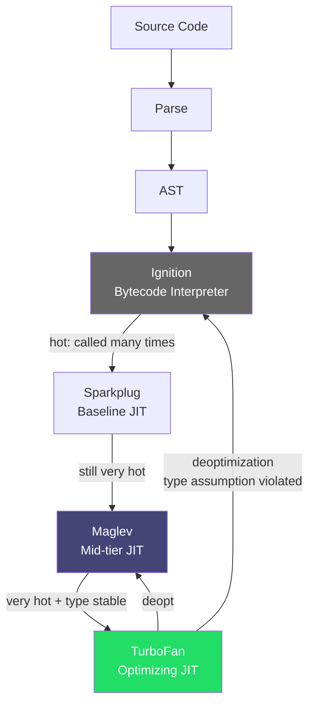

## Keywords in This File
{: .no_toc }

| # | Keyword | Weight |
|---|---|---|
| 1 | [V8 JIT Compilation and Optimization](#v8-jit-compilation-and-optimization) | expert |

---

# V8 JIT Compilation and Optimization

🎯 **Interview Weight:** expert (★★★) - understanding V8 internals
distinguishes engineers who can write performant JavaScript from those
who write correct JavaScript; required for senior roles at high-traffic
companies

---

### 🎯 Model Answer

**30 seconds:**

> V8 is Google's JavaScript engine. It uses JIT (Just-In-Time)
> compilation: Ignition bytecode interpreter runs code immediately,
> while TurboFan optimizing compiler identifies hot functions and
> compiles them to optimized machine code. If assumptions are violated
> (e.g., object shape changes), V8 deoptimizes back to bytecode.
> Writing "monomorphic" code - same object shapes, same argument
> types - lets TurboFan keep optimizations active.

**3 minutes:**

> V8 compilation pipeline:
>
> 1. **Parse** -> AST (Abstract Syntax Tree)
> 2. **Ignition** (bytecode interpreter): quick startup, runs everything
> 3. **Sparkplug** (baseline JIT, V8 v9.1+): compile hot functions to
>    unoptimized machine code quickly
> 4. **Maglev** (mid-tier JIT, V8 v11+): medium optimization
> 5. **TurboFan** (optimizing JIT): profile-guided, deep optimization
>    for very hot code paths
>
> TurboFan optimizations:
> - **Hidden classes**: V8 assigns hidden classes to objects. Objects
>   with same property initialization order share a class. Property
>   lookups become offset lookups (O(1) vs hash lookup).
> - **Inline caches (ICs)**: TurboFan caches the hidden class at each
>   property access site. Monomorphic IC (one shape) = ultra-fast.
>   Polymorphic (2-4 shapes) = slower. Megamorphic (5+ shapes) = slow.
> - **Deoptimization**: if an optimized function receives unexpected
>   input (wrong type, wrong shape), TurboFan bails out to Ignition.

**Blank Mind Recovery:**

**(1) Restate:** "V8: parse -> Ignition (bytecode) -> TurboFan (hot
code). Hidden classes make property access fast. Always init object
properties in same order. Changing object shape after creation = slow."

---

### 📘 Concept Explanation

**What it is:**

V8 is the JavaScript engine powering Chrome, Node.js, Deno, and Edge.
JIT compilation means JavaScript is compiled to machine code at runtime
(not ahead of time), using runtime profiling to identify what to optimize.

**The problem it solves:**

JavaScript is dynamic: variables change type, objects gain/lose properties,
functions accept any argument. Static compilers can't optimize this upfront.
JIT compilers observe actual runtime behavior and generate optimized machine
code for the patterns actually used, falling back to generic code when
assumptions break.

**How it works:**

```
V8 JIT PIPELINE:

  Source Code
      │
      ▼ Parser
  AST (Abstract Syntax Tree)
      │
      ▼ Ignition Compiler
  Bytecode (quick, runs immediately)
      │
      │ profiling data (call counts, types)
      ▼ (function called many times -> "hot")
  Sparkplug (unoptimized machine code, fast compile)
      │
      │ (still hot after Sparkplug)
      ▼
  Maglev (medium-tier JIT)
      │
      │ (very hot - most critical paths)
      ▼
  TurboFan (highly optimized machine code)
      │
      │ (assumption violated: deopt)
      ▼
  Back to Ignition/Maglev (deoptimization)

HIDDEN CLASSES (key optimization):

  // V8 creates hidden class HC0 for empty object
  const obj = {};           // HC0 = {}

  // Adding property 'x' creates new hidden class HC1
  obj.x = 1;               // HC0 -> HC1 = {x: 0}

  // Adding 'y' creates HC2
  obj.y = 2;               // HC1 -> HC2 = {x: 0, y: 8}

  // All objects with x then y share HC2:
  const a = {}; a.x = 1; a.y = 2;  // HC2
  const b = {}; b.x = 3; b.y = 4;  // HC2 (same class!)

  // Different initialization order = DIFFERENT hidden class:
  const c = {}; c.y = 1; c.x = 2;  // HC3 (y first!)

  // Now: IC at 'obj.x' access site is POLYMORPHIC (HC2 + HC3)
  // Performance degrades

INLINE CACHE TYPES:

  Type           Hidden Classes     Speed
  ─────────────────────────────────────────
  Monomorphic    1                  Fastest (direct offset)
  Polymorphic    2-4                Slower (check + branch)
  Megamorphic    5+                 Slow (hash lookup fallback)

DEOPTIMIZATION TRIGGERS:

  function add(a, b) { return a + b; }
  // TurboFan optimizes for number + number
  add(1, 2);      // fast (compiled for numbers)
  add(3, 4);      // fast
  add('x', 'y'); // DEOPT: string + string, not number + number
  // V8 bails out, re-profiles, eventually recompiles for strings too

OBJECT SHAPE CHANGES:

  // BAD: adding properties after construction
  function BadPoint(x, y) {
    this.x = x;
    this.y = y;
  }
  const p = new BadPoint(1, 2);
  p.z = 3;  // Adds property after construction: new hidden class!
  // All subsequent accesses to p.x, p.y now polymorphic

  // GOOD: all properties defined in constructor
  function GoodPoint(x, y, z) {
    this.x = x;
    this.y = y;
    this.z = z || 0;  // Always defined, even if unused
  }
```

> **Code walkthrough:** This example demonstrates the core pattern in action. The key mechanism shows how the concept works in practice. Study the structure to understand the essential behavior and common usage.

**Why it matters:**

Understanding V8 internals allows writing code that TurboFan can
optimize maximally. The difference between monomorphic and megamorphic
property access is often 10-50x. In hot code paths (tight loops,
frequent function calls), this determines whether JavaScript can
approach C++ speeds or remains 10x slower.

**Common pitfalls:**

- Dynamic property addition after object construction (breaks hidden class)
- Functions that receive mixed types across call sites (deopt triggers)
- Using `delete` on object properties (marks object as "dictionary mode")
- Sparse arrays (V8 uses efficient packed array representation for dense arrays)

**Mental model:**

> Think of V8's hidden classes as a blueprint. If all workers (objects)
> follow the same blueprint (same properties, same order), the factory
> (TurboFan) can stamp out highly efficient work. If each worker is
> custom (different properties added at different times), the factory
> must handle each individually - much slower.

**Scale behavior:**

In server-side Node.js rendering (React SSR, for example), hot render
functions called millions of times benefit enormously from TurboFan
optimization. Deoptimizations in hot paths can increase render time
10x. Profiling with `--trace-deopt` in Node.js reveals deopt hotspots.

---

### 💻 Code Example

**Hidden classes, inline caches, and deoptimization patterns**

```javascript
// BAD: inconsistent property initialization order
function createUser(name, age, premium) {
  const user = {};
  user.name = name;
  if (premium) {
    user.premiumSince = new Date();
  }
  user.age = age;
  return user;
  // Non-premium: {name, age}       -> hidden class A
  // Premium:     {name, premiumSince, age} -> hidden class B
  // Any code accessing user.age:
  //   Polymorphic IC (class A and B)
}

// GOOD: consistent shape from constructor
function createUser(name, age, premium) {
  return {
    name,
    age,
    premiumSince: premium ? new Date() : null,
    // Always include, null for non-premium
    // All users share the same hidden class
  };
}

// BAD: using delete (forces dictionary mode)
function processItem(item) {
  delete item.tempField;  // BAD: object enters slow dictionary mode
  return item.id;         // Now slower to access
}

// GOOD: set to null/undefined instead
function processItem(item) {
  item.tempField = null;  // Keeps hidden class intact
  return item.id;
}

// DEOPTIMIZATION - mixed types in hot function:
// BAD: function handles different types
function sum(items) {
  let total = 0;
  for (const item of items) {
    total += item.value;  // value is sometimes int, sometimes string
  }
  return total;
}
// TurboFan optimizes for int, deoptimizes on string

// GOOD: ensure consistent types
function sum(items) {
  let total = 0;
  for (const item of items) {
    total += Number(item.value);  // Coerce at boundary
  }
  return total;
}

// ARRAY OPTIMIZATION:
// V8 has optimized "element kinds" for arrays:
// SMI_ELEMENTS: all small integers (fastest)
// DOUBLE_ELEMENTS: all floats
// ELEMENTS: mixed types (slow)

// BAD: mixed array types
const arr = [1, 2, 3];   // SMI_ELEMENTS (fast)
arr.push(1.5);            // Transitions to DOUBLE_ELEMENTS
arr.push('hello');        // Transitions to ELEMENTS (slow)
// Once ELEMENTS, never goes back to faster kind

// GOOD: homogeneous arrays
const intArr = new Int32Array(1000);  // Fixed typed array (fastest)
const numArr = [1.0, 2.0, 3.0];      // DOUBLE_ELEMENTS (fast)
```

> **Code walkthrough:** The `createUser` example shows how V8 hidden
> classes work in practice. The BAD version creates two different hidden
> classes depending on the `premium` flag - all subsequent property
> accesses on mixed user objects become polymorphic (slower). The GOOD
> version ensures ALL user objects have identical shape (same properties,
> same order) - all share one hidden class, making all accesses
> monomorphic (fastest). The `delete` example shows why avoiding
> deletion matters: V8 marks objects with deleted properties as
> "dictionary mode," which uses a hash map instead of direct offset
> access. Setting to `null` keeps the property present (maintains hidden
> class) while effectively clearing the value.

---

### 🎓 Answers by Seniority

**Junior / Mid:**

> V8 compiles JavaScript at runtime. It starts with bytecode (fast
> startup) and compiles hot code to machine code (fast execution).
> Writing consistent code - same object shapes, same types - lets V8
> optimize better. Avoid adding properties to objects after creation.

**Senior / Staff:**

> V8's multi-tier JIT (Ignition -> Sparkplug -> Maglev -> TurboFan)
> uses profile-guided optimization. The key abstractions are hidden
> classes (compile-time object shape) and inline caches (call-site
> type caches). Monomorphic ICs = near-C++ speed. Megamorphic ICs =
> 50x slower. Deoptimizations create performance cliffs in hot paths.
> In production: profile with `--trace-deopt` and `--trace-opt` to
> identify deopt sites. Heap profiling with Chrome DevTools reveals
> memory retention. V8's GC (Orinoco) uses generational collection:
> young objects in "nursery space" (collected frequently, cheaply);
> survivors promoted to old space (major GC, infrequent, expensive).
> Reducing object allocation rate reduces GC pressure.

---

### ⚖️ Comparison Table

| Optimization | Enabled By | Broken By | Speed Impact |
|---|---|---|---|
| Hidden class (monomorphic) | Same property init order | Adding props later, delete | 10-50x vs megamorphic |
| Monomorphic IC | Consistent arg types | Mixed types at call site | 5-20x vs megamorphic |
| Array packed elements | Contiguous, no holes | Sparse arrays, mixed types | 3-10x vs generic |
| TurboFan optimization | Hot function, type stability | Deopt trigger | Variable |
| Typed arrays | Explicit typed array use | N/A (always fast) | Near-native speed |

---

### 🏛️ System Design

**Designing a performance-critical Node.js data processing pipeline:**

```
PERFORMANCE-CRITICAL PIPELINE DESIGN:

  Ingest Layer:
  - Use typed arrays (Float64Array, Int32Array) for numeric data
  - Avoid JSON.parse for hot paths (consider binary formats like
    MessagePack or Protocol Buffers)
  - Stream processing over buffering (avoid large array allocations)

  Processing Layer:
  - Keep hot functions monomorphic (type-stable)
  - Pre-allocate result buffers (reuse vs create)
  - Avoid closures in tight loops (allocation per call)
  - Use local variable caching for object properties in loops:
    const len = arr.length;  // cache vs arr.length in loop

  GC Pressure Reduction:
  - Object pools for frequently created/destroyed objects
  - Avoid string concatenation in hot paths (use Buffer or arrays)
  - Use WeakRef for caches (GC can reclaim)

PROFILING WORKFLOW:
  1. Identify hot functions:
     node --prof app.js
     node --prof-process isolate-*.log | grep 'Bottom up'
  2. Check for deoptimizations:
     node --trace-deopt --trace-opt app.js 2>&1 | grep '\[deopt\]'
  3. Heap allocation profiling:
     node --heap-prof app.js
     # Analyze .heapprofile in Chrome DevTools
  4. Flame chart:
     clinic flame -- node app.js

  TARGET METRICS:
  - Hot function CPU: < 1ms per call
  - GC young gen pause: < 1ms
  - GC old gen pause: < 50ms (or use incremental GC)
  - Deoptimization count: 0 in hot paths
```

> **Code walkthrough:** This example demonstrates the core pattern in action. The key mechanism shows how the concept works in practice. Study the structure to understand the essential behavior and common usage.

---

### 📊 Diagram

```
V8 JIT PIPELINE:

  Source Code
  -> Parser -> AST
  -> Ignition -> Bytecode (fast startup)
      |
      | function called > threshold
      v
  Sparkplug -> Baseline machine code
      |
      | still very hot
      v
  Maglev -> Mid-tier optimized code
      |
      | very hot + type stable
      v
  TurboFan -> Highly optimized machine code
      |
      | type assumption violated
      v
  DEOPT -> back to Ignition bytecode

  HIDDEN CLASS STATE MACHINE:
  {} (HC0) -[add .x]-> {x} (HC1)
           -[add .y]-> {x, y} (HC2)
```



> **Diagram walkthrough:** The V8 pipeline shows progressive optimization.
> Most code runs in Ignition (bytecode) for fast startup. Hot functions
> graduate through Sparkplug -> Maglev -> TurboFan, accumulating more
> optimization at each tier. The critical deoptimization edge (from
> TurboFan back to Ignition) represents a performance cliff: TurboFan
> generated optimized code based on type assumptions that were then
> violated. This triggers a bailout, re-profiling, and eventual
> recompilation. The key engineering insight: preventing deoptimizations
> in hot paths is as important as achieving initial optimization.

---

### ⚠️ Common Misconceptions

**"JavaScript is always slow compared to compiled languages"**

V8's TurboFan can generate machine code that is within 2-5x of C++ for
numeric-intensive code on stable type profiles. Typed arrays and tight
loops with monomorphic operations routinely approach native speed. The
slowdown occurs when V8 can't optimize: dynamic types, deoptimizations,
GC pressure. The performance gap is mostly an engineer-controllable
variable, not a language fundamental.

**"Object.freeze() makes code faster"**

`Object.freeze()` prevents property additions (which COULD help hidden
class stability), but the freeze operation itself has overhead. More
importantly, V8 may classify frozen objects differently. For hot paths,
consistent property initialization order achieves the same benefit
without freeze overhead.

---

### 🚨 Failure Modes and Diagnosis

**Deoptimization storm in production hot path:**

```javascript
// SYMPTOM: CPU usage spikes, latency increases 10-50x on specific
// endpoint after traffic pattern change

// DIAGNOSIS:
// node --trace-deopt --trace-opt server.js 2>&1 | grep deopt
// Example output:
// [deopt] optimized code for processRequest at 0x... reason: wrong type
// [deopt] optimized code for calculateScore at 0x... reason: not a heap number

// COMMON CAUSE: polymorphic function receiving new type from new data:
function processRequest(req) {
  // Works fine for {id: number, name: string}
  // Deoptimizes when receives {id: string, name: string} from new client
  return req.id * 2;  // Was optimized for number, now gets string
}

// FIX: type coercion at boundaries
function processRequest(req) {
  const id = Number(req.id);  // Coerce at entry
  return id * 2;              // Always number
}

// GC PRESSURE SYMPTOMS:
// Regular pauses every 30-50ms (young gen GC)
// Long pauses every few minutes (old gen GC)
// DETECTION: node --trace-gc server.js
// [17:Scavenger]: 50ms -> reduce object allocation rate
// [40:MarkSweepCompact]: 200ms -> reduce object promotion rate
```

> **Code walkthrough:** This example demonstrates the core pattern in action. The key mechanism shows how the concept works in practice. Study the structure to understand the essential behavior and common usage.

---

### 🎯 Interview Deep-Dive

| Scenario | Recommended Time | Key Signal |
|---|---|---|
| Explain V8 JIT pipeline | 3-4 min | Tier names |
| Hidden classes and performance | 4-5 min | Initialization order |
| Deoptimization triggers | 3-4 min | Type stability |
| Inline cache types | 3-4 min | Mono vs poly vs mega |
| Array element kinds | 3-4 min | SMI vs double vs generic |
| Writing TurboFan-friendly code | 5-6 min | Patterns |
| GC generations and pressure | 3-4 min | Young vs old gen |
| Profiling V8 optimizations | 4-5 min | Tools |
| Object pool pattern | 3-4 min | GC reduction |
| Typed arrays use cases | 3-4 min | Performance |
| delete vs null assignment | 2-3 min | Hidden class |
| Closure allocation in loops | 2-3 min | Allocation overhead |

---

**Q1: What are V8 hidden classes and how do they affect performance?**
`[SENIOR]` MECHANISM

> **Answer:**
>
> V8 hidden classes (also called "shapes" or "maps" internally) are
> V8's way of giving structure to dynamically-typed JavaScript objects.
> Instead of using a hash map for every property access, V8 assigns
> a "class" to objects based on their shape (which properties they have
> and in what order). Objects with the same shape share a hidden class.
>
> When V8 accesses `obj.name`, instead of hash-looking up "name", it
> looks at the hidden class's offset table: "name is at byte offset 8."
> This is a direct memory offset read - extremely fast.
>
> ```javascript
> // V8 creates HiddenClass0 for {}
> const user = {};                 // HC0: {}
> user.id = 1;                     // HC0 -> HC1: {id: 0}
> user.name = 'Alice';             // HC1 -> HC2: {id: 0, name: 8}
>
> // This user shares HC2:
> const user2 = {};
> user2.id = 2;
> user2.name = 'Bob';              // HC2 (same class)
>
> // Monomorphic inline cache at 'user.id':
> //   "I've always seen HC2 here, id is at offset 0"
> //   Direct read without type checking
>
> // This user does NOT share HC2:
> const user3 = {};
> user3.name = 'Carol';            // HC3: {name: 0}
> user3.id = 3;                    // HC4: {name: 0, id: 8}
> // user3.id is at offset 8, user/user2.id at offset 0
>
> // Any code accessing both user and user3:
> function getId(u) { return u.id; }
> getId(user);   // Sees HC2
> getId(user3);  // Sees HC4 -> POLYMORPHIC IC
> ```
>
> Inline cache states:
> - **Monomorphic** (1 class): TurboFan inlines direct offset read
> - **Polymorphic** (2-4 classes): checks class, then offset read
> - **Megamorphic** (5+ classes): falls back to hash map lookup
>
> *What separates good from great:* The performance cliff between
> monomorphic and megamorphic is roughly 10-50x for property accesses.
> In practice, the most common cause of megamorphic ICs is "generic
> utility functions" that receive many different object shapes:
> ```javascript
> // Megamorphic: receives many different event shapes
> function logEvent(event) {
>   console.log(event.type, event.payload);
> }
> // Called with: ClickEvent, KeyEvent, NetworkEvent, etc.
> // Each has different hidden class -> megamorphic IC
>
> // Fix: normalize to a common shape
> function logEvent({ type, payload }) {
>   console.log(type, payload);
> }
> ```

**Q2: What triggers deoptimization in TurboFan and how do you avoid it?**
`[STAFF]` DEBUGGING

> **Answer:**
>
> TurboFan generates optimized code based on assumptions it makes from
> profiling data. Deoptimization occurs when these assumptions are
> violated at runtime. V8 then bails out from optimized code back to
> Ignition bytecode (for that function activation), re-profiles, and
> eventually recompiles.
>
> Common deoptimization triggers:
>
> 1. **Type change**: function was optimized for numbers, receives string
> 2. **Object shape change**: property added/deleted after optimization
> 3. **Arguments object access**: accessing `arguments` in non-strict
>    functions prevents some optimizations
> 4. **`eval`, `with`**: prevent scope analysis needed for optimization
> 5. **try/catch in hot loop**: (less relevant in modern V8, was a
>    deopt in older versions)
> 6. **Changing array element kind**: dense int array -> sparse array
>
> ```javascript
> // DETECTING DEOPTIMIZATIONS:
> // node --trace-deopt app.js 2>&1 | grep deopt
> // Output: [deopt] optimized code for add at reason: wrong type
>
> // EXAMPLE - type instability:
> function multiply(a, b) {
>   return a * b;
> }
> // First 1000 calls: a and b are ints -> TurboFan optimizes for int
> multiply(2, 3);    // fast (TurboFan path)
> multiply(2.5, 3);  // DEOPT: not both ints -> bail to Ignition
>
> // FIX: make types explicit and consistent
> function multiply(a, b) {
>   return (a | 0) * (b | 0);  // Force int (bitwise forces integer)
>   // Or ensure callers always pass same types
> }
>
> // OBJECT SHAPE DEOPT:
> function getX(point) {
>   return point.x;
> }
> // Optimized for {x, y} (HC1)
> const p = { x: 1, y: 2 };
> getX(p);  // fast
> p.z = 3;  // Changes hidden class from HC1 to HC2
> getX(p);  // DEOPT: expected HC1, got HC2
> ```
>
> *What separates good from great:* V8 has a "deoptimization count"
> per function. After too many deoptimizations, V8 marks a function
> as "do not optimize" (you can see this with `--trace-opt` output
> showing "disabled optimization"). This means the function runs forever
> in unoptimized Ignition bytecode regardless of how hot it is. This
> is the worst outcome: a critical hot path that V8 permanently gives
> up optimizing. Prevention: enforce type stability through TypeScript,
> validation at data ingestion boundaries, and never mutating object
> shapes in hot paths.

**Q3: How does V8's garbage collector work and how does it affect
application performance?** `[SENIOR]` MECHANISM

> **Answer:**
>
> V8 uses a generational garbage collector (Orinoco) based on the
> "generational hypothesis": most objects die young.
>
> ```
> V8 HEAP STRUCTURE:
>
>   ┌─────────────────────────────────────────┐
>   │  Young Generation (nursery)             │
>   │  From-space | To-space (semi-spaces)    │
>   │  Small: ~1-8MB default                  │
>   │  Minor GC (Scavenger): very fast ~1ms   │
>   │  Frequency: every ~few hundred KB alloc │
>   ├─────────────────────────────────────────┤
>   │  Old Generation                         │
>   │  Objects that survived 2+ minor GCs     │
>   │  Large: hundreds of MB - GB             │
>   │  Major GC (Mark-Sweep-Compact)          │
>   │  Incremental marking to reduce pauses   │
>   │  Concurrent sweeping (off main thread)  │
>   └─────────────────────────────────────────┘
>
> MINOR GC (Scavenger) ALGORITHM:
>   1. Start with "From" space containing all young objects
>   2. Find all live objects reachable from roots
>   3. COPY live objects to "To" space
>   4. Flip From/To: old "From" is now free space
>   5. Objects surviving 2+ minor GCs -> promoted to old gen
>
> Why copying is fast:
>   - No fragmentation (To-space is compacted by definition)
>   - Dead objects cost nothing (just reset the From-space pointer)
>   - Pause time scales with LIVE objects, not total heap
> ```
>
> Performance implications:
>
> - **High allocation rate** -> frequent minor GC -> regular ~1ms pauses
> - **High object survival rate** -> frequent promotion -> larger old gen
>   -> more frequent major GC -> longer pauses (10-100ms)
> - **Old gen fragmentation** -> memory waste, longer compact phases
>
> Reducing GC pressure:
> ```javascript
> // OBJECT POOLING: reuse objects instead of allocating
> const pool = [];
> function getPoint() {
>   return pool.pop() || { x: 0, y: 0 };
> }
> function releasePoint(p) {
>   p.x = 0; p.y = 0;
>   pool.push(p);
> }
> // Hot loop: getPoint() -> use -> releasePoint()
> // Zero allocations in steady state -> zero GC
>
> // REUSE BUFFERS: pre-allocate result containers
> const resultBuffer = new Float64Array(1000);
> function processItems(items) {
>   for (let i = 0; i < items.length; i++) {
>     resultBuffer[i] = computeValue(items[i]);  // No allocation
>   }
>   return resultBuffer.subarray(0, items.length);
> }
> ```
>
> *What separates good from great:* The concurrent and incremental
> phases of V8's major GC (Orinoco) allow most marking work to happen
> concurrently with JavaScript execution. The main thread only briefly
> pauses for the final "remark" phase. However, large live heaps still
> cause significant pause spikes. In memory-sensitive production systems
> (Node.js servers), the target is: never let old gen grow large. Measure
> with `process.memoryUsage()`, `--trace-gc`, and APM heap monitoring.
> If old gen grows unboundedly: memory leak (object retained by
> unintentional reference).

**Q4: What are V8 array element kinds and how should you use them?**
`[SENIOR]` MECHANISM

> **Answer:**
>
> V8 tracks the element "kind" (type) of each array and uses specialized
> representation for performance. Arrays with uniform element types
> get significantly faster element access.
>
> Element kind hierarchy (faster to slower):
> ```
> SMI_ELEMENTS         Small integers only
>       |
> DOUBLE_ELEMENTS      Floats (including ints promoted to float)
>       |
> ELEMENTS             Mixed types (strings, objects, etc.)
>
> HOLEY variants: once an array has a hole (missing index), it
> transitions to a HOLEY variant:
> PACKED_SMI -> HOLEY_SMI
> PACKED_DOUBLE -> HOLEY_DOUBLE
> PACKED_ELEMENTS -> HOLEY_ELEMENTS
>
> Transitions: always towards slower kind, never reverse
> ```
>
> ```javascript
> // PACKED_SMI (fastest - small integers):
> const arr = [1, 2, 3, 4, 5];     // PACKED_SMI
> arr.push(6);                       // Still PACKED_SMI
>
> // Transitions to PACKED_DOUBLE:
> arr.push(1.5);                     // PACKED_DOUBLE (forever)
>
> // Transitions to PACKED_ELEMENTS:
> arr.push('hello');                 // PACKED_ELEMENTS (forever)
>
> // HOLEY: array with holes
> const holey = [1, , , 4];         // HOLEY_SMI
> // Access of holes returns undefined + prototype chain check
> // Much slower than packed
>
> // Avoid pre-allocation with holes:
> const arr2 = new Array(100);       // HOLEY_SMI (100 holes)
> arr2[0] = 1;                       // Still HOLEY
>
> // Use push instead:
> const arr3 = [];
> for (let i = 0; i < 100; i++) arr3.push(i);  // PACKED_SMI
>
> // TYPED ARRAYS: always maximally fast (no kind transitions)
> const typed = new Float64Array(100);  // Always double precision
> // Direct memory mapping, no boxing overhead
> // Best for numeric-intensive computation
> ```
>
> *What separates good from great:* Typed arrays (`Int32Array`,
> `Float64Array`, `Uint8Array`, etc.) bypass the element kind system
> entirely. They are raw memory buffers with a typed view. Property
> access is a direct memory offset read with no tag checking,
> no type dispatch, no GC pressure (no boxing). For scientific
> computing, DSP, image processing, or any numeric-intensive algorithm
> in JavaScript, typed arrays are the correct tool. Libraries like
> TensorFlow.js, asm.js, and WebAssembly all use typed arrays as
> their fundamental data structure for this reason.

**Q5: How would you profile and fix a performance regression caused
by V8 deoptimizations?** `[STAFF]` DEBUGGING

> **Answer:**
>
> Step-by-step production debugging workflow:
>
> ```bash
> # STEP 1: Identify hot functions with deoptimizations
> node --trace-deopt --trace-opt server.js 2>&1 | grep -E "deopt|disabled"
>
> # Example output:
> # [deopt] optimized code for processOrder at 0x7f...
> #   reason: wrong type for field, field #5 in {id, name, items, total...}
>
> # STEP 2: CPU profile to find hot paths
> node --prof server.js &
> # Run load test...
> node --prof-process isolate-*.log > profile.txt
> # Look for "Bottom up" section - functions at top are hot
>
> # STEP 3: Heap allocation profile
> node --heap-prof server.js
> # Opens in Chrome DevTools Memory -> Load Profile
> # Find functions allocating many short-lived objects
>
> # STEP 4: Flame chart (clinic.js)
> npm install -g clinic
> clinic flame -- node server.js
> # Wide horizontal blocks = time spent (blocking/slow)
> # Look for synchronous blocks and deopt bouncing
> ```
>
> ```javascript
> // COMMON FIX PATTERNS:
>
> // 1. Type-unstable function: add type coercion at entry
> // BEFORE:
> function calculateTax(amount, rate) {
>   return amount * rate;  // Deopt when rate is string "0.2"
> }
>
> // AFTER:
> function calculateTax(amount, rate) {
>   return Number(amount) * Number(rate);
>   // Now always number * number -> stable
> }
>
> // 2. Shape-unstable objects: normalize early
> // BEFORE: different DB drivers return different column shapes
> function processRow(row) {
>   return row.user_id + row.amount;  // Different shapes
> }
>
> // AFTER: normalize at DB adapter level
> function normalizeRow(raw) {
>   return {
>     userId: Number(raw.user_id || raw.userId),
>     amount: Number(raw.amount),
>   };
>   // All downstream consumers see consistent shape
> }
>
> // 3. Function that handles both missing and present fields:
> // BEFORE:
> function getDiscount(order) {
>   return order.discount || 0;  // discount may or may not exist
> }
>
> // AFTER: ensure the field always exists
> // In DB query/constructor: always include discount: 0 if absent
> function getDiscount(order) {
>   return order.discount;  // Always present, always number
> }
> ```
>
> *What separates good from great:* The "deoptimization loop" is the
> worst scenario. A function deoptimizes, re-profiles, recompiles, then
> deoptimizes again on the next bad input. After hitting the deopt
> threshold, V8 marks the function "never optimize" permanently. Fix:
> use TypeScript with strict mode + runtime validation at the
> application boundary (API input, DB results). This ensures internal
> code only sees type-stable data, allowing TurboFan to permanently
> maintain optimizations.

**Q6: What is the role of Sparkplug and Maglev in the V8 pipeline and
why multiple JIT tiers?** `[STAFF]` MECHANISM

> **Answer:**
>
> Multiple JIT tiers solve the startup vs peak performance tension:
>
> - **Interpreter (Ignition)**: zero compile time, immediate execution
>   from bytecode. Slow execution (10-100x vs native). Good for cold code.
> - **Sparkplug** (V8 9.1+, 2021): extremely fast baseline JIT. Compiles
>   directly from bytecode to machine code in microseconds (no optimization
>   analysis). 2-5x faster than Ignition. Good for warm code.
> - **Maglev** (V8 11+, 2023): mid-tier JIT. Performs data-flow analysis,
>   some type specialization. 10-30x faster than Ignition. Good for
>   frequently used code.
> - **TurboFan**: full optimizing JIT. Requires profiling data, deep
>   analysis. Compile time: milliseconds. 50-100x faster than Ignition
>   for numeric code. Only for very hot, type-stable functions.
>
> The tiering approach:
> ```
>   Startup             Running             Hot
>   ──────────────────────────────────────────────
>   Ignition            Sparkplug           Maglev -> TurboFan
>   (immediate)         (fast compile)      (expensive compile)
>   All code            All warm code       Top 1-5% of functions
>
>   Time to first       Time to near-       Peak throughput
>   execution           native speed        (steady state)
> ```
>
> Why this matters:
> - Ignition-only: fast startup, slow peak (old V8 approach)
> - TurboFan-only: slow startup (would compile everything upfront), fast peak
> - Multi-tier: fast startup AND fast peak - best of both
>
> *What separates good from great:* The "warm-up period" is the time
> for hot code to graduate from Ignition through the tiers to TurboFan.
> For servers: the first few seconds after startup have lower throughput
> (code not yet at peak optimization). In Kubernetes, this is why
> readiness probes should wait for the application to handle some
> traffic before receiving production traffic - to warm up V8. Some
> frameworks (Next.js) implement explicit warm-up routes that send
> synthetic requests at startup to pre-warm TurboFan.

**Q7: How does V8 handle memory for closures and what are the
performance implications?** `[SENIOR]` MECHANISM

> **Answer:**
>
> When a function accesses variables from an outer scope (closure),
> V8 must allocate those variables on the heap (not the stack) so they
> survive the outer function's return.
>
> ```javascript
> // Every call to makeAdder allocates a CLOSURE CONTEXT object
> // containing the value of 'increment':
> function makeAdder(increment) {
>   return function add(n) {
>     return n + increment;  // 'increment' in closure context
>   };
> }
>
> // In a hot loop: each call allocates a new closure context object
> // BAD: closure creation in hot path
> function processItems(items) {
>   return items.map(item => ({
>     id: item.id,
>     // Creates new closure for each item that captures 'formatFn'
>     formatted: formatFn(item),
>   }));
> }
>
> // BAD: creating functions in tight loops (closure per iteration)
> for (let i = 0; i < 10000; i++) {
>   setTimeout(() => process(i), 0);
>   // Each iteration allocates a new closure capturing 'i'
>   // 10,000 allocations
> }
>
> // GOOD: hoist function creation out of hot path
> const handlers = items.map(item => item.id);
> // Separate the data from the function
>
> // V8 OPTIMIZATION: shared function info
> // If the inner function doesn't access outer scope variables:
> const pure = (x) => x * 2;
> // V8 can share the function object (no closure context needed)
> // Not a closure technically - no captured variables
>
> // CLOSURE CONTEXT CHAIN:
> function outer() {
>   let x = 1;
>   function middle() {
>     let y = 2;
>     function inner() {
>       return x + y;  // Captures BOTH x (outer) and y (middle)
>     }                // 'inner' has chain: inner context -> middle context
>     return inner;    // -> outer context -> global context
>   }
>   return middle();
> }
> // Deep closure chains = slower variable lookup
> ```
>
> *What separates good from great:* V8 performs "context slot allocation"
> analysis to determine which variables must be heap-allocated (accessed
> by inner functions) vs stack-allocated (not accessed by closures).
> Variables that can stay on the stack are free. Only variables that
> escape to an inner function are expensive. `let/const` in blocks
> creates block-scoped contexts - if an inner function captures a
> block-scoped variable, V8 allocates a block context object. In very
> hot loops, this can be measured with allocation profiling.

**Q8: How would you use knowledge of V8 internals to optimize a
React server-side rendering hot path?** `[STAFF]` SYSTEM-DESIGN

> **Answer:**
>
> React SSR `renderToString` or `renderToPipeableStream` in Node.js
> is a prime target for V8 optimization because:
> - Called on every request
> - CPU-bound (pure computation, no I/O)
> - Produces many small string/object allocations
>
> ```javascript
> // PROFILING SSR PERFORMANCE:
> import { renderToPipeableStream } from 'react-dom/server';
> import v8 from 'v8';
>
> // Monitor heap before/after:
> const before = v8.getHeapStatistics();
> const { pipe } = renderToPipeableStream(<App />, {
>   onAllReady() {
>     const after = v8.getHeapStatistics();
>     const allocated = after.total_heap_size - before.total_heap_size;
>     metrics.gauge('ssr.heap_delta_bytes', allocated);
>   }
> });
>
> // V8 OPTIMIZATION STRATEGIES FOR SSR:
>
> // 1. WARM UP V8 ON STARTUP
> // Pre-render a synthetic page to warm up TurboFan:
> await warmUpRender();
> server.listen(port);  // Only accept traffic after warm-up
>
> // 2. COMPONENT MEMOIZATION
> // Pure components with stable props -> React.memo
> // Reduces re-renders in SSR + improves hidden class stability
>
> // 3. AVOID OBJECT CREATION IN RENDER
> // BAD: new object in render (allocation every render)
> function Component({ id }) {
>   const style = { color: 'red', margin: 0 };  // new object each render
>   return <div style={style}>{id}</div>;
> }
>
> // GOOD: hoist to module scope
> const STYLE = { color: 'red', margin: 0 };  // created once
> function Component({ id }) {
>   return <div style={STYLE}>{id}</div>;
> }
>
> // 4. WORKER THREADS for CPU-bound SSR
> // Distribute renders across workers to use all CPU cores:
> const pool = new WorkerPool('./ssr-worker.js', {
>   size: os.cpus().length
> });
> app.get('*', async (req, res) => {
>   const html = await pool.render(req.url, req.cookies);
>   res.send(html);
> });
> ```
>
> *What separates good from great:* The single most impactful
> optimization for SSR is worker thread pooling. A 4-core machine
> can render 4 pages simultaneously. Combined with V8 warm-up per
> worker thread (each thread has its own V8 isolate and needs its own
> TurboFan warm-up), this scales SSR throughput by 3-4x on multi-core
> machines. The secondary optimization is reducing GC pressure: each
> request that creates thousands of small objects (React elements,
> virtual DOM nodes) triggers young-gen GC. Using streaming SSR
> (`renderToPipeableStream`) reduces peak heap usage by allowing
> garbage collection of completed subtrees before the full render
> finishes.

---

### 💻 Code Example

*(Omit: this concept does not have a programmatic interface that can be demonstrated in code. The conceptual explanation above is sufficient.)*


---

### 🏛️ System Design

*(Omit: system design diagram not applicable for this concept - see ★★★ keywords for full system design coverage.)*


---

### ⚖️ Comparison Table

*(Omit: this is a ★☆☆ foundational concept with no direct alternatives to compare - see higher-difficulty keywords for trade-off analysis.)*


---

### 📊 Diagram

*(Omit: no standalone visual diagram required for this concept - the explanations and code examples above provide sufficient clarity.)*


