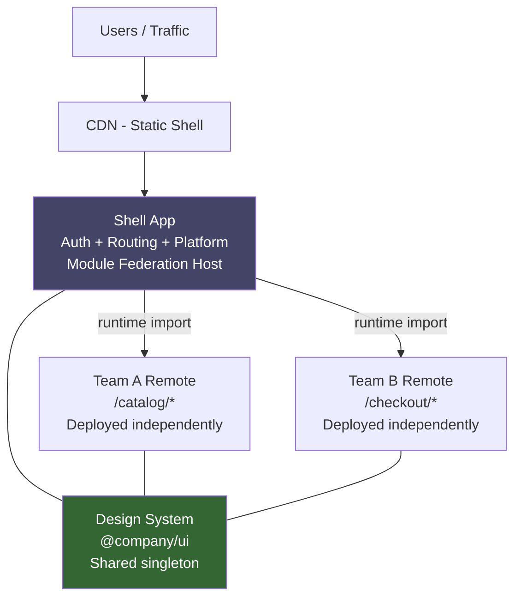

# JavaScript Architecture at Scale

🎯 **Interview Weight:** expert (★★★) - architectural thinking with
JavaScript is the distinguishing skill of staff engineers; required
for leading large frontend teams, platform decisions, and cross-team
JavaScript strategy

---

### 🎯 Model Answer

**30 seconds:**

> JavaScript architecture at scale means: modularization strategy
> (how code is split and shared), bundling architecture (what ships
> to the browser and when), state management patterns (single store
> vs distributed), rendering model (CSR/SSR/SSG/ISR), and team
> scalability (micro-frontends for independent team deployments).
> The decision is governed by team size, performance requirements,
> and consistency needs.

**3 minutes:**

> At scale, JavaScript architectural decisions determine:
>
> 1. **Bundle strategy**: monolithic bundle vs route-based code
>    splitting vs module federation. Monolith: simple but slow initial
>    load. Code splitting: faster initial load, more network requests.
>    Module federation: share code at runtime across independently
>    deployed apps.
>
> 2. **Rendering model**: CSR (Client-Side Rendering) = SPA, fast
>    interactions, poor SEO. SSR = better TTFB, SEO, more infrastructure.
>    SSG = fastest possible, no dynamic content. ISR = static with
>    on-demand revalidation. Streaming SSR = progressive rendering.
>
> 3. **State management**: local state (useState) vs context vs
>    external store (Redux, Zustand, Jotai). Rule: keep state as local
>    as possible. Only elevate to global store when truly shared.
>
> 4. **Micro-frontends**: divide the application into independently
>    deployable vertical slices. Each team owns their own JS bundle,
>    CI/CD pipeline, and runtime. Composition at the shell level.
>    Tradeoff: runtime overhead, duplicate dependencies, complex
>    communication.

**Blank Mind Recovery:**

**(1) Restate:** "JS architecture = bundling strategy + rendering model
+ state management + team topology. Code split for performance. SSR/SSG
for SEO/TTFB. Micro-frontends for team independence. State as local
as possible. Every choice is a trade-off between performance, complexity,
and team autonomy."

---

### 📘 Concept Explanation

**What it is:**

JavaScript architecture at scale encompasses the structural decisions
that determine how a large JavaScript application is organized,
delivered, rendered, and maintained by multiple teams over years.
It includes build system design, module boundaries, rendering strategies,
state architecture, and team topology.

**The problem it solves:**

Single-file JavaScript grows into unmaintainable monoliths. Large React
SPAs suffer from slow initial loads (multi-MB bundles), poor SEO, and
"prop drilling" state management. Multiple teams deploying to the same
codebase creates coordination overhead and deployment bottlenecks.
Architecture decisions address these at the structural level.

**How it works:**

```
RENDERING STRATEGIES:

  CSR (Client-Side Rendering):
  Browser <- HTML shell (no content) <- Server
  Browser -> fetch JS bundle (500KB+) -> parse -> execute -> render
  Time to Content: slow (JS parse + execute + API fetch)
  SEO: poor (bot may not execute JS)
  Good for: apps behind login, complex interactive UIs

  SSR (Server-Side Rendering):
  Server (renders HTML with data) -> Browser
  Browser -> hydrate (attach event listeners)
  Time to Content: fast (HTML arrives with content)
  SEO: good
  Infrastructure: Node.js server required
  Good for: public pages, SEO-critical content

  SSG (Static Site Generation):
  Build time -> pre-render HTML -> CDN
  Browser <- static HTML (fastest possible)
  Time to Content: near-instant
  Dynamic content: none (or via client-side fetch)
  Good for: documentation, blogs, marketing pages

  ISR (Incremental Static Regeneration):
  Like SSG but pages regenerated on-demand / after revalidation period
  Combines static performance with dynamic data
  Next.js specific but concept applies broadly

  Streaming SSR:
  Server sends HTML in chunks as components render
  Browser paints content progressively
  Time to First Byte: fastest of SSR variants
  Used in: React 18 renderToPipeableStream, Next.js App Router

STATE MANAGEMENT SCALE:

  1 component          Local: useState / useReducer
  2-5 components       Lift state to parent
  Sibling subtrees     Context API (if update frequency is low)
  App-wide, frequent   External store: Zustand, Jotai, Redux Toolkit
  Server state         React Query / SWR (cache, sync, invalidate)

BUNDLE ARCHITECTURE:

  Monolith bundle:
    All code -> one app.js (2MB)
    Simple build, long initial load

  Route-based code splitting:
    app.js (50KB) + route1.js + route2.js + ...
    React.lazy() + Suspense + dynamic import()
    Initial load fast; route transitions fetch chunk

  Shared chunks:
    vendor.js (React, lodash) + app.js
    Vendor cached across deployments (hash unchanged)
    App bundle smaller + faster

  Module Federation (Webpack 5):
    Shell app + multiple remote apps
    Remote app loaded at runtime (not build time)
    Teams deploy independently

MICRO-FRONTEND PATTERNS:

  Runtime integration (Module Federation):
  ┌─────────────────────────────────────────┐
  │  Shell App (host)                       │
  │  ┌──────────────┐ ┌───────────────┐     │
  │  │ Team A App   │ │  Team B App   │     │
  │  │ (remote)     │ │  (remote)     │     │
  │  └──────────────┘ └───────────────┘     │
  └─────────────────────────────────────────┘
  Teams deploy independently; shell loads remotes at runtime

  Build-time integration (npm packages):
  Each team publishes component library as npm package
  Shell imports at build time
  Less flexible (requires rebuild to update)

  Server-side composition (Edge/CDN):
  ESI (Edge Side Includes) or server template composition
  Each micro-frontend is a separate service
  Composed at the edge before delivery
```

**Why it matters:**

Architectural decisions compound over time. A rendering strategy
chosen at year 1 determines bundle sizes, SEO performance, and
infrastructure costs for years. State architecture chosen for a
50-component app breaks when the app grows to 500 components. Getting
these decisions right (or wrong) has multi-year impacts.

**Mental model:**

> JavaScript architecture is urban planning. Early decisions determine
> where roads go (module boundaries), which areas are residential vs
> commercial (rendering strategy), and how districts communicate (state
> management). Micro-frontends are like independent cities in a
> metropolitan area: each has its own government (team) but shares
> infrastructure (design system, auth). The cost is coordination
> overhead for cross-city projects.

**Scale behavior:**

At 10 engineers: monolith with good code splitting. At 50 engineers:
clear module boundaries, shared component library, route-based code
splitting, server state management. At 200+ engineers: micro-frontends
with module federation, independent deployments, platform team owning
shell + design system.

---

### 💻 Code Example

**Code splitting, state architecture, and micro-frontend patterns**

```javascript
// ======== ROUTE-BASED CODE SPLITTING ========

// BAD: import all routes upfront
import Dashboard from './pages/Dashboard';
import Reports from './pages/Reports';
import Admin from './pages/Admin';
// All JS included in initial bundle

// GOOD: lazy load routes
import { lazy, Suspense } from 'react';
const Dashboard = lazy(() => import('./pages/Dashboard'));
const Reports = lazy(() => import('./pages/Reports'));
const Admin = lazy(() => import('./pages/Admin'));

function App() {
  return (
    <Suspense fallback={<PageSkeleton />}>
      <Routes>
        <Route path="/dashboard" element={<Dashboard />} />
        <Route path="/reports" element={<Reports />} />
        <Route path="/admin" element={<Admin />} />
      </Routes>
    </Suspense>
  );
}
// Only loads Admin.js when user navigates to /admin
// Initial bundle: only App.js + router code (~50KB vs 500KB)

// ======== STATE MANAGEMENT ARCHITECTURE ========

// BAD: global store for everything
// store.js grows to 50 reducers, 200 actions, infinite coupling

// GOOD: server state vs client state separation
// Server state (React Query):
function useOrders(userId) {
  return useQuery({
    queryKey: ['orders', userId],
    queryFn: () => api.getOrders(userId),
    staleTime: 5 * 60 * 1000,  // 5 minutes
    // Handles: caching, refetching, loading/error states
    // Automatic background sync, deduplication
  });
}

// Client state (Zustand - only for truly global UI state):
const useCartStore = create((set) => ({
  items: [],
  addItem: (item) => set(state => ({
    items: [...state.items, item]
  })),
  removeItem: (id) => set(state => ({
    items: state.items.filter(i => i.id !== id)
  })),
}));

// Local state (useState - anything not shared):
function ProductCard({ product }) {
  const [expanded, setExpanded] = useState(false);
  // 'expanded' is local - no need for global store
  return (
    <div onClick={() => setExpanded(!expanded)}>
      {expanded && <ProductDetails product={product} />}
    </div>
  );
}

// ======== MODULE FEDERATION (Webpack 5) ========

// host app webpack.config.js (shell):
new ModuleFederationPlugin({
  name: 'shell',
  remotes: {
    // Load at runtime from deployed URL:
    catalog: 'catalog@https://catalog.example.com/remoteEntry.js',
    checkout: 'checkout@https://checkout.example.com/remoteEntry.js',
  },
  shared: {
    react: { singleton: true, requiredVersion: '^18' },
    'react-dom': { singleton: true, requiredVersion: '^18' },
    // Shared: one React instance (prevents multiple React error)
    // Each remote can use its own version of non-shared packages
  },
});

// shell app (consuming remote):
const CatalogApp = lazy(() => import('catalog/App'));
const CheckoutApp = lazy(() => import('checkout/App'));
// These are loaded at runtime from catalog/checkout team's CDN
// Teams deploy independently; shell picks up new versions automatically

// ======== DESIGN SYSTEM ARCHITECTURE ========

// Shared component library (separate package):
// @company/design-system
// Exported correctly for tree-shaking:
export { Button } from './Button';     // Named exports
export { Input } from './Input';       // Each component individual
export { Modal } from './Modal';
// Apps import only what they use:
// import { Button } from '@company/design-system'
// Tree-shaker removes all other components
```

> **Code walkthrough:** The code splitting example shows the fundamental
> trade-off: eager imports include all code in the initial bundle
> (increases parse time, delays Time to Interactive); `lazy()` with
> `Suspense` defers loading until the route is needed (faster initial
> load, small delay on first navigation to each route). The state
> management architecture separates concerns: React Query for server
> data (handles caching, invalidation, background sync - things a
> global store struggles with), Zustand for truly global UI state
> (cart, user preferences), and `useState` for component-local state.
> Module Federation's `singleton: true` for React is critical - two
> separate React instances in the same DOM cause hook context errors.

---

### 🎓 Answers by Seniority

**Junior / Mid:**

> Large JavaScript apps use code splitting (lazy loading routes) to
> reduce initial bundle size. State should be kept as local as possible:
> useState for component state, context for shared subtree state, global
> store for truly app-wide state. SSR improves SEO and initial load.

**Senior / Staff:**

> JavaScript architecture is a combination of delivery strategy (how
> much JS ships, when), rendering model (where HTML is produced:
> client, server, CDN), and organizational topology (how teams own
> and deploy code). The key trade-offs: CSR has simpler infrastructure
> but slower TTFB/SEO; SSR adds Node.js server complexity but improves
> all user-facing metrics. Micro-frontends (Module Federation) enable
> team independence but add runtime composition complexity, potential
> duplicate dependencies, and harder debugging. The rule for state:
> server state (React Query/SWR) handles 80% of "global state" needs
> (it's really just cached remote data); Zustand for the 20% that's
> true client state. Bundle analysis (webpack-bundle-analyzer) every
> sprint prevents gradual bundle bloat from dependency drift. At
> staff level: own the platform decisions that multiply team velocity -
> design system, shared tooling, build infrastructure, and the
> contracts between teams.

---

### ⚖️ Comparison Table

| Rendering Model | TTFB | SEO | Infrastructure | Interactivity | Use Case |
|---|---|---|---|---|---|
| CSR (SPA) | Slow | Poor | Static CDN | Immediate after hydration | Apps behind auth |
| SSR | Fast | Good | Node.js server | Delayed hydration | Public pages, e-commerce |
| SSG | Fastest | Excellent | Static CDN | After hydration | Docs, blogs, marketing |
| ISR | Fast | Excellent | Node.js + CDN | After hydration | News, product pages |
| Streaming SSR | Fastest HTML start | Good | Node.js (streaming) | Progressive | Complex pages |

---

### 🏛️ System Design

**Designing a large-scale React application for 200+ engineers:**

```
LARGE-SCALE REACT ARCHITECTURE:

  Team Topology:
  ┌────────────────────────────────────────────┐
  │  Platform Team                             │
  │  - Shell app (routing, auth, nav)          │
  │  - Design system (@company/ui)             │
  │  - Build tooling (Vite config, webpack)    │
  │  - CI/CD pipeline standards                │
  └────────────────────────────────────────────┘
        │ provides infrastructure
        ▼
  ┌──────────────┐ ┌─────────────┐ ┌────────────┐
  │ Catalog Team │ │Checkout Team│ │ Profile Team│
  │ /browse/*   │ │ /cart/*     │ │ /account/* │
  │ Owns: data  │ │ Owns: data  │ │Owns: data  │
  │ Deploy: own │ │Deploy: own  │ │Deploy: own │
  └──────────────┘ └─────────────┘ └────────────┘

  Module Federation Config:
    Shared singletons: React, ReactDOM, ReactRouter
    Each team's bundle: independently deployed to CDN
    Shell: loads remotes at runtime via remoteEntry.js

  Contracts between teams:
    URL structure: /team-prefix/* (team owns all routes)
    Custom events: window.dispatchEvent('cart:updated')
      for cross-team communication (loose coupling)
    Design system: all teams use @company/ui components
    Auth: shared useAuth() hook from @company/auth

  Performance Budget:
    Route chunk: < 100KB gzipped
    LCP: < 2.5s (Core Web Vitals target)
    Total JS: < 300KB gzipped for initial shell
    Third-party scripts: platform team approval required

  Observability:
    Each team instruments their own routes
    Platform team aggregates: bundle size, LCP, error rates
    Per-team performance dashboards
    Bundle size regression blocks PR merge (CI check)
```

---

### 📊 Diagram

```
JAVASCRIPT RENDERING SPECTRUM:

  More Server ◄──────────────────────► More Client
  SSG -> ISR -> Streaming SSR -> SSR -> CSR
  (fastest  (static+dynamic) (balance) (SPA)
   static)

  MICRO-FRONTEND ARCHITECTURE:
  ┌─────────────────────────────────────┐
  │          Shell App (Platform)       │
  │   ┌──────────┐    ┌──────────────┐  │
  │   │  Header  │    │    Footer    │  │
  └───┴──────────┴────┴──────────────┴──┘
  ┌─────────────────────────────────────┐
  │  Team A Route (/catalog/*)          │
  │  Loaded via Module Federation       │
  └─────────────────────────────────────┘
  ┌─────────────────────────────────────┐
  │  Team B Route (/checkout/*)         │
  │  Independent deploy, own CDN URL    │
  └─────────────────────────────────────┘
```



> **Diagram walkthrough:** The architecture shows the platform team's
> shell app as the orchestration layer. It owns shared singletons
> (React, router, auth, design system) that must be consistent across
> all micro-frontends. Team A and Team B are independently deployed to
> their own CDN paths; the shell loads them at runtime via Module
> Federation's `remoteEntry.js`. The design system is shared as a
> singleton (only one instance in memory) to prevent React context
> isolation issues. This architecture allows 50+ team members to work
> independently with separate CI/CD pipelines while presenting a
> unified experience to users.

---

### ⚠️ Common Misconceptions

**"Micro-frontends always improve team velocity"**

Micro-frontends improve velocity for large organizations (50+ engineers)
by enabling independent deployment and eliminating merge conflicts.
But they add significant complexity: shared dependency management
(multiple React instances = catastrophic bugs), cross-team communication
protocols, debugging across bundle boundaries, and consistent design/UX.
For teams smaller than 20-30 engineers, the overhead outweighs the
benefit. A well-structured monorepo with clear module boundaries
and independent CI builds provides most of the benefits.

**"SSR is always better than CSR for performance"**

SSR improves TTFB and LCP for public pages. But SSR adds infrastructure
(Node.js server), hydration costs (both server renders and client
re-renders), and streaming complexity. For authenticated applications
where all pages require login, CSR with a fast API is often faster
in practice because the server render is wasted (user gets redirected
to login anyway). The choice depends on: what content users see before
login, SEO requirements, and infrastructure constraints.

---

### 🚨 Failure Modes and Diagnosis

**Module Federation runtime failure (team A deployment breaks shell):**

```javascript
// SYMPTOM: production error "Cannot load remote catalog"
// All catalog routes throw and render fallback
// Happens after catalog team deploys new version

// CAUSE: breaking change in the remote's exposed API
// Shell expects: import('catalog/ProductList')
// New version removed or renamed ProductList component

// DETECTION: proactive contract testing
// In shell's test suite:
test('catalog remote exposes required components', async () => {
  const catalog = await import('catalog/ProductList');
  expect(catalog.default).toBeDefined();
  expect(catalog.ProductList).toBeDefined();
});
// Run in CI against staging remote URL

// GRACEFUL DEGRADATION: error boundary around remote
function RemoteProductList() {
  return (
    <ErrorBoundary
      fallback={<FallbackProductList />}
      onError={(error) => {
        logger.error('Catalog remote failed', error);
        analytics.track('mfe-failure', { remote: 'catalog' });
      }}
    >
      <Suspense fallback={<ProductListSkeleton />}>
        <CatalogApp />
      </Suspense>
    </ErrorBoundary>
  );
}
// If catalog team's bundle fails to load:
// Users see FallbackProductList (static/cached version)
// NOT a white screen crash

// VERSIONING STRATEGY:
// Pin remote version during high-traffic periods:
// remotes: { catalog: `catalog@${process.env.CATALOG_VERSION}/remoteEntry.js` }
// Deploy new version to parallel URL first
// Gradually shift traffic (canary deployment for micro-frontends)
```

---

### 🎯 Interview Deep-Dive

| Scenario | Recommended Time | Key Signal |
|---|---|---|
| CSR vs SSR vs SSG decision | 5-6 min | Trade-offs by use case |
| Code splitting strategy | 4-5 min | Route vs component split |
| State management at scale | 4-5 min | Server vs client state |
| Micro-frontend architecture | 6-8 min | Team topology |
| Module Federation explained | 4-5 min | Runtime composition |
| Bundle analysis and optimization | 4-5 min | webpack-bundle-analyzer |
| Core Web Vitals improvement | 4-5 min | LCP/CLS/INP |
| Design system architecture | 3-4 min | Tree shaking, versioning |
| Streaming SSR explained | 3-4 min | Progressive rendering |
| Monorepo vs polyrepo | 3-4 min | Trade-offs |
| ISR use case | 3-4 min | Stale-while-revalidate |
| Server Components (React) | 4-5 min | Zero-bundle components |

---

**Q1: When would you choose SSR over CSR, and when would you choose
SSG?** `[STAFF]` DECISION

> **Answer:**
>
> This decision depends on: content freshness requirements, SEO needs,
> authentication, and infrastructure constraints.
>
> **Use CSR (Client-Side Rendering / SPA) when:**
> - All pages require authentication (SEO irrelevant)
> - Highly interactive, app-like experience (rich dashboards)
> - You need simplest possible infrastructure (static CDN only)
> - Content updates instantly without server round-trip
> - Example: Figma, Google Docs, internal dashboards
>
> **Use SSR (Server-Side Rendering) when:**
> - Pages have dynamic content + SEO requirements
> - Content is personalized per-user but still needs good LCP
> - Data is fetched per-request (real-time: stock prices, availability)
> - Example: e-commerce product pages, news sites, social feeds
>
> **Use SSG (Static Site Generation) when:**
> - Content is static or changes infrequently
> - Maximum performance and minimal TTFB required
> - Content doesn't depend on the requesting user
> - Example: documentation, marketing pages, blogs
>
> **Use ISR (Incremental Static Regeneration) when:**
> - Content changes periodically but not per-request
> - Want static performance with fresh data (stale-while-revalidate)
> - Example: product catalog (update on inventory change),
>   news articles (update on edit)
>
> ```
> Decision Tree:
>
>   Does content vary per user request?
>     YES -> Does it need SEO?
>       YES -> SSR (personalized + public)
>       NO  -> CSR (authenticated app)
>     NO  -> Is it static?
>       YES -> Does it change?
>         NO  -> SSG (pure static)
>         SOMETIMES -> ISR (periodic revalidation)
>       NO  -> SSR or hybrid
> ```
>
> *What separates good from great:* Hybrid rendering is the production
> answer. Next.js App Router enables per-page rendering strategy: the
> landing page uses SSG (pure static), product pages use ISR (revalidate
> every 60s), and the checkout uses SSR (real-time inventory). This
> is not a binary choice - modern frameworks support per-route rendering
> strategy. The decision is also about Server Components (React 18):
> components that only run on the server contribute ZERO bytes to the
> JS bundle - they're the ultimate form of "CSR/SSR hybrid" where
> static parts produce HTML + no JS, and interactive parts hydrate.

**Q2: How do you architect state management for a large React
application?** `[STAFF]` SYSTEM-DESIGN

> **Answer:**
>
> State management at scale follows the "keep state as local as possible"
> principle with explicit categories:
>
> **State categories:**
>
> ```
> Category       Tool             Rule
> ─────────────────────────────────────────────────────────
> Server state   React Query/SWR  Use when data comes from an API
>                                 Handles: caching, sync, loading states
>                                 DON'T put this in Redux/Zustand
>
> URL/Navigation React Router     Current route, query params
>                                 Shareable, bookmarkable state
>                                 DON'T duplicate in store
>
> Form state     react-hook-form  User input before submission
>                                 Lives in component or form library
>
> Global UI      Zustand/Jotai    Theme, modals, cart, sidebar open/close
>                                 Truly global, no server sync needed
>
> Component-local useState/useReducer  Expanded/collapsed, input focus
>                                      Not needed outside component
> ```
>
> ```javascript
> // Architecture pattern:
>
> // SERVER STATE (80% of "global state" needs):
> const { data: user, isLoading } = useQuery({
>   queryKey: ['user', userId],
>   queryFn: () => api.getUser(userId),
>   staleTime: 5 * 60 * 1000,
> });
> // React Query: automatic background refetch, cache invalidation,
> // optimistic updates, pagination - all built in
>
> // GLOBAL CLIENT STATE (20%):
> const useCartStore = create(persist(
>   (set, get) => ({
>     items: [],
>     addItem: (item) => set(s => ({ items: [...s.items, item] })),
>     total: () => get().items.reduce((s, i) => s + i.price, 0),
>   }),
>   { name: 'cart-storage' }  // Persist to localStorage
> ));
>
> // LOCAL STATE (always first choice):
> function FilterPanel() {
>   const [expanded, setExpanded] = useState(false);
>   const [filters, dispatch] = useReducer(filterReducer, initialFilters);
>   // No reason for these to be global
> }
> ```
>
> *What separates good from great:* The biggest architectural mistake
> is using Redux (or any global store) for server state. The pattern
> "fetch data, dispatch to store, selectors pull from store" duplicates
> what React Query does by default AND adds boilerplate AND loses
> caching/refetching behavior. When a codebase has a Redux store with
> 30 API-related slices, the right refactor is to delete them and
> replace with React Query - this reduces code by 40-60% while
> IMPROVING behavior (automatic cache invalidation, background sync).

**Q3: What is Module Federation and what problems does it solve?**
`[STAFF]` SYSTEM-DESIGN

> **Answer:**
>
> Module Federation (Webpack 5 feature, 2020) allows a JavaScript
> application to load code from another independently deployed
> JavaScript application at RUNTIME. This enables micro-frontend
> architectures where teams deploy independently.
>
> **Without Module Federation (build-time sharing):**
> ```
> Team A builds component -> publishes to npm
> Shell team npm installs -> rebuilds -> deploys
> Every Team A update requires Shell deployment
> Teams are deployment-coupled
> ```
>
> **With Module Federation (runtime sharing):**
> ```
> Team A builds + deploys to CDN (remoteEntry.js)
> Shell loads remoteEntry.js at RUNTIME
> Team A can deploy independently; Shell auto-uses new version
> Teams are deployment-independent
> ```
>
> Configuration:
> ```javascript
> // Team A (catalog) webpack.config.js:
> new ModuleFederationPlugin({
>   name: 'catalog',
>   filename: 'remoteEntry.js',  // Manifest loaded by shell
>   exposes: {
>     './App': './src/App',
>     './ProductCard': './src/components/ProductCard',
>   },
>   shared: ['react', 'react-dom'],
> });
>
> // Shell webpack.config.js:
> new ModuleFederationPlugin({
>   name: 'shell',
>   remotes: {
>     catalog: 'catalog@https://catalog.cdn.com/remoteEntry.js',
>   },
>   shared: {
>     react: { singleton: true, requiredVersion: '^18' },
>   },
> });
>
> // Shell usage:
> const CatalogApp = lazy(() => import('catalog/App'));
> // Webpack downloads catalog's remoteEntry.js at runtime
> // Resolves the catalog/App module from catalog's bundle
> // Shares React (singleton) - only one instance in memory
> ```
>
> Trade-offs:
> - PROS: independent deployments, smaller initial bundle, team autonomy
> - CONS: runtime load latency (HTTP fetch on first navigation),
>   complex debugging (bundle boundaries), version mismatches,
>   singleton constraints (React must match semver range)
>
> *What separates good from great:* Module Federation's biggest
> operational risk is the "version mismatch" problem. If Team A upgrades
> React from 18.2 to 18.3 but the shell requires `^18.0`, TurboFan
> may still allow it and silently run two React instances. The fix:
> `singleton: true` with `requiredVersion` and strict semver ranges.
> Also: Module Federation with Vite requires `@originjs/vite-plugin-federation`
> (not built-in). The ecosystem is maturing but Webpack 5 remains
> the most stable implementation.

**Q4: How do you analyze and optimize JavaScript bundle size?**
`[SENIOR]` DEBUGGING

> **Answer:**
>
> Bundle size optimization is a continuous process, not a one-time fix:
>
> **Analysis tools:**
>
> ```bash
> # webpack-bundle-analyzer: visual treemap
> npx webpack-bundle-analyzer dist/stats.json
>
> # source-map-explorer: detailed module sizes
> npx source-map-explorer dist/main.js
>
> # bundlesize: CI enforcement
> # package.json:
> "bundlesize": [
>   { "path": "dist/*.js", "maxSize": "100 kB" }
> ]
>
> # size-limit: detailed budgets
> npx size-limit
> # Runs a real browser measurement of loading cost
> ```
>
> **Common bundle bloat causes and fixes:**
>
> ```javascript
> // 1. Large library used for one function:
> // BAD: entire lodash (71KB) for one function
> import _ from 'lodash';
> const unique = _.uniq(arr);
>
> // GOOD: cherry-pick
> import uniq from 'lodash/uniq';
> // Or: use native: [...new Set(arr)]
>
> // 2. Moment.js locales (all 100+ locales bundled):
> // BAD: import 'moment' (300KB)
> // GOOD: replace with day.js (2KB) or date-fns (tree-shakeable)
>
> // 3. Icon libraries entire set:
> // BAD: import { FaArrow } from 'react-icons'  <- all icons
> // GOOD: import FaArrow from 'react-icons/fa/FaArrow'
>
> // 4. Not tree-shaking:
> // BAD: export default { Button, Input, Modal }
> //     import { Button } from './components' <- whole module
> // GOOD: export { Button } from './Button'
> //      import { Button } from './components' <- only Button
>
> // 5. Dynamic imports for conditional features:
> async function loadChartLibrary() {
>   if (userHasChartFeature) {
>     const { Chart } = await import('chart.js');
>     // Chart.js (~250KB) only loads for users with charts feature
>     return Chart;
>   }
> }
> ```
>
> *What separates good from great:* Bundle size has compounding effects.
> Every 1KB of JS requires: download bandwidth + parse time + compile
> time + execution time. On a mid-range Android phone with 4G: 1MB of
> JS takes ~2-3s to parse and compile (independent of download speed).
> The production discipline: add `bundlesize` or `size-limit` to CI.
> Any PR that increases a route's bundle by > 5KB requires justification
> and approval. This prevents the gradual drift where every new feature
> adds "just a small dependency" until the bundle is 3x its original size.

**Q5: What are React Server Components and how do they change
architecture?** `[STAFF]` MECHANISM

> **Answer:**
>
> React Server Components (RSC, stable in React 18 + Next.js 13+ App
> Router) run ONLY on the server and contribute ZERO bytes to the
> JavaScript bundle sent to the browser.
>
> ```
> Traditional SSR:
> Server: render HTML (React runs on server)
> Client: download ALL React code + hydrate EVERY component
>         (all server-rendered components also send their JS!)
>
> With RSC:
> Server Components: render HTML + data, NO JS sent to client
> Client Components: download and hydrate ONLY interactive components
>
> JS bundle reduction:
> Traditional: 300KB (React code for 50 components)
> With RSC: 150KB (React code for only 20 interactive components)
>           Other 30 are Server Components -> no JS
> ```
>
> ```jsx
> // SERVER COMPONENT (default in App Router):
> // This file: app/products/page.tsx
> // Runs only on server: DB access, secrets, no useState
> async function ProductsPage() {
>   // Direct DB access in component! No API endpoint needed:
>   const products = await db.query('SELECT * FROM products');
>   // No "useEffect + fetch" pattern
>
>   return (
>     <div>
>       {products.map(p => (
>         <ProductCard key={p.id} product={p} />
>       ))}
>       {/* Only this interactive part sends JS: */}
>       <AddToCartButton productId={p.id} />
>     </div>
>   );
> }
>
> // CLIENT COMPONENT (explicit 'use client' directive):
// "use client"  // <- marks everything below as client component
> function AddToCartButton({ productId }) {
>   const { addItem } = useCartStore();
>   // useState, event handlers: browser-only features
>   return <button onClick={() => addItem(productId)}>Add</button>;
> }
> ```
>
> Architectural implications:
> - Data fetching moves to components (no API routes needed for reads)
> - Bundle size dramatically reduced (server components = zero bytes)
> - Component composition replaces prop drilling for data
> - Caching moves to the framework (Next.js fetch caching)
>
> *What separates good from great:* The mental model shift is "components
> are functions that run somewhere." Server Components run in Node.js
> at request time (or build time for static). Client Components run
> in the browser. The key constraint: Server Components CANNOT import
> Client Components that use hooks, but Client Components CAN receive
> Server Component output as children. This "children" pattern is
> how you mix server and client rendering in the same component tree.

**Q6: What is the Islands Architecture and how does it relate to
React Server Components?** `[STAFF]` MECHANISM

> **Answer:**
>
> Islands Architecture (coined by Jason Miller, 2020) is a rendering
> model where a mostly-static HTML page has isolated "islands" of
> interactivity. The page is rendered as static HTML (fast), and
> only the interactive "islands" hydrate with JavaScript.
>
> ```
> Traditional SPA (sea of JavaScript):
> ┌───────────────────────────────────────────┐
> │  [HEADER - static]  [NAV - interactive]   │
> │  [HERO - static]    [SEARCH - interactive]│
> │  [CONTENT - static] [CART - interactive]  │
> │  [FOOTER - static]                        │
> └───────────────────────────────────────────┘
>
> ALL 500KB of React is sent and executed to render
> the entire page including static parts
>
> Islands Architecture:
> ┌───────────────────────────────────────────┐
> │  [HEADER - HTML]    [NAV 🏝️ - 20KB JS]    │
> │  [HERO - HTML]      [SEARCH 🏝️ - 30KB JS] │
> │  [CONTENT - HTML]   [CART 🏝️ - 15KB JS]   │
> │  [FOOTER - HTML]                          │
> └───────────────────────────────────────────┘
>
> Static parts = pure HTML (no JS)
> Islands = independently hydrated (each loads own JS)
> Total JS: 65KB vs 500KB
> ```
>
> Frameworks using Islands Architecture:
> - **Astro**: native Islands support (component framework agnostic)
> - **Fresh** (Deno): Islands by default
> - **Qwik**: "resumability" (no hydration at all)
>
> React Server Components are philosophically similar but different:
> - RSC: components that skip JS bundling entirely (server-only)
> - Islands: independently loaded and hydrated interactive components
> - RSC in Next.js App Router achieves Islands-like results via
>   Client Components that are lazily loaded
>
> *What separates good from great:* Partial hydration and Islands
> Architecture represent the direction of web performance. The
> JavaScript framework trend is: "send only the JS that enables
> interactivity, not the JS that describes structure." Qwik takes
> this to the extreme with "resumability" - the server serializes
> the application state to HTML, and the browser RESUMES from that
> state without any re-execution. Zero hydration cost, regardless
> of page complexity. This is the frontier of JavaScript architecture
> for content-heavy applications.

**Q7: How do you design a monorepo for a large JavaScript application?**
`[SENIOR]` SYSTEM-DESIGN

> **Answer:**
>
> A monorepo contains multiple packages in a single repository with
> shared tooling, versioning strategy, and CI/CD. Key decision: monorepo
> vs polyrepo.
>
> **When to use monorepo:**
> - Shared code between packages (design system, utilities)
> - Atomic cross-package changes (update API + client together)
> - Consistent tooling (single ESLint config, tsconfig)
> - Shared CI/CD infrastructure
>
> **Structure:**
>
> ```
> my-monorepo/
>   packages/
>     design-system/          # @company/ui
>       src/Button.tsx
>       package.json
>     api-client/             # @company/api
>       src/index.ts
>       package.json
>     shared-utils/           # @company/utils
>       src/index.ts
>       package.json
>   apps/
>     web/                    # Main web app
>       package.json
>     admin/                  # Admin panel
>       package.json
>   package.json              # workspace root
>   turbo.json                # Turborepo config
> ```
>
> ```json
> // package.json (workspace root with pnpm):
> {
>   "workspaces": ["packages/*", "apps/*"],
>   "scripts": {
>     "build": "turbo run build",
>     "test": "turbo run test",
>     "lint": "turbo run lint"
>   }
> }
>
> // turbo.json (task orchestration):
> {
>   "pipeline": {
>     "build": {
>       "dependsOn": ["^build"],
>       "outputs": ["dist/**"]
>     },
>     "test": { "dependsOn": ["build"] }
>   }
> }
> ```
>
> **Build caching (Turborepo/Nx):**
> - Hash inputs (source files, env vars, dependencies)
> - If hash unchanged: restore from cache
> - Local cache + remote cache (S3/Vercel): PRs restore others' work
> - Result: 90%+ of CI builds are cache hits for unchanged packages
>
> *What separates good from great:* The critical monorepo infrastructure
> is "affected package" detection. Running `turbo test` after changing
> `@company/ui` should ONLY run tests for packages that depend on
> `@company/ui` - not all packages. Turborepo and Nx both support this.
> Without it, CI time scales linearly with repository size instead of
> staying constant per-change.

**Q8: What performance budget strategy do you implement for a
large-scale JavaScript application?** `[STAFF]` SYSTEM-DESIGN

> **Answer:**
>
> A performance budget defines measurable limits for performance
> metrics and enforces them in CI:
>
> ```javascript
> // BUDGET CATEGORIES:
>
> // 1. BUNDLE SIZE BUDGETS (per route):
> // .size-limit.json:
> [
>   { "path": "dist/shell.js", "limit": "50 kB" },
>   { "path": "dist/catalog.js", "limit": "100 kB" },
>   { "path": "dist/checkout.js", "limit": "80 kB" },
>   { "path": "dist/*.css", "limit": "20 kB" }
> ]
>
> // 2. CORE WEB VITALS BUDGETS:
> // Lighthouse CI config (.lighthouserc.json):
> {
>   "assert": {
>     "assertions": {
>       "first-contentful-paint": ["error", {"maxNumericValue": 1800}],
>       "largest-contentful-paint": ["error", {"maxNumericValue": 2500}],
>       "cumulative-layout-shift": ["error", {"maxNumericValue": 0.1}],
>       "total-blocking-time": ["error", {"maxNumericValue": 200}],
>       "interactive": ["warn", {"maxNumericValue": 3500}]
>     }
>   }
> }
>
> // 3. RUNTIME BUDGETS (production monitoring):
> const BUDGETS = {
>   longTask:      50,    // ms: any task > 50ms is a violation
>   inputLatency: 100,    // ms: time from click to visual response
>   apiP99:       500,    // ms: API response p99
>   heapGrowth:   100,    // MB/hour: acceptable memory growth rate
> };
>
> // Production budget violation reporting:
> const observer = new PerformanceObserver((list) => {
>   list.getEntries().forEach(entry => {
>     if (entry.duration > BUDGETS.longTask) {
>       analytics.track('budget_violation', {
>         type: 'long_task',
>         duration: entry.duration,
>         route: window.location.pathname,
>       });
>     }
>   });
> });
> observer.observe({ entryTypes: ['longtask'] });
> ```
>
> **CI/CD integration:**
> ```yaml
> # GitHub Actions workflow:
> - name: Check bundle size
>   run: npx size-limit
>   # Fails PR if any bundle exceeds budget
>
> - name: Lighthouse CI
>   run: lhci autorun
>   # Fails PR if Core Web Vitals regress
>
> - name: Bundle analysis on PRs > 5%
>   run: |
>     DELTA=$(npx bundlesize --compare)
>     if [ $DELTA -gt 5 ]; then
>       post_comment "Bundle size increased by $DELTA%"
>     fi
> ```
>
> *What separates good from great:* Performance budgets are most
> effective when they're "below the line" requirements, not aspirational
> goals. A budget that blocks merges creates the right incentive: when
> a PR adds a feature that would violate a budget, the engineer must
> EITHER reduce the bundle impact OR explicitly negotiate a budget
> change with approval. This makes bundle growth a conscious, deliberate
> choice rather than gradual drift. The teams with the best web
> performance have treated bundle size like a shared resource with
> limited supply.

**Q9: How do you handle cross-team communication in a
micro-frontend architecture?** `[STAFF]` SYSTEM-DESIGN

> **Answer:**
>
> Cross-team communication in micro-frontends must be loose-coupled
> and versioned. Tight coupling (direct function calls between teams'
> bundles) defeats the purpose of independent deployment.
>
> **Communication patterns:**
>
> ```javascript
> // PATTERN 1: Custom DOM Events (loose coupling)
> // Team A (Cart) publishes:
> window.dispatchEvent(new CustomEvent('cart:item-added', {
>   detail: { productId: '123', quantity: 1 },
>   bubbles: true,
> }));
>
> // Team B (Header) listens:
> window.addEventListener('cart:item-added', (event) => {
>   updateCartBadge(event.detail.quantity);
> });
> // Decoupled: Team A doesn't know Team B exists
>
> // PATTERN 2: Shared state via window (simple but fragile)
> // Shell establishes shared global state:
> window.__APP_STATE__ = {
>   user: null,
>   theme: 'light',
>   // Only truly global, rarely-changing state
> };
>
> // PATTERN 3: URL as state (most reliable)
> // State shared via URL: both teams can read/update
> // /search?q=shoes&category=footwear&sort=price
> // URL is the universal state layer
>
> // PATTERN 4: Shared auth/session store
> // Platform team provides shared auth hook:
> import { useAuth } from '@company/auth';
> // Shell and all remotes use the same hook
> // Auth is a shared singleton (never duplicated)
>
> // PLATFORM-LEVEL CONTRACTS:
> // Shell team publishes: @company/shell-contracts
> // Contains TypeScript interfaces for all events:
> interface CartItemAddedEvent {
>   detail: {
>     productId: string;
>     quantity: number;
>   };
> }
> // Teams implement against the interface, not each other's code
> ```
>
> *What separates good from great:* Event-driven communication is
> the cleanest model but lacks discoverability. Documenting all
> events in a platform-level schema registry (like AsyncAPI for
> frontend events) prevents proliferation of undocumented events
> that no one knows about. The highest-coupling anti-pattern:
> Team A imports a function from Team B's bundle directly
> (`import { someHelper } from 'teamB/utils'`). This creates a
> tight version dependency between teams and defeats independent
> deployment. The rule: teams communicate through documented,
> versioned contracts (events, URLs, or shared libraries) - never
> through direct cross-bundle imports.

**Q10: What is the Strangler Fig pattern and how does it apply to
JavaScript frontend migration?** `[STAFF]` SYSTEM-DESIGN

> **Answer:**
>
> The Strangler Fig pattern (Martin Fowler) migrates a system
> incrementally by building a new system around the old one, gradually
> routing traffic to the new system, and eventually "strangling"
> the old one.
>
> Applied to JavaScript frontend:
>
> ```
> LEGACY ANGULAR APP
> ┌─────────────────────────────────────────────┐
> │  /legacy/* -> Angular (legacy app)          │
> │  /products -> React (new app, migrated)     │
> │  /checkout -> React (new app, migrated)     │
> └─────────────────────────────────────────────┘
>     Shell/CDN/Edge routes traffic:
>       New routes -> React app
>       Old routes -> Angular app (until migrated)
>
> Migration progress over months:
> Month 1: /products migrated to React (20% of traffic)
> Month 3: /checkout migrated (40% of traffic)
> Month 6: /profile migrated (60% of traffic)
> Month 9: /admin migrated (80% of traffic)
> Month 12: Legacy Angular decommissioned
> ```
>
> ```javascript
> // Shell routing during migration:
> const routes = [
>   { path: '/products/*', app: 'react-new' },
>   { path: '/checkout/*', app: 'react-new' },
>   // Not yet migrated -> legacy Angular:
>   { path: '/legacy/*', app: 'angular-legacy' },
>   { path: '*', app: 'angular-legacy' },
> ];
>
> // iFrame or Module Federation to load legacy:
> function LegacyApp() {
>   return (
>     <iframe
>       src={`${LEGACY_URL}${window.location.pathname}`}
>       style={{ width: '100%', height: '100%', border: 'none' }}
>     />
>   );
> }
>
> // Cross-app communication during migration (postMessage):
> window.addEventListener('message', (event) => {
>   if (event.origin !== LEGACY_URL) return;
>   if (event.data.type === 'auth-updated') {
>     syncAuthFromLegacy(event.data.user);
>   }
> });
> ```
>
> *What separates good from great:* The hardest part of Strangler Fig
> for frontends is shared state during migration. The legacy and new
> apps both need to know about: current user, shopping cart, preferences.
> The practical solution is a shared "state sync service" (typically
> localStorage + events) that both apps read/write via an agreed
> protocol. Auth is handled by the shell (single source of truth for
> session tokens). The migration can be validated route by route with
> A/B testing: send 10% of /products traffic to React, monitor Core
> Web Vitals + error rates, then gradually increase.

**Q11: How do you manage JavaScript dependencies across a large
frontend organization?** `[STAFF]` SYSTEM-DESIGN

> **Answer:**
>
> Dependency management at scale requires: standardization, automated
> updates, and vulnerability scanning as first-class infrastructure:
>
> ```javascript
> // DEPENDENCY STANDARDS (platform team enforces):
>
> // package.json pinning strategy:
> // BAD: ranges that allow unexpected updates
> { "react": "^18.0.0" }  // Allows 18.1, 18.2, etc.
>
> // GOOD: exact versions in apps (deterministic)
> { "react": "18.2.0" }    // Exact; update consciously
>
> // OK for libraries: range (consumers control version):
> { "peerDependencies": { "react": "^18" } }
>
> // AUTOMATED UPDATES:
> // Renovate Bot or Dependabot config:
> // .github/dependabot.yml
> version: 2
> updates:
>   - package-ecosystem: npm
>     directory: /
>     schedule: { interval: weekly }
>     assignees: [platform-team]
>     open-pull-requests-limit: 5
>     groups:
>       react-ecosystem:
>         patterns: ["react", "react-dom", "@types/react"]
>         # Group related packages into one PR
>
> // VULNERABILITY SCANNING:
> // CI pipeline:
> npm audit --audit-level high
> // Fail if HIGH or CRITICAL vulnerabilities found
>
> // SHARED DEPENDENCY CATALOGUE (platform team):
> // Approved list with minimum versions:
> const APPROVED_DEPS = {
>   'state-management': 'zustand >= 4.0',
>   'date-library': 'date-fns >= 3.0',  // NOT moment.js
>   'form-library': 'react-hook-form >= 7.0',
>   'test-runner': 'vitest >= 1.0',
> };
> // Teams pick from catalogue; exceptions require platform approval
> ```
>
> *What separates good from great:* Dependency convergence is the
> compounding dividend of strict dependency management. When all
> 50 teams use the same version of React, a security update requires
> ONE PR to the shared config, and Renovate Bot opens 50 auto-mergeable
> PRs (assuming tests pass). Without convergence, each team is on a
> different version and updates require manual coordination with each
> team. The platform team's highest-leverage investment is establishing
> these conventions early - retrofitting them onto diverged codebases
> is 10x the work.

**Q12: What architectural principles distinguish excellent JavaScript
platforms from average ones?** `[STAFF]` SYSTEM-DESIGN

> **Answer:**
>
> Excellent JavaScript platforms have certain distinguishing
> characteristics at the architectural level:
>
> **1. Developer Experience as a First-Class Concern:**
>
> ```
> Average: "It works" (developers struggle with tooling)
> Excellent: Fast feedback loop (< 5s HMR, < 30s test run,
>            < 5 min CI), clear error messages, automated
>            code generation, platform team on-call for infra
> ```
>
> **2. Measurable Performance Culture:**
>
> ```javascript
> // Every PR: bundle size delta, Lighthouse scores
> // Every deployment: Core Web Vitals monitored
> // Every week: performance review (p99 trends)
> // Regressions are blocked, improvements are celebrated
> ```
>
> **3. Incremental Architecture (avoid big rewrites):**
> ```
> - Strangler Fig for migrations
> - Feature flags for gradual rollout
> - Module Federation for incremental micro-frontend adoption
> - Avoid: "rewrite the frontend in framework X"
>   (graveyard of failed projects)
> ```
>
> **4. Owned Infrastructure:**
> ```
> Average: "Our app depends on npm for uptime"
> Excellent: Private npm registry (Verdaccio/Artifactory)
>            Mirror of approved packages
>            Scanning before publishing
>            Resilient to npm outages
> ```
>
> **5. Team Topology Alignment:**
>
> ```
> Conway's Law: "Organizations design systems that mirror
>               their communication structure."
>
> If teams are organized by:
>   Vertical slices (product features) -> Micro-frontends
>   Horizontal layers (backend/frontend/infra) -> Monolith
>   Platform + consumers -> Design system + app
>
> Force-fitting micro-frontends on a monolithic org culture
> creates coordination nightmares. Architecture must match
> team topology, not vice versa.
> ```
>
> *What separates good from great:* The best JavaScript platforms are
> boring. They have: consistent patterns (one way to fetch data, one
> state library, one test framework), strong defaults (new project
> scaffolding generates correct bundle config, security headers, CI
> pipeline), and enforcement through tooling rather than social convention
> (lint rules, CI checks, bundle budgets). Engineers spend time building
> features, not debating patterns. The platform team's metric: "time
> from idea to production for a new feature" - when that number goes
> down, the platform is succeeding.
