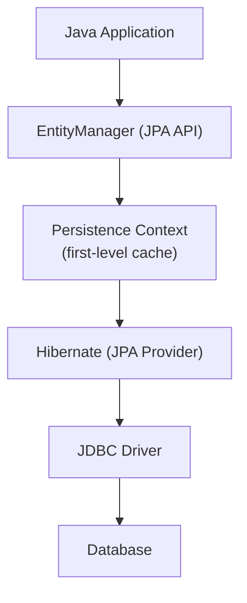
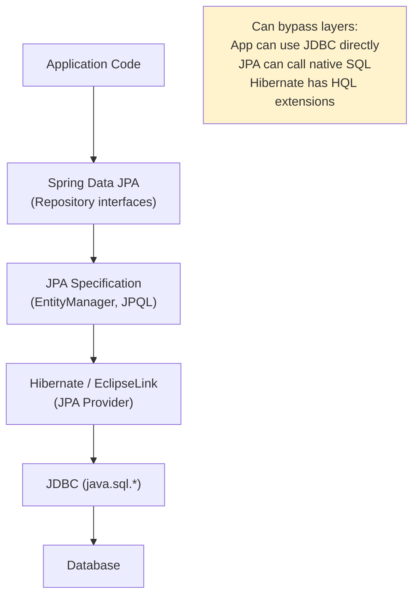
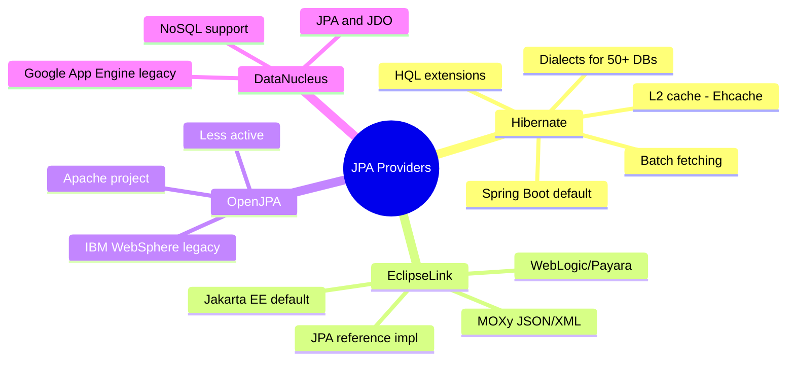

## Keywords in This File
{: .no_toc }

| # | Keyword | Weight |
|---|---|---|
| 1 | [JPA Overview and Purpose](#jpa-overview-and-purpose) | easy |
| 2 | [JPA vs JDBC vs Hibernate](#jpa-vs-jdbc-vs-hibernate) | easy |
| 3 | [JPA Provider Landscape](#jpa-provider-landscape) | easy |
| 4 | [Spring Data JPA vs JPA](#spring-data-jpa-vs-jpa) | easy |

---

# JPA Overview and Purpose

**Interview Weight:** easy - L0 orientation question.
Interviewers use this to verify baseline understanding
before deeper JPA questions.

---

### 🎯 Model Answer

**30 seconds:**

> JPA (Java Persistence API) is a Java specification
> for Object-Relational Mapping (ORM). It defines how
> Java objects map to database tables and how to perform
> CRUD operations on them without writing SQL for most
> operations. JPA is a specification; Hibernate is the
> most common implementation. In Spring applications,
> Spring Data JPA adds a repository abstraction on top
> of JPA's EntityManager.

**3 minutes (Senior):**

> JPA solves three problems:
> (1) Object-relational impedance mismatch: Java uses
> objects with inheritance; databases use tables with
> foreign keys. JPA bridges this with @Entity mappings,
> @OneToMany/@ManyToOne relationships, and inheritance
> strategies.
> (2) Repetitive CRUD code: without JPA, every entity
> needs SELECT, INSERT, UPDATE, DELETE SQL. JPA generates
> this from entity metadata.
> (3) Persistence context (first-level cache): JPA
> tracks changes to entities within a transaction and
> synchronizes them to the database automatically
> (dirty checking). No explicit UPDATE SQL required.
>
> Key JPA interfaces: EntityManagerFactory (app lifetime,
> thread-safe), EntityManager (per transaction,
> not thread-safe), EntityTransaction (in Java SE;
> managed by Spring in Java EE/Spring).

**Blank Mind Recovery:**

**(1) Restate:** "You are asking what JPA is and why
it exists."

**(2) First principles:** "Databases store rows and
columns; Java works with objects and classes. Translating
between these manually (JDBC, SQL) is tedious and
error-prone. JPA automates this translation."

**(3) Bridge:** "JPA is a translator between Java's
object world and the database's relational world. You
define the translation rules (mappings), and JPA
handles the SQL generation, result mapping, and
change tracking."

---

### 📘 Concept Explanation

```
JPA Architecture

  Java Application
  ┌─────────────────────────────────────────┐
  │  EntityManager  ← JPA API              │
  │       │                                 │
  │  Persistence Context (first-level cache)│
  │  { Order#1, Order#2, Customer#5 }       │
  └─────────────────────────────────────────┘
            │ SQL generation
  ┌─────────────────────────────────────────┐
  │  Hibernate (JPA Provider)               │
  │  → SELECT, INSERT, UPDATE, DELETE       │
  └─────────────────────────────────────────┘
            │ JDBC
  ┌─────────────────────────────────────────┐
  │  Database (PostgreSQL, MySQL, etc.)     │
  └─────────────────────────────────────────┘
```



> **Diagram walkthrough:** The application talks to
> the EntityManager (JPA standard API). The EntityManager
> maintains a Persistence Context - a cache of managed
> entities for the current transaction. Hibernate (the
> JPA provider) translates entity operations to SQL.
> JDBC sends SQL to the database. The layering means:
> switching from Hibernate to EclipseLink only requires
> changing the provider, not the application code.

---

### 💻 Code Example

```java
// BAD: JDBC for every entity operation
// Tedious, error-prone, SQL hardcoded per entity
@Service
public class OrderServiceJdbc {

    public Order findOrder(Long id) {
        String sql = "SELECT id, status, total "
            + "FROM orders WHERE id = ?";
        // Manual result mapping from ResultSet
        // Manual relationship loading (N+1)
        // Manual dirty tracking (compare old/new)
    }
}

// GOOD: JPA with EntityManager
@Service
@Transactional
public class OrderService {

    @PersistenceContext
    private EntityManager em;

    public Order findOrder(Long id) {
        return em.find(Order.class, id);
        // JPA generates: SELECT * FROM orders WHERE id=?
        // Maps result to Order object automatically
    }

    public void updateTotal(Long id, BigDecimal total) {
        Order order = em.find(Order.class, id);
        order.setTotal(total);
        // No explicit UPDATE needed!
        // JPA dirty-checks and generates UPDATE on commit
    }
}

// Entity mapping
@Entity
@Table(name = "orders")
public class Order {
    @Id
    @GeneratedValue(strategy = GenerationType.IDENTITY)
    private Long id;

    @Column(name = "status")
    private String status;

    private BigDecimal total;  // column name = field name
}
```

> **Code walkthrough:** The JDBC version requires manual
> SQL for every operation, manual result mapping, and
> explicit UPDATE tracking. The JPA version: em.find()
> generates SELECT automatically. The dirty checking
> means modifying order.setTotal() without calling any
> save/update method - JPA detects the change and
> generates UPDATE at transaction commit. This eliminates
> an entire category of boilerplate.

---

### 🎓 Answers by Seniority

**Junior:** "JPA is a Java specification for ORM. I
annotate my classes with @Entity and @Id, and JPA
handles the database operations. Hibernate is the
implementation I use with Spring Boot."

**Senior:** "JPA abstracts relational storage for Java
objects. Key benefit: dirty checking (no explicit
UPDATE calls). Key concern: implicit SQL generation
can cause N+1 issues if not careful. EntityManager
is the core API; Spring wraps it with @Transactional
and Spring Data JPA adds repositories on top."

**Staff:** "JPA is the right tool when your domain
model maps reasonably to relational tables (CRUD-
dominated, normalized data). It's the wrong tool for
read-heavy analytics queries, complex joins with
aggregation, or schema-as-data patterns. I evaluate
per service: some use JPA for the write path, JDBC
Templates or jOOQ for complex read queries."

---

### ⚠️ Common Misconceptions

**1. "JPA is the same as Hibernate"**

JPA is a specification (javax.persistence / jakarta.persistence
interfaces). Hibernate is an implementation of that
spec. Your code uses JPA interfaces (@Entity, EntityManager);
Hibernate provides the runtime behavior. Other providers:
EclipseLink, OpenJPA.

**2. "JPA eliminates the need to understand SQL"**

No. JPA generates SQL, but you must understand what
SQL it generates. N+1 problems, Cartesian product
fetches, and missing indexes are all JPA-generated SQL
problems that require SQL knowledge to diagnose.

---

### 🚨 Failure Modes and Diagnosis

**Failure: LazyInitializationException**

Symptom: "failed to lazily initialize a collection
of role" after the transaction closes.

Root cause: Accessing a lazy-loaded relationship
(e.g., order.getItems()) outside of a transaction
(after EntityManager is closed).

Diagnosis: Check where the exception is thrown.
Is it in a view layer? Is OSIV enabled/disabled?

Fix: Fetch required relationships in the service
layer (JOIN FETCH in JPQL). Or use a DTO projection
that only includes needed fields.

---

### 🎯 Interview Deep-Dive

| Experience | Time | Depth |
|---|---|---|
| Junior | 2 min | What JPA is, basic annotations |
| Senior | 5 min | Dirty checking, persistence context, use cases |

---

**[JUNIOR] Q1 - What is the difference between
EntityManager.persist() and EntityManager.merge()?**

*Why they ask:* Core JPA lifecycle understanding.

persist(): Takes a NEW (transient) entity and makes
it MANAGED. Schedules an INSERT. The entity must not
already have a database ID.

merge(): Takes a DETACHED entity (was managed, now
out of the persistence context) and merges its state
into the current persistence context. Returns a new
MANAGED copy. The original entity remains detached.

Common mistake: calling persist() on a detached entity
(already has an ID) - throws EntityExistsException.
Common mistake: using the original entity reference
after merge() (the returned value is the managed copy,
not the argument).

*What separates good from great:* Knowing that merge()
returns a NEW managed copy and the argument remains
detached.

**[SENIOR] Q2 - What is dirty checking and how does
JPA implement it?**

*Why they ask:* Reveals understanding of persistence
context internals.

Dirty checking: JPA tracks the state of managed entities.
At flush time (before query execution or transaction
commit), JPA compares each entity's current state
against the snapshot taken when it was loaded. If
different, JPA generates an UPDATE.

Implementation: Hibernate stores a snapshot (copy of
property values) per entity in the persistence context.
At flush, it compares current values to the snapshot.
Changed properties trigger an UPDATE.

Performance implication: Large persistence contexts
with many entities have expensive flush operations
(compare N entities). Solution: clear the persistence
context periodically in batch operations (em.clear()
every 50 entities).

*What separates good from great:* Knowing the snapshot
mechanism and its implication in batch operations.

**[SENIOR] Q3 - When would you choose NOT to use JPA?**

*Why they ask:* Judgment on tool applicability.

Cases where JPA is a poor choice:
1. Complex analytical queries with multiple aggregations,
   window functions, CTEs - JPQL is limited; use JDBC
   or jOOQ
2. Bulk operations (UPDATE 10,000 rows) - JPA loads
   each entity, dirty-checks each one. Use JPQL bulk
   update or JDBC for performance
3. Schema-as-data patterns (dynamic schema, EAV models)
4. Reporting/BI queries that join many tables with
   GROUP BY - raw SQL is clearer and faster
5. Time-series data or document stores - JPA maps to
   relational model only

*What separates good from great:* "I use JPA for the
write path and jOOQ/JDBC for complex reads in the
same service."

| Interviewer Type | Emphasis |
|---|---|
| Technical Panel | persist vs merge, dirty checking, lazy init. |
| Hiring Manager | JPA = faster development for standard CRUD. |
| Bar Raiser | When NOT to use JPA, performance implications. |
| Peer Engineer | "Understand what SQL JPA generates before you go to production." |

---

---

# JPA vs JDBC vs Hibernate

**Interview Weight:** easy - Comparison questions reveal
whether candidates understand the abstraction layers
and can choose the right tool.

---

### 🎯 Model Answer

**30 seconds:**

> JDBC is the low-level Java database API: raw SQL,
> manual result mapping, manual connection management.
> JPA is a higher-level specification: entity objects,
> automatic SQL generation, persistence context, lazy
> loading. Hibernate is the most popular JPA implementation,
> adding proprietary extensions on top of the JPA spec.
> Spring Data JPA adds a repository abstraction layer
> on top of JPA (or Hibernate directly), removing even
> more boilerplate with derived query methods and
> pagination.

**3 minutes (Senior):**

> Layer analysis:
>
> JDBC (java.sql.*):
> - Raw SQL strings in code
> - Manual ResultSet mapping
> - Manual transaction begin/commit/rollback
> - Full SQL control
> - Best for: complex queries, batch ops, performance-
>   critical reads
>
> JPA (jakarta.persistence.*):
> - Entity annotations define mappings
> - EntityManager API for CRUD
> - Persistence context tracks changes (dirty checking)
> - JPQL for object-oriented queries
> - Best for: standard CRUD on mapped entities
>
> Hibernate (org.hibernate.*):
> - JPA implementation + extensions
> - HQL (Hibernate Query Language, superset of JPQL)
> - Hibernate-specific features: @Filter, @Type,
>   batch fetching, 2nd-level cache
> - Tight coupling to Hibernate when using extensions
>
> Spring Data JPA (org.springframework.data.jpa.*):
> - Repository interfaces derived from method names
> - @Query for custom JPQL
> - Pagination built-in
> - Delegates to JPA/Hibernate underneath

**Blank Mind Recovery:**

**(1) Restate:** "You are asking about the abstraction
layers for database access in Java."

**(2) First principles:** "Each layer solves a different
problem. JDBC: communicate with any database via SQL.
JPA: map objects to tables automatically. Hibernate:
JPA plus extensions. Spring Data JPA: eliminate
repository boilerplate."

**(3) Bridge:** "Think of it as roads: JDBC is a dirt
road (works anywhere, full control). JPA is a paved
highway (faster, standard). Hibernate is the car
manufacturer (built on the highway standard, plus
proprietary features). Spring Data JPA is the GPS
(makes the drive even easier)."

---

### 📘 Concept Explanation

```
Abstraction Layers

Application Code
      ↓
Spring Data JPA   (repository abstraction)
      ↓
JPA Specification (EntityManager, JPQL)
      ↓
Hibernate         (JPA provider, + extensions)
      ↓
JDBC              (java.sql.Connection, Statement)
      ↓
Database Driver   (PostgreSQL, MySQL, H2)
      ↓
Database
```



> **Diagram walkthrough:** The layers are nested - each
> higher layer delegates to the one below it. You can
> bypass layers when needed: Spring Data JPA's @Query
> can run JPQL directly. JPA's createNativeQuery() runs
> raw SQL. Hibernate's Session can call stored procedures.
> Choose the right layer for the right operation rather
> than forcing everything through one layer.

---

### 🎓 Answers by Seniority

**Junior:** "JDBC is raw SQL, JPA is ORM, Hibernate
is the JPA implementation, Spring Data JPA adds
repositories. In Spring Boot, spring-data-jpa starter
includes all three."

**Senior:** "I think of them as tools for different
jobs. JPA for mapped entity CRUD. JDBC/jOOQ for complex
reporting queries. Spring Data JPA for standard repository
operations. I mix them: Spring Data JPA repositories
for write path, @Query with native SQL for complex
read queries."

**Staff:** "The abstraction leaks at scale. Hibernate's
session-level caching, OSIV, and flush strategies affect
performance in ways Spring Data JPA doesn't expose
clearly. I audit the generated SQL for every new query
in production services. I also separate the read model
from the write model (CQRS): write via JPA with entity
lifecycle, read via JDBC/jOOQ for projections."

---

### 🎯 Interview Deep-Dive

| Experience | Time | Depth |
|---|---|---|
| Junior | 3 min | Layer identification, use cases |
| Senior | 5 min | When to use each layer, mixing strategies |

---

**[JUNIOR] Q1 - What does Spring Data JPA add on top
of JPA?**

*Why they ask:* Common technology stack question.

Spring Data JPA adds:
1. **Repository interfaces**: define an interface
   extending JpaRepository<Entity, ID> - Spring Data
   generates the implementation at runtime.
2. **Query derivation**: findByLastNameAndStatus(
   String lastName, String status) - Spring Data
   generates JPQL from the method name.
3. **@Query annotation**: custom JPQL or native SQL
   inline with the repository method.
4. **Pagination support**: Page<T> and Pageable for
   automatic OFFSET/LIMIT queries.
5. **Auditing**: @CreatedDate, @LastModifiedBy
   automatically populated.
6. **Specifications**: type-safe dynamic queries via
   Specification<T> (Criteria API wrapper).

Spring Data JPA is purely boilerplate elimination.
It still uses JPA (EntityManager) underneath. Every
Spring Data operation eventually becomes JPA/Hibernate
calls.

*What separates good from great:* Knowing that Spring
Data JPA uses JPA underneath and the abstraction
doesn't change JPA behavior.

**[SENIOR] Q2 - When would you use plain JDBC instead
of JPA in a Spring application?**

*Why they ask:* Tool judgment.

Use JDBC (JdbcTemplate or jOOQ) when:
1. **Complex aggregation queries**: multiple GROUP BY,
   HAVING, window functions - JPQL is limited
2. **Bulk operations**: INSERT INTO...SELECT, UPDATE
   with WHERE clause on millions of rows - JPA loads
   each row into memory
3. **Reporting/analytics**: joins across many tables,
   calculated columns, not entity retrieval
4. **Performance-critical reads**: eliminate ORM overhead
   for high-throughput reads (millions/day)
5. **Stored procedures**: JPA can call them but awkwardly

Use case: "Write path uses JPA (entity lifecycle,
relationships). Read path for reports uses JdbcTemplate
with named parameters." This is the CQRS pattern applied
to persistence.

*What separates good from great:* Proposing the CQRS
pattern - JPA for writes, JDBC for reads.

| Interviewer Type | Emphasis |
|---|---|
| Technical Panel | Layer identification, trade-offs for each. |
| Hiring Manager | Right tool for the right job. |
| Bar Raiser | CQRS persistence, mixing layers, bulk ops. |
| Peer Engineer | "jOOQ is worth learning once you've hit the limits of JPQL." |

---

---

# JPA Provider Landscape

**Interview Weight:** easy - Demonstrates breadth of
ecosystem knowledge. Interviewers rarely deep-dive
but ask as context-setters.

---

### 🎯 Model Answer

**30 seconds:**

> The main JPA providers: Hibernate (dominant, default
> in Spring Boot), EclipseLink (JPA reference implementation,
> default in Jakarta EE), OpenJPA (Apache), DataNucleus
> (alternative with JDO support). Hibernate dominates
> in practice: deepest Spring integration, most community
> resources, widest database dialect support. EclipseLink
> is relevant in Jakarta EE/WebLogic environments.
> Choosing a non-Hibernate provider requires careful
> compatibility testing with Spring Data JPA.

**3 minutes (Senior):**

> Provider comparison:
>
> **Hibernate:**
> - Most used (>90% Spring Boot projects)
> - Best Spring Data JPA integration
> - Extensive dialect support (50+ databases)
> - Proprietary extensions: @Filter, @Type, batch
>   fetching, 2nd-level cache (Ehcache, Caffeine,
>   Hazelcast)
> - Active development, latest JPA spec compliance
>
> **EclipseLink:**
> - JPA reference implementation (spec authors)
> - Default in GlassFish, Payara, WebLogic
> - MOXy (XML/JSON binding), Redis L2 cache
> - Less Spring Boot integration by default
>
> **OpenJPA:**
> - Apache project
> - Used in IBM WebSphere historically
> - Less actively maintained
>
> **DataNucleus:**
> - Supports JPA + JDO + OGM
> - Can persist to non-relational stores
> - Popular in Google App Engine historically
>
> Switching providers: JPA spec compliance means
> standard annotations work on any provider. Non-standard
> features (Hibernate-specific annotations, batch
> fetching config) require provider-specific migration.

**Blank Mind Recovery:**

**(1) Restate:** "You are asking about the ecosystem
of JPA implementation libraries."

**(2) First principles:** "JPA is a specification.
Multiple vendors implement it. The market settled on
Hibernate as the dominant implementation due to early
adoption, Spring integration, and community size."

**(3) Bridge:** "JPA providers are like car engines:
all run on the same fuel (JPA spec), but some have
proprietary features (turbo, hybrid). Most drivers
use the dominant engine (Hibernate); the spec exists
to ensure portability if you stick to standard features."

---

### 📘 Concept Explanation

```
JPA Provider Market Share

Hibernate      ████████████████████  ~90%
EclipseLink    ███                   ~7%
OpenJPA        █                     ~2%
DataNucleus    <1%

Hibernate 6.x = JPA 3.1 (Jakarta)
Hibernate 5.x = JPA 2.2 (javax)
Spring Boot 3.x uses Hibernate 6.x (Jakarta)
Spring Boot 2.x uses Hibernate 5.x (javax)
```



> **Diagram walkthrough:** Hibernate's dominance is
> self-reinforcing: most tutorials, most Stack Overflow
> answers, most Spring Boot starters assume Hibernate.
> EclipseLink is the JPA specification's reference
> implementation, so it is most strictly spec-compliant,
> but Hibernate has become the de facto standard.
> In practice, the provider choice rarely matters for
> projects using standard JPA annotations.

---

### 🎓 Answers by Seniority

**Junior:** "Hibernate is the default JPA provider in
Spring Boot. You add spring-boot-starter-data-jpa and
get Hibernate automatically."

**Senior:** "Hibernate's proprietary features (batch
fetching, @Filter, 2nd-level cache) provide real
performance benefits in production. I use them
intentionally, accepting the Hibernate dependency.
If portability is required, I stick to JPA standard
annotations."

---

### 🎯 Interview Deep-Dive

| Experience | Time | Depth |
|---|---|---|
| Junior | 2 min | Name providers, identify default |
| Senior | 4 min | Hibernate features, portability trade-off |

---

**[JUNIOR] Q1 - What JPA provider does Spring Boot
use by default and how would you change it?**

*Why they ask:* Configuration awareness.

Spring Boot auto-configures Hibernate as the JPA
provider via spring-boot-starter-data-jpa. The starter
includes hibernate-core.

To change to EclipseLink:
1. Exclude hibernate-core from the starter
2. Add eclipselink dependency
3. Configure spring.jpa.properties for EclipseLink

```xml
<dependency>
    <groupId>org.springframework.boot</groupId>
    <artifactId>spring-boot-starter-data-jpa</artifactId>
    <exclusions>
        <exclusion>
            <groupId>org.hibernate.orm</groupId>
            <artifactId>hibernate-core</artifactId>
        </exclusion>
    </exclusions>
</dependency>
<dependency>
    <groupId>org.eclipse.persistence</groupId>
    <artifactId>eclipselink</artifactId>
</dependency>
```

In practice, almost no one changes the default. The
cost (lost Hibernate-specific optimizations, fewer
Spring Boot integration tests) is not worth the
portability gain.

*What separates good from great:* Knowing the practical
cost of switching and why teams rarely do it.

| Interviewer Type | Emphasis |
|---|---|
| Technical Panel | Hibernate as default, proprietary extensions. |
| Hiring Manager | Ecosystem knowledge shows experience. |
| Bar Raiser | Provider portability trade-offs, javax vs jakarta migration. |
| Peer Engineer | "The javax to jakarta migration in Spring Boot 3 was the hidden cost of staying on an old Hibernate." |

---

---

# Spring Data JPA vs JPA

**Interview Weight:** easy - Very common interview
opener. Distinguishing the abstraction layers clarifies
that candidates understand what Spring Data JPA actually
does.

---

### 🎯 Model Answer

**30 seconds:**

> JPA is the Java specification for object-relational
> mapping: EntityManager API, @Entity annotations, JPQL.
> Spring Data JPA is a Spring project that sits ON TOP
> of JPA and adds a repository abstraction. You define
> an interface extending JpaRepository<Order, Long>,
> and Spring Data generates the implementation using
> JPA's EntityManager under the hood. Spring Data JPA
> eliminates manual CRUD and query boilerplate; JPA
> is the persistence layer it delegates to.

**3 minutes (Senior):**

> Spring Data JPA vs raw JPA differences:
>
> With raw JPA (EntityManager):
> - Inject @PersistenceContext EntityManager em
> - Call em.find(), em.persist(), em.createQuery()
> - Manual pagination: em.createQuery().setFirstResult()
>   .setMaxResults()
> - Manual transaction management or @Transactional
>
> With Spring Data JPA:
> - Define interface: public interface OrderRepo
>   extends JpaRepository<Order, Long>
> - Free methods: findById(), save(), findAll()
> - Derived queries: findByStatusAndCustomerId()
> - @Query for custom JPQL
> - Pageable parameter for automatic pagination
> - Spring Data generates implementation at runtime
>
> Both use the same EntityManager underneath.
> Spring Data JPA is purely a productivity layer,
> not a different persistence mechanism.
>
> When to use raw EntityManager instead of Spring
> Data JPA: complex dynamic queries (Criteria API
> directly), bulk operations, streaming results
> (Stream<T>), or when Spring Data JPA's abstraction
> hides SQL generation you need to control.

**Blank Mind Recovery:**

**(1) Restate:** "You are asking the difference between
the JPA specification API and Spring's repository
abstraction."

**(2) First principles:** "JPA provides the persistence
primitives. Spring Data JPA adds a convention-over-
configuration layer that generates common repository
operations from interface definitions."

**(3) Bridge:** "JPA is the database driver; Spring
Data JPA is the GPS that knows common routes. You
can always go off-GPS (raw EntityManager) when needed."

---

### 📘 Concept Explanation

```java
// Raw JPA (EntityManager directly)
@Repository
public class OrderRepositoryJpa {

    @PersistenceContext
    private EntityManager em;

    public Optional<Order> findById(Long id) {
        return Optional.ofNullable(
            em.find(Order.class, id));
    }

    public List<Order> findByStatus(String status) {
        return em.createQuery(
            "SELECT o FROM Order o "
            + "WHERE o.status = :status",
            Order.class)
            .setParameter("status", status)
            .getResultList();
    }

    public void save(Order order) {
        if (order.getId() == null) {
            em.persist(order);
        } else {
            em.merge(order);
        }
    }
}

// Spring Data JPA (repository interface)
public interface OrderRepository
        extends JpaRepository<Order, Long> {

    List<Order> findByStatus(String status);
    // ↑ Spring Data generates the query
    // "SELECT o FROM Order o WHERE o.status = ?"

    @Query("SELECT o FROM Order o "
        + "WHERE o.customerId = :id "
        + "AND o.total > :min")
    List<Order> findLargeOrdersByCustomer(
        @Param("id") Long customerId,
        @Param("min") BigDecimal minTotal);
}
```

> **Code walkthrough:** The raw JPA version requires
> explicit EntityManager calls, manual persist-vs-merge
> logic, and manual result mapping. The Spring Data JPA
> version is an interface - Spring Data generates the
> implementation at runtime by reading the method name
> (findByStatus → WHERE status = ?) and @Query annotations.
> Both use the same EntityManager underneath; Spring
> Data JPA just generates the boilerplate code.

---

### 🎓 Answers by Seniority

**Junior:** "Spring Data JPA adds repository interfaces
on top of JPA. I extend JpaRepository and get save,
findById, findAll for free. I can also add custom
methods with @Query."

**Senior:** "Spring Data JPA is a code generator that
uses JPA under the hood. Method names become JPQL.
I use it for standard CRUD and common queries. For
complex analytics, I fall back to EntityManager directly
or use @Query with native SQL. Both approaches work
side by side in the same application."

**Staff:** "Spring Data JPA's query derivation is
powerful but hides complexity. Method names longer
than 5 words become unmaintainable. I limit derived
queries to simple finds; complex queries get @Query
with named parameters. I also use Querydsl or Spring
Data JPA Specifications for type-safe dynamic queries
instead of string-based JPQL concatenation."

---

### ⚠️ Common Misconceptions

**1. "Spring Data JPA replaces Hibernate"**

No. Spring Data JPA uses Hibernate (or another JPA
provider) underneath. It's an abstraction OVER JPA/Hibernate,
not an alternative. Hibernate still executes all queries.

**2. "Spring Data JPA's save() is always safe"**

No. save() calls persist() for new entities and merge()
for detached ones. merge() copies state from the
detached entity to a new managed instance - the original
object is NOT the managed one. Code that does
someObject = repo.save(someObject) is correct;
code that uses the original reference after save()
may be stale.

---

### 🎯 Interview Deep-Dive

| Experience | Time | Depth |
|---|---|---|
| Junior | 3 min | What Spring Data adds, method naming |
| Senior | 5 min | When to bypass Spring Data, save() semantics |

---

**[JUNIOR] Q1 - What happens if you define a method
findByNonExistentField() in a Spring Data JPA repository?**

*Why they ask:* Tests understanding of Spring Data
JPA startup validation.

Spring Data JPA validates derived query methods at
application startup. It parses the method name and
maps each part to entity properties. If the field
does not exist on the entity, Spring throws:
PropertyReferenceException: No property 'nonExistentField'
found for type 'Order'.

The application fails to start. This is a GOOD property -
it catches typos and renamed properties at startup,
not at runtime when the query executes.

*What separates good from great:* Knowing it fails at
startup (ApplicationContext creation), not at query
execution time.

**[SENIOR] Q2 - What is the risk of long method names
in Spring Data JPA repositories?**

*Why they ask:* Practical experience with Spring Data JPA.

Long method names like:
findByCustomerIdAndStatusAndTotalGreaterThanOrderByCreatedAtDesc()

Problems:
1. Unmaintainable: method name changes if entity
   property renames (refactoring coupling)
2. No limit on query complexity: JPQL can have multiple
   JOINs, but the method name becomes unreadable
3. No JPQL review: the query is implicit in the name;
   harder to review SQL performance
4. Refactoring cascade: rename an entity field →
   must rename all method names that reference it

Better alternatives for complex queries:
- @Query with explicit JPQL (reviewable, controllable)
- Querydsl (type-safe, refactoring-safe)
- Spring Data Specifications (composable predicates)

*What separates good from great:* Naming the refactoring
cascade problem as the key risk.

| Interviewer Type | Emphasis |
|---|---|
| Technical Panel | What Spring Data generates, method derivation, @Query. |
| Hiring Manager | Spring Data JPA = faster development. |
| Bar Raiser | Long method name trade-offs, Querydsl alternative, save() semantics. |
| Peer Engineer | "Every findByThis...And...OrderBy method is a query waiting to go wrong at 3am." |
