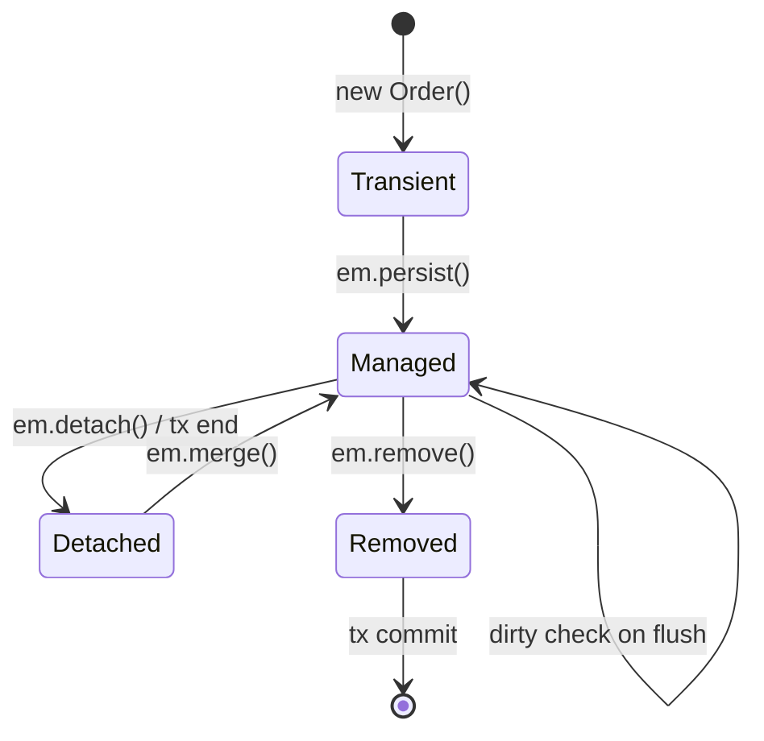
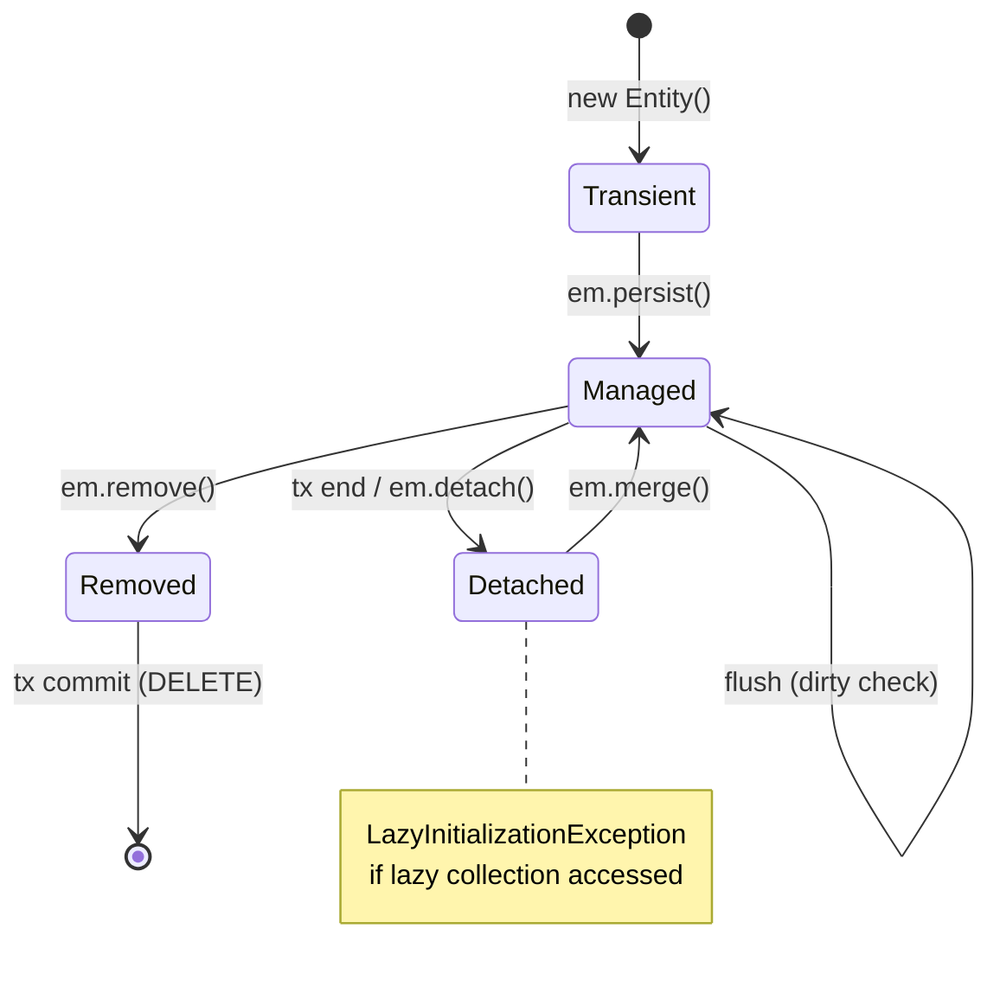

# EntityManager and Persistence Context

**Interview Weight:** critical - The persistence context
is the central concept in JPA. Every JPA question
about identity, dirty checking, lazy loading, and
transactions connects back to this concept.

---

### 🎯 Model Answer

**30 seconds:**

> EntityManager is the JPA API for persisting, finding,
> and querying entities. The persistence context is the
> set of managed entity instances it tracks. Think of
> it as a first-level cache: once you load an entity
> by ID, subsequent finds in the same transaction
> return the same Java instance (identity guarantee).
> When the transaction commits, the persistence context
> flushes changes (dirty checking) and closes.

**3 minutes (Senior):**

> Persistence context lifecycle:
> - **Scope**: one persistence context per EntityManager
>   per transaction (default TRANSACTION scope)
> - **Managed entities**: loaded entities are tracked;
>   changes are automatically detected and flushed
> - **Identity guarantee**: em.find(Order.class, 1L)
>   called twice in the same PC returns the same Java
>   object (==), not just equal objects
> - **Flush**: synchronized to DB before query execution
>   or on explicit em.flush(); committed at
>   transaction end
> - **Clear**: em.clear() detaches all entities;
>   needed for long batch operations
>
> EntityManagerFactory (EMF):
> - Thread-safe, expensive to create, application-scoped
> - One per persistence unit (data source)
>
> EntityManager (EM):
> - NOT thread-safe, cheap to create, transaction-scoped
> - In Spring: injected via @PersistenceContext, Spring
>   manages lifecycle
>
> Extended persistence context: spans multiple transactions
> (stateful session bean in EJB; rare in Spring).
> TRANSACTION scope is the default and recommended.

**Blank Mind Recovery:**

**(1) Restate:** "You are asking about the EntityManager
API and the persistence context that backs it."

**(2) First principles:** "The persistence context is
a unit of work container. While it is open, it owns
the entity instances. When it closes (transaction end),
entities become detached and are no longer tracked."

**(3) Bridge:** "Persistence context is like a whiteboard
per transaction: entities you work with are written
on the board. At commit, everything on the board gets
saved to the database. After commit, the board is
erased (entities are detached)."

---

### 📘 Concept Explanation

```
Persistence Context Lifecycle

Transaction Start
│
│  em.find(Order.class, 1L)
│  → DB: SELECT * FROM orders WHERE id=1
│  → Add Order#1 to persistence context (managed)
│  → Snapshot: {id=1, status='NEW', total=100}
│
│  order.setStatus("PAID")   ← change tracked
│
│  em.find(Order.class, 1L)  ← returns same instance!
│  → DB: no query (cache hit)
│
│  Transaction Commit
│  → Dirty check: status changed → generate UPDATE
│  → SQL: UPDATE orders SET status='PAID' WHERE id=1
│  → Persistence context cleared
│  → Order#1 becomes DETACHED
Transaction End
```



> **Diagram walkthrough:** Entity state transitions
> follow strict rules. New objects (Transient) become
> Managed via persist(). Managed entities are tracked
> by the persistence context: changes detected at flush.
> At transaction end, managed entities become Detached
> (still in memory, not tracked). Merge() reattaches
> a detached entity by creating a new managed copy.
> Removed entities are deleted at commit.

---

### 💻 Code Example

```java
// BAD: misunderstanding persistence context scope
@Service
public class OrderServiceBad {

    @PersistenceContext(
        type = PersistenceContextType.EXTENDED)
    private EntityManager em;
    // EXTENDED scope: persists across transactions
    // Accumulates entities, grows unboundedly
    // Memory leak in long-lived beans

    public void processMany() {
        for (int i = 0; i < 10000; i++) {
            Order o = new Order("NEW");
            em.persist(o);
            // All 10,000 in PC = OOM
        }
    }
}

// GOOD: TRANSACTION scope, clear for batch
@Service
@Transactional
public class OrderService {

    @PersistenceContext
    private EntityManager em;
    // Default TRANSACTION scope: cleared at tx end

    public void processBatch(List<OrderData> data) {
        for (int i = 0; i < data.size(); i++) {
            Order o = new Order(data.get(i));
            em.persist(o);
            if (i % 50 == 0) {
                em.flush();   // write to DB
                em.clear();   // free memory
                // Prevents OutOfMemoryError in
                // large batches
            }
        }
    }
}
```

> **Code walkthrough:** The BAD version uses EXTENDED
> scope, which keeps all persisted entities in memory
> across multiple transactions. For any long-running
> operation, this causes OutOfMemoryError. The GOOD
> version uses TRANSACTION scope (default) and calls
> flush() + clear() every 50 entities in a batch,
> releasing memory while writing to the database. This
> is the standard pattern for large bulk inserts.

---

### 🎓 Answers by Seniority

**Junior:** "EntityManager is the JPA API to save and
find entities. The persistence context is the cache it
uses. When I load an entity, changes to it are
automatically saved when the transaction commits."

**Senior:** "Persistence context is a unit-of-work
container. Identity guarantee: same entity in same
PC is the same Java instance. Dirty checking: JPA
snapshots state at load, compares at flush, generates
UPDATE for changes. Clear the PC periodically in
batch operations to avoid memory issues."

**Staff:** "TRANSACTION scope is the only safe default
for stateless Spring services. EXTENDED scope is a
trap: entities accumulate, memory grows, and
LazyInitializationExceptions disappear (because the
PC stays open) masking architecture issues. I review
any use of EXTENDED scope in code review."

---

### ⚠️ Common Misconceptions

**1. "em.persist() immediately executes INSERT"**

No. persist() makes the entity managed (adds to
persistence context). The INSERT is executed at flush
time (before a query in the same transaction, or at
commit). To force immediate execution: em.flush().

**2. "Calling em.find() twice runs two SELECT queries"**

No. The second find() for the same ID in the same
persistence context returns the cached managed entity
without a database query. Identity guarantee: same
instance, no SQL.

---

### 🚨 Failure Modes and Diagnosis

**Failure: OutOfMemoryError in batch processing**

Symptom: OOM in a loop that processes thousands of
entities with em.persist().

Root cause: All persisted entities accumulate in the
persistence context, consuming memory.

Diagnosis: Thread dump shows memory in persistence
context. Heap dump shows many entity instances.

Fix:
```java
for (int i = 0; i < data.size(); i++) {
    em.persist(new Order(data.get(i)));
    if (i % 50 == 49) {
        em.flush();
        em.clear();
    }
}
```

---

### 🎯 Interview Deep-Dive

| Experience | Time | Depth |
|---|---|---|
| Junior | 3 min | PC scope, dirty checking, flush |
| Senior | 6 min | Identity guarantee, batch handling, EXTENDED vs TRANSACTION |

---

**[SENIOR] Q1 - What is the difference between
em.flush() and transaction commit?**

*Why they ask:* Flush timing is a subtle but important
JPA concept.

em.flush(): Synchronizes the persistence context to
the database by executing pending INSERT/UPDATE/DELETE
SQL. The transaction is STILL OPEN. The changes are
visible to subsequent queries in the same transaction
but NOT visible to other transactions (unless isolation
is READ_UNCOMMITTED, which is rare).

Transaction commit: After commit, changes are durable
and visible to other transactions (based on isolation
level). Flush happens automatically before commit if
FlushMode is AUTO (default).

When explicit flush matters:
- Before a JPQL query in the same transaction that
  needs to see recent changes
- Before calling a native query that won't trigger
  automatic flush
- In batch processing (flush every N records)

*What separates good from great:* Knowing that flush()
is within-transaction visibility, while commit is
cross-transaction durability.

**[SENIOR] Q2 - What happens when you inject EntityManager
with @PersistenceContext in a singleton Spring bean?**

*Why they ask:* Thread-safety of EntityManager.

EntityManager is NOT thread-safe. A singleton Spring
bean (e.g., @Service) is shared across all threads.
If you inject a real EntityManager, concurrent requests
would share it - race conditions, corrupted persistence
context.

Spring's solution: @PersistenceContext injects a
PROXY EntityManager, not a real one. The proxy delegates
to a thread-local EntityManager bound to the current
transaction. Each request gets its own EntityManager
through the proxy. This is why the seemingly non-thread-
safe injection is actually safe in Spring.

*What separates good from great:* Knowing the proxy
mechanism that makes @PersistenceContext thread-safe.

| Interviewer Type | Emphasis |
|---|---|
| Technical Panel | PC lifecycle, flush vs commit, identity guarantee. |
| Hiring Manager | Understanding persistence context prevents data bugs. |
| Bar Raiser | EXTENDED vs TRANSACTION scope, @PersistenceContext proxy, batch flush/clear. |
| Peer Engineer | "The @PersistenceContext proxy is one of Spring's best-kept secrets. Most devs don't know it's a proxy." |

---

---

# Entity Annotations @Entity @Id @Column

**Interview Weight:** easy - Core annotations tested
in every JPA interview. Interviewers check depth beyond
the basics (@GeneratedValue strategies, @Column constraints).

---

### 🎯 Model Answer

**30 seconds:**

> @Entity marks a class as a JPA-managed entity mapping
> to a database table. @Id designates the primary key
> field. @GeneratedValue specifies how the PK is
> generated (IDENTITY for database auto-increment,
> SEQUENCE for database sequences, TABLE for portable
> but slow sequence simulation). @Column customizes
> the column name, nullability, and uniqueness. @Table
> sets the table name and can define unique constraints
> and indexes.

**3 minutes (Senior):**

> Core entity annotations:
>
> @Entity: marks class for persistence. Requires no-arg
> constructor (private acceptable). Class must not be
> final (Hibernate needs to subclass for proxies).
>
> @Id: marks primary key. Can be on field or getter
> (determines "access type" for all mappings).
>
> @GeneratedValue strategies:
> - IDENTITY: DB auto_increment/SERIAL. SQL: INSERT
>   first, DB assigns ID. Cannot batch INSERT (ID
>   unknown before insert). Use with MySQL, PostgreSQL.
> - SEQUENCE: DB sequence. JPA pre-allocates IDs (allocationSize).
>   Allows batch INSERT. Best for performance. PostgreSQL,
>   Oracle.
> - TABLE: portable across all DBs. Uses a special
>   table for ID generation. Slow (UPDATE then SELECT
>   per allocation). Avoid in production.
> - AUTO: JPA picks based on DB. Usually SEQUENCE for
>   modern DBs.
>
> @Column(name, nullable, unique, length):
> - name: column name (default = field name)
> - nullable = false: DDL NOT NULL constraint
> - unique = true: DDL UNIQUE constraint (per column)
> - length: VARCHAR length (default 255)
>
> @Table(name, uniqueConstraints, indexes):
> - uniqueConstraints: compound unique constraints
> - indexes: DDL index definitions

**Blank Mind Recovery:**

**(1) Restate:** "You are asking about the core JPA
mapping annotations."

**(2) First principles:** "Every entity needs: what
table (class name → table name, @Table to override),
what primary key (@Id, @GeneratedValue), how columns
map (@Column for customization)."

**(3) Bridge:** "Annotations are the translation
dictionary: @Entity says 'this class is a database
table', @Id says 'this field is the primary key', @Column
says 'this field maps to this column with these
constraints'."

---

### 💻 Code Example

```java
// BAD: common annotation mistakes
@Entity
public final class Order {        // BAD: final class
    @Id                           // BAD: no @GeneratedValue
    public Long id;               // BAD: public field

    @Column                       // BAD: no length on String
    public String customerName;   // BAD: no nullable=false

    // BAD: no no-arg constructor
    public Order(String customer) {
        this.customerName = customer;
    }
}

// GOOD: proper entity mapping
@Entity
@Table(name = "orders",
       uniqueConstraints = @UniqueConstraint(
           columnNames = {"order_number"}),
       indexes = @Index(
           columnList = "customer_id,created_at"))
public class Order {

    @Id
    @GeneratedValue(strategy = GenerationType.SEQUENCE,
                    generator = "order_seq")
    @SequenceGenerator(
        name = "order_seq",
        sequenceName = "orders_seq",
        allocationSize = 50)  // pre-allocate 50 IDs
    private Long id;

    @Column(name = "order_number",
            nullable = false, length = 30)
    private String orderNumber;

    @Column(nullable = false)
    private BigDecimal total;

    @Column(name = "customer_id", nullable = false)
    private Long customerId;

    protected Order() { }          // for JPA

    public Order(String num, BigDecimal total,
                 Long custId) {
        this.orderNumber = num;
        this.total = total;
        this.customerId = custId;
    }
    // getters only
}
```

> **Code walkthrough:** The BAD version has four problems:
> final class (Hibernate can't create a CGLIB proxy
> for lazy loading), public field access (convention
> is private), no @GeneratedValue (manual ID management),
> and missing no-arg constructor (JPA requirement for
> instantiation). The GOOD version uses SEQUENCE with
> allocationSize=50 (pre-allocates 50 IDs per DB call,
> enabling batch inserts), proper column constraints,
> compound index at the table level, and a protected
> no-arg constructor for JPA.

---

### 🎓 Answers by Seniority

**Junior:** "@Entity marks the class, @Id marks the PK,
@GeneratedValue auto-generates IDs, @Column customizes
column name and constraints."

**Senior:** "@GeneratedValue SEQUENCE with allocationSize
is the high-performance choice: pre-allocates IDs,
enables batch INSERTs. IDENTITY forces single INSERT
per batch item (ID unknown before insert). Always set
nullable=false for required columns - DDL constraint
catches bugs at schema level."

---

### 🎯 Interview Deep-Dive

| Experience | Time | Depth |
|---|---|---|
| Junior | 3 min | Core annotations, @GeneratedValue options |
| Senior | 5 min | IDENTITY vs SEQUENCE performance, batch implications |

---

**[SENIOR] Q1 - Why can't you use @GeneratedValue
IDENTITY strategy with batch inserts?**

*Why they ask:* Tests understanding of ID generation
and JDBC batch mechanics.

With IDENTITY strategy, the database generates the ID
on INSERT. JPA must execute the INSERT immediately
to get the generated ID back (JDBC: getGeneratedKeys()).
JPA needs the ID to add the entity to the persistence
context and maintain identity.

JDBC batch inserts require grouping multiple INSERT
statements into one batch call. But with IDENTITY,
each INSERT must be executed individually (to get the
ID back), breaking batching.

Hibernate's spring.jpa.properties.hibernate.jdbc.batch_size
setting has no effect with IDENTITY strategy.

Fix: Use SEQUENCE strategy with allocationSize > 1.
JPA pre-fetches a range of IDs from the sequence, can
assign IDs before INSERT, and batches inserts.

*What separates good from great:* Explaining the JDBC
getGeneratedKeys() coupling that prevents batching.

| Interviewer Type | Emphasis |
|---|---|
| Technical Panel | @GeneratedValue strategies, no-arg constructor requirement. |
| Hiring Manager | Correct annotations prevent data integrity bugs. |
| Bar Raiser | IDENTITY vs SEQUENCE performance, batch implications, DDL generation. |
| Peer Engineer | "I switched from IDENTITY to SEQUENCE for a high-write service and got 3x insert throughput. allocationSize=50 is the magic number to tune." |

---

---

# Entity Lifecycle States

**Interview Weight:** medium - Lifecycle state questions
appear in intermediate JPA interviews. Candidates who
understand states can explain detached entity issues,
LazyInitializationException, and merge() semantics.

---

### 🎯 Model Answer

**30 seconds:**

> JPA entities have four lifecycle states: Transient
> (new object, not known to JPA), Managed (in the
> persistence context, changes tracked), Detached (was
> managed, transaction ended or explicitly detached,
> still in memory but not tracked), Removed (marked
> for deletion, DELETE pending at commit). The
> LazyInitializationException occurs when accessing
> a lazy collection on a Detached entity - the persistence
> context is closed and cannot load the data.

**3 minutes (Senior):**

> Lifecycle state transitions:
>
> **Transient → Managed:** em.persist(entity)
> Schedules INSERT. Entity added to persistence context.
>
> **Managed → Detached:** transaction end, em.detach(e),
> em.clear()
> Entity removed from persistence context. No longer
> tracked. Modifying it has no effect on DB.
>
> **Managed → Removed:** em.remove(entity)
> Schedules DELETE at flush/commit.
>
> **Detached → Managed:** em.merge(detachedEntity)
> Creates a NEW managed copy from the detached entity's
> state. Returns the managed copy. Original remains
> detached. JPA: if entity already in PC, merge() copies
> state into existing managed instance.
>
> **Practical implications:**
> - Entities returned from a @Transactional method
>   are DETACHED (transaction ended). Caller cannot
>   lazily load relationships.
> - To pass entities across transaction boundaries
>   safely: use DTOs (not entities) as method return
>   values.
> - Hibernate proxies for lazy relationships: accessing
>   proxy.getField() on a detached entity throws
>   LazyInitializationException.

**Blank Mind Recovery:**

**(1) Restate:** "You are asking about the four states
a JPA entity can be in during its lifecycle."

**(2) First principles:** "The persistence context has
a scope. Within scope: entity is managed (tracked).
Outside scope: entity is detached (free-floating Java
object, no JPA tracking). The transition between these
states is what causes most JPA bugs."

**(3) Bridge:** "Think of the persistence context as
a room. Managed entities are inside the room (watched,
tracked). Detached entities have left the room (free,
but any changes are not tracked). Transient entities
haven't entered the room yet."

---

### 📘 Concept Explanation

```
Entity Lifecycle State Machine

     new Order()
          │
      TRANSIENT (not in PC)
          │
     em.persist()
          │
       MANAGED  ←─── em.merge(detached)
          │  │
 em.remove() │ tx end / em.detach() / em.clear()
          │  │
       REMOVED  DETACHED
          │
     tx commit
          │
       [GONE from DB]     [still in memory, untracked]
```



> **Diagram walkthrough:** Every entity starts as
> Transient (just a Java object). After persist(), it
> enters the persistence context as Managed. After the
> transaction ends, it becomes Detached - changes to
> it won't be tracked. This is the most common bug
> source: code receives a Detached entity, modifies it,
> expects the change to be saved, but nothing happens.
> em.merge() is the bridge back to Managed state.

---

### 💻 Code Example

```java
// BAD: using detached entity directly
@Service
public class OrderServiceBad {

    @Transactional
    public Order findOrder(Long id) {
        return em.find(Order.class, id);
        // Returns managed entity DURING transaction.
        // After @Transactional method returns:
        // → entity is DETACHED
    }

    public void updateStatus(Long id) {
        Order order = findOrder(id);  // DETACHED
        order.setStatus("PAID");
        // Setting status on a detached entity.
        // No transaction, not in any PC.
        // This change WILL NOT BE SAVED!
    }
}

// GOOD: keep operations within transaction scope
@Service
@Transactional
public class OrderService {

    public void updateStatus(Long id, String status) {
        // find and update in same transaction
        Order order = em.find(Order.class, id);
        order.setStatus(status);
        // Dirty checking at commit = UPDATE generated
    }

    // For returning data: use DTOs, not entities
    public OrderDto getOrderDto(Long id) {
        Order order = em.find(Order.class, id);
        return new OrderDto(
            order.getId(),
            order.getStatus(),
            order.getTotal());
        // DTO has no lazy collections = safe to return
    }
}
```

> **Code walkthrough:** The BAD version has two separate
> methods: findOrder() returns a detached entity (the
> @Transactional method ended). updateStatus() modifies
> the detached entity, but there's no active transaction,
> so no flush occurs and no UPDATE is generated. The
> change is silently lost. The GOOD version keeps find
> and update in the SAME transaction. The DTO pattern
> is shown as the safe alternative for returning data
> to callers who shouldn't work with entities directly.

---

### ⚖️ Comparison Table

| State | In Persistence Context | Tracked for changes | SQL at flush | When |
|---|---|---|---|---|
| Transient | No | No | None | After new Object() |
| Managed | Yes | Yes | INSERT/UPDATE/DELETE | After persist() or find() |
| Detached | No | No | None | After tx end, detach(), clear() |
| Removed | Yes | N/A | DELETE | After em.remove() |

---

### 🎓 Answers by Seniority

**Junior:** "Four states: Transient, Managed, Detached,
Removed. An entity starts transient, becomes managed
after persist(), becomes detached after the transaction
ends. If you change a detached entity, nothing happens
in the database."

**Senior:** "Detached entities are the source of most
JPA bugs: lazy initialization exceptions, silent change
loss. My rule: never return entity objects from
@Transactional methods. Return DTOs. This prevents
callers from accidentally working with detached entities
and triggering LazyInitializationException on lazy
collections."

---

### 🚨 Failure Modes and Diagnosis

**Failure: Changes to entity silently not saved**

Symptom: Code modifies an entity, no exception, but
the database is unchanged.

Root cause: Entity is DETACHED (outside transaction
scope). Changes are not tracked.

Diagnosis: Check if the modification happens outside
a @Transactional method. Add em.contains(entity) to
verify: returns false for detached entities.

Fix: Either wrap the find+modify in a single @Transactional
method, or call em.merge(entity) to reattach before
the transaction ends.

---

### 🎯 Interview Deep-Dive

| Experience | Time | Depth |
|---|---|---|
| Junior | 3 min | Four states, transitions |
| Senior | 6 min | Detached entity bugs, DTO pattern, merge semantics |

---

**[SENIOR] Q1 - What exactly happens when you call
em.merge() on a detached entity?**

*Why they ask:* merge() semantics are often misunderstood.

em.merge(detachedEntity) does the following:
1. Checks if an entity with the same ID is already in
   the persistence context (managed). If yes, copies
   the detached entity's state into the managed one.
   Returns the managed one.
2. If not in PC, loads the entity from the DB (SELECT).
   Copies detached entity's state into the freshly
   loaded managed one. Returns the managed one.
3. If not in DB (new entity without ID or with unknown
   ID): inserts as new entity.

Key points:
- The argument to merge() is NOT made managed. The
  RETURN VALUE is the managed copy.
- Bug pattern: Order merged = em.merge(order); // merged is managed, order is still detached
- Using order after merge (wrong reference) is a common mistake.
- One SELECT per merge() call (if not already in PC).
  Expensive in loops. Prefer persist() for new entities.

*What separates good from great:* Knowing the "return
value is the managed copy" distinction.

| Interviewer Type | Emphasis |
|---|---|
| Technical Panel | State transitions, merge() semantics, detached entity bugs. |
| Hiring Manager | Lifecycle knowledge prevents silent data loss bugs. |
| Bar Raiser | DTO pattern for cross-boundary safety, em.contains() for debugging. |
| Peer Engineer | "The 'change not saved' bug is always a detached entity. Check if you're outside a transaction." |

---

---

# JPQL Basics

**Interview Weight:** easy - JPQL is JPA's query
language. Tested in every JPA interview as the
alternative to SQL for entity-based queries.

---

### 🎯 Model Answer

**30 seconds:**

> JPQL (Java Persistence Query Language) is JPA's
> object-oriented query language. It queries entities
> and their properties rather than tables and columns.
> SELECT o FROM Order o WHERE o.status = 'PAID' queries
> the Order entity, not the orders table. JPA translates
> JPQL to SQL for the specific database. Key difference
> from SQL: entity names (case-sensitive) and field
> names, not table and column names.

**3 minutes (Senior):**

> JPQL features:
> - SELECT, FROM, WHERE, GROUP BY, HAVING, ORDER BY
> - Navigation paths: o.customer.address.city
>   (traverses relationships)
> - Named parameters: :name, or positional ?1
> - JOIN FETCH: eager-load relationships in the query
>   to avoid N+1: SELECT o FROM Order o
>   JOIN FETCH o.items WHERE o.id = :id
> - Aggregate functions: COUNT, SUM, AVG, MIN, MAX
> - Subqueries: WHERE o.total > (SELECT AVG...)
> - Constructor expressions: NEW OrderDto(o.id, o.total)
>   to return DTOs directly
>
> JPQL limits:
> - No INSERT via JPQL (use em.persist())
> - Limited subquery support (no FROM clause subquery)
> - No window functions, CTEs, or complex analytics
> - Bulk UPDATE/DELETE: JPQL UPDATE/DELETE bypasses
>   persistence context (use with caution, stale managed
>   entities after bulk update)

**Blank Mind Recovery:**

**(1) Restate:** "You are asking about JPQL, JPA's
built-in query language."

**(2) First principles:** "JPA maps objects to tables.
JPQL queries the object model. JPA translates to SQL.
This means the same JPQL works across PostgreSQL, MySQL,
Oracle - JPA generates the appropriate SQL dialect."

**(3) Bridge:** "JPQL is to JPA what SQL is to databases,
but translated into the object language. Instead of
'FROM orders' you write 'FROM Order o' (the class name).
Instead of 'orders.customer_id' you write 'o.customer.id'
(navigating the object graph)."

---

### 💻 Code Example

```java
// BAD: SQL instead of JPQL, then manual mapping
List<Map> results = em.createNativeQuery(
    "SELECT id, status FROM orders "
    + "WHERE customer_id = " + customerId)
    // SQL injection risk!
    .getResultList();

// GOOD: JPQL with named parameters
List<Order> orders = em.createQuery(
    "SELECT o FROM Order o "
    + "WHERE o.customerId = :cid "
    + "ORDER BY o.createdAt DESC",
    Order.class)
    .setParameter("cid", customerId)
    .setMaxResults(20)
    .getResultList();

// GOOD: JOIN FETCH to avoid N+1
Order order = em.createQuery(
    "SELECT o FROM Order o "
    + "JOIN FETCH o.items "
    + "WHERE o.id = :id",
    Order.class)
    .setParameter("id", orderId)
    .getSingleResult();

// GOOD: DTO projection via constructor expression
List<OrderSummaryDto> summaries = em.createQuery(
    "SELECT NEW com.example.OrderSummaryDto("
    + "o.id, o.status, o.total) "
    + "FROM Order o "
    + "WHERE o.customerId = :cid",
    OrderSummaryDto.class)
    .setParameter("cid", customerId)
    .getResultList();
```

> **Code walkthrough:** The BAD version uses native SQL
> with string concatenation - SQL injection risk and
> tightly coupled to the DB schema. The GOOD versions
> use JPQL with named parameters (type-safe, SQL-
> injection-free). JOIN FETCH is the key pattern for
> N+1 prevention: loads the order AND its items in one
> SQL JOIN. The DTO projection (NEW ...Dto) selects
> only needed fields into a DTO, avoiding loading full
> entity graphs for read operations.

---

### 🎓 Answers by Seniority

**Junior:** "JPQL queries entities using entity names
and field names. SELECT o FROM Order o WHERE o.status
= :status. Named parameters prevent SQL injection."

**Senior:** "JOIN FETCH is the primary N+1 solution
in JPQL. Constructor expressions return DTOs directly.
Bulk UPDATE/DELETE bypasses the persistence context:
after a bulk delete, managed entities in the PC may
still think they exist - call em.clear() after bulk
operations."

---

### 🎯 Interview Deep-Dive

| Experience | Time | Depth |
|---|---|---|
| Junior | 3 min | Basic syntax, named params, entity vs table names |
| Senior | 5 min | JOIN FETCH, DTO projection, bulk update limitations |

---

**[JUNIOR] Q1 - What is the difference between JPQL
and SQL?**

*Why they ask:* Basic understanding.

| Aspect | JPQL | SQL |
|--------|------|-----|
| Operates on | Entity classes | Database tables |
| Names | Entity name, field name | Table name, column name |
| Navigation | o.customer.address | JOIN customer, address |
| Portability | Same across databases | DB-specific syntax |
| INSERT | Not supported | Supported |
| Window functions | Not supported | Supported |

JPQL: SELECT o FROM Order o WHERE o.customer.city='NY'
SQL:  SELECT o.* FROM orders o JOIN customers c
      ON o.customer_id=c.id WHERE c.city='NY'

JPQL is database-independent. The JPA provider
generates SQL for the configured database dialect.

*What separates good from great:* Naming specific JPQL
limitations (no INSERT, no window functions).

**[SENIOR] Q2 - What happens to managed entities
after a JPQL bulk DELETE?**

*Why they ask:* Persistence context interaction with
bulk operations.

JPQL bulk DELETE (DELETE FROM Order o WHERE o.status='DRAFT')
executes directly against the database, bypassing the
persistence context. If any Order entities are currently
managed in the persistence context, they are NOT
automatically removed from the PC.

Result: stale managed entities. Code that cached these
entities would still see them as existing, even though
the DB rows are deleted. Subsequent operations on these
stale entities can cause unexpected behavior.

Fix: call em.clear() after any bulk DELETE or UPDATE.
This detaches all managed entities, forcing fresh loads
on next access. Alternative: Spring Data JPA's
@Modifying(clearAutomatically=true) does this automatically.

*What separates good from great:* Knowing @Modifying
clearAutomatically as the Spring Data JPA fix.

| Interviewer Type | Emphasis |
|---|---|
| Technical Panel | JPQL syntax, named params, JOIN FETCH. |
| Hiring Manager | JPQL knowledge = can build complex queries without SQL. |
| Bar Raiser | Bulk update/delete PC stale state, @Modifying clearAutomatically. |
| Peer Engineer | "JOIN FETCH is the first thing I add when I see N+1. Learn it early." |

---

---

# JPA Configuration and persistence.xml

**Interview Weight:** medium - Knowing JPA configuration
demonstrates understanding of the spec's portable
setup. Spring Boot auto-configures most of this, but
interviewers ask to test depth.

---

### 🎯 Model Answer

**30 seconds:**

> In standard JPA, persistence.xml in META-INF/ defines
> the persistence unit: the JPA provider, data source,
> entity classes, and provider-specific properties.
> In Spring Boot, persistence.xml is replaced by
> application.properties/yml: spring.datasource.*
> configures the data source, spring.jpa.* configures
> Hibernate properties, @Entity scanning is automatic.
> Manual persistence.xml is still used in Java SE
> environments or multi-tenancy setups with multiple
> persistence units.

**3 minutes (Senior):**

> persistence.xml structure:
> - persistence-unit name: identifies the PU
> - provider: org.hibernate.jpa.HibernatePersistenceProvider
> - jta-data-source / non-jta-data-source: JNDI data source
> - class: explicit entity class listing (or scan)
> - properties: hibernate.hbm2ddl.auto,
>   hibernate.dialect, etc.
>
> Spring Boot auto-configuration replaces persistence.xml:
> - @SpringBootApplication triggers @EntityScan
>   (scans for @Entity classes in the application package)
> - DataSourceAutoConfiguration creates the DataSource
> - HibernateJpaAutoConfiguration creates
>   EntityManagerFactory and TransactionManager
> - application.yml properties:
>   spring.jpa.hibernate.ddl-auto: validate
>   spring.jpa.properties.hibernate.jdbc.batch_size: 50
>
> When to use persistence.xml with Spring:
> - Multiple persistence units (two databases)
> - Java SE bootstrapping (no Spring)
> - Non-standard entity locations

**Blank Mind Recovery:**

**(1) Restate:** "You are asking about JPA configuration:
the persistence unit, data source, and Hibernate
properties."

**(2) First principles:** "JPA needs to know: where is
the database? What entities exist? What provider to
use? How to behave (DDL generation, batch size)?"

**(3) Bridge:** "persistence.xml is the original JPA
configuration contract. Spring Boot auto-configuration
is the convention-over-configuration replacement that
reads from application.yml instead."

---

### 📘 Concept Explanation

```xml
<!-- Standard persistence.xml (without Spring) -->
<persistence xmlns="https://jakarta.ee/xml/ns/persistence"
             version="3.0">
    <persistence-unit name="OrderPU"
                      transaction-type="RESOURCE_LOCAL">
        <provider>
            org.hibernate.jpa.HibernatePersistenceProvider
        </provider>
        <class>com.example.Order</class>
        <class>com.example.Customer</class>
        <properties>
            <property name="jakarta.persistence.jdbc.url"
                      value="jdbc:postgresql://localhost/db"/>
            <property name="jakarta.persistence.jdbc.user"
                      value="dbuser"/>
            <property name="hibernate.dialect"
                      value="org.hibernate.dialect
                             .PostgreSQLDialect"/>
            <property
                name="hibernate.hbm2ddl.auto"
                value="validate"/>
            <property
                name="hibernate.jdbc.batch_size"
                value="50"/>
        </properties>
    </persistence-unit>
</persistence>
```

```yaml
# Spring Boot equivalent (application.yml)
spring:
  datasource:
    url: jdbc:postgresql://localhost/db
    username: dbuser
    password: ${DB_PASSWORD}
    hikari:
      maximum-pool-size: 20
  jpa:
    hibernate:
      ddl-auto: validate  # validate schema on start
    show-sql: false       # disable in production
    open-in-view: false   # disable OSIV
    properties:
      hibernate:
        jdbc:
          batch_size: 50
        order_inserts: true   # batch INSERT reordering
        order_updates: true   # batch UPDATE reordering
        dialect: org.hibernate.dialect.PostgreSQLDialect
```

> **Code walkthrough:** persistence.xml declares everything
> explicitly: provider class, entity classes, connection
> URL, Hibernate properties. Spring Boot's YAML is
> shorter and uses auto-discovered entities. The critical
> properties: ddl-auto=validate (check schema matches
> entities at startup, never create/update in production),
> open-in-view=false (disable OSIV anti-pattern),
> batch_size=50 with order_inserts/order_updates=true
> (enable JDBC batching for Hibernate).

---

### ⚖️ Comparison Table

| Config Aspect | persistence.xml | Spring Boot YAML |
|---|---|---|
| Data source | JNDI or JDBC props | spring.datasource.* |
| Entity scan | Explicit class list or jar scan | Auto from @EntityScan |
| DDL | hibernate.hbm2ddl.auto | spring.jpa.hibernate.ddl-auto |
| Provider | Explicit provider class | Auto (Hibernate) |
| Multiple PUs | Supported natively | Requires @Configuration |
| Java SE support | Yes | No (needs Spring) |
| Transaction type | JTA or RESOURCE_LOCAL | Spring manages |

---

### 🎓 Answers by Seniority

**Junior:** "Spring Boot replaces persistence.xml with
application.yml. I set spring.datasource.url, spring.jpa
properties, and Spring Boot creates EntityManagerFactory
automatically."

**Senior:** "Critical properties: ddl-auto=validate
in production (never create/update), open-in-view=false
(disable OSIV), batch_size=50 with order_inserts=true
for write performance. For multiple databases, use
@Configuration with separate EntityManagerFactory and
TransactionManager beans, and @EnableJpaRepositories
pointing each repository to the right EMF."

---

### 🚨 Failure Modes and Diagnosis

**Failure: spring.jpa.hibernate.ddl-auto=create
in production wipes tables**

Symptom: Application starts, all table data is gone.

Root cause: ddl-auto=create drops and recreates tables
on every startup.

Prevention: Never set create or create-drop in
production. Production values: validate (check schema,
fail if mismatch) or none (no DDL action). Use Flyway
or Liquibase for schema migrations.

---

### 🎯 Interview Deep-Dive

| Experience | Time | Depth |
|---|---|---|
| Junior | 3 min | Spring Boot YAML properties, auto-configuration |
| Senior | 6 min | ddl-auto options, OSIV, batch properties, multiple PUs |

---

**[SENIOR] Q1 - What are the ddl-auto options and
which is correct for production?**

*Why they ask:* Production misconfiguration is a real
disaster scenario.

| Value | Behavior | Use case |
|-------|----------|---------|
| create | Drop + create schema | Local dev only |
| create-drop | Create on start, drop on close | Tests |
| update | Alter schema (add columns) | Dev only (dangerous) |
| validate | Validate schema, fail if mismatch | Production |
| none | No DDL action | Production (use Flyway) |

Production rule:
- validate: safe, catches entity/schema drift at startup
  (fail fast before serving traffic)
- none: maximum safety, schema managed by Flyway/Liquibase

NEVER use update in production. It adds columns but
never removes them (data leak prevention). And it can
alter types incorrectly on some databases.

*What separates good from great:* Recommending Flyway
or Liquibase instead of ddl-auto for production schema
management.

**[SENIOR] Q2 - How do you configure two separate
databases in a Spring Boot application?**

*Why they ask:* Multi-datasource is a real production
scenario (main DB + audit DB, reporting DB, etc.)

```java
@Configuration
@EnableJpaRepositories(
    basePackages = "com.example.order",
    entityManagerFactoryRef = "orderEMF",
    transactionManagerRef = "orderTxMgr")
public class OrderDbConfig {

    @Primary
    @Bean
    public DataSource orderDataSource() {
        return DataSourceBuilder.create()
            .url("jdbc:postgresql://orders-db/orders")
            .build();
    }

    @Primary
    @Bean
    public EntityManagerFactory orderEMF(
            DataSource orderDataSource) {
        LocalContainerEntityManagerFactoryBean emf = ...
        emf.setPackagesToScan("com.example.order");
        return emf.getObject();
    }
}

@Configuration
@EnableJpaRepositories(
    basePackages = "com.example.audit",
    entityManagerFactoryRef = "auditEMF",
    transactionManagerRef = "auditTxMgr")
public class AuditDbConfig { ... }
```

*What separates good from great:* @Primary on the main
datasource and the @EnableJpaRepositories basePackages
separation to route each repository to the correct EMF.

| Interviewer Type | Emphasis |
|---|---|
| Technical Panel | ddl-auto options, OSIV setting, batch config. |
| Hiring Manager | Correct config prevents production disasters. |
| Bar Raiser | Multiple persistence units, Flyway integration, ddl-auto=validate justification. |
| Peer Engineer | "I have seen ddl-auto=create deployed to production. The data was gone. Validate in prod, always." |
