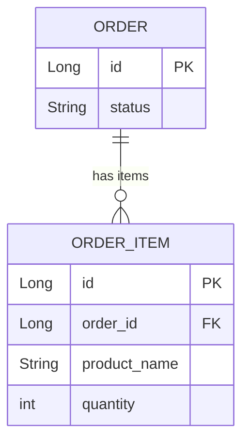

# OneToMany and ManyToOne

**Interview Weight:** critical - Relationship mapping
is tested in virtually every JPA interview. Interviewers
check understanding of owning side, bidirectional sync,
and N+1 implications.

---

### 🎯 Model Answer

**30 seconds:**

> @OneToMany maps a parent entity to a collection of
> child entities (one Order has many OrderItems).
> @ManyToOne is the other side: each OrderItem belongs
> to one Order. The owning side is the @ManyToOne
> side (the one with the foreign key column). The
> foreign key is maintained only by updates to the
> owning side. In bidirectional relationships, you
> must keep both sides in sync in code, or use a
> helper method.

**3 minutes (Senior):**

> Owning side vs inverse side:
>
> @ManyToOne (owning side): has the foreign key column
> in the database. JPA uses this side to generate the
> JOIN. Setting orderItem.setOrder(order) updates the
> FK in the database.
>
> @OneToMany with mappedBy (inverse side): no FK column.
> "mappedBy = 'order'" means "this collection is mapped
> by the 'order' field on the child entity." Only for
> navigation; JPA ignores changes to the collection
> on the inverse side for FK management.
>
> Bidirectional sync rule: must set BOTH sides:
> order.getItems().add(item)  // inverse side - for in-memory graph
> item.setOrder(order)        // owning side - for DB FK
>
> Unidirectional @OneToMany (without mappedBy):
> JPA creates a join table! Performance issue: extra
> table, extra JOINs. Always use mappedBy unless you
> intentionally want a join table.
>
> N+1: selecting 10 Orders, then accessing items for
> each (10 separate queries). Fix: JOIN FETCH.

**Blank Mind Recovery:**

**(1) Restate:** "You are asking about @OneToMany and
@ManyToOne relationship mapping."

**(2) First principles:** "The database has a foreign
key. JPA maps it to object references. The owning side
(FK holder) controls the FK. Both sides exist for
in-memory navigation."

**(3) Bridge:** "A team (Order) has many employees
(OrderItems). The employee (item) has a 'manager'
field pointing back to the team. The manager field
(ManyToOne) is the owning side because employees hold
the foreign key to their team."

---

### 📘 Concept Explanation

```java
// Owning side: @ManyToOne
@Entity
public class OrderItem {
    @Id @GeneratedValue
    private Long id;

    // FK column: order_id in order_items table
    @ManyToOne(fetch = FetchType.LAZY)
    @JoinColumn(name = "order_id")
    private Order order;

    private String productName;
    private int quantity;
}

// Inverse side: @OneToMany
@Entity
public class Order {
    @Id @GeneratedValue
    private Long id;

    // mappedBy = "order" refers to OrderItem.order
    // No FK here - inverse side
    @OneToMany(mappedBy = "order",
               cascade = CascadeType.ALL,
               orphanRemoval = true,
               fetch = FetchType.LAZY)
    private List<OrderItem> items = new ArrayList<>();

    // Helper method: keeps both sides in sync
    public void addItem(OrderItem item) {
        items.add(item);      // inverse side
        item.setOrder(this);  // owning side (FK!)
    }

    public void removeItem(OrderItem item) {
        items.remove(item);
        item.setOrder(null);  // clear FK
    }
}
```

> **Code walkthrough:** OrderItem has the FK (order_id)
> and is the owning side - JPA uses its @ManyToOne to
> manage the FK. Order uses mappedBy to declare it's
> the inverse side (no FK here). The addItem() helper
> method sets BOTH sides: the collection on Order (for
> in-memory navigation) AND the order reference on
> OrderItem (for FK management). Missing the owning
> side set means the FK is null - item orphaned.

```
BAD: Unidirectional @OneToMany (creates join table)

@OneToMany   ← no mappedBy
List<OrderItem> items

Result:
  TABLE: orders
  TABLE: order_items
  TABLE: orders_items  ← extra join table! unintended

GOOD: Bidirectional with mappedBy

@OneToMany(mappedBy="order")
@ManyToOne @JoinColumn(name="order_id")

Result:
  TABLE: orders
  TABLE: order_items   ← order_id FK directly in table
```



> **Diagram walkthrough:** The database has a simple
> FK relationship: order_items.order_id references
> orders.id. The bidirectional mapping with mappedBy
> creates this clean schema. Without mappedBy, JPA
> generates a third join table - unexpected, wasteful,
> and often a bug.

---

### ⚖️ Comparison Table

| Aspect | @ManyToOne | @OneToMany |
|---|---|---|
| Owning side | Yes (has FK) | No (inverse, mappedBy) |
| FK column | Yes (@JoinColumn) | No |
| Default fetch | EAGER (bad) | LAZY |
| Without mappedBy | N/A | Creates join table (bad) |
| Typical cascade | None | ALL or PERSIST,MERGE |

---

### 🎓 Answers by Seniority

**Junior:** "@OneToMany maps a parent to its children.
@ManyToOne is the child pointing back to the parent.
I use mappedBy on the @OneToMany side to avoid creating
a join table."

**Senior:** "The owning side (ManyToOne, FK holder)
controls the FK. I always make @ManyToOne LAZY (default
is EAGER which can load unexpected data). For
bidirectional relationships, I use a helper addItem()
method to keep both sides in sync. For queries, I
use JOIN FETCH to avoid N+1."

**Staff:** "I model relationships from DDD principles:
Order is the aggregate root, OrderItem is part of the
aggregate. They're always accessed together (cascade=ALL,
orphanRemoval=true). For independent entities, I use
unidirectional @ManyToOne only (simpler, no bidirectional
sync needed). If I only need the FK value, I use
@Column with the FK directly rather than a @ManyToOne
to avoid loading the related entity."

---

### 🚨 Failure Modes and Diagnosis

**Failure: N+1 select when loading Order with items**

Symptom: 10 orders → 11 SQL queries (1 for orders,
10 for items collections).

Diagnosis: Enable SQL logging: spring.jpa.show-sql=true
or Hibernate statistics. Count SELECT statements.

Fix: Use JOIN FETCH:
```java
em.createQuery(
    "SELECT o FROM Order o JOIN FETCH o.items",
    Order.class).getResultList();
```
Or Spring Data JPA @EntityGraph(attributePaths={"items"}).

---

### 🎯 Interview Deep-Dive

| Experience | Time | Depth |
|---|---|---|
| Junior | 4 min | Owning side, mappedBy, basic mapping |
| Senior | 7 min | Bidirectional sync, N+1 fix, EAGER/LAZY |

---

**[SENIOR] Q1 - What happens if you set only the
inverse side (the collection) and forget the owning
side?**

*Why they ask:* Common bug that causes data loss.

If you do:
```java
order.getItems().add(item);   // inverse side only
// item.setOrder(order) NOT called
```

The FK in order_items.order_id remains NULL. At flush,
JPA updates the FK based on the owning side (item.order).
Since item.order is null, JPA sets order_id=NULL (or
throws a NOT NULL constraint violation if the FK is
required). The item is NOT associated with the order
in the database.

Result: orphaned OrderItem with no FK, or constraint
violation. Either way, data integrity failure.

Fix: Always use the helper method that sets both sides,
or use entity initialization: new OrderItem(order)
that sets order in the constructor.

*What separates good from great:* Explaining that
JPA reads the FK from the OWNING side, not the collection.

| Interviewer Type | Emphasis |
|---|---|
| Technical Panel | Owning side, mappedBy, N+1 diagnosis. |
| Hiring Manager | Correct mapping = data integrity. |
| Bar Raiser | Aggregate root design (DDD), FK-only vs @ManyToOne choice. |
| Peer Engineer | "Setting only one side of a bidirectional relationship is the most common JPA data corruption bug." |

---

---

# ManyToMany and Join Tables

**Interview Weight:** medium - Many-to-many relationships
have specific pitfalls (join table management, extra
columns on the join table). Tested at intermediate level.

---

### 🎯 Model Answer

**30 seconds:**

> @ManyToMany maps a many-to-many relationship through
> a join table. Student takes many Courses; Course has
> many Students. JPA creates a join table (student_courses)
> automatically. If the join table needs extra columns
> (enrollment_date, grade), use an explicit join entity
> (Enrollment) with @ManyToOne to both sides. Direct
> @ManyToMany is suitable only for pure associations
> with no extra data.

**3 minutes (Senior):**

> @ManyToMany with @JoinTable:
> - JPA creates a join table with two FK columns
> - Owning side defines @JoinTable (table name, FKs)
> - Inverse side uses mappedBy
>
> Problem with direct @ManyToMany:
> - Can't add extra columns to the join table
> - Cartesian product risk: JOIN FETCH both sides
>   simultaneously = data explosion
> - Managing the join table (delete = cascade through
>   the join table, not the other entity)
>
> Explicit join entity (preferred for production):
> Instead of @ManyToMany, create an Enrollment entity
> with @ManyToOne Student and @ManyToOne Course.
> Advantages: add extra columns, have a PK for the
> enrollment, better query control.
>
> Bidirectional sync: same issue as @OneToMany -
> must keep both sides in sync.

**Blank Mind Recovery:**

**(1) Restate:** "You are asking about many-to-many
relationship mapping."

**(2) First principles:** "Many-to-many in SQL requires
a join table with two FK columns. JPA @ManyToMany
creates and manages this table. If the join table needs
its own attributes, it becomes a first-class entity."

**(3) Bridge:** "A job board: many Applicants apply
to many Jobs. The application itself (ApplicationEntity)
is the join entity with extra attributes (date, status,
notes). @ManyToMany is for pure sets; join entities
are for sets with attributes."

---

### 💻 Code Example

```java
// BAD: @ManyToMany for a relationship needing extra data
@Entity
public class Student {
    @ManyToMany
    @JoinTable(
        name = "enrollments",
        joinColumns = @JoinColumn(name = "student_id"),
        inverseJoinColumns = @JoinColumn(name = "course_id"))
    private Set<Course> courses = new HashSet<>();
    // Can't store enrollment_date, grade on this table
}

// GOOD: Explicit join entity with composite ID
@Entity
public class Enrollment {
    @EmbeddedId
    private EnrollmentId id = new EnrollmentId();

    @ManyToOne(fetch = FetchType.LAZY)
    @MapsId("studentId")
    private Student student;

    @ManyToOne(fetch = FetchType.LAZY)
    @MapsId("courseId")
    private Course course;

    private LocalDate enrolledAt;
    private Integer grade;  // extra attributes!
}

@Embeddable
public class EnrollmentId implements Serializable {
    private Long studentId;
    private Long courseId;
}

// Student side
@Entity
public class Student {
    @OneToMany(mappedBy = "student",
               cascade = CascadeType.ALL,
               orphanRemoval = true)
    private List<Enrollment> enrollments
        = new ArrayList<>();
}
```

> **Code walkthrough:** Direct @ManyToMany can't store
> enrollment date or grade on the join table. The
> explicit Enrollment entity solves this: it's a first-
> class entity with @EmbeddedId (composite PK from
> both FKs), plus extra attributes. @MapsId connects
> the embedded ID field to the actual @ManyToOne
> relationship. Student accesses enrollments via
> @OneToMany. This is the production-grade pattern
> for any many-to-many with data.

---

### ⚖️ Comparison Table

| Approach | Extra columns | PK for join | Query control | Complexity |
|---|---|---|---|---|
| Direct @ManyToMany | No | No (composite FK) | Limited | Low |
| Explicit join entity | Yes | Yes (own @Id) | Full | Medium |
| @ManyToMany + @JoinTable | No | No | Limited | Low |

---

### 🎓 Answers by Seniority

**Junior:** "@ManyToMany creates a join table. I define
@JoinTable on the owning side with the join column
names. Inverse side uses mappedBy."

**Senior:** "Direct @ManyToMany is rarely the right
choice in production. If the join table might ever
need extra columns (audit timestamps, status, ordering),
use an explicit join entity from the start. Migrating
from @ManyToMany to an explicit entity later is a
schema migration."

---

### 🎯 Interview Deep-Dive

| Experience | Time | Depth |
|---|---|---|
| Junior | 3 min | @JoinTable, owning side, mappedBy |
| Senior | 6 min | Explicit join entity, @EmbeddedId, extra columns |

---

**[SENIOR] Q1 - When would you choose direct @ManyToMany
over an explicit join entity?**

*Why they ask:* Decision judgment.

Use direct @ManyToMany when:
1. The join is truly a pure set membership with no
   attributes (e.g., user roles: User has many Roles,
   no extra data on the membership)
2. The join table will never need extra columns
3. You don't need to query or sort by the join table
   attributes
4. Performance of join table management is not a concern

Use explicit join entity when:
1. You need extra attributes (dates, status, ordering)
2. You need to query by join table attributes
3. You need a stable PK for the join record
   (e.g., reference it from other tables)
4. Any possibility the schema will evolve

In practice: if in doubt, use an explicit join entity.
The upgrade from @ManyToMany to explicit entity requires
a schema migration.

*What separates good from great:* "If in doubt, explicit
entity - the migration cost is not worth the @ManyToMany
simplicity."

| Interviewer Type | Emphasis |
|---|---|
| Technical Panel | @JoinTable syntax, owning side, mappedBy. |
| Hiring Manager | Correct modeling prevents schema migrations. |
| Bar Raiser | @EmbeddedId, @MapsId, when direct ManyToMany is acceptable. |
| Peer Engineer | "I've never regretted using an explicit join entity. I have regretted not using one." |

---

---

# Fetch Types EAGER vs LAZY

**Interview Weight:** critical - Fetch type is the most
common source of both N+1 bugs and LazyInitialization
exceptions. Every JPA interview includes a fetch type
question.

---

### 🎯 Model Answer

**30 seconds:**

> EAGER fetch loads the related entity/collection
> immediately with the parent entity, in the same query
> (or an additional query). LAZY fetch defers loading
> until the relationship is accessed. Defaults: @ManyToOne
> and @OneToOne are EAGER by default (dangerous!);
> @OneToMany and @ManyToMany are LAZY by default.
> The rule: always use LAZY for all relationships and
> control loading explicitly via JOIN FETCH or @EntityGraph
> when needed.

**3 minutes (Senior):**

> EAGER problems:
> - Loads data even when not needed (wasted SQL)
> - Cannot be overridden per query (it's "always eager")
> - Creates unexpected JOINs in unrelated queries
> - @ManyToOne EAGER default is the most dangerous:
>   loading Order also loads Customer (and if Customer
>   has EAGER relationships, those load too - eager
>   cascade)
>
> LAZY benefits:
> - Load only what you need
> - Override per query with JOIN FETCH or @EntityGraph
>
> LAZY risks:
> - LazyInitializationException: accessing lazy
>   collection after persistence context closed
>   (outside @Transactional)
> - N+1: loading collection item by item (each access
>   triggers a SELECT)
>
> Solutions for lazy loading outside transaction:
> - Fetch in the service layer (best)
> - Open Session in View (OSIV) - anti-pattern, avoid
> - JOIN FETCH in the query
> - @EntityGraph for specific queries

**Blank Mind Recovery:**

**(1) Restate:** "You are asking when JPA loads related
entities: immediately (EAGER) or on access (LAZY)."

**(2) First principles:** "Loading everything upfront
is wasteful when you don't always need it. Loading
nothing upfront risks accessing data after the session
closes. The solution: always lazy, explicit eager when
needed."

**(3) Bridge:** "EAGER fetch is like opening every
drawer in a house to search for one key. LAZY fetch
is like opening only the drawer where keys are kept.
JOIN FETCH is the explicit instruction: 'open that
specific drawer now.'"

---

### 💻 Code Example

```java
// BAD: EAGER on @ManyToOne (the default)
@Entity
public class Order {
    @ManyToOne  // EAGER by default!
    private Customer customer;
    // Loading ANY Order query loads Customer too
    // If Customer has EAGER relationships,
    // those load too (cascade)
}

// BAD: N+1 with LAZY
List<Order> orders = em.createQuery(
    "SELECT o FROM Order o", Order.class)
    .getResultList();
for (Order o : orders) {
    System.out.println(o.getCustomer().getName());
    // Each iteration: SELECT customer WHERE id=?
    // 10 orders = 11 queries!
}

// GOOD: Always LAZY, JOIN FETCH when needed
@Entity
public class Order {
    @ManyToOne(fetch = FetchType.LAZY) // explicit LAZY
    @JoinColumn(name = "customer_id")
    private Customer customer;

    @OneToMany(mappedBy = "order",
               fetch = FetchType.LAZY) // explicit LAZY
    private List<OrderItem> items;
}

// GOOD: JOIN FETCH when you need the relationship
List<Order> orders = em.createQuery(
    "SELECT o FROM Order o "
    + "JOIN FETCH o.customer "
    + "WHERE o.status = 'PAID'",
    Order.class)
    .getResultList();
// 1 query with JOIN - no N+1

// GOOD: @EntityGraph for Spring Data JPA
@EntityGraph(attributePaths = {"customer", "items"})
List<Order> findByStatus(String status);
// Spring Data generates JOIN FETCH for both
```

> **Code walkthrough:** The BAD @ManyToOne (EAGER
> default) loads Customer on every Order query, even
> when you only need the Order's status. The BAD N+1
> loop runs 11 queries for 10 orders. The GOOD version:
> explicit FetchType.LAZY on all relationships, then
> explicit JOIN FETCH for the specific query that needs
> Customer data. @EntityGraph is the Spring Data JPA
> equivalent - it adds JOIN FETCH to the generated
> query.

---

### ⚖️ Comparison Table

| Aspect | EAGER | LAZY |
|---|---|---|
| Default for @ManyToOne | Yes (dangerous!) | No |
| Default for @OneToMany | No | Yes |
| SQL | Immediate JOIN/SELECT | SELECT on access |
| LazyInitializationException | Never | Possible (outside PC) |
| N+1 risk | Lower | Higher (without JOIN FETCH) |
| Unused data loaded | Yes | No |
| Recommended | Never (use LAZY) | Always |

---

### 🎓 Answers by Seniority

**Junior:** "EAGER loads the related entity immediately.
LAZY loads it when accessed. I always set FetchType.LAZY
because EAGER loads data I might not need."

**Senior:** "The default @ManyToOne EAGER is a trap.
Every Order query also loads Customer, even when you
don't need it. I explicitly set LAZY on ALL relationships
and use JOIN FETCH per query where needed. For Spring
Data JPA, @EntityGraph adds the JOIN FETCH."

**Staff:** "Fetch type is a query concern, not a mapping
concern. Setting EAGER on a mapping means 'always
load this for every query' which is almost never
correct. I treat LAZY as the invariant; JOIN FETCH
or @EntityGraph as query-specific optimizations.
For multi-level graphs (order → items → product →
category), batch fetching (hibernate.default_batch_fetch_size)
is more efficient than multiple JOIN FETCHes (Cartesian
product risk)."

---

### 🚨 Failure Modes and Diagnosis

**Failure: LazyInitializationException in production**

Symptom: "failed to lazily initialize a collection -
could not initialize proxy - no Session"

Diagnosis: Accessing a lazy relationship outside a
@Transactional method (persistence context closed).

Fix options:
1. Move the access inside the @Transactional method
2. Initialize the collection in the service:
   Hibernate.initialize(order.getItems())
3. Use JOIN FETCH in the query
4. Use @EntityGraph for the repository method

Do NOT enable OSIV as a fix - it hides the real problem.

---

### 🎯 Interview Deep-Dive

| Experience | Time | Depth |
|---|---|---|
| Junior | 4 min | EAGER vs LAZY defaults, LazyInitializationException |
| Senior | 7 min | JOIN FETCH, @EntityGraph, batch fetching |

---

**[STAFF] Q1 - What is the difference between JOIN
FETCH and Hibernate's batch fetching, and when do
you use each?**

*Why they ask:* Advanced fetch strategy knowledge.

**JOIN FETCH:**
- Single query with SQL JOIN
- Loads parent + relationship in one round-trip
- Risk: Cartesian product if fetching multiple
  collections simultaneously
  (orders JOIN items JOIN tags = orders * items * tags rows)
- Best for: single collection, when you always need
  the relationship

**Hibernate batch fetching:**
  (hibernate.default_batch_fetch_size or @BatchSize)
- Collects all uninitialized lazy proxies, then fetches
  them in batches with IN clause:
  SELECT * FROM customers WHERE id IN (1,2,3,...50)
- No Cartesian product risk
- Multiple round-trips (but batched)
- Best for: multiple collections on the same entity,
  or when Cartesian product is a concern

Rule of thumb:
- One collection: JOIN FETCH
- Two+ collections on same parent: batch fetching
  (or fetch one with JOIN FETCH, others with batch)
- @EntityGraph for Spring Data JPA with batch fetch size
  configured globally

*What separates good from great:* Naming the Cartesian
product risk of JOIN FETCHing multiple collections.

| Interviewer Type | Emphasis |
|---|---|
| Technical Panel | EAGER/LAZY defaults, LazyInitializationException. |
| Hiring Manager | Correct fetch strategy = no surprise queries. |
| Bar Raiser | Cartesian product risk, batch fetching, @EntityGraph. |
| Peer Engineer | "I learned about the Cartesian product explosion when loading Order with items AND tags via two JOIN FETCHes." |

---

---

# Cascade Types and Orphan Removal

**Interview Weight:** medium - Cascade and orphan
removal are common sources of unintended deletes or
missing saves. Tested to verify that candidates
understand when to use each option.

---

### 🎯 Model Answer

**30 seconds:**

> JPA cascades propagate operations from parent to
> child entities. CascadeType.ALL propagates persist,
> merge, remove, refresh, and detach. The most common
> pattern: cascade=ALL on @OneToMany for aggregate roots
> (Order cascades ALL to OrderItems - items are fully
> owned by the order). orphanRemoval=true automatically
> deletes a child entity when it is removed from the
> parent's collection. Never use CascadeType.REMOVE
> on @ManyToOne - it would delete the parent from the
> child.

**3 minutes (Senior):**

> Cascade types:
> - PERSIST: parent persist → children persisted
> - MERGE: parent merge → children merged (updates
>   detached children too)
> - REMOVE: parent remove → children removed (DELETE)
> - REFRESH: parent refresh → children refreshed
>   from DB
> - DETACH: parent detach → children detached
> - ALL: all of the above
>
> When to use:
> - cascade=ALL on parent-child (aggregate) relationships
>   (Order → OrderItems)
> - cascade=PERSIST,MERGE on many-to-many or optional
>   relationships (don't auto-remove)
> - Never cascade from child to parent (@ManyToOne)
>
> orphanRemoval vs CascadeType.REMOVE:
> - CascadeType.REMOVE: triggered by em.remove(parent)
>   → removes parent AND children
> - orphanRemoval=true: triggered when child is removed
>   from parent collection → DELETE the child
>   (even without removing the parent)

**Blank Mind Recovery:**

**(1) Restate:** "You are asking about how operations
propagate from parent to child entities in JPA, and
how orphaned children are handled."

**(2) First principles:** "When you delete a parent,
its children should typically be deleted too. JPA
cascade automates this. When you remove an item from
a collection, the database row should be deleted -
that's orphanRemoval."

**(3) Bridge:** "Cascade is like responsibility: when
the manager leaves the company, their reports
automatically leave too (cascade REMOVE). OrphanRemoval
is the cleanup rule: when a project is removed from
a team's project list, the project record is deleted
(no orphan projects exist without a team)."

---

### 💻 Code Example

```java
// BAD: cascade on @ManyToOne = deletes parent
@Entity
public class OrderItemBad {
    @ManyToOne(cascade = CascadeType.ALL)
    // BAD: removing an OrderItem will DELETE the Order!
    private Order order;
}

// BAD: orphanRemoval without cascade=MERGE
// = removed items not deleted, modified items not saved
@Entity
public class OrderBad {
    @OneToMany(mappedBy = "order",
               cascade = CascadeType.PERSIST,
               orphanRemoval = true)
    // BAD: MERGE not included; updating detached
    // order won't propagate to items
    private List<OrderItem> items;
}

// GOOD: correct aggregate cascade pattern
@Entity
public class Order {
    @OneToMany(
        mappedBy = "order",
        cascade = CascadeType.ALL,
        // ALL includes: persist, merge, remove,
        //               refresh, detach
        orphanRemoval = true
        // Remove item from list → DELETE from DB
    )
    private List<OrderItem> items = new ArrayList<>();

    // Usage:
    public void removeItem(OrderItem item) {
        items.remove(item);   // triggers orphanRemoval
        item.setOrder(null);  // clear owning side
        // At flush: DELETE FROM order_items WHERE id=?
    }

    public void addItem(OrderItem item) {
        items.add(item);       // cascade=PERSIST: insert
        item.setOrder(this);   // set owning side
    }
}
```

> **Code walkthrough:** The BAD @ManyToOne with
> cascade=ALL is catastrophic: removing an OrderItem
> would trigger DELETE on its Order parent (and that
> Order's other children via cascade). The GOOD pattern:
> cascade=ALL on the @OneToMany (parent owns children),
> orphanRemoval=true removes items deleted from the
> collection. The removeItem() helper clears BOTH the
> collection (for in-memory consistency) and the owning
> side reference (for FK management).

---

### ⚖️ Comparison Table

| Cascade | Triggered by | Effect |
|---|---|---|
| PERSIST | em.persist(parent) | Inserts new children |
| MERGE | em.merge(parent) | Updates detached children |
| REMOVE | em.remove(parent) | Deletes parent's children first |
| REFRESH | em.refresh(parent) | Re-loads children from DB |
| DETACH | em.detach(parent) | Detaches children from PC |
| ALL | Any of the above | All operations |
| orphanRemoval | Remove from collection | Deletes the removed child |

---

### 🎓 Answers by Seniority

**Junior:** "CascadeType.ALL propagates all operations
from parent to children. orphanRemoval=true deletes
children when removed from the collection."

**Senior:** "I use cascade=ALL + orphanRemoval=true
for aggregate roots (Order → OrderItems). These are
tightly owned - the items have no meaning without the
order. For looser relationships (Order → Customer), no
cascade - Customer is its own root."

---

### 🚨 Failure Modes and Diagnosis

**Failure: Cascade REMOVE deletes more than expected**

Symptom: Deleting an entity cascades to related
entities that should not have been deleted.

Root cause: CascadeType.REMOVE or cascade=ALL on a
relationship where the related entity is shared (not
owned exclusively).

Example: Product is shared between multiple OrderItems.
If cascade=REMOVE on OrderItem → Product, deleting
one OrderItem deletes the Product for all other orders.

Fix: Only cascade REMOVE on exclusively-owned children
(the child has no meaning outside the parent).

---

### 🎯 Interview Deep-Dive

| Experience | Time | Depth |
|---|---|---|
| Junior | 3 min | Cascade types list, orphanRemoval |
| Senior | 6 min | When NOT to cascade, orphanRemoval vs CascadeType.REMOVE |

---

**[SENIOR] Q1 - What is the difference between
CascadeType.REMOVE and orphanRemoval=true?**

*Why they ask:* Common source of confusion.

CascadeType.REMOVE: Triggered when you call
em.remove(parent). JPA first deletes the children,
then the parent. The children must be removed because
the parent is being deleted.

orphanRemoval=true: Triggered when you remove a child
from the parent's collection (parent still exists).
JPA issues DELETE for the removed child entity.

Example:
```java
// CascadeType.REMOVE triggered:
em.remove(order);
// → DELETE order_items WHERE order_id=?
// → DELETE orders WHERE id=?

// orphanRemoval triggered:
order.getItems().remove(item);
// → DELETE order_items WHERE id=?
// (order is NOT deleted)
```

Both can be set together (and usually are for aggregate
roots). They handle different scenarios.

*What separates good from great:* "orphanRemoval handles
the 'remove from collection' case; CascadeType.REMOVE
handles the 'delete the parent' case."

| Interviewer Type | Emphasis |
|---|---|
| Technical Panel | Cascade types, orphanRemoval trigger. |
| Hiring Manager | Wrong cascade = production data loss. |
| Bar Raiser | When NOT to cascade, shared entities, cascade on ManyToOne danger. |
| Peer Engineer | "Never put cascade=ALL on @ManyToOne. I have seen this delete entire parent hierarchies." |

---

---

# Embeddable and Embedded

**Interview Weight:** medium - @Embeddable represents
value objects in DDD. Tested to check if candidates
understand when to use embedding vs a separate entity.

---

### 🎯 Model Answer

**30 seconds:**

> @Embeddable marks a class whose fields are stored
> in the parent entity's table (no separate table, no
> separate primary key). @Embedded on the parent field
> includes the embeddable's columns in the parent's
> table. Use cases: Address (street, city, zip) embedded
> in Customer, Money (amount, currency) embedded in Order.
> The embeddable is a value object: it has no identity
> of its own and only exists as part of its parent.

**3 minutes (Senior):**

> @Embeddable rules:
> - Must have a no-arg constructor
> - Must be serializable (for L2 cache / detached entities)
> - Fields map to columns in the PARENT entity's table
> - Multiple embeddables of the same type: use @AttributeOverride
>   to distinguish column names
>
> @Embedded and @AttributeOverride:
> ```java
> @Embedded
> @AttributeOverrides({
>     @AttributeOverride(name="street",
>         column=@Column(name="billing_street")),
>     @AttributeOverride(name="city",
>         column=@Column(name="billing_city"))
> })
> private Address billingAddress;
>
> @Embedded
> @AttributeOverrides({
>     @AttributeOverride(name="street",
>         column=@Column(name="shipping_street"))
> })
> private Address shippingAddress;
> ```
>
> @Embeddable vs separate @Entity:
> - Embeddable: no identity, always loaded with parent,
>   no separate table, no separate lifecycle
> - Entity: has identity (@Id), separate table, separate
>   lifecycle (can be loaded independently)
>
> DDD value object = @Embeddable. Domain entity = @Entity.

**Blank Mind Recovery:**

**(1) Restate:** "You are asking about embedded value
objects in JPA using @Embeddable."

**(2) First principles:** "Some concepts don't have
identity on their own. An Address is not meaningful
without the entity it belongs to. Store it in the
parent's table (no join needed, no separate entity)."

**(3) Bridge:** "@Embeddable is a struct (value object)
within an entity. It doesn't get its own table; its
columns live in the parent's table. It's owned
completely by the parent."

---

### 💻 Code Example

```java
// BAD: Address as a separate entity (overcomplicated)
@Entity
public class Address {
    @Id @GeneratedValue
    private Long id;       // Address doesn't need ID
    private String street;
    private String city;
    // Requires JOIN to load - for no benefit
}

@Entity
public class Customer {
    @OneToOne(cascade = CascadeType.ALL)
    private Address billingAddress;
    // Extra table, extra JOIN, extra lifecycle
}

// GOOD: Address as @Embeddable (value object)
@Embeddable
public class Address {
    // No @Id - no identity
    private String street;
    private String city;
    @Column(length = 10)
    private String zipCode;

    protected Address() { }

    public Address(String street,
                   String city, String zip) {
        this.street = street;
        this.city = city;
        this.zipCode = zip;
    }
    // getters only (immutable value object)
}

@Entity
@Table(name = "customers")
public class Customer {
    @Id @GeneratedValue
    private Long id;

    @Embedded
    @AttributeOverrides({
        @AttributeOverride(name = "street",
            column = @Column(name = "bill_street")),
        @AttributeOverride(name = "city",
            column = @Column(name = "bill_city")),
        @AttributeOverride(name = "zipCode",
            column = @Column(name = "bill_zip"))
    })
    private Address billingAddress;

    @Embedded
    @AttributeOverrides({
        @AttributeOverride(name = "street",
            column = @Column(name = "ship_street")),
        @AttributeOverride(name = "city",
            column = @Column(name = "ship_city")),
        @AttributeOverride(name = "zipCode",
            column = @Column(name = "ship_zip"))
    })
    private Address shippingAddress;
}
```

> **Code walkthrough:** The BAD Address as @Entity
> requires its own table (address table), @OneToOne
> join, and manages its own lifecycle - overkill for
> a simple value. The GOOD @Embeddable Address has no
> @Id, no table. Its columns are stored in the customers
> table. @AttributeOverride is required for two Address
> fields in the same entity (billing vs shipping) to
> avoid column name conflicts. The immutable value
> object pattern is ideal for @Embeddable (no setters).

---

### ⚖️ Comparison Table

| Aspect | @Embeddable | @Entity |
|---|---|---|
| Has @Id | No | Yes |
| Own table | No (in parent's table) | Yes |
| Loaded with parent | Always | Only when fetched |
| Shared by entities | Via @AttributeOverride | Via FK relationship |
| Lifecycle | Same as parent | Independent |
| DDD concept | Value Object | Domain Entity |

---

### 🎓 Answers by Seniority

**Junior:** "@Embeddable marks a class that doesn't
have its own table. Its fields are stored in the parent
entity's table. Good for Address, Money, and similar
value types."

**Senior:** "@Embeddable = DDD value object. No identity,
no separate lifecycle. I use it for composite values
that always travel with the parent. @AttributeOverride
is needed when embedding the same type twice. For
immutability, I make @Embeddable classes with no setters."

---

### 🎯 Interview Deep-Dive

| Experience | Time | Depth |
|---|---|---|
| Junior | 3 min | What @Embeddable does, no separate table |
| Senior | 5 min | DDD value objects, @AttributeOverride, immutability |

---

**[SENIOR] Q1 - How does Hibernate handle a null
@Embeddable?**

*Why they ask:* Practical edge case.

When an @Embeddable field is null on the entity,
Hibernate stores NULL for all of the embeddable's
columns. When loading, if ALL columns are NULL, Hibernate
returns null for the @Embeddable field.

Problem: if only SOME columns are null but others
have values, Hibernate still creates an @Embeddable
instance. This can be confusing for partial addresses.

Best practice:
1. Never allow partial @Embeddable values (all fields
   must be non-null or all null). Add @Column(nullable=false)
   on required embedded fields.
2. Use @Column(columnDefinition="...") with NOT NULL
   constraints on the DB side for required embeddable fields.
3. Or use Hibernate's @NotFound to customize null handling.

*What separates good from great:* Knowing the "all null
= null object" behavior and designing to avoid partial
null embeddables.

| Interviewer Type | Emphasis |
|---|---|
| Technical Panel | No separate table, @AttributeOverride, DDD. |
| Hiring Manager | Embeddable = cleaner schema for value types. |
| Bar Raiser | Null handling, immutable value objects, when to use Entity instead. |
| Peer Engineer | "Design Address as @Embeddable from day 1. Converting from @Entity to @Embeddable is a migration." |
