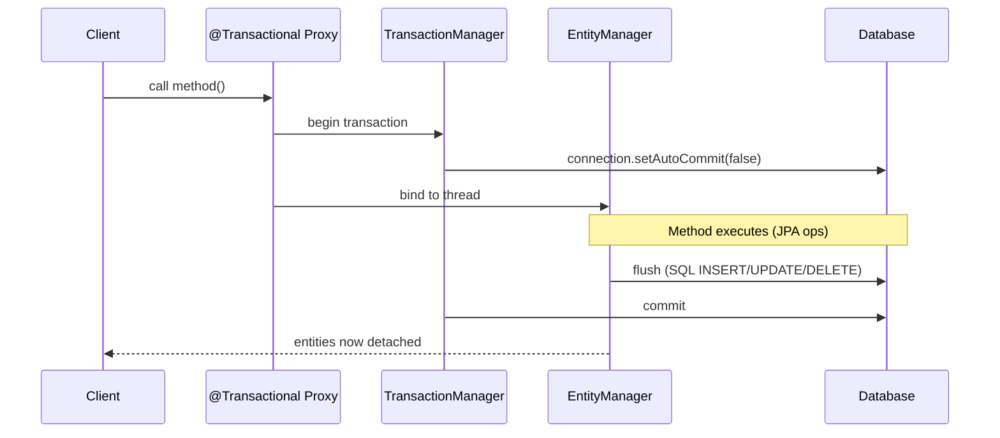
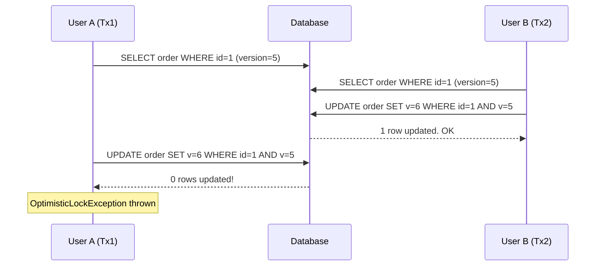

## Keywords in This File
{: .no_toc }

| # | Keyword | Weight |
|---|---|---|
| 1 | [JPA Transaction Management](#jpa-transaction-management) | critical |
| 2 | [Optimistic Locking with @Version](#optimistic-locking-with-version) | critical |
| 3 | [Pessimistic Locking Types](#pessimistic-locking-types) | critical |
| 4 | [Flush Modes and Synchronization](#flush-modes-and-synchronization) | critical |
| 5 | [JPA Callbacks and Entity Listeners](#jpa-callbacks-and-entity-listeners) | medium |

---

# JPA Transaction Management

**Interview Weight:** critical - Transaction management
in JPA is a senior-level topic. Interviewers test
propagation behavior, rollback rules, and the
interaction between JPA transactions and Spring
@Transactional.

---

### 🎯 Model Answer

**30 seconds:**

> JPA transactions define units of work: either all
> SQL in the transaction commits atomically, or all
> rolls back. In Spring, @Transactional manages the
> transaction lifecycle: begins before the method,
> commits after, rolls back on RuntimeException (by
> default). JPA EntityManager participates in the active
> transaction: persistence context flushes at commit.
> Checked exceptions do NOT trigger rollback by default
> - use rollbackFor=Exception.class or throw RuntimeExceptions.

**3 minutes (Senior):**

> Spring @Transactional and JPA integration:
>
> @Transactional on a method:
> 1. Spring proxy intercepts the call
> 2. If no transaction: begins new transaction
>    (TransactionManager.getTransaction())
> 3. Binds EntityManager to the current thread
>    (persistence context starts)
> 4. Method executes (all JPA ops in same PC)
> 5. On success: flush + commit
> 6. On RuntimeException: rollback
> 7. Persistence context closes (entities detached)
>
> Rollback rules:
> - Default: rollback on RuntimeException (unchecked)
> - Checked exceptions: NO rollback by default
> - Override: @Transactional(rollbackFor=IOException.class)
> - Or: @Transactional(noRollbackFor=
>   OptimisticLockingFailureException.class)
>
> Transaction propagation (key ones):
> - REQUIRED (default): join existing or create new
> - REQUIRES_NEW: always create new, suspend existing
> - SUPPORTS: join if exists, non-transactional if not
> - MANDATORY: must join existing, fails if none
> - NOT_SUPPORTED: suspend existing, run non-transactional
> - NEVER: fail if transaction exists

**Blank Mind Recovery:**

**(1) Restate:** "You are asking about JPA transaction
management: how transactions work, when they commit/rollback."

**(2) First principles:** "Transactions guarantee ACID:
all-or-nothing database changes. JPA builds on database
transactions. Spring wraps them with @Transactional
for declarative management."

**(3) Bridge:** "Spring @Transactional is a promise:
'if I get past this method without a RuntimeException,
everything changes. If a RuntimeException escapes,
nothing changes.' The JPA persistence context is the
working space within that promise."

---

### 📘 Concept Explanation

```
@Transactional Method Execution Flow

  Client calls method
       │
  [Spring AOP Proxy]
       │
  1. TransactionManager.getTransaction(REQUIRED)
  2. Bind new EntityManager to thread
  3. Persistence context opens
       │
  [Method executes: em.find(), em.persist(), etc.]
       │
  4a. Success path:
       em.flush() → SQL sent to DB
       connection.commit() → durable
       EntityManager.close() → entities detached
       │
  4b. RuntimeException path:
       connection.rollback() → no SQL committed
       EntityManager.close() → entities detached
```



> **Diagram walkthrough:** The @Transactional proxy
> intercepts the call before the method body. It starts
> the transaction (disables auto-commit) and binds
> an EntityManager to the current thread. All JPA
> operations within the method use the same EntityManager.
> At method exit, the proxy flushes the persistence
> context, commits, and closes the EntityManager.
> Entities are detached after return - they are
> no longer tracked.

---

### 💻 Code Example

```java
// BAD: checked exception, no rollback
@Transactional
public void processOrder(Long orderId)
        throws IOException {
    Order order = em.find(Order.class, orderId);
    order.setStatus("PROCESSING");
    callExternalService(); // throws IOException
    // IOException caught above @Transactional
    // → NO rollback by default!
    // order.status='PROCESSING' is committed!
}

// BAD: self-invocation bypasses @Transactional
@Service
public class OrderService {
    @Transactional
    public void updateStatus(Long id) {
        Order order = em.find(Order.class, id);
        order.setStatus("PAID");
    }

    public void processAll(List<Long> ids) {
        ids.forEach(id ->
            this.updateStatus(id)); // via 'this' proxy!
        // No transaction for each call - updates lost
    }
}

// GOOD: explicit rollback for checked exceptions
@Transactional(rollbackFor = Exception.class)
public void processOrder(Long orderId)
        throws IOException {
    Order order = em.find(Order.class, orderId);
    order.setStatus("PROCESSING");
    callExternalService(); // throws IOException
    // rollbackFor=Exception.class → rollback on IOEx
    // order.status change is rolled back
}

// GOOD: REQUIRES_NEW for audit that must commit
@Service
public class AuditService {
    @Transactional(
        propagation = Propagation.REQUIRES_NEW)
    public void logAudit(AuditEvent event) {
        auditRepo.save(event);
        // New transaction - commits independently
        // Even if the outer transaction rolls back,
        // the audit log is preserved
    }
}
```

> **Code walkthrough:** The BAD checked exception case:
> @Transactional only rolls back on RuntimeException
> by default. IOException is a checked exception -
> it doesn't trigger rollback. The order status change
> commits even though the external call failed. Fix:
> rollbackFor=Exception.class. The REQUIRES_NEW audit
> pattern ensures audit logs are committed even when
> the business transaction rolls back - critical for
> compliance.

---

### ⚖️ Comparison Table

| Propagation | Existing Tx | No Existing Tx | Use case |
|---|---|---|---|
| REQUIRED | Join | New | Default, most methods |
| REQUIRES_NEW | Suspend+New | New | Audit, always-commit ops |
| SUPPORTS | Join | Non-tx | Read-only optional tx |
| MANDATORY | Join | Exception | Must be called within tx |
| NOT_SUPPORTED | Suspend | Non-tx | Non-transactional ops |
| NEVER | Exception | Non-tx | Must not be in tx |

---

### 🎓 Answers by Seniority

**Junior:** "@Transactional begins a transaction before
the method and commits after. RuntimeExceptions trigger
rollback. Checked exceptions don't by default."

**Senior:** "Two traps: (1) checked exceptions don't
roll back - use rollbackFor=Exception.class for checked
exception scenarios; (2) self-invocation bypasses
@Transactional - always call through a different Spring
bean. For audit logs that must survive rollbacks:
REQUIRES_NEW propagation."

**Staff:** "Transaction design: minimize transaction
scope (only wrap what must be atomic). REQUIRED is
fine for most cases. Avoid long transactions holding
DB connections (http call inside @Transactional holds
connection for the network latency). REQUIRES_NEW is
expensive (suspend current + new connection). readOnly=true
for read-only methods (hint to DB to optimize)."

---

### 🚨 Failure Modes and Diagnosis

**Failure: Business operation partially committed
despite exception**

Symptom: Service throws exception, but some DB changes
are persisted.

Root cause: Checked exception escaping a @Transactional
method without rollbackFor=Exception.class.

Diagnosis: Check exception type - is it checked
(extends Exception) or unchecked (extends RuntimeException)?
Check @Transactional annotation for rollbackFor.

Fix: Add rollbackFor=Exception.class or convert the
exception to a RuntimeException.

---

### 🎯 Interview Deep-Dive

| Experience | Time | Depth |
|---|---|---|
| Senior | 6 min | Rollback rules, propagation, self-invocation |
| Staff | 10 min | Transaction scope, REQUIRES_NEW, long tx anti-pattern |

---

**[SENIOR] Q1 - What happens with @Transactional
when you call a method from another method in the
same class?**

*Why they ask:* Self-invocation is the most common
@Transactional bug.

When OrderService.processAll() calls this.updateStatus(),
the call goes directly to the object (bypasses the
Spring proxy). The proxy is the one that handles
@Transactional. Without the proxy intercept, no
transaction management occurs.

Result: updateStatus() runs without a transaction.
JPA changes made in updateStatus() are not committed.
No rollback on exception. No transaction isolation.

Fixes:
1. Move updateStatus() to a different @Service bean.
   Inject that bean and call it through the proxy.
2. Inject self: @Autowired OrderService self;
   self.updateStatus(id); - goes through proxy.
3. AopContext.currentProxy() - least preferred,
   requires proxyTargetClass=true.

*What separates good from great:* Explaining that the
proxy is the mechanism and self-call bypasses it.

**[STAFF] Q2 - Why is holding a database connection
inside a long @Transactional method a scalability risk?**

*Why they ask:* Production scalability judgment.

@Transactional holds a database connection for the
entire method duration. The connection is held from
transaction start to commit/rollback.

If the method calls:
- External HTTP services (100ms-2s latency)
- Long computations
- File I/O

The connection sits idle during that time. With a
connection pool of 20 connections and 20 concurrent
long transactions: all connections busy, new requests
wait for a connection. Connection pool exhaustion.

Fix: Minimize transaction scope:
1. Fetch data outside the transaction
2. Compute
3. Open transaction, write, close transaction

Or: separate the non-transactional work (HTTP calls)
from the transactional work (DB writes) into different
methods.

*What separates good from great:* Quantifying: "20
connection pool, 500ms HTTP calls inside transaction
= max 40 requests/second before connection starvation."

| Interviewer Type | Emphasis |
|---|---|
| Technical Panel | Propagation table, rollback rules, self-invocation. |
| Hiring Manager | Transaction management prevents partial commits. |
| Bar Raiser | Long transaction scalability risk, REQUIRES_NEW cost, connection pool math. |
| Peer Engineer | "REQUIRES_NEW is not free. It suspends the current connection and opens a new one. Two DB connections for one request." |

---

---

# Optimistic Locking with @Version

**Interview Weight:** critical - Optimistic locking is
a key concurrent data access pattern. Interviewers
ask about @Version semantics, the exception, and when
to use optimistic vs pessimistic locking.

---

### 🎯 Model Answer

**30 seconds:**

> Optimistic locking assumes concurrent conflicts are
> rare. @Version on a field adds a version column to
> the entity. On UPDATE, JPA checks the version:
> UPDATE orders SET status=?, version=version+1 WHERE
> id=? AND version=?. If no rows affected (someone else
> updated it), JPA throws OptimisticLockException. The
> caller must retry or report the conflict. No DB-level
> lock is held between reads and writes.

**3 minutes (Senior):**

> @Version mechanics:
> - Add @Version Long version field to entity
> - Hibernate adds WHERE version=? to every UPDATE
> - On load: version=5 stored in entity
> - On update: WHERE id=? AND version=5
> - If another transaction already updated (version=6):
>   0 rows affected → OptimisticLockException
>
> Types: Integer, Long, Short, Timestamp
>   (Long is preferred: never overflows)
>
> OptimisticLockException (JPA) is unwrapped by
> Spring to OptimisticLockingFailureException.
>
> Retry strategies:
> - Catch OptimisticLockingFailureException, reload
>   the entity, apply the business logic again, save
> - Spring Retry: @Retryable(
>     value=OptimisticLockingFailureException.class)
>   with exponential backoff
>
> When to use optimistic locking:
> - Low conflict probability (most reads, few concurrent
>   writes to same row)
> - Short transactions
> - Web applications with stateless sessions
>
> When NOT to use:
> - High conflict rate (most updates will fail and retry)
> - Long-running processes holding stale data
> - Financial accuracy requirements where double-check
>   is unacceptable (use pessimistic)

**Blank Mind Recovery:**

**(1) Restate:** "You are asking about @Version for
optimistic locking - detecting concurrent modifications
without holding locks."

**(2) First principles:** "If concurrent updates are
rare, locking a row for the entire duration of a user
interaction is wasteful. Optimistic locking lets
multiple reads proceed, and only detects conflicts at
write time."

**(3) Bridge:** "Optimistic locking is like version
control: you check out the code (read with version),
work on it, then commit (write with version check).
If someone else committed first, your commit is rejected
and you must merge (retry with fresh data)."

---

### 📘 Concept Explanation

```java
@Entity
public class Order {
    @Id @GeneratedValue
    private Long id;

    private String status;

    @Version
    private Long version;  // managed by JPA
}

// Transaction 1: User A loads Order
Order orderA = em.find(Order.class, 1L);
// orderA.version = 5

// Transaction 2: User B loads same Order
Order orderB = em.find(Order.class, 1L);
// orderB.version = 5

// Transaction 2 updates and commits first
orderB.setStatus("PAID");
em.flush(); // UPDATE orders SET status='PAID',
            // version=6 WHERE id=1 AND version=5
            // → 1 row affected → success, version=6

// Transaction 1 tries to update
orderA.setStatus("CANCELLED");
em.flush(); // UPDATE orders SET status='CANCELLED',
            // version=6 WHERE id=1 AND version=5
            // → 0 rows affected!
            // → OptimisticLockException thrown
```



> **Diagram walkthrough:** Both users load the same
> entity at version 5. User B commits first - version
> becomes 6. When User A tries to save, the WHERE
> version=5 matches nothing (DB has version=6 now).
> Zero rows affected means the update didn't happen.
> JPA detects this and throws OptimisticLockException.
> The caller must reload and retry. No DB-level lock
> was ever held.

---

### ⚖️ Comparison Table

| Aspect | Optimistic | Pessimistic |
|---|---|---|
| DB lock held | No | Yes (row locked until tx end) |
| Conflict detection | At write time (exception) | At read time (wait/fail) |
| Throughput | High (no lock contention) | Lower (locks block readers) |
| Conflict handling | Retry after exception | Never reach conflict |
| Best for | Low conflict probability | High conflict probability |
| Deadlock risk | No | Yes |

---

### 🎓 Answers by Seniority

**Junior:** "@Version adds a version column. On update,
JPA checks the version matches. If another transaction
updated it first, OptimisticLockException is thrown."

**Senior:** "I use @Version for most business entities.
The retry logic is the critical part: catch
OptimisticLockingFailureException, reload the entity,
reapply business logic, save again. With Spring Retry,
this can be declarative. High-conflict scenarios
(inventory decrement under heavy load) use pessimistic
locking instead."

**Staff:** "Optimistic locking is the right default
for web applications. The probability of two users
editing the same record simultaneously is low. The
cost of pessimistic locking (row locks blocking other
readers) is high. I add @Version to every entity.
For the order service: optimistic locking + retry
handles normal load. For flash sales (many concurrent
inventory updates): pessimistic locking or a dedicated
inventory counter with atomic decrement."

---

### 🚨 Failure Modes and Diagnosis

**Failure: OptimisticLockException in production
without retry, causing user-visible error**

Symptom: Users occasionally see error "Request failed,
please try again."

Root cause: OptimisticLockException not caught and
retried; exception propagates to the user.

Diagnosis: Check logs for OptimisticLockException.
High rate = high concurrent write rate to same entities.

Fix:
1. Add retry logic (catch + reload + save)
2. Spring Retry annotation for automatic retries
3. If conflict rate >5%, consider pessimistic locking
   for that specific operation

---

### 🎯 Interview Deep-Dive

| Experience | Time | Depth |
|---|---|---|
| Senior | 6 min | @Version mechanics, exception, retry strategy |
| Staff | 10 min | Optimistic vs pessimistic choice, flash sale scenario |

---

**[STAFF] Q1 - How would you handle an inventory
decrement operation under flash sale load (1,000+
concurrent requests for the same product)?**

*Why they ask:* Real-world scenario tests optimistic
vs pessimistic reasoning.

Analysis:
- 1,000 concurrent requests to decrement the same
  inventory row
- Optimistic locking: most requests will fail and retry
  (999 transactions conflict). Retry storm. Not suitable.

Solutions:
1. **Pessimistic WRITE lock:**
   ```java
   @Lock(LockModeType.PESSIMISTIC_WRITE)
   Inventory findByProductId(Long productId);
   ```
   Each request waits for the lock. Serialized updates.
   Risk: deadlock if multiple rows locked in different
   orders; long wait times under high load.

2. **Database atomic decrement:**
   ```sql
   UPDATE inventory SET quantity = quantity - 1
   WHERE product_id = ? AND quantity > 0
   ```
   Atomic in the database. No JPA entity in the PC.
   Use @Modifying @Query. Scale: limited by DB write
   throughput for one row.

3. **Queue-based serialization:**
   Accept inventory decrement requests into a queue.
   Single consumer processes one at a time.
   Scale: queue throughput determines capacity.

4. **Redis atomic counters:**
   DECR command is atomic. Check in Redis before DB
   write. Fast (in-memory), requires reconciliation.

*What separates good from great:* Presenting multiple
approaches with trade-offs and recommending based on
scale requirements.

| Interviewer Type | Emphasis |
|---|---|
| Technical Panel | @Version mechanics, OptimisticLockException, retry. |
| Hiring Manager | Optimistic locking prevents data corruption. |
| Bar Raiser | Flash sale scenario, atomic decrement, queue-based serialization. |
| Peer Engineer | "Optimistic locking is the right default. Pessimistic locking is for specific hot contention scenarios." |

---

---

# Pessimistic Locking Types

**Interview Weight:** critical - Pessimistic locking
prevents concurrent access using database-level row
locks. Interviewers test when to use it and the
deadlock risk.

---

### 🎯 Model Answer

**30 seconds:**

> JPA pessimistic locking acquires a database-level
> row lock when reading an entity. PESSIMISTIC_READ
> (shared lock): multiple readers allowed, writers
> blocked. PESSIMISTIC_WRITE (exclusive lock): no other
> reader or writer allowed. Use pessimistic write for
> operations where you must prevent concurrent
> modification with no retry tolerance: inventory
> decrements, account balance deductions. Risk: deadlock
> if two transactions lock rows in different orders.

**3 minutes (Senior):**

> LockModeType options:
>
> PESSIMISTIC_READ (SELECT ... FOR SHARE or LOCK IN SHARE MODE):
> - Multiple readers can hold shared locks simultaneously
> - Writers blocked until all shared locks released
> - Use for: read then publish, snapshot consistency
>
> PESSIMISTIC_WRITE (SELECT ... FOR UPDATE):
> - Exclusive lock: no other reader or writer
> - Other transactions block until lock released
> - Use for: inventory decrement, account balance,
>   ticket reservation (must prevent concurrent update)
>
> PESSIMISTIC_FORCE_INCREMENT:
> - SELECT ... FOR UPDATE + increments @Version
> - Use for optimistic + pessimistic combined pattern
>
> Timeout:
> - setHint("jakarta.persistence.lock.timeout", 2000)
> - 0 = fail immediately if lock unavailable (NOWAIT)
> - Prevents indefinite waits
>
> Deadlock: two transactions each lock A then B
> (T1 locks A, waits for B; T2 locks B, waits for A).
> Prevention: always acquire locks in the same order.
> Detection: database detects deadlock and kills one
> transaction → CannotAcquireLockException.

**Blank Mind Recovery:**

**(1) Restate:** "You are asking about pessimistic
locking in JPA - acquiring database row locks to
prevent concurrent access."

**(2) First principles:** "When conflicts are frequent
or you can't tolerate lost updates, lock the row at
read time. Only one transaction can hold the exclusive
lock; others wait."

**(3) Bridge:** "Pessimistic locking is like a bathroom
with one key: whoever has the key (lock) can enter
(update). Others wait outside. Compare to optimistic
locking: a bathroom with no lock where conflicts cause
one person to be bumped out and retry."

---

### 💻 Code Example

```java
// Pessimistic locking with EntityManager
public void decrementInventory(
        Long productId, int quantity) {

    // Acquire exclusive lock before reading
    Inventory inv = em.find(
        Inventory.class, productId,
        LockModeType.PESSIMISTIC_WRITE);
    // SQL: SELECT * FROM inventory
    //      WHERE id=? FOR UPDATE

    if (inv.getStock() < quantity) {
        throw new InsufficientStockException();
    }
    inv.setStock(inv.getStock() - quantity);
    // Commit releases the lock
}

// Spring Data JPA: @Lock on repository method
public interface InventoryRepository
        extends JpaRepository<Inventory, Long> {

    @Lock(LockModeType.PESSIMISTIC_WRITE)
    Optional<Inventory> findByProductId(Long id);
    // SQL: SELECT * FROM inventory
    //      WHERE product_id=? FOR UPDATE
}

// Timeout to prevent indefinite blocking
Map<String, Object> hints = new HashMap<>();
hints.put(
    "jakarta.persistence.lock.timeout", 3000);
// 3000ms timeout; 0 = fail immediately (NOWAIT)
Inventory inv = em.find(
    Inventory.class, productId,
    LockModeType.PESSIMISTIC_WRITE,
    hints);
```

> **Code walkthrough:** em.find() with PESSIMISTIC_WRITE
> generates SELECT...FOR UPDATE. The database acquires
> an exclusive row lock. Other transactions attempting
> to lock or modify this row block until the current
> transaction commits or rolls back. The hint sets a
> timeout: if the lock isn't available within 3 seconds,
> throw LockTimeoutException (prevents indefinite
> waiting). Always set a timeout to prevent deadlock
> cascade.

---

### ⚖️ Comparison Table

| Lock Mode | SQL | Other readers | Other writers |
|---|---|---|---|
| PESSIMISTIC_READ | SELECT FOR SHARE | Allowed | Blocked |
| PESSIMISTIC_WRITE | SELECT FOR UPDATE | Blocked | Blocked |
| PESSIMISTIC_FORCE_INCREMENT | FOR UPDATE + version++ | Blocked | Blocked |
| Optimistic (@Version) | No SQL lock | Allowed | Detect on write |

---

### 🎓 Answers by Seniority

**Junior:** "PESSIMISTIC_WRITE locks the row so no
other transaction can read or write it. Used when I
must prevent concurrent updates without retrying."

**Senior:** "PESSIMISTIC_WRITE for operations where
concurrent modification is not tolerable (inventory,
balance). Always set a lock timeout (3s max) to prevent
indefinite waits. Acquire locks in consistent order
(always product first, then cart) to prevent deadlock."

**Staff:** "Pessimistic locking reduces throughput
because transactions serialize. I quantify: if an
operation takes 20ms and we need 1,000 RPS, one
serialization lock allows ~50 RPS for that row.
For higher throughput: database-level atomic operations
(UPDATE inventory SET qty = qty - 1 WHERE qty > 0)
scale better than pessimistic locking."

---

### 🚨 Failure Modes and Diagnosis

**Failure: Deadlock causing transaction rollback**

Symptom: CannotAcquireLockException or deadlock error
in logs. Operations failing intermittently.

Root cause: Two transactions acquiring the same set
of rows in different orders.

Diagnosis: DB deadlock logs. PostgreSQL: pg_locks view.
Pattern: T1 holds row A, waits for B; T2 holds B,
waits for A.

Fix: Ensure all transactions acquire locks in the
same order. Example: always lock by entity ID ascending.
Add lock timeout (0 = NOWAIT, fail immediately) to
fail fast.

---

### 🎯 Interview Deep-Dive

| Experience | Time | Depth |
|---|---|---|
| Senior | 6 min | Lock modes, timeout, deadlock |
| Staff | 10 min | Deadlock prevention, throughput math, alternatives |

---

**[SENIOR] Q1 - How do you prevent deadlocks when
using pessimistic locking across multiple entities?**

*Why they ask:* Deadlock prevention is a production necessity.

Classic deadlock: order checkout locks Inventory first,
then Cart; cart cleanup locks Cart first, then Inventory.

Prevention strategies:

1. **Consistent lock ordering**: always acquire locks
   in the same global order (e.g., by entity type
   alphabetically, then by ID ascending). Document
   this convention and enforce via code review.

2. **Lock timeout**: PESSIMISTIC_WRITE with timeout=0
   (NOWAIT) fails immediately if lock unavailable.
   The failing transaction is retried. Deadlock impossible
   with NOWAIT (no waiting = no circular wait).

3. **Minimize lock duration**: acquire locks as late
   as possible, release as early as possible.
   Short transactions = less overlap time.

4. **Single-row atomic operations**: use SQL UPDATE
   with WHERE condition instead of SELECT+UPDATE
   (no lock held between the two operations).

*What separates good from great:* NOWAIT as the deadlock
prevention technique (fail immediately, retry instead
of waiting circularly).

| Interviewer Type | Emphasis |
|---|---|
| Technical Panel | LockModeType options, SELECT FOR UPDATE. |
| Hiring Manager | Pessimistic locking prevents inventory oversell. |
| Bar Raiser | Deadlock prevention strategies, throughput math, NOWAIT. |
| Peer Engineer | "Always set a lock timeout. Infinite waits in production are worse than failed transactions." |

---

---

# Flush Modes and Synchronization

**Interview Weight:** critical - Flush modes control
when JPA synchronizes the persistence context to the
database. Interviewers test this to verify deep
understanding of JPA's write-behind mechanism.

---

### 🎯 Model Answer

**30 seconds:**

> JPA flush synchronizes the persistence context to
> the database by executing pending SQL. FlushModeType.AUTO
> (default): flush before executing JPQL queries (so
> queries see the latest in-memory state) and at
> transaction commit. FlushModeType.COMMIT: flush ONLY
> at transaction commit, never before queries. This
> can cause stale query results. Manual flush:
> em.flush() executes all pending SQL immediately.

**3 minutes (Senior):**

> Flush modes:
>
> AUTO (default):
> - Flush before each JPQL/Criteria query
>   (JPA ensures query results reflect PC state)
> - Flush at transaction commit
> - Safe: queries always see pending changes
>
> COMMIT:
> - Flush ONLY at transaction commit
> - Queries may NOT see pending changes made in same TX
> - Risk: query returns stale data within transaction
> - Use when: read-only operations where pending changes
>   don't need to be visible to queries
>
> MANUAL (Hibernate-specific):
> - Never auto-flush; explicit em.flush() required
> - Use for batch processing to control flush timing
>
> Flush triggers (AUTO mode):
> 1. Before JPQL/Criteria query execution
> 2. On em.flush() explicit call
> 3. At transaction commit
>
> NOT flush triggers:
> - em.find() by ID (bypasses flush; hits PC cache or DB)
> - Native SQL queries (Hibernate 5: no auto-flush
>   before native queries unless @NamedNativeQuery
>   with querySpaces declared)

**Blank Mind Recovery:**

**(1) Restate:** "You are asking about when JPA sends
pending SQL to the database - the flush mechanism."

**(2) First principles:** "JPA delays SQL execution
(write-behind) to batch changes and reduce round-trips.
Flush mode controls when the delay ends."

**(3) Bridge:** "Flush is JPA's batch write point.
AUTO mode ensures query results are always fresh.
COMMIT mode trades query freshness for reduced SQL
round-trips."

---

### 💻 Code Example

```java
// FlushModeType.AUTO (default) - safe
@Transactional
public void processSafe(Long orderId) {
    Order order = em.find(Order.class, orderId);
    order.setStatus("PROCESSING");
    // Status not yet in DB (pending in PC)

    // Before this query, JPA auto-flushes
    // status='PROCESSING' is written to DB
    long count = em.createQuery(
        "SELECT COUNT(o) FROM Order o "
        + "WHERE o.status = 'PROCESSING'",
        Long.class)
        .getSingleResult();
    // count includes THIS order!
}

// FlushModeType.COMMIT - stale query risk
@Transactional
public void processUnsafe(Long orderId) {
    em.setFlushMode(FlushModeType.COMMIT);

    Order order = em.find(Order.class, orderId);
    order.setStatus("PROCESSING");

    long count = em.createQuery(
        "SELECT COUNT(o) FROM Order o "
        + "WHERE o.status = 'PROCESSING'",
        Long.class)
        .getSingleResult();
    // count does NOT include THIS order!
    // pending change not yet flushed
}

// Manual flush for batch processing
@Transactional
public void batchProcess(List<Long> ids) {
    em.setFlushMode(FlushModeType.COMMIT);
    // No auto-flush before queries
    // (there are no queries in this method)

    for (int i = 0; i < ids.size(); i++) {
        Order order = em.find(Order.class, ids.get(i));
        order.setStatus("ARCHIVED");
        if (i % 100 == 99) {
            em.flush();  // explicit flush every 100
            em.clear();  // free PC memory
        }
    }
}
```

> **Code walkthrough:** AUTO mode: the JPQL query
> triggers a flush first, so the pending status change
> is written to DB before the COUNT executes. The count
> correctly includes the current order. COMMIT mode:
> no flush before queries - the count is stale (doesn't
> include the pending change). Batch processing with
> COMMIT mode + manual flush every 100 records: prevents
> auto-flush on every potential query, gives explicit
> control over flush points.

---

### ⚖️ Comparison Table

| Mode | Flush before JPQL | Flush at commit | Safe for queries | Use case |
|---|---|---|---|---|
| AUTO | Yes | Yes | Yes | Default, most cases |
| COMMIT | No | Yes | No (stale risk) | Batch write-only ops |
| MANUAL | No | No | No | Explicit batch control |

---

### 🎓 Answers by Seniority

**Junior:** "Flush sends pending SQL to the database.
AUTO mode flushes before JPQL queries so results are
fresh. Commit mode flushes only at commit."

**Senior:** "AUTO is the right default. COMMIT mode
is safe ONLY for write-only operations with no interleaved
queries. For batch processing: COMMIT + explicit flush
every 100-500 records gives the best performance.
Native SQL queries bypass AUTO flush in Hibernate 5
(this is a gotcha - pending changes not visible to
native queries unless you flush explicitly)."

---

### 🚨 Failure Modes and Diagnosis

**Failure: JPQL query returns stale results in
same transaction**

Symptom: Entity modified in the same transaction, but
a subsequent JPQL query doesn't reflect the change.

Root cause: FlushMode=COMMIT set on the EntityManager;
JPA doesn't flush before the query.

Diagnosis: Check em.getFlushMode(). Log Hibernate SQL:
is there a flush (INSERT/UPDATE) before the SELECT?

Fix: Use FlushMode.AUTO (default) for operations that
mix reads and writes.

---

### 🎯 Interview Deep-Dive

| Experience | Time | Depth |
|---|---|---|
| Senior | 5 min | AUTO vs COMMIT, flush triggers |
| Staff | 8 min | Native query native flush gap, batch flush strategy |

---

**[SENIOR] Q1 - Why doesn't FlushMode.AUTO flush before
native SQL queries in Hibernate?**

*Why they ask:* Subtle Hibernate behavior with real impact.

JPA spec: FlushMode.AUTO flushes before JPQL and Criteria
queries. Native SQL queries are not covered by the spec.

Hibernate 5 behavior: does NOT flush before native SQL
queries unless you declare query spaces. A query space
is the set of tables the native query reads. If you
declare query spaces matching tables that have pending
changes, Hibernate will flush before the native query.

```java
@NamedNativeQuery(
    name = "findOrdersByStatus",
    query = "SELECT * FROM orders WHERE status=?",
    querySpaces = {"orders"}  // declares table space
)
// Now Hibernate flushes pending Order changes
// before executing this native query
```

Practical impact: a native SQL SELECT on a table with
pending Hibernate inserts may not see them. Result:
apparent inconsistency within the same transaction.

Fix: explicit em.flush() before the native query, or
declare query spaces on the named native query.

*What separates good from great:* Knowing querySpaces
as the declarative fix for native query flush.

| Interviewer Type | Emphasis |
|---|---|
| Technical Panel | AUTO vs COMMIT, flush triggers list. |
| Hiring Manager | Flush mode controls query freshness. |
| Bar Raiser | Native query flush gap, querySpaces, batch COMMIT mode. |
| Peer Engineer | "FlushMode COMMIT for batch + explicit flush every 100 records: 5x throughput improvement on bulk inserts." |

---

---

# JPA Callbacks and Entity Listeners

**Interview Weight:** medium - Callbacks allow hooking
into entity lifecycle events. Tested to verify
understanding of audit patterns and pre/post operations.

---

### 🎯 Model Answer

**30 seconds:**

> JPA lifecycle callbacks are methods called at specific
> entity lifecycle events: @PrePersist (before INSERT),
> @PostPersist (after INSERT), @PreUpdate (before UPDATE),
> @PostUpdate (after UPDATE), @PreRemove (before DELETE),
> @PostRemove (after DELETE), @PostLoad (after SELECT).
> Use cases: auto-set createdAt/updatedAt, validation
> before save, audit logging. @EntityListeners(class)
> moves callbacks to a separate listener class for
> reuse across entities.

**3 minutes (Senior):**

> Callback annotations and timing:
>
> @PrePersist: called before em.persist() executes.
>   Use: set createdAt, generate UUID, set defaults.
>   Can modify the entity (changes will be persisted).
>
> @PostPersist: called after INSERT commit.
>   Use: send events, notify observers.
>   Entity has its @Id set.
>
> @PreUpdate: called before UPDATE executes.
>   Use: set updatedAt, validate business rules before
>   save.
>
> @PostUpdate: called after UPDATE.
>   Use: cache invalidation, event publishing.
>
> @PreRemove: called before DELETE.
>   Use: check if deletion is safe, archive data.
>
> @PostLoad: called after entity loaded from DB.
>   Use: decode encrypted fields, populate transient
>   fields.
>
> @EntityListeners:
>   Move callbacks to a reusable class
>   (e.g., AuditingEntityListener for all entities).
>   Spring Data JPA @EnableJpaAuditing uses this for
>   @CreatedDate, @LastModifiedDate.

**Blank Mind Recovery:**

**(1) Restate:** "You are asking about JPA hooks that
fire at entity lifecycle events like save, update,
and delete."

**(2) First principles:** "Cross-cutting operations
(audit timestamp, validation) don't belong in every
service method. Lifecycle callbacks apply them at the
entity layer, automatically for all operations."

**(3) Bridge:** "JPA callbacks are database triggers
in the application layer: before/after database events,
execute application logic. Spring Data JPA Auditing
uses @PrePersist/@PreUpdate internally to set creation
and modification timestamps."

---

### 💻 Code Example

```java
// Callbacks on entity directly
@Entity
public class Order {
    @Id @GeneratedValue
    private Long id;
    private String status;

    @Column(updatable = false)
    private LocalDateTime createdAt;

    private LocalDateTime updatedAt;

    @PrePersist
    protected void onPrePersist() {
        this.createdAt = LocalDateTime.now();
        this.updatedAt = LocalDateTime.now();
    }

    @PreUpdate
    protected void onPreUpdate() {
        this.updatedAt = LocalDateTime.now();
    }
}

// Better: @EntityListeners for reuse
@MappedSuperclass
@EntityListeners(AuditingListener.class)
public abstract class BaseEntity {
    @Column(updatable = false)
    private LocalDateTime createdAt;
    private LocalDateTime updatedAt;
}

public class AuditingListener {
    @PrePersist
    public void onPrePersist(Object entity) {
        if (entity instanceof BaseEntity base) {
            base.setCreatedAt(LocalDateTime.now());
            base.setUpdatedAt(LocalDateTime.now());
        }
    }

    @PreUpdate
    public void onPreUpdate(Object entity) {
        if (entity instanceof BaseEntity base) {
            base.setUpdatedAt(LocalDateTime.now());
        }
    }
}

// Spring Data JPA: declarative auditing
@Configuration
@EnableJpaAuditing
public class JpaConfig { }

@MappedSuperclass
@EntityListeners(AuditingEntityListener.class)
public abstract class BaseEntity {
    @CreatedDate
    @Column(updatable = false)
    private LocalDateTime createdAt;

    @LastModifiedDate
    private LocalDateTime updatedAt;

    @CreatedBy
    @Column(updatable = false)
    private String createdBy;
    // Populated from AuditorAware<String> bean
}
```

> **Code walkthrough:** The entity-level @PrePersist
> sets timestamps automatically before every INSERT.
> @EntityListeners moves the logic to a reusable class
> (AuditingListener) applied via the abstract BaseEntity
> with @MappedSuperclass. All entities extending BaseEntity
> get auditing for free. Spring Data JPA's @EnableJpaAuditing
> + @CreatedDate/@LastModifiedDate is the cleanest approach:
> it auto-configures AuditingEntityListener and integrates
> with AuditorAware for the createdBy field.

---

### ⚖️ Comparison Table

| Callback | Timing | Can modify entity | Use case |
|---|---|---|---|
| @PrePersist | Before INSERT | Yes | Set defaults, validate |
| @PostPersist | After INSERT | No | Publish event, audit |
| @PreUpdate | Before UPDATE | Yes | Set updatedAt, validate |
| @PostUpdate | After UPDATE | No | Cache invalidation |
| @PreRemove | Before DELETE | Yes (limited) | Archive check |
| @PostLoad | After SELECT | Yes | Decode, transient fields |

---

### 🎓 Answers by Seniority

**Junior:** "Lifecycle callbacks run at entity events.
@PrePersist sets createdAt, @PreUpdate sets updatedAt.
Use @EntityListeners to share callbacks across entities."

**Senior:** "Spring Data JPA @EnableJpaAuditing with
@CreatedDate and @LastModifiedDate is the canonical
audit timestamp solution. @EntityListeners(AuditingEntityListener.class)
on a @MappedSuperclass BaseEntity means all entities
inherit auditing. For createdBy: implement AuditorAware
to return the current user's ID from SecurityContext."

---

### 🎯 Interview Deep-Dive

| Experience | Time | Depth |
|---|---|---|
| Junior | 3 min | Callback annotations, use cases |
| Senior | 6 min | @EntityListeners, Spring Data JPA Auditing, AuditorAware |

---

**[SENIOR] Q1 - How does Spring Data JPA Auditing
populate the @CreatedBy field with the current user?**

*Why they ask:* Tests integrated knowledge of Spring
Security + JPA.

Spring Data JPA auditing uses AuditorAware<T> to provide
the current auditor value. You implement this interface
to return the current user.

```java
@Component
public class SecurityAuditorAware
        implements AuditorAware<String> {

    @Override
    public Optional<String> getCurrentAuditor() {
        return Optional.ofNullable(
            SecurityContextHolder.getContext()
                .getAuthentication())
            .filter(Authentication::isAuthenticated)
            .map(Authentication::getName);
        // Returns current user's username
        // or empty if not authenticated
    }
}
```

@EnableJpaAuditing(auditorAwareRef="securityAuditorAware")
tells Spring Data which AuditorAware bean to use.

The @CreatedBy field type must match the return type
of getCurrentAuditor(). If you return String (username),
@CreatedBy must be String. For Long (user ID), return
Optional<Long>.

*What separates good from great:* Knowing the AuditorAware
type parameter must match the entity field type.

| Interviewer Type | Emphasis |
|---|---|
| Technical Panel | Callback timing, @EntityListeners, @MappedSuperclass. |
| Hiring Manager | Automatic auditing = compliance without boilerplate. |
| Bar Raiser | AuditorAware integration with Spring Security, callback limitations. |
| Peer Engineer | "BaseEntity with @EnableJpaAuditing is 10 lines to add audit columns to every entity in the system." |
