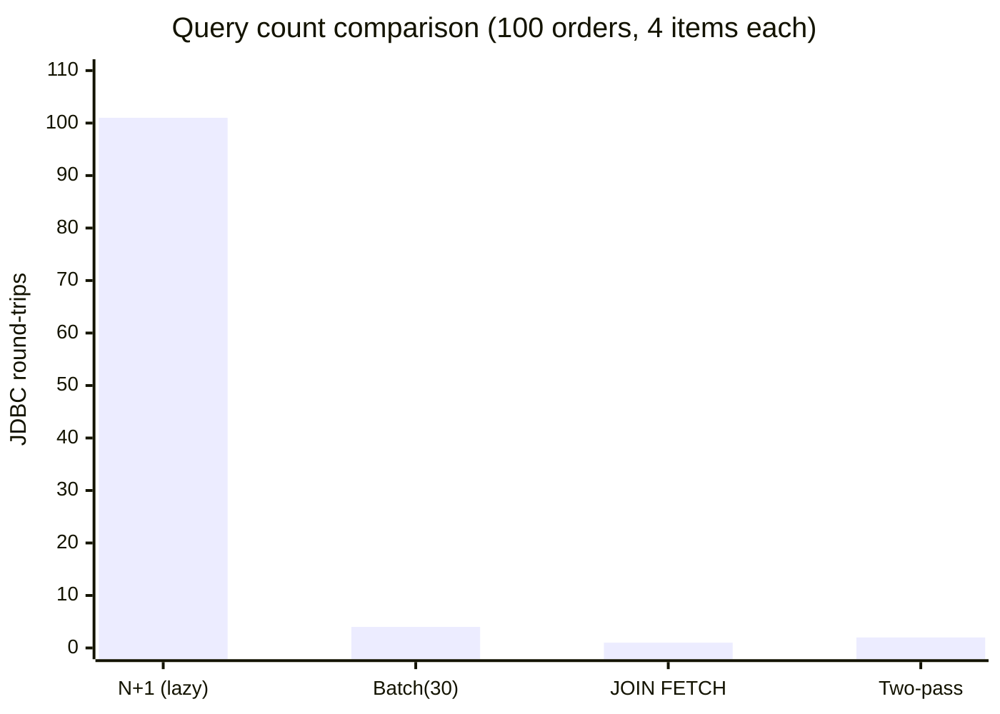

# JPA - L4 Anti-Patterns

## JPA Anti-Patterns: N+1, Cartesian Product, Cross Join at Scale

### 🎯 Model Answer

**30 seconds:**
> Three major JPA query anti-patterns: (1) N+1: load N parent entities, then N individual
> SELECTs for each lazy collection = N+1 total queries. Fix: JOIN FETCH or EntityGraph.
> (2) Cartesian product: JOIN FETCH two collections simultaneously = rows explode. Fix: separate
> queries. (3) Cross join: missing WHERE clause between tables in JPQL = cartesian product in SQL.

**3 minutes (Senior):**
> Anti-pattern details:
>
> 1. **N+1**: classic example: `List<Order> orders = orderRepo.findAll()` returns 100 orders.
>    Each order accesses `order.getItems()` (lazy). 100 individual SELECTs for items = 101 queries.
>    Diagnosis: `spring.jpa.show-sql=true` + count SELECT statements. Fix: `JOIN FETCH o.items`
>    in the query or `@EntityGraph(attributePaths = {"items"})` on the repository method.
>
> 2. **Cartesian product**: `SELECT o FROM Order o JOIN FETCH o.items JOIN FETCH o.tags`.
>    If order has 10 items and 5 tags: 10 * 5 = 50 result rows for ONE order. For 100 orders
>    with 10 items and 5 tags: 50,000 rows returned. Hibernate deduplicates in memory but DB
>    transfer is 50,000 rows. Fix: fetch items in one query, tags in a separate query (two passes).
>
> 3. **Implicit cross join (JPQL)**: `SELECT o FROM Order o, Customer c WHERE o.total > 1000`.
>    Missing JOIN condition. SQL: `SELECT ... FROM orders, customers WHERE total > 1000`.
>    Cartesian product: 1 million orders * 10,000 customers = 10 billion rows before the WHERE.
>    Fix: always use explicit `JOIN o.customer c WHERE ...` (JPQL explicit join).

**Blank Mind Recovery:**

**(1) Restate:** "N+1: 1 query + N lazy loads. Fix: JOIN FETCH or EntityGraph. Cartesian product: JOIN FETCH two bags at once. Fix: separate queries. Implicit cross join: missing join condition. Fix: explicit join syntax."

**(2) First principles:** "Every JDBC round-trip costs 1-10ms. 1000 round-trips = 1-10 seconds added latency. Fewer queries = faster. JOINs in one query: fewer round-trips. Two JOIN FETCHes on collections: row multiplication. Trade-off: avoid both extremes."

**(3) Bridge:** "N+1 is like fetching a supermarket aisle list, then separately visiting each aisle one at a time to check the stock. JOIN FETCH: get the aisle AND its stock in one trip. Cartesian product: combining all aisles with all stock items - an explosion of combinations."

---

### 📘 Concept Explanation

**N+1, Cartesian product, and cross join mechanics:**
```
N+1 PROBLEM IN DETAIL:

  @Entity
  public class Order {
      @Id Long id;
      
      @OneToMany(mappedBy = "order", fetch = FetchType.LAZY)
      private List<OrderItem> items;
  }
  
  // Service code triggering N+1:
  List<Order> orders = orderRepo.findAll();
  // SQL: SELECT * FROM orders                    (1 query)
  
  for (Order o : orders) {
      System.out.println(o.getItems().size());
      // SQL: SELECT * FROM order_items WHERE order_id = ?  (N queries)
      // First access to lazy collection: fires the SELECT.
      // 100 orders = 101 total SELECT statements.
  }
  
  // Fix 1: JOIN FETCH in query:
  @Query("SELECT DISTINCT o FROM Order o JOIN FETCH o.items")
  List<Order> findAllWithItems();
  // SQL: SELECT DISTINCT o.*, i.* FROM orders o JOIN order_items i ON i.order_id = o.id
  // 1 query. Returns all orders with items loaded.
  // DISTINCT: prevents duplicate Order objects in the list (one per joined row without DISTINCT).
  
  // Fix 2: @EntityGraph:
  @EntityGraph(attributePaths = {"items"})
  List<Order> findAll();  // Spring Data + EntityGraph = JOIN FETCH under the hood.
  
  // Fix 3: Hibernate batch fetching:
  @BatchSize(size = 30)
  @OneToMany(mappedBy = "order", fetch = FetchType.LAZY)
  private List<OrderItem> items;
  // When items are first accessed for any order: loads 30 orders' items in one IN query.
  // SQL: SELECT * FROM order_items WHERE order_id IN (1, 2, 3, ... 30)
  // For 100 orders: ceil(100/30) = 4 queries. Not 100.
  // Not as good as JOIN FETCH (4 vs 1 query), but no code change needed in the query.

CARTESIAN PRODUCT FROM DUAL JOIN FETCH:

  // Scenario: Order has items (10 per order) AND tags (5 per order).
  
  // WRONG: JOIN FETCH both collections in one query:
  @Query("SELECT DISTINCT o FROM Order o " +
         "JOIN FETCH o.items " +
         "JOIN FETCH o.tags " +
         "WHERE o.status = 'COMPLETE'")
  List<Order> findCompleteOrdersWrong();
  // SQL: SELECT DISTINCT o.*, i.*, t.*
  //      FROM orders o
  //      JOIN order_items i ON i.order_id = o.id
  //      JOIN order_tags t ON t.order_id = o.id
  //      WHERE o.status = 'COMPLETE'
  // For 100 complete orders: 100 * 10 items * 5 tags = 5,000 rows in result set.
  // Hibernate deduplicates in Java. But DB transfers 5,000 rows.
  // Hibernate also logs: "HHH90003004: firstResult/maxResults specified with collection fetch"
  // WITH PAGINATION: catastrophic. Hibernate fetches ALL rows (no SQL LIMIT),
  // does in-memory pagination. For 1M orders: OOM.
  
  // RIGHT: two separate queries:
  @Query("SELECT DISTINCT o FROM Order o JOIN FETCH o.items WHERE o.status='COMPLETE'")
  List<Order> findCompleteOrdersWithItems();
  
  @Query("SELECT DISTINCT o FROM Order o JOIN FETCH o.tags WHERE o.status='COMPLETE'")
  List<Order> findCompleteOrdersWithTags();
  
  // Service: load items in one query, tags in another.
  // DB: 2 queries with 100*10 and 100*5 rows (1,000 + 500 = 1,500 rows total).
  // vs: 5,000 rows in one query. Plus: safe with pagination (both queries support LIMIT).

IMPLICIT CROSS JOIN (JPQL BUG):

  // WRONG: two entities in FROM, no JOIN condition:
  @Query("SELECT o FROM Order o, Customer c WHERE o.total > 1000")
  List<Order> findBigOrdersWrong();
  // SQL: SELECT o.* FROM orders o, customers c WHERE o.total > 1000
  // Cartesian product: orders_count * customers_count = potentially billions of rows.
  // The WHERE clause is on orders only: all customer rows survive the filter.
  // Result: each order returned 10,000 times (once per customer). Deduplication needed.
  // But DB already transferred orders_count * customers_count rows. Fatal for large tables.
  
  // RIGHT: explicit JOIN:
  @Query("SELECT o FROM Order o JOIN o.customer c WHERE o.total > 1000")
  List<Order> findBigOrdersRight();
  // SQL: SELECT o.* FROM orders o JOIN customers c ON c.id = o.customer_id
  //      WHERE o.total > 1000
  // Correct JOIN. No cartesian product.
  // Or even simpler: customer data not needed, remove it:
  @Query("SELECT o FROM Order o WHERE o.total > 1000")
  List<Order> findBigOrdersSimplest();
```

---

### 💻 Code Example

> **Code walkthrough:** The pagination + JOIN FETCH combination is the most dangerous production
> failure. Hibernate cannot apply SQL LIMIT when JOIN FETCH is present, so it fetches ALL rows.

```java
// WRONG: JOIN FETCH + pagination = in-memory pagination catastrophe:
@Query("SELECT DISTINCT o FROM Order o JOIN FETCH o.items")
Page<Order> findAllWithItems(Pageable pageable);
// Hibernate log: "HHH90003004: firstResult/maxResults specified with collection fetch"
// SQL: SELECT DISTINCT o.*, i.* FROM orders JOIN order_items ...  (NO LIMIT!)
// Hibernate: fetches all rows into memory, then slices in Java.
// For 1M orders with 10 items each: 10M rows loaded. OOM or extreme slowness.

// RIGHT: Two-pass approach for paginated results with associations:
@Repository
public interface OrderRepository extends JpaRepository<Order, Long> {
    
    // Step 1: paginated query on IDs only (no collection fetch):
    @Query("SELECT o.id FROM Order o")
    Page<Long> findAllIds(Pageable pageable);
    // SQL: SELECT o.id FROM orders LIMIT ? OFFSET ?
    // Returns a page of 20 IDs. Efficient. No cartesian product.
    
    // Step 2: load those IDs with JOIN FETCH (no pagination, small set):
    @Query("SELECT DISTINCT o FROM Order o JOIN FETCH o.items WHERE o.id IN :ids")
    List<Order> findByIdsWithItems(@Param("ids") List<Long> ids);
    // SQL: SELECT DISTINCT o.*, i.* FROM orders o JOIN order_items i
    //      WHERE o.id IN (1, 2, 3, ... 20)
    // Only 20 orders * items. No pagination issue.
}

// Service: combine:
public Page<Order> getOrdersWithItems(Pageable pageable) {
    Page<Long> idPage = orderRepository.findAllIds(pageable);
    List<Order> orders = orderRepository.findByIdsWithItems(idPage.getContent());
    // Reassemble as Page using idPage.getTotalElements() for count:
    return new PageImpl<>(orders, pageable, idPage.getTotalElements());
}
```

> **Code walkthrough:** The two-pass approach avoids both the N+1 problem and the in-memory
> pagination problem. Step 1 fetches a page of IDs with proper SQL `LIMIT/OFFSET`. Step 2 fetches
> the full entities (with JOIN FETCH for items) for only those 20 IDs. No cartesian product
> (only 20 orders in the JOIN), no in-memory pagination (no Pageable on the second query). The
> total count comes from the first query's `Page.getTotalElements()`.

---

### 🎓 Answers by Seniority

**Junior / Mid (0-5 years):**
> N+1: loading N entities then N lazy selects for associations. Fix: `JOIN FETCH` or `@EntityGraph`.
> Don't `JOIN FETCH` multiple collections in one query (cartesian product). Two separate queries
> for multiple collections. Don't use `JOIN FETCH` with pagination (Hibernate loads everything
> in memory). Use two-pass approach for paginated data with associations.

---

**Senior / Staff (5+ years):**
> `@BatchSize(size=30)` on `@OneToMany`: a pragmatic middle ground. When N+1 is acceptable in
> low-traffic paths but you don't want to refactor all queries: batch fetching reduces 1000 queries
> to ceil(1000/30)=34. Not as good as JOIN FETCH for single-association paths but excellent for
> reducing overhead on code you can't immediately refactor. Production monitoring: APM tool (New
> Relic, Datadog, Dynatrace) or Hibernate statistics: log `getQueryExecutionCount()` per request.
> If a single HTTP request triggers 500+ queries: N+1 in production.

---

### ⚠️ Common Misconceptions

**Misconception: "`DISTINCT` in JPQL prevents duplicate rows in the DB query."**
`DISTINCT` in a JPQL `JOIN FETCH` query: prevents duplicate entity objects in the returned Java
`List`. The SQL `DISTINCT` is also added to the generated SQL, but it is applied AFTER the JOIN
produces the cartesian rows. For a JOIN FETCH on 100 orders each with 10 items: the SQL still
scans and transfers 1,000 rows (100 * 10), then applies DISTINCT. The `DISTINCT` in the SQL removes
duplicate rows, but the JOIN still produces them. The DB optimizer may still generate a hash/sort
for DISTINCT. In most cases: `DISTINCT` in JPQL just prevents Java-level list duplicates. The
cartesian multiplication in the DB still occurs. For this reason: `DISTINCT` does NOT solve the
cartesian product problem for dual `JOIN FETCH` queries - it only prevents returning 5,000 duplicate
Order objects in the Java list (Hibernate still receives 5,000 rows from the DB).

---

### ⚖️ Comparison Table

| Problem | Symptom | Fix | Trade-off |
|---|---|---|---|
| N+1 | N*100 queries per request | `JOIN FETCH` or `@EntityGraph` | JOIN can increase row count |
| Cartesian product | Rows explode (N*M) | Separate queries per collection | 2 queries instead of 1 |
| Implicit cross join | Billions of rows | Explicit `JOIN o.field c` | None (always use explicit join) |
| Paginated JOIN FETCH | OOM / all-rows fetch | Two-pass: IDs page + load by IDs | 2 queries per request |
| Over-eager loading | Too much data loaded | DTO projection | Less flexible |

---

### 🏛️ System Design

**Query strategy for a product catalog service (read-heavy, associations):**
```
Read path decision tree:

  Request: GET /products/42 (detail view)
  -> Need: product + all categories + all tags + primary image
  -> Pattern: JOIN FETCH all (3 associations, small cardinality each)
  -> Query: SELECT p FROM Product p
            JOIN FETCH p.categories
            JOIN FETCH p.tags  -- PROBLEM: cartesian product
            JOIN FETCH p.images
  -> Fix: 3 separate queries (or DTO projection with native SQL)

  Request: GET /products (list view, paginated)
  -> Need: product name, price, primary category only
  -> Pattern: DTO projection (no entity loading, no associations)
  -> Query: SELECT new ProductListDto(p.id, p.name, p.price, c.name)
            FROM Product p JOIN p.primaryCategory c
            WHERE ...
  -> Two-pass for full product list with items:
     Query 1: SELECT p.id FROM Product ... LIMIT ? OFFSET ?
     Query 2: SELECT p FROM Product p JOIN FETCH p.items WHERE p.id IN (...)
```

---

### 📊 Diagram

**N+1 vs JOIN FETCH row retrieval:**

```
  N+1 PATTERN (100 orders):
  
  Request 1: SELECT * FROM orders           -> 100 rows
  Request 2: SELECT * FROM items WHERE order_id=1  -> 5 rows
  Request 3: SELECT * FROM items WHERE order_id=2  -> 3 rows
  ...
  Request 101: SELECT * FROM items WHERE order_id=100 -> 7 rows
  
  Total: 101 JDBC round-trips
  
  JOIN FETCH PATTERN (100 orders):
  
  Request 1: SELECT DISTINCT o.*, i.*
             FROM orders o JOIN order_items i
             ON i.order_id = o.id
             -> 400 rows (avg 4 items per order)
  
  Total: 1 JDBC round-trip. 400 rows transferred.
  
  TWO-PASS FOR PAGINATION (page of 20 from 10,000 orders):
  
  Request 1: SELECT o.id FROM orders LIMIT 20 OFFSET 200
             -> 20 IDs
  
  Request 2: SELECT DISTINCT o.*, i.*
             FROM orders o JOIN order_items i
             WHERE o.id IN (201..220)
             -> ~80 rows (avg 4 items)
  
  Total: 2 JDBC round-trips. 20 + 80 = 100 rows. Safe for pagination.
```



> **Diagram walkthrough:** The chart shows the dramatic difference in JDBC round-trips across
> strategies. N+1 makes 101 individual network calls for 100 orders. Batch fetching (`@BatchSize(30)`)
> reduces this to 4 calls (one for orders, ceil(100/30)=4 for items). JOIN FETCH achieves 1 call
> but risks cartesian products for multiple collections. Two-pass approach makes 2 calls (IDs page
> + entities with items) and is safe for pagination. The right choice depends on cardinality,
> pagination needs, and whether multiple collections need loading.

---

### 🚨 Failure Modes and Diagnosis

**Failure: Production slowdown traced to JOIN FETCH + pagination.**
```
Symptom: /api/orders?page=0&size=20 endpoint takes 45 seconds under load.
  Heap: 2GB used before GC kicks in.
  DB: CPU normal. But the single query transfers 100MB of data.

Root cause:
  @Query("SELECT DISTINCT o FROM Order o JOIN FETCH o.items")
  Page<Order> findAll(Pageable pageable);
  
  SQL: SELECT DISTINCT o.*, i.* FROM orders JOIN order_items ...
  (NO LIMIT clause in SQL! Hibernate applies pagination in Java.)
  
  1,000,000 orders * avg 5 items = 5,000,000 rows in memory.
  100MB data transfer. 45 seconds to process.

Diagnosis:
  spring.jpa.show-sql=true: look for SELECT without LIMIT when pageable is applied.
  Hibernate log: "HHH90003004: firstResult/maxResults specified with collection fetch"
  This warning = in-memory pagination. Fix immediately.

Fix:
  Use two-pass approach:
  Page<Long> ids = orderRepo.findAllIds(pageable);
  List<Order> orders = orderRepo.findByIdsWithItems(ids.getContent());
  return new PageImpl<>(orders, pageable, ids.getTotalElements());
```

---

### 🎯 Interview Deep-Dive

| Question Category | Time to Answer |
|---|---|
| N+1 explanation and fix | 3 minutes |
| JOIN FETCH cartesian product | 2 minutes |
| Pagination + JOIN FETCH | 2 minutes |
| Two-pass pagination pattern | 2 minutes |
| @BatchSize trade-off | 1 minute |
| EntityGraph vs JOIN FETCH | 1 minute |
| Implicit cross join cause | 1 minute |
| Diagnosis in production | 2 minutes |
| When to use each fix | 2 minutes |
| Native SQL vs JPQL for complex joins | 1 minute |
| DTO projection vs entity load | 1 minute |
| @Fetch(FetchMode.SUBSELECT) | 1 minute |

---

**Q1 (N+1): Describe the N+1 problem in JPA, how to detect it in production, and three different ways to fix it.**

A: N+1: a query returns N parent entities. Each parent's association is loaded lazily (default for
`@OneToMany`). When the application accesses the association (e.g., `order.getItems()`): a new
SELECT is fired for each parent. For N parents: N+1 total queries. Detection in production: (1)
Enable `spring.jpa.show-sql=true` and `logging.level.org.hibernate.SQL=DEBUG`: count SELECTs per
HTTP request. If one endpoint executes 101 SELECTs where 1 is expected: N+1. (2) APM tools (Datadog,
New Relic): DB query count per transaction. (3) Hibernate statistics: `getQueryExecutionCount()`.
Fix 1 - JOIN FETCH: `@Query("SELECT DISTINCT o FROM Order o JOIN FETCH o.items")`. One SQL. Works
best when all parents need the association. Fix 2 - EntityGraph: `@EntityGraph(attributePaths={"items"})`
on the repository method. Generates JOIN FETCH without writing JPQL. Fix 3 - BatchSize: `@BatchSize(size=30)`
on the collection. Access the association for any order: loads that order's items plus up to 29 more
in one IN query. Reduces N+1 to ceil(N/batchSize)+1 queries without changing query code.

*What separates good from great:* The N+1 that is acceptable vs the one that kills performance.
For a detail page showing ONE order with its items: loading items lazily = 2 queries (1 for order,
1 for items). Acceptable. For a list page showing 100 orders: loading items lazily = 101 queries.
Not acceptable. The rule: for LIST endpoints: always JOIN FETCH or EntityGraph for associations
that will be accessed. For DETAIL endpoints: lazy is often fine (2 queries is acceptable). The
alert threshold: any endpoint making more than 5-10 queries. Use Hibernate statistics in integration
tests to assert query counts: `@DataJpaTest` + `StatisticsInterceptor` + `assertEquals(2, stats.getQueryExecutionCount())`.
Catching N+1 in tests rather than production.

---

**Q2 (cartesian): Why does `JOIN FETCH` on two `@OneToMany` collections cause a cartesian product, and what is the safest fix?**

A: Cartesian product from dual JOIN FETCH: when an Order has N items and M tags, the SQL JOIN
produces N*M rows per order (every item combined with every tag). For 100 orders, 10 items, 5 tags:
100 * 10 * 5 = 5,000 rows returned from the DB. Hibernate deduplicates in Java (produces 100 Order
objects), but the DB has already scanned and transferred 5,000 rows. The JOIN FETCH on two collections
also conflicts with SQL LIMIT (pagination): Hibernate cannot apply LIMIT because the rows are
duplicated (N*M per entity). It falls back to in-memory pagination (fetches all rows, paginates in Java).
Safest fix: two separate queries. Query 1: `SELECT DISTINCT o FROM Order o JOIN FETCH o.items WHERE ...`.
Query 2: `SELECT DISTINCT o FROM Order o JOIN FETCH o.tags WHERE o.id IN :ids`. First query populates
items. Second query populates tags. Total rows: 100*10 + 100*5 = 1,500 (vs 5,000 in the single query).
Both queries support SQL LIMIT. Each query is independently pageable.

*What separates good from great:* The Hibernate `MultipleBagFetchException`. When two `@OneToMany`
fields are both `List<...>` (JPA "bag"): Hibernate throws `MultipleBagFetchException` at startup
for queries fetching both. The fix developers reach for: change both to `Set<...>`. But: Set + JOIN
FETCH still produces a cartesian product in SQL (just deduplicated in Java via hashCode/equals).
If equals is based on all fields: HashSet performs poorly. If based on ID only: data may be
silently deduplicated when items have duplicate IDs (shouldn't happen but a footgun). The correct
fix: separate queries, NOT changing List to Set. The `MultipleBagFetchException` is Hibernate
communicating "this query would produce incorrect results due to the cartesian product". Changing
to Set suppresses the exception but doesn't eliminate the underlying performance problem.

