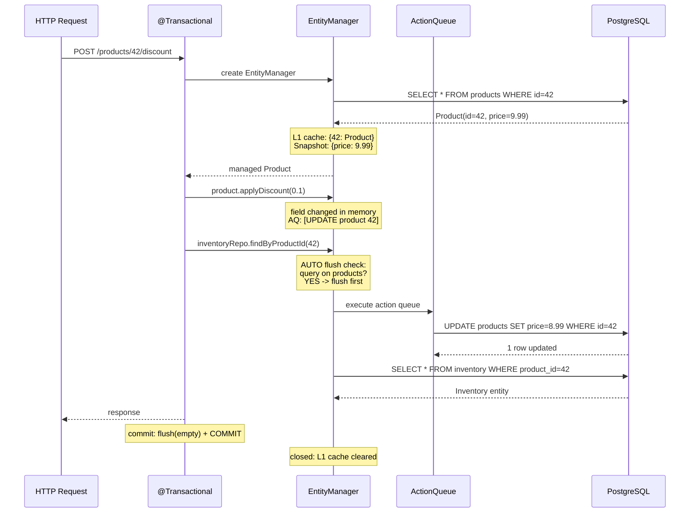

# JPA - L4 Internals

## Hibernate Session Internals: Flush Modes and Write-Behind Cache

### 🎯 Model Answer

**30 seconds:**
> Hibernate session: a write-behind cache. Changes to managed entities are not immediately sent
> to the DB. Hibernate accumulates them and sends on flush. Flush modes: `AUTO` (before query
> execution and on commit), `COMMIT` (only on commit), `MANUAL` (only on explicit flush), `ALWAYS`
> (before every query). Understanding flush timing: prevents surprises where reads don't see
> pending writes in the same transaction.

**3 minutes (Senior):**
> Hibernate Session internals:
>
> 1. **Persistence context as write-behind cache**: managed entities form the first-level cache.
>    Changes are accumulated (buffered). The "action queue" holds pending inserts, updates, deletes.
>    Flush: executes the action queue as SQL statements.
>
> 2. **Flush mode AUTO (default)**: Hibernate flushes before executing a query IF pending
>    changes might affect the query result. Hibernate evaluates: does the query's target table
>    have pending operations? If yes: flush (to make pending writes visible in the query).
>    If no (different table): no flush. This is the "auto-flush" heuristic.
>
> 3. **Flush mode COMMIT**: only flush on transaction commit. Read operations: always see
>    pre-flush state (may miss pending changes). Use for read-heavy transactions with many reads
>    and few writes (saves unnecessary auto-flush overhead).
>
> 4. **Action queue ordering**: Hibernate executes in this order: inserts, updates, deletes.
>    This matches FK constraints: insert parent before inserting child with FK. Delete child
>    before deleting parent. If `@OrderBy` or cascades conflict: can cause FK constraint
>    violations. `session.flushMode` + explicit `flush()` + `clear()` can control ordering.
>
> 5. **Dirty checking mechanism**: at flush time, Hibernate compares each managed entity's
>    current state to its snapshot (taken when the entity was loaded). Changed fields: UPDATE
>    SQL generated. No change: no SQL. Snapshot: copy of field values at load time. Stored in
>    the persistence context alongside the entity reference.

**Blank Mind Recovery:**

**(1) Restate:** "Persistence context: write-behind cache. Action queue: buffers inserts/updates/deletes. Flush: executes action queue. AUTO: flushes before queries on same table. COMMIT: only on commit. Dirty check: current state vs load-time snapshot."

**(2) First principles:** "DB roundtrips are expensive. Buffer writes, execute in batch. Dirty checking: only generate SQL for changed fields. Auto-flush: ensure reads within the same transaction see their own writes (read-your-own-writes consistency)."

**(3) Bridge:** "The Hibernate session is like a to-do list for the DB. You write down changes (action queue). You don't call the DB for each one. On flush: you execute all at once. Dirty checking: compare your new draft to the original (snapshot) - only send what changed."

---

### 📘 Concept Explanation

**Session internals, flush timing, and dirty checking:**
```
SESSION INTERNAL STRUCTURE:

  Session (EntityManager)
  ├── EntitiesByKey (Map<EntityKey, Object>)     - L1 cache
  ├── EntityEntries (Map<Object, EntityEntry>)    - snapshots + status
  │   └── EntityEntry:
  │       ├── entity reference
  │       ├── status: MANAGED, DELETED, GONE
  │       ├── loadedState: Object[] (snapshot at load time)
  │       └── entityKey
  └── ActionQueue
      ├── insertions: List<EntityInsertAction>
      ├── updates: List<EntityUpdateAction>
      ├── deletions: List<EntityDeleteAction>
      └── collectionOperations: ...

DIRTY CHECKING AT FLUSH:

  // Hibernate dirty check process (simplified):
  void flush() {
      for (EntityEntry entry : entityEntries.values()) {
          if (entry.status == MANAGED) {
              Object entity = getEntityByKey(entry.entityKey);
              Object[] currentState = extractCurrentState(entity);
              Object[] loadedState = entry.loadedState;  // snapshot
              
              // Compare field by field:
              int[] dirtyFields = findDirtyFields(currentState, loadedState);
              
              if (dirtyFields.length > 0) {
                  // Generate UPDATE SQL for dirty fields:
                  String sql = "UPDATE table SET field1=?, field2=? WHERE id=?";
                  queueUpdate(entry.entityKey, dirtyFields, currentState);
              }
          }
      }
      
      // Execute action queue:
      executeInserts();  // in order: parents before children
      executeUpdates();
      executeDeletes();  // children before parents
  }

FLUSH MODE BEHAVIOR:

  // AUTO (default) - flush before queries on potentially dirty tables:
  
  @Transactional
  public void autoFlushDemo() {
      Product p = productRepository.findById(1L).orElseThrow();
      p.setName("Updated");  // pending update. NOT sent to DB yet.
      
      // Query on the same table (products):
      // Hibernate: "pending update on products table.
      //   Query on products would miss the pending change.
      //   Flush first."
      List<Product> all = productRepository.findAll();
      // SQL: UPDATE products SET name=? WHERE id=1  (auto-flush!)
      // SQL: SELECT * FROM products
      // all: includes the updated name for product 1.
      
      // Query on a DIFFERENT table (orders):
      List<Order> orders = orderRepository.findAll();
      // No flush. Pending products update irrelevant for orders query.
      // SQL: SELECT * FROM orders  (no flush before this)
  }
  
  // COMMIT - only flush on commit:
  
  @Transactional
  public void commitFlushDemo() {
      em.setFlushMode(FlushModeType.COMMIT);  // for this session only
      
      Product p = productRepository.findById(1L).orElseThrow();
      p.setName("Updated");  // pending update
      
      // Query on products: NO auto-flush.
      List<Product> all = productRepository.findAll();
      // SQL: SELECT * FROM products  (NO flush before this!)
      // all: does NOT include the pending name change for product 1.
      // p.getName() = "Updated" (in-memory), but query returns old data.
      
      // Use case: read-heavy transaction with periodic writes.
      //   Avoid: each of 100 intermediate queries triggering auto-flush.
  }  // Commit: auto-flush. UPDATE SQL sent. DB updated.

AUTO-FLUSH HEURISTIC DETAILS (important edge case):

  // Hibernate determines if flush is needed based on the query's table:
  
  @Entity class Product { ... }  // table: products
  @Entity class Category { ... } // table: categories
  
  @Transactional
  public void edgeCase() {
      Product p = productRepository.findById(1L).orElseThrow();
      p.setCategory(categoryRepository.findById(2L).orElseThrow());
      // Pending update on Product: foreign key change (category_id).
      
      // Query on Category table:
      List<Category> cats = categoryRepository.findAll();
      // Hibernate heuristic: does the Category query involve pending Product changes?
      // Heuristic is conservative: if the query involves a joined table: may flush.
      // JPQL with JOIN: Hibernate flushes if any pending operation is on a joined table.
      // Native SQL: Hibernate cannot analyze. If pending operations exist: flushes
      //   (because it cannot know if native SQL touches the dirty tables).
      
      // Rule: native SQL queries with pending entity changes: always triggers flush.
  }
```

---

### 💻 Code Example

> **Code walkthrough:** The `COMMIT` flush mode combined with explicit periodic flushes is the
> key pattern for batch processing. Without it: auto-flush fires before every query in the loop,
> generating redundant flush overhead.

```java
// FLUSH MODE CONTROL FOR BATCH PROCESSING:

// WRONG: default AUTO flush mode in batch:
@Transactional
public void processBatchWrong(List<Long> productIds) {
    for (Long id : productIds) {
        Product p = productRepository.findById(id).orElseThrow();
        p.applyDiscount(0.1);
        // Dirty entity in session.
        
        // Query to check related inventory:
        // AUTO flush: Hibernate detects pending Product update.
        // Flushes (sends UPDATE SQL) before the inventory SELECT.
        // For 10,000 products: 10,000 individual UPDATEs interspersed
        // with 10,000 inventory SELECTs. Thrashing. Very slow.
        Inventory inv = inventoryRepo.findByProductId(id);
        log.info("Stock: {}", inv.getQuantity());
    }
}

// RIGHT: COMMIT flush mode + periodic explicit flush:
@Transactional
public void processBatch(List<Long> productIds) {
    // Set COMMIT flush mode: no auto-flush before queries.
    em.setFlushMode(FlushModeType.COMMIT);
    
    int count = 0;
    for (Long id : productIds) {
        Product p = productRepository.findById(id).orElseThrow();
        p.applyDiscount(0.1);
        
        // Inventory query: no auto-flush (COMMIT mode).
        // Reads pre-flush data (acceptable for logging).
        Inventory inv = inventoryRepo.findByProductId(id);
        log.info("Stock: {}", inv.getQuantity());
        
        count++;
        if (count % 500 == 0) {
            em.flush();   // explicit flush: send batched UPDATEs
            em.clear();   // clear L1 cache: free memory
        }
    }
    // Final flush at transaction commit (auto-commits remainder).
}
```

> **Code walkthrough:** The `WRONG` version with `AUTO` flush mode: each inventory query triggers
> a flush of the pending product update, resulting in 10,000 individual UPDATEs scattered between
> 10,000 inventory SELECTs. The `RIGHT` version sets `COMMIT` mode: no auto-flush before queries.
> The periodic `flush() + clear()` every 500 entities sends batched UPDATEs in groups and frees
> memory. The inventory reads see pre-flush data (acceptable here for logging). Final flush happens
> at transaction commit for the last partial batch.

---

### 🎓 Answers by Seniority

**Junior / Mid (0-5 years):**
> Hibernate session: buffers changes. Flush: sends changes to DB as SQL. Default: AUTO (flushes
> before queries). Use `em.flush()` to force. Use `em.clear()` after flush in batch operations.
> `COMMIT` mode: only flush at transaction commit.

---

**Senior / Staff (5+ years):**
> Hibernate's dirty-checking algorithm: at flush, for each managed entity, iterate all fields,
> compare to the snapshot. For entities with many fields (30+): dirty check is O(N fields * M
> entities). For large sessions (10,000+ entities): dirty check is the bottleneck (not DB). Fix:
> `@DynamicUpdate`: generates UPDATE SQL with only the changed fields (saves bandwidth for wide
> entities). `@DynamicInsert`: same for INSERT (only non-null fields). Alternative: use `COMMIT`
> flush mode and limit session size with flush/clear. Hibernate Statistics: `session.getStatistics().getEntityDirtyCount()`
> reveals how many entities triggered dirty-check UPDATEs.

---

### ⚠️ Common Misconceptions

**Misconception: "Hibernate always flushes before a query in AUTO mode."**
`FlushMode.AUTO`: Hibernate flushes before a JPQL/HQL query IF it determines the pending operations
might affect the query result. The check: does the query's FROM clause involve any table that has
pending inserts, updates, or deletes? If no match: Hibernate skips the flush. This heuristic works
for most cases but has edges: (1) Native SQL queries: Hibernate cannot inspect native SQL, so it
assumes a flush is needed whenever there are pending operations (conservative). (2) Mapped superclasses
or complex inheritance: Hibernate may over-flush or under-flush. In practice: native SQL + pending
entity changes = always flush. JPQL on a different table = no flush. Understanding this distinction
is key for optimizing flush behavior in complex transactions.

---

### ⚖️ Comparison Table

| Flush Mode | When Flush Occurs | Auto-Flush Before Query | Use Case |
|---|---|---|---|
| `AUTO` (default) | Before queries on dirty tables + on commit | Yes (heuristic) | General use, read-your-own-writes needed |
| `COMMIT` | Only on transaction commit | No | Read-heavy transactions, batch jobs |
| `MANUAL` | Only on explicit `em.flush()` | Never | Full manual control, unit test setup |
| `ALWAYS` | Before EVERY query | Always | Debugging, guaranteed consistency |

---

### 🏛️ System Design

**Write-behind cache in distributed JPA services:**
```
SINGLE-NODE SESSION STATE:

  HTTP Request
      |
      v
  Spring MVC (thread pool)
      |
      v
  @Transactional Service
      |
      v
  EntityManager (per-thread, per-request)
  ├── L1 Cache (request-scoped)
  ├── Action Queue (request-scoped)
  └── Flush on commit
      |
      v
  Database Connection Pool
      |
      v
  PostgreSQL

  No sharing between requests. Each request has its own session.

EXTENDED PERSISTENCE CONTEXT (anti-pattern in web apps):

  Extended PC: EntityManager lives across multiple transactions.
  Entities remain managed across requests (if same session).
  Memory: grows indefinitely. Not closed on request end.
  Risk: stale data, memory leaks, concurrency issues.
  Web apps: always use TRANSACTION-scoped EntityManager (default).
```

---

### 📊 Diagram

**Hibernate session lifecycle:**

```
  REQUEST: POST /products/{id}/discount

  HTTP Request Arrives
         |
         v
  @Transactional begins
  EntityManager created (empty session)
         |
         v
  findById(id) ---------> SQL: SELECT * FROM products WHERE id=?
  Entity -> L1 Cache               |
  Snapshot stored <-----------------
         |
         v
  product.applyDiscount()
  (field changed in memory)
  Action Queue: [UPDATE product 42]
         |
         v
  inventoryRepo.findByProductId(id)
  (AUTO flush heuristic: products table dirty)
         |
    [YES: query on products]
         |
         v
  FLUSH: execute action queue
  SQL: UPDATE products SET price=? WHERE id=42
  Action Queue: empty
         |
         v
  SQL: SELECT * FROM inventory WHERE product_id=42
  Returns Inventory entity
         |
         v
  Service method returns
         |
         v
  @Transactional commit
  FLUSH (action queue empty - already flushed)
  COMMIT DB transaction
         |
         v
  EntityManager closed
  L1 Cache cleared
  All entities detached
```



> **Diagram walkthrough:** The sequence diagram shows the Hibernate write-behind cache in action.
> After `applyDiscount`, the change sits in the action queue - no DB call yet. When `findByProductId`
> is called, the AUTO flush heuristic detects pending operations on the `products` table (which the
> inventory query involves via a join or same table), so it flushes the UPDATE before executing
> the SELECT. This ensures the inventory query sees the post-discount product state if it joins
> on products. At commit: the action queue is already empty (flushed earlier), so only the DB
> COMMIT is sent.

---

### 🚨 Failure Modes and Diagnosis

**Failure: Unexpected auto-flush causes performance regression.**
```
Symptom: a batch job that runs 10,000 iterations is suddenly slow.
  SQL logs: 10,000 individual UPDATE statements interspersed with SELECT statements.
  Previous version: no UPDATE statements until commit.

Root cause: a new JPQL query was added inside the loop.
  The new query hits the same table as pending entity changes.
  AUTO flush: triggers a flush before each query in the loop.
  Result: 10,000 individual updates instead of 1 batched update.

Diagnosis:
  spring.jpa.show-sql=true
  Count UPDATE statements: should be batched (few large groups), not scattered (10,000 individual).
  If scattered: auto-flush before each loop query.

Fix:
  Set COMMIT flush mode for the batch transaction:
  em.setFlushMode(FlushModeType.COMMIT);
  
  Add explicit periodic flush + clear:
  if (count % 500 == 0) { em.flush(); em.clear(); }
  
  Result: updates grouped into batches of 500. 20 UPDATEs instead of 10,000.
```

---

### 🎯 Interview Deep-Dive

| Question Category | Time to Answer |
|---|---|
| Write-behind cache concept | 2 minutes |
| Dirty checking mechanism | 3 minutes |
| Flush modes comparison | 2 minutes |
| Action queue ordering | 2 minutes |
| Auto-flush heuristic | 2 minutes |
| @DynamicUpdate purpose | 1 minute |
| Session memory management | 2 minutes |
| Native SQL and flush | 1 minute |
| Extended persistence context risk | 1 minute |
| Snapshot storage overhead | 1 minute |
| Flush mode in batch jobs | 2 minutes |
| Debugging flush behavior | 1 minute |

---

**Q1 (mechanism): Walk me through exactly what happens inside Hibernate when you call `em.flush()`.**

A: `em.flush()` executes in this sequence: (1) Dirty check: iterate all managed entities in the
persistence context. For each entity: compare current field values to the snapshot (array of values
copied at load time). Fields that differ: scheduled for UPDATE. The dirty check is O(entities * fields).
(2) Cascade: for entities added to collections of managed entities (CascadeType.PERSIST): schedule
INSERT for the new entities. For entities removed from `@OneToMany` with `orphanRemoval=true`:
schedule DELETE. (3) Action queue execution: Hibernate executes in order: insertions first (parents
before children, sorted by FK dependency), then updates, then deletes (children before parents to
avoid FK violations). (4) SQL generation: for each queued action, Hibernate generates the SQL
statement(s). For batch-configured sessions: groups same-entity SQL into JDBC batches. (5) JDBC
execution: statements sent to the DB connection. DB executes in the current transaction (not yet
committed). (6) Generated keys: for IDENTITY-strategy inserts: Hibernate reads the generated key
from the DB response and sets the `@Id` field on the entity. (7) After flush: entities remain
managed. Action queue is cleared. L1 cache still holds entities. A subsequent `flush()`: re-runs
dirty check from current state to the (unchanged) snapshot. If no further changes: no SQL.

*What separates good from great:* The dirty check snapshot storage cost. For each managed entity:
Hibernate stores an `Object[]` array equal in size to the number of mapped fields. For a session
with 5,000 entities, each with 20 fields: 5,000 * 20 = 100,000 Object references in memory (just
for snapshots), plus the same for the entity references themselves. For entities with LOB fields
(Strings, byte arrays): the snapshot holds a reference to the LOB object too (not a copy, unless
the field uses `@Basic(fetch=FetchType.LAZY)` LOB loading). Large LOB fields in managed entities:
significant heap pressure. Pattern to reduce: flush and clear frequently in long transactions.
Use DTO projections for reads (never create a managed entity with a LOB if you only need its
value once). `@DynamicUpdate`: doesn't help with snapshot memory, only with UPDATE SQL size.

---

**Q2 (diagnosis): How do you diagnose and fix unexpected UPDATE statements being generated by Hibernate when no explicit save was called?**

A: Unexpected UPDATEs: the persistence context's dirty checking detected a change to a managed
entity. Common causes: (1) A service method calls a repository method (which internally calls
`em.find()`) and the returned entity is modified - even accidentally. (2) A mapped bi-directional
relationship was updated on one side but not the other: Hibernate sees the inconsistency as a change.
(3) A `@PreUpdate` lifecycle callback modifies a field. (4) Lazy collection initialization triggers
a touch on the entity that the dirty check records as a change (rare but possible with custom equals).
Diagnosis: enable `org.hibernate.SQL` logging and `org.hibernate.type.descriptor.sql` for parameters.
Look for UPDATE statements not preceded by explicit save calls. Add Hibernate statistics:
`org.hibernate.stat.Statistics`. Check `entityUpdateCount`. Use a JPA listener or AOP interceptor
on `EntityManager.flush()` to log a stack trace. Fix: (1) use read-only transactions (`@Transactional(readOnly=true)`) for service methods that should never write. (2) call `em.detach(entity)` before passing to code
that might modify it. (3) use DTO projections instead of managed entities for read paths.

*What separates good from great:* The `@Transactional(readOnly=true)` guarantee. In a read-only
transaction: Hibernate sets `FlushMode=MANUAL` internally (Spring configures this). The dirty check
is never run. No UPDATEs can be generated, even if a managed entity is modified. If an entity is
modified and the transaction tries to flush: nothing happens (MANUAL mode). The modification is
silently discarded. This is the cleanest guarantee for "no accidental writes". Combined with
Spring's `readOnly=true` hint to the JDBC connection (potential routing to read replica): it's
the full read-only stack. For any service method that is conceptually read-only: `@Transactional(readOnly=true)` eliminates the entire category of "accidental write" bugs.

---

**Q3 (design): Why does Hibernate execute inserts before updates before deletes during flush, and when can this ordering cause problems?**

A: The ordering (inserts -> updates -> deletes) matches referential integrity constraints: insert
parent row before inserting child row that has a FK to the parent. Delete child row before deleting
parent row (to avoid FK violation). Updates: middle priority (after parents exist, before orphans
are removed). This order is correct for the most common case. It fails when: (1) Circular references:
entity A has FK to entity B, entity B has FK to entity A. Both being inserted in the same flush:
one must be inserted before the other, but each requires the other's ID first. Solution: one FK
must be nullable; insert both, then update the circular reference. (2) Self-referential entities
(tree structures): parent and child are the same type. Hibernate may try to insert child before
parent. Solution: `@Cascade` + ordering by parent_id, or insert parents first in a separate flush.
(3) `DELETE + INSERT` on the same PK: entity deleted and new entity with same PK inserted in same
transaction. Hibernate: executes DELETE, then INSERT. DB: no constraint violation. But if `ON DELETE CASCADE` on the delete triggers deletion of rows needed by the new entity: unexpected side effects.

*What separates good from great:* The "cascade delete + orphan removal + FK" interaction. An entity
has a `@OneToMany(cascade=REMOVE, orphanRemoval=true)` collection. The child has a FK to a third
table. Parent deleted: children scheduled for DELETE. But children's FK might be violated if the
third table's row is deleted AFTER the children's deletes are processed in the action queue. Hibernate:
tries to delete children (still violates FK if the third-table row is being deleted in the same flush).
Resolution: explicit `em.flush()` between the delete of the third-table entity and the delete of the
parent. This forces ordering: delete third-table row, flush, delete parent+children (no FK violation).
Or: `@ForeignKey(ConstraintMode.NO_CONSTRAINT)`: disable the FK constraint (dangerous but sometimes
pragmatic for audit/soft-delete scenarios).

