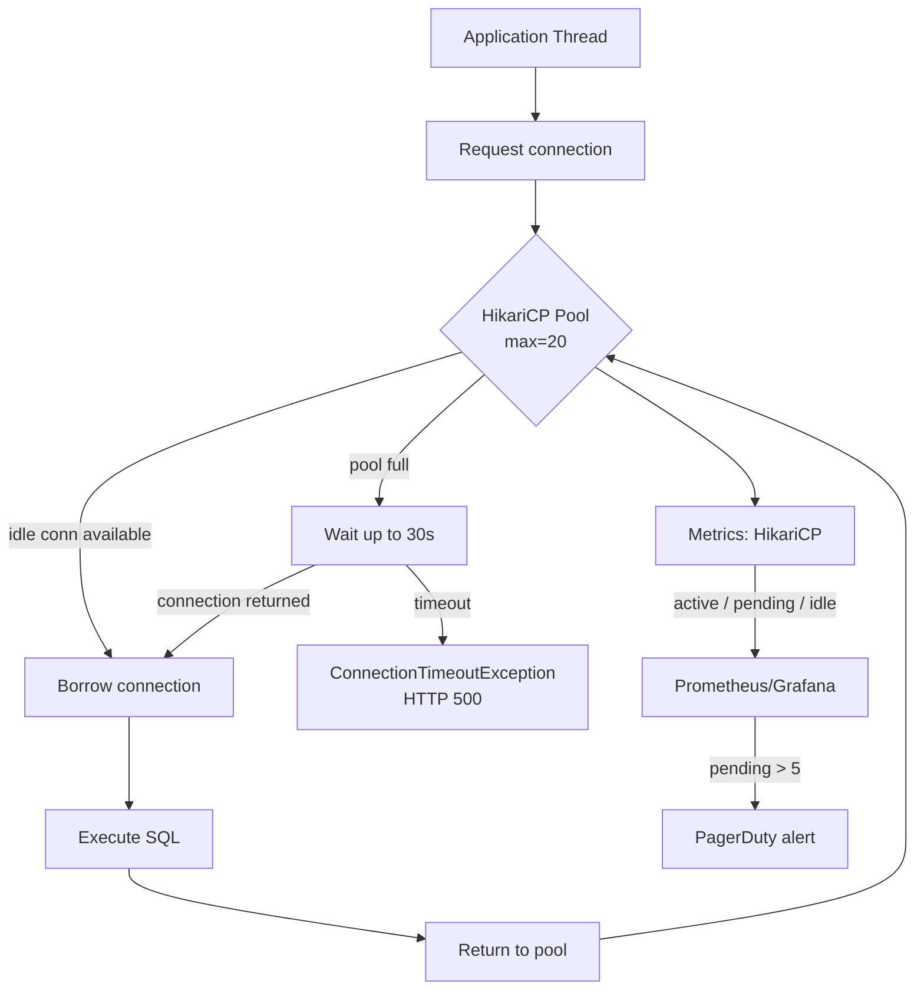

## Keywords in This File
{: .no_toc }

| # | Keyword | Weight |
|---|---|---|
| 1 | [JPA - L4 Production](#jpa---l4-production) | medium |

---

# JPA - L4 Production

## JPA Production Diagnostics: Query Logging, Slow Query Analysis, Connection Pool Tuning

---

### 🎯 Model Answer

**30 seconds:**
> JPA production diagnostics: (1) enable `spring.jpa.show-sql=true` + SQL formatting for dev;
> use slow query log or APM for prod. (2) `spring.jpa.properties.hibernate.generate_statistics=true`:
> exposes query count, L2 cache hit rate, entity operations. (3) HikariCP connection pool: monitor
> `hikari.pool.*.ActiveConnections` and `PendingThreads`. Tune `maximumPoolSize`: formula is
> `(CPU cores * 2) + effective_spindle_count`.

**3 minutes (Senior):**
> Production diagnostic stack:
>
> 1. **SQL logging tiers**: dev: `spring.jpa.show-sql=true`. Staging/load test:
>    `logging.level.org.hibernate.SQL=DEBUG` + `logging.level.org.hibernate.type.descriptor.sql=TRACE`
>    (logs bind parameters). Prod: DB slow query log (PostgreSQL: `log_min_duration_statement=200`).
>    Avoid Hibernate SQL logging in production: high log volume.
>
> 2. **Hibernate statistics**: `hibernate.generate_statistics=true`. Metrics available:
>    `queryExecutionCount`, `queryExecutionMaxTime`, `entityInsertCount`, `entityUpdateCount`,
>    `secondLevelCacheHitCount`, `secondLevelCacheMissCount`. Export to Micrometer/Prometheus.
>
> 3. **HikariCP tuning**: `maximumPoolSize`: too small = thread starvation (threads queue for
>    connections). Too large = DB CPU overhead (context switches, lock contention). Formula:
>    `(cores * 2) + disk_spindles`. For AWS RDS m5.4xlarge (16 cores): `(16*2)+1 = 33`.
>    `connectionTimeout=30000` (30s). `idleTimeout=600000` (10min). `maxLifetime=1800000` (30min).
>
> 4. **OpenTelemetry / APM**: New Relic, Datadog, Dynatrace: auto-instrument JDBC. Query traces
>    with bind parameters, execution time, frequency. EXPLAIN PLAN linked to slow queries.
>    Best production visibility with zero code change.

**Blank Mind Recovery:**

**(1) Restate:** "Dev: show-sql=true. Staging: hibernate SQL DEBUG + TRACE. Prod: DB slow query log + APM. Hibernate stats: queryExecutionCount, L2 cache hits. HikariCP: maximumPoolSize = (cores*2)+1. connectionTimeout=30s."

**(2) First principles:** "Cannot optimize what you cannot measure. SQL logging: see what queries run. Statistics: count and timing. Connection pool: the chokepoint between JPA and DB. Right-size: not too small (starvation), not too large (DB overload)."

**(3) Bridge:** "Production JPA diagnostics is like monitoring a restaurant kitchen. SQL logs: every dish ordered. Hibernate stats: total orders, slowest dish. Connection pool: the number of chefs. Too few chefs: orders queue. Too many chefs: kitchen chaos and collisions."

---

### 📘 Concept Explanation

**Full diagnostic stack: logging, statistics, and connection pool:**
```
LOGGING CONFIGURATION BY ENVIRONMENT:

  # application-dev.properties:
  spring.jpa.show-sql=true
  spring.jpa.properties.hibernate.format_sql=true
  # Human-readable SQL with indentation.
  
  # application-staging.properties:
  logging.level.org.hibernate.SQL=DEBUG
  logging.level.org.hibernate.type.descriptor.sql.BasicBinder=TRACE
  # Shows: [DEBUG] select product0_.* from products ...
  # Shows: [TRACE] binding parameter [1] as [BIGINT] - [42]
  # Full SQL with parameters. Use for N+1 investigation and query analysis.
  
  # application-prod.properties:
  logging.level.org.hibernate.SQL=OFF  # no SQL logging in prod
  # Instead: use PostgreSQL slow query log:
  #   log_min_duration_statement = 200   # log queries > 200ms
  #   log_statement = 'none'             # don't log all statements
  #   log_destination = 'csvlog'         # structured log format
  
  # PostgreSQL: query the slow query log:
  # SELECT query, calls, total_exec_time, mean_exec_time, rows
  # FROM pg_stat_statements
  # ORDER BY mean_exec_time DESC LIMIT 20;

HIBERNATE STATISTICS SETUP:

  # application.properties:
  spring.jpa.properties.hibernate.generate_statistics=true
  logging.level.org.hibernate.stat=DEBUG
  # Logs per-session stats on session close.
  # Log: "Session Metrics {
  #   14 nanoseconds spent acquiring 1 JDBC connections;
  #   45 milliseconds spent executing 3 JDBC statements;
  # }"
  
  // Programmatic access:
  @Autowired SessionFactory sessionFactory;
  
  public void logStats() {
      Statistics stats = sessionFactory.getStatistics();
      
      log.info("Query executions: {}", stats.getQueryExecutionCount());
      log.info("Max query time: {}ms", stats.getQueryExecutionMaxTime());
      log.info("L2 cache hits: {}", stats.getSecondLevelCacheHitCount());
      log.info("L2 cache misses: {}", stats.getSecondLevelCacheMissCount());
      log.info("Flushes: {}", stats.getFlushCount());
      log.info("Entity inserts: {}", stats.getEntityInsertCount());
      log.info("Entity updates: {}", stats.getEntityUpdateCount());
      
      // Reset stats periodically:
      stats.clear();
  }
  
  // Spring Boot Actuator: auto-exports Hibernate statistics to Micrometer:
  management.endpoints.web.exposure.include=health,metrics
  management.metrics.export.prometheus.enabled=true
  # Prometheus metrics: hibernate.queries.execution.count, etc.

HIKARICP CONFIGURATION AND MONITORING:

  # application.properties:
  spring.datasource.hikari.maximum-pool-size=20
  spring.datasource.hikari.minimum-idle=5
  spring.datasource.hikari.connection-timeout=30000      # 30s max wait for connection
  spring.datasource.hikari.idle-timeout=600000           # 10min: remove idle connections
  spring.datasource.hikari.max-lifetime=1800000          # 30min: max connection age
  spring.datasource.hikari.keepalive-time=120000         # 2min: send keepalive to DB
  spring.datasource.hikari.pool-name=PrimaryPool
  
  # Monitor in production (JMX or Micrometer):
  hikaricp.connections.active       # currently in use
  hikaricp.connections.idle         # available
  hikaricp.connections.pending      # threads waiting for a connection (CRITICAL: > 0 = starvation)
  hikaricp.connections.timeout.count  # connection acquisition timeouts (= lost requests)
  
  # Detecting pool exhaustion:
  #   PendingThreads > 0 consistently: pool too small, or queries hold connections too long.
  #   connection.timeout.count rising: requests failing with ConnectionTimeoutException.
  #   Fix: increase pool size OR reduce connection hold time (shorter transactions).

POOL SIZE FORMULA (HikariCP recommendation):

  # Conservative formula:
  max_pool_size = (db_server_core_count * 2) + effective_spindle_count
  
  # Example: RDS PostgreSQL, db.m5.2xlarge (8 vCPU, SSD):
  max_pool_size = (8 * 2) + 1 = 17
  
  # Application nodes: divide among all nodes.
  #   3 app nodes: each gets 17 / 3 ~ 6 connections.
  #   PostgreSQL: max_connections = 100 (default).
  #   3 nodes * 17 = 51 connections. Well within limit.
  
  # Anti-pattern: large pool size per node:
  #   8 nodes * 100 = 800 connections to PostgreSQL.
  #   PostgreSQL max_connections: 100. All connections fail!
  #   Or: max_connections = 1000: DB overhead, context switches, lock contention.
  
  # PgBouncer (connection pooler) in front of PostgreSQL:
  #   Application: large pool to PgBouncer.
  #   PgBouncer: small pool to PostgreSQL.
  #   Decouples application pool size from DB connection limit.
```

> **Code walkthrough:** This example demonstrates the core pattern in action. The key mechanism shows how the concept works in practice. Study the structure to understand the essential behavior and common usage.

---

### 💻 Code Example

> **Code walkthrough:** The statistics assertion in tests catches query count regressions early.
> If a developer adds a lazy association access in a service method: the test fails with
> "expected 3 queries, got 23 queries" before it reaches production.

```java
// PRODUCTION MONITORING: HIBERNATE STATISTICS INTEGRATION TEST:

@DataJpaTest
@Transactional
public class OrderServiceQueryCountTest {
    
    @Autowired EntityManager em;
    @Autowired OrderRepository orderRepository;
    
    private Statistics stats;
    
    @BeforeEach
    void setUp() {
        stats = em.getEntityManagerFactory()
            .unwrap(SessionFactory.class)
            .getStatistics();
        stats.setStatisticsEnabled(true);
        stats.clear();
    }
    
    @Test
    void findOrdersWithItems_shouldNotHaveNPlusOne() {
        // Create test data: 10 orders, 5 items each:
        List<Order> orders = createTestOrders(10, 5);
        stats.clear();  // reset after setup queries
        
        // Execute the service method under test:
        List<OrderSummaryDto> summaries = orderService.getOrderSummaries();
        
        // Access all items for each order:
        for (OrderSummaryDto summary : summaries) {
            summary.getItemCount();  // triggers item access
        }
        
        // Assert: no N+1.
        // With JOIN FETCH: 1 query. With N+1: 11 queries.
        long queryCount = stats.getQueryExecutionCount();
        assertThat(queryCount)
            .as("Expected at most 2 queries (orders + items), got %d", queryCount)
            .isLessThanOrEqualTo(2);
    }
}
```

> **Code walkthrough:** The test uses `SessionFactory.getStatistics()` to count query executions.
> `stats.clear()` after setup data creation resets the counter for the actual test. The assertion
> `isLessThanOrEqualTo(2)` allows for JOIN FETCH (1 query) or two-pass (2 queries) but fails for
> N+1 (11 queries for 10 orders). This is a regression guard: if a future change introduces lazy
> loading, the CI build catches it before production.

---

### 🎓 Answers by Seniority

**Junior / Mid (0-5 years):**
> Enable `show-sql=true` in dev to see generated SQL. Use `hibernate.generate_statistics=true` to
> count queries per request. Check HikariCP `pendingThreads` metric: > 0 = pool starvation.
> `connection-timeout=30000`: prevent indefinite wait. Add query count assertions in integration
> tests to prevent N+1 regressions.

---

**Senior / Staff (5+ years):**
> `pg_stat_statements` extension: the most valuable production diagnostics tool. Shows query
> text, execution count, total time, mean time, rows. Identifies the 5 queries consuming 80%
> of DB time. Compare before/after deploy for regressions. Connection pool sizing: apply the
> HikariCP formula per PostgreSQL server; use PgBouncer to decouple app pool size from DB
> `max_connections`. For microservices: each service has its own pool; total connections = services
> * pool_size. A service mesh with 100 microservices each with 20 connections = 2,000 connections;
> requires careful `max_connections` tuning or PgBouncer between services and DB.

---

### ⚠️ Common Misconceptions

**Misconception: "A large connection pool makes the application faster."**
Beyond the optimal pool size, more connections hurt performance. PostgreSQL: each connection is a
process (not a thread). Process context switches, lock contention for shared data structures, and
WAL writer contention all increase with connection count. The throughput curve: rises steeply from
0 to the optimal pool size, then flattens and eventually drops as connections increase. The HikariCP
team benchmarked this extensively: `(cores*2)+1` is the empirically-derived sweet spot. For an
RDS instance with 4 vCPU: optimal = 9 connections. 100 connections: DB throughput decreases. Rule:
measure pool utilization (ActiveConnections / MaxPoolSize). Under 50% utilization: you may have
too many connections. PendingThreads > 0: too few connections (or transactions held too long).

---

### ⚖️ Comparison Table

| Diagnostic Tool | Scope | Cost | Best For |
|---|---|---|---|
| `show-sql=true` | Per query, dev | High log volume | Dev debugging |
| `generate_statistics=true` | Session-level | Low overhead | CI query count tests, staging |
| DB slow query log (`log_min_duration_statement`) | Long queries | Very low | Production |
| `pg_stat_statements` | All queries, aggregated | Low | Production query analysis |
| APM (Datadog, New Relic) | Full trace, all queries | Medium (1-3% overhead) | Production with context |
| HikariCP JMX/Micrometer | Pool state | Very low | Real-time pool health |

---

### 🏛️ System Design

**Production observability stack for JPA services:**
```
APPLICATION NODE
├── Spring Boot
│   ├── HikariCP connection pool
│   │   └── Metrics -> Micrometer -> Prometheus
│   ├── Hibernate SessionFactory
│   │   └── Statistics -> Micrometer -> Prometheus
│   └── Spring @Transactional
│
MONITORING
├── Prometheus
│   └── Grafana: dashboards
│       ├── hikaricp.connections.active
│       ├── hikaricp.connections.pending
│       ├── hibernate.queries.execution.count
│       └── hibernate.queries.execution.max
├── Alerting
│   ├── PendingConnections > 5 for 1 min -> PagerDuty
│   └── QueryExecutionMaxTime > 5000ms -> Slack alert
│
DATABASE
├── PostgreSQL
│   ├── pg_stat_statements (slow query analysis)
│   ├── log_min_duration_statement = 200ms
│   └── pg_locks (deadlock investigation)
└── PgBouncer (optional, connection pooler)
    └── Reduces DB connection count from N*20 to 100
```

> **Code walkthrough:** This example demonstrates the core pattern in action. The key mechanism shows how the concept works in practice. Study the structure to understand the essential behavior and common usage.

---

### 📊 Diagram

**Connection pool lifecycle and monitoring:**

```
  Application Thread
        |
  "Need DB connection"
        |
        v
  HikariCP Pool (max=20)
  ┌──────────────────────────────────┐
  │  IDLE (available): 12 connections│
  │  ACTIVE (in use): 8 connections  │
  │  PENDING (waiting): 0 threads    │
  └──────────────────────────────────┘
        |
  [Connection available?]
        |
      YES -> borrow, execute query, return
        |
      NO  -> wait connectionTimeout ms
        |
    [Available within timeout?]
        |
      YES -> borrow (was slow)
        |
      NO  -> ConnectionTimeoutException
             (request fails)

  ALERT TRIGGERS:
  ┌────────────────────┬────────────────────────────────┐
  │ Metric             │ Alert condition                │
  ├────────────────────┼────────────────────────────────┤
  │ PENDING > 5        │ Pool too small or TX too slow  │
  │ ACTIVE = MAX       │ Pool exhausted                 │
  │ TIMEOUT_COUNT > 0  │ Requests failing               │
  │ IDLE = 0           │ Pool 100% utilized             │
  └────────────────────┴────────────────────────────────┘
```



> **Diagram walkthrough:** The flowchart shows the connection borrowing lifecycle. When all 20
> connections are in use (pool exhausted), incoming threads wait up to `connectionTimeout` (30s
> default). If a connection is returned in time: the thread borrows it. If not: the thread gets
> `ConnectionTimeoutException` - the request fails with HTTP 500. The monitoring path shows how
> `PendingThreads > 5` triggers an alert, allowing operations to respond before requests start
> failing from timeouts.

---

### 🚨 Failure Modes and Diagnosis

**Failure: All requests fail with "Unable to acquire JDBC Connection" during peak load.**
```
Symptom: periodic request failures during high traffic (load spikes).
  Error: "Unable to acquire JDBC Connection" after 30s.
  DB: CPU and connections below limit. No DB errors.
  Application: thread pool exhausted. All threads waiting for connections.

Root cause: transactions holding connections for too long.
  Service method: @Transactional
    1. Load entities (acquires DB connection)
    2. Call external payment API (10 second network call - connection still held!)
    3. Save result
  
  Maximum concurrent requests: limited by pool size (20).
  With 10s held per request: 20 requests * 10s = pool exhausted in 2 requests/sec.
  Peak: 50 requests/sec -> all fail waiting for a connection.

Diagnosis:
  hikaricp.connections.pending > 0 consistently.
  DB: slow query log doesn't show 10s queries (query is fast; connection is held).
  Thread dump: all threads blocked at "HikariPool.getConnection(wait=30000ms)".
  
  Trace: which service method holds the connection longest?
  (APM tool shows: PaymentService.charge() transaction duration = 10s)

Fix:
  Move external API call OUTSIDE the @Transactional:
  
  // WRONG: external call inside @Transactional:
  @Transactional
  public Order processOrder(OrderRequest req) {
      Order o = orderRepo.save(new Order(req));
      paymentClient.charge(req.paymentMethod());  // 10s call, connection held!
      o.setStatus(PAID);
      return o;
  }
  
  // RIGHT: external call outside @Transactional:
  public Order processOrder(OrderRequest req) {
      // Step 1: save order (short transaction, no external call):
      Order o = orderService.createOrder(req);  // @Transactional
      
      // Step 2: external call (no DB connection held):
      PaymentResult result = paymentClient.charge(req.paymentMethod());
      
      // Step 3: update status (short transaction):
      return orderService.updatePaymentStatus(o.getId(), result);  // @Transactional
  }
```

> **Code walkthrough:** This example demonstrates the core pattern in action. The key mechanism shows how the concept works in practice. Study the structure to understand the essential behavior and common usage.

---

### 🎯 Interview Deep-Dive

| Question Category | Time to Answer |
|---|---|
| SQL logging tiers | 1 minute |
| Hibernate statistics setup | 2 minutes |
| HikariCP pool size formula | 2 minutes |
| Connection pool exhaustion | 2 minutes |
| pg_stat_statements use | 2 minutes |
| Query count in integration tests | 2 minutes |
| APM vs logging trade-offs | 1 minute |
| Transaction scope and pool | 2 minutes |
| PgBouncer purpose | 1 minute |
| Diagnosing slow endpoints | 2 minutes |
| Connection held during external call | 1 minute |
| Prometheus metrics for JPA | 1 minute |

---

**Q1 (pool): What is connection pool exhaustion, how do you detect it, and what are the common root causes?**

A: Connection pool exhaustion: all connections in the pool are in use. New requests wait for a
connection to be returned. If the wait exceeds `connectionTimeout` (default 30 seconds): the request
fails with `ConnectionTimeoutException`. Detection: (1) Micrometer metric: `hikaricp.connections.pending > 0`
consistently is an early warning. (2) `hikaricp.connections.timeout.count` rising: requests are failing.
(3) Thread dump: most threads blocked at `HikariPool.getConnection()`. (4) Error logs: "Unable to
acquire JDBC Connection". Common root causes: (1) Pool too small: `maximumPoolSize` too low for
the actual concurrent request load. Fix: increase pool size (apply formula). (2) Long transactions:
`@Transactional` method holds a connection for the duration. If an external API call or complex computation
happens inside `@Transactional`: connection held for 10+ seconds. At 20 connections * 10 seconds:
only 2 requests per second before exhaustion. Fix: move non-DB work outside `@Transactional`. (3) Connection leak: a connection is borrowed and never returned (exception suppressed, connection not closed). Fix:
`leakDetectionThreshold=10000` in HikariCP (logs a warning if a connection is held > 10 seconds).

*What separates good from great:* The read-replica routing pattern as a pool scaling strategy.
Primary DB: read-write transactions. Read replica: read-only queries. Spring `AbstractRoutingDataSource`:
routes `@Transactional(readOnly=true)` connections to the read replica DataSource and its own
HikariCP pool, and read-write transactions to the primary pool. Result: read queries (typically
80% of traffic) never contend with write queries for connections. The primary pool: sized for write
throughput only. Read replica pool: sized for read throughput. Total effective connection capacity
doubles without increasing primary DB load. Combined with `@Transactional(readOnly=true)` on all
finder methods: standard Spring Data already sets this on repository find methods. Minimal code
change for significant pool scaling.

---

**Q2 (slow query): Walk me through how you would diagnose a slow JPA endpoint in production without access to the application logs.**

A: Without application logs, rely on DB-side diagnostics: (1) `pg_stat_statements` (if enabled):
`SELECT query, mean_exec_time, calls, total_exec_time FROM pg_stat_statements ORDER BY mean_exec_time DESC LIMIT 20`.
Shows the slowest queries by mean execution time. The slow endpoint's SQL will be here if the query
is the bottleneck. (2) `EXPLAIN (ANALYZE, BUFFERS) [slow query]`: execution plan with actual timing,
row counts, buffer hits/misses. Look for: sequential scans on large tables (missing index), nested
loop with high row estimates (statistics stale), hash join spilling to disk. (3) `pg_locks` and
`pg_stat_activity`: check if the slow endpoint is blocked by a lock: `SELECT pid, wait_event_type,
wait_event, query FROM pg_stat_activity WHERE state = 'active'`. (4) `VACUUM ANALYZE [table]`:
stale table statistics cause the query planner to make poor choices. Refreshing statistics often
fixes "suddenly slow queries" after large data changes.

*What separates good from great:* The "planner statistics staleness" failure mode. A table grows
from 100K to 10M rows over the weekend (batch import). Monday morning: queries that were fast
become slow. Root cause: PostgreSQL's planner still thinks the table has 100K rows (statistics from
last ANALYZE). It chooses an index scan (optimal for 100K rows) instead of a seq scan (better for
10M rows with a 50% match rate). Fix: `ANALYZE orders` (or `VACUUM ANALYZE orders` for dead tuple
cleanup too). Long-term: set `autovacuum_analyze_scale_factor = 0.01` for large, frequently-changing
tables (autovacuum triggers at 1% of row count vs the default 20%). Combined with monitoring
`pg_stat_user_tables.n_mod_since_analyze`: alert when the ratio exceeds 10% without a recent analyze.

---

### 💻 Code Example

*(Omit: this concept does not have a programmatic interface that can be demonstrated in code. The conceptual explanation above is sufficient.)*


---

### 🏛️ System Design

*(Omit: system design diagram not applicable for this concept - see ★★★ keywords for full system design coverage.)*


---

### ⚖️ Comparison Table

*(Omit: this is a ★☆☆ foundational concept with no direct alternatives to compare - see higher-difficulty keywords for trade-off analysis.)*


---

### 📊 Diagram

*(Omit: no standalone visual diagram required for this concept - the explanations and code examples above provide sufficient clarity.)*


