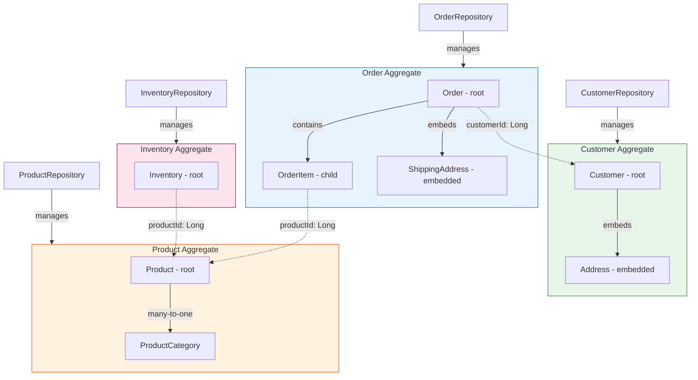

# JPA - L5 Architecture

## JPA at Scale: Aggregates, Repository Pattern, and Domain Model Design

### 🎯 Model Answer

**30 seconds:**
> JPA at scale: DDD aggregates map to JPA entities with a single aggregate root per transaction.
> Repository pattern: one `@Repository` per aggregate root (not per entity). Avoid "anemic domain
> model": entities have behavior, not just fields. Large aggregates (e.g., Order with 10,000 items)
> need decomposition to avoid loading the entire object graph per operation.

**3 minutes (Senior):**
> JPA architecture at scale:
>
> 1. **Aggregate boundaries**: an aggregate is a cluster of entities treated as one unit for
>    consistency. One transaction: one aggregate. Rules: (1) only reference other aggregates by ID
>    (no cross-aggregate entity references with `@ManyToOne`). (2) Only the aggregate root has a
>    repository. (3) External aggregates: loaded in a separate query, not navigated via association.
>
> 2. **Rich domain model**: entities have business methods (`order.addItem()`, `account.debit()`).
>    Validation inside the method. Services: orchestrate aggregates, don't contain business logic.
>    Anemic model: entity is a data holder; all logic in services. More verbose, harder to test.
>
> 3. **Large aggregate problem**: `Order` with 5,000 `OrderItem` entities. Loading the order:
>    loads all 5,000 items (even if you only need the order's status). Solution: (a) lazy loading
>    (only loads items on access). (b) Decompose: split `OrderSummary` (status, total) from
>    `OrderItems` collection. (c) Pagination at the item level: don't model items as a collection
>    in the aggregate; use a repository with pagination.
>
> 4. **Repository vs Spring Data repository**: Spring Data `JpaRepository` covers CRUD. For
>    complex queries: custom methods with `@Query`. For aggregate-specific operations: add custom
>    methods to the repository interface. Avoid: generic `save(entity)` for complex business
>    operations that have side effects. Prefer: explicit named methods.

**Blank Mind Recovery:**

**(1) Restate:** "Aggregate root: one repository. Cross-aggregate: ID reference only. Rich model: entities have behavior. Large aggregate: lazy + decompose. Repository: one per aggregate root, custom methods for business operations."

**(2) First principles:** "Consistency boundaries: one transaction = one aggregate. Cross-aggregate consistency: eventual (separate transactions + domain events). The ORM models the persistence. The domain model models the business. Keep them aligned but separate concerns."

**(3) Bridge:** "Aggregate is a team with a captain (aggregate root). Only the captain talks to the outside world. Internal team members report to the captain. Another team (aggregate): communicate through formal channels (IDs, not direct access)."

---

### 📘 Concept Explanation

**Aggregates, repository pattern, and domain model design:**
```
AGGREGATE DESIGN IN JPA:

  // Order aggregate: root + child entities:
  @Entity
  public class Order {  // AGGREGATE ROOT
      @Id @GeneratedValue
      private Long id;
      
      // Cross-aggregate reference by ID only:
      private Long customerId;  // NOT: @ManyToOne Customer customer
      // Reason: Customer is a separate aggregate.
      // Loading Order should NOT load the Customer graph.
      // Update Order: single aggregate transaction. No Customer lock.
      
      @OneToMany(mappedBy = "order",
                 cascade = CascadeType.ALL,
                 orphanRemoval = true)
      private List<OrderItem> items = new ArrayList<>();  // CHILD entities
      
      @Embedded
      private Money total;  // value object
      
      @Enumerated(EnumType.STRING)
      private OrderStatus status;
      
      // RICH DOMAIN MODEL: business logic in the entity:
      public void addItem(Product product, int quantity) {
          if (this.status != OrderStatus.DRAFT) {
              throw new IllegalStateException("Cannot modify non-draft order");
          }
          
          // Validate + update:
          OrderItem item = new OrderItem(this, product.getId(),
                                         quantity, product.getPrice());
          items.add(item);
          recalculateTotal();  // encapsulated behavior
      }
      
      public void submit() {
          if (items.isEmpty()) {
              throw new IllegalStateException("Cannot submit empty order");
          }
          this.status = OrderStatus.SUBMITTED;
          // raise domain event: OrderSubmitted (if using events)
      }
      
      private void recalculateTotal() {
          this.total = items.stream()
              .map(OrderItem::getSubtotal)
              .reduce(Money.ZERO, Money::add);
      }
  }
  
  @Entity
  public class OrderItem {  // CHILD entity: only accessible via Order
      @Id @GeneratedValue Long id;
      
      @ManyToOne(fetch = FetchType.LAZY)
      @JoinColumn(name = "order_id")
      private Order order;  // reference to aggregate root
      
      private Long productId;  // cross-aggregate: ID only
      private int quantity;
      private Money price;
      
      public Money getSubtotal() {
          return price.multiply(quantity);
      }
  }

ONE REPOSITORY PER AGGREGATE ROOT:

  // CORRECT: one repository for the Order aggregate:
  @Repository
  public interface OrderRepository extends JpaRepository<Order, Long> {
      
      Optional<Order> findByIdAndCustomerId(Long id, Long customerId);
      
      @Query("SELECT o FROM Order o WHERE o.status = :status AND o.customerId = :customerId")
      List<Order> findByStatusAndCustomer(
          @Param("status") OrderStatus status,
          @Param("customerId") Long customerId);
  }
  
  // WRONG: repository for every entity including child entities:
  @Repository interface OrderItemRepository extends JpaRepository<OrderItem, Long> {}
  // OrderItem is a child entity: never accessed directly without its Order.
  // Direct access bypasses aggregate invariants (e.g., cannot check order status).
  // Creates a "leaky aggregate": OrderItems accessible and modifiable outside the Order.

ANEMIC vs RICH DOMAIN MODEL:

  // ANEMIC MODEL (anti-pattern):
  @Entity
  public class Order {
      // Just fields, no behavior:
      private OrderStatus status;
      private List<OrderItem> items;
      // getters and setters only
  }
  
  // Service: all logic in the service:
  @Service
  public class OrderService {
      public void addItem(Long orderId, Long productId, int qty) {
          Order order = orderRepo.findById(orderId).orElseThrow();
          if (order.getStatus() != OrderStatus.DRAFT) {  // validation here
              throw new IllegalStateException("...");
          }
          OrderItem item = new OrderItem();
          item.setOrderId(orderId);
          item.setProductId(productId);
          item.setQuantity(qty);
          order.getItems().add(item);
          // Recalculate total: also here in service
          BigDecimal total = ...;
          order.setTotal(total);
          orderRepo.save(order);
      }
  }
  // Problems: (1) Logic duplicated if another service needs to add items.
  //           (2) Order invariants (status check, total recalc) can be bypassed.
  //           (3) Hard to test (requires Spring context to test service).
  
  // RICH MODEL (correct):
  // See Order.addItem() above.
  // Service only orchestrates:
  @Service
  public class OrderService {
      public void addItemToOrder(Long orderId, Long productId, int qty) {
          Order order = orderRepo.findById(orderId).orElseThrow();
          Product product = productRepo.findById(productId).orElseThrow();
          order.addItem(product, qty);  // behavior in entity
          orderRepo.save(order);
      }
  }

LARGE AGGREGATE DECOMPOSITION:

  // Problem: Order with thousands of items:
  @Entity
  public class Order {
      @OneToMany(mappedBy="order", fetch=FetchType.LAZY)
      private List<OrderItem> items;  // 5,000 items
      
      // Loading order for status check: still loads items on first access.
      // Using @Size(max=100) validator: loads all 5,000 items.
      // Any Spring event listener that touches items: loads all 5,000.
  }
  
  // Solution: move items to a separate query when needed:
  // Use pagination in the service, not a collection in the entity:
  
  @Repository
  public interface OrderItemRepository extends JpaRepository<OrderItem, Long> {
      // Items accessed via query, not via Order.getItems():
      Page<OrderItem> findByOrderId(Long orderId, Pageable pageable);
  }
  
  @Entity
  public class Order {
      // Remove the items collection from the aggregate root:
      // (or keep it but never navigate it; access via OrderItemRepository)
      private int itemCount;  // denormalized count to avoid collection load
      private Money total;    // denormalized total
  }
```

---

### 💻 Code Example

> **Code walkthrough:** The cross-aggregate ID reference pattern eliminates the most common JPA
> performance problem: accidentally loading a large aggregate graph because of an entity reference.

```java
// WRONG: cross-aggregate @ManyToOne reference:
@Entity
public class Order {
    // Cross-aggregate reference to Customer via @ManyToOne:
    @ManyToOne(fetch = FetchType.LAZY)
    @JoinColumn(name = "customer_id")
    private Customer customer;  // BAD: loads Customer graph with Order
    
    // Accessing order.getCustomer().getAddress() loads:
    //   Customer + Address + nested aggregates.
    // Order and Customer modified in the same transaction:
    //   Locks BOTH aggregates. Reduces concurrency.
}

// RIGHT: cross-aggregate reference by ID:
@Entity
public class Order {
    @Column(name = "customer_id", nullable = false)
    private Long customerId;  // GOOD: ID reference only
    
    // To get Customer: separate query when needed.
    // Order save: only touches Order table. Customer unaffected.
}

// Service: load both when genuinely needed (two queries, two transactions):
public OrderDetailView getOrderDetail(Long orderId, Long customerId) {
    Order order = orderRepository.findByIdAndCustomerId(orderId, customerId)
        .orElseThrow(() -> new OrderNotFoundException(orderId));
    Customer customer = customerRepository.findById(order.getCustomerId())
        .orElseThrow();
    return OrderDetailView.from(order, customer);
}
```

> **Code walkthrough:** The wrong version uses `@ManyToOne Customer customer` on `Order`. This
> couples the two aggregates: every `Order` transaction may touch the Customer row. The right
> version stores only `customerId`. To get customer details: an explicit second query. The key
> insight: separate queries = separate transactions = separate locks. When orders are processed
> concurrently, they don't contend for the same customer row lock.

---

### 🎓 Answers by Seniority

**Junior / Mid (0-5 years):**
> Repository per aggregate root. Child entities: no separate repository. Cross-aggregate: ID
> reference. Rich domain model: business logic in entities, not services. Anemic model: entity is
> just a data structure (less ideal). Large aggregate: lazy loading + decompose when items exceed
> hundreds.

---

**Senior / Staff (5+ years):**
> Aggregate design is the hardest part of DDD + JPA. Common over-design: too many small aggregates
> (each `@ManyToMany` tag becomes its own aggregate, requiring ID references and extra queries).
> Under-design: one God aggregate (the entire order domain in one entity graph). Calibrate: an
> aggregate should be the smallest cluster of objects that can be modified atomically in one
> transaction. For e-commerce: `Order` + `OrderItem` + `Address` (embedded) = one aggregate.
> `Customer`, `Product`, `Inventory` = separate aggregates. Domain events (`OrderSubmitted`):
> async notification to other aggregates without coupling them in the same transaction.

---

### ⚠️ Common Misconceptions

**Misconception: "One repository per `@Entity` is the correct JPA pattern."**
Spring Data JPA makes it easy to create a repository for every entity. This is technically possible
but architecturally incorrect for DDD aggregates. A child entity repository (`OrderItemRepository`)
allows code to modify `OrderItem` directly, bypassing the `Order` aggregate root. The business rule
"you cannot add items to a submitted order" lives in `Order.addItem()`. Direct `OrderItem` creation
via `OrderItemRepository.save()` bypasses that check. The result: an `OrderItem` can be inserted
for a submitted order, violating the aggregate invariant. Correct: one repository for the aggregate
root (`OrderRepository`). Child entities modified through the aggregate root's methods only.

---

### ⚖️ Comparison Table

| Design Pattern | JPA Approach | Trade-off | Use When |
|---|---|---|---|
| Rich domain model | Logic in `@Entity` methods | Harder to persist computed state | Domain is complex, business rules |
| Anemic model | Logic in `@Service` | Logic scattered, duplicated | Simple CRUD, no invariants |
| Cross-aggregate ID ref | `Long customerId` field | Extra query to load the aggregate | Default for all cross-aggregate refs |
| Cross-aggregate entity ref | `@ManyToOne Customer` | Couples lifecycles, locks | Only within the same aggregate |
| Repository per root | One `JpaRepository` per root | Less flexible for direct child access | Default (DDD-aligned) |
| Repository per entity | One per `@Entity` | Bypasses aggregate invariants | Simple CRUD, no DDD needed |

---

### 🏛️ System Design

**Order management system: JPA aggregate design at scale:**
```
AGGREGATE BOUNDARIES:

  Order Aggregate (root: Order)
  ├── Order (root, @Entity)
  ├── OrderItem (@Entity, child)
  ├── ShippingAddress (@Embeddable)
  └── OrderRepository (single entry point)

  Customer Aggregate (root: Customer)
  ├── Customer (root, @Entity)
  ├── Address (@Embeddable)
  └── CustomerRepository

  Inventory Aggregate (root: Inventory)
  ├── Inventory (root, @Entity)
  └── InventoryRepository

  Product Aggregate (root: Product)
  ├── Product (root, @Entity)
  ├── ProductCategory (@ManyToOne within same aggregate)
  └── ProductRepository

CROSS-AGGREGATE REFERENCES (by ID only):

  Order: customerId (Long)       -> Customer aggregate
  Order: [OrderItem.productId]   -> Product aggregate
  Inventory: productId (Long)    -> Product aggregate

CONSISTENCY:

  Within aggregate: ACID (single transaction)
  Across aggregates: eventual consistency via domain events

  OrderService.submit(orderId):
    1. Order.submit() [one ACID tx on Order aggregate]
    2. Publish OrderSubmittedEvent
    
    Event handlers (async, separate transactions):
    3. InventoryService: decrementInventory(productId, qty)
    4. CustomerService: addOrderToHistory(customerId, orderId)
    5. NotificationService: sendConfirmationEmail(customerId)
```

---

### 📊 Diagram

**Aggregate boundary visualization:**

```
  ╔══════════════════════╗   ID ref    ╔══════════════════════╗
  ║   Order Aggregate    ║------------>║  Customer Aggregate  ║
  ║                      ║             ║                      ║
  ║  ┌─────────────────┐ ║             ║  ┌───────────────┐   ║
  ║  │ Order (root)    │ ║             ║  │ Customer      │   ║
  ║  │  customerId: Long│ ║ (not @ManyToOne) │  (root)   │   ║
  ║  └─────────────────┘ ║             ║  └───────────────┘   ║
  ║         |            ║             ╚══════════════════════╝
  ║  ┌──────▼──────────┐ ║
  ║  │  OrderItem      │ ║   ID ref    ╔══════════════════════╗
  ║  │  (@Entity child)│ ║------------>║  Product Aggregate   ║
  ║  └─────────────────┘ ║             ╚══════════════════════╝
  ║         |            ║
  ║  ┌──────▼──────────┐ ║
  ║  │ ShippingAddress │ ║
  ║  │ (@Embeddable)   │ ║
  ║  └─────────────────┘ ║
  ║                      ║
  ╚══════════════════════╝
  OrderRepository: single entry point
```



> **Diagram walkthrough:** The diagram shows four aggregates with clear boundaries. Solid lines
> within an aggregate: entity references (`@ManyToOne`, `@OneToMany`). Dashed lines between
> aggregates: ID-only references (`Long customerId`). Each aggregate has exactly one repository
> (the entry point). The `OrderItem` has no direct repository: it is only accessible through
> `OrderRepository -> Order -> OrderItem`. This enforces that all modifications to items go
> through `Order.addItem()`, preserving the aggregate invariants.

---

### 🚨 Failure Modes and Diagnosis

**Failure: Aggregate design fails under concurrent order processing.**
```
Symptom: Order.submit() throws OptimisticLockException under load.
  100 concurrent order submissions fail with version conflicts.
  Root cause analysis: not an optimistic locking bug.

Real root cause: Order aggregate is too large.
  Order aggregate includes: Order + OrderItems + ShippingDetails + PaymentInfo + AuditLog.
  @Version on Order bumps on ANY change to any child entity.
  Concurrent audit log entries: each causes a version bump on Order.
  100 audit entries for 100 concurrent requests: 100 version conflicts.

Analysis:
  Not a locking strategy problem.
  It is an aggregate size problem.
  Audit log changes should NOT bump the Order version.
  Audit log is a separate aggregate (or a separate append-only table outside JPA aggregates).

Fix:
  Move AuditLog out of the Order aggregate.
  AuditLog: separate @Entity, separate repository, no @Version on Order needed for audit.
  Order version: only bumped by meaningful order state changes (add item, submit, etc.).
  100 concurrent audit logs: no Order version conflicts.

Lesson: every child entity in an aggregate shares the root's @Version. If a child changes
  frequently and independently: extract it to its own aggregate.
```

---

### 🎯 Interview Deep-Dive

| Question Category | Time to Answer |
|---|---|
| Aggregate definition | 2 minutes |
| One repository per aggregate | 2 minutes |
| Cross-aggregate ID reference | 2 minutes |
| Rich vs anemic domain model | 2 minutes |
| Large aggregate problem | 2 minutes |
| Domain events for cross-aggregate | 2 minutes |
| @Version on aggregate root | 1 minute |
| Transaction boundary = aggregate | 1 minute |
| Decomposing a God aggregate | 2 minutes |
| Repository vs DAO pattern | 1 minute |
| Testing aggregate behavior | 1 minute |
| Eventual consistency trade-off | 1 minute |

---

**Q1 (design): How do you decide where aggregate boundaries should be in a JPA domain model?**

A: Aggregate boundaries are consistency boundaries: what needs to change together, atomically, in
one transaction? Use case analysis: (1) "Add item to order": Order + OrderItem change together.
Same aggregate. (2) "View customer profile": Customer + Address displayed together, but no
simultaneous write needed. May be same aggregate. (3) "Process payment for order": Order status
changes AND inventory changes. Different domains, different timing. Different aggregates + domain
events for eventual consistency. Rules: (a) If two objects are always modified together in a
single user operation: candidate for same aggregate. (b) If one object is modified frequently
independently: should be its own aggregate. (c) If accessing one requires loading a large graph:
the aggregate is too big. (d) Cross-aggregate references: only by ID. If you're tempted to put a
`@ManyToOne` to another aggregate: make it a Long ID field instead.

*What separates good from great:* The "unbounded aggregate" failure mode. A team models a Customer
aggregate: Customer -> Orders -> OrderItems -> Products -> ProductCategories. Everything in one
graph. Loading a customer: loads the entire order history (could be 10,000 orders). Adding a
product category: requires locking the Customer row (because of the entity reference chain).
Customer update and product category update: in the same transaction (lock contention on the
Customer row). Solution: "Customer aggregate" contains only Customer + Address (never looked up
without the address). "Order aggregate" contains Order + OrderItems (one order per transaction).
Orders reference CustomerID by Long. Products: separate aggregate. The heuristic: each aggregate
should be loadable in one query (or a very small number). If loading the aggregate requires a JOIN
with more than 3 tables: it's likely too large.

