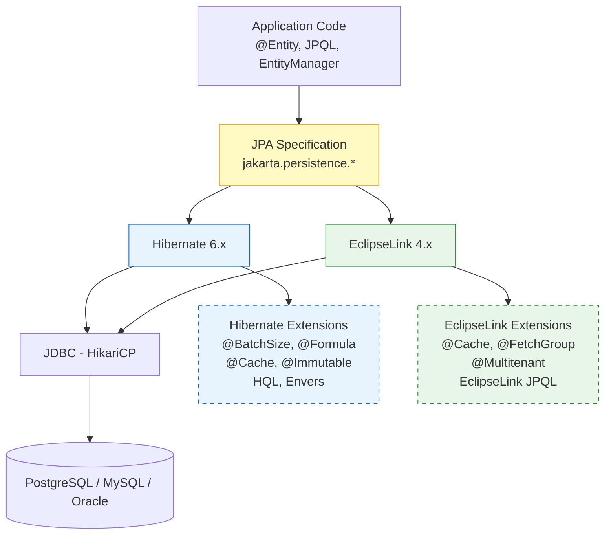

## Keywords in This File
{: .no_toc }

| # | Keyword | Weight |
|---|---|---|
| 1 | [JPA - L6 Theory](#jpa---l6-theory) | medium |

---

# JPA - L6 Theory

## JPA Specification vs Implementation: Portability and the Standard

---

### 🎯 Model Answer

**30 seconds:**
> JPA (Jakarta Persistence API): a specification (JSR-338). Hibernate, EclipseLink, OpenJPA are
> implementations. The spec defines: `@Entity`, `@Id`, JPQL, EntityManager API. Implementations
> add extensions beyond the spec. Code using only spec annotations and API: theoretically portable.
> Code using `@BatchSize`, `@Cache` (Hibernate-specific): not portable.

**3 minutes (Senior):**
> JPA specification vs implementation details:
>
> 1. **What the spec defines**: entity lifecycle (transient, managed, detached, removed), persistence
>    context (EntityManager), JPQL syntax (full query language), transactions (integration with JTA),
>    standard annotations (`@Entity`, `@Id`, `@ManyToOne`, `@Cache` (basic), `@NamedQuery`).
>
> 2. **What the spec does NOT define**: query execution plans, caching behavior beyond basic hints,
>    connection pool behavior, SQL generation, DDL generation specifics, optimization strategies
>    (lazy loading implementation, batch fetching).
>
> 3. **Why portability is rarely achieved**: real applications need performance. Performance tuning
>    requires provider-specific annotations and configuration. `@BatchSize` (Hibernate), `@FetchGroup`
>    (EclipseLink), `@QueryHints` (provider-specific). Once performance tuning is added: portability
>    is gone. Trade-off: accept provider lock-in for performance, or limit to spec for portability
>    (rarely worth it).
>
> 4. **JPA spec evolution**: JSR-220 (JPA 1.0, Java EE 5), JSR-317 (JPA 2.0, criteria API),
>    JSR-338 (JPA 2.1, stored procs), JPA 2.2 (Java 8 types), Jakarta Persistence 3.0 (jakarta
>    namespace), Jakarta Persistence 3.1 (Java 17 types, UUID as ID type).

**Blank Mind Recovery:**

**(1) Restate:** "JPA = spec. Hibernate = implementation. Spec: @Entity, JPQL, EntityManager. Impl: @BatchSize, @Cache (Hibernate), connection pool. Portability: lost once you add performance tuning. Jakarta Persistence 3.x: jakarta namespace."

**(2) First principles:** "A specification decouples interface from implementation. Client code programs to the interface (JPA). Provider delivers the implementation (Hibernate). This worked for simple apps. Performance optimization requires implementation-specific knowledge."

**(3) Bridge:** "JPA spec vs Hibernate is like SQL standard vs PostgreSQL. SQL standard: SELECT, JOIN, WHERE. PostgreSQL: JSONB, CTEs, pg_trgm. Standard apps: portable SQL. High-performance apps: use PostgreSQL extensions. Lock-in traded for performance."

---

### 📘 Concept Explanation

**JPA spec boundaries and Hibernate extensions:**
```
JPA SPEC (JAKARTA PERSISTENCE 3.1):

  Standard annotations (portable across implementations):
    @Entity, @Table, @Id, @GeneratedValue
    @Column, @JoinColumn, @JoinTable
    @OneToOne, @OneToMany, @ManyToOne, @ManyToMany
    @Embedded, @Embeddable, @ElementCollection
    @NamedQuery, @NamedNativeQuery
    @EntityListeners (@PrePersist, @PostLoad, etc.)
    @Cacheable (basic L2 cache hint: true/false)
    @Version (optimistic locking)
    @Lob, @Temporal, @Enumerated, @Basic
  
  Standard API:
    EntityManagerFactory, EntityManager
    EntityTransaction, Query, TypedQuery, CriteriaBuilder
    CriteriaQuery, CriteriaUpdate, CriteriaDelete
    StoredProcedureQuery (JPA 2.1+)
    EntityGraph (JPA 2.1+)
  
  Standard JPQL:
    SELECT, FROM, WHERE, ORDER BY, GROUP BY, HAVING
    JOIN, LEFT JOIN, FETCH JOIN
    Functions: LENGTH, SUBSTRING, ABS, COUNT, SUM, etc.

HIBERNATE EXTENSIONS (NOT spec, NOT portable):

  // Performance:
  @BatchSize(size = 30)         // batch load for collections
  @Fetch(FetchMode.SUBSELECT)   // subquery-based collection loading
  @DynamicInsert, @DynamicUpdate // only non-null / changed columns
  @Immutable                    // read-only entity, no dirty checking
  
  // Caching:
  @org.hibernate.annotations.Cache(usage = CacheConcurrencyStrategy.READ_WRITE)
  // (vs JPA @Cacheable which only enables/disables)
  
  // Type system:
  @Type(JsonType.class)         // custom Hibernate type mapping
  
  // HQL extensions (beyond JPQL):
  WITH clause (CTE): supported in HQL, not in JPQL standard
  INSERT INTO ... SELECT (bulk insert from query): Hibernate-specific
  BIT_LENGTH(), EXTRACT(), DB-specific functions
  
  // Schema generation:
  @Index (Hibernate, also has JPA @Index since 2.1)
  @ForeignKey (constraint name)
  @Check (check constraints)
  @Formula (virtual column from SQL expression)

  @Entity
  public class OrderItem {
      @Formula("(quantity * unit_price)")
      private BigDecimal subtotal;  // computed column, no @Column
      // SELECT quantity * unit_price AS subtotal FROM order_items
      // Read-only. Hibernate: includes the formula in SELECT.
      // No equivalent in JPA spec.
  }

JPA SPEC VERSIONS AND FEATURES:

  JPA 1.0 (2006): Basic entity mapping, JPQL, EntityManager.
  JPA 2.0 (2009): Criteria API, L2 cache API, @ElementCollection, validation.
  JPA 2.1 (2013): StoredProcedureQuery, entity graphs, on-update triggers.
  JPA 2.2 (2017): Java 8 date/time types (@Convert to LocalDate, etc.), Stream result.
  
  Jakarta Persistence 3.0 (2020): javax -> jakarta namespace (same features as JPA 2.2).
  Jakarta Persistence 3.1 (2022): UUID as standard @Id type, EXTRACT() in JPQL,
    Math functions in JPQL, improved casting.
  
  Application perspective:
    Spring Boot 2.x -> JPA 2.x (javax namespace)
    Spring Boot 3.x -> Jakarta Persistence 3.x (jakarta namespace, minimum Java 17)

WHEN PORTABILITY MATTERS (RARE):

  1. Library/framework authors: can't assume the JPA provider. Must use spec-only.
     Trade-off: no BatchSize, no Formula, limited cache control.
  
  2. Enterprise policy: company mandates a different provider per environment.
     Uncommon in practice. Most companies standardize on Hibernate.
  
  3. Embedded testing: using a different JPA provider for lightweight unit tests
     (e.g., EclipseLink for a CRUD test, Hibernate in production).
     Risk: behavior differences between providers cause false positives in tests.
     Better approach: Testcontainers with the same provider and DB as production.
  
  Conclusion: portability is largely theoretical. Use Hibernate's full feature set.
  The JPA spec is a useful abstraction (standard annotations, EntityManager API)
  but not a real portability guarantee in performance-sensitive applications.
```

> **Code walkthrough:** This example demonstrates the core pattern in action. The key mechanism shows how the concept works in practice. Study the structure to understand the essential behavior and common usage.

---

### 💻 Code Example

> **Code walkthrough:** `@Formula` is the Hibernate feature with no JPA equivalent that most
> developers wish existed in the spec. It enables computed read-only columns without a DB view.

```java
// SPEC-ONLY APPROACH (portable but limited):
@Entity
public class OrderItem {
    @Id @GeneratedValue Long id;
    int quantity;
    BigDecimal unitPrice;
    // No @Formula: spec-only code.
    // Caller: compute subtotal = quantity * unitPrice in Java.
    // Downside: cannot query by subtotal or sort by subtotal.
}

// HIBERNATE EXTENSION APPROACH (not portable, more powerful):
@Entity
public class OrderItem {
    @Id @GeneratedValue Long id;
    int quantity;
    BigDecimal unitPrice;
    
    @Formula("(quantity * unit_price)")
    @Column(insertable = false, updatable = false)
    private BigDecimal subtotal;  // computed by DB on SELECT
    // Can query: @Query("SELECT oi FROM OrderItem oi WHERE oi.subtotal > :min")
    // Sorts: ORDER BY oi.subtotal DESC
    // Cost: Hibernate includes formula in every SELECT (no column to INSERT/UPDATE).
}

// HIBERNATE @Immutable FOR READ-ONLY VIEWS:
@Entity
@Immutable  // no dirty checking, no flush for this entity
@Table(name = "order_summary_view")  // DB view
public class OrderSummaryView {
    @Id Long orderId;
    Long customerId;
    int itemCount;
    BigDecimal total;
    // Read-only: loaded into session without snapshot.
    // No dirty check overhead. Optimized for reads.
    // JPA spec equivalent: @Cacheable(false) + readOnly=true. Hibernate: @Immutable cleaner.
}
```

> **Code walkthrough:** The `@Formula` annotation generates `(quantity * unit_price)` as an
> SQL expression in the SELECT clause. This enables JPQL queries on the computed value without
> materializing it as a column. `@Immutable` on the view entity tells Hibernate: never dirty-check
> this entity, never generate UPDATE or INSERT SQL. These two Hibernate extensions provide significant
> ergonomic and performance benefits with no JPA spec equivalents.

---

### 🎓 Answers by Seniority

**Junior / Mid (0-5 years):**
> JPA: the standard annotations and API. Hibernate: the most common implementation. Standard
> annotations (`@Entity`, `@Id`, `@OneToMany`): portable. Hibernate-specific annotations
> (`@BatchSize`, `@Cache`, `@Formula`): Hibernate-only. Spring Boot: uses Hibernate by default.
> Practically: learn Hibernate-specific features freely (you'll be using Hibernate).

---

**Senior / Staff (5+ years):**
> The JPA specification is valuable as a stable API surface and mental model, not as a portability
> mechanism. Hibernate versions: the spec version and the Hibernate version are separate (Hibernate
> 6 implements Jakarta Persistence 3.x). When reading Hibernate docs: distinguish Hibernate-specific
> features from JPA-standard features. For library authors: program to the JPA API only. For
> application developers: use Hibernate extensions freely. The spec's primary value: the standard
> mental model (entity lifecycle, persistence context, JPQL fundamentals) that transfers across
> implementations.

---

### ⚠️ Common Misconceptions

**Misconception: "Using standard JPA annotations ensures portability between Hibernate and EclipseLink."**
Standard JPA annotations define the mapping. But behavior differs significantly: (1) JPQL execution:
the standard defines the query language but not optimization strategy. The same JPQL may produce
different SQL from Hibernate vs EclipseLink. (2) L2 cache: `@Cacheable(true)` enables the L2 cache
but configuration (TTL, eviction, strategy) is implementation-specific. (3) Lazy loading: both support
lazy loading but use different proxy strategies. EclipseLink: weaving (bytecode enhancement). Hibernate:
CGLIB/ByteBuddy proxy. Serialization behavior differs. (4) DDL generation: both support `hbm2ddl` but
generate slightly different DDL (column types, constraint names). Application-level portability: low
in practice. Schema-level: even lower. Plan for implementation-specific tuning when switching providers.

---

### ⚖️ Comparison Table

| Feature | JPA Spec | Hibernate Extension |
|---|---|---|
| Entity mapping | `@Entity`, `@Id`, `@Column` | `@DynamicUpdate`, `@Immutable` |
| Caching | `@Cacheable(true/false)` | `@Cache(usage=READ_WRITE, region="...")` |
| Collection loading | `fetch=LAZY/EAGER` | `@BatchSize`, `@Fetch(SUBSELECT)` |
| Custom types | `@Convert` (AttributeConverter) | `@Type(CustomType.class)` |
| Computed columns | None | `@Formula("SQL expression")` |
| Multi-tenancy | None | Hibernate filters, discriminator |
| Audit | `@PrePersist`, `@PostUpdate` | Envers (`@Audited`) |
| Schema hints | `@Index` (JPA 2.1+) | `@Check`, `@ForeignKey`, `@Table(indexes=...)` |

---

### 🏛️ System Design

*(Omit: L6 Theory keyword - specification analysis. No system design applicable.)*

---

### 📊 Diagram

**JPA specification layering:**

```
  APPLICATION CODE
  ┌────────────────────────────────────────────────────┐
  │  @Entity, @Id, @OneToMany (JPA spec annotations)   │
  │  EntityManager.find(), persist(), merge() (JPA API) │
  │  JPQL queries (JPA standard query language)         │
  └────────────────────────────────────────────────────┘
                        |
            Programs to the JPA interface
                        |
  JPA PROVIDER LAYER
  ┌─────────────────────┐     ┌──────────────────────┐
  │ Hibernate 6.x       │  OR │ EclipseLink 4.x      │
  │  + @BatchSize        │     │  + @Cache (own annot) │
  │  + @Cache (H annot)  │     │  + @FetchGroup        │
  │  + @Formula          │     │  + @Multitenant       │
  │  + HQL extensions    │     │  + EclipseLink JPQL   │
  └─────────────────────┘     └──────────────────────┘
                        |
             JDBC layer
                        |
  DATABASE
  ┌────────────────────────────────────────────────────┐
  │  PostgreSQL / MySQL / Oracle / H2 / SQL Server     │
  └────────────────────────────────────────────────────┘

  PORTABILITY LAYERS:
  App -> JPA spec: portable (within spec boundaries)
  JPA spec -> Provider: NOT portable (provider-specific SQL, caching, proxies)
  Provider -> DB: NOT portable (different SQL dialects)
```



> **Diagram walkthrough:** The solid lines show the standard path: application code programs to
> the JPA spec, and both Hibernate and EclipseLink implement the spec. The dashed boxes show
> provider extensions: these are OUTSIDE the standard. Code using `@BatchSize` (Hibernate extension)
> cannot be moved to EclipseLink without rewriting. The JDBC layer is common to both providers,
> but each generates different SQL for the same JPQL. The JPA spec is a stable API surface, not
> a guarantee of identical behavior.

---

### 🚨 Failure Modes and Diagnosis

**Failure: Code using JPA spec only still fails when switching providers.**
```
Symptom: migrated from Hibernate to EclipseLink (or vice versa).
  "JPA-standard" code fails with query or mapping errors.

Root cause: JPA spec portability is incomplete.

Example failures:
  1. @OneToMany collection delete behavior:
     Hibernate: orphanRemoval=true + CascadeType.REMOVE:
       DELETE children one by one (N DELETE statements).
     EclipseLink: bulk DELETE (one statement).
     Behavior: same result, different SQL count.
     
  2. JPQL result ordering:
     Hibernate: consistent ordering when using JOIN FETCH.
     EclipseLink: may return in different order.
     Code asserting exact list order: fails on one provider.
  
  3. Connection pool:
     Hibernate: uses HikariCP by default (Spring Boot).
     EclipseLink: uses DataSource directly.
     Switching provider: may change connection pool behavior.

Diagnosis:
  Compare generated SQL: spring.jpa.show-sql=true on both providers.
  Identify queries with different behavior.
  Test suite: run with both providers to identify incompatibilities.

Prevention:
  Do not assume portability. Test with the target provider before committing.
```

> **Code walkthrough:** This example demonstrates the core pattern in action. The key mechanism shows how the concept works in practice. Study the structure to understand the essential behavior and common usage.

---

### 🎯 Interview Deep-Dive

| Question Category | Time to Answer |
|---|---|
| JPA spec vs Hibernate | 2 minutes |
| What the spec defines | 2 minutes |
| Hibernate extensions | 2 minutes |
| When portability matters | 1 minute |
| JPA version history | 1 minute |
| javax vs jakarta | 1 minute |
| @Cacheable vs @Cache | 2 minutes |

---

**Q1 (spec): What does the JPA specification define, and what does it leave to implementations?**

A: JPA specification defines: (1) Entity lifecycle and persistence context semantics (transient,
managed, detached, removed states and their transitions). (2) Standard annotations: `@Entity`, `@Id`,
`@GeneratedValue`, `@Column`, `@OneToMany`, `@ManyToOne`, `@Embedded`, `@Version`, `@NamedQuery`,
`@EntityGraph`, `@Cacheable` (basic). (3) EntityManager API: `find()`, `persist()`, `merge()`,
`remove()`, `flush()`, `refresh()`, `detach()`. (4) Query API: JPQL syntax and semantics, Criteria
API, TypedQuery. (5) Transaction integration: JTA and resource-local transactions. (6) Basic L2
cache hints (`@Cacheable`). NOT defined by the spec: (1) SQL generation details (each provider
generates its own SQL). (2) L2 cache configuration (provider-specific: EhCache, Caffeine, Hazelcast
setup). (3) Lazy loading proxy mechanism (CGLIB, ByteBuddy, weaving). (4) Connection pool. (5)
Performance optimization annotations (`@BatchSize`, `@FetchGroup`). (6) Custom type mapping beyond
`AttributeConverter`. (7) Advanced HQL/JPQL extensions (CTEs, bulk insert).

*What separates good from great:* The `AttributeConverter` vs Hibernate `@Type` distinction. JPA
2.1 added `AttributeConverter<JavaType, DBType>`: standard, portable custom type mapping. Covers
most use cases: enum to String, LocalDate to Date, JSON to String. Hibernate `@Type`: required for
cases the standard `AttributeConverter` cannot handle (custom SQL types like PostgreSQL `JSONB`,
arrays, ranges). The practical rule: always prefer `AttributeConverter` (portable). Use `@Type`
only for types that require a custom Hibernate type handler (PostgreSQL JSONB, HStore, array types).
Hibernate 6: expanded built-in support for PostgreSQL types, reducing the need for custom `@Type`.

---

---

## ORM Impedance Mismatch: Where JPA Fights the Relational Model

---

### 🎯 Model Answer

**30 seconds:**
> Impedance mismatch: object-oriented model and relational model are fundamentally different. Objects:
> identity by reference, inheritance, behavior, graphs. Relations: identity by primary key, no
> inheritance natively, no behavior, sets/tuples. JPA bridges the gap but introduces friction:
> N+1, cartesian products, lazy loading, the identity map. Understanding the mismatch explains
> why JPA has these problems.

**3 minutes (Senior):**
> Five dimensions of the ORM impedance mismatch:
>
> 1. **Identity**: Java identity by reference (`==`) and object identity (`equals`). SQL identity
>    by primary key. JPA: entity equality should be by ID (business key), not object reference.
>    But JPA guarantees identity within a session: `em.find(X, 1L) == em.find(X, 1L)`. Across
>    sessions: not guaranteed. Implementing `equals`/`hashCode` on JPA entities: tricky
>    (entity before persist has no ID).
>
> 2. **Associations**: Java: object references (bidirectional graphs). SQL: foreign keys (one
>    direction). Bidirectional mappings: two sides, must keep in sync. `@OneToMany` + `@ManyToOne`:
>    the "owner" side controls the FK. Forgetting to set both sides: incorrect state.
>
> 3. **Data types**: Java: rich type system (enums, records, sealed classes, generics). SQL:
>    limited types (INT, VARCHAR, DECIMAL, BLOB). JPA: AttributeConverter to bridge. JSON in
>    SQL: increasingly common but not relational.
>
> 4. **Granularity**: Java: fine-grained objects (separate Address class). SQL: one table, many
>    columns. `@Embedded`: bridges by mapping fine-grained objects to flat table.
>
> 5. **Inheritance**: Java: class hierarchies. SQL: no native inheritance. Three strategies:
>    `SINGLE_TABLE`, `JOINED`, `TABLE_PER_CLASS`. Each: trade-offs between query performance,
>    normalization, and flexibility.

**Blank Mind Recovery:**

**(1) Restate:** "Identity mismatch: object ref vs PK. Association: bidirectional graph vs FK. Type: Java richness vs SQL primitives. Granularity: nested objects vs flat row. Inheritance: class hierarchy vs tables. Each mismatch = a JPA feature (and limitation)."

**(2) First principles:** "OOP models the world as objects with behavior and relationships. SQL models data as sets of tuples. These are fundamentally different models. Any translation layer (JPA) introduces friction at the boundaries. Understanding the mismatch: predicts where JPA will struggle."

**(3) Bridge:** "JPA impedance mismatch is like translating a novel from English to Chinese. Most ideas translate. Some idioms don't (chapters, object references, inheritance hierarchies). The translator (JPA) works hard but creates overhead and occasional inaccuracies at the boundaries."

---

### 📘 Concept Explanation

**Five dimensions of impedance mismatch and JPA's solutions:**
```
1. IDENTITY MISMATCH:

  Java identity:
    Address a1 = new Address("Main St");
    Address a2 = new Address("Main St");
    a1 == a2: false (different references)
    a1.equals(a2): depends on equals() implementation
  
  SQL identity:
    Two rows with same PK: same row. No concept of "object reference".
    Two rows with different PK: different rows (even if all columns equal).
  
  JPA: identity within session guaranteed (same EntityManager):
    Product p1 = em.find(Product.class, 1L);
    Product p2 = em.find(Product.class, 1L);
    p1 == p2: TRUE (same Java object, L1 cache)
  
  Across sessions: not guaranteed:
    Session A: Product p1 = em.find(Product.class, 1L);  // object reference X
    Session B: Product p2 = em.find(Product.class, 1L);  // object reference Y
    p1 == p2: FALSE (different sessions, different objects)
    p1.equals(p2): depends on equals() implementation
  
  equals()/hashCode() on JPA entities:
    Problem: new entity has no ID (null before persist).
    Pattern 1: use business key (e.g., product SKU):
      equals: this.sku.equals(other.sku)
      hashCode: sku.hashCode()
      Risk: SKU must be immutable and unique.
    
    Pattern 2: use database ID (Long):
      equals: Objects.equals(this.id, other.id)
      hashCode: (id != null) ? id.hashCode() : 0
      Risk: two unsaved entities with null ID: both equal (both null).
        Storing in a Set before persisting: only one will be stored.
    
    Pattern 3: no equals/hashCode override:
      Default: object reference identity.
      Risk: @OneToMany Set semantics broken after detach/reattach
        (new proxy object != original object reference).
    
    Best practice: natural business key if available.
    Avoid: ID-based equals if entities enter Sets before persisting.

2. ASSOCIATION MISMATCH:

  Java: bidirectional, object references:
    order.customer = customer       // Customer reference
    customer.orders.add(order)      // Order in Customer's List
    (same relationship, two references)
  
  SQL: unidirectional, FK:
    orders.customer_id = 5          // FK column
    (one FK column, one direction)
  
  JPA: must designate an "owner" side (the side that controls the FK column):
    @ManyToOne @JoinColumn: OWNER side -> controls INSERT/UPDATE of FK.
    @OneToMany mappedBy: INVERSE side -> ignored for SQL generation.
  
  Trap: setting only the inverse side:
    customer.getOrders().add(order);  // sets inverse side
    // Does NOT set the FK column: orderRepo.save(order) -> order.customer_id = NULL
    
    Fix: always set the owner side too:
    order.setCustomer(customer);      // owner side -> sets FK
    customer.getOrders().add(order);  // inverse side -> for in-memory consistency

3. TYPE MISMATCH:

  Java Enum -> SQL VARCHAR/INT:
    @Enumerated(EnumType.STRING): stores "ACTIVE", "INACTIVE" as VARCHAR.
    @Enumerated(EnumType.ORDINAL): stores 0, 1 as INT.
    ORDINAL: breaks if enum values are reordered. Always use STRING.
  
  Java LocalDate -> SQL DATE:
    @Column with LocalDate: JPA 2.2+ natively supports java.time types.
    H5: may need @Temporal or @Convert. H6: native support.
  
  Java Map/JSON -> SQL VARCHAR/JSONB:
    No spec support. Hibernate @Type(JsonType.class) or AttributeConverter:
    @Convert(converter=JsonMapConverter.class) -> serialize to String or JSONB.

4. GRANULARITY MISMATCH:

  Java: fine-grained object hierarchy:
    Customer -> Address -> Country (3 levels deep)
  
  SQL: flat table rows:
    customer: id, name, street, city, country_code (flat)
  
  JPA: @Embeddable bridges:
    @Embedded Address address -> columns: street, city, country_code (in customer table)
  
  Mismatch: Java wants "address.city". SQL has "customers.city".
  JPA makes this work transparently.

5. INHERITANCE MISMATCH:

  Java: abstract Vehicle -> Car, Truck, Motorcycle
  SQL: no native inheritance.
  
  JPA solutions:
  
  SINGLE_TABLE: one table, discriminator column:
    vehicles: id, type ('CAR', 'TRUCK'), payload, doors, engine_size
    Nullable columns for subtype-specific fields.
    Advantage: single JOIN for polymorphic query.
    Disadvantage: many nullable columns; no NOT NULL on subtype fields.
  
  JOINED: one table per class, JOINs:
    vehicles: id, type, engine_size
    cars: id (FK), doors
    trucks: id (FK), payload
    Advantage: normalized. Subtype-specific NOT NULL constraints possible.
    Disadvantage: JOIN required for every subtype load.
  
  TABLE_PER_CLASS: one table per concrete class (no JOINs):
    cars: id, engine_size, doors
    trucks: id, engine_size, payload
    Advantage: no JOINs.
    Disadvantage: polymorphic query (all Vehicle): UNION across all tables.
    Cannot use SEQUENCE generator (each table has own range).
```

> **Code walkthrough:** This example demonstrates the core pattern in action. The key mechanism shows how the concept works in practice. Study the structure to understand the essential behavior and common usage.

---

### 💻 Code Example

> **Code walkthrough:** The bidirectional sync helper method prevents the most common association
> mismatch bug - setting only the inverse side and having the FK not persist.

```java
// BIDIRECTIONAL ASSOCIATION SYNC (association mismatch solution):

// WRONG: only setting one side:
@Transactional
public void addItemWrong(Long orderId, Product product, int qty) {
    Order order = orderRepo.findById(orderId).orElseThrow();
    OrderItem item = new OrderItem(product.getId(), qty);
    order.getItems().add(item);  // sets inverse side only
    // item.setOrder(order) NOT called.
    // Hibernate: item.order_id = NULL on save.
    // FK constraint violation (or null FK if nullable).
}

// RIGHT: sync both sides in the aggregate root method:
@Entity
public class Order {
    @OneToMany(mappedBy = "order",
               cascade = CascadeType.ALL,
               orphanRemoval = true)
    private List<OrderItem> items = new ArrayList<>();
    
    // Helper method: sync both sides atomically:
    public void addItem(Long productId, int quantity, Money price) {
        OrderItem item = new OrderItem(this, productId, quantity, price);
        // item.order = this (owner side set in OrderItem constructor)
        // order.items.add(item) (inverse side set here)
        items.add(item);
        recalculateTotal();
    }
    
    public void removeItem(OrderItem item) {
        items.remove(item);  // orphanRemoval: schedules DELETE
        item.setOrder(null); // optional: clear owner reference
        recalculateTotal();
    }
}

@Entity
public class OrderItem {
    @ManyToOne(fetch = FetchType.LAZY)
    @JoinColumn(name = "order_id", nullable = false)
    private Order order;  // OWNER SIDE: controls FK
    
    OrderItem(Order order, Long productId, int qty, Money price) {
        this.order = order;  // owner side set in constructor
        this.productId = productId;
        this.quantity = qty;
        this.price = price;
    }
}
```

> **Code walkthrough:** The correct solution encapsulates the bidirectional sync inside the `Order`
> aggregate root methods (`addItem`, `removeItem`). The `OrderItem` constructor always sets the
> owner side (`this.order = order`). The `Order.addItem` method always adds to the inverse side
> (`items.add(item)`). Both sides stay in sync. External code cannot call `order.getItems().add(item)`
> directly (the collection is not exposed with a setter), enforcing correct use.

---

### 🎓 Answers by Seniority

**Junior / Mid (0-5 years):**
> ORM impedance mismatch: objects and relational data are different. Key mismatches: identity
> (object ref vs PK), associations (bidirectional Java vs FK one-direction), types (Java richness
> vs SQL types), inheritance (class hierarchy vs flat tables). JPA features map to each mismatch:
> `@Embedded` for granularity, `@Enumerated` for types, inheritance strategies for hierarchies.

---

**Senior / Staff (5+ years):**
> The identity mismatch is the most insidious for `equals`/`hashCode`. Rule for entities: use
> a natural business key for `equals` whenever possible (immutable, unique, available before
> persist). If no business key exists: use UUID assigned in the constructor (before persist) as
> the stable identity. Using DB-generated Long ID for `equals`: entities in a `Set` before persist
> all have null ID, so they're all "equal". Hibernate's identity guarantee within a session: valuable
> for avoiding duplicate loads, but breaks when entities are serialized (e.g., placed in HTTP session)
> and then deserialized - they become detached new objects with no L1 cache identity.

---

### ⚠️ Common Misconceptions

**Misconception: "ORM eliminates the need to understand SQL."**
ORM (JPA/Hibernate) reduces the amount of SQL you write. It does NOT eliminate the need to understand
SQL. Every JPA operation maps to SQL. N+1, cartesian products, missing indexes, lock contention: all
are SQL problems that manifest in JPA applications. Understanding `EXPLAIN ANALYZE`, join semantics,
index usage, and transaction isolation: required for any JPA developer above junior level. The ORM
hides SQL from casual reading but the SQL must still be correct and efficient. "ORM generates the
SQL for me": true. "I don't need to understand the SQL": false. Developers who rely on ORM without
SQL knowledge: produce slow, incorrect applications that are hard to diagnose because the SQL is
invisible until something breaks.

---

### ⚖️ Comparison Table

| Mismatch | Object Model | Relational Model | JPA Bridge |
|---|---|---|---|
| Identity | Object reference | Primary key | L1 cache identity guarantee |
| Association | Bidirectional references | FK (one direction) | `mappedBy`, owner/inverse sides |
| Data types | Rich Java types | SQL primitives | `@Convert`, `@Type`, `@Enumerated` |
| Granularity | Nested object hierarchy | Flat row | `@Embeddable`, `@Embedded` |
| Inheritance | Class hierarchy | No native inheritance | `SINGLE_TABLE`, `JOINED`, `TABLE_PER_CLASS` |
| Collections | Ordered lists, sets | Unordered sets of tuples | `@OrderColumn`, `@OrderBy` |

---

### 🏛️ System Design

*(Omit: L6 Theory keyword - fundamental theory analysis. No system design applicable.)*

---

### 📊 Diagram

**ORM impedance mismatch visualization:**

```
  JAVA OBJECT WORLD            JPA BRIDGE           SQL RELATIONAL WORLD
  
  Object Identity:             L1 Cache             Primary Key:
  Reference ==                 --------->           WHERE id = ?
  
  Bidirectional:              mappedBy               Foreign Key (one-way):
  A.b / B.a (both sides)     --------->             b.a_id
  
  Type System:                @Convert               SQL Types:
  enum, LocalDate, Map        @Enumerated            VARCHAR, DATE, TEXT
                             --------->
  
  Granularity:               @Embedded              Flat Row:
  Address.city               --------->             customers.city (column)
  
  Inheritance:               SINGLE_TABLE           Discriminator column
  Vehicle -> Car             JOINED      --------->  Vehicle + Car tables
                             TABLE_PER_CLASS         Cars table only
```

```mermaid
graph LR
    subgraph OO["Object-Oriented Model"]
        O1[Objects: identity by reference]
        O2[Bidirectional associations]
        O3[Rich type system]
        O4[Nested objects]
        O5[Inheritance hierarchies]
    end

    subgraph JPA["JPA Bridge Layer"]
        J1[L1 Cache\nIdentity map]
        J2[mappedBy\nOwner/Inverse]
        J3[@Convert\n@Enumerated\n@Type]
        J4[@Embedded\n@Embeddable]
        J5[SINGLE_TABLE\nJOINED\nTABLE_PER_CLASS]
    end

    subgraph REL["Relational Model"]
        R1[Rows: identity by PK]
        R2[Foreign keys - one direction]
        R3[SQL types: INT, VARCHAR]
        R4[Flat columns in one row]
        R5[Tables - no inheritance]
    end

    O1 --> J1 --> R1
    O2 --> J2 --> R2
    O3 --> J3 --> R3
    O4 --> J4 --> R4
    O5 --> J5 --> R5
```

> **Diagram walkthrough:** The diagram maps each dimension of the impedance mismatch through the
> JPA bridge layer. Each row represents one mismatch: object identity to PK identity (L1 cache
> as the bridge), bidirectional associations to unidirectional FK (mappedBy + owner/inverse),
> rich Java types to SQL primitives (@Convert/@Enumerated), nested objects to flat rows
> (@Embedded), and inheritance hierarchies to tables (three strategies). JPA's complexity is
> justified by the fundamental differences between these two models.

---

### 🚨 Failure Modes and Diagnosis

**Failure: Entities in a HashSet lose uniqueness after detach/reattach.**
```
Symptom: a Set<OrderItem> in the Order aggregate grows unexpectedly.
  Adding an existing item (same ID) results in two items in the Set.

Root cause: equals()/hashCode() on OrderItem uses object identity (default).
  Before detach: item1 == session.find(OrderItem, 1L)  [true, L1 cache]
  After detach + reattach (merge): item1 is still detached.
    A new proxy object represents the same DB row.
    item1 == proxy: false (different references).
    HashSet: treats item1 and proxy as different objects.
    Set.add(proxy): succeeds. Now two entries for the same DB row.

Diagnosis:
  Log: "Collection has duplicate elements" (Hibernate may warn).
  Check: equals()/hashCode() implementation on the entity.
  If default Object.equals(): uses reference identity.

Fix:
  Implement equals/hashCode based on business key or stable ID:
  
  @Entity
  public class OrderItem {
      @Id Long id;
      Long productId;  // business key for this context
      
      @Override
      public boolean equals(Object o) {
          if (this == o) return true;
          if (!(o instanceof OrderItem other)) return false;
          return Objects.equals(productId, other.productId)
              && Objects.equals(order, other.order);
      }
      
      @Override
      public int hashCode() {
          return Objects.hash(productId);
      }
  }
  // Stable: same productId = same logical item regardless of proxy/reference.
```

> **Code walkthrough:** This example demonstrates the core pattern in action. The key mechanism shows how the concept works in practice. Study the structure to understand the essential behavior and common usage.

---

### 🎯 Interview Deep-Dive

| Question Category | Time to Answer |
|---|---|
| Five dimensions of mismatch | 3 minutes |
| Identity mismatch details | 2 minutes |
| equals/hashCode on JPA entities | 2 minutes |
| Association mismatch and sync | 2 minutes |
| Inheritance strategy comparison | 2 minutes |
| Why ORM doesn't eliminate SQL knowledge | 1 minute |
| Bidirectional sync | 1 minute |
| Type mismatch solutions | 1 minute |

---

**Q1 (theory): Explain the ORM impedance mismatch and why it causes N+1 queries specifically.**

A: ORM impedance mismatch: object model and relational model are fundamentally different. In Java:
you navigate object graphs (`order.getItems().get(0).getProduct().getCategory().getName()`).
Each dot: in-memory access, no cost. In SQL: no such graph navigation. Each relationship requires
a JOIN or a separate query. JPA (as an ORM) maps Java object graph navigation to SQL queries.
The N+1 problem is the direct consequence of the association mismatch: (1) You load N `Order`
objects (1 SELECT). (2) For each order, you navigate `order.getItems()`: Java says "access the
items collection". JPA: the items are not in memory (lazy loading). JPA must translate the
navigation to a SQL query. For N orders: N SQL queries. Total: N+1. The mismatch: Java graphs
are navigated in memory (O(1) per hop). SQL associations require explicit I/O (O(1) per query +
network roundtrip). JOIN FETCH: the JPA solution to this mismatch - explicitly declare that a
navigation should be done via a JOIN (one SQL statement) rather than lazy I/O.

*What separates good from great:* The "transparent persistence" illusion. ORM promises: work with
objects naturally, the persistence is transparent. The impedance mismatch reveals: persistence is
not transparent. Every `order.getItems()` call: either a SQL query (lazy) or already loaded (JOIN
FETCH). The performance characteristics are very different from pure in-memory access. Developers
who believe in transparent persistence: write code that "looks" natural in Java but generates
hundreds of queries. The mental model required: think in terms of SQL when navigating JPA entities.
Each association navigation: ask "does this require a SQL query?". If yes: is this in a loop? If
yes: N+1. The discipline: treat JPA entity navigation like an I/O operation, not a free in-memory
access. This mental shift eliminates N+1 at the design phase.

---

### 💻 Code Example

*(Omit: this concept does not have a programmatic interface that can be demonstrated in code. The conceptual explanation above is sufficient.)*


---

### 🏛️ System Design

*(Omit: system design diagram not applicable for this concept - see ★★★ keywords for full system design coverage.)*


---

### ⚖️ Comparison Table

*(Omit: this is a ★☆☆ foundational concept with no direct alternatives to compare - see higher-difficulty keywords for trade-off analysis.)*


---

### 📊 Diagram

*(Omit: no standalone visual diagram required for this concept - the explanations and code examples above provide sufficient clarity.)*


