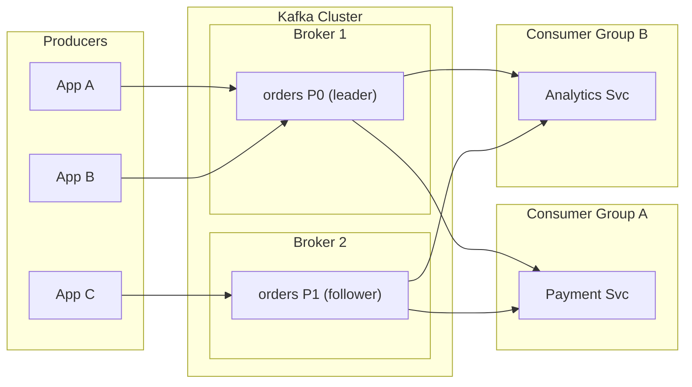

# Kafka - L0 Orientation

---

# Apache Kafka Overview

---
id: KFK-001
title: Apache Kafka Overview
category: Kafka
difficulty: ★☆☆
interview_weight: critical
asked_at: All
seniority: all
tags: #kafka, #messaging, #event-streaming, #distributed-systems
status: draft
sd: false
version: 1
---

🎯 Interview Weight: Critical — asked at the start of every Kafka interview
to establish baseline understanding before diving into depth.

---

### 🎯 Model Answer

**30 seconds:**
> Apache Kafka is a distributed event streaming platform built around an
> immutable, append-only log. It solves the problem of moving large volumes
> of data reliably between systems in real time - producers write events to
> topics, consumers read at their own pace. The key insight is that the log
> is the database: Kafka stores every event durably so any consumer can
> replay from any point in history.

**3 minutes (Senior):**
> Kafka was created at LinkedIn around 2010 to replace a fragile point-to-point
> messaging architecture where every producer needed a direct connection to
> every consumer. The result was a O(N*M) integration problem that broke
> whenever either end changed. Kafka solves this by decoupling producers and
> consumers through a shared, durable, ordered log. Producers append events to
> named topics without knowing who reads them. Consumers subscribe and read at
> their own pace, tracking their position with an offset. Because the log is
> retained for a configurable period - hours, days, or indefinitely - consumers
> can replay history, backfill new services, or recover from failures without
> losing data. The trade-off Kafka makes is optimizing for write throughput and
> horizontal scale over complex routing logic. It is not a task queue, not a
> database, and not a service bus - it is a durable, ordered, distributed log
> that many use cases are built on top of. The non-obvious insight is that the
> append-only log eliminates the coordination overhead that kills throughput
> in traditional message brokers.

**Framework:** WHAT → WHY → HOW → TRADE-OFF → EXAMPLE

*Adapting up:* For senior/staff, connect to system design - Kafka enables
event sourcing, CQRS, and change data capture (CDC) patterns. Discuss the
log as the system of record and downstream projections as derived views.

*Adapting down:* For junior - "Kafka is a high-speed, durable message bus
where systems publish events and other systems subscribe to them."

**Blank Mind Recovery:**

**(1) Restate:** "So you are asking about Apache Kafka - let me think through
what problem that solves."

**(2) First principles:** "From first principles, when you have many services
that need to exchange data in real time, you need something that handles high
throughput, survives crashes, and lets consumers catch up after falling behind."

**(3) Bridge:** "This reminds me of a publish-subscribe pattern. Kafka is
similar but different because it persists every message to disk and lets any
consumer replay from any offset - traditional pub-sub forgets messages after
delivery."

---

### 📘 Concept Explanation

**What it is:**
Apache Kafka is an open-source distributed event streaming platform that stores
and transports ordered, immutable sequences of records (called events) across
distributed systems at high throughput and low latency.

**The problem it solves:**
Before Kafka, data integration between systems required point-to-point pipelines
where each producer connected directly to each consumer. As systems multiplied,
this created a maintenance nightmare - N producers times M consumers meant N*M
integrations, each brittle and hard to evolve. Kafka reduces this to N+M by
acting as a central, durable intermediary. It also solves the velocity mismatch
problem: when a producer generates data faster than a consumer can process it,
Kafka buffers the excess durably so nothing is lost.

**How it works:**

```
Producers            Kafka Cluster           Consumers
─────────            ─────────────           ─────────
App A ──────────────> [Topic: orders]  ────> Payment Svc
App B ──────────────> [Topic: events]  ────> Analytics
App C ──────────────> [Topic: logs]    ────> Monitoring
         append-only log, partitioned     reads at own pace
         retained on disk                 tracks offset
```

1. A **producer** sends records to a named **topic**.
2. Each topic is split into one or more **partitions** - ordered, immutable logs.
3. Each record gets a sequential **offset** within its partition.
4. **Brokers** are the servers that store partitions on disk.
5. **Consumers** read records by polling brokers and tracking their offset.
6. The offset is the consumer's cursor - it controls exactly what has and
   has not been processed.
7. Kafka retains records for a configured retention period (e.g., 7 days)
   regardless of whether they have been consumed.

**The key insight:**
The append-only log is Kafka's superpower. Because writers never update
in-place and the log is the ground truth, multiple independent consumers
can read the same data at different speeds without interfering with each
other - and any consumer can replay from any past point simply by resetting
its offset.

**When to use it:**
- Moving data between microservices at high volume (100K+ events/sec)
- Building event-driven systems where downstream services react to changes
- Change data capture (CDC) - streaming database mutations downstream
- Event sourcing - using the log as the system of record
- Metrics, logs, and telemetry pipelines with multiple downstream consumers
- Decoupling services so they can evolve independently

**When NOT to use it:**
- Simple task queues with individual message acknowledgement (use RabbitMQ)
- Request/reply RPC patterns where a caller needs a synchronous response
- Low-volume, low-latency use cases where setup overhead exceeds benefit
- Complex message routing with content-based filtering (use a service bus)
- When you need FIFO ordering across all topics (Kafka only guarantees
  per-partition ordering)

**Alternatives:**
- RabbitMQ → traditional AMQP broker; better for task queues with complex
  routing; lower throughput; messages deleted after acknowledgement
- AWS Kinesis → managed Kafka-compatible streaming; tighter AWS integration;
  less flexible configuration
- Apache Pulsar → multi-tenant, tiered storage, unified messaging model;
  more features but more complexity than Kafka

**First-principles derivation:**
Given the constraint that high-volume data flows between systems at
different speeds, and that consumers need to be able to fall behind and
recover, the only options are: (A) block producers when consumers are slow
(kills throughput), (B) drop messages when consumers are slow (loses data),
or (C) buffer messages durably and let consumers read at their own pace.
Option C is the only one that scales. The most efficient durable buffer is
an append-only log - appends are sequential writes, the fastest operation
on spinning disk and optimal for SSD too. Kafka is the formalization of
option C with sequential-write storage.

---

### 💻 Code Example

**Example 1: Minimal producer sending an event**

```java
// gradle: org.apache.kafka:kafka-clients:3.7.0
Properties props = new Properties();
props.put("bootstrap.servers", "localhost:9092");
props.put("key.serializer",
    "org.apache.kafka.common.serialization.StringSerializer");
props.put("value.serializer",
    "org.apache.kafka.common.serialization.StringSerializer");

try (KafkaProducer<String, String> producer =
        new KafkaProducer<>(props)) {
    // ProducerRecord(topic, key, value)
    ProducerRecord<String, String> record =
        new ProducerRecord<>("orders", "order-123",
                             "{\"amount\": 99.99}");
    // send() is async - returns a Future
    producer.send(record, (metadata, exception) -> {
        if (exception != null) {
            // log and handle - do NOT silently swallow
            log.error("Send failed", exception);
        } else {
            log.info("Sent to partition={} offset={}",
                metadata.partition(), metadata.offset());
        }
    });
} // close() flushes outstanding messages - always use try-with-resources
```

*Why this matters:* `send()` is async - the callback is the only place
you know if delivery succeeded. Ignoring the callback means you lose
visibility into failures silently.

**Example 2: Minimal consumer reading events**

```java
Properties props = new Properties();
props.put("bootstrap.servers", "localhost:9092");
props.put("group.id", "payment-service");
props.put("key.deserializer",
    "org.apache.kafka.common.serialization.StringDeserializer");
props.put("value.deserializer",
    "org.apache.kafka.common.serialization.StringDeserializer");
// auto.offset.reset: where to start when no committed offset exists
props.put("auto.offset.reset", "earliest");

try (KafkaConsumer<String, String> consumer =
        new KafkaConsumer<>(props)) {
    consumer.subscribe(List.of("orders"));
    while (!shutdown.get()) {
        // poll() fetches available records (blocks up to timeout)
        ConsumerRecords<String, String> records =
            consumer.poll(Duration.ofMillis(100));
        for (ConsumerRecord<String, String> record : records) {
            process(record); // your business logic
        }
        // commitSync() acknowledges processed records
        consumer.commitSync();
    }
}
```

*Why this matters:* The poll loop is the fundamental Kafka consumer pattern.
`group.id` determines which consumer group this instance belongs to -
partitions are divided among group members for parallel processing.

---

### 🎓 Answers by Seniority

**Junior / Mid (0-5 years):**
> Kafka is a distributed messaging platform that works like a durable,
> ordered log. Producers write events to topics and consumers read them at
> their own pace. The big difference from traditional queues is that
> messages persist on disk for a configured period, so multiple consumers
> can read the same data independently and can replay history.

*Push deeper:* Mention partitions for parallelism, consumer groups for
load distribution, and the offset as the consumer's position cursor.

---

**Senior / Staff (5+ years):**
> Kafka is a distributed append-only log optimized for high-throughput
> event streaming. It was built to solve the N*M integration problem at
> LinkedIn - where point-to-point pipelines between services became
> unmanageable at scale. The log-centric design means producers and
> consumers are fully decoupled: a producer does not know who reads its
> data, and a consumer can replay any historical offset independently.
> The trade-off is that Kafka is not a task queue - it guarantees
> per-partition ordering but not global ordering, and it requires
> consumers to handle message reprocessing when they reset offsets.
> In practice, I have seen Kafka handle 1M events/sec per cluster with
> sub-10ms p99 latency when producers and consumers are tuned correctly.

*Push deeper:* At staff level, connect to event-driven architecture patterns
- Kafka as the event bus enabling event sourcing, CQRS, and CDC. Discuss the
operational challenges: partition count is hard to change post-creation,
consumer lag monitoring is essential, and schema evolution requires careful
governance with a schema registry.

---

### ❓ Questions & Spoken Answers

#### Definition
- "What is Apache Kafka?"
- "How would you explain Kafka to a non-technical person?"

🗣️ "Kafka is a distributed event streaming platform - think of it as a
high-speed, durable conveyor belt for data. Systems called producers put
events on the belt, and systems called consumers pick them up at their own
pace. Unlike a traditional queue where messages disappear after being read,
Kafka keeps events on disk for a configurable period, so multiple consumers
can read the same events independently and you can replay history. I have
used it to connect microservices that need to exchange hundreds of thousands
of events per second without the producer and consumer being tightly coupled."

#### Mechanism
- "How does Kafka store and deliver messages?"
- "Walk me through what happens when a producer sends a message."

🗣️ "When a producer sends a record, it picks a partition - either based
on the record's key using a hash, or round-robin if there is no key. The
broker writes the record to the partition's segment file on disk as an
append - sequential writes are fast. The record gets an offset, which is
its permanent address in that partition. Consumers poll the broker, asking
for records starting from their last committed offset. The broker returns
a batch of records, the consumer processes them, then commits the new
offset. If the consumer crashes mid-processing, it restarts from the last
committed offset - so some records may be reprocessed, which is why at-least-
once delivery is the default."

#### Comparison
- "How is Kafka different from RabbitMQ?"
- "When would you choose Kafka over a traditional message queue?"

🗣️ "The key difference is the retention model. RabbitMQ deletes messages
after they are acknowledged - it is a task queue where each message is
consumed once. Kafka retains messages for a configured period regardless
of acknowledgement - it is a log where multiple consumers can read the
same data independently. I choose Kafka when I need high throughput,
multiple independent consumers, or the ability to replay events. I choose
RabbitMQ when I need complex routing logic, per-message acknowledgement
with dead-lettering, or when messages are truly disposable after processing."

#### Scenario
- "How would you use Kafka to connect a payment service and an analytics service?"
- "When would you NOT use Kafka for a system?"

🗣️ "I would put Kafka between the order service and both the payment service
and analytics service. The order service produces an 'order-placed' event to
a Kafka topic. The payment service and analytics service each have their own
consumer group, so they independently consume the same events at their own
pace. If analytics falls behind during a traffic spike, it simply processes
the backlog later without affecting payment processing. I would NOT use Kafka
if I needed synchronous request/reply - for example, if the UI needs to show
a payment confirmation immediately, Kafka is the wrong tool because there is
no built-in reply mechanism."

#### Debugging
- "How do you find out if consumers are falling behind in Kafka?"
- "What happens when a Kafka consumer stops processing?"

🗣️ "Consumer lag is the key metric - it is the difference between the latest
offset in a partition and the consumer's committed offset. I check it with
kafka-consumer-groups.sh --describe --group my-group --bootstrap-server
localhost:9092. If lag is growing, the consumer is slower than the producer.
I look at consumer throughput, GC pauses, downstream dependencies, and
batch processing time. If a consumer stops entirely, its group coordinator
detects the missed heartbeat after session.timeout.ms and triggers a
rebalance to reassign those partitions to healthy group members."

#### Deep Dive
- "What makes Kafka fast for high-throughput use cases?"
- "Why does Kafka guarantee per-partition ordering but not global ordering?"

🗣️ "Kafka achieves high throughput through three key design choices: first,
sequential writes - appending to the end of a log is the fastest disk
operation on any storage medium. Second, batching - producers and consumers
both batch records to amortize the overhead of network round trips. Third,
zero-copy I/O - the broker uses the OS's sendfile system call to copy data
from disk to network without passing through user space. Global ordering is
not guaranteed because partitions can be on different brokers - maintaining
a global sequence would require coordination across all partitions, which
kills the throughput that makes Kafka valuable. Per-partition ordering is
the right model for most use cases: events related to the same entity
(same key, same partition) are ordered, and unrelated events do not need
to be."

| Interviewer Type | Emphasis |
|---|---|
| Technical Panel | Lead with mechanism - sequential writes, log structure, partitioning |
| Hiring Manager | Lead with business impact - decoupling, reliability, scale |
| Bar Raiser | Lead with trade-offs - when NOT to use Kafka, limitations |
| Peer Engineer | Collaborative - "The thing I keep running into with Kafka is..." |

---

### 📊 Diagram

> *(Conditional: included because the Kafka architecture is commonly drawn
> in system design interviews and the component relationships require visual
> explanation.)*

```
┌─────────────┐       ┌──────────────────────────────────┐
│  Producers  │       │        Kafka Cluster              │
│             │       │  ┌──────────┐  ┌──────────┐       │
│ App A ──────┼──────►│  │ Broker 1 │  │ Broker 2 │       │
│ App B ──────┼──────►│  │ orders   │  │ orders   │       │
│ App C ──────┼──────►│  │ P0[leader│  │ P1[follwr│       │
│             │       │  │          │  │          │       │
└─────────────┘       │  └──────────┘  └──────────┘       │
                      └──────────────────────────────────-─┘
                               │              │
                        ┌──────┘              └──────┐
                        ▼                            ▼
              ┌──────────────────┐        ┌──────────────────┐
              │ Consumer Group A │        │ Consumer Group B │
              │ Payment Svc      │        │ Analytics Svc    │
              │ (offset tracked) │        │ (own offset)     │
              └──────────────────┘        └──────────────────┘
```



> **Diagram walkthrough:** Producers write to topic partitions on brokers - each
> partition has one leader broker that handles reads and writes, and follower
> replicas on other brokers for durability. Consumer Group A (Payment) and
> Consumer Group B (Analytics) each maintain independent offsets, so both read
> the same events without interfering. Partitions P0 and P1 allow parallel
> consumption - each member of a consumer group owns one or more partitions.

---

---

# Kafka vs Traditional Message Queues

---
id: KFK-002
title: Kafka vs Traditional Message Queues
category: Kafka
difficulty: ★☆☆
interview_weight: high
asked_at: All
seniority: all
tags: #kafka, #messaging, #rabbitmq, #comparison, #trade-offs
status: draft
sd: false
version: 1
---

🎯 Interview Weight: High — interviewers use this comparison to test whether
candidates understand WHY Kafka was invented and when to choose it.

---

### 🎯 Model Answer

**30 seconds:**
> Traditional message queues like RabbitMQ delete messages after acknowledgement
> and focus on complex routing. Kafka retains messages on disk for a configured
> period regardless of consumption, acting as a distributed log rather than a
> queue. Choose Kafka for high throughput, multiple independent consumers, and
> event replay. Choose a traditional queue for task processing with complex
> routing, per-message ACK, and when you want messages to disappear after use.

**3 minutes (Senior):**
> The fundamental model difference is push-delete versus pull-retain. Traditional
> queues push messages to consumers and delete them on acknowledgement - the broker
> is the arbiter of delivery state. Kafka pulls: consumers poll at their own pace
> and the broker retains all records until the retention deadline, regardless of
> who has read what. This changes everything about how you design systems. With a
> traditional queue, two services cannot independently read the same message -
> you need two separate queues. With Kafka, both services subscribe with different
> consumer groups and read the same partition data independently. The replay
> capability is the other major differentiator: Kafka lets you reset a consumer's
> offset to any past point, which enables backfilling new services with historical
> data, replaying after a bug fix, or auditing what happened. The trade-off is
> that Kafka is harder to operate - partition counts, consumer group management,
> and consumer lag monitoring require more infrastructure investment than a
> traditional queue.

**Framework:** WHAT → WHY → HOW → TRADE-OFF → EXAMPLE

*Adapting up:* At senior level, discuss the operational differences - Kafka
requires consumer lag monitoring, partition rebalancing is disruptive, and
exactly-once semantics require careful configuration.

*Adapting down:* "Kafka is like a newspaper that stays on your doorstep until
it expires. A message queue is like a letter that is thrown away once you read it."

**Blank Mind Recovery:**

**(1) Restate:** "So you are asking about how Kafka compares to traditional
message queues - let me think through the core model difference."

**(2) First principles:** "From first principles, the core question is what
happens to a message after it is consumed - and that single design choice
drives almost every other difference between these systems."

**(3) Bridge:** "This reminds me of the difference between a stream and a
queue in programming. A queue is consumed and emptied; a stream is read
without being consumed. Kafka is the distributed version of that stream."

---

### 📘 Concept Explanation

**What it is:**
Kafka is a distributed commit log - a durable, ordered, append-only log
of records. Traditional message queues (RabbitMQ, ActiveMQ, IBM MQ) are
brokered message delivery systems that route messages from producers to
consumers and delete them after acknowledgement.

**The problem it solves:**
Traditional queues were designed for task distribution - one producer, multiple
competing workers, each message processed once. When LinkedIn needed to fan out
the same data to many consumers (analytics, notifications, search indexing,
recommendations), they needed every service to read the same events
independently. Traditional queues cannot do this without copying messages to
separate queues per consumer. Kafka's log model solves this by making the
retained log the shared resource, with each consumer tracking its own position.

**How it works:**

```
TRADITIONAL QUEUE (RabbitMQ model):
Producer → Exchange → Queue → Consumer A (message deleted)
                    → Queue → Consumer B (separate copy)
Messages vanish after ACK. Routing rules in broker.
Fan-out requires duplicate queues.

KAFKA (log model):
Producer → Topic/Partition → [offset 0, 1, 2, 3, 4, 5...]
              Consumer A reads at offset 3  (own position)
              Consumer B reads at offset 1  (own position)
Same data, independent consumers, retained until expiry.
```

**The key insight:**
The retention model is the single most important design difference. When
messages persist after consumption, consumers become stateless about delivery
position (they just track an offset), fan-out is free, and replay is possible.
When messages are deleted after ACK, the broker must track delivery state per
consumer, which limits fan-out and makes replay impossible.

**When to use Kafka over traditional queues:**
- Fan-out: same event needs to reach multiple independent consumers
- Replay: new services need to process historical events
- High throughput: > 10K messages/sec per topic
- Audit trail: you need a complete history of what happened
- Event sourcing: the log IS the state

**When to use traditional queues over Kafka:**
- Task queues: each task processed by exactly one worker, then discarded
- Complex routing: content-based routing, topic exchanges, dead-letter queues
  with automatic retry logic built in
- Low volume: setup overhead does not justify Kafka's operational complexity
- Request/reply: you need synchronous acknowledgement back to the producer
- Guaranteed ordering across all consumers (queues can offer FIFO globally;
  Kafka only guarantees per-partition ordering)

**Alternatives:**
- RabbitMQ → task queues, complex routing, AMQP protocol, push model
- Amazon SQS → managed task queue, simple routing, AWS-native
- ActiveMQ → JMS-compatible, enterprise messaging, complex routing
- AWS SNS → fan-out notification, push to multiple subscriptions
- Pulsar → unified queue+stream model, multi-tenancy, tiered storage

**First-principles derivation:**
Two fundamental use cases for message passing: (A) task distribution - one
job, one worker, done; (B) event fan-out - one event, many readers. Case A
is best served by a queue that tracks delivery per consumer and deletes after
ACK. Case B is best served by a log that retains data and lets each reader
track its own position. Kafka optimizes for case B at scale; traditional
queues optimize for case A. The mistake is using Kafka for case A (it works
but adds unnecessary complexity) or using a queue for case B (requires
copying messages, which does not scale).

---

### 💻 Code Example

**Example 1: Wrong - using Kafka like a task queue (BAD pattern)**

```java
// BAD: treating Kafka like a work queue
// - no consumer group coordination
// - manual offset management prone to data loss
// - single partition = no parallelism
Properties props = new Properties();
props.put("enable.auto.commit", "true"); // BAD: auto-commit
props.put("auto.commit.interval.ms", "5000"); // can lose messages
// if process crashes between auto-commit and actual processing
KafkaConsumer<String, String> consumer = new KafkaConsumer<>(props);
consumer.subscribe(List.of("tasks")); // no group coordination
while (true) {
    ConsumerRecords<String, String> records =
        consumer.poll(Duration.ofMillis(100));
    for (ConsumerRecord<String, String> r : records) {
        doWork(r.value()); // if this throws, offset already committed
    }
}
```

**Example 2: Right - Kafka for fan-out event streaming (GOOD pattern)**

```java
// GOOD: two services read the same topic with separate consumer groups
// Each gets independent delivery - no data duplication needed

// Payment Service consumer group
Properties paymentProps = new Properties();
paymentProps.put("bootstrap.servers", "localhost:9092");
paymentProps.put("group.id", "payment-service"); // unique group
paymentProps.put("enable.auto.commit", "false"); // explicit control
// ... deserializers ...

// Analytics Service consumer group - independent consumption
Properties analyticsProps = new Properties();
analyticsProps.put("bootstrap.servers", "localhost:9092");
analyticsProps.put("group.id", "analytics-service"); // different group
analyticsProps.put("enable.auto.commit", "false");
// Both read the SAME topic; offsets are tracked independently
// No message copying required - the log is shared
```

*Why this matters:* Two different `group.id` values mean Kafka maintains
independent offset state for each group. Both services see every event
without the producer duplicating messages.

**Example 3: Replay capability - the Kafka differentiator**

```java
// Reset a consumer to replay from the beginning
// This is IMPOSSIBLE with a traditional queue after messages are consumed
try (KafkaConsumer<String, String> consumer =
        new KafkaConsumer<>(props)) {
    consumer.subscribe(List.of("orders"));
    // Force assignment to be resolved
    consumer.poll(Duration.ofMillis(100));
    // Seek all assigned partitions to the beginning
    consumer.seekToBeginning(consumer.assignment());
    // Now process all events from the start
    while (true) {
        ConsumerRecords<String, String> records =
            consumer.poll(Duration.ofMillis(100));
        if (records.isEmpty()) break;
        for (ConsumerRecord<String, String> r : records) {
            reprocess(r);
        }
    }
}
```

*Why this matters:* `seekToBeginning()` is only possible because Kafka retains
records. This is the capability that enables backfilling new services, debugging
with replay, and event sourcing patterns. No traditional queue can do this.

---

### 🎓 Answers by Seniority

**Junior / Mid (0-5 years):**
> The key difference is what happens to a message after it is read.
> Traditional queues like RabbitMQ delete messages after acknowledgement -
> they are task queues where each message is processed once. Kafka keeps
> messages for a configured retention period and lets multiple consumer
> groups read the same data independently. I would use Kafka when multiple
> services need to read the same events, or when I need to replay history.
> I would use RabbitMQ for task queues where each job is processed once.

*Push deeper:* Mention the throughput difference - Kafka handles millions
of records per second by batching and sequential writes, while RabbitMQ
is optimized for lower throughput with more routing complexity.

---

**Senior / Staff (5+ years):**
> The retention model is the fundamental design difference. Traditional queues
> are push-delete: the broker tracks delivery state per consumer and removes
> messages on ACK. Kafka is pull-retain: the broker just appends to the log
> and each consumer tracks its own offset. This makes Kafka naturally fan-out
> for free - 10 consumer groups, 10 independent readers, same data, no copies.
> It also enables replay, audit trails, and event sourcing. The cost is
> operational: you need to monitor consumer lag (the delta between latest
> offset and committed offset), manage partition count decisions that are hard
> to reverse, and handle the rebalancing disruption when consumer group
> membership changes. For high-volume event streaming, Kafka is the right
> choice. For task queues with complex routing or guaranteed per-message
> retry logic with exponential backoff built in, RabbitMQ is simpler.

*Push deeper:* At staff level, discuss the architectural decision: Kafka
and RabbitMQ are not competitors - they serve different patterns. Many
production systems use both: Kafka for the main event bus, RabbitMQ for
task queues within a service.

---

### ❓ Questions & Spoken Answers

#### Definition
- "What is the difference between Kafka and RabbitMQ?"
- "What type of messaging system is Kafka?"

🗣️ "Kafka is a distributed log - it retains every record and consumers
track their own offset. RabbitMQ is a traditional message broker - it
routes messages to queues, tracks delivery per consumer, and deletes
messages on acknowledgement. Kafka is optimized for high-throughput fan-out
streaming. RabbitMQ is optimized for task distribution with complex routing."

#### Mechanism
- "How does Kafka's fan-out differ from a traditional queue's fan-out?"
- "What happens to a message in Kafka after all consumers have read it?"

🗣️ "In Kafka, fan-out is free - multiple consumer groups read the same
partition data independently by tracking separate offsets. In a traditional
queue, fan-out requires copying the message to a separate queue per consumer.
After all consumers have read a message in Kafka, nothing happens to it -
it stays in the partition until the retention period expires. This is by
design: replay requires the message to still be there."

#### Comparison
- "When would you choose Kafka over SQS?"
- "What can Kafka do that a traditional queue cannot?"

🗣️ "I choose Kafka when I need high throughput with multiple independent
consumers, or when I need replay capability. I choose SQS when I need a
simple task queue with minimal operational overhead in AWS and volume is
moderate. Kafka uniquely enables: seeking to any historical offset, multiple
independent consumer groups reading the same data, and handling millions of
events per second with durable retention. SQS cannot replay - once read and
deleted, the message is gone."

#### Scenario
- "Design a system where 5 different services need to react to user signups."
- "You need both a notification queue and an audit log from the same events."

🗣️ "I would use Kafka with a single 'user-signup' topic. Each of the 5
services gets its own consumer group - email, recommendations, analytics,
fraud detection, and onboarding. They all read the same events independently
at their own pace. The audit log is just another consumer group. This avoids
the N-copy problem you get with queues. The producer writes once; all 5+
services consume independently. With a traditional queue I would need to
either fan-out to 5 separate queues (N copies of the event) or use a single
queue and have one consumer fan-out further - more complexity, more moving
parts."

#### Debugging
- "Why is a consumer not receiving messages that a producer sent?"
- "Messages are being lost in Kafka - what do you check?"

🗣️ "First I check consumer group assignment - is the consumer actually
subscribed and assigned partitions? I run kafka-consumer-groups.sh to see
assigned partitions and current lag. If lag is zero and no new messages
appear, the producer may be failing silently - check producer metrics and
the callback error handler. For message loss, I check the producer acks
setting: acks=0 means fire-and-forget with no durability guarantee, acks=1
means leader-only which loses messages if the leader fails before replication.
acks=all with min.insync.replicas >= 2 is required for durability."

#### Deep Dive
- "Why does Kafka have higher throughput than traditional message brokers?"
- "What are the limitations of Kafka compared to a traditional queue?"

🗣️ "Kafka achieves high throughput through sequential disk writes and batching.
The broker appends to the end of a segment file - the OS can pre-fetch ahead
for reads and buffer writes together, making Kafka nearly as fast as writing
to memory at scale. Traditional brokers do random-access updates to track
per-message delivery state, which is orders of magnitude slower at high volume.
Kafka's limitations versus traditional queues: no per-message TTL or priority,
no built-in dead-letter with automatic retry, partition ordering guarantees
mean consumer parallelism is bounded by partition count, and the operational
overhead of managing a Kafka cluster is higher than a managed queue service."

| Interviewer Type | Emphasis |
|---|---|
| Technical Panel | Lead with retention model difference and throughput analysis |
| Hiring Manager | Lead with use case fit - when to invest in Kafka vs simpler queue |
| Bar Raiser | Lead with limitations - when Kafka is the WRONG choice |
| Peer Engineer | Collaborative - "I've hit the limitation of queues when..." |

### ⚖️ Comparison

| Option | Retention | Fan-out | Throughput | Routing | Choose When |
|--------|-----------|---------|------------|---------|-------------|
| **Kafka** | Configurable retention period | Native - free with consumer groups | Very high (millions/sec) | Key-based or round-robin | High volume, multiple consumers, replay needed |
| RabbitMQ | Deleted after ACK | Requires separate queues | Moderate (100K/sec) | Flexible AMQP exchanges | Task queues, complex routing, per-message ACK |
| Amazon SQS | Deleted after ACK (or TTL) | Separate queues | High (managed) | None (FIFO variant) | Managed simplicity, AWS-native, no replay needed |
| Apache Pulsar | Configurable (tiered storage) | Native consumer groups | Very high | Flexible | Multi-tenancy, very long retention, Kafka alternative |

**The deciding factor:**
If multiple independent consumers need to read the same data, or you need
replay, choose Kafka; if each message is a task for a single worker with
no replay need, a traditional queue is simpler and sufficient.

---

---

# Kafka Ecosystem Map

---
id: KFK-003
title: Kafka Ecosystem Map
category: Kafka
difficulty: ★☆☆
interview_weight: medium
asked_at: All
seniority: all
tags: #kafka, #ecosystem, #kafka-connect, #kafka-streams, #schema-registry
status: draft
sd: false
version: 1
---

🎯 Interview Weight: Medium — asked to test ecosystem awareness before
diving into specific components. Understanding the map prevents candidates
from confusing core Kafka with its ecosystem tools.

---

### 🎯 Model Answer

**30 seconds:**
> Kafka's ecosystem has four main layers: the core broker cluster that stores
> and serves events, Kafka Connect for moving data in and out of external
> systems, Kafka Streams for stream processing within the JVM, and Schema
> Registry for schema governance. ZooKeeper historically managed cluster
> metadata but KRaft mode is replacing it. Each component has a distinct role -
> you pick the ones that fit your use case.

**3 minutes (Senior):**
> At the core is the Kafka cluster itself - brokers that store topic partitions,
> ZooKeeper or KRaft for cluster metadata and leader election, and the standard
> producer/consumer client libraries. Around the core are three ecosystem layers.
> Kafka Connect is the data integration layer - it provides pre-built source
> connectors that pull data from databases, cloud storage, or APIs, and sink
> connectors that push Kafka data into external systems like S3, Elasticsearch,
> or a database. Instead of writing custom consumer code for every integration,
> you configure a connector. Kafka Streams is the stream processing layer - a
> lightweight JVM library that lets you build stateful stream processing
> topologies that read from and write to Kafka topics. It handles joins,
> aggregations, and windowing natively. Kafka Streams competes with Apache
> Flink and Spark Streaming for stream processing, but it is embedded in your
> JVM process and requires no separate cluster. Schema Registry sits above
> everything as the schema governance layer - it stores Avro, JSON Schema, or
> Protobuf schemas and enforces compatibility rules so producers and consumers
> can evolve their data contracts without breaking each other. Understanding
> which component to use for which problem is the key ecosystem skill.

**Framework:** WHAT → WHY → HOW → TRADE-OFF → EXAMPLE

*Adapting up:* At senior level, discuss when to choose Kafka Streams vs Flink,
and the operational trade-off of Schema Registry compatibility modes
(backward/forward/full).

*Adapting down:* "Core Kafka is the bus. Connect moves data in and out. Streams
processes it. Schema Registry governs what the data looks like."

**Blank Mind Recovery:**

**(1) Restate:** "So you are asking about the broader Kafka ecosystem -
let me think through the layers."

**(2) First principles:** "Any streaming platform needs to solve three problems:
storing events, moving events in/out of external systems, and processing
events. Kafka's ecosystem has dedicated tools for each."

**(3) Bridge:** "This reminds me of how Kubernetes has kubectl, Helm, and
operators for different layers of the stack. Kafka has core brokers,
Connect, and Streams for different layers of the data pipeline."

---

### 📘 Concept Explanation

**What it is:**
The Kafka ecosystem is the set of tools that surround the core Kafka broker
cluster. Core Kafka handles durable storage and delivery of events. The
ecosystem handles integration, processing, and governance.

**The problem it solves:**
A Kafka cluster alone only stores and delivers events. To use it in
production you need to: (a) get data from external systems into Kafka
without writing custom connectors from scratch, (b) process streams of
events with stateful operations like joins and aggregations, and (c) ensure
producers and consumers agree on data format as schemas evolve. The ecosystem
components solve each of these without forcing you to implement them from
scratch.

**How it works:**

```
KAFKA ECOSYSTEM LAYERS

External Systems        Core Layer         Processing
┌──────────────┐    ┌──────────────┐    ┌──────────────┐
│ PostgreSQL   │    │ Kafka Broker │    │ Kafka Streams│
│ MySQL CDC ───┼───>│ (stores log) │───>│ (JVM proc)   │
│ S3           │    │              │    └──────────────┘
│ REST APIs    │    │  ZooKeeper / │
└──────────────┘    │  KRaft       │    ┌──────────────┐
       ▲ ▼          └──────┬───────┘    │ Apache Flink │
┌──────────────┐           │            │ (separate    │
│Kafka Connect │    ┌──────▼───────┐    │  cluster)    │
│ (connectors) │    │Schema        │    └──────────────┘
└──────────────┘    │Registry      │
                    └──────────────┘
```

**Component breakdown:**

- **Kafka Broker Cluster:** The core. Stores partitions on disk, handles
  producer writes and consumer reads. Managed by ZooKeeper (pre-3.x) or
  KRaft (3.x+, removing ZooKeeper dependency).

- **ZooKeeper / KRaft:** Cluster coordination - leader election for
  partition leaders, cluster membership, topic metadata. KRaft embeds this
  into Kafka brokers directly (available 3.x, recommended 3.3+).

- **Kafka Connect:** Data integration framework. Pre-built connectors
  (Debezium for CDC, JDBC Source, S3 Sink, Elasticsearch Sink, 200+
  community connectors). Runs as a separate JVM process or cluster.
  Handles offset management, error handling, and restart logic.

- **Kafka Streams:** JVM stream processing library embedded in your
  application. No separate cluster. Supports stateful operations
  (KTable, windowed aggregations, stream-table joins). Stores state in
  RocksDB locally with changelog topics in Kafka for recovery.

- **Schema Registry (Confluent):** Stores and validates schemas
  (Avro, JSON Schema, Protobuf). Producers register schemas before
  serializing; consumers retrieve schemas before deserializing.
  Enforces compatibility modes to prevent breaking changes.

- **ksqlDB (Confluent):** SQL interface over Kafka Streams. Lets you
  write streaming queries in SQL against Kafka topics. Useful for
  analytics and quick prototyping; less common in pure-JVM production stacks.

**The key insight:**
You do NOT need all of these. A typical production stack uses: core brokers
+ client libraries + Schema Registry + possibly Kafka Connect for ingestion.
Kafka Streams is the right choice when your processing logic is per-topic
or lightweight. For complex multi-stream joins, aggregations at scale, or
exactly-once stream processing guarantees across multiple stateful stages,
Apache Flink is the better choice.

**When to use each:**
- Kafka Connect: integrating with external systems without writing custom
  consumers; data pipelines from DBs, S3, APIs
- Kafka Streams: simple-to-medium stream processing embedded in your JVM app
- Apache Flink: complex stateful processing, large-scale aggregations,
  exactly-once at every hop
- Schema Registry: any time producers and consumers are maintained by
  different teams and must evolve independently
- ksqlDB: quick analytics dashboards, prototyping, low-code transformations

**When NOT to use each:**
- Kafka Connect: when you need complex transformation logic - use a proper
  stream processor instead
- Kafka Streams: when your processing cluster is larger than the JVM heap
  can handle, or when you need exactly-once across external systems
- Schema Registry: extremely simple schemas that will never change and are
  owned by a single team

**Alternatives:**
- Kafka Streams vs Flink → Flink offers more powerful stateful processing,
  separate cluster required
- Kafka Connect vs custom consumer → Connect handles error recovery and
  restart automatically; custom is more flexible but more code
- Schema Registry vs manual versioning → Registry enforces compatibility;
  manual requires discipline but no extra infrastructure

**First-principles derivation:**
Any data pipeline needs three capabilities: store (Kafka broker), move
(Kafka Connect), and transform (Kafka Streams/Flink). Schema governance
(Schema Registry) prevents the fourth failure mode: format drift. Each
Kafka ecosystem component maps directly to one of these four primitives.
The ecosystem design choice was to keep the core simple and composable
rather than building everything into the broker - a contrast to systems
like Pulsar that bundle more into the core.

---

### 💻 Code Example

**Example 1: Schema Registry integration with Avro producer**

```java
// With Schema Registry - schemas are auto-registered and validated
Properties props = new Properties();
props.put("bootstrap.servers", "localhost:9092");
props.put("schema.registry.url", "http://schema-registry:8081");
props.put("key.serializer",
    "io.confluent.kafka.serializers.KafkaAvroSerializer");
props.put("value.serializer",
    "io.confluent.kafka.serializers.KafkaAvroSerializer");

// Schema is auto-registered on first send
// If schema is incompatible with registered version, send() throws
OrderEvent event = OrderEvent.newBuilder()
    .setOrderId("order-123")
    .setAmount(99.99)
    .build();
producer.send(new ProducerRecord<>("orders", "order-123", event));
// Schema Registry prevents this from reaching consumers if it
// violates the registered compatibility mode (BACKWARD by default)
```

*Why this matters:* Without Schema Registry, a producer can silently change
the schema and break all consumers. Schema Registry makes incompatible changes
a compile-time or deploy-time error rather than a runtime failure.

**Example 2: Kafka Streams word count topology**

```java
// Kafka Streams - embedded stream processing, no separate cluster
StreamsBuilder builder = new StreamsBuilder();

KStream<String, String> textLines =
    builder.stream("text-input"); // reads from topic

KTable<String, Long> wordCounts = textLines
    .flatMapValues(line ->
        Arrays.asList(line.toLowerCase().split("\\s+")))
    .groupBy((key, word) -> word) // rekey by word
    .count(Materialized.as("word-count-store")); // stateful

wordCounts.toStream()
    .to("word-count-output",
        Produced.with(Serdes.String(), Serdes.Long()));

KafkaStreams streams = new KafkaStreams(
    builder.build(), streamsConfig);
streams.start(); // runs in-process, no external cluster
```

*Why this matters:* Kafka Streams runs inside your JVM process - no separate
cluster to deploy. State is stored in RocksDB locally and backed up to a
Kafka changelog topic for fault tolerance.

---

### 🎓 Answers by Seniority

**Junior / Mid (0-5 years):**
> Kafka has four main ecosystem components beyond the core broker: Kafka
> Connect for moving data in and out of external systems using pre-built
> connectors, Kafka Streams for stream processing inside a JVM application,
> Schema Registry for governing the format of events, and ZooKeeper or KRaft
> for cluster coordination. In most production setups, you use core Kafka with
> client libraries and add Schema Registry for schema safety. Connect and
> Streams are added when needed for their specific use cases.

*Push deeper:* Explain the difference between Kafka Streams (embedded JVM
library, no cluster) and Apache Flink (separate cluster, more powerful
stateful processing).

---

**Senior / Staff (5+ years):**
> The ecosystem exists to solve three problems beyond event storage: data
> ingestion from external systems (Kafka Connect), stream processing (Kafka
> Streams or Flink), and schema governance (Schema Registry). Kafka Connect
> is the right choice for standard integrations - Debezium for CDC from
> PostgreSQL or MySQL, JDBC Source for polling databases, S3 Sink for
> archival. For stream processing, Kafka Streams is the right default for
> JVM applications doing moderate stateful processing - it is operationally
> simple because it runs in-process. For complex processing with multiple
> stateful joins and at-scale aggregations, Apache Flink wins. Schema
> Registry is non-negotiable in teams where producers and consumers are
> owned by different teams - it prevents schema drift from silently breaking
> downstream consumers. The KRaft transition (ZooKeeper removal) is the
> current operational focus - it simplifies the cluster by removing the
> ZooKeeper dependency, but requires careful migration planning for existing
> clusters.

*Push deeper:* At staff level, discuss the schema registry compatibility
modes: BACKWARD (new schema can read old data), FORWARD (old schema can
read new data), FULL (both), and NONE. BACKWARD is the safe default for
most teams - it ensures old consumers can still read new messages.

---

### ❓ Questions & Spoken Answers

#### Definition
- "What components make up the Kafka ecosystem?"
- "What is Kafka Connect used for?"

🗣️ "The Kafka ecosystem has four main layers. The core broker cluster stores
and delivers events. Kafka Connect is the integration layer - pre-built
connectors for pulling data from databases, S3, APIs, or pushing Kafka data
to external sinks. Kafka Streams is a JVM library for stream processing that
runs inside your application without a separate cluster. Schema Registry
governs event schemas and prevents incompatible changes from reaching
consumers. For cluster coordination, ZooKeeper is being replaced by the
KRaft protocol embedded in the brokers themselves."

#### Mechanism
- "How does Kafka Connect manage offset tracking?"
- "How does Schema Registry prevent schema incompatibility?"

🗣️ "Kafka Connect stores connector offsets in a special internal Kafka topic
called connect-offsets. This means Connect is fault-tolerant - if a connector
worker restarts, it picks up where it left off by reading its stored offset.
For Schema Registry, producers register their schema before sending. The
Registry checks if the schema is compatible with the previously registered
version using the configured compatibility mode - BACKWARD by default means
the new schema must be able to read messages written with the old schema.
If the schema violates the compatibility rule, the registration fails and
the producer cannot send."

#### Comparison
- "When would you use Kafka Streams vs Apache Flink?"
- "What is the difference between Schema Registry and manual versioning?"

🗣️ "Kafka Streams is the right choice when stream processing logic is embedded
in a JVM service, the state is manageable in RocksDB on the local node, and
the processing topology is moderate in complexity. Flink wins when you need
complex multi-stream joins with very large state, exactly-once guarantees
across stateful processing stages, or non-JVM environments. Schema Registry
enforces compatibility automatically at the infrastructure layer - the
producer cannot deploy an incompatible schema. Manual versioning relies on
discipline and documentation. Schema Registry is the right choice when you
have multiple teams that need to evolve schemas independently without a
coordination meeting for every change."

#### Scenario
- "How would you stream database changes into Kafka?"
- "Design a data pipeline from PostgreSQL to Elasticsearch using Kafka."

🗣️ "I would use Debezium, which is a Kafka Connect source connector for CDC
from PostgreSQL. Debezium reads the Postgres write-ahead log and publishes
every INSERT, UPDATE, and DELETE as a Kafka event. On the sink side, I would
use the Elasticsearch Kafka Connector, which reads from the Kafka topic and
indexes documents into Elasticsearch. Schema Registry sits in the middle to
ensure the Avro schema for database rows is registered and compatible. This
pipeline requires no custom code - just connector configuration. Debezium
handles reconnection, schema changes in the source DB, and offset management
automatically."

#### Debugging
- "A Kafka Connect connector has stopped processing. How do you diagnose it?"
- "Avro deserialization fails in production - how do you debug it?"

🗣️ "For a stopped Connect connector, first check the connector status: GET
/connectors/{name}/status via the Connect REST API. It will show RUNNING,
PAUSED, or FAILED with an error message. If FAILED, check the Connect worker
logs for the stack trace. Common causes: the sink target is unreachable
(Elasticsearch down), the source schema changed and broke the connector, or
the Kafka topic does not exist. For Avro deserialization failures, the first
check is whether the Schema Registry URL is correct and reachable. Then I
check if the schema ID in the message header matches a registered schema in
the Registry - a mismatch means the consumer is using a different Registry
than the producer. The exact schema ID is the first 5 bytes of every Avro
message in Confluent format (magic byte + 4-byte schema ID)."

#### Deep Dive
- "What are the trade-offs of KRaft vs ZooKeeper?"
- "What are the limitations of Kafka Streams for large-scale processing?"

🗣️ "KRaft replaces ZooKeeper with a Raft-based consensus protocol embedded
in the Kafka brokers themselves. The benefits are: simpler deployment (one
fewer cluster to operate), faster metadata updates (Raft consensus is
faster than ZooKeeper's ZAB protocol for many operations), and higher
metadata scalability (ZooKeeper had a practical partition count limit of
around 200K; KRaft supports millions). The trade-off is migration complexity
for existing clusters - you need to run in bridge mode during the transition.
For Kafka Streams limitations: state is stored in RocksDB on the local node,
which means large state requires large disks, and rebalancing a Streams
application requires moving state between nodes (state migration), which
causes processing delay. For very large state stores (terabytes), Apache
Flink with remote state backends is more appropriate."

| Interviewer Type | Emphasis |
|---|---|
| Technical Panel | Lead with component roles and interaction mechanisms |
| Hiring Manager | Lead with build-vs-buy - Connect vs custom consumers |
| Bar Raiser | Lead with when NOT to use each - Streams vs Flink decision |
| Peer Engineer | Collaborative - "The Schema Registry is one of those things you don't appreciate until you've lived without it..." |

### ⚖️ Comparison

| Component | Role | When to Use | When to Skip |
|-----------|------|-------------|--------------|
| **Kafka Brokers** | Event storage and delivery | Always | Never - this is core Kafka |
| Kafka Connect | External system integration | Standard DB/S3/API ingestion | Custom logic needed |
| Kafka Streams | Stream processing (JVM) | Moderate stateful processing in-app | Complex joins, large state |
| Apache Flink | Advanced stream processing | Large-scale stateful, exactly-once | Simple processing in JVM apps |
| Schema Registry | Schema governance | Multiple teams evolving schemas | Single team, simple schemas |
| ZooKeeper | Cluster coordination (legacy) | Pre-3.x clusters | New deployments - use KRaft |
| KRaft | Cluster coordination (modern) | New clusters, 3.x+ | Existing ZK clusters (until migrated) |

**The deciding factor:**
Add each ecosystem component only when you hit the specific problem it
solves - unnecessary components add operational cost without value.
