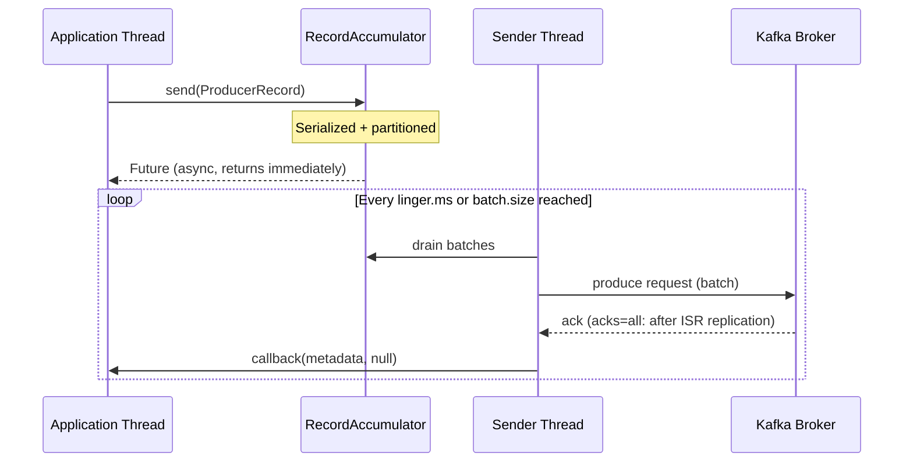
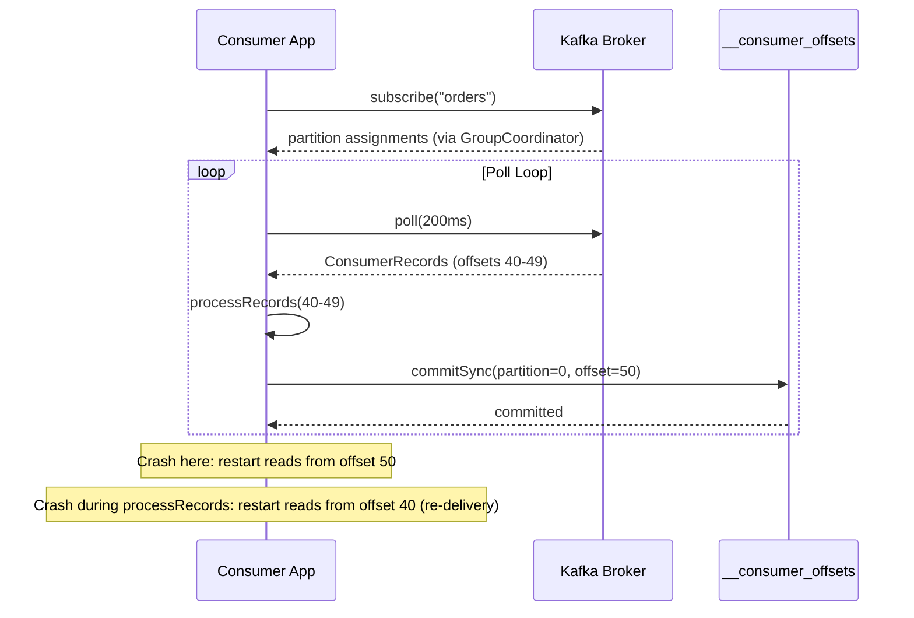
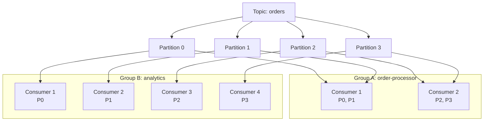

## Keywords in This File
{: .no_toc }

| # | Keyword | Weight |
|---|---|---|
| 1 | [Kafka - L1 Producers and Consumers](#kafka---l1-producers-and-consumers) | medium |

---

# Kafka - L1 Producers and Consumers

## Producer

---

### 🎯 Model Answer

**30 seconds:**
> A Kafka producer is a client that publishes records to Kafka topics. It serializes values to
> bytes, determines the target partition (via partitioner), batches records, and sends them to
> the leader broker. Core settings: `bootstrap.servers`, `key.serializer`, `value.serializer`,
> `acks`. Default delivery: at-least-once (`acks=all` + idempotent producer: exactly-once).

**3 minutes (Senior):**
> The Kafka producer flow:
>
> 1. **Serialization**: key and value serialized to `byte[]` via configured serializers
>    (`StringSerializer`, `JsonSerializer`, `AvroSerializer`).
> 2. **Partitioning**: `ProducerRecord` contains optional partition, optional key, and value.
>    If partition specified: used directly. If key present: `murmur2(key) % num_partitions`.
>    If no key: round-robin (sticky partitioner since 2.4: batch to one partition per linger.ms).
> 3. **RecordAccumulator**: records buffered in memory per partition. `batch.size` (default 16KB):
>    max batch size. `linger.ms` (default 0): wait time before sending a batch.
> 4. **Sender thread**: background thread drains batches, sends to broker leaders via network.
> 5. **Acknowledgment**: `acks=0` (fire-and-forget), `acks=1` (leader only), `acks=all` (ISR quorum).
>    `acks=all` + `min.insync.replicas=2`: strongest durability.
> 6. **Callbacks**: `producer.send(record, callback)`: async callback on success or failure.
>    Failure: may retry (configurable `retries`, `retry.backoff.ms`).

**Blank Mind Recovery:**

**(1) Restate:** "Producer: serialize -> partition -> buffer in batch -> send to leader broker ->
await acks. Key settings: bootstrap.servers, serializer, acks, batch.size, linger.ms."

**(2) First principles:** "Producers write data. Kafka partitions data across brokers. The producer
decides which partition via the key or partitioner. Batching: amortizes network overhead. Acks:
trade durability vs latency."

**(3) Bridge:** "Kafka producer is like a mail sorter at a post office. Letters (records) are
sorted by ZIP code (key hash -> partition), bundled into bags (batch), and dispatched to the
right postal branch (broker leader). Acknowledgment: the branch confirms receipt."

---

### 📘 Concept Explanation

**Producer internals and configuration:**
```
PRODUCER LIFECYCLE:

  Properties props = new Properties();
  props.put("bootstrap.servers", "broker1:9092,broker2:9092");
  props.put("key.serializer",   "org.apache.kafka.common.serialization.StringSerializer");
  props.put("value.serializer", "org.apache.kafka.common.serialization.StringSerializer");
  props.put("acks", "all");         // strongest durability
  props.put("retries", 3);          // retry on transient failures
  props.put("batch.size", 32768);   // 32 KB batch
  props.put("linger.ms", 5);        // wait 5ms for batch fill
  KafkaProducer<String, String> producer = new KafkaProducer<>(props);

SEND FLOW:
  
  producer.send(
      new ProducerRecord<>("orders", orderId, orderJson),
      (metadata, exception) -> {
          if (exception != null) {
              log.error("Send failed for order {}: {}", orderId, exception.getMessage());
          } else {
              log.debug("Sent to partition {} at offset {}",
                  metadata.partition(), metadata.offset());
          }
      });

ACK MODES:
  acks=0: no wait. Lowest latency. Messages may be lost on broker crash.
  acks=1: leader writes to log. Lost if leader crashes before replication.
  acks=all: all ISR replicas ack. Highest durability. Higher latency.
  
  min.insync.replicas=2 (broker config, used with acks=all):
    - At least 2 replicas must acknowledge for the write to succeed.
    - If only 1 broker is up: write fails (protects against silent data loss).

IDEMPOTENT PRODUCER (enable.idempotence=true, Kafka 0.11+):
  - Producer assigns sequence numbers. Broker deduplicates retried sends.
  - Exactly-once delivery to a single partition.
  - Automatically: acks=all, retries=Integer.MAX_VALUE, max.in.flight.requests.per.connection=5.
  - No code change needed. Add the single property.

BATCHING AND THROUGHPUT:
  buffer.memory=32MB: total memory for all record buffers.
  batch.size=16KB (default): fill batch up to this size before sending.
  linger.ms=0 (default): send immediately. No batching on low traffic.
  linger.ms=5: wait 5ms. Larger batches on moderate traffic. Better throughput.
  compression.type=snappy: compress batches. Lower bandwidth, higher CPU.
    Snappy: good compression ratio + fast. Lz4: faster. Zstd: better ratio.
```

> **Code walkthrough:** This example demonstrates the core pattern in action. The key mechanism shows how the concept works in practice. Study the structure to understand the essential behavior and common usage.

---

### 💻 Code Example

> **Code walkthrough:** The wrong approach does not handle send failures. The right approach uses
> a callback and enables idempotence to prevent duplicates on retry.

```java
// WRONG: fire-and-forget with no error handling:
void sendWrong(Order order) {
    producer.send(new ProducerRecord<>(
        "orders", order.getId(), toJson(order)));
    // No callback. No acks=all. acks defaults to 1.
    // Message may be lost on leader failure.
    // No retry: retries defaults to 0 in Kafka < 2.1.
}

// RIGHT: async send with callback + idempotent producer:
// Producer configured with:
//   acks=all, retries=3, enable.idempotence=true

void sendRight(Order order) {
    ProducerRecord<String, String> record =
        new ProducerRecord<>("orders", order.getId(), toJson(order));
    
    producer.send(record, (metadata, ex) -> {
        if (ex != null) {
            // Log and alert. Consider dead letter or fallback.
            log.error("Order {} send failed: {}", order.getId(), ex.getMessage());
            metrics.increment("kafka.send.failure");
        } else {
            log.debug("Order {} -> partition={} offset={}",
                order.getId(), metadata.partition(), metadata.offset());
        }
    });
}
```

> **Code walkthrough:** The wrong version uses default `acks=1` and no callback - a message
> silently lost on broker failover goes undetected. The right version sets `acks=all` at
> construction, enables idempotence (deduplicates retries), and logs errors via a callback.
> The callback runs on the Sender thread (not the calling thread), so it must be thread-safe
> and must not call `producer.send()` (deadlock risk).

---

### 🎓 Answers by Seniority

**Junior / Mid (0-5 years):**
> Producer: client that writes records to Kafka. Key config: `bootstrap.servers` (entry points),
> `key.serializer`/`value.serializer`, `acks`. Send is async (`send()` returns a Future). Callback
> handles success/failure. Key determines partition (same key -> same partition, ordering preserved
> within partition).

---

**Senior / Staff (5+ years):**
> The `acks=all` + `enable.idempotence=true` combination is the default in Kafka 3.0+ (both
> enabled by default). On older clusters: must be set explicitly. `enable.idempotence` implicitly
> sets `acks=all` and `max.in.flight.requests=5` (allows 5 in-flight, still idempotent due to
> sequence numbers). Production checklist: (1) `enable.idempotence=true`. (2) `acks=all`. (3)
> `min.insync.replicas=2` on broker. (4) `compression.type=snappy` for throughput. (5) `linger.ms`
> 5-20ms for batch fill on moderate-to-high traffic. (6) Monitor: `record-error-rate`,
> `record-retry-rate`, `batch-size-avg`, `buffer-available-bytes`.

---

### ⚠️ Common Misconceptions

**Misconception: "producer.send() is synchronous - the record is on Kafka when the method returns."**
`producer.send()` is asynchronous. It adds the record to an in-memory `RecordAccumulator` (the
buffer) and returns immediately. The actual network send happens on a background Sender thread.
The record is NOT on Kafka when `send()` returns. To wait for the broker acknowledgment: call
`send().get()` (blocks the calling thread until ack). Caution: blocking kills throughput. Pattern:
use async callback for non-critical flows, `send().get()` only when you must ensure delivery before
proceeding. Another implication: if `close()` is called or the process crashes before the Sender
flushes, buffered records are lost. Always call `producer.flush()` before `close()` in shutdown hooks.

---

### ⚖️ Comparison Table

| Setting | acks=0 | acks=1 | acks=all |
|---|---|---|---|
| Durability | None | Leader only | Full ISR |
| Latency | Lowest | Low | Higher |
| Throughput | Highest | High | Lower |
| Loss risk | High | Medium (leader crash) | Minimal |
| Use case | Metrics, logs | Low-risk events | Financial, orders |

---

### 🏛️ System Design

*(Omit: L1 foundational keyword - producer internals. No architecture design applicable.)*

---

### 📊 Diagram

**Kafka producer send pipeline:**

```
  APPLICATION THREAD       BUFFER              SENDER THREAD
  ┌─────────────────┐   ┌───────────────┐   ┌──────────────────┐
  │ producer.send() │   │ RecordAccum.  │   │ Sender           │
  │  -> serialize   │-> │  per-partition│-> │  drain batches   │
  │  -> partition   │   │  batches      │   │  network I/O     │-> BROKER
  │  returns Future │   │  buffer.memory│   │  -> acks         │
  └─────────────────┘   └───────────────┘   └──────────────────┘
      async (returns    (in-memory queue)    (background thread)
       immediately)
```



> **Diagram walkthrough:** The application thread calls `send()` which writes to the
> `RecordAccumulator` (in-memory buffer) and returns immediately. The Sender thread runs
> independently, draining batches when `linger.ms` or `batch.size` is reached and sending them
> to the broker. The broker acknowledges after writing (and replicating for `acks=all`). The
> callback fires on the Sender thread. This two-thread model is the source of the async
> misunderstanding: `send()` returning does not mean the record is on Kafka.

---

### 🚨 Failure Modes and Diagnosis

**Failure: BufferExhaustedException - producer blocks or drops records.**
```
Symptom: producer.send() blocks for 60 seconds then throws:
  "org.apache.kafka.common.errors.TimeoutException: Failed to allocate
   memory within the configured max blocking time"

Root cause: buffer.memory exhausted.
  Application thread: producing faster than Sender thread can flush.
  Or: broker unavailable, Sender thread blocked on network.
  RecordAccumulator: full (32MB default). New send(): blocks up to
  max.block.ms (default 60s). After timeout: exception.

Diagnosis:
  Metrics:
    buffer-available-bytes: should be > 10% of buffer.memory.
    record-send-rate vs record-error-rate: check for error spike.
    request-latency-avg: high = broker slow.
  Logs: "Network thread blocked" or "Metadata fetch timeout".

Fix:
  1. Increase buffer.memory (32MB -> 64MB) for burst tolerance.
  2. Reduce linger.ms to drain faster.
  3. Fix broker connectivity if request-latency-avg spikes.
  4. Add backpressure in application: if buffer low, pause producing.
```

> **Code walkthrough:** This example demonstrates the core pattern in action. The key mechanism shows how the concept works in practice. Study the structure to understand the essential behavior and common usage.

---

### 🎯 Interview Deep-Dive

| Question Category | Time to Answer |
|---|---|
| Producer send flow | 2 minutes |
| acks modes | 2 minutes |
| Idempotent producer | 2 minutes |
| Batching and throughput | 1 minute |
| Partitioning logic | 1 minute |
| Failure: BufferExhaustedException | 2 minutes |
| async vs sync send | 1 minute |

---

**Q1 (mechanism): Walk me through what happens internally when producer.send() is called.**

A: (1) `send(ProducerRecord)` called on the application thread. (2) Serialization: key and value
serialized to `byte[]` using configured serializers. (3) Partitioning: if explicit partition in
record, use it. Else if key present, `murmur2(key) % numPartitions` - same key always maps to the
same partition (ordering preserved). Else: sticky partitioner (Kafka 2.4+) fills current partition
until `batch.size` or `linger.ms`, then moves to next. (4) RecordAccumulator: record appended to
the appropriate partition's batch. If batch full: new batch created. `buffer.memory` tracks total
allocation. If full: calling thread blocks up to `max.block.ms`. (5) `send()` returns a `Future<RecordMetadata>`
immediately (does not wait for broker). (6) Sender thread (background): periodically drains batches
when `linger.ms` elapsed or `batch.size` reached. Sends `ProduceRequest` to the partition's leader
broker. (7) Broker writes to partition log. Replicates to followers (if `acks=all`). Sends ack.
(8) Sender receives ack, calls callback with `RecordMetadata` (partition, offset, timestamp) or
exception.

*What separates good from great:* The in-flight requests limit. `max.in.flight.requests.per.connection=5`
(default): the Sender thread keeps up to 5 unacked batches outstanding per broker connection. Higher:
more throughput. But with retries enabled and ordering guarantees required: if batch 2 succeeds and
batch 1 (retried) succeeds after, the order is inverted. With `enable.idempotence=true`: Kafka
guarantees ordering with up to 5 in-flight by using sequence numbers. Without idempotence: set
`max.in.flight.requests.per.connection=1` to guarantee order (at the cost of throughput). This
trade-off is critical for financial message streams where order matters.

---

---

## Consumer

---

### 🎯 Model Answer

**30 seconds:**
> A Kafka consumer reads records from partitions. Consumers pull (not push). A consumer subscribes
> to topics, calls `poll()` in a loop, processes records, commits offsets. The offset tracks the
> consumer's position in each partition. Auto-commit: simplest, may duplicate on crash. Manual
> commit: more control, needed for exactly-once processing.

**3 minutes (Senior):**
> Consumer mechanics:
>
> 1. **Subscribe**: `consumer.subscribe(List.of("orders"))`. Kafka assigns partitions (via
>    consumer group coordinator). `assign()`: manual partition assignment (no group protocol).
> 2. **Poll loop**: `consumer.poll(Duration.ofMillis(100))`. Returns a batch of `ConsumerRecord`s.
>    Must be called regularly (heartbeat piggybacked). If no poll within `max.poll.interval.ms`
>    (default 5min): consumer kicked out of group, rebalance triggered.
> 3. **Offset management**: each `ConsumerRecord` has a partition offset. Consumer tracks "last
>    processed offset". Commit: tells Kafka "I've processed up to offset N".
>    Auto-commit: `enable.auto.commit=true`, commits every `auto.commit.interval.ms` (5s default).
>    Manual commit: `commitSync()` (blocks) or `commitAsync()` (non-blocking).
> 4. **Delivery semantics**: at-least-once (default): crash before commit -> records re-delivered.
>    At-most-once: commit before processing -> crash mid-processing -> records skipped.
>    Exactly-once: requires transactional producer + offset commit in same transaction.

**Blank Mind Recovery:**

**(1) Restate:** "Consumer: subscribe -> poll loop -> process records -> commit offsets. Key config:
bootstrap.servers, group.id, key.deserializer, value.deserializer, enable.auto.commit."

**(2) First principles:** "Consumer pulls from brokers (not push). Poll drives the heartbeat. Offset
tracks position. Commit records position. Crash before commit: records re-delivered (at-least-once)."

**(3) Bridge:** "Kafka consumer is like reading a newspaper and making notes. Poll: get today's edition.
Offset: page number you've read to. Commit: write down 'I've read to page 42'. Next session: pick up
from page 43. No commit: re-read from page 1 of that edition on restart."

---

### 📘 Concept Explanation

**Consumer lifecycle, offset management, and delivery semantics:**
```
CONSUMER CONFIGURATION:

  Properties props = new Properties();
  props.put("bootstrap.servers", "broker1:9092");
  props.put("group.id", "order-processor");
  props.put("key.deserializer",
      "org.apache.kafka.common.serialization.StringDeserializer");
  props.put("value.deserializer",
      "org.apache.kafka.common.serialization.StringDeserializer");
  props.put("enable.auto.commit", "false");  // manual commit for control
  props.put("auto.offset.reset", "earliest"); // start from beginning if no offset
  props.put("max.poll.records", "500");       // max records per poll
  
  KafkaConsumer<String, String> consumer = new KafkaConsumer<>(props);
  consumer.subscribe(Collections.singletonList("orders"));

POLL LOOP:

  try {
      while (running) {
          ConsumerRecords<String, String> records =
              consumer.poll(Duration.ofMillis(200));
          
          for (ConsumerRecord<String, String> record : records) {
              processOrder(record.key(), record.value());
              // record.topic(), record.partition(), record.offset()
              // record.timestamp(), record.headers()
          }
          
          consumer.commitSync();  // commit after processing all records in batch
      }
  } finally {
      consumer.close();  // always close (commits pending offsets, leaves group cleanly)
  }

OFFSET COMMIT STRATEGIES:

  1. Auto-commit (enable.auto.commit=true):
     - Commits every 5s (auto.commit.interval.ms).
     - Semantics: at-most-once (records polled but not yet processed may be "committed").
     - Actually: at-least-once in practice (auto-commit happens at start of next poll).
     - Risk: crash between poll and commit -> records re-delivered on restart.
  
  2. Manual commitSync() after each batch:
     - Blocks until broker acknowledges commit.
     - Semantics: at-least-once (process, then commit; crash before commit = re-delivery).
     - Safe but slower (blocks on every batch).
  
  3. Manual commitAsync():
     - Non-blocking. Callback on completion.
     - Issue: out-of-order commits possible (retry of failed async commit may
       commit lower offset after a successful higher offset commit).
     - Pattern: commitAsync() normally, commitSync() on close (final flush).
  
  4. Per-record commit (extreme control):
     Map<TopicPartition, OffsetAndMetadata> offsets = new HashMap<>();
     for (ConsumerRecord<String, String> r : records) {
         processOrder(r.key(), r.value());
         offsets.put(
             new TopicPartition(r.topic(), r.partition()),
             new OffsetAndMetadata(r.offset() + 1));  // +1: next to read
     }
     consumer.commitSync(offsets);

AUTO.OFFSET.RESET:
  earliest: start from partition beginning (if no committed offset for this group).
  latest:   start from the end (default) - only new messages.
  none:     throw NoOffsetForPartitionException if no committed offset.
  
  New consumer group: earliest means re-processing all historical data.
    Intended for reprocessing use cases (ETL, migration).
  New consumer group: latest means: skip historical data, process new only.
    Typical for new services that only need live data.
```

> **Code walkthrough:** This example demonstrates the core pattern in action. The key mechanism shows how the concept works in practice. Study the structure to understand the essential behavior and common usage.

---

### 💻 Code Example

> **Code walkthrough:** The graceful shutdown pattern ensures the consumer commits its current
> offset before exiting, preventing message re-delivery on intentional restarts.

```java
// WRONG: abrupt exit with uncommitted work:
while (true) {
    ConsumerRecords<String, String> records = consumer.poll(Duration.ofMillis(200));
    for (ConsumerRecord<String, String> r : records) {
        processOrder(r.value());  // processing happens...
    }
    // WRONG: no commit. Process exits: records re-delivered from last committed offset.
}

// RIGHT: graceful shutdown with final commit:
public class OrderConsumer implements Runnable {
    private final KafkaConsumer<String, String> consumer;
    private volatile boolean running = true;
    
    @Override
    public void run() {
        consumer.subscribe(List.of("orders"));
        try {
            while (running) {
                ConsumerRecords<String, String> records =
                    consumer.poll(Duration.ofMillis(200));
                
                for (ConsumerRecord<String, String> r : records) {
                    processOrder(r.key(), r.value());
                }
                
                if (!records.isEmpty()) {
                    consumer.commitAsync((offsets, ex) -> {
                        if (ex != null) {
                            log.warn("Async commit failed: {}", ex.getMessage());
                        }
                    });
                }
            }
        } catch (WakeupException e) {
            // Intentional: consumer.wakeup() called during shutdown. Normal exit.
        } finally {
            try {
                consumer.commitSync();  // final synchronous commit
            } finally {
                consumer.close();
            }
        }
    }
    
    public void shutdown() {
        running = false;
        consumer.wakeup();  // unblocks poll() safely
    }
}
```

> **Code walkthrough:** The shutdown flow uses `consumer.wakeup()` to safely interrupt `poll()`
> (it throws `WakeupException` which is the designated shutdown signal). The `finally` block calls
> `commitSync()` (blocking) to ensure the last processed offset is committed before `close()`. The
> main loop uses `commitAsync()` for speed during normal processing. The combination - async in
> the loop, sync on shutdown - is the canonical production Kafka consumer pattern.

---

### 🎓 Answers by Seniority

**Junior / Mid (0-5 years):**
> Consumer: subscribe to a topic, poll in a loop, process records, commit offsets. `group.id`:
> identifies the consumer group. `enable.auto.commit=false` + manual `commitSync()`: at-least-once
> semantics (process then commit). `auto.offset.reset=earliest`: start from beginning for a new group.

---

**Senior / Staff (5+ years):**
> `max.poll.interval.ms` (default 5 minutes): the maximum time between `poll()` calls. If processing
> a batch takes longer than 5 minutes: the consumer is considered dead. Broker removes it from the
> group. Rebalance triggered. All its partitions re-assigned. The batch is re-delivered. Fix options:
> (1) Reduce `max.poll.records` (fewer records per batch, faster processing). (2) Increase
> `max.poll.interval.ms` (for known-slow processing). (3) Offload heavy work async (poll -> submit
> to thread pool -> continue polling for liveness, commit only when async work completes). Pattern 3
> breaks the simple offset model: must track in-flight work per partition and commit only the lowest
> unconfirmed offset.

---

### ⚠️ Common Misconceptions

**Misconception: "auto.commit is at-least-once delivery."**
`enable.auto.commit=true` is ambiguously between at-least-once and at-most-once depending on the
crash timing. The auto-commit is triggered at the start of the next `poll()` (committing offsets
returned by the previous `poll()`). Scenario: (1) `poll()` returns records 0-9. (2) You process
records 0-4. (3) Application crashes. (4) No auto-commit happened yet (next `poll()` not reached).
On restart: records 0-9 re-delivered (at-least-once, which is good). But: (1) `poll()` returns
records 0-9. (2) Auto-commit triggers (committing 0-9 as processed). (3) You process 0-4. (4)
Application crashes. On restart: records 10+ (skipped 5-9 -> at-most-once = data loss). Both can
happen with auto-commit. Manual commit after processing is the only way to guarantee at-least-once.

---

### ⚖️ Comparison Table

| Commit Mode | Semantics | Latency | Risk |
|---|---|---|---|
| Auto-commit | At-least-once or at-most-once | None | Duplicate or loss depending on crash timing |
| commitSync() after batch | At-least-once | High (blocks) | None (correct) |
| commitAsync() | At-least-once (careful) | None | Out-of-order commits if not careful |
| Per-record commitSync() | At-least-once | Very high | None |
| Transactional (EOS) | Exactly-once | Highest | Requires transactional producer |

---

### 🏛️ System Design

*(Omit: L1 foundational keyword - consumer mechanics. No architecture design applicable.)*

---

### 📊 Diagram

**Consumer poll loop and offset commit flow:**

```
  CONSUMER                     KAFKA BROKER
  ┌─────────────────────┐      ┌─────────────────────────┐
  │ 1. subscribe        │      │ Partition [A, B, C, D]  │
  │ 2. poll() ─────────>│      │                         │
  │ 3. ConsumerRecords  │<─────│ records at offset 0..N  │
  │ 4. process()        │      │                         │
  │ 5. commitSync() ───>│      │ __consumer_offsets topic│
  │    "partition=0,    │      │ group=order-processor   │
  │     offset=43"      │      │ partition=0: offset=43  │
  └─────────────────────┘      └─────────────────────────┘
  Crash here: next restart reads from offset 43 (no re-delivery).
  Crash at 4: next restart reads from last committed offset (re-delivery).
```



> **Diagram walkthrough:** The sequence shows the poll-process-commit loop. Kafka assigns partitions
> to the consumer on subscribe. Each poll returns records from the current committed offset forward.
> The commit writes the "next to read" offset (current + 1) to the `__consumer_offsets` internal
> topic. If the consumer crashes after commit: restarts from the committed offset (no re-delivery).
> If the consumer crashes before commit: restarts from the last committed offset (re-delivery,
> at-least-once). The crash timing determines the delivery semantics.

---

### 🚨 Failure Modes and Diagnosis

**Failure: max.poll.interval.ms exceeded - consumer leaves group repeatedly.**
```
Symptom: logs show repeated rebalances:
  "Consumer group 'order-processor' completed rebalance"
  Records processed 2-3 times (same records from different assignments).
  Throughput very low despite messages in the topic.

Root cause: processing takes > 5 minutes per batch.
  max.poll.interval.ms=300000 (5 min default).
  Consumer fetches 500 records (max.poll.records). Processing: 6 minutes.
  Broker: "consumer timed out, removing from group".
  Partition re-assigned to another consumer. Same records re-delivered.
  Infinite loop of rebalances.

Diagnosis:
  Logs: "Commit cannot be completed since the consumer is not part of an active group"
  Logs: "Member ... heartbeat session timed out"
  Metric: rebalance-rate spikes.

Fix option 1: reduce max.poll.records (100 instead of 500, faster batch):
  props.put("max.poll.records", "100");  // 100 records * 6s each = 10min. Still too slow?

Fix option 2: increase max.poll.interval.ms:
  props.put("max.poll.interval.ms", "600000");  // 10 min

Fix option 3: async processing with pause/resume (best for heavy work):
  ExecutorService pool = Executors.newFixedThreadPool(8);
  while (running) {
      ConsumerRecords<String, String> records = consumer.poll(Duration.ofMillis(200));
      for (TopicPartition partition : records.partitions()) {
          consumer.pause(Collections.singleton(partition));
          pool.submit(() -> {
              process(records.records(partition));
              consumer.resume(Collections.singleton(partition));
              commitForPartition(partition);
          });
      }
      // Poll continues (for heartbeat) even while processing async
  }
```

> **Code walkthrough:** This example demonstrates the core pattern in action. The key mechanism shows how the concept works in practice. Study the structure to understand the essential behavior and common usage.

---

### 🎯 Interview Deep-Dive

| Question Category | Time to Answer |
|---|---|
| Consumer poll loop | 2 minutes |
| Offset commit modes | 2 minutes |
| auto.offset.reset | 1 minute |
| Delivery semantics | 2 minutes |
| max.poll.interval.ms failure | 2 minutes |
| Graceful shutdown | 1 minute |
| commitAsync vs commitSync | 1 minute |

---

**Q1 (mechanism): Explain how Kafka offset management works and what "committing an offset" means.**

A: Every record in a Kafka partition has a monotonically increasing offset (a sequential integer
starting at 0). The offset uniquely identifies a record's position within a partition. A consumer
group tracks its reading position via committed offsets - stored in the internal Kafka topic
`__consumer_offsets` (key: group ID + partition, value: the next offset to read). When you call
`commitSync()` or `commitAsync()`, the consumer sends a commit request to the group coordinator
broker, which writes `{group_id, topic, partition, offset}` to `__consumer_offsets`. When a
consumer starts up or after a rebalance: it reads from `__consumer_offsets` for its group to know
where to start reading. If a committed offset exists: start from that offset. If not: use
`auto.offset.reset` (earliest = partition start, latest = current end). Committing offset N means:
"my group has successfully processed all records up to and including offset N-1". The conventional
semantics: commit the offset of the next record to be read, not the last record processed. Code:
`new OffsetAndMetadata(record.offset() + 1)`. This ensures no record is skipped.

*What separates good from great:* The `__consumer_offsets` topic is just a Kafka topic (compacted,
50 partitions by default). Consumer group state is stored in Kafka itself - no external coordination
system needed. The consumer group coordinator is the leader broker for the `__consumer_offsets`
partition that corresponds to `abs(group_id.hashCode()) % 50`. All consumers in the group
communicate with this coordinator for: join group, sync group (partition assignment), heartbeat,
offset commit, offset fetch. Knowing this: when the coordinator broker is down, consumers cannot
commit offsets or join groups. Diagnosis: "Failed to send committed offsets to coordinator" with a
specific broker host - that broker is the coordinator, check its health first.

---

---

## Consumer Group

---

### 🎯 Model Answer

**30 seconds:**
> A consumer group is a set of consumers sharing a `group.id` that collectively consume a topic.
> Kafka assigns each partition to exactly one consumer in the group (no partition is processed by
> two consumers simultaneously). More consumers than partitions: some consumers are idle. Enables
> horizontal scaling: add consumers to process partitions in parallel.

**3 minutes (Senior):**
> Consumer group semantics:
>
> 1. **Partition assignment**: N partitions, M consumers. If M <= N: each consumer gets N/M
>    partitions. If M > N: N consumers active, M-N consumers idle. Partitions are the unit of
>    parallelism.
>
> 2. **Group coordinator**: each consumer group has a coordinator (a Kafka broker). Coordinator
>    manages: group membership (join, leave, crash detection via heartbeat), partition assignment
>    (via rebalance).
>
> 3. **Rebalance**: triggered when a consumer joins, leaves, or times out. During rebalance:
>    all consumers stop consuming ("stop the world"). Partitions re-assigned. Eager vs cooperative
>    (incremental) rebalance: cooperative (Kafka 2.4+) reduces downtime by only moving partitions
>    that change hands.
>
> 4. **Independent groups**: multiple consumer groups can consume the same topic independently.
>    Each group maintains its own offsets. Group A and Group B each see all messages.
>    Enables fan-out: one topic -> multiple independent consumers (analytics, audit, search index).

**Blank Mind Recovery:**

**(1) Restate:** "Consumer group: multiple consumers sharing group.id. Each partition -> 1 consumer.
M consumers, N partitions: min(M,N) consumers active. Rebalance: when membership changes. Multiple
groups: each sees all messages independently."

**(2) First principles:** "Kafka partitions for parallelism. Consumer group: the mechanism to consume
partitions in parallel. Group ensures: each partition processed once (within the group). Multiple
groups: fan-out pattern."

**(3) Bridge:** "Consumer group is like a team of workers processing a conveyor belt (partitions).
Each section of belt (partition) -> 1 worker (consumer). Add a worker: Kafka reassigns sections.
Remove a worker: remaining workers absorb the sections. Two separate teams: each team processes
the whole belt (independent groups)."

---

### 📘 Concept Explanation

**Consumer group mechanics, assignment, and rebalance:**
```
PARTITION ASSIGNMENT EXAMPLE:

  Topic: "orders" with 4 partitions (P0, P1, P2, P3)
  Group: "order-processors"
  
  1 consumer:   C1 -> P0, P1, P2, P3 (all partitions)
  2 consumers:  C1 -> P0, P1 | C2 -> P2, P3
  3 consumers:  C1 -> P0 | C2 -> P1 | C3 -> P2, P3 (or C3 -> P2 and C4 -> P3)
  4 consumers:  C1 -> P0 | C2 -> P1 | C3 -> P2 | C4 -> P3
  5 consumers:  C1-C4 active, C5 idle (no more partitions)
  
  Rule: partition count is the max parallelism.
  To increase throughput: add partitions (can only increase, never decrease safely).
  Then add consumers (up to partition count).

ASSIGNMENT STRATEGIES (partition.assignment.strategy):

  RangeAssignor (default): assigns consecutive partitions to consumers.
    With 4 partitions, 2 consumers: C1 gets P0+P1, C2 gets P2+P3.
    Issue: uneven with multiple topics (C1 always gets P0+P1 of every topic).
  
  RoundRobinAssignor: distributes partitions evenly across consumers.
    4 partitions, 2 consumers: C1 gets P0+P2, C2 gets P1+P3 (interleaved).
    More even distribution across multiple topics.
  
  StickyAssignor: minimizes partition movement during rebalance.
    On rebalance: try to keep existing assignments, only move what's necessary.
    Less disruption than RangeAssignor/RoundRobin.
  
  CooperativeStickyAssignor (Kafka 2.4+, recommended):
    Incremental cooperative rebalance: no stop-the-world.
    Consumers revoke only the partitions being moved.
    Others continue consuming during the rebalance.
    Spring Kafka 2.3+: default.

REBALANCE PROTOCOL (EAGER - classic):

  JOIN GROUP:
    All consumers send JoinGroup request to coordinator.
    Coordinator elects a group leader (first consumer to join).
  SYNC GROUP:
    Leader computes partition assignment (using chosen strategy).
    Leader sends assignment to coordinator in SyncGroup request.
    Coordinator distributes assignments to all consumers.
  DURING REBALANCE:
    All consumers stop consuming (revoke all partitions).
    All partitions unassigned.
    New assignment sent.
    All consumers resume.
  IMPACT: throughput drops to zero during rebalance (seconds to minutes).

COOPERATIVE (INCREMENTAL) REBALANCE (Kafka 2.4+):

  PHASE 1: coordinator identifies partitions that need to move.
  PHASE 2: consumers revoke ONLY the partitions to be moved.
           Others continue consuming (no full stop).
  PHASE 3: revoked partitions assigned to target consumers.
  IMPACT: only the moved partitions have a brief gap. Others: unaffected.

INDEPENDENT CONSUMER GROUPS (FAN-OUT):

  Topic "orders": producer writes all orders.
  Group "order-processor": processes orders, updates inventory.
  Group "analytics-consumer": reads same orders for analytics.
  Group "audit-log": reads same orders for compliance.
  
  Each group: maintains its own offset. Independent consumption speed.
  Order-processor: slow? analytics still runs at full speed.
  Re-process for analytics: reset order-processor's group offsets.
    Does not affect analytics-consumer offsets.
  
  Command to reset group offsets:
    kafka-consumer-groups.sh --bootstrap-server broker:9092 \
      --group order-processor --topic orders \
      --reset-offsets --to-earliest --execute
```

> **Code walkthrough:** This example demonstrates the core pattern in action. The key mechanism shows how the concept works in practice. Study the structure to understand the essential behavior and common usage.

---

### 💻 Code Example

> **Code walkthrough:** The `ConsumerRebalanceListener` allows safe partition revocation by
> committing offsets synchronously before partitions are handed off to another consumer.

```java
// WRONG: no rebalance listener - uncommitted work lost on rebalance:
consumer.subscribe(List.of("orders"));
while (true) {
    ConsumerRecords<String, String> records = consumer.poll(Duration.ofMillis(200));
    for (ConsumerRecord<String, String> r : records) {
        processOrder(r);  // in-memory processing...
    }
    // Rebalance triggered: partitions revoked without committing.
    // Next consumer: re-reads records from last committed offset.
    // Possible duplicates.
}

// RIGHT: CommitOnRevoke listener:
consumer.subscribe(List.of("orders"),
    new ConsumerRebalanceListener() {
        
        @Override
        public void onPartitionsRevoked(Collection<TopicPartition> partitions) {
            // Called BEFORE partitions are reassigned.
            // Commit current offsets for revoked partitions:
            try {
                consumer.commitSync();
                log.info("Committed offsets before rebalance. Partitions: {}", partitions);
            } catch (CommitFailedException ex) {
                log.warn("Commit failed before rebalance: {}", ex.getMessage());
            }
        }
        
        @Override
        public void onPartitionsAssigned(Collection<TopicPartition> partitions) {
            // Called AFTER new partitions assigned.
            // Optional: seek to a specific offset if needed.
            log.info("Assigned partitions: {}", partitions);
        }
    });
```

> **Code walkthrough:** `ConsumerRebalanceListener.onPartitionsRevoked` is called before the
> partition is taken away from this consumer. Calling `commitSync()` here commits the latest
> processed offset before the partition is re-assigned. The next consumer (or this consumer after
> rebalance) starts from the committed offset, avoiding re-delivery of already-processed records.
> This is the canonical pattern for at-least-once semantics with minimal duplicates during rebalances.

---

### 🎓 Answers by Seniority

**Junior / Mid (0-5 years):**
> Consumer group: multiple consumers sharing `group.id`. Kafka assigns partitions across the group.
> Each partition -> 1 consumer. Max parallelism = partition count. Multiple groups: each group reads
> all messages independently. Rebalance: happens when consumers join or leave; brief downtime.

---

**Senior / Staff (5+ years):**
> The "partition count caps parallelism" constraint has architecture implications. Before deploying a
> new consumer group for a high-throughput topic: increase partition count FIRST (if needed). Can
> only increase safely, never decrease (would move offsets). Rule: provision partitions generously
> at topic creation (32, 64 for high-throughput). The overhead per partition: ~1MB memory on broker,
> small but significant at thousands of topics/partitions. With KRaft (no ZooKeeper): higher partition
> counts supported. For cooperative rebalance: `partition.assignment.strategy=
> org.apache.kafka.clients.consumer.CooperativeStickyAssignor`. For Spring Kafka: configure via
> `ConcurrentKafkaListenerContainerFactory.getContainerProperties().setAssignmentCommitOption()`.

---

### ⚠️ Common Misconceptions

**Misconception: "Adding more consumers always increases throughput."**
Adding consumers beyond the partition count provides zero throughput increase. A topic with 4
partitions and 6 consumers: 4 consumers active, 2 idle. The 2 idle consumers consume no records.
This is intentional: Kafka guarantees that each partition is processed by at most one consumer in
the group (ordering guarantee within partitions). More consumers than partitions: the extras are
standby consumers that activate only when an active consumer fails (useful for fault tolerance).
The correct approach: first increase partition count (plan ahead - you cannot decrease), then add
consumers. Partition count change: `kafka-topics.sh --alter --topic orders --partitions 8`.
Caution: changing partition count re-hashes key-to-partition mapping. Records with the same key
may land in a different partition after the change. For keyed topics where ordering matters: this
may break ordering guarantees for existing keys. Re-evaluate the topology when changing partitions.

---

### ⚖️ Comparison Table

| Scenario | Consumers | Partitions | Active | Idle | Behavior |
|---|---|---|---|---|---|
| Single consumer | 1 | 4 | 1 | 0 | All 4 partitions on 1 consumer |
| Balanced | 4 | 4 | 4 | 0 | 1 partition per consumer |
| Over-provisioned | 6 | 4 | 4 | 2 | 2 consumers idle (standby) |
| Under-provisioned | 2 | 4 | 2 | 0 | 2 partitions per consumer |
| Multiple groups | 2 groups x 4 | 4 | 4+4 | 0 | Each group processes all messages |

---

### 🏛️ System Design

*(Omit: L1 foundational keyword - consumer group mechanics. No architecture design applicable.)*

---

### 📊 Diagram

**Consumer group partition assignment:**

```
  TOPIC: orders (4 partitions)
  
  GROUP A: order-processor (2 consumers)
  ┌─────────────────────────┐
  │  C1: [P0] [P1]          │
  │  C2: [P2] [P3]          │
  └─────────────────────────┘
  
  GROUP B: analytics-consumer (4 consumers)
  ┌─────────────────────────┐
  │  C1: [P0]               │
  │  C2: [P1]               │
  │  C3: [P2]               │
  │  C4: [P3]               │
  └─────────────────────────┘
  
  Both groups read ALL messages from all partitions.
  Independent offsets. Independent throughput.
```



> **Diagram walkthrough:** Two consumer groups read the same topic independently. Group A (2
> consumers) each handles 2 partitions. Group B (4 consumers) each handles 1 partition - maximum
> parallelism for 4 partitions. Both groups receive all messages; their offsets are stored
> separately. This fan-out pattern is one of Kafka's core strengths over traditional queues
> (where each message is delivered to only one consumer).

---

### 🚨 Failure Modes and Diagnosis

**Failure: Consumer lag growing - group falling behind producers.**
```
Symptom: kafka-consumer-groups.sh shows LAG growing:
  GROUP             TOPIC   PARTITION  CURRENT-OFFSET  LOG-END-OFFSET  LAG
  order-processor   orders  0          1000000         1500000         500000
  order-processor   orders  1          999000          1500000         501000

Root cause options:
  1. Processing too slow (heavy DB writes, downstream API latency).
  2. Too few consumers (producer outpacing consumer throughput).
  3. Rebalance storm: consumers crashing and rebalancing continuously.
  4. Poison pill: one record causing exceptions, consumer retrying endlessly.

Diagnosis:
  Check processing latency: time between poll() and commitSync() per batch.
  Check error rate: how often is consumer throwing and skipping?
  Check rebalance-rate metric: frequent rebalances = consumer stability issue.
  Check for poison pill: commit each record individually, log failures.
    If one record always fails: it is the poison pill.

Fix:
  1. Slow processing: add consumers (up to partition count). If at limit: add partitions first.
  2. Poison pill: implement dead letter topic:
     try { process(record); commitSync(); }
     catch (Exception e) { sendToDLT(record); commitSync(); }
  3. Rebalance storm: fix consumer health, reduce max.poll.records.
  4. Scale consumer group: Kubernetes HPA on consumer lag metric.
```

> **Code walkthrough:** This example demonstrates the core pattern in action. The key mechanism shows how the concept works in practice. Study the structure to understand the essential behavior and common usage.

---

### 🎯 Interview Deep-Dive

| Question Category | Time to Answer |
|---|---|
| Consumer group partition assignment | 2 minutes |
| Rebalance mechanics | 2 minutes |
| Multiple groups (fan-out) | 1 minute |
| Adding consumers beyond partition count | 1 minute |
| Consumer lag investigation | 2 minutes |
| Cooperative vs eager rebalance | 2 minutes |
| RebalanceListener | 1 minute |

---

**Q1 (architecture): How does Kafka consumer group scaling work, and what limits parallelism?**

A: Consumer group parallelism is limited by the number of partitions. Each partition in a topic is
assigned to exactly one consumer in a group at any time (Kafka's guarantee). Maximum parallelism
equals the partition count. If you have 4 partitions and 4 consumers: perfect balance, each consumer
handles 1 partition. If you have 4 partitions and 8 consumers: 4 active, 4 idle. Adding the extra 4
consumers provides zero throughput gain but provides fault tolerance (idle consumers activate within
seconds if an active consumer fails). To truly scale beyond current limits: increase partition count
first (`kafka-topics.sh --alter --topic orders --partitions 16`), then scale the consumer group to
16 consumers. Caveats: (1) Partition count can only increase, never decrease (offsets would be
lost/corrupted). (2) Increasing partitions changes key-to-partition routing (`murmur2(key) %
partitions`). For keyed topics with ordering requirements: records from the same key may land in
different partitions after the change, breaking ordering. (3) Each partition has overhead: ~1MB
memory on broker, a file handle, replication overhead. Don't create thousands of partitions per
topic without necessity.

*What separates good from great:* The rebalance impact on SLAs. During an eager rebalance: all
consumers in the group stop consuming for the duration of the rebalance (seconds to ~30s for large
groups). If your topic is a critical payment processing pipeline: a rebalance causes a brief gap.
Mitigation: (1) Use `CooperativeStickyAssignor` (Kafka 2.4+, cooperative incremental rebalance):
only moved partitions have gaps, others continue. (2) Static membership: `group.instance.id` per
consumer. Consumer with a known instance ID that disconnects briefly (within `session.timeout.ms`):
broker holds its partitions instead of triggering a rebalance. On reconnect: re-uses its previous
assignment. Useful for rolling restarts of consumer pods (Kubernetes). (3) Set `session.timeout.ms`
high enough to not trigger on transient slowness, low enough to detect real failures. Rule of thumb:
`session.timeout.ms` 30-60s for stable consumer pods.

---

### 💻 Code Example

*(Omit: this concept does not have a programmatic interface that can be demonstrated in code. The conceptual explanation above is sufficient.)*


---

### 🏛️ System Design

*(Omit: system design diagram not applicable for this concept - see ★★★ keywords for full system design coverage.)*


---

### ⚖️ Comparison Table

*(Omit: this is a ★☆☆ foundational concept with no direct alternatives to compare - see higher-difficulty keywords for trade-off analysis.)*


---

### 📊 Diagram

*(Omit: no standalone visual diagram required for this concept - the explanations and code examples above provide sufficient clarity.)*


