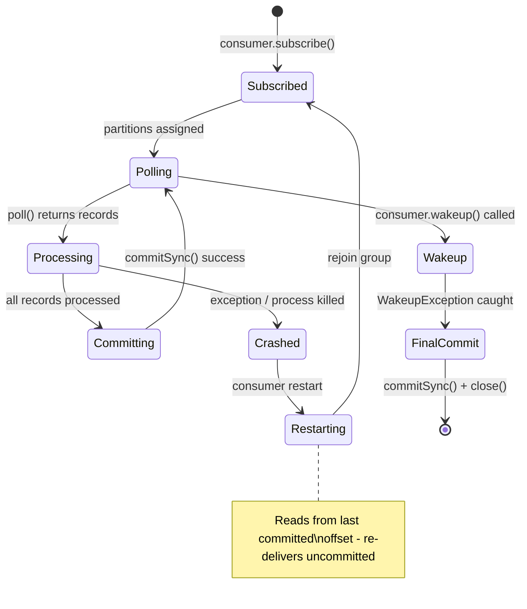
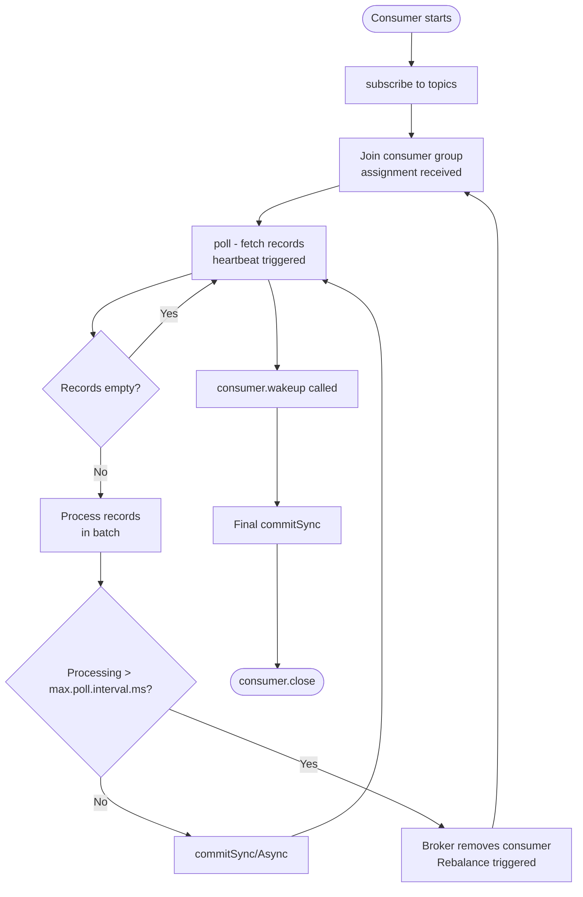

## Keywords in This File
{: .no_toc }

| # | Keyword | Weight |
|---|---|---|
| 1 | [Kafka - L2 Consumer Patterns](#kafka---l2-consumer-patterns) | medium |

---

# Kafka - L2 Consumer Patterns

## Offset Management

---

### 🎯 Model Answer

**30 seconds:**
> Kafka offsets track a consumer group's position in each partition. Stored in the internal topic
> `__consumer_offsets`. Committing an offset means: "my group has processed up to this point."
> Strategies: auto-commit (simple, risky), manual `commitSync()` (safe), `commitAsync()` (fast,
> needs careful shutdown). Delivery semantics: at-least-once (process then commit), at-most-once
> (commit then process), exactly-once (transactions).

**3 minutes (Senior):**
> Offset mechanics:
>
> 1. **Storage**: `__consumer_offsets` is a compacted Kafka topic with 50 partitions. Key: `{group,
>    topic, partition}`. Value: committed offset + metadata. The group coordinator broker (leader
>    of the `__consumer_offsets` partition for the group's hash) manages commits.
> 2. **Committed vs current offset**: committed = last confirmed processed position (persisted to
>    Kafka). Current = where the consumer is reading right now (in memory). Gap between them:
>    re-delivery window if the consumer crashes.
> 3. **Auto-commit caveat**: `enable.auto.commit=true` commits at the start of the next `poll()`.
>    Records returned by poll N are committed at the start of poll N+1. If the process crashes
>    after poll N but before poll N+1: re-delivery on restart. Safe at-least-once in practice.
> 4. **Seek operations**: `consumer.seekToBeginning(partitions)` (re-process from start),
>    `consumer.seekToEnd(partitions)` (skip to latest), `consumer.seek(partition, offset)` (precise
>    rewind for replay). Used for: bug-fix replay, data reprocessing, disaster recovery.
> 5. **External offset store**: store offsets in a database transactionally with the processing
>    result. Enables exactly-once without Kafka transactions: if the DB transaction rolls back,
>    the offset is not advanced.

**Blank Mind Recovery:**

**(1) Restate:** "Offsets: position per partition per group. Stored in __consumer_offsets. Auto-commit:
simple, at-least-once. commitSync: safe. commitAsync + commitSync on shutdown: production pattern.
seek: replay. External offset store: exactly-once with DB."

**(2) First principles:** "Position tracking: how does any queue client know where it is? Kafka:
explicit offset numbers per partition. Consumer controls when to advance the position. More control
vs more complexity than SQS (message deletion = ack)."

**(3) Bridge:** "Offset management is like using a bookmark. The bookmark (committed offset) marks
where you left off. Reading without moving the bookmark (processing without committing): re-read
the same pages next time. Moving the bookmark before you finish reading (commit before process):
skip unread pages. Exactly-once: atomic bookmark + highlight operation."

---

### 📘 Concept Explanation

**Offset management strategies and their delivery semantics:**
```
AT-LEAST-ONCE (standard approach):

  while (running) {
      ConsumerRecords<String, String> records = consumer.poll(Duration.ofMillis(200));
      for (ConsumerRecord<String, String> r : records) {
          processRecord(r);  // step 1: process
      }
      consumer.commitSync();  // step 2: commit
  }
  
  Crash at step 1: no commit. On restart: re-delivers same records. Duplicate processing.
  Crash at step 2: committed offset not persisted. On restart: re-delivers. Duplicate.
  
  Implication: downstream must be idempotent (handle duplicate records safely).
  Pattern: use record key or a dedup ID in the processed state to detect duplicates.

AT-MOST-ONCE (commit before processing):

  while (running) {
      ConsumerRecords<String, String> records = consumer.poll(Duration.ofMillis(200));
      consumer.commitSync();  // commit first
      for (ConsumerRecord<String, String> r : records) {
          processRecord(r);  // process after commit
      }
  }
  
  Crash between commit and process: records lost. No re-delivery.
  Use case: logging, telemetry where loss is acceptable.
  NOT for financial or order processing.

EXACTLY-ONCE WITH EXTERNAL STORE:

  // The atomic pattern: store result + offset in the same DB transaction.
  @Transactional  // Spring: begins DB transaction
  public void processRecord(ConsumerRecord<String, String> record) {
      Order order = deserialize(record.value());
      
      // Store processing result:
      orderRepo.save(processedOrderFrom(order));
      
      // Store offset in the same DB transaction:
      offsetRepo.save(new KafkaOffset(
          record.topic(), record.partition(), record.offset() + 1));
  }
  // If DB transaction commits: result + offset stored atomically.
  // If DB transaction rolls back: neither stored. Re-delivery safe.
  
  // Consumer startup: restore offsets from DB:
  @PostConstruct
  public void restoreOffsets() {
      for (TopicPartition partition : consumer.assignment()) {
          Long savedOffset = offsetRepo.findOffset(
              partition.topic(), partition.partition());
          if (savedOffset != null) {
              consumer.seek(partition, savedOffset);  // precise position
          }
      }
  }
  
  // CRITICAL: do NOT commit to Kafka when using external offset store.
  //   If committed to both: Kafka offset and DB offset may diverge on partial failure.

SEEK OPERATIONS FOR REPLAY:

  // Rewind all assigned partitions to beginning (full replay):
  consumer.subscribe(List.of("orders"), new ConsumerRebalanceListener() {
      @Override
      public void onPartitionsAssigned(Collection<TopicPartition> partitions) {
          consumer.seekToBeginning(partitions);
          // All assigned partitions: start from offset 0.
      }
      @Override
      public void onPartitionsRevoked(Collection<TopicPartition> partitions) {}
  });
  
  // Rewind to a specific timestamp (Kafka 0.10.1+):
  Map<TopicPartition, Long> timestamps = consumer.assignment().stream()
      .collect(Collectors.toMap(
          Function.identity(),
          p -> replayFromTime.toEpochMilli()));
  Map<TopicPartition, OffsetAndTimestamp> offsets =
      consumer.offsetsForTimes(timestamps);
  
  offsets.forEach((partition, offsetAndTs) -> {
      if (offsetAndTs != null) {
          consumer.seek(partition, offsetAndTs.offset());
      }
  });
  // Consumer now starts reading from the specified timestamp.
  // Use case: replay the last 2 hours after a processing bug.
```

> **Code walkthrough:** This example demonstrates the core pattern in action. The key mechanism shows how the concept works in practice. Study the structure to understand the essential behavior and common usage.

---

### 💻 Code Example

> **Code walkthrough:** The production commit pattern - async in the loop for speed, sync on
> shutdown for safety - handles the common edge case of uncommitted work on graceful shutdown.

```java
// WRONG: only commitAsync in loop, no sync on close:
while (running) {
    var records = consumer.poll(Duration.ofMillis(200));
    process(records);
    consumer.commitAsync();  // non-blocking, good for throughput
    // But: no commitSync on shutdown.
    // Graceful shutdown: last few batches may not be committed.
    // Re-delivery after restart: duplicate processing.
}

// RIGHT: async in loop + sync on shutdown:
public void run() {
    consumer.subscribe(List.of("orders"));
    try {
        while (running) {
            var records = consumer.poll(Duration.ofMillis(200));
            if (records.isEmpty()) continue;
            
            process(records);
            
            consumer.commitAsync((offsets, ex) -> {
                if (ex != null) {
                    log.warn("Async commit failed (will retry on next poll): {}", ex.getMessage());
                    // Not fatal: next poll will auto-commit or the sync close will commit.
                }
            });
        }
    } catch (WakeupException e) {
        // Shutdown signal. Intentional.
    } finally {
        try {
            // Final sync commit: ensures last batch committed before exit:
            consumer.commitSync();
            log.info("Final offset commit completed");
        } catch (CommitFailedException e) {
            log.error("Final commit failed - possible duplicate on restart: {}", e.getMessage());
        } finally {
            consumer.close();  // also commits pending offsets and leaves group cleanly
        }
    }
}
```

> **Code walkthrough:** `commitAsync()` in the main loop does not block the consumer thread -
> Kafka sends the commit request in the background, allowing the next `poll()` to run immediately.
> On shutdown, `WakeupException` is thrown by `consumer.wakeup()` (called from a shutdown hook).
> The `finally` block calls `commitSync()` - this blocks until the broker acknowledges the last
> commit, ensuring no un-committed offsets are left behind on a graceful shutdown. The
> `consumer.close()` also performs a final commit, but making it explicit adds clarity.

---

### 🎓 Answers by Seniority

**Junior / Mid (0-5 years):**
> Offset = position in partition. Committing = telling Kafka "I've processed up to here". Auto-commit:
> easy but risk of duplicates or loss. Manual `commitSync()` after processing: at-least-once (safe
> default). `commitAsync()`: faster, non-blocking. Use both: async in loop, sync on close.

---

**Senior / Staff (5+ years):**
> The seek + external offset store pattern is the foundation of exactly-once with JPA/SQL databases.
> Store the Kafka offset in the same DB transaction as the business record. On startup: `seek()` to
> the DB-stored offset. This makes the consumer's progress fully recoverable from the DB state.
> Kafka's own `__consumer_offsets`: used as a fallback if the DB has no stored offset for the
> partition. The edge case: new partition added (topic rebalanced). No DB offset for the new
> partition. Consumer falls back to `auto.offset.reset=earliest` or the Kafka committed offset.
> Handle in `onPartitionsAssigned`: check DB first, then Kafka committed, then `auto.offset.reset`.

---

### ⚠️ Common Misconceptions

**Misconception: "Committing every record individually gives the strongest delivery guarantee."**
Committing after every single record (`commitSync()` per record) is the most conservative approach
but not always the strongest from a correctness standpoint. Per-record commits: (1) 100-1000x slower
than batch commits (one network round-trip per record). (2) Still at-least-once: if the process
crashes after processing but before the commit, the record is re-delivered. (3) The commit itself
can fail (`CommitFailedException` if rebalanced out of the group). Stronger guarantee: exactly-once
by including the offset commit in a database transaction (external offset store). A per-record
Kafka commit is semantically correct but unnecessarily expensive. Practical rule: commit after each
batch (`commitSync()` after the `for` loop over a poll batch). For high throughput: `commitAsync()`
with a sync on shutdown.

---

### ⚖️ Comparison Table

| Strategy | Delivery | Speed | Complexity | When |
|---|---|---|---|---|
| Auto-commit | At-least-once | Fastest | Lowest | Idempotent consumers only |
| commitSync() per batch | At-least-once | Moderate | Low | Standard production |
| commitAsync() + sync close | At-least-once | Fast | Moderate | High throughput |
| External offset store | Exactly-once | Moderate | High | Financial, no duplicates |
| Commit before processing | At-most-once | Fast | Low | Acceptable-loss telemetry |

---

### 🏛️ System Design

*(Omit: L2 patterns keyword. No architecture design applicable.)*

---

### 📊 Diagram

**Offset commit and recovery timeline:**

```
  TIMELINE: commit after processing (at-least-once)

  Poll 1:    offsets 0-9 returned
  Process:   0, 1, 2, ... 9
  Commit:    offset=10 (next to read)
  ---CRASH---
  Restart:   reads from committed offset=10 (no duplicates)

  Poll 1:    offsets 0-9 returned
  Process:   0, 1, 2   <-- CRASH at record 3
  No commit: offset still at 0
  Restart:   reads from offset=0 (duplicates: 0, 1, 2 re-processed)
```



> **Diagram walkthrough:** The state diagram shows the normal poll-process-commit cycle and the
> two important exit paths: crash (re-delivery from last commit) and graceful shutdown (final
> commitSync before exit). The crash path leads to re-delivery of the unprocessed records - this
> is the at-least-once semantic. The graceful shutdown path ensures no uncommitted work is lost
> on intentional restarts (like Kubernetes rolling updates).

---

### 🚨 Failure Modes and Diagnosis

**Failure: CommitFailedException - consumer committed after leaving the group.**
```
Symptom: "org.apache.kafka.clients.consumer.CommitFailedException:
  Commit cannot be completed since the consumer is not part of an active group"

Root cause: processing one batch took longer than max.poll.interval.ms (5 min default).
  Broker: consumer timed out, removed from group.
  Consumer: still processing, then calls commitSync().
  Broker: unknown consumer -> CommitFailedException.
  Partitions: re-assigned to another consumer. Same records being processed twice concurrently.

Diagnosis:
  Check processing time per batch: log start/end time of processRecords().
  Compare to max.poll.interval.ms (default 5 minutes).
  If processing > 5 min: root cause found.

Fix:
  Option 1 (quick): reduce max.poll.records (100 instead of 500):
    props.put("max.poll.records", "100");
    Fewer records -> faster processing per poll cycle.
  
  Option 2: increase max.poll.interval.ms:
    props.put("max.poll.interval.ms", "600000");  // 10 min
    Risk: slower failure detection.
  
  Option 3 (best for very slow processing): pause/resume:
    consumer.pause(consumer.assignment());
    asyncPool.submit(() -> {
        processHeavyBatch(records);
        consumer.resume(consumer.assignment());
    });
    // Consumer keeps polling (for heartbeat) but returns empty records.
    // Heartbeat maintained. max.poll.interval.ms timer restarted on each poll.
```

> **Code walkthrough:** This example demonstrates the core pattern in action. The key mechanism shows how the concept works in practice. Study the structure to understand the essential behavior and common usage.

---

### 🎯 Interview Deep-Dive

| Question Category | Time to Answer |
|---|---|
| At-least-once vs exactly-once | 2 minutes |
| External offset store pattern | 2 minutes |
| Auto-commit behavior | 1 minute |
| CommitFailedException cause | 2 minutes |
| Seek operations | 1 minute |
| commitAsync + commitSync combined | 2 minutes |
| __consumer_offsets topic | 1 minute |
| Replay by timestamp | 1 minute |
| Handling duplicate records | 1 minute |

---

**Q1 (mechanism): Explain the difference between at-least-once and exactly-once in Kafka consumers. How do you achieve each?**

A: At-least-once: process records, then commit offsets. If the consumer crashes between processing
and commit: on restart, the broker re-delivers the uncommitted records. The downstream system
receives the record again. "At least once" because a record may be delivered more than once (on
crash) but never zero times (Kafka retains data until retention expiry). Achieving at-least-once:
manual `commitSync()` or `commitAsync()` AFTER processing in the poll loop. Downstream must handle
duplicates (idempotency: ignore duplicates by tracking processed IDs). Exactly-once: each record
is processed exactly once even across crashes. Two approaches: (1) External offset store: commit
the Kafka offset to a database in the same transaction as the processing result. On crash: DB
transaction rolls back, neither the result nor the offset is advanced. On restart: `seek()` to
the DB-stored offset, re-process the record. DB transaction ensures atomicity. (2) Kafka
Transactions: producer + consumer transaction. Consumer reads, processes, produces result, and
commits input offset in a single Kafka transaction (`sendOffsetsToTransaction()`). Consumer uses
`isolation.level=read_committed` to not see intermediate state. Both approaches have trade-offs:
(1) DB transaction: requires the processing result to go to the DB (inflexible). (2) Kafka
transactions: overhead, limited to Kafka-to-Kafka flows.

*What separates good from great:* Idempotent processing as a pragmatic substitute for exactly-once.
True exactly-once with Kafka transactions adds ~10-20% overhead and significant complexity. For
most systems: at-least-once with idempotent processing is equivalent in outcome. Idempotency:
the downstream system checks if the record was already processed (by a unique ID in the record)
and skips duplicates. Examples: (1) Database upsert: `INSERT ... ON CONFLICT DO UPDATE` - if the
same order ID arrives twice, the second is a no-op. (2) Redis SET with NX: `SET processed:orderId NX`
returns false if already set. (3) Event sourcing: event stream is append-only; processing twice
creates two events. The aggregate reduces: if the state machine handles the duplicate event as a
no-op. The engineering trade-off: exactly-once semantics = complexity + latency. Idempotent
at-least-once = simplicity + normal performance. In 90% of production systems: the latter is
the right choice.

---

---

## Consumer Poll Loop

---

### 🎯 Model Answer

**30 seconds:**
> The Kafka consumer poll loop: `poll(Duration)` fetches records, processes them, commits offsets,
> and repeats. The poll call also triggers the heartbeat (proves liveness to the broker). Critical:
> poll must be called within `max.poll.interval.ms`. If not: broker kicks the consumer out of the
> group and triggers a rebalance.

**3 minutes (Senior):**
> Poll loop internals:
>
> 1. **What poll() does**: (a) sends a heartbeat to the group coordinator, (b) triggers group
>    join/sync if needed (rebalance), (c) fetches records from assigned partition leaders, (d)
>    applies `max.poll.records` limit, (e) returns `ConsumerRecords` (may be empty if no new
>    records).
> 2. **Fetch config**: `fetch.min.bytes` (default 1): minimum bytes broker waits for before
>    responding. `fetch.max.wait.ms` (default 500ms): max wait at broker before returning empty.
>    `fetch.max.bytes` (default 50MB): max response size. `max.partition.fetch.bytes` (default 1MB):
>    per-partition limit.
> 3. **Pause/resume**: `consumer.pause(partitions)` + `consumer.resume(partitions)`. Paused
>    partitions: `poll()` returns no records for those partitions but heartbeat still sent. Used
>    for: backpressure (consumer cannot keep up), controlled async processing.
> 4. **Empty poll handling**: `poll()` may return empty `ConsumerRecords`. Do not skip the commit
>    or heartbeat logic based on emptiness. The loop itself must continue to maintain liveness.

**Blank Mind Recovery:**

**(1) Restate:** "poll() = heartbeat + fetch records + rebalance trigger. max.poll.interval.ms:
deadline between polls. Too slow: kicked out. Pause: stop receiving records without leaving group.
fetch.min.bytes + fetch.max.wait.ms: control poll responsiveness."

**(2) First principles:** "The poll loop is a cooperative multitasking mechanism. Consumer voluntarily
calls poll() to signal liveness and receive work. Long-running poll = consumer appears dead to broker.
Pause: receive no work but stay alive."

**(3) Bridge:** "The poll loop is like clocking in at work every few minutes. As long as you clock in (poll): the manager (broker) knows you're alive. Stop clocking in (slow processing): manager reassigns your tasks (rebalance) to someone else."

---

### 📘 Concept Explanation

**Poll loop internals and control patterns:**
```
WHAT poll() DOES INTERNALLY:

  1. Ensure subscribed topics have partition assignments.
     If not: trigger group join/sync (rebalance).
  
  2. Check heartbeat timer. If interval elapsed:
     Send HeartbeatRequest to group coordinator (background thread in Kafka 0.10.1+).
     Actually: heartbeat runs on a background thread since 0.10.1.
     poll() serves as the liveness check for max.poll.interval.ms.
  
  3. Check if metadata refresh needed. Fetch updated cluster metadata if so.
  
  4. Send FetchRequest to partition leaders:
     - Respect fetch.min.bytes (broker waits until this many bytes available)
     - Respect fetch.max.wait.ms (max broker-side wait)
     - Respect max.partition.fetch.bytes per partition
  
  5. Return ConsumerRecords (may be empty on timeout or no new data).
  
  Important: heartbeat thread is separate (0.10.1+). But max.poll.interval.ms
  timer is reset only on poll(). Even if heartbeat is alive, if poll() is not
  called within max.poll.interval.ms: coordinator considers consumer dead.

FETCH CONFIGURATION:

  fetch.min.bytes=1024:      // broker waits until 1 KB available
  fetch.max.wait.ms=500:     // but no longer than 500ms
  max.poll.records=500:      // at most 500 records returned per poll
  
  Effect: poll() blocks for up to 500ms OR returns when 1 KB data available.
  Increase fetch.min.bytes for high-throughput (larger batches from broker).
  Increase fetch.max.wait.ms for bursty topics (longer wait = fuller batches).
  Decrease for latency-sensitive consumers.

PAUSE AND RESUME:

  // Scenario: downstream service is slow. Consumer receiving faster than can process.
  // Approach: pause partitions when downstream is overloaded.
  
  Set<TopicPartition> assignment = consumer.assignment();
  
  while (running) {
      ConsumerRecords<String, String> records = consumer.poll(Duration.ofMillis(200));
      
      if (downstreamHealthCheck.isHealthy()) {
          consumer.resume(assignment);       // resume if was paused
          process(records);
          consumer.commitAsync();
      } else {
          consumer.pause(assignment);        // pause: next poll returns empty
          // Records not polled: stay in topic until resumed.
          // Heartbeat: still sent (group membership maintained).
      }
  }
  
  // Check which partitions are paused:
  Set<TopicPartition> paused = consumer.paused();

SINGLE-THREADED CONSTRAINT:

  KafkaConsumer is NOT thread-safe.
  All calls (poll, commit, seek, pause, resume) must be from the same thread.
  
  Pattern for parallel processing within one consumer:
    while (running) {
        var records = consumer.poll(Duration.ofMillis(200));
        var futures = new ArrayList<Future<?>>();
        
        for (ConsumerRecord<String, String> r : records) {
            futures.add(executorService.submit(() -> processRecord(r)));
        }
        
        // Wait for all parallel work to complete:
        for (Future<?> f : futures) {
            f.get();  // blocks main thread until done
        }
        
        // Commit only after all processing complete:
        consumer.commitSync();  // called from consumer thread (safe)
    }
    
    // Risk: if any record takes too long: total batch time > max.poll.interval.ms.
    // Fix: reduce max.poll.records or use pause/resume pattern.
```

> **Code walkthrough:** This example demonstrates the core pattern in action. The key mechanism shows how the concept works in practice. Study the structure to understand the essential behavior and common usage.

---

### 💻 Code Example

> **Code walkthrough:** The backpressure pattern with pause/resume prevents the consumer from
> accumulating work it cannot process, which would eventually cause `max.poll.interval.ms`
> violations.

```java
// WRONG: no backpressure - consumer buffers indefinitely until OOM:
while (running) {
    var records = consumer.poll(Duration.ofMillis(200));
    for (var r : records) {
        executorService.submit(() -> callSlowDownstream(r.value()));
        // Queue grows unbounded if downstream is slow.
        // executorService queue fills -> OOM or rejected tasks.
    }
}

// RIGHT: bounded queue with pause/resume backpressure:
private final BlockingQueue<String> processingQueue =
    new LinkedBlockingQueue<>(1000);  // bounded: 1000 items max

// Consumer thread:
while (running) {
    if (processingQueue.size() < 800) {   // 80% of capacity
        consumer.resume(consumer.assignment());
    } else {
        consumer.pause(consumer.assignment());  // pause: queue near full
    }
    
    var records = consumer.poll(Duration.ofMillis(200));
    for (var r : records) {
        boolean offered = processingQueue.offer(
            r.value(), 50, TimeUnit.MILLISECONDS);
        if (!offered) {
            log.warn("Processing queue full - record dropped or delayed");
            // Consider: DLQ, retry, or circuit breaker.
        }
    }
    // Offset commit: only after processing confirmed (via separate tracking).
}

// Worker threads (separate pool):
// processingQueue.take() -> process -> mark offset for commit
```

> **Code walkthrough:** The bounded queue acts as a buffer between the Kafka consumer thread and
> the processing thread pool. When the queue reaches 80% capacity: the consumer pauses (no more
> records fetched). When the queue drains: the consumer resumes. The `consumer.poll()` continues
> to run (even when paused) to maintain heartbeat and group membership. This prevents the consumer
> from being kicked out of the group due to slow processing. The `offer()` with timeout prevents
> the consumer thread from blocking indefinitely if the queue is full.

---

### 🎓 Answers by Seniority

**Junior / Mid (0-5 years):**
> Poll loop: the main consumer loop. `poll(duration)`: fetches records AND sends heartbeat. Must
> call poll() regularly (within `max.poll.interval.ms`, default 5 min). Slow processing: call
> `consumer.pause()` to stop receiving records without leaving the group. Empty poll result:
> normal when no new messages. Keep the loop running.

---

**Senior / Staff (5+ years):**
> The poll loop is single-threaded by design. KafkaConsumer is not thread-safe. For parallel
> processing: use a single consumer thread for poll/commit/offset management. Offload CPU-bound
> work to a thread pool but control flow back to the consumer thread for commits. The hardest
> part: ensuring commits happen after all in-flight work completes. `Future.get()` on each
> processing future: blocks the consumer thread until the batch is done. For very slow processing:
> pause/resume to avoid `max.poll.interval.ms` violations. Spring Kafka `@KafkaListener` with
> `ConcurrentKafkaListenerContainerFactory` abstracts most of this: configures thread count equal
> to partition count (one consumer thread per partition per instance).

---

### ⚠️ Common Misconceptions

**Misconception: "Increasing max.poll.records always improves throughput."**
Larger `max.poll.records` means more records per `poll()` call. This increases throughput only
if processing is fast relative to fetch time. If processing 500 records takes 6 minutes and
`max.poll.interval.ms=5min`: the consumer is kicked out before committing. Larger `max.poll.records`
in this case: makes things worse (more records, more processing time, guaranteed rebalance). The
throughput bottleneck is usually processing speed, not fetch speed. Rule: tune `max.poll.records`
so that one full batch can be processed within `max.poll.interval.ms / 3` (leave headroom). If
processing is the bottleneck: parallelize processing (thread pool), not fetch size. Monitor:
`records-per-request-avg` and `fetch-latency-avg` vs `poll-idle-ratio`. Low `poll-idle-ratio`
(consumer spending most time processing, not waiting) = processing is the bottleneck.

---

### ⚖️ Comparison Table

| Pattern | Use Case | Trade-off |
|---|---|---|
| Synchronous poll loop | Simple processing | Easiest, limited parallelism |
| Async with pause/resume | Slow downstream, backpressure | Complex offset tracking |
| Thread pool per batch | CPU-bound processing | Must handle commit after all futures done |
| Multi-consumer (same group) | High partition count | Simpler than multi-thread per consumer |
| Spring `@KafkaListener` | Spring Boot apps | Abstracted, configurable concurrency |

---

### 🏛️ System Design

*(Omit: L2 patterns keyword. No architecture design applicable.)*

---

### 📊 Diagram

**Poll loop state machine:**

```
  POLL LOOP:
  ┌─────────────────────────────────────────────────┐
  │  while(running)                                 │
  │    ┌─────────────┐                              │
  │    │ consumer    │<-- sends heartbeat every     │
  │    │  .poll()    │    heartbeat.interval.ms      │
  │    └──────┬──────┘    (background thread)       │
  │           │                                     │
  │           v                                     │
  │    ┌─────────────┐                              │
  │    │ ConsumerRec │ empty? -> loop back           │
  │    │  ords       │ not empty: process            │
  │    └──────┬──────┘                              │
  │           │                                     │
  │           v                                     │
  │    ┌─────────────┐                              │
  │    │ process()   │<-- MUST complete in           │
  │    │             │    max.poll.interval.ms       │
  │    └──────┬──────┘    or rebalance triggered     │
  │           │                                     │
  │           v                                     │
  │    ┌─────────────┐                              │
  │    │ commit()    │                              │
  │    └─────────────┘                              │
  └─────────────────────────────────────────────────┘
```



> **Diagram walkthrough:** The flowchart shows the normal poll-process-commit loop with two
> exceptional paths. The slow processing path (bottom) leads to a broker-triggered rebalance -
> the consumer is removed from the group and must re-join. The graceful shutdown path (right)
> uses `wakeup()` to interrupt `poll()`, then performs a final `commitSync()` before `close()`.
> The key insight: the poll loop must complete one iteration (poll + process + commit) within
> `max.poll.interval.ms` to maintain group membership.

---

### 🚨 Failure Modes and Diagnosis

**Failure: Consumer rebalance storm - consumers continuously joining and leaving.**
```
Symptom: Kafka consumer group in constant rebalance.
  Throughput: near zero (rebalances between every poll batch).
  Logs: repeated "Group completed rebalance" messages.
  Consumer lag: growing rapidly.

Root cause options:
  1. Processing too slow (max.poll.interval.ms exceeded). Most common.
  2. Consumer JVM GC pause > session.timeout.ms: heartbeat missed.
     Coordinator: consumer dead. Rebalance triggered. Consumer GC ends: rejoins. Loop.
  3. Network instability: consumer cannot reach coordinator during GC.
  4. Consumer pod restarting frequently (OOM, liveness probe failure).
  
Diagnosis:
  kafka-consumer-groups.sh --describe --group order-processor:
    Shows current assignment, LAG, and unstable members.
  
  Consumer logs:
    "max.poll.interval.ms exceeded" -> processing too slow
    "Session timeout expired" -> heartbeat missed (GC? network?)
    
  JVM GC logs: look for stop-the-world pauses > session.timeout.ms.

Fix:
  Processing too slow: reduce max.poll.records (200 -> 50).
  GC pause: tune JVM (G1GC with shorter max pause: -XX:MaxGCPauseMillis=200).
              increase session.timeout.ms (30s -> 60s).
  Static membership: group.instance.id per consumer pod.
    Avoids rebalance on brief restarts (within session.timeout.ms).
```

> **Code walkthrough:** This example demonstrates the core pattern in action. The key mechanism shows how the concept works in practice. Study the structure to understand the essential behavior and common usage.

---

### 🎯 Interview Deep-Dive

| Question Category | Time to Answer |
|---|---|
| What poll() does internally | 2 minutes |
| Heartbeat vs max.poll.interval.ms | 2 minutes |
| Pause/resume pattern | 2 minutes |
| Single-threaded constraint | 1 minute |
| Rebalance storm diagnosis | 2 minutes |
| Backpressure implementation | 2 minutes |
| fetch.min.bytes trade-off | 1 minute |
| Parallel processing with single consumer | 1 minute |
| Static membership | 1 minute |

---

**Q1 (debugging): A Kafka consumer is in a constant rebalance loop. How do you diagnose and fix it?**

A: Rebalance loop: consumers continuously joining and leaving the group. Throughput: near zero.
Diagnosis steps: (1) `kafka-consumer-groups.sh --bootstrap-server broker:9092 --describe --group
{group}`: shows current state, consumer host, and if members are changing rapidly. (2) Consumer
logs: search for "max.poll.interval.ms exceeded" or "Session timed out". First string: processing
too slow between polls. Second string: heartbeat not received (GC, network, or thread starvation).
(3) Check processing time: add timing logs around the `for` loop over `ConsumerRecords`. If a
batch takes > `max.poll.interval.ms` (default 5 min): root cause found. (4) Check JVM GC logs:
`-verbose:gc`. If stop-the-world pauses > `session.timeout.ms`: GC is kicking the consumer out.
Fixes by cause: (a) Slow processing: reduce `max.poll.records` to reduce batch size. Or use
pause/resume with async processing. Or increase `max.poll.interval.ms` (less ideal). (b) GC pauses:
tune GC (G1GC, reduce max pause target). Or increase `session.timeout.ms`. Or add memory. (c) Pod
restarts: fix OOM, fix liveness probe false positives. (d) All of the above: enable static
membership (`group.instance.id`): a consumer that reconnects within `session.timeout.ms` reuses
its previous assignment without triggering a rebalance.

*What separates good from great:* Cooperative incremental rebalance (`CooperativeStickyAssignor`).
Even with a correctly-tuned consumer, rebalances happen: new consumers added, topics partition
count changed, broker failure. With eager rebalance (default): all consumers revoke all partitions.
Zero throughput during rebalance. With cooperative rebalance: only the partitions that change hands
are revoked. Other consumers continue processing. For a group of 20 consumers: an eager rebalance
pauses all 20. Cooperative rebalance: only 2-3 consumers affected (the ones whose partitions move).
Throughput drop: 10-15% briefly vs 100%. Enabling: `partition.assignment.strategy=
CooperativeStickyAssignor` on all consumers simultaneously (or via rolling restart with the
transition protocol). Spring Kafka 2.3+: configured via `spring.kafka.consumer.partition-assignment-strategy`.

---

### 💻 Code Example

*(Omit: this concept does not have a programmatic interface that can be demonstrated in code. The conceptual explanation above is sufficient.)*


---

### 🏛️ System Design

*(Omit: system design diagram not applicable for this concept - see ★★★ keywords for full system design coverage.)*


---

### ⚖️ Comparison Table

*(Omit: this is a ★☆☆ foundational concept with no direct alternatives to compare - see higher-difficulty keywords for trade-off analysis.)*


---

### 📊 Diagram

*(Omit: no standalone visual diagram required for this concept - the explanations and code examples above provide sufficient clarity.)*


