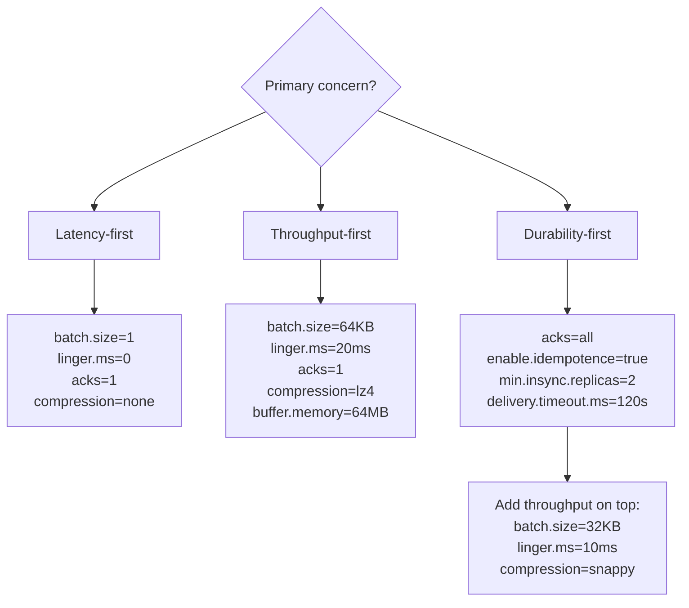
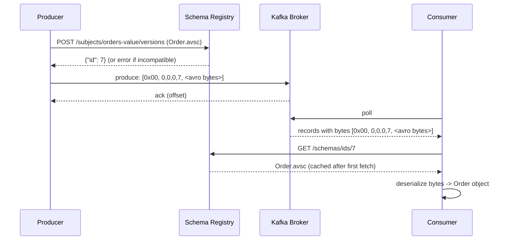

# Kafka - L2 Producer Configuration

## Producer Configuration

### 🎯 Model Answer

**30 seconds:**
> Kafka producer configuration controls: delivery guarantees (`acks`, `enable.idempotence`),
> throughput (`batch.size`, `linger.ms`, `compression.type`), durability (`retries`,
> `retry.backoff.ms`), memory (`buffer.memory`). Three profiles: throughput-optimized (high
> `linger.ms`, large `batch.size`, compression), latency-optimized (low `linger.ms`, small batch),
> durability-first (`acks=all`, idempotence, `min.insync.replicas=2`).

**3 minutes (Senior):**
> Key configuration clusters:
>
> 1. **Delivery guarantees**: `acks` (0/1/all), `enable.idempotence=true` (deduplicates retries
>    within a session), `retries`, `max.in.flight.requests.per.connection` (1 for strict ordering
>    without idempotence; 5 with idempotence).
> 2. **Throughput**: `batch.size` (16KB default, 64KB-256KB for high throughput), `linger.ms`
>    (0 default, 5-20ms for batching), `compression.type` (none/gzip/snappy/lz4/zstd). Larger
>    batches + compression: fewer network requests, less broker CPU for writes.
> 3. **Memory**: `buffer.memory` (32MB default). Total memory allocated for all RecordAccumulator
>    batches. If full: send() blocks up to `max.block.ms` then throws TimeoutException.
> 4. **Network**: `max.request.size` (1MB default, increase for large messages), `request.timeout.ms`
>    (30s default). `delivery.timeout.ms` (120s default): total timeout including retries.
> 5. **Idempotent producer (Kafka 3.0+ default)**: `enable.idempotence=true` automatically enables
>    `acks=all`, `retries=MAX_INT`, `max.in.flight.requests=5`. Deduplicates retried sends within a
>    producer session. Lost if producer restarts (sequence numbers reset).

**Blank Mind Recovery:**

**(1) Restate:** "Producer config: acks + idempotence = durability. batch.size + linger.ms +
compression = throughput. buffer.memory = memory. retries + delivery.timeout.ms = retry behavior."

**(2) First principles:** "Each config trades something against something else. acks=all: durability
vs latency. linger.ms: throughput vs latency. compression: CPU vs bandwidth. No free lunch."

**(3) Bridge:** "Producer config is like setting up a delivery truck. acks=all: require signature
(confirmation). batch.size: truck size (larger = fewer trips). linger.ms: wait to fill the truck
before leaving. compression: vacuum-pack boxes (less space, more effort). buffer.memory: warehouse
size (queue of boxes waiting for the truck)."

---

### 📘 Concept Explanation

**Producer configuration profiles and trade-offs:**
```
THROUGHPUT-OPTIMIZED PRODUCER:

  props.put("acks", "1");               // leader ack only (lower latency)
  props.put("batch.size", "65536");     // 64 KB batch (vs 16 KB default)
  props.put("linger.ms", "20");         // wait 20ms to fill batch
  props.put("compression.type", "lz4"); // fast compression
  props.put("buffer.memory", "67108864"); // 64 MB buffer
  props.put("max.in.flight.requests.per.connection", "5"); // max pipelining

  Result: ~100K+ messages/sec. Lower durability (acks=1).
  Use case: application logs, metrics, click events.

LATENCY-OPTIMIZED PRODUCER:

  props.put("acks", "1");
  props.put("batch.size", "1");         // no batching: send immediately
  props.put("linger.ms", "0");          // no wait
  props.put("compression.type", "none");
  props.put("max.block.ms", "5000");    // fail fast if broker unavailable

  Result: sub-millisecond additional latency. Low throughput.
  Use case: real-time fraud detection signals, live dashboards.

DURABILITY-FIRST PRODUCER:

  props.put("acks", "all");               // all ISR replicas
  props.put("enable.idempotence", "true"); // dedup retries
  props.put("retries", "10");
  props.put("retry.backoff.ms", "200");
  props.put("batch.size", "32768");       // 32 KB
  props.put("linger.ms", "5");
  props.put("delivery.timeout.ms", "120000"); // 2 min total
  // Broker: min.insync.replicas=2 (topic or broker level)
  
  Result: at-least-once guaranteed (with idempotence: exactly-once within session).
  Use case: financial transactions, order events, audit events.

CONFIGURATION INTERACTION RULES:

  enable.idempotence=true IMPLIES:
    acks=all                               (overrides any setting)
    retries=Integer.MAX_VALUE              (retries until delivery.timeout.ms)
    max.in.flight.requests.per.connection <= 5 (enforced)
    
  If you set enable.idempotence=true and acks=1: ConfigException.
  
  max.in.flight.requests.per.connection:
    Without idempotence:
      >1: out-of-order delivery possible if retries occur.
      1:  strict ordering (slow: wait for ack before next batch).
    With idempotence:
      up to 5: ordering guaranteed via sequence numbers.
      >5: ConfigException.

KEY CONFIGURATION REFERENCE:

  | Config                          | Default    | Notes                        |
  |----------------------------------|------------|------------------------------|
  | acks                             | all (3.0+) | 0/1/all                      |
  | batch.size                       | 16384      | bytes per partition batch    |
  | linger.ms                        | 0          | wait before send             |
  | compression.type                 | none       | none/gzip/snappy/lz4/zstd    |
  | buffer.memory                    | 33554432   | total RecordAccumulator memory|
  | max.block.ms                     | 60000      | wait if buffer full          |
  | retries                          | 2147483647 | with idempotence             |
  | retry.backoff.ms                 | 100        | wait between retries         |
  | delivery.timeout.ms              | 120000     | total delivery budget        |
  | request.timeout.ms               | 30000      | per-request timeout          |
  | max.request.size                 | 1048576    | max message size             |
  | enable.idempotence               | true (3.0+)| dedup retries                |
  | max.in.flight.requests          | 5          | max unacked batches/broker   |
```

---

### 💻 Code Example

> **Code walkthrough:** The configuration validation at startup prevents runtime surprises where
> an invalid combination of settings causes a `ConfigException` mid-stream.

```java
// WRONG: conflicting config causes runtime errors or silent data loss:
props.put("enable.idempotence", "true");
props.put("acks", "1");              // ConfigException: idempotence requires acks=all
props.put("max.in.flight.requests.per.connection", "10"); // ConfigException: must be <=5

// WRONG: ordering not preserved without idempotence:
props.put("acks", "1");
props.put("retries", "3");
props.put("max.in.flight.requests.per.connection", "5");
// If batch 1 fails, retries. Batch 2 succeeds first.
// Partition order: batch2, batch1. Consumer sees out-of-order records.

// RIGHT: idempotent producer with explicit config (Kafka < 3.0):
Properties props = new Properties();
props.put(ProducerConfig.BOOTSTRAP_SERVERS_CONFIG, "broker:9092");
props.put(ProducerConfig.KEY_SERIALIZER_CLASS_CONFIG,
    StringSerializer.class.getName());
props.put(ProducerConfig.VALUE_SERIALIZER_CLASS_CONFIG,
    StringSerializer.class.getName());

// Durability + ordering:
props.put(ProducerConfig.ENABLE_IDEMPOTENCE_CONFIG, "true");
// Above line implies: acks=all, retries=MAX_INT, max.in.flight=5
// Override throughput settings on top:
props.put(ProducerConfig.BATCH_SIZE_CONFIG, "32768");  // 32 KB
props.put(ProducerConfig.LINGER_MS_CONFIG, "10");      // 10 ms
props.put(ProducerConfig.COMPRESSION_TYPE_CONFIG, "snappy");
props.put(ProducerConfig.BUFFER_MEMORY_CONFIG, "67108864"); // 64 MB

// Timeout budget:
props.put(ProducerConfig.DELIVERY_TIMEOUT_MS_CONFIG, "120000");
// Total: 120s including retries. After 120s: callback with TimeoutException.

KafkaProducer<String, String> producer = new KafkaProducer<>(props);
```

> **Code walkthrough:** Using `ProducerConfig` constants instead of string literals prevents
> typos (IDE auto-complete and compile-time safety). `enable.idempotence=true` is the single
> setting that sets all durability-related configs correctly. Explicit `batch.size`, `linger.ms`,
> and `compression.type` overlay the throughput settings on top of the idempotent base. The
> `delivery.timeout.ms` caps total retry duration: after 120 seconds of trying, the callback
> receives a `TimeoutException`.

---

### 🎓 Answers by Seniority

**Junior / Mid (0-5 years):**
> Three key settings to understand: `acks` (durability: 0=none, 1=leader, all=full), `batch.size`
> and `linger.ms` (throughput: larger + longer wait = bigger batches = faster), `enable.idempotence`
> (prevents duplicate sends on retry). For most production use: `acks=all`, `enable.idempotence=true`,
> `compression.type=snappy`, `linger.ms=5`.

---

**Senior / Staff (5+ years):**
> `delivery.timeout.ms` vs `request.timeout.ms` vs `retries`: the interaction matters. A send may
> retry multiple times, each attempt governed by `request.timeout.ms`. The total time budget across
> all retries: `delivery.timeout.ms`. Setting `retries=MAX_INT` without `delivery.timeout.ms`: the
> producer retries forever if the broker is down. For real systems: always set `delivery.timeout.ms`
> to cap the failure window. Application: use the callback's `TimeoutException` to route to a DLQ
> or trigger an alert. Also: `max.request.size` and `message.max.bytes` (broker setting) must align.
> A producer configured for 10MB messages against a broker with 1MB max: produces
> `RecordTooLargeException`. Check: `kafka-configs.sh --describe --broker N` for broker-level limits.

---

### ⚠️ Common Misconceptions

**Misconception: "enable.idempotence=true guarantees exactly-once delivery end-to-end."**
`enable.idempotence=true` provides exactly-once delivery to a single Kafka partition within a
single producer session. It does NOT provide exactly-once end-to-end. The idempotent producer
deduplicates retried sends using a producer ID (PID) + sequence number per partition. If the
producer process restarts: the PID is reset. The broker has no memory of the previous PID. A
record sent before restart (and potentially committed to Kafka) may be re-sent after restart
(new PID, different sequence) and appear as a duplicate. For cross-partition or cross-session
exactly-once: use Kafka Transactions (`transactional.id` + `initTransactions()`, `beginTransaction()`,
`commitTransaction()`). For end-to-end exactly-once including consumer: use Kafka Streams or
a transactional consumer+producer pattern with `isolation.level=read_committed`.

---

### ⚖️ Comparison Table

| Config Dimension | Low Setting | High Setting | Trade-off |
|---|---|---|---|
| `acks` | 0 (none) | all (ISR) | Throughput vs durability |
| `linger.ms` | 0 ms (no wait) | 20 ms | Latency vs batch fill |
| `batch.size` | 1 KB | 256 KB | Memory vs fewer requests |
| `compression.type` | none | zstd | CPU vs bandwidth |
| `retries` | 0 | MAX_INT | Risk of loss vs duplicate risk |
| `max.in.flight` | 1 (ordered) | 5 (pipelined) | Throughput vs ordering |

---

### 🏛️ System Design

*(Omit: L2 configuration keyword. No architecture design applicable.)*

---

### 📊 Diagram

**Producer configuration decision tree:**

```
  What matters most?

  LATENCY?               THROUGHPUT?          DURABILITY?
  ├─ batch.size=1        ├─ batch.size=64KB    ├─ acks=all
  ├─ linger.ms=0         ├─ linger.ms=20       ├─ enable.idempotence=true
  ├─ acks=1              ├─ compression=lz4    ├─ min.insync.replicas=2
  └─ compression=none    └─ buffer.memory=64MB └─ delivery.timeout.ms=120s
```



> **Diagram walkthrough:** The three producer profiles map to distinct configuration clusters.
> Latency-first: eliminates all batching delays. Throughput-first: maximizes batch fill rate and
> uses compression. Durability-first: ensures no data loss with idempotence and full ISR acks.
> The "Durability + throughput" branch shows that you can layer throughput settings on top of the
> durability base - these settings are orthogonal. You cannot simultaneously maximize all three;
> each setting moves a needle on the durability/latency/throughput triangle.

---

### 🚨 Failure Modes and Diagnosis

**Failure: Messages arrive out of order at the consumer.**
```
Symptom: consumer processes order events for orderId=42 in wrong sequence:
  CREATED at offset 100, SHIPPED at offset 98, PAYMENT at offset 99.
  Downstream state machine confused.

Root cause: retries + max.in.flight.requests > 1, no idempotence:
  Batch A (offset 98-99): send fails. Sender retries.
  Batch B (offset 100-101): sent while A retrying. Succeeds first.
  Batch A retry: succeeds. Arrives at partition after B.
  Partition log: B (100-101), A (98-99). Out of order.

Diagnosis:
  Consumer: record offsets arrive non-monotonically.
  Verify producer config: enable.idempotence vs max.in.flight settings.

Fix:
  Option 1: enable.idempotence=true (recommended):
    Sequence numbers maintain order even with 5 in-flight.
  
  Option 2: max.in.flight.requests.per.connection=1:
    Strict ordering. Low throughput. Only 1 unacked batch at a time.
  
  Long-term: use the same key for all events of the same entity:
    new ProducerRecord<>("orders", orderId.toString(), event)
    All events for orderId=42: same key -> same partition -> ordered within partition.
```

---

### 🎯 Interview Deep-Dive

| Question Category | Time to Answer |
|---|---|
| acks modes and trade-offs | 2 minutes |
| enable.idempotence mechanics | 2 minutes |
| Throughput optimization | 2 minutes |
| Out-of-order delivery root cause | 2 minutes |
| delivery.timeout.ms explained | 1 minute |
| Buffer memory and back-pressure | 1 minute |
| Config interaction rules | 1 minute |
| Compression trade-off | 1 minute |
| Producer profiles | 1 minute |

---

**Q1 (trade-off): Explain the trade-offs between acks=1 and acks=all.**

A: `acks=1`: leader broker writes the record to its local log and sends acknowledgment immediately.
Followers replicate asynchronously. Latency: lower (one hop: producer to leader, no wait for
followers). Risk: if the leader crashes before followers replicate the record, the record is lost.
The new leader (elected from followers) does not have the record. Producer: received ack, believes
record committed. In reality: lost. `acks=all`: leader waits for all in-sync replicas (ISR) to
acknowledge. ISR: set of replicas that are caught up within `replica.lag.time.max.ms`. With
`min.insync.replicas=2`: at least 2 replicas (including leader) must ack. Latency: higher (must
wait for follower replication). Risk: if all ISR members are down, produce fails. Trade-off:
latency vs durability. Financial data, order events: use `acks=all`. `min.insync.replicas=2` ensures
no silent loss even if one replica falls behind. For metrics or logs: `acks=1` (acceptable loss
risk). For any event that must not be lost: `acks=all` + `enable.idempotence=true`.

*What separates good from great:* The ISR shrink scenario. `acks=all` does not mean "all replicas
in the cluster". It means "all replicas in the current ISR". If a follower falls behind (network
partition, GC pause > `replica.lag.time.max.ms`): it is removed from the ISR. Now `acks=all`
with ISR size 1 (just the leader): functionally equivalent to `acks=1`. This is where
`min.insync.replicas=2` is critical: if ISR shrinks to 1 and `min.insync.replicas=2`, the produce
fails with `NotEnoughReplicasException`. This failure is a safety signal: "ISR is degraded, do not
accept writes until replication recovers." Without `min.insync.replicas=2`: writes silently succeed
with degraded durability. With it: explicit failure that triggers alerts and prevents data loss.

---

---

## Message Serialization

### 🎯 Model Answer

**30 seconds:**
> Kafka transmits raw bytes. Producers serialize Java objects to bytes; consumers deserialize.
> Built-in: `StringSerializer`, `ByteArraySerializer`, `IntegerSerializer`. Schema-based:
> Avro/Protobuf with Schema Registry. Key choice: `StringSerializer` for simple text events;
> Avro for structured data with schema evolution requirements.

**3 minutes (Senior):**
> Serialization choices and trade-offs:
>
> 1. **JSON (StringSerializer + Jackson)**: human-readable, no registry, flexible schema.
>    Downside: verbose (field names repeated in every record), no schema enforcement. For many
>    small events: 3-5x more bytes than Avro.
>
> 2. **Avro with Schema Registry**: compact binary format. Schema stored in registry (not in
>    message). Message: 5-byte schema ID + binary data. Schema evolution: backwards compatible
>    changes allowed. Confluent Schema Registry: REST API for schema registration and retrieval.
>
> 3. **Protobuf (Protocol Buffers)**: binary, field numbers not names. Very compact. Schema
>    evolution by field number. Confluent Schema Registry supports Protobuf schemas. Google's
>    format: widely supported.
>
> 4. **Schema evolution rules (Avro)**: backward compatible (new schema can read old data): add
>    fields with defaults. Forward compatible (old schema can read new data): remove optional
>    fields. Full compatible: both. Breaking: rename, type change, remove required field.

**Blank Mind Recovery:**

**(1) Restate:** "Kafka = bytes. Serializer = Java -> bytes. Deserializer = bytes -> Java. Options:
String/JSON (simple, verbose), Avro (compact, schema registry), Protobuf (compact, Google format).
Schema evolution: add with default = safe. Remove required = breaking."

**(2) First principles:** "Kafka stores bytes. The meaning of bytes: agreed upon by producer and
consumer. Schema: the agreement. Registry: stores the agreement version. Evolution: changing the
agreement without breaking existing readers."

**(3) Bridge:** "Serialization is like encoding a message in Morse code. String: plain English (readable, verbose). Avro: agreed shorthand dictionary (reference number replaces long words). Both parties need the same dictionary (schema). Schema Registry: the shared dictionary library."

---

### 📘 Concept Explanation

**Serialization options and schema evolution:**
```
BUILT-IN SERIALIZERS (kafka-clients library):

  StringSerializer / StringDeserializer:
    Converts String to/from bytes (UTF-8).
    Producer: produces JSON strings as the value:
      new ProducerRecord<>("orders", orderId, objectMapper.writeValueAsString(order))
    Consumer: parse the JSON string:
      Order order = objectMapper.readValue(record.value(), Order.class)
    Trade-off: no schema enforcement, full field names in every message.
    Best for: low volume, human-readable events, simple prototyping.

AVRO WITH SCHEMA REGISTRY:

  Avro schema (orders.avsc):
    {
      "type": "record",
      "name": "Order",
      "namespace": "com.example.events",
      "fields": [
        {"name": "orderId", "type": "string"},
        {"name": "customerId", "type": "string"},
        {"name": "total",    "type": "double"},
        {"name": "status",   "type": "string"},
        {"name": "discount", "type": ["null", "double"], "default": null}
      ]
    }
  
  Wire format (Confluent convention):
    Byte 0:   0x00 (magic byte)
    Bytes 1-4: schema ID (4-byte big-endian int)
    Bytes 5+: Avro binary-encoded record
  
  Message overhead: 5 bytes for schema reference (vs full JSON field names).
  1 KB JSON message -> ~200 bytes Avro. ~5x compression.

  Producer (with Confluent KafkaAvroSerializer):
    props.put("schema.registry.url", "http://schema-registry:8081");
    props.put("value.serializer",
        "io.confluent.kafka.serializers.KafkaAvroSerializer");
    
    GenericRecord record = new GenericData.Record(schema);
    record.put("orderId", order.getId());
    record.put("customerId", order.getCustomerId());
    record.put("total", order.getTotal());
    record.put("status", order.getStatus().name());
    producer.send(new ProducerRecord<>("orders", order.getId(), record));
  
  Consumer:
    props.put("value.deserializer",
        "io.confluent.kafka.serializers.KafkaAvroDeserializer");
    props.put("specific.avro.reader", "true");  // generate Java classes from schema
    // Consumer receives Order (generated class), not GenericRecord.

SCHEMA EVOLUTION (AVRO COMPATIBILITY RULES):

  Backwards compatible (new schema can read old messages):
    ADD a field WITH a default value.
    REMOVE a field that had a default value.
    Add a type to a union (if null included).
  
  Forward compatible (old schema can read new messages):
    REMOVE a required field (old reader skips unknown fields).
    ADD a field without a default (old reader: field missing = ok if old schema has it).
  
  BREAKING changes (avoid):
    RENAME a field (no aliases defined).
    CHANGE a field type (int -> string).
    REMOVE a required field (backwards: old reader needs the field, not present in old data).
  
  Schema Registry compatibility mode (set per subject):
    BACKWARD (default): new schema can read all existing data.
    FORWARD: existing consumers (old schema) can read new messages.
    FULL: both backward and forward.
    NONE: no compatibility check (dangerous in production).
  
  Add "discount" field safely (with default null):
    Before: {"name": "total", "type": "double"}
    After: {"name": "discount", "type": ["null","double"], "default": null}
    Old consumers: ignore "discount" (backwards compatible).
    Old messages: deserialized with discount=null (forward compatible).
    Safe migration: deploy consumers first, then producers.
```

---

### 💻 Code Example

> **Code walkthrough:** The wrong approach hard-codes JSON - no schema enforcement, all consumers
> must manually agree on the field names. The right approach uses Avro + Schema Registry - schema
> registered once, all consumers auto-validate.

```java
// WRONG: JSON strings with no schema enforcement:
// Producer:
String json = "{\"orderId\":\"" + id + "\",\"total\":" + total + "}";
producer.send(new ProducerRecord<>("orders", id, json));
// Consumer A reads "orderId". Consumer B reads "order_id".
// Producer renames field: both consumers silently break (no error at produce time).

// RIGHT: Avro with Schema Registry + generated classes:

// pom.xml:
// <dependency>
//   <groupId>io.confluent</groupId>
//   <artifactId>kafka-avro-serializer</artifactId>
//   <version>7.6.0</version>
// </dependency>

// Producer:
Map<String, Object> producerConfig = Map.of(
    "bootstrap.servers",   "broker:9092",
    "key.serializer",      StringSerializer.class.getName(),
    "value.serializer",    KafkaAvroSerializer.class.getName(),
    "schema.registry.url", "http://schema-registry:8081"
);

try (KafkaProducer<String, Order> producer = new KafkaProducer<>(producerConfig)) {
    Order order = Order.newBuilder()  // Avro generated class
        .setOrderId("O-001")
        .setCustomerId("C-42")
        .setTotal(99.99)
        .setStatus("CREATED")
        .build();
    producer.send(new ProducerRecord<>("orders", order.getOrderId().toString(), order));
}

// Consumer (Spring Kafka with @KafkaListener):
@KafkaListener(topics = "orders", groupId = "analytics-service")
public void handleOrder(Order order) {  // Auto-deserialized via KafkaAvroDeserializer
    analyticsRepo.recordOrderTotal(order.getOrderId().toString(), order.getTotal());
    // Schema mismatch: rejected at produce time (Schema Registry compatibility check).
    // Not at consume time. Fail-fast: prevents bad data reaching consumers.
}
```

> **Code walkthrough:** The Avro producer serializes the `Order` (Avro-generated Java class) to
> binary, prepends the 5-byte schema ID header, and sends to Kafka. The Schema Registry checks
> compatibility on registration - a breaking schema change fails at deploy time, not at runtime.
> The consumer uses `KafkaAvroDeserializer` which reads the schema ID from the message, fetches
> the schema from the Registry, and deserializes back to the `Order` class. Schema evolution is
> validated centrally.

---

### 🎓 Answers by Seniority

**Junior / Mid (0-5 years):**
> Kafka stores bytes. You need a serializer (producer) and deserializer (consumer). StringSerializer:
> for simple text or JSON. Avro + Schema Registry: for typed events in multi-team environments.
> Schema Registry: stores Avro schemas and validates compatibility. Add fields with defaults: safe.
> Rename fields: breaking change.

---

**Senior / Staff (5+ years):**
> Schema Registry compatibility mode: choose `FULL` (backwards + forwards) for inter-team topics
> where you cannot coordinate producer and consumer deployments simultaneously. FULL: deploy producer
> or consumer first, in either order. BACKWARD only (default): must deploy consumers first. The
> schema subject naming: `{topic}-key` and `{topic}-value` (Confluent convention). Custom: use
> `TopicNameStrategy` vs `RecordNameStrategy` vs `TopicRecordNameStrategy`. For event sourcing:
> use `RecordNameStrategy` (schema tied to the event type, not the topic) to allow multiple event
> types on the same topic. For strict typing (one type per topic): `TopicNameStrategy` (default).

---

### ⚠️ Common Misconceptions

**Misconception: "Avro schema changes are always safe as long as you add a default."**
Adding a field with a default is backwards compatible: old consumers reading new messages see the
default. But there is a subtle issue with Avro's union type: `["null", "Type"]`. Adding a union
field is safe. But REORDERING union members (`["null", "int"]` to `["int", "null"]`) is a breaking
change - Avro uses the first matching type in the union. Also: renaming a field is breaking unless
you add an alias (`"aliases": ["oldFieldName"]`). Aliases in Avro: the new schema lists old names
as aliases, allowing it to read data written with the old field name. Without aliases: renaming
= breaking change. Schema Registry `FULL` compatibility mode: catches these cases at schema
registration time and rejects breaking changes. Production rule: always test schema evolution with
`compatibility.test` before deployment. Never use `NONE` compatibility in production.

---

### ⚖️ Comparison Table

| Format | Size | Schema | Evolution | Registry Needed | Use Case |
|---|---|---|---|---|---|
| String/JSON | Large | None | Flexible, risky | No | Prototyping, low volume |
| Avro | Small | Strong | Field-level rules | Yes | High-volume, multi-team |
| Protobuf | Very small | Strong | Field-number rules | Optional | Google ecosystem, gRPC |
| Byte array | - | None | Manual | No | Raw binary, custom codecs |

---

### 🏛️ System Design

*(Omit: L2 configuration keyword. No architecture design applicable.)*

---

### 📊 Diagram

**Avro serialization with Schema Registry flow:**

```
  PRODUCER                SCHEMA REGISTRY          KAFKA BROKER
  ┌────────────┐          ┌────────────────┐       ┌──────────────────────┐
  │ Order obj  │ register │ Schema ID=7    │       │ orders topic         │
  │ -> Avro    │ -------> │ Order.avsc     │       │  [0x00][ID=7][binary]│
  │ serialize  │          │ compatibility  │       │  ... Avro bytes ...  │
  │ 0x00+ID+   │--------->│ check: FULL   │       └──────────────────────┘
  │ binary     │  send    └────────────────┘
  └────────────┘
  
  CONSUMER
  ┌────────────┐ fetch schema  ┌────────────────┐
  │ bytes:     │   (ID=7)      │ Schema ID=7    │
  │ 0x00+7+bin │ -----------> │ Order.avsc     │
  │ -> parse   │ <----------- │                │
  │ -> Order   │              └────────────────┘
  └────────────┘
```



> **Diagram walkthrough:** The producer registers the schema once (or on startup) and receives a
> numeric ID (7). Every message sent to Kafka contains only the 5-byte header (magic byte 0x00 +
> 4-byte schema ID) plus the Avro binary payload - no field names in the message. The consumer
> reads the schema ID from the header, fetches the schema from the Registry (cached after first
> fetch), and deserializes. This pattern: the schema travels once (registry), not in every message.
> Bandwidth savings: 5x+ vs JSON. Schema evolution safety: enforced at the registry level.

---

### 🚨 Failure Modes and Diagnosis

**Failure: SerializationException on consumer after schema update.**
```
Symptom: consumer throws:
  "org.apache.kafka.common.errors.SerializationException:
   Error deserializing Avro message for id -1"
  Or: schema ID in message not found in registry.

Root cause options:
  1. Producer updated schema. Schema registered under new ID (e.g., 8).
     Consumer fetches schema 8 from registry. Compatibility: BACKWARD.
     But consumer's reader schema (old ID 7) does not match writer schema (ID 8).
     Reason: registry compatibility check passed at produce time,
     but consumer using hardcoded schema class (generated from ID 7).
  
  2. Schema Registry unavailable. Consumer cannot fetch schema.
     Message has ID but registry returns 404 or timeout.
  
  3. Message produced without Avro (raw JSON accidentally sent to Avro topic).
     Magic byte not 0x00. Deserializer fails.

Diagnosis:
  curl http://schema-registry:8081/schemas/ids/{ID_FROM_ERROR}
  If 404: schema not found. Registry may have been wiped or ID wrong.
  Check consumer schema.registry.url: correct host/port?
  Check producer: is it using KafkaAvroSerializer? Or StringSerializer?

Fix:
  1. Use specific.avro.reader=true + recompile generated classes from latest schema.
  2. Check Schema Registry health: curl /healthcheck.
  3. Ensure topic only receives Avro messages: topic-level validation.
  4. Set schema.registry.url to a resilient URL (load-balanced registry cluster).
```

---

### 🎯 Interview Deep-Dive

| Question Category | Time to Answer |
|---|---|
| Serialization options comparison | 2 minutes |
| Avro wire format | 1 minute |
| Schema Registry purpose | 1 minute |
| Schema evolution rules | 2 minutes |
| Compatibility modes | 2 minutes |
| Breaking vs safe changes | 1 minute |
| Protobuf vs Avro | 1 minute |
| Serialization failure diagnosis | 2 minutes |

---

**Q1 (trade-off): When would you choose Avro over JSON for Kafka events, and what are the operational costs?**

A: Choose Avro over JSON when: (1) Multiple teams produce and consume the same topic. Schema
enforcement: prevents consumers from receiving malformed data. A JSON producer adding or renaming
a field silently breaks all consumers. Avro: breaking change detected at schema registration,
not at consume time. (2) High-volume topics. Avro binary is 3-10x smaller than JSON (no field
names in messages). 1 billion events/day at 1 KB JSON = 1 TB/day. At 200 bytes Avro: 200 GB/day.
Broker storage, network bandwidth, consumer throughput: all improved. (3) Schema evolution
discipline required. Avro + Schema Registry: documents the contract, version history, compatibility
guarantees. JSON: informal agreement in a wiki (always drifts). Operational costs of Avro: (1)
Schema Registry: an additional service to deploy, monitor, back up. Availability: must match
Kafka's uptime (consumers/producers fail if registry is unreachable and schema not cached).
(2) Generated classes: build pipeline must run Avro code generation (`avro-maven-plugin`). Schema
changes: rebuild required. (3) Tooling complexity: `kafka-console-consumer.sh` cannot read Avro
directly. Need `kafka-avro-console-consumer.sh` (Confluent tools) or `kcat` with Avro support.
(4) Schema migration planning: any breaking change requires coordinated deployment.

*What separates good from great:* The "schema-on-read" vs "schema-on-write" trade-off. JSON in
Kafka is schema-on-read (consumer defines how to interpret the bytes). Avro with Schema Registry
is schema-on-write (schema enforced at produce time). Schema-on-write catches issues earlier
(CI/CD) but requires coordination. Schema-on-read is flexible but risks runtime failures. For
event sourcing with a long-lived event store: schema-on-write is mandatory. Events stored for
years must be deserializable by future consumers. Avro with FULL compatibility: guarantees any
future consumer can read any historical event. JSON with no schema: future consumers must
reverse-engineer the historical format from code history. The discipline of schema-on-write pays
compound interest over time in a long-lived system.

