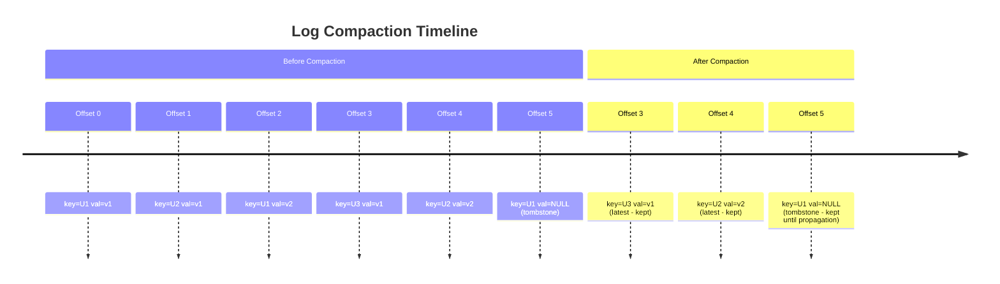
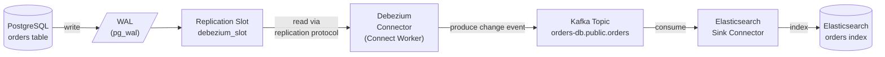

# Kafka - L2 Topic Config and Connect

## Topic Configuration

### 🎯 Model Answer

**30 seconds:**
> Kafka topic configuration controls durability (`replication.factor`, `min.insync.replicas`),
> retention (`retention.ms`, `retention.bytes`), compaction (`cleanup.policy=compact`), and
> performance (`segment.bytes`, `compression.type`). Topics are created with
> `kafka-topics.sh --create` or auto-created if `auto.create.topics.enable=true` (disable in
> production). Configuration changes: `kafka-configs.sh --alter`.

**3 minutes (Senior):**
> Critical topic settings:
>
> 1. **Replication**: `replication.factor=3` (standard for production). All replicas must be on
>    different brokers. With 3 brokers and `replication.factor=3`: every partition has 3 copies.
>    `min.insync.replicas=2` (on the topic or broker level): produces fail if fewer than 2 replicas
>    are in sync. Combined with `acks=all`: no silent data loss even if 1 broker fails.
> 2. **Retention**: `retention.ms=604800000` (7 days default). `retention.bytes=-1` (unlimited
>    by size, default). `log.retention.check.interval.ms=300000` (how often to check). Retention:
>    per-partition, per-segment. Old segments deleted when the oldest message exceeds retention.
> 3. **Compaction**: `cleanup.policy=compact`. Retains only the latest value per key. Useful for:
>    event sourcing snapshots, CDC (change data capture), configuration topics. Combined:
>    `cleanup.policy=compact,delete` (compact and also delete old data).
> 4. **Partitions**: cannot decrease. Increase: `kafka-topics.sh --alter`. Affects: key-to-partition
>    routing changes (may break key ordering). Plan partition count at creation (32-128 for high-
>    throughput topics). A reasonable default: `(target MB/s) / 10` partitions.

**Blank Mind Recovery:**

**(1) Restate:** "Topic config: replication.factor (durability), min.insync.replicas (write quorum),
retention.ms (how long), cleanup.policy (delete vs compact). Partition count: max parallelism,
cannot decrease. Use kafka-topics.sh + kafka-configs.sh."

**(2) First principles:** "Topics are the organizing unit. Partitions: parallelism. Replication:
durability. Retention: storage cost vs replay window. Compaction: log as a key-value store vs
event stream."

**(3) Bridge:** "Topic config is like setting up a filing cabinet. Partitions: number of drawers
(parallelism). Replication: number of copies (durability). Retention: when to shred old files.
Compaction: keep only the latest memo per subject (compact) vs keep all memos (delete policy)."

---

### 📘 Concept Explanation

**Topic creation, configuration settings, and compaction:**
```
CREATING A TOPIC:

  # Production-grade topic creation:
  kafka-topics.sh \
    --bootstrap-server broker:9092 \
    --create \
    --topic orders \
    --partitions 32 \
    --replication-factor 3 \
    --config retention.ms=604800000 \       # 7 days
    --config min.insync.replicas=2 \        # quorum for acks=all
    --config compression.type=snappy \     # compress at broker
    --config max.message.bytes=1048576     # 1MB max message

CHECKING TOPIC CONFIG:

  kafka-topics.sh --bootstrap-server broker:9092 \
    --describe --topic orders
  
  # Output: partition count, replication, ISR, leader broker.
  
  kafka-configs.sh --bootstrap-server broker:9092 \
    --entity-type topics --entity-name orders --describe

MODIFYING EXISTING TOPIC CONFIG:

  kafka-configs.sh --bootstrap-server broker:9092 \
    --entity-type topics --entity-name orders \
    --alter --add-config retention.ms=86400000   # change to 1 day
  
  # NOTE: cannot decrease partition count:
  kafka-topics.sh --alter --topic orders --partitions 8   # OK: 4->8
  kafka-topics.sh --alter --topic orders --partitions 2   # Error: cannot decrease

RETENTION POLICIES:

  cleanup.policy=delete (default):
    Segments older than retention.ms are deleted.
    OR segments that push total size beyond retention.bytes are deleted.
    Oldest first.
    Use: event streams, logs, time-series.
  
  cleanup.policy=compact:
    Log compaction: for each key, keep only the latest value.
    A null value (tombstone): signals deletion of the key.
    Guarantee: consumers will see the latest value for each key.
    No time-based deletion.
    Use: CDC (latest DB state in Kafka), user profile updates,
         configuration topics, event sourcing state snapshots.
  
  cleanup.policy=compact,delete:
    Compact AND delete based on retention.ms.
    Latest values retained until retention expiry.
    Use: compacted topics with bounded storage.
  
  LOG COMPACTION INTERNALS:
  
  Partition log segments:
    Active segment: recent writes, not yet compacted.
    Inactive segments: older, compacted by background cleaner thread.
    
  Cleaner thread (log.cleaner.enable=true, default true):
    Reads segments, builds a map: key -> offset of latest record.
    Rewrites segments: keeps only latest record per key.
    Does NOT guarantee real-time: compaction is background, eventual.
    Consumer may see old values before compaction runs.
  
  Tombstone (null value):
    producer.send(new ProducerRecord<>("user-profiles", userId, null));
    After compaction: key removed from the topic entirely.
    Before compaction: tombstone retained for delete.propagation.ms.

PARTITION SIZING GUIDANCE:

  Starting point: (target throughput MB/s) / 10 partitions
  Example: 100 MB/s target -> 10 partitions (each handles ~10 MB/s)
  
  Rule of thumbs:
    Never create fewer than 3 partitions for a production topic.
    For multi-region: replicas across AZs -> factor = AZ count + 1.
    Kafka Streams: partitions in input = partitions in output (repartition possible but costly).
    Partition count change: key hashing changes. For keyed topics: test impact.
    Broker memory: ~1MB per partition per broker. 1000 topics x 50 partitions x 3 replicas:
      150,000 partition replicas. With ZooKeeper: painful. KRaft: handles 200K+ partitions.
```

---

### 💻 Code Example

> **Code walkthrough:** Log compaction is most easily understood through a concrete CDC scenario:
> each key is a user ID; only the latest record per user matters.

```java
// LOG COMPACTION: user profile topic (compact policy)
// Topic: "user-profiles", cleanup.policy=compact

// Producer: send profile updates (latest value per userId wins after compaction):
Properties props = new Properties();
props.put("bootstrap.servers", "broker:9092");
props.put("key.serializer",   StringSerializer.class.getName());
props.put("value.serializer", StringSerializer.class.getName());

KafkaProducer<String, String> producer = new KafkaProducer<>(props);

// User 42 changes email:
producer.send(new ProducerRecord<>("user-profiles", "user-42",
    "{\"email\":\"old@example.com\",\"name\":\"Alice\"}"));

// Later: updated email:
producer.send(new ProducerRecord<>("user-profiles", "user-42",
    "{\"email\":\"alice@example.com\",\"name\":\"Alice\"}"));

// After compaction: only the second record (latest) remains for "user-42".
// Consumer starting from beginning: sees the latest value for each user.

// Delete user profile (tombstone):
producer.send(new ProducerRecord<>("user-profiles", "user-42", null));
// After compaction: key "user-42" removed entirely.
// Tombstone retained for delete.propagation.ms (default 24h) before removal.

// BAD: using a non-null "deleted" marker instead of null:
producer.send(new ProducerRecord<>("user-profiles", "user-42",
    "{\"deleted\":true}"));
// BAD: log compaction retains this forever (not a tombstone).
// Key never removed. Space never freed.
// Use null for deletion when using compact cleanup policy.
```

> **Code walkthrough:** The compacted topic stores the latest value per key indefinitely. A new
> consumer can join at any time and read the latest state for all keys by reading from the
> beginning - it gets a consistent snapshot. Tombstones (null values) mark deletions: after
> `delete.propagation.ms`, the key disappears from the log. Using a non-null "deleted" marker
> is a common mistake: the cleaner thread keeps it (it's a valid value), and the space is never
> reclaimed.

---

### 🎓 Answers by Seniority

**Junior / Mid (0-5 years):**
> Topic key configs: `replication.factor` (default 1 in dev, 3 in production), `retention.ms`
> (how long records kept, default 7 days), `cleanup.policy` (delete default, compact for
> key-value store semantics). Partition count: cannot decrease once created. Use
> `kafka-topics.sh` to create, `kafka-configs.sh` to modify.

---

**Senior / Staff (5+ years):**
> `min.insync.replicas` must be set at the topic level (or broker level) and match the
> producer's `acks=all`. Without it: `acks=all` means "ack from all current ISR" which could be
> ISR size 1 (just the leader) if followers lag. With `min.insync.replicas=2`: produce fails
> if only 1 in-sync replica. Explicit failure beats silent data loss. The topic-level
> `min.insync.replicas` overrides the broker-level default - use topic-level for critical topics,
> broker-level as the fallback. Also: `unclean.leader.election.enable=false` (default in Kafka
> 0.11+): prevents an out-of-sync replica from becoming leader (would lose data). Never enable
> `unclean.leader.election` for financial or transactional topics.

---

### ⚠️ Common Misconceptions

**Misconception: "Increasing partition count is always safe after the topic is in production."**
Increasing partition count is non-destructive (records are not moved). However: key-based partition
routing uses `murmur2(key) % numPartitions`. Before: 4 partitions. After: 8 partitions. A record
with `key="order-42"` previously went to partition 2 (hash % 4 = 2). Now: hash % 8 = 6. Two
consequences: (1) Messages for the same key may now arrive in different partitions before and after
the change. If a consumer relies on same-key = same partition for ordering: ordering violated for
keys that switched partitions. (2) Consumers that manually assigned specific partitions: must update
their configuration. Kafka Streams: state stores are partition-scoped. Increasing input topic
partitions requires repartition (expensive). Rule: determine the partition count correctly before
going to production. For unbounded growth: use more consumers (up to current partition count)
rather than adding partitions. Add partitions only when the partition count truly limits parallelism.

---

### ⚖️ Comparison Table

| cleanup.policy | Retention model | Guarantees | Use case |
|---|---|---|---|
| delete | Time or size based | Last N days/bytes | Logs, events, time-series |
| compact | Key-based (latest only) | Latest value per key always present | CDC, state snapshots |
| compact,delete | Latest value, but expires | Latest value until retention.ms | Bounded compacted stores |

---

### 🏛️ System Design

*(Omit: L2 configuration keyword. No architecture design applicable.)*

---

### 📊 Diagram

**Log compaction before and after:**

```
  BEFORE COMPACTION:
  Offset: 0      1      2      3      4      5
  Key:    U-1    U-2    U-1    U-3    U-2    U-1
  Value:  v1     v1     v2     v1     v2     v3  (U-1 deleted)
  
  AFTER COMPACTION:
  Offset: 3      4      5
  Key:    U-3    U-2    U-1
  Value:  v1     v2     v3(null=deleted)
  
  U-3: only ever had offset 3. Retained.
  U-2: latest value is offset 4 (v2). Offset 1 removed.
  U-1: latest is offset 5 (null tombstone). All previous removed.
       Tombstone retained until delete.propagation.ms, then removed.
```



> **Diagram walkthrough:** Before compaction, all 6 records are present. U-1 has 3 entries (v1,
> v2, null). After compaction, only offset 3 (U-3's only value), offset 4 (U-2's latest), and
> offset 5 (U-1's tombstone) remain. The tombstone for U-1 persists temporarily - long enough for
> all consumers to read the deletion signal - then is itself removed, freeing the key entirely.
> New consumers starting from offset 0 after compaction see the current state of every key that
> still exists.

---

### 🚨 Failure Modes and Diagnosis

**Failure: Topic fills disk - retention not cleaning up.**
```
Symptom: broker disk usage growing without bound. retention.ms=86400000 set.
  df -h shows /kafka/data at 95%.

Root cause options:
  1. cleanup.policy=compact and many unique keys. Compaction retains all latest values.
     If retention.ms set but policy is compact only: time-based deletion not applied.
     Fix: change to cleanup.policy=compact,delete if time-based deletion needed.
  
  2. Consumer group lagging. Kafka will not delete segments consumed by active groups?
     Actually: Kafka deletes based on retention, regardless of consumer lag.
     If consumer lag: records may be deleted before consumer reads them.
     
  3. Active segment too large (segment.bytes=1GB default).
     Log retention checks segments, not individual records.
     If the active segment is 1 GB and is 6 days old: NOT deleted yet (not closed).
     A new segment is opened when segment.bytes reached or segment.ms elapsed.
     Very low traffic: one segment spans all retention.ms -> never closed -> never deleted.
     Fix: set segment.ms (e.g., 86400000 = 1 day) to force segment rotation.

Diagnosis:
  kafka-log-dirs.sh --bootstrap-server broker:9092 --topic orders --describe
  Shows segment file sizes, offset ranges, timestamps.
  Identify if segments are not rotating (same oldest segment for days).

Fix for low-traffic topic not rotating:
  kafka-configs.sh --alter --entity-type topics --entity-name orders \
    --add-config segment.ms=86400000   # force 1-day segment rotation
```

---

### 🎯 Interview Deep-Dive

| Question Category | Time to Answer |
|---|---|
| Topic creation options | 2 minutes |
| replication.factor and min.insync.replicas | 2 minutes |
| cleanup.policy=compact mechanics | 2 minutes |
| Tombstones | 1 minute |
| Partition count decision | 1 minute |
| Retention not working | 2 minutes |
| compact vs delete vs both | 1 minute |
| When to use compaction | 1 minute |
| Log segment rotation | 1 minute |

---

**Q1 (mechanism): What is log compaction in Kafka, and when would you use it instead of delete retention?**

A: Log compaction: a retention policy where Kafka keeps only the latest record per key, rather
than deleting records based on time or size. The log cleaner background thread periodically rewrites
partition segments, discarding older records for any key that has a newer record. The result: a
consumer starting from the beginning of a compacted topic sees the current state for every key -
like reading a key-value store. Tombstone: a record with a null value. Signals "this key is deleted."
After compaction: the tombstone itself is removed after `delete.propagation.ms` (default 24 hours).
When to use: (1) CDC (change data capture): Kafka as the latest snapshot of a DB table. Each record
= one row, key = primary key. Latest value = current row state. New consumers: bootstrap from Kafka
topic (latest state) without needing the full DB dump. (2) User profiles, session state: latest
value matters, old values are irrelevant. (3) Event sourcing state topics: Kafka Streams
`KTable` uses compacted topics to store the latest aggregated state. (4) Configuration topics:
latest config value per key. When NOT to use: (1) Event streams where every event matters (orders,
payments): you want every event, not just the last. Use `cleanup.policy=delete`. (2) Topics without
keys: compaction requires keys. Records with null keys cannot be compacted.

*What separates good from great:* The "dirty ratio" and compaction performance. Kafka compacts
partitions lazily. The log cleaner's trigger: `min.cleanable.dirty.ratio` (default 0.5). A
partition is compacted when > 50% of records are "dirty" (have a newer record with the same key).
Before reaching 50%: the log grows. For high-cardinality key topics (many unique keys): dirty
ratio grows slowly. Compaction may lag. Aggressive compaction (lower `min.cleanable.dirty.ratio=0.1`)
triggers more frequently but uses more CPU. `min.compaction.lag.ms`: minimum age before a record
can be compacted. Ensures consumers have a chance to read before the log is condensed. For CDC
use cases: ensure `min.compaction.lag.ms` is longer than the slowest consumer's poll interval
to prevent consuming stale compacted data before consumers read the original events.

---

---

## Kafka Connect

### 🎯 Model Answer

**30 seconds:**
> Kafka Connect: a framework for streaming data between Kafka and external systems (databases,
> S3, Elasticsearch, JDBC). Source connectors: pull from external, push to Kafka. Sink connectors:
> pull from Kafka, push to external. Runs as a distributed service (workers). No code: configure
> via JSON API. Key connectors: Debezium (CDC from DB), JDBC Sink, S3 Sink, Elasticsearch Sink.

**3 minutes (Senior):**
> Connect architecture:
>
> 1. **Workers**: Connect workers are JVM processes that run connectors and tasks. Distributed
>    mode (production): workers form a cluster using Kafka topics (`config.storage.topic`,
>    `offset.storage.topic`, `status.storage.topic`) for coordination. No ZooKeeper needed.
>    Worker count: add/remove workers, tasks automatically rebalanced.
> 2. **Connectors and Tasks**: a connector is a logical entity (configuration). It creates tasks
>    (the actual work units). `tasks.max` config: how many parallel tasks. Distributed across
>    workers. Parallelism bounded by source/sink capacity (e.g., DB table parallelism).
> 3. **Transformations (SMTs)**: Single Message Transforms. Applied inline: filter, route, mask
>    fields, add metadata. Chain: multiple SMTs in sequence. Lightweight; for heavy transformation:
>    use Kafka Streams.
> 4. **Exactly-once source semantics**: not universally achievable. Depends on whether the source
>    supports atomic reads (e.g., DB with transactions). Debezium reads WAL: each change is unique
>    by LSN/position - near-exactly-once with proper offset management.
> 5. **Debezium (CDC)**: Change Data Capture connector. Reads database transaction log (PostgreSQL
>    WAL, MySQL binlog, SQL Server CDC). Produces change events to Kafka. Each DB row change
>    becomes a Kafka record: `{before: {...}, after: {...}, op: "u"}`. Zero-impact on the DB (reads
>    replication log, not query).

**Blank Mind Recovery:**

**(1) Restate:** "Kafka Connect: framework for Kafka integrations. Source connectors: external -> Kafka.
Sink connectors: Kafka -> external. Workers: JVM process cluster. Tasks: parallel units. SMT: inline
transforms. Debezium: CDC from DB transaction log."

**(2) First principles:** "Connect solves a recurring problem: every team needs to get data into/out of
Kafka. Without Connect: bespoke producers and consumers for every integration. With Connect: configure,
not code. Resilient, scalable, offset-managed."

**(3) Bridge:** "Kafka Connect is like an airport conveyor system. Source connector: loads luggage
from check-in (DB, S3) onto the belt (Kafka). Sink connector: moves luggage from the belt to the
correct gate (Elasticsearch, HDFS). The workers are the conveyor motors. SMTs: sort or relabel bags in transit."

---

### 📘 Concept Explanation

**Kafka Connect architecture and Debezium CDC:**
```
CONNECT ARCHITECTURE:

  EXTERNAL SOURCE     CONNECT WORKER      KAFKA BROKER     CONNECT WORKER    EXTERNAL SINK
  ┌─────────────┐    ┌──────────────┐    ┌─────────────┐  ┌──────────────┐  ┌────────────────┐
  │ PostgreSQL  │ -> │ Source       │ -> │ orders topic│ -> │ Sink         │ ->│ Elasticsearch  │
  │ MySQL       │    │ Connector    │    │ users topic │    │ Connector    │   │ S3 / HDFS      │
  │ S3          │    │ (Task x N)   │    │ ...         │    │ (Task x N)   │   │ JDBC targets   │
  └─────────────┘    └──────────────┘    └─────────────┘  └──────────────┘  └────────────────┘
                     |              Coordination via Kafka internal topics              |
                     └──────────────── config + offset + status topics ─────────────────┘

DEPLOYING A CONNECTOR (REST API):

  # Start the JDBC Source Connector:
  curl -X POST http://connect:8083/connectors \
    -H "Content-Type: application/json" \
    -d '{
      "name": "orders-jdbc-source",
      "config": {
        "connector.class":       "io.confluent.connect.jdbc.JdbcSourceConnector",
        "connection.url":        "jdbc:postgresql://db:5432/orders",
        "connection.user":       "kafka_connect",
        "connection.password":   "${file:/config/connect.properties:db.password}",
        "table.whitelist":       "orders",
        "mode":                  "timestamp+incrementing",
        "timestamp.column.name": "updated_at",
        "incrementing.column.name": "id",
        "topic.prefix":          "db.",
        "tasks.max":             "4",
        "transforms":            "maskFields",
        "transforms.maskFields.type": "org.apache.kafka.connect.transforms.MaskField$Value",
        "transforms.maskFields.fields": "credit_card_number"
      }
    }'

  # List connectors:
  curl http://connect:8083/connectors

  # Check connector status:
  curl http://connect:8083/connectors/orders-jdbc-source/status

  # Restart a failed task:
  curl -X POST http://connect:8083/connectors/orders-jdbc-source/tasks/0/restart

DEBEZIUM CDC CONNECTOR:

  # PostgreSQL CDC (Debezium):
  {
    "name": "postgres-cdc",
    "config": {
      "connector.class": "io.debezium.connector.postgresql.PostgresConnector",
      "database.hostname": "db",
      "database.port":     "5432",
      "database.user":     "debezium",
      "database.password": "secret",
      "database.dbname":   "orders",
      "database.server.name": "orders-db",    # prefix for topic names
      "table.include.list":   "public.orders,public.order_items",
      "plugin.name":          "pgoutput",    # PostgreSQL 10+
      "slot.name":            "debezium_slot",
      "publication.name":     "debezium_publication",
      "snapshot.mode":        "initial",     # read current state first
      "tasks.max":            "1"            # PostgreSQL: only 1 task per connector
    }
  }
  
  # Topics produced by Debezium:
  #   orders-db.public.orders
  #   orders-db.public.order_items
  
  # Message format (Debezium envelope):
  {
    "op": "u",          # c=create, u=update, d=delete, r=read(snapshot)
    "before": {"id": 1, "status": "CREATED"},
    "after":  {"id": 1, "status": "SHIPPED"},
    "source": {"ts_ms": 1710000000000, "lsn": 12345}
  }

SINGLE MESSAGE TRANSFORMS (SMT):

  Built-in SMTs:
    ReplaceField:     rename or remove fields
    MaskField:        mask sensitive values (credit card -> "****")
    ExtractField:     extract nested field to root
    InsertField:      add constant or metadata fields
    ValueToKey:       use value field as the record key
    TimestampConverter: convert timestamp formats
    Filter:           drop records matching a predicate
  
  Example: extract the order ID from the value to use as the record key:
  "transforms": "setKey",
  "transforms.setKey.type": "org.apache.kafka.connect.transforms.ValueToKey",
  "transforms.setKey.fields": "order_id"
  
  Chaining SMTs:
  "transforms": "mask,setKey,convertTimestamp",
  "transforms.mask.type": "...MaskField$Value",
  ...
```

---

### 💻 Code Example

> **Code walkthrough:** The wrong approach polls the database in a custom producer - fragile,
> no offset management. The right approach uses JDBC Source Connector with timestamp+incrementing
> mode, which handles offsets, restarts, and exactly-once delivery automatically.

```java
// WRONG: custom polling producer (fragile, manual offset management):
@Scheduled(fixedDelay = 5000)
public void pollAndProduce() {
    // What was the last order ID we sent?
    // If this service restarts: re-sends all orders from the beginning.
    // Or: if we store lastId in memory and crash: gap in events.
    List<Order> newOrders = db.query(
        "SELECT * FROM orders WHERE id > ?", lastId);
    newOrders.forEach(o -> producer.send(
        new ProducerRecord<>("orders", o.getId().toString(), toJson(o))));
    lastId = newOrders.isEmpty() ? lastId : newOrders.getLast().getId();
    // lastId not persisted: restart = replay from 0 or gap depending on logic.
}

// RIGHT: JDBC Source Connector (declarative, managed offsets):
// Configure via REST API (see Concept section).
// Kafka Connect: stores last processed (timestamp, id) in offset topic.
// On restart: resumes from last offset. No code needed.
// Mode=timestamp+incrementing: uses both updated_at and id.
//   Handles: updated rows (timestamp changes) + new rows (id increments).
//   Safe: no duplicate sends for updated rows (offset = max(id, timestamp) pair).
```

> **Code walkthrough:** The custom polling approach has two failure modes: replay on restart (if
> `lastId` is not durably persisted) or gaps (if `lastId` is stored in-memory and the process
> crashes mid-poll). Connect JDBC Source handles both: offsets are stored in a Kafka topic
> (`connect-offsets`) and committed after each batch. On restart: resumes exactly from the last
> successfully sent record. `mode=timestamp+incrementing` handles both inserts (new ID) and
> updates (changed timestamp), covering the full change surface without reading the full table.

---

### 🎓 Answers by Seniority

**Junior / Mid (0-5 years):**
> Kafka Connect: integrates Kafka with external systems without writing producer/consumer code.
> Source connector: data flows into Kafka. Sink connector: data flows out. Debezium: a source
> connector that reads DB changes from the transaction log (not polling). Deploy via REST API or
> configuration file. `tasks.max`: parallelism.

---

**Senior / Staff (5+ years):**
> Connect cluster sizing: one worker can run many connectors. CPU-bound (e.g., many SMTs):
> add workers. Memory: each task uses memory for buffering. For high-throughput Debezium: snapshot
> mode memory usage can be high (reads entire table in initial snapshot). Tune `snapshot.fetch.size`.
> Dead-letter queues (DLQ) in Connect: add `errors.deadletterqueue.topic.name` to a connector config.
> Failed messages go to the DLQ topic (with error headers) instead of stopping the connector.
> Without DLQ: one bad message stops the entire connector. Always configure DLQ for production
> sink connectors. Monitoring: `curl /connectors/{name}/status` for connector health. Kafka metrics:
> `connect.connector.metrics` JMX beans.

---

### ⚠️ Common Misconceptions

**Misconception: "Kafka Connect can achieve exactly-once semantics for all source connectors."**
Exactly-once for source connectors depends on whether the source system supports idempotent reads
or atomic position marking. JDBC Source in timestamp mode: if two records have the same timestamp,
on restart both may be re-read (the connector's offset = max seen timestamp, not max seen ID). Use
`mode=timestamp+incrementing` (both columns together) to reduce but not eliminate duplicates at
timestamp boundaries. Debezium reading PostgreSQL WAL: each WAL record has a unique LSN
(Log Sequence Number). The connector stores the LSN as the offset. On restart: resumes from the
LSN, not the beginning. Near-exactly-once (duplicates only if the connector crashes after writing
to Kafka but before committing the LSN offset - an extremely narrow window). For sink connectors:
exactly-once depends on the sink. JDBC Sink with `idempotent=true`: uses upsert (`INSERT ... ON
CONFLICT DO UPDATE`). Elasticsearch: upsert by document ID. S3: object keys include offsets,
so re-writing is safe (overwrite). Always verify the specific connector's exactly-once guarantees.

---

### ⚖️ Comparison Table

| Integration | Kafka Connect | Custom Producer/Consumer | When |
|---|---|---|---|
| DB change capture | Debezium source | Custom WAL reader | Connect: always preferred |
| DB polling | JDBC Source | Custom @Scheduled | Connect: better offset management |
| Data lake ingest | S3 Sink | Custom consumer | Connect: handles partitioning |
| Heavy transformation | Not ideal | Kafka Streams | Streams: better for complex logic |
| One-off migration | Either | Simple script | Script for simplicity |

---

### 🏛️ System Design

*(Omit: L2 configuration keyword. No architecture design applicable.)*

---

### 📊 Diagram

**Debezium CDC flow:**

```
  PostgreSQL DB             Kafka Connect Worker        Kafka Broker
  ┌──────────────┐         ┌────────────────────┐      ┌────────────────────────┐
  │ orders table │ WAL     │ Debezium Connector │      │ orders-db.public.orders│
  │  INSERT/     │-------> │  read WAL via      │----> │  {op:c, after:{...}}   │
  │  UPDATE/     │ repl.   │  replication slot  │      │  {op:u, before, after} │
  │  DELETE      │         │  LSN tracking      │      │  {op:d, before:{...}}  │
  └──────────────┘         └────────────────────┘      └────────────────────────┘
  
  No DB queries. No performance impact.
  One record per DB change. Order guaranteed (WAL is ordered).
```



> **Diagram walkthrough:** Debezium connects to PostgreSQL as a replication client (not a regular
> query client). It reads the WAL via a replication slot, which guarantees WAL preservation until
> Debezium confirms receipt. Each DB change (INSERT/UPDATE/DELETE) becomes a Kafka record with
> `before` and `after` states. Downstream: an Elasticsearch Sink Connector reads from the Kafka
> topic and indexes the latest state. The entire pipeline is declarative - no application code
> required. Kafka's durability ensures events are available even if Elasticsearch is briefly
> unavailable.

---

### 🚨 Failure Modes and Diagnosis

**Failure: Debezium connector fails - replication slot full.**
```
Symptom: Debezium connector task in FAILED state.
  PostgreSQL logs: "WAL sender process ... terminating connection because"
  Connect logs: "org.postgresql.util.PSQLException: ERROR: replication slot ... is active"
  Or: disk full on PostgreSQL server.

Root cause: Debezium stopped consuming (crashed, or lag grew).
  PostgreSQL replication slot: retains WAL until Debezium confirms receipt.
  If Debezium stopped: WAL accumulates indefinitely.
  Disk fills. PostgreSQL crashes or refuses new writes.

Diagnosis:
  PostgreSQL: SELECT slot_name, pg_size_pretty(pg_wal_lsn_diff(pg_current_wal_lsn(), restart_lsn))
    AS wal_retained FROM pg_replication_slots;
  If wal_retained > 1 GB and growing: Debezium is behind.

Fix:
  Option 1: restart Debezium connector. Resume from last LSN. Catch up.
    curl -X POST http://connect:8083/connectors/postgres-cdc/tasks/0/restart
  
  Option 2: if Debezium cannot catch up (hours behind): consider dropping and recreating the slot.
    PostgreSQL: SELECT pg_drop_replication_slot('debezium_slot');
    Recreate Debezium connector (re-snapshot the table).
    WARNING: events between slot drop and re-snapshot are lost.
  
  Prevention:
    Monitor: pg_replication_slots retained WAL size (alert at 1 GB).
    Set slot.drop.on.stop=true in Debezium (drops slot on graceful shutdown).
    Use max_slot_wal_keep_size (PostgreSQL 13+): limits WAL retention per slot.
      ON LIMIT EXCEEDED: slot is automatically dropped (better than disk full).
```

---

### 🎯 Interview Deep-Dive

| Question Category | Time to Answer |
|---|---|
| Connect architecture | 2 minutes |
| Source vs sink connector | 1 minute |
| Debezium CDC mechanics | 2 minutes |
| Replication slot failure | 2 minutes |
| SMT use cases | 1 minute |
| Exactly-once in Connect | 2 minutes |
| Connect vs custom producer | 1 minute |
| Dead letter queue in Connect | 1 minute |
| JDBC Source modes | 1 minute |

---

**Q1 (mechanism): How does Debezium achieve change data capture from PostgreSQL without impacting performance?**

A: Debezium connects to PostgreSQL as a physical replication client - the same protocol used by
PostgreSQL replicas. It requests a replication slot (`pg_create_logical_replication_slot`) which
tells PostgreSQL: "retain WAL (write-ahead log) entries until this client confirms receipt." The
WAL is PostgreSQL's durability mechanism - it already exists regardless of Debezium. Debezium reads
the WAL stream (not the live table) via the logical decoding plugin (`pgoutput` in PostgreSQL 10+,
`wal2json` for older versions). Each WAL record corresponds to one committed transaction. Debezium
decodes the WAL record into a Kafka message with `{op, before, after, source}` envelope. After
producing the Kafka record and receiving the ack, Debezium advances the replication slot's LSN
(log sequence number). PostgreSQL then knows it is safe to reclaim that WAL space. Performance
impact: Debezium adds a replication connection (like adding a standby replica). The WAL is already
written by PostgreSQL for its own durability - Debezium just reads it. Actual overhead: additional
network I/O for the replication stream. CPU: WAL decoding. This is typically < 2% CPU overhead
on a production PostgreSQL instance. Zero table scan (no SELECT * polling).

*What separates good from great:* The snapshot phase is where Debezium does impact performance.
When the connector first starts (or after a slot is recreated), Debezium takes a snapshot: reads
the entire table to produce the initial state. This is a full table scan at READ COMMITTED isolation.
For large tables (1B+ rows): snapshot takes hours. The snapshot holds a shared lock on the table
for a brief moment during export start (to get a consistent LSN). For production tables under
heavy write load: the lock window (typically under 1 second) must be planned. Mitigations:
(1) Use `snapshot.mode=schema_only` if you only need changes, not the initial state. (2) Schedule
initial snapshot during low-traffic hours. (3) Use `snapshot.select.statement.overrides` to
snapshot in batches (select WHERE id BETWEEN x AND y). (4) PostgreSQL 14+: `wal_level=logical`
and `max_replication_slots` must be configured before Debezium connects.

