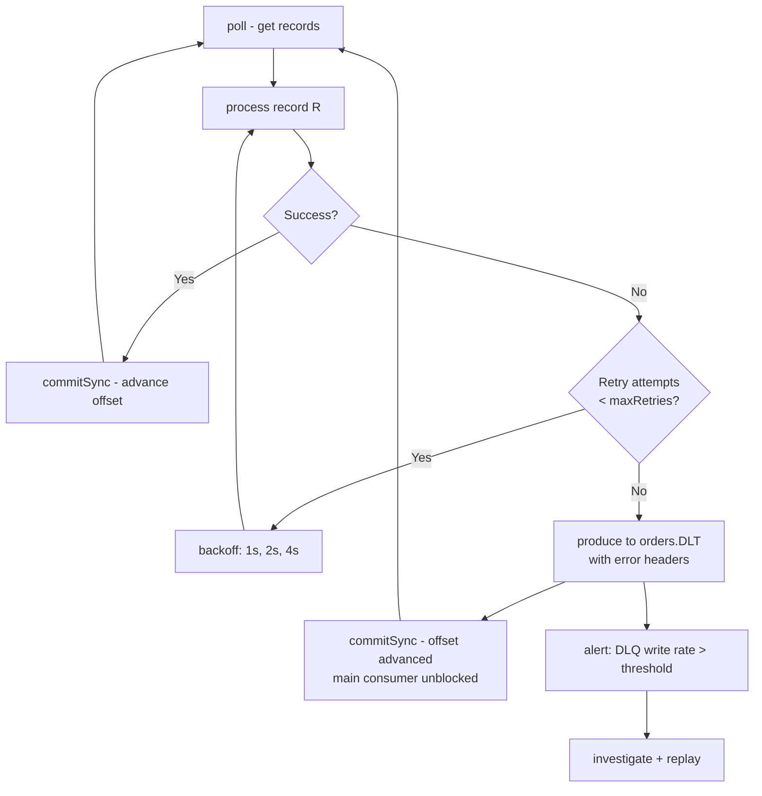

# Kafka - L3 Consumer Internals

## Consumer Rebalancing

### 🎯 Model Answer

**30 seconds:**
> Consumer rebalancing: the process of re-assigning partitions among consumers in a group when
> membership changes (join, leave, crash, subscription change). Triggered by: new consumer joins,
> consumer leaves, consumer heartbeat timeout, topic partition count changes. Two protocols:
> eager (stop-the-world, all partitions revoked) and cooperative (incremental, only moved
> partitions revoked). Cooperative (`CooperativeStickyAssignor`) is best for production.

**3 minutes (Senior):**
> Rebalance mechanics:
>
> 1. **Trigger**: group coordinator detects membership change (JoinGroup request from new consumer,
>    consumer heartbeat timeout, LeaveGroup request). Coordinator: sends RebalanceInProgress
>    signal to all consumers.
> 2. **Eager rebalance (default RangeAssignor)**: all consumers revoke ALL partitions.
>    All consumers send JoinGroup. Group leader (first consumer) computes new assignment.
>    SyncGroup distributes assignment. All partitions re-assigned. During this: full stop.
>    Duration: typically 2-10 seconds. For large groups: longer.
> 3. **Cooperative rebalance (CooperativeStickyAssignor, Kafka 2.4+)**: two-phase. Phase 1:
>    consumers identify partitions to give up. Only those partitions revoked. Others keep theirs.
>    Phase 2: revoked partitions assigned to new owners. Consumers processing unaffected
>    partitions: never paused.
> 4. **Static membership** (`group.instance.id`): consumers with a stable instance ID that
>    reconnect within `session.timeout.ms` reuse their previous assignment. No rebalance
>    triggered for brief disconnects (pod restarts, GC pauses). Essential for Kubernetes rolling
>    deployments.
> 5. **Heartbeat**: background thread sends heartbeats every `heartbeat.interval.ms` (default 3s).
>    If `session.timeout.ms` (default 45s) elapses without a heartbeat: broker considers consumer
>    dead. Triggers rebalance.

**Blank Mind Recovery:**

**(1) Restate:** "Rebalance: triggered when group membership changes. Eager: all stop, all reassigned.
Cooperative: only moved partitions paused. Static membership: no rebalance for brief reconnects.
Heartbeat: liveness signal. session.timeout.ms: heartbeat deadline."

**(2) First principles:** "Partition assignment must be consistent (each partition assigned to exactly
one consumer). When membership changes: the assignment is invalid. Rebalance recalculates. Minimizing
rebalance impact: keep partitions that aren't moving, only re-assign the moved ones (cooperative)."

**(3) Bridge:** "Consumer rebalance is like reorganizing seating at a dinner table when a guest
arrives or leaves. Eager: everyone stands up, all seats empty, everyone sits down in new arrangement.
Cooperative: only vacate the seats for the new guest, everyone else stays seated."

---

### 📘 Concept Explanation

**Rebalance protocols and configuration:**
```
REBALANCE TRIGGER SOURCES:

  1. New consumer: consumer.subscribe() -> JoinGroup -> rebalance
  2. Consumer leaves: consumer.close() -> LeaveGroup -> rebalance
  3. Consumer crash: session.timeout.ms expires without heartbeat -> rebalance
  4. Consumer too slow: max.poll.interval.ms exceeded -> consumer leaves group -> rebalance
  5. Topic partition count changes: subscription topic re-evaluated -> rebalance
  6. Admin changes consumer group: kafka-consumer-groups.sh --reset-offsets -> may trigger

EAGER REBALANCE TIMELINE:

  T=0:   New consumer C3 sends JoinGroup to coordinator.
  T=0:   Coordinator: sends "rebalance is starting" to all (via HeartbeatResponse).
  T=1:   C1, C2 revoke ALL their partitions.
         OnPartitionsRevoked called (commit offsets here!).
  T=1:   All consumers send JoinGroup.
  T=2:   Group leader (C1) receives all members in JoinGroupResponse.
         Computes assignment: C1->P0,P1 | C2->P2,P3 | C3->P4,P5
  T=2:   Leader sends SyncGroup with assignment.
  T=3:   Coordinator distributes assignment to all consumers.
         OnPartitionsAssigned called.
  T=3:   C1, C2, C3 start consuming from assigned partitions.
  
  DOWNTIME: T=1 to T=3 (all partitions un-consumed). Typically 2-5 seconds.

COOPERATIVE (INCREMENTAL) REBALANCE:

  T=0:   C3 sends JoinGroup.
  T=0:   Coordinator: rebalance starting signal.
  T=1:   C1, C2 send JoinGroup (keep their partitions for now).
  T=1:   PHASE 1: Group leader computes which partitions need to move.
         Decision: P5 moves from C2 to C3. C1 keeps P0,P1. C2 gives up P5 only.
  T=2:   C2 revokes P5 only. OnPartitionsRevoked(P5) called.
  T=2:   C2 and C3 send JoinGroup again for phase 2.
  T=3:   PHASE 2: C3 assigned P5. OnPartitionsAssigned(P5) called.
  
  DOWNTIME: P5 is un-consumed from T=2 to T=3 only.
            P0,P1,P2,P3,P4: never paused.

ASSIGNMENT STRATEGIES:

  RangeAssignor (default):
    Partitions sorted. Each consumer gets a range.
    4 partitions, 2 consumers: C1->P0,P1 | C2->P2,P3
    Issue: uneven with multiple topics. Always C1 gets the lower half.
  
  RoundRobinAssignor:
    Partitions distributed in round-robin.
    4 partitions, 2 consumers: C1->P0,P2 | C2->P1,P3
    More even across multiple topics.
  
  StickyAssignor:
    Minimizes partition movement on rebalance.
    On rebalance: tries to keep existing assignments.
    More complex computation but fewer disruptions.
  
  CooperativeStickyAssignor (Kafka 2.4+, RECOMMENDED):
    Like StickyAssignor but uses cooperative (incremental) rebalance protocol.
    Spring Kafka 2.5.3+: default for @KafkaListener.
    Configuration:
      props.put(ConsumerConfig.PARTITION_ASSIGNMENT_STRATEGY_CONFIG,
          CooperativeStickyAssignor.class.getName());

STATIC MEMBERSHIP (group.instance.id):

  // Each consumer instance: unique, stable ID (e.g., pod name):
  props.put("group.instance.id", "order-processor-0");
  
  Effect:
    Consumer leaves temporarily (within session.timeout.ms): no rebalance.
    Coordinator: holds the partition assignment for the instance ID.
    Consumer reconnects: receives same assignment without rejoining the group.
    Consumer reconnects after session.timeout.ms: treated as a new member, rebalance triggered.
  
  Use case: Kubernetes rolling deployments.
    Pod restart: usually < 30 seconds. session.timeout.ms=60s.
    Pod A restarts: no rebalance (within 60s window).
    If session.timeout.ms=10s: pod restart (20s) triggers rebalance even with static membership.
    Tune session.timeout.ms to be longer than typical pod restart time.
```

---

### 💻 Code Example

> **Code walkthrough:** Static membership with cooperative rebalance is the production-ready
> combination that minimizes rebalance impact in Kubernetes environments.

```java
// WRONG: default eager rebalance with no rebalance listener:
consumer.subscribe(List.of("orders"));
while (true) {
    var records = consumer.poll(Duration.ofMillis(200));
    process(records);
    consumer.commitSync();
    // Rebalance: all work in flight is abandoned without commit.
    // Uncommitted records will be re-delivered.
    // No OnPartitionsRevoked: no pre-rebalance commit.
}

// RIGHT: CooperativeStickyAssignor + static membership + rebalance listener:
Properties props = new Properties();
props.put("group.id", "order-processor");
props.put("group.instance.id", "order-processor-" + podOrdinal); // static membership
props.put("session.timeout.ms", "60000");  // 60s: pod restart tolerance
props.put("partition.assignment.strategy",
    "org.apache.kafka.clients.consumer.CooperativeStickyAssignor");

consumer.subscribe(List.of("orders"), new ConsumerRebalanceListener() {
    
    @Override
    public void onPartitionsRevoked(Collection<TopicPartition> partitions) {
        // Called only for partitions being revoked (cooperative: minimal set).
        log.info("Revoking partitions: {}", partitions);
        
        // Commit offsets for revoked partitions only:
        Map<TopicPartition, OffsetAndMetadata> offsets = new HashMap<>();
        for (TopicPartition tp : partitions) {
            Long offset = currentOffsets.get(tp);
            if (offset != null) {
                offsets.put(tp, new OffsetAndMetadata(offset + 1));
            }
        }
        if (!offsets.isEmpty()) {
            consumer.commitSync(offsets);
        }
    }
    
    @Override
    public void onPartitionsAssigned(Collection<TopicPartition> partitions) {
        log.info("Assigned new partitions: {}", partitions);
        // Initialize state for newly assigned partitions if needed.
    }
    
    @Override
    public void onPartitionsLost(Collection<TopicPartition> partitions) {
        // Called (with cooperative rebalance) if partitions are lost unexpectedly.
        log.warn("Lost partitions (did not get onPartitionsRevoked): {}", partitions);
        // Clean up state for lost partitions.
    }
});
```

> **Code walkthrough:** Three improvements over the basic loop: (1) `CooperativeStickyAssignor`
> minimizes partition movement - only truly moved partitions are revoked. (2) `group.instance.id`
> prevents rebalances on pod restarts within `session.timeout.ms`. (3) `ConsumerRebalanceListener`
> commits offsets only for the revoked partitions before they are handed off - no duplicate
> processing for the partitions that stay. `onPartitionsLost` handles the edge case where a
> cooperative rebalance results in unexpected partition loss (fencing scenario).

---

### 🎓 Answers by Seniority

**Junior / Mid (0-5 years):**
> Rebalance: happens when consumers join or leave the group. Eager: all consumers pause.
> Cooperative: only moved partitions pause. `ConsumerRebalanceListener.onPartitionsRevoked`:
> commit offsets before handoff. `group.instance.id`: prevents rebalances on brief restarts.
> Use `CooperativeStickyAssignor` for production.

---

**Senior / Staff (5+ years):**
> The `session.timeout.ms` vs `heartbeat.interval.ms` trade-off: `heartbeat.interval.ms` should
> be 1/3 of `session.timeout.ms` (rule of thumb). Default: 3s heartbeat, 45s session. For
> Kubernetes with frequent pod restarts: raise `session.timeout.ms` to 60-120s and use static
> membership. But: slower crash detection (a truly dead consumer takes 60-120s to be removed).
> Balance based on your RTO (recovery time objective) vs rebalance sensitivity. Also: Kafka 3.1+
> introduces incremental cooperative assignment natively for `KStream` (Kafka Streams). For
> custom consumers: still manual configuration.

---

### ⚠️ Common Misconceptions

**Misconception: "Adding more consumers to a group never causes a rebalance."**
Adding a consumer always causes a rebalance (it sends a JoinGroup request to the coordinator).
With eager rebalance: all consumers in the group pause while the new assignment is computed and
distributed. With cooperative rebalance: the new consumer causes two JoinGroup rounds (Phase 1:
identify partitions to move, Phase 2: assign moved partitions). Existing consumers that do not
give up partitions: continue consuming during the cooperative rebalance (only revoke during
Phase 1 JoinGroup when they send their current assignment). The improvement from cooperative:
the pause is limited to the consumer receiving new partitions and the consumer giving up
partitions. Not zero-impact for those consumers, but zero-impact for everyone else.

---

### ⚖️ Comparison Table

| Assignor | Rebalance Type | Partition Movement | Downtime | Use Case |
|---|---|---|---|---|
| RangeAssignor | Eager | All partitions | Full group pause | Simple single-topic |
| RoundRobinAssignor | Eager | All partitions | Full group pause | Even distribution |
| StickyAssignor | Eager | Minimized | Full group pause | Sticky + minimal movement |
| CooperativeStickyAssignor | Cooperative | Only moved | Moved partitions only | Production default |

---

### 🏛️ System Design

*(Omit: L3 internals keyword. No system architecture design applicable.)*

---

### 📊 Diagram

**Cooperative vs eager rebalance comparison:**

```
  EAGER REBALANCE:          COOPERATIVE REBALANCE:
  C1: P0,P1 -> STOP         C1: P0,P1 -> keeps P0,P1
  C2: P2,P3 -> STOP         C2: P2,P3 -> revokes P3 only
  C3 joins                  C3 joins -> receives P3
                            
  Reassign all:             Phase 1: identify P3 moves to C3.
  C1->P0,P1                 Phase 2: C2 revokes P3. C3 assigned P3.
  C2->P2                    
  C3->P3                    C1,C2 (for P2): never stopped.
                            Only C2(P3) and C3: brief pause.
  Downtime: ALL consumers   Downtime: 2 consumers, not all.
```



```mermaid
gantt
    title Rebalance Downtime Comparison
    dateFormat X
    axisFormat %Ls

    section Eager Rebalance
    C1 consuming    :done, 0, 2
    C2 consuming    :done, 0, 2
    Rebalance (all stop) :crit, 2, 4
    C1 consuming    :done, 4, 8
    C2 consuming    :done, 4, 8
    C3 consuming    :done, 4, 8

    section Cooperative Rebalance
    C1 consuming    :done, 0, 8
    C2 consuming    :done, 0, 3
    C2 gives up P3  :crit, 3, 4
    C2 consuming P2 :done, 4, 8
    C3 receiving P3 :active, 3, 4
    C3 consuming    :done, 4, 8
```

> **Diagram walkthrough:** The Gantt chart shows that eager rebalance causes ALL consumers to
> stop at time 2 (rebalance period). Cooperative rebalance: C1 never stops (its partitions are
> not moving). C2 only pauses to give up P3. C3 receives P3. The downtime is scoped to the
> partitions that actually change hands, not the entire group. For large consumer groups (20+
> consumers): cooperative rebalance reduces downtime from "all consumers * rebalance time" to
> "2 consumers * rebalance time" for each partition movement.

---

### 🚨 Failure Modes and Diagnosis

**Failure: Rebalance storm - all consumers rebalancing continuously.**
```
Symptom: Kafka group in constant rebalance.
  Throughput: near zero. Consumer lag: growing.
  Logs: "Group completed rebalance" every few seconds.

Root cause analysis checklist:
  1. Consumer crashing (OOM, uncaught exception, liveness probe):
     Check: pod crash logs. kubectl describe pod order-processor.
     Fix: fix the crash cause.
  
  2. GC pause > session.timeout.ms:
     Check: JVM GC logs. -verbose:gc or GCViewer analysis.
     Look for stop-the-world pauses > 10s.
     Fix: tune GC (G1GC, increase heap). Or increase session.timeout.ms.
  
  3. max.poll.interval.ms exceeded (processing too slow):
     Check: logs for "max.poll.interval.ms exceeded".
     Fix: reduce max.poll.records. Or increase max.poll.interval.ms.
  
  4. Network instability between consumer and broker:
     Check: broker logs for "Heartbeat session expired".
     Check: DNS resolution issues, network policy (Kubernetes).
     Fix: increase heartbeat.interval.ms + session.timeout.ms.
  
  5. Multiple instances with same group.instance.id (static membership conflict):
     Two pods with same ordinal claiming same instance ID.
     Fix: ensure unique group.instance.id per pod (use downward API: pod name).

Diagnosis command:
  kafka-consumer-groups.sh --bootstrap-server broker:9092 \
    --describe --group order-processor
  Watch: if consumer members change every few seconds -> rebalance storm.
```

---

### 🎯 Interview Deep-Dive

| Question Category | Time to Answer |
|---|---|
| Eager vs cooperative rebalance | 2 minutes |
| Rebalance trigger conditions | 1 minute |
| Static membership | 2 minutes |
| Assignment strategies | 2 minutes |
| Rebalance storm diagnosis | 2 minutes |
| onPartitionsRevoked importance | 1 minute |
| heartbeat.interval.ms vs session.timeout.ms | 1 minute |
| Cooperative rebalance phases | 2 minutes |
| Spring Kafka rebalance config | 1 minute |

---

**Q1 (mechanism): What triggers a Kafka consumer group rebalance, and how does cooperative rebalance reduce its impact?**

A: Triggers: (1) New consumer sends JoinGroup (subscribes to the topic). (2) Existing consumer
sends LeaveGroup (graceful shutdown). (3) Consumer heartbeat timeout (`session.timeout.ms` expires
without a heartbeat) - coordinator considers consumer dead. (4) `max.poll.interval.ms` exceeded -
consumer removed for being too slow. (5) Topic partition count changes (subscription topic re-evaluated).
(6) Static membership: consumer reconnects after `session.timeout.ms` - treated as new member.
Cooperative rebalance impact reduction: in eager rebalance, all consumers revoke all partitions
simultaneously. Zero partitions are being consumed during the rebalance. In cooperative rebalance
(CooperativeStickyAssignor): the coordinator identifies which partitions need to move. Only those
partitions are revoked. All other partitions continue to be consumed. Two-phase: Phase 1 JoinGroup
(all send current assignment, coordinator identifies movements). Phase 2: only consumers with
partition changes send JoinGroup again. Net result: for a group of 20 consumers where 1 partition
needs to move (typical scenario: one consumer added, one partition re-assigned), only 2 consumers
are affected (the one giving up the partition and the one receiving it). 18 consumers: uninterrupted.

*What separates good from great:* The `onPartitionsLost` callback (Kafka 2.4+). In cooperative
rebalance, there is a scenario where a consumer is fenced (evicted unexpectedly) rather than
going through the normal `onPartitionsRevoked` -> `onPartitionsAssigned` flow. This happens if the
consumer is offline too long and the coordinator removes it mid-rebalance. `onPartitionsLost` is
called in this case. The difference: `onPartitionsRevoked` is called BEFORE the partition is
given up (normal graceful case, commit offsets here). `onPartitionsLost` is called AFTER the
partition is already gone (clean up state, do NOT try to commit - you no longer own these
partitions). Applications that handle only `onPartitionsRevoked` and ignore `onPartitionsLost`
may have state corruption if they try to process records for partitions they no longer own.

---

---

## Dead Letter Queue

### 🎯 Model Answer

**30 seconds:**
> Dead letter queue (DLQ) in Kafka: a topic where unprocessable messages are routed. When a
> consumer cannot process a record (deserialization error, business logic exception, poison pill),
> it produces the failed record to the DLQ topic with error metadata in the headers. The main
> consumer continues without blocking. DLQ records: investigated and potentially reprocessed.
> Spring Kafka: built-in `DeadLetterPublishingRecoverer`.

**3 minutes (Senior):**
> DLQ patterns:
>
> 1. **Poison pill problem**: one unprocessable message blocks the consumer. The consumer retries
>    it indefinitely (or crashes). The partition: stuck. All subsequent messages delayed.
>    DLQ: moves the poison pill aside, lets subsequent messages through.
> 2. **DLQ headers**: DLQ records should include: original topic, partition, offset, exception
>    class, exception message, timestamp. Enables: investigation and replay of failed records.
>    Spring Kafka `DeadLetterPublishingRecoverer`: automatically adds headers.
> 3. **Retry before DLQ**: common pattern: 3 in-memory retries (`SeekToCurrentErrorHandler`) ->
>    DLQ. For transient errors (network timeout): retry may succeed. For permanent errors
>    (bad data, schema mismatch): immediate DLQ.
> 4. **DLQ topic naming**: `{original-topic}.DLT` (Spring Kafka convention) or
>    `{original-topic}-dlq`. Create with sufficient retention (30 days) for investigation.
> 5. **DLQ monitoring**: lag on the DLQ consumer (if you have one replaying records) or count
>    of records produced to DLQ per hour. Alert threshold: DLQ write rate > 0 in production.

**Blank Mind Recovery:**

**(1) Restate:** "DLQ: topic for failed messages. Poison pill -> DLQ: main consumer unblocked.
Headers: original offset, exception details. Retry before DLQ: 3 attempts first. Monitor: DLQ
write rate. Spring Kafka: DeadLetterPublishingRecoverer."

**(2) First principles:** "Without DLQ: one bad message blocks the partition. With DLQ: bad
message sidelined, flow continues. The consumer's job: process good messages. DLQ: investigate
bad messages asynchronously."

**(3) Bridge:** "DLQ is like a hospital triage: patients who need special attention go to a separate
ward (DLQ) so they don't block the emergency room (main consumer). The special ward investigates
and treats. Main ER: keeps running at full speed."

---

### 📘 Concept Explanation

**DLQ patterns, retry strategies, and monitoring:**
```
POISON PILL PROBLEM:

  Topic "orders": P0 contains: [valid, valid, INVALID, valid, valid]
  Consumer polls: gets INVALID record at offset 42.
  process(INVALID): throws JsonProcessingException.
  commitSync(): not called (exception thrown).
  Next poll: re-receives INVALID at offset 42.
  Loop: consumer stuck at offset 42. All messages after 42: not processed.
  
  Options:
  A: skip bad record (log + commit offset). Risk: data loss.
  B: DLQ (produce bad record to DLQ, commit main offset). Best: no loss, no block.
  C: crash (don't catch exception). Risk: infinite restart loop.

DLQ IMPLEMENTATION (MANUAL):

  while (running) {
      ConsumerRecords<String, String> records = consumer.poll(Duration.ofMillis(200));
      for (ConsumerRecord<String, String> r : records) {
          try {
              processRecord(r.value());
          } catch (Exception e) {
              // Route to DLQ with error metadata in headers:
              ProducerRecord<String, String> dlqRecord = new ProducerRecord<>(
                  "orders.DLT", r.key(), r.value());
              dlqRecord.headers()
                  .add("kafka_dlt-original-topic", r.topic().getBytes(UTF_8))
                  .add("kafka_dlt-original-partition",
                       ByteBuffer.allocate(4).putInt(r.partition()).array())
                  .add("kafka_dlt-original-offset",
                       ByteBuffer.allocate(8).putLong(r.offset()).array())
                  .add("kafka_dlt-exception-fqcn",
                       e.getClass().getName().getBytes(UTF_8))
                  .add("kafka_dlt-exception-message",
                       (e.getMessage() != null ? e.getMessage() : "").getBytes(UTF_8));
              
              dlqProducer.send(dlqRecord).get();  // sync: ensure DLQ write before commit
              log.error("Sent to DLQ: topic={} partition={} offset={}",
                  r.topic(), r.partition(), r.offset(), e);
          }
      }
      consumer.commitSync();  // commit even if some records went to DLQ
  }

SPRING KAFKA DLQ (BUILT-IN):

  @Bean
  public DefaultErrorHandler errorHandler(KafkaTemplate<String, String> template) {
      // Route to DLQ after 3 retries:
      DeadLetterPublishingRecoverer recoverer = new DeadLetterPublishingRecoverer(template,
          (record, ex) -> new TopicPartition(
              record.topic() + ".DLT",
              record.partition()));  // same partition in DLT as original
      
      // Retry 3 times with exponential backoff before DLQ:
      ExponentialBackOffWithMaxRetries backOff = new ExponentialBackOffWithMaxRetries(3);
      backOff.setInitialInterval(1000);  // 1s, 2s, 4s
      backOff.setMultiplier(2.0);
      
      return new DefaultErrorHandler(recoverer, backOff);
  }
  
  @Bean
  public ConcurrentKafkaListenerContainerFactory<String, String> kafkaListenerContainerFactory(
          ConsumerFactory<String, String> cf,
          DefaultErrorHandler errorHandler) {
      var factory = new ConcurrentKafkaListenerContainerFactory<String, String>();
      factory.setConsumerFactory(cf);
      factory.setCommonErrorHandler(errorHandler);
      return factory;
  }
  
  @KafkaListener(topics = "orders", groupId = "order-processor")
  public void handleOrder(String orderJson) {
      // If this throws: Spring retries 3 times, then sends to "orders.DLT".
      orderService.process(orderJson);
  }

RETRY CATEGORIES:

  Retriable errors (retry before DLQ):
    Network timeouts to downstream service.
    Database connection pool exhausted.
    Rate limit exceeded (HTTP 429).
    Transient lock contention.
  
  Non-retriable errors (immediate DLQ):
    JsonProcessingException: data is bad, retrying won't help.
    ConstraintViolationException with non-retryable key.
    NullPointerException (bug): fix the code, not the data.
    SchemaException: schema mismatch.
  
  Spring Kafka: configure non-retriable exceptions:
    errorHandler.addNotRetryableExceptions(JsonProcessingException.class);
    // These go directly to DLQ without retries.

DLQ CONSUMER (REPLAY):

  // Separate consumer group reads from DLQ for investigation/replay:
  @KafkaListener(topics = "orders.DLT", groupId = "dlq-investigator")
  public void handleDlqRecord(
          ConsumerRecord<String, String> record,
          @Header(KafkaHeaders.DLT_EXCEPTION_FQCN) String exceptionClass,
          @Header(KafkaHeaders.DLT_ORIGINAL_OFFSET) long originalOffset) {
      
      log.warn("DLQ record: original offset={}, exception={}",
          originalOffset, exceptionClass);
      
      // After fixing the issue: replay by re-publishing to the original topic:
      if (isFixed(exceptionClass)) {
          kafkaTemplate.send("orders", record.key(), record.value());
          log.info("Replayed DLQ record to orders topic");
      }
  }
```

---

### 💻 Code Example

> **Code walkthrough:** Non-retriable exception classification prevents pointless retries that
> waste time and delay processing of valid records.

```java
// WRONG: retry all exceptions (retries permanent errors uselessly):
@Bean
public DefaultErrorHandler errorHandlerWrong(KafkaTemplate<String, String> t) {
    var recoverer = new DeadLetterPublishingRecoverer(t);
    FixedBackOff backOff = new FixedBackOff(1000L, 5);  // 5 retries for everything
    return new DefaultErrorHandler(recoverer, backOff);
    // JsonProcessingException: retried 5 times (no point, data is bad).
    // Adds 5 seconds delay per bad message before DLQ.
    // During 5 retries: that partition is paused (SeekToCurrentErrorHandler default).
}

// RIGHT: categorize retriable vs non-retriable:
@Bean
public DefaultErrorHandler errorHandlerRight(KafkaTemplate<String, String> t) {
    var recoverer = new DeadLetterPublishingRecoverer(t,
        (record, ex) -> new TopicPartition(record.topic() + ".DLT", record.partition()));
    
    ExponentialBackOffWithMaxRetries backOff = new ExponentialBackOffWithMaxRetries(3);
    backOff.setInitialInterval(1000L);
    backOff.setMultiplier(2.0);     // 1s, 2s, 4s delays
    backOff.setMaxInterval(10000L); // cap at 10s
    
    DefaultErrorHandler handler = new DefaultErrorHandler(recoverer, backOff);
    
    // Non-retriable: immediate DLQ (no retries):
    handler.addNotRetryableExceptions(
        JsonProcessingException.class,       // bad data: no point retrying
        IllegalArgumentException.class,      // business rule: fix the data
        SchemaException.class                // schema mismatch: fix the schema
    );
    
    return handler;
}
```

> **Code walkthrough:** The right handler distinguishes retriable (network, transient) from
> non-retriable (data/schema/business logic) exceptions. Non-retriable exceptions skip the
> retry loop and go directly to the DLT. This means: a record with invalid JSON goes to the DLT
> in milliseconds (not after 7+ seconds of retries). The partition is unblocked faster.
> Subsequent valid records are not delayed by the retries of a permanently bad record.

---

### 🎓 Answers by Seniority

**Junior / Mid (0-5 years):**
> DLQ: a topic for messages that failed processing. Consumer: catches exceptions, publishes failed
> record to DLQ with error headers, commits the main offset. Main partition: unblocked. DLQ:
> investigated later. Spring Kafka: `DeadLetterPublishingRecoverer` handles this automatically.

---

**Senior / Staff (5+ years):**
> DLQ topic design: same partition count as the source topic (enables partition-preserving DLQ:
> same partition in DLT = same partition as source). Useful for: ordered DLQ investigation (DLT
> partition 0 = source partition 0). DLT retention: 30-90 days minimum. Monitor: DLQ record count
> per hour as a quality metric. Alert: if DLQ rate > 0.1% of throughput. DLQ replay automation:
> for known-fixable errors, after fixing the service, replay from DLQ to original topic. Track
> replay: use a separate consumer group on the DLT topic. Caution: replaying a DLQ record back
> to the original topic sends it at the tail of the partition (new offset), not the original
> position. If ordering matters between the replayed record and subsequent records: replay order
> must be verified.

---

### ⚠️ Common Misconceptions

**Misconception: "Sending a record to DLQ means it is safe to ignore."**
The DLQ is a safety net, not a trash can. Every DLQ record represents a failure: either bad input
data, a processing bug, a schema mismatch, or a downstream failure. DLQ records require: (1)
Investigation (why did this fail?). (2) Categorization (transient vs permanent failure). (3)
Resolution (fix the code, fix the data, or acknowledge the failure). (4) Replay (if the data is
valid and the processing bug was fixed). Ignoring the DLQ: good records may be permanently lost.
A growing DLQ is a reliability alarm, not normal background noise. Production SLA: DLQ records
must be resolved within 24 hours (or per data loss policy). Implement: DLQ monitoring dashboard,
per-exception alerting, and replay procedures. Treat the DLQ the same as a production incident
queue.

---

### ⚖️ Comparison Table

| Strategy | Records skipped? | Processing continues? | Investigation | When |
|---|---|---|---|---|
| Ignore (log + commit) | Yes | Yes | No | Acceptable loss (telemetry) |
| Retry indefinitely | No | No (blocked) | Later | Transient errors only |
| DLQ (3 retries + DLT) | No | Yes | Required | Production default |
| Circuit breaker + pause | No | No (paused) | No | Downstream outage |
| Crash (let it restart) | No | No | After recovery | Infrastructure failures |

---

### 🏛️ System Design

*(Omit: L3 internals keyword. No system architecture design applicable.)*

---

### 📊 Diagram

**DLQ flow with retry:**

```
  CONSUMER POLL LOOP
  
  Record R at offset 42
       |
       v
  [process(R)]
       |
       +-- SUCCESS -> commitSync(offset=43) -> next record
       |
       +-- EXCEPTION
              |
              v
          [retry 1: 1s] -> [retry 2: 2s] -> [retry 3: 4s]
              |
              +-- SUCCESS -> commitSync(offset=43)
              |
              +-- STILL FAILING
                     |
                     v
              [produce to orders.DLT]
              [commitSync(offset=43)]  <- main consumer unblocked
                     |
                     v
              orders.DLT: R + error headers
```



> **Diagram walkthrough:** The retry loop retries transient errors (up to 3 times with backoff).
> After max retries, the failed record is produced to the DLQ topic with error headers (original
> offset, exception details). Then `commitSync` advances the main consumer's offset - the main
> partition is unblocked regardless of the DLQ write result. The alert step is critical: the DLQ
> is not silent. Every write to the DLQ should trigger investigation. The replay path closes
> the loop: after fixing the processing logic, records can be replayed from the DLQ back to the
> original topic.

---

### 🚨 Failure Modes and Diagnosis

**Failure: DLQ write fails - consumer is stuck on the poison pill.**
```
Symptom: consumer stuck at one offset. DLQ write also failing.
  Both the original processing AND the DLQ write are failing.
  Consumer: infinite retry loop.

Root cause: the DLQ producer is using the same broker as the main consumer.
  If the broker partition leader for orders.DLT is unreachable:
    DLQ write fails. The error handler throws. Consumer stuck.
  
  Or: DLQ topic does not exist (auto.create.topics.enable=false, topic not pre-created).
  
  Or: DLQ producer is not configured at all (recovery throws NullPointerException).

Diagnosis:
  Check if orders.DLT topic exists:
    kafka-topics.sh --list | grep orders.DLT
  Check DLQ producer connection: separate error handler logs.
  Check broker health for the DLT topic partition.

Fix:
  Pre-create DLT topic with sufficient replication:
    kafka-topics.sh --create --topic orders.DLT \
      --partitions 4 --replication-factor 3 \
      --config retention.ms=2592000000  # 30 days
  
  Configure DLQ fallback: if DLQ write fails:
    - Log the failed record payload (limited size, sensitive data masked).
    - Skip and commit. Last resort data loss.
    - Alert CRITICAL: DLQ unavailable.
  
  Spring Kafka 2.7+: configure DLQ write failure policy:
    recoverer.setFailIfSendResultIsError(false);  // skip if DLQ write fails
    // WARNING: records are lost if DLQ unavailable. Only use with monitoring.
```

---

### 🎯 Interview Deep-Dive

| Question Category | Time to Answer |
|---|---|
| DLQ purpose and pattern | 2 minutes |
| Retry before DLQ | 2 minutes |
| Non-retriable exceptions | 1 minute |
| DLQ headers | 1 minute |
| DLQ monitoring | 1 minute |
| Spring Kafka DLQ config | 2 minutes |
| DLQ replay | 2 minutes |
| DLQ write failure | 1 minute |
| DLQ vs skip | 1 minute |

---

**Q1 (architecture): How do you implement a robust dead letter queue strategy for a Kafka consumer?**

A: A robust DLQ strategy has four components: (1) Categorized retry policy: distinguish retriable
from non-retriable exceptions. Retriable (network timeout, DB connection error): exponential
backoff, 3 attempts. Non-retriable (JSON parse error, schema mismatch, business rule violation):
immediate DLQ (no retries, 0 delay). Spring Kafka `DefaultErrorHandler.addNotRetryableExceptions()`
handles this. (2) DLQ topic design: pre-create the DLT topic (`{original}.DLT`) with 3x replication
and 30-day retention. Match partition count to the source topic (so DLT partition N = source
partition N). The `DeadLetterPublishingRecoverer` default: routes to same partition. (3) Error
metadata headers: include in every DLQ record: original topic, partition, offset, exception FQCN,
exception message, original timestamp. These headers are essential for investigation. Spring Kafka
`DeadLetterPublishingRecoverer` adds them automatically. (4) Monitoring and replay: alert on
any DLQ write (DLQ rate > 0 in production is an incident). Maintain a DLQ investigation queue:
classify each failure (permanent vs transient). For transient failures resolved by a service fix:
replay by producing DLQ records back to the original topic using a DLQ replay consumer group.
Track replay completeness.

*What separates good from great:* DLQ in Kafka Connect. Connect sink connectors also have DLQ
support: `errors.deadletterqueue.topic.name=connect-cluster-DLT`. But the default behavior:
only routes deserialization errors to the DLT. Business logic errors in custom `Transformation`
implementations: not automatically DLQ'd. For custom error handling in Connect: use a custom
`ConnectException` subclass and set `errors.tolerance=all` (tolerates errors, routes to DLQ) vs
`errors.tolerance=none` (default: stops the connector on first error). `errors.tolerance=all`:
risk - errors silently accumulate in DLQ. Always pair with `errors.deadletterqueue.context.headers.enable=true`
(adds header context to DLQ records) and a monitoring alert on DLQ write rate. The DLQ topic for
Connect should have `cleanup.policy=delete` (not compact) - every error record matters, including
duplicates with the same key.

