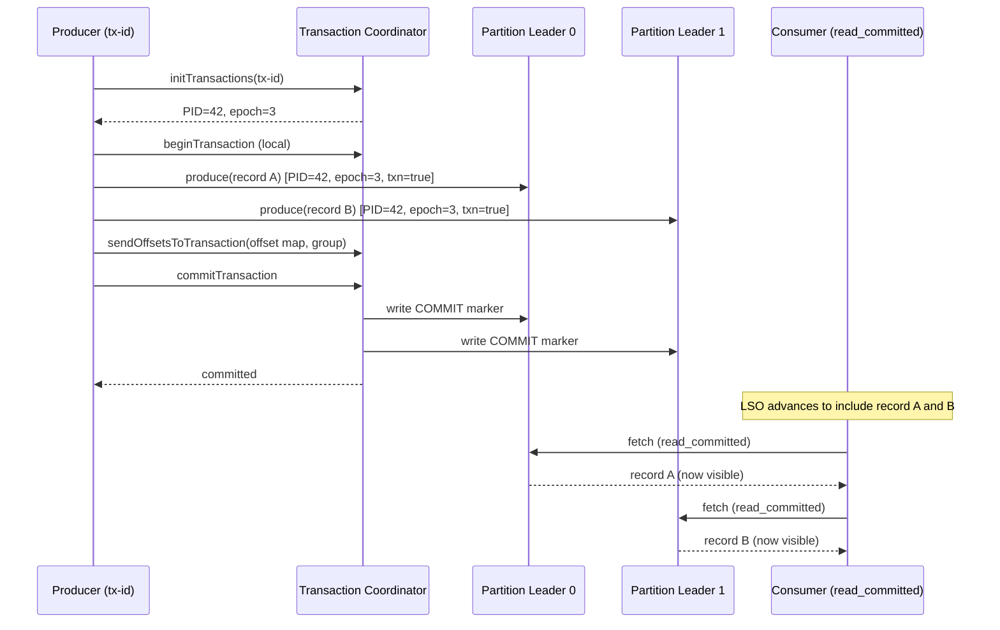
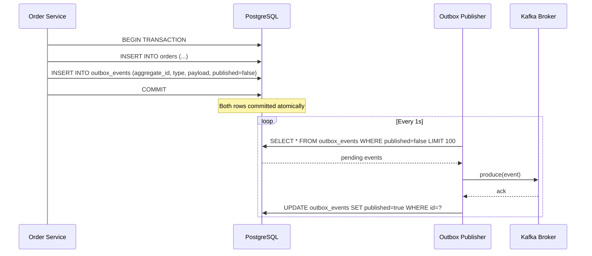

# Kafka - L3 Delivery Guarantees

## Exactly-Once Semantics

### 🎯 Model Answer

**30 seconds:**
> Exactly-once semantics (EOS) in Kafka: each record processed exactly once end-to-end. Requires
> idempotent producer (dedup retries within session) + Kafka transactions (`transactional.id`,
> `initTransactions`, `beginTransaction`, `commitTransaction`) + consumer with
> `isolation.level=read_committed`. EOS has overhead: ~5-20% throughput reduction. Use only where
> duplicates are unacceptable (financial transactions, inventory).

**3 minutes (Senior):**
> EOS components:
>
> 1. **Idempotent producer** (`enable.idempotence=true`): each producer instance gets a unique
>    Producer ID (PID). Each record has a sequence number per partition. Broker: rejects
>    duplicates (same PID + sequence). Covers: duplicate sends within a producer session. Does NOT
>    cover: producer restart (new PID = new sequence numbering = can re-send records).
>
> 2. **Kafka Transactions** (`transactional.id`): a stable identifier that survives producer
>    restarts. The broker generates an epoch for each transactional.id. On reconnect: broker
>    fences the old producer (rejects writes from old epoch). Guarantees: even if the producer
>    crashes mid-transaction and restarts, the partially-written data is aborted.
>
> 3. **Transaction protocol**: `initTransactions()` -> `beginTransaction()` -> `send()` multiple
>    records to multiple partitions -> `commitTransaction()` (atomically). Consumer with
>    `isolation.level=read_committed`: sees only committed transactions. Aborted records:
>    filtered by the broker.
>
> 4. **EOS in Kafka Streams**: built-in. `processing.guarantee=exactly_once_v2` (default since
>    Kafka 2.6). No manual transaction management needed. Handles: consume-transform-produce
>    in a single transaction.

**Blank Mind Recovery:**

**(1) Restate:** "EOS = idempotent producer + transactions. Idempotent: dedup within session.
Transactions: atomic multi-partition write + epoch fencing on restart. Consumer: isolation.level=
read_committed. Kafka Streams: processing.guarantee=exactly_once_v2."

**(2) First principles:** "Exactly-once = no duplicates + no loss. No loss: acks=all. No duplicates:
idempotence (session) + transactions (restart-safe). Consumer: only read committed data."

**(3) Bridge:** "EOS is like a bank transfer: debit account A, credit account B, done atomically.
Idempotence: the bank deduplicates a double-submitted transfer request. Transaction: either both
debit+credit happen or neither (no half-transfer). read_committed consumer: teller only sees
completed transfers, not in-progress."

---

### 📘 Concept Explanation

**Exactly-once semantics mechanics and transaction protocol:**
```
EOS ARCHITECTURE:

  Producer -> Transaction Coordinator (Kafka broker)
           -> Multiple Partitions (atomically)
  Consumer -> reads with isolation.level=read_committed

TRANSACTION FLOW:

  // Producer setup:
  Properties props = new Properties();
  props.put("bootstrap.servers", "broker:9092");
  props.put("key.serializer", StringSerializer.class.getName());
  props.put("value.serializer", StringSerializer.class.getName());
  props.put("enable.idempotence", "true");           // required for transactions
  props.put("transactional.id", "order-processor-1"); // unique per producer instance
  
  KafkaProducer<String, String> producer = new KafkaProducer<>(props);
  producer.initTransactions();  // register with transaction coordinator, get PID + epoch

  // Transaction: send multiple records atomically:
  try {
      producer.beginTransaction();
      
      producer.send(new ProducerRecord<>("orders", orderId, orderJson));
      producer.send(new ProducerRecord<>("inventory", productId, inventoryJson));
      // Both sends: part of the same transaction.
      // Consumers with read_committed: cannot see either until commit.
      
      producer.commitTransaction();  // atomic: both records visible at once
  } catch (ProducerFencedException | AuthorizationException e) {
      // Non-retriable: another producer with same transactional.id fenced us.
      // Close this producer. Create a new one.
      producer.close();
      throw e;
  } catch (KafkaException e) {
      // Retriable: abort and retry the whole transaction:
      producer.abortTransaction();
      throw e;
  }

EPOCH FENCING (ZOMBIE PREVENTION):

  Scenario without fencing:
    Producer P1 starts, transactional.id="tx-1", epoch=0.
    P1 crashes mid-transaction.
    P1 restarts. Gets new PID. Epoch=1. Calls initTransactions().
    Transaction coordinator: aborts P1's epoch=0 incomplete transaction.
    P1 epoch=0 (zombie): if still running, ANY message from epoch=0 is rejected.
    P1 epoch=1: clean start. Epoch fencing prevents duplicates from the zombie producer.
  
  This is why transactional.id must be UNIQUE per producer instance:
    Order service pod A: transactional.id="order-service-0"
    Order service pod B: transactional.id="order-service-1"
    Both running: each has its own epoch. No conflict.
    Pod A crashes and restarts: same transactional.id -> epoch incremented -> zombie A fenced.

CONSUMER: read_committed vs read_uncommitted:

  // Consumer setup for EOS:
  consumerProps.put("isolation.level", "read_committed");
  // Default: read_uncommitted (sees all records including in-progress transactions).
  
  With read_committed:
    Records in an open transaction: buffered by the broker (not delivered to consumer).
    Transaction committed: all records become visible at once.
    Transaction aborted: records never delivered.
    "Commit markers" in the partition log: `transaction.timeout.ms` marks abort on timeout.
  
  Impact: consumer may lag behind the log end if there are open transactions.
    "Last Stable Offset" (LSO) = latest committed transaction offset.
    Consumer with read_committed reads only up to LSO (not log end offset LEO).
    Hanging open transaction: LSO does not advance. Consumer: appears stuck.
    Command: kafka-consumer-groups.sh shows lag against LSO.

EOS IN KAFKA STREAMS:

  // Application config:
  props.put(StreamsConfig.PROCESSING_GUARANTEE_CONFIG,
      StreamsConfig.EXACTLY_ONCE_V2);  // Kafka 2.6+ default (replaces EXACTLY_ONCE)
  
  // Internally: each stream task wraps consume+process+produce in one transaction.
  // On crash: transaction aborted. On restart: re-processes from input offset.
  // Idempotent output: same input offset = same output (transaction ID = task ID + input offset).
  
  // Overhead: exactly_once_v2 uses one shared transaction per task.
  //   Older EXACTLY_ONCE: one transaction per poll interval. More coordinator load.
  //   V2: more efficient. Recommended for Kafka 2.6+.
```

---

### 💻 Code Example

> **Code walkthrough:** The consume-transform-produce transaction pattern is the canonical
> exactly-once pattern for reading from one Kafka topic and writing to another.

```java
// EOS: consume from input topic, transform, produce to output topic:
// (without Kafka Streams)

@Component
public class ExactlyOnceProcessor {
    
    private final KafkaConsumer<String, String> consumer;
    private final KafkaProducer<String, String> producer;
    
    @PostConstruct
    public void init() {
        // Consumer: read_committed (only see committed transactions):
        consumerProps.put("enable.auto.commit", "false");
        consumerProps.put("isolation.level", "read_committed");
        consumer = new KafkaConsumer<>(consumerProps);
        consumer.subscribe(List.of("orders"));
        
        // Producer: transactional:
        producerProps.put("enable.idempotence", "true");
        producerProps.put("transactional.id", "order-enricher-" + instanceId);
        producer = new KafkaProducer<>(producerProps);
        producer.initTransactions();
    }
    
    public void run() {
        while (running) {
            var records = consumer.poll(Duration.ofMillis(200));
            if (records.isEmpty()) continue;
            
            try {
                producer.beginTransaction();
                
                // Process each record:
                for (var r : records) {
                    var enriched = enrich(r.value());
                    producer.send(new ProducerRecord<>(
                        "enriched-orders", r.key(), enriched));
                }
                
                // Include the consumer offset commit in the transaction:
                // This atomically commits: output records + input offset advance.
                producer.sendOffsetsToTransaction(
                    currentOffsets(records),       // Map<TopicPartition, OffsetAndMetadata>
                    consumer.groupMetadata());      // consumer group info
                
                producer.commitTransaction();
                // Atomic: enriched records + offset advance. Exactly once.
                
            } catch (ProducerFencedException e) {
                producer.close();
                return;  // fatal: this instance is fenced
            } catch (KafkaException e) {
                producer.abortTransaction();  // rollback: try again
            }
        }
    }
    
    private Map<TopicPartition, OffsetAndMetadata> currentOffsets(
            ConsumerRecords<String, String> records) {
        Map<TopicPartition, OffsetAndMetadata> offsets = new HashMap<>();
        for (var partition : records.partitions()) {
            var recs = records.records(partition);
            var lastOffset = recs.get(recs.size() - 1).offset();
            offsets.put(partition, new OffsetAndMetadata(lastOffset + 1));
        }
        return offsets;
    }
}
```

> **Code walkthrough:** `sendOffsetsToTransaction()` is the key method: it includes the consumer
> offset commit as part of the producer transaction. This means: either the enriched records AND
> the offset advance commit together, or neither does (on abort). If the producer crashes after
> `sendOffsetsToTransaction()` but before `commitTransaction()`: the transaction coordinator
> detects the incomplete transaction and aborts it. On restart: the consumer re-reads the same
> input records (offset not advanced), produces the enriched records again in a new transaction.
> Exactly-once: each input record produces exactly one output record.

---

### 🎓 Answers by Seniority

**Junior / Mid (0-5 years):**
> EOS: three components. (1) `enable.idempotence=true`: dedup retries within a producer session.
> (2) `transactional.id`: enables Kafka transactions (atomic multi-partition writes). (3)
> Consumer `isolation.level=read_committed`: only reads committed transaction data. Together:
> exactly-once end-to-end. Kafka Streams: `processing.guarantee=exactly_once_v2` enables EOS
> without manual transaction management.

---

**Senior / Staff (5+ years):**
> EOS throughput cost: ~5-20% reduction vs at-least-once. The transaction coordinator manages
> epoch, fence old producers, and write commit markers. For every `commitTransaction()`: a
> two-phase protocol runs. The last stable offset (LSO) concept: with open transactions, the
> consumer cannot advance beyond the LSO. For monitoring: track `consumer-fetch-manager-metrics:
> records-lag-max` vs normal lag. Unexplained high lag with no active consumer backlog:
> a hanging transaction. Find it: `kafka-transactions.sh --bootstrap-server broker:9092 --list`.
> Abort it: `kafka-transactions.sh --abort --transactional-id tx-id --producer-id pid --epoch epoch`.

---

### ⚠️ Common Misconceptions

**Misconception: "Exactly-once in Kafka means no duplicate processing in my application."**
Kafka EOS guarantees exactly-once delivery of records to Kafka partitions and exactly-once commit
of offsets. It does NOT guarantee that your application code runs exactly once. If your consumer
processes a record (calls an external API, writes to a database) and then the transaction commits,
but the external API call was duplicated: that is a duplicate in the external system. EOS only
covers Kafka-to-Kafka flows (consume from Kafka, produce to Kafka, commit offset atomically). For
external systems: either (1) use idempotent API calls (same call twice = same result), (2) use
the database's transactional semantics to include offset storage, or (3) implement deduplication
in the external system. EOS is not a silver bullet; it is a precise guarantee within the Kafka
boundary.

---

### ⚖️ Comparison Table

| Semantic | Configuration | Risk | Overhead |
|---|---|---|---|
| At-most-once | commit before process | Data loss on crash | None |
| At-least-once | commitSync after process | Duplicates on crash | Minimal |
| Exactly-once (producer only) | enable.idempotence=true | Duplicates across sessions | Minimal |
| Exactly-once (full) | transactional.id + read_committed | None within Kafka | 5-20% |

---

### 🏛️ System Design

*(Omit: L3 keyword, delivery semantics. No system architecture design applicable.)*

---

### 📊 Diagram

**Kafka transaction protocol flow:**

```
  PRODUCER         TRANSACTION COORD    PARTITION LEADERS    CONSUMER (read_committed)
  
  initTransactions -> register tx-id
                   <- PID, epoch
  
  beginTransaction (local state only)
  
  send(record A)  -> write to P0 leader (part of tx)
  send(record B)  -> write to P1 leader (part of tx)
  
  sendOffsets     -> commit offset to __consumer_offsets (part of tx)
  
  commitTransaction:
    (1) write commit marker to coord
    (2) coord writes "committed" to all partitions
    (3) all records now visible to read_committed consumers
  
  Consumer:                                           polls
  Before step 3:                                      <- empty (LSO not advanced)
  After step 3:                                       <- records A, B visible
```



> **Diagram walkthrough:** The transaction coordinator acts as the single arbiter. Records A and B
> are written to their partition leaders as part of the transaction (flagged with the producer's
> PID and epoch). The `sendOffsetsToTransaction` includes the consumer offset advance as part of
> the same transaction. Only after `commitTransaction` causes the coordinator to write COMMIT
> markers to all partitions does the Last Stable Offset advance. Before that point, a
> `read_committed` consumer sees nothing. This is the atomic visibility guarantee of Kafka EOS.

---

### 🚨 Failure Modes and Diagnosis

**Failure: Consumer lag grows with read_committed - hanging transaction.**
```
Symptom: Consumer LAG growing. Consumer appears healthy (no errors, polling normally).
  kafka-consumer-groups.sh shows LAG = 50000 and not changing.
  Producer metrics: no active sends.

Root cause: a long-running or abandoned open transaction.
  Producer started a transaction, crashed without committing or aborting.
  transaction.timeout.ms (default 60s): Kafka aborts open transactions after timeout.
  But: the LSO advances only when the partition's pending transactions resolve.
  A transaction spanning a very large offset range: LSO stuck at the transaction start.

Diagnosis:
  kafka-consumer-groups.sh --describe --group order-processor
    Compare CURRENT-OFFSET vs LOG-END-OFFSET vs LAST-STABLE-OFFSET.
    If CURRENT-OFFSET = LAST-STABLE-OFFSET but < LOG-END-OFFSET:
      Consumer has consumed up to LSO. LSO is stuck. Open transaction.
  
  Find the open transaction:
    kafka-transactions.sh --bootstrap-server broker:9092 --list
  
  Check transaction coordinator logs for "aborting timed-out transaction".

Fix:
  Wait for transaction.timeout.ms (default 60s) to expire.
    Coordinator auto-aborts the hung transaction. LSO advances.
  
  Or manually abort:
    kafka-transactions.sh --bootstrap-server broker:9092 \
      --abort --transactional-id hung-producer-id --producer-id 42 --epoch 3
  
  Reduce transaction.max.timeout.ms (broker config, default 15min) to limit maximum hang time.
  Alert on LSO vs LEO gap > threshold.
```

---

### 🎯 Interview Deep-Dive

| Question Category | Time to Answer |
|---|---|
| EOS components | 2 minutes |
| Idempotent producer limits | 1 minute |
| Transaction protocol | 3 minutes |
| Epoch fencing | 2 minutes |
| read_committed consumer | 1 minute |
| EOS vs at-least-once with idempotency | 2 minutes |
| Hanging transaction diagnosis | 2 minutes |
| EOS in Kafka Streams | 1 minute |

---

**Q1 (mechanism): Explain how Kafka transactions work end-to-end.**

A: Kafka transactions provide atomic writes across multiple partitions and atomic offset commits.
End-to-end flow: (1) Producer creates with `transactional.id="my-producer"`. (2) `initTransactions()`:
registers with the transaction coordinator (the broker that owns the `__transaction_state` partition
for the hash of `transactional.id`). Coordinator assigns a PID and epoch. Epoch fences any old
producer with the same `transactional.id` (old epoch rejected). (3) `beginTransaction()`: local
state change only, no network call. (4) `send()` records to various partitions: each write is
tagged with the PID, epoch, and a flag indicating it is part of a transaction. Consumers with
`read_uncommitted` (default) can see these records. Consumers with `read_committed`: cannot see
them yet (LSO not advanced). (5) `sendOffsetsToTransaction(offsets, groupMetadata)`: tells the
transaction coordinator to include the consumer offset commit in the transaction. (6)
`commitTransaction()`: two-phase commit. First: write a PREPARE commit to the coordinator.
Then: coordinator writes COMMIT markers to every partition that received records in this transaction.
Consumers with `read_committed`: the COMMIT markers advance the LSO, and the records become visible.
(7) On producer crash before commit: the transaction times out (`transaction.timeout.ms`). Coordinator
writes ABORT markers. Consumer never sees the aborted records.

*What separates good from great:* The `transactional.id` cardinality and scaling. Each unique
`transactional.id` has one transaction coordinator slot. For high-concurrency use cases: each
parallel producer instance needs its own `transactional.id` (e.g., `"service-{pod-ordinal}"` or
`"service-{partition-id}"`). The coordinator handles all transactions for a `transactional.id`
serially (one transaction at a time per ID). For Kafka Streams with exactly_once_v2: each task
has its own transaction ID. N tasks = N concurrent transactions. The total transaction throughput
= N tasks * single-transaction throughput. Kafka Streams `exactly_once_v2` (introduced in KIP-447)
also allows multiple input partitions per stream task to share one transaction per poll interval,
reducing the total number of transaction coordinator calls vs the older `exactly_once` mode.

---

---

## Kafka Transactions

### 🎯 Model Answer

**30 seconds:**
> Kafka transactions provide atomic multi-partition writes: either all sends within a transaction
> commit (become visible) or all are aborted. The `transactional.id` makes transactions durable
> across producer restarts via epoch fencing. `sendOffsetsToTransaction()` atomically advances
> the consumer offset with the output records - the core of consume-transform-produce
> exactly-once patterns.

**3 minutes (Senior):**
> Kafka transactions vs RDBMS transactions:
>
> 1. **Scope**: Kafka transactions: atomicity across Kafka partitions. RDBMS: atomicity across
>    tables. Kafka transactions + RDBMS transactions: NOT automatically compatible. Including
>    a database write in a Kafka transaction does not make the DB write atomic with Kafka
>    (no distributed transaction protocol between Kafka and the DB by default).
>
> 2. **Isolation**: `read_committed` consumer: sees only committed records. `read_uncommitted`
>    (default): sees all records including those in-flight transactions. For audit logs and
>    reporting: `read_committed` ensures only stable data is processed.
>
> 3. **Atomicity guarantee**: Kafka transactions guarantee: all-or-nothing visibility to
>    `read_committed` consumers. Not: all-or-nothing delivery (producer may re-send and broker
>    deduplicates via idempotence).
>
> 4. **Limitations**: Kafka transactions work only within Kafka. The transaction coordinator is
>    a single broker per `transactional.id`. Performance: ~5-20% overhead. `transaction.timeout.ms`
>    (default 60s, max configured by `transaction.max.timeout.ms`): transactions must commit or
>    abort within this window.

**Blank Mind Recovery:**

**(1) Restate:** "Kafka transaction = atomic multi-partition visibility. transactional.id = durable
across restarts (epoch fencing). sendOffsetsToTransaction = atomic offset + output. Not a distributed
transaction with databases. Performance: ~5-20% overhead."

**(2) First principles:** "Atomicity in distributed systems: hardest problem. Kafka solves for
Kafka-only scope. The transaction coordinator: a single point managing the two-phase commit.
Simple two-phase within Kafka's own partition model."

**(3) Bridge:** "Kafka transactions are like sending a birthday card with money: both the card and
the money leave together (atomic commit) or neither leaves (abort). But if you also want to simultaneously
withdraw money from a bank account in another city: that requires a separate agreement (distributed
transaction coordinator - not what Kafka provides natively)."

---

### 📘 Concept Explanation

**Kafka transaction lifecycle, limitations, and patterns:**
```
TRANSACTIONAL PRODUCER LIFECYCLE:

  State Machine:
    UNINITIALIZED
      -> initTransactions() -> READY
    
    READY
      -> beginTransaction() -> IN_TRANSACTION
    
    IN_TRANSACTION
      -> send() -> records buffered to coordinator
      -> commitTransaction() -> COMMITTING_TRANSACTION -> READY
      -> abortTransaction()  -> ABORTING_TRANSACTION  -> READY
    
    FATAL_ERROR (ProducerFencedException, etc.):
      -> close() (cannot recover this producer instance)

TRANSACTION COORDINATOR INTERNALS:

  The transaction coordinator is the leader broker for the partition:
    __transaction_state partition = abs(transactional.id.hashCode()) % 50
  
  Coordinator stores per-transactional.id:
    - Latest PID + epoch
    - Partitions written in current transaction
    - Transaction state (BEGIN, ONGOING, PREPARE_COMMIT, COMPLETE_COMMIT, ...)
  
  Fencing: if producer with old epoch sends, coordinator rejects.
  Timeout: if no commit/abort within transaction.timeout.ms:
    Coordinator: marks transaction as ABORTING.
    Writes ABORT markers to all involved partitions.
    Consumers: never see the aborted records.

SENDOFFSETSTOATRANSACTION (THE CRITICAL METHOD):

  producer.sendOffsetsToTransaction(offsets, consumer.groupMetadata());
  
  What it does:
    1. Producer tells transaction coordinator: include this offset commit in my transaction.
    2. Coordinator: sends offset commit to __consumer_offsets on behalf of the producer.
    3. The offset commit is part of the transaction: if transaction aborts, offset not advanced.
    4. If transaction commits: offset advanced atomically with the output records.
  
  Result: consume-transform-produce is exactly-once.
    Read records at offset N -> produce enriched record -> commit transaction.
    Transaction commits: consumer offset = N+1 AND enriched record visible.
    Transaction aborts: consumer offset still N AND enriched record not visible.
    Next attempt: re-reads from N, produces again.

WHEN NOT TO USE TRANSACTIONS:

  1. When at-least-once with idempotent downstream is acceptable.
     Order service with idempotent DB writes: duplicates handled by DB constraint.
     EOS overhead not justified.
  
  2. When the output is NOT Kafka (external DB writes, API calls):
     Kafka transactions do NOT coordinate with external systems.
     A DB write inside a Kafka transaction is NOT atomic with the transaction.
     
     // WRONG: assuming DB write + Kafka commit are atomic:
     producer.beginTransaction();
     producer.send(new ProducerRecord<>("notifications", notifJson));
     dbService.markOrderAsProcessed(orderId);  // DB write NOT part of Kafka tx
     producer.commitTransaction();
     // If Kafka commit fails: notification NOT sent, but DB marked processed.
     // Inconsistency: DB says done, Kafka never got the notification.
     
     Fix for DB + Kafka: use outbox pattern
     (write to DB outbox table and Kafka topic in same DB transaction).
  
  3. Low-latency critical paths (fraud detection, gaming):
     5-20% overhead + extra broker communication is unacceptable.
     Use at-least-once with idempotent processing instead.

OUTBOX PATTERN (DB + KAFKA ATOMICITY):

  Problem: atomic DB write + Kafka publish without distributed transaction.
  
  Solution: write to an outbox table in the same DB transaction as the business record.
    @Transactional
    public void processOrder(Order order) {
        orderRepo.save(order);  // DB write
        outboxRepo.save(new OutboxEvent("order.created", toJson(order)));
        // Both in same DB transaction: atomic.
    }
  
  Outbox publisher (separate process):
    Polls outbox table (or uses Debezium to read DB changes).
    Publishes to Kafka. Marks outbox record as published.
    On crash: re-polls and re-publishes. Kafka: idempotent producer deduplicates.
  
  Result: DB and Kafka are eventually consistent with at-least-once delivery.
  No distributed transaction required.
```

---

### 💻 Code Example

> **Code walkthrough:** The outbox pattern solves the DB + Kafka atomicity problem without Kafka
> transactions and without a distributed transaction coordinator.

```java
// WRONG: DB write + Kafka send without atomicity guarantee:
@Service
public class OrderServiceWrong {
    
    @Autowired OrderRepository orderRepo;
    @Autowired KafkaTemplate<String, String> kafka;
    
    @Transactional
    public void createOrder(CreateOrderRequest req) {
        Order order = orderRepo.save(new Order(req));  // DB write
        kafka.send("orders", order.getId(), toJson(order));
        // WRONG: if Kafka send fails after DB commit: order in DB, no event in Kafka.
        // Downstream services: never notified. Order in limbo.
    }
}

// RIGHT: Outbox pattern (DB + Kafka eventually consistent):
@Service
public class OrderServiceRight {
    
    @Autowired OrderRepository orderRepo;
    @Autowired OutboxRepository outboxRepo;
    
    @Transactional  // DB transaction only
    public void createOrder(CreateOrderRequest req) {
        Order order = orderRepo.save(new Order(req));
        
        // Write event to outbox in the SAME DB transaction:
        outboxRepo.save(OutboxEvent.of(
            order.getId().toString(),
            "order.created",
            toJson(order)));
        // If DB transaction commits: both order and outbox row saved atomically.
        // If DB transaction rolls back: neither saved. No orphan outbox event.
    }
}

// Outbox publisher (background job or Debezium-driven):
@Scheduled(fixedDelay = 1000)
@Transactional
public void publishPendingEvents() {
    List<OutboxEvent> pending = outboxRepo.findPending(100);  // batch of 100
    
    for (OutboxEvent event : pending) {
        try {
            kafka.send(event.getTopic(), event.getAggregateId(), event.getPayload()).get();
            event.markPublished();
        } catch (Exception e) {
            log.warn("Failed to publish outbox event {}: {}", event.getId(), e.getMessage());
            // Leave as pending. Will retry on next schedule.
        }
    }
}
// Kafka producer: enable.idempotence=true. Duplicate events on retry: deduplicated.
```

> **Code walkthrough:** The `createOrder` service writes both the `Order` and an `OutboxEvent`
> in a single DB transaction. If the transaction commits: the outbox row is guaranteed to exist.
> The publisher polls the outbox and sends to Kafka, then marks the row as published. On crash
> between Kafka send and marking published: the event is re-published (at-least-once). The
> idempotent producer deduplicates if the same event is sent twice to the same Kafka partition.
> This achieves atomic DB + Kafka consistency without distributed transactions.

---

### 🎓 Answers by Seniority

**Junior / Mid (0-5 years):**
> Kafka transactions: atomic multi-partition writes. `beginTransaction()`, `send()`, then
> `commitTransaction()` or `abortTransaction()`. Consumer `isolation.level=read_committed`:
> only sees committed records. Use for consume-transform-produce patterns where exactly-once
> matters. Overhead: 5-20%. Use at-least-once + idempotency for most cases.

---

**Senior / Staff (5+ years):**
> The outbox pattern is the production solution for DB + Kafka atomicity at most companies - not
> Kafka transactions. Kafka transactions: Kafka-only scope. Outbox: DB-native atomicity (ACID) +
> Kafka delivery (at-least-once + idempotent). Implemented with Debezium: instead of polling
> the outbox table, Debezium reads the DB WAL and produces Kafka events as the table changes.
> No polling delay. No extra scheduler. Debezium is the best outbox publisher for high-throughput
> systems. The architectural trade-off: Debezium introduces an additional component. For simpler
> systems: scheduled outbox polling (every 1-5 seconds) is sufficient and has no additional
> infrastructure dependency.

---

### ⚠️ Common Misconceptions

**Misconception: "Kafka transactions solve the dual-write problem between a database and Kafka."**
Kafka transactions provide atomicity only within Kafka. A dual-write (write to DB AND send to
Kafka) is not made atomic by Kafka transactions. If the DB write is inside a Kafka transaction:
the DB write is not rolled back when the Kafka transaction aborts (they are different systems with
different transaction coordinators). Solutions to the dual-write problem: (1) Outbox pattern:
DB write + Kafka event in the same DB transaction. Event published separately. (2) Debezium CDC:
DB write, Debezium reads WAL, produces Kafka event. Atomic from the DB's perspective. (3) Event
sourcing: the Kafka topic IS the database (event log). No dual-write: Kafka is the single source
of truth. (4) SAGA pattern: choreographed compensating transactions (not atomic, but eventually
consistent). Kafka transactions: only for Kafka-to-Kafka flows (Kafka Streams being the primary
use case).

---

### ⚖️ Comparison Table

| Approach | Atomicity | Scope | Complexity | Performance |
|---|---|---|---|---|
| Kafka transactions | Atomic | Kafka-only | Medium | 5-20% overhead |
| Outbox pattern | Eventual | DB + Kafka | Medium | Near-zero overhead |
| Debezium CDC | Eventual | DB + Kafka | Low (config) | WAL read overhead |
| Event sourcing | N/A - Kafka IS DB | Kafka only | High | Optimal |
| Saga / choreography | Eventual | Any systems | High | Application-level |

---

### 🏛️ System Design

*(Omit: L3 keyword, transactional mechanics. No system architecture design applicable.)*

---

### 📊 Diagram

**Outbox pattern architecture:**

```
  ORDER SERVICE            DATABASE                KAFKA
  ┌──────────────┐        ┌────────────────┐      ┌──────────────────┐
  │ createOrder  │ TX --> │ orders table   │      │ orders topic     │
  │ (DB TX)      │        │ + outbox_events│      │                  │
  └──────────────┘        └───────┬────────┘      │                  │
                                  │               │                  │
                          ┌───────▼────────┐      │                  │
                          │ Outbox Publisher│----> │ {order.created}  │
                          │ (poll/Debezium) │      │                  │
                          └────────────────┘      └──────────────────┘
  
  ATOMICITY: createOrder TX commits = order + outbox_event both saved.
  DELIVERY:  publisher polls outbox, sends to Kafka, marks published.
  RECOVERY:  on crash, re-polls unpublished events. At-least-once.
```



> **Diagram walkthrough:** The Order Service writes both the business record and the outbox event
> in a single DB transaction - atomicity guaranteed by the DB's ACID properties. The Outbox
> Publisher (a separate process or Debezium) polls for unpublished events and sends them to Kafka.
> After receiving a Kafka ack, it marks the event as published. If the publisher crashes between
> the Kafka send and the DB update: the event is re-published on restart (at-least-once). The
> idempotent Kafka producer handles the rare duplicate. This is the most common production pattern
> for reliable DB + Kafka integration.

---

### 🚨 Failure Modes and Diagnosis

**Failure: Transaction coordinator unavailable - producers cannot transact.**
```
Symptom: "org.apache.kafka.common.errors.CoordinatorNotAvailableException"
  Or: "Timed out waiting for a node assignment"
  Transactions fail. Service health: degraded.

Root cause: the broker hosting the __transaction_state partition for this transactional.id
  is temporarily unavailable (restart, GC pause, network partition).
  The transaction coordinator is the leader of:
    partition = abs(transactional.id.hashCode()) % 50
  
  If that broker is down: no transaction commits or aborts.
  New broker election: takes 20-30 seconds (default unclean election off).

Diagnosis:
  Check broker health: kafka-broker-api-versions.sh against each broker.
  Identify which broker hosts __transaction_state for the failing transactional.id:
    abs("my-transactional-id".hashCode()) % 50 -> gives partition number
    kafka-topics.sh --describe --topic __transaction_state ->
      find the leader for that partition.
  Check that broker: is it online? GC pausing?

Fix:
  Wait for leader election (20-30s). New leader resumes coordination.
  If persistent: check broker disk full, OOM, or hardware failure.
  
  Application retry:
    producer.initTransactions() throws when coordinator unavailable.
    Implement retry with exponential backoff:
    for (int attempt = 0; attempt < 5; attempt++) {
        try { producer.initTransactions(); break; }
        catch (TimeoutException e) {
            Thread.sleep(Math.min(1000L * (1 << attempt), 30000));
        }
    }
```

---

### 🎯 Interview Deep-Dive

| Question Category | Time to Answer |
|---|---|
| Transaction lifecycle | 2 minutes |
| sendOffsetsToTransaction | 2 minutes |
| Transaction coordinator internals | 2 minutes |
| Outbox pattern | 2 minutes |
| Why Kafka tx doesn't solve dual-write | 2 minutes |
| Epoch fencing | 1 minute |
| read_committed vs read_uncommitted | 1 minute |
| Transaction overhead | 1 minute |
| Transaction coordinator failure | 1 minute |

---

**Q1 (architecture): When would you use Kafka transactions, and when would you use the outbox pattern instead?**

A: Kafka transactions: use when both the input (source of records to process) and the output
(enriched or processed records) are Kafka topics, and you need exactly-once semantics within
that Kafka-to-Kafka pipeline. Primary use case: Kafka Streams applications (consume from one
topic, transform, produce to another topic with exactly-once guarantee). Manual use case: read
from an input topic, produce to an output topic, and commit the input offset - all atomically.
Enables idempotent reprocessing: crash + restart re-processes the input record exactly once.
Outbox pattern: use when the primary data store is a relational database, and you need reliable
Kafka event publication when a DB record is written. The core problem: DB write + Kafka publish
are two separate operations - either can fail independently. Outbox: write both the business
record and the outbox event in the same DB transaction (single atomic unit). A background
publisher (polling or Debezium) then reads the outbox and publishes to Kafka. Result: the event
is guaranteed to reach Kafka eventually (at-least-once with idempotent publisher). No distributed
transaction coordinator needed. When to choose which: (1) Kafka Streams / Kafka-only pipelines:
Kafka transactions (or `exactly_once_v2` built into Kafka Streams). (2) Service with DB as
primary store that needs to publish events: outbox pattern. (3) External APIs (not DB, not Kafka):
SAGA with compensating transactions or idempotent API + at-least-once delivery.

*What separates good from great:* The Debezium-based outbox variant. Basic outbox polling: adds
1-5 second latency (poll interval). For near-real-time requirements: use Debezium to read the
outbox table changes from the WAL. Debezium captures the INSERT into outbox_events the moment
the WAL change is available (milliseconds after DB commit). Combined with the `eventhubs.OutboxTransformer`
SMT in Debezium: automatically extracts the event type and payload from the outbox row structure
and routes it to the correct Kafka topic. This achieves sub-second DB-to-Kafka latency with no
polling overhead. The trade-off: adds Debezium as an infrastructure dependency. For simpler use
cases: polling every second is adequate and has no extra infrastructure. The decision: real-time
latency requirement vs operational complexity of running Debezium.

