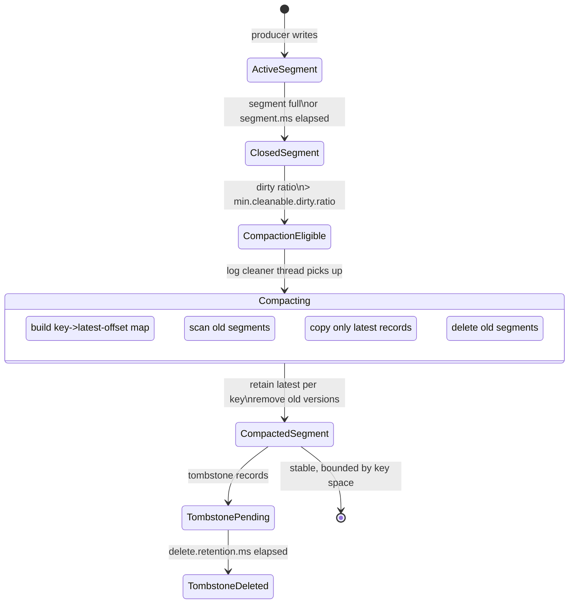
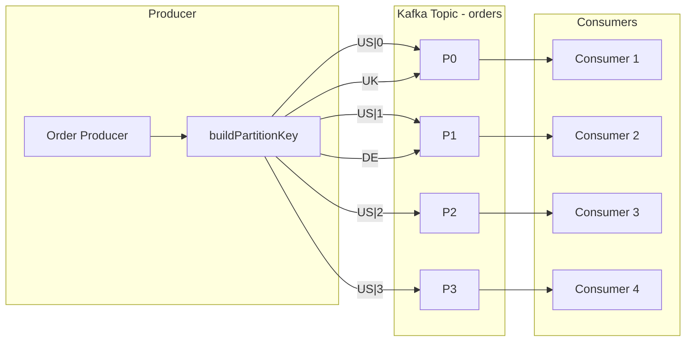

# Kafka - L3 Storage and Partitioning

## Log Compaction

### 🎯 Model Answer

**30 seconds:**
> Log compaction: Kafka's background process that removes obsolete records (same key, earlier
> value). Compaction retains only the latest value per key, plus tombstones (null value = delete).
> Use for: changelog topics, CDC (change data capture), event sourcing where only the latest
> state matters. Result: compacted topic = current snapshot of key-value state. Does NOT preserve
> order within the retained records.

**3 minutes (Senior):**
> Compaction mechanics:
>
> 1. **Segment anatomy**: a Kafka partition = a log of segment files. Each segment: up to
>    `log.segment.bytes` (default 1GB). Active segment: open for writes. Closed segments:
>    eligible for compaction. Compaction: runs in the background via the log cleaner thread.
> 2. **Log cleaner**: identifies the `dirty ratio` (ratio of uncompacted to total bytes).
>    When dirty ratio > `min.cleanable.dirty.ratio` (default 0.5 = 50%): cleaner starts.
>    Cleaner builds a key-to-offset map of the dirty section. Then: scans the segment, retains
>    only the latest offset per key, copies retained records to a new segment. Old segment:
>    deleted.
> 3. **Tombstones**: a record with a null value (tombstone) signals deletion. After compaction:
>    only the tombstone remains. The tombstone: deleted after `delete.retention.ms` (default 24h).
>    After that: the key no longer exists. Consumers: must see the tombstone BEFORE it is deleted
>    (otherwise: consumer believes the key still has a value).
> 4. **Compaction guarantees**: the compacted log always contains at least the last value per key.
>    Offsets: preserved (gaps appear where deleted records were). Consumers: the same consumer code
>    works on compacted and non-compacted topics (gaps in offsets are normal in Kafka, not errors).
> 5. **Compaction + retention**: `cleanup.policy=compact,delete` (Kafka 2.1+). Both: compaction
>    removes old versions, time/size retention removes oldest compacted segments.

**Blank Mind Recovery:**

**(1) Restate:** "Compaction: keep only latest value per key. Tombstone: null value = delete key.
Log cleaner: background thread, triggers when dirty ratio > threshold. Guarantees: latest value
per key always retained. Gaps in offsets: normal. Use for: changelog, CDC, event sourcing state."

**(2) First principles:** "Retention modes: time/size retention (delete old records), compaction
(keep latest per key). Time/size: bounded by time or size, not key uniqueness. Compaction:
bounded by key space, not time. For database changelogs: you want latest-per-key, not latest-by-time."

**(3) Bridge:** "Log compaction is like keeping only the most recent letter per sender in a mailbox.
Old letters from the same sender: discarded. The latest letter: always kept. Tombstone: a
'please delete my correspondence' letter. Kept briefly (delete.retention.ms), then discarded along
with the record of contact."

---

### 📘 Concept Explanation

**Compaction lifecycle, configuration, and Kafka Streams state stores:**
```
PARTITION LOG STRUCTURE:

  Offset: 0  1  2  3  4  5  6  7  8  9
  Key:    A  B  A  C  B  A  C  D  A  B
  
  After compaction (latest per key retained):
  Offset: 1     3     6  7     9
  Key:       B     C        D  B (last A at 8, last C at 6, last D at 7, last B at 9)
  Wait: let me redo this correctly:
    Last A: offset 8
    Last B: offset 9
    Last C: offset 6
    Last D: offset 7
  
  Compacted log (gaps are normal):
  Offset: 6  7  8  9
  Key:    C  D  A  B
  (Offsets 0-5 deleted, offsets 6-9 retained as they are the latest per key.)

COMPACTION CONFIGURATION:

  Topic creation with compaction:
    kafka-topics.sh --create --topic user-events \
      --config cleanup.policy=compact \
      --config min.cleanable.dirty.ratio=0.3 \  # compact earlier (30% dirty)
      --config segment.ms=3600000 \             # close segments every 1h
      --config delete.retention.ms=86400000     # tombstones kept 24h

  Key configs:
    cleanup.policy=compact             - enable compaction
    cleanup.policy=compact,delete      - compaction + time/size retention
    min.cleanable.dirty.ratio=0.5      - default: compact when 50% of log is dirty
    log.cleaner.threads=1              - background cleaner threads (per broker)
    log.cleaner.min.compaction.lag.ms=0 - min age of a message to be eligible for compaction
    log.cleaner.max.compaction.lag.ms  - force compaction after this lag (default: unlimited)
    delete.retention.ms=86400000       - how long tombstones are kept (24h default)

KAFKA STREAMS STATE STORES + COMPACTION:

  Kafka Streams uses changelog topics for fault tolerance:
    Each stateful operator (aggregation, join) has a backing state store.
    State store changes: written to a changelog topic (compacted).
    On restart: Kafka Streams restores state from the changelog topic.
    Compaction: limits restore time (only latest value per key needed).
  
  Consumer group reading a compacted topic to rebuild state:
    Reads all records from offset 0.
    For each key: later value overwrites earlier value.
    After reading all records: in-memory map = latest state per key.
    Efficient: compaction means the log is size-bounded by the key space,
    not by message count over time.

TOMBSTONE TIMING HAZARD:

  Producer writes:    [key=A, value="user-data"] offset=100
  Producer writes:    [key=A, value=null]         offset=200  <- tombstone
  
  delete.retention.ms=24h:
    For 24h after offset 200 is compacted (not offset 200 creation time):
      tombstone retained.
    After 24h: tombstone deleted. Key A no longer in log.
  
  HAZARD: consumer that was offline for > 24h + compaction lag:
    Consumer seeks to last committed offset (offset 150).
    Offset 150 is now gone (compacted away).
    Consumer: auto-reset to EARLIEST (per auto.offset.reset).
    Reads from start of compacted log.
    Key A: tombstone already deleted. Consumer: still has old value in memory.
    Consumer: does not know key A was deleted. Stale state.
  
  Prevention:
    Consumer downtime should be < delete.retention.ms.
    Or: consume in real-time (never offline long enough to miss tombstones).
    Or: use Kafka Streams (handles state restoration with changelog, not raw consumer).

COMPACTION + EXACTLY-ONCE:

  Compaction does not affect transaction boundaries.
  A transactional record in a compacted topic: compacted normally.
  The transaction coordinator's __transaction_state topic: itself compacted (cleanup.policy=compact).
  This is why __transaction_state never grows unboundedly:
    Old transaction metadata (completed transactions) is compacted away.
```

---

### 💻 Code Example

> **Code walkthrough:** Reading a compacted topic to rebuild key-value state is the primary
> use case for compacted changelog topics outside of Kafka Streams.

```java
// Reading a compacted changelog topic to restore in-memory state:
public class StateRestorer {
    
    private final Map<String, String> stateStore = new ConcurrentHashMap<>();
    
    public void restoreState(String changelogTopic, Properties consumerProps) {
        // Assign ALL partitions (not subscribe - we want full state):
        KafkaConsumer<String, String> consumer = new KafkaConsumer<>(consumerProps);
        List<PartitionInfo> partitions = consumer.partitionsFor(changelogTopic);
        List<TopicPartition> allPartitions = partitions.stream()
            .map(p -> new TopicPartition(changelogTopic, p.partition()))
            .collect(Collectors.toList());
        
        consumer.assign(allPartitions);
        consumer.seekToBeginning(allPartitions);  // start from the beginning
        
        // Get end offsets to know when to stop:
        Map<TopicPartition, Long> endOffsets = consumer.endOffsets(allPartitions);
        Set<TopicPartition> finishedPartitions = new HashSet<>();
        
        while (finishedPartitions.size() < allPartitions.size()) {
            ConsumerRecords<String, String> records = consumer.poll(Duration.ofMillis(500));
            
            for (ConsumerRecord<String, String> r : records) {
                if (r.value() == null) {
                    // Tombstone: delete from state:
                    stateStore.remove(r.key());
                } else {
                    // Upsert (later offset = later value):
                    stateStore.put(r.key(), r.value());
                }
                
                // Check if we've caught up to the end offset:
                TopicPartition tp = new TopicPartition(r.topic(), r.partition());
                if (r.offset() >= endOffsets.get(tp) - 1) {
                    finishedPartitions.add(tp);
                }
            }
        }
        consumer.close();
        
        log.info("State restored: {} keys loaded from {}",
            stateStore.size(), changelogTopic);
    }
}
```

> **Code walkthrough:** The restorer assigns all partitions directly (not subscribe) to ensure
> it reads every partition's full history. `seekToBeginning` starts from offset 0. For each
> record: null value = tombstone (delete from map), non-null = upsert. The loop exits when all
> partitions reach their end offset. This produces the same in-memory state as if the service
> had processed every change event in real time. Compaction ensures the topic only contains the
> latest value per key, so the restore is efficient even for long-lived topics.

---

### 🎓 Answers by Seniority

**Junior / Mid (0-5 years):**
> Log compaction: a Kafka cleanup mode where only the latest value per key is kept.
> `cleanup.policy=compact`. Tombstone: null value = delete marker. Use for changelog topics
> where the consumer only cares about the current state of each key. Compaction runs in the
> background - the log cleaner thread.

---

**Senior / Staff (5+ years):**
> Production compaction tuning: `min.cleanable.dirty.ratio=0.3` for more aggressive compaction
> (compact earlier). `log.cleaner.max.compaction.lag.ms` to bound the maximum time a message
> waits before compaction (important for latency-sensitive state stores). For Kafka Streams
> changelog topics: the changelog retention is tied to the consumer lag. If the stream task
> is down for a long time, the changelog may have been compacted past the last committed offset.
> Kafka Streams: re-starts from the beginning of the compacted log (full state restore). Large
> state stores: restore can take minutes. Optimize with RocksDB snapshots (Kafka Streams changelog
> restore with standby replicas `num.standby.replicas=1`).

---

### ⚠️ Common Misconceptions

**Misconception: "Log compaction preserves message ordering."**
Log compaction preserves the relative ordering of retained records (a record with a higher offset
always appears after a record with a lower offset in the compacted log). But: it does NOT preserve
the original message ordering per key. Example: key A was written 10 times. Only the latest write
is kept. A consumer reading the compacted log sees key A at offset 999, then key B at offset 1000.
In the original log: key B may have been at offset 50 (between key A writes at 3, 7, 12). The
consumer of the compacted log should treat the compacted log as a snapshot of current key-value
state, not as a precise event history. If you need full event history: use `cleanup.policy=delete`
(time/size retention). If you need only current state: use `cleanup.policy=compact`. If you need
both bounded history AND current state: `cleanup.policy=compact,delete`.

---

### ⚖️ Comparison Table

| Policy | Records Kept | Bounded By | Use Case | Offset Gaps |
|---|---|---|---|---|
| delete (default) | All within window | Time / Size | Event streaming, logs | No |
| compact | Latest per key | Key space | Changelogs, CDC, state | Yes |
| compact,delete | Latest per key + recent | Key space + Time | CDC with TTL | Yes |

---

### 🏛️ System Design

*(Omit: L3 storage internals keyword. No system architecture design applicable.)*

---

### 📊 Diagram

**Log compaction before and after:**

```
  BEFORE COMPACTION:
  
  Offset: 0  1  2  3  4  5  6  7  8  9
  Key:    A  B  A  C  B  A  C  D  B  A(tomb)
  Value: v1 v1 v2 v1 v2 v3 v2 v1 v3  null
  
  After compaction (latest per key retained):
  
  Offset: 3  7  8  9
  Key:    C  D  B  A(tomb)
  
  Tombstone for A: retained for delete.retention.ms (24h), then removed.
  After delete.retention.ms: Offset 9 gone. Key A: no longer exists.
```



> **Diagram walkthrough:** The compaction pipeline starts when a closed segment's dirty ratio
> exceeds the threshold. The log cleaner builds a key-to-latest-offset map, scans the old
> segments, copies only the latest record per key to a new compacted segment, and deletes the
> old segments. Tombstones (null-value records) survive compaction for `delete.retention.ms`
> to ensure consumers that were briefly offline still see the deletion signal. After that period,
> the tombstone itself is removed. The compacted topic is bounded by the key space, not by message
> age or count.

---

### 🚨 Failure Modes and Diagnosis

**Failure: Compacted topic growing unboundedly - compaction not running.**
```
Symptom: topic with cleanup.policy=compact. Disk usage growing.
  Log cleaner not keeping up. Segment count increasing.

Root cause options:
  1. log.cleaner.min.compaction.lag.ms set very high:
     Messages cannot be compacted until older than this lag.
     If lag > retention: compaction never triggers.
  
  2. min.cleanable.dirty.ratio set too high (e.g., 0.9):
     90% of the partition must be dirty before compaction starts.
     For append-heavy topics: dirty ratio may never reach 90%.
  
  3. log.cleaner.threads=0 (misconfiguration):
     No compaction threads. Compaction disabled effectively.
  
  4. Large number of compacted topics on broker:
     log.cleaner.threads (default 1 per broker) not enough.
     Increase log.cleaner.threads (per-broker config).

Diagnosis:
  JMX metric: kafka.log:type=LogCleanerManager,name=max-dirty-percent
    If max-dirty-percent stays high and compaction does not run: check lag and ratio configs.
  Broker logs: "Log cleaner thread" messages. Check for errors.
  kafka-log-dirs.sh --topic-list my-topic --broker-list broker:9092

Fix:
  Lower min.cleanable.dirty.ratio (e.g., 0.3):
    kafka-configs.sh --alter --topic my-topic \
      --add-config min.cleanable.dirty.ratio=0.3
  
  Set log.cleaner.max.compaction.lag.ms to bound the lag:
    kafka-configs.sh --alter --topic my-topic \
      --add-config max.compaction.lag.ms=3600000  # max 1h lag
  
  Increase log.cleaner.threads (broker config, requires restart).
```

---

### 🎯 Interview Deep-Dive

| Question Category | Time to Answer |
|---|---|
| Compaction purpose and mechanics | 2 minutes |
| Tombstone lifecycle | 2 minutes |
| Log cleaner triggers | 1 minute |
| Compaction + Kafka Streams | 2 minutes |
| Tombstone hazard (offline consumer) | 2 minutes |
| compact vs delete vs compact,delete | 1 minute |
| Compaction not running (diagnosis) | 1 minute |
| Consumer of compacted topic | 2 minutes |

---

**Q1 (mechanism): How does Kafka log compaction work, and when would you use it over time-based retention?**

A: Log compaction works by retaining only the latest record per key in a partition. The log cleaner
(background thread per broker) monitors partitions with `cleanup.policy=compact`. When the dirty
ratio (uncompacted portion / total log size) exceeds `min.cleanable.dirty.ratio` (default 0.5),
the cleaner activates. It builds an in-memory key-to-offset map of the dirty section. Then scans
the partition log: for each record, if a later record with the same key exists in the clean
section, the earlier record is dropped. A new compacted segment is written with the retained
records. Old segments are deleted. Tombstones (null-value records): indicate key deletion.
Retained for `delete.retention.ms` (default 24h) so offline consumers can see the deletion signal.
Then removed. When to use compaction vs time-based retention: time-based retention (`cleanup.policy=delete`):
use when the full event history matters (audit log, event replay, analytics). Size/time bounded.
Log compaction: use when only the current state per key matters (user preference topic, CDC
changelogs, feature flag events). Size bounded by key space (not time). State rebuilding: a
consumer reads the compacted topic from offset 0 to get the current state of all keys. Without
compaction: the consumer would have to replay all history to arrive at the same state. Common
production use: Kafka Streams state store changelogs are always compacted for efficient
task recovery.

*What separates good from great:* The `compact,delete` combination. `cleanup.policy=compact,delete`
(Kafka 2.1+): first compact (retain latest per key), then apply time/size retention to the
compacted segments. Use case: CDC topic where you want current state per key, but you also want
records older than 30 days to eventually disappear (GDPR compliance). Without the delete policy:
a compacted topic grows forever as long as new keys are added. With `compact,delete`: the key
space is bounded by both uniqueness (one per key) and time (records older than retention.ms are
deleted even if they are the latest for their key). For long-lived services with rotating keys
(e.g., session IDs): `compact,delete` prevents the compacted log from growing to the size of
all historical keys.

---

---

## Partitioning Strategy

### 🎯 Model Answer

**30 seconds:**
> Kafka partitioning strategy: how a producer decides which partition to send a record to.
> Default: records with a key are hashed (murmur2) to a partition. Records without a key:
> sticky batch partitioning (batches to one partition, then rotates). Custom partitioner: for
> business-aware routing. Partition count determines max consumer parallelism. Hotspot:
> when one partition gets disproportionately more records.

**3 minutes (Senior):**
> Partitioning decisions:
>
> 1. **Key-based**: `murmur2(key) % numPartitions`. Deterministic: same key always goes to the
>    same partition. Enables ordering per key. Risk: hotspot if key distribution is skewed
>    (e.g., one customer has 80% of the traffic).
> 2. **No key (sticky partitioning, Kafka 2.4+)**: producer fills a batch for one partition,
>    sends it, then picks a new partition. Avoids "one record per partition" anti-pattern.
>    Pre-2.4: round-robin per record (bad for batching: small batches on every partition).
> 3. **Custom partitioner**: implement `Partitioner` interface. Use for: routing to specific
>    partitions based on a business field (VIP customer to a low-latency partition), geographic
>    routing (EU records to EU partitions), or priority queues.
> 4. **Partition count**: immutable after topic creation (changing requires data migration).
>    Too few: limits consumer parallelism. Too many: more overhead per partition on brokers
>    (each partition = file handles, memory, metadata). Rule of thumb: (target throughput /
>    throughput per partition). Check: `kafka-topics.sh --describe` for current count.
> 5. **Hotspot detection**: `kafka-log-dirs.sh` or JMX `BytesInPerSec` per partition.
>    One partition with 5x the bytes/sec of others = hotspot.

**Blank Mind Recovery:**

**(1) Restate:** "Partitioning: key -> murmur2 hash. No key: sticky batch. Custom partitioner:
business routing. Partition count: max parallelism (immutable!). Hotspot: one partition gets
disproportionate traffic."

**(2) First principles:** "Partition = unit of parallelism AND unit of ordering. More partitions =
more parallelism. Ordering: guaranteed per partition, not per topic. Partitioning strategy: trade-off
between ordering, distribution, and throughput."

**(3) Bridge:** "Partitioning is like assigning work to parallel checkout lanes. Key-based: always
the same lane for the same customer (preserves per-customer order). No key: any available lane
(maximum throughput). Hotspot: one lane gets a VIP customer with a huge shopping cart - everyone
behind them waits."

---

### 📘 Concept Explanation

**Partitioning strategies, hotspot detection, and custom partitioners:**
```
DEFAULT PARTITIONING (Kafka 2.4+ with sticky batch):

  // Record WITH key:
  //   partition = murmur2(key.getBytes()) % numPartitions
  //   Same key: same partition. Always.
  
  producer.send(new ProducerRecord<>("orders", customerId, orderJson));
  //   All orders for customerId "C123" -> partition 3 (deterministic).
  
  // Record WITHOUT key:
  //   Sticky: batch fills for the current "sticky" partition.
  //   Batch sent (batch.size bytes or linger.ms timeout).
  //   Next batch: picks a new partition (random or round-robin).
  
  producer.send(new ProducerRecord<>("metrics", null, metricsJson));
  //   Batched with other keyless records. Sent as a batch to one partition.
  //   When batch full or linger.ms expired: rotate to next partition.

KEY DISTRIBUTION REQUIREMENTS:

  Good key: high cardinality, uniformly distributed.
    customerId (UUID): 10^6 customers. Distribution: uniform.
    orderId (UUID): unique per order. Distribution: uniform.
    
  Bad key: low cardinality, skewed distribution.
    country: "US" = 80% of traffic. Partition for "US": 5x load.
    status: "PENDING" = 95% of records. One partition overwhelmed.
    boolean flags: 2 partitions used, others empty.
  
  Fix for skewed key:
  Option A: composite key (country + shardId):
    key = country + "|" + (Math.abs(orderId.hashCode()) % numShards)
    "US" traffic split across numShards partitions.
  
  Option B: custom partitioner with explicit routing table.

CUSTOM PARTITIONER:

  // Route "premium" orders to partition 0 (dedicated, low-latency):
  public class PriorityPartitioner implements Partitioner {
      
      @Override
      public int partition(String topic, Object key, byte[] keyBytes,
              Object value, byte[] valueBytes, Cluster cluster) {
          
          int numPartitions = cluster.partitionCountForTopic(topic);
          
          // Parse value to check priority:
          OrderEvent order = parseOrderEvent(valueBytes);
          if (order.isPremium()) {
              return 0;  // dedicated partition for premium orders
          }
          
          // Standard orders: key-based hash across remaining partitions:
          if (keyBytes != null) {
              return (murmur2(keyBytes) & Integer.MAX_VALUE) % (numPartitions - 1) + 1;
          }
          return (int)(System.currentTimeMillis() % (numPartitions - 1)) + 1;
      }
      
      @Override
      public void close() {}
      
      @Override
      public void configure(Map<String, ?> configs) {}
  }
  
  // Register custom partitioner:
  props.put(ProducerConfig.PARTITIONER_CLASS_CONFIG,
      PriorityPartitioner.class.getName());

PARTITION COUNT PLANNING:

  Formula:
    target_partition_count = max(
        target_throughput_mb_s / throughput_per_partition_mb_s,
        max_consumer_parallelism
    )
  
  Practical:
    Consumer parallelism: 1 consumer thread per partition max.
    Order service: 8 pods, 2 consumer threads each = 16 max.
    Partition count: 16 (each thread handles 1 partition).
    
    Throughput: 100 MB/s target. Per partition: ~10 MB/s safe.
    Partition count: 10.
    
    Take max(16, 10) = 16 partitions.
  
  WARNING: partition count is immutable.
    Changing partition count: re-partitions key mapping.
    Key "C123" was on partition 3 (hash % 16).
    After increase to 32 partitions: "C123" may be on partition 19.
    Historical records: on partition 3.
    Consumer reading "C123" records: now needs two partitions.
    For strict per-key ordering: partition changes are breaking.
    
    Solution: over-provision. Start with 2-4x expected peak partitions.

HOTSPOT DETECTION AND REMEDIATION:

  Detection:
    JMX: kafka.server:type=BrokerTopicMetrics,name=BytesInPerSec per partition.
    kafka-log-dirs.sh: check size disparity across partitions.
    Consumer lag per partition: one partition with 10x lag = hotspot.
  
  Remediation options:
    A. Increase partitions + re-key (requires topic migration):
       1. Create new topic with higher partition count.
       2. Use kafka-reassign-partitions.sh to migrate.
       3. Update producers to write to new topic.
    
    B. Composite key to split hot key:
       Hot key "US" -> "US-0", "US-1", ..., "US-9" (round-robin shard suffix).
       Consumer: reads from 10 partitions, strips shard suffix, processes normally.
    
    C. Custom partitioner to distribute hot keys manually.
```

---

### 💻 Code Example

> **Code walkthrough:** The composite key approach resolves hotspots without changing partition
> count or topic structure.

```java
// WRONG: single country key -> hotspot for popular countries:
producer.send(new ProducerRecord<>(
    "orders",
    order.getCountry(),          // key = "US" -> 80% of records -> 1 partition
    toJson(order)));

// RIGHT: composite key to shard hot keys across partitions:
public class OrderProducer {
    
    private static final int HOT_KEY_SHARD_COUNT = 10;
    
    public void sendOrder(Order order) {
        String partitionKey = buildPartitionKey(order);
        producer.send(new ProducerRecord<>("orders", partitionKey, toJson(order)));
    }
    
    private String buildPartitionKey(Order order) {
        String country = order.getCountry();
        
        // Distribute hot countries across shards:
        if (isHotCountry(country)) {
            // Deterministic shard per orderId (same orderId always = same shard):
            int shard = Math.abs(order.getId().hashCode()) % HOT_KEY_SHARD_COUNT;
            return country + "|" + shard;
            // "US|0", "US|1", ..., "US|9" spread across 10 partitions
        }
        
        // Cool countries: use country key directly (low volume, no hotspot risk):
        return country;
    }
    
    private boolean isHotCountry(String country) {
        // Known hot countries (based on traffic analysis):
        return Set.of("US", "UK", "DE").contains(country);
    }
}

// Consumer: strip shard suffix before processing:
@KafkaListener(topics = "orders")
public void handleOrder(ConsumerRecord<String, String> record) {
    String key = record.key();
    // Strip shard suffix: "US|3" -> "US"
    String country = key.contains("|") ? key.split("\\|")[0] : key;
    
    Order order = parseOrder(record.value());
    order.setCountry(country);  // restore original country
    processOrder(order);
}
```

> **Code walkthrough:** The composite key `"US|3"` routes to a different partition than `"US|0"`,
> distributing the US traffic across 10 partitions. The shard is derived deterministically from
> `orderId` (not random), so the same order always maps to the same partition (idempotent).
> The consumer strips the shard suffix before processing - the business logic sees only `"US"`.
> This approach: no topic migration, no partition count change. Hotspot resolved by distributing
> the hot key across multiple synthetic keys.

---

### 🎓 Answers by Seniority

**Junior / Mid (0-5 years):**
> Kafka partitioning: key -> same partition (murmur2 hash). No key: sticky batch (one partition
> per batch). Custom partitioner: implement `Partitioner` interface. Partition count = max
> consumer parallelism. Hotspot: one key generating most of the traffic -> one partition overloaded.

---

**Senior / Staff (5+ years):**
> Partition count planning is one of the most consequential early Kafka decisions. Changing
> partition count is not a zero-downtime operation: key-to-partition mapping changes, consumers
> need to re-process or accept ordering violations. Over-provision: start with 2-4x expected
> peak. For systems where key ordering is critical (financial ledger, user activity stream): never
> change partition count after launch. Use a separate topic with the new count and migrate. For
> Kafka Streams: partition count of join topics must match (co-partitioning requirement). If a
> join's input topics have different partition counts: use GlobalKTable (replicates all data to
> every instance) or repartition one topic first.

---

### ⚠️ Common Misconceptions

**Misconception: "Increasing partition count is a safe, online operation."**
Increasing partition count can be done online (no downtime), but it is NOT safe for topics where
key-to-partition routing matters. When you increase partitions from 16 to 32: the murmur2 hash
formula changes (`hash % 32` instead of `hash % 16`). Keys that were on partition 3 may now
hash to partition 19. For consumers that depend on per-key ordering (processing all orders for
customer C123 in sequence): records before the partition change are in partition 3, records after
are in partition 19. The consumer would need to read from both partitions and merge-sort to
maintain per-key ordering. This is extremely complex. Safe approach: treat partition count as
immutable. Use a new topic with higher partition count and migrate. For non-ordering-sensitive
topics (log aggregation, metrics): increasing partitions is fine - order doesn't matter.

---

### ⚖️ Comparison Table

| Strategy | Ordering | Distribution | Hotspot Risk | When |
|---|---|---|---|---|
| Key-based (default) | Per-key ordered | Hash-distributed | If key cardinality low | Orders, events by user |
| No key (sticky) | None | Even | None | Logs, metrics |
| Custom partitioner | Business-defined | Custom | If logic skewed | Priority, geo-routing |
| Composite key | Per-compound-key | Even for hot keys | Low | High-traffic single keys |

---

### 🏛️ System Design

*(Omit: L3 storage internals keyword. No system architecture design applicable.)*

---

### 📊 Diagram

**Partition assignment with hotspot and composite key fix:**

```
  WITHOUT COMPOSITE KEY:

  Producer     Partitions (4)    Consumers
  ┌─────┐     ┌─────────┐       ┌──────────┐
  │US   ├────>│P0 (HOT!)│<─────>│C1 (busy) │
  │US   ├────>│P0 (HOT!)│       │          │
  │UK   ├────>│P1       │<─────>│C2        │
  │DE   ├────>│P2       │<─────>│C3        │
  │FR   ├────>│P3       │<─────>│C4        │
  └─────┘     └─────────┘       └──────────┘
  80% of traffic to P0. C1: overloaded.

  WITH COMPOSITE KEY:

  Producer     Partitions (4)    Consumers
  ┌──────┐    ┌─────────┐       ┌──────────┐
  │US|0  ├───>│P0       │<─────>│C1        │
  │US|1  ├───>│P1       │<─────>│C2        │
  │US|2  ├───>│P2       │<─────>│C3        │
  │US|3  ├───>│P3       │<─────>│C4        │
  └──────┘    └─────────┘       └──────────┘
  US traffic: distributed. All consumers: equal load.
```



> **Diagram walkthrough:** Without the composite key, all US records (80% of traffic) flow to
> the same partition, causing Consumer 1 to become the bottleneck. With the composite key, the
> US traffic is sharded across `US|0` through `US|3`, distributed to all four partitions. All
> consumers process roughly equal load. The key insight: the partition assignment is deterministic
> per order ID (not random), so the composite key approach is idempotent - retrying a failed
> produce for the same order goes to the same partition.

---

### 🚨 Failure Modes and Diagnosis

**Failure: Partition hotspot causing consumer lag on one partition.**
```
Symptom: Consumer group health monitor shows:
  P0: LAG = 500,000 (and growing)
  P1: LAG = 10
  P2: LAG = 8
  P3: LAG = 12
  
  One consumer (C1 on P0): CPU: 100%, memory: high.
  Other consumers: idle.

Root cause: hot key. All records going to P0.
  Check producer key distribution:
    kafka-console-consumer.sh --topic orders --from-beginning \
      --property print.key=true --max-messages 100 | \
      awk -F'\t' '{print $1}' | sort | uniq -c | sort -rn | head -10
  If "US" has 80 out of 100 records: hot key confirmed.

Fix options:
  Immediate: increase consumer processing speed for P0.
    Add a dedicated consumer instance assigned only to P0 (manual partition assignment):
    consumer.assign(List.of(new TopicPartition("orders", 0)));
    Run 4 consumers for P0, 1 each for P1-P3.
    Short-term: catches up lag. Does not fix root cause.
  
  Long-term: composite key on the producer side (see Code Example above).
    Roll out new producer logic.
    New records: distributed. Old records in P0: worked through over time.
  
  Nuclear option (requires downtime): migrate to new topic with higher partition count.
    Create "orders-v2" with 16 partitions.
    Producers: write to "orders-v2". Consumers: migrate.
    Old topic: drained and decommissioned.

Monitor:
  kafka-consumer-groups.sh --describe --group order-processor
  Watch per-partition lag, not just total lag.
  Alert: max partition lag > 5x average partition lag.
```

---

### 🎯 Interview Deep-Dive

| Question Category | Time to Answer |
|---|---|
| Default partitioning algorithm | 1 minute |
| Partition count planning | 2 minutes |
| Hotspot detection and fix | 2 minutes |
| Custom partitioner use cases | 2 minutes |
| Partition count change risks | 2 minutes |
| Sticky partitioning vs round-robin | 1 minute |
| Composite key pattern | 2 minutes |
| Co-partitioning (Kafka Streams) | 1 minute |

---

**Q1 (architecture): How do you detect and fix a Kafka partition hotspot?**

A: Detection: first, confirm a hotspot exists. Run `kafka-consumer-groups.sh --describe --group
my-group` and compare per-partition lag. If one partition has 10x+ lag vs others: potential
hotspot. Confirm with JMX metric `kafka.server:type=BrokerTopicMetrics,name=BytesInPerSec` per
partition. Or: consume a sample from the topic and check key distribution (`kafka-console-consumer.sh`
with `--property print.key=true`, pipe to `uniq -c`). If one key accounts for the majority of
traffic: hotspot confirmed. Root cause: typically a low-cardinality key (country, status, user
tier) or a single very active entity (one merchant with 80% of orders). Short-term mitigation:
manually assign extra consumer instances to the hot partition. `consumer.assign(List.of(new
TopicPartition("orders", 0)))` lets one instance handle P0 with dedicated resources. Long-term
fix: composite key to distribute hot traffic. Derive a shard from the record's secondary ID
(`orderId.hashCode() % numShards`), append as `country|shard`. This distributes the hot key
across `numShards` partitions. Consumer: strip the shard suffix before processing. Partition
count change: only if topic migration is acceptable. Changing partition count on a live topic
re-maps key-to-partition assignments (murmur2 hash % newCount). Historical records in the old
partitions still exist. Consumers: need to handle records from both old and new partitions. Only
safe for topics where per-key ordering is not required.

*What separates good from great:* The partition count immutability constraint is one of Kafka's
most consequential design decisions. Kafka's key-to-partition mapping is stateless (no lookup
table, just a hash function). This makes it extremely fast and scalable: producers do not need
to query a metadata service for partition routing. But: it means partition count is effectively
immutable for ordered topics. Contrast with Pulsar: uses a consistent hashing ring where the
namespace bundle count can be split without remapping all keys. Or Apache Flink's keyed streams:
the parallelism can be changed between job restarts without rewriting data (state is re-distributed).
Kafka's trade-off: simplicity and extreme write throughput vs partition-count flexibility. For
Kafka 3.x: no native re-partitioning. Mirror Maker 2 (kafka-mirror) can replicate a topic to
a new topic with different partition count - the production migration path for partition count
changes.

