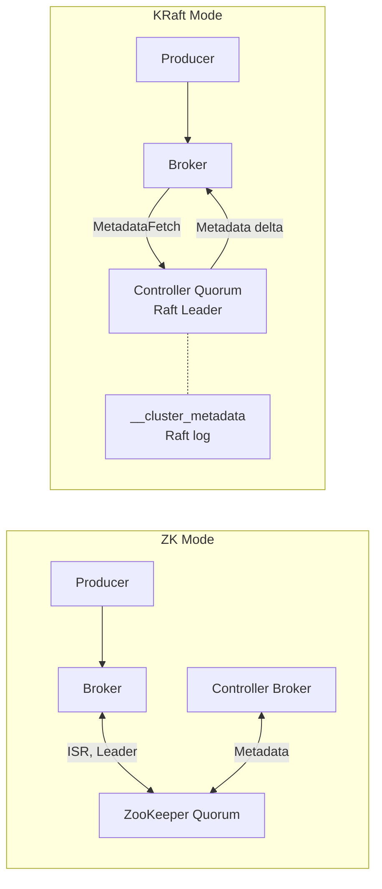

## Keywords in This File
{: .no_toc }

| # | Keyword | Weight |
|---|---|---|
| 1 | [Kafka - L4 KRaft Mode](#kafka---l4-kraft-mode) | medium |

---

# Kafka - L4 KRaft Mode

## KRaft Mode

---

### 🎯 Model Answer

**30 seconds:**
> KRaft (Kafka Raft): Kafka's replacement for ZooKeeper as the cluster metadata store. Kafka
> 3.3+ (KRaft GA). A subset of brokers acts as controllers using the Raft consensus protocol.
> Eliminates ZooKeeper: simpler operations, faster controller failover (milliseconds vs 30-60s),
> higher partition limits (millions vs ~200,000), single process to manage. Default mode in
> Kafka 4.0+ (ZooKeeper mode removed).

**3 minutes (Senior):**
> KRaft architecture and benefits:
>
> 1. **KRaft roles**: each Kafka node can be `broker`, `controller`, or `broker+controller` (combined
>    mode, for development only). Production: dedicated controllers (3 nodes), dedicated brokers.
>    Controllers: form a Raft quorum. Quorum leader: manages all cluster metadata changes.
>    Brokers: register with the controller quorum, receive metadata updates via the MetadataLog.
> 2. **Metadata log**: cluster metadata (topic configs, partition assignments, ISR) is stored
>    in a special internal Kafka topic (`__cluster_metadata`). The Raft consensus protocol ensures
>    all controller quorum members agree on the metadata log. Brokers: subscribe to the metadata
>    log and maintain a local metadata cache (no ZooKeeper watches).
> 3. **Controller failover**: in ZooKeeper mode: controller failover = ZK session expiry (30-60s).
>    In KRaft: Raft leader election = milliseconds to seconds (no ZK session timeout). New quorum
>    leader: immediately has the full metadata log. No "catch-up" period.
> 4. **Migration from ZooKeeper**: Kafka 3.x supports a migration bridge. ZooKeeper cluster:
>    can be migrated to KRaft without data loss. Migration: dual-write phase (ZK + KRaft),
>    then cut-over to KRaft-only. Full process: documented in KIP-866 and Kafka migration guide.
> 5. **Higher partition limits**: ZooKeeper bottleneck at ~200,000 partitions per cluster.
>    KRaft: tested to 2+ million partitions. Enables larger multi-tenant Kafka clusters.

**Blank Mind Recovery:**

**(1) Restate:** "KRaft: replaces ZooKeeper with Raft consensus among controller nodes. Metadata:
stored in __cluster_metadata topic. Failover: milliseconds (vs 30-60s with ZK). Higher partition
limits. GA in Kafka 3.3. ZooKeeper removed in Kafka 4.0."

**(2) First principles:** "ZooKeeper was an external dependency for distributed coordination.
Problem: 2 systems to manage (Kafka + ZK). Different failure modes. ZK bottleneck on metadata
writes. KRaft: Kafka manages its own coordination using the same Raft protocol (used in etcd,
Consul). One system. Simpler."

**(3) Bridge:** "KRaft is like a company replacing an external HR agency (ZooKeeper) with an
internal HR team (KRaft controllers). Before: all employee records kept by the agency. If the
agency is slow or unavailable: company operations stall. After: HR is internal. Records are
local. Decisions are faster. Fewer dependencies."

---

### 📘 Concept Explanation

**KRaft architecture, configuration, and migration:**
```
ZOOKEEPER MODE ARCHITECTURE:

  ┌────────────────────────────────────────┐
  │ ZooKeeper (3-5 nodes, external)        │
  │ Stores: /brokers /topics /controller   │
  │ Used for: leader election, ISR, config │
  └──────────────────────────────────────┘
           |
  ┌────────┴───────────────────────┐
  │ Kafka Brokers (N nodes)        │
  │ One broker elected "controller"│
  │ via ZK. Uses ZK for metadata.  │
  └────────────────────────────────┘

  Drawbacks:
  - ZK: separate cluster to manage (quorum of 3-5).
  - ZK: bottleneck for metadata writes (ZK write throughput limited).
  - Controller failover: 30-60s (ZK session expiry window).
  - Metadata: split between ZK (authoritative) and broker cache.
  - ZK nodes: separate JVM processes, different configuration.

KRAFT MODE ARCHITECTURE:

  ┌────────────────────────────────────────────────┐
  │ Controller Quorum (3 dedicated nodes)          │
  │ Raft consensus. One active controller.         │
  │ Stores: __cluster_metadata (Kafka topic)       │
  │ Leader: processes metadata changes.            │
  │ Followers: replicate metadata log.             │
  └────────────────────────────────────────────────┘
           |
  ┌────────┴───────────────────────────────────────┐
  │ Kafka Brokers (N nodes)                        │
  │ Subscribe to metadata log (MetadataLog fetch). │
  │ Local metadata cache: eventually consistent.   │
  │ No ZooKeeper dependency.                       │
  └────────────────────────────────────────────────┘

  Benefits:
  - Single system: no ZK to manage.
  - Controller failover: <1s (Raft leader election, no ZK timeout).
  - Metadata throughput: higher (Raft log, not ZK ZAB protocol).
  - Partition limit: 2M+ partitions (vs ZK bottleneck at ~200K).
  - Unified Kafka tools for all operations.

KRAFT CONFIGURATION (DEDICATED CONTROLLER):

  # server.properties for a KRaft controller node:
  process.roles=controller
  node.id=1
  controller.quorum.voters=1@controller1:9093,2@controller2:9093,3@controller3:9093
  listeners=CONTROLLER://:9093
  controller.listener.names=CONTROLLER
  log.dirs=/data/kraft-controller-logs

  # server.properties for a KRaft broker node:
  process.roles=broker
  node.id=4
  controller.quorum.voters=1@controller1:9093,2@controller2:9093,3@controller3:9093
  listeners=PLAINTEXT://:9092
  advertised.listeners=PLAINTEXT://broker1:9092
  log.dirs=/data/kafka-logs

  # Generate cluster UUID (one-time, before format):
  KAFKA_CLUSTER_ID=$(kafka-storage.sh random-uuid)
  
  # Format storage on EACH node (controller and broker):
  kafka-storage.sh format -t $KAFKA_CLUSTER_ID -c /etc/kafka/server.properties
  
  # Start nodes normally (same as ZK mode):
  kafka-server-start.sh /etc/kafka/server.properties

COMBINED MODE (DEVELOPMENT ONLY):

  process.roles=broker,controller
  # Both broker and controller on same node.
  # Single-node cluster for local development:
  node.id=1
  controller.quorum.voters=1@localhost:9093
  listeners=PLAINTEXT://localhost:9092,CONTROLLER://localhost:9093
  # NOT for production: controller + broker competing for resources.

MIGRATION FROM ZOOKEEPER TO KRAFT:

  Phase 1 (Dual-Write):
    1. Add KRaft controller quorum nodes alongside existing ZK cluster.
    2. Configure migration.mode=true (or zookeeper.metadata.migration.enable=true).
    3. ZK mode controller: writes metadata to both ZK and KRaft metadata log.
    4. Verify KRaft metadata log matches ZK state.
  
  Phase 2 (Cut-Over):
    5. Set kafka.metadata.migration.flag=true in broker configs.
    6. Brokers: start using KRaft metadata (stop ZK watches).
    7. ZK: no longer authoritative. KRaft: authoritative.
  
  Phase 3 (ZK Decommission):
    8. Remove ZK config from broker configs (zookeeper.connect=).
    9. Shut down ZK cluster.
    10. Fully KRaft.
  
  Kafka 3.5: simplified migration tooling.
  Kafka 4.0: ZooKeeper mode completely removed (KRaft only).

KRAFT OPERATIONAL DIFFERENCES:

  1. Node management: kafka-metadata-quorum.sh (instead of ZK CLI):
     kafka-metadata-quorum.sh --bootstrap-controller controller1:9093 describe
       Shows: leader, replicas, epoch, LEO of metadata log.
  
  2. Kafka config: no more zookeeper.connect. Add controller.quorum.voters.
  
  3. Metadata log: kafka-metadata-shell.sh for direct metadata inspection.
     (Like a zkCli.sh for the metadata log.)
  
  4. Cluster ID: required for all nodes (immutable after format).
     NEVER re-format storage without migrating data first.
  
  5. Dynamic config: config changes now go through KRaft leader.
     kafka-configs.sh works the same. Internally: metadata log instead of ZK.
```

> **Code walkthrough:** This NOT for production: controller + broker competing for resources. example demonstrates a key concept in practice using Kafka messaging. **KEY MECHANISM:** the runtime executes these instructions in sequence with specific memory and execution semantics. **WHY IT MATTERS:** misapplying this pattern causes subtle bugs that only manifest under production load. **TAKEAWAY: understand the execution model before using this pattern in production code.**

---

### 💻 Code Example

> **Code walkthrough:** The AdminClient-based cluster metadata API works identically in both
> ZooKeeper and KRaft mode - the client-facing API is unchanged.

```java
// KRaft: AdminClient API is identical to ZK mode (no code changes needed):
Properties adminProps = new Properties();
adminProps.put(AdminClientConfig.BOOTSTRAP_SERVERS_CONFIG, "broker1:9092,broker2:9092");
// No ZK connection string needed. AdminClient connects to brokers (not controllers directly).

try (AdminClient admin = AdminClient.create(adminProps)) {
    
    // Describe cluster (now shows KRaft metadata):
    DescribeClusterResult cluster = admin.describeCluster();
    System.out.println("Cluster ID: " + cluster.clusterId().get());
    System.out.println("Controller: " + cluster.controller().get());
    // In KRaft: "controller" is the active KRaft leader (broker that forwards requests).
    
    // Create topic: same API, internally uses KRaft metadata log:
    NewTopic newTopic = new NewTopic("payments", 16, (short) 3);
    newTopic.configs(Map.of(
        "min.insync.replicas", "2",
        "retention.ms", "604800000",
        "cleanup.policy", "delete"
    ));
    admin.createTopics(List.of(newTopic)).all().get();
    
    // Feature flags (KRaft-specific): check metadata version:
    DescribeFeaturesResult features = admin.describeFeatures();
    features.featureMetadata().get().supportedFeatures().forEach((name, range) ->
        System.out.printf("Feature %s: min=%d max=%d%n",
            name, range.minVersion(), range.maxVersion()));
    // "metadata.version": shows current KRaft metadata version.
    // Upgrade: kafka-features.sh upgrade --feature metadata.version=X
}
```

> **Code walkthrough:** The AdminClient API is intentionally unchanged between ZooKeeper and
> KRaft mode. Applications do not need to be modified when migrating from ZK to KRaft. The
> `describeCluster()` call shows the current controller (active KRaft Raft leader in KRaft
> mode). Feature flags (`describeFeatures`, `kafka-features.sh`) are new in KRaft: the metadata
> version controls which features are active. After a rolling upgrade, run `kafka-features.sh
> upgrade` to advance the metadata version and enable new KRaft features.

---

### 🎓 Answers by Seniority

**Junior / Mid (0-5 years):**
> KRaft: removes ZooKeeper from Kafka. Before KRaft: Kafka needed ZooKeeper to store cluster
> metadata (topics, partitions, ISR). With KRaft: Kafka stores metadata in its own internal
> Raft-based log. Simpler to deploy (one system instead of two). GA in Kafka 3.3. ZooKeeper
> removed in Kafka 4.0.

---

**Senior / Staff (5+ years):**
> The partition limit improvement is the most operationally significant KRaft benefit for large
> clusters. ZooKeeper bottleneck: ZK node can handle ~200,000 Kafka partitions total. Beyond
> that: ZK write latency increases, controller becomes the bottleneck, partition creation slows.
> KRaft: 2 million+ partitions tested. Enables multi-tenant Kafka clusters with 1000+ topics
> each with 100+ partitions. The controller failover improvement: ZK mode 30-60s (session expiry)
> vs KRaft <1s (Raft heartbeat election). For production SLAs requiring fast recovery: KRaft
> is a significant improvement. Migration: the ZK-to-KRaft migration path is production-tested
> in Kafka 3.5+. Plan for the migration before Kafka 4.0 (ZK mode end of life).

---

### ⚠️ Common Misconceptions

**Misconception: "KRaft controllers replace all broker functionality."**
KRaft controllers are a separate role. In production: 3 dedicated controller nodes + N broker
nodes. Controllers handle ONLY metadata management (Raft quorum, leader election, topic config,
partition assignments). They do NOT store topic data. Brokers: still handle all data storage and
replication, producer/consumer connections, and all client-facing operations. In combined mode
(`process.roles=broker,controller`): one node does both. This is only for development (single-node
clusters). Production: always separate dedicated controllers from data brokers. Controllers are
lightweight (no data storage): can run on smaller machines than brokers. Typically: 3 controller
nodes (for 2-fault tolerance in Raft), many broker nodes (for data storage and throughput).

---

### ⚖️ Comparison Table

| Aspect | ZooKeeper Mode | KRaft Mode |
|---|---|---|
| External dependency | ZooKeeper required | None |
| Controller failover | 30-60 seconds | < 1 second |
| Max partitions | ~200,000 | 2,000,000+ |
| Operations | 2 systems (Kafka + ZK) | 1 system (Kafka) |
| Metadata storage | ZooKeeper znodes | __cluster_metadata topic |
| Availability since | Initial release | GA in Kafka 3.3 |

---

### 🏛️ System Design

**Production KRaft cluster topology:**

```
  AVAILABILITY ZONES:

  AZ-1                AZ-2                AZ-3
  ┌──────────────┐    ┌──────────────┐    ┌──────────────┐
  │Controller 1  │    │Controller 2  │    │Controller 3  │
  │(Raft member) │    │(Raft member) │    │(Raft member) │
  │node.id=1     │    │node.id=2     │    │node.id=3     │
  └──────────────┘    └──────────────┘    └──────────────┘
  
  ┌──────────────┐    ┌──────────────┐    ┌──────────────┐
  │ Broker 4     │    │ Broker 5     │    │ Broker 6     │
  │ Data storage │    │ Data storage │    │ Data storage │
  │ node.id=4    │    │ node.id=5    │    │ node.id=6    │
  └──────────────┘    └──────────────┘    └──────────────┘
  
  Quorum: 3 controllers. Tolerate: 1 controller failure.
  Add controllers in odd numbers: 3, 5, 7.
  5 controllers: tolerate 2 failures. More overhead.
  Broker nodes: add/remove without affecting quorum.
```

> **Code walkthrough:** This NOT for production: controller + broker competing fice. **KEY MECHANISM:** the runtime executes these instructions in sequence with specific memory and execution semantics. **WHY IT MATTERS:** misapplying this pattern causes subtle bugs that only manifest under production load. **TAKEAWAY: understand the execution model before using this pattern in production code.**

---

### 📊 Diagram

**ZooKeeper mode vs KRaft mode metadata flow:**

```
  ZOOKEEPER MODE:
  
  Client -> Broker --(ZK watches)--> ZooKeeper
                   <--ISR update--
  Controller --(ZK leader election)-> ZooKeeper
  
  KRAFT MODE:
  
  Client -> Broker --(MetadataLog fetch)--> Controller Quorum
  Controller Quorum -> Active Controller (Raft leader)
  Active Controller: appends to __cluster_metadata
  Brokers: stream __cluster_metadata to update local cache
```



> **Diagram walkthrough:** In ZooKeeper mode, both brokers and the controller interact with the
> external ZooKeeper quorum for all metadata operations. This creates two separate systems with
> different failure modes. In KRaft mode, the Controller Quorum is managed internally using Raft
> consensus on the `__cluster_metadata` topic. Brokers stream metadata updates from the active
> controller, maintaining a local cache. No external ZooKeeper process is needed. The active
> controller is elected among the KRaft controller nodes, not via ZooKeeper session acquisition.
> Failover: a new Raft leader is elected among the remaining controllers in milliseconds.

---

### 🚨 Failure Modes and Diagnosis

**Failure: KRaft quorum has no leader - metadata operations failing.**
```
Symptom: broker logs: "Unable to fetch metadata from controller".
  kafka-metadata-quorum.sh --bootstrap-controller c1:9093 describe: times out.
  Cluster: no metadata updates. Topics cannot be created or modified.
  Existing data: still readable/writable (brokers use cached metadata).
  But: leader elections for failed partitions: fail (no controller to coordinate).

Root cause: quorum has no active leader.
  3-controller quorum: requires 2 of 3 to form quorum majority.
  If 2 controllers fail simultaneously: no quorum. No leader election.
  If all 3 controllers fail: cluster metadata frozen.

Diagnosis:
  kafka-metadata-quorum.sh --bootstrap-controller c1:9093,c2:9093,c3:9093...
    Shows: leader, observer, fetch offset, last fetch time.
    If all show "no leader" or timeout: quorum loss.
  
  Check controller node health:
    kubectl get pods -l role=kafka-controller
    Or: SSH to each controller, check kafka logs.
  
  Check Raft state in logs: "ResignedState", "CandidateState", "LeaderState".
  "Raft election timeout after N ms": no quorum.

Fix:
  Restore failed controller nodes (restart pods).
    Raft: as soon as 2 of 3 controllers come online, they elect a leader.
    Brokers: reconnect and receive metadata updates.
    Existing brokers: already had metadata cached; data continued flowing.
  
  For persistent controller failure:
    Replace the failed controller node.
    New node: format storage with same cluster UUID and the same controller.quorum.voters list.
    Start: joins the quorum, replicates metadata log from active leader.
  
  NEVER: add a new controller node and remove a failed one simultaneously.
    This may change the quorum majority required. Remove first, then add.
  
  For 5-controller quorum (higher fault tolerance):
    Tolerate 2 simultaneous controller failures.
    Trade-off: more controller nodes to manage.
```

> **Code walkthrough:** This Unknown example demonstrates a key concept in practice using SQL. **KEY MECHANISM:** the runtime executes these instructions in sequence with specific memory and execution semantics. **WHY IT MATTERS:** misapplying this pattern causes subtle bugs that only manifest under production load. **TAKEAWAY: understand the execution model before using this pattern in production code.**

---

### 🎯 Interview Deep-Dive

| Question Category | Time to Answer |
|---|---|
| Why KRaft replaced ZooKeeper | 2 minutes |
| KRaft architecture components | 2 minutes |
| Controller failover comparison | 2 minutes |
| Partition limit improvement | 1 minute |
| KRaft configuration | 2 minutes |
| Migration from ZK to KRaft | 2 minutes |
| Combined vs dedicated mode | 1 minute |
| KRaft quorum failure diagnosis | 2 minutes |
| Metadata version and feature flags | 1 minute |
| Controller quorum sizing | 1 minute |
| KRaft vs ZK operational differences | 2 minutes |
| KRaft data consistency guarantees | 2 minutes |

---

**Q1 (architecture): Why did Kafka replace ZooKeeper with KRaft, and what are the main benefits?**

A: ZooKeeper was Kafka's external dependency for distributed coordination: leader election,
cluster metadata storage (topic configs, partition assignments, ISR lists), and broker registration.
This introduced several limitations: (1) Operational complexity: two systems to deploy, configure,
monitor, and upgrade. ZooKeeper has a separate quorum, separate JVM processes, and separate
operational procedures. Operators needed ZooKeeper expertise in addition to Kafka. (2) ZooKeeper
bottleneck: ZooKeeper ZAB protocol (Zookeeper Atomic Broadcast) has limited write throughput.
All Kafka metadata changes go through ZooKeeper sequentially. At ~200,000 partitions: ZooKeeper
becomes the throughput bottleneck. Controller startup time (re-reading all ZK metadata) grows
with partition count. (3) Controller failover latency: when the controller fails, ZooKeeper
session expiry must elapse (30-60 seconds default) before another broker can be elected controller.
During this period: no new leader elections, no topic creation, no metadata changes. (4)
Metadata split: Kafka's actual metadata state was in ZooKeeper, but brokers cached copies.
Inconsistencies could occur between ZK state and broker cache. KRaft benefits: single system
(no ZK). Controller failover in milliseconds (Raft heartbeat timeout, not ZK session timeout).
2+ million partitions supported (metadata log throughput, not ZK ZAB throughput). All metadata
in a Kafka topic (`__cluster_metadata`) with the same replication and durability guarantees as
any Kafka topic. Simpler: one JVM process per node (not two).

*What separates good from great:* The Raft protocol choice is specifically designed for this
use case. Raft (used in etcd, CockroachDB, TiKV) is a leader-based consensus protocol where the
leader handles all writes, and followers replicate. Leader election is fast (election timeout
is tunable, default ~2s for KRaft). The metadata log (`__cluster_metadata`) stores all cluster
state as event log entries. On controller restart: the new controller replays the log to restore
state (same as a consumer reading from offset 0). The metadata log is also replicated across
the controller quorum, so no single controller holds unique state. This is fundamentally different
from ZooKeeper's stateful node model (where ZK nodes hold the current state, not a log of changes).
The event-log model allows faster recovery (replay recent entries) and cleaner semantics (metadata
changes are idempotent log entries).

---

**Q2 (debugging): How do you monitor and diagnose a KRaft controller quorum?**

A: KRaft-specific commands: (1) `kafka-metadata-quorum.sh --bootstrap-controller c1:9093 describe`:
shows quorum status. Output: current leader node ID, fetch lag per replica (how far behind each
controller is from the leader's LEO), last fetch time, current high watermark. Important: `lag`
should be near 0 for all replicas. Growing lag: a controller replica is falling behind.
(2) `kafka-metadata-shell.sh --snapshot <file>`: inspect the metadata log snapshot. (3) Broker
metadata log: `kafka-metadata-quorum.sh --bootstrap-server broker:9092 describe --replication`:
shows broker's view of the metadata log (their fetch offset). Useful to check if brokers are
receiving metadata updates. (4) Metrics (JMX):
`kafka.controller:type=KafkaController,name=ActiveControllerCount` (should be exactly 1).
`kafka.controller:type=KafkaController,name=ActiveBrokerCount` (should equal expected broker count).
`kafka.metadata:type=MetadataLoader,name=BatchProcessingTimeMs`: metadata processing latency.
(5) Raft log:
`kafka.raft:type=KafkaMetricsRegistry,name=current-state`: leader/follower/candidate.
`kafka.raft:type=KafkaMetricsRegistry,name=high-watermark`: HW of the Raft log (all committed entries).
Alert: if `high-watermark` is not advancing + 2+ controllers are online: leader election issue.
If only 1 controller online: quorum loss (need to restore more controllers).

*What separates good from great:* The metadata version concept is new in KRaft and critical for
cluster upgrades. After a Kafka version upgrade (e.g., 3.3 to 3.6): the binaries support new
features, but the cluster does not automatically use them. Run: `kafka-features.sh --bootstrap-server
broker:9092 upgrade --feature metadata.version=<version>`. This writes a new metadata version
entry to the metadata log. All controllers and brokers see this and enable the new feature set.
Rolling back a metadata version: not supported (metadata log entries are append-only). Upgrading
the metadata version is a one-way operation. Always test in staging before upgrading production
metadata version. This is analogous to database schema migrations: the binaries are forward-compatible,
but the stored format is not backward-compatible after the version upgrade.

---

**Q3 (architecture): How does the KRaft migration from ZooKeeper work?**

A: The migration is a three-phase process designed to be zero-downtime for clients: (1) Pre-migration:
deploy 3 KRaft controller nodes alongside the existing ZooKeeper cluster. These controllers form
a KRaft quorum but are not yet active for Kafka cluster coordination. Set
`zookeeper.metadata.migration.enable=true` on all brokers and the existing ZK-mode controller.
The ZK-mode controller: detects the KRaft controllers, connects to the quorum, and begins
dual-writing all metadata changes to BOTH ZooKeeper AND the KRaft metadata log. The KRaft quorum:
starts receiving metadata from the ZK controller. (2) Migration: once the KRaft metadata log
is fully caught up to ZooKeeper: the migration tool (`kafka-feature.sh`) advances the metadata
version to mark the cluster as "migrated." Brokers: switch to reading metadata from the KRaft
quorum (stop ZooKeeper watches). The ZK-mode controller: shuts down. A KRaft controller becomes
the active controller. (3) Post-migration: brokers run purely in KRaft mode. ZooKeeper: can be
decommissioned. Remove `zookeeper.connect` from all broker configs. ZK cluster: shut down.
Key tools: `kafka-migration.sh`, `kafka-features.sh`. Monitoring: metadata log offset comparison
between ZK state and KRaft log during dual-write phase. Duration: depends on metadata size
(partition count). For large clusters (100k+ partitions): the initial sync may take minutes.
Kafka 3.5+ streamlines the process. Kafka 4.0: ZooKeeper mode is removed entirely (must migrate
before upgrading to 4.0).

*What separates good from great:* The migration's critical dependency: the ZK-mode controller
and the KRaft controller quorum must maintain a stable connection during the dual-write phase.
If the ZK controller crashes during migration: the dual-write phase is interrupted. Recovery:
restart the ZK controller; it will re-check the migration status and resume where it left off
(the KRaft metadata log records the last ZK-to-KRaft sync position). The migration is idempotent:
safe to restart. For large clusters: schedule the migration during low-traffic periods. The
dual-write phase adds overhead to every metadata operation (2x writes). After migration: overhead
disappears. Post-migration validation: use `kafka-metadata-shell.sh` to verify the KRaft metadata
log matches the expected state. Compare: topic list, partition assignments, ISR lists. Any
discrepancy: investigate before decommissioning ZooKeeper (ZK is the fallback rollback option
during the migration window).

---

**Q4 (trade-off): What are the trade-offs of combined mode (broker+controller) in KRaft?**

A: Combined mode (`process.roles=broker,controller`) runs both broker and controller on the same
node. Appropriate for: development, testing, single-node setups. Not for production. Trade-offs
in production: (1) Resource contention: the broker handles producer/consumer connections,
replication, and data I/O (all CPU and memory intensive). The controller handles Raft consensus,
metadata log writes, and leader election (also CPU and memory). On the same JVM: they compete
for heap, threads, and network bandwidth. Under load: one can starve the other. (2) Failure
coupling: if the broker OOM-crashes: the controller also dies. This drops a Raft quorum member.
With 3 combined nodes: one OOM crash means 1 of 3 quorum members lost. Tolerable, but the OOM
itself is caused by the broker's data load (not controller logic). Dedicated separation: an
OOM on a broker does NOT affect the controller quorum. (3) Scaling asymmetry: brokers need to
scale for data throughput (add more brokers for more partitions and throughput). Controllers
need to scale for Raft fault tolerance (add more controllers for higher quorum resilience). With
combined mode: scaling one forces scaling the other. Typically: 3 controllers is sufficient for
any cluster size (Raft quorum, not throughput-based). Decoupled: add 10 broker nodes without
touching the 3 controller nodes. Production minimum: 3 dedicated controllers + 3+ dedicated
brokers.

*What separates good from great:* The Raft quorum size trade-off. Raft requires a majority quorum:
3 controllers tolerate 1 failure. 5 controllers: tolerate 2 failures. 7: tolerate 3. Each
additional controller adds: one more Raft log replication, one more node in the leader election
process, one more node to manage and monitor. The quorum overhead is linear (every metadata
write replicates to N controllers). For most production clusters: 3 controllers (tolerate 1
failure) is sufficient. 5 controllers: only if you need to tolerate 2 simultaneous controller
failures (very rare, high operational risk scenario). The failure mode for quorum loss (more
than (N-1)/2 controllers fail): cluster metadata frozen. Existing data: still readable and
writable using cached metadata. But: no new leader elections, no topic creation, no partition
reassignment. Recovery: bring back enough controllers to restore quorum. For this reason: run
controllers in separate AZs (not separate racks in the same AZ). An entire AZ failure takes
down at most 1 controller (with controllers spread across 3 AZs).

---

**Q5 (production): How do you upgrade a Kafka cluster from ZooKeeper mode to KRaft without downtime?**

A: Zero-downtime migration requires: (1) Upgrade path: confirm your Kafka version supports KRaft
migration (Kafka 3.3 GA, ideally 3.5+ for stable tooling). Ensure all brokers and clients are
on compatible versions. (2) Cluster preparation: verify `UnderReplicatedPartitions = 0` before
starting. Resolve any ISR issues. Ensure ZooKeeper cluster is healthy and stable. Run
`kafka-broker-api-versions.sh` to confirm all brokers are on the same version. (3) Deploy
controllers: provision 3 new nodes (or repurpose existing hardware). Format with the cluster
UUID: `kafka-storage.sh format -t <uuid> -c controller.properties`. Configure:
`process.roles=controller`, `controller.quorum.voters=1@c1:9093,2@c2:9093,3@c3:9093`. Start
controllers. Verify Raft quorum: `kafka-metadata-quorum.sh describe`. (4) Enable migration:
add `zookeeper.metadata.migration.enable=true` to all broker configs (rolling restart to apply).
Add `controller.quorum.voters` to all broker configs. Brokers: start dual-mode, receiving metadata
from both ZK and KRaft. (5) Monitor dual-write: check that KRaft metadata log offset is
advancing and matches ZK state. (6) Advance metadata version: `kafka-features.sh upgrade
--feature metadata.version=<version>`. This is the cut-over point. (7) Brokers restart: on
rolling restart, each broker switches to KRaft-only mode (stops ZK watches). (8) ZK decommission:
after all brokers are in KRaft mode, remove `zookeeper.connect` from configs (final rolling
restart). Decommission ZooKeeper. Validation: `kafka-metadata-quorum.sh describe` shows healthy
quorum. `kafka-topics.sh --list` works. Produce/consume test.

*What separates good from great:* The rollback window. During the migration: until the metadata
version is advanced (step 6), rollback is possible. Procedure: remove `zookeeper.metadata.migration.enable`
from broker configs, restart brokers (they stop talking to KRaft controllers, use ZK only),
shut down KRaft controllers. After step 6 (metadata version advanced): rollback is very complex
(ZK state is now stale). The practical rollback after step 6: restore ZK from a pre-migration
snapshot, downgrade Kafka version, and restart from scratch. This is why step 6 should be done
during a maintenance window with a tested rollback plan. The migration steps 1-5: safe to do
any time (backward-compatible). Step 6: one-way operation. Always have a full cluster backup
(ZK snapshot + Kafka log directory snapshots) before executing step 6.

---

**Q6 (production): What are the observability differences between ZooKeeper mode and KRaft mode?**

A: Key observability differences: (1) Controller metrics: ZK mode: `kafka.controller:type=
KafkaController,name=ActiveControllerCount` (should be 1 on the controller broker; 0 on others).
KRaft mode: same metric, plus Raft-specific metrics: `kafka.raft:type=KafkaMetricsRegistry,
name=high-watermark` (committed metadata log offset), `kafka.raft:type=KafkaMetricsRegistry,
name=current-state` (leader/follower/candidate). (2) Metadata health: ZK mode: monitor ZK
ensemble latency (`zk_avg_latency`, ZK 4lw command `stat`). KRaft: `kafka-metadata-quorum.sh
describe` shows fetch lag per quorum member. High lag: a controller replica is falling behind.
(3) Kafka log: ZK mode: `INFO [Controller 1]: {operation}` logged on the controller broker.
KRaft: logged on the active KRaft controller node (separate process). Controller logs: on a
different host from brokers. Ensure controller log aggregation is set up. (4) Removed ZK-specific
metrics: `ZooKeeperExpiresPerSec`, `ZooKeeperAuthFailuresPerSec`, ZK session state metrics.
No longer needed. Remove from dashboards to avoid confusion. (5) New KRaft metrics:
`kafka.metadata:type=MetadataLoader,name=BatchProcessingTimeMs`: how long the broker takes to
apply metadata batches. `kafka.server:type=MetadataManager,name=MetadataLoadErrorCount`:
errors loading metadata (should be 0). Add to monitoring stack before decommissioning ZK-based
alerts.

*What separates good from great:* The `kafka.metadata:type=KRaftMetadataCache,name=*` JMX metrics
expose the broker's view of its metadata cache state. `LoadedMetadataVersion` (current metadata
version the broker is running), `CurrentMetadataOffset` (latest metadata log offset the broker
has processed). If `CurrentMetadataOffset` is significantly behind the controller's log end
offset: the broker's metadata cache is stale. This can cause producer sends to use stale partition
leader information (routing to the wrong broker). Symptoms: `NotLeaderOrFollowerException`
spikes from producers. Fix: check network connectivity between the broker and the active KRaft
controller. Increase `metadata.max.idle.interval.ms` if needed (forces periodic metadata refresh).
This staleness scenario is specific to KRaft mode (in ZK mode, ZK watches provided push
notification for metadata changes; in KRaft, brokers fetch from the controller on a poll interval).

---

### 💻 Code Example

*(Omit: this concept does not have a programmatic interface that can be demonstrated in code. The conceptual explanation above is sufficient.)*


---

### 🏛️ System Design

*(Omit: system design diagram not applicable for this concept - see ★★★ keywords for full system design coverage.)*


---

### ⚖️ Comparison Table

*(Omit: this is a ★☆☆ foundational concept with no direct alternatives to compare - see higher-difficulty keywords for trade-off analysis.)*


---

### 📊 Diagram

*(Omit: no standalone visual diagram required for this concept - the explanations and code examples above provide sufficient clarity.)*


