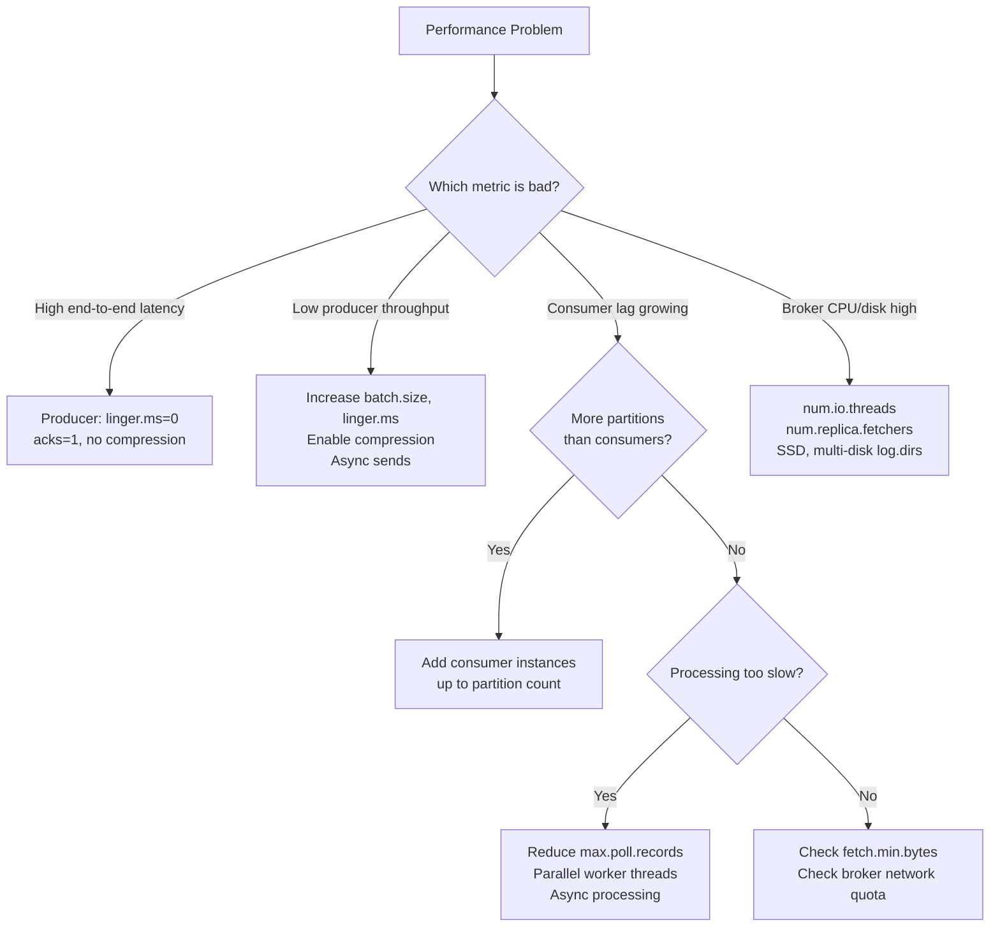

## Keywords in This File
{: .no_toc }

| # | Keyword | Weight |
|---|---|---|
| 1 | [Kafka - L4 Performance Tuning](#kafka---l4-performance-tuning) | medium |

---

# Kafka - L4 Performance Tuning

## Kafka Performance Tuning

---

### 🎯 Model Answer

**30 seconds:**
> Kafka performance tuning: balance throughput, latency, and durability. Producer: batch size
> (`batch.size`), linger time (`linger.ms`), compression, acks. Consumer: `fetch.min.bytes`,
> `fetch.max.wait.ms`, `max.poll.records`. Broker: OS page cache, `num.io.threads`,
> `num.network.threads`, JVM heap (stay off heap). End-to-end: partitions = parallelism. Identify
> the bottleneck first (producer? broker? consumer?), then tune that layer.

**3 minutes (Senior):**
> Performance tuning framework:
>
> 1. **Producer throughput optimization**: increase `batch.size` (default 16KB -> 512KB-1MB for
>    high throughput). Set `linger.ms` (default 0 -> 5-20ms). Enable compression
>    (`compression.type=snappy` or `lz4`). Increase `buffer.memory` if producer blocks.
>    Use async sends with futures. Multiple producer instances in parallel if one is CPU-bound.
> 2. **Producer latency optimization**: `linger.ms=0` (send immediately). `acks=1` (leader only).
>    Minimal batch size. Same datacenter as brokers.
> 3. **Consumer throughput optimization**: `fetch.min.bytes` (default 1 -> 64KB-1MB: wait for
>    more data per fetch). `max.poll.records` (default 500 -> 2000-10000). Process batches in
>    parallel (multiple threads per consumer, one consumer per partition).
> 4. **Broker tuning**: OS page cache: run on memory-rich hosts. `num.io.threads` = 2 * num disks.
>    `num.network.threads` = num CPU cores / 2. Use dedicated disks per Kafka broker. Avoid
>    RAID: Kafka's replication provides redundancy. Separate OS and Kafka data disk. JVM heap:
>    4-8GB max (larger -> GC pauses). Most Kafka data: in page cache, not JVM heap.
> 5. **Disk**: sequential writes are fast (OS log-structured writes). SSD: reduces latency.
>    Separate logs.dirs across multiple disks: increases throughput (parallel I/O).

**Blank Mind Recovery:**

**(1) Restate:** "Producer: batch.size, linger.ms, compression. Consumer: fetch.min.bytes,
max.poll.records. Broker: page cache (big RAM), io threads, network threads, separate disks.
JVM heap: keep small (4-8GB). First: identify the bottleneck layer, then tune it."

**(2) First principles:** "Kafka throughput = (message size * messages/sec). Limited by: (1) producer
batching and network, (2) broker disk write + replication, (3) consumer read and processing.
Page cache: the key - Kafka reads from RAM not disk for recent data. Compression: reduces network
I/O and disk I/O. Sequential I/O: Kafka's design assumption."

**(3) Bridge:** "Kafka performance tuning is like optimizing a factory assembly line. Producer:
batch more parts before shipping (batch.size/linger.ms). Broker: bigger warehouse (page cache),
faster conveyor belts (io threads). Consumer: take bigger boxes per trip (fetch.min.bytes).
Identify which station is the bottleneck before adding machines."

---

### 📘 Concept Explanation

**Producer, consumer, broker tuning with metrics:**
```plaintext
PRODUCER TUNING:

  // High-throughput producer profile:
  props.put("batch.size",         1048576);    // 1MB batches
  props.put("linger.ms",          20);         // wait up to 20ms to fill batch
  props.put("compression.type",   "snappy");   // CPU-cheap, ~30% size reduction
  props.put("buffer.memory",      67108864);   // 64MB record buffer
  props.put("acks",               "1");        // leader ack only (no follower wait)
  props.put("max.in.flight.requests.per.connection", 5);  // default, good for throughput
  
  // Low-latency producer profile:
  props.put("batch.size",         16384);      // small batch (fill fast)
  props.put("linger.ms",          0);          // send immediately
  props.put("compression.type",   "none");     // no compression overhead
  props.put("acks",               "1");        // leader ack
  props.put("max.in.flight.requests.per.connection", 1);  // preserve ordering
  
  // Durable producer profile (financial transactions):
  props.put("acks",               "all");      // all ISR replicas
  props.put("enable.idempotence", "true");     // dedup retries
  props.put("retries",            Integer.MAX_VALUE); // retry forever
  props.put("max.in.flight.requests.per.connection", 5); // with idempotence, safe
  props.put("batch.size",         65536);      // 64KB (balanced)
  props.put("linger.ms",          5);          // 5ms wait
  props.put("compression.type",   "snappy");

PRODUCER METRICS TO MONITOR:

  record-send-rate: records per second sent.
  byte-rate: bytes per second.
  record-queue-time-avg: avg time a record waits in the buffer.
    High value (> linger.ms): producer can't send fast enough. Increase batch.size or network.
  request-latency-avg: avg time from send to broker ack.
    High value: broker slow or network. Check broker disk I/O.
  compression-rate-avg: ratio of compressed to uncompressed size.
    < 0.5: compression is working. > 0.9: data is already compressed (binary formats).
  records-per-request-avg: avg records per batch.
    Low value (< 100): batching not effective. Increase linger.ms or batch.size.

CONSUMER TUNING:

  // High-throughput consumer profile:
  props.put("fetch.min.bytes",          65536);    // 64KB min before returning
  props.put("fetch.max.wait.ms",        500);      // wait max 500ms for min bytes
  props.put("max.poll.records",         2000);     // 2000 records per poll
  props.put("fetch.max.bytes",          52428800); // 50MB max per fetch response
  
  // Processing: use parallel processing per partition:
  // Consumer thread: calls poll(). Separate worker threads: process records.
  // With care: don't commit until ALL workers for a batch are done.
  
  ExecutorService executor = Executors.newFixedThreadPool(
      Runtime.getRuntime().availableProcessors());
  
  List<ConsumerRecord<String, String>> batch = new ArrayList<>();
  for (ConsumerRecord<String, String> r : records) {
      batch.add(r);
  }
  
  List<Future<?>> futures = batch.stream()
      .map(r -> executor.submit(() -> process(r)))
      .collect(Collectors.toList());
  
  for (Future<?> f : futures) f.get();  // wait for all workers
  consumer.commitSync();                 // commit after all processed

CONSUMER METRICS:

  fetch-rate: fetches per second.
  bytes-consumed-rate: bytes per second consumed.
  records-lag-max: max consumer lag (most important consumer metric).
    Persistently high: consumer not keeping up. Scale consumers or optimize processing.
  records-consumed-rate: records per second consumed.
  fetch-throttle-time-avg: time throttled by broker quota.
    Non-zero: consumer is being rate-limited by the broker. Increase quota or reduce consumers.

BROKER TUNING:

  # server.properties (broker config):
  
  # I/O threads: one per disk, up to 2x disk count:
  num.io.threads=16                 # for 8-disk broker
  
  # Network threads: handle connections and request parsing:
  num.network.threads=8             # typically 4-8
  
  # Request queue: buffering incoming requests:
  queued.max.requests=500           # default: 500 (increase for very busy brokers)
  
  # Replication:
  num.replica.fetchers=4            # parallel threads to replicate from leader
                                    # increase for brokers with many partitions
  
  # Log dirs: one per physical disk (parallel I/O):
  log.dirs=/disk1/kafka,/disk2/kafka,/disk3/kafka,/disk4/kafka
  
  # Segment size: larger = fewer files, fewer opens:
  log.segment.bytes=1073741824      # 1GB segments (default)
  
  # Flush: let OS page cache manage (don't force flush):
  log.flush.interval.messages=Long.MAX_VALUE  # rely on OS
  log.flush.interval.ms=Long.MAX_VALUE        # rely on OS
  
  # JVM (jvm.options or KAFKA_HEAP_OPTS):
  # -Xmx8g -Xms8g  <- max 8GB. More = GC pauses. Kafka: most data in page...
  # G1GC (Java 11+):
  # -XX:+UseG1GC -XX:MaxGCPauseMillis=20 -XX:G1HeapRegionSize=16m

BROKER METRICS:

  kafka.network:type=RequestMetrics,name=RequestsPerSec: request throughput.
  kafka.server:type=BrokerTopicMetrics,name=BytesInPerSec: bytes received.
  kafka.server:type=BrokerTopicMetrics,name=BytesOutPerSec: bytes sent.
  kafka.log:type=LogFlushStats,name=LogFlushRateAndTimeMs: flush latency.
    High value: OS flushing page cache. Usually harmless. High p99 -> disk I/O...
  kafka.server:type=ReplicaManager,name=UnderReplicatedPartitions:
    Non-zero: replicas falling behind. Check broker disk and network.
  kafka.controller:type=KafkaController,name=ActiveControllerCount:
    Should be exactly 1. 0 = no controller (cluster unavailable). >1 = split-brain.

OS TUNING (Linux):

  # Increase network socket buffers:
  sysctl -w net.core.rmem_max=134217728    # 128MB
  sysctl -w net.core.wmem_max=134217728
  sysctl -w net.core.netdev_max_backlog=300000
  
  # Increase file descriptor limits:
  ulimit -n 100000
  # /etc/security/limits.conf: kafka soft nofile 100000 kafka hard nofile 100000
  
  # Swap: disable (Kafka should use page cache, not swap):
  sysctl -w vm.swappiness=1   # near-zero swappiness (not 0: may cause issues)
  
  # Dirty page flush: let OS batch writes:
  sysctl -w vm.dirty_ratio=80        # flush at 80% dirty (aggressive batching)
  sysctl -w vm.dirty_background_ratio=5  # background flush at 5%
```

> **Code walkthrough:** This Dirty page flush: let OS batch writes: example demonstrates a key concept in practice using thread pool. **KEY MECHANISM:** the runtime executes these instructions in sequence with specific memory and execution semantics. **WHY IT MATTERS:** misapplying this pattern causes subtle bugs that only manifest under production load. **TAKEAWAY: understand the execution model before using this pattern in production code.**

---

### 💻 Code Example

> **Code walkthrough:** Async producer with a semaphore controls in-flight requests without
> blocking on every send - a common pattern for high-throughput producers.

```java
// WRONG: synchronous send for each record - blocks on every ack:
for (Order order : orders) {
    producer.send(new ProducerRecord<>("orders", order.getId(), toJson(order))).get();
    // .get() blocks until broker ack. Throughput: ~1 record / RTT.
    // RTT to Kafka (same datacenter): 1-5ms. Max: 200-1000 records/sec.
    // Target: 100,000 records/sec. This won't work.
}

// RIGHT: async with controlled in-flight count:
public class HighThroughputProducer {
    
    private final KafkaProducer<String, String> producer;
    // Allow at most 1000 in-flight sends before blocking:
    private final Semaphore inFlightSemaphore = new Semaphore(1000);
    private final AtomicLong errorCount = new AtomicLong(0);
    
    public void sendBatch(List<Order> orders) throws InterruptedException {
        for (Order order : orders) {
            inFlightSemaphore.acquire();  // block if too many in-flight
            
            producer.send(
                new ProducerRecord<>("orders", order.getId(), toJson(order)),
                (metadata, exception) -> {
                    inFlightSemaphore.release();  // free slot on ack or error
                    if (exception != null) {
                        errorCount.incrementAndGet();
                        log.error("Send failed: {}", exception.getMessage());
                    }
                });
        }
        
        // Wait for all in-flight to complete:
        inFlightSemaphore.acquire(1000);
        inFlightSemaphore.release(1000);
        
        if (errorCount.get() > 0) {
            throw new RuntimeException(errorCount.get() + " sends failed");
        }
    }
    
    public void close() {
        producer.flush();   // ensure all buffered records are sent
        producer.close();
    }
}
```

> **Code walkthrough:** The semaphore acts as a bounded queue of in-flight sends. Up to 1000
> sends are in-flight simultaneously (awaiting broker ack). When the semaphore is exhausted:
> the calling thread blocks, providing backpressure. The callback releases the semaphore slot
> on ack or error. This pattern achieves high throughput (1000x RTT parallelism) while bounding
> memory usage (1000 in-flight records, not unbounded). The `producer.flush()` in close() ensures
> all buffered records are sent before shutdown.

---

### 🎓 Answers by Seniority

**Junior / Mid (0-5 years):**
> Producer throughput: increase `batch.size` and `linger.ms`. Consumer throughput: increase
> `fetch.min.bytes` and `max.poll.records`. Broker: large RAM for page cache, separate disks.
> JVM heap: keep small (4-8GB). Enable compression for large messages. More partitions =
> more consumer parallelism.

---

**Senior / Staff (5+ years):**
> The biggest Kafka performance mistake: using `.get()` on every send (synchronous producer in
> a loop). Throughput: bounded by (1 / broker RTT). Fix: async sends with controlled in-flight
> count or batch processing. On the consumer side: the most common bottleneck is `max.poll.interval.ms`
> exceeded due to slow processing. Fix: reduce `max.poll.records`, move processing to separate
> threads, or increase `max.poll.interval.ms`. For end-to-end latency: reduce `linger.ms` (even
> 0ms). Compression trade-off: `lz4` for lowest latency, `snappy` for balanced, `gzip`/`zstd`
> for highest compression ratio (CPU cost). `zstd` (Kafka 2.1+): best ratio with moderate CPU.
> For 1-5ms end-to-end latency requirement: no compression, acks=1, linger.ms=0. For maximum
> throughput: batch.size=1MB, linger.ms=20, compression=snappy/zstd.

---

### ⚠️ Common Misconceptions

**Misconception: "More Kafka partitions always improve performance."**
More partitions increase consumer parallelism (up to the partition count). But partitions have
non-trivial overhead: each partition is a directory on disk with multiple segment files. Each
partition requires memory in the broker (for the partition state, ISR list, and follower fetch
state). For a cluster of 3 brokers: 10,000 partitions across the cluster = ~3,333 partitions
per broker. Each broker: maintains file handles, memory metadata, and replication state for
each. At 10,000 partitions: leader election for one broker failure takes tens of seconds (not
milliseconds). Kafka controller timeout issues. JVM pause issues from large metadata. Recommended
maximum: 4,000 partitions per broker (Kafka 2.x). Kafka 3.x with KRaft: significantly higher
limits (100,000+ partitions per broker is tested). Practical rule: start with 10-20 partitions
per topic, scale as needed. Do NOT create 1000 partitions "just in case". The partition count
should match actual consumer parallelism + throughput requirements.

---

### ⚖️ Comparison Table

| Layer | Throughput Knob | Latency Knob | Durability Knob |
|---|---|---|---|
| Producer | batch.size, linger.ms | linger.ms=0, acks=1 | acks=all, idempotence |
| Compression | compression.type=snappy/zstd | none | none |
| Consumer | fetch.min.bytes, max.poll.records | fetch.min.bytes=1 | manual commit after processing |
| Broker | num.io.threads, log.dirs (multi-disk) | SSD, num.network.threads | min.insync.replicas |
| OS | vm.dirty_ratio | vm.swappiness=1, socket buffers | log.flush.interval |

---

### 🏛️ System Design

**High-throughput Kafka pipeline system design:**

```
  PRODUCER TIER               KAFKA CLUSTER              CONSUMER TIER
  ┌─────────────────┐        ┌─────────────────┐        ┌─────────────────┐
  │ Service A       │        │ Broker 1        │        │ Consumer Group  │
  │ batch.size=1MB  ├───────>│ 8 disks         ├───────>│ 16 instances    │
  │ linger.ms=20    │        │ 128GB RAM       │        │ max.poll=2000   │
  │ compression=snappy│      │ num.io=16       │        │ fetch.min=64KB  │
  └─────────────────┘        │                 │        └─────────────────┘
                             │ Broker 2        │
  ┌─────────────────┐        │ Broker 3        │        Partition count = 16
 │ Service B ├───────>│ │ (matches consumer count)
  │ (same config)   │        │ 16 partitions   │
  └─────────────────┘        │ RF=3, ISR=2     │
                             └─────────────────┘
  
  Throughput target: 500 MB/s.
  Per broker: ~170 MB/s. Per disk (8): ~21 MB/s. Well within SSD capability.
```

> **Code walkthrough:** This Dirty page flush: let OS batch writes: example demoice. **KEY MECHANISM:** the runtime executes these instructions in sequence with specific memory and execution semantics. **WHY IT MATTERS:** misapplying this pattern causes subtle bugs that only manifest under production load. **TAKEAWAY: understand the execution model before using this pattern in production code.**

---

### 📊 Diagram

**Kafka performance bottleneck identification:**

```
  PERFORMANCE BOTTLENECK DECISION TREE:

  High latency?
    |
    +-- Producer send rate OK, consumer lag OK?
    |     -> Check broker: disk I/O, GC pauses, network.
    |
    +-- Producer blocking (buffer.memory exhausted)?
          -> Increase batch.size, linger.ms. Or: slow broker?
  
  Consumer lag growing?
    |
    +-- More partitions available than consumer instances?
    |     -> Scale consumer instances.
    |
    +-- Consumer instances == partitions but still lagging?
          -> Processing is too slow. Parallelize processing.
          -> Or: reduce max.poll.records.
  
  Producer throughput low?
    |
    +-- records-per-request-avg low (< 100)?
    |     -> Increase batch.size, linger.ms.
    |
    +-- record-queue-time-avg high?
          -> Broker can't keep up. Check broker I/O.
```



> **Diagram walkthrough:** The decision tree routes performance problems to the correct tuning
> layer. High latency -> producer configuration (minimize batching overhead). Low throughput ->
> producer batching and compression. Consumer lag -> consumer scaling or processing optimization.
> Broker-side issues -> I/O threads and disk configuration. The key insight: identify the
> bottleneck layer first. Tuning the producer when the consumer is the bottleneck wastes effort.
> Monitoring all three layers (producer metrics, broker metrics, consumer metrics) is required
> to correctly identify the constraint.

---

### 🚨 Failure Modes and Diagnosis

**Failure: Throughput collapses after broker upgrade - compression setting mismatch.**
```plaintext
Symptom: producer throughput dropped 40% after Kafka broker upgrade.
  Producer CPU: increased. Broker CPU: increased.
  No errors. Records are delivered.

Root cause: producer was using compression.type=gzip.
  After broker upgrade: broker-side decompression + re-compression for consumers
  using older protocol versions.
  OR: new Kafka version enabled end-to-end compression validation which adds CPU overhead.
  
  Another scenario: broker compression.type config changed to a different codec,
  forcing re-compression of all incoming batches.

Diagnosis:
  Producer JMX: compression-rate-avg.
    Was 0.6 (60% of original size). Now 0.9 (90% - barely compressing).
    Change: compression.type switched from snappy to gzip.
    gzip: higher compression ratio but 5-10x more CPU.
  
  Broker JMX: ProducerRequestQueueTimeMs.
    Spiked after upgrade: brokers queuing requests (CPU bound on decompression).

Fix:
  Change producer compression.type from gzip to snappy or lz4:
    props.put("compression.type", "snappy");  // lower CPU, good ratio
  
  Or: use end-to-end compression (same codec on producer and consumer):
    Broker does NOT decompress+recompress if producer and consumer use same codec.
    Broker: pass-through. Zero compression CPU on broker.
    Requirement: same codec on both sides. zstd (Kafka 2.1+): best ratio with moderate CPU.
  
  Long-term: standardize on snappy or lz4 for high-throughput topics.
    zstd for archival/analytical topics where size reduction > CPU cost.

Monitor:
  After fix: check producer CPU (should drop), broker CPU (should drop),
  throughput (should recover), compression-rate-avg (should be < 0.7 for text data).
```

> **Code walkthrough:** This Unknown example demonstrates a key concept in practice using Kafka messaging. **KEY MECHANISM:** the runtime executes these instructions in sequence with specific memory and execution semantics. **WHY IT MATTERS:** misapplying this pattern causes subtle bugs that only manifest under production load. **TAKEAWAY: understand the execution model before using this pattern in production code.**

**Failure: Consumer throughput plateau - max.poll.interval.ms exceeded under load.**
```plaintext
Symptom: consumer throughput fine at low load. Under high load: consumers repeatedly leave
  and rejoin the group. Rebalances every 5 minutes. Throughput: poor.
  Log: "max.poll.interval.ms=300000 exceeded, leaving group".

Root cause: processing time for max.poll.records (default 500) records > 5 minutes.
  Example: each record triggers a synchronous HTTP call (200ms RTT).
    500 records * 200ms = 100 seconds per batch.
    max.poll.interval.ms=300s (5min).
    Under normal load: fine. Under spike: queue backs up,
    each record takes 500ms -> 500*500ms = 250s.
    Then load increases more -> 500ms * 500 = 250s. Spike -> 600ms -> 300s =...

Fix options:
  1. Reduce max.poll.records:
     props.put("max.poll.records", "50");
     50 * 500ms = 25 seconds. Safe under load.
  
  2. Increase max.poll.interval.ms:
     props.put("max.poll.interval.ms", "600000");  // 10 minutes
     Risk: if consumer truly dies, 10 minutes before rebalance. Increase with caution.
  
  3. Async processing (decouple poll from process):
     KafkaPollLoop: poll() -> add to blocking queue.
     Worker threads: drain queue and process.
     Drawback: offset management becomes complex.
  
  4. Fix the slow downstream (reduce HTTP call latency):
     Batch HTTP requests. Cache common responses. Use async HTTP client.
     This fixes the root cause; the others are mitigations.
```

> **Code walkthrough:** This Unknown example demonstrates a key concept in practice using Kafka messaging. **KEY MECHANISM:** the runtime executes these instructions in sequence with specific memory and execution semantics. **WHY IT MATTERS:** misapplying this pattern causes subtle bugs that only manifest under production load. **TAKEAWAY: understand the execution model before using this pattern in production code.**

---

### 🎯 Interview Deep-Dive

| Question Category | Time to Answer |
|---|---|
| Producer throughput tuning | 2 minutes |
| Producer latency tuning | 1 minute |
| Consumer throughput tuning | 2 minutes |
| Broker hardware and OS tuning | 2 minutes |
| Compression trade-offs | 2 minutes |
| Partition count and parallelism | 2 minutes |
| Identifying the bottleneck layer | 2 minutes |
| max.poll.interval.ms failure | 2 minutes |
| JVM heap sizing | 1 minute |
| Page cache role | 2 minutes |
| Async producer pattern | 2 minutes |
| End-to-end latency budget | 2 minutes |

---

**Q1 (debugging): How would you diagnose and fix a Kafka producer with low throughput?**

A: Diagnosis starts with producer JMX metrics. Check `records-per-request-avg`: if it is low
(below 100), records are being sent in small batches. Check `record-queue-time-avg`: if below
`linger.ms`, batches are being triggered by `batch.size` (too small). If above `linger.ms`:
linger is the constraint (batches are being sent before filling). Check `byte-rate`: if below
target, the pipeline is constrained somewhere. Check `request-latency-avg`: if high (> 20ms),
the broker is slow to respond (disk I/O, GC, or replication lag). Fixes for small batches:
increase `batch.size` (default 16KB -> 256KB or 1MB). Increase `linger.ms` (default 0 -> 5-20ms).
The producer waits up to `linger.ms` before sending a batch, giving more time to accumulate
records. Enable compression: `compression.type=snappy` reduces payload size, so the same batch
byte budget carries more records. For sync producers (`.get()` on every send): this is the most
common mistake. Each `.get()` blocks for one RTT (1-5ms). Fix: async sends with callback. Use
a semaphore to bound in-flight requests. Throughput = (records per request) * (requests per
second). With async sends: effectively 1 request per RTT but many in-flight simultaneously.
If `buffer.memory` is exhausted (producer blocks on `max.block.ms`): increase `buffer.memory`
or reduce the rate of incoming records (backpressure).

*What separates good from great:* Producer throughput is also affected by the number of target
partitions. If all records go to one partition: the producer serializes all sends through one
connection to one leader broker. Multiple partitions across multiple brokers: the producer can
send to multiple brokers in parallel (the producer maintains a connection per broker). For a
single-threaded producer writing to 32 partitions across 3 brokers: the producer can have
up to 5 in-flight requests to each of 3 brokers simultaneously (15 total in-flight), vs 5
in-flight to one broker for a single-partition topic. Throughput ceiling: 3x higher with multiple
brokers. This is why high-throughput topics need sufficient partition count AND spread across
multiple brokers. Kafka MirrorMaker 2 / Kafka Streams pipelines: check `num.stream.threads`
(Streams) or `tasks.max` (Connect) to ensure processing parallelism matches partition count.

---

**Q2 (architecture): What is the role of the OS page cache in Kafka's performance?**

A: The OS page cache is central to Kafka's performance model. When Kafka writes records to disk,
the writes go to the OS page cache first (buffered I/O). The OS flushes to disk asynchronously.
When a consumer reads recent records: the OS serves them from the page cache (memory speed, not
disk speed). This is the "zero-copy" optimization: the OS transfers data from page cache directly
to the network socket without copying to user-space or Kafka's JVM heap. (`sendfile()` system
call). Kafka's design philosophy: rely on the OS page cache, do NOT implement a message cache
in the JVM heap. JVM heap: only for Kafka's metadata, index files, and active connections. This
is why JVM heap is kept small (4-8GB): larger heap = more GC pressure, larger GC pauses, higher
latency. The page cache does the heavy lifting: on a 128GB RAM broker, most of the RAM is
available for page cache. Recent records: almost always served from RAM. Cold reads (replay
from old segments): from disk (much slower). Performance implication: for Kafka, RAM >> CPU
in importance. Under-sized RAM = cache eviction = disk reads = latency spikes. Monitor page
cache hit rate via `/proc/meminfo` (Active, Cached fields) or `iostat` (high disk reads =
cache misses). Ensure Kafka host RAM is 4x+ the topic data working set.

*What separates good from great:* Page cache competition with other processes. If Kafka shares
a host with other services (Java services, Elasticsearch, etc.), they compete for page cache.
Kafka's page cache is evicted by the other services' memory pressure. Sudden latency spikes
in Kafka: often caused by another service on the same host consuming large amounts of memory
(e.g., a batch job that reads a large file). Solution: dedicate Kafka broker hosts to Kafka only.
No other services. For cost-sensitive environments: at minimum, reserve a memory-locked portion
of RAM for Kafka using cgroups. In Kubernetes: Kafka brokers as StatefulSet pods with guaranteed
QoS class (requests = limits for memory), on nodes with dedicated taints (`kafka-broker=true:NoSchedule`).
This ensures no other workloads compete for the broker's page cache.

---

**Q3 (trade-off): Compare compression codecs for Kafka: snappy vs lz4 vs gzip vs zstd.**

A: Kafka supports: none, gzip, snappy, lz4, zstd (Kafka 2.1+). Trade-offs: gzip: highest
compression ratio for text data (~70-80% size reduction for JSON), moderate CPU cost. Oldest
codec. Suitable for archival topics or low-throughput topics where size matters. snappy: fast
compression (low CPU: ~2-3x faster than gzip), good compression ratio (~50-60% for JSON), widely
used. Default recommendation for most production topics. lz4: fastest compression and
decompression of all codecs (~5-10x faster than gzip). Lower compression ratio than snappy but
acceptable. Use for: latency-sensitive topics where compression decompression overhead matters.
zstd: best ratio-to-CPU balance. ~60-75% size reduction at moderate CPU cost. Better than snappy
ratio, better than gzip CPU. Kafka 2.1+. Ideal for high-throughput, size-sensitive workloads.
The recommendation matrix: low latency, high throughput -> lz4 (fastest). Balanced -> snappy.
High compression needed (cost, bandwidth) -> zstd. Legacy compatibility -> gzip. For binary
formats (Protobuf, Avro): compression ratio is lower (already compact). For text (JSON, XML):
compression works well. End-to-end consideration: compression should match on both producer and
consumer side (same codec configured). If they don't match: broker must decompress and recompress
(CPU overhead). Best practice: configure the same codec on both producer and consumer. Broker
does pass-through. The broker receives compressed batches and sends them compressed to consumers.
Zero broker CPU overhead for compression.

*What separates good from great:* Compression interacts with the batch model. Compression is
per-batch, not per-record. A larger batch means more data to compress together, which yields
better compression ratio (more patterns to exploit). This is why increasing `batch.size` and
`linger.ms` improves both throughput AND compression efficiency. Small batches (1-2 records):
compression overhead > savings. Large batches (100+ records of similar structure): compression
ratio is excellent. This creates a positive feedback loop: bigger batches -> better compression
-> smaller network payload -> higher throughput -> can afford even bigger batches. For JSON
events with repeated structure: snappy on 1000-record batches often achieves 10-20% of the
original size (5-10x compression).

---

**Q4 (mechanism): What is the impact of `num.io.threads` and `num.network.threads` on broker performance?**

A: `num.network.threads` (default 3): the number of threads handling network connections and
reading/writing network requests. These threads: accept connections, read request bytes, pass
requests to the request handler pool, and write response bytes. Tuning: 1 per Gigabit of network
bandwidth, or up to CPU core count / 2. For a 10Gbps network: 10 threads. High value: diminishing
returns due to context-switching. `num.io.threads` (default 8): the request handler pool that
actually processes requests (including disk I/O). These threads: decompress records, write to
log files, read from logs for fetch requests, handle metadata requests. Tuning: 2x number of
physical disks. For an 8-disk broker: 16 io threads. If io threads are the bottleneck: requests
queue up in `RequestQueue` (metric: `RequestQueueSize`). High `RequestQueueSize`: io threads are
saturated. Increase `num.io.threads` or add more disks. Relationship: network threads -> request
queue -> io threads -> response queue -> network threads (response). The queue between network
and io threads (`queued.max.requests=500` by default) bounds memory usage under load. If the
queue fills: network threads block on accept (backpressure to clients).

*What separates good from great:* The interaction with replication. `num.replica.fetchers` (default 1):
the number of threads on each follower broker that replicate data from the leader. Undervalue:
followers can't keep up, ISR shrinks. A shrunken ISR with `acks=all` means producers wait for
fewer replicas (or stall entirely if `min.insync.replicas > ISR size`). For clusters with
many partitions or high throughput: increase `num.replica.fetchers` to 4-8. JMX monitoring:
`kafka.server:type=ReplicaFetcherManager,name=MaxLag` per broker. If this is non-zero: the
replica is falling behind. Check disk I/O on the lagging broker. Also: `num.recovery.threads.per.data.dir`
(default 1): threads for log recovery on startup. With multiple data directories and many
partitions: increase to the number of data directories. Speeds up broker restart time (important
for RTO during rolling restarts).

---

**Q5 (production): A Kafka broker is experiencing high GC pauses. What do you investigate?**

A: High GC pauses in a Kafka broker are usually caused by oversized JVM heap or inefficient
heap usage. Step 1: identify the GC type and pause duration. Add `-Xlog:gc*` (Java 11+) or
`-verbose:gc -XX:+PrintGCDetails`. Look for stop-the-world pause times > 100ms. Step 2: check
heap size. Kafka's recommendation: 4-8GB max. Larger heap = more data for GC to scan = longer
pauses. If `Xmx > 8g`: reduce it. The data Kafka serves is in page cache (OS RAM), not JVM heap.
The JVM heap holds: partition metadata, connection state, in-flight records, compressor state.
All small. Step 3: if G1GC is not enabled: enable it (`-XX:+UseG1GC -XX:MaxGCPauseMillis=20`).
G1GC is much better than parallel or CMS for Kafka. Step 4: check for memory leaks. `jmap -histo
<pid>` to see object count. Look for unexpectedly large byte[] arrays or growing collections.
Step 5: check for large partition metadata. A broker with 10,000+ partitions: each partition
requires heap for metadata and fetch state. At a certain point, partition count (not record
volume) drives heap growth. Step 6: check for compressor buffers. Each producer connection that
uses compression: the broker allocates a decompression buffer. Many concurrent producers =
many buffers. Fix: reduce `num.network.threads` to limit concurrent connections, or switch to
a lighter codec (lz4 uses smaller buffers than gzip). Production remediation: reduce heap to 6GB,
enable G1GC, enable `-XX:+UseStringDeduplication` if many duplicate strings in metadata.

*What separates good from great:* The `log.cleaner.dedupe.buffer.size` parameter. The log
cleaner (for compacted topics) uses a deduplication buffer to hold the key-to-offset map during
compaction. Default: 128MB. If you have large compacted topics: this buffer may fill, causing
the cleaner to make multiple passes (slow) or run out of memory. Symptoms: cleaner thread OOM,
or compaction taking much longer than expected. Fix: increase `log.cleaner.dedupe.buffer.size`
(to 256MB or 512MB). This comes from the broker JVM heap budget - why the heap is also
constrained by cleaner buffer needs for compacted topics. The total memory budget for a broker:
OS page cache (most of RAM) + JVM heap (4-8GB, of which ~128MB+ is cleaner buffer). Plan the
memory split carefully.

---

**Q6 (debugging): Consumer throughput is 10x lower than expected. Walk through your diagnosis.**

A: Start with the consumer group metrics: `kafka-consumer-groups.sh --describe --group my-group`.
Check: is the lag growing (consumer not keeping up)? Check `records-consumed-rate` JMX metric.
Compare to producer `records-send-rate`. If consumer rate is 10x lower: bottleneck is in the
consumer layer. Step 1: check partition vs consumer count. `kafka-consumer-groups.sh` shows
CONSUMER-ID per partition. If there are more partitions than consumer instances: some consumers
handle multiple partitions, others are idle. But if consumers = partitions and throughput is
still low: processing is slow. Step 2: `max.poll.records`. Default 500. If processing each record
takes 10ms: 500 * 10ms = 5 seconds per poll cycle. `max.poll.interval.ms` default 300s is
fine. But throughput: 500 / 5s = 100 records/s. To get 10x: need parallel processing or
faster processing. Step 3: check if downstream calls are serial. HTTP calls, DB writes: serialize
the processing. Fix: async HTTP clients (WebClient), batched DB writes (JDBC batch insert),
or parallel processing with an executor per partition. Step 4: check `fetch.min.bytes`. Default
1 byte: broker returns fetch response as soon as 1 byte is available. For small messages: many
small fetch requests. Increase `fetch.min.bytes=65536` (64KB): broker waits until 64KB available.
Fewer fetch requests, each with more data. Step 5: check for GC pauses in the consumer JVM.
Consumer stops polling during GC. If `session.timeout.ms` expires: consumer is removed from
group, rebalance triggered. Result: consumer keeps leaving and rejoining -> low throughput.

*What separates good from great:* The partition assignment imbalance. Even with consumers = partitions,
if the partition assignment strategy resulted in one consumer getting all the "hot" partitions
(StickyAssignor trying to keep the same assignment after a rebalance): throughput imbalance.
One consumer: busy. Others: idle. Diagnosis: `kafka-consumer-groups.sh` shows per-partition
lag AND consumer assignment. A balanced group: each consumer has ~equal lag. An imbalanced
group: one consumer has 90% of the lag. Fix: RoundRobinAssignor (rebalances evenly) or
CooperativeStickyAssignor (balances + minimizes partition movement). Also: custom scoring
assignment - `PartitionAssignor` that assigns based on current partition lag (assign most-lagged
partitions to least-loaded consumers). This is the stateful partition assignment that some
high-performance Kafka deployments implement.

---

### 💻 Code Example

*(Omit: this concept does not have a programmatic interface that can be demonstrated in code. The conceptual explanation above is sufficient.)*


---

### 🏛️ System Design

*(Omit: system design diagram not applicable for this concept - see ★★★ keywords for full system design coverage.)*


---

### ⚖️ Comparison Table

*(Omit: this is a ★☆☆ foundational concept with no direct alternatives to compare - see higher-difficulty keywords for trade-off analysis.)*


---

### 📊 Diagram

*(Omit: no standalone visual diagram required for this concept - the explanations and code examples above provide sufficient clarity.)*


