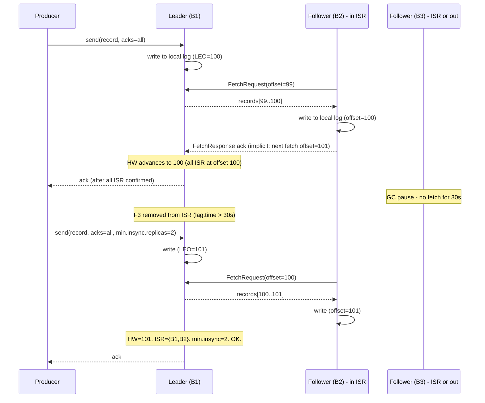

# Kafka - L4 Replication and ISR

## Kafka Replication and ISR

### 🎯 Model Answer

**30 seconds:**
> Kafka replication: each partition has `replication.factor` replicas. One broker is the leader
> (reads + writes). Others: followers (replicate from leader). ISR (In-Sync Replicas): followers
> that are caught up within `replica.lag.time.max.ms`. `acks=all` + `min.insync.replicas=2`:
> writes wait for the ISR to acknowledge. ISR shrinks on lag: fewer replicas required for commit.
> Failover: if the leader fails, a broker in the ISR is elected as the new leader.

**3 minutes (Senior):**
> ISR dynamics:
>
> 1. **ISR membership**: a follower joins the ISR by replicating to within
>    `replica.lag.time.max.ms` (default 30s) of the leader's log end offset. If a follower
>    falls behind (network issue, GC pause, disk slow): it is removed from ISR. `acks=all`:
>    producer waits for all ISR replicas to write, not all `replication.factor` replicas.
> 2. **min.insync.replicas**: minimum ISR size for `acks=all` writes to succeed. Default 1
>    (only the leader). Production: set to 2 (leader + 1 follower). If ISR size < min.insync.replicas
>    and producer uses `acks=all`: `NotEnoughReplicasException`. Producer: must retry or fail.
> 3. **Leader election**: controller (or KRaft quorum) detects leader failure. Elects a
>    preferred leader (first in the ISR list) or any ISR member. Preferred leader election:
>    `auto.leader.rebalance.enable=true` (default). Keeps leaders balanced across brokers.
> 4. **Unclean leader election**: `unclean.leader.election.enable=false` (default). Prevents
>    electing out-of-ISR followers as leaders. Enables: data safety. Disabling: risks data loss
>    (stale follower becomes leader, misses records after its last replicated offset).
> 5. **Replication protocol**: Fetch-based. Follower: sends FetchRequest to leader. Leader:
>    responds with records from the follower's current offset. Follower writes to local log.
>    Heartbeat: fetch requests serve as heartbeats (no separate heartbeat for replication).

**Blank Mind Recovery:**

**(1) Restate:** "ISR: replicas caught up within replica.lag.time.max.ms. acks=all: wait for all
ISR. min.insync.replicas: minimum ISR for writes to succeed. Leader election: from ISR only
(unclean.leader.election.enable=false). Preferred leader: first broker in partition replica list."

**(2) First principles:** "Replication = durability + availability. Durability: data written to
multiple brokers. Availability: if leader fails, follower takes over. ISR: the set of replicas
safe to elect as leader without data loss. min.insync.replicas: the safety floor for writes."

**(3) Bridge:** "ISR is like a team of synchronized swimmers. The leader sets the tempo (log
end offset). Followers that keep up are in the sync (ISR). Those that fall behind are benched
(removed from ISR). A performance requires min 2 in-sync swimmers (min.insync.replicas=2).
If only 1 left (the leader): the performance is cancelled (write fails)."

---

### 📘 Concept Explanation

**Replication mechanics, ISR management, and durability settings:**
```
REPLICATION TOPOLOGY:

  Topic "orders", replication.factor=3, partitions=4.
  
  Broker 1: leader for P0, P2. Follower for P1, P3.
  Broker 2: leader for P1, P3. Follower for P0, P2.
  Broker 3: follower for P0, P1, P2, P3 (no leaders initially).
  
  Load balancing: each broker handles ~equal leader partitions.
  After rebalance (auto.leader.rebalance.enable=true): auto-corrected.

ISR MEMBERSHIP ALGORITHM:

  Leader tracks:
    "last caught-up time" for each follower = time since follower's fetch offset
    matched or exceeded the leader's log end offset.
  
  A follower is in ISR if:
    (now - lastCaughtUpTime) < replica.lag.time.max.ms (default 30s)
  
  NOT based on byte lag (old behavior pre-Kafka 0.9).
  Based only on time since last caught-up.
  
  Example:
    Leader LEO (Log End Offset) = 10000.
    Follower fetch offset = 9990.
    Follower catching up: every fetch request moves its offset forward.
    As long as the follower was at LEO within the last 30s: in ISR.
    
    Follower GC pause (60s stop-the-world): missed heartbeat for 60s.
    Follower removed from ISR after 30s.
    GC resumes: follower re-joins ISR after catching up.
    
    ISR shrinks: only leader acknowledges.
    If min.insync.replicas=2: acks=all writes FAIL (only 1 in ISR).
    Producer: NotEnoughReplicasException.

DURABILITY CONFIGURATION TIERS:

  // Tier 1: Maximum durability (financial transactions, audit logs):
  topic:
    replication.factor=3
    min.insync.replicas=2
  producer:
    acks=all
    retries=MAX_VALUE
    enable.idempotence=true
  broker:
    unclean.leader.election.enable=false  # broker default, best set per-topic too
  
  // Tier 2: Balanced (most production topics):
  topic:
    replication.factor=3
    min.insync.replicas=2
  producer:
    acks=1  (or all)
    retries=3
  
  // Tier 3: Performance (metrics, telemetry, acceptable loss):
  topic:
    replication.factor=2
    min.insync.replicas=1
  producer:
    acks=1
    retries=0

HIGH WATERMARK AND LEADER EPOCH:

  High Watermark (HW): the offset up to which ALL ISR replicas have written.
  Consumer: can only read up to the HW (not beyond).
  Records above HW: written to leader but not all ISR replicas. Not yet committed.
  
  Purpose: consumer never reads data that might be lost if the leader fails.
    Leader at offset 100. Follower at offset 95. HW = 95.
    Consumer: reads up to offset 94 (HW - 1).
    Leader fails. Follower becomes leader (last offset = 95).
    No data loss from consumer's perspective.
  
  Leader epoch:
    Each leader election increments the leader epoch.
    Records are tagged with the epoch they were written in.
    On follower restart: follower uses its last known leader epoch to determine
    which records are valid (prevents "zombie record" replication from an old epoch).

PREFERRED LEADER ELECTION:

  Each partition has a "preferred replica" = first broker in the replica list.
  kafka-topics.sh --describe shows: "Leader: 2 Replicas: 1,2,3 Isr: 2,3"
    Preferred: broker 1. Current leader: broker 2 (broker 1 was down, recovered).
  
  auto.leader.rebalance.enable=true (default):
    Controller: checks for imbalanced leaders every leader.imbalance.check.interval.seconds (300s).
    If imbalance > leader.imbalance.per.broker.percentage (default 10%):
      Triggers preferred leader election for out-of-balance partitions.
      Moves leadership back to preferred replica (broker 1).
  
  Note: preferred leader election briefly pauses the partition (commit of in-flight records).
  For low-latency topics: disable auto rebalance and do manually during maintenance windows.

REPLICA ASSIGNMENT STRATEGY:

  kafka-topics.sh --create --topic orders --partitions 4 --replication-factor 3
  
  Kafka assigns replicas across brokers to maximize:
  1. Leader spread (each broker gets ~equal leader partitions).
  2. Follower spread (racks: each rack has at most 1 replica per partition).
  
  For rack-aware assignment:
    broker.rack=zone-a  (per broker config)
  Topic creation: kafka-topics.sh --create ... --config rack.aware
  Ensures: no single AZ failure takes down a partition (replicas in all 3 AZs).
```

---

### 💻 Code Example

> **Code walkthrough:** The durability check utility validates that a topic meets the minimum
> durability requirements before deployment - a production readiness gate.

```java
// WRONG: deploying a topic without verifying durability settings:
kafka-topics.sh --create --topic payments --partitions 4 --replication-factor 2
// replication.factor=2: only 1 follower. If 1 broker fails: ISR may drop to 1.
// min.insync.replicas not set (defaults to 1).
// Payment records can be lost if a broker fails after leader ack but before follower replication.

// RIGHT: production durability configuration for a financial topic:
kafka-topics.sh --create --topic payments \
  --partitions 4 \
  --replication-factor 3 \           # 3 replicas: tolerate 1 broker failure
  --config min.insync.replicas=2 \   # require leader + 1 follower
  --config unclean.leader.election.enable=false \  # never elect stale replica
  --config retention.ms=604800000    # 7 days retention

// Producer for payments:
Properties producerProps = new Properties();
producerProps.put("acks", "all");              // wait for all ISR
producerProps.put("enable.idempotence", "true"); // dedup retries
producerProps.put("retries", String.valueOf(Integer.MAX_VALUE));
producerProps.put("delivery.timeout.ms", "120000"); // 2 minute total timeout
// With idempotence + acks=all: exactly-once delivery to Kafka (per producer session).

// Verify topic durability at runtime (pre-flight check):
public class TopicDurabilityChecker {
    
    public void verifyDurability(AdminClient admin, String topic) {
        try {
            DescribeTopicsResult result = admin.describeTopics(List.of(topic));
            TopicDescription desc = result.all().get().get(topic);
            
            for (TopicPartitionInfo partition : desc.partitions()) {
                int isrSize = partition.isr().size();
                int minIsr = getMinIsr(admin, topic);
                
                if (isrSize < minIsr) {
                    throw new RuntimeException(
                        String.format(
                            "Topic %s partition %d: ISR size %d < min.insync.replicas %d",
                            topic, partition.partition(), isrSize, minIsr));
                }
            }
            log.info("Topic {} durability OK: all partitions have ISR >= min.insync.replicas",
                topic);
        } catch (ExecutionException | InterruptedException e) {
            throw new RuntimeException("Failed to check topic durability", e);
        }
    }
}
```

> **Code walkthrough:** The durability checker fetches the ISR list for each partition and
> compares it to `min.insync.replicas`. If any partition has fewer in-sync replicas than the
> minimum: it throws an exception before the producer starts sending. This is a pre-flight
> validation gate: ensure the topic is healthy before processing financial transactions. In
> production, this check can run at startup (fail fast) and be monitored continuously as a
> health metric. `UnderReplicatedPartitions` JMX metric does this cluster-wide.

---

### 🎓 Answers by Seniority

**Junior / Mid (0-5 years):**
> Replication: each partition has multiple copies across brokers. Leader: handles reads and
> writes. Followers: replicate from leader. ISR: followers that are caught up. `acks=all`:
> producer waits for all ISR to confirm. `min.insync.replicas=2`: require at least 2 ISR
> replicas. If ISR falls below min: `acks=all` writes fail.

---

**Senior / Staff (5+ years):**
> The ISR mechanism is not just durability - it is the gating mechanism for producer throughput.
> When ISR shrinks: `acks=all` latency drops (fewer acks to wait for), but durability degrades.
> When ISR is full: `acks=all` latency includes the slowest replica's write time. For global
> deployments: replicas in different AZs. Cross-AZ replication latency: 1-5ms. End-to-end
> `acks=all` latency: leader write time + cross-AZ RTT. For latency-sensitive payments: weigh
> this 1-5ms overhead against the durability guarantee. ISR monitoring: `UnderReplicatedPartitions`
> is the single most important Kafka broker metric. Non-zero = durability risk = alert immediately.

---

### ⚠️ Common Misconceptions

**Misconception: "replication.factor=3 guarantees no data loss if 1 broker fails."**
`replication.factor=3` without `acks=all` does NOT guarantee no data loss. With `acks=1`
(default): the producer receives acknowledgement after the leader writes, BEFORE any follower
replicates. If the leader crashes after the ack but before any follower has replicated that
record: the record is lost. The only configuration that guarantees no data loss on broker failure
is: `acks=all` + `min.insync.replicas=2` + `replication.factor=3`. This combination ensures
the record is written to the leader AND at least one follower before the ack. Even then: if both
the leader AND the one confirmed follower fail simultaneously before the third replica replicates:
data loss is possible (probability extremely low with RF=3). The guarantee is: tolerate 1 broker
failure without data loss. Not: tolerate 2 simultaneous failures.

---

### ⚖️ Comparison Table

| acks | min.insync.replicas | Durability | Latency | Throughput | Use Case |
|---|---|---|---|---|---|
| 0 | N/A | None | Lowest | Highest | Telemetry (lossy ok) |
| 1 | N/A | Leader only | Low | High | Most events |
| all | 1 | Leader only (same as acks=1) | Medium | Medium | Bad config |
| all | 2 (RF=3) | Leader + 1 follower | Medium | Medium | Production default |
| all | 3 (RF=3) | All 3 replicas | Highest | Lowest | Financial, compliance |

---

### 🏛️ System Design

**Multi-AZ Kafka replication design:**

```
  REGION: us-east-1
  
  AZ-1 (zone-a)    AZ-2 (zone-b)    AZ-3 (zone-c)
  ┌─────────┐      ┌─────────┐      ┌─────────┐
  │Broker 1 │      │Broker 2 │      │Broker 3 │
  │Leader:  │      │Follower:│      │Follower:│
  │P0, P1   │      │P0, P1   │      │P0, P1   │
  └─────────┘      └─────────┘      └─────────┘
  
  broker.rack=zone-a/b/c configured on each.
  Topic creation: rack-aware assignment.
  Result: P0 replicas spread across all 3 AZs.
  
  AZ failure (zone-b fails):
    Broker 2 offline. ISR: Broker 1 + Broker 3 (2 replicas).
    min.insync.replicas=2: writes continue (ISR size == min).
    Consumer: served from Broker 1 (leader) or Broker 3.
    AZ recovers: Broker 2 rejoins, re-joins ISR, leadership rebalanced.
  
  2 AZ failure (zone-b + zone-c):
    Broker 2 + Broker 3 offline. ISR: Broker 1 only (1 replica).
    min.insync.replicas=2: writes FAIL (ISR 1 < min 2).
    This is intentional: accept unavailability over data loss.
    Alternative: min.insync.replicas=1 (writes continue, less durable).
    Trade-off: availability vs durability on double failure.
```

---

### 📊 Diagram

**ISR membership and HW advancement:**

```
  LEADER (Broker 1):    writes: [0..99] [100..199] [200..299]
  HW:                   0              100         200
  
  FOLLOWER (Broker 2):  fetch  fetch          fetch
  Offset:               0..99  100..199       200..299  <- in ISR
  
  FOLLOWER (Broker 3):  fetch         GC_PAUSE          fetch
  Offset:               0..99         (lagging)          200..299
                            |
                            +-- Removed from ISR after replica.lag.time.max.ms
                            +-- Re-joins ISR after catching up
  
  HW = min(leader LEO, all ISR followers' fetch offset)
  Consumer: reads only up to HW.
```



> **Diagram walkthrough:** The sequence shows the normal ISR flow: producer sends with `acks=all`,
> leader writes, follower fetches and acknowledges (implicitly via the next FetchRequest offset).
> High Watermark advances when all ISR replicas confirm. When Follower B3 experiences a GC pause
> and stops fetching for 30 seconds: it is removed from ISR. The ISR shrinks to {B1, B2}. As
> long as ISR size >= `min.insync.replicas` (2 here): writes continue with the same durability
> guarantee. Consumers: still read only up to HW, which only advances when all current ISR
> members confirm.

---

### 🚨 Failure Modes and Diagnosis

**Failure: min.insync.replicas violated - producers fail with NotEnoughReplicasException.**
```
Symptom: producers failing. Error:
  "org.apache.kafka.common.errors.NotEnoughReplicasException:
   Messages are rejected since there are fewer in-sync replicas
   than required."
  
  Services down. Kafka writes stopped. Alerts firing.

Root cause:
  ISR size for affected partitions dropped below min.insync.replicas.
  Causes:
  A: Broker failure (1 or more brokers offline).
  B: Brokers alive but replication lagging (slow disk, GC, network).
  C: min.insync.replicas misconfigured too high (> replication.factor - 1).

Diagnosis:
  Step 1: Count brokers online:
    kafka-broker-api-versions.sh --bootstrap-server b1:9092,b2:9092,b3:9092
    Identify which brokers are unreachable.
  
  Step 2: Check UnderReplicatedPartitions:
    kafka-topics.sh --describe --bootstrap-server b1:9092 | grep "Isr:"
    Find partitions where |ISR| < replication.factor.
    Or: JMX kafka.server:type=ReplicaManager,name=UnderReplicatedPartitions
  
  Step 3: Check if ISR < min.insync.replicas for the failing topic:
    kafka-topics.sh --describe --topic payments
    Look for "Isr: 1" when min.insync.replicas=2.

Fix - broker failure:
  Restore the failed broker. It will re-join ISR after replicating.
  Timeline: depends on how far behind the follower is.
  Speed up: after broker restart, increase num.replica.fetchers temporarily.

Fix - replication lag (broker alive but slow):
  Check disk I/O: iostat -x 1 on the lagging broker.
  Check GC: JVM logs for long stop-the-world pauses.
  Check network: netstat / iftop for throttling.
  Resolve root cause. Follower re-joins ISR automatically after catching up.

Fix - emergency (accept data risk):
  Temporarily lower min.insync.replicas to 1:
    kafka-configs.sh --alter --topic payments \
      --add-config min.insync.replicas=1
  Writes resume. RISK: only leader acknowledges. Less durable.
  Restore to min.insync.replicas=2 after broker recovery.
  NEVER leave min.insync.replicas=1 for financial topics.
```

---

### 🎯 Interview Deep-Dive

| Question Category | Time to Answer |
|---|---|
| ISR membership algorithm | 2 minutes |
| acks=all vs acks=1 durability comparison | 2 minutes |
| min.insync.replicas trade-off | 2 minutes |
| High watermark purpose | 2 minutes |
| Unclean leader election | 2 minutes |
| Preferred leader election | 1 minute |
| NotEnoughReplicasException diagnosis | 2 minutes |
| Rack-aware replication | 2 minutes |
| Leader epoch | 1 minute |
| Replica follower fetch protocol | 2 minutes |
| ISR shrinkage impact on latency | 1 minute |
| Replication factor sizing | 1 minute |

---

**Q1 (mechanism): How does the ISR mechanism work in Kafka?**

A: ISR stands for In-Sync Replicas. It is the set of replicas for a partition that are considered
caught up with the leader. ISR membership is managed dynamically by the leader broker. A replica
is in ISR if it fetched from the leader within the last `replica.lag.time.max.ms` (default 30s).
If a follower fails to fetch within that window: the leader removes it from ISR. When the follower
catches up (its fetch offset reaches the leader's log end offset within the window): it rejoins
the ISR. The ISR concept drives the commit semantics for `acks=all`: the producer's record is
committed (acked) when ALL current ISR replicas have written it. Not all `replication.factor`
replicas - only those in ISR. This is an important distinction: if ISR has shrunk to {leader, B2}
(B3 removed due to lag), then `acks=all` only waits for leader + B2. Faster, but less durable.
`min.insync.replicas` is the safety floor: if ISR size drops below this setting, `acks=all`
writes are rejected (not just less durable - actually rejected). The design reasoning: it is
better to fail loudly than to silently degrade durability below the accepted minimum.

*What separates good from great:* The ISR list is maintained in ZooKeeper (or KRaft) by the
controller, not just locally by the leader. When a leader changes: the new leader inherits the
ISR list from the controller. This prevents the "split-brain" scenario where two leaders each
maintain a different view of the ISR. In older Kafka versions: ISR changes were written to
ZooKeeper on every follower fetch completion (causing ZK write storms under high throughput).
Kafka 1.0 introduced batched ISR shrink/expand notifications to reduce ZK load. With KRaft
(Kafka 2.8+ preview, 3.3+ stable): ZooKeeper is eliminated. ISR management goes through the
KRaft consensus quorum. Fewer single points of failure, faster controller failover (seconds
vs 30-60s in ZooKeeper mode).

---

**Q2 (architecture): How do you configure Kafka for maximum durability without sacrificing availability?**

A: Maximum durability with maintained availability requires careful balance of RF, min.insync.replicas,
and acks. The production-standard configuration: `replication.factor=3`, `min.insync.replicas=2`,
`acks=all`, `unclean.leader.election.enable=false`. This tolerates 1 broker failure: ISR drops
from 3 to 2, which still meets `min.insync.replicas=2`. Writes: continue. With 2 broker failures:
ISR drops to 1, below `min.insync.replicas=2`. Writes: pause (unavailable). This is acceptable:
tolerate 1 failure gracefully, fail safely on 2 failures. `unclean.leader.election.enable=false`:
if all ISR replicas are unavailable and only out-of-ISR replicas exist: reject leader election.
The partition is unavailable. The alternative (`unclean.leader.election.enable=true`): elect the
stale follower as leader. Writes resume. Risk: records written to the leader after the follower's
last replication point are permanently lost. For financial data: data loss is worse than unavailability.
For metrics/logs: availability may be preferred over durability. The optimal rack-aware configuration:
brokers in 3 AZs, `broker.rack` set per AZ, topic creation with rack-aware assignment. Result:
each AZ has 1 replica. Single AZ failure: ISR = 2 (meets min.insync.replicas=2). For truly
critical data: `replication.factor=5`, `min.insync.replicas=3`: tolerate 2 broker failures.
Overhead: each write replicated to 5 brokers. CPU and network cost doubles vs RF=3.

*What separates good from great:* The "RF=3, min.insync=2" configuration is sometimes
misunderstood as "3 acks required". It is not. It is "2 acks required, 3 copies stored". If
the third replica is out of ISR: writes still proceed with 2 acks. The third replica catches
up eventually. At no point is it "2 copies stored": the third copy exists, it is just temporarily
behind. The real risk scenario: 2 ISR replicas confirm a write. Both crash simultaneously.
Third replica (out of ISR, behind by 100 records) becomes the new leader (`unclean.leader.election.enable=true`).
Those 100 records: permanently lost. `unclean.leader.election.enable=false` prevents this at
the cost of partition unavailability until at least one ISR replica recovers. This is the
fundamental durability vs availability trade-off in Kafka's replication model.

---

**Q3 (debugging): How do you diagnose and resolve a Kafka ISR shrinkage event?**

A: Diagnosis workflow: (1) Detect: JMX alert on `kafka.server:type=ReplicaManager,name=UnderReplicatedPartitions`.
Any non-zero value is an incident. Or: `kafka-topics.sh --describe | grep -v "Isr:.*1,2,3"` to
find partitions where ISR != full replica set. (2) Identify the lagging replica:
`kafka-topics.sh --describe --topic <topic>` shows the ISR list. Missing broker number = the
lagging follower. (3) Check the lagging broker: SSH to the broker. `iostat -x 1 5`: check for
disk I/O saturation (await > 20ms = disk bottleneck). `jstat -gcutil <pid> 1000 10`: check for
long GC pauses. `netstat -i`: check for packet drops. Kafka logs: grep for "Error in
ReplicaFetcherThread". (4) Check replica lag: `kafka-consumer-groups.sh` equivalent for replicas:
`kafka-topics.sh --describe --bootstrap-server b1:9092 | awk '/Topic:/ {print $0}'`. Also:
JMX `kafka.server:type=FetcherLagMetrics,name=ConsumerLag,clientId=ReplicaFetcherThread-x-y`.
Root causes: network degradation (packet loss between brokers), disk I/O contention (another
process or compaction), GC pause (JVM full GC), broker under-provisioned (RAM for page cache,
disk throughput). Fix: address the root cause. The replica re-joins ISR automatically when its
fetch offset catches up within `replica.lag.time.max.ms`. No manual intervention needed for
ISR re-entry (just fix the underlying issue).

*What separates good from great:* ISR shrinkage can cascade. If one broker is slow (disk full, GC):
it lags on replication. Removed from ISR for all partitions it follows. All `acks=all` writes
to those partitions now wait for only 2 out of 3 replicas. Fine for availability. But: the slow
broker is also a leader for other partitions. Those partitions: their followers are replicating
FROM the slow broker. Those followers: may also fall behind. ISR for those partitions also
shrinks. A single degraded broker can cascade into widespread ISR shrinkage across the cluster.
Monitoring: `UnderReplicatedPartitions` per broker (not just per topic). `kafka-broker-api-versions.sh`
to check broker health. For large clusters: a single broker at 90% disk utilization often
precedes a cluster-wide ISR event. Alert at 70% disk utilization per broker.

---

**Q4 (trade-off): When should you enable unclean leader election?**

A: `unclean.leader.election.enable=true` allows a broker NOT in the ISR to be elected as leader
when all ISR members are unavailable. Trade-off: availability vs durability. Enable for:
(1) Log aggregation, metrics, telemetry: data loss of some log events is acceptable. Cluster
availability is more important than zero data loss. (2) Streaming aggregations where re-computation
is possible: if some events are lost, the aggregation can be re-run from an upstream source.
(3) Non-critical event streams where the business impact of some data loss is minimal.
Disable (default) for: (1) Financial transactions: a single lost payment record is unacceptable.
(2) Audit logs: compliance requires complete records. (3) CDC (change data capture): a missed
database change record causes the downstream database to diverge. (4) Deduplication keys:
a lost key causes duplicate records to be processed downstream. Detection: `kafka-topics.sh
--describe | grep -i "unclean"` (topic-level config override). Broker-level default:
`server.properties: unclean.leader.election.enable=false`. Per-topic override available.
Practical approach: set `false` at the broker level. Selectively enable per topic for known
non-critical streams.

*What separates good from great:* The durability hierarchy is: (1) RF=1 (no replication): any
broker failure = data loss. (2) RF=3, acks=1, unclean=true: leader ack, then replicate. Leader
failure before replication: data loss. Unclean election: stale leader = more loss. (3) RF=3,
acks=all, min.insync=2, unclean=false: data safe until 2 simultaneous broker failures. (4)
Multi-datacenter replication (MirrorMaker 2, Confluent Replicator): second Kafka cluster in
another region. Catastrophic datacenter loss: recover from replica. The next level is not just
Kafka configuration - it is cross-datacenter redundancy. For globally critical data: deploy
to 2+ regions with active-active Kafka clusters (Confluent multi-region clusters or custom
MirrorMaker 2 topology) and set `unclean.leader.election.enable=false` everywhere.

---

**Q5 (debugging): A partition has no leader. How do you recover it?**

A: A partition with no leader ("leader: none" in `kafka-topics.sh --describe`) is called an
"offline partition". Step 1: check controller logs. The controller is responsible for leader
election. `grep "No brokers available" /logs/server.log` on the controller broker. Step 2:
check ISR. If ISR is empty (all replicas offline): and `unclean.leader.election.enable=false`:
no election possible. Step 3: check which brokers are online:
`kafka-broker-api-versions.sh --bootstrap-server b1:9092`. If all 3 brokers are online but
one partition has no leader: possible causes: (a) the preferred replica is down and controller
hasn't yet elected a replacement (transient: wait 10-20s). (b) ISR is empty and unclean election
is disabled (persistent: need to bring back an ISR member). (c) Controller is down or in GC
(transient: controller failover takes 10-30s in ZooKeeper mode, <10s in KRaft mode). Recovery:
if brokers are back up but election hasn't happened: manually trigger preferred leader election:
`kafka-leader-election.sh --bootstrap-server b1:9092 --election-type preferred --all-topic-partitions`.
If all ISR replicas are offline and unclean is disabled: start the last known ISR member first.
It will be elected as leader (it is in ISR). If no ISR members can be recovered and data loss
is acceptable: temporarily enable unclean election, elect a stale replica, then disable again.
Last resort: restore from a backup (reprocess from source, replay from another topic, restore
from an external backup).

*What separates good from great:* The `kafka-leader-election.sh` tool (Kafka 2.2+). Preferred
leader election restores the "intended" leader (first in replica list) to its preferred broker.
This is important for load balancing: after a rolling restart, leadership may have migrated to
non-preferred replicas. One broker may have 80% of the leaders. `kafka-leader-election.sh
--election-type preferred`: moves leaders back to their preferred brokers. Lower latency:
leader is now on the broker that was originally chosen for rack proximity to the producer.
Also: `kafka-reassign-partitions.sh` for more complex re-assignments (move partitions between
brokers for rebalancing after adding new brokers or decommissioning old ones).

---

**Q6 (production): How do you safely perform a Kafka broker rolling restart without impacting producers?**

A: Rolling restart procedure: (1) Pre-restart: verify `UnderReplicatedPartitions = 0`. If non-zero:
wait for ISR to stabilize before restarting any broker. (2) Identify the controller: `kafka-broker-api-versions.sh`.
Restart the controller last (controller failover adds 10-30s delay for ZooKeeper mode). (3) For
each non-controller broker: (a) Graceful shutdown: `bin/kafka-server-stop.sh`. Kafka triggers
preferred leader election for all partitions on this broker before shutdown. ISR updates propagate.
(b) Wait for `UnderReplicatedPartitions` to return to 0 before restarting the next broker. This
ensures the restarted broker's partitions are fully replicated before removing another broker
from service. (c) Verify: `kafka-topics.sh --describe | grep "Isr:" | grep -v "Isr: 1,2,3"`.
(4) Restart the controller last. (5) After all restarts: run `kafka-leader-election.sh
--election-type preferred --all-topic-partitions` to restore preferred leader assignments.
For `acks=all` producers: rolling restart is transparent (ISR always has `min.insync.replicas`
met). For `acks=1` producers: brief producer retries during leader election (1-5 seconds per
broker). For very low-latency SLAs: scheduled maintenance window, not online rolling restart.

*What separates good from great:* The `controlled.shutdown.enable=true` (default) setting.
Before shutdown, the broker signals the controller to move its partition leadership to other
ISR members. The controller completes the leadership moves before acknowledging the shutdown
request. The broker then closes all connections cleanly. Without controlled shutdown: the
broker disappears abruptly, the controller detects failure via session timeout (10-30s), then
elects new leaders. For rolling restarts: always use controlled shutdown (default). For scripts:
use `kafka-server-stop.sh` which sends SIGTERM (triggers controlled shutdown), not `kill -9`
(which bypasses controlled shutdown). Always monitor `UnderReplicatedPartitions` between broker
restarts. Never restart two brokers simultaneously in a RF=3 cluster with `min.insync.replicas=2`:
that would drop ISR to 1, below the minimum, causing producer failures.

