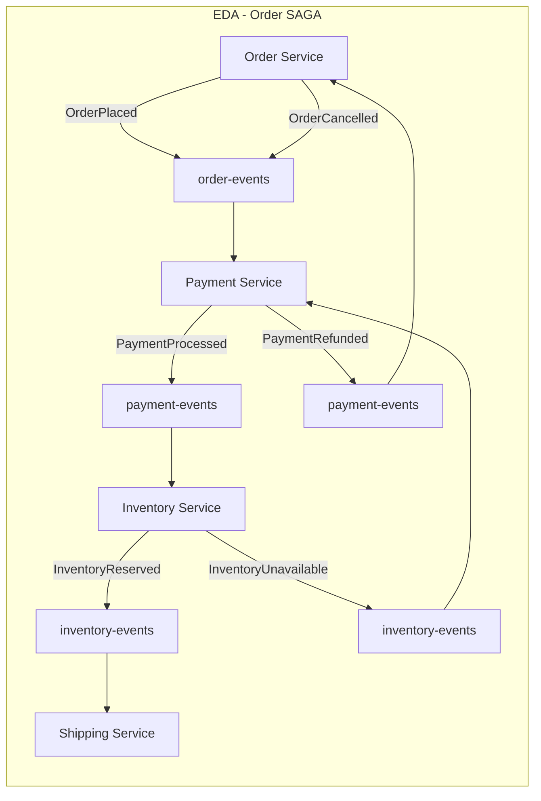

## Keywords in This File
{: .no_toc }

| # | Keyword | Weight |
|---|---|---|
| 1 | [Kafka - L5 Event-Driven Architecture](#kafka---l5-event-driven-architecture) | medium |

---

# Kafka - L5 Event-Driven Architecture

## Event-Driven Architecture with Kafka

---

### 🎯 Model Answer

**30 seconds:**
> Event-driven architecture (EDA): services communicate by publishing and subscribing to events
> rather than direct API calls. Kafka: the backbone. Benefits: loose coupling, independent scaling,
> temporal decoupling (producer and consumer don't need to be online simultaneously), event
> sourcing (the log IS the database). Trade-offs: eventual consistency, harder debugging
> (distributed traces needed), schema evolution discipline required.

**3 minutes (Senior):**
> EDA architectural patterns with Kafka:
>
> 1. **Event notification** (simplest): service publishes "OrderPlaced" event. Other services
>    subscribe and react. No direct coupling. Publisher doesn't care who reacts or how.
>    Trade-off: publisher cannot know if downstream processing succeeded (fire-and-forget).
> 2. **Event-carried state transfer**: event contains enough data for the subscriber to act
>    without calling back to the publisher. `OrderPlaced` includes: customer name, address,
>    items, total. Inventory service: no need to call Order Service API. Full autonomy.
>    Trade-off: larger events, potential stale data (subscriber sees state as of event time).
> 3. **Event sourcing**: the Kafka topic IS the primary store. State = replay of events.
>    No separate database: rebuild any state from the event log. Kafka compacted topic for
>    current state. Event log for full history. Trade-off: complex queries (no SQL), eventually
>    consistent projections, event schema migration is hard.
> 4. **CQRS + Event Sourcing**: Command (write): produces events to Kafka. Query (read):
>    projections built from event stream. Query side: any store (PostgreSQL, Elasticsearch,
>    Redis). Optimized for read patterns. Trade-off: projection synchronization lag, two data
>    stores to manage.
> 5. **SAGA pattern**: long-running business transactions across services. Choreography (events
>    drive the flow) or orchestration (saga orchestrator issues commands). Compensating
>    transactions for rollback.

**Blank Mind Recovery:**

**(1) Restate:** "EDA patterns: event notification (fire and forget), event-carried state (full
payload), event sourcing (log = database), CQRS (write events, read projections), SAGA
(distributed transactions via compensation). Kafka: durable log for all patterns."

**(2) First principles:** "EDA: services don't call each other. They emit facts. Others react.
Benefits: loose coupling, scalability. Cost: eventual consistency. Kafka: the reliable pipe
between services. Durable, replayable log = foundation for all EDA patterns."

**(3) Bridge:** "EDA is like a city's announcement system. When a fire alarm sounds (event), fire
department responds, school evacuates, hospital prepares (all react independently). No one needs
to call each other. Each service has its own playbook. Kafka: the loudspeaker. The fire alarm
record: never deleted from the log. Any service that missed the broadcast: can replay."

---

### 📘 Concept Explanation

**EDA patterns, anti-patterns, and design decisions:**
```plaintext
EVENT DESIGN PRINCIPLES:

  Principle 1: Events are immutable facts (past tense).
    Good:  "OrderPlaced", "PaymentProcessed", "ShipmentDispatched"
    Bad:   "ProcessOrder", "TriggerPayment" (commands masquerading as events)
    Bad:   "OrderStatus" (ambiguous - is this a notification or a state?)
  
  Principle 2: Events should be self-contained (event-carried state).
    Good:
      {
        "type": "OrderPlaced",
        "orderId": "ord-123",
        "customerId": "cust-456",
        "items": [{"sku": "ABC", "qty": 2, "price": 29.99}],
        "total": 59.98,
        "shippingAddress": {...},
        "placedAt": "2024-01-15T10:00:00Z"
      }
    Bad:
      {
        "type": "OrderPlaced",
        "orderId": "ord-123"  // subscriber must call Order API to get details
      }
    // Bad: creates coupling (subscriber depends on Order API being available).
  
  Principle 3: Choose event key for ordering guarantee.
    OrderPlaced, OrderShipped, OrderDelivered for order ORD-123:
      All three should use key = "ORD-123".
      Guarantees: these three events are on the same partition.
      Guarantees: consumed in order by the same consumer.
  
  Principle 4: Include version/schema metadata.
    { "schemaVersion": "2.1", "type": "OrderPlaced", ... }
    // Allows consumers to handle schema evolution without full-schema-registry dependency.

EDA PATTERNS WITH KAFKA:

  // Pattern 1: Event Notification
  @Service
  class OrderService {
      @Autowired KafkaTemplate<String, String> kafka;
      
      public Order placeOrder(PlaceOrderRequest req) {
          Order order = orderRepo.save(new Order(req));
          kafka.send("order-events", order.getId(), toJson(new OrderPlacedEvent(order)));
          return order;
          // Publisher: done. Does not wait for notification to reach downstream.
          // Inventory, payment, notification services: react independently.
      }
  }
  
  // Pattern 2: Event-Carried State Transfer
  class OrderPlacedEvent {
      String orderId;
      String customerId;
      String customerEmail;  // included: notification service doesn't call User API
      String shippingAddress; // included: shipping service doesn't call Order API
      List<OrderItem> items;  // included: inventory service doesn't call Order API
      BigDecimal total;
      Instant placedAt;
  }
  
  // Pattern 3: Event Sourcing
  // Events are the source of truth. State = replay of events.
  
  @Service
  class OrderEventStore {
      // Primary store: Kafka topic "order-events" (compacted + delete for history).
      // State store: rebuild from events.
      
      public Order getCurrentState(String orderId) {
          // Option A: read from a materialized view (projection):
          return orderProjection.findById(orderId); // pre-built from event stream
          
          // Option B: replay events from offset 0 (expensive for prod):
          // events = kafkaConsumer.read("order-events", key=orderId, fromBeginning=true)
          // return events.reduce(new Order(), this::applyEvent);
      }
      
      private Order applyEvent(Order state, Event event) {
          return switch (event.getType()) {
              case "OrderPlaced"   -> state.withPlaced(event);
              case "OrderShipped"  -> state.withShipped(event);
              case "OrderDelivered"-> state.withDelivered(event);
              default              -> state;
          };
      }
  }

CQRS WITH KAFKA:

  Write Side (Command Handler):
    Receives: CreateOrderCommand
    Validates: business rules
    Produces: OrderPlacedEvent to Kafka
    Does NOT maintain a read model.
  
  Read Side (Projection Builder):
    Consumes: order-events topic
    Builds: OrderProjection in PostgreSQL/Elasticsearch
    Exposes: REST API for order queries
    Eventually consistent: may lag 0-5 seconds behind write side.
  
  Temporal decoupling: write side proceeds without waiting for projection.
  Multiple projections possible:
    OrderSummaryProjection (for order listing)
    OrderAnalyticsProjection (for BI reports)
    OrderSearchProjection (Elasticsearch for full-text search)
  Each projection: independent consumer group. Different update frequency.

SAGA CHOREOGRAPHY vs ORCHESTRATION:

  Choreography (event-driven, no central coordinator):
    Order Service:    publishes "OrderPlaced"
    Payment Service:  reacts, processes payment, publishes "PaymentProcessed" or "PaymentFailed"
    Inventory Service: reacts to "PaymentProcessed",
    reserves inventory, publishes "InventoryReserved"
    Shipping Service: reacts to "InventoryReserved", creates shipment.
    
    On failure: compensating events flow in reverse:
      "PaymentFailed" -> Order Service: cancels order.
      "InventoryUnavailable" -> Payment Service: refunds.
    
    Pro: fully decoupled. Con: complex to trace. Hard to see the full saga flow.
  
  Orchestration (central coordinator):
    Saga Orchestrator: sends commands, waits for replies, advances state machine.
    - Send "ReserveInventory" command to Inventory Service.
    - Await "InventoryReserved" reply.
    - Send "ProcessPayment" command to Payment Service.
    - Await "PaymentProcessed" reply.
    - Send "CreateShipment" command to Shipping Service.
    
    On failure: orchestrator sends compensating commands explicitly.
    Pro: visible flow, easy to trace, central timeout handling.
    Con: orchestrator is a new service to manage, a potential bottleneck.
  
  Kafka: enables both patterns.
    Choreography: topics per event type, services subscribe/publish.
    Orchestration: command topics per service, orchestrator consumes reply topics.

EDA ANTI-PATTERNS:

  Anti-pattern 1: Event as an API call (chatty events):
    ProductService publishes "GetProductDetails" event.
    Other service subscribes, fetches product, publishes "ProductDetailsResponse" back.
    This is request/response over events. Use REST/gRPC instead.
  
  Anti-pattern 2: Implicit ordering dependency without key guarantee:
    "OrderPlaced" on partition 3.
    "OrderShipped" on partition 7 (different key used).
    Consumer processes "OrderShipped" before "OrderPlaced"
    (different partitions, different consumers).
    Business logic: invalid state.
    Fix: use consistent key (orderId) for all events in the same aggregate.
  
  Anti-pattern 3: Fat events with all fields always populated:
    Event has 50 fields, only 3 relevant to this action.
    Consumers: parse 50 fields. Schema changes: break 20 consumers.
    Fix: minimal event (include only relevant state change data).
    Or: CloudEvents standard (envelope + data separation).
  
  Anti-pattern 4: No schema registry (string JSON everywhere):
    Schema changes: discovered at runtime (consumer parse error at 3am).
    Fix: Avro/Protobuf with Schema Registry. Schema compatibility enforcement at produce time.
```

> **Code walkthrough:** BAD pattern: This Unknown example demonstrates Java Stream pipeline using Stream. **KEY MECHANISM:** the stream is lazy - intermediate ops build a pipeline, terminal op drives it. **WHY IT MATTERS:** calling terminal op twice throws IllegalStateException; parallel() on small data adds overhead. **WHAT BREAKS: collect() or findFirst() triggers the pipeline; reuse by wrapping in Supplier.**

---

### 💻 Code Example

> **Code walkthrough:** The SAGA choreography with compensation demonstrates event-driven
> distributed transactions without a central coordinator.

```java
// WRONG: direct service calls for a distributed transaction:
@Service
class OrderService {
    @Autowired PaymentClient paymentClient;
    @Autowired InventoryClient inventoryClient;
    @Autowired ShippingClient shippingClient;
    
    @Transactional  // LOCAL transaction only, not distributed!
    public void processOrder(Order order) {
        paymentClient.charge(order);       // remote call - may fail
        inventoryClient.reserve(order);    // remote call - may fail after payment charged
        shippingClient.createShipment(order); // remote call - may fail after inventory reserved
        // If shippingClient fails: payment charged, inventory reserved, but no shipment.
        // Distributed inconsistency. Local @Transactional does not help.
    }
}

// RIGHT: SAGA choreography with compensating events:
@Service
class OrderService {
    @Autowired KafkaTemplate<String, String> kafka;
    
    public void placeOrder(CreateOrderRequest req) {
        Order order = orderRepo.save(new Order(req));
        // Publish initial event. SAGA starts:
        kafka.send("order-events", order.getId(),
            toJson(new OrderPlacedEvent(order)));
    }
    
    // Listen for saga compensation (payment failed, inventory unavailable):
    @KafkaListener(topics = "payment-events", groupId = "order-saga")
    public void onPaymentEvent(String payload) {
        PaymentEvent event = parse(payload);
        if ("PaymentFailed".equals(event.getType())) {
            // Compensate: cancel the order:
            orderRepo.findById(event.getOrderId()).ifPresent(order -> {
                order.cancel("Payment failed: " + event.getReason());
                orderRepo.save(order);
                kafka.send("order-events", order.getId(),
                    toJson(new OrderCancelledEvent(order)));
            });
        }
    }
}

@Service
class PaymentService {
    @KafkaListener(topics = "order-events", groupId = "payment-saga")
    public void onOrderEvent(String payload) {
        OrderEvent event = parse(payload);
        if ("OrderPlaced".equals(event.getType())) {
            String orderId = event.getOrderId();
            try {
                chargeCard(event.getCustomerId(), event.getTotal());
                kafka.send("payment-events", orderId,
                    toJson(new PaymentProcessedEvent(orderId)));
            } catch (PaymentException e) {
                kafka.send("payment-events", orderId,
                    toJson(new PaymentFailedEvent(orderId, e.getMessage())));
            }
        }
    }
    
    // Compensate when inventory is unavailable:
    @KafkaListener(topics = "inventory-events", groupId = "payment-saga")
    public void onInventoryEvent(String payload) {
        InventoryEvent event = parse(payload);
        if ("InventoryUnavailable".equals(event.getType())) {
            // Refund the payment:
            refund(event.getOrderId());
            kafka.send("payment-events", event.getOrderId(),
                toJson(new PaymentRefundedEvent(event.getOrderId())));
        }
    }
}
```

> **Code walkthrough:** Each service in the SAGA listens to events relevant to its step and
> publishes the outcome. Compensation flows backward: if `InventoryUnavailable` fires after
> `PaymentProcessed`, the Payment Service listens for it and issues a refund. The OrderService
> listens for `PaymentFailed` and cancels the order. Each step is idempotent (duplicate events
> are safe: refunding a not-yet-charged order is a no-op). Kafka's log enables replay of the
> entire SAGA flow for debugging or reprocessing after a bug fix.

---

### 🎓 Answers by Seniority

**Junior / Mid (0-5 years):**
> EDA: services publish events to Kafka, others subscribe. No direct API calls between services.
> Benefits: loose coupling, independent scaling. Key patterns: event notification (simple),
> event-carried state (full payload), SAGA (distributed transaction via events). Events: past
> tense, immutable, self-contained.

---

**Senior / Staff (5+ years):**
> The hardest EDA problem: schema evolution. When `OrderPlaced` adds a new field `promotionCode`:
> all consumers must handle both the old format (no field) and new format (field present). Avro
> with Schema Registry enforces backward/forward compatibility before events are published. Event
> versioning strategy: (1) additive changes - always backward compatible (new optional fields).
> (2) Removal - forward compatible (producer removes, old consumers ignore unknown fields via
> Avro). (3) Restructure - breaking change: add new event type, deprecate old type, migrate
> consumers, then remove. Governance: the schema registry is the contract between services.
> Changes require review. This discipline is the most operationally intensive aspect of EDA at scale.

---

### ⚠️ Common Misconceptions

**Misconception: "Event-driven architecture solves distributed transactions."**
EDA does NOT provide ACID transactions across services. It replaces synchronous distributed
transactions with eventually consistent compensating transactions (SAGA pattern). The difference:
ACID (bank transfer): debit account A and credit account B atomically. Either both happen or
neither. SAGA (place order): charge payment, then reserve inventory, then create shipment.
If inventory fails: issue a refund and cancel. But: there is a window between "payment charged"
and "inventory reserved" where the system is in an intermediate state. If the service crashes
in this window: the SAGA is incomplete until recovery logic runs. The SAGA approach trades
ACID guarantees for availability and scalability. For most business processes: this trade-off
is acceptable (a brief inconsistency followed by compensation is tolerable). For some processes
(financial account balances): ACID is required. In those cases: keep the operation within a
single database transaction boundary or use a distributed transaction protocol (rare in practice).

---

### ⚖️ Comparison Table

| Pattern | Coupling | Consistency | Complexity | Use Case |
|---|---|---|---|---|
| Event Notification | Loose | Eventual | Low | Reactive side effects |
| Event-Carried State | Loose | Eventual | Medium | Autonomous services |
| Event Sourcing | None (log) | Eventual | High | Audit, temporal queries |
| CQRS + Event Sourcing | None | Eventual | Very High | High-scale read/write |
| SAGA (choreography) | Loose | Eventual | High | Distributed transactions |
| SAGA (orchestration) | Medium | Eventual | Medium | Visible workflow |

---

### 🏛️ System Design

**Order processing EDA with Kafka:**

```
  ┌─────────────┐  OrderPlaced  ┌───────────────────────────────────────────┐
  │ Order       ├──────────────>│ order-events topic (key=orderId)          │
  │ Service     │               └───────┬───────────────┬────────────────────┘
  └─────────────┘                       │               │
                                        │               │
                               ┌────────v──┐    ┌───────v──────┐
                               │ Payment   │    │ Notification  │
                               │ Service   │    │ Service       │
                               └────────┬──┘    └───────────────┘
                                        │
                               PaymentProcessed
                                        │
                               ┌────────v──────────┐
                               │ payment-events    │
                               └────────┬──────────┘
                                        │
                               ┌────────v──┐
                               │ Inventory │
                               │ Service   │
                               └────────┬──┘
                                        │
                               InventoryReserved
                                        │
                               ┌────────v──────────┐
                               │ inventory-events  │
                               └────────┬──────────┘
                                        │
                               ┌────────v──┐
                               │ Shipping  │
                               │ Service   │
                               └───────────┘
  
  Compensation flow (reverse):
    PaymentFailed -> Order Service: cancel order.
    InventoryUnavailable -> Payment Service: refund, Order Service: cancel.
```

> **Code walkthrough:** This Unknown example demonstrates a key concept in practice. **KEY MECHANISM:** the runtime executes these instructions in sequence with specific memory and execution semantics. **WHY IT MATTERS:** misapplying this pattern causes subtle bugs that only manifest under production load. **TAKEAWAY: understand the execution model before using this pattern in production code.**

---

### 📊 Diagram

**EDA patterns comparison:**

```
  1. EVENT NOTIFICATION:
     Producer -> [event] -> Topic -> ConsumerA
                                  -> ConsumerB
     
  2. EVENT-CARRIED STATE:
     Same as above, but event = full state snapshot.
     Consumers: no callback to producer.
     
  3. EVENT SOURCING:
     Producer -> [events] -> Topic (append-only)
     State = fold(events) -> Projection (read model)
     
  4. SAGA (CHOREOGRAPHY):
     S1 -> [event1] -> Topic1 -> S2 -> [event2] -> Topic2 -> S3
                   <- [comp1] <- Topic1 <- S2 (on failure)
```



> **Diagram walkthrough:** The happy path flows left to right: OrderPlaced triggers payment,
> then inventory, then shipping. The compensation path (shown with darker nodes) flows right
> to left: InventoryUnavailable triggers a refund from Payment Service, which triggers order
> cancellation from Order Service. Each service only knows about its immediate events: the
> Inventory Service does not know about the Payment Service. The Order Service does not know
> about Shipping. This is the loose coupling benefit of EDA choreography. The cost: the full
> flow is only visible by tracing events across all topics (requires distributed tracing).

---

### 🚨 Failure Modes and Diagnosis

**Failure: SAGA stuck in intermediate state - compensation did not run.**
```plaintext
Symptom: Order 123 in state "Payment Charged" for 24 hours.
  No subsequent events: no InventoryReserved, no ShipmentCreated, no OrderCancelled.
  Customer support: customer charged but no order delivered.

Root cause: Inventory Service crashed AFTER PaymentProcessed event was produced,
  BEFORE InventoryReserved or InventoryUnavailable was produced.
  Payment: committed. Inventory: never processed. SAGA stuck.
  
  Why didn't it recover? Kafka offset for InventoryService consumer group:
  committed BEFORE processing (bad practice: auto-commit=true).
  The PaymentProcessed event was committed at offset 500 before Inventory Service
  processed it. After crash: re-reads from 501. Never processes the stuck SAGA.

Diagnosis:
  1. Query order state. Find all orders with >1h in intermediate state:
     SELECT * FROM order_projections WHERE status='PAYMENT_CHARGED' 
     AND updated_at < NOW() - INTERVAL '1 HOUR';
  
  2. Check Kafka consumer group lag for payment-events:
     kafka-consumer-groups.sh --describe --group inventory-saga
     Is CURRENT-OFFSET advancing? Is there lag?
  
  3. Check Inventory Service logs for errors around order-123.

Fix short-term:
  Manually re-trigger the inventory reservation:
    kafka-console-producer.sh --topic payment-events --property...
    ord-123:{"type":"PaymentProcessed","orderId":"ord-123",...}
  
  Or: re-seek the inventory consumer group to before the stuck offset:
    kafka-consumer-groups.sh --group inventory-saga \
      --reset-offsets --to-offset 499 --topic payment-events --execute

Fix long-term:
  1. Disable auto-commit. Commit after successful processing + event publish.
  2. Add a SAGA timeout monitor: query orders in intermediate state > 15 minutes.
     Trigger compensation automatically.
  3. SAGA state machine: persist SAGA state (pending, compensating, completed) to DB.
     On restart: resume from SAGA state (not just Kafka offset).
  4. Use a SAGA orchestrator (Temporal, Axon Server) for explicit state management.
```

> **Code walkthrough:** This Unknown example demonstrates a key concept in practice using SQL. **KEY MECHANISM:** the runtime executes these instructions in sequence with specific memory and execution semantics. **WHY IT MATTERS:** misapplying this pattern causes subtle bugs that only manifest under production load. **TAKEAWAY: understand the execution model before using this pattern in production code.**

---

### 🎯 Interview Deep-Dive

| Question Category | Time to Answer |
|---|---|
| EDA patterns overview | 2 minutes |
| Event design principles | 2 minutes |
| Event sourcing vs traditional DB | 2 minutes |
| SAGA choreography vs orchestration | 2 minutes |
| Schema evolution in EDA | 2 minutes |
| EDA anti-patterns | 2 minutes |
| CQRS + event sourcing | 2 minutes |
| Stuck SAGA diagnosis | 2 minutes |
| Event ordering guarantee | 1 minute |
| EDA trade-offs | 2 minutes |
| Idempotency in EDA | 2 minutes |
| Debugging distributed EDA flows | 1 minute |

---

**Q1 (architecture): How do you ensure idempotency in an event-driven microservices architecture?**

A: Idempotency in EDA: processing the same event twice produces the same result. Required because:
at-least-once delivery means duplicates are possible (network retry, producer retry, consumer
rebalance). Three levels of idempotency: (1) Kafka producer: `enable.idempotence=true`. Deduplicates
retries within a producer session. Producer PID + sequence number: broker rejects duplicate sends.
(2) Consumer idempotency: before processing an event, check if it was already processed. Use
a deduplication table in the database: `processed_events(event_id, processed_at)`. If event_id
exists: skip. If not: process and insert. Use event metadata for the event_id: Kafka record
key + partition + offset provides a unique identifier. Or: embed an idempotency key in the
event payload (`"idempotencyKey": "uuid"`). (3) Downstream operation idempotency: the operation
triggered by the event must itself be idempotent. UPSERT instead of INSERT (same result on
repeat). PUT instead of POST for HTTP calls (same resource update). Payment: use the order ID
as idempotency key on the payment gateway API. For the deduplication table: it grows without
bound. Purge old entries based on a TTL (e.g., 7 days, matching the Kafka topic retention).
Events older than retention cannot be replayed anyway. For Kafka Streams: `exactly_once_v2`
provides built-in idempotency for stateful operations. For custom consumers: manual deduplication
is required.

*What separates good from great:* The deduplication table creates a write bottleneck under high
throughput. For high-throughput consumers: use a Bloom filter for fast probabilistic deduplication
(before hitting the DB). Bloom filter: small memory, fast reads. False positive rate (configurable):
0.1% events incorrectly marked as duplicate (processed zero or twice). False negative rate: 0
(if it says "not a duplicate", it's correct). Acceptable for non-financial events where 0.1%
duplicate suppression or 0.1% missed deduplication is acceptable. For financial events: always
use the authoritative DB deduplication table (Bloom filter as a performance optimization, not
a replacement). Redis: another option for distributed deduplication with TTL. `SETNX
event_id "1" EX 86400`: atomic set-if-not-exists with TTL. 0 = duplicate (skip). 1 = new
(process). No growth problem (TTL auto-purges).

---

**Q2 (architecture): What are the trade-offs of event sourcing vs a traditional CRUD database?**

A: Event sourcing: the database IS the Kafka event log. Every state change is an event. Current
state = replay of all events. Traditional CRUD: current state is stored directly. Latest values.
History may be absent or in a separate audit table. Trade-offs: (1) Auditability: event sourcing
is perfect for audit requirements. Every change is recorded with who/when/why. CRUD: requires
explicit audit tables or triggers. Event sourcing: zero-cost audit (it's the fundamental model).
(2) Temporal queries: event sourcing enables "what was the state of X at time T?" Replay events
up to time T. CRUD: requires temporal tables (slow, storage-heavy) or point-in-time backups.
(3) Write simplicity: event sourcing: append only. No UPDATE, no DELETE. All writes are appends.
CRUD: full SQL DML. (4) Read complexity: event sourcing: querying current state requires a
materialized projection. The projection must be built and kept current. Multi-field joins:
complex (projections for each query pattern). CRUD: SQL SELECT with joins, filters, aggregates.
(5) Schema evolution: event sourcing: existing events cannot be changed (immutable log). Evolving
event schema: all consumers must handle both old and new event formats forever (or with a
migration event type). CRUD: ALTER TABLE migrations (difficult but well-understood). (6) Storage:
event sourcing: log grows forever. Snapshotting needed for very old aggregates (rebuild state
from snapshot + recent events). CRUD: current state only (small footprint). (7) Operational
complexity: event sourcing: requires Kafka, projection builders, schema registry. CRUD: one
relational database.

*What separates good from great:* Event sourcing and CRUD are not mutually exclusive. Most
production systems use "selective event sourcing": event sourcing for the core domain model
(where audit and temporal queries have business value) and CRUD for supporting data (configuration,
reference data, user preferences). For financial systems: the transaction ledger is event-sourced
(every credit/debit is an immutable fact). Account balances: projections from the ledger.
Supporting configuration (fee schedules, exchange rates): CRUD. The key decision: "does this
domain need full history and temporal queries?" If yes: event sourcing adds value. If no: CRUD
is simpler. The biggest anti-pattern in event sourcing: "event sourcing everything" including
low-value data. This maximizes operational complexity while minimizing the benefit. Apply
event sourcing surgically, where it solves a real business problem.

---

**Q3 (production): How do you implement a reliable distributed event-driven workflow that can recover from partial failures?**

A: Reliable event-driven workflows require: (1) Exactly-once or at-least-once with idempotency
for each step. (2) SAGA state persistence: store the current SAGA step in a durable DB. On
crash: resume from the persisted step, not from scratch. (3) Timeout detection: a SAGA step
that doesn't complete within its SLA triggers compensation. Implement: a SAGA monitor service
that queries for SAGAs in intermediate states for longer than the expected duration. (4)
Dead-letter handling: events that fail processing after retries go to a DLQ. The SAGA monitor
also watches DLQ topics and triggers compensation for affected SAGAs. (5) Compensating transaction
idempotency: compensation operations (refund, cancel, unreserve) must also be idempotent. A
refund triggered twice: same result (refund once, idempotency key on the payment gateway). Full
example with Kafka: use a `saga_state` table with columns: `saga_id`, `order_id`, `current_step`,
`status` (IN_PROGRESS, COMPLETED, COMPENSATING, FAILED). On each SAGA event consumed: update
the table in the same DB transaction as any business changes. If the transaction rolls back:
the event is not committed (at-least-once: event will be re-consumed). SAGA monitor: polls
`saga_state WHERE status='IN_PROGRESS' AND updated_at < NOW() - INTERVAL '10 minutes'` and
triggers compensation commands.

*What separates good from great:* The Temporal.io approach to workflow reliability. Temporal
implements SAGA orchestration with durable execution: workflow code is checkpointed to a database
after every await point. If the workflow service crashes mid-execution: the workflow resumes
from the last checkpoint on restart. The developer writes simple sequential workflow code with
activities (each activity = one service call). Temporal handles: timeouts, retries, compensation,
recovery. Kafka is often used as the activity trigger (consume Kafka event -> start Temporal
workflow). The Temporal workflow then orchestrates the service calls imperatively (not event-driven
choreography). This approach trades the choreography's loosely-coupled elegance for the
orchestration's explicit state management and recovery guarantee. For complex, long-running
workflows (hours, days): Temporal is significantly more reliable than custom SAGA choreography.
For simple, fast workflows (< 30 seconds): Kafka SAGA choreography is simpler and has no
additional infrastructure dependency.

---

### 💻 Code Example

*(Omit: this concept does not have a programmatic interface that can be demonstrated in code. The conceptual explanation above is sufficient.)*


---

### 🏛️ System Design

*(Omit: system design diagram not applicable for this concept - see ★★★ keywords for full system design coverage.)*


---

### ⚖️ Comparison Table

*(Omit: this is a ★☆☆ foundational concept with no direct alternatives to compare - see higher-difficulty keywords for trade-off analysis.)*


---

### 📊 Diagram

*(Omit: no standalone visual diagram required for this concept - the explanations and code examples above provide sufficient clarity.)*


