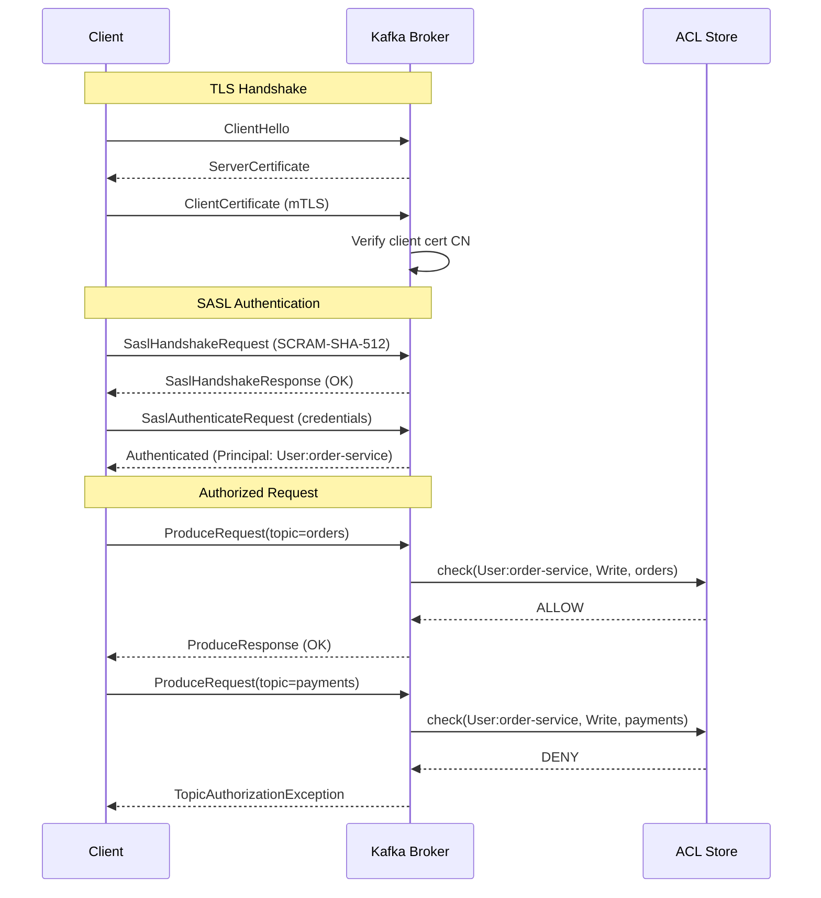

## Keywords in This File
{: .no_toc }

| # | Keyword | Weight |
|---|---|---|
| 1 | [Kafka - L5 Security Architecture](#kafka---l5-security-architecture) | medium |

---

# Kafka - L5 Security Architecture

## Kafka Security Architecture

---

### 🎯 Model Answer

**30 seconds:**
> Kafka security: three pillars. (1) Encryption in transit: TLS for all broker-client and
> broker-broker communication. (2) Authentication: SASL/PLAIN, SASL/SCRAM, SASL/GSSAPI
> (Kerberos), mTLS (mutual TLS). (3) Authorization: ACLs (Access Control Lists) control which
> principals can produce/consume/create topics. Add: network-level controls (VPC, firewall) and
> encryption at rest (disk-level, not Kafka-native). Defense in depth.

**3 minutes (Senior):**
> Security configuration layers:
>
> 1. **TLS**: configure `ssl.keystore.location`, `ssl.keystore.password`, `ssl.truststore.location`.
>    All clients and brokers use TLS. Certificate rotation: rolling restart (or with
>    `ssl.dynamic.spiffe.enabled` for zero-downtime rotation). Mutual TLS (mTLS): client also
>    presents a certificate. The broker validates the client cert. Client certificate CN becomes
>    the principal for ACL evaluation.
> 2. **SASL authentication**: SASL/PLAIN: username/password (plaintext, only use over TLS).
>    SASL/SCRAM-SHA-256 or SCRAM-SHA-512: hashed credentials, stored in ZooKeeper/KRaft.
>    Dynamic user creation without broker restart. SASL/GSSAPI (Kerberos): enterprise
>    environments. Most secure. Complex setup. OAuth 2.0 (SASL/OAUTHBEARER): Kafka 2.0+.
>    Integrates with corporate IdP (OIDC/OAuth tokens).
> 3. **ACLs**: `kafka-acls.sh` manages ACLs stored in ZooKeeper/KRaft. Principal formats:
>    `User:alice`, `Group:analytics-team`. Operations: Read, Write, Create, Delete, Alter,
>    Describe, DescribeConfigs, AlterConfigs. Resources: Topic, Group, Cluster, TransactionalId.
>    Prefix-based ACLs: `Topic:prefix:orders-*` (all topics starting with "orders-").
> 4. **Network security**: never expose Kafka brokers publicly. Use VPC/private subnets.
>    Kafka listener separation: `INTERNAL://:9092` for inter-broker, `EXTERNAL://:9093` for
>    client connections. Different security protocols per listener.
> 5. **Encryption at rest**: Kafka does NOT natively encrypt stored data. Options: OS-level
>    encryption (dm-crypt/LUKS), Confluent Enterprise (tiered storage with encryption), or
>    field-level encryption in the application before producing.

**Blank Mind Recovery:**

**(1) Restate:** "Three pillars: TLS (transport), SASL (authentication), ACLs (authorization).
Network: VPC, private subnets, listener separation. At rest: OS-level or application-level
encryption. SCRAM for passwordless dynamic users. mTLS for cert-based auth. OAuth for IdP integration."

**(2) First principles:** "Security = authentication (who are you?) + authorization (what can you
do?) + encryption (can others read it?). Kafka: SSL layer handles encryption. SASL handles
authentication. ACLs handle authorization. Defense in depth: all three required."

**(3) Bridge:** "Kafka security is like a bank vault system: (1) TLS = the combination lock
(encryption). (2) SASL = the key card that identifies who you are (authentication). (3) ACLs =
the list on the door that says which key card can access which boxes (authorization). Network
controls = the building perimeter (VPC). Encryption at rest = the armored vault walls."

---

### 📘 Concept Explanation

**TLS, SASL, ACLs, and operational security:**
```plaintext
TLS CONFIGURATION:

  # Broker server.properties:
  listeners=SSL://:9093,PLAINTEXT://:9092  # SSL for external, PLAINTEXT for internal
  security.inter.broker.protocol=SSL       # broker-to-broker also encrypted
  
  ssl.keystore.location=/certs/kafka.keystore.jks
  ssl.keystore.password=${KEYSTORE_PASSWORD}  # from env/secrets manager
  ssl.key.password=${KEY_PASSWORD}
  ssl.truststore.location=/certs/kafka.truststore.jks
  ssl.truststore.password=${TRUSTSTORE_PASSWORD}
  ssl.client.auth=required  # mTLS: clients must present certificate
  ssl.endpoint.identification.algorithm=https  # hostname verification
  
  # Client producer/consumer properties:
  security.protocol=SSL
  ssl.keystore.location=/certs/client.keystore.jks
  ssl.keystore.password=${KEYSTORE_PASSWORD}
  ssl.truststore.location=/certs/client.truststore.jks
  ssl.truststore.password=${TRUSTSTORE_PASSWORD}
  ssl.endpoint.identification.algorithm=https  # verify broker hostname
  
  # Certificate rotation (zero-downtime with multiple listeners):
  # Add new cert to truststore (same password). Reload via JMX without restart.
  # After all brokers updated: remove old cert.

SASL/SCRAM CONFIGURATION:

  # Create SCRAM credentials (stored in ZK or KRaft - no restart needed):
  kafka-configs.sh --bootstrap-server broker:9092 --alter \
    --add-config 'SCRAM-SHA-512=[iterations=8192,password=my-secure-password]'...
    --entity-type users --entity-name service-account-orders
  
  # Broker server.properties:
  sasl.enabled.mechanisms=SCRAM-SHA-512
  sasl.mechanism.inter.broker.protocol=SCRAM-SHA-512
  listener.name.sasl_ssl.scram-sha-512.sasl.jaas.config=\
    org.apache.kafka.common.security.scram.ScramLoginModule required;
  
  # Client JAAS config (/etc/kafka/kafka_client_jaas.conf):
  KafkaClient {
    org.apache.kafka.common.security.scram.ScramLoginModule required
    username="service-account-orders"
    password="my-secure-password";
  };
  
  # Client properties:
  security.protocol=SASL_SSL
  sasl.mechanism=SCRAM-SHA-512
  sasl.jaas.config=org.apache.kafka.common.security.scram.ScramLoginModule required \
    username="service-account-orders" password="my-secure-password";

SASL/OAUTHBEARER (OAUTH 2.0):

  # Kafka 2.0+ supports OAuth 2.0 with SASL/OAUTHBEARER.
  # Clients: obtain JWT token from IdP (Keycloak, Okta, Azure AD).
  # Broker: validates JWT (signature, expiry, claims).
  
  # Client: implement OAuthBearerLoginCallbackHandler.
  sasl.mechanism=OAUTHBEARER
  sasl.login.callback.handler.class=\
    com.example.security.OAuthBearerLoginCallbackHandler
  sasl.jaas.config=\
    org.apache.kafka.common.security.oauthbearer.OAuthBearerLoginModule required;
  
  # Token refresh: login callback handler auto-refreshes before expiry.
  # Broker: configure token validation endpoint or local JWKS URL.
  sasl.server.callback.handler.class=\
    com.example.security.OAuthBearerServerCallbackHandler

ACL CONFIGURATION:

  # Topic ACLs:
  
  # Grant producer access to "orders" topic:
  kafka-acls.sh --bootstrap-server broker:9092 \
    --add --allow-principal User:order-service \
    --operation Write --topic orders
  
  # Grant consumer access for consumer group:
  kafka-acls.sh --bootstrap-server broker:9092 \
    --add --allow-principal User:inventory-service \
    --operation Read --topic orders
  kafka-acls.sh --bootstrap-server broker:9092 \
    --add --allow-principal User:inventory-service \
    --operation Read --group inventory-processor
  
  # Prefix-based ACL (all "orders-*" topics):
  kafka-acls.sh --bootstrap-server broker:9092 \
    --add --allow-principal User:orders-platform \
    --operation Read --operation Write \
    --topic orders- --resource-pattern-type prefixed
  
  # Describe (for Kafka tools like kafka-consumer-groups.sh):
  kafka-acls.sh --bootstrap-server broker:9092 \
    --add --allow-principal User:monitoring-agent \
    --operation Describe --topic '*'  \
    --operation Describe --group '*'
  
  # List ACLs:
  kafka-acls.sh --bootstrap-server broker:9092 --list --topic orders

PRINCIPAL MAPPING (SASL to ACL PRINCIPAL):

  With SASL/SCRAM:
    Username "service-account-orders" -> Principal "User:service-account-orders...
  
  With mTLS:
    Client certificate CN="order-service.prod.company.com"
    -> Principal "User:order-service.prod.company.com" (default)
    Or: custom SSL.PrincipalMapping rule:
    ssl.principal.mapping.rules=RULE:^CN=(.*?),.*$/$1/
    -> Principal "User:order-service.prod.company.com" (parsed CN)
  
  With OAuth:
    JWT claim "sub" -> Principal "User:${sub}"
    Custom: OAuthBearerServerCallbackHandler can extract any claim.

LISTENER SEPARATION (MULTI-LISTENER):

  # server.properties: different security per listener:
  listeners=INTERNAL://:9092,EXTERNAL://:9093,REPLICATION://:9094
  
  # Internal (broker-to-broker, within VPC): PLAINTEXT (trusted network)
  # External (client connections): SASL_SSL (authenticated + encrypted)
  # Replication: SSL (encrypted, no authentication overhead)
  
  listener.security.protocol.map=\
    INTERNAL:PLAINTEXT,\
    EXTERNAL:SASL_SSL,\
    REPLICATION:SSL
  
  inter.broker.listener.name=INTERNAL
  
  # ACLs applied on the EXTERNAL listener. INTERNAL listener: no ACLs
  # (trusted network, intra-cluster only).

SECRETS MANAGEMENT:

  # NEVER put passwords in server.properties in plaintext.
  
  # Option A: Environment variables:
  ssl.keystore.password=${file:/etc/kafka/secrets/ssl_keystore_password}
  
  # Option B: Config Provider (Kafka 2.0+):
  # Implement ConfigProvider to read from Vault, AWS Secrets Manager, etc.
  config.providers=vault
  config.providers.vault.class=com.example.VaultConfigProvider
  ssl.keystore.password=${vault:secret/kafka:ssl_keystore_password}
  
  # Option C: Kubernetes secrets:
  # Mount secrets as files. Reference file paths in config.
  # Rotate: update secret, rolling restart brokers.
```

> **Code walkthrough:** This Rotate: update secret, rolling restart brokers. example demonstrates a key concept in practice using SQL. **KEY MECHANISM:** the runtime executes these instructions in sequence with specific memory and execution semantics. **WHY IT MATTERS:** misapplying this pattern causes subtle bugs that only manifest under production load. **TAKEAWAY: understand the execution model before using this pattern in production code.**

---

### 💻 Code Example

> **Code walkthrough:** Secure producer configuration with mTLS in a Spring Boot application
> demonstrates the complete client-side security setup.

```java
// WRONG: unsecured producer connecting to Kafka over plaintext:
@Bean
public ProducerFactory<String, String> producerFactory() {
    Map<String, Object> config = new HashMap<>();
    config.put(ProducerConfig.BOOTSTRAP_SERVERS_CONFIG, "kafka:9092");
    // No security: all traffic in plaintext. Anyone on the network can intercept.
    return new DefaultKafkaProducerFactory<>(config);
}

// RIGHT: mTLS + SASL/SCRAM secure producer:
@Configuration
public class KafkaSecurityConfig {
    
    @Value("${kafka.bootstrap.servers}") String bootstrapServers;
    @Value("${kafka.ssl.keystore.location}") String keystorePath;
    @Value("${kafka.ssl.keystore.password}") String keystorePassword;  // from Vault/K8s secret
    @Value("${kafka.ssl.truststore.location}") String truststorePath;
    @Value("${kafka.ssl.truststore.password}") String truststorePassword;
    @Value("${kafka.sasl.username}") String saslUsername;
    @Value("${kafka.sasl.password}") String saslPassword;  // from Vault/K8s secret
    
    @Bean
    public ProducerFactory<String, String> secureProducerFactory() {
        Map<String, Object> config = new HashMap<>();
        config.put(ProducerConfig.BOOTSTRAP_SERVERS_CONFIG, bootstrapServers);
        
        // TLS encryption:
        config.put(CommonClientConfigs.SECURITY_PROTOCOL_CONFIG, "SASL_SSL");
        config.put(SslConfigs.SSL_KEYSTORE_LOCATION_CONFIG, keystorePath);
        config.put(SslConfigs.SSL_KEYSTORE_PASSWORD_CONFIG, keystorePassword);
        config.put(SslConfigs.SSL_TRUSTSTORE_LOCATION_CONFIG, truststorePath);
        config.put(SslConfigs.SSL_TRUSTSTORE_PASSWORD_CONFIG, truststorePassword);
        config.put(SslConfigs.SSL_ENDPOINT_IDENTIFICATION_ALGORITHM_CONFIG, "https");
        
        // SASL/SCRAM authentication:
        config.put(SaslConfigs.SASL_MECHANISM, "SCRAM-SHA-512");
        config.put(SaslConfigs.SASL_JAAS_CONFIG, String.format(
            "org.apache.kafka.common.security.scram.ScramLoginModule required "
            + "username=\"%s\" password=\"%s\";",
            saslUsername, saslPassword));
        
        return new DefaultKafkaProducerFactory<>(config);
    }
    
    // Check ACL: this producer must have Write permission on "orders" topic.
    // ACL set up separately:
    // kafka-acls.sh --add --allow-principal User:<saslUsername> --operation Write --topic orders
}
```

> **Code walkthrough:** The secure producer uses `SASL_SSL` as the security protocol (both SASL
> authentication AND TLS encryption). The keystore contains the client certificate (for mTLS).
> The truststore contains the CA certificate to verify the broker's identity. `ssl.endpoint.
> identification.algorithm=https` enables hostname verification: the broker's certificate CN
> must match the hostname (prevents MITM attacks). The SASL JAAS config credentials come from
> Spring's `@Value` which resolves against Kubernetes secrets or environment variables. NEVER
> inline credentials in source code.

---

### 🎓 Answers by Seniority

**Junior / Mid (0-5 years):**
> Kafka security: TLS encrypts the connection. SASL authenticates clients (username/password or
> Kerberos). ACLs control what each client can do (read topic, write topic, describe group).
> Always use TLS in production. Create one service account per application. Grant minimal
> permissions (principle of least privilege).

---

**Senior / Staff (5+ years):**
> The principal of least privilege per service account is non-negotiable. Each service: its own
> service account. Permissions: exactly what it needs. Monitoring: who is accessing which topics
> (Confluent Audit Logs or Kafka's own audit logging). Regular ACL audit: remove stale service
> accounts. Secret rotation: SCRAM credentials rotation without restart (dynamic credential
> update via `kafka-configs.sh`). TLS cert rotation: requires coordinated keystore update.
> In Kubernetes: cert-manager for automatic certificate rotation. Alert: expiring certificates
> (< 30 days). Expired certs: all connections to that broker fail instantly.

---

### ⚠️ Common Misconceptions

**Misconception: "Kafka encrypts data at rest natively."**
Kafka does NOT natively encrypt data stored on disk. Data in Kafka log segments is stored in
plaintext (unless you use Confluent Platform with tiered storage encryption, or encrypt at the
application level before producing). TLS encrypts data IN TRANSIT (over the network) only. For
data at rest encryption: (1) OS-level: dm-crypt/LUKS on the Kafka broker's data disks. Transparent
to Kafka. All log files encrypted. Decrypted on read. (2) Application-level: encrypt field values
before producing. The Kafka broker sees opaque bytes. Only consumers with the decryption key
can read the data. This is the only approach where a compromised Kafka broker cannot access
data. (3) Field-level encryption via Schema Registry (Confluent): encrypt specific fields in
Avro/JSON schemas. Other fields: plaintext. Selective protection. For compliance (GDPR, HIPAA,
PCI-DSS): usually OS-level encryption is sufficient for "encryption at rest" requirement. For
zero-trust: application-level or field-level encryption is required.

---

### ⚖️ Comparison Table

| Auth Method | Credential | Dynamic Rotation | Enterprise | Complexity |
|---|---|---|---|---|
| SASL/PLAIN | Username/Password | With restart | Low | Low |
| SASL/SCRAM | Hashed credentials | No restart needed | Low | Low |
| SASL/GSSAPI (Kerberos) | Kerberos tickets | Via KDC | High | High |
| mTLS | X.509 certificates | Rolling restart | Medium | Medium |
| SASL/OAUTHBEARER | JWT token | Automatic (IdP) | High | Medium |

---

### 🏛️ System Design

**Production Kafka security architecture:**

```
  EXTERNAL CLIENTS             DMZ / LOAD BALANCER    KAFKA BROKERS (private subnet)
  ┌──────────────────┐         ┌──────────────────┐    ┌────────────────────┐
  │ Producer Service ├── TLS ──>│ TLS Termination  ├───>│ Broker 1 (SASL_SSL)│
  │ SASL/SCRAM auth  │         │ (optional)        │    │ ACLs enforced      │
  └──────────────────┘         └──────────────────┘    └────────────────────┘
                                                        ┌────────────────────┐
  ┌──────────────────┐         VPC Security Group:      │ Broker 2           │
  │ Consumer Service ├──────── Port 9093 only           │                    │
  │ SASL/SCRAM auth  │         No direct internet       └────────────────────┘
  └──────────────────┘
  
  Secret management:
    Passwords: AWS Secrets Manager / HashiCorp Vault
    Certificates: cert-manager (Kubernetes) / Let's Encrypt
  
  ACL model:
    service-account-orders: Write on orders.*
    service-account-inventory: Read on orders.*, Read group inventory-*
    service-account-monitoring: Describe on *, Describe group *
```

> **Code walkthrough:** This Rotate: update secret, rolling restart brokers. exaice. **KEY MECHANISM:** the runtime executes these instructions in sequence with specific memory and execution semantics. **WHY IT MATTERS:** misapplying this pattern causes subtle bugs that only manifest under production load. **TAKEAWAY: understand the execution model before using this pattern in production code.**

---

### 📊 Diagram

**Authentication and authorization flow:**

```
  CLIENT                    KAFKA BROKER
  
  1. TLS handshake:
     ClientHello            ServerHello
                            ServerCertificate (broker cert)
     [verify broker cert]
     ClientCertificate (for mTLS)
     ClientKeyExchange
     Finished
                            [verify client cert]
                            Finished
  
  2. SASL authentication:
     SaslHandshakeRequest   SaslHandshakeResponse (OK)
     SaslAuthenticateRequest (credentials)
                            SaslAuthenticateResponse (authenticated)
                            Principal: User:order-service
  
  3. ACL check (per request):
     ProduceRequest(topic=orders)
     [check ACL: User:order-service + Write + Topic:orders -> ALLOW]
     ProduceResponse (OK)
     
     ProduceRequest(topic=payments)
     [check ACL: User:order-service + Write + Topic:payments -> DENY]
     ProduceResponse(TopicAuthorizationException)
```



> **Diagram walkthrough:** The three-phase security flow mirrors the layered security model.
> TLS handshake establishes encrypted transport and (with mTLS) validates the client's identity
> via certificate. SASL authentication adds a second authentication layer (username/password or
> token). After authentication: the broker knows the principal (`User:order-service`). For every
> subsequent request: the ACL store is checked. ALLOW: request proceeds. DENY: error returned
> to client. This defense-in-depth approach means: even if TLS is compromised (unlikely), SASL
> still authenticates. Even if SASL credentials are stolen, ACLs limit damage to only permitted
> operations.

---

### 🚨 Failure Modes and Diagnosis

**Failure: Certificate expiry causes all client connections to fail.**
```
Symptom: All producers and consumers fail simultaneously.
  Error: "javax.net.ssl.SSLHandshakeException: PKIX path validation failed:
  validity interval"
  Or: "Certificate expired"
  Services: degraded or down. Kafka: healthy but unreachable by clients.

Root cause: TLS certificate for Kafka broker (or client) expired.
  Certificates have a defined validity period (1-2 years typical).
  Expiry: silent until the moment it happens. Then: instant failure for all connections.

Diagnosis:
  openssl s_client -connect broker1:9093 -showcerts 2>&1 | \
    openssl x509 -noout -dates
  # Look for "notAfter" date. Compare to today.
  
  Or: check all brokers at once:
  for broker in broker1 broker2 broker3; do
    echo "=== $broker ===" 
    openssl s_client -connect ${broker}:9093 2>&1 | \
      openssl x509 -noout -subject -dates 2>/dev/null
  done
  
  Also check client keystores if using mTLS.

Immediate fix:
  Generate new certificate (signed by the same CA or new CA).
  Update keystore on ALL brokers:
    keytool -delete -alias broker -keystore kafka.keystore.jks
    keytool -importcert -alias broker -file broker.crt \
      -keystore kafka.keystore.jks
  Rolling restart brokers to pick up new keystore.
  
  If clients use mTLS: also update client keystores and restart clients.

Prevention:
  Alert on certificate expiry:
    Script: check all broker certs weekly. Alert if < 30 days remaining.
    In Kubernetes: cert-manager with Certificate resource and alerting.
    Prometheus: `ssl_certificate_expiry_seconds{job="kafka"}` metric.
    Alert: expiry < 30 days.
  
  Automate renewal:
    cert-manager (Kubernetes): auto-renews certificates at 60% of lifetime.
    Vault PKI: auto-rotation via Vault agent injector.
    AWS ACM PCA: auto-renew with Lambda.

Post-incident:
  Reduce certificate lifetime: 1 year -> 90 days. Shorter = more frequent...
  After each rotation: automated test. Confirms rotation worked before production.
```

> **Code walkthrough:** This Look for "notAfter" date. Compare to today. example demonstrates a key concept in practice using SQL. **KEY MECHANISM:** the runtime executes these instructions in sequence with specific memory and execution semantics. **WHY IT MATTERS:** misapplying this pattern causes subtle bugs that only manifest under production load. **TAKEAWAY: understand the execution model before using this pattern in production code.**

---

### 🎯 Interview Deep-Dive

| Question Category | Time to Answer |
|---|---|
| TLS setup and mTLS | 2 minutes |
| SASL mechanisms comparison | 2 minutes |
| ACL configuration | 2 minutes |
| Principle of least privilege | 1 minute |
| Kafka encryption at rest | 2 minutes |
| Certificate rotation | 2 minutes |
| SASL/SCRAM dynamic credentials | 1 minute |
| OAuth 2.0 integration | 2 minutes |
| Network security (VPC, listeners) | 2 minutes |
| Certificate expiry failure | 1 minute |
| Listener separation | 2 minutes |
| ACL audit and governance | 1 minute |

---

**Q1 (architecture): Design a Kafka security model for a multi-tenant enterprise environment.**

A: Multi-tenant Kafka security requires strict isolation between tenants. Architecture: (1)
Topic namespace isolation: prefix-based ACLs. Each tenant gets a prefix: `tenant-A-*`, `tenant-B-*`.
Each tenant's service accounts: ACLs on their prefix only. `kafka-acls.sh --resource-pattern-type
prefixed --topic tenant-A-`. Tenant A: cannot see, read, or write to tenant B's topics. (2)
Consumer group isolation: consumer groups prefixed: `tenant-A-*`. ACLs on consumer group prefix.
Tenant A's service accounts: can only join consumer groups with their prefix. Prevents tenant A
from reading tenant B's offsets or stalling their consumer group. (3) Authentication: each
tenant gets dedicated service accounts. SCRAM or mTLS. Service account naming convention:
`tenant-{tenantId}-{service}`. (4) Audit logging: all ACL denials logged. All topic creates/deletes
logged. Confluent audit logs or custom Kafka interceptor. Tenant activity: queryable per tenant
for compliance. (5) Quota management: per-tenant throughput quotas. `kafka-configs.sh --entity-type
clients --entity-name tenant-a --alter --add-config producer_byte_rate=10485760` (10MB/s limit).
Prevents one tenant from monopolizing broker resources. (6) Admin isolation: tenant admins can
manage their own topics (CreateTopic ACL on their prefix) but cannot alter broker configs or
manage other tenants.

*What separates good from great:* The "super user" ACL trap. A common mistake: creating a
`super-user` account for each team's operations. Super users bypass all ACLs. This is a security
anti-pattern: any credential compromise = full cluster access. The correct approach: only the
Kafka operations team has super-user access (for break-glass scenarios). All other accounts:
minimum required ACLs. For automated provisioning (creating topics for a new tenant): create
a dedicated provisioner service account with only `CreateTopic` on the tenant's prefix. No
other permissions. For schema registry: separate access control (subject-level ACLs in Confluent
Schema Registry, or topic-level ACLs for the `_schemas` topic). The security model is only as
strong as the most permissive account. Audit quarterly: which accounts exist, what ACLs they
have, when they last used them. Remove stale accounts. This is the operational discipline that
determines real-world security posture.

---

**Q2 (production): How do you rotate SASL/SCRAM credentials without Kafka downtime?**

A: SASL/SCRAM credential rotation is one of the key advantages over SASL/PLAIN (which requires
restart). SCRAM credentials are stored in ZooKeeper (ZK mode) or KRaft metadata log (KRaft mode),
not in `server.properties`. Rotation procedure: (1) Create a new credential with a new password
for the service account:
`kafka-configs.sh --bootstrap-server broker:9092 --alter --add-config
'SCRAM-SHA-512=[iterations=8192,password=new-secure-password]' --entity-type users --entity-name
order-service`. This immediately updates the credential in ZK/KRaft. (2) Verify the new credential
works: test with a simple producer using the new password. (3) Update the client application's
secret. In Kubernetes: update the Secret object. Trigger a rolling restart of the client pods
to pick up the new credential. (4) Verify all client pods are using the new credential (no
authentication errors in logs). (5) Optionally: delete the old credential (SCRAM allows only
one active credential per mechanism per user - updating replaces it automatically). Key: steps
1-5 happen while Kafka and the existing clients continue operating. No Kafka broker restart
needed. The client rolling restart is the only downtime (per pod, not cluster-wide). For zero-downtime
client restart: use Kubernetes rolling deployment. Old pods: use old credential until terminated.
New pods: use new credential. Both credentials cannot coexist in SCRAM (update replaces). Brief
window where old pods may fail authentication if the secret is updated too quickly. Solution:
update client pods BEFORE updating the credential (blue-green deployment: new pods deployed
first with new credential, old pods shut down, then credential updated in Kafka).

*What separates good from great:* The sequence matters. For strict zero-downtime rotation:
create a SECOND service account (`order-service-v2`), grant it the same ACLs, deploy new
client pods using `order-service-v2`, verify, then retire `order-service` and remove its ACLs.
This avoids the window where credential is updated but old pods still use the old one. Two
service accounts briefly co-exist. Both have the same ACLs. After rotation: remove the old
account and its ACLs. This is the same blue-green approach used in database credential rotation.
Operational overhead: 2x service accounts during rotation. Worth it for critical services
where even 1 authentication failure is unacceptable. For non-critical services: single-account
rotation (brief failure window acceptable).

---

**Q3 (debugging): Clients are getting AuthorizationException. How do you diagnose?**

A: `AuthorizationException` (full: `TopicAuthorizationException`, `GroupAuthorizationException`)
means the authenticated principal lacks the required ACL. Diagnosis: (1) Identify the principal.
Check the client's security configuration: SASL username, or mTLS certificate CN. For SASL:
`sasl.jaas.config` in the client properties. For mTLS: `ssl.principal.mapping.rules` on the
broker. (2) Check existing ACLs for the principal:
`kafka-acls.sh --bootstrap-server broker:9092 --list --principal User:order-service`. Review
which operations and resources are granted. (3) Compare required vs granted. The exception
message includes the resource: `"Not authorized to access topics: [orders]"`. Check if
`User:order-service` has `Write` permission on topic `orders`. (4) Check for ACL on consumer
group (often forgotten): consuming requires both topic Read ACL AND consumer group Read ACL.
`kafka-acls.sh --list --principal User:order-service` should show ACLs on both the topic and
the consumer group. (5) Check if `allow.everyone.if.no.acl.found=true` (broker config). If
true: topics with NO ACLs at all are accessible to everyone. If false (secure default): all
topics require explicit ACLs. Common mistake: creating topic ACL but forgetting consumer group
ACL. Fix: add the missing ACL. Test with `kafka-console-consumer.sh` using the same credentials.

*What separates good from great:* The ACL evaluation order. Kafka ACL evaluation: DENY takes
precedence over ALLOW. If there is a DENY ACL for the principal on the resource: access is
denied even if there is an ALLOW. Check for explicit DENY rules first:
`kafka-acls.sh --list --topic orders`. If you see `--deny-principal User:order-service`: that
is why the ALLOW ACL is not taking effect. Also: check for wildcard DENY rules: `--deny-principal
User:*` (deny all users). These would block even a principal with an ALLOW ACL. Wildcard DENY
is a security hardening pattern: deny all by default, then selectively ALLOW. But it requires
explicit ALLOW ACLs for all operations. If the wildcard DENY was added recently and existing
clients start failing: this is the cause.

---

**Q4 (architecture): How does mTLS authentication work in Kafka, and when should you prefer it over SASL?**

A: Mutual TLS (mTLS): both client and server present X.509 certificates. The broker verifies
the client's certificate is signed by a trusted CA (in the broker's truststore). The client
certificate's CN (Common Name) or SAN (Subject Alternative Name) becomes the Kafka principal
(`User:CN-value`). Configuration: `ssl.client.auth=required` on the broker (default is `none`,
meaning client cert is optional). Client must have a keystore with its certificate and private
key. Broker's truststore must contain the CA that signed the client certificate. Principal
mapping: by default, the full DN (Distinguished Name) of the client cert is used. Simplified
with `ssl.principal.mapping.rules`: regex to extract just the CN: `RULE:^CN=(.*?),.*$/$1/,DEFAULT`.
When to prefer mTLS: (1) Certificate-based identity is already established (PKI infrastructure
exists). (2) Services communicate within a service mesh (Istio, Linkerd): mTLS is the default
authentication. Kafka fits naturally. (3) Short-lived certificates: rotate every 90 days
(cert-manager). No long-lived passwords. Credential management: no password storage. (4) Zero
additional round trips for authentication: TLS handshake already verifies the certificate.
When to prefer SASL: (1) Dynamic credential management: SCRAM allows creating/rotating credentials
without broker restart. Certificate rotation requires keystore update + rolling restart. (2)
Legacy clients without certificate management. (3) Simpler setup: SCRAM is easier to configure
than a full PKI.

*What separates good from great:* mTLS in a service mesh context. Istio/Linkerd provide mTLS
transparently between services. When Kafka is inside the mesh: the Istio sidecar handles mTLS.
The Kafka broker sees the sidecar's certificate, not the application's. The principal would be
the sidecar's service account identity, not the application's. This complicates ACL management:
you can't distinguish between two applications if their sidecars present the same certificate.
Solution: disable mTLS at the Kafka port level (Istio peer authentication exemption for Kafka's
listener port) and let Kafka handle its own authentication (SASL). Or: configure Istio to pass
through the original application certificate (Istio transparent TLS mode with origination).
This is an advanced topic that most Kafka deployments in service meshes get wrong initially.

---

**Q5 (production): How do you implement network-level Kafka security?**

A: Network security for Kafka is the outer perimeter, complementing transport and auth security.
(1) VPC isolation: Kafka brokers in private subnets. No public IP addresses. Clients access via
VPC peering, VPN, or PrivateLink. Never expose Kafka ports to the internet. (2) Security groups
(AWS) or Network Policies (Kubernetes): allow inbound on port 9092/9093 ONLY from known client
subnets or security groups. Deny all other inbound. (3) Listener separation: multiple Kafka
listeners for different network zones. `INTERNAL://0.0.0.0:9092` for broker-to-broker (no
security, trusted VPC internal). `EXTERNAL://0.0.0.0:9093` for client connections (SASL_SSL).
Advertised listeners: per listener, advertised hostname matches the DNS name accessible from
that zone. (4) PrivateLink / VPC Endpoint (AWS): expose Kafka to other accounts without VPC
peering. Traffic stays on the AWS network. No public internet routing. (5) Kafka Proxy
(optional): a proxy (Envoy, or Confluent's Bridge) in a DMZ that authenticates and authorizes
before forwarding to the internal Kafka. Clients: connect to the proxy. Proxy: presents credentials
to Kafka. Centralizes access control. (6) Intrusion detection: log all connections to Kafka
listeners. Alert on unexpected source IPs. CloudTrail / VPC flow logs for audit.

*What separates good from great:* The cross-account Kafka access pattern in AWS. When multiple
AWS accounts need to access a shared Kafka cluster: VPC peering (works but complex) vs AWS
PrivateLink (cleaner, scalable). PrivateLink: the Kafka cluster owner creates a VPC Endpoint
Service backed by a Network Load Balancer. Consumer accounts create a VPC Endpoint in their
VPC pointing to the Endpoint Service. Traffic: stays on AWS backbone (not internet). Security:
ACLs on the Endpoint Service restrict which AWS accounts can connect. This is now the standard
enterprise pattern for sharing Kafka across business units. Combined with SASL authentication
per business unit's service accounts: each unit has network-level isolation (PrivateLink) AND
authentication-level isolation (SASL/SCRAM per account). ACL isolation per prefix: triple
defense in depth.

---

**Q6 (production): What Kafka security auditing capabilities exist, and how do you implement them?**

A: Kafka security auditing: tracking who accessed what and when. Options: (1) Kafka broker
logs: by default, all authorization decisions are not logged. Enable with:
`log4j.logger.kafka.authorizer.logger=INFO`. This logs every ACL check result (ALLOW and DENY).
For high-throughput clusters: INFO logging can overwhelm log storage. Alternative: log only
DENY: `kafka.authorizer.logger.level=WARN` (WARN = denial events only). (2) Confluent Audit
Logs (Confluent Platform): structured JSON audit events to a dedicated Kafka topic (`_confluent-audit-log-events`).
Events: authentication success/failure, authorization success/failure, topic create/delete, ACL
changes. Queryable with KSQL or any Kafka consumer. (3) Custom Authorizer: implement `Authorizer`
interface. Override `authorize()` to publish audit events to a dedicated Kafka topic or external
SIEM (Splunk, Elastic SIEM). (4) For KRaft-managed config: all metadata changes (including ACL
changes) go through the KRaft metadata log. The metadata log is audit-able: `kafka-metadata-shell.sh`
can replay all ACL changes. (5) JMX metrics: `kafka.server:type=RequestMetrics,name=
RequestsPerSec,request=Produce,version=X` per client ID. Unusual patterns (new client ID
producing at high rate): potential anomaly. Alert: new, unauthorized client IDs. Retention:
audit logs (minimum 90 days for SOC 2, 1 year for PCI-DSS, 7 years for some financial regulations).

*What separates good from great:* The GDPR and data access audit requirement. For topics
containing personally identifiable information (PII): GDPR requires knowing who accessed which
PII records and when. Kafka's authorization logs show WHICH TOPIC was accessed, but not WHICH
RECORDS (specific consumer offsets). For record-level audit: application-level audit logging
is required (the application logs: "User X processed record for customer Y at timestamp Z").
Kafka-level audit: sufficient for compliance evidence that access controls are in place. For
GDPR "right to erasure": Kafka doesn't delete individual records (only partition-level deletion
or compaction tombstones). Field-level encryption: encrypt PII fields with a customer-specific
key. "Erasure": delete the customer's key. The PII is now inaccessible (cryptographic erasure)
even though the record remains in the log. This is the Kafka-compatible implementation of GDPR
right to erasure.

---

### 💻 Code Example

*(Omit: this concept does not have a programmatic interface that can be demonstrated in code. The conceptual explanation above is sufficient.)*


---

### 🏛️ System Design

*(Omit: system design diagram not applicable for this concept - see ★★★ keywords for full system design coverage.)*


---

### ⚖️ Comparison Table

*(Omit: this is a ★☆☆ foundational concept with no direct alternatives to compare - see higher-difficulty keywords for trade-off analysis.)*


---

### 📊 Diagram

*(Omit: no standalone visual diagram required for this concept - the explanations and code examples above provide sufficient clarity.)*


