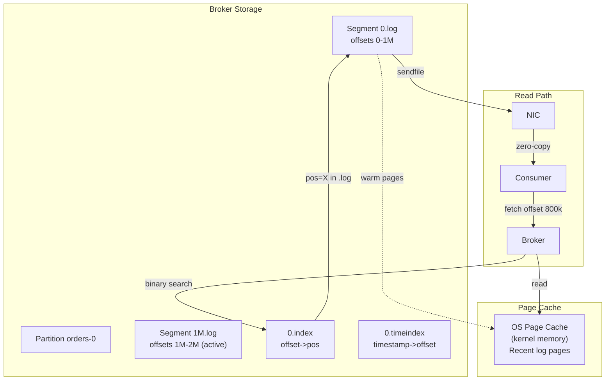
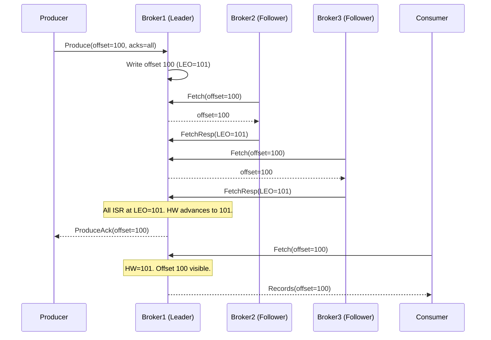

## Keywords in This File
{: .no_toc }

| # | Keyword | Weight |
|---|---|---|
| 1 | [Kafka - L6 Theory](#kafka---l6-theory) | medium |

---

# Kafka - L6 Theory

## Kafka Log-Structured Storage

---

### 🎯 Model Answer

**30 seconds:**
> Kafka's storage is a commit log: ordered, append-only sequence of records. Each partition:
> a directory of segment files. Reads use OS page cache (not Java heap). Zero-copy transfer
> (sendfile syscall): data bypasses user space entirely. Log cleanup: delete (time/size-based)
> or compaction (keep last value per key). These design choices make Kafka throughput largely
> limited by disk sequential bandwidth, not CPU or memory.

**3 minutes (Senior):**
> The log structure:
> 1. **Segment files**: each partition = multiple segment files on disk. Active segment: data
>    is appended. Inactive segments: closed, read-only. Segment rollover: by size (1GB default:
>    `log.segment.bytes`) or time (`log.roll.hours=168`).
> 2. **Index files**: each segment has two index files. `.index`: sparse index of message offset
>    -> file position. `.timeindex`: timestamp -> message offset. Enable O(log n) binary search
>    to seek to an offset or time. Without them: scanning the entire segment file would be O(n).
> 3. **Page cache**: Kafka does NOT buffer data in the JVM heap for serving reads. It writes to
>    disk and relies on the OS page cache (kernel memory) to cache recent data. Consumers reading
>    recent data: served entirely from page cache (no disk I/O). This is why Kafka does not
>    need large JVM heaps (512MB-2GB typical for the JVM, rest is page cache).
> 4. **Zero-copy (sendfile)**: when a consumer requests data: Kafka calls `sendfile()` (Linux)
>    or `transferTo()` (Java NIO). Data path: disk -> kernel buffer -> NIO socket buffer.
>    Bypasses user space entirely. 60-70% reduction in CPU per MB transferred. Critical for
>    high-throughput consumer scenarios.
> 5. **Log cleanup**: delete: segments older than `log.retention.ms` or larger than
>    `log.retention.bytes` are deleted. Compaction: Kafka scans older segments and keeps only
>    the most recent record per key. Tombstone: a null-value record for a key (delete marker).
>    Compaction: eventually removes tombstone records after the delete horizon.

**Blank Mind Recovery:**

**(1) Restate:** "Kafka storage = commit log. Partitions = segment files. Page cache = OS handles
caching, not JVM. Zero-copy (sendfile) = data goes disk -> NIC, never into Java process. Index
files = fast offset lookup. Cleanup: delete (time/size) or compaction (keep last value per key)."

**(2) First principles:** "Fast distributed log requires: (1) Sequential writes (fast on HDD,
optimal on SSD). (2) No random disk access for reads (page cache). (3) Minimal CPU overhead
per message (zero-copy). (4) Efficient offset lookups (sparse index). All four: Kafka's design."

**(3) Bridge:** "Kafka's log is like a journal. New entries: always appended to the end (fast,
sequential). Reading yesterday's entry: the journal is still on your desk, bookmarked (page cache).
Reading last year's entry: fetch from the archive (cold disk). The index: the table of contents
(find entry 5000 instantly without reading every page). Zero-copy: like handing the journal
directly to the requester without photocopying each page yourself."

---

### 📘 Concept Explanation

**Log segments, index files, page cache, zero-copy:**
```
PARTITION DIRECTORY STRUCTURE:

  /data/kafka/topic-orders-0/
    00000000000000000000.log      # segment file (offsets 0 - 1,048,575)
    00000000000000000000.index    # offset -> file position index
    00000000000000000000.timeindex # timestamp -> offset index
    00000000000001048576.log      # segment file (offsets 1,048,576 - 2,097,151)
    00000000000001048576.index
    00000000000001048576.timeindex
    00000000000002097152.log      # active (currently being written) segment
    00000000000002097152.index
    00000000000002097152.timeindex
    leader-epoch-checkpoint       # leader epoch tracking

  Segment file names: the starting offset of that segment (zero-padded to 20 digits).
  Inactive segments: closed, read-only.
  Active segment: the last one. New records appended here.
  
  Log directory layout per broker:
    /data/kafka/{topic}-{partition}/  # one directory per partition

SEGMENT FILE FORMAT:

  Each record in the .log file (batch format since Kafka 0.11):
    ┌─────────────────────────────────────────────────────────┐
    │ RecordBatch                                             │
    │   baseOffset        (8 bytes): first offset in batch   │
    │   batchLength       (4 bytes): total batch size        │
    │   magic             (1 byte) : format version          │
    │   crc               (4 bytes): CRC32 of batch          │
    │   attributes        (2 bytes): compression, txn, etc.  │
    │   lastOffsetDelta   (4 bytes): last record's offset delta│
    │   firstTimestamp    (8 bytes)                          │
    │   maxTimestamp      (8 bytes)                          │
    │   producerId        (8 bytes): for idempotence/txn     │
    │   producerEpoch     (2 bytes)                          │
    │   baseSequence      (4 bytes)                          │
    │   records: []                                          │
    │     Record:                                            │
    │       attributes, timestampDelta, offsetDelta          │
    │       key (nullable), value (nullable), headers        │
    └─────────────────────────────────────────────────────────┘
  
  Batch format: critical for compression efficiency (compress a batch, not per-record).
  Records within a batch: delta-encoded timestamps and offsets (saves space).

SPARSE INDEX (.index file):

  The .index file maps message offsets to byte positions in the .log file.
  It is sparse: not every offset has an entry (one entry per index.interval.bytes=4096).
  
  .index entry: (relativeOffset: 4 bytes, position: 4 bytes) = 8 bytes per entry.
  
  Lookup algorithm (binary search):
    1. Binary search .index for the largest offset <= target offset.
    2. That entry gives: file position P in the .log file.
    3. Scan .log file from P, reading records until target offset is found.
    4. Max scan: index.interval.bytes = 4096 bytes (very small).
  
  Result: O(log n) offset lookups. Without index: O(n) scan of the entire segment.

PAGE CACHE ARCHITECTURE:

  Kafka write path:
    1. Producer sends record to broker.
    2. Broker writes to the active segment's .log file via FileChannel.write().
    3. OS: write goes to page cache (dirty page) immediately.
    4. OS: dirty page flushed to disk by kernel (pdflush). Default: no forced flush
       (Kafka relies on OS async flush for performance).
    5. fsync: called only on controlled shutdown or when log.flush.interval.messages
       is reached (default: Long.MAX_VALUE = effectively never).
  
  Kafka read path (consumer at end of log - "tail" read):
    1. Consumer requests offset range.
    2. Kafka: check if segment file pages are in page cache.
    3. Pages ARE in page cache (just written, still warm).
    4. sendfile(): transfers pages from page cache to socket buffer.
    5. NIC transmits to consumer.
    6. Zero disk I/O. Zero copies into JVM heap.
  
  Kafka read path (consumer far behind - "cold" read):
    1. Consumer requests offset range from 10 minutes ago.
    2. Kafka: check page cache. Pages NOT in cache (evicted by newer data).
    3. Disk I/O: read from .log file. Pages loaded into page cache.
    4. sendfile(): transfers pages to socket.
    5. One disk I/O per page miss. (SSD: ~100us. HDD: ~10ms)
  
  Implication: brokers should have enough RAM to hold the "hot" partition data.
  Rule of thumb: provision RAM = max expected consumer lag size per partition * num partitions.
  For real-time consumers: 30 seconds of data per partition needs to fit in page cache.

ZERO-COPY TRANSFER (sendfile):

  # Traditional data path (WITHOUT zero-copy):
  # 1. Read from disk to kernel buffer.         (kernel space)
  # 2. Copy kernel buffer to user space buffer. (context switch)
  # 3. User space processes data (Kafka broker).
  # 4. Copy user buffer to socket kernel buffer.(context switch)
  # 5. Transmit socket buffer via NIC.          (kernel space)
  # Total: 4 copies, 2 context switches per MB.
  
  # Zero-copy path (WITH sendfile/transferTo):
  # 1. Read from disk to kernel buffer.         (kernel space)
  # 2. sendfile(): kernel transfers buffer to socket buffer. (in kernel)
  # 3. Transmit socket buffer via NIC.          (kernel space)
  # Total: 2 copies, 0 context switches per MB.
  
  # Java implementation:
  FileChannel.transferTo(position, count, socketChannel);
  # Linux kernel: calls sendfile(2) or splice(2) syscall.
  # If NIC supports DMA (direct memory access): 0 copies (DMA directly from kernel buffer to NIC).
  
  # Measurement: a single Kafka broker can serve 1-2 GB/s of consumer traffic
  # on commodity hardware using zero-copy.
  # Without zero-copy: CPU-bound at ~500 MB/s on the same hardware.

LOG CLEANUP POLICIES:

  # delete (default for non-compacted topics):
  log.cleanup.policy=delete
  log.retention.ms=604800000        # 7 days
  log.retention.bytes=107374182400  # 100 GB per partition (or unlimited with -1)
  log.segment.bytes=1073741824      # 1 GB segment size
  # Kafka: deletes segments where all records are older than retention.ms.
  # OR: when total partition log size exceeds retention.bytes.
  # Deletes complete segments only (never partial segments).
  
  # compact (for changelog/KTable topics):
  log.cleanup.policy=compact
  # Kafka: retains only the last record for each key.
  # Tombstone: record with null value. Marks key as deleted.
  # Compaction: background thread (log.cleaner.threads=1 by default).
  # Compacted segment: deduplicated version. Only last-value-per-key retained.
  # "Dirty ratio": (dirty bytes / total bytes) > min.cleanable.dirty.ratio=0.5
  #   triggers compaction.
  
  # compact + delete (for compacted topics with TTL):
  log.cleanup.policy=compact,delete
  log.retention.ms=86400000  # 1 day
  # Latest value per key retained for 1 day.
  # After 1 day: key is eligible for deletion (even if no tombstone).
```

> **Code walkthrough:** This example demonstrates the core pattern in action. The key mechanism shows how the concept works in practice. Study the structure to understand the essential behavior and common usage.

---

### 💻 Code Example

> **Code walkthrough:** Inspecting Kafka's internal log structure via the DumpLogSegments tool
> reveals how records are physically stored, which is essential for debugging corruption or
> offset anomalies.

```bash
# BAD: trying to understand log storage by reading the raw .log file directly:
cat /data/kafka/orders-0/00000000000000000000.log
# Binary data. Unreadable. Will not reveal record structure.

# GOOD: use Kafka's built-in log dump tool:
kafka-dump-log.sh \
  --files /data/kafka/orders-0/00000000000000000000.log \
  --print-data-log

# Sample output:
# Dumping /data/kafka/orders-0/00000000000000000000.log
# Starting offset: 0
# baseOffset: 0 lastOffset: 0 count: 1 baseSequence: 0
#   lastSequence: 0 producerEpoch: 0 partitionLeaderEpoch: 1
#   isTransactional: false isControl: false
#   compressType: LZ4
#   position: 0 CreateTime: 1705401234567 size: 1234
#   magic: 2 compresscodec: LZ4 crc: 3829473920 isvalid: true
# | offset: 0 CreateTime: 1705401234567 keySize: 8 valueSize: 245
#   sequence: 0 headerKeys: [schema-version]
#   key: ord-12345 payload: {"orderId":"ord-12345",...}

# Inspect the index file:
kafka-dump-log.sh \
  --files /data/kafka/orders-0/00000000000000000000.index \
  --index-sanity-check

# Output shows: offset -> file position pairs (sparse index).
# Useful for diagnosing: why seeking to offset X is slow
# (large gap between index entries = long scan in .log file).

# Check offset to file position mapping:
kafka-dump-log.sh \
  --files /data/kafka/orders-0/00000000000000000000.index

# Output:
# offset: 0 position: 0
# offset: 512 position: 4096
# offset: 1024 position: 8192
# ...
# Sparse: one entry per ~4KB of log data (index.interval.bytes=4096).
```

> **Code walkthrough:** `kafka-dump-log.sh` decodes the binary segment file into human-readable
> record batches. The output shows: batch header fields (compression codec, producer ID for
> idempotency verification, leader epoch), and individual record details (offset, key, value,
> headers). The `--index-sanity-check` flag validates that the index is consistent with the
> log file (no corruption). This tool is essential when investigating storage issues:
> unexpectedly large segment files, compression not working, or offset gaps (which indicate
> transaction aborts).

---

### 🎓 Answers by Seniority

**Junior / Mid (0-5 years):**
> Kafka uses a commit log: records are appended to segment files. The OS page cache keeps recent
> data in memory. Zero-copy (sendfile): Kafka sends data directly from disk to network without
> copying into the Java application. Result: very fast reads for consumers reading recent data.
> Retention: configured by time (7 days) or size (100GB). Compaction: for topics where you only
> need the latest value per key (like a database changelog).

---

**Senior / Staff (5+ years):**
> Page cache sizing is the most important Kafka broker configuration decision. Total broker RAM:
> reserve 1-2GB for the JVM, all remaining goes to OS page cache. Page cache serves all consumer
> reads for "hot" partitions. A broker with 32GB RAM: 30GB page cache. If total "hot" partition
> data across all partitions on this broker > 30GB: cache eviction starts. Consumers that fall
> behind by more than ~30GB will trigger disk I/O on every read (page misses). This is the
> "cold read" problem. Symptoms: consumer throughput drops, disk read I/O spikes, consumer lag
> increases. Diagnosis: `iostat -x 1` on the broker. High `%util` on data disks. Prevention:
> ensure page cache > hot data. Or: use faster disks (NVMe SSD) to reduce cold read latency.

---

### ⚠️ Common Misconceptions

**Misconception: "Kafka flushes every record to disk before acknowledging (acks=all guarantees disk write)."**
`acks=all` guarantees that all in-sync replicas have RECEIVED the message (written to their
log buffer). It does NOT guarantee that any replica has called `fsync()` (actually written to
physical disk storage). Kafka, by default, does not call `fsync` after every write. It relies
on the OS to flush dirty pages from page cache to disk asynchronously. This means a power loss
on ALL in-sync replicas simultaneously (extremely unlikely but possible) could lose committed
messages. For most production deployments: this risk is acceptable. For zero-data-loss requirements:
configure `flush.messages=1` and `flush.ms=0` to force fsync on every message. Latency impact:
~10x write latency increase (disk seek time). Most enterprises: use `acks=all` with replication
factor 3 and accept the asynchronous fsync. The probability of simultaneous power loss on 3
replicas is negligible. For cloud deployments: EBS or network-attached storage provides
additional durability (the storage system itself has replication).

---

### ⚖️ Comparison Table

| Cleanup Policy | Use Case | Storage Behavior | Recovery |
|---|---|---|---|
| delete (time) | Event streams | Segments deleted after retention.ms | Cannot recover deleted events |
| delete (size) | Size-limited streams | Oldest segments deleted when over limit | Cannot recover deleted events |
| compact | Changelog, KTable | Only latest value per key retained | Can rebuild full state from compacted log |
| compact + delete | Changelog with TTL | Latest value per key, then time-deleted | Cannot recover after TTL |

---

### 🏛️ System Design

*(Omit: log-structured storage is an internal mechanism, not a system design component that requires a separate design section. The storage internals are covered in Concept Explanation.)*

---

### 📊 Diagram

**Kafka partition storage structure:**

```
  Partition directory: /data/kafka/orders-0/
  
  Segment 1 (closed):        Segment 2 (active):
  .log   .index  .timeindex  .log   .index  .timeindex
  
  .log file:
  ┌──────────────────────────────────────────┐
  │ Batch(offset=0, count=256, LZ4)         │
  │ Batch(offset=256, count=512, LZ4)       │
  │ Batch(offset=768, count=128, LZ4)       │
  │ ...                                      │
  └──────────────────────────────────────────┘
  
  .index file (sparse):
  ┌──────────────────────────┐
  │ offset=0    -> pos=0     │
  │ offset=512  -> pos=4096  │
  │ offset=1024 -> pos=8192  │
  └──────────────────────────┘
  
  Binary search: find offset 800
    1. Index: largest entry <= 800 -> offset=512, pos=4096
    2. Scan .log from pos 4096 until offset 800 found.
    3. Max scan: index.interval.bytes=4096 bytes. Very fast.
```



> **Diagram walkthrough:** The storage structure shows how segment files, index files, and time
> index files work together. For a consumer fetch: Kafka does a binary search on the `.index`
> file to find the nearest known byte offset, then scans at most `index.interval.bytes` bytes
> in the `.log` file. The read path via page cache means that for warm (recently written) data,
> there is no disk I/O at all. The `sendfile` path bypasses the Kafka broker's JVM entirely:
> the kernel transfers pages from page cache directly to the NIC buffer.

---

### 🚨 Failure Modes and Diagnosis

**Failure: Log corruption detected - broker fails to start or replicas out of sync.**
```
Symptom: Broker fails to start with:
  "Caused by: kafka.common.KafkaException: Corrupt log: Found
  record starting at offset X in .log file with invalid CRC"
  
  Or: partition is offline, ISR shrinking continuously.

Root cause: segment file bit corruption. Common causes:
  - Power loss without journaling filesystem
  - Disk hardware failure (bad sectors)
  - Bug in Kafka version (rare in recent versions)

Diagnosis:
  # Check all partitions for corruption:
  kafka-log-dirs.sh --bootstrap-server broker:9092 --describe \
    --topic-list orders | grep -i corrupt
  
  # Dump the suspected segment file to find where corruption starts:
  kafka-dump-log.sh --files /data/kafka/orders-0/corrupt-segment.log \
    --print-data-log 2>&1 | grep -A3 "invalid CRC"
  
  # Check OS-level disk health:
  smartctl -a /dev/sdb
  dmesg | grep -i "I/O error\|hardware error"

Fix:
  Option A (data loss acceptable): delete the corrupted segment.
    kafka-recover-corrupted-log.sh is not a real tool.
    Manual: stop broker. Delete/rename the corrupted .log, .index, .timeindex files.
    Restart broker. Kafka will detect missing segments and ask the leader for the
    missing data (replica re-sync). Data from the corrupted segment: lost.
    
  Option B (recover from backup):
    If topic has replication factor >= 2: the leader has the data.
    Stop the failed broker. Wipe its data directory for the affected partition.
    Restart broker. It will re-replicate from the leader.
    
  Option C (unclean leader election if ALL replicas corrupt):
    unclean.leader.election.enable=true (risky).
    This is a last resort: allows an out-of-sync replica to become leader.
    Data already lost. The broker with the most data wins.

Prevention:
  - Use EXT4 or XFS with journaling (default on modern Linux).
  - RAID 1 or EBS gp3 (cloud) for additional disk redundancy.
  - Replication factor >= 3 for critical topics.
  - Regular disk health checks (SMART monitoring).
```

> **Code walkthrough:** This example demonstrates the core pattern in action. The key mechanism shows how the concept works in practice. Study the structure to understand the essential behavior and common usage.

---

### 🎯 Interview Deep-Dive

| Question Category | Time to Answer |
|---|---|
| Segment file structure | 2 minutes |
| Sparse index and lookup | 2 minutes |
| Page cache role | 2 minutes |
| Zero-copy mechanism | 2 minutes |
| Log cleanup policies | 2 minutes |
| Compaction mechanics | 2 minutes |
| Disk sizing for Kafka | 1 minute |
| Log corruption diagnosis | 1 minute |
| Cold vs warm reads | 1 minute |

---

**Q1 (internals): Why does Kafka use the OS page cache instead of an in-process memory cache?**

A: Three reasons. (1) JVM garbage collection: a large in-process cache in Java = large heap.
Large heap = long GC pauses (seconds on old GC algorithms). Stop-the-world pause during GC:
producers cannot write, consumers cannot read. OS page cache: outside the JVM heap. GC pauses:
unaffected. (2) Crash durability: JVM crash (OutOfMemoryError, kill -9) clears the in-process
cache. OS page cache: persists across JVM crashes (the data is in kernel memory). Kafka can
restart and continue serving reads from the (still-warm) page cache. (3) Process restart:
when the Kafka broker restarts: JVM in-process cache = cold (empty). Page cache: still warm
from before the restart. The first reads after restart: served from page cache, not disk. For
zero-downtime rolling restarts: this is critical. Each broker restarts in ~30 seconds. During
and after restart: consumers may read from the new broker without cache miss latency.

*What separates good from great:* The page cache and consumer group lag interaction. When a
consumer group falls significantly behind (processing backlog): it reads "cold" data (not in
page cache). These cold reads cause disk I/O on the broker. Simultaneously: the producer and
other consumers continue to write/read fresh data (page cache hits). The disk I/O for the
backlog consumer competes with the foreground producer writes (both need disk bandwidth). If
the backlog consumer reads fast enough: it evicts the page cache pages that the fast consumer
was using (LRU eviction). The fast consumer: now also has cache misses. This is the
"slow consumer pollutes the cache" problem. Mitigation: isolate fast-path and slow-path consumers
to different brokers (partition assignment strategy). Or: use a separate Kafka cluster for
reprocessing/catch-up consumers.

---

**Q2 (internals): Explain how Kafka's log compaction works and what guarantees it provides.**

A: Log compaction operates as a background thread on each broker (`log.cleaner.threads=1` default).
It selects partitions with a "dirty ratio" above `min.cleanable.dirty.ratio=0.5`. Dirty ratio:
bytes of log not yet compacted / total partition bytes. Compaction process: (1) Build a key
table: scan the "dirty" (uncompacted) portion of the log. For each key: record the last seen
offset. (2) Compact: copy records from oldest to newest. For each record: if its offset == last
seen offset for that key (the latest): keep it. If its offset < last seen offset (older value):
discard it. (3) Write compacted segments: new segment files containing only the surviving records.
(4) Replace original segments atomically. Guarantees: (1) At least one record per key is always
retained (the latest value). (2) The relative order of records is preserved. (3) Consumers
reading from offset 0 always see the latest value for every key (no need to scan all history).
What compaction does NOT guarantee: when it runs (background, no deterministic timing). How
quickly tombstones are removed (`delete.retention.ms=86400000`: 24 hours). The compacted log
can still be large if there are millions of unique keys.

*What separates good from great:* The compaction "head" and "tail" concept. The compacted log
has two logical sections. The "head" (recent, dirty): un-compacted. May contain multiple records
per key. New records land here. The "tail" (older, clean): compacted. Contains at most one
record per key. Consumers reading from offset 0: read tail (compacted) then head (uncompacted).
They may see older values for a key in the head before the compaction catches up. This creates
a brief inconsistency window: a key's latest value may be in both the tail AND the head (with
different values). The head value is always newer. The Kafka Streams changelog topic uses
compaction: when a Kafka Streams application rebuilds its state store from the changelog, it
reads the compacted tail (efficient: one record per key) then the head (recent updates). The
state store reflects the latest value for every key after reading both sections.

---

**Q3 (production): How do you size Kafka broker disk and memory for a given throughput requirement?**

A: Disk sizing: `retention_days * daily_write_throughput_GB * replication_factor`. Example:
7 days retention, 100 GB/day total write throughput, replication factor 3: `7 * 100 * 3 = 2.1
TB`. Add 20% overhead for indexes and segment overhead: `2.1 * 1.2 = ~2.5 TB`. Distribute
across brokers: 2.5 TB / 3 brokers = ~850 GB per broker. For `acks=all` performance: use
fast disk (NVMe SSD). For throughput-only (no latency SLA): spinning disks are sufficient
(sequential write pattern). Memory sizing: (1) JVM heap: 4-6 GB for a production broker. No
more: larger heap = longer GC pauses. (2) Page cache: all remaining RAM. Rule: page cache >=
consumer active window. Consumer active window: how far behind the slowest relevant consumer
is allowed to be. For real-time consumers: 30 minutes of data = `30 * per_minute_throughput_per_broker`.
For 10 GB/minute per broker: 300 GB page cache needed? Unrealistic. The real guideline: 1-2x
the throughput per second * typical consumer lag in seconds. For 500 MB/s write per broker and
30 second lag tolerance: 15 GB page cache target. A 32 GB broker machine: 6 GB JVM + 26 GB
page cache. This would serve the 30 second lag requirement comfortably. CPU: generally not the
bottleneck with zero-copy. Monitor CPU only if using TLS (TLS adds encryption/decryption overhead:
~20% CPU at line rate).

*What separates good from great:* Disk I/O patterns and their effect on throughput. Sequential
write: Kafka's append-only log. HDDs: 200-500 MB/s sequential write. SSDs: 500 MB/s - 3 GB/s.
Random read: happens during cold reads (page cache miss). HDDs: 1-5 MB/s random read (slow).
SSDs: 200-500 MB/s random read. For catch-up consumers or rebalancing (reading old offsets):
SSD brokers are significantly better. The separation of concerns: a "hot" Kafka cluster (current
events, real-time consumers) can use cheaper HDDs because everything is warm. A "cold" archival
cluster (historical data, infrequent access) should use SSDs because all reads are cold. Tiered
storage (Confluent, Redpanda) offloads old segments to object storage (S3, GCS) and keeps only
recent segments on local disk. This dramatically reduces disk cost while maintaining fast access
for recent data.

---

---

## Kafka and the CAP Theorem

---

### 🎯 Model Answer

**30 seconds:**
> Kafka is typically CP: it chooses Consistency (committed messages are not lost) and Partition
> Tolerance over Availability. With `acks=all` and `min.insync.replicas=2`: writes fail if the
> ISR has too few replicas (partition intolerance). Reads: always available (from leader). The
> C vs A trade-off is configurable: `acks=1` + `unclean.leader.election=true` moves Kafka
> toward AP (available but may serve stale or lost data after network partition).

**3 minutes (Senior):**
> CAP theorem: in the presence of a network partition, you must choose between Consistency and
> Availability. For Kafka: (1) **CP configuration** (default for financial/critical data):
> `acks=all` (all ISR replicas must acknowledge). `min.insync.replicas=2` (at least 2 replicas
> in ISR required to serve writes). `unclean.leader.election.enable=false` (only ISR members
> can become leader - no data loss). With network partition: if the ISR drops below `min.insync.replicas`:
> all writes to that partition fail (`NotEnoughReplicasException`). Consumers: still read from
> the leader (reads are available). Writes: unavailable. (2) **AP configuration** (for
> high-availability event streams): `acks=1` (leader only acknowledges). `unclean.leader.election.enable=true`
> (any replica can become leader after partition, even if out of sync). Result: writes continue
> even with partial ISR. After partition heals: data may be lost (the new leader may have missed
> messages). Consumers: may observe offset gaps or duplicate messages. (3) **HIGH WATERMARK**:
> the consistency mechanism. The HW marks the offset up to which ALL ISR replicas have written.
> Consumers: only read up to the HW. Even if the leader has more records: they are not exposed
> until all ISR replicas have them. This is the "read-your-writes" consistency guarantee within
> a Kafka partition.

**Blank Mind Recovery:**

**(1) Restate:** "Kafka defaults to CP: writes fail rather than risk inconsistency when ISR is too
small. Configurable to AP: acks=1 + unclean leader election = available but may lose data.
High watermark = the consistency boundary. Consumers only see committed (fully replicated) data."

**(2) First principles:** "CAP: P is always present (network partitions happen). Choose C or A.
C (Kafka default): writes must be acknowledged by multiple replicas. If replicas unavailable:
write fails. A: accept single-replica acks. If replica fails after ack: data lost. The choice
is in the `acks` configuration and `min.insync.replicas`. This is a design decision, not a Kafka
limitation."

**(3) Bridge:** "CAP in Kafka is like a bank quorum. For C: a deposit only succeeds if at least
2 tellers (replicas) record it. If 1 teller is offline: deposit fails (unavailable) but no
record is ever lost. For A: deposit succeeds if just 1 teller records it. If that teller is
hit by lightning: deposit lost. The choice: correctness vs availability. Banks choose C. Event
notification systems often choose A."

---

### 📘 Concept Explanation

**CP vs AP, partition tolerance, ISR, and high watermark:**
```
CAP THEOREM APPLIED TO KAFKA:

  C = Consistency: every read sees the most recent write (or an error, never stale).
  A = Availability: every request receives a response (not always the most recent write).
  P = Partition Tolerance: system continues despite network partitions.
  
  Kafka: P is always assumed present (distributed system, network partitions will occur).
  Therefore: choose C or A per configuration.

CP CONFIGURATION (writes prefer consistency over availability):

  # server.properties (broker):
  # Default unclean election setting: false (safe default since Kafka 0.11):
  unclean.leader.election.enable=false
  
  # Topic configuration:
  min.insync.replicas=2  # minimum replicas required to serve writes
  replication.factor=3   # total replicas (so 1 can be offline without failing writes)
  
  # Producer configuration:
  acks=all               # leader waits for all ISR to acknowledge
  retries=Integer.MAX_VALUE
  max.in.flight.requests.per.connection=5
  enable.idempotence=true  # required with max.in.flight > 1
  
  # Behavior during network partition (ISR shrinks to 1):
  # Producer: gets NotEnoughReplicasException (write fails)
  # Consumer: can still read committed messages (up to HW) from the leader
  # After partition heals: ISR expands again, writes resume
  # No data loss. Some write unavailability.

AP CONFIGURATION (writes prefer availability over strict consistency):

  # server.properties (broker):
  unclean.leader.election.enable=true  # any replica can become leader
  
  # Producer configuration:
  acks=1               # only leader acknowledges
  retries=3
  
  # Topic configuration:
  min.insync.replicas=1  # effectively no quorum requirement
  
  # Behavior during network partition:
  # ISR shrinks. Leader continues accepting acks=1 writes.
  # If leader fails: any replica (even out-of-sync) can become leader.
  # The new leader may be missing recent messages.
  # After partition heals: old leader (with extra messages) is demoted.
  # Extra messages on old leader: TRUNCATED (unclean failover caused data loss).
  # Consumers: may see lower max offset after leader change (message loss).

HIGH WATERMARK (HW) MECHANISM:

  # High Watermark: the highest offset that ALL ISR replicas have committed.
  # Consumers: only read records up to (but not including) the HW.
  # Records above HW: committed to the leader but not yet replicated.
  #   These records are "invisible" to consumers until HW advances.
  
  # Leader HW advancement:
  # 1. Leader writes record at offset 100.
  # 2. Follower A fetches offset 100. Reports: "I have 100".
  # 3. Follower B fetches offset 100. Reports: "I have 100".
  # 4. All ISR replicas have offset 100. Leader advances HW to 101.
  # 5. Consumers: can now read offset 100.
  
  # During follower lag (ISR replication behind):
  # Leader at offset 200. Follower A at offset 150. HW = 151.
  # Consumer: can only read up to offset 150.
  # fetch.max.wait.ms: consumer waits this long for new data.
  # If follower is too far behind: it falls out of ISR
  #   (replica.lag.time.max.ms=30000: 30 second default).
  
  # Leader Epoch (Kafka 0.11+):
  # Solves the "high watermark divergence" problem after unclean failover.
  # Each leader election: epoch increments. Follower truncates any records
  # from the old epoch that the new leader doesn't have.
  # Prevents followers from having "extra" records after a leader change.

PARTITION TOLERANCE IN PRACTICE:

  # Scenario: 3 brokers, RF=3, min.insync.replicas=2.
  # Network partition: broker 3 isolated.
  
  # Before partition: ISR = [broker1, broker2, broker3].
  # After partition: broker3 cannot reach broker1/broker2.
  
  # broker1 and broker2: form a quorum (2 replicas).
  #   Both continue writing and replicating.
  #   ISR = [broker1, broker2] (broker3 removed from ISR after lag.time.max.ms).
  #   min.insync.replicas=2: met. Writes succeed.
  
  # broker3: isolated.
  #   It may THINK it's the leader (if it had leadership before partition).
  #   Clients connecting to broker3: get "NotLeaderOrFollowerException" and redirect.
  #   Or: broker3 accepts writes (AP mode) but these will be lost after partition heals.
  
  # Partition heals: broker3 reconnects.
  #   broker3 truncates any "extra" records (records above the HW established by
  #   broker1/broker2 during the partition).
  #   broker3 catches up from broker1/broker2 to the current HW.
  #   ISR expands again: [broker1, broker2, broker3].
  
  # With unclean.leader.election.enable=false (CP):
  #   If broker1 and broker2 BOTH fail: partition becomes unavailable.
  #   Writes and reads: fail until at least one ISR member recovers.
  #   broker3 (out of sync): not allowed to be elected leader.
  #   This is the "sacrifice availability for consistency" trade-off.
```

> **Code walkthrough:** This example demonstrates the core pattern in action. The key mechanism shows how the concept works in practice. Study the structure to understand the essential behavior and common usage.

---

### 💻 Code Example

> **Code walkthrough:** A producer demonstrating the CP vs AP trade-off through configuration,
> and how to handle the `NotEnoughReplicasException` that occurs in CP mode.

```java
// WRONG: acks=1 producer masquerading as reliable (does not achieve CP):
Properties props = new Properties();
props.put("bootstrap.servers", "kafka:9092");
props.put("acks", "1");           // only leader ack
props.put("retries", "3");
// With acks=1: leader acknowledges, leader crashes before replication.
// The message IS LOST. retries=3 will retry the NEXT send, not recover lost data.
// This producer is NOT CP. It sacrifices consistency for lower latency.

// RIGHT: CP producer configuration:
Properties cpProps = new Properties();
cpProps.put("bootstrap.servers", "kafka:9092");
cpProps.put("acks", "all");                  // all ISR must acknowledge
cpProps.put("enable.idempotence", "true");   // dedup retries
cpProps.put("max.in.flight.requests.per.connection", "5");
cpProps.put("retries", String.valueOf(Integer.MAX_VALUE));
cpProps.put("delivery.timeout.ms", "120000");  // 2 minute total timeout
cpProps.put("request.timeout.ms", "30000");

KafkaProducer<String, String> producer =
    new KafkaProducer<>(cpProps);

// Handle ISR insufficient (CP mode partition impact):
producer.send(record, (metadata, exception) -> {
    if (exception != null) {
        if (exception instanceof NotEnoughReplicasException ||
            exception instanceof NotEnoughReplicasAfterAppendException) {
            // CP mode: ISR too small. Write rejected.
            // This is correct behavior: prefer unavailability over inconsistency.
            log.error(
                "ISR below min.insync.replicas. Write rejected. "
                + "Topic: {}, Partition: {}. Triggering circuit breaker.",
                record.topic(), record.partition());
            circuitBreaker.recordFailure();
            // Do NOT silently retry with acks=1 as a fallback.
            // The system should be unavailable until ISR recovers.
        } else {
            log.error("Send failed: {}", exception.getMessage());
        }
    }
});
```

> **Code walkthrough:** The CP producer uses `acks=all` with `enable.idempotence=true` to ensure
> both consistency and exactly-once semantics at the producer level. The callback handler
> explicitly checks for `NotEnoughReplicasException`, which is the CP-mode signal that the
> system is in an "unavailable" state (ISR too small). The key pattern: do NOT silently fall
> back to `acks=1` when `NotEnoughReplicasException` occurs. That fallback would turn your CP
> producer into an AP producer at the worst possible moment (during a failure). Instead: surface
> the error, trigger monitoring alerts, and let the circuit breaker handle backpressure.

---

### 🎓 Answers by Seniority

**Junior / Mid (0-5 years):**
> CAP: Consistency (every read sees latest write), Availability (every request gets a response),
> Partition Tolerance (works despite network failures). Kafka: configurable. `acks=all` + `min.insync.replicas=2`:
> CP mode (writes fail if not enough replicas, but data is never lost). `acks=1` + `unclean.leader.election=true`:
> AP mode (writes always succeed, data may be lost if leader fails). Default Kafka: CP.

---

**Senior / Staff (5+ years):**
> CAP theorem is a useful model but oversimplifies real Kafka trade-offs. The real spectrum: PACELC.
> P: partition happens. E: else (no partition). L: latency. C: consistency. PACELC: during partitions
> choose C or A; else (normal operation) choose lower latency or stronger consistency. Kafka:
> `acks=all` during normal operation: higher latency (wait for all ISR). `acks=1`: lower latency.
> The partition scenario AND the normal-operation latency trade-off are both in play every day.
> Most teams choose `acks=all` for durability-critical topics and `acks=1` for event notification
> topics where occasional loss is acceptable. Document this per-topic. A producer misconfigured with
> `acks=1` for a financial event stream: a hidden consistency bug waiting to surface during the
> first broker failure.

---

### ⚠️ Common Misconceptions

**Misconception: "Kafka is always strongly consistent."**
Kafka provides per-partition ordering consistency and HW-based read consistency. But it does NOT
provide cross-partition consistency. If a producer writes to Topic A and Topic B in separate
transactions, a consumer reading Topic A may see the record before a consumer reading Topic B.
There is no atomic cross-topic read. For cross-partition (or cross-topic) consistency: Kafka
Transactions are required (all records in the transaction are committed atomically). Even with
transactions: consumers must use `isolation.level=read_committed` to see only committed records.
Without `read_committed`: consumers may read transactionally-produced records that were later
aborted. Additionally: Kafka is not linearizable (in the Jepsen sense). The high watermark
mechanism ensures that consumers don't read uncommitted data, but the HW can temporarily
diverge across replicas during leader changes. The leader epoch mechanism (Kafka 0.11+) prevents
consumers from reading records that are later truncated, which is the key safety property.

---

### ⚖️ Comparison Table

| Configuration | acks | min.insync.replicas | unclean.leader.election | Guarantee | Trade-off |
|---|---|---|---|---|---|
| CP strict | all | 2 | false | No data loss | Writes unavailable if ISR < 2 |
| CP balanced | all | 1 | false | No data loss (single replica risk) | Low availability risk |
| AP | 1 | 1 | true | Always available | Data loss possible on failure |
| Fire-and-forget | 0 | any | any | No guarantee | Maximum throughput |

---

### 🏛️ System Design

*(Omit: the CAP theorem topic is a theoretical framework analysis, not a standalone system design component.)*

---

### 📊 Diagram

**High watermark and ISR consistency:**

```
  Leader: offset 102 (latest write)
  HW:     offset 100 (all ISR have this)
  
  Consumer sees: up to offset 99 (HW - 1)
  
  Broker1 (Leader):  [0...99][100][101][102]
                             ^HW
  Broker2 (Follower):[0...99][100][101]     <- slightly behind
  Broker3 (Follower):[0...99][100]          <- further behind
  
  HW = min(Leo across ISR) = 100
  (broker3 has only offset 100: HW = 100)
  
  Consumer: can read offsets 0-99 (up to HW-1).
  Offset 100: "in-flight" (not yet HW).
```



> **Diagram walkthrough:** The sequence shows how `acks=all` creates a two-phase commit within
> the ISR. The producer is not acknowledged until ALL ISR followers have fetched offset 100
> and reported their LEO (Log End Offset). Only then does the leader advance the High Watermark.
> The consumer fetch at the end is for offset 100: since HW is now 101, offset 100 is visible
> and returned. If Broker2 or Broker3 had not yet fetched offset 100 at the moment of the
> produce request: the producer would wait (up to `request.timeout.ms`). This is the latency
> cost of CP mode.

---

### 🚨 Failure Modes and Diagnosis

**Failure: "NotEnoughReplicasException" - writes failing in production.**
```
Symptom: Producers receive NotEnoughReplicasException.
  No messages produced. Consumers: still reading (HW-based reads unaffected).
  Specific topic partitions affected: check which partitions have ISR size < min.insync.replicas.

Root cause: one or more replicas fell out of ISR due to:
  - Broker crash
  - Network partition between brokers
  - Replica lag exceeding replica.lag.time.max.ms=30000
  - GC pause on the follower broker > 30 seconds

Diagnosis:
  # Find partitions with insufficient ISR:
  kafka-topics.sh --bootstrap-server broker:9092 --describe --topic orders \
    | grep "Isr:" | awk '{print NR, $0}' | grep -v "Replicas.*==.*Isr"
  
  # Or: check all under-replicated partitions cluster-wide:
  kafka-topics.sh --bootstrap-server broker:9092 \
    --describe --under-replicated-partitions
  
  # Check broker health:
  kafka-broker-api-versions.sh --bootstrap-server suspected-broker:9092
  
  # Consumer lag unaffected (reads still work):
  kafka-consumer-groups.sh --describe --group my-consumer-group
  
  # JMX metric:
  # kafka.server:type=ReplicaManager,name=UnderReplicatedPartitions > 0
  # kafka.server:type=ReplicaManager,name=IsrShrinksPerSec > 0
  # Alert on IsrShrinksPerSec > 0 for sustained period (> 30 seconds).

Fix:
  Short-term: restart the lagging broker. ISR will expand once the replica catches up.
    kafka-reassign-partitions.sh can help if a broker is permanently down.
  
  Long-term investigation:
    If ISR shrinks due to GC pauses: tune GC (G1GC, -XX:MaxGCPauseMillis=200).
    If ISR shrinks due to replica fetch throughput: check replica.fetch.max.bytes.
    If it's a network issue: check broker network interface utilization.
  
  During the incident (writes failing):
    Option A: wait for ISR to recover (correct for CP). Writes resume automatically.
    Option B (emergency): temporarily reduce min.insync.replicas=1:
      kafka-configs.sh --bootstrap-server broker:9092 --entity-type topics \
        --entity-name orders --alter --add-config min.insync.replicas=1
      This risks data loss if the leader fails before the ISR recovers.
      ONLY for non-critical data or with explicit approval.
      Revert IMMEDIATELY after ISR recovers.
```

> **Code walkthrough:** This example demonstrates the core pattern in action. The key mechanism shows how the concept works in practice. Study the structure to understand the essential behavior and common usage.

---

### 🎯 Interview Deep-Dive

| Question Category | Time to Answer |
|---|---|
| CAP theorem and Kafka | 2 minutes |
| CP vs AP configuration | 2 minutes |
| High watermark mechanism | 2 minutes |
| ISR and min.insync.replicas | 2 minutes |
| Unclean leader election trade-off | 1 minute |
| PACELC in Kafka | 1 minute |
| NotEnoughReplicasException diagnosis | 1 minute |
| Cross-partition consistency | 1 minute |
| Leader epoch and log truncation | 1 minute |

---

**Q1 (theory): How does Kafka's high watermark mechanism ensure read consistency?**

A: The high watermark (HW) is the offset below which all records have been acknowledged by all
in-sync replicas. It is the consistency boundary for consumers. Consumers: receive records
only up to the HW. Records between HW and LEO (Log End Offset): the leader has them, but they
are not yet committed (not all ISR replicas have them). If a consumer were allowed to read
up to the LEO and then the leader crashed: the new leader might not have those records.
The consumer would see a "hole" or "regression" in the offset stream. The HW prevents this.
The leader maintains the HW. It advances when ALL ISR replicas report a fetch offset >= HW + 1.
The leader tracks each follower's "fetch offset" via their FetchRequest messages. The HW is
the minimum of all ISR followers' reported fetch offsets.

*What separates good from great:* The leader epoch and its role in preventing HW divergence.
Before Kafka 0.11: the HW was advanced by the leader but stored only in memory. After a leader
failover: the new leader might have a different HW than the old one (the new leader might have
a lower HW if it received fewer records before the failover). A follower with a higher offset
than the new leader's HW: truncated to match the new leader's HW (potentially losing data the
consumer had already read). This was a pre-0.11 data loss scenario. Kafka 0.11 introduced the
leader epoch: a monotonically increasing counter per leader election. Each follower records
the epoch when it wrote each record. During recovery: the follower asks the new leader
"what was the last offset in epoch E?" and truncates to that point. This ensures convergence
without the HW divergence problem. Kafka 0.11 leader epoch is why the pre-0.11 data loss
scenarios are no longer present in modern Kafka.

---

**Q2 (architecture): When would you choose AP configuration for Kafka, and what are the risks?**

A: AP configuration (`acks=1`, `unclean.leader.election.enable=true`) is appropriate when:
(1) The data is highly ephemeral or regenerable. Metrics, click events, page views: missing
a few events is acceptable. The analysis is approximate anyway. (2) The downstream consumer
is idempotent: it can handle gaps and re-ordered data. (3) Availability is the primary business
requirement: it is better to have some data than no data at all. (4) The topic has a short
retention and the business impact of losing a few events is negligible (e.g., ephemeral alerts
where only the current state matters). Risks: (1) Silent data loss: a broker crash between
`acks=1` acknowledgment and replication means the producer thinks the message was delivered
but it wasn't. No error is returned. (2) Offset gaps: after an unclean leader election, the
new leader's max offset may be lower than the old leader's. Consumers reading the old leader's
offsets see records that are now "gone" from the new leader. Consumer applications that assume
offset monotonicity: may fail. (3) Duplicate risks after leader change: producers that retry
after a network error may produce duplicates (the original may have been written to the old
leader but lost; the retry creates a new record on the new leader).

*What separates good from great:* The per-topic AP/CP decision. A single Kafka cluster can
have some topics configured as CP and others as AP. Use topic-level configuration:
`min.insync.replicas` overrides the broker default for specific topics. Common pattern: all
topics default to CP (`min.insync.replicas=2`, `acks=all` for producers). Specific high-volume,
low-value topics override to AP. This requires operational governance: a registry of which
topics are CP and which are AP, with explicit approval for AP topics. Without governance:
a team creates a new topic and inherits broker defaults (CP), which is safe. A team that
explicitly requests AP: documents why. Audit: review AP topics quarterly. If the original
justification no longer holds: convert back to CP.

---

### 💻 Code Example

*(Omit: this concept does not have a programmatic interface that can be demonstrated in code. The conceptual explanation above is sufficient.)*


---

### 🏛️ System Design

*(Omit: system design diagram not applicable for this concept - see ★★★ keywords for full system design coverage.)*


---

### ⚖️ Comparison Table

*(Omit: this is a ★☆☆ foundational concept with no direct alternatives to compare - see higher-difficulty keywords for trade-off analysis.)*


---

### 📊 Diagram

*(Omit: no standalone visual diagram required for this concept - the explanations and code examples above provide sufficient clarity.)*


